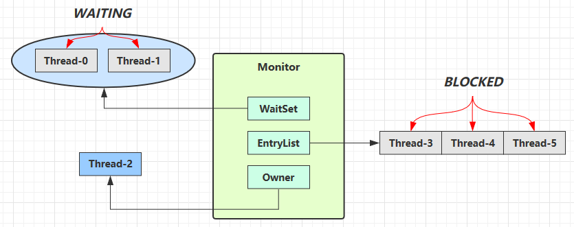
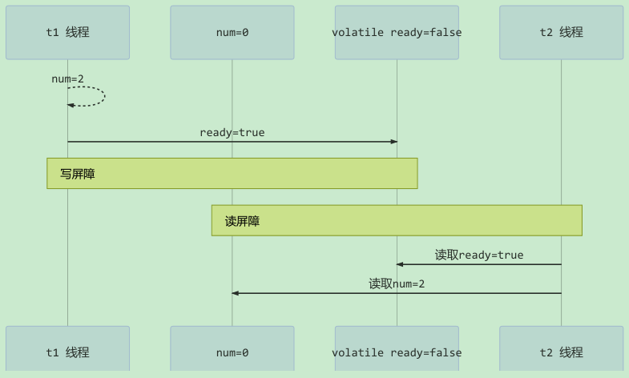

## 1. synchronized 原理

### 1.1. javap 反汇编源码后分析

先编写简单的示例代码如下：

```java
static final Object lock = new Object();
static int counter = 0;

public static void main(String[] args) {
    synchronized (lock) {
        counter++;
    }
}
```

使用 JDK 自带的一个反编译工具：`javap`，对字节码进行反汇编，查看字节码指令。在 DOS 命令行输入：

```bash
javap -p -v -c C:\code\target\classes\com\moon\synchronized_monitor\Increment.class
```

反汇编后对应的字节码如下：

```class
public static void main(java.lang.String[]);
    descriptor: ([Ljava/lang/String;)V
    flags: ACC_PUBLIC, ACC_STATIC
    Code:
        stack=2, locals=3, args_size=1
            0: getstatic #2     // <- lock引用 （synchronized开始）
            3: dup
            4: astore_1         // lock引用 -> slot 1
            5: monitorenter     // 将 lock对象 MarkWord 置为 Monitor 指针
            6: getstatic #3     // <- i
            9: iconst_1         // 准备常数 1
            10: iadd            // +1
            11: putstatic #3    // -> i
            14: aload_1         // <- lock引用
            15: monitorexit     // 将 lock对象 MarkWord 重置, 唤醒 EntryList
            16: goto 24
            19: astore_2        // e -> slot 2
            20: aload_1         // <- lock引用
            21: monitorexit     // 将 lock对象 MarkWord 重置, 唤醒 EntryList
            22: aload_2         // <- slot 2 (e)
            23: athrow          // throw e
            24: return
        Exception table:
            from to target  type
             6   16   19    any
             19  22   19    any
        LineNumberTable:
            line 8: 0
            line 9: 6
            line 10: 14
            line 11: 24
        LocalVariableTable:
            Start Length Slot Name   Signature
            0      25     0   args   s[Ljava/lang/String;
        StackMapTable: number_of_entries = 2
            frame_type = 255 /* full_frame */
                offset_delta = 19
                locals = [ class "[Ljava/lang/String;", class java/lang/Object ]
                stack = [ class java/lang/Throwable ]
            frame_type = 250 /* chop */
                offset_delta = 4
```

在执行同步代码块之前之后都有一个 `monitor***` 的指令，其中前面的是 monitorenter，后面的是 monitorexit，由此可知一个线程也执行同步代码块，首先要获取锁，而获取锁的过程就是 monitorenter，在执行完代码块之后，要释放锁，释放锁就是执行 monitorexit 指令

然后示例中出现两个 monitorexit 指令，这个主要是**防止在同步代码块中线程因异常退出，而锁没有得到释放，从而会造成死锁（等待的线程永远获取不到锁）**。因此最后一个 monitorexit 是保证在异常情况下，锁也可以得到释放，避免死锁。

仅有 ACC_SYNCHRONIZED 这么一个标志，该标记表明线程进入该方法时需要 monitorenter，退出该方法时需要 monitorexit。

> 注意：方法级别的 `synchronized` 不会在字节码指令中有所体现

#### 1.1.1. monitorenter

JVM 规范中对于 monitorenter 的描述：https://docs.oracle.com/javase/specs/jvms/se8/html/jvms-6.html#jvms-6.5.monitorenter

> Each object is associated with a monitor. A monitor is locked if and only if it has an owner. The thread that executes monitorenter attempts to gain ownership of the monitor associated with objectref, as follows:
>
> - Each object is associated with a monitor. A monitor is locked if and only if it has an owner. The thread that executes monitorenter attempts to gain ownership of the monitor associated with objectref, as follows:
> - If the thread already owns the monitor associated with objectref, it reenters the monitor, incrementing its entry count.
> - If another thread already owns the monitor associated with objectref, the thread blocks until the monitor's entry count is zero, then tries again to gain ownership.

翻译：每一个对象都会和一个监视器 monitor 关联。监视器被占用时会被锁住，其他线程无法来获取该 monitor。当 JVM 执行某个线程的某个方法内部的 monitorenter 时，它会尝试去获取当前对象对应的 monitor 的所有权。其过程如下：

1. 若 monitor 的进入数为 0，线程可以进入 monitor，并将 monitor 的进入数置为 1。当前线程成为 monitor 的 owner（所有者）
2. 若线程已拥有 monitor 的所有权，允许它重入 monitor，则进入 monitor 的进入数加 1
3. 若其他线程已经占有 monitor 的所有权，那么当前尝试获取monitor的所有权的线程会被阻塞，直到monitor的进入数变为0，才能重新尝试获取monitor的所有权。

小结：synchronized 的锁对象会关联一个 monitor，这个 monitor 是 JVM 的线程执行到这个同步代码块，发现锁对象没有就会创建 monitor，该内部有两个重要的成员变量 owner:拥有这把锁的线程，recursions 会记录线程拥有锁的次数，当一个线程拥有 monitor 后其他线程只能等待

#### 1.1.2. monitorexit

JVM 规范中对于 monitorexit 的描述：https://docs.oracle.com/javase/specs/jvms/se8/html/jvms-6.html#jvms-6.5.monitorexit

> The thread that executes monitorexit must be the owner of the monitor associated with the instance referenced by objectref.
>
> The thread decrements the entry count of the monitor associated with objectref. If as a result the value of the entry count is zero, the thread exits the monitor and is no longer its owner. Other threads that are blocking to enter the monitor are allowed to attempt to do so.

翻译：

1. 能执行 monitorexit 指令的线程一定是拥有当前对象的 monitor 的所有权的线程。
2. 执行 monitorexit 时会将 monitor 的进入数减 1。当 monitor 的进入数减为 0 时，当前线程退出 monitor，不再拥有 monitor 的所有权，此时其他被这个 monitor 阻塞的线程可以尝试去获取这个 monitor 的所有权

<font color=red>**monitorexit 插入在方法结束处和异常处，JVM 保证每个 monitorenter 必须有对应的 monitorexit，确保释放锁。**</font>

#### 1.1.3. 同步方法

https://docs.oracle.com/javase/specs/jvms/se8/html/jvms-2.html#jvms-2.11.10

可以看到同步方法在反汇编后，会增加 `ACC_SYNCHRONIZED` 修饰。会隐式调用 monitorenter 和 monitorexit。在执行同步方法前会调用 monitorenter，在执行完同步方法后会调用 monitorexit。

### 1.2. Monitor 监视器

Monitor 被翻译为监视器或管程，是由 JVM 提供，c++ 语言实现。Monitor 实现的锁属于<u>重量级锁</u>，里面涉及到了用户态和内核态的切换、进程的上下文切换，成本较高，性能比较低。

#### 1.2.1. Java 对象的布局

当一个线程尝试访问 `synchronized` 修饰的代码块时，它首先要获得锁，<font color=red>**这个锁是存在锁对象的对象头中的**</font>。

> Java 对象头相关内容详见[《JVM 基础笔记》笔记](/性能调优/JVM/JVM-基础)的相关章节

#### 1.2.2. Monitor 内部结构与监视流程分析

每个 Java 对象都可以关联一个 Monitor 对象，如果使用 `synchronized` 给对象上锁（重量级）之后，该对象头的 Mark Word 中就被设置指向 Monitor 对象的指针。



**Monitor 内部存储结构**：

- Owner：存储当前获取锁的线程，只能有一个线程可以获取
- EntryList：关联没有抢到锁，处于 Blocked 状态的线程
- WaitSet：关联调用了 wait 方法，处于 Waiting 状态的线程

**监视流程分析**：

- 刚开始 Monitor 中 Owner 为 null
- 当 Thread-2 执行 `synchronized(obj)` 代码块就会将 Monitor 的所有者 Owner 置为 Thread-2，Monitor 中只能有一个 Owner
- 在 Thread-2 上锁的过程中，如果 Thread-3，Thread-4，Thread-5 也来执行 `synchronized(obj)`，就会进入 EntryList BLOCKED
- Thread-2 执行完同步代码块的内容，然后唤醒 EntryList 中等待的线程来竞争锁，竞争的时是非公平的
- 而图上 WaitSet 中的 Thread-0，Thread-1 是之前获得过锁后，调用了 `wait()` 方法，进入 WAITING 状态的线程，<u>*详见 `wait-notify` 原理分析*</u>

> Tips: `synchronized` 必须是进入同一个对象的 monitor 才有上述的效果；如果不加 `synchronized` 的对象是不会关联监视器，不遵从以上规则。

### 1.3. synchronized 内部核心区域

在 synchronized 内部包括 ContentionList 、EntryList 、WaitSet、OnDeck、Owner、!Owner 这6个区域（核心组件），每个区域的数据都代表锁的不同状态。

- ContentionList：锁竞争队列，所有请求锁的线程都被放在竞争队列中。
- EntryList：竞争候选列表，在 ContentionList 中有资格成为候选者来竞争锁资源的线程被移动到了 EntryList 中。
- WaitSet：等待集合，调用 `wait` 方法后被阻塞的线程将被放在 WaitSet 中
- OnDeck：竞争候选者，在同一时刻最多只有一个线程在竞争锁资源，该线程的状态被称为 OnDeck。
- Owner：竞争到锁资源的线程被称为 Owner 状态线程。
- !Owner： 在 Owner 线程释放锁后，会从 Owner 的状态变成 !Owner。

### 1.4. synchronized 实现流程（待优化）

> TODO: 待后面深入学习时再优化具体的实现流程

1. synchronized 在收到新的锁请求时，首先让线程进行自旋，如果通过自旋也没有获取锁资源，则将被放入锁竞争队列 ContentionList 中。
2. JVM 每次从队列的尾部取出一个数据用于锁竞争候选者（OnDeck），但是并发情况下，为了防止锁竞争时 ContentionList 尾部的元素被大量的并发线程进行 CAS 访问而影响性能，Owner 线程会在释放锁资源时将 ContentionList 中的部分线程移动到 EntryList 中，并指定 EntryList 中的某个线程（一般是最先进入的线程）为 OnDeck 线程。
3. Owner 线程并没有直接把锁传递给 OnDeck 线程，而是把锁竞争的权利交给 OnDeck，让 OnDeck 线程重新竞争锁。在 Java 中把该行为称为“竞争切换”，该行为牺牲了公平性，但能极大的提升系统的吞吐量。
4. 此时获取到锁资源的 OnDeck 线程会变为 Owner 线程，而未获取到锁资源的线程仍然停留在 EntryList 中。如果 Owner 线程在被 `wait` 方法阻塞后，会被转移到 WaitSet 队列中，直到某个时刻被 `notify` 方法或者 `notifyAll` 方法唤醒，会再次进入 EntryList 中。
> Notes: 处在 ContentionList、EntryList、WaitSet 中的线程均为**阻塞状态**，该阻塞是由操作系统来完成的（在 Linux 内核下是采用 `pthread_mutex_lock` 内核函数实现的）。

Owner 线程在执行完毕后会释放锁的资源并变为 !Owner 状态，如下图：


在 synchronized 中，在线程进入 ContentionList 之前，等待的线程会先尝试以自旋的方式获取锁，如果获取不到就进入 ContentionList，该做法对于已经进入队列的线程是不公平的，因此 synchronized 是非公平锁。另外还有一个不公平的是，自旋获取锁的线程也可以直接抢占 OnDeck 线程的锁资源。

> 参考： https://blog.csdn.net/zqz_zqz/article/details/70233767

synchronized 是一个重量级操作，需要调用操作系统的相关接口，性能较低，给线程加锁的时间有可能超过获取锁后具体逻辑代码的操作时间。

JDK 1.6 对 synchronized 做了很多优化，引入了适应自旋、锁消除、锁粗化、轻量级锁及偏向锁等以提高锁的效率。锁可以从偏向锁升级到轻量级锁，再升级到重量级锁。这种升级过程叫作**锁膨胀**。在 JDK 1.6 中默认开启了偏向锁和轻量级锁，可以通过 `-XX:-UseBiasedLocking` 配置来禁用偏向锁。

### 1.5. 多线程中 synchronized 锁升级的原理

synchronized 锁升级原理：在锁对象的对象头里面有一个 threadid 字段，在第一次访问的时候 threadid 为空，jvm 让其持有偏向锁，并将 threadid 设置为其线程 id，再次进入的时候会先判断 threadid 是否与其线程 id 一致，如果一致则可以直接使用此锁对象，如果不一致，则升级偏向锁为轻量级锁，通过自旋循环一定次数来获取锁，执行一定次数之后，如果还没有正常获取到要使用的对象，此时就会把锁从轻量级升级为重量级锁，此过程就构成了 synchronized 锁的升级。

锁的升级的目的：为了减低了锁带来的性能消耗。在 Java 6 之后优化 `synchronized` 的实现方式，使用了偏向锁升级为轻量级锁再升级到重量级锁的方式，从而减低了锁带来的性能消耗。

### 1.6. 小结

`synchronized` 同步代码块的实现是通过 `monitorenter` 和 `monitorexit` 指令，其中 `monitorenter` 指令指向同步代码块的开始位置，`monitorexit` 指令则指明同步代码块的结束位置。当执行 `monitorenter` 指令时，线程试图获取锁也就是获取 monitor 的持有权（monitor 对象存在于每个 Java 对象的对象头中，`synchronized` 锁便是通过这种方式获取锁的，也是为什么 Java 中任意对象可以作为锁的原因）。
2.5. 其内部包含一个计数器，当计数器为 0 则可以成功获取，获取后将锁计数器设为 1 也就是加 1。相应的在执行 `monitorexit` 指令后，将锁计数器设为 0 ，表明锁被释放。如果获取对象锁失败，那当前线程就要阻塞等待，直到锁被另外一个线程释放为止。

`synchronized` 修饰的方法并没有 `monitorenter` 指令和 `monitorexit` 指令，取得代之的确实是 `ACC_SYNCHRONIZED` 标识，该标识指明了该方法是一个同步方法，JVM 通过该 `ACC_SYNCHRONIZED` 访问标志来辨别一个方法是否声明为同步方法，从而执行相应的同步调用。

## 2. wait/notify 原理


- Owner 线程发现条件不满足，调用 `wait` 方法，即可进入 WaitSet 变为 WAITING 状态
- BLOCKED 和 WAITING 的线程都处于阻塞状态，不占用 CPU 时间片
- BLOCKED 线程会在 Owner 线程释放锁时唤醒
- WAITING 线程会在 Owner 线程调用 `notify` 或 `notifyAll` 时唤醒，但唤醒后并不意味者立刻获得锁，仍需进入 EntryList 重新竞争

## 3. Thread 类 join 方法实现原理

JDK 源码

```java
public final synchronized void join(long millis)
throws InterruptedException {
    long base = System.currentTimeMillis();
    long now = 0;

    if (millis < 0) {
        throw new IllegalArgumentException("timeout value is negative");
    }

    if (millis == 0) {
        while (isAlive()) {
            wait(0);
        }
    } else {
        while (isAlive()) {
            long delay = millis - now;
            if (delay <= 0) {
                break;
            }
            wait(delay);
            now = System.currentTimeMillis() - base;
        }
    }
}
```

- 如果没有传入最大等待时间，就是让调用者（线路）轮询检查线程 `alive` 状态，如果存活则调用 `wait` 方法进行等待。
- 如传入最大等待时间，也会让调用者（线路）轮询检查线程 `alive` 状态，如果存活则会累加每次唤醒的时间是否超出最大等待时间，如超出则不再等待。

> `join` 方法就是体现了“保护性暂停”模式，详见[《并发编程-设计模式篇》笔记](/并发编程/并发编程-设计模式篇)

## 4. park / unpark 原理

每个线程都有自己的一个 Parker 对象，由`_counter`，`_cond`和`_mutex`三部分组成。有以下几种情况：


1. 当前线程调用 `Unsafe.park()` 方法
2. 检查 `_counter`，本情况为 0，这时，获得 `_mutex` 互斥锁
3. 线程进入 `_cond` 条件变量阻塞
4. 设置 `_counter = 0`


1. 调用 `Unsafe.unpark(Thread_0)` 方法，设置 `_counter` 为 1
2. 唤醒 `_cond` 条件变量中的 Thread_0
3. Thread_0 恢复运行
4. 设置 `_counter` 为 0


1. 调用 `Unsafe.unpark(Thread_0)` 方法，设置 `_counter` 为 1
2. 当前线程调用 `Unsafe.park()` 方法
3. 检查 `_counter`，本情况为 1，这时线程无需阻塞，继续运行
4. 设置 `_counter` 为 0

## 5. JDK 各类锁的实现原理

### 5.1. 轻量级锁

轻量级锁是 JDK 6 之中加入的新型锁机制，是相对于使用 monitor 的传统的“重量级”锁而言的。引入轻量级锁的目的是，在多线程交替执行同步块的情况下，尽量避免重量级锁引起的性能消耗，但是如果多个线程在同一时刻进入临界区，会导致轻量级锁膨胀升级重量级锁，所以需要注意，**轻量级锁并不是用来代替重量级锁的**。

如果当一个对象虽然有多线程要加锁，但加锁的时间是错开的（即没有竞争），那么可以使用轻量级锁来优化。使用**轻量级锁的好处**是：在多线程交替执行同步块的情况下，可以避免重量级锁引起的性能消耗。

轻量级锁对使用者是透明的，仍然使用 `synchronized` 关键字实现。

#### 5.1.1. 加锁流程

假设有两个方法同步块，利用同一个对象加锁，代码如下：

```java
static final Object obj = new Object();
public static void method1() {
    synchronized( obj ) {
        // 同步块 A
        method2();
    }
}
public static void method2() {
    synchronized( obj ) {
        // 同步块 B
    }
}
```

加锁流程如下：

- 创建锁记录（Lock Record）对象，每个线程都的栈帧都会包含一个锁记录的结构，内部可以存储锁定对象的 Mark Word


- 让锁记录中 Object reference 指向锁对象，并尝试用 cas 替换 Object 的 Mark Word，将 Mark Word 的值存入锁记录


- 如果 cas 替换成功，对象头中存储了 锁记录地址和状态 00 ，表示由该线程给对象加锁，这时图示如下


- 如果 cas 失败，有两种情况
    - 如果是其它线程已经持有了该 Object 的轻量级锁，这时表明有竞争，进入锁膨胀过程
    - 如果是自己执行了 `synchronized` 锁重入，那么再添加一条 Lock Record 作为重入的计数


- 当退出 `synchronized` 代码块（解锁时）如果有取值为 `null` 的锁记录，表示有重入，这时重置锁记录，表示重入计数减一


- 当退出 `synchronized` 代码块（解锁时）锁记录的值不为 `null`，这时使用 cas 将 Mark Word 的值恢复给对象头
    - 成功，则解锁成功
    - 失败，说明轻量级锁进行了锁膨胀或已经升级为重量级锁，进入重量级锁解锁流程

#### 5.1.2. 轻量级锁的释放

轻量级锁的释放也是通过CAS操作来进行的，主要步骤如下：

1. 取出在获取轻量级锁保存在 Displaced Mark Word 中的数据。
2. 用 CAS 操作将取出的数据替换当前对象的 Mark Word 中，如果成功，则说明释放锁成功。
3. 如果 CAS 操作替换失败，说明有其他线程尝试获取该锁，则需要将轻量级锁需要膨胀升级为重量级锁

对于轻量级锁，其性能提升的依据是“对于绝大部分的锁，在整个生命周期内都是不会存在竞争的”，如果打破这个依据则除了互斥的开销外，还有额外的 CAS 操作，因此在有多线程竞争的情况下，轻量级锁比重量级锁更慢。

#### 5.1.3. 轻量级锁原理

当关闭偏向锁功能或者多个线程竞争偏向锁导致偏向锁升级为轻量级锁，则会尝试获取轻量级锁，其步骤如下：

1. 判断当前对象是否处于无锁状态（hashcode、0、01），如果是，则 JVM 首先将在当前线程的栈帧中建立一个名为锁记录（Lock Record）的空间，用于存储锁对象目前的 Mark Word 的拷贝（官方把这份拷贝加了一个 Displaced 前缀，即 Displaced Mark Word），将对象的 Mark Word 复制到栈帧中的 Lock Record 中，将 Lock Reocrd 中的 owner 指向当前对象。
2. JVM 利用 CAS 操作尝试将对象的 Mark Word 更新为指向 Lock Record 的指针，如果成功表示竞争到锁，则将锁标志位变成 00，执行同步操作。
3. 如果失败则判断当前对象的 Mark Word 是否指向当前线程的栈帧，如果是则表示当前线程已经持有当前对象的锁，则直接执行同步代码块；否则只能说明该锁对象已经被其他线程抢占了，这时轻量级锁需要膨胀为重量级锁，锁标志位变成 10，后面等待的线程将会进入阻塞状态。

  

### 5.2. 锁膨胀

如果在尝试加轻量级锁的过程中，CAS 操作无法成功，这时一种情况就是有其它线程为此对象加上了轻量级锁（有竞争），这时需要进行**锁膨胀，将轻量级锁变为重量级锁**。

```java
static Object obj = new Object();
public static void method1() {
    synchronized( obj ) {
        // 同步块
    }
}
```

- 当 Thread-1 进行轻量级加锁时，Thread-0 已经对该对象加了轻量级锁


- 此时 Thread-1 加轻量级锁失败，进入锁膨胀流程。即为 `Object` 对象申请 Monitor 锁，让 `Object` 指向重量级锁地址。然后自己进入 Monitor 的 EntryList BLOCKED


- 当 Thread-0 退出同步块解锁时，使用 cas 将 Mark Word 的值恢复给对象头，失败。这时会进入重量级解锁流程，即按照 Monitor 地址找到 Monitor 对象，设置 Owner 为 null，唤醒 EntryList 中 BLOCKED 线程

### 5.3. 自旋锁

重量级锁竞争的时候，还可以使用自旋来进行优化，如果当前线程自旋成功（即这时候持锁线程已经退出了同步块，释放了锁），这时当前线程就可以避免阻塞。

**自旋注意事项**：

- 自旋会占用 CPU 时间，单核 CPU 自旋就是浪费，多核 CPU 自旋才能发挥优势。
- 在 Java 6 之后自旋锁是自适应的，比如对象刚刚的一次自旋操作成功过，那么认为这次自旋成功的可能性会高，就多自旋几次；反之，就少自旋甚至不自旋。
- Java 7 之后不能控制是否开启自旋功能

#### 5.3.1. 自旋锁原理

monitor 实现锁的时候，会阻塞和唤醒线程，线程频繁的阻塞和唤醒需要 CPU 从用户态转为核心态，这些操作给系统的并发性能带来了很大的压力。同时在大数应用中，共享数据的锁定状态只会持续很短的一段时间，为了这段时间阻塞和唤醒线程并不值得。如果物理机器有一个以上的处理器，能让两个或以上的线程同时并行执行，就可以让后面请求锁的那些线程“稍等一下”，但不放弃处理器的执行时间，看看持有锁的线程是否很快就会释放锁。为了让线程等待，只需让线程执行一个循环(自旋)，这项技术就是**自旋锁**。

自旋锁在 JDK 1.4.2 中就已经引入，只不过默认是关闭的，可以使用 `-XX:+UseSpinning` 参数来开启，在**JDK 6 中改为默认开启**了。自旋等待不能代替阻塞，且先不说对处理器数量的要求，自旋等待本身虽然避免了线程切换的开销，但它是要占用处理器时间的。因此，如果锁被占用的时间很短，自旋等待的效果就会非常好，反之，如果锁被占用的时间很长。那么自旋的线程只会白白消耗处理器资源，而不会做任何有用的工作，反而会带来性能上的浪费。因此，自旋等待的时间必须要有一定的限度，如果自旋超过了限定的次数仍然没有成功获得锁，就应当使用传统的方式去挂起线程了。自旋次数的默认值是 10 次，用户可以使用参数 `-XX:PreBlockSpin` 来更改。

#### 5.3.2. 自旋锁对象头示例

自旋重试成功的情况


自旋重试失败的情况


#### 5.3.3. 适应性自旋锁

在 JDK 6 中引入了自适应的自旋锁。自适应意味着自旋的时间不再固定了，而是由前一次在同一个锁上的自旋时间及锁的拥有者的状态来决定。如果在同一个锁对象上，自旋等待刚刚成功获得过锁，并且持有锁的线程正在运行中，那么虚拟机就会认为这次自旋也很有可能再次成功，进而它将允许自旋等待持续相对更长的时间，比如100次循环。另外，如果对于某个锁，自旋很少成功获得过，那在以后要获取这个锁时将可能省略掉自旋过程，以避免浪费处理器资源。

有了自适应自旋，随着程序运行和性能监控信息的不断完善，虚拟机对程序锁的状况预测就会越来越准确。

### 5.4. 偏向锁

在大多数情况下，锁不仅不存在多线程竞争，而且总是由同一线程多次获得。如轻量级锁在没有竞争时（就自己这个线程），每次重入仍然需要执行 CAS 操作。为了让线程获得锁的代价更低，在 JDK 6 中引进了**偏向锁**。

偏向锁会偏向于第一个获得它的线程，只有第一次使用 CAS，并将线程 ID 设置到对象头（Mark Word）进行存储，以后该线程进入和退出同步块时只需要检查是否为偏向锁、锁标志位以及 ThreadID 即可。若发现线程 ID 是自己本身，则表示当前锁没有竞争，不需要重新 CAS，从而提高性能。

值得注意的是：一旦出现多个线程竞争时必须撤销偏向锁，所以撤销偏向锁消耗的性能必须小于之前节省下来的CAS原子操作的性能消耗，否则性能可能会更低。

#### 5.4.1. 偏向锁的原理

```java
static final Object obj = new Object();
public static void m1() {
    synchronized( obj ) {
        // 同步块 A
        m2();
    }
}
public static void m2() {
    synchronized( obj ) {
        // 同步块 B
        m3();
    }
}
public static void m3() {
    synchronized( obj ) {
        // 同步块 C
    }
}
```


当线程第一次访问同步块并获取锁时，偏向锁处理流程如下：

1. 虚拟机将会把对象头中的标志位设为“01”，即偏向模式。
2. 同时使用 CAS 操作把获取到这个锁的线程的 ID 记录在对象的 Mark Word 之中 ，如果 CAS 操作成功，持有偏向锁的线程以后每次进入这个锁相关的同步块时，虚拟机都可以不再进行任何同步操作，偏向锁的效率高。


持有偏向锁的线程以后每次进入这个锁相关的同步块时，虚拟机都可以不再进行任何同步操作，偏向锁的效率高。

#### 5.4.2. 偏向状态

> 参考前面章节中所说的对象头的格式

一个对象创建时：如果开启了偏向锁（默认开启），那么对象创建后，markword 值为 0x05 即最后 3 位为 101，这时它的 thread、epoch、age 都为 0；如果没有开启偏向锁，那么对象创建后，markword 值为 0x01 即最后 3 位为 001，这时它的 hashcode、age 都为 0，第一次用到 hashcode 时才会赋值。

偏向锁是默认是延迟的，不会在程序启动时立即生效，如果想避免延迟，可以加 VM 参数 `-XX:BiasedLockingStartupDelay=0` 来禁用延迟。

以下测试延迟特性，利用 jol 第三方工具来查看对象头信息

```xml
<!-- jol 第三方工具用于查看对象头信息 https://mvnrepository.com/artifact/org.openjdk.jol/jol-core -->
<dependency>
    <groupId>org.openjdk.jol</groupId>
    <artifactId>jol-core</artifactId>
    <version>0.16</version>
    <scope>provided</scope>
</dependency>
```

创建用于测试的实体类

```java
class Dog {}
```

##### 5.4.2.1. 测试偏向锁

```java
/**
 * 测试偏向锁，使用与禁用不同的效果
 * 1. 添加虚拟机参数 `-XX:BiasedLockingStartupDelay=0` 禁用偏向锁延迟生效
 * 2. 添加虚拟机参数 `-XX:-UseBiasedLocking` 禁用偏向锁
 */
public static void main(String[] args) throws Exception {
    Dog d = new Dog();
    ClassLayout classLayout = ClassLayout.parseInstance(d);

    new Thread(() -> {
        log.debug("synchronized 前");
        System.out.println(classLayout.toPrintable());
        synchronized (d) {
            log.debug("synchronized 中");
            System.out.println(classLayout.toPrintable());
        }
        log.debug("synchronized 后");
        System.out.println(classLayout.toPrintable());
    }, "T1").start();
}
```

设置用偏向锁延迟生效


输出结果

```
2023-01-22 09:50:05.679 [T1] DEBUG com.moon.concurrent.lock.BiasLock - synchronized 前
com.moon.concurrent.lock.Dog object internals:
OFF  SZ   TYPE DESCRIPTION               VALUE
  0   8        (object header: mark)     0x0000000000000005 (biasable; age: 0)
  8   4        (object header: class)    0xf8019b77
 12   4        (object alignment gap)    
Instance size: 16 bytes
Space losses: 0 bytes internal + 4 bytes external = 4 bytes total

2023-01-22 09:50:05.684 [T1] DEBUG com.moon.concurrent.lock.BiasLock - synchronized 中
com.moon.concurrent.lock.Dog object internals:
OFF  SZ   TYPE DESCRIPTION               VALUE
  0   8        (object header: mark)     0x000001ab7c851005 (biased: 0x000000006adf2144; epoch: 0; age: 0)
  8   4        (object header: class)    0xf8019b77
 12   4        (object alignment gap)    
Instance size: 16 bytes
Space losses: 0 bytes internal + 4 bytes external = 4 bytes total

2023-01-22 09:50:05.685 [T1] DEBUG com.moon.concurrent.lock.BiasLock - synchronized 后
com.moon.concurrent.lock.Dog object internals:
OFF  SZ   TYPE DESCRIPTION               VALUE
  0   8        (object header: mark)     0x000001ab7c851005 (biased: 0x000000006adf2144; epoch: 0; age: 0)
  8   4        (object header: class)    0xf8019b77
 12   4        (object alignment gap)    
Instance size: 16 bytes
Space losses: 0 bytes internal + 4 bytes external = 4 bytes total
```

**结论**：处于偏向锁的对象解锁后，线程 id 仍存储于对象头中

##### 5.4.2.2. 测试禁用偏向锁

基于前面测试代码，运行时在添加 VM 参数 `-XX:-UseBiasedLocking` 禁用偏向锁


运行结果：

```
2023-01-22 09:59:05.189 [T1] DEBUG com.moon.concurrent.lock.BiasLock - synchronized 前
com.moon.concurrent.lock.Dog object internals:
OFF  SZ   TYPE DESCRIPTION               VALUE
  0   8        (object header: mark)     0x0000000000000001 (non-biasable; age: 0)
  8   4        (object header: class)    0xf8019b77
 12   4        (object alignment gap)    
Instance size: 16 bytes
Space losses: 0 bytes internal + 4 bytes external = 4 bytes total

2023-01-22 09:59:05.194 [T1] DEBUG com.moon.concurrent.lock.BiasLock - synchronized 中
com.moon.concurrent.lock.Dog object internals:
OFF  SZ   TYPE DESCRIPTION               VALUE
  0   8        (object header: mark)     0x000000dd3fefeff8 (thin lock: 0x000000dd3fefeff8)
  8   4        (object header: class)    0xf8019b77
 12   4        (object alignment gap)    
Instance size: 16 bytes
Space losses: 0 bytes internal + 4 bytes external = 4 bytes total

2023-01-22 09:59:05.195 [T1] DEBUG com.moon.concurrent.lock.BiasLock - synchronized 后
com.moon.concurrent.lock.Dog object internals:
OFF  SZ   TYPE DESCRIPTION               VALUE
  0   8        (object header: mark)     0x0000000000000001 (non-biasable; age: 0)
  8   4        (object header: class)    0xf8019b77
 12   4        (object alignment gap)    
Instance size: 16 bytes
Space losses: 0 bytes internal + 4 bytes external = 4 bytes total
```

**结论**：禁用偏向锁后，使用轻量级锁

#### 5.4.3. 偏向锁撤销

1. 偏向锁的撤销动作必须等待全局安全点
2. 暂停拥有偏向锁的线程，判断锁对象是否处于被锁定状态
3. 撤销偏向锁，恢复到无锁（标志位为 01）或轻量级锁（标志位为 00）的状态

以下情况会导致偏向锁的撤销

##### 5.4.3.1. 调用对象 hashCode

正常状态对象一开始是没有 hashCode 的，第一次调用才生成。但偏向锁的对象 MarkWord 中存储的是线程 id，如果调用 hashCode 方法会导致偏向锁被撤销，此时会出现：

- 轻量级锁会在锁记录中记录 hashCode
- 重量级锁会在 Monitor 中记录 hashCode

测试调用 hashCode 后使用偏向锁。（检查程序是否有设置 `-XX:-UseBiasedLocking`，有则移除）。测试结果如下：

```
2023-01-22 10:15:28.333 [main] DEBUG com.moon.concurrent.lock.BiasLock - 调用对象的hashCode: 2131670196
2023-01-22 10:15:28.338 [T1] DEBUG com.moon.concurrent.lock.BiasLock - synchronized 前
com.moon.concurrent.lock.Dog object internals:
OFF  SZ   TYPE DESCRIPTION               VALUE
  0   8        (object header: mark)     0x0000007f0eb4b401 (hash: 0x7f0eb4b4; age: 0)
  8   4        (object header: class)    0xf8019b77
 12   4        (object alignment gap)    
Instance size: 16 bytes
Space losses: 0 bytes internal + 4 bytes external = 4 bytes total

2023-01-22 10:15:28.341 [T1] DEBUG com.moon.concurrent.lock.BiasLock - synchronized 中
com.moon.concurrent.lock.Dog object internals:
OFF  SZ   TYPE DESCRIPTION               VALUE
  0   8        (object header: mark)     0x00000099156ff398 (thin lock: 0x00000099156ff398)
  8   4        (object header: class)    0xf8019b77
 12   4        (object alignment gap)    
Instance size: 16 bytes
Space losses: 0 bytes internal + 4 bytes external = 4 bytes total

2023-01-22 10:15:28.342 [T1] DEBUG com.moon.concurrent.lock.BiasLock - synchronized 后
com.moon.concurrent.lock.Dog object internals:
OFF  SZ   TYPE DESCRIPTION               VALUE
  0   8        (object header: mark)     0x0000007f0eb4b401 (hash: 0x7f0eb4b4; age: 0)
  8   4        (object header: class)    0xf8019b77
 12   4        (object alignment gap)    
Instance size: 16 bytes
Space losses: 0 bytes internal + 4 bytes external = 4 bytes total
```

##### 5.4.3.2. 其它线程使用对象

当有其它线程使用偏向锁对象时，会将偏向锁升级为轻量级锁

```java
public static void main(String[] args) throws Exception {
    Dog d = new Dog();
    Thread t1 = new Thread(() -> {
        synchronized (d) {
            log.debug(ClassLayout.parseInstance(d).toPrintable());
        }
        synchronized (BiasLock.class) {
            BiasLock.class.notify();
        }

        // 如果不用 wait/notify 使用 join 必须打开下面的注释
        // 因为：t1 线程不能结束，否则底层线程可能被 jvm 重用作为 t2 线程，底层线程 id 是一样的
        /*try {
            System.in.read();
        } catch (IOException e) {
            e.printStackTrace();
        }*/
    }, "t1");
    t1.start();

    Thread t2 = new Thread(() -> {
        synchronized (BiasLock.class) {
            try {
                BiasLock.class.wait();
            } catch (InterruptedException e) {
                e.printStackTrace();
            }
        }
        log.debug(ClassLayout.parseInstance(d).toPrintable());
        synchronized (d) {
            log.debug(ClassLayout.parseInstance(d).toPrintable());
        }
        log.debug(ClassLayout.parseInstance(d).toPrintable());
    }, "t2");
    t2.start();
}
```

##### 5.4.3.3. 调用 wait/notify

```java
public static void main(String[] args) throws Exception {
    Dog d = new Dog();

    new Thread(() -> {
        log.debug(ClassLayout.parseInstance(d).toPrintable());
        synchronized (d) {
            log.debug(ClassLayout.parseInstance(d).toPrintable());
            try {
                d.wait();
            } catch (InterruptedException e) {
                e.printStackTrace();
            }
            log.debug(ClassLayout.parseInstance(d).toPrintable());
        }
    }, "t1").start();

    new Thread(() -> {
        try {
            Thread.sleep(6000);
        } catch (InterruptedException e) {
            e.printStackTrace();
        }
        synchronized (d) {
            log.debug("t2 notify");
            d.notify();
        }
    }, "t2").start();
}
```

测试结果：

```
2023-01-22 11:47:42.614 [t1] DEBUG com.moon.concurrent.lock.BiasLock - com.moon.concurrent.lock.Dog object internals:
OFF  SZ   TYPE DESCRIPTION               VALUE
  0   8        (object header: mark)     0x0000000000000005 (biasable; age: 0)
  8   4        (object header: class)    0xf8019b77
 12   4        (object alignment gap)    
Instance size: 16 bytes
Space losses: 0 bytes internal + 4 bytes external = 4 bytes total

2023-01-22 11:47:42.617 [t1] DEBUG com.moon.concurrent.lock.BiasLock - com.moon.concurrent.lock.Dog object internals:
OFF  SZ   TYPE DESCRIPTION               VALUE
  0   8        (object header: mark)     0x0000020b26f73005 (biased: 0x0000000082c9bdcc; epoch: 0; age: 0)
  8   4        (object header: class)    0xf8019b77
 12   4        (object alignment gap)    
Instance size: 16 bytes
Space losses: 0 bytes internal + 4 bytes external = 4 bytes total

2023-01-22 11:47:46.813 [t2] DEBUG com.moon.concurrent.lock.BiasLock - t2 notify
2023-01-22 11:47:46.815 [t1] DEBUG com.moon.concurrent.lock.BiasLock - com.moon.concurrent.lock.Dog object internals:
OFF  SZ   TYPE DESCRIPTION               VALUE
  0   8        (object header: mark)     0x0000020b26ebab5a (fat lock: 0x0000020b26ebab5a)
  8   4        (object header: class)    0xf8019b77
 12   4        (object alignment gap)    
Instance size: 16 bytes
Space losses: 0 bytes internal + 4 bytes external = 4 bytes total
```

#### 5.4.4. 批量重偏向

如果对象虽然被多个线程访问，但没有竞争，这时偏向了线程 T1 的对象仍有机会重新偏向 T2，重偏向会重置对象的 Thread ID。

当撤销偏向锁阈值超过 20 次后，jvm 就判断会在给这些对象加锁时重新偏向至加锁线程。

```java
public static void main(String[] args) throws Exception {
    Vector<Dog> list = new Vector<>();

    new Thread(() -> {
        for (int i = 0; i < 30; i++) {
            Dog d = new Dog();
            list.add(d);
            synchronized (d) {
                log.debug(i + "\t" + ClassLayout.parseInstance(d).toPrintable());
            }
        }
        synchronized (list) {
            list.notify();
        }
    }, "t1").start();

    new Thread(() -> {
        synchronized (list) {
            try {
                list.wait();
            } catch (InterruptedException e) {
                e.printStackTrace();
            }
        }
        log.debug("===============> ");
        for (int i = 0; i < 30; i++) {
            Dog d = list.get(i);
            log.debug(i + "\t" + ClassLayout.parseInstance(d).toPrintable());
            synchronized (d) {
                log.debug(i + "\t" + ClassLayout.parseInstance(d).toPrintable());
            }
            log.debug(i + "\t" + ClassLayout.parseInstance(d).toPrintable());
        }
    }, "t2").start();
}
```

```
......省略

2023-01-22 12:20:51.353 [t2] DEBUG com.moon.concurrent.lock.BiasLock - 18	com.moon.concurrent.lock.Dog object internals:
OFF  SZ   TYPE DESCRIPTION               VALUE
  0   8        (object header: mark)     0x000001f6a435e805 (biased: 0x000000007da90d7a; epoch: 0; age: 0)
  8   4        (object header: class)    0xf8019b77
 12   4        (object alignment gap)    
Instance size: 16 bytes
Space losses: 0 bytes internal + 4 bytes external = 4 bytes total

2023-01-22 12:20:51.353 [t2] DEBUG com.moon.concurrent.lock.BiasLock - 18	com.moon.concurrent.lock.Dog object internals:
OFF  SZ   TYPE DESCRIPTION               VALUE
  0   8        (object header: mark)     0x00000050c02ff550 (thin lock: 0x00000050c02ff550)
  8   4        (object header: class)    0xf8019b77
 12   4        (object alignment gap)    
Instance size: 16 bytes
Space losses: 0 bytes internal + 4 bytes external = 4 bytes total

2023-01-22 12:20:51.354 [t2] DEBUG com.moon.concurrent.lock.BiasLock - 18	com.moon.concurrent.lock.Dog object internals:
OFF  SZ   TYPE DESCRIPTION               VALUE
  0   8        (object header: mark)     0x0000000000000001 (non-biasable; age: 0)
  8   4        (object header: class)    0xf8019b77
 12   4        (object alignment gap)    
Instance size: 16 bytes
Space losses: 0 bytes internal + 4 bytes external = 4 bytes total

2023-01-22 12:20:51.354 [t2] DEBUG com.moon.concurrent.lock.BiasLock - 19	com.moon.concurrent.lock.Dog object internals:
OFF  SZ   TYPE DESCRIPTION               VALUE
  0   8        (object header: mark)     0x000001f6a435e805 (biased: 0x000000007da90d7a; epoch: 0; age: 0)
  8   4        (object header: class)    0xf8019b77
 12   4        (object alignment gap)    
Instance size: 16 bytes
Space losses: 0 bytes internal + 4 bytes external = 4 bytes total

2023-01-22 12:20:51.355 [t2] DEBUG com.moon.concurrent.lock.BiasLock - 19	com.moon.concurrent.lock.Dog object internals:
OFF  SZ   TYPE DESCRIPTION               VALUE
  0   8        (object header: mark)     0x000001f6a4368905 (biased: 0x000000007da90da2; epoch: 0; age: 0)
  8   4        (object header: class)    0xf8019b77
 12   4        (object alignment gap)    
Instance size: 16 bytes
Space losses: 0 bytes internal + 4 bytes external = 4 bytes total

2023-01-22 12:20:51.355 [t2] DEBUG com.moon.concurrent.lock.BiasLock - 19	com.moon.concurrent.lock.Dog object internals:
OFF  SZ   TYPE DESCRIPTION               VALUE
  0   8        (object header: mark)     0x000001f6a4368905 (biased: 0x000000007da90da2; epoch: 0; age: 0)
  8   4        (object header: class)    0xf8019b77
 12   4        (object alignment gap)    
Instance size: 16 bytes
Space losses: 0 bytes internal + 4 bytes external = 4 bytes total

......省略
```

#### 5.4.5. 批量撤销

当撤销偏向锁阈值超过 40 次后，jvm 会判断不该使用偏向锁。于是整个类的所有对象都会变为不可偏向的，新建的对象也是不可偏向的

```java
static Thread t1, t2, t3;

public static void main(String[] args) throws Exception {
    Vector<Dog> list = new Vector<>();

    int loopNumber = 39;
    t1 = new Thread(() -> {
        for (int i = 0; i < loopNumber; i++) {
            Dog d = new Dog();
            list.add(d);
            synchronized (d) {
                log.debug(i + "\t" + ClassLayout.parseInstance(d).toPrintable());
            }
        }
        LockSupport.unpark(t2);
    }, "t1");
    t1.start();

    t2 = new Thread(() -> {
        LockSupport.park();
        log.debug("===============> ");
        for (int i = 0; i < loopNumber; i++) {
            Dog d = list.get(i);
            log.debug(i + "\t" + ClassLayout.parseInstance(d).toPrintable());
            synchronized (d) {
                log.debug(i + "\t" + ClassLayout.parseInstance(d).toPrintable());
            }
            log.debug(i + "\t" + ClassLayout.parseInstance(d).toPrintable());
        }
        LockSupport.unpark(t3);
    }, "t2");
    t2.start();

    t3 = new Thread(() -> {
        LockSupport.park();
        log.debug("===============> ");
        for (int i = 0; i < loopNumber; i++) {
            Dog d = list.get(i);
            log.debug(i + "\t" + ClassLayout.parseInstance(d).toPrintable());
            synchronized (d) {
                log.debug(i + "\t" + ClassLayout.parseInstance(d).toPrintable());
            }
            log.debug(i + "\t" + ClassLayout.parseInstance(d).toPrintable());
        }
    }, "t3");
    t3.start();

    t3.join();
    log.debug(ClassLayout.parseInstance(new Dog()).toPrintable());
}
```

> 参考资料
>
> - [死磕Synchronized底层实现--概论](https://github.com/farmerjohngit/myblog/issues/12)
> - [盘一盘 synchronized （一）—— 从打印Java对象头说起](https://www.cnblogs.com/LemonFive/p/11246086.html)
> - [盘一盘 synchronized （二）—— 偏向锁批量重偏向与批量撤销](https://www.cnblogs.com/LemonFive/p/11248248.html)
> - [偏向锁论文（英文）](https://www.oracle.com/technetwork/java/biasedlocking-oopsla2006-wp-149958.pdf)

#### 5.4.6. 小结

偏向锁好处是在只有一个线程执行同步块时进一步提高性能，适用于一个线程反复获得同一锁的情况。偏向锁可以提高带有同步但无竞争的程序性能。它同样是一个带有效益权衡性质的优化，也就是说，它并不一定总是对程序运行有利，如果程序中大多数的锁总是被多个不同的线程访问比如线程池，那偏向模式就是多余的。

### 5.5. 锁消除

#### 5.5.1. 概述

**锁消除**是指虚拟机即时编译器（JIT）在运行时，对一些代码上要求同步，但是被检测到不可能存在共享数据竞争的锁进行消除。锁消除的主要判定依据来源于逃逸分析的数据支持，如果判断在一段代码中，堆上的所有数据都不会逃逸出去从而被其他线程访问到，那就可以把它们当做栈上数据对待，认为它们是线程私有的，同步加锁自然就无须进行。

变量是否逃逸，对于虚拟机来说需要使用数据流分析来确定，同步的代码在 Java 程序中的普遍存在。下面这段非常简单的代码仅仅是输出3个字符串相加的结果，无论是源码字面上还是程序语义上都没有同步。

```java
public class Demo {
    public static void main(String[] args) {
        contactString("aa", "bb", "cc");
    }

    public static String contactString(String s1, String s2, String s3) {
        return new StringBuffer().append(s1).append(s2).append(s3).toString();
    }
}
```

`StringBuffer` 的 `append()` 是一个同步方法，锁就是 `this` 也就是 `new StringBuilder()`。虚拟机发现它的动态作用域被限制在 `concatString()` 方法内部。`new StringBuilder()`对象的引用永远不会“逃逸”到 `concatString()` 方法之外，其他线程无法访问到它，因此，虽然这里有锁，但是可以被安全地消除掉，在即时编译之后，这段代码就会忽略掉所有的同步而直接执行了。

#### 5.5.2. 测试

```java
@Fork(1)
@BenchmarkMode(Mode.AverageTime)
@Warmup(iterations = 3)
@Measurement(iterations = 5)
@OutputTimeUnit(TimeUnit.NANOSECONDS)
public class MyBenchmark {

    static int x = 0;

    @Benchmark
    public void a() throws Exception {
        x++;
    }

    @Benchmark
    public void b() throws Exception {
        Object o = new Object();
        synchronized (o) {
            x++;
        }
    }
}
```

运行测试

```bash
java -jar benchmarks.jar
```

```
Benchmark            Mode    Samples    Score    Score error    Units
c.i.MyBenchmark.a    avgt        5      1.542         0.056     ns/op
c.i.MyBenchmark.b    avgt        5      1.518         0.091     ns/op
```

```bash
java -XX:-EliminateLocks -jar benchmarks.jar
```

```
Benchmark            Mode    Samples    Score    Score error    Units
c.i.MyBenchmark.a    avgt        5      1.507         0.108     ns/op
c.i.MyBenchmark.b    avgt        5     16.976         1.572     ns/op
```

### 5.6. 锁粗化

对相同对象多次加锁，导致线程发生多次重入，可以使用锁粗化方式来优化，这不同于之前讲的细分锁的粒度。

大部分情况下推荐，在编写代码的时候推荐将同步块的作用范围限制得尽量小，只在共享数据的实际作用域中才进行同步，这样是为了使得需要同步的操作数量尽可能变小，如果存在锁竞争，那等待锁的线程也能尽快拿到锁。但是如果一系列的连续操作都对同一个对象反复加锁和解锁，甚至加锁操作是出现在循环体中的，那即使没有线程竞争，频繁地进行互斥同步操作也会导致不必要的性能损耗。此时 JVM 会探测到这一连串细小的操作都使用同一个对象加锁，将同步代码块的范围放大，放到这串操作的外面，这样只需要加一次锁即可。

例如 StringBuffer，它是一个线程安全的类，其 `append` 同步方法会经常被调用，即意味着要进行反复的加锁->解锁，导致 Java 虚拟机在这条线程上要反复地在内核态和用户态之间进行切换。因此 JVM 会将多次`append`方法调用的代码进行一个锁粗化的操作，将多次的`append`的操作扩展到 `append` 方法的头尾，变成一个大的同步块，这样就减少了加锁->解锁的次数，有效地提升了代码执行的效率。

```java
public class Demo {
    public static void main(String[] args) {
        StringBuffer sb = new StringBuffer();
    
        for (int i = 0; i < 100; i++) {
            sb.append("aa");
        }
    
        System.out.println(sb.toString());
    }
}
```

## 6. volatile 原理

### 6.1. 线程可见性的实现流程

访问 `volatile` 变量时不会执行加锁操作，也就不会执行线程阻塞，因此 `volatile` 变量是一种比 `synchronized` 关键字更轻量级的同步机制。`volatile` 主要适用于一个变量被多个线程共享，多个线程均可针对这个变量执行赋值或者读取的操作。

在有多个线程对普通变量进行读写时，每个线程都首先需要将数据从内存中复制变量到 CPU 缓存中，如果计算机有多个 CPU，则线程可能都在不同的 CPU 中被处理，这意味着每个线程都需要将同一个数据复制到不同的 CPU Cache 中，这样在每个线程都针对同一个变量的数据做了不同的处理后就可能存在数据不一致的情况。具体的多线程读写流如下：


**缓存一致性协议**：当 CPU 写数据时，如果发现操作的变量是共享变量，即在其他 CPU 中也存在该变量的副本，会发出信号通知其他 CPU 将该变量的缓存行置为无效状态，因此当其他 CPU 需要读取这个变量时，就会从内存重新读取。

如果将变量声明为 volatile，JVM 会向处理器发送一条 `LOCK` 前缀的指令，将该变量所在缓存行的数据写回系统内存。由于缓存一致性协议，每个处理器通过嗅探在总线上传播的数据来检查自己的缓存是不是过期了，当处理器发现自己缓存行对应的内存地址被修改，就会将当前处理器的缓存行置为无效状态，当处理器对这个数据进行修改操作的时候，会重新从系统内存中把数据读到处理器缓存中。这样就保证每次读取变量时都直接从内存中读取，跳过 CPU Cache 这一步，有效解决了多线程数据同步的问题。具体的流程如下：


值得注意的是：`volatile` 关键字可以严格保障变量的单次读、写操作的原子性，但并不能保证像 `i++` 这种操作的原子性，因为 `i++` 在本质上是读、写两次操作。`volatile` 在某些特殊场景下可以代替 `synchronized`。比如，必须同时满足下面两个条件才能保证并发环境的线程安全：

- 对变量的写操作不依赖于当前值（比如`i++`），或者说是单纯的变量赋值（`boolean flag=true`）
- 该变量没有被包含在具有其他变量的不变式中，也就是说在不同的 `volatile` 变量之间不能互相依赖，只有在状态真正独立于程序内的其他内容时才能使用 `volatile`

### 6.2. 内存屏障

volatile 的底层实现原理是内存屏障，Memory Barrier（Memory Fence）。Java 编译器会在生成指令系列时在适当的位置会插入『内存屏障』指令来禁止处理器重排序。插入一个内存屏障，相当于告诉 CPU 和编译器先于这个命令的必须先执行，后于这个命令的必须后执行。

- 对 volatile 变量的写指令后会加入写屏障，相当于这个指令会把之前的写入值都刷新到内存。
- 对 volatile 变量的读指令前会加入读屏障

### 6.3. 如何保证可见性

写屏障（sfence）保证在该屏障之前的，对共享变量的改动，都同步到主存当中

```java
public void actor2(I_Result r) {
    num = 2;
    ready = true; // ready 是 volatile 赋值带写屏障
    // 写屏障
}
```

读屏障（lfence）保证在该屏障之后，对共享变量的读取，加载的是主存中最新数据

```java
public void actor1(I_Result r) {
    // 读屏障
    // ready 是 volatile 读取值带读屏障
    if(ready) {
        r.r1 = num + num;
    } else {
        r.r1 = 1;
    }
}
```



### 6.4. 如何保证有序性

写屏障会确保指令重排序时，不会将写屏障之前的代码排在写屏障之后

```java
public void actor2(I_Result r) {
    num = 2;
    ready = true; // ready 是 volatile 赋值带写屏障
    // 写屏障
}
```

读屏障会确保指令重排序时，不会将读屏障之后的代码排在读屏障之前

```java
public void actor1(I_Result r) {
    // 读屏障
    // ready 是 volatile 读取值带读屏障
    if(ready) {
        r.r1 = num + num;
    } else {
        r.r1 = 1;
    }
}
```


值得注意的是，volatile 不能解决指令交错。因为写屏障仅仅是保证之后的读能够读到最新的结果，但不能保证读跑到它前面去。而有序性的保证也只是保证了本线程内相关代码不被重排序。


### 6.5. volatile 内存语义

#### 6.5.1. 概述

重排序原则是为了提高处理速度，JVM 会对代码进行编译优化，也就是指令重排序优化，并发编程下指令重排序会带来一些安全隐患：如指令重排序导致的多个线程操作之间的不可见性。

为了解决多线程的可见性问题，从 JDK 5 开始，提出了 happens-before 的原则，让线程之间遵守这些原则。通过这个概念来阐述操作之间的内存可见性。如果一个操作执行的结果需要对另一个操作可见，那么这两个操作之间必须存在 happens-before 关系。*这里提到的两个操作既可以是在一个线程之内，也可以是在不同线程之间*。happens-before 原则相当于给了编译器优化的约束。

简单总结：happens-before 是前一个操作的结果可以被后续的操作获取，例如前面一个操作变量a赋值为1，那后面一个操作肯定能知道a已经变成了1。

#### 6.5.2. happens-before 规则

happens-before 规定了对共享变量的写操作对其它线程的读操作可见，它是可见性与有序性的一套规则总结，抛开以下 happens-before 规则，JMM 并不能保证一个线程对共享变量的写，对于其它线程对该共享变量的读可见。有以下几项规则：

- **程序顺序规则（单线程规则）**：一个线程中的每个操作，happens-before 于该线程中的任意后续操作。即同一个线程中前面的所有写操作对后面的操作可见
- 对变量默认值（0，false，null）的写，对其它线程对该变量的读可见
- **锁规则（Synchronized、Lock等）**：对一个锁的解锁，happens-before 于随后对这个锁的加锁。如果线程1解锁了monitor a，接着线程2锁定了a，那么，线程1解锁a之前的写操作都对线程2可见（线程1和线程2可以是同一个线程）

```java
static int x;
static Object m = new Object();

public static void main(String[] args) {
    new Thread(() -> {
        synchronized (m) {
            x = 10;
        }
    }, "t1").start();
    new Thread(() -> {
        synchronized (m) {
            System.out.println(x);
        }
    }, "t2").start();
}
```

- **`volatile` 变量规则**：对一个 volatile 域的写，happens-before 于任意后续对这个 volatile 域的读。如果线程1写入了 `volatile` 变量v（临界资源），接着线程2读取了v，那么，线程1写入v及之前的写操作都对线程2可见（线程1和线程2可以是同一个线程）

```java
volatile static int x;

public static void main(String[] args) {
    new Thread(() -> {
        x = 10;
    }, "t1").start();
    new Thread(() -> {
        System.out.println(x);
    }, "t2").start();
}
```

- **传递性**：如果 A happens-before B，且 B happens-before C，那么 A happens-before C。可以配合 volatile 的防指令重排。

```java
volatile static int x;
static int y;

public static void main(String[] args) {
    new Thread(() -> {
        y = 10;
        x = 20;
    }, "t1").start();
    new Thread(() -> {
        // x=20 对 t2 可见, 同时 y=10 也对 t2 可见
        System.out.println(x);
    }, "t2").start();
}
```

- **`start()`规则**：假定线程A在执行过程中，通过执行`ThreadB.start()`来启动线程B，那么线程A对共享变量的修改在接下来线程B开始执行前对线程B可见。注意：线程B启动之后，线程A在对变量修改线程B未必可见。

```java
static int x;

public static void main(String[] args) {
    x = 10;
    new Thread(() -> {
        System.out.println(x);
    }, "t2").start();
}
```

- **`join()`规则**：如果线程A执行操作`ThreadB.join()`并成功返回，那么线程B中的任意操作 happens-before 于线程A从`ThreadB.join()`操作成功返回。线程t1写入的所有变量，在任意其它线程t2调用`t1.join()`，或者`t1.isAlive()` 成功返回后，都对t2可见

```java
static int x;

public static void main(String[] args) throws InterruptedException {
    Thread t1 = new Thread(() -> {
        x = 10;
    }, "t1");
    t1.start();
    t1.join();
    System.out.println(x);
}
```

- 线程 t1 打断 t2（interrupt）前对变量的写，对于其他线程得知 t2 被打断后对变量的读可见（通过 t2.interrupted 或 t2.isInterrupted）

```java
static int x;

public static void main(String[] args) {
    Thread t2 = new Thread(() -> {
        while (true) {
            if (Thread.currentThread().isInterrupted()) {
                System.out.println(x);
                break;
            }
        }
    }, "t2");
    t2.start();
    new Thread(() -> {
        try {
            Thread.sleep(1000);
        } catch (InterruptedException e) {
            e.printStackTrace();
        }
        x = 10;
        t2.interrupt();
    }, "t1").start();
    while (!t2.isInterrupted()) {
        Thread.yield();
    }
    System.out.println(x);
}
```

#### 6.5.3. volatile 重排序规则小结

- 写 volatile 变量时，无论前一个操作是什么，都不能重排序
- 读 volatile 变量时，无论后一个操作是什么，都不能重排序
- 当先写 volatile 变量，后读 volatile 变量时，不能重排序


### 6.6. double-checked locking 示例

以 double-checked locking 单例模式为例

```java
public final class Singleton {
    private Singleton() { }
    private static Singleton INSTANCE = null;
    public static Singleton getInstance() {
        if(INSTANCE == null) {
            // 首次访问会同步，而之后的使用没有 synchronized
            synchronized(Singleton.class) {
                if (INSTANCE == null) {
                    INSTANCE = new Singleton();
                }
            }
        }
        return INSTANCE;
    }
}
```

以上的实现特点是：

- 懒惰实例化
- 首次使用 `getInstance()` 才使用 `synchronized` 加锁，后续使用时无需加锁
- 有隐含的，但很关键的一点：第一个 if 判断使用了 INSTANCE 变量，是在同步块之外

但在多线程环境下，上面的代码是有问题的，`getInstance` 方法对应的字节码为：

```
0: getstatic #2 // Field INSTANCE:Lcom/moon/n5/Singleton;
3: ifnonnull 37
6: ldc         #3 // class com/moon/n5/Singleton
8: dup
9: astore_0
10: monitorenter
11: getstatic #2 // Field INSTANCE:Lcom/moon/n5/Singleton;
14: ifnonnull 27
17: new       #3 // class com/moon/n5/Singleton
20: dup
21: invokespecial #4 // Method "<init>":()V
24: putstatic     #2 // Field INSTANCE:Lcom/moon/n5/Singleton;
27: aload_0
28: monitorexit
29: goto 37
32: astore_1
33: aload_0
34: monitorexit
35: aload_1
36: athrow
37: getstatic     #2 // Field INSTANCE:Lcom/moon/n5/Singleton;
40: areturn
```

部分指令解析：

- 17 表示创建对象，将对象引用入栈 // new Singleton
- 20 表示复制一份对象引用 // 引用地址
- 21 表示利用一个对象引用，调用构造方法
- 24 表示利用一个对象引用，赋值给 static INSTANCE

也许 jvm 会优化为：先执行 24，再执行 21。如果两个线程 t1，t2 按如下时间序列执行：


关键在于 0: getstatic 这行代码在 monitor 控制之外，它可以越过 monitor 读取INSTANCE 变量的值。这时 t1 还未完全将构造方法执行完毕，如果在构造方法中要执行很多初始化操作，那么 t2 拿到的是将是一个未初始化完毕的单例

对 INSTANCE 使用 volatile 修饰即可，可以禁用指令重排，但要注意在 JDK 5 以上的版本的 volatile 才会真正有效

```java
public final class Singleton {
    private Singleton() { }
    private static volatile Singleton INSTANCE = null;
    public static Singleton getInstance() {
        // 实例没创建，才会进入内部的 synchronized代码块
        if (INSTANCE == null) {
            synchronized (Singleton.class) {
                // 也许有其它线程已经创建实例，所以再判断一次
                if (INSTANCE == null) { // t1
                    INSTANCE = new Singleton();
                }
            }
        }
        return INSTANCE;
    }
}
```

字节码上看不出来 volatile 指令的效果

```
// -------------------------------------> 加入对 INSTANCE 变量的读屏障
0: getstatic #2 // Field INSTANCE:Lcom/moon/n5/Singleton;
3: ifnonnull 37
6: ldc         #3 // class com/moon/n5/Singleton
8: dup
9: astore_0
10: monitorenter -----------------------> 保证原子性、可见性
11: getstatic #2 // Field INSTANCE:Lcom/moon/n5/Singleton;
14: ifnonnull 27
17: new         #3 // class com/moon/n5/Singleton
20: dup
21: invokespecial #4 // Method "<init>":()V
24: putstatic     #2 // Field INSTANCE:Lcom/moon/n5/Singleton;
// -------------------------------------> 加入对 INSTANCE 变量的写屏障
27: aload_0
28: monitorexit ------------------------> 保证原子性、可见性
29: goto 37
32: astore_1
33: aload_0
34: monitorexit
35: aload_1
36: athrow
37: getstatic     #2 // Field INSTANCE:Lcom/moon/n5/Singleton;
40: areturn
```

如上面的注释内容所示，读写 volatile 变量时会加入内存屏障（Memory Barrier（Memory Fence）），保证下面两点：

- 可见性
    - 写屏障（sfence）保证在该屏障之前的 t1 对共享变量的改动，都同步到主存当中
    - 而读屏障（lfence）保证在该屏障之后 t2 对共享变量的读取，加载的是主存中最新数据
- 有序性
    - 写屏障会确保指令重排序时，不会将写屏障之前的代码排在写屏障之后
    - 读屏障会确保指令重排序时，不会将读屏障之后的代码排在读屏障之前

<font color=red>**更底层是读写变量时使用 lock 指令来多核 CPU 之间的可见性与有序性**</font>


## 7. final 关键字的原理

例如使用 `final` 修饰类的成员变量

```java
public class TestFinal {
    final int a = 20;
}
```

编译后字节码如下：

```java
0: aload_0
1: invokespecial #1 // Method java/lang/Object."<init>":()V
4: aload_0
5: bipush 20
7: putfield #2 // Field a:I
    <- 写屏障
10: return
```

从字节码可以看到，final 变量的赋值也会通过 putfield 指令来完成，同样在这条指令之后也会加入写屏障，保证在其它线程读到它的值时不会出现为 0 的情况

## 8. 指令级并行原理

### 8.1. 相关名词

- Clock Cycle Time：CPU 的 Clock Cycle Time（时钟周期时间），等于主频的倒数，意思是 CPU 能够识别的最小时间单位，比如说 4G 主频的 CPU 的 Clock Cycle Time 就是 0.25 ns，作为对比，墙上挂钟的Cycle Time 是 1s。例如，运行一条加法指令一般需要一个时钟周期时间。
- CPI：有的指令需要更多的时钟周期时间，所以引出了 CPI （Cycles Per Instruction）指令平均时钟周期数
- IPC（Instruction Per Clock Cycle）：即 CPI 的倒数，表示每个时钟周期能够运行的指令数 CPU 执行时间
- 程序的 CPU 执行时间：即 user + system 时间，可以用下面的公式来表示

```
程序 CPU 执行时间 = 指令数 * CPI * Clock Cycle Time
```

### 8.2. 指令重排序优化

事实上，现代处理器会设计为一个时钟周期完成一条执行时间最长的 CPU 指令。指令还可以再划分成一个个更小的阶段，例如，每条指令都可以分为：`取指令 - 指令译码 - 执行指令 - 内存访问 - 数据写回`这 5 个阶段


在不改变程序结果的前提下，这些指令的各个阶段可以通过**重排序**和**组合**来实现指令级并行，这技术在计算架构占据了重要地位。

> Tips: 分阶段，分工是提升效率的关键！

指令重排的前提是，重排指令不能影响结果，例如

```java
// 可以重排的例子
int a = 10; // 指令1
int b = 20; // 指令2
System.out.println( a + b );
// 不能重排的例子
int a = 10; // 指令1
int b = a - 5; // 指令2
```

### 8.3. 支持流水线的处理器

现代 CPU 支持**多级指令流水线**，例如支持同时执行`取指令 - 指令译码 - 执行指令 - 内存访问 - 数据写回`的处理器，就可以称之为**五级指令流水线**。这时 CPU 可以在一个时钟周期内，同时运行五条指令的不同阶段（相当于一条执行时间最长的复杂指令），IPC = 1，本质上，流水线技术并不能缩短单条指令的执行时间，但它变相地提高了指令地吞吐率。

> Tips: 奔腾四（Pentium 4）支持高达 35 级流水线，但由于功耗太高被废弃


### 8.4. SuperScalar 处理器

大多数处理器包含多个执行单元，并不是所有计算功能都集中在一起，可以再细分为整数运算单元、浮点数运算单元等，这样可以把多条指令也可以做到并行获取、译码等，CPU 可以在一个时钟周期内，执行多于一条指令，IPC > 1


## 9. LongAdder 源码简析（!待完善）

```java
public class LongAdder extends Striped64 implements Serializable
```

### 9.1. 类的几个关键域

```java
// 累加单元数组，懒惰初始化
transient volatile Cell[] cells;

// 基础值，如果没有竞争，则用 cas 累加这个域
transient volatile long base;

// 在 cells 创建或扩容时，置为 1，表示加锁
transient volatile int cellsBusy;
```

### 9.2. 原理之伪共享

其中 `Cell` 即为累加单元

```java
// @Contended 注解用于防止缓存行伪共享
@sun.misc.Contended static final class Cell {
    volatile long value;
    Cell(long x) { value = x; }

    // 最重要的方法, 用来 cas 方式进行累加, prev 表示旧值, next 表示新值
    final boolean cas(long cmp, long val) {
        return UNSAFE.compareAndSwapLong(this, valueOffset, cmp, val);
    }
    // ...省略
}
```

缓存与内存的速度比较。（*CPU 缓存结构架构图，参考《并发编程-JMM》笔记*）

因为 CPU 与内存的速度差异很大，需要靠预读数据至缓存来提升效率。而缓存以缓存行为单位，每个缓存行对应着一块内存，一般是 64 byte（8 个 long）。

缓存的加入会造成数据副本的产生，即同一份数据会缓存在不同核心的缓存行中。CPU 要保证数据的一致性，如果某个 CPU 核心更改了数据，其它 CPU 核心对应的整个缓存行必须失效。


因为 Cell 是数组形式，在内存中是连续存储的，一个 Cell 为 24 字节（16 字节的对象头和 8 字节的 value），因此缓存行可以存下 2 个的 Cell 对象。此时会有以下操作：

- Core-0 要修改 Cell[0]
- Core-1 要修改 Cell[1]

无论谁修改成功，都会导致对方 Core 的缓存行失效，比如 Core-0 中 `Cell[0]=6000, Cell[1]=8000` 要累加 `Cell[0]=6001, Cell[1]=8000`，这时会让 Core-1 的缓存行失效

`@sun.misc.Contended` 用来解决这个问题，它的原理是在使用此注解的对象或字段的前后各增加 128 字节大小的 padding，从而让 CPU 将对象预读至缓存时占用不同的缓存行，这样，不会造成对方缓存行的失效


累加主要调用 `java.util.concurrent.atomic.LongAdder#add` 方法，源码如下：

```java
public void add(long x) {
    /*
     * 参数：
     *  as 为累加单元数组
     *  b 为基础值
     *  x 为累加值
     */
    Striped64.Cell[] as; long b, v; int m; Striped64.Cell a;
    /*
     * 进入 if 的两个条件
     *  1. as 有值, 表示已经发生过竞争, 进入
     *  2. cas 给 base 累加时失败了, 表示 base 发生了竞争, 进入
     */
    if ((as = cells) != null || !casBase(b = base, b + x)) {
        // uncontended 表示 cell 没有竞争
        boolean uncontended = true;
        /*
         * 进入 if 条件：
         *  as == null : as 还没有创建
         *  (a = as[getProbe() & m]) == null : 当前线程对应的 cell 还没有
         * !(uncontended = a.cas(v = a.value, v + x)) : cas 给当前线程的 cell 累加失败 uncontended=false ( a 为当前线程的 cell )
         */
        if (as == null || (m = as.length - 1) < 0 ||
                (a = as[getProbe() & m]) == null ||
                !(uncontended = a.cas(v = a.value, v + x)))
            // 进入 cell 数组创建、cell 创建的流程
            longAccumulate(x, null, uncontended);
    }
}
```

add 方法流程图


`java.util.concurrent.atomic.Striped64#longAccumulate` 方法源码：

```java
final void longAccumulate(long x, LongBinaryOperator fn,
                          boolean wasUncontended) {
    int h;
    // 当前线程还没有对应的 cell, 需要随机生成一个 h 值用来将当前线程绑定到 cell
    if ((h = getProbe()) == 0) {
        // 初始化 probe
        ThreadLocalRandom.current(); // force initialization
        // h 对应新的 probe 值, 用来对应 cell
        h = getProbe();
        wasUncontended = true;
    }
    // collide 为 true 表示需要扩容
    boolean collide = false;                // True if last slot nonempty
    for (;;) {
        Striped64.Cell[] as; Striped64.Cell a; int n; long v;
        // 已经有了 cells
        if ((as = cells) != null && (n = as.length) > 0) {
            // 还没有 cell
            if ((a = as[(n - 1) & h]) == null) {
                // 为 cellsBusy 加锁, 创建 cell, cell 的初始累加值为 x
                if (cellsBusy == 0) {       // Try to attach new Cell
                    Striped64.Cell r = new Striped64.Cell(x);   // Optimistically create
                    if (cellsBusy == 0 && casCellsBusy()) {
                        boolean created = false;
                        try {               // Recheck under lock
                            Striped64.Cell[] rs; int m, j;
                            if ((rs = cells) != null &&
                                    (m = rs.length) > 0 &&
                                    rs[j = (m - 1) & h] == null) {
                                rs[j] = r;
                                created = true;
                            }
                        } finally {
                            cellsBusy = 0;
                        }
                        if (created)
                            break; // 成功则 break, 否则继续 continue 循环
                        continue;           // Slot is now non-empty
                    }
                }
                collide = false;
            }
            // 有竞争, 改变线程对应的 cell 来重试 cas
            else if (!wasUncontended)       // CAS already known to fail
                wasUncontended = true;      // Continue after rehash
            // cas 尝试累加, fn 配合 LongAccumulator 不为 null, 配合 LongAdder 为 null
            else if (a.cas(v = a.value, ((fn == null) ? v + x :
                    fn.applyAsLong(v, x))))
                break;
            else if (n >= NCPU || cells != as)
                collide = false;            // At max size or stale
            // 确保 collide 为 false 进入此分支, 就不会进入下面的 else if 进行扩容了
            else if (!collide)
                collide = true;
            // 加锁成功, 扩容
            else if (cellsBusy == 0 && casCellsBusy()) {
                try {
                    if (cells == as) {      // Expand table unless stale
                        Striped64.Cell[] rs = new Striped64.Cell[n << 1];
                        for (int i = 0; i < n; ++i)
                            rs[i] = as[i];
                        cells = rs;
                    }
                } finally {
                    cellsBusy = 0;
                }
                collide = false;
                // 加锁成功, 扩容
                continue;                   // Retry with expanded table
            }
            // 改变线程对应的 cell
            h = advanceProbe(h);
        }
        else if (cellsBusy == 0 && cells == as && casCellsBusy()) {
            boolean init = false;
            // 还没有 cells, 尝试给 cellsBusy 加锁
            try {                           // Initialize table
                if (cells == as) {
                    Striped64.Cell[] rs = new Striped64.Cell[2];
                    rs[h & 1] = new Striped64.Cell(x);
                    cells = rs;
                    init = true;
                }
            } finally {
                cellsBusy = 0;
            }
            if (init)
                break; // 成功则 break;
        }
        // 上两种情况失败, 尝试给 base 累加
        else if (casBase(v = base, ((fn == null) ? v + x :
                fn.applyAsLong(v, x))))
            break;                          // Fall back on using base
    }
}
```

longAccumulate 流程图


每个线程刚进入 longAccumulate 时，会尝试对应一个 cell 对象（找到一个坑位）


获取最终结果通过 `java.util.concurrent.atomic.LongAdder#sum` 方法

```java
public long sum() {
    Cell[] as = cells; Cell a;
    long sum = base;
    if (as != null) {
        for (int i = 0; i < as.length; ++i) {
            if ((a = as[i]) != null)
                sum += a.value;
        }
    }
    return sum;
}
```

## 10. ReentrantLock 原理

### 10.1. 继承关系图


### 10.2. 非公平锁实现原理

#### 10.2.1. 加锁解锁流程

从 `ReentrantLock` 的构造函数可知，默认为非公平锁实现

```java
public ReentrantLock() {
    sync = new NonfairSync();
}
```

其中 `NonfairSync` 继承自 AQS。没有竞争时：


当第一个竞争（Thread-1）出现时


Thread-1 执行的操作如下：

1. CAS 尝试将 state 由 0 改为 1，结果失败。
2. 进入 tryAcquire 逻辑，这时 state 已经是 1，结果仍然失败。
3. 接下来进入 addWaiter 逻辑，构造 Node 队列。如下图中，黄色三角表示该 Node 的 waitStatus 状态，其中 0 为默认正常状态。Node 的创建是懒惰的，其中第一个 Node 称为 Dummy（哑元）或哨兵，用来占位，并不关联线程


当前线程进入 acquireQueued 逻辑：

1. acquireQueued 会在一个死循环中不断尝试获得锁，失败后进入 park 阻塞
2. 如果自己是紧邻着 head（排第二位），那么再次 tryAcquire 尝试获取锁，当然这时 state 仍为 1，失败
3. 进入 shouldParkAfterFailedAcquire 逻辑，将前驱 node，即 head 的 waitStatus 改为 -1，这次返回 false


4. shouldParkAfterFailedAcquire 执行完毕回到 acquireQueued ，再次 tryAcquire 尝试获取锁，当然这时 state 仍为 1，失败
5. 当再次进入 shouldParkAfterFailedAcquire 时，这时因为其前驱 node 的 waitStatus 已经是 -1，这次返回 true
6. 进入 parkAndCheckInterrupt， Thread-1 park（灰色表示）


再次有多个线程经历上述过程竞争失败，如下图：


Thread-0 释放锁，进入 tryRelease 流程，如果成功。设置 exclusiveOwnerThread 为 null，state = 0。


当前队列不为 null，并且 head 的 waitStatus = -1，进入 unparkSuccessor 流程。找到队列中离 head 最近的一个 Node（没取消的），unpark 恢复其运行，本例中即为 Thread-1。

回到 Thread-1 的 acquireQueued 流程


如果加锁成功（没有竞争），会设置 exclusiveOwnerThread 为 Thread-1，state = 1。head 指向刚刚 Thread-1 所在的 Node，该 Node 清空 Thread。原本的 head 因为从链表断开，而可被垃圾回收。

如果这时候有其它线程来竞争（非公平的体现），例如这时有 Thread-4 来了


如果不巧又被 Thread-4 占先，Thread-4 被设置为 exclusiveOwnerThread，state = 1。Thread-1 再次进入 acquireQueued 流程，获取锁失败，重新进入 park 阻塞。

#### 10.2.2. 加锁源码

加锁时调用 `ReentrantLock` 内部类 `NonfairSync` 的 `lock` 方法

```java
// 加锁实现
final void lock() {
    // 首先用 cas 尝试（仅尝试一次）将 state 从 0 改为 1, 如果成功表示获得了独占锁
    if (compareAndSetState(0, 1))
        setExclusiveOwnerThread(Thread.currentThread());
    else
        // 如果尝试失败，调用 AbstractQueuedSynchronizer 的 acquire 方法
        acquire(1);
}
```

尝试加锁失败，调用 `AbstractQueuedSynchronizer` 的 `acquire` 方法

```java
public final void acquire(int arg) {
    // 调用 NonfairSync 的 tryAcquire 方法
    if (!tryAcquire(arg) &&
        // 当 tryAcquire 返回为 false 时, 
        // 先调用 AbstractQueuedSynchronizer.addWaiter, 
        // 接着再调用 AbstractQueuedSynchronizer.acquireQueued
        acquireQueued(addWaiter(Node.EXCLUSIVE), arg))
        selfInterrupt();
}
```

`NonfairSync` 的 `tryAcquire` 方法

```java
protected final boolean tryAcquire(int acquires) {
    // 调用 Sync 类的 nonfairTryAcquire 方法
    return nonfairTryAcquire(acquires);
}
```

调用 `Sync` 类的 `nonfairTryAcquire` 方法

```java
final boolean nonfairTryAcquire(int acquires) {
    final Thread current = Thread.currentThread();
    int c = getState();
    // 如果还没有获得锁
    if (c == 0) {
        // 尝试用 cas 获得, 这里体现了非公平性: 不去检查 AQS 队列
        if (compareAndSetState(0, acquires)) {
            setExclusiveOwnerThread(current);
            return true;
        }
    }
    // 如果已经获得了锁, 线程还是当前线程, 表示发生了锁重入
    else if (current == getExclusiveOwnerThread()) {
        // state++
        int nextc = c + acquires;
        if (nextc < 0) // overflow
            throw new Error("Maximum lock count exceeded");
        setState(nextc);
        return true;
    }
    // 获取失败, 回到调用处
    return false;
}
```

在当 `tryAcquire` 方法返回为 false ，接着调用 `AbstractQueuedSynchronizer.addWaiter` 方法

```java
private Node addWaiter(Node mode) {
    // 将当前线程关联到一个 Node 对象上, 模式为独占模式
    Node node = new Node(Thread.currentThread(), mode);
    // Try the fast path of enq; backup to full enq on failure
    // 如果 tail 不为 null, cas 尝试将 Node 对象加入 AQS 队列尾部
    Node pred = tail;
    if (pred != null) {
        node.prev = pred;
        if (compareAndSetTail(pred, node)) {
            // 双向链表
            pred.next = node;
            return node;
        }
    }
    // 尝试将 Node 加入 AQS, 调用 AbstractQueuedSynchronizer 的 enq 方法
    enq(node);
    return node;
}
```

尝试将 Node 加入 AQS, 调用 `AbstractQueuedSynchronizer.enq` 方法

```java
private Node enq(final Node node) {
    for (;;) {
        Node t = tail;
        if (t == null) { // Must initialize
            // 还没有, 设置 head 为哨兵节点（不对应线程，状态为 0）
            if (compareAndSetHead(new Node()))
                tail = head;
        } else {
            // cas 尝试将 Node 对象加入 AQS 队列尾部
            node.prev = t;
            if (compareAndSetTail(t, node)) {
                t.next = node;
                return t;
            }
        }
    }
}
```

调用 `AbstractQueuedSynchronizer.addWaiter` 方法后，紧接调用 `AbstractQueuedSynchronizer.acquireQueued` 方法

```java
final boolean acquireQueued(final Node node, int arg) {
    boolean failed = true;
    try {
        boolean interrupted = false;
        for (;;) {
            final Node p = node.predecessor();
            // 上一个节点是 head, 表示轮到自己（当前线程对应的 node）了, 尝试获取
            if (p == head && tryAcquire(arg)) {
                // 获取成功, 设置自己（当前线程对应的 node）为 head
                setHead(node);
                // 上一个节点 help GC
                p.next = null; // help GC      
                failed = false;
                // 返回中断标记 false
                return interrupted;
            }
            if (
                // 判断是否应当 park, 进入 AbstractQueuedSynchronizer 的 shouldParkAfterFailedAcquire 方法
                shouldParkAfterFailedAcquire(p, node) &&
                // park 等待, 此时 Node 的状态被置为 Node.SIGNAL，调用 AbstractQueuedSynchronizer 的 parkAndCheckInterrupt 方法
                parkAndCheckInterrupt())
                interrupted = true;
        }
    } finally {
        if (failed)
            cancelAcquire(node);
    }
}
```

如果获取队列失败后，调用 `AbstractQueuedSynchronizer.shouldParkAfterFailedAcquire` 方法判断是否应当 park

```java
private static boolean shouldParkAfterFailedAcquire(Node pred, Node node) {
    // 获取上一个节点的状态
    int ws = pred.waitStatus;
    if (ws == Node.SIGNAL)
        /*
         * This node has already set status asking a release
         * to signal it, so it can safely park.
         */
        // 上一个节点都在阻塞, 那么自己也阻塞好了
        return true;
    // 大于 0 表示取消状态
    if (ws > 0) {
        /*
         * Predecessor was cancelled. Skip over predecessors and
         * indicate retry.
         */
        // 上一个节点取消, 那么重构删除前面所有取消的节点, 返回到外层循环重试
        do {
            node.prev = pred = pred.prev;
        } while (pred.waitStatus > 0);
        pred.next = node;
    } else {
        /*
         * waitStatus must be 0 or PROPAGATE.  Indicate that we
         * need a signal, but don't park yet.  Caller will need to
         * retry to make sure it cannot acquire before parking.
         */
        // 这次还没有阻塞。但下次如果重试不成功, 则需要阻塞，这时需要设置上一个节点状态为 Node.SIGNAL
        compareAndSetWaitStatus(pred, ws, Node.SIGNAL);
    }
    return false;
}
```

park 等待并 Node 的状态被置为 Node.SIGNAL 后，调用 `AbstractQueuedSynchronizer.parkAndCheckInterrupt` 方法

```java
private final boolean parkAndCheckInterrupt() {
    LockSupport.park(this);
    return Thread.interrupted();
}
```

> Notes: 是否需要 unpark 是由当前节点的前驱节点的 `waitStatus == Node.SIGNAL` 来决定，而不是本节点的 waitStatus 决定

#### 10.2.3. 解锁源码

- 解锁实现是调用 `ReentrantLock.unlock` 方法

```java
// 解锁实现
public void unlock() {
    sync.release(1);
}
```

- 调用 `AbstractQueuedSynchronizer#release` 方法，主要实现
    - 调用 `ReentrantLock` 内部类 `Sync#tryRelease` 方法，尝试释放锁
    - 当队列不为 null 并且 waitStatus == Node.SIGNAL 时，调用 `AbstractQueuedSynchronizer#unparkSuccessor` 方法 unpark AQS 中等待的线程

```java
public final boolean release(int arg) {
    // 尝试释放锁, 进入 ㈠
    if (tryRelease(arg)) {
        // 队列头节点 unpark
        Node h = head;
        // 判断队列不为 null 并且 waitStatus == Node.SIGNAL 才需要 unpark
        if (h != null && h.waitStatus != 0)
            // unpark AQS 中等待的线程, 进入 ㈡
            unparkSuccessor(h);
        return true;
    }
    return false;
}
```

- `ReentrantLock` 内部类 `Sync#tryRelease` 方法尝试释放锁

```java
protected final boolean tryRelease(int releases) {
    // state--
    int c = getState() - releases;
    if (Thread.currentThread() != getExclusiveOwnerThread())
        throw new IllegalMonitorStateException();
    boolean free = false;
    // 支持锁重入, 只有 state 减为 0, 才释放成功
    if (c == 0) {
        free = true;
        setExclusiveOwnerThread(null);
    }
    setState(c);
    return free;
}
```

- `AbstractQueuedSynchronizer#unparkSuccessor` 方法 unpark AQS 中等待的线程

```java
private void unparkSuccessor(Node node) {
    /*
     * If status is negative (i.e., possibly needing signal) try
     * to clear in anticipation of signalling.  It is OK if this
     * fails or if status is changed by waiting thread.
     */
    // 如果状态为 Node.SIGNAL 尝试重置状态为 0。不成功也可以
    int ws = node.waitStatus;
    if (ws < 0)
        compareAndSetWaitStatus(node, ws, 0);

    /*
     * Thread to unpark is held in successor, which is normally
     * just the next node.  But if cancelled or apparently null,
     * traverse backwards from tail to find the actual
     * non-cancelled successor.
     */
    // 找到需要 unpark 的节点, 但本节点从 AQS 队列中脱离, 是由唤醒节点完成的
    Node s = node.next;
    // 不考虑已取消的节点, 从 AQS 队列从后至前找到队列最前面需要 unpark 的节点
    if (s == null || s.waitStatus > 0) {
        s = null;
        for (Node t = tail; t != null && t != node; t = t.prev)
            if (t.waitStatus <= 0)
                s = t;
    }
    if (s != null)
        LockSupport.unpark(s.thread);
}
```

### 10.3. 可重入原理

`ReentrantLock` 内部自定义了同步器sync，在加锁的时候通过CAS算法，将线程对象放到一个双向链表中，每次获取锁的时候，检查当前维护的那个线程ID和当前请求的线程ID是否一致，如果一致，同步状态加1，表示锁被当前线程获取了多次。以下是 `ReentrantLock` 内部类 `Sync#nonfairTryAcquire` 方法源码，会判断是否发现锁重入。

```java
final boolean nonfairTryAcquire(int acquires) {
    final Thread current = Thread.currentThread();
    int c = getState();
    if (c == 0) {
        if (compareAndSetState(0, acquires)) {
            setExclusiveOwnerThread(current);
            return true;
        }
    }
    // 如果已经获得了锁, 线程还是当前线程, 表示发生了锁重入
    else if (current == getExclusiveOwnerThread()) {
        int nextc = c + acquires;
        if (nextc < 0) // overflow
            throw new Error("Maximum lock count exceeded");
        setState(nextc);
        return true;
    }
    return false;
}
```

在 `ReentrantLock` 内部类 `Sync#tryRelease` 方法中，支持锁重入，当 state 减为 0 时才释放成功

```java
protected final boolean tryRelease(int releases) {
    // state--
    int c = getState() - releases;
    if (Thread.currentThread() != getExclusiveOwnerThread())
        throw new IllegalMonitorStateException();
    boolean free = false;
    // 支持锁重入, 只有 state 减为 0, 才释放成功
    if (c == 0) {
        free = true;
        setExclusiveOwnerThread(null);
    }
    setState(c);
    return free;
}
```

### 10.4. 可打断原理

#### 10.4.1. 不可打断模式

在此模式下，即使它被打断，仍会驻留在 AQS 队列中，一直要等到获得锁后方能得知自己被打断了。

```java
public abstract class AbstractQueuedSynchronizer
    extends AbstractOwnableSynchronizer
    implements java.io.Serializable {
    // ...省略

    private final boolean parkAndCheckInterrupt() {
        // 如果打断标记已经是 true, 则 park 会失效
        LockSupport.park(this);
        // interrupted 会清除打断标记
        return Thread.interrupted();
    }

    final boolean acquireQueued(final Node node, int arg) {
        boolean failed = true;
        try {
            boolean interrupted = false;
            for (;;) {
                final Node p = node.predecessor();
                if (p == head && tryAcquire(arg)) {
                    setHead(node);
                    p.next = null; // help GC
                    failed = false;
                    // 还是需要获得锁后, 才能返回打断状态
                    return interrupted;
                }
                if (shouldParkAfterFailedAcquire(p, node) &&
                    parkAndCheckInterrupt())
                    // 如果是因为 interrupt 被唤醒, 返回打断状态为 true
                    interrupted = true;
            }
        } finally {
            if (failed)
                cancelAcquire(node);
        }
    }

    public final void acquire(int arg) {
        if (!tryAcquire(arg) &&
            acquireQueued(addWaiter(Node.EXCLUSIVE), arg))
            // 如果打断状态为 true
            selfInterrupt();
    }

    static void selfInterrupt() {
        // 重新产生一次中断
        Thread.currentThread().interrupt();
    }
    // ...省略
}
```

#### 10.4.2. 可打断模式

```java
public abstract class AbstractQueuedSynchronizer
    extends AbstractOwnableSynchronizer
    implements java.io.Serializable {
    // ...省略

    public final void acquireInterruptibly(int arg)
            throws InterruptedException {
        if (Thread.interrupted())
            throw new InterruptedException();
        // 如果没有获得到锁, 进入 doAcquireInterruptibly 方法
        if (!tryAcquire(arg))
            doAcquireInterruptibly(arg);
    }

    // 可打断的获取锁流程
    private void doAcquireInterruptibly(int arg)
        throws InterruptedException {
        final Node node = addWaiter(Node.EXCLUSIVE);
        boolean failed = true;
        try {
            for (;;) {
                final Node p = node.predecessor();
                if (p == head && tryAcquire(arg)) {
                    setHead(node);
                    p.next = null; // help GC
                    failed = false;
                    return;
                }
                if (shouldParkAfterFailedAcquire(p, node) &&
                    parkAndCheckInterrupt())
                    // 在 park 过程中如果被 interrupt 会进入此。这时候抛出异常, 而不会再次进入 for (;;)
                    throw new InterruptedException();
            }
        } finally {
            if (failed)
                cancelAcquire(node);
        }
    }
    // ...省略
}
```

### 10.5. 公平锁实现原理

与非公平锁主要区别在于 `FairSync#tryAcquire` 方法的实现上

```java
public class ReentrantLock implements Lock, java.io.Serializable {
    // ...省略

    static final class FairSync extends Sync {
        private static final long serialVersionUID = -3000897897090466540L;

        final void lock() {
            acquire(1);
        }

        /**
         * Fair version of tryAcquire.  Don't grant access unless
         * recursive call or no waiters or is first.
         */
        // 与非公平锁主要区别在于 tryAcquire 方法的实现
        protected final boolean tryAcquire(int acquires) {
            final Thread current = Thread.currentThread();
            int c = getState();
            if (c == 0) {
                // 先检查 AQS 队列中是否有前驱节点, 没有才去竞争
                if (!hasQueuedPredecessors() &&
                    compareAndSetState(0, acquires)) {
                    setExclusiveOwnerThread(current);
                    return true;
                }
            }
            else if (current == getExclusiveOwnerThread()) {
                int nextc = c + acquires;
                if (nextc < 0)
                    throw new Error("Maximum lock count exceeded");
                setState(nextc);
                return true;
            }
            return false;
        }
    }
    // ...省略
}
```

调用继承 `AbstractQueuedSynchronizer` 类的 `hasQueuedPredecessors` 方法，判断

```java
public final boolean hasQueuedPredecessors() {
    // The correctness of this depends on head being initialized
    // before tail and on head.next being accurate if the current
    // thread is first in queue.
    Node t = tail; // Read fields in reverse initialization order
    Node h = head;
    Node s;
    // h != t 时表示队列中有 Node
    // (s = h.next) == null 表示队列中还有没有第二个
    // 或者 s.thread != Thread.currentThread() 队列中第二个线程不是此线程
    return h != t &&
        ((s = h.next) == null || s.thread != Thread.currentThread());
}
```

### 10.6. 条件变量实现原理

每个条件变量其实就对应着一个等待队列，其实现类是 `ConditionObject`，是 `AbstractQueuedSynchronizer` 的内部类

#### 10.6.1. await 流程

开始 Thread-0 持有锁，调用 await，进入 ConditionObject 的 addConditionWaiter 流程。创建新的 Node 状态为 -2（Node.CONDITION），关联 Thread-0，加入等待队列尾部。


接下来进入 AQS 的 fullyRelease 流程，释放同步器上的锁


unpark AQS 队列中的下一个节点，竞争锁，假设没有其他竞争线程，那么 Thread-1 竞争成功


park 阻塞 Thread-0


#### 10.6.2. signal 流程

假设 Thread-1 要来唤醒 Thread-0


进入 ConditionObject 的 doSignal 流程，取得等待队列中第一个 Node，即 Thread-0 所在 Node


执行 transferForSignal 流程，将该 Node 加入 AQS 队列尾部，将 Thread-0 的 waitStatus 改为 0，Thread-3 的 waitStatus 改为 -1


Thread-1 释放锁，进入 unlock 流程

#### 10.6.3. 实现源码

```java
public abstract class AbstractQueuedSynchronizer
    extends AbstractOwnableSynchronizer
    implements java.io.Serializable {
    // ...省略

    // 如果节点状态是取消, 返回 false 表示转移失败, 否则转移成功
    final boolean transferForSignal(Node node) {
        /*
         * If cannot change waitStatus, the node has been cancelled.
         */
        // 如果状态已经不是 Node.CONDITION, 说明被取消了
        if (!compareAndSetWaitStatus(node, Node.CONDITION, 0))
            return false;

        /*
         * Splice onto queue and try to set waitStatus of predecessor to
         * indicate that thread is (probably) waiting. If cancelled or
         * attempt to set waitStatus fails, wake up to resync (in which
         * case the waitStatus can be transiently and harmlessly wrong).
         */
        // 加入 AQS 队列尾部
        Node p = enq(node);
        int ws = p.waitStatus;
        // ws > 0 上一个节点被取消 或者 上一个节点不能设置状态为 Node.SIGNAL
        if (ws > 0 || !compareAndSetWaitStatus(p, ws, Node.SIGNAL))
            // unpark 取消阻塞, 让线程重新同步状态
            LockSupport.unpark(node.thread);
        return true;
    }
    
    // 因为某线程可能重入，需要将 state 全部释放
    final int fullyRelease(Node node) {
        boolean failed = true;
        try {
            int savedState = getState();
            if (release(savedState)) {
                failed = false;
                return savedState;
            } else {
                throw new IllegalMonitorStateException();
            }
        } finally {
            if (failed)
                node.waitStatus = Node.CANCELLED;
        }
    }
    
    // ...省略

    public class ConditionObject implements Condition, java.io.Serializable {
        private static final long serialVersionUID = 1173984872572414699L;
        /** First node of condition queue. */
        // 第一个等待节点
        private transient Node firstWaiter;
        /** Last node of condition queue. */
        // 最后一个等待节点
        private transient Node lastWaiter;

        public ConditionObject() { }

        // Internal methods

        /**
         * Adds a new waiter to wait queue.
         * @return its new wait node
         */
        // 添加一个 Node 至等待队列
        private Node addConditionWaiter() {
            Node t = lastWaiter;
            // If lastWaiter is cancelled, clean out.
            // 所有已取消的 Node 从队列链表删除
            if (t != null && t.waitStatus != Node.CONDITION) {
                unlinkCancelledWaiters();
                t = lastWaiter;
            }
            // 创建一个关联当前线程的新 Node, 添加至队列尾部
            Node node = new Node(Thread.currentThread(), Node.CONDITION);
            if (t == null)
                firstWaiter = node;
            else
                t.nextWaiter = node;
            lastWaiter = node;
            return node;
        }

        /**
         * Removes and transfers nodes until hit non-cancelled one or
         * null. Split out from signal in part to encourage compilers
         * to inline the case of no waiters.
         * @param first (non-null) the first node on condition queue
         */
        // 唤醒 - 将没取消的第一个节点转移至 AQS 队列
        private void doSignal(Node first) {
            do {
                // 已经是尾节点了
                if ( (firstWaiter = first.nextWaiter) == null)
                    lastWaiter = null;
                first.nextWaiter = null;
            } while (!transferForSignal(first) && // 将等待队列中的 Node 转移至 AQS 队列, 不成功且还有节点则继续循环
                     (first = firstWaiter) != null); // 并且 队列还有节点
        }

        /**
         * Removes and transfers all nodes.
         * @param first (non-null) the first node on condition queue
         */
        // 全部唤醒 - 等待队列的所有节点转移至 AQS 队列
        private void doSignalAll(Node first) {
            lastWaiter = firstWaiter = null;
            do {
                Node next = first.nextWaiter;
                first.nextWaiter = null;
                transferForSignal(first);
                first = next;
            } while (first != null);
        }

        /**
         * Unlinks cancelled waiter nodes from condition queue.
         */
        private void unlinkCancelledWaiters() {
            Node t = firstWaiter;
            Node trail = null;
            while (t != null) {
                Node next = t.nextWaiter;
                if (t.waitStatus != Node.CONDITION) {
                    t.nextWaiter = null;
                    if (trail == null)
                        firstWaiter = next;
                    else
                        trail.nextWaiter = next;
                    if (next == null)
                        lastWaiter = trail;
                }
                else
                    trail = t;
                t = next;
            }
        }

        // public methods

        /**
         * Moves the longest-waiting thread, if one exists, from the
         * wait queue for this condition to the wait queue for the
         * owning lock.
         */
        // 唤醒 - 必须持有锁才能唤醒, 因此 doSignal 内无需考虑加锁
        public final void signal() {
            if (!isHeldExclusively())
                throw new IllegalMonitorStateException();
            Node first = firstWaiter;
            if (first != null)
                doSignal(first);
        }

        /**
         * Moves all threads from the wait queue for this condition to
         * the wait queue for the owning lock.
         */
        // 全部唤醒 - 必须持有锁才能唤醒, 因此 doSignalAll 内无需考虑加锁
        public final void signalAll() {
            if (!isHeldExclusively())
                throw new IllegalMonitorStateException();
            Node first = firstWaiter;
            if (first != null)
                doSignalAll(first);
        }

        /**
         * Implements uninterruptible condition wait.
         */
        // 不可打断等待 - 直到被唤醒
        public final void awaitUninterruptibly() {
            // 添加一个 Node 至等待队列
            Node node = addConditionWaiter();
            // 释放节点持有的锁
            int savedState = fullyRelease(node);
            boolean interrupted = false;
            // 如果该节点还没有转移至 AQS 队列, 阻塞
            while (!isOnSyncQueue(node)) {
                // park 阻塞
                LockSupport.park(this);
                // 如果被打断, 仅设置打断状态
                if (Thread.interrupted())
                    interrupted = true;
            }
            // 唤醒后, 尝试竞争锁, 如果失败进入 AQS 队列
            if (acquireQueued(node, savedState) || interrupted)
                selfInterrupt();
        }

        /** Mode meaning to reinterrupt on exit from wait */
        // 打断模式 - 在退出等待时重新设置打断状态
        private static final int REINTERRUPT =  1;
        /** Mode meaning to throw InterruptedException on exit from wait */
        // 打断模式 - 在退出等待时抛出异常
        private static final int THROW_IE    = -1;

        /**
         * Checks for interrupt, returning THROW_IE if interrupted
         * before signalled, REINTERRUPT if after signalled, or
         * 0 if not interrupted.
         */
        // 判断打断模式
        private int checkInterruptWhileWaiting(Node node) {
            return Thread.interrupted() ?
                (transferAfterCancelledWait(node) ? THROW_IE : REINTERRUPT) :
                0;
        }

        /**
         * Throws InterruptedException, reinterrupts current thread, or
         * does nothing, depending on mode.
         */
        // 应用打断模式
        private void reportInterruptAfterWait(int interruptMode)
            throws InterruptedException {
            if (interruptMode == THROW_IE)
                throw new InterruptedException();
            else if (interruptMode == REINTERRUPT)
                selfInterrupt();
        }

        /**
         * Implements interruptible condition wait.
         */
        // 等待 - 直到被唤醒或打断
        public final void await() throws InterruptedException {
            if (Thread.interrupted())
                throw new InterruptedException();
            // 添加一个 Node 至等待队列
            Node node = addConditionWaiter();
            // 释放节点持有的锁
            int savedState = fullyRelease(node);
            int interruptMode = 0;
            // 如果该节点还没有转移至 AQS 队列, 阻塞
            while (!isOnSyncQueue(node)) {
                // park 阻塞
                LockSupport.park(this);
                // 如果被打断, 退出等待队列
                if ((interruptMode = checkInterruptWhileWaiting(node)) != 0)
                    break;
            }
            // 退出等待队列后, 还需要获得 AQS 队列的锁
            if (acquireQueued(node, savedState) && interruptMode != THROW_IE)
                interruptMode = REINTERRUPT;
            // 所有已取消的 Node 从队列链表删除
            if (node.nextWaiter != null) // clean up if cancelled
                unlinkCancelledWaiters();
            // 应用打断模式
            if (interruptMode != 0)
                reportInterruptAfterWait(interruptMode);
        }

        /**
         * Implements timed condition wait.
         */
        // 等待 - 直到被唤醒或打断或超时
        public final long awaitNanos(long nanosTimeout)
                throws InterruptedException {
            if (Thread.interrupted())
                throw new InterruptedException();
            // 添加一个 Node 至等待队列
            Node node = addConditionWaiter();
            // 释放节点持有的锁
            int savedState = fullyRelease(node);
            // 获得最后期限
            final long deadline = System.nanoTime() + nanosTimeout;
            int interruptMode = 0;
            // 如果该节点还没有转移至 AQS 队列, 阻塞
            while (!isOnSyncQueue(node)) {
                // 已超时, 退出等待队列
                if (nanosTimeout <= 0L) {
                    transferAfterCancelledWait(node);
                    break;
                }
                // park 阻塞一定时间, spinForTimeoutThreshold 为 1000 ns
                if (nanosTimeout >= spinForTimeoutThreshold)
                    LockSupport.parkNanos(this, nanosTimeout);
                // 如果被打断, 退出等待队列
                if ((interruptMode = checkInterruptWhileWaiting(node)) != 0)
                    break;
                nanosTimeout = deadline - System.nanoTime();
            }
            // 退出等待队列后, 还需要获得 AQS 队列的锁
            if (acquireQueued(node, savedState) && interruptMode != THROW_IE)
                interruptMode = REINTERRUPT;
            // 所有已取消的 Node 从队列链表删除
            if (node.nextWaiter != null)
                unlinkCancelledWaiters();
            // 应用打断模式
            if (interruptMode != 0)
                reportInterruptAfterWait(interruptMode);
            return deadline - System.nanoTime();
        }

        /**
         * Implements absolute timed condition wait.
         */
        // 等待 - 直到被唤醒或打断或超时, 逻辑类似于 awaitNanos
        public final boolean awaitUntil(Date deadline)
                throws InterruptedException {
            long abstime = deadline.getTime();
            if (Thread.interrupted())
                throw new InterruptedException();
            Node node = addConditionWaiter();
            int savedState = fullyRelease(node);
            boolean timedout = false;
            int interruptMode = 0;
            while (!isOnSyncQueue(node)) {
                if (System.currentTimeMillis() > abstime) {
                    timedout = transferAfterCancelledWait(node);
                    break;
                }
                LockSupport.parkUntil(this, abstime);
                if ((interruptMode = checkInterruptWhileWaiting(node)) != 0)
                    break;
            }
            if (acquireQueued(node, savedState) && interruptMode != THROW_IE)
                interruptMode = REINTERRUPT;
            if (node.nextWaiter != null)
                unlinkCancelledWaiters();
            if (interruptMode != 0)
                reportInterruptAfterWait(interruptMode);
            return !timedout;
        }

        /**
         * Implements timed condition wait.
         */
        // 等待 - 直到被唤醒或打断或超时, 逻辑类似于 awaitNanos
        public final boolean await(long time, TimeUnit unit)
                throws InterruptedException {
            long nanosTimeout = unit.toNanos(time);
            if (Thread.interrupted())
                throw new InterruptedException();
            Node node = addConditionWaiter();
            int savedState = fullyRelease(node);
            final long deadline = System.nanoTime() + nanosTimeout;
            boolean timedout = false;
            int interruptMode = 0;
            while (!isOnSyncQueue(node)) {
                if (nanosTimeout <= 0L) {
                    timedout = transferAfterCancelledWait(node);
                    break;
                }
                if (nanosTimeout >= spinForTimeoutThreshold)
                    LockSupport.parkNanos(this, nanosTimeout);
                if ((interruptMode = checkInterruptWhileWaiting(node)) != 0)
                    break;
                nanosTimeout = deadline - System.nanoTime();
            }
            if (acquireQueued(node, savedState) && interruptMode != THROW_IE)
                interruptMode = REINTERRUPT;
            if (node.nextWaiter != null)
                unlinkCancelledWaiters();
            if (interruptMode != 0)
                reportInterruptAfterWait(interruptMode);
            return !timedout;
        }

        //  support for instrumentation
        // 工具方法 省略 ...
    }
    // ...省略
}
```

## 11. ReentrantReadWriteLock 读写锁原理

### 11.1. 图解流程

从读写锁 `ReentrantReadWriteLock` 源码可知，用的是同一个 Sycn 同步器，因此等待队列、state 等也是同一个

```java
public class ReentrantReadWriteLock
        implements ReadWriteLock, java.io.Serializable {
    private static final long serialVersionUID = -6992448646407690164L;
    /** Inner class providing readlock */
    private final ReentrantReadWriteLock.ReadLock readerLock;
    /** Inner class providing writelock */
    private final ReentrantReadWriteLock.WriteLock writerLock;
    /** Performs all synchronization mechanics */
    final Sync sync;

    public ReentrantReadWriteLock() {
        this(false);
    }

    public ReentrantReadWriteLock(boolean fair) {
        sync = fair ? new FairSync() : new NonfairSync();
        readerLock = new ReadLock(this);
        writerLock = new WriteLock(this);
    }

    abstract static class Sync extends AbstractQueuedSynchronizer {
        // ...省略
    }
    // ...省略
}
```

#### 11.1.1. 线程1写锁，线程2读锁

t1 成功上锁，流程与 ReentrantLock 加锁相比没有特殊之处，不同是写锁状态占了 state 的低 16 位，而读锁使用的是 state 的高 16 位


t2 执行 r.lock，这时进入读锁的 `sync.acquireShared(1)` 流程，首先会进入 `tryAcquireShared` 流程。如果有写锁占据，那么 `tryAcquireShared` 返回 -1 表示失败

> Tips: tryAcquireShared 返回值说明
>
> - -1 表示失败
> - 0 表示成功，但后继节点不会继续唤醒
>
> 正数表示成功，而且数值是还有几个后继节点需要唤醒，读写锁返回 1


这时会进入 `sync.doAcquireShared(1)` 流程，首先也是调用 `addWaiter` 添加节点，不同之处在于节点被设置为 `Node.SHARED` 模式而非 `Node.EXCLUSIVE` 模式，注意此时 t2 仍处于活跃状态


这时会进入 `sync.doAcquireShared(1)` 流程，首先也是调用 `addWaiter` 添加节点，不同之处在于节点被设置为 `Node.SHARED` 模式而非 `Node.EXCLUSIVE` 模式，注意此时 t2 仍处于活跃状态


t2 会看看自己的节点是不是第二个，如果是，还会再次调用 `tryAcquireShared(1)` 来尝试获取锁。如果没有成功，在 `doAcquireShared` 内 `for (;;)` 循环一次，把前驱节点的 `waitStatus` 改为 -1，再 `for (;;)` 循环一次尝试 `tryAcquireShared(1)` 如果还不成功，那么在 `parkAndCheckInterrupt()` 处进行 park 操作


#### 11.1.2. 线程3读锁，线程4写锁

这种状态下，假设又有 t3 加读锁和 t4 加写锁，这期间 t1 仍然持有锁，流程变成如下：


#### 11.1.3. 线程1释放锁

此时会走到写锁的 `sync.release(1)` 流程，调用 `sync.tryRelease(1)` 成功，流程变成如下：


接下来执行唤醒流程 `sync.unparkSuccessor`，即让第二个恢复运行，这时 t2 在 `doAcquireShared` 内 `parkAndCheckInterrupt()` 处恢复运行。这次再来一次 `for (;;)` 执行 `tryAcquireShared` 成功则让读锁计数加一


这时 t2 已经恢复运行，接下来 t2 调用 `setHeadAndPropagate(node, 1)`，它原本所在节点被置为头节点


此时流程没有结束，在 `setHeadAndPropagate` 方法内还会检查下一个节点是否是 `shared`，如果是则调用 `doReleaseShared()` 将 head 的状态从 -1 改为 0 并唤醒第二个，这时 t3 在 `doAcquireShared` 内 `parkAndCheckInterrupt()` 处恢复运行


再来一次 `for (;;)` 执行 `tryAcquireShared` 成功则让读锁计数加一


这时 t3 已经恢复运行，接下来 t3 调用 `setHeadAndPropagate(node, 1)`，它原本所在节点被置为头节点


因为下一个节点不是 `shared` 了，因此不会继续唤醒 t4 所在节点

#### 11.1.4. 线程2释放锁，线程3释放锁

t2 进入 `sync.releaseShared(1)` 中，调用 `tryReleaseShared(1)` 让计数减一，但由于计数还不为零


t3 进入 `sync.releaseShared(1)` 中，调用 `tryReleaseShared(1)` 让计数减一，此时计数为零了，进入 `doReleaseShared()` 将头节点从 -1 改为 0 并唤醒第二个节点


之后 t4 在 `acquireQueued` 中 `parkAndCheckInterrupt` 处恢复运行，再次 `for (;;)` 这次自己是第二个节点，并且没有其他竞争，`tryAcquire(1)` 成功，修改头结点，流程结束


### 11.2. 源码分析

#### 11.2.1. 写锁上锁流程

```java
public class ReentrantReadWriteLock
        implements ReadWriteLock, java.io.Serializable {
    // ...省略无关代码
    static final class NonfairSync extends Sync {
        // ...省略无关代码

        // 外部类 WriteLock 方法【放在此处方便阅读】
        public void lock() {
            sync.acquire(1);
        }

        // AQS 继承过来的方法 【放在此处方便阅读】
        public final void acquire(int arg) {
            if (
                // 尝试获得写锁失败
                !tryAcquire(arg) &&
                // 将当前线程关联到一个 Node 对象上, 模式为独占模式，进入 AQS 队列阻塞
                acquireQueued(addWaiter(Node.EXCLUSIVE), arg))
                selfInterrupt();
        }

        // Sync 继承过来的方法 【放在此处方便阅读】
        protected final boolean tryAcquire(int acquires) {
            // 获得低 16 位, 代表写锁的 state 计数
            Thread current = Thread.currentThread();
            int c = getState();
            int w = exclusiveCount(c);
            if (c != 0) {
                // (Note: if c != 0 and w == 0 then shared count != 0)
                // c != 0 and w == 0 表示有读锁, 或者如果 exclusiveOwnerThread 不是自己
                if (w == 0 || current != getExclusiveOwnerThread())
                    // 获得锁失败
                    return false;
                // 写锁计数超过低 16 位, 报异常
                if (w + exclusiveCount(acquires) > MAX_COUNT)
                    throw new Error("Maximum lock count exceeded");
                // Reentrant acquire
                // 写锁重入, 获得锁成功
                setState(c + acquires);
                return true;
            }
            // 判断写锁是否该阻塞, 或者 尝试更改计数失败
            if (writerShouldBlock() ||
                    !compareAndSetState(c, c + acquires))
                // 获得锁失败
                return fals
            // 获得锁成功;
            setExclusiveOwnerThread(current);
            return true;
        }

        // 非公平锁 writerShouldBlock 总是返回 false, 无需阻塞
        final boolean writerShouldBlock() {
            return false; // writers can always barge
        }
    }
}
```

#### 11.2.2. 写锁释放流程

```java
public class ReentrantReadWriteLock
        implements ReadWriteLock, java.io.Serializable {
    // ...省略无关代码

    static final class NonfairSync extends Sync {
        // ...省略无关代码

        // 外部类 WriteLock 方法【放在此处方便阅读】
        public void unlock() {
            sync.release(1);
        }

        // AQS 继承过来的方法 【放在此处方便阅读】
        public final boolean release(int arg) {
            // 尝试释放写锁成功
            if (tryRelease(arg)) {
                // unpark AQS 中等待的线程
                AbstractQueuedSynchronizer.Node h = head;
                if (h != null && h.waitStatus != 0)
                    unparkSuccessor(h);
                return true;
            }
            return false;
        }

        // Sync 继承过来的方法 【放在此处方便阅读】
        protected final boolean tryRelease(int releases) {
            if (!isHeldExclusively())
                throw new IllegalMonitorStateException();
            int nextc = getState() - releases;
            // 因为可重入的原因, 写锁计数为 0, 才算释放成功
            boolean free = exclusiveCount(nextc) == 0;
            if (free)
                setExclusiveOwnerThread(null);
            setState(nextc);
            return free;
        }
    }
}
```

#### 11.2.3. 读锁上锁流程

```java
public class ReentrantReadWriteLock
        implements ReadWriteLock, java.io.Serializable{
    // ...省略无关代码

    static final class NonfairSync extends Sync {
        // ...省略无关代码

        // 外部类 ReadLock 方法【放在此处方便阅读】
        public void lock() {
            sync.acquireShared(1);
        }

        // AQS 继承过来的方法 【放在此处方便阅读】
        public final void acquireShared(int arg) {
            // tryAcquireShared 返回负数, 表示获取读锁失败
            if (tryAcquireShared(arg) < 0)
                doAcquireShared(arg);
        }

        // Sync 继承过来的方法 【放在此处方便阅读】
        protected final int tryAcquireShared(int unused) {
            Thread current = Thread.currentThread();
            int c = getState();
            // 如果是其它线程持有写锁, 获取读锁失败
            if (exclusiveCount(c) != 0 &&
                    getExclusiveOwnerThread() != current)
                return -1;
            int r = sharedCount(c);
            if (
                    // 读锁不该阻塞(如果老二是写锁，读锁该阻塞), 并且
                    !readerShouldBlock() &&
                    // 小于读锁计数, 并且
                    r < MAX_COUNT &&
                    // 尝试增加计数成功
                    compareAndSetState(c, c + SHARED_UNIT)) {
                if (r == 0) {
                    firstReader = current;
                    firstReaderHoldCount = 1;
                } else if (firstReader == current) {
                    firstReaderHoldCount++;
                } else {
                    HoldCounter rh = cachedHoldCounter;
                    if (rh == null || rh.tid != getThreadId(current))
                        cachedHoldCounter = rh = readHolds.get();
                    else if (rh.count == 0)
                        readHolds.set(rh);
                    rh.count++;
                }
                return 1;
            }
            return fullTryAcquireShared(current);
        }

        // 非公平锁 readerShouldBlock 看 AQS 队列中第一个节点是否是写锁。返回 true 则该阻塞, false 则不阻塞
        final boolean readerShouldBlock() {
            /* As a heuristic to avoid indefinite writer starvation,
             * block if the thread that momentarily appears to be head
             * of queue, if one exists, is a waiting writer.  This is
             * only a probabilistic effect since a new reader will not
             * block if there is a waiting writer behind other enabled
             * readers that have not yet drained from the queue.
             */
            return apparentlyFirstQueuedIsExclusive();
        }

        // Sync 继承过来的方法 【放在此处方便阅读】
        // 与 tryAcquireShared 功能类似, 但会不断尝试 for (;;) 获取读锁, 执行过程中无阻塞
        final int fullTryAcquireShared(Thread current) {
            Sync.HoldCounter rh = null;
            for (;;) {
                int c = getState();
                if (exclusiveCount(c) != 0) {
                    if (getExclusiveOwnerThread() != current)
                        return -1;
                    // else we hold the exclusive lock; blocking here
                    // would cause deadlock.
                } else if (readerShouldBlock()) {
                    // Make sure we're not acquiring read lock reentrantly
                    if (firstReader == current) {
                        // assert firstReaderHoldCount > 0;
                    } else {
                        if (rh == null) {
                            rh = cachedHoldCounter;
                            if (rh == null || rh.tid != getThreadId(current)) {
                                rh = readHolds.get();
                                if (rh.count == 0)
                                    readHolds.remove();
                            }
                        }
                        if (rh.count == 0)
                            return -1;
                    }
                }
                if (sharedCount(c) == MAX_COUNT)
                    throw new Error("Maximum lock count exceeded");
                if (compareAndSetState(c, c + SHARED_UNIT)) {
                    if (sharedCount(c) == 0) {
                        firstReader = current;
                        firstReaderHoldCount = 1;
                    } else if (firstReader == current) {
                        firstReaderHoldCount++;
                    } else {
                        if (rh == null)
                            rh = cachedHoldCounter;
                        if (rh == null || rh.tid != getThreadId(current))
                            rh = readHolds.get();
                        else if (rh.count == 0)
                            readHolds.set(rh);
                        rh.count++;
                        cachedHoldCounter = rh; // cache for release
                    }
                    return 1;
                }
            }
        }

        // AQS 继承过来的方法 【放在此处方便阅读】
        private void doAcquireShared(int arg) {
            // 将当前线程关联到一个 Node 对象上, 模式为共享模式
            final Node node = addWaiter(Node.SHARED);
            boolean failed = true;
            try {
                boolean interrupted = false;
                for (;;) {
                    final Node p = node.predecessor();
                    if (p == head) {
                        // 再一次尝试获取读锁
                        int r = tryAcquireShared(arg);
                        // 成功
                        if (r >= 0) {
                            // r 表示可用资源数, 在这里总是 1 允许传播（唤醒 AQS 中下一个 Share 节点）
                            setHeadAndPropagate(node, r);
                            p.next = null; // help GC
                            if (interrupted)
                                selfInterrupt();
                            failed = false;
                            return;
                        }
                    }
                    // 是否在获取读锁失败时阻塞（前一个阶段 waitStatus == Node.SIGNAL）并且 park 当前线程
                    if (shouldParkAfterFailedAcquire(p, node) &&
                            parkAndCheckInterrupt())
                        interrupted = true;
                }
            } finally {
                if (failed)
                    cancelAcquire(node);
            }
        }

        // AQS 继承过来的方法 【放在此处方便阅读】
        private void setHeadAndPropagate(Node node, int propagate) {
            Node h = head; // Record old head for check below
            // 设置自己为 head
            setHead(node);
            // propagate 表示有共享资源（例如共享读锁或信号量）
            // 原 head waitStatus == Node.SIGNAL 或 Node.PROPAGATE
            // 现在 head waitStatus == Node.SIGNAL 或 Node.PROPAGATE
            if (propagate > 0 || h == null || h.waitStatus < 0 ||
                    (h = head) == null || h.waitStatus < 0) {
                Node s = node.next;
                // 如果是最后一个节点或者是等待共享读锁的节点
                if (s == null || s.isShared())
                    // 调用内部方法
                    doReleaseShared();
            }
        }

        // AQS 继承过来的方法 【放在此处方便阅读】
        private void doReleaseShared() {
            // 如果 head.waitStatus == Node.SIGNAL ==> 0 成功, 下一个节点 unpark
            // 如果 head.waitStatus == 0 ==> Node.PROPAGATE
            for (;;) {
                Node h = head;
                // 队列还有节点
                if (h != null && h != tail) {
                    int ws = h.waitStatus;
                    if (ws == Node.SIGNAL) {
                        if (!compareAndSetWaitStatus(h, Node.SIGNAL, 0))
                            continue;            // loop to recheck cases
                        // 下一个节点 unpark 如果成功获取读锁
                        // 并且下下个节点还是 shared, 继续 doReleaseShared
                        unparkSuccessor(h);
                    }
                    else if (ws == 0 &&
                            !compareAndSetWaitStatus(h, 0, Node.PROPAGATE))
                        continue;                // loop on failed CAS
                }
                if (h == head)                   // loop if head changed
                    break;
            }
        }
    }
}
```

#### 11.2.4. 读锁释放流程

```java
public class ReentrantReadWriteLock
        implements ReadWriteLock, java.io.Serializable{
    // ...省略无关代码

    static final class NonfairSync extends Sync {
        // ...省略无关代码

        // 外部类 ReadLock 方法【放在此处方便阅读】
        public void unlock() {
            sync.releaseShared(1);
        }

        // AQS 继承过来的方法 【放在此处方便阅读】
        public final boolean releaseShared(int arg) {
            if (tryReleaseShared(arg)) {
                doReleaseShared();
                return true;
            }
            return false;
        }

        // Sync 继承过来的方法 【放在此处方便阅读】
        protected final boolean tryReleaseShared(int unused) {
            Thread current = Thread.currentThread();
            if (firstReader == current) {
                // assert firstReaderHoldCount > 0;
                if (firstReaderHoldCount == 1)
                    firstReader = null;
                else
                    firstReaderHoldCount--;
            } else {
                HoldCounter rh = cachedHoldCounter;
                if (rh == null || rh.tid != getThreadId(current))
                    rh = readHolds.get();
                int count = rh.count;
                if (count <= 1) {
                    readHolds.remove();
                    if (count <= 0)
                        throw unmatchedUnlockException();
                }
                --rh.count;
            }
            for (;;) {
                int c = getState();
                int nextc = c - SHARED_UNIT;
                // 读锁的计数不会影响其它获取读锁线程, 但会影响其它获取写锁线程
                // 计数为 0 才是真正释放
                if (compareAndSetState(c, nextc))
                    // Releasing the read lock has no effect on readers,
                    // but it may allow waiting writers to proceed if
                    // both read and write locks are now free.
                    return nextc == 0;
            }
        }

        // AQS 继承过来的方法 【放在此处方便阅读】
        private void doReleaseShared() {
            // 如果 head.waitStatus == Node.SIGNAL ==> 0 成功, 下一个节点 unpark
            // 如果 head.waitStatus == 0 ==> Node.PROPAGATE
            for (;;) {
                Node h = head;
                if (h != null && h != tail) {
                    int ws = h.waitStatus;
                    // 如果有其它线程也在释放读锁，那么需要将 waitStatus 先改为 0
                    // 防止 unparkSuccessor 被多次执行
                    if (ws == Node.SIGNAL) {
                        if (!compareAndSetWaitStatus(h, AbstractQueuedSynchronizer.Node.SIGNAL, 0))
                            continue;            // loop to recheck cases
                        unparkSuccessor(h);
                    }
                    // 如果已经是 0 了，改为 -3，用来解决传播性，见后文信号量 bug 分析
                    else if (ws == 0 &&
                            !compareAndSetWaitStatus(h, 0, AbstractQueuedSynchronizer.Node.PROPAGATE))
                        continue;                // loop on failed CAS
                }
                if (h == head)                   // loop if head changed
                    break;
            }
        }
    }
}
```

## 12. Semaphore 原理

### 12.1. 加锁解锁流程

首先 permits（state）为 3，这时 5 个线程来获取资源


假设其中 Thread-1，Thread-2，Thread-4 cas 竞争成功，而 Thread-0 和 Thread-3 竞争失败，进入 AQS 队列 park 阻塞


这时 Thread-4 释放了 permits，状态如下


接下来 Thread-0 竞争成功，permits 再次设置为 0，设置自己为 head 节点，断开原来的 head 节点，unpark 接下来的 Thread-3 节点，但由于 permits 是 0，因此 Thread-3 在尝试不成功后再次进入 park 状态


### 12.2. 源码分析

```java
public class Semaphore implements java.io.Serializable {
    /** All mechanics via AbstractQueuedSynchronizer subclass */
    private final Sync sync;

    /**
     * Synchronization implementation for semaphore.  Uses AQS state
     * to represent permits. Subclassed into fair and nonfair
     * versions.
     */
    abstract static class Sync extends AbstractQueuedSynchronizer {
        private static final long serialVersionUID = 1192457210091910933L;

        Sync(int permits) {
            setState(permits);
        }
        
        final int nonfairTryAcquireShared(int acquires) {
            for (;;) {
                int available = getState();
                int remaining = available - acquires;
                if (remaining < 0 || // 如果许可已经用完, 返回负数, 表示获取失败, 进入 doAcquireSharedInterruptibly
                    compareAndSetState(available, remaining)) // 如果 cas 重试成功, 返回正数, 表示获取成功
                    return remaining;
            }
        }
        
        protected final boolean tryReleaseShared(int releases) {
            for (;;) {
                int current = getState();
                int next = current + releases;
                if (next < current) // overflow
                    throw new Error("Maximum permit count exceeded");
                if (compareAndSetState(current, next))
                    return true;
            }
        }
        // ...省略无关代码
    }
    
    /**
     * NonFair version
     */
    static final class NonfairSync extends Sync {
        private static final long serialVersionUID = -2694183684443567898L;

        NonfairSync(int permits) {
            // permits 即 state
            super(permits);
        }

        // 尝试获得共享锁
        protected int tryAcquireShared(int acquires) {
            return nonfairTryAcquireShared(acquires);
        }
    }

    /**
     * Fair version
     */
    static final class FairSync extends Sync {
        private static final long serialVersionUID = 2014338818796000944L;

        FairSync(int permits) {
            super(permits);
        }

        protected int tryAcquireShared(int acquires) {
            for (;;) {
                if (hasQueuedPredecessors())
                    return -1;
                int available = getState();
                int remaining = available - acquires;
                if (remaining < 0 ||
                    compareAndSetState(available, remaining))
                    return remaining;
            }
        }
    }
    
    public void acquire() throws InterruptedException {
        // 调用
        sync.acquireSharedInterruptibly(1);
    }
    
    // AQS 继承过来的方法 【放在此处方便阅读】
    public final void acquireSharedInterruptibly(int arg)
            throws InterruptedException {
        if (Thread.interrupted())
            throw new InterruptedException();
        // 调用 java.util.concurrent.Semaphore.NonfairSync#tryAcquireShared
        if (tryAcquireShared(arg) < 0)
            // 调用 java.util.concurrent.locks.AbstractQueuedSynchronizer#doAcquireSharedInterruptibly
            doAcquireSharedInterruptibly(arg);
    }
    
    // AQS 继承过来的方法 【放在此处方便阅读】
    private void doAcquireSharedInterruptibly(int arg)
        throws InterruptedException {
        final Node node = addWaiter(Node.SHARED);
        boolean failed = true;
        try {
            for (;;) {
                final Node p = node.predecessor();
                if (p == head) {
                    // 再次尝试获取许可
                    int r = tryAcquireShared(arg);
                    if (r >= 0) {
                        // 成功后本线程出队（AQS）, 所在 Node设置为 head
                        // 如果 head.waitStatus == Node.SIGNAL ==> 0 成功, 下一个节点 unpark
                        // 如果 head.waitStatus == 0 ==> Node.PROPAGATE
                        // r 表示可用资源数, 为 0 则不会继续传播
                        setHeadAndPropagate(node, r);
                        p.next = null; // help GC
                        failed = false;
                        return;
                    }
                }
                // 不成功, 设置上一个节点 waitStatus = Node.SIGNAL, 下轮进入 park 阻塞
                if (shouldParkAfterFailedAcquire(p, node) &&
                    parkAndCheckInterrupt())
                    throw new InterruptedException();
            }
        } finally {
            if (failed)
                cancelAcquire(node);
        }
    }
    
    // Semaphore 自身方法
    public void release() {
        sync.releaseShared(1);
    }

    // AQS 继承过来的方法 【放在此处方便阅读】
    public final boolean releaseShared(int arg) {
        // 调用 java.util.concurrent.Semaphore.Sync#tryReleaseShared
        if (tryReleaseShared(arg)) {
            doReleaseShared();
            return true;
        }
        return false;
    }
    // ...省略无关代码
}
```

### 12.3. （待整理）为什么要有 PROPAGATE

> TODO: 待整理

## 13. ConcurrentHashMap 原理（待整理）

> TODO: 待整理

### 13.1. JDK 8 的实现

#### 13.1.1. 重要属性和内部类

```java
public class ConcurrentHashMap<K,V> extends AbstractMap<K,V>
    implements ConcurrentMap<K,V>, Serializable {
    // ...省略
    
    // 整个 ConcurrentHashMap 就是一个 Node[]
    static class Node<K,V> implements Map.Entry<K,V> {}

    // hash 表
    transient volatile Node<K,V>[] table;
    
    // 扩容时的 新 hash 表
    private transient volatile Node<K,V>[] nextTable;

    // 默认为 0。当初始化时，为 -1；当扩容时，为 -(1 + 扩容线程数)
    // 当初始化或扩容完成后，为 下一次的扩容的阈值大小
    private transient volatile int sizeCtl;
    
    // 扩容时如果某个 bin 迁移完毕, 用 ForwardingNode 作为旧 table bin 的头结点
    static final class ForwardingNode<K,V> extends Node<K,V> {}

    // 用在 compute 以及 computeIfAbsent 时, 用来占位, 计算完成后替换为普通 Node
    static final class ReservationNode<K,V> extends Node<K,V> {}

    // 作为 treebin 的头节点, 存储 root 和 first
    static final class TreeBin<K,V> extends Node<K,V> {}

    // 作为 treebin 的节点, 存储 parent, left, right
    static final class TreeNode<K,V> extends Node<K,V> {}

    // ...省略
}
```
