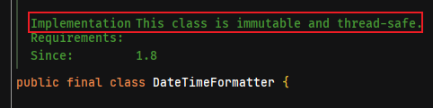

## 1. 核心概念

### 1.1. 进程与线程

#### 1.1.1. 进程的概念

程序由指令和数据组成，但这些指令要运行，数据要读写，就必须将指令加载至 CPU，数据加载至内存。在指令运行过程中还需要用到磁盘、网络等设备。进程就是用来加载指令、管理内存、管理 IO 的。

**进程**：用来封装线程，并为线程分配资源。<font color=red>**进程是程序运行资源分配的最小单位**</font>。其中资源包括：CPU、内存空间、磁盘 IO 等。

正在运行中的程序就是一个进程。确切的来说，当一个程序进入内存运行，即是一个或多个进程在运行，具有一定独立功能。进程也可以视为程序的一个实例。大部分程序可以同时运行多个实例进程（*例如记事本、画图、浏览器等*），也有的程序只能启动一个实例进程（*例如网易云音乐、杀毒软件等*）

#### 1.1.2. 线程的概念

<font color=red>**线程：用于执行代码，是 CPU 调度的最小单位，必须依赖于进程而存在**</font>。在 windows 中进程是不活动的，只是作为线程的容器。

**线程是进程中的一个独立的执行执行路径，线程就是来执行程序的代码**，负责当前进程中程序的执行，一个进程中至少有一个线程。一个进程中是可以有多个线程的，这个应用程序也可以称之为多线程程序。

一个线程就是单一个指令流，将指令流中的一条条指令以一定的顺序交给 CPU 执行。

#### 1.1.3. 线程和进程的区别

**线程和进程一句话总结：一个程序运行后至少有一个进程，一个进程中可以包含多个线程**。每个线程并行执行不同的任务。

- 进程基本上相互独立的，而线程存在于进程内，是进程的一个子集
- 资源：进程拥有一个独立单位共享的资源，如内存空间等，供其内部的线程共享；线程不拥有系统资源，但是可以访问隶属于进程的资源。
- 进程间、线程间的通信：
    - 进程间通信较为复杂。同一台计算机的进程通信称为 IPC（Inter-process communication）；不同计算机之间的进程通信，需要通过网络，并遵守共同的协议，例如 HTTP。
    - 线程间通信相对简单，因为它们共享进程内的内存。比如，多个线程可以访问同一个共享变量。
- 上下文切换成本：线程更轻量，线程上下文切换成本一般上比进程上下文切换理低，速度理快。
- 调度：进程是资源管理的基本单位；线程是程序执行的基本单位。
- 系统开销：创建或撤销进程时，系统都要为之分配或回收系统资源，如内存空间，I/O设备等，OS 所付出的开销显著大于在创建或撤销线程时的开销，进程切换的开销也远大于线程切换的开销。

### 1.2. 线程运行的原理

#### 1.2.1. 栈与栈帧

Java Virtual Machine Stacks （Java 虚拟机栈）。 JVM 中由堆、栈、方法区所组成，而在每个线程启动后，虚拟机就为其分配一块栈内存。

- 每个栈由多个栈帧（Frame）组成，对应着每次方法调用时所占用的内存
- 每个线程只能有一个活动栈帧，对应着当前正在执行的那个方法

#### 1.2.2. 线程上下文切换

多线程编程中一般线程的个数都大于 CPU 核心的个数，而一个 CPU 核心在任意时刻只能被一个线程使用，为了让这些线程都能得到有效执行，CPU 采取的策略是为每个线程分配时间片并轮转的形式。

线程上下文切换（Thread Context Switch）是指，CPU 不再执行当前的线程，转而执行另一个线程的代码。出现 Context Switch 有如下原因：

- 线程的 cpu 时间片用完
- 垃圾回收
- 有更高优先级的线程需要运行
- 线程自己调用了 `sleep`、`yield`、`wait`、`join`、`park`、`synchronized`、`lock` 等方法
- 多个任务并发抢占锁资源，当前任务没有抢到锁资源，被调度器挂起，继续调度下一个任务。
- 硬件中断

当 Context Switch 发生时，需要由操作系统保存当前线程的状态，并恢复另一个线程的状态，其信息被保存在进程控制块（PCB-Process Control Block，切换桢）中，在 Java 中对应的是程序计数器（Program Counter Register），它的作用是记住下一条 jvm 指令的执行地址，是线程私有的。线程的状态包括程序计数器、虚拟机栈中每个栈帧的信息，如局部变量、操作数栈、返回地址等。**任务从保存到再加载的过程就是一次上下文切换。**。具体流程如下：

1. 挂起一个进程，将这个进程在 CPU 中的状态（上下文信息）存储于内存的 PCB 中。
2. 在 PCB 中检索下一个进程的上下文并将其在 CPU 的寄存器中恢复。
3. 跳转到程序计数器所指向的位置（即跳转到进程被中断时的代码行）并恢复该进程。

Context Switch 频繁发生会影响性能！Linux 相比与其他操作系统（包括其他类 Unix 系统）有很多的优点，其中有一项就是，其上下文切换和模式切换的时间消耗非常少。

### 1.3. CPU 执行程序相关知识

#### 1.3.1. CPU 核心数和线程数的关系（了解）

- **多核心**：也指单芯片多处理器( Chip Multiprocessors，简称 CMP)，CMP 是由美国斯坦福大学提出的，其思想是将大规模并行处理器中的 SMP(对称多处理器)集成到同一芯片内，各个处理器并行执行不同的进程。这种依靠多个 CPU 同时并行地运行程序是实现超高速计算的一个重要方向，称为并行处理
- **多线程**：Simultaneous Multithreading.简称 SMT.让同一个处理器上的多个线程同步执行并共享处理器的执行资源。
- **核心数、线程数**：目前主流 CPU 都是多核的。增加核心数目就是为了增加线程数，因为操作系统是通过线程来执行任务的，一般情况下它们是 1:1 对应关系，也就是说四核 CPU 一般拥有四个线程。但 Intel 引入超线程技术后，使核心数与线程数形成 1:2 的关系

#### 1.3.2. CPU 时间片轮转机制（了解）

时间片轮转调度是一种最古老、最简单、最公平且使用最广的算法，又称 RR 调度。每个进程被分配一个时间段，称作它的时间片，即该进程允许运行的时间。

如果在时间片结束时进程还在运行，则 CPU 将被剥夺并分配给另一个进程。如果进程在时间片结束前阻塞或结来，则 CPU 当即进行切换。调度程序所要做的就是维护一张就绪进程列表，当进程用完它的时间片后，它被移到队列的末尾

#### 1.3.3. 寄存器

寄存器是 CPU 内部的数量较少但是速度很快的内存（与之对应的是 CPU 外部相对较慢的 RAM 主内存）。寄存器通过对常用值（通常是运算的中间值）的快速访问来提高计算机程序运行的速度。

### 1.4. 并发与并行

**并发（concurrent）**，是同一时间点需要处理（dealing with）多个任务，而在某一时刻中，只能有一个任务在执行，但能够交替执行不同的任务。

单核CPU下会出现并发的情况，线程实际还是**串行执行**的。比如有两个进程 A 和 B，A 运行一个时间片之后，切换到 B，B 运行一个时间片之后又切换到 A。操作系统中有一个组件叫做**任务调度器**，将 cpu 的时间片（windows 系统下时间片最小约为 15 毫秒）分给不同的程序使用，只是由于 cpu 在线程间（时间片很短）的切换非常快，人类感觉是同时运行的。总结为一句话就是：**微观串行，宏观并行**。<font color=red>**一般会将这种线程轮流使用CPU的做法称为并发（concurrent）**</font>

**并行（parallel）**，是同一时刻处理（doing）多件事情的能力，并且多个不同的任务同时在执行。这个需要多核CPU才能完成，每个核（core）都可以调度运行线程，在微观上就能同时执行多条指令，不同的程序被放到不同的处理器上运行，这个是物理上的多个进程同时进行。此时线程才是真正的并行（parallel）。

**两者区别总结：一个是交替执行，一个是同时执行**

### 1.5. 协程

#### 1.5.1. 概念

协程是一种**用户态**的轻量级线程。协程不是由操作系统内核管理，而是完全由用户程序所控制，好处就是性能得到了很大的提升，不会像线程切换那样消耗资源。

协程可以理解为可以暂停执行的函数。它拥有自己的寄存器上下文和栈。协程调度切换时，将寄存器上下文和栈保存到其他地方，在切回来的时候，恢复先前保存的寄存器上下文和栈，直接操作栈则基本没有内核切换的开销，可以不加锁的访问全局变量，所以上下文的切换非常快。

#### 1.5.2. 线程和协程的区别

- 线程是抢占式；而协程是非抢占式的，所以需要用户自己释放使用权来切换到其他协程，因此同一时间其实只有一个协程拥有运行权，相当于单线程的能力。
- 线程是协程的资源。协程通过可以关联任意线程或线程池的执行器（Interceptor）来间接使用线程的资源的。

## 2. 多线程概述

Java 给多线程编程提供了内置的支持。多线程的程序达到充分利用 CPU 的目的。

### 2.1. 线程的分类

- 单线程：程序中只有一条执行路径，同一时间只能做一件事情。
- 多线程：程序中有多条执行路径，同一时间可以做多件事。

### 2.2. 主线程和子线程

#### 2.2.1. 多线程程序

多线程程序，同时有多个线程在执行任务。**Java默认是一个多线程程序**。`Thread` 类是 `java.lang` 包下的一个常用类，每一个 `Thread` 类的对象，就代表一个处于某种状态的线程。异步是多线程的代名词：

- 如果不开多线程，按顺序执行的叫**同步**。
- 如果是多个线程开启，就是**异步**。

JVM虚拟机的启动是多线程的，原因是垃圾回收线程也要启动，否则很容易会出现内存溢出。现在的的垃圾回收线程加上前面的主线程，最低启动了两个线程，所以JVM的启动就是多线程的。

#### 2.2.2. 主线程

Java程序启动时自动创建并执行 `main` 方法的线程。

**主线程的执行路径**：从 `main` 开始直到 `main` 方法执行结束。

#### 2.2.3. 子线程

除了主线程以外的所有线程，都可以称为子线程。

**子线程的执行路径**：从 `run` 方法开始直到 `run` 方法执行结束。

### 2.3. 线程的运行模式（线程调度算法）

对于一个 CPU 来说，在任意时刻只能执行一条机器指令，每个线程只有获得 CPU 的使用权才能执行指令。线程是由 CPU 负责调度执行的，CPU 同一时间只能处理一个线程。由于 CPU 在多个线程之间快速切换，让人感觉是多个线程在同时执行。

> Notes: 当线程太多时，CPU 要在很多线程间切换，会消耗 CPU；线程的创建也是需要消耗资源(CPU和内存)

所谓多线程的并发运行，其实是指从宏观上看，各个线程轮流获得 CPU 的使用权，分别执行各自的任务。在运行池中，会有多个处于就绪状态的线程在等待 CPU，JAVA 虚拟机的一项任务就是负责线程的调度，线程调度是指按照特定机制为多个线程分配 CPU 的使用权。

#### 2.3.1. 分时式调度模式

分时式调度模式是指让所有的线程轮流获得 CPU 的使用权，并且平均分配每个线程占用的 CPU 的时间片。（针对单核CPU）

#### 2.3.2. 抢占式调度模式

抢占式调度模式，是指让可运行池中每个线程都以抢占的方式获取 CPU 资源并快速执行，在执行完毕后立刻释放 CPU 资源，具体哪些线程能抢占到 CPU 资源由操作系统控制，在抢占式调度模式下，每个线程对 CPU 资源的申请概率是相等，从概率上讲每个线程都有机会获得同样的 CPU 执行时间片并发执行。也可以设置线程优先级，优先级高的线程抢到 CPU 使用权的概率高（***只是概率高，不能保证优先执行***）。

抢占式调度适用于多线程并发执行的情况，在这种机制下一个线程的堵塞不会导致整个进程性能下降。

> Notes: **Java 虚拟机的线程运行模块就是属于抢占式模式**。Java 会为每个线程都按照优先级高低分配不同的 CPU 时间片，且优先级高的线程优先执行；优先级低的线程只是获取 CPU 时间片的优先级被降低，但不会永久分配不到 CPU 时间片（*优先级只是可能概率高，并不能保证*）。Java 的线程调度在保障效率的前提下尽可能保障线程调度的公平性。

#### 2.3.3. 协同式调度模式

协同式调度，是指某一个线程在执行完后主动通知操作系统将 CPU 资源切换到另一个线程上执行。线程对 CPU 的持有时间由线程自身控制，线程切换更加透明，更适合多个线程交替执行某些任务的情况。

协同式调度有明显的缺点，如果其中一个线程因为外部原因（可能是磁盘I/O阻塞、网络I/O阻塞、请求数据库等待）运行阻塞，那么可能导致整个系统阻塞甚至崩溃。

### 2.4. 多线程的随机性

- 在同一个线程中，代码是按顺序一行一行往下执行。
- 每一个线程都有自己独立的栈空间。
- 多个不同的线程的是交替执行，但执行的顺序不受控制

### 2.5. 使用多线程的场景

1. 同时做一些事情的时候
2. 将耗时操作放在子线程中

### 2.6. 多线程的优点和缺点

- 优点：**多线程并不能提高运行速度，提高了 CPU 的使用率，提高程序的运行效率**(执行效率)。
- 缺点：如果线程数量太多，分配给每一个线程的时间就少了。CPU来回在多个线程之间进行切换会导致线程执行效率低。

**注：如果多线程有安全问题的处理时，运算速度反而更低。**

### 2.7. 查看进程线程的方法

#### 2.7.1. windows

任务管理器可以查看进程和线程数，也可以用来杀死进程。也可以使用命令行：

查看系统进程

```bash
tasklist
```

杀死指定的进程

```bash
taskkill <PID>
```

#### 2.7.2. linux

查看系统所有进程

```bash
ps -fe
```

查看某个进程（PID）的所有线程

```bash
ps -fT -p <PID>
```

杀死进程

```bash
kill <PID>
```

按大写 H 切换是否显示线程

```bash
top
```

查看某个进程（PID）的所有线程

```bash
top -H -p <PID>
```

#### 2.7.3. Java 工具查看

命令查看所有 Java 进程

```bash
jps
```

查看某个 Java 进程（PID）的所有线程状态

```bash
jstack <PID>
```

jconsole 远程监控工具。是来查看某个 Java 进程中线程的运行情况（图形界面）。使用步骤如下：

1. 运行时需要配置java类

```bash
java -Djava.rmi.server.hostname=`ip地址` -Dcom.sun.management.jmxremote -Dcom.sun.management.jmxremote.port=`连接端口` -Dcom.sun.management.jmxremote.ssl=是否安全连接 - Dcom.sun.management.jmxremote.authenticate=是否认证 java类
```

2. 修改 `/etc/hosts` 文件将 `127.0.0.1` 映射至主机名（非必需，如不是连接本地则不需要）
3. 如开启认证访问，则需做以下步骤
    1. 复制 jmxremote.password 文件
    2. 修改 jmxremote.password 和 jmxremote.access 文件的权限为 600 即文件所有者可读写
    3. 连接时填入 controlRole（用户名），R&D（密码）

## 3. 线程相关的类与接口（未整理完）

> 以下类与接口的常用方法详见《并发编程-常用API》笔记

### 3.1. Thread 类

`java.lang.Thread` 类

```java
public class Thread implements Runnable
```

`Thread` 类是用于创建一个新的线程并执行。`Thread` 类现实了 `Runnable` 接口

创建新执行线程有两种方法。一种方法是将类声明为 `Thread` 的子类。该子类应重写 `Thread` 类的 `run` 方法。

#### 3.1.1. 构造方法

```java
public Thread()
```

直接创建一个线程对象，此构造方法与 `Thread(null, null, gname)` 具有相同的作用，自动生成的线程名称的形式为 `"Thread-"+n`，其中的 n 为整数。

```java
public Thread(String name)
```

创建一个线程并设置线程的名称，此构造方法与 `Thread(null, null, name)` 具有相同的作用。

```java
public Thread(Runnable target)
```

使用 `Runnable` 接口实现类对象来创建一个线程对象。此构造方法与 `Thread(null, target, gname)` 具有相同的作用，自动生成的线程名称的形式为 `"Thread-"+n`，其中的 n 为整数。

```java
public Thread(Runnable target, String name)
```

使用 `Runnable` 接口实现类对象来创建一个线程对象，并设置线程名称。此构造方法与 `Thread(null, target, name)` 具有相同的作用。

```java
public Thread(ThreadGroup group, Runnable target, String name)
```

创建一个线程，将 `target` 作为其运行对象，将指定的 `name` 作为其名称，并作为 `group` 所引用的线程组的一员。

> 建议创建线程时，都给线程设置名称，方便日志的追踪

#### 3.1.2. 常用方法

```java
public void run()
```

- `run` 方法放的是在子线程上面执行的代码。直接调用 `run` 方法，不会开启新的线程。如果在构造 `Thread` 对象时传递了 `Runnable` 参数，则线程启动后会调用 `Runnable` 中的 `run` 方法，否则默认不执行任何操作。但可以创建 `Thread` 的子类对象，重写该方法

```java
public void start()
```

- 调用系统资源创建一个新的线程，新的线程会执行对象的`run`方法。此方法只是让线程进入就绪状态，`run` 方法中代码不一定立刻运行（CPU 的时间片还没分给它）。每个线程对象的 `start` 方法只能调用一次，如果调用了多次会出现 `IllegalThreadStateException`

```java
public long getId()
```

- 获取该线程的标识符ID（正长整型）。在创建该线程时生成。线程 ID 是唯一的且不变。线程终止时，该线程 ID 可以被重新使用。

```java
public final String getName()
```

- 获取线程的名称，默认命名规则：`Thread-序号`。

```java
public final void setName(String name)
```

- 设置线程名称。使用场景，当程序出现异常时，可以通过名字判断异常出现哪个线程中。
    - `name`参数：该线程的新名称。

```java
public final void join() throws InterruptedException
```

- 等待线程运行结束

```java
public final synchronized void join(long millis) throws InterruptedException
```

- 等待线程运行结束，最多等待时长为 `millis` 毫秒。如果设置参数 `millis` 为 0，则代表一直等下去。
    - `millis`参数：最大等待时间（单位：毫秒）。

```java
public final int getPriority()
```

- 获取线程优先级

```java
public final void setPriority(int newPriority)
```

- 修改线程优先级。较大的优先级能提高该线程被 CPU 调度的机率。*但具体还是由CPU调度决定，此优先级数影响不大*
    - `newPriority`参数：要为线程设定的优先级，规定为1~10的整数

```java
public State getState()
```

- 获取当前线程的状态。Java 中线程状态是用 `Thread.State` 枚举表示。**返回值** `Thread.State` 枚举：
    - `NEW` 至今尚未启动的线程处于这种状态。
    - `RUNNABLE` 正在 Java 虚拟机中执行的线程处于这种状态。
    - `BLOCKED` 受阻塞并等待某个监视器锁的线程处于这种状态。
    - `WAITING` 无限期地等待另一个线程来执行某一特定操作的线程处于这种状态。
    - `TIMED_WAITING` 等待另一个线程来执行取决于指定等待时间的操作的线程处于这种状态。
    - `TERMINATED` 已退出的线程处于这种状态。

```java
public boolean isInterrupted()
```

- 判断线程是否被打断，**不会清除打断标记**。线程的中断状态不受该方法的影响。

```java
public final native boolean isAlive();
```

- 判断线程是否存活（还没有运行完毕）。如果线程已经启动且尚未终止，则为活动状态。
    - **返回值**：如果该线程处于活动状态，则返回 true；否则返回 false。

```java
public void interrupt()
```

- 打断线程。方法向线程发出一个终止通知信号，会影响该线程内部的一个中断标识位，但这个线程本身并不会因为调用了 `interrupt` 方法而改变状态（阻塞、终止等）。
    - 如果被打断线程正在 `sleep`，`wait`，`join` 会导致被打断的线程抛出 `InterruptedException`，并**清除打断标记**；
    - 如果打断的正在运行的线程，则只会**设置打断标记**，不会影响被打断的线程的状态；
    - `park` 的线程被打断，也会**设置打断标记**。

```java
public static boolean interrupted()
```

- 判断当前线程是否被打断，**会清除打断标记**。即如果连续两次调用该方法，则第二次调用将返回 false（在第一次调用已清除了其中断标记之后，且第二次调用检验完中断状态前，当前线程再次中断的情况除外）

```java
public static native Thread currentThread();
```

- 获得当前方法执行所在的线程对象。哪个线程执行这行代码就返回哪个线程

```java
public static native void sleep(long millis) throws InterruptedException;
```

- 让当前方法所在的线程睡眠 `millis` 毫秒，在指定的毫秒数内让当前正在执行的线程休眠（暂停执行）。休眠时会让出 cpu 的时间片给其它线程

```java
public static native void yield();
```

- 提示线程调度器让出当前线程对CPU的使用，并执行其他线程。*主要是为了测试和调试*

```java
public final void setDaemon(boolean on)
```

- 将该线程标记为守护线程或用户线程。<font color=red>**注意：该方法必须在启动线程前调用。**</font>
    - `boolean on`参数：设置为 `true`，则将该线程标记为守护线程。

```java
public static void dumpStack()
```

- 将当前线程的堆栈跟踪打印至标准错误流。

#### 3.1.3. 过时方法（不推荐使用）

有一些已过时的方法，并且不再推荐使用，容易破坏同步代码块，造成线程死锁

```java
@Deprecated
public final void stop()

@Deprecated
public final synchronized void stop(Throwable obj)
```

- 停止线程运行

```java
@Deprecated
public final void suspend()
```

- 挂起（暂停）线程运行

```java
@Deprecated
public final void resume()
```

- 恢复线程运行

### 3.2. Runnable 接口

`java.lang.Runnable` 接口的 `run` 方法中放的是在子线程上面执行的代码

```java
@FunctionalInterface
public interface Runnable {

    public abstract void run();
}
```

### 3.3. Callable 接口

`java.util.concurrent.Callable` 接口

```java
@FunctionalInterface
public interface Callable<V> {

    V call() throws Exception;
}
```

### 3.4. Future 接口

#### 3.4.1. 概述

`java.util.concurrent.Future` 接口是 Java 专门用于描述异步计算结果的，可以通过 `Future` 对象来获取线程计算的结果。

```java
public interface Future<V>
```

#### 3.4.2. 常用方法

```java
boolean cancel(boolean mayInterruptIfRunning);
```

- 试图取消对此任务的执行

```java
V get() throws InterruptedException, ExecutionException;
```

- 等待异步线程计算完成，然后获取其结果。

```java
V get(long timeout, TimeUnit unit) throws InterruptedException, ExecutionException, TimeoutException;
```

- 设置最大等待时。如在所给定的时间内异步线程计算完成，则获取其结果（如果结果可用），否则会抛出异常。

```java
boolean isCancelled();
```

- 如果在任务正常完成前将其取消，则返回 true。

```java
boolean isDone();
```

- 如果任务已完成，则返回 true。

#### 3.4.3. Future 的获取与使用步骤

1. 创建线程池

```java
ExecutorService pool = Executors.newFixedThreadPool(3);
```

2. 通过线程池对象 `submit` 方法提交 `Callable` 接口的任务，获取 Future 对象

```java
Future<Integer> future = pool.submit(new Callable<Integer>() {
	@Override
	public Integer call() throws Exception {
		return Integer.MAX_VALUE; // 返回结果，会封装到 Future 对象中
	}
});
```

3. 根据 `Future` 对象调用 `get()` 方法拿到 `call()` 方法的返回值

```java
Integer i = future.get();
```

**注：如果多个线程调用了Future的get()方法，下面的线程是同步执行的。因为可能返回值会参与其他的操作，如果异步执行的话，那后面的操作就会出现问题，有些值还没有返回，所以系统规定了是同步执行。**

#### 3.4.4. 示例

示例1：获取 call 方法返回值 Future

```java
import java.util.concurrent.Callable;
import java.util.concurrent.ExecutorService;
import java.util.concurrent.Executors;
import java.util.concurrent.Future;

/*
	使用线程池方式执行任务,返回1-n的和
*/
public class MoonZero {
    public static void main(String[] args) throws Exception {
        // 创建线程池对象
        ExecutorService pool = Executors.newFixedThreadPool(2);
        // 定义变量接收线程的返回值，使用了匿名对象
        Future<Integer> future1 = pool.submit(new MyCallable(100));
        Integer sum1 = future1.get();
        Future<Integer> future2 = pool.submit(new MyCallable(50));
        Integer sum2 = future2.get();

        System.out.println("1-100的和是：" + sum1);
        System.out.println("1-50的和是：" + sum2);
        // 销毁线程池，这个会等待线程池中所有任务执行完成才销毁
        pool.shutdown();
    }
}

class MyCallable implements Callable<Integer> {
    // 定义一个成员变量用接收统计的n值
    private int num;

    // 定义一个有参的构造方法，用来传入需要统计的参数
    public MyCallable(int num) {
        this.num = num;
    }

    // 重写call方法
    @Override
    public Integer call() throws Exception {
        // 定义一个变量统计总和
        int sum = 0;
        for (int i = 1; i <= num; i++) {
            sum += i;
        }
        return sum;
    }
}
```

综合示例：

```java
public class FutureDemo {

    @Test
    public void FutureBasicTest() throws ExecutionException, InterruptedException {
        // 1.获取线程池对象
        ExecutorService es = Executors.newCachedThreadPool();
        // 2.创建 Callable 类型的任务对象，并且启动
        Future<Integer> future = es.submit(new MyCallable(1, 1));
        // 3.判断任务是否已经完成
        boolean done = future.isDone();
        System.out.println("第一次判断任务是否完成:" + done);
        boolean cancelled = future.isCancelled();
        System.out.println("第一次判断任务是否取消:" + cancelled);
        Integer v = future.get(); // 一直等待任务的执行,直到完成为止
        System.out.println("任务执行的结果是:" + v);
        boolean done2 = future.isDone();
        System.out.println("第二次判断任务是否完成:" + done2);
        boolean cancelled2 = future.isCancelled();
        System.out.println("第二次判断任务是否取消:" + cancelled2);
    }

    // 测试 Future 对象的 cancel 方法
    @Test
    public void FutureCancelTest() throws Exception {
        // 1.获取线程池对象
        ExecutorService es = Executors.newCachedThreadPool();
        // 2.创建 Callable 类型的任务对象，并且启动
        Future<Integer> future = es.submit(new MyCallable(1, 1));
        // 3.判断任务是否已经完成
        boolean b = future.cancel(true);
        System.out.println("取消任务执行的结果:" + b);
    }

    // 测试 Future 对象设置等待时间的 get 方法
    @Test
    public void FutureGetTimeoutTest() throws Exception {
        // 1.获取线程池对象
        ExecutorService es = Executors.newCachedThreadPool();
        // 2.创建 Callable 类型的任务对象，并且启动
        Future<Integer> future = es.submit(new MyCallable(1, 1));
        // 3.设置最大等待结果时间
        Integer v = future.get(1, TimeUnit.SECONDS); // 由于等待时间过短,任务来不及执行完成,会报异常
        System.out.println("任务执行的结果是:" + v);
    }

}

class MyCallable implements Callable<Integer> {
    private final int a;
    private final int b;

    public MyCallable(int a, int b) {
        this.a = a;
        this.b = b;
    }

    @Override
    public Integer call() throws Exception {
        String name = Thread.currentThread().getName();
        System.out.println(name + "准备开始计算...");
        Thread.sleep(2000);
        System.out.println(name + "计算完成...");
        return a + b;
    }
}
```

### 3.5. FutureTask 类

#### 3.5.1. 概述

```java
public class FutureTask<V> implements RunnableFuture<V>

// 父接口 RunnableFuture 继承了 Runnable 与 Future
public interface RunnableFuture<V> extends Runnable, Future<V>
```

`java.util.concurrent.FutureTask` 类是从 JDK 1.5 开始加入可取消的异步运算的任务。该类实现了 `Runnable` 与 `Future` 接口，可以用来包装一个 `Callable` 或 `Runnable` 对象，并提供了启动、取消计算，查询计算是否完成，以及检索计算的结果等等功能。该异步任务具有返回值，在任务完成后再能获取返回结果，如果在任务未完成，调用 `get` 方法则会阻塞当前线程。

> 其中泛型是 `V` 是此 `FutureTask` 的 `get` 方法所返回的结果类型。

由于 `FutureTask` 也是 `Runnable` 接口的实现类，所以 `FutureTask` 也可以提交给线程池来执行。

譬如：`FutureTask` 的构造方法可以传入一个 `Callable` 的具体实现类，可以对这个异步运算的任务的结果进行等待获取、判断是否已经完成、取消任务等操作。调用其 `get()` 方法可以获取线程执行完成后的返回结果。但只有当运算完成的时候结果才能取回，如果运算尚未完成 `get` 方法将会阻塞。

#### 3.5.2. 构造方法

```java
public FutureTask(Callable<V> callable)
```

- 对 `Callable` 接口实现进行包装，创建一个 `FutureTask` 对象，一旦运行就执行给定的 `Callable` 的实现逻辑。
    - `Callable<V> callable` 参数：可调用的任务

```java
public FutureTask(Runnable runnable, V result)
```

- 对 `Runnable` 接口实现进行包装，创建一个 `FutureTask` 对象，一旦运行就执行给定的 `Runnable` 的实现逻辑，并在成功完成时通过 `get` 方法返回给定的结果值 `result`。
    - `Runnable runnable` 参数：待执行的线务任务
    - `V result` 参数：成功完成时要返回的结果。如果不需要特定的结果可以`new FutureTask(runnable, null)`

#### 3.5.3. 常用方法

```java
public V get() throws InterruptedException, ExecutionException
```

- 获取线程处理结果。调用此方法，`FutureTask`对象将当前线程阻塞，并等待执行完成后，返回结果。

### 3.6. 总结

#### 3.6.1. Thread 和 Runnable 的区别

- Thread 才是 Java 里对线程的唯一抽象
- Runnable 只是对任务（业务逻辑）的抽象
- Thread 可以接受任意一个 Runnable 的实例并执行

#### 3.6.2. Runnable 和 Callable 接口的区别

**相同点**：

- 都是接口
- 都可以编写多线程程序
- 都采用 `Thread对象.start()` 启动线程

**区别点**：

- `Runnable` 的方法是 `run()`；`Callable` 接口方法是 `call()`。
- `Runnable` 接口 `run()` 方法无返回值；`Callable` 接口 `call()` 方法有返回值，是个泛型，和 `Future`、`FutureTask` 配合可以用来获取异步执行的结果。
- `Runnable` 接口 `run()` 方法只能抛出运行时异常，且无法捕获处理；`Callable` 接口 `call()` 方法允许抛出异常，可以获取异常信息。

> Tips: `Callable` 接口支持返回执行结果，需要调用`FutureTask`对象的`get()`方法获取，此方法会阻塞主进程的继续往下执行，如果不调用不会阻塞。

#### 3.6.3. Callable 和 Future

`Callable` 接口类似于 `Runnable`，区别是 `Runnable` 不会返回结果，并且无法抛出返回结果的异常；而 `Callable` 功能更强大一些，被线程执行后，可以返回值，这个返回值被 `Future` 获取，即 `Future` 可以拿到异步执行任务的返回值。

`Future` 接口表示异步任务，是一个可能还没有完成的异步任务的结果。

<font color=red>**总结：`Callable` 接口用于产生结果，`Future` 接口用于获取结果**</font>

## 4. 创建与运行线程

### 4.1. 线程的创建方式

线程的创建有以下几种方式：

1. 继承 `Thread` 类，并重写 `run` 方法
2. 实现 `Runnable` 接口，并重写 `run` 方法
3. 实现有返回值的 `Callable` 接口，重写 `call` 方法
4. 采用线程池 （不建议使用 `Executors`，推荐使用 `ThreadPoolExecutor` 类创建线程池）

> Notes: **前三种方式不建议在程序中直接使用，推荐采用线程池的方式创建**

但值得注意的是：在JDK Thread 类的源码注释中，“There are two ways to create a new thread of execution.”。即官方只认定有两种方式来创建新执行线程，分别是`Thread`类与`Runnable`接口

- 一种方法是将类声明为 `Thread` 的子类。该子类应重写 `Thread` 类的 `run` 方法。接下来可以分配并启动该子类的实例。
- 另一种方法是声明实现 `Runnable` 接口的类。该类然后实现 `run` 方法。然后可以分配该类的实例，在创建 `Thread` 时作为一个参数来传递并启动。

### 4.2. 方式一：继承 Thread 类

继承 `Thread` 类创建线程的步骤：

1. 定义一个子类 MyThread 继承 Thread
2. 重写 run 方法，写入线程要执行的任务
3. 创建子类的对象 `MyThread mt = new MyThread();`
4. 调用 `mt.start()` 方法，开启线程

> Notes:
>
> - **一个线程多次调用 `start()` 方法会出现 `java.lang.IllegalThreadStateException`(线程状态异常)**
> - **为什么要重写run()方法？**不是类中所有代码都需要被线程执行。为了区分哪些代码能够被线程执行，java提供了Thread类中的run()方法用来包含那些被线程执行的代码。
> - **父类 `Thread` 有这个赋名称的构造方法 `Thread(String name)`，因为不能继承构造方法，所以要子类生成这个构造方法，调用父亲的构造方法**

### 4.3. 方式二：实现 Runnable 接口（常用）

#### 4.3.1. 实现多线程的步骤

1. 定义 `Runnable` 接口的实现类
2. 重写 `run()` 方法
3. 创建实现类对象
4. 通过 `Thread` 类有参构造方法`public Thread(Runnable target)`，传入 `Runnable` 实现类对象，创建 `Thread` 对象
5. 调用 `start()` 方法，创建线程

具体示例如下：

```java
// 第1步：定义 Runnable 接口实现类
public class MyRunnable implements Runnable {
    // 第2点：重写 run 方法
    @Override
    public void run() {
        System.out.println("do something...");
    }
}

public void test() {
    // 第3步：创建 Runnable 实现对象
    Runnable myRunnable = new MyRunnable();
    // 第4步：通过 Thread 类有参构造方法，传入 Runnable 实现类对象，创建 Thread 对象
    Thread mr = new Thread(myRunnable);
    // 第5步：调用 start() 方法，启动线程
    mr.start();
}
```

> Tips: **可以使用匿名内部类来创建实现类对象（不需要创建接口的实现类，如果重写的run方法的代码不是很复杂的话。）**

```java
Runnable target = new Runnable(){
    // 重写 run() 方法
};
```

#### 4.3.2. Runnable 接口创建线程的原理


#### 4.3.3. Runnable 接口实现多线程的好处

1. **避免了Java类单继承的局限性**

- 继承Thread类方式不能再继承其他类
- 实现Runnable接口方式可以再继承其他类

2. **可以在多个线程之间共享**

不需要定义静态的成员变量做为同步锁对象，因为在实现Runnable接口方式中，只创建了一个Runnable的实现类对象。**直接以Runnable对象做为同步锁对象**即可。

3. **将线程和任务分离，降低了程序的耦合性**

- **耦合性** -> 依赖性: 耦合高，依赖高；耦合低，依赖低 (高内聚，低耦合)
- **继承 Thread 类方式**
	1. 子类负责写在子线程上面执行的代码
	2. 子类负责创建线程
- **实现 Runnable 接口方式**（降低了 Runnable实现类和Thread类的耦合性）
	1. Runnable实现类负责写在子线程上面执行的代码
	2. Thread类负责创建线程

### 4.4. 方式三：FutureTask + Callable

**实现步骤**：

1. 创建实现 `Callable` 接口的类 `MyCallable`
2. 以 myCallable 为参数创建 `FutureTask` 对象
3. 使用 `public Thread(Runnable target, String name)` 有参数器来创建 `Thread` 对象
4. 调用线程对象的 `start()` 方法

FutureTask + Callable 创建线程示例：

```java
// 第1步：定义 Callable 接口实现类
public class MyCallable implements Callable<String> {
    private String data;

    public MyCallable(String data) {
        this.data = data;
    }

    // 第2步：重写 call 方法
    @Override
    public String call() throws Exception {
        return this.data;
    }
}

public void test() throws ExecutionException, InterruptedException {
    // 第3步：创建 Callable 接口实现对象
    Callable<String> callable = new MyCallable("待返回的内容");
    // 第4步：通过 Callable 实例，创建线程任务对象
    FutureTask<String> futureTask = new FutureTask<>(callable);
    // 第5步：通过 FutureTask 实例，创建 Thread 线程对象
    //  参数1: 线程任务对象
    //  参数2: 线程名称
    Thread thread = new Thread(futureTask, "futureTask-thread");
    // 第6步：调用 start 方法，启动线程
    thread.start();
    System.out.println("FutureTask#get()方法执行前...");
    // 第7步：调用 FutureTask 的 get 方法获取线程执行完毕的结果。此时主线程会阻塞，等线程执行的结果返回
    String result = futureTask.get();
    System.out.println("FutureTask#get() 方法执行后...");
    System.out.println("result: " + result);
}
```

### 4.5. 方式四：通过线程池创建

使用 `ExecutorService`、`Callable`、`Future` 来开启有返回结果的多线程，即使用了 `ExecutorService` 线程程来管理前面的几种创建方式。

> 更多线程池内容详见《并发编程-线程池》笔记。

### 4.6. 匿名内部类实现多线程（前面实现方式的变种写法）

定义匿名内部类继承 Thread 类或现实 Rannable 接口，重写 run 方法。3种情况：

1. 创建 Thread 的子类对象
2. 创建 Runnable 的实现类对象，传入 Thread 对象中
3. 在创建 Thread 参数中创建 Runnable 的实现类对象

Code Demo:(3种匿名内部类创建线程的案例)

```java
/*
    匿名内部类:
    new 父类/接口() {
        // 重写方法
    }
*/
@Test
public void test01() {
    // 1.创建Thread的子类对象
    new Thread() {
        @Override
        public void run() {
            System.out.println("创建Thread的子类对象, " + getName());
        }
    }.start();

    // 2.创建Runnable的实现类对象,传入Thread对象中
    Runnable run = new Runnable() {
        @Override
        public void run() {
            String name = Thread.currentThread().getName();
            System.out.println("创建Runnable的实现类对象,传入Thread对象中: " + name);
        }
    };
    Thread t = new Thread(run);
    t.start();
    // 直接再用Rannable实现类对象再创建一个Thread匿名对象，再开一个线程
    new Thread(run).start();

    // 3.在创建Thread参数中创建Runnable的实现类对象
    new Thread(new Runnable() {
        @Override
        public void run() {
            String name = Thread.currentThread().getName();
            System.out.println("在创建Thread参数中创建Runnable的实现类对象: " + name);
        }
    }).start();
}
```

## 5. 线程的状态

### 5.1. 线程的生命周期（重点）

线程的生命周期包括：新建(New)、就绪（Runnable）、运行（Running）、阻塞(Blocked)和死亡(Dead) 等 5 种状态。

在系统运行过程中不断有新的线程被创建，旧的线程在执行完毕后被清理。当线程被创建并启动以后，它既不是一启动就进入了执行状态，也不是一直处于执行状态。尤其是当线程启动以后，它不可能一直"霸占"着 CPU 独自运行，所以 CPU 需要在多条线程之间切换，于是线程状态也会多次在运行、阻塞之间切换。

#### 5.1.1. 新建状态（New）

**当程序使用 `new` 关键字创建了一个线程之后**，还没有调用 `start` 方法前。该线程就处于新建状态，此时仅由 JVM 为其分配内存，并初始化其成员变量的值

#### 5.1.2. 就绪状态（Runnable）

**线程对象调用了 `start` 方法之后**，此时有执行资格，没有CPU执行权（等待CPU调度），该线程处于就绪状态。Java 虚拟机会为其创建方法调用栈和程序计数器，等待调度运行。

还有一种情况会进入就绪状态，当前运行中的线程调用 `Thread.yield()` 方法后，当前线程就会让出 CPU 占有权，但让出的时间是不可设定的，也不会释放锁资源。注意：并不是每个线程都需要这个锁的，而且执行 `yield()`的线程不一定就会持有锁，完全可以在释放锁后再调用 `yield` 方法。所有执行 `yield` 方法的线程有可能在进入到就绪状态后会被操作系统再次选中马上又被执行

#### 5.1.3. 运行状态（Running）

如果**处于就绪状态的线程获得了CPU时间片（timeslice），开始执行`run()`方法的线程执行体**，则该线程处于运行状态。即有执行资格，也有执行权（被CPU调度或抢到CPU）。***但如果CPU被其他线程抢走，该线程就回去就绪状态***。

> Notes: <font color=red>**就绪状态是进入到运行状态的唯一入口，也就是说，线程要想进入运行状态执行，首先必须处于就绪状态中**</font>

#### 5.1.4. 阻塞状态（Blocked）

阻塞状态是指线程因为某种原因放弃了 cpu 使用权，也即让出了 cpu timeslice，暂时停止运行。直到线程进入可运行(runnable)状态，才有机会再次获得 cpu timeslice 转到运行(running)状态。***即线程没有执行资格，也没有执行权***。阻塞的情况分三种：

1. 等待阻塞：当运行中(running)的线程执行了 `Object` 类的 `o.wait()` 方法，JVM 会把该线程放入等待队列(waitting queue)中。
2. 同步阻塞：当运行中(running)的线程在获取对象的同步锁时，若该同步锁被别的线程占用，则 JVM 会把该线程放入锁池(lock pool)中。
3. 其他阻塞：当运行中(running)的线程执行 `Thread.sleep(long ms)`或 `t.join()`方法，或者发出了 I/O 请求时，JVM 会把该线程置为阻塞状态。当 `sleep()`状态超时、`join()`等待线程终止或者超时、或者 I/O 处理完毕时，线程重新转入可运行(runnable)状态。

> Notes: `join()` 方法是把指定的线程加入到当前线程，可以将两个交替执行的线程合并为顺序执行。比如在线程 B 中调用了线程 A 的 `join()` 方法，直到线程 A 执行完毕后，才会继续执行线程 B

#### 5.1.5. 死亡状态（Dead）

线程会有以下几种方式结束，结束后就是死亡状态。

1. **线程自然终止**：`run()`或`call()`方法执行完成，线程正常结束。
2. **调用`stop()`方法手动结束**：直接调用该线程的`stop()`方法来结束该线程，**该方法通常容易导致死锁，不推荐使用**。

> 暂停、恢复和停止操作对应在线程 Thread 的 API 就是 `suspend()`、`resume()` 和 `stop()`，但这些方法都标识已经过期，不建议使用。以 `suspend()` 方法为例，在调用后，线程不会释放已经占有的资源（比如锁），而是占有着资源进入睡眠状态，这样容易引发死锁问题。同样，`stop()` 方法在终结一个线程时不会保证线程的资源正常释放，通常是没有给予线程完成资源释放工作的机会，因此会导致程序可能工作在不确定状态下。正因为 `suspend()`、`resume()`和 `stop()` 方法带来的副作用，这些方法才被标注为不建议使用的过期方法。

3. **异常结束**：线程抛出一个未捕获的 Exception 或 Error。
4. **中断**
    - 安全的中止则是其他线程通过调用某个线程 A 的 `interrupt()` 方法对其进行中断操作, 中断好比其他线程对该线程打了个招呼，“A，你要中断了”，不代表线程 A 会立即停止自己的工作，同样的 A 线程完全可以不理会这种中断请求。因为 java 里的线程是协作式的，不是抢占式的。线程通过检查自身的中断标志位是否被置为 true 来进行响应
    - 线程通过方法 `isInterrupted()` 来进行判断是否被中断，也可以调用静态方法`Thread.interrupted()`来进行判断当前线程是否被中断，不过`Thread.interrupted()`会同时将中断标识位改写为 false。
    - 如果一个线程处于了阻塞状态（如线程调用了 thread.sleep、thread.join、thread.wait 等），则在线程在检查中断标示时如果发现中断标示为 true，则会在这些阻塞方法调用处抛出 InterruptedException 异常，并且在抛出异常后会立即将线程的中断标示位清除，即重新设置为 false。
    - 不建议自定义一个取消标志位来中止线程的运行。因为 run 方法里有阻塞调用时会无法很快检测到取消标志，线程必须从阻塞调用返回后，才会检查这个取消标志。这种情况下，使用中断会更好，因为
        1. 一般的阻塞方法，如 sleep 等本身就支持中断的检查，
        2. 检查中断位的状态和检查取消标志位没什么区别，用中断位的状态还可以避免声明取消标志位，减少资源的消耗。

> <font color=red>**注意 ：处于死锁状态的线程无法被中断**</font>

### 5.2. 线程的生命周期图


### 5.3. Java API 定义的6种线程状态

根据 Java API 层面的 `Thread.State` 枚举，定义线程的6种状态


- `NEW` 线程刚被创建，但是还没有调用 `start()` 方法
- `RUNNABLE` 当调用了 `start()` 方法之后，注意，Java API 层面的 `RUNNABLE` 状态涵盖了操作系统层面的【可运行状态】、【运行状态】和【阻塞状态】（由于 BIO 导致的线程阻塞，在 Java 里无法区分，仍然认为是可运行）
- `BLOCKED`，`WAITING`，`TIMED_WAITING` 都是 Java API 层面对【阻塞状态】的细分，在不同的条件下，这些状态是可以进行转换
- `TERMINATED` 当线程代码运行结束

假设有线程 `Thread t`

#### 5.3.1. 情况 1 NEW --> RUNNABLE

当调用 `t.start()` 方法时，由 `NEW --> RUNNABLE`

#### 5.3.2. 情况 2 RUNNABLE <--> WAITING

t 线程用 `synchronized(obj)` 获取了对象锁后

- 调用 `obj.wait()` 方法时，t 线程从 `RUNNABLE --> WAITING`
- 调用 `obj.notify()`，`obj.notifyAll()`，`t.interrupt()` 时
    - 竞争锁成功，t 线程从 `WAITING --> RUNNABLE`
    - 竞争锁失败，t 线程从 `WAITING --> BLOCKED`

#### 5.3.3. 情况 3 RUNNABLE <--> WAITING

- 当前线程调用 `t.join()` 方法时，当前线程从 `RUNNABLE --> WAITING` 。注意是当前线程在 t 线程对象的监视器上等待
- t 线程运行结束，或调用了当前线程的 `interrupt()` 时，当前线程从 `WAITING --> RUNNABLE`

#### 5.3.4. 情况 4 RUNNABLE <--> WAITING

- 当前线程调用 `LockSupport.park()` 方法会让当前线程从 `RUNNABLE --> WAITING`
- 调用 `LockSupport.unpark(目标线程)` 或调用了线程 的 `interrupt()`，会让目标线程从 `WAITING --> RUNNABLE`

#### 5.3.5. 情况 5 RUNNABLE <--> TIMED_WAITING

t 线程用 `synchronized(obj)` 获取了对象锁后

- 调用 `obj.wait(long n)` 方法时，t 线程从 `RUNNABLE --> TIMED_WAITING`
- t 线程等待时间超过了 n 毫秒，或调用 `obj.notify()`，`obj.notifyAll()`，`t.interrupt()`时
    - 竞争锁成功，t 线程从 `TIMED_WAITING --> RUNNABLE`
    - 竞争锁失败，t 线程从 `TIMED_WAITING --> BLOCKED`

#### 5.3.6. 情况 6 RUNNABLE <--> TIMED_WAITING

- 当前线程调用 `t.join(long n)` 方法时，当前线程从 `RUNNABLE --> TIMED_WAITING`。注意是当前线程在t 线程对象的监视器上等待
- 当前线程等待时间超过了 n 毫秒，或 t 线程运行结束，或调用了当前线程的 `interrupt()` 时，当前线程从 `TIMED_WAITING --> RUNNABLE`

#### 5.3.7. 情况 7 RUNNABLE <--> TIMED_WAITING

- 当前线程调用 `Thread.sleep(long n)`，当前线程从 `RUNNABLE --> TIMED_WAITING`
- 当前线程等待时间超过了 n 毫秒，当前线程从 `TIMED_WAITING --> RUNNABLE`

#### 5.3.8. 情况 8 RUNNABLE <--> TIMED_WAITING

- 当前线程调用 `LockSupport.parkNanos(long nanos)` 或 `LockSupport.parkUntil(long millis)` 时，当前线程从 `RUNNABLE --> TIMED_WAITING`
- 调用 `LockSupport.unpark(目标线程)` 或调用了线程 的 `interrupt()`，或是等待超时，会让目标线程从 `TIMED_WAITING--> RUNNABLE`

#### 5.3.9. 情况 9 RUNNABLE <--> BLOCKED

- t 线程用 `synchronized(obj)` 获取了对象锁时如果竞争失败，从 `RUNNABLE --> BLOCKED`
- 持 obj 锁线程的同步代码块执行完毕，会唤醒该对象上所有 `BLOCKED` 的线程重新竞争，如果其中 t 线程竞争成功，从 `BLOCKED --> RUNNABLE`，其它失败的线程仍然 `BLOCKED`

#### 5.3.10. 情况 10 RUNNABLE <--> TERMINATED

- 当前线程所有代码运行完毕，进入 `TERMINATED`

## 6. 线程间的协作

多线程中的线程并不是孤立的，一个线程往往需要其他线程的协作才能够完成其待执行的任务。

### 6.1. 多线程的数据共享

在 Java 中主要是通过**共享内存**实现多线程之间的通信，共享内存主要有三个关注点：可见性、有序性、原子性。Java内存模型（JVM）解决了可见性和有序性的问题，而锁解决了原子性的问题。

### 6.2. 等待唤醒机制

**线程之间的通信**：多个线程在处理同一个资源，但是处理的动作（线程的任务）却不相同。通过一定的手段使各个线程能有效的利用资源。而这种手段即**等待唤醒机制**。等待与唤醒机制相关实现如下：

- `Object` 类中的 `wait`、`notify`、`notifyAll` 方法
- `LockSupport` 类中的 `park`、`unpark` 方法

### 6.3. wait / notify

#### 6.3.1. 相关 API

> wait/notify 相关方法是由 Object 类中提供

```java
public final void wait();
```

- 让当前线程线程进入阻塞状态，会释放对象的锁，释放CPU使用权。如果是线程池中的线程，就将正在执行的线程释放其执行资格和执行权，并存储到线程池中。

```java
public final native void wait(long timeout) throws InterruptedException;
```

- 当前线程释放锁，并等待时间（单位：毫秒）

```java
public final void notify();
```

- 唤醒一个线程池中调用了 `wait()` 方法的线程，而且是随机唤醒一个。注意，唤醒的线程之间必须是同一个锁对象

```java
public final void notifyAll();
```

- 唤醒所有线程池中的所有调用了 `wait()` 方法的线程

#### 6.3.2. 基础使用

线程等待与唤醒是线程之间进行协作的手段，都属于 `Object` 对象的方法，并且必须获得此对象的锁才能使用：

- `wait` 方法的线程会进入 `WAITING` 状态，无限制等待，只有等到其他线程的通知或被中断后才会返回。需要注意的是，在调用 `wait` 方法后会释放对象的锁，并进入 WaitSet 等待区，这就意味着当前线程必须已经获得该对象锁，因此 `wait` 方法一般被用于同步方法或同步代码块中。
- ``notify` 方法，用于唤醒在此对象监视器上等待状态的一个线程。如果很多线程都在此对象上等待，则会随机选择唤醒其中一个线程。通常调用其中一个对象的 `wait` 方法在对象的监视器上等待，直到当前线程放弃此对象上的锁定，才能继续执行被唤醒的线程，被唤醒的线程将以常规方式与在该对象上主动同步的其他线程竞争。
- `notifyAll` 方法的作用一样，区别是唤醒在监视器上所有等待的线程。

> Tips: 调用 `wait()` 方法的原因通常是，调用线程希望某个特殊的状态(或变量)被设置之后再继续执行。调用 `notify()` 或 `notifyAll()` 方法的原因通常是，调用线程希望告诉其他等待中的线程，"特殊状态已经被设置"。这个状态作为线程间通信的通道，因此它必须是一个可变的共享状态(或变量)。

```java
@Test
public void testWaitNotify() throws InterruptedException {
    Thread t1 = new Thread(() -> {
        synchronized (lock) {
            LOGGER.debug("t1 线程执行....");
            try {
                lock.wait(); // 让线程在 lock 锁对象上一直等待下去
            } catch (InterruptedException e) {
                e.printStackTrace();
            }
            LOGGER.debug("t1 线程结束....");
        }
    }, "t1");

    Thread t2 = new Thread(() -> {
        synchronized (lock) {
            LOGGER.debug("t2 线程执行....");
            try {
                lock.wait(); // 让线程在 lock 锁对象上一直等待下去
            } catch (InterruptedException e) {
                e.printStackTrace();
            }
            LOGGER.debug("t2 线程结束....");
        }
    }, "t2");

    t1.start();
    t2.start();

    // 主线程休眠3秒
    Thread.sleep(3000);
    LOGGER.debug("主线程唤醒 lock 对象锁上 wait 的线程");
    synchronized (lock) {
        lock.notify(); // 随机唤醒 lock 对象锁一个等待的线程
        // lock.notifyAll(); // 唤醒 lock 对象锁所有等待的线程
    }
    // 因为这里只会唤醒一个线程，别一个线程没有唤醒，所以会一直等待。
    // 然后主线程因为调用了两个线程的 join 方法，也会在这里阻塞等待线程的执行结束
    t1.join();
    t2.join();
}
```

#### 6.3.3. 等待与唤醒机制的注意事项

- 等待与唤醒都是线程之间进行协作的手段，都属于 `Object` 对象的方法
- <font color=red>**`wait`、`notify`、`notifyAll` 等方法必须要由锁对象调用**</font>。即在调用上述方法时，当前线程必须已经持有锁，否则将会抛出 `IllegalMonitorStateException` 异常。因此**等待与唤醒方法必须在同步方法或同步代码块中调用**。
- wait 和 notify 方法在同步代码块中调用，还有一个原因是为了避免 wait 和 notify 之间产生竞态条件。
- `notify()` 是对 `notifyAll()` 的一个优化，但它有很精确的应用场景，并且要求正确使用，<u>否则可能导致死锁</u>。

例如有多个线程在等待时，使用 notify 方法只会对其中一个处于 wait 状态线程进行通知，并使它获得该对象上的锁，并且不会“唤醒”其他同样在等待的线程。当线程运行完毕后释放锁，此时如果该锁对象没有再次使用 `notify` 方法，即便该锁对象已经空闲，其他 wait 状态等待的线程由于没有得到该锁对象的通知，会继续处在 wait 状态，直到这个锁对象调用 notify 或 notifyAll 为止。<font color=red>**因此处于 wait 状态的线程等待的是被 notify 或 notifyAll，而不是锁**</font>。

**`notify()` 的正确使用方式**应该是：WaitSet 中等待的是相同的条件，唤醒任一个都能正确处理接下来的事项，如果唤醒的线程无法正确处理，务必确保继续 `notify()` 下一个线程，并且自身需要重新回到 WaitSet 中。

#### 6.3.4. 最佳实践（伪代码）

以下是`wait`/`notify`的最佳实践

```java
// lock 是锁对象，尽量使用 final 修饰锁对象
synchronized (lock) {
    while (条件判断) {
        lock.wait(); // 让线程在 lock 锁对象上一直等待下去
    }
}

// 其他线程进行唤醒
synchronized (lock) {
    lock.notifyAll(); // 唤醒 lock 对象锁所有等待的线程
}
```

#### 6.3.5. 基础使用测试示例

```java
import org.junit.Test;
import org.slf4j.Logger;
import org.slf4j.LoggerFactory;

public class WaitNotifyDemo {

    private final static Logger LOGGER = LoggerFactory.getLogger(WaitNotifyDemo.class);

    private final static Object lock = new Object();

    /**
     * wait 方法调用让线程等待
     */
    @Test
    public void testWait() {
        LOGGER.info("程序开始...");

        synchronized (lock) {
            /*
             * wait 方法必须要由锁对象调用，并且需要在同步代码中调用
             *  示例当前只有主线程，没有其他线程对其唤醒，所以会一直在等待
             */
            try {
                lock.wait();
            } catch (InterruptedException e) {
                e.printStackTrace();
            }
        }

        LOGGER.info("程序结束...");
    }

    /**
     * wait 方法调用，指定让线程等待的最大时间
     */
    @Test
    public void testWaitTimeout() {
        LOGGER.info("程序开始...");

        synchronized (lock) {
            /*
             * wait 方法必须要由锁对象调用，并且需要在同步代码中调用
             *  示例当前指定了最大等待时间，到时间后线程会自动被唤醒
             *  如果时间设置为0，代表无限等待
             */
            try {
                lock.wait(3000);
            } catch (InterruptedException e) {
                e.printStackTrace();
            }
        }
        // 3秒后输出
        LOGGER.info("程序结束...");
    }

    /**
     * wait 方法调用让线程等待，notify 方法对线程唤醒
     */
    @Test
    public void testWaitNotify() throws InterruptedException {
        Thread t1 = new Thread(() -> {
            synchronized (lock) {
                LOGGER.debug("t1 线程执行....");
                try {
                    lock.wait(); // 让线程在 lock 锁对象上一直等待下去
                } catch (InterruptedException e) {
                    e.printStackTrace();
                }
                LOGGER.debug("t1 线程结束....");
            }
        }, "t1");

        Thread t2 = new Thread(() -> {
            synchronized (lock) {
                LOGGER.debug("t2 线程执行....");
                try {
                    lock.wait(); // 让线程在 lock 锁对象上一直等待下去
                } catch (InterruptedException e) {
                    e.printStackTrace();
                }
                LOGGER.debug("t2 线程结束....");
            }
        }, "t2");

        t1.start();
        t2.start();

        // 主线程休眠3秒
        Thread.sleep(3000);
        LOGGER.debug("主线程唤醒 lock 对象锁上 wait 的线程");
        synchronized (lock) {
            lock.notify(); // 随机唤醒 lock 对象锁一个等待的线程
        }
        // 因为这里只会唤醒一个线程，别一个线程没有唤醒，所以会一直等待。
        // 然后主线程因为调用了两个线程的 join 方法，也会在这里阻塞等待线程的执行结束
        t1.join();
        t2.join();
    }

    /**
     * wait 方法调用让线程等待，notifyAll 方法对所有线程唤醒
     */
    @Test
    public void testWaitNotifyAll() throws InterruptedException {
        Thread t1 = new Thread(() -> {
            synchronized (lock) {
                LOGGER.debug("t1 线程执行....");
                try {
                    lock.wait(); // 让线程在 lock 锁对象上一直等待下去
                } catch (InterruptedException e) {
                    e.printStackTrace();
                }
                LOGGER.debug("t1 线程结束....");
            }
        }, "t1");

        Thread t2 = new Thread(() -> {
            synchronized (lock) {
                LOGGER.debug("t2 线程执行....");
                try {
                    lock.wait(); // 让线程在 lock 锁对象上一直等待下去
                } catch (InterruptedException e) {
                    e.printStackTrace();
                }
                LOGGER.debug("t2 线程结束....");
            }
        }, "t2");

        t1.start();
        t2.start();

        // 主线程休眠3秒
        Thread.sleep(3000);
        LOGGER.debug("主线程唤醒 lock 对象锁上所有 wait 的线程");
        synchronized (lock) {
            lock.notifyAll(); // 唤醒 lock 对象锁所有等待的线程
        }
        // 因为 notifyAll 方法唤醒所有等待的线程，所以此处两个线程可以执行结束
        t1.join();
        t2.join();
    }
}
```

### 6.4. park / unpark

#### 6.4.1. 相关 API 简介

`park`/`unpark` 方法是由 `LockSupport` 类中提供

```java
public static void park()
```

- 暂停当前调用该方法的线程

```java
public static void unpark(Thread thread)
```

- 恢复运行指定的线程

#### 6.4.2. 使用示例

```java
Thread t1 = new Thread(() -> {
    System.out.println("start...");
    try {
        Thread.sleep(2000);
    } catch (InterruptedException e) {
        e.printStackTrace();
    }
    System.out.println("park...");
    /*
     * park 方法，让当前线程暂停
     *   如在 unpark 方法之前调用，则会暂停当前线程
     *   如在一次 unpark 方法之后调用，则不会暂停，继续运行
     */
    LockSupport.park();
    System.out.println("resume...");
}, "t1");
t1.start();

Thread.sleep(1000);
System.out.println("unpark...");
// unpark 恢复运行指定的线程。在 park 方法前后均可调用
LockSupport.unpark(t1);
```

使用时会有两种情况，就是 `unpark` 与 `park` 先后调用顺序的不一样。

- 先调用`park`方法后再调用`unpark`方法，此时线程会在`park`方法调用处暂停，等其他线程调用`unpark`方法时，再继续往下执行。
- 先调用`unpark`方法后再调用`park`方法，此时线程执行到`park`方法时不会暂停，直接继续往下执行。

### 6.5. sleep 线程睡眠

`Thread` 类的静态方法 `sleep` 会让当前线程在指定时间内处于『休眠』状态。如果当前线程在同步块或同步方法中调用 `Thread.sleep()` 方法进入睡眠，则该线程会一直持有对象的监视器（锁），不会释放。其他的线程可以通过调用它的 `interrupt()` 方法，它将唤醒此“睡眠的”线程。

<font color=red>**值得特别注意：`sleep()` 是静态方法并且只对当前线程有效。常见的错误是通过不同于当前线程的线程对象来调用 `t.sleep()`，但即便是执行 `t.sleep()`，也是当前线程进入睡眠，而不是 t 线程**</font>。

`sleep` 与 `wait` 方法区别是：`sleep` 方法不会释放当前占有的锁，会让线程进入 `TIMED-WATING` 状态，而调用 `wait` 方法会让当前线程进入 `WATING` 状态。

> Tips: 由于 Java 采用抢占式的线程调度算法，因此可能会出现某条线程常常获取到 CPU 控制权的情况，为了让某些优先级比较低的线程也能获取到 CPU 控制权，可以使用 `Thread.sleep(0)` 手动触发一次操作系统分配时间片的操作，这也是平衡 CPU 控制权的一种操作。

#### 6.5.1. 优雅的设置睡眠时间

JDK 1.5 后，引入了一个枚举 `TimeUnit`，对 sleep 方法提供了很好的封装，设置睡眠时间时表达的含义更清晰，更优雅。。

```java
TimeUnit.HOURS.sleep(3);
TimeUnit.MINUTES.sleep(22);
TimeUnit.SECONDS.sleep(55);
TimeUnit.MILLISECONDS.sleep(899);
```

### 6.6. yield 线程让步

`Thread` 类静态方法 `yield` 会使当前线程让出（释放）CPU 执行时间片，与其他线程一起重新竞争 CPU 时间片，因此执行 `yield` 方法的线程有可能在进入到就绪状态后会马上又被操作系统再次选中并执行。

在一般情况下，优先级高的线程更有可能竞争到 CPU 时间片，但并非绝对的，有的操作系统对线程的优先级并不敏感。

### 6.7. interrupt 打断线程

#### 6.7.1. 概述

如线程调用 `sleep`、`wait`、`join` 等方法，会让线程进入阻塞状态，都可使用 `interrupt` 打断线程。

`Thread` 对象的 `interrupt` 方法会对线程发出一个终止通知信号，但仅仅改变该线程内部维护的一个中断标识位，并不会改变该线程自身状态（阻塞、终止等）。即正在运行状态的线程不会因为被中断而终止。线程状态的具体变化需要等待接收到中断标识的程序的最终处理结果来判定。具体分以下情况：

- 如果被打断线程正在 `sleep`，`wait`，`join` 会导致被打断的线程抛出 `InterruptedException`，并**清除打断标记**；
- 如果打断的正在运行的线程，则只会**设置打断标记**，不会影响被打断的线程的状态；
- `park` 的线程被打断，也会**设置打断标记**。

<font color=red>**简单的总结：任何抛出 `InterruptedException` 异常的方法都会将中断状态清零。一个线程的中断状态有有可能被其它线程调用 `interrupt` 方法来改变。**</font>

> Notes: 主要涉及 `Thread` 类的 `interrupt`、`isInterrupted`、`interrupted` 等方法的应用，API说明详见前面章节。

#### 6.7.2. 使用示例

- 打断 `sleep` 的线程，会清空打断状态

```java
logger.info("主线程开始....");
Thread t1 = new Thread(() -> {
    logger.info("t1 线程开始休眠2秒....");
    try {
        TimeUnit.SECONDS.sleep(2);
    } catch (InterruptedException e) {
        logger.info("t1 线程被打断....");
        e.printStackTrace();
    }
    logger.info("t1 线程结束....");
}, "t1");
t1.start();
Thread.sleep(1000);

// 调用 interrupt 方法，打断休眠中的线程
logger.info("t1 interrupt");
t1.interrupt();
Thread.sleep(200);
// 线程的打断标识会被清空
logger.info("t1 线程打断标识：{}", t1.isInterrupted()); // 输出结果：false
logger.info("主线程结束....");
```

- 打断正常运行的线程，不会清空打断状态

```java
logger.info("主线程开始....");
Thread t1 = new Thread(() -> {
    logger.info("t1 线程开始....");
    while (true) {
        // 获取当前线程的打断标识
        boolean interrupted = Thread.currentThread().isInterrupted();
        logger.info("t1 线程打断标识：{}", interrupted); // 打断后输出结果：true
        if (interrupted) {
            // 线程的打断标识不会被清空
            logger.info("t1 线程被中断了，退出循环....");
            break;
        }
    }
    logger.info("t1 线程结束....");
}, "t1");
t1.start();
Thread.sleep(50);

// 调用 interrupt 方法，打断正常运行的线程
logger.info("t1 interrupt");
t1.interrupt();
logger.info("主线程结束....");
```

- 打断 park 线程，不会清空打断状态

```java
logger.info("主线程开始....");
Thread t1 = new Thread(() -> {
    logger.info("LockSupport.park start....");
    LockSupport.park();
    logger.info("LockSupport.park end....");
    logger.info("t1 线程打断标识：{}", Thread.currentThread().isInterrupted()); // 输出结果：true
}, "t1");
t1.start();
Thread.sleep(1000);

// 调用 interrupt 方法，打断 park 的线程
logger.info("t1 interrupt");
t1.interrupt();
logger.info("主线程结束....");
```

#### 6.7.3. interrupt 方法使用的注意点

对 `interrupt` 方法的理解需要注意以下几个核心点：

- 调用 `interrupt` 方法并不会中断一个正在运行的线程，即处于 `Running` 状态的线程并不会因为被中断而终止，仅仅改变了内部维护的中断标识位而已。
- 若因为调用 `sleep` 方法而使线程处于 `TIMED-WATING` 状态，则这时调用 `interrupt` 方法会抛出 `InterruptedException`，使线程提前结束 `TIMED-WATING` 状态。
- 许多声明抛出 `InterruptedException` 的方法如 `Thread.sleep(long mills)`，在抛出异常前都会清除中断标识位，所以在抛出异常后调用 `isInterrupted` 方法将会返回 false。
- 中断状态是线程固有的一个标识位，可以通过此标识位安全终止线程。例如想终止一个线程时，可以先调用该线程的 `interrupt` 方法，然后在线程的 `run` 方法中根据该线程 `isInterrupted` 方法的返回状态值安全终止线程。

#### 6.7.4. interrupted 和 isInterrupted 方法的区别

- **方法的类型不同**：`interrupted` 方法是 Thread 类的静态方法；而 `isInterrupted` 方法是 Thread 类的对象方法。
- **是否清除中断标识位**：`interrupted` 方法**会清除**中断标记；而 `isInterrupted` 方法则**不会清除**中断标记。


从源码可以明显看出，当中断线程调用静态方法 `Thread.interrupted()` 来检查中断状态时，中断状态会被清零；而非静态方法 `isInterrupted()` 用来查询其它线程的中断状态并且不会清除中断状态标识。

### 6.8. join 线程加入

`Thread` 对象的 `join` 方法用于等待其他线程终止，如果在当前线程中调用另一个线程的 `join` 方法，则当前线程转为阻塞状态，等到另一个线程结束，当前线程再由阻塞状态转为就绪状态，等待获取 CPU 的使用权。

使用场景例如：主线程生成并启动了子线程，需要等到子线程返回结果并收集和处理再退出。此时可使用 `join` 方法。

```java
System.out.println("子线程运行开始！");
Thread childThread = new Thread(() -> {
    try {
        Thread.sleep(3000);
    } catch (InterruptedException e) {
        e.printStackTrace();
    }
});
childThread.join(); // 等待子线程 childThread 执行结束
System.out.println("子线程 join 方法结束，开始运行主线程！");
```

### 6.9. setPriority 线程的优先级（很少用）

通过 `Thread` 类的 `setPriority` 可设置线程的优先级

- 优先级的作用：优先级高的线程，被CPU执行到的概率大一些
- 最高优先级 `MAX_PRIORITY = 10;`
- 最低优先级 `MIN_PRIORITY = 1;`
- 默认优先级 `NORM_PRIORITY = 5;`

在 Java 线程中，通过一个整型成员变量 priority 来控制优先级，优先级的范围从 1~10，在线程构建的时候可以通过 `setPriority(int)`方法来修改优先级，默认优先级是 5，优先级高的线程分配时间片的数量要多于优先级低的线程

设置线程优先级时，针对频繁阻塞（休眠或者 I/O 操作）的线程需要设置较高优先级，而偏重计算（需要较多 CPU 时间或者偏运算）的线程则设置较低的优先级，确保处理器不会被独占。在不同的 JVM 以及操作系统上，线程规划会存在差异，有些操作系统甚至会忽略对线程优先级的设定

线程优先级会提示（hint）调度器优先调度该线程，但它仅仅是一个提示，调度器可以忽略它。如果 cpu 比较忙，那么优先级高的线程会获得更多的时间片，但 cpu 闲时，优先级几乎没作用

### 6.10. 线程的常用方法总结

#### 6.10.1. Thread 类 start 方法和 run 方法的区别

- **方法调用**：`run()` 方法仅仅是封装被线程执行业务代码，直接调用不会开启新的线程，相当于只是在当前线程中执行的普通方法；`start()` 方法调用时会开辟一个新的执行路径，在新的线程中然后再由 jvm 去调用对象 `run` 方法的代码。
- **调用次数**：`run()` 方法可以重复调用多次；`start()` 方法只能调用一次，多次调用会抛出 `java.lang.IllegalThreadStateException` 异常。

**总结**：

1. `start` 方法来启动线程，真正实现了多线程运行。这时无需等待`run`方法体代码执行完毕，可以直接继续执行下面的代码。
2. 通过调用 `Thread` 类的 `start` 方法来启动一个线程，这时此线程是处于就绪状态，并没有运行。
3. 方法 `run` 称为线程体，它包含了要执行的这个线程的内容，线程就进入了运行状态，开始运行 `run` 函数当中的代码。`run` 方法运行结束，此线程终止。然后CPU再调度其它线程

#### 6.10.2. sleep 和 wait 方法的异同点

相同点：

1. 都会使当前线程暂停运行，把机会交给其他线程
2. 任何线程在等待期间被中断都会抛出 `InterruptedException`

不同点：

1. **类的不同**：`sleep()` 方法是 `Thread` 类的静态方法；`wait()` 方法是 `Object` 类的成员方法，因此调用 `wait()` 方法前需要先获取对象的锁。
2. **是否释放锁**：调用 `sleep()` 方法的过程中，线程不会释放锁对象；调用 `wait()` 方法的时候，线程会释放锁对象。
3. **用法不同**：调用 `sleep` 方法与 `wait` 方法都会释放 CPU 的使用权。
    - `sleep` 方法导致了程序暂停执行指定的时间，但其监控状态依然保持，当指定的时间到了又会自动恢复运行状态。（在休眠的时间内，不能唤醒）
    - `wait` 方法导致此对象进行等待，不会进入锁定池，只有针对此对象调用 `notify` 方法被调用后，本线程才进入对象锁定池，准备获取对象锁进入运行状态。（在等待的时间内，能唤醒）
4. **用途不同**：`wait` 方法通常被用于线程间交互/通信；`sleep` 方法通常被用于线程暂停执行。

#### 6.10.3. sleep 与 yield 方法的区别

`sleep` 方法

- 调用 `sleep` 方法会让当前线程从 `Running` 状态进入 `Timed Waiting` 状态（阻塞）
- 其它线程可以使用 `interrupt` 方法打断正在睡眠的线程，这时 `sleep` 方法会抛出 `InterruptedException`
- 睡眠结束后的线程未必会立刻得到执行

`yield` 方法

- 调用 `yield` 方法会让当前线程从 `Running` 进入 `Runnable` 就绪状态，然后调度执行其它线程，但也有可能继续执行当前线程，最终由CPU调度决定。
- 具体的实现依赖于操作系统的任务调度器

#### 6.10.4. sleep(long n) 和 wait(long n) 的区别

- `sleep` 是 `Thread` 类方法，而 `wait` 是 `Object` 类的方法
- `sleep` 不需要强制和 `synchronized` 配合使用，但 `wait` 需要和 `synchronized` 一起用
- `sleep` 在睡眠的同时，不会释放对象锁的，但 `wait` 在等待的时候会释放对象锁
- 它们方法调用后，线程状态都是 `TIMED_WAITING`

#### 6.10.5. park/unpark 与 wait/notify 的区别

- `wait`/`notify`/`notifyAll` 必须配合 Object Monitor（锁对象）一起使用；而 `park`/`unpark` 则不需要
- `park`/`unpark` 是指定线程“阻塞”和“唤醒”；而 `notify` 只能随机唤醒一个等待线程，`notifyAll` 是唤醒所有等待线程
- `unpark` 方法可以在 `park` 方法前后均可调用；但 `notify` 方法不能在 `wait` 方法之前调用

#### 6.10.6. notify 和 notifyAll 的区别

- notify 可能会导致死锁；而 notifyAll 不会。
- notifyAll 使所有原来在该对象上等待被的线程全部退出 `wait` 的状态，变成等待该对象上的锁，一旦该对象被解锁，全部线程就会去竞争；notify 只对其中一个处 wait 状态线程进行通知，并使它获得该对象上的锁，并且不会“唤醒”其他同样在等待的线程。

## 7. Daemon 守护线程

### 7.1. 概述

有一种运行在后台的特殊线程：**Daemon（守护）线程**，它是一种支持型线程，独立于控制终端并且周期性地执行某种任务或等待处理某些发生的事件，因此常用用作程序中后台调度以及支持性工作。

默认情况下，Java 进程需要等待所有用户线程都运行结束，才会结束。这意味着，当 Java 虚拟机中所有非守护线程运行结束时，Java 虚拟机将会退出。此时即使守护线程的代码没有执行完，也会强制结束。因此<font color=red>**结束时 Daemon 线程中的 finally 块并不一定会执行**</font>。在构建 Daemon 线程时，不能依靠 finally 块中的内容来确保执行关闭或清理资源的逻辑。

总结：<font color=red>**JVM 需要等所有用户线程结束后才能结束，而守护线程会随着 JVM 关闭而结束。**</font>

> Tips: main 函数所在的线程就是一个用户线程，main 函数启动的同时在 JVM 内部同时还启动了好多守护线程，比如垃圾回收器线程就是一种守护线程。Tomcat 中的 `Acceptor` 和 `Poller` 线程都是守护线程，所以 Tomcat 接收到 `shutdown` 命令后，不会等待它们处理完当前请求

**扩展**：Thread Dump 打印出来的线程信息，含有 daemon 字样的线程即为守护进程，可能会有：服务守护进程、编译守护进程、windows 下的监听 Ctrl+break 的守护进程、Finalizer 守护进程、引用处理守护进程、GC 守护进程。

### 7.2. 守护线程的创建

可以通过调用 `Thread` 对象的 `setDaemon(true)` 将线程设置为 Daemon 线程，<font color=red>**值得注意是：该方法必须在启动线程前调用，否则会运行时会抛出异常**</font>。

```java
logger.info("主线程开始....");
Thread t1 = new Thread(() -> {
    logger.info("t1 线程开始....");
    try {
        TimeUnit.SECONDS.sleep(2);
    } catch (InterruptedException e) {
        e.printStackTrace();
    }
    logger.info("t1 线程结束....");
}, "t1");

// 设置该线程为守护线程，当主线程结束时，假如该线程的代码还没有执行完，也会强制结束
t1.setDaemon(true);
t1.start();
Thread.sleep(1000);
logger.info("主线程结束....");
```

### 7.3. 守护线程和用户线程的区别

- **用户 (User) 线程**：运行在前台，执行具体的任务，如程序的主线程、连接网络的子线程等都是用户线程。用户线程一般是由程序创建的线程。
- **守护 (Daemon) 线程**：运行在后台，为其他前台线程(非守护线程)服务。也可以简单理解为由 JVM 自动创建的线程（但不一定）。<font color=purple>一旦所有用户线程都结束运行，守护线程会随 JVM 一起结束工作</font>。

最显明的区别之一是用户线程结束，JVM 退出，不管此时是否有守护线程在运行；而守护线程不会影响 JVM 的退出。

### 7.4. 守护线程的注意事项

1. <font color=red>**`setDaemon(true)` 必须在 `start()` 方法前执行**</font>，否则会抛出 `IllegalThreadStateException` 异常
2. 在守护线程中产生的新线程也是守护线程
3. 不是所有的任务都可以分配给守护线程来执行，比如读写操作或者计算逻辑
4. 在构建守护 (Daemon) 线程时，不能依靠 `finally` 块中的内容来确保执行关闭或清理资源的逻辑。但守护线程一般用不上。因为一旦所有用户线程都结束运行，守护线程会随 JVM 一起结束工作，所以<font color=red>**守护 (Daemon) 线程中的 `finally` 语句块可能无法被执行**</font>。

## 8. ThreadLocal 类

### 8.1. 概念

`java.lang.ThreadLocal`，叫做**线程本地变量**，也有叫做线程本地存储。该类提供了线程内(thread-local)的局部变量，该变量在线程的生命周期内起作用，可以在同一个线程的多个方法之间共享该变量。

> *注：在服务器上每个用户都是一个单独的线程，每个线程可以使用不同的对象。*

**ThreadLocal 适用场景**：每个线程需要有自己单独的实例，且需要在多个方法中共享实例，即同时满足实例在线程间的隔离与方法间的共享，这种情况适合使用 `ThreadLocal`。比如 Java web 应用中，每个线程有自己单独的 Session 实例，就可以使用 `ThreadLocal` 来实现。

值得注意的是，`ThreadLocal` 并不是用来解决共享资源的多线程访问问题，因为每个线程中的资源只是副本，不会共享。因此 `ThreadLocal` 适合作为线程上下文变量，简化线程内传参。

### 8.2. 相关方法

```java
public void set(T value);
```

- 向当前线程中存入指定的值，类似于` map.put(key,value)`。例如：`set("abc")` -> `map.put(线程对象,"abc");`

```java
public T get();
```

- 从当前线程中获得值，类似于 `map.get(线程对象);`

```java
public void remove();
```

- 从当前线程中删除值，类似于 `map.remove(线程对象);`

### 8.3. 基础使用示例

```java
public class MoonZero {
    // 创建线程局部对象
    private static ThreadLocal<String> tl = new ThreadLocal<String>();

    public static void main(String[] args) {
        // 调用线程局部对象
        tl.set("测试");
        testA();
        System.out.println("我是main = " + tl.get());

        // 使用匿名内部类创建新的线程
        new Thread() {
            // 重写run方法
            @Override
            public void run() {
                tl.set("另一个值");
                System.out.println("子线程  = " + tl.get());
            };
        }.start();
    }

    public static void testB() {
        System.out.println("我是testB = " + tl.get());
    }

    public static void testA() {
        System.out.println("我是testA = " + tl.get());
        testB();
    }
}
```

### 8.4. ThreadLocal 实现原理

#### 8.4.1. 类结构

`ThreadLocal` 工具类底层本质就是一个集合，底层是 Map 结构，key 存放的当前线程对象，value 存放需要共享的数据。

#### 8.4.2. ThreadLocalMap（ThreadLocal 的内部类）

`java.lang.ThreadLocal.ThreadLocalMap` 是定义在 `ThreadLocal` 的内部类。

```java
public class ThreadLocal<T> {

    static class ThreadLocalMap {
        // ...省略
    }
    // ...省略
}
```

在线程 `Thread` 类里面有一个 `ThreadLocalMap` 的成员属性

```java
public class Thread implements Runnable {

    ThreadLocal.ThreadLocalMap threadLocals = null;
    // ...省略
}
```

每个线程中都有一个自己的 `ThreadLocalMap` 类对象，可以将线程自己的对象保持到其中，各管各的，线程可以正确的访问到自己的对象。

将一个共用的 `ThreadLocal` 静态实例作为 key，将不同对象的引用保存到不同线程的 `ThreadLocalMap` 中，然后在线程执行的各处通过这个静态 `ThreadLocal` 实例的 `get()` 方法取得自己线程保存的那个对象，避免了将这个对象作为参数传递的麻烦。

#### 8.4.3. 源码分析

每个线程都有一个 `ThreadLocalMap`（`ThreadLocal` 内部类）成员属性，Map 中元素的键为 `ThreadLocal`，而值对应线程的变量副本。


调用 `ThreadLocal` 对象的 `set(T value)` 会调用 `getMap(Thread t)` 方法，返回当前线程的 `ThreadLocalMap<ThreadLocal, value>` 对象，再调用其 `map.set(this, value)` 方法，`this` 是 `threadLocal` 对象本身。源码如下：

```java
public void set(T value) {
    Thread t = Thread.currentThread();
    ThreadLocalMap map = getMap(t);
    if (map != null) {
        map.set(this, value);
    } else {
        createMap(t, value);
    }
}

ThreadLocalMap getMap(Thread t) {
    return t.threadLocals;
}

void createMap(Thread t, T firstValue) {
    t.threadLocals = new ThreadLocalMap(this, firstValue);
}
```

调用 `ThreadLocal` 对象的 `get()` 方法，会调用 `getMap(Thread t)` 方法，返回当前线程的 `ThreadLocalMap<ThreadLocal, value>` 对象，再调用其 `map.getEntry(this)` 方法，并返回 value 值。源码如下：

```java
public T get() {
    Thread t = Thread.currentThread();
    ThreadLocalMap map = getMap(t);
    if (map != null) {
        ThreadLocalMap.Entry e = map.getEntry(this);
        if (e != null) {
            @SuppressWarnings("unchecked")
            T result = (T)e.value;
            return result;
        }
    }
    return setInitialValue();
}

ThreadLocalMap getMap(Thread t) {
    return t.threadLocals;
}
```

`threadLocals` 的类型 `ThreadLocalMap` 的键为 `ThreadLocal` 对象，因为每个线程中可有多个 `threadLocal` 变量，如 `longLocal` 和 `stringLocal`。

#### 8.4.4. ThreadLocal 内存泄漏的原因

产生原因：每个线程都有一个 `ThreadLocalMap` 的内部属性，Map 的 key 是 `ThreadLocal`，定义为弱引用，value 是强引用类型。垃圾回收的时候自动回收 key，而 value 的回收取决于 Thread 对象的生命周期。一般会通过线程池的方式复用线程来节省资源，这也就导致了线程对象的生命周期比较长，就会一直存在一条强引用链的关系：`Thread` -> `ThreadLocalMap` -> `Entry` -> `Value`，随着任务的执行，value 就有可能越来越多且无法释放，最终导致内存泄漏。

解决方法：每次使用完 `ThreadLocal` 后就调用此 `remove()` 方法，手动删除对应的键值对，从而避免内存泄漏。

## 9. 多线程扩展知识

### 9.1. 为什么 wait, notify, notifyAll 等方法都定义在 Object 类中

因为 Java 的锁对象可以是任意类型的对象，并且 `wait()` 等待方法、`notify()` 唤醒线程方法都是用于锁对象。在 Java 的线程中并没有可供任何对象使用的锁，所以能让任意对象都能调用方法就必须定义在 Object 类中。

### 9.2. 在 Windows 和 Linux 上查找某个线程 cpu 利用率最高

#### 9.2.1. Linux 系统

linux 系统可以用 `top` 这个工具查看。

1. 找出 cpu 耗用厉害的进程 pid， 
    - 方式1：终端执行 `top` 命令，然后按下 `shift+p` 查找出 cpu 利用率最厉害的线程号（pid）
    - 方式2：使用 `jps` 工具或者 `ps -ef | grep java`
2. 根据上面第一步拿到的 pid 号，使用 `top -H -p pid` 命令打印出当前的项目（比如 `top -H -p 1328`），每条线程占用 CPU 时间的百分比。注意这里打出的是 LWP，也就是操作系统原生线程的线程号。
3. 将获取到的线程号转换成16进制，使用计算器或者网上在线工具转换一下
4. 使用 jstack 工具将进程信息打印输出，`jstack pid号 > /tmp/t.dat`，比如 `jstack 31365 > /tmp/t.dat`
5. 编辑 `/tmp/t.dat` 文件，查找线程号对应的信息

> Tips: `top -H -p pid` 打出来的 LWP 是十进制的，`jps pid` 打出来的本地线程号是十六进制的，需要转换一下。

#### 9.2.2. windows 系统

可以直接使用任务管理器查看。

### 9.3. 线程运行时发生异常时 JVM 的处理

如果异常没有被捕获该线程将会停止执行。

`Thread.UncaughtExceptionHandler` 是用于处理未捕获异常造成线程突然中断情况的一个内嵌接口。当一个未捕获异常将造成线程中断的时候，JVM 会使用 `Thread.getUncaughtExceptionHandler()` 来查询线程的 `UncaughtExceptionHandler` 并将线程和异常作为参数传递给 handler 的 `uncaughtException()` 方法进行处理。

如果线程持有某个对象的监视器(锁)，那么这个对象监视器会被立即释放。

### 9.4. Java 线程数过多会造成什么异常？

- 线程的生命周期开销非常高
- 消耗过多的 CPU：资源如果可运行的线程数量多于可用处理器的数量，那么有线程将会被闲置。大量空闲的线程会占用许多内存，给垃圾回收器带来压力，而且大量的线程在竞争CPU资源时还将产生其他性能的开销。
- 降低稳定性 JVM：在可创建线程的数量上存在一个限制，这个限制值将随着平台的不同而不同，并且承受着多个因素制约，包括 JVM 的启动参数、Thread 构造函数中请求栈的大小，以及底层操作系统对线程的限制等。如果破坏了这些限制，那么可能抛出 OutOfMemoryError 异常。

### 9.5. 如何停止一个正在运行的线程

方式1：使用共享变量的方式。设置一个被多个执行相同任务的线程的共享变量，用来作为是否停止的信号，通知停止线程的执行。通常会使用 `volatile` 关键字修饰此共享变量，保持线程的可见性。

```java
public class InterruptThreadDemo {
    public static void main(String[] args) throws InterruptedException {
        MyThread m1 = new MyThread();
        System.out.println("Starting thread...");
        m1.start();
        Thread.sleep(3000);
        System.out.println("Interrupt thread...: " + m1.getName());
        m1.stop = true; // 设置共享变量为true
        m1.interrupt(); // 阻塞时退出阻塞状态
        Thread.sleep(3000); // 主线程休眠3秒以便观察线程m1的中断情况
        System.out.println("Stopping application...");
    }
}

class MyThread extends Thread {
    volatile boolean stop = false;

    public void run() {
        while (!stop) {
            System.out.println(getName() + " is running");
            try {
                sleep(1000);
            } catch (InterruptedException e) {
                System.out.println("week up from blcok...");
                stop = true; // 在异常处理代码中修改共享变量的状态
            }
        }
        System.out.println(getName() + " is exiting...");
    }
}
```

方式2：使用 `interrupt` 方法终止线程。

1. 当一个线程被阻塞，处于不可运行状态时，即使主程序中将该线程的共享变量设置为 true，但该线程此时根本无法检查循环标志，当然也就无法立即中断。这时候可以使用 `Thread` 提供的 `interrupt()` 方法，因为该方法虽然不会中断一个正在运行的线程，但是它可以使一个被阻塞的线程抛出一个中断异常，从而使线程提前结束阻塞状态。
2. 当线程未处于阻塞状态，可以直接使用 `isInterrupted()` 判断线程的中断标志来退出循环。当使用线程对象的 `interrupt()` 方法时，该线程的中断标志就会置为 true，此时和使用自定义的标志来控制循环是一样的道理。

```java
public class ThreadSafe extends Thread {
    public void run() {
        while (!isInterrupted()) { // 非阻塞过程中通过判断中断标志来退出
            try {
                Thread.sleep(5 * 1000); // 阻塞过程捕获中断异常来退出
            } catch (InterruptedException e) {
                e.printStackTrace();
                break; // 捕获到异常之后，执行 break 跳出循环
            }
        }
    }
}
```

方式3：使用线程对象的 `stop()` 方法强行终止，但是不推荐使用，因为 `stop()` 和 `suspend()` 及 `resume()` 一样都是过期作废的方法。其不安全的原因是：`stop()` 调用之后，创建子线程的线程就会抛出 `ThreadDeatherror` 的错误，并且会释放子线程所持有的所有锁。一般任何进行加锁的代码块，都是为了保护数据的一致性，如果在调用 `stop()` 后导致了该线程所持有的所有锁的突然释放(不可控制)，那么被保护数据就有可能呈现不一致性，其他线程在使用这些被破坏的数据时，有可能导致一些很奇怪的应用程序错误。

### 9.6. 共享模型之不可变设计

#### 9.6.1. 问题的引出

JDK 中的 `SimpleDateFormat` 类不是线程安全的，如下例：

```java
SimpleDateFormat sdf = new SimpleDateFormat("yyyy-MM-dd");
for (int i = 0; i < 10; i++) {
    new Thread(() -> {
        try {
            log.debug("{}", sdf.parse("1951-04-21"));
        } catch (Exception e) {
            log.error("{}", e);
        }
    }).start();
}
```

程序有很大几率出现 `java.lang.NumberFormatException` 或者出现不正确的日期解析结果，例如：


解决方法以上线程不安全问题的思路有：

1. 使用同步锁。此方式虽然解决了问题，但带来的是性能上的损失，并不算很好。
2. 设置为不可变对象。如果一个对象在不能够修改其内部状态（属性），因此不存在并发修改，那么它就是线程安全的。例如在 Java 8 后，提供了一个新的日期格式化类：`DateTimeFormatter`

```java
DateTimeFormatter dtf = DateTimeFormatter.ofPattern("yyyy-MM-dd");
for (int i = 0; i < 10; i++) {
    new Thread(() -> {
        LocalDate date = dtf.parse("2018-10-01", LocalDate::from);
        log.debug("{}", date);
    }).start();
}
```

`DateTimeFormatter` 的文档的描述：



总结：<font color=red>**不可变对象，实际是另一种避免竞争的方式。**</font>

#### 9.6.2. 不可变对象（设计）

不可变对象(Immutable Objects) 即对象一旦被创建它的状态（对象的数据，也即对象属性值）就不能改变，反之即为可变对象(Mutable Objects)。不可变对象的类即为不可变类(Immutable Class)。

Java 平台类库中包含许多不可变类，如 String、基本类型的包装类、BigInteger 和 BigDecimal 等。不可变对象天生是线程安全的。它们的常量（域）是在构造函数中创建的。既然它们的状态无法修改，这些常量永远不会变。

下面以 `String` 类为例学习**不可变设计**的要素

```java
public final class String
    implements java.io.Serializable, Comparable<String>, CharSequence {
    /** The value is used for character storage. */
    private final char value[];

    /** Cache the hash code for the string */
    private int hash; // Default to 0
    // ...省略   
}
```

发现该类、类中所有属性都是 `final` 修饰的，因此可以**总结不可类有以下特性**：

- 不可变类的对象永远是线程安全的。
- 类中属性用 `final` 修饰，保证了该属性是只读的，不能修改。
- 类用 `final` 修饰，保证了该类中的方法不能被覆盖，防止子类无意间破坏不可变性。
- 正确创建，即创建期间没有发生 `this` 引用的逸出。

#### 9.6.3. 保护性拷贝

使用字符串类时，看上去好像也有一些跟修改相关的方法，比如 `substring` 方法：

```java
public String substring(int beginIndex) {
    if (beginIndex < 0) {
        throw new StringIndexOutOfBoundsException(beginIndex);
    }
    int subLen = value.length - beginIndex;
    if (subLen < 0) {
        throw new StringIndexOutOfBoundsException(subLen);
    }
    return (beginIndex == 0) ? this : new String(value, beginIndex, subLen);
}
```

发现其内部是调用 `String` 的构造方法创建了一个新字符串。进入此构造方法，结果发现并没有对 `final char[] value` 属性做出了修改，而是构造新字符串对象时，生成新的`char[] value`，并对内容进行复制。这种通过创建副本对象来避免共享的手段称之为**「保护性拷贝（defensive copy）」**

```java
public String(char value[], int offset, int count) {
    if (offset < 0) {
        throw new StringIndexOutOfBoundsException(offset);
    }
    if (count <= 0) {
        if (count < 0) {
            throw new StringIndexOutOfBoundsException(count);
        }
        if (offset <= value.length) {
            this.value = "".value;
            return;
        }
    }
    // Note: offset or count might be near -1>>>1.
    if (offset > value.length - count) {
        throw new StringIndexOutOfBoundsException(offset + count);
    }
    this.value = Arrays.copyOfRange(value, offset, offset+count);
}
```

#### 9.6.4. 无状态

在 web 阶段学习时，为了保证 Servlet 的线程安全，设计时都会建议不要为 Servlet 设置成员变量，这种<font color=red>**没有任何成员变量的类是线程安全的**</font>。

成员变量保存的数据也可以称为状态信息，因此没有成员变量就称之为**「无状态」**

### 9.7. Java 如何获取线程 dump 文件

死循环、死锁、阻塞、页面打开慢等问题，打线程 dump 是最好的解决问题的途径。线程 dump 也就是线程堆栈，获取到线程堆栈有两步：

1. 通过 `jps` 命令获取到线程的 pid，在 Linux 环境下还可以使用 `ps -ef | grep java`
2. 通过 `jstack pid` 命令打印线程堆栈，在 Linux 环境下还可以使用 `kill -3 pid`

另外 `Thread` 类提供了一个 `getStackTrace()` 方法也可以用于获取线程堆栈。这是一个实例方法，因此该方法是和具体线程实例绑定的，每次获取获取到的是具体某个线程当前运行的堆栈。

### 9.8. 为什么有些方法中只有一条语句却还要同步锁

在某个方法中如果有多条语句，并且都在操作同一个类变量，那么在多线程环境下不加锁，势必会引发线程安全问题。但例如 Hashtable 类的 `size()` 方法，只有一条语句 `return count`，为什么还要上锁？主要原因有两点：

1. **同一时间只能有一条线程执行固定类的同步方法，但是对于类的非同步方法，可以多条线程同时访问**。即线程A在通过`size()`方法读取元素个数时，线程B使用`put()`增加元素，那么线程A获取的数据就不一定准确，就无法保证线程安全性。
2. **CPU 执行的并不是 Java 代码，而最终被翻译的机器码**，机器码才是真正可以和硬件电路交互的代码。所以一行 Java 代码编译后会生成的字节码可能不止一行，也就意味着底层并不是只有一步操作而已。例如假设上例中的`return count`语句翻译成了三句汇编语句执行，一句汇编语句和其机器码做对应，完全可能执行完第一句，线程就发生切换了。
