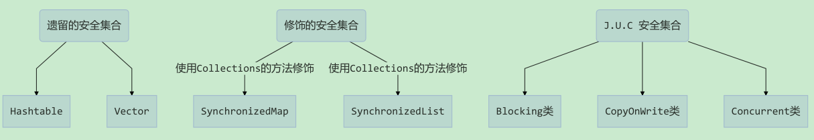

## 1. 线程安全集合类概述



线程安全集合类可以分为三大类：

- 遗留的线程安全集合如 `Hashtable`，`Vector`
- 使用 `Collections` 工具类装饰的线程安全集合，如：
    - `Collections.synchronizedCollection`
    - `Collections.synchronizedList`
    - `Collections.synchronizedMap`
    - `Collections.synchronizedSet`
    - `Collections.synchronizedNavigableMap`
    - `Collections.synchronizedNavigableSet`
    - `Collections.synchronizedSortedMap`
    - `Collections.synchronizedSortedSet`
- `java.util.concurrent.*` 包的线程安全集合类。其类命名包含三类关键字：`Blocking`、`CopyOnWrite`、`Concurrent`
    - `Blocking` 大部分实现基于锁，并提供用来阻塞的方法
    - `CopyOnWrite` 之类容器修改开销相对较重
    - `Concurrent` 类型的容器。内部很多操作使用 cas 优化，一般可以提供较高吞吐量，其特点是**弱一致性**。例如，当利用迭代器遍历时，如果容器发生修改，迭代器仍然可以继续进行遍历，此时数据是旧的，因此这种情况下，调用`size`方法获取大小值和读取数据的值未必是 100% 准确

> Tips: 对于非安全容器来讲，遍历时如果发生了修改，会使用 fail-fast 机制让其遍历立刻失败，抛出 `ConcurrentModificationException` 停止遍历，从而一定程度上保证并发全的问题。

### 1.1. CopyOnWrite 类型容器

#### 1.1.1. CopyOnWrite 机制

Copy-On-Write，写时复制。当往容器添加元素时，不直接往容器添加，而是先将当前容器进行复制，复制出一个新的容器，然后往新的容器添加元素，添加完元素之后，再将原容器的引用指向新容器。这样做的好处就是可以对 CopyOnWrite 容器进行并发的读而不需要加锁，因为当前容器不会被修改。

从 JDK1.5 开始 Java 并发包里提供了两个使用 CopyOnWrite 机制实现的并发容器，它们是 `CopyOnWriteArrayList` 和 `CopyOnWriteArraySet`。以下节选 `CopyOnWriteArrayList` 中的添加元素的方法源码：

```java
public boolean add(E e) {
    final ReentrantLock lock = this.lock;
    lock.lock(); // add方法需要加锁
    try {
        Object[] elements = getArray();
        int len = elements.length;
        Object[] newElements = Arrays.copyOf(elements, len + 1); // 复制新数组
        newElements[len] = e;
        setArray(newElements); // 原容器的引用指向新容器
        return true;
    } finally {
        lock.unlock();
    }
}
```

**Copy-On-Write 机制的缺点**：

- 内存占用问题。由于 CopyOnWrite 的写时复制机制，在进行写操作的时候，内存里会同时驻扎两个对象的内存。
- 数据的实时一致性问题。因为数量复制到新的容器中进行操作，所以 CopyOnWrite 容器不能保证读取实时的数据，可能会读取到旧数据。

> Notes: <font color=red>**CopyOnWrite 并发容器用于读多写少的并发场景**</font>

### 1.2. Blocking 类型容器

#### 1.2.1. 阻塞队列

阻塞队列是 `java.util.concurrent` 包下重要的数据结构，是 Java 集合框架的一部分。它有如下特点：

- 当往阻塞队列添加一个元素时，如果队列已满，线程将会阻塞等待直到队列有可用空间。
- 当从阻塞队列中检索或移除一个元素的时候，如果队列为空，线程将会阻塞等待直到队列变为非空。

使用阻塞算法的队列可以用一个锁（入队和出队用同一把锁）或两个锁（入队和出队用不同的锁）等方式来实现。与一般的队列的区别就在于：

1. 多线程支持，多个线程可以安全的访问队列
2. 阻塞操作，当队列为空的时候，消费线程会阻塞等待队列不为空；当队列满了的时候，生产线程就会阻塞直到队列不满

阻塞队列使用最经典的场景就是 socket 客户端数据的读取和解析，读取数据的线程不断将数据放入队列，然后解析线程不断从队列取数据解析。

> Tips: JDK 1.5 之前也可以使用普通的集合来实现同步存取，通过使用线程的协作和线程同步可以实现生产者，消费者模式，主要的技术就是 wait, notify, notifyAll, sychronized 等。JDK 1.5 开始就可以直接使用阻塞队列实现。

#### 1.2.2. 阻塞队列实现原理

JDK 使用通知模式实现阻塞队列。所谓通知模式，就是当生产者往满的队列里添加元素时会阻塞生产者，当消费者消费了一个队列中的元素后，会通知生产者当前队列可用。以下节选 `ArrayBlockingQueue` 使用 `Condition` 来实现的部分源码：

```java
public class ArrayBlockingQueue<E> extends AbstractQueue<E>
        implements BlockingQueue<E>, java.io.Serializable {
    // ...省略
    /** Main lock guarding all access */
    private final Condition notEmpty;
    /** Condition for waiting puts */
    private final Condition notFull;

    public ArrayBlockingQueue(int capacity, boolean fair) {
        if (capacity <= 0)
            throw new IllegalArgumentException();
        this.items = new Object[capacity];
        lock = new ReentrantLock(fair);
        notEmpty = lock.newCondition();
        notFull =  lock.newCondition();
    }

    public E take() throws InterruptedException {
        final ReentrantLock lock = this.lock;
        lock.lockInterruptibly();
        try {
            while (count == 0) // 队列为空时，阻塞当前消费者
                notEmpty.await();
            return dequeue();
        } finally {
            lock.unlock();
        }
    }

    public void put(E e) throws InterruptedException {
        checkNotNull(e);
        final ReentrantLock lock = this.lock;
        lock.lockInterruptibly();
        try {
            while (count == items.length)
                notFull.await();
            enqueue(e);
        } finally {
            lock.unlock();
        }
    }

    private void enqueue(E x) {
        final Object[] items = this.items;
        items[putIndex] = x;
        if (++putIndex == items.length)
            putIndex = 0;
        count++;
        notEmpty.signal(); // 队列不为空时，通知消费者获取元素
    }
    // ...省略
}
```

## 2. BlockingQueue 接口

### 2.1. 概述

```java
public interface BlockingQueue<E> extends Queue<E>
```

`java.util.concurrent.BlockingQueue` 接口继承 `Queue` 接口，是一个**阻塞队列**。主要<font color=red>**用于实现生产者-消费者模式**</font>。使用者不需要担心等待生产者是否有可用的空间，或消费者是否有可用的对象，因为它都在 `BlockingQueue` 的实现类中被处理了。

### 2.2. BlockingQueue 接口方法

#### 2.2.1. 插入操作

```java
boolean add(E e);
```

- 将指定元素插入此队列中（如果立即可插入且不会违反容量限制），成功时返回 true，如果当前没有可用的空间，则抛出 `IllegalStateException`。如果该元素是 NULL，则会抛出 `NullPointerException`。

```java
boolean offer(E e);
```

- 将指定元素插入此队列中（如果立即可插入且不会违反容量限制），成功时返回 true，如果当前没有可用的空间，则返回 false。

```java
boolean offer(E e, long timeout, TimeUnit unit) throws InterruptedException;
```

- 将指定元素插入此队列中，可设定等待的时间。如果在指定的时间内，还不能往队列中加入元素，则返回失败。

```java
void put(E e) throws InterruptedException;
```

- 将指定元素插入此队列中，将等待可用的空间（如果有必要）

节选 `ArrayBlockingQueue` 源码实现：

```java
public void put(E e) throws InterruptedException {
    checkNotNull(e);
    final ReentrantLock lock = this.lock;
    lock.lockInterruptibly();
    try {
        while (count == items.length)
            notFull.await();
        enqueue(e);
    } finally {
        lock.unlock();
    }
}
```

#### 2.2.2. 获取数据操作

```java
E poll();
```

- 取出队列里排在首位的元素，若不能立即取出，则返回 null。此方法继承自 `Queue`。

```java
E poll(long timeout, TimeUnit unit) throws InterruptedException;
```

- 从队列取出一个队首的元素，如果在指定时间内，队列一旦有数据可取，则立即返回队列中的数据。否则直到时间超时还没有数据可取，返回失败。

```java
E take() throws InterruptedException;
```

- 取走队列里排在首位的元素，若队列为空，线程阻塞并进入等待状态直到队列有新的数据被加入。

```java
int drainTo(Collection<? super E> c);
```

- 一次性从队列获取所有可用的数据对象，并存放到 `Collection<? super E> c` 集合中。通过该方法，可以提升获取数据效率，不需要多次分批加锁或释放锁。

```java
int drainTo(Collection<? super E> c, int maxElements);
```

- 一次性从队列获取指定数量（maxElements）可用的数据对象，并存放到 `Collection<? super E> c` 集合中。

## 3. BlockingQueue 内置实现类

Java 提供了 `BlockingQueue` 接口的实现有：

- `ArrayBlockingQueue`：由数组结构组成的有界阻塞队列。
- `LinkedBlockingQueue`：由链表结构组成的有界阻塞队列。
- `PriorityBlockingQueue`：支持优先级排序的无界阻塞队列。
- `DelayQueue`：使用优先级队列实现的无界阻塞队列。
- `SynchronousQueue`：不存储元素的阻塞队列。
- `LinkedTransferQueue`：由链表结构组成的无界阻塞队列。
- `LinkedBlockingDeque`：由链表结构组成的双向阻塞队列。

### 3.1. ArrayBlockingQueue

`ArrayBlockingQueue` 是基于数组实现的有界阻塞队列，<font color=red>**一旦创建，容量不能改变**</font>。其并发控制采用可重入锁来控制，不管是插入操作还是读取操作，都需要获取到锁才能进行操作。队列按照先进先出（FIFO）原则对元素进行排序，**默认情况下不保证元素操作的公平性**。

队列操作的公平性指在生产者线程或消费者线程发生阻塞后再次被唤醒时，按照阻塞的先后顺序操作队列，即先阻塞的生产者线程优先向队列中插入元素，先阻塞的消费者线程优先从队列中获取元素。因为保证公平性会降低吞吐量，所以如果要处理的数据没有先后顺序，则对其可以使用非公平处理的方式。可以通过 `ArrayBlockingQueue` 有参构造方法中的参数来指定是否为公平的阻塞队列

```java
// 大小为1000的公平队列
BlockingQueue<String> fairQueue = new ArrayBlockingQueue<>(1000, true);
// 大小为1000的非公平队列
BlockingQueue<String> unfairQueue = new ArrayBlockingQueue<>(1000, false);
```

### 3.2. LinkedBlockingQueue

`LinkedBlockingQueue` 是基于单向链表实现的阻塞队列，该队列按照先进先出（FIFO）原则对元素进行排序。通常在创建实例时，会指定队列最大的容量。此队列的默认最大长度为 `Integer.MAX_VALUE`（*类似无限大小的容量*）。

`LinkedBlockingQueue` **对生产者端和消费者端分别采用了两个独立的锁来控制数据同步**，可以将队列头部的锁理解为写锁，将队列尾部的锁理解为读锁，因此生产者和消费者可以基于各自独立的锁并行地操作队列中的数据，队列的并发性能较高。

```java
BlockingQueue<String> queue = new LinkedBlockingDeque<>(100);
```

### 3.3. PriorityBlockingQueue

`PriorityBlockingQueue` 是一个支持优先级的**无界**队列，元素在**默认情况下采用自然顺序升序排列**。可以自定义实现 `compareTo` 方法来指定元素进行排序规则，或者在初始化 `PriorityBlockingQueue` 时指定构造参数 `Comparator` 来实现对元素的排序。

> Notes: **如果两个元素的优先级相同，则不能保证该元素的存储和访问顺序**。

`PriorityBlockingQueue` 只能指定初始的队列大小，后面插入元素的时候，如果空间不够的话会自动扩容。它可以看作 `PriorityQueue` 的线程安全版本。

`PriorityBlockingQueue` 不可以插入 null 值，同时，插入队列的对象必须实现了 `Comparable` 接口，否则报 `ClassCastException` 异常。插入操作 `put` 方法不会阻塞，因为它是无界队列（`take` 方法在队列为空的时候会阻塞）。

```java
// 实现 Comparable 接口
public class Data implements Comparable<Data> {
    private int number; // 定义用来排序的字段

    public int getNumber() {
        return number;
    }

    public void setNumber(int number) {
        this.number = number;
    }

    // 自定义排序的规则：使用 number 字段来排序
    @Override
    public int compareTo(Data o) {
        return Integer.compare(this.number, o.getNumber());
    }
}

// 使用示例
@Test
public void tset() {
    // 元素实现 Comparable 接口并重写 compareTo 排序方法
    BlockingQueue<Data> queue = new PriorityBlockingQueue<>(100);
    // 构造函数中的直接使用 Comparator 实现
    BlockingQueue<Data> queue1 = new PriorityBlockingQueue<>(100, Comparator.comparingInt(Data::getNumber));
}
```

### 3.4. DelayQueue

`DelayQueue` 是一个**支持延时获取元素的无界阻塞队列**，该队列底层使用 `PriorityQueue` 实现。队列中的元素必须实现 `Delayed` 接口，该接口定义了在创建元素时该元素的延迟时间，在内部通过为每个元素的操作加锁来保障数据的一致性。只有在延迟时间到后才能从队列中提取元素。此类型队列的运用于场景如下：

- **缓存系统的设计**：可以用 `DelayQueue` 保存缓存元素的有效期，使用一个线程循环查询队列，一旦能从队列中获取元素，则表示缓存的有效期到了。
- **定时任务调度**：使用 `DelayQueue` 保存即将执行的任务和执行时间，一旦从队列中获取元素，就表示任务开始执行。Java 中的 `TimerQueue` 就是使用 `DelayQueue` 实现的。

```java
// 定义延迟对象实现 Delayed 接口
public class DelayData implements Delayed {
    private int number; // 定义用来排序的字段

    public int getNumber() {
        return number;
    }

    public void setNumber(int number) {
        this.number = number;
    }

    @Override
    public long getDelay(TimeUnit unit) {
        return 5000L; // 设置队列 5s 延迟获取
    }

    // 自定义排序的规则：使用 number 字段来排序
    @Override
    public int compareTo(Delayed o) {
        DelayData d = (DelayData) o;
        return Integer.compare(this.getNumber(), d.getNumber());
    }
}

// 测试
@Test
public void tset() {
    // 创建延时队列
    DelayQueue<DelayData> queue = new DelayQueue<>();
    // 实时添加数据
    queue.add(new DelayData());
    while (true) {
        try {
            DelayData data = queue.take(); // 延迟 5s 后才能获取数据
        } catch (InterruptedException e) {
            throw new RuntimeException(e);
        }
    }
}
```

### 3.5. SynchronousQueue

`SynchronousQueue` 是一个**不存储元素的阻塞队列**。队列中的每个 `put` 操作都必须等待一个 `take` 操作完成，否则不能继续添加元素。`SynchronousQueue` 它负责把生产者线程的数据直接传递给消费者线程，非常适用于传递型场景，比如将在一个线程中使用的数据传递给另一个线程使用 。`SynchronousQueue` 的吞吐量高于 `LinkedBlockingQueue` 和 `ArrayBlockingQueue`。具体的使用方法如下：

```java
public static void main(String[] args) {
    SynchronousQueue<Integer> queue = new SynchronousQueue<>();
    // 模拟生产者线程
    new Thread(() -> {
        try {
            for (int i = 0; i < 5; i++) {
                int product = new Random().nextInt(1000);
                queue.put(product); // 生产一个随机数放入队列
                System.out.println("product a data: " + product);
            }
        } catch (InterruptedException e) {
            e.printStackTrace();
        }
    }).start();
    // 模拟消费者线程
    new Thread(() -> {
        while (true) {
            try {
                Integer data = queue.take();
                System.out.println("customer a data: " + data);
            } catch (InterruptedException e) {
                throw new RuntimeException(e);
            }
        }
    }).start();
}
```

### 3.6. LinkedTransferQueue

`LinkedTransferQueue` 是**基于链表结构实现的无界阻塞 `TransferQueue` 队列**。相对于其他阻塞队列有如下几个特有方法：

```java
void transfer(E e) throws InterruptedException;
```

- 如果当前有消费者正在等待接收元素，该方法就会直接把生产者传入的元素投递给消费者并返回 true；如果没有消费者在等待接收元素，该方法就会将元素存放在队列的尾部（tail）节点，直到该元素被消费后才返回。

```java
boolean tryTransfer(E e);
```

- 此方法首先尝试能否将生产者传入的元素直接传给消费者，如果没有消费者等待接收元素，则返回 false。和 `transfer` 方法的区别是，无论消费者是否接收元素，`tryTransfer` 方法都立即返回，而 `transfer` 方法必须等到元素被消费后才返回。

```java
boolean tryTransfer(E e, long timeout, TimeUnit unit) throws InterruptedException;
```

- 此方法首先尝试把生产者传入的元素直接传给消费者，如果没有消费者，则等待指定的时间，在超时后如果元素还没有被消费，则返回 false；如果在超时时间内消费了元素，则返回 true。

### 3.7. LinkedBlockingDeque

`LinkedBlockingDeque` 是基于链表结构实现的双向阻塞队列，可以在队列的两端分别执行插入和移出元素操作。双端队列因为多了一个操作队列的入口，在多线程同时操作队列时，可以减少一半的锁资源竞争，提高队列的操作效率。在初始化 `LinkedBlockingDeque` 时，可以设置队列的大小以防止内存溢出，双向阻塞队列也常被用于『工作窃取模式』。

LinkedBlockingDeque 比其他阻塞队列，多了一些特有方法，如：`addFirst`、`addLast`、`offerFirst`、`offerLast`、`peekFirst`、`peekLast` 等方法。以 `First` 结尾的方法表示在队列头部执行插入（add）、获取（peek）、移除（offer）操作；以 `Last` 结尾的方法表示在队列的尾部执行插入、获取、移除操作。


