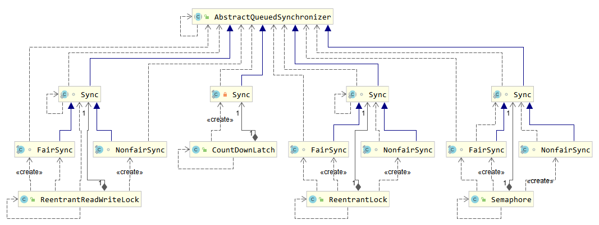
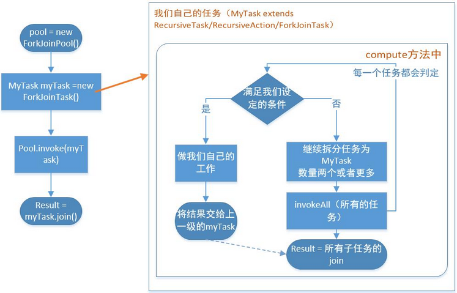
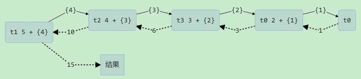

## 1. 并发工具类概述

在 JDK 的 `java.util.concurrent` 包（简称 J.U.C）里，提供了很多并发工具类，均为 `AbstractQueuedSynchronizer` 的实现。

主要用到 AQS 的并发工具类：



## 2. Fork-Join

Fork/Join 是 JDK 1.7 加入的新的线程池实现，它体现的是一种分治思想，适用于能够进行任务拆分的 cpu 密集型运算。它在分治的基础上加入了多线程，可以把每个任务的分解和合并交给不同的线程来完成，进一步提升了运算效率。Fork/Join 默认会创建与 cpu 核心数大小相同的线程池。

> Notes: **任务拆分**，是将一个大任务拆分为算法上相同的小任务，直至不能拆分可以直接求解。跟递归相关的一些计算，如归并排序、斐波那契数列、都可以用分治思想进行求解。

### 2.1. 工作窃取算法

**工作窃取算法**是指某个线程从其他队列里窃取任务来执行。当大任务被分割成小任务时，有的线程可能提前完成任务，此时空闲的线程可以去其他队列窃取任务，帮忙其他没完成工作线程。为了减少竞争，通常使用双端队列，被窃取的线程从头部拿，窃取的线程从尾部拿任务执行。

工作窃取算法的优缺点：

- 优点：充分利用线程进行并行计算，减少了线程间的竞争。
- 缺点：有些情况下还是存在竞争，比如双端队列中只有一个任务。这样就消耗了更多资源。

### 2.2. Fork/Join 使用的标准范式

要使用 Fork/Join 框架，必须首先创建一个 Fork/Join 任务。它提供在任务中执行 fork 和 join 的操作机制，通常不直接继承 `ForkjoinTask` 类，只需要直接继承其子类。如下：

- `RecursiveAction`，用于没有返回结果的任务
- `RecursiveTask`，用于有返回值的任务

定义的任务要通过 `ForkJoinPool` 来执行，使用 `submit` 或 `invoke` 提交，两者的区别是：

- `invoke` 是同步执行，调用之后需要等待任务完成，才能执行后面的代码
- `submit` 是异步执行

而 `join()` 和 `get()` 方法当任务完成的时候返回计算结果。



在实现的 `compute` 方法里，首先需要判断任务是否足够小，如果足够小就直接执行任务。如果不足够小，就必须分割成两个子任务，每个子任务在调用 `invokeAll` 方法时，又会进入 `compute` 方法，看看当前子任务是否需要继续分割成孙任务，如果不需要继续分割，则执行当前子任务并返回结果。使用 `join` 方法会等待子任务执行完并得到其结果。

### 2.3. 基础使用示例

提交给 Fork/Join 线程池的任务需要继承 `RecursiveTask`（有返回值）或 `RecursiveAction`（没有返回值）。

示例需求：定义了一个对 1 ~ n 之间的整数求和的任务

```java
@Slf4j
class ForkJoinTask1 extends RecursiveTask<Integer> {
    int n;

    public ForkJoinTask1(int n) {
        this.n = n;
    }

    @Override
    public String toString() {
        return "{" + n + '}';
    }

    @Override
    protected Integer compute() {
        if (n == 1) {
            log.debug("join() {}", n);
            return n;
        }
        ForkJoinTask1 t1 = new ForkJoinTask1(n - 1);

        t1.fork();
        log.debug("fork() {} + {}", n, t1);
        int result = n + t1.join();
        log.debug("join() {} + {} = {}", n, t1, result);
        return result;
    }
}
```

提交给 `ForkJoinPool` 来执行

```java
public static void main(String[] args) {
    ForkJoinPool pool = new ForkJoinPool(4);
    log.info("ForkJoinTask1 任务计算结果：{}", pool.invoke(new ForkJoinTask1(5)));
}
```

输出结果：

```java
2023-03-03 22:36:47.218 [ForkJoinPool-1-worker-3] DEBUG c.moon.concurrent.juc.ForkJoinTask1 - fork() 3 + {2}
2023-03-03 22:36:47.218 [ForkJoinPool-1-worker-2] DEBUG c.moon.concurrent.juc.ForkJoinTask1 - fork() 4 + {3}
2023-03-03 22:36:47.218 [ForkJoinPool-1-worker-0] DEBUG c.moon.concurrent.juc.ForkJoinTask1 - fork() 2 + {1}
2023-03-03 22:36:47.218 [ForkJoinPool-1-worker-1] DEBUG c.moon.concurrent.juc.ForkJoinTask1 - fork() 5 + {4}
2023-03-03 22:36:47.221 [ForkJoinPool-1-worker-3] DEBUG c.moon.concurrent.juc.ForkJoinTask1 - join() 1
2023-03-03 22:36:47.222 [ForkJoinPool-1-worker-0] DEBUG c.moon.concurrent.juc.ForkJoinTask1 - join() 2 + {1} = 3
2023-03-03 22:36:47.222 [ForkJoinPool-1-worker-3] DEBUG c.moon.concurrent.juc.ForkJoinTask1 - join() 3 + {2} = 6
2023-03-03 22:36:47.222 [ForkJoinPool-1-worker-2] DEBUG c.moon.concurrent.juc.ForkJoinTask1 - join() 4 + {3} = 10
2023-03-03 22:36:47.222 [ForkJoinPool-1-worker-1] DEBUG c.moon.concurrent.juc.ForkJoinTask1 - join() 5 + {4} = 15
2023-03-03 22:36:47.222 [main] INFO  com.moon.concurrent.juc.ForkJoinDemo - ForkJoinTask1 任务计算结果：15
```

处理流程图示：



### 2.4. 示例改进版

```java
@Slf4j
class ForkJoinTask3 extends RecursiveTask<Integer> {

    int begin;
    int end;

    public ForkJoinTask3(int begin, int end) {
        this.begin = begin;
        this.end = end;
    }

    @Override
    public String toString() {
        return "{" + begin + "," + end + '}';
    }

    @Override
    protected Integer compute() {
        if (begin == end) {
            log.debug("join() {}", begin);
            return begin;
        }
        if (end - begin == 1) {
            log.debug("join() {} + {} = {}", begin, end, end + begin);
            return end + begin;
        }
        int mid = (end + begin) / 2;

        ForkJoinTask3 t1 = new ForkJoinTask3(begin, mid);
        t1.fork();
        ForkJoinTask3 t2 = new ForkJoinTask3(mid + 1, end);
        t2.fork();
        log.debug("fork() {} + {} = ?", t1, t2);

        int result = t1.join() + t2.join();
        log.debug("join() {} + {} = {}", t1, t2, result);
        return result;
    }
}
```

提交给 ForkJoinPool 来执行

```java
public static void main(String[] args) {
    ForkJoinPool pool = new ForkJoinPool(4);
    log.info("ForkJoinTask1 任务计算结果：{}", pool.invoke(new ForkJoinTask3(1, 5)));
}
```

输出结果：

```java
2023-03-03 22:39:54.290 [ForkJoinPool-1-worker-0] DEBUG c.moon.concurrent.juc.ForkJoinTask3 - join() 1 + 2 = 3
2023-03-03 22:39:54.290 [ForkJoinPool-1-worker-3] DEBUG c.moon.concurrent.juc.ForkJoinTask3 - join() 4 + 5 = 9
2023-03-03 22:39:54.290 [ForkJoinPool-1-worker-2] DEBUG c.moon.concurrent.juc.ForkJoinTask3 - fork() {1,2} + {3,3} = ?
2023-03-03 22:39:54.290 [ForkJoinPool-1-worker-1] DEBUG c.moon.concurrent.juc.ForkJoinTask3 - fork() {1,3} + {4,5} = ?
2023-03-03 22:39:54.293 [ForkJoinPool-1-worker-0] DEBUG c.moon.concurrent.juc.ForkJoinTask3 - join() 3
2023-03-03 22:39:54.293 [ForkJoinPool-1-worker-2] DEBUG c.moon.concurrent.juc.ForkJoinTask3 - join() {1,2} + {3,3} = 6
2023-03-03 22:39:54.293 [ForkJoinPool-1-worker-1] DEBUG c.moon.concurrent.juc.ForkJoinTask3 - join() {1,3} + {4,5} = 15
2023-03-03 22:39:54.293 [main] INFO  com.moon.concurrent.juc.ForkJoinDemo - ForkJoinTask1 任务计算结果：15
```

处理流程图示：


## 3. CountDownLatch

### 3.1. 概述

`CountDownLatch` 是一个同步工具类，用于进行线程同步协作，允许一个或多个线程一直等待其他线程的操作执行完后再执行相关操作。

`CountDownLatch` 基于线程计数器来实现并发访问控制，主要用于主线程等待其他子线程都执行完毕后执行相关操作。

### 3.2. 执行流程

在主线程中定义 `CountDownLatch`，其中构造参数用来初始化等待计数值，具体的实现是在其内部创建并维护了一个 `volatile` 类型的整数计数器，将线程计数器的初始值设置为子线程的个数，多个子线程并发执行。

在主线程中调用 `await()` 用来等待计数归零，此时主线程会阻塞；而每个子线程在执行完毕后都会调用 `countDown` 函数将计数器的值减 1（此计数器的操作是原子操作，同时只能有一个线程进行操作，也就是同时只能有一个线程去减这个计数器里面的值。），直到线程计数器为 0，表示所有的子线程任务都已执行完毕，此时在 `CountDownLatch` 上等待的主线程将被唤醒并继续执行。

> Notes: 值得注意的是，<font color=red>**此计数器无法被重置，只能使用一次**</font>。

### 3.3. 常用方法

```java
public void await() throws InterruptedException
```

- 线程被挂起直到 count 值为 0 才继续执行

```java
public boolean await(long timeout, TimeUnit unit) throws InterruptedException
```

- 线程被挂起，在等待一定的时间后，即使 count 值还没变为 0，也会继续执行

```java
public void countDown()
```

- 将 count 值减 1

### 3.4. 使用示例

示例：主线程等待两个子线程执行完成后才开始继续执行

```java
// 定义大小为 2 的信号计算器
final CountDownLatch countDownLatch = new CountDownLatch(2);
new Thread(() -> {
    try {
        System.out.println("线程1开始执行");
        Thread.sleep(2000);
        System.out.println("线程1执行结束");
        countDownLatch.countDown(); // 线程1执行结束后，调用 countDown 方法
    } catch (InterruptedException e) {
        e.printStackTrace();
    }
}).start();
new Thread(() -> {
    try {
        System.out.println("线程2开始执行");
        Thread.sleep(3500);
        System.out.println("线程2执行结束");
        countDownLatch.countDown(); // 线程2执行结束后，调用 countDown 方法
    } catch (InterruptedException e) {
        e.printStackTrace();
    }
}).start();

try {
    System.out.println("主线程在等待....");
    countDownLatch.await(); // 调用 await 方法，主线程会阻塞，直到所有子线程都调用 countDown 方法后
    System.out.println("子线程全部执行完成，主线程继续执行....");
} catch (InterruptedException e) {
    e.printStackTrace();
}
```

以上示例代码，先定义了一个大小为 2 的 `CountDownLatch`，然后定义了两个子线程并启动该子线程，子线程执行完业务代码后在执行 `countDown()` 时会减少一个信号量，表示自己已经执行完成。主线程调用 `await()` 阻塞等待，在所有线程都执行完成并调用了 `countDown` 函数时，表示所有线程均执行完成，这时程序会主动唤醒主线程并开始执行主线程的业务逻辑。

可以配合线程池使用的示例：

```java
@Test
public void countdownLatchWithPoolTest() throws InterruptedException {
    CountDownLatch latch = new CountDownLatch(3);
    ExecutorService pool = Executors.newFixedThreadPool(4);

    pool.submit(() -> {
        log.debug("begin...");
        try {
            Thread.sleep(1000);
        } catch (InterruptedException e) {
            e.printStackTrace();
        }
        latch.countDown();
        log.debug("end...{}", latch.getCount());
    });
    pool.submit(() -> {
        log.debug("begin...");
        try {
            Thread.sleep(2000);
        } catch (InterruptedException e) {
            e.printStackTrace();
        }
        latch.countDown();
        log.debug("end...{}", latch.getCount());
    });
    pool.submit(() -> {
        log.debug("begin...");
        try {
            Thread.sleep(1500);
        } catch (InterruptedException e) {
            e.printStackTrace();
        }
        latch.countDown();
        log.debug("end...{}", latch.getCount());
    });

    log.debug("waiting...");
    latch.await();
    log.debug("wait end...");
}
```

输出结果：

```java
2023-03-07 16:11:51.209 [pool-1-thread-2] DEBUG c.m.c.juc.CountdownLatchDemo - begin...
2023-03-07 16:11:51.209 [pool-1-thread-3] DEBUG c.m.c.juc.CountdownLatchDemo - begin...
2023-03-07 16:11:51.209 [pool-1-thread-1] DEBUG c.m.c.juc.CountdownLatchDemo - begin...
2023-03-07 16:11:51.209 [main] DEBUG c.m.c.juc.CountdownLatchDemo - waiting...
2023-03-07 16:11:52.223 [pool-1-thread-1] DEBUG c.m.c.juc.CountdownLatchDemo - end...2
2023-03-07 16:11:52.721 [pool-1-thread-3] DEBUG c.m.c.juc.CountdownLatchDemo - end...1
2023-03-07 16:11:53.222 [pool-1-thread-2] DEBUG c.m.c.juc.CountdownLatchDemo - end...0
2023-03-07 16:11:53.222 [main] DEBUG c.m.c.juc.CountdownLatchDemo - wait end...
```

### 3.5. 应用示例

#### 3.5.1. 同步等待多线程准备完毕

```java
public static void main(String[] args) throws InterruptedException {
    AtomicInteger num = new AtomicInteger(0);
    ExecutorService threadPool = Executors.newFixedThreadPool(10, (r) -> {
        return new Thread(r, "t" + num.getAndIncrement());
    });

    CountDownLatch latch = new CountDownLatch(10);
    String[] all = new String[10];
    Random r = new Random();

    for (int j = 0; j < 10; j++) {
        int x = j;
        threadPool.submit(() -> {
            for (int i = 0; i <= 100; i++) {
                try {
                    Thread.sleep(r.nextInt(100));
                } catch (InterruptedException e) {
                    e.printStackTrace();
                }
                all[x] = Thread.currentThread().getName() + "(" + (i + "%") + ")";
                System.out.print("\r" + Arrays.toString(all));
            }
            latch.countDown();
        });
    }

    latch.await();
    System.out.println("\n游戏开始...");
    threadPool.shutdown();
}
```

运行过程输出内容：

```java
[t0(52%), t1(47%), t2(51%), t3(40%), t4(49%), t5(44%), t6(49%), t7(52%), t8(46%), t9(46%)]
```

程序最终输出结果：

```java
[t0(100%), t1(100%), t2(100%), t3(100%), t4(100%), t5(100%), t6(100%), t7(100%), t8(100%), t9(100%)]
游戏开始...
```

#### 3.5.2. 同步等待多个远程调用结束

测试控制层

```java
@RestController
public class TestCountDownlatchController {
    
    @GetMapping("/order/{id}")
    public Map<String, Object> order(@PathVariable int id) {
        HashMap<String, Object> map = new HashMap<>();
        map.put("id", id);
        map.put("total", "2300.00");
        sleep(2000);
        return map;
    }

    @GetMapping("/product/{id}")
    public Map<String, Object> product(@PathVariable int id) {

        HashMap<String, Object> map = new HashMap<>();
        if (id == 1) {
            map.put("name", "小爱音箱");
            map.put("price", 300);
        } else if (id == 2) {
            map.put("name", "小米手机");
            map.put("price", 2000);
        }
        map.put("id", id);
        sleep(1000);
        return map;
    }

    @GetMapping("/logistics/{id}")
    public Map<String, Object> logistics(@PathVariable int id) {
        HashMap<String, Object> map = new HashMap<>();
        map.put("id", id);
        map.put("name", "中通快递");
        sleep(2500);
        return map;
    }

    private void sleep(int millis) {
        try {
            Thread.sleep(millis);
        } catch (InterruptedException e) {
            e.printStackTrace();
        }
    }
}
```

rest 远程调用

```java
public static void main(String[] args) throws ExecutionException, InterruptedException {
    RestTemplate restTemplate = new RestTemplate();

    log.debug("执行开始");
    ExecutorService threadPool = Executors.newCachedThreadPool();
    /*CountDownLatch latch = new CountDownLatch(4);

    threadPool.submit(() -> {
        restTemplate.getForObject("http://localhost:8080/order/{1}", Map.class, 1);
        latch.countDown();
    });
    threadPool.submit(() -> {
        restTemplate.getForObject("http://localhost:8080/product/{1}", Map.class, 1);
        latch.countDown();
    });
    threadPool.submit(() -> {
        restTemplate.getForObject("http://localhost:8080/product/{1}", Map.class, 2);
        latch.countDown();
    });
    threadPool.submit(() -> {
        restTemplate.getForObject("http://localhost:8080/logistics/{1}", Map.class, 1);
        latch.countDown();
    });

    latch.await();*/
    
    // 为了获取请求返回值改造
    Future<Map<String, Object>> f1 = threadPool.submit(() -> {
        Map<String, Object> r =
                restTemplate.getForObject("http://localhost:8080/order/{1}", Map.class, 1);
        return r;
    });
    Future<Map<String, Object>> f2 = threadPool.submit(() -> {
        Map<String, Object> r =
                restTemplate.getForObject("http://localhost:8080/product/{1}", Map.class, 1);
        return r;
    });
    Future<Map<String, Object>> f3 = threadPool.submit(() -> {
        Map<String, Object> r =
                restTemplate.getForObject("http://localhost:8080/product/{1}", Map.class, 2);
        return r;
    });
    Future<Map<String, Object>> f4 = threadPool.submit(() -> {
        Map<String, Object> r =
                restTemplate.getForObject("http://localhost:8080/logistics/{1}", Map.class, 1);
        return r;
    });

    System.out.println(f1.get());
    System.out.println(f2.get());
    System.out.println(f3.get());
    System.out.println(f4.get());

    log.debug("执行完毕");
    threadPool.shutdown();
}
```

## 4. CyclicBarrier

### 4.1. 概述

`CyclicBarrier`（循环屏障）是一个同步工具，可以实现让一组线程互相等待至某个状态之后再全部同时执行。构造时设置『计数个数』，每个线程执行到某个需要“同步”的时刻调用 `await()` 方法进行等待，当等待的线程数满足『计数个数』时，继续执行。

与 `CountDownLatch` 主要的区别是，`CyclicBarrier` 在所有等待线程都被释放之后，可以被重用。`CyclicBarrier` 的运行状态叫作 `Barrier` 状态，在调用 `await` 方法后，线程就处于 `Barrier` 状态。

### 4.2. 构造函数

```java
public CyclicBarrier(int parties)
```

- 初始化相互等待的线程数量的构造方法。

```java
public CyclicBarrier(int parties, Runnable barrierAction)
```

- 初始化相互等待的线程数量以及屏障线程的构造方法，当 CyclicBarrier 的计数器变为 0 时，会执行 barrierAction 构造方法。

### 4.3. 常用方法

```java
public int getParties()
```

- 获取 CyclicBarrier 打开屏障的线程数量，也称为方数。

```java
public int getNumberWaiting()
```

- 获取正在CyclicBarrier上等待的线程数量。

```java
public boolean isBroken()
```

- 获取是否破损标志位 broken 的值。该值有以下几种情况：
    - CyclicBarrier 初始化时，标志位 broken 为 false，表示屏障未破损；
    - 如果正在等待的线程被中断，标志位 broken 为 true，表示屏障破损；
    - 如果正在等待的线程超时，则标志位 broken 为 true，表示屏障破损；
    - 如果有线程调用 `CyclicBarrier.reset()` 方法，则标志位 broken 为 false，表示屏障回到未破损状态。

```java
public void reset()
```

- 使得 CyclicBarrier 回归初始状态，会做以下处理：
    - 如果有正在等待的线程，则会抛出 `BrokenBarrierException` 异常，且这些线程停止等待，继续执行。
    - 将是否破损标志位 broken 置为 false。

`CyclicBarrier` 中最重要的方法是 `await` 方法，它有两种实现：

```java
public int await() throws InterruptedException, BrokenBarrierException
```

- 当前线程在 await 方法位置进行阻塞等待，直到发生以下情形之一：
    - 在 CyclicBarrier 上等待的线程数量达到 parties（构造函数中指定的相互等待的线程数量），并且都为 `Barrier` 状态，则所有线程被释放，继续执行后续的任务。
    - 当前线程被中断，则抛出 `InterruptedException` 异常，并停止等待，继续执行；
    - 其他等待的线程被中断，则当前线程抛出 `BrokenBarrierException` 异常，并停止等待，继续执行；
    - 其他等待的线程超时，则当前线程抛出 `BrokenBarrierException` 异常，并停止等待，继续执行；
    - 其他线程调用 `CyclicBarrier.reset()` 方法，则当前线程抛出 `BrokenBarrierException` 异常，并停止等待，继续执行。

```java
public int await(long timeout, TimeUnit unit) throws InterruptedException, BrokenBarrierException, TimeoutException
```

- 设置一个超时时间，在超时时间过后，如果还有线程未达到 `Barrier` 状态，则不再等待，让达到 `Barrier` 状态的线程继续执行后续的任务。有以下几种情况：
    - 在 CyclicBarrier 上等待的线程数量达到 parties，则所有线程被释放，继续执行；
    - 当前线程被中断，则抛出 `InterruptedException` 异常，并停止等待，继续执行；
    - 当前线程等待超时，则抛出 `TimeoutException` 异常，并停止等待，继续执行；
    - 其他等待的线程被中断，则当前线程抛出 `BrokenBarrierException` 异常，并停止等待，继续执行；
    - 其他等待的线程超时，则当前线程抛出 `BrokenBarrierException` 异常，并停止等待，继续执行；
    - 其他线程调用 `CyclicBarrier.reset()` 方法，则当前线程抛出 `BrokenBarrierException` 异常，并停止等待，继续执行。

### 4.4. 使用示例

```java
int n = 4;
// 定义 CyclicBarrier 循环屏障
CyclicBarrier cyclicBarrier = new CyclicBarrier(n);
// 循环执行子线程
for (int i = 0; i < n; i++) {
    new Thread(() -> {
        try {
            System.out.println(Thread.currentThread().getName() + "开始执行");
            Thread.sleep(5000);
            System.out.println(Thread.currentThread().getName() + "等待其他线程准备");
            // 子线程执行完成，等待其他线程也成为 Barrier 状态
            cyclicBarrier.await();
        } catch (Exception e) {
            e.printStackTrace();
        }
        // 所有线程状态均为 Barrier 时，开始执行下一项任务
        System.out.println("所有线程准备工作全部完成，执行下一项任务....");
    }, "thread" + i).start();
}
```

以上示例代码，先定义了一个 `CyclicBarrier`，然后循环启动了多个线程，每个线程在内部开始执行第 1 阶段的工作，比如查询数据等；等第 1 阶段的工作处理完成后，再调用 `cyclicBarrier.await` 方法等待其他线程也完成第 1 阶段的工作（`CyclicBarrier` 让一组线程等待到达某个状态再一起执行）；等其他线程也执行完第 1 阶段的工作，便可执行并发操作的下一项任务，比如数据分发等。

### 4.5. 实现原理

CyclicBarrier 的类图


由上图可知 `CyclicBarrier` 是基于独占锁 `ReentrantLock` 实现的，其底层也是基于 AQS 的。

在 `CyclicBarrier` 类的内部有一个计数器 count，当 count 不为 0 时，每个线程在到达屏障点会先调用 `await()` 方法将自己阻塞，此时计数器会减 1，直到计数器减为 0 的时候，所有因调用 `await()` 方法而被阻塞的线程就会被唤醒继续执行。当 count 计数器变成 0 之后，就会进入下一轮阻塞，此时 parties（parties 是在 `new CyclicBarrier(parties)` 时设置的值）会将它的值赋值给 count 从而实现复用。 

## 5. Semaphore

### 5.1. 概述

`Semaphore` 是一种基于计数的信号量，用于控制同时访问共享资源的线程数量上限。在定义信号量对象时可以设定一个阈值，基于该阈值，多个线程竞争获取许可信号，线程竞争到许可信号后开始执行具体的业务逻辑，业务逻辑在执行完成后释放该许可信号。在许可信号的竞争队列超过阈值后，新加入的申请许可信号的线程将被阻塞，直到有其他许可信号被释放。

### 5.2. 基础用法

通过调用 `acquire()` 获取一个许可，如果没有许可，则等待，在许可使用完毕后通过 `release()` 释放该许可，以便其他线程使用。

```java
// 第1步：创建一个计数阈值为5的信号里对象，即最多只能有5个线程同时访问
Semaphore semaphore = new Semaphore(5);
try {
    semaphore.acquire(); // 第2步：申请许可
    try {
        // 第3步：执行线程的业务逻辑
        System.out.println("do something...");
    } catch (Exception e) {
        e.printStackTrace();
    } finally {
        // 第4步：释放许可
        semaphore.release();
    }
} catch (InterruptedException e) {
   e.printStackTrace();
}
```

`Semaphore` 对申请/释放许可与 `ReentrantLock` 的获取/释放锁类似，`Semaphone` 的 `acquire` 方法默认与 `ReentrantLock` 的 `lockInterruptibly` 方法的效果一样，可以响应中断，即等待许可信号资源的过程中可以被 `Thread` 对象 `interrupt` 方法中断而取消对许可信号的申请。

`Semaphore` 也实现了可轮询的锁请求、定时锁的功能，以及公平锁与非公平锁的机制。通过在构造函数中设定是否为公平锁。

`Semaphore` 的锁释放操作也需要手动执行。因此，为了避免线程因执行异常而无法正常释放锁，释放锁的操作必须在 finally 代码块中完成。

> Tips: Semaphore 基本能实现 ReentrantLock 的所有功能，使用方法也与之类似。

`Semaphore` 常被用于多个线程需要共享有限资源的情况，其实也可以用于实现一些对象池、资源池的构建，比如静态全局对象池、数据库连接池等。也可以创建计数为1的 Semaphore，将其作为一种互斥锁的机制（也叫二元信号量，表示两种互斥状态），同一时刻只能有一个线程获取该锁。

### 5.3. 构造函数

Semaphore 提供了两个构造函数，可以手动选择是否使用公平模式来运行 Semaphore。

```java
public Semaphore(int permits) {
    sync = new NonfairSync(permits);
}
```

- 创建指定许可证数量的 Semaphore 对象，默认以非公平模式发放许可证。

```java
public Semaphore(int permits, boolean fair) {
    sync = fair ? new FairSync(permits) : new NonfairSync(permits);
}
```

- 手动选择是否使用公平模式，将 fair 值设置为 true，就以公平模式来获取证书了。

#### 5.3.1. 关于公平模式和非公平模式

所谓的公平模式就是以调用 `acquire()` 的先后顺序来决定获取许可证的顺序的，公平模式遵循先进先出（FIFO）原则；而非公平模式是抢占式的，也就是有可能一个新的获取线程恰好在一个许可证释放时得到了这个许可证，而前面还有等待的线程。

显然使用非公平的模式性能更高，因为它会把许可证发放给刚好准备好的线程，而不用再根据先后顺序去唤醒线程。

### 5.4. 常用方法

```java
public void acquire() throws InterruptedException
```

- 以阻塞的方式获取一个许可，在有可用许可时返回该许可，在没有可用许可时阻塞等待，直到获得许可。

```java
public void acquire(int permits) throws InterruptedException
```

- 同时获取 permits 个许可。

```java
public void release()
```

- 释放某个许可

```java
public void release(int permits)
```

- 释放给定数量(permits)的许可证，将其返回到信号量。

```java
public boolean tryAcquire()
```

- 以非阻塞方式获取一个许可，在有可用许可时获取该许可并返回 true，否则返回 false，不会等待。

```java
public boolean tryAcquire(long timeout, TimeUnit unit) throws InterruptedException
```

- 如果在指定的时间内获取到可用许可，则返回 true，否则返回 false

```java
public boolean tryAcquire(int permits)
```

- 如果成功获取 permits 个许可，则返回 true，否则立即返回 false

```java
public boolean tryAcquire(int permits, long timeout, TimeUnit unit) throws InterruptedException
```

- 如果在指定的时间内成功获取 permits 个许可，则返回 true，否则返回 false。

```java
public int availablePermits()
```

- 查询此信号量中当前可用的许可证数。

```java
public final int getQueueLength()
```

- 返回正在等待获取许可证的线程数。

```java
public final boolean hasQueuedThreads()
```

- 是否有线程正在等待获取许可证。

```java
public boolean isFair()
```

- 查询 Semaphore 使用的是公平模式还是非公平模式，如果此信号量使用的是公平模式则返回 true。

### 5.5. 使用示例

```java
public static void main(String[] args) {
    // 1. 创建 semaphore 对象
    Semaphore semaphore = new Semaphore(3);

    // 2. 创建 10 个线程同时运行
    for (int i = 0; i < 10; i++) {
        new Thread(() -> {
            // 3. 获取许可
            try {
                semaphore.acquire();
            } catch (InterruptedException e) {
                log.error("获取许可异常", e);
            }

            // 执行业务
            try {
                log.debug("running...");
                Thread.sleep(1000);
                log.debug("end...");
            } catch (InterruptedException e) {
                log.error("出现异常", e);
            } finally {
                // 4. 释放许可
                semaphore.release();
            }
        }).start();
    }
}
```

运行结果：

```java
2023-03-07 15:01:05.096 [Thread-1] DEBUG c.moon.concurrent.juc.SemaphoreDemo - running...
2023-03-07 15:01:05.096 [Thread-2] DEBUG c.moon.concurrent.juc.SemaphoreDemo - running...
2023-03-07 15:01:05.096 [Thread-3] DEBUG c.moon.concurrent.juc.SemaphoreDemo - running...
2023-03-07 15:01:06.110 [Thread-3] DEBUG c.moon.concurrent.juc.SemaphoreDemo - end...
2023-03-07 15:01:06.110 [Thread-1] DEBUG c.moon.concurrent.juc.SemaphoreDemo - end...
2023-03-07 15:01:06.110 [Thread-4] DEBUG c.moon.concurrent.juc.SemaphoreDemo - running...
2023-03-07 15:01:06.110 [Thread-5] DEBUG c.moon.concurrent.juc.SemaphoreDemo - running...
2023-03-07 15:01:06.110 [Thread-2] DEBUG c.moon.concurrent.juc.SemaphoreDemo - end...
2023-03-07 15:01:06.110 [Thread-6] DEBUG c.moon.concurrent.juc.SemaphoreDemo - running...
2023-03-07 15:01:07.116 [Thread-4] DEBUG c.moon.concurrent.juc.SemaphoreDemo - end...
2023-03-07 15:01:07.116 [Thread-5] DEBUG c.moon.concurrent.juc.SemaphoreDemo - end...
2023-03-07 15:01:07.117 [Thread-6] DEBUG c.moon.concurrent.juc.SemaphoreDemo - end...
2023-03-07 15:01:07.117 [Thread-8] DEBUG c.moon.concurrent.juc.SemaphoreDemo - running...
2023-03-07 15:01:07.117 [Thread-10] DEBUG c.moon.concurrent.juc.SemaphoreDemo - running...
2023-03-07 15:01:07.117 [Thread-9] DEBUG c.moon.concurrent.juc.SemaphoreDemo - running...
2023-03-07 15:01:08.131 [Thread-9] DEBUG c.moon.concurrent.juc.SemaphoreDemo - end...
2023-03-07 15:01:08.131 [Thread-8] DEBUG c.moon.concurrent.juc.SemaphoreDemo - end...
2023-03-07 15:01:08.131 [Thread-10] DEBUG c.moon.concurrent.juc.SemaphoreDemo - end...
2023-03-07 15:01:08.132 [Thread-7] DEBUG c.moon.concurrent.juc.SemaphoreDemo - running...
2023-03-07 15:01:09.146 [Thread-7] DEBUG c.moon.concurrent.juc.SemaphoreDemo - end...
```

## 6. Exchanger

### 6.1. 概述

`java.util.concurrent.Exchanger` 是一个用于线程间协作的工具类，它提供一个同步点，在这个同步点上，两个线程可以交换彼此的数据。

可简单地将 `Exchanger` 对象理解为一个包含两个格子的容器，可以通过相关方法向两个格子中填充信息，线程通过 `exchange()` 方法交换数据。比如第一个线程执行 `exchange()` 方法后会一直阻塞等待第二个线程执行 `exchange()` 方法。当两个线程都到达同步点时，此两个线程就可以交换数据。当两个格子中的均被填充时，该对象会自动将两个格子的信息交换，然后返回给线程，从而实现两个线程的信息交换。

> Tips: *Exchanger 可以用于遗传算法*（待了解？！）

### 6.2. 常用方法

```java
public V exchange(V x) throws InterruptedException
```

- 等待另一个线程到达这个交换点（除非当前线程 interrupted），然后交换数据。

```java
public V exchange(V x, long timeout, TimeUnit unit) throws InterruptedException, TimeoutException
```

- 等待另一个线程到达这个交换点（除非当前线程 interrupted或到指定的等待时间），然后交换数据。一般来说为了避免一直等待的情况，可以使用带超时时间参数的方法，设置最大等待时间。

## 7. 并发工具类总结

### 7.1. CountDownLatch、CyclicBarrier、Semaphore 的区别

`CountDownLatch` 和 `CyclicBarrier` 都用于实现多线程之间的相互等待，但二者的关注点不同。

- `CountDownLatch` 主要用于<font color=red>**主线程等待其他子线程**</font>任务均执行完毕后再执行接下来的业务逻辑单元；`CyclicBarrier` 主要用于<font color=red>**一组线程互相等待**</font>，相关的线程都达到某个状态后，再同时执行接下来的业务逻辑单元。
- `CountDownLatch` 的线程运行到某个点上之后，只是给某个计数值-1而已，该**线程继续运行**；`CyclicBarrier`的线程是运行到某个点上之后会**停止运行并等待**。
- `CountDownLatch` 是不可以重用的；而 `CyclicBarrier` 是可以重用的，可以使用`reset()` 方法重置计数器。

`Semaphore` 和 Java 中的锁功能类似，主要用于控制访问资源的并发线程数。
