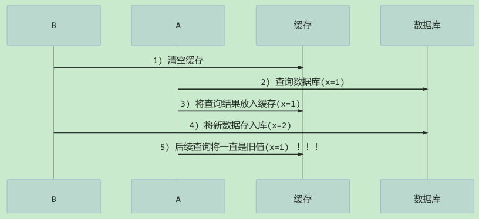
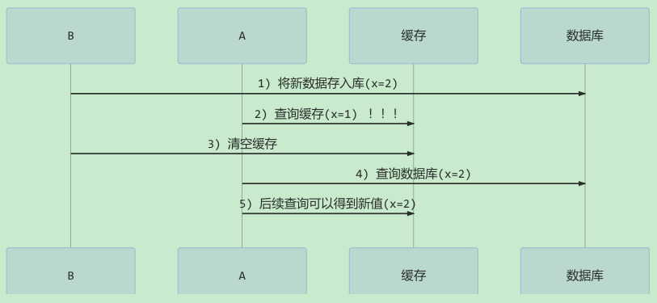
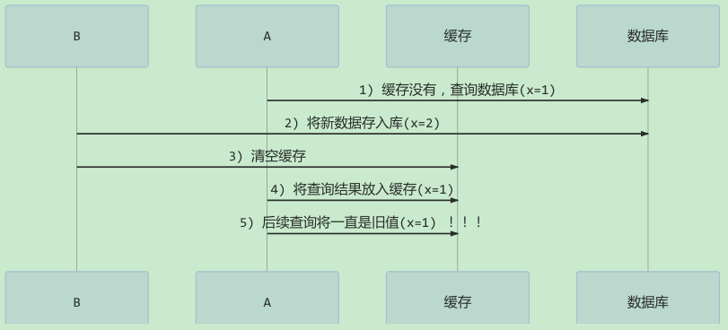

# 并发编程-应用篇

## 1. 限制对 CPU 的使用

限制 CPU 高占用率。

### 1.1. sleep 实现

在没有利用 cpu 来计算时，让 `while(true)` 空转会浪费 cpu，这时可以使用 `yield` 或 `sleep` 来让出 cpu 的使用权给其他程序，从而减少cpu占用率

```java
while (true) {
    try {
        /*
         * 在没有利用 cpu 来计算时，让 while(true) 空转会浪费 cpu，
         * 这时可以使用 yield 或 sleep 来让出 cpu 的使用权给其他程序，
         * 从而减少cpu占用率
         */
        Thread.sleep(1);
    } catch (InterruptedException e) {
        e.printStackTrace();
    }
}
```

- 可以用 `wait` 或条件变量达到类似的效果
- 不同的是，后两种都需要加锁，并且需要相应的唤醒操作，一般适用于要进行同步的场景
- `sleep` 适用于无需锁同步的场景

### 1.2. wait 实现

```java
synchronized(锁对象) {
    while(条件不满足) {
        try {
            锁对象.wait();
        } catch(InterruptedException e) {
            e.printStackTrace();
        }
    }
    // do something...
}
```

### 1.3. 条件变量实现

```java
lock.lock();
try {
    while(条件不满足) {
        try {
            条件变量.await();
        } catch (InterruptedException e) {
            e.printStackTrace();
        }
    }
    // do something...
} finally {
    lock.unlock();
}
```

## 2. 使用 Semaphore 实现限制对共享资源的使用

使用 `Semaphore` 限流，在访问高峰期时，让请求线程阻塞，高峰期过去再释放许可，当然它只适合限制**单机**线程数量，并且仅是限制线程数，而不是限制资源数（例如连接数，请对比 Tomcat LimitLatch 的实现）

下面是使用 `Semaphore` 实现简单连接池限制对共享资源的使用示例，对比『享元模式』下的实现（使用wait notify，代码详见[《并发编程 - 设计模式篇》笔记](/并发编程/并发编程-设计模式篇)的『享元模式』章节），性能和可读性显然更好，注意示例实现中线程数和数据库连接数是相等的。

```java
@Slf4j
class Pool {
    // 1. 连接池大小
    private final int poolSize;
    // 2. 连接对象数组
    private Connection[] connections;
    // 3. 连接状态数组 0 表示空闲， 1 表示繁忙
    private AtomicIntegerArray states;

    // 增加并发工具 信息量
    private Semaphore semaphore;

    // 4. 构造方法初始化
    public Pool(int poolSize) {
        // 让线程许可量与资源数大小一致
        semaphore = new Semaphore(poolSize);

        this.poolSize = poolSize;
        this.connections = new Connection[poolSize];
        this.states = new AtomicIntegerArray(new int[poolSize]);
        for (int i = 0; i < poolSize; i++) {
            connections[i] = new MockConnection("连接" + (i + 1));
        }
    }

    // 5. 借连接
    public Connection borrow() {
        // 获取许可
        try {
            semaphore.acquire(); // 没有许可的线程，在此等待
        } catch (InterruptedException e) {
            log.error("获取许可异常", e);
        }

        for (int i = 0; i < poolSize; i++) {
            // 获取空闲连接
            if (states.get(i) == 0) {
                if (states.compareAndSet(i, 0, 1)) {
                    log.debug("borrow {}", connections[i]);
                    return connections[i];
                }
            }
        }
        // 程序正常不会执行到此处
        return null;
    }

    // 6. 归还连接
    public void free(Connection conn) {
        for (int i = 0; i < poolSize; i++) {
            if (connections[i] == conn) {
                states.set(i, 0);
                log.debug("free {}", conn);
                // 4. 释放许可
                semaphore.release();
                break;
            }
        }
    }
}

class MockConnection implements Connection {
    // 实现略
}
```

使用自定义的连接池测试代码：

```java
Pool pool = new Pool(2);
for (int i = 0; i < 5; i++) {
    new Thread(() -> {
        Connection conn = pool.borrow();
        try {
            Thread.sleep(new Random().nextInt(1000));
        } catch (InterruptedException e) {
            e.printStackTrace();
        }
        pool.free(conn);
    }).start();
}
```

输出结果：

```java
2023-03-07 15:20:49.676 [Thread-2] DEBUG com.moon.concurrent.juc.Pool - borrow com.moon.concurrent.juc.MockConnection@404f4b1
2023-03-07 15:20:49.676 [Thread-1] DEBUG com.moon.concurrent.juc.Pool - borrow com.moon.concurrent.juc.MockConnection@b8db706
2023-03-07 15:20:49.914 [Thread-1] DEBUG com.moon.concurrent.juc.Pool - free com.moon.concurrent.juc.MockConnection@b8db706
2023-03-07 15:20:49.914 [Thread-3] DEBUG com.moon.concurrent.juc.Pool - borrow com.moon.concurrent.juc.MockConnection@b8db706
2023-03-07 15:20:50.224 [Thread-2] DEBUG com.moon.concurrent.juc.Pool - free com.moon.concurrent.juc.MockConnection@404f4b1
2023-03-07 15:20:50.224 [Thread-4] DEBUG com.moon.concurrent.juc.Pool - borrow com.moon.concurrent.juc.MockConnection@404f4b1
2023-03-07 15:20:50.439 [Thread-3] DEBUG com.moon.concurrent.juc.Pool - free com.moon.concurrent.juc.MockConnection@b8db706
2023-03-07 15:20:50.439 [Thread-5] DEBUG com.moon.concurrent.juc.Pool - borrow com.moon.concurrent.juc.MockConnection@b8db706
2023-03-07 15:20:50.479 [Thread-5] DEBUG com.moon.concurrent.juc.Pool - free com.moon.concurrent.juc.MockConnection@b8db706
2023-03-07 15:20:50.820 [Thread-4] DEBUG com.moon.concurrent.juc.Pool - free com.moon.concurrent.juc.MockConnection@404f4b1
```

## 3. 定时执行任务

示例需求：让每周四 18:00:00 定时执行任务

```java
// 获得当前时间
LocalDateTime now = LocalDateTime.now();
// 获取本周四 18:00:00.000
LocalDateTime thursday =
        now.with(DayOfWeek.THURSDAY).withHour(18).withMinute(0).withSecond(0).withNano(0);
// 如果当前时间已经超过 本周四 18:00:00.000， 那么找下周四 18:00:00.000
if (now.compareTo(thursday) >= 0) {
    thursday = thursday.plusWeeks(1);
}

// 计算时间差，即延时执行时间
long initialDelay = Duration.between(now, thursday).toMillis();
// 计算间隔时间，即 1 周的毫秒值
long oneWeek = 7 * 24 * 3600 * 1000;

ScheduledExecutorService executor = Executors.newScheduledThreadPool(2);
System.out.println("开始时间：" + new Date());
executor.scheduleAtFixedRate(() -> System.out.println("执行时间：" + new Date()), initialDelay, oneWeek, TimeUnit.MILLISECONDS);
```

## 4. 缓存

### 4.1. 缓存常用更新策略

通常更新缓存有两种策略，一种是先清理缓存再更新数据库；一种是先更新数据库再清理缓存。

**先清理缓存再更新数据库**，这种策略可能存在的问题是，当线程B清空缓存准备进行写数据库操作时，线程A此时来查询数据，发现缓存无数据后，查询数据库后将数据缓存起来，后面线程B查询数据库后，因为此时缓存已有线程A查询的数据，往后查询都会从缓存中读取线程B修改前的旧数据。时序图如下：



**先更新数据库再清理缓存**（<font color=red>推荐</font>），这种策略因为不管缓存直接更新数据库，在更新数据成功之前，如有其他线程查询数据，会从缓存中读取；当更新数据成功后，会将缓存清空，后续的查询因缓存没有数据而查询数据库，并将最新的数据更新到缓存中。时序图如下：



补充一种情况：假设查询线程 A 查询数据时恰好缓存数据由于时间到期失效或是第一次查询，只是这种情况的出现几率非常小。时序图如下：



### 4.2. 读写锁实现一致性缓存

示例需求：使用读写锁实现一个简单的按需加载缓存

```java
class GenericDaoCached extends GenericDao {
    private final GenericDao dao = new GenericDao();
    // HashMap 作为缓存非线程安全, 需要保护
    private final Map<SqlPair, Object> map = new HashMap<>();
    private final ReentrantReadWriteLock rw = new ReentrantReadWriteLock();

    @Override
    public <T> List<T> queryList(Class<T> beanClass, String sql, Object... args) {
        return dao.queryList(beanClass, sql, args);
    }

    @Override
    public <T> T queryOne(Class<T> beanClass, String sql, Object... args) {
        // 先从缓存中找，找到直接返回
        SqlPair key = new SqlPair(sql, args);
        // 加读锁, 防止其它线程对缓存更改
        rw.readLock().lock();
        try {
            T value = (T) map.get(key);
            if (value != null) {
                return value;
            }
        } finally {
            rw.readLock().unlock();
        }
        // 加写锁, 防止其它线程对缓存读取和更改
        rw.writeLock().lock();
        try {
            // get 方法上面部分是可能多个线程进来的, 可能已经向缓存填充了数据
            // 为防止重复查询数据库, 再次验证
            T value = (T) map.get(key);
            if (value == null) {
                // 缓存中没有，查询数据库
                value = dao.queryOne(beanClass, sql, args);
                map.put(key, value);
            }
            return value;
        } finally {
            rw.writeLock().unlock();
        }
    }

    @Override
    public int update(String sql, Object... args) {
        // 加写锁, 防止其它线程对缓存读取和更改
        rw.writeLock().lock();
        try {
            // 先更新库
            int update = dao.update(sql, args);
            // 清空缓存
            map.clear();
            return update;
        } finally {
            rw.writeLock().unlock();
        }
    }

    // 作为 key 保证其是不可变的
    class SqlPair {
        private String sql;
        private Object[] args;

        public SqlPair(String sql, Object[] args) {
            this.sql = sql;
            this.args = args;
        }

        @Override
        public boolean equals(Object o) {
            if (this == o) {
                return true;
            }
            if (o == null || getClass() != o.getClass()) {
                return false;
            }
            SqlPair sqlPair = (SqlPair) o;
            return Objects.equals(sql, sqlPair.sql) &&
                    Arrays.equals(args, sqlPair.args);
        }

        @Override
        public int hashCode() {
            int result = Objects.hash(sql);
            result = 31 * result + Arrays.hashCode(args);
            return result;
        }
    }
}
```

> Notes: 以上示例实现体现的是读写锁的应用，保证缓存和数据库的一致性，但有以下的问题没有考虑与完善
>
> - 示例适合读多写少的场景，如果写操作比较频繁，示例的实现性能低。
> - 没有考虑缓存容量
> - 没有考虑缓存过期
> - 只适合单机环境
> - 并发性还是低，目前只会用一把锁
> - 更新方法太过简单粗暴，清空了所有 key（考虑按类型分区或重新设计 key）
>
> 可以使用 CAS （乐观锁）去更新，提高性能。
