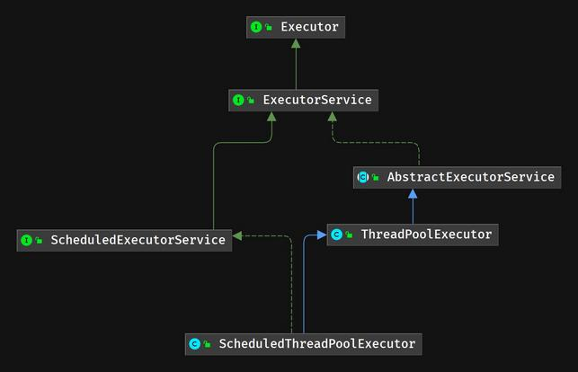
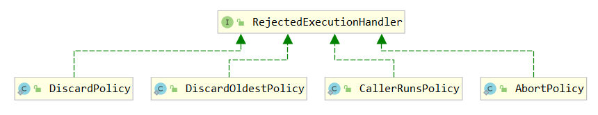
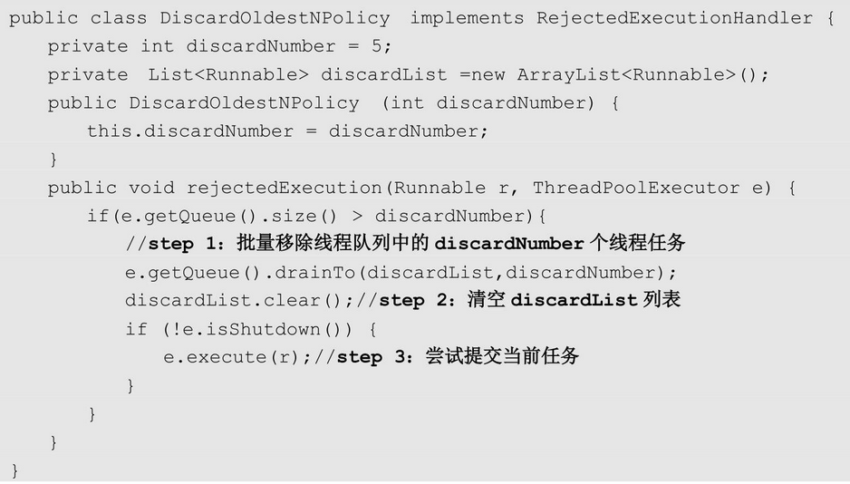
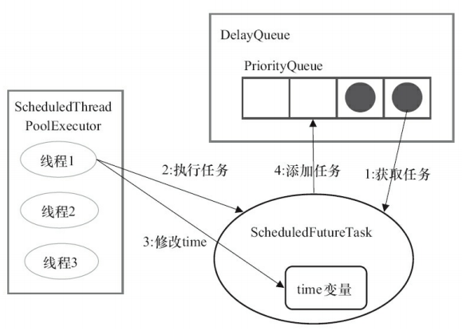
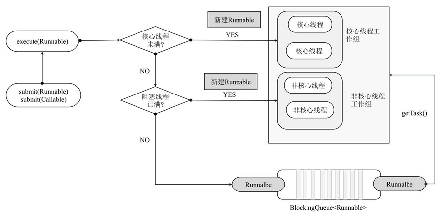
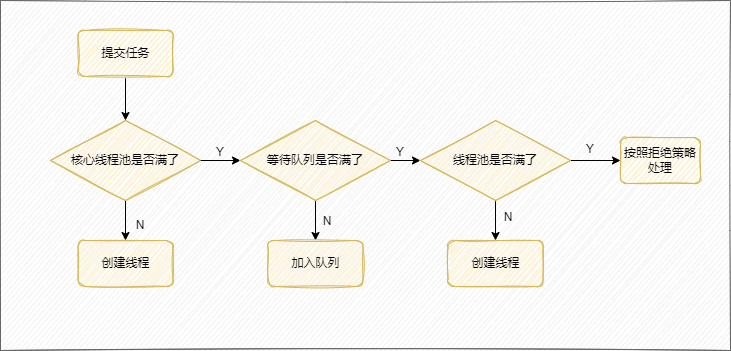
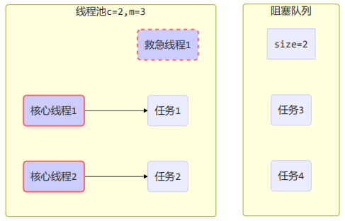
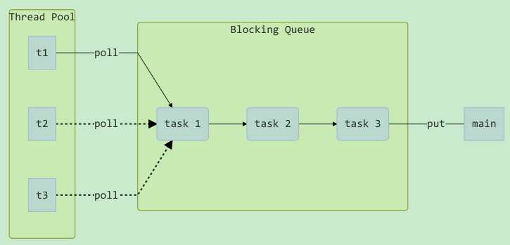
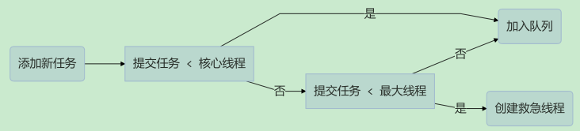

## 1. 线程池简介

### 1.1. 线程池的概念

线程池是 JDK 1.5 后的新特性，是用来创建和管理线程对象的容器。线程池做的工作主要是管理线程组，控制运行的线程的数量及其运行状态。

线程池主要特点是：**线程复用、控制最大并发数、管理线程**。

**使用线程池的好处**：

- 降低资源消耗：重用存在的线程的复用，避免频繁创建和销毁线程对象会带来过大的系统开销。
- 提高响应速度。可有效的控制最大并发线程数，提高系统资源的使用率，同时避免过多资源竞争，避免堵塞。当任务到达时，任务可以不需要的等到线程创建就能立即执行。
- 提高线程的可管理性。线程是稀缺资源，如果无限制的创建，不仅会消耗系统资源，还会降低系统的稳定性，使用线程池可以进行统一的分配，调优和监控。
- 附加功能：提供定时执行、定期执行、单线程、并发数控制等功能。

综上所述使用线程池框架 Executor 能更好的管理线程、提供系统资源使用率。

### 1.2. 线程池的组成

一般的线程池主要分为以下 4 个组成部分：

1. 线程池管理器：用于创建并管理线程池
2. 工作线程：线程池中执行具体任务的线程
3. 任务接口：每个任务必须实现的接口，用于工作线程调度和执行策略。*注：只有线程实现了该接口，线程中的任务才能够被线程池调度。*
4. 任务队列：用于存放待处理的任务，提供一种缓冲机制。新的任务将会不断被加入队列中，执行完成的任务将被从队列中移除。

### 1.3. 线程池的状态

- `RUNNING`：线程最正常的状态，接受新的任务，处理等待队列中的任务。
- `SHUTDOWN`：不接受新的任务提交，但是会继续处理等待队列中的任务。
- `STOP`：不接受新的任务提交，不再处理等待队列中的任务，中断正在执行任务的线程。
- `TIDYING`：所有的任务都销毁了，workCount 为 0，线程池的状态在转换为 `TIDYING` 状态时，会执行钩子方法 `terminated()`。
- `ERMINATED`：`terminated()` 方法结束后，线程池的状态就会变成这个。

### 1.4. 线程池的工作原理

Java 线程池的工作原理为：JVM 先根据用户的参数创建一定数量的可运行的线程任务，并将线程任务放入队列，然后在线程创建后启动这些任务，如果线程数量超过了最大数量（由用户设置），则**超出数量的线程排队等候**，等其它线程执行完毕，线程池调度器发现队列中有可用的线程时，再从队列中取出任务来执行。

#### 1.4.1. (!整理中)线程复用

在 Java 中，每个 `Thread` 类都有一个 `start` 方法。在程序调用 `start` 方法启动线程时，Java 虚拟机会调用该类的 `run` 方法。`Thread` 类的 `run` 方法中其实调用了 `Runnable` 对象的 `run` 方法，例如定义继承 `Thread` 类，在循环中不断传递进来的 `Runnable` 对象来创建线程，再调用 `start` 方法开启线程，就相当于不断执行 `run` 方法中的代码。因此可以将在循环方法中不断获取的 `Runnable` 对象存放在 Queue 中，当前线程在获取下一个 `Runnable` 对象之前可以是阻塞的，这样既能有效控制正在执行的线程个数，也能保证系统中正在等待执行的其他线程有序执行。

以下就是简单实现了一个线程池，达到了线程复用的效果。

## 2. Java 内置线程池

### 2.1. 概述

JDK 中线程池框架主要涉及 Executor、ExecutorService、Callable 等接口和 Executors、ThreadPoolExecutor、Future、FutureTask 等类。

- `Executor` 框架是一个根据一组执行策略调用，调度，执行和控制的异步任务的框架
- `Executors` 是一个工具类，提供不同方法按照相关的需求创建了不同的线程池
- `ExecutorService` 接口继承了 `Executor` 接口并进行了扩展，提供了更多的方法能获得任务执行的状态并且可以获取任务的返回值。
- `ThreadPoolExecutor` 创建自定义线程池的核心类
- `Future` 表示异步计算的结果，他提供了检查计算是否完成的方法，以等待计算的完成，并可以使用 `get()` 方法获取计算的结果

### 2.2. 线程池相关类继承图



### 2.3. Executor 接口

Java 里面线程池的顶级接口是 `Executor`，但是严格意义上讲 `Executor` 并不是一个线程池，而只是一个执行线程的框架，真正的线程池接口是 `ExecutorService`。

```java
public interface Executor {
    // 执行线程任务
    void execute(Runnable command);
}
```

### 2.4. ExecutorService 接口

`ExecutorService` 接口是 java 内置的线程池接口（真正意义上），继承了 `Executor` 接口。

```java
public interface ExecutorService extends Executor
```

#### 2.4.1. 接口方法

```java
void shutdown();
```

- 启动一次顺序关闭，执行以前提交的任务，但不接受新任务。

```java
List<Runnable> shutdownNow();
```

- 停止所有正在执行的任务，暂停处理正在等待的任务，并返回等待执行的任务列表。

```java
<T> Future<T> submit(Callable<T> task);
```

- 执行带返回值的任务，返回一个 `Future` 对象用于获取执行结果。

```java
Future<?> submit(Runnable task);
```

- 执行 `Runnable` 任务，并返回一个表示该任务的 `Future`。

```java
<T> Future<T> submit(Runnable task, T result);
```

- 执行 `Runnable` 任务，并返回一个表示该任务的 `Future`。

```java
<T> List<Future<T>> invokeAll(Collection<? extends Callable<T>> tasks) throws InterruptedException;
```

- 提交 tasks 中所有任务，并返回 `Future` 对象集合

```java
<T> List<Future<T>> invokeAll(Collection<? extends Callable<T>> tasks,
                              long timeout, TimeUnit unit) throws InterruptedException;
```

- 提交 tasks 中所有任务，带超时时间

```java
<T> T invokeAny(Collection<? extends Callable<T>> tasks)
    throws InterruptedException, ExecutionException;
```

- 提交 tasks 中所有任务，哪个任务先成功执行完毕，返回此任务执行结果，并取消其它任务

```java
<T> T invokeAny(Collection<? extends Callable<T>> tasks,
                long timeout, TimeUnit unit)
    throws InterruptedException, ExecutionException, TimeoutException;
```

- 提交 tasks 中所有任务，哪个任务先成功执行完毕，返回此任务执行结果，并取消其它任务，带超时时间


```java
boolean isShutdown();
```

- 不在 RUNNING 状态的线程池，此方法就返回 true

```java
boolean isTerminated();
```

- 线程池状态是否为 TERMINATED

```java
boolean awaitTermination(long timeout, TimeUnit unit) throws InterruptedException;
```

- 调用 `shutdown()` 方法后，由于调用线程并不会等待所有任务运行结束，因此如果它想在线程池 TERMINATED 状态后做些事情，可以利用此方法等待

#### 2.4.2. 接口常用方法示例

```java
public class ExecutorServiceDemo {

    @Test
    public void shutdownTest() {
        // 使用工厂类获取线程池对象
        ExecutorService es = Executors.newSingleThreadExecutor();
        // 提交任务
        for (int i = 1; i <= 10; i++) {
            es.submit(new ExecutorServiceDemoRunnable(i));
        }
        // 关闭线程池,仅仅是不再接受新的任务,以前的任务还会继续执行
        es.shutdown();
        es.submit(new ExecutorServiceDemoRunnable(888)); // 不能再提交新的任务了
    }

    @Test
    public void shutdownNowTest() {
        // 使用工厂类获取线程池对象
        ExecutorService es = Executors.newSingleThreadExecutor();
        // 提交任务
        for (int i = 1; i <= 10; i++) {
            es.submit(new ExecutorServiceDemoRunnable(i));
        }
        // 立刻关闭线程池，如果线程池中还有缓存的任务，没有执行，则取消执行，并返回这些任务
        List<Runnable> runnables = es.shutdownNow();
        System.out.println(runnables);
    }
}

/**
 * 任务类,包含一个任务编号,在任务中,打印出是哪一个线程正在执行任务
 */
class ExecutorServiceDemoRunnable implements Runnable {
    private final int id;

    public ExecutorServiceDemoRunnable(int id) {
        this.id = id;
    }

    @Override
    public void run() {
        // 获取线程的名称并输出
        String name = Thread.currentThread().getName();
        System.out.println(name + "执行了任务..." + id);
    }

    @Override
    public String toString() {
        return "ExecutorServiceDemoRunnable{id=" + id + "}";
    }
}
```

```java
@Slf4j
public class ExecutorServiceDemo {

    // submit 方法示例
    @Test
    public void submitTest() throws InterruptedException, ExecutionException {
        ExecutorService pool = Executors.newFixedThreadPool(1);
        Future<String> future = pool.submit(() -> {
            log.debug("running");
            Thread.sleep(1000);
            return "ok";
        });

        log.debug("{}", future.get());
    }

    // invokeAll 方法示例
    @Test
    public void invokeAllTest() throws InterruptedException {
        ExecutorService pool = Executors.newFixedThreadPool(1);
        List<Future<String>> futures = pool.invokeAll(Arrays.asList(
                () -> {
                    log.debug("begin");
                    Thread.sleep(1000);
                    return "1";
                },
                () -> {
                    log.debug("begin");
                    Thread.sleep(500);
                    return "2";
                },
                () -> {
                    log.debug("begin");
                    Thread.sleep(2000);
                    return "3";
                }
        ));

        futures.forEach(f -> {
            try {
                log.debug("{}", f.get());
            } catch (InterruptedException | ExecutionException e) {
                e.printStackTrace();
            }
        });
    }

    // invokeAny 方法示例
    @Test
    public void invokeAnyTest() throws InterruptedException, ExecutionException {
        ExecutorService pool = Executors.newFixedThreadPool(1);
        String result = pool.invokeAny(Arrays.asList(
                () -> {
                    log.debug("begin 1");
                    Thread.sleep(1000);
                    log.debug("end 1");
                    return "1";
                },
                () -> {
                    log.debug("begin 2");
                    Thread.sleep(500);
                    log.debug("end 2");
                    return "2";
                },
                () -> {
                    log.debug("begin 3");
                    Thread.sleep(2000);
                    log.debug("end 3");
                    return "3";
                }
        ));
        log.debug("{}", result);
    }

    // shutdown 方法示例
    @Test
    public void shutdownTest() throws InterruptedException {
        ExecutorService pool = Executors.newFixedThreadPool(2);

        Future<Integer> result1 = pool.submit(() -> {
            log.debug("task 1 running...");
            Thread.sleep(1000);
            log.debug("task 1 finish...");
            return 1;
        });

        Future<Integer> result2 = pool.submit(() -> {
            log.debug("task 2 running...");
            Thread.sleep(1000);
            log.debug("task 2 finish...");
            return 2;
        });

        Future<Integer> result3 = pool.submit(() -> {
            log.debug("task 3 running...");
            Thread.sleep(1000);
            log.debug("task 3 finish...");
            return 3;
        });

        log.debug("shutdown");
        pool.shutdown(); // 关闭后线程还能继续执行
        pool.awaitTermination(3, TimeUnit.SECONDS);
    }

    // shutdownNow 方法示例
    @Test
    public void shutdownNowTest() {
        ExecutorService pool = Executors.newFixedThreadPool(2);

        Future<Integer> result1 = pool.submit(() -> {
            log.debug("task 1 running...");
            Thread.sleep(1000);
            log.debug("task 1 finish...");
            return 1;
        });

        Future<Integer> result2 = pool.submit(() -> {
            log.debug("task 2 running...");
            Thread.sleep(1000);
            log.debug("task 2 finish...");
            return 2;
        });

        Future<Integer> result3 = pool.submit(() -> {
            log.debug("task 3 running...");
            Thread.sleep(1000);
            log.debug("task 3 finish...");
            return 3;
        });

        log.debug("shutdownNow");
        // 停止所有正在执行的任务，暂停处理正在等待的任务，并返回等待执行的任务列表。
        List<Runnable> runnables = pool.shutdownNow();
        log.debug("other.... {}", runnables);
    }
}
```

#### 2.4.3. submit() 和 execute() 的区别

`submit()` 和 `execute()` 两个方法可以向线程池提交任务。主要区别如下：

- **方法返回值不同**：`execute()` 方法的返回类型是 void；而 `submit()` 方法的返回类型是持有计算结果的 `Future` 对象。
- **方法定义的位置不同**：`execute()` 方法的是定义在 `Executor` 接口中；而 `submit()` 方法是定义在 `ExecutorService` 接口中（它扩展了 `Executor` 接口）。

### 2.5. ScheduledExecutorService 接口

#### 2.5.1. 概述

```java
public interface ScheduledExecutorService extends ExecutorService
```

`ScheduledExecutorService` 接口继承了 `ExecutorService` 接口，具备了延迟运行或定期执行任务的能力

#### 2.5.2. 常用方法

```java
public <V> ScheduledFuture<V> schedule(Callable<V> callable, long delay, TimeUnit unit);
```

- 延迟时间单位是 unit，数量是 delay 的时间后执行 Callable 接口的逻辑。

```java
public ScheduledFuture<?> schedule(Runnable command, long delay, TimeUnit unit);
```

- 延迟时间单位是 unit，数量是 delay 的时间后执行 Runnable 接口的逻辑。

```java
public ScheduledFuture<?> scheduleAtFixedRate(Runnable command, long initialDelay, long period, TimeUnit unit);
```

- 延迟时间单位是 unit，数量是 initialDelay 的时间后，每间隔 period 时间重复执行一次 Runnable 接口的逻辑。

```java
public ScheduledFuture<?> scheduleWithFixedDelay(Runnable command, long initialDelay, long delay, TimeUnit unit);
```

- 创建并执行一个在给定初始延迟后首次启用的定期操作，随后，在每一次执行终止和下一次执行开始之间都存在给定的延迟（delay）。

### 2.6. ThreadPoolExecutor

```java
public class ThreadPoolExecutor extends AbstractExecutorService
```

`ThreadPoolExecutor` 是 JDK 提供的 `ExecutorService` 接口实现，继承 `AbstractExecutorService`

#### 2.6.1. 构造方法与参数说明

ThreadPoolExecutor 类的构造方法及参数说明

```java
public ThreadPoolExecutor(int corePoolSize, // 核心线程数（最多保留的线程数）
                          int maximumPoolSize, // 最大线程池大小，也就是线程池中线程的最大数量
                          long keepAliveTime, // 线程最大空闲（生存）时间，针对救急线程
                          TimeUnit unit, // 时间单位
                          BlockingQueue<Runnable> workQueue, // 线程等待（阻塞）队列
                          ThreadFactory threadFactory, // 线程创建工厂，主要用于线程创建时定义名称
                          RejectedExecutionHandler handler // 拒绝策略
                        )
```

可以通过配置不同的参数，创建出行为不同的线程池，以下是 `ThreadPoolExecutor` 构造函数的重要参数的详细说明：

- `int corePoolSize`：线程池的核心线程数，线程数定义了最小可以同时运行的线程数量。当有新任务时，线程池中线程数没有达到此核心线程数的大小，则会创建新的线程来执行任务，否则会将任务放入阻塞队列。
- `int maximumPoolSize`：线程池允许存在的最大工作线程数。其中当线程数超过核心线程数之后，会创建数量为`maximumPoolSize - corePoolSize`的“救急线程”。这些非核心线程类似于临时借来的资源，在空闲时间超过 keepAliveTime 之后回收销毁，避免资源浪费。如果任务队列数超过此配置值，则根据拒绝策略处理新任务。
- `long keepAliveTime`：超过核心线程数时闲置线程的存活时间。即当线程池中的线程数量大于 `corePoolSize` 的时候，如果这时没有新的任务提交，核心线程外的线程(即“救急线程”)不会立即销毁，而是会等待，直到等待的时间超过了 `keepAliveTime` 配置的时间才会被回收销毁。若设置为0，表示多余的空闲线程会被立即终止。<font color=red>**注意，此参数只对非核心线程有效**</font>。
- `TimeUnit unit`：`keepAliveTime` 参数的时间单位
    - `TimeUnit.DAYS`
    - `TimeUnit.HOURS`
    - `TimeUnit.MINUTES`
    - `TimeUnit.SECONDS`
    - `TimeUnit.MILLISECONDS`
    - `TimeUnit.MICROSECONDS`
    - `TimeUnit.NANOSECONDS`
- `BlockingQueue<Runnable> workQueue`：任务执行前保存任务的队列，保存由 `execute` 方法提交的 `Runnable` 任务。当新任务来的时候会先判断当前运行的线程数量是否达到核心线程数，如果达到的话，任务就会被存放在队列中。
- `ThreadFactory threadFactory`：为线程池提供创建新线程的线程工厂。每当线程池创建一个新的线程时，都是通过线程工厂方法来完成的。
- `RejectedExecutionHandler handler`：线程池任务队列超过 `maximumPoolSize` 并且阻塞队列也满之后的拒绝策略。（*拒绝策略详见下个章节*）

#### 2.6.2. 拒绝(饱和)策略

如果当前同时运行的线程数量达到线程池中最大线程数量，并且阻塞队列也已经被放满了线程时，则说明线程池的线程资源已耗尽，线程池将没有足够的线程资源执行新的任务。`ThreadPoolExecutor` 定义一些拒绝策略来处理新添加的线程任务：



- `ThreadPoolExecutor.AbortPolicy`：抛出 `RejectedExecutionException` 来拒绝新任务的处理，**默认的策略**。
- `ThreadPoolExecutor.CallerRunsPolicy`：调用执行自己的线程来运行任务，不会丢弃任务请求。但是这种策略会降低对于新任务提交速度，影响程序的整体性能。另外，此策略会增加队列容量。如果应用程序可以承受此延迟并且不能丢弃任何一个任务请求的话，可以选择这个策略。
- `ThreadPoolExecutor.DiscardPolicy`：不处理当前新任务，直接丢弃掉。
- `ThreadPoolExecutor.DiscardOldestPolicy`：此策略将丢弃线程队列中最早的未处理的任务请求，并尝试提交当前任务。

例如：Spring 通过 `ThreadPoolTaskExecutor` 或者直接通过 `ThreadPoolExecutor` 的构造函数创建线程池的时候，当不指定 `RejectedExecutionHandler` 饱和策略的话来配置线程池的时候默认使用的是 `ThreadPoolExecutor.AbortPolicy`。在默认情况下，`ThreadPoolExecutor` 将抛出 `RejectedExecutionException` 来拒绝新来的任务，这代表将丢失对这个任务的处理。对于可伸缩的应用程序，建议使用 `ThreadPoolExecutor.CallerRunsPolicy`。当最大池被填满时，此策略可以提供可伸缩队列。

#### 2.6.3. 自定义拒绝策略

上面默认的拒绝策略均实现了 `RejectedExecutionHandler` 接口，若无法满足实际需要，可以自行扩展 `RejectedExecutionHandler` 接口来实现拒绝策略，并捕获异常来实现自定义拒绝策略。

以下示例实现一个自定义拒绝策略 `DiscardOldestNPolicy`，该策略根据传入的参数丢弃最老的 N 个线程，以便在出现异常时释放更多的资源。具体参考代码如下：



#### 2.6.4. 线程池状态的定义

在 `ThreadPoolExecutor` 类使用 int 的高 3 位来表示线程池状态，低 29 位表示线程数量

|   状态名    | 高 3 位 | 接收新任务 | 处理阻塞队列任务 |                说明                 |
| :--------: | :-----: | :------: | :-----------: | ---------------------------------- |
|  RUNNING   |   111   |    Y     |       Y       |                                    |
|  SHUTDOWN  |   000   |    N     |       Y       | 不会接收新任务，但会处理阻塞队列剩余任务   |
|    STOP    |   001   |    N     |       N       | 会中断正在执行的任务，并抛弃阻塞队列任务   |
|  TIDYING   |   010   |    -     |       -       | 任务全执行完毕，活动线程为 0 即将进入终结 |
| TERMINATED |   011   |    -     |       -       | 终结状态                            |

从数字上比较，`TERMINATED > TIDYING > STOP > SHUTDOWN > RUNNING`。这些信息存储在一个原子变量 ctl 中，目的是将线程池状态与线程个数合二为一，这样就可以用一次 cas 原子操作进行赋值

```java
// rs 为高 3 位代表线程池状态， wc 为低 29 位代表线程个数，ctl 是合并它们
private static int ctlOf(int rs, int wc) { return rs | wc; }

private void advanceRunState(int targetState) {
    for (;;) {
        int c = ctl.get();
        if (runStateAtLeast(c, targetState) ||
            // c 为旧值， ctlOf 返回结果为新值
            ctl.compareAndSet(c, ctlOf(targetState, workerCountOf(c))))
            break;
    }
}
```

#### 2.6.5. 线程池大小设置最佳实践

如果设置线程池线程数量\太小，当有大量请求需要处理，系统响应比较慢，会影响用户体验，甚至会出现任务队列大量堆积任务导致 OOM；如果设置线程池线程数量过大，大量线程可能会同时抢占 CPU 资源，这样会导致大量的上下文切换，从而增加线程的执行时间，影响了执行效率。

一般根据以下情况进行设置：

- **CPU 密集型任务(N+1)**：这种任务消耗的主要是 CPU 资源，可以将线程数设置为 `N（CPU 核心数）+1`，多出来的一个线程是为了防止某些原因导致的线程阻塞（如IO操作，线程sleep，等待锁）而带来的影响。一旦某个线程被阻塞，释放了CPU资源，而在这种情况下多出来的一个线程就可以充分利用 CPU 的空闲时间。
- `I/O 密集型任务(2N)`： 系统的大部分时间都在处理 IO 操作，此时线程可能会被阻塞，释放 CPU 资源，这时就可以将 CPU 交出给其它线程使用。因此在 IO 密集型任务的应用中，可以多配置一些线程，具体的计算方法如下，一般也可设置为2N。

```
最佳线程数 = CPU核心数 * (1/CPU利用率) = CPU核心数 * (1 + (IO耗时/CPU耗时))
```

### 2.7. 一些线程方法的区别

#### 2.7.1. 提交任务的两个方法

`execute()` 方法是定义在 `Executor` 接口中，方法接收一个 Runnable 实例，它用来执行一个任务

```java
public void execute(Runnable runnable);
```

而 `submit()` 方法是定义在 `ExecutorService` 接口中，该方法返回的是 `Future` 对象。可以用 `isDone()` 来查询 Future 是否已经完成，当任务完成时，它具有一个结果，可以调用 `get()` 来获取结果。也可以不用 `isDone()` 进行检查就直接调用 get()，在这种情况下， get() 将阻塞，直至结果准备就绪。

```java
public Future<?> submit(Runnable task);
public <T> Future<T> submit(Runnable task, T result);
public <T> Future<T> submit(Callable<T> task);
```

#### 2.7.2. 关闭线程池的两个方法

在 `ExecutorService` 接口提供了两个关闭线程池的方法，其区别如下：

- `shutdown()`：将线程池状态变为 SHUTDOWN，不会接收新任务，但会将已提交的任务执行完成。此方法不会阻塞调用线程的执行。
- `shutdownNow()`：将线程池状态变为 STOP，不会接收新任务，会将队列中的任务返回，并用 `interrupt` 的方式中断正在执行的任务

`ThreadPoolExecutor` 源码实现分析：

```java
/**
 * 线程池状态变为 SHUTDOWN
 * 不会接收新任务，但已提交任务会执行完，此方法不会阻塞调用线程的执行
 */
public void shutdown() {
    final ReentrantLock mainLock = this.mainLock;
    mainLock.lock();
    try {
        checkShutdownAccess();
        // 修改线程池状态
        advanceRunState(SHUTDOWN);
        // 仅会打断空闲线程
        interruptIdleWorkers();
        onShutdown(); // hook for ScheduledThreadPoolExecutor (扩展点)
    } finally {
        mainLock.unlock();
    }
    // 尝试终结(没有运行的线程可以立刻终结，如果还有运行的线程也不会等)
    tryTerminate();
}

/**
 * 线程池状态变为 STOP
 * 不会接收新任务，会将队列中的任务返回，并用 interrupt 的方式中断正在执行的任务
 */
public List<Runnable> shutdownNow() {
    List<Runnable> tasks;
    final ReentrantLock mainLock = this.mainLock;
    mainLock.lock();
    try {
        checkShutdownAccess();
        // 修改线程池状态
        advanceRunState(STOP);
        // 打断所有线程
        interruptWorkers();
        // 获取队列中剩余任务
        tasks = drainQueue();
    } finally {
        mainLock.unlock();
    }
    // 尝试终结
    tryTerminate();
    return tasks;
}
```

## 3. Executors 工具类创建各种类型的线程池

JDK 提供了用于创建线程池的工具类 `Executors`，类中提供了一系列静态工厂方法，用来创建各种不同类型的线程池（本质是使用 `ThreadPoolExecutor` 构造方法创建 `ExecutorService` 实现对象，区别只是设置不同的参数）。

> 引用《阿里巴巴 Java 开发手册》中关于线程池的内容：
>
> 【强制】线程池不允许使用 `Executors` 去创建，而是通过 `ThreadPoolExecutor` 的方式，这样的处理方式让写的同学更加明确线程池的运行规则，规避资源耗尽的风险。说明：`Executors` 返回的线程池对象的弊端如下：
>
> 1. `FixedThreadPool` 和 `SingleThreadPool`：允许的请求队列长度为 `Integer.MAX_VALUE`，可能会堆积大量的请求，从而导致 OOM
> 2. `CachedThreadPool`：允许的创建线程数量为 `Integer.MAX_VALUE`，可能会创建大量的线程，从而导致 OOM

### 3.1. newCachedThreadPool

```java
public class Executors {
    // 创建一个默认的线程池对象，里面的线程可重用，且在第一次使用时才创建
    public static ExecutorService newCachedThreadPool() {
        return new ThreadPoolExecutor(0, Integer.MAX_VALUE,
                                      60L, TimeUnit.SECONDS,
                                      new SynchronousQueue<Runnable>());
    }

    // 线程池中的所有线程都使用 ThreadFactory 来创建，这样的线程无需手动启动，自动执行
    public static ExecutorService newCachedThreadPool(ThreadFactory threadFactory) {
        return new ThreadPoolExecutor(0, Integer.MAX_VALUE,
                                      60L, TimeUnit.SECONDS,
                                      new SynchronousQueue<Runnable>(),
                                      threadFactory);
    }
    // ...省略
}
```

`newCachedThreadPool` 用于创建一个缓存线程池，使用没有容量的 `SynchronousQueue` 作为线程池工作队列。核心线程数是 0， 最大线程数是 `Integer.MAX_VALUE`，空闲生存时间默认是 60s，意味着线程池全部的线程都是“救急线程”，可以无限被创建。因此极端情况下，这样会导致耗尽 cpu 和内存资源。

**调用 execute 创建新线程时，如果有可用线程，则重用以前构造的线程；如果现有线程没有可用的，则创建一个新线程并添加到池中，终止并从缓存中移除那些(keepAliveTime)超过默认的 60 秒未被使用的线程。因此<u>长时间保持空闲的线程池不会占用任何资源</u>。**

一般在创建线程时需要执行申请 CPU 和内存、记录线程状态、控制阻塞等多项工作，复杂且耗时。对于执行很多短期异步任务的程序而言，这种线程池很大程度地重用线程，从而提高程序性能。

> 适用场景：整个线程池表现为线程数会根据任务量不断增长，没有上限，当任务执行完毕，空闲1分钟后释放线程。适合并发执行任务数比较密集，但每个任务执行时间较短的情况。

### 3.2. newFixedThreadPool

```java
public class Executors {
    // 创建一个可重用固定线程数的线程池
    public static ExecutorService newFixedThreadPool(int nThreads) {
        return new ThreadPoolExecutor(nThreads, nThreads,
                                      0L, TimeUnit.MILLISECONDS,
                                      new LinkedBlockingQueue<Runnable>());
    }

    // 创建一个可重用固定线程数的线程池且线程池中的所有线程都使用 ThreadFactory 来创建
    public static ExecutorService newFixedThreadPool(int nThreads, ThreadFactory threadFactory) {
        return new ThreadPoolExecutor(nThreads, nThreads,
                                      0L, TimeUnit.MILLISECONDS,
                                      new LinkedBlockingQueue<Runnable>(),
                                      threadFactory);
    }
    // ...省略
}
```

`newFixedThreadPool` 用于创建一个**可重用固定线程数量的线程池**，并将线程资源存放在共享的**无界队列**(`LinkedBlockingQueue`，队列容量为 `Integer.MAX_VALUE`)中循环使用。运行中的线程池不会拒绝任务，即不会调用 `RejectedExecutionHandler.rejectedExecution()` 方法。需要注意的是，**FixedThreadPool 不会拒绝任务，在任务比较多的时候会导致 OOM**。使用 `ThreadPoolExecutor` 构造函数参数说明如下：

- `maxThreadPoolSize` 是无效参数，故将它的值设置为与 `coreThreadPoolSize` 一致。
- `keepAliveTime` 也是无效参数，设置为0L，因为此线程池里所有线程都是核心线程，核心线程不会被回收（除非设置了`executor.allowCoreThreadTimeOut(true)`）。

在任意点，在大多数 nThreads 线程会处于处理任务的活动状态。如果在所有线程处于活动状态时提交新任务，则在有可用线程之前，新任务将在队列中等待，直到有可用的线程资源；如果在关闭前的执行期间由于失败而导致任何线程终止，那么一个新线程将代替它执行后续的任务（如果需要）。在某个线程被显式地关闭之前，池中的线程将一直存在。

```java
@Test
public void testNewFixedThreadPool() throws InterruptedException {
    ExecutorService pool = Executors.newFixedThreadPool(2, new ThreadFactory() {
        private AtomicInteger t = new AtomicInteger(1);

        @Override
        public Thread newThread(Runnable r) {
            return new Thread(r, "mypool_t" + t.getAndIncrement());
        }
    });

    pool.execute(() -> log.debug("1"));
    pool.execute(() -> log.debug("2"));
    pool.execute(() -> log.debug("3"));
    Thread.sleep(2000);
}
```

> 适用场景：适用于处理 CPU 密集型相对耗时的任务，任务数量已知，确保CPU在长期被工作线程使用的情况下，尽可能的少的分配线程，即适用执行长期的任务。

### 3.3. newSingleThreadExecutor

```java
public class Executors {
    // 创建一个使用单个 worker 线程的 Executor，以无界队列方式来运行该线程
    public static ExecutorService newSingleThreadExecutor() {
        return new FinalizableDelegatedExecutorService
            (new ThreadPoolExecutor(1, 1,
                                    0L, TimeUnit.MILLISECONDS,
                                    new LinkedBlockingQueue<Runnable>()));
    }

    // 创建一个使用单个 worker 线程的 Executor，且线程池中的所有线程都使用 ThreadFactory 来创建
    public static ExecutorService newSingleThreadExecutor(ThreadFactory threadFactory) {
        return new FinalizableDelegatedExecutorService
            (new ThreadPoolExecutor(1, 1,
                                    0L, TimeUnit.MILLISECONDS,
                                    new LinkedBlockingQueue<Runnable>(),
                                    threadFactory));
    }
    // ...省略
}
```

`newSingleThreadExecutor` 创建一个保证永远有且只有一个可用线程的线程池（使用无界队列 `LinkedBlockingQueue`），此线程池保证所有任务的执行顺序按照任务的提交顺序执行。相比于手动创建的线程，会由于任务的失败或异常而终止；而<font color=red>**这个线程池可以在线程死后（或发生异常时）重新启动一个线程来替代原来的线程继续执行下去**</font>！值得注意的是：**在任务比较多的时候也是会导致 OOM**。

newSingleThreadExecutor 与 newFixedThreadPool 的区别：

- `Executors.newSingleThreadExecutor()` 线程个数始终为1，不能修改。其中 `FinalizableDelegatedExecutorService` 应用的是装饰器模式，只对外暴露了 `ExecutorService` 接口，因此不能调用 `ThreadPoolExecutor` 类中特有的方法
- `Executors.newFixedThreadPool(1)` 初始时为1，后续可以进行修改，对外暴露的是 `ThreadPoolExecutor` 对象，可以强转后调用 `setCorePoolSize` 等方法进行修改。

```java
@Test
public void testNewSingleThreadExecutor() throws InterruptedException {
    ExecutorService pool = Executors.newSingleThreadExecutor();
    pool.execute(() -> {
        log.debug("1");
        int i = 1 / 0; // 模拟异常导致线程终止，线程池会创建新线程，保证池的正常工作
    });

    pool.execute(() -> log.debug("2"));
    pool.execute(() -> log.debug("3"));
    Thread.sleep(2000);
}
```

> 适用场景：适用于**串行执行**多个任务的场景。

### 3.4. newScheduledThreadPool

#### 3.4.1. 概述

```java
public class Executors {
    // 创建一个可重用固定线程数的线程池且允许延迟运行或定期执行任务
    public static ScheduledExecutorService newScheduledThreadPool(int corePoolSize) {
        return new ScheduledThreadPoolExecutor(corePoolSize);
    }

    // 创建一个可重用固定线程数的线程池且线程池中的所有线程都使用 ThreadFactory 来创建，且允许延迟运行或定期执行
    public static ScheduledExecutorService newScheduledThreadPool(
            int corePoolSize, ThreadFactory threadFactory) {
        return new ScheduledThreadPoolExecutor(corePoolSize, threadFactory);
    }
    
    // 创建一个单线程执行程序，它允许在给定延迟后运行命令或者定期地执行
    public static ScheduledExecutorService newSingleThreadScheduledExecutor() {
        return new DelegatedScheduledExecutorService
            (new ScheduledThreadPoolExecutor(1));
    }
    
    // 创建一个单线程执行程序，它可安排在给定延迟后运行命令或者定期地执行
    public static ScheduledExecutorService newSingleThreadScheduledExecutor(ThreadFactory threadFactory) {
        return new DelegatedScheduledExecutorService
            (new ScheduledThreadPoolExecutor(1, threadFactory));
    }
    // ...省略
}
```

`newScheduledThreadPool` 创建了一个可定时调度，核心线程池固定，大小无限的线程池实现：`ScheduledExecutorService`。此线程池支持设置在给定的延迟时间后执行或者周期性执行某个线程任务。如果闲置，非核心线程池会在 `DEFAULT_KEEPALIVEMILLIS` 时间内回收。

> 适用场景：此类型线程池的特点是线程数固定，任务数多于线程数时，会放入无界队列排队；任务执行完毕，这些线程也不会被释放。用于执行延迟或周期性执行，并且限制线程数量的场景。*在实际项目中基本不会被用到，因为有更好的其他方案选择，比如 quartz*。

#### 3.4.2. 基础示例

```java
ScheduledExecutorService scheduledThreadPool= Executors.newScheduledThreadPool(3);

scheduledThreadPool.schedule(newRunnable(){
    @Override
    public void run() {
        System.out.println("延迟三秒");
    }
}, 3, TimeUnit.SECONDS);

scheduledThreadPool.scheduleAtFixedRate(newRunnable(){
    @Override
    public void run() {
        System.out.println("延迟 1 秒后每三秒执行一次");
    }
}, 1, 3, TimeUnit.SECONDS);
```

#### 3.4.3. 其他方式实现任务调度线程池

在『任务调度线程池』功能加入之前，可以使用 `java.util.Timer` 来实现定时功能，Timer 的优点在于简单易用，但由于所有任务都是由同一个线程来调度，因此所有任务都是串行执行的，同一时间只能有一个任务在执行，前一个任务的延迟或异常都将会影响到之后的任务。示例代码如下：

```java
// 使用 timer 添加两个任务，希望它们都在 1s 后执行
@Test
public void timerTest() {
    Timer timer = new Timer();
    TimerTask task1 = new TimerTask() {
        @Override
        public void run() {
            log.debug("task 1");
            try {
                Thread.sleep(2000);
            } catch (InterruptedException e) {
                e.printStackTrace();
            }
        }
    };
    TimerTask task2 = new TimerTask() {
        @Override
        public void run() {
            log.debug("task 2");
        }
    };

    log.debug("start...");
    // 但由于 timer 内只有一个线程来顺序执行队列中的任务，因此『任务1』的延时，影响了『任务2』的执行
    timer.schedule(task1, 1000);
    timer.schedule(task2, 1000);
}
```

输出结果：

```java
2023-03-01 23:07:37.376 [main] DEBUG c.m.c.pool.TimerForScheduleTest - start...
2023-03-01 23:07:38.380 [Timer-0] DEBUG c.m.c.pool.TimerForScheduleTest - task 1
2023-03-01 23:07:40.384 [Timer-0] DEBUG c.m.c.pool.TimerForScheduleTest - task 2
```

使用 `ScheduledExecutorService` 改写：

```java
@Test
public void newScheduledThreadPoolTest() throws InterruptedException {
    ScheduledExecutorService pool = Executors.newScheduledThreadPool(1);
    log.debug("start...");
    pool.schedule(() -> {
        log.debug("task1");
    }, 1, TimeUnit.SECONDS);

    pool.schedule(() -> {
        log.debug("task2");
    }, 1, TimeUnit.SECONDS);
    Thread.sleep(3000);
}
```

输出结果：

```java
2023-03-01 23:10:53.164 [main] DEBUG c.m.c.pool.TimerForScheduleTest - start...
2023-03-01 23:10:54.202 [pool-1-thread-1] DEBUG c.m.c.pool.TimerForScheduleTest - task1
2023-03-01 23:10:54.202 [pool-1-thread-1] DEBUG c.m.c.pool.TimerForScheduleTest - task2
```

#### 3.4.4. 实现原理概述

使用的任务队列 `DelayQueue` 封装了一个 `PriorityQueue`，会对队列中的任务进行排序，时间早的任务先被执行(即 `ScheduledFutureTask` 的 `time` 变量小的先执行)，如果 `time` 相同则先提交的任务会被先执行( `ScheduledFutureTask` 的 `squenceNumber` 变量小的先执行)。

执行周期任务步骤：

1. 线程从 DelayQueue 中获取已到期的 `ScheduledFutureTask(DelayQueue.take())` 。到期任务是指 `ScheduledFutureTask` 的 `time` 大于等于当前系统的时间；
2. 执行这个 `ScheduledFutureTask`；
3. 修改 `ScheduledFutureTask` 的 `time` 变量为下次将要被执行的时间；
4. 把这个修改 `time` 之后的 `ScheduledFutureTask` 放回 `DelayQueue` 中 `DelayQueue.add()`。



### 3.5. newWorkStealingPool（JDK 1.8 新增）

```java
public class Executors {
    public static ExecutorService newWorkStealingPool(int parallelism) {
        return new ForkJoinPool
            (parallelism,
             ForkJoinPool.defaultForkJoinWorkerThreadFactory,
             null, true);
    }

    public static ExecutorService newWorkStealingPool() {
        return new ForkJoinPool
            (Runtime.getRuntime().availableProcessors(),
             ForkJoinPool.defaultForkJoinWorkerThreadFactory,
             null, true);
    }
    // ...省略
}
```

`newWorkStealingPool` 是 JDK 1.8 新增的线程池类型，创建一个持有足够线程的线程池，达到快速运算的目的，在内部通过使用多个队列来减少各个线程调度产生的竞争。

足够的线程指 JDK 根据当前线程的运行需求向操作系统申请足够的线程，以保障线程的快速执行，并很大程度地使用系统资源，提高并发计算的效率，省去用户根据 CPU 资源估算并行度的过程。开发者也可以通过带参数的重载方法指定线程的并发数。

### 3.6. Executors 综合示例

```java
@Slf4j
public class ExecutorsDemo {

    // newCachedThreadPool 方法获取线程池测试
    @Test
    public void newCachedThreadPoolTest1() {
        // 1.使用工厂类获取线程池对象
        ExecutorService es = Executors.newCachedThreadPool();
        // 2.提交任务
        for (int i = 1; i <= 10; i++) {
            es.submit(new MyRunnable(i));
        }
    }

    // newCachedThreadPool 方法获取线程池测试
    @Test
    public void newCachedThreadPoolTest2() {
        // 1.使用工厂类获取线程池对象
        ExecutorService es = Executors.newCachedThreadPool(new ThreadFactory() {
            int n = 1;

            @Override
            public Thread newThread(Runnable r) {
                return new Thread(r, "自定义的线程名称" + n++);
            }
        });
        // 2.提交任务
        for (int i = 1; i <= 10; i++) {
            es.submit(new MyRunnable(i));
        }
    }

    // newFixedThreadPool 方法获取线程池测试
    @Test
    public void newFixedThreadPoolTest1() {
        // 1.使用工厂类获取线程池对象
        ExecutorService es = Executors.newFixedThreadPool(3);
        // 2.提交任务
        for (int i = 1; i <= 10; i++) {
            es.submit(new MyRunnable(i));
        }
    }

    // newFixedThreadPool 方法获取线程池测试
    @Test
    public void newFixedThreadPoolTest2() {
        // 1.使用工厂类获取线程池对象
        ExecutorService es = Executors.newFixedThreadPool(3, new ThreadFactory() {
            // int n = 1;
            private AtomicInteger t = new AtomicInteger(1);

            @Override
            public Thread newThread(Runnable r) {
                // return new Thread(r, "自定义的线程名称" + n++);
                return new Thread(r, "自定义的线程名称" + t.getAndIncrement());
            }
        });
        // 2.提交任务
        for (int i = 1; i <= 10; i++) {
            es.submit(new MyRunnable(i));
        }
    }

    // newSingleThreadExecutor 方法获取线程池测试
    @Test
    public void newSingleThreadExecutorTest1() {
        // 1.使用工厂类获取线程池对象
        ExecutorService es = Executors.newSingleThreadExecutor();
        // 2.提交任务
        for (int i = 1; i <= 10; i++) {
            es.submit(new MyRunnable(i));
        }
    }

    // newSingleThreadExecutor 方法获取线程池测试
    @Test
    public void newSingleThreadExecutorTest2() {
        // 1.使用工厂类获取线程池对象
        ExecutorService es = Executors.newSingleThreadExecutor(new ThreadFactory() {
            int n = 1;

            @Override
            public Thread newThread(Runnable r) {
                return new Thread(r, "自定义的线程名称" + n++);
            }
        });
        // 2.提交任务
        for (int i = 1; i <= 10; i++) {
            es.submit(new MyRunnable(i));
        }
    }

    // newSingleThreadExecutor 方法模拟异常处理
    @Test
    public void NewSingleThreadExecutorTest3() throws InterruptedException {
        ExecutorService pool = Executors.newSingleThreadExecutor();
        pool.execute(() -> {
            log.debug("1");
            int i = 1 / 0; // 模拟异常导致线程终止，线程池会创建新线程，保证池的正常工作
        });

        pool.execute(() -> log.debug("2"));
        pool.execute(() -> log.debug("3"));
        Thread.sleep(2000);
    }

    // newScheduledThreadPool 方法获取定时任务线程池，schedule 方法功能测试
    @Test
    public void newScheduledThreadPoolScheduleTest() throws InterruptedException {
        // 1.获取一个具备延迟执行任务的线程池对象
        ScheduledExecutorService es = Executors.newScheduledThreadPool(3);
        // 2.创建多个任务对象,提交任务,每个任务延迟2秒执行
        for (int i = 1; i <= 10; i++) {
            es.schedule(new MyRunnable(i), 2, TimeUnit.SECONDS);
        }
        System.out.println("main thread is over");
        Thread.sleep(4000);
    }

    // newScheduledThreadPool 方法获取定时任务线程池，scheduleAtFixedRate 方法功能测试
    @Test
    public void newScheduledThreadPoolScheduleAtFixedRateTest() throws InterruptedException {
        // 1.获取一个具备延迟执行任务的线程池对象
        ScheduledExecutorService es = Executors.newScheduledThreadPool(1, new ThreadFactory() {
            int n = 1;

            @Override
            public Thread newThread(Runnable r) {
                return new Thread(r, "自定义线程名:" + n++);
            }
        });
        // 2.创建多个任务对象，延迟1秒开始，每间隔2秒执行一个任务(不包含任务实际运行的时间，即任务完成后再算间隔)
        for (int i = 1; i <= 10; i++) {
            es.scheduleAtFixedRate(new MyRunnable2(i), 1, 2, TimeUnit.SECONDS);
        }
        System.out.println("main thread is over");
        Thread.sleep(20000);
    }

    // newScheduledThreadPool 方法获取定时任务线程池，schedule 方法功能测试
    @Test
    public void newSingleThreadScheduledExecutorScheduleWithFixedDelayTest() throws InterruptedException {
        // 1.获取一个具备延迟执行任务的线程池对象
        // 注：这里想更容易看出效果，使用只有一个线程的定时任务线程池
        ScheduledExecutorService es = Executors.newSingleThreadScheduledExecutor(new ThreadFactory() {
            int n = 1;

            @Override
            public Thread newThread(Runnable r) {
                return new Thread(r, "自定义线程名:" + n++);
            }
        });
        // 2.创建多个任务对象，延迟1秒开始，每间隔2秒执行一个任务(包含任务实际运行的时间)
        for (int i = 1; i <= 10; i++) {
            es.scheduleWithFixedDelay(new MyRunnable2(i), 1, 2, TimeUnit.SECONDS);
        }
        System.out.println("main thread is over");
        Thread.sleep(20000);
    }

}

// 用于测试的任务类，包含一个任务编号属性。在任务中，打印出是哪一个线程正在执行任务
class MyRunnable implements Runnable {
    private final int id;

    public MyRunnable(int id) {
        this.id = id;
    }

    @Override
    public void run() {
        // 获取线程的名称输出
        String name = Thread.currentThread().getName();
        System.out.println(name + "执行了任务..." + id);
    }
}

class MyRunnable2 implements Runnable {
    private final int id;

    public MyRunnable2(int id) {
        this.id = id;
    }

    @Override
    public void run() {
        String name = Thread.currentThread().getName();
        try {
            Thread.sleep(1500);
        } catch (InterruptedException e) {
            e.printStackTrace();
        }
        System.out.println(name + "执行了任务:" + id);
    }
}
```

## 4. 线程池基础使用

### 4.1. 线程池使用 Runnable 接口

#### 4.1.1. 步骤

1. 通过 Executors 工厂类的静态方法来创建线程池对象：`newFixedThreadPool(int size)`

```java
// 创建线程池对象
ExecutorService tp = Executors.newFixedThreadPool(线程数量);
```

2. 定义Runnable的实现类
3. 重写run方法
4. 创建Rannable实现类对象

```java
MyRunnable mr = new MyRunnable();
```

5. 调用`submit(Runnable task)`提交任务，每次调用该方法就使用线程池中的一条线程，线程完毕后再放回线程池。

```java
tp.submit(mr);
//或者使用匿名内部类的方法传入Runnable对象，调用submit方法
tp.submit(new Runnable(){
    @Override
    public void run(){
        //重写run方法
    }
});
```

6. 销毁线程池
    - `shutdown()`：销毁线程池，要等待线程池中的所有任务执行完成后才销毁。
    - `shutdownNow()`：立即销毁线程池，不管线程池中的任务是否执行完成。（一般比较少用）

#### 4.1.2. 线程池的执行任务过程

1. 刚开始创建好线程池，没有任务要执行，线程池的线程会等待任务
2. 往线程池中提交任务，线程池会派线程执行任务，有些线程没有任务接着等待
3. 如果线程池中的任务比线程多，线程池中个的线程执行任务，后面的任务等待，等到线程执行完任务，空闲的时候，就执行后面的任务
4. 如果所有任务都执行完，线程就等待任务，直到线程池被销毁，这些线程也就销毁

### 4.2. 线程池使用 Callable 接口

#### 4.2.1. Callable 接口作用

定义子线程需要执行的代码，是有返回结果并且可以抛出异常的任务。

#### 4.2.2. Callable 接口方法

```java
@FunctionalInterface
public interface Callable<V> {
    /* 计算结果，如果无法计算结果，则抛出一个异常。 */
    V call() throws Exception;
}
```

`Callable` 与 `Runnable` 接口的区别：

- `Runnable` 接口的方法是 `run()`
- `Callable` 接口的方法是 `call()`

**call 方法的特点**：

1. 可以有返回值
2. 可以抛出异常

#### 4.2.3. Callable 使用线程池的步骤

1. 获取线程池

```java
// 使用Executors的静态方法，定义创建的线程池的线程数量
public static ExecutorService newFixedThreadPool(int nThreads);

// 例如：
ExecutorService tp = Executors.newFixedThreadPool(线程数量);
```

2. 定义 Callable 的实现类
3. 重写 call 方法
4. 创建 Callable 实现类对象

```java
MyCallable mc = new MyCallable();
```

5. 往线程池中调用 `submit(Callable<T> task)` 提交任务

```java
tp.submit(mc);
// 或者使用匿名内部类的方法传入Callable对象，调用submit方法
tp.submit(new Callable(){
    @Override
    public void call(){
        // 重写run方法
    }
});
```

6. 销毁线程池 `shutdown()`

**注意：可以同时往线程池中提交 `Runnable` 和 `Callable` 任务**

## 5. 处理线程池执行任务异常

### 5.1. 方式1：主动捉异常

```java
@Test
public void catchThreadExceptionTest() {
    ExecutorService pool = Executors.newFixedThreadPool(1);
    pool.submit(() -> {
        try {
            log.debug("task1");
            int i = 1 / 0;
        } catch (Exception e) {
            log.error("error:", e);
        }
    });
}
```

### 5.2. 方式2：使用 Future

```java
@Test
public void futureExceptionTest() throws ExecutionException, InterruptedException {
    ExecutorService pool = Executors.newFixedThreadPool(1);
    Future<Boolean> f = pool.submit(() -> {
        log.debug("task1");
        int i = 1 / 0;
        return true;
    });
    log.debug("result:{}", f.get());
}
```

## 6. 线程池的工作流程总结（待确认是否正确与整合）

### 6.1. 版本1

Java 线程池刚被创建时，只是向系统申请一个用于执行线程队列和管理线程池的线程资源。在调用 `execute()` 方法添加一个任务时，线程池会按照以下流程执行任务：

- 如果正在运行的线程数量少于 `corePoolSize`（用户定义的核心线程数），线程池就会立刻创建线程并执行该线程任务。
- 如果正在运行的线程数量大于等于 `corePoolSize`，该任务就将被放入阻塞队列中。
- 在阻塞队列已满且正在运行的线程数量少于 `maximumPoolSize` 时，线程池会创建非核心线程立刻执行该线程任务。
- 在阻塞队列已满且正在运行的线程数量大于等于 `maximumPoolSize` 时，线程池将拒绝执行该线程任务并抛出 `RejectExecutionException` 异常。
- 在线程任务执行完毕后，该任务将被从线程池队列中移除，线程池将从队列中取下一个线程任务继续执行。
- 在线程处于空闲状态的时间超过 `keepAliveTime` 时间时，正在运行的线程数量超过 `corePoolSize`，该线程将会被认定为空闲线程并停止。因此在线程池中所有线程任务都执行完毕后，线程池会收缩到 `corePoolSize` 大小。

> TODO: 流程图好像有点问题，待修改



### 6.2. 版本2



1. 当线程池里存活的线程数小于核心线程数 `corePoolSize` 时，这时对于一个新提交的任务，线程池会创建一个线程去处理任务。当线程池里面存活的线程数小于等于核心线程数 `corePoolSize` 时，线程池里面的线程会一直存活着，就算空闲时间超过了 `keepAliveTime`，线程也不会被销毁，而是一直阻塞在那里一直等待任务队列的任务来执行。
2. 当线程池里面存活的线程数已经等于 `corePoolSize` 了，这是对于一个新提交的任务，会被放进任务队列 `workQueue` 排队等待执行。
3. 当线程池里面存活的线程数已经等于 `corePoolSize` 了，并且任务队列也满了，假设 `maximumPoolSize > corePoolSize`，这时如果再来新的任务，线程池就会继续创建新的线程来处理新的任务，知道线程数达到 `maximumPoolSize`，就不会再创建了。
4. 如果当前的线程数达到了 `maximumPoolSize`，并且任务队列也满了，如果还有新的任务过来，那就直接采用拒绝策略进行处理。默认的拒绝策略是抛出一个 `RejectedExecutionException` 异常。

### 6.3. 版本3



1. 线程池中刚开始没有线程，当一个任务提交给线程池后，线程池会创建一个新线程来执行任务。
2. 当线程数达到 corePoolSize 并没有线程空闲，这时再加入任务，新加的任务会被加入 workQueue 队列排队，直到有空闲的线程。
3. 如果队列选择了有界队列，那么任务超过了队列大小时，会创建 `maximumPoolSize - corePoolSize` 数目的线程来救急。
4. 如果线程到达 maximumPoolSize 仍然有新任务这时会执行拒绝策略。jdk 提供了 4 种拒绝策略实现（其它框架也提供了实现）：
    - `AbortPolicy`：让调用者抛出 `RejectedExecutionException` 异常（默认策略）
    - `CallerRunsPolicy`：让调用者运行任务
    - `DiscardPolicy`：放弃本次任务
    - `DiscardOldestPolicy`：放弃队列中最早的任务，本任务取而代之
    - Dubbo 的实现：在抛出 RejectedExecutionException 异常之前会记录日志，并 dump 线程栈信息，方便定位问题
    - Netty 的实现：是创建一个新线程来执行任务
    - ActiveMQ 的实现：带超时等待（60s）尝试放入队列，类似我们之前自定义的拒绝策略
    - PinPoint 的实现：它使用了一个拒绝策略链，会逐一尝试策略链中每种拒绝策略
5. 当高峰过去后，超过 corePoolSize 的救急线程如果一段时间没有任务做，需要结束节省资源，这个时间由 keepAliveTime 和 unit 两个参数来控制。

## 7. 扩展内容

### 7.1. 自定义线程池实战

此部分根据线程池涉及的相关元素，自定义一个线程池实现示例

#### 7.1.1. 自定义线程池整体架构设计图



#### 7.1.2. 实现示例

##### 7.1.2.1. 自定义拒绝策略接口

```java
@FunctionalInterface // 拒绝策略
interface RejectPolicy<T> {
    void reject(BlockingQueue<T> queue, T task);
}
```

##### 7.1.2.2. 自定义任务队列

```java
@Slf4j
class BlockingQueue<T> {
    // 1. 任务队列
    private Deque<T> queue = new ArrayDeque<>();

    // 2. 锁
    private ReentrantLock lock = new ReentrantLock();

    // 3. 生产者条件变量
    private Condition fullWaitSet = lock.newCondition();

    // 4. 消费者条件变量
    private Condition emptyWaitSet = lock.newCondition();

    // 5. 容量
    private int capcity;

    public BlockingQueue(int capcity) {
        this.capcity = capcity;
    }

    // 带超时阻塞获取
    public T poll(long timeout, TimeUnit unit) {
        lock.lock();
        try {
            // 将 timeout 统一转换为 纳秒
            long nanos = unit.toNanos(timeout);
            while (queue.isEmpty()) {
                try {
                    // 返回值是剩余时间
                    if (nanos <= 0) {
                        return null;
                    }
                    nanos = emptyWaitSet.awaitNanos(nanos);
                } catch (InterruptedException e) {
                    e.printStackTrace();
                }
            }
            T t = queue.removeFirst();
            fullWaitSet.signal();
            return t;
        } finally {
            lock.unlock();
        }
    }

    // 阻塞获取
    public T take() {
        lock.lock();
        try {
            while (queue.isEmpty()) {
                try {
                    emptyWaitSet.await();
                } catch (InterruptedException e) {
                    e.printStackTrace();
                }
            }
            T t = queue.removeFirst();
            fullWaitSet.signal();
            return t;
        } finally {
            lock.unlock();
        }
    }

    // 阻塞添加
    public void put(T task) {
        lock.lock();
        try {
            while (queue.size() == capcity) {
                try {
                    log.debug("等待加入任务队列 {} ...", task);
                    fullWaitSet.await();
                } catch (InterruptedException e) {
                    e.printStackTrace();
                }
            }
            log.debug("加入任务队列 {}", task);
            queue.addLast(task);
            emptyWaitSet.signal();
        } finally {
            lock.unlock();
        }
    }

    // 带超时时间阻塞添加
    public boolean offer(T task, long timeout, TimeUnit timeUnit) {
        lock.lock();
        try {
            long nanos = timeUnit.toNanos(timeout);
            while (queue.size() == capcity) {
                try {
                    if (nanos <= 0) {
                        return false;
                    }
                    log.debug("等待加入任务队列 {} ...", task);
                    nanos = fullWaitSet.awaitNanos(nanos);
                } catch (InterruptedException e) {
                    e.printStackTrace();
                }
            }
            log.debug("加入任务队列 {}", task);
            queue.addLast(task);
            emptyWaitSet.signal();
            return true;
        } finally {
            lock.unlock();
        }
    }

    public int size() {
        lock.lock();
        try {
            return queue.size();
        } finally {
            lock.unlock();
        }
    }

    public void tryPut(RejectPolicy<T> rejectPolicy, T task) {
        lock.lock();
        try {
            // 判断队列是否满
            if (queue.size() == capcity) {
                rejectPolicy.reject(this, task);
            } else {  // 有空闲
                log.debug("加入任务队列 {}", task);
                queue.addLast(task);
                emptyWaitSet.signal();
            }
        } finally {
            lock.unlock();
        }
    }
}
```

##### 7.1.2.3. 自定义线程池

```java
// 自定义线程池
@Slf4j
class ThreadPool {
    // 任务队列
    private BlockingQueue<Runnable> taskQueue;

    // 线程集合
    private HashSet<Worker> workers = new HashSet<>();

    // 核心线程数
    private int coreSize;

    // 获取任务时的超时时间
    private long timeout;

    private TimeUnit timeUnit;

    private RejectPolicy<Runnable> rejectPolicy;

    // 执行任务
    public void execute(Runnable task) {
        // 当任务数没有超过 coreSize 时，直接交给 worker 对象执行
        // 如果任务数超过 coreSize 时，加入任务队列暂存
        synchronized (workers) {
            if (workers.size() < coreSize) {
                Worker worker = new Worker(task);
                log.debug("新增 worker{}, {}", worker, task);
                workers.add(worker);
                worker.start();
            } else {
                // taskQueue.put(task);
                // 1) 死等
                // 2) 带超时等待
                // 3) 让调用者放弃任务执行
                // 4) 让调用者抛出异常
                // 5) 让调用者自己执行任务
                taskQueue.tryPut(rejectPolicy, task);
            }
        }
    }

    public ThreadPool(int coreSize, long timeout, TimeUnit timeUnit, int queueCapcity, RejectPolicy<Runnable> rejectPolicy) {
        this.coreSize = coreSize;
        this.timeout = timeout;
        this.timeUnit = timeUnit;
        this.taskQueue = new BlockingQueue<>(queueCapcity);
        this.rejectPolicy = rejectPolicy;
    }

    class Worker extends Thread {
        private Runnable task;

        public Worker(Runnable task) {
            this.task = task;
        }

        @Override
        public void run() {
            // 执行任务
            // 1) 当 task 不为空，执行任务
            // 2) 当 task 执行完毕，再接着从任务队列获取任务并执行
            // while(task != null || (task = taskQueue.take()) != null) {
            while (task != null || (task = taskQueue.poll(timeout, timeUnit)) != null) {
                try {
                    log.debug("正在执行...{}", task);
                    task.run();
                } catch (Exception e) {
                    e.printStackTrace();
                } finally {
                    task = null;
                }
            }
            synchronized (workers) {
                log.debug("worker 被移除{}", this);
                workers.remove(this);
            }
        }
    }
}
```

##### 7.1.2.4. 测试

```java
public static void main(String[] args) {
    ThreadPool threadPool = new ThreadPool(1, 1000, TimeUnit.MILLISECONDS, 
                        1, (queue, task) -> {
        // 1. 死等
        // queue.put(task);
        // 2) 带超时等待
        // queue.offer(task, 1500, TimeUnit.MILLISECONDS);
        // 3) 让调用者放弃任务执行
        // log.debug("放弃{}", task);
        // 4) 让调用者抛出异常
        // throw new RuntimeException("任务执行失败 " + task);
        // 5) 让调用者自己执行任务
        task.run();
    });
    for (int i = 0; i < 4; i++) {
        int j = i;
        threadPool.execute(() -> {
            try {
                Thread.sleep(1000L);
            } catch (InterruptedException e) {
                e.printStackTrace();
            }
            log.debug("{}", j);
        });
    }
}
```

### 7.2. Tomcat 线程池

Tomcat 的线程池主要体现在以下几点：

- LimitLatch 用来限流，可以控制最大连接个数，类似 J.U.C 中的 Semaphore
- Acceptor 只负责【接收新的 socket 连接】
- Poller 只负责监听 socket channel 是否有【可读的 I/O 事件】
- 一旦可读，封装一个任务对象（socketProcessor），提交给 Executor 线程池处理
- Executor 线程池中的工作线程最终负责【处理请求】

Tomcat 线程池扩展了 `ThreadPoolExecutor`，具体实现有所不同：如果总线程数达到 `maximumPoolSize`，这时不会立刻抛 `RejectedExecutionException` 异常，而是再次尝试将任务放入队列，如果还失败，才抛出 `RejectedExecutionException` 异常



#### 7.2.1. tomcat-7.0.42 源码节选

```java
public void execute(Runnable command, long timeout, TimeUnit unit) {
    submittedCount.incrementAndGet();
    try {
        super.execute(command);
    } catch (RejectedExecutionException rx) {
        if (super.getQueue() instanceof TaskQueue) {
            final TaskQueue queue = (TaskQueue) super.getQueue();
            try {
                if (!queue.force(command, timeout, unit)) {
                    submittedCount.decrementAndGet();
                    throw new RejectedExecutionException("Queue capacity is full.");
                }
            } catch (InterruptedException x) {
                submittedCount.decrementAndGet();
                Thread.interrupted();
                throw new RejectedExecutionException(x);
            }
        } else {
            submittedCount.decrementAndGet();
            throw rx;
        }
    }
}
```

TaskQueue.java

```java
public boolean force(Runnable o, long timeout, TimeUnit unit) throws InterruptedException {
    if (parent.isShutdown())
        throw new RejectedExecutionException(
                "Executor not running, can't force a command into the queue"
        );
    return super.offer(o, timeout, unit); //forces the item onto the queue, to be used if the task is rejected
}
```

#### 7.2.2. 相关配置项

Connector 配置

|         配置项          | 默认值 |                说明                 |
| :-------------------: | :---: | ---------------------------------- |
| `acceptorThreadCount` |   1   | acceptor 线程数量                    |
|  `pollerThreadCount`  |   1   | poller 线程数量                      |
|   `minSpareThreads`   |  10   | 核心线程数，即 corePoolSize           |
|     `maxThreads`      |  200  | 最大线程数，即 maximumPoolSize        |
|      `executor`       |   -   | Executor 名称，用来引用下面的 Executor |

Executor 线程配置

|           配置项            |        默认值         |            说明                     |
| :-----------------------: | :-----------------: | ---------------------------------- |
|     `threadPriority`      |          5          | 线程优先级                           |
|         `daemon`          |        true         | 是否守护线程                         |
|     `minSpareThreads`     |         25          | 核心线程数，即 corePoolSize           |
|       `maxThreads`        |         200         | 最大线程数，即 maximumPoolSize        |
|       `maxIdleTime`       |        60000        | 线程生存时间，单位是毫秒，默认值即 1 分钟 |
|      `maxQueueSize`       | `Integer.MAX_VALUE` | 队列长度                            |
| `prestartminSpareThreads` |        false        | 核心线程是否在服务器启动时启动           |


