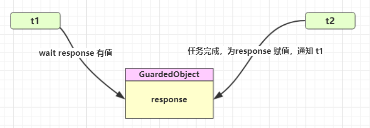
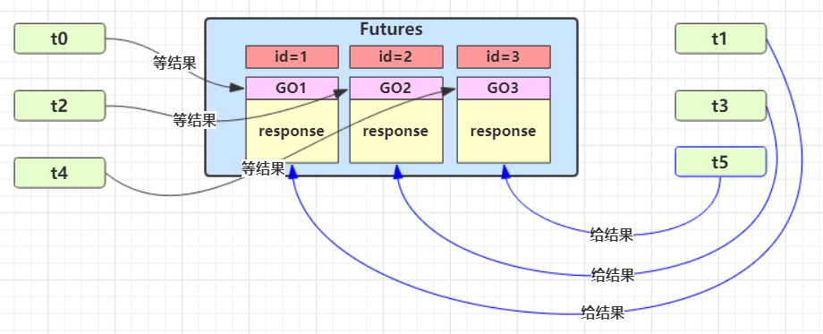
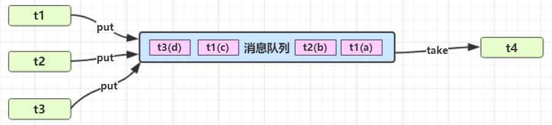

# 并发编程 - 设计模式篇

## 1. 终止模式之两阶段终止模式

两个不同的线程，如何让一个线程停止另一个线程，并且让停止的线程完成一些停止前的操作。

### 1.1. 错误思路

1. 调用线程对象的 `stop()` 方法停止线程。该方法会真正杀死线程，如果这时线程锁住了共享资源，那么当线程被杀死后就再也没有机会释放锁，其它线程将永远无法获取锁。
2. 使用 `System.exit(int)` 方法停止线程。原本目的仅为停止一个线程，但这种做法会让整个程序都停止。

### 1.2. 方案1：利用 isInterrupted 打断标识

调用线程的 `interrupt` 方法可以打断正在执行的线程，无论线程是`sleep`、`wait`，还是正常运行。值得注意，如果线程在休眠状态，打断标识会被清除。

```java
public static void main(String[] args) throws InterruptedException {
    System.out.println("程序开始....");
    // 方案1：利用 isInterrupted 打断标识
    useIsInterrupted();
    System.out.println("程序结束....");
}

// 方案1：利用 isInterrupted 打断标识
public static void useIsInterrupted() throws InterruptedException {
    Thread t = new Thread(() -> {
        while (true) {
            Thread current = Thread.currentThread();
            if (current.isInterrupted()) {
                System.out.println("收到结束指示，进行结束前处理！");
                break;
            }
            try {
                // 注意：当sleep状态被打断后，打断标识会被清除，所以异常捕获后要手动再次进行打断，因为运行时打断不会清除打断标识
                Thread.sleep(1000);
                System.out.println("线程的业务处理....");
            } catch (InterruptedException e) {
                current.interrupt();
            }

        }
    }, "监控线程");
    t.start();

    Thread.sleep(3500);
    // 打断线程
    t.interrupt();
}
```

### 1.3. 方案2：自定义停止标记

```java
private static boolean stop = false;

public static void main(String[] args) throws InterruptedException {
    System.out.println("程序开始....");
    // 方案2：自定义停止标记
    useCustomFlag();
    System.out.println("程序结束....");
}

// 方案2：自定义停止标记
public static void useCustomFlag() throws InterruptedException {
    Thread t = new Thread(() -> {
        while (true) {
            if (stop) {
                System.out.println("收到结束指示，进行结束前处理！");
                break;
            }
            try {
                Thread.sleep(1000);
                System.out.println("线程的业务处理....");
            } catch (InterruptedException e) {
                e.printStackTrace();
            }
        }
    }, "监控线程");
    t.start();

    Thread.sleep(3500);
    // 打断线程并设置标识为true
    t.interrupt();
    stop = true;
}
```

## 2. 同步模式之保护性暂停

### 2.1. 定义

保护性暂停（Guarded Suspension），本质就是用在一个线程等待另一个线程的执行结果，要点如下：

- 有一个结果需要从一个线程传递到另一个线程，让他们关联同一个 `GuardedObject`
- 如果有结果不断从一个线程到另一个线程那么可以使用消息队列（见生产者/消费者）
- JDK 中，`join` 与 `Future` 的实现，都是采用此模式
- 因为要等待另一方的结果，因此归类到同步模式



### 2.2. 基础使用示例

定义 `GuardedObject` 类，

- 提供获取数据方法，如未得到返回结果，则线程进入等待；
- 提供数据完成方法，如得到返回结果，则唤醒线程

```java
class GuardedObject {
    private Object response;
    private final Object lock = new Object();

    public Object get() {
        synchronized (lock) {
            // 判断无响应结果，则循环等待
            while (response == null) {
                try {
                    LOGGER.info("waiting....");
                    lock.wait();
                } catch (InterruptedException e) {
                    e.printStackTrace();
                }
            }
            return response;
        }
    }

    public void complete(Object response) {
        synchronized (lock) {
            // 条件满足，通知等待线程
            this.response = response;
            lock.notifyAll();
        }
    }
}
```

测试

```java
@Test
public void testGuardedObjectBasic() {
    // 创建 GuardedObject 实例
    GuardedObject guardedObject = new GuardedObject();

    // 创建获取数据的线程
    new Thread(() -> {
        try {
            LOGGER.info("load start...");
            Thread.sleep(4000); // 模拟业务处理
            LOGGER.info("load complete...");
            // 返回结果并唤醒线程
            guardedObject.complete("i am result");
        } catch (InterruptedException e) {
            e.printStackTrace();
        }
    }).start();

    // 另一个线程获取结果，结果返回前会进行等待
    Object o = guardedObject.get();
    LOGGER.info("get response: [{}]", o);
}
```

### 2.3. GuardedObject 超时设置改进版

这里需要注意线程在等待时，未返回结果前被唤醒，需要计算开始进入等待已经历的时长。

```java
class GuardedObjectV2 {
    private Object response;
    private final Object lock = new Object();

    /**
     * 可设置超时时间
     *
     * @param timeout
     * @return
     */
    public Object get(long timeout) {
        synchronized (lock) {
            // 记录线程开始执行的时间
            long base = System.currentTimeMillis();
            // 记录已等待的时间
            long timePassed = 0;
            // 判断无响应结果，则循环等待
            while (response == null) {
                // 通过超时时间与唤醒前已等待的时间，计算剩余可等待时间
                long waitTime = timeout - timePassed;
                GuardedObjectDemo.LOGGER.info("waiting time: {}", waitTime);
                // 判断是否等待超时
                if (waitTime <= 0) {
                    GuardedObjectDemo.LOGGER.error("waiting time up, break..");
                    break;
                }
                try {
                    lock.wait(waitTime);
                } catch (InterruptedException e) {
                    e.printStackTrace();
                }
                // 这里需要注意被提前唤醒的情况。记录一下当前被唤醒经历的时长
                timePassed = System.currentTimeMillis() - base;
            }
            return response;
        }
    }

    public void complete(Object response) {
        synchronized (lock) {
            // 条件满足，通知等待线程
            this.response = response;
            GuardedObjectDemo.LOGGER.info("notifyAll...");
            lock.notifyAll();
        }
    }
}
```

### 2.4. GuardedObject 多任务改进版

如果涉及多个异步线程需要等待不同的线程的返回结果，那需要创建多个 `GuardedObject`。如果需要在多个类之间使用 `GuardedObject` 对象，作为参数传递不是很方便，因此设计一个用来解耦的中间类，这样不仅能够解耦【结果等待者】和【结果生产者】，还能够同时支持多个任务的管理



对 `GuardedObject` 类进行改造，增加 `id` 用来标识不同的任务线程。

```java
class GuardedObjectV3 {

    // 标识不同的 GuardedObject
    private final int id;
    private Object response;
    private final Object lock = new Object();

    public GuardedObjectV3(int id) {
        this.id = id;
    }

    public int getId() {
        return id;
    }
    ....
}
```

定义一个中间解耦类，用于创建和保存不同的 `GuardedObject` 实例

```java
class TaskManagement {
    // 保存多个 GuardedObject 任务
    private final static Map<Integer, GuardedObjectV3> GUARDED_MAP = new ConcurrentHashMap<>();

    private static int id = 1;

    // 生成 GuardedObject 相应的id
    private static synchronized int generateId() {
        return id++;
    }

    public static GuardedObjectV3 getGuardedObject(int id) {
        // 从容器获取相应的 GuardedObject 并移除
        return GUARDED_MAP.remove(id);
    }

    public static GuardedObjectV3 createGuardedObject() {
        GuardedObjectV3 go = new GuardedObjectV3(generateId());
        // 放入容器并返回
        GUARDED_MAP.put(go.getId(), go);
        return go;
    }

    // 获取当前所有任务的id
    public static Set<Integer> getIds() {
        return GUARDED_MAP.keySet();
    }
}
```

业务测试

```java
// 多个待接收结果的任务
for (int i = 1; i < 4; i++) {
    new Thread(() -> {
        // 创建 GuardedObject
        GuardedObjectV3 guardedObject = TaskManagement.createGuardedObject();
        int id = guardedObject.getId();
        LOGGER.info("Receiver{} loading data...", id);
        // 等待获取返回结果
        Object o = guardedObject.get(5000);
        LOGGER.info("Receiver{} get response: [{}]", id, o);
    }).start();
}

Thread.sleep(1000);

// 获取所有任务
for (Integer id : TaskManagement.getIds()) {
    new Thread(() -> {
        GuardedObjectV3 guardedObject = TaskManagement.getGuardedObject(id);
        LOGGER.info("{} sending data...", id);
        try {
            Thread.sleep(new Random().nextInt(3000));
        } catch (InterruptedException e) {
            e.printStackTrace();
        }
        guardedObject.complete(id + " :: send data");
    }).start();
}
System.in.read();
```

## 3. 同步模式之顺序控制

此模式实现了让代码按开发者预期的顺序执行。示例代码在 java-technology-stack\java-stack-concurrent\concurrent-demo 的 SequentialControlDemo.java

### 3.1. 固定顺序输出

#### 3.1.1. 使用 wait/notify 实现

使用 wait/notify 实现固定顺序输出的注意点如下：

1. 需要保证线程先执行 `wait` 方法再被 `notify` 方法唤醒，否则执行 `wait` 方法等待的线程永远得不到唤醒。因此使用了『运行标记』来判断该不该执行等待
2. 如果有些干扰线程错误地执行 `notify` 方法唤醒了正在 `wait` 的线程，条件不满足时还要重新等待，使用了 while 循环来解决此问题
3. 唤醒对象上的 `wait` 线程建议使用 `notifyAll` 方法，因为『同步对象』上的等待线程可能不止一个

示例代码：

```java
private static final Object obj = new Object(); // 用来同步的对象
private static volatile boolean hasRuned = false; // 运行标记，是否执行过

@Test
public void WaitNotifyFixedSequenceTest() throws InterruptedException {
    Thread t1 = new Thread(() -> {
        synchronized (obj) {
            // 判断线程2是否执行
            while (!hasRuned) {
                try {
                    obj.wait();
                } catch (InterruptedException e) {
                    e.printStackTrace();
                }
            }
        }
        log.debug("线程{}执行完成", Thread.currentThread().getName());
    }, "t1");

    Thread t2 = new Thread(() -> {
        log.debug("线程{}执行", Thread.currentThread().getName());
        synchronized (obj) {
            // 修改运行标记
            hasRuned = true;
            // 通知 obj 锁上等待的线程（可能有多个，因此需要用 notifyAll）
            obj.notifyAll();
        }
    }, "t2");

    t1.start();
    t2.start();
    Thread.sleep(2000);
}
```

输出结果：

```
2023-02-16 21:43:37.816 [t2] DEBUG c.m.c.pattern.SequentialControlDemo - 线程t2执行
2023-02-16 21:43:37.818 [t1] DEBUG c.m.c.pattern.SequentialControlDemo - 线程t1执行完成
```

#### 3.1.2. 使用 park/unpark 实现

可以使用 `LockSupport` 类的 `park` 和 `unpark` 方法来简化上面的示例。因为 `park` 和 `unpark` 方法比较灵活，不区分调用顺序的先后，只是单纯以线程为单位进行『暂停』和『恢复』，不需要『同步对象』和『运行标记』

示例代码：

```java
@Test
public void ParkUnparkFixedSequenceTest() throws InterruptedException {
    Thread t1 = new Thread(() -> {
        String name = Thread.currentThread().getName();
        log.debug("线程{}申请“许可”", name);
        // 当没有“许可”时，当前线程暂停运行，直到有“许可”时，就会用掉该“许可”，当前线程恢复运行
        LockSupport.park();
        log.debug("线程{}执行完成", name);
    }, "t1");

    Thread t2 = new Thread(() -> {
        try {
            Thread.sleep(1000);
        } catch (InterruptedException e) {
            e.printStackTrace();
        }
        log.debug("线程{}执行", Thread.currentThread().getName());
        // 指定给线程t1 发放“许可”，可以连续多次调用 unpark，但只会发放一个“许可”
        LockSupport.unpark(t1);
    }, "t2");

    t1.start();
    t2.start();
    Thread.sleep(2000);
}
```

输出结果：

```java
2023-02-16 21:45:57.487 [t1] DEBUG c.m.c.pattern.SequentialControlDemo - 线程t1申请“许可”
2023-02-16 21:45:58.489 [t2] DEBUG c.m.c.pattern.SequentialControlDemo - 线程t2执行
2023-02-16 21:45:58.489 [t1] DEBUG c.m.c.pattern.SequentialControlDemo - 线程t1执行完成
```

### 3.2. 交替输出

场景说明：线程 1 输出 “a” 5 次，线程 2 输出 “b” 5 次，线程 3 输出 “c” 5 次。实现输出 “abcabcabcabcabc”

#### 3.2.1. 使用 wait/notify 实现

```java
@Test
public void WaitNotifyAlternatingTest() throws InterruptedException {
    SyncWaitNotify syncWaitNotify = new SyncWaitNotify(1, 5);

    new Thread(() -> syncWaitNotify.print(1, 2, "a")).start();
    new Thread(() -> syncWaitNotify.print(2, 3, "b")).start();
    new Thread(() -> syncWaitNotify.print(3, 1, "c")).start();
    Thread.sleep(2000);
}

class SyncWaitNotify {
    private int flag; // 标识
    private int loopNumber; // 循环的次数

    public SyncWaitNotify(int flag, int loopNumber) {
        this.flag = flag;
        this.loopNumber = loopNumber;
    }

    public void print(int waitFlag, int nextFlag, String message) {
        for (int i = 0; i < loopNumber; i++) {
            synchronized (this) {
                while (this.flag != waitFlag) {
                    try {
                        this.wait(); // 等待
                    } catch (InterruptedException e) {
                        e.printStackTrace();
                    }
                }
                System.out.print(message);
                flag = nextFlag; // 设置下一步的标识
                this.notifyAll(); // 唤醒其他线程
            }
        }
    }
}
```

#### 3.2.2. 使用 Lock 条件变量实现

> Notes: 此示例代码没有考虑 a，b，c 线程都就绪再开始的情况

```java
@Test
public void LockAlternatingTest() throws InterruptedException {
    AwaitSignal awaitSignal = new AwaitSignal(5);
    Condition condition1 = awaitSignal.newCondition();
    Condition condition2 = awaitSignal.newCondition();
    Condition condition3 = awaitSignal.newCondition();

    new Thread(() -> awaitSignal.print(condition1, condition2, "a")).start();
    new Thread(() -> awaitSignal.print(condition2, condition3, "b")).start();
    new Thread(() -> awaitSignal.print(condition3, condition1, "c")).start();

    awaitSignal.lock();
    try {
        log.debug("开始");
        condition1.signal();
    } finally {
        awaitSignal.unlock();
    }
    Thread.sleep(2000);
}

class AwaitSignal extends ReentrantLock {
    private final int loopNumber; // 循环的次数

    public AwaitSignal(int loopNumber) {
        this.loopNumber = loopNumber;
    }

    public void print(Condition current, Condition next, String message) {
        for (int i = 0; i < loopNumber; i++) {
            this.lock();
            try {
                current.await(); // 条件变量的等待
                System.out.print(message);
                next.signal();// 唤醒下一个线程
            } catch (InterruptedException e) {
                e.printStackTrace();
            } finally {
                this.unlock();
            }
        }
    }
}
```

#### 3.2.3. 使用 park/unpark 实现

```java
@Test
public void ParkUnparkAlternatingTest() throws InterruptedException {
    SyncPark syncPark = new SyncPark(3);
    Thread t1 = new Thread(() -> syncPark.print("a"));
    Thread t2 = new Thread(() -> syncPark.print("b"));
    Thread t3 = new Thread(() -> syncPark.print("c"));
    syncPark.setThreads(t1, t2, t3);
    syncPark.start();

    Thread.sleep(2000);
}

class SyncPark {
    private int loopNumber;
    private Thread[] threads;

    public SyncPark(int loopNumber) {
        this.loopNumber = loopNumber;
    }

    public void setThreads(Thread... threads) {
        this.threads = threads;
    }

    public void print(String str) {
        for (int i = 0; i < loopNumber; i++) {
            LockSupport.park();
            System.out.print(str);
            LockSupport.unpark(nextThread());
        }
    }

    private Thread nextThread() {
        Thread current = Thread.currentThread();
        int index = 0;
        for (int i = 0; i < threads.length; i++) {
            if (threads[i] == current) {
                index = i;
                break;
            }
        }
        if (index < threads.length - 1) {
            return threads[index + 1];
        } else {
            return threads[0];
        }
    }

    public void start() {
        for (Thread thread : threads) {
            thread.start();
        }
        LockSupport.unpark(threads[0]);
    }
}
```

## 4. 同步模式之 Balking

### 4.1. 定义

Balking（犹豫）模式用在一个线程发现另一个线程或本线程已经做了某一件相同的事，那么本线程就无需再做了，直接结束返回

### 4.2. 使用示例

此模式经常用来实现线程安全的单例

```java
public final class Singleton {
    private Singleton() {
    }

    private static Singleton INSTANCE = null;

    public static synchronized Singleton getInstance() {
        if (INSTANCE != null) {
            return INSTANCE;
        }
        INSTANCE = new Singleton();
        return INSTANCE;
    }
}
```

与保护性暂停模式对比：保护性暂停模式用在一个线程等待另一个线程的执行结果，当条件不满足时线程等待。

## 5. 异步模式之生产者/消费者

### 5.1. 定义

- 与保护性暂停模式中的 GuardObject 不同，不需要产生结果和消费结果的线程一一对应
- 消费队列可以用来平衡生产和消费的线程资源
- 生产者仅负责产生结果数据，不关心数据该如何处理，而消费者专心处理结果数据
- 消息队列是有容量限制的，满时不会再加入数据，空时不会再消耗数据
- JDK 中各种阻塞队列，采用的就是这种模式



### 5.2. 使用示例

- 定义消息队列

```java
class MessageQueue {
    private final static Logger LOGGER = LoggerFactory.getLogger(MessageQueue.class);

    // 消息的队列集合
    private final LinkedList<Message> list = new LinkedList<>();
    // 队列容量
    private final int capcity;

    public MessageQueue(int capcity) {
        this.capcity = capcity;
    }

    // 获取消息
    public Message take() {
        // 检查队列是否为空
        synchronized (list) {
            while (list.isEmpty()) {
                try {
                    LOGGER.info("队列为空, 消费者线程等待");
                    list.wait();
                } catch (InterruptedException e) {
                    e.printStackTrace();
                }
            }
            // 从队列头部获取消息并返回
            Message message = list.removeFirst();
            LOGGER.info("已消费消息 {}", message);
            list.notifyAll();
            return message;
        }
    }

    // 存入消息
    public void put(Message message) {
        synchronized (list) {
            // 检查消息是否已满
            while (list.size() == capcity) {
                try {
                    LOGGER.info("队列已满, 生产者线程等待");
                    list.wait();
                } catch (InterruptedException e) {
                    e.printStackTrace();
                }
            }
            // 将消息加入队列尾部
            list.addLast(message);
            LOGGER.info("已生产消息 {}", message);
            list.notifyAll();
        }
    }
}

/* 定义消息类 */
final class Message {
    private final int id;
    private final Object value;

    public Message(int id, Object value) {
        this.id = id;
        this.value = value;
    }

    public int getId() {
        return id;
    }

    public Object getValue() {
        return value;
    }
}
```

- 测试

```java
// 创建消息队列
MessageQueue queue = new MessageQueue(6);
// 创建多个生产者
for (int i = 1; i < 5; i++) {
    int id = i;
    new Thread(() -> {
        queue.put(new Message(id, "值" + id));
    }, "生产者" + i).start();
}

// 创建一个消息者
new Thread(() -> {
    while (true) {
        try {
            Thread.sleep(1000);
        } catch (InterruptedException e) {
            e.printStackTrace();
        }
        Message message = queue.take();
    }
}, "消费者").start();
```

## 6. 享元模式

### 6.1. 简介

享元模式（Flyweight Pattern）：当需要重用数量有限的同一类对象时

> wikipedia: A flyweight is an object that minimizes memory usage by sharing as much data as possible with other similar objects

### 6.2. JDK 的体现

#### 6.2.1. 包装类

在JDK中 `Boolean`，`Byte`，`Short`，`Integer`，`Long`，`Character` 等包装类提供了 `valueOf` 方法中都体现享元模式。例如 `Long` 的 `valueOf` 会缓存 -128~127 之间的 `Long` 对象，在这个范围之间会重用对象，大于这个范围，才会新建 `Long` 对象，源码如下：

```java
public static Long valueOf(long l) {
    final int offset = 128;
    if (l >= -128 && l <= 127) { // will cache
        return LongCache.cache[(int)l + offset];
    }
    return new Long(l);
}
```

> Notes: 
>
> - Byte, Short, Long 缓存的范围都是 -128~127
> - Character 缓存的范围是 0~127
> - Integer的默认范围是 -128~127。其中最小值不能变，但最大值可以通过调整虚拟机参数 `-Djava.lang.Integer.IntegerCache.high` 来设置
> - Boolean 缓存了 TRUE 和 FALSE

### 6.3. 自定义线程池示例

示例需求：一个线上商城应用，QPS 达到数千，如果每次都重新创建和关闭数据库连接，性能会受到极大影响。这时预先创建好一批连接，放入连接池。一次请求到达后，从连接池获取连接，使用完毕后再还回连接池，这样既节约了连接的创建和关闭时间，也实现了连接的重用，不至于让庞大的连接数压垮数据库。

自定义模拟线程池：

```java
ublic class Pool {

    private static final Logger log = LoggerFactory.getLogger(Pool.class);

    // 1. 连接池大小
    private final int poolSize;
    // 2. 连接对象数组
    private Connection[] connections;
    // 3. 连接状态数组 0 表示空闲， 1 表示繁忙
    private AtomicIntegerArray states;

    // 4. 构造方法初始化
    public Pool(int poolSize) {
        this.poolSize = poolSize;
        this.connections = new Connection[poolSize];
        this.states = new AtomicIntegerArray(new int[poolSize]);
        for (int i = 0; i < poolSize; i++) {
            connections[i] = new MockConnection("连接" + (i + 1));
        }
    }

    // 5. 借连接
    public Connection borrow() {
        while (true) {
            for (int i = 0; i < poolSize; i++) {
                // 获取空闲连接
                if (states.get(i) == 0) {
                    if (states.compareAndSet(i, 0, 1)) {
                        log.debug("borrow {}", connections[i]);
                        return connections[i];
                    }
                }
            }
            // 如果没有空闲连接，当前线程进入等待
            synchronized (this) {
                try {
                    log.debug("wait...");
                    this.wait();
                } catch (InterruptedException e) {
                    e.printStackTrace();
                }
            }
        }
    }

    // 6. 归还连接
    public void free(Connection conn) {
        for (int i = 0; i < poolSize; i++) {
            if (connections[i] == conn) {
                states.set(i, 0);
                synchronized (this) {
                    log.debug("free {}", conn);
                    this.notifyAll();
                }
                break;
            }
        }
    }
}

class MockConnection implements Connection {
    // 实现略
}
```

使用自定义的连接池：

```java
Pool pool = new Pool(2);
for (int i = 0; i < 5; i++) {
    new Thread(() -> {
        Connection conn = pool.borrow();
        try {
            Thread.sleep(new Random().nextInt(1000));
        } catch (InterruptedException e) {
            e.printStackTrace();
        }
        pool.free(conn);
    }).start();
}
```

以上示例没有实现的内容：

- 连接的动态增长与收缩
- 连接保活（可用性检测）
- 等待超时处理
- 分布式 hash

对于关系型数据库，有比较成熟的连接池实现，例如 c3p0, druid 等更通用的对象池，也可以考虑使用 apache commons pool，例如 redis 连接池可以参考 jedis 中关于连接池的实现

## 7. 异步模式之工作线程

### 7.1. 定义

让有限的工作线程（Worker Thread）来轮流异步处理无限多的任务。也可以将其归类为分工模式，它的典型实现就是线程池，也体现了经典设计模式中的享元模式。

例如，创建一个线程，轮流处理多个任务，但如果为每个任务都配置一个专用线程，这样会导致成本太高（对比另一种多线程设计模式：Thread-Per-Message）。

> Tips: 不同任务类型应该使用不同的线程池，这样能够避免饥饿，并能提升效率

例如，如果一人线程即处理任务类型A，又要处理任务类型B，这样显然效率不高。因此可以分成线程池A与线程池B更为合理，分别处理相应类型的任务。

### 7.2. 饥饿现象

固定大小线程池会有**饥饿现象**

示例代码：

```java
@Slf4j
public class ThreadHungerDemo {

    static final List<String> MENU = Arrays.asList("地三鲜", "宫保鸡丁", "辣子鸡丁", "烤鸡翅");
    static Random RANDOM = new Random();

    static String cooking() {
        return MENU.get(RANDOM.nextInt(MENU.size()));
    }

    public static void main(String[] args) {
        // 当线程池的大小与工作的线程数量刚好一样，就可能出现线程饥饿的现象
        ExecutorService executorService = Executors.newFixedThreadPool(2);
        executorService.execute(() -> {
            log.debug("处理点餐...");
            Future<String> f = executorService.submit(() -> {
                log.debug("做菜");
                return cooking();
            });
            try {
                log.debug("上菜: {}", f.get());
            } catch (InterruptedException | ExecutionException e) {
                e.printStackTrace();
            }
        });
        executorService.execute(() -> {
            log.debug("处理点餐...");
            Future<String> f = executorService.submit(() -> {
                log.debug("做菜");
                return cooking();
            });
            try {
                log.debug("上菜: {}", f.get());
            } catch (InterruptedException | ExecutionException e) {
                e.printStackTrace();
            }
        });
    }
}
```

上面示例当工作线程与线程池的大小一样时，就可能会出现线程饥饿的现象。

```java
2023-03-02 08:53:34.424 [pool-1-thread-2] DEBUG c.m.c.pattern.ThreadHungerDemo - 处理点餐...
2023-03-02 08:53:34.424 [pool-1-thread-1] DEBUG c.m.c.pattern.ThreadHungerDemo - 处理点餐...
```

可以通过增加线程池的大小来解决此问题，但不是根本解决方案。可以根据不同的任务类型，采用不同的线程池，上面示例调整为：

```java
// 设置不同类型的线程池，用于处理不同类型的任务
ExecutorService waiterPool = Executors.newFixedThreadPool(1);
ExecutorService cookPool = Executors.newFixedThreadPool(1);

waiterPool.execute(() -> {
    log.debug("处理点餐...");
    Future<String> f = cookPool.submit(() -> {
        log.debug("做菜");
        return cooking();
    });
    try {
        log.debug("上菜: {}", f.get());
    } catch (InterruptedException | ExecutionException e) {
        e.printStackTrace();
    }
});
waiterPool.execute(() -> {
    log.debug("处理点餐...");
    Future<String> f = cookPool.submit(() -> {
        log.debug("做菜");
        return cooking();
    });
    try {
        log.debug("上菜: {}", f.get());
    } catch (InterruptedException | ExecutionException e) {
        e.printStackTrace();
    }
});
```

输出结果：

```java
2023-03-02 08:58:22.643 [pool-1-thread-1] DEBUG c.m.c.pattern.ThreadHungerDemo - 处理点餐...
2023-03-02 08:58:22.646 [pool-2-thread-1] DEBUG c.m.c.pattern.ThreadHungerDemo - 做菜
2023-03-02 08:58:22.646 [pool-1-thread-1] DEBUG c.m.c.pattern.ThreadHungerDemo - 上菜: 辣子鸡丁
2023-03-02 08:58:22.648 [pool-1-thread-1] DEBUG c.m.c.pattern.ThreadHungerDemo - 处理点餐...
2023-03-02 08:58:22.648 [pool-2-thread-1] DEBUG c.m.c.pattern.ThreadHungerDemo - 做菜
2023-03-02 08:58:22.648 [pool-1-thread-1] DEBUG c.m.c.pattern.ThreadHungerDemo - 上菜: 地三鲜
```

### 7.3. 合适线程池数量的选择

- 过小会导致程序不能充分地利用系统资源、容易导致饥饿
- 过大会导致更多的线程上下文切换，占用更多内存

#### 7.3.1. CPU 密集型运算

通常采用 `cpu 核数 + 1` 能够实现最优的 CPU 利用率，`+1` 是保证当线程由于页缺失故障（操作系统）或其它原因导致暂停时，额外的这个线程就能顶上去，保证 CPU 时钟周期不被浪费。

#### 7.3.2. I/O 密集型运算

通常 CPU 不会总是处于繁忙状态。例如，当执行业务计算时，这时候会使用 CPU 资源，但当执行 I/O 操作、远程 RPC 调用、数据库操作时，这时候 CPU 就处于空闲状态，此时就可以利用多线程提高它的利用率。经验公式如下：

```
线程数 = 核数 * 期望 CPU 利用率 * 总时间(CPU计算时间+等待时间) / CPU 计算时间
```

- 例如 4 核 CPU 计算时间是 50% ，其它等待时间是 50%，期望 cpu 被 100% 利用，套用公式：`4 * 100% * 100% / 50% = 8`
- 例如 4 核 CPU 计算时间是 10% ，其它等待时间是 90%，期望 cpu 被 100% 利用，套用公式：`4 * 100% * 100% / 10% = 40`
