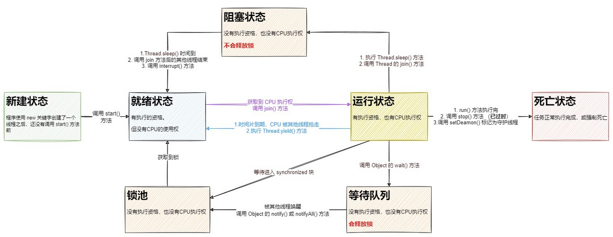

## 1. 进程与线程

### 1.1. 进程

- 程序由指令和数据组成，但这些指令要运行，数据要读写，就必须将指令加载至 CPU，数据加载至内存。在指令运行过程中还需要用到磁盘、网络等设备。进程就是用来加载指令、管理内存、管理 IO 的
- **进程是程序运行资源分配的最小单位**。其中资源包括：CPU、内存空间、磁盘 IO 等。
- 正在运行中的程序就是一个进程。确切的来说，当一个程序进入内存运行，即是一个或多个进程在运行，具有一定独立功能。进程也可以视为程序的一个实例。大部分程序可以同时运行多个实例进程（*例如记事本、画图、浏览器等*），也有的程序只能启动一个实例进程（*例如网易云音乐、杀毒软件等*）

### 1.2. 线程

- **线程是 CPU 调度的最小单位, 必须依赖于进程而存在**。在 windows 中进程是不活动的，只是作为线程的容器。
- **线程是进程中的一个独立的执行执行路径，线程就是来执行程序的代码**，负责当前进程中程序的执行，一个进程中至少有一个线程。一个进程中是可以有多个线程的，这个应用程序也可以称之为多线程程序。
- 一个线程就是一个指令流，将指令流中的一条条指令以一定的顺序交给 CPU 执行。

### 1.3. 线程和进程的作用与区别

**总结：一个程序运行后至少有一个进程，一个进程中可以包含多个线程。**

- 进程：用来封装线程，并为线程分配资源。
- 线程：用来执行代码。

两者的区别：

- 进程基本上相互独立的，而线程存在于进程内，是进程的一个子集
- 进程拥有共享的资源，如内存空间等，供其内部的线程共享
- 进程间的通信、线程间的通信
    - 进程间通信较为复杂。同一台计算机的进程通信称为 IPC（Inter-process communication）；不同计算机之间的进程通信，需要通过网络，并遵守共同的协议，例如 HTTP
    - 线程间通信相对简单，因为它们共享进程内的内存。比如，多个线程可以访问同一个共享变量
- 线程更轻量，线程上下文切换成本一般上要比进程上下文切换低

### 1.4. 线程运行的原理

#### 1.4.1. 栈与栈帧

Java Virtual Machine Stacks （Java 虚拟机栈）。 JVM 中由堆、栈、方法区所组成，而在每个线程启动后，虚拟机就为其分配一块栈内存。

- 每个栈由多个栈帧（Frame）组成，对应着每次方法调用时所占用的内存
- 每个线程只能有一个活动栈帧，对应着当前正在执行的那个方法

#### 1.4.2. 线程上下文切换

多线程编程中一般线程的个数都大于 CPU 核心的个数，而一个 CPU 核心在任意时刻只能被一个线程使用，为了让这些线程都能得到有效执行，CPU 采取的策略是为每个线程分配时间片并轮转的形式。

线程上下文切换（Thread Context Switch）是指，CPU 不再执行当前的线程，转而执行另一个线程的代码。出现 Context Switch 有如下原因：

- 线程的 cpu 时间片用完
- 垃圾回收
- 有更高优先级的线程需要运行
- 线程自己调用了 `sleep`、`yield`、`wait`、`join`、`park`、`synchronized`、`lock` 等方法
- 多个任务并发抢占锁资源，当前任务没有抢到锁资源，被调度器挂起，继续调度下一个任务。
- 硬件中断

当 Context Switch 发生时，需要由操作系统保存当前线程的状态，并恢复另一个线程的状态，其信息被保存在进程控制块（PCB-Process Control Block）中，在 Java 中对应的是程序计数器（Program Counter Register），它的作用是记住下一条 jvm 指令的执行地址，是线程私有的。线程的状态包括程序计数器、虚拟机栈中每个栈帧的信息，如局部变量、操作数栈、返回地址等。**任务从保存到再加载的过程就是一次上下文切换。**。具体流程如下：

1. 挂起一个进程，将这个进程在CPU中的状态（上下文信息）存储于内存的PCB中。
2. 在PCB中检索下一个进程的上下文并将其在CPU的寄存器中恢复。
3. 跳转到程序计数器所指向的位置（即跳转到进程被中断时的代码行）并恢复该进程。

Context Switch 频繁发生会影响性能！Linux 相比与其他操作系统（包括其他类 Unix 系统）有很多的优点，其中有一项就是，其上下文切换和模式切换的时间消耗非常少。

## 2. 多线程概述

Java 给多线程编程提供了内置的支持。多线程的程序达到充分利用 CPU 的目的。

### 2.1. 线程的分类

- 单线程：程序中只有一条执行路径，同一时间只能做一件事情。
- 多线程：程序中有多条执行路径，同一时间可以做多件事。

### 2.2. 主线程和子线程

#### 2.2.1. 多线程程序

多线程程序，同时有多个线程在执行任务。**Java默认是一个多线程程序**。`Thread` 类是 `java.lang` 包下的一个常用类，每一个 `Thread` 类的对象，就代表一个处于某种状态的线程。异步是多线程的代名词：

- 如果不开多线程，按顺序执行的叫**同步**。
- 如果是多个线程开启，就是**异步**。

JVM虚拟机的启动是多线程的，原因是垃圾回收线程也要启动，否则很容易会出现内存溢出。现在的的垃圾回收线程加上前面的主线程，最低启动了两个线程，所以JVM的启动就是多线程的。

#### 2.2.2. 主线程

Java程序启动时自动创建并执行 `main` 方法的线程。

**主线程的执行路径**：从 `main` 开始直到 `main` 方法执行结束。

#### 2.2.3. 子线程

除了主线程以外的所有线程，都可以称为子线程。

**子线程的执行路径**：从 `run` 方法开始直到 `run` 方法执行结束。

### 2.3. 线程的运行模式（线程调度算法）

对于一个 CPU 来说，在任意时刻只能执行一条机器指令，每个线程只有获得 CPU 的使用权才能执行指令。线程是由 CPU 负责调度执行的，CPU 同一时间只能处理一个线程。由于 CPU 在多个线程之间快速切换，让人感觉是多个线程在同时执行。

> Notes: 当线程太多时，CPU 要在很多线程间切换，会消耗 CPU；线程的创建也是需要消耗资源(CPU和内存)

所谓多线程的并发运行，其实是指从宏观上看，各个线程轮流获得 CPU 的使用权，分别执行各自的任务。在运行池中，会有多个处于就绪状态的线程在等待 CPU，JAVA 虚拟机的一项任务就是负责线程的调度，线程调度是指按照特定机制为多个线程分配 CPU 的使用权。

#### 2.3.1. 分时式调度模式

分时式调度模式是指让所有的线程轮流获得 CPU 的使用权，并且平均分配每个线程占用的 CPU 的时间片。（针对单核CPU）

#### 2.3.2. 抢占式调度模式

抢占式调度模式，是指让可运行池中每个线程都以抢占的方式获取 CPU 资源并快速执行，在执行完毕后立刻释放 CPU 资源，具体哪些线程能抢占到 CPU 资源由操作系统控制，在抢占式调度模式下，每个线程对 CPU 资源的申请概率是相等，从概率上讲每个线程都有机会获得同样的 CPU 执行时间片并发执行。也可以设置线程优先级，优先级高的线程抢到 CPU 使用权的概率高（***只是概率高，不能保证优先执行***）。

抢占式调度适用于多线程并发执行的情况，在这种机制下一个线程的堵塞不会导致整个进程性能下降。

> Notes: Java 虚拟机的线程运行模块就是属于抢占式模式。Java 会为每个线程都按照优先级高低分配不同的 CPU 时间片，且优先级高的线程优先执行；优先级低的线程只是获取 CPU 时间片的优先级被降低，但不会永久分配不到 CPU 时间片（*优先级只是可能概率高，并不能保证*）。Java 的线程调度在保障效率的前提下尽可能保障线程调度的公平性。

#### 2.3.3. 协同式调度模式

协同式调度，是指某一个线程在执行完后主动通知操作系统将 CPU 资源切换到另一个线程上执行。线程对 CPU 的持有时间由线程自身控制，线程切换更加透明，更适合多个线程交替执行某些任务的情况。

协同式调度有明显的缺点，如果其中一个线程因为外部原因（可能是磁盘I/O阻塞、网络I/O阻塞、请求数据库等待）运行阻塞，那么可能导致整个系统阻塞甚至崩溃。

### 2.4. 多线程的随机性

- 在同一个线程中，代码是按顺序一行一行往下执行。
- 每一个线程都有自己独立的栈空间。
- 多个不同的线程的是交替执行，但执行的顺序不受控制

### 2.5. 使用多线程的场景

1. 同时做一些事情的时候
2. 将耗时操作放在子线程中

### 2.6. 多线程的优点和缺点

- 优点：**多线程并不能提高运行速度，提高了 CPU 的使用率，提高程序的运行效率**(执行效率)。
- 缺点：如果线程数量太多，分配给每一个线程的时间就少了。CPU来回在多个线程之间进行切换会导致线程执行效率低。

**注：如果多线程有安全问题的处理时，运算速度反而更低。**

### 2.7. 查看进程线程的方法

#### 2.7.1. windows

任务管理器可以查看进程和线程数，也可以用来杀死进程。也可以使用命令行：

查看系统进程

```bash
tasklist
```

杀死指定的进程

```bash
taskkill <PID>
```

#### 2.7.2. linux

查看系统所有进程

```bash
ps -fe
```

查看某个进程（PID）的所有线程

```bash
ps -fT -p <PID>
```

杀死进程

```bash
kill <PID>
```

按大写 H 切换是否显示线程

```bash
top
```

查看某个进程（PID）的所有线程

```bash
top -H -p <PID>
```

#### 2.7.3. Java 工具查看

命令查看所有 Java 进程

```bash
jps
```

查看某个 Java 进程（PID）的所有线程状态

```bash
jstack <PID>
```

jconsole 远程监控工具。是来查看某个 Java 进程中线程的运行情况（图形界面）。使用步骤如下：

1. 运行时需要配置java类

```bash
java -Djava.rmi.server.hostname=`ip地址` -Dcom.sun.management.jmxremote -Dcom.sun.management.jmxremote.port=`连接端口` -Dcom.sun.management.jmxremote.ssl=是否安全连接 - Dcom.sun.management.jmxremote.authenticate=是否认证 java类
```

2. 修改 `/etc/hosts` 文件将 `127.0.0.1` 映射至主机名（非必需，如不是连接本地则不需要）
3. 如开启认证访问，则需做以下步骤
    1. 复制 jmxremote.password 文件
    2. 修改 jmxremote.password 和 jmxremote.access 文件的权限为 600 即文件所有者可读写
    3. 连接时填入 controlRole（用户名），R&D（密码）

## 3. CPU 执行程序相关知识

### 3.1. CPU 核心数和线程数的关系（了解）

- **多核心**：也指单芯片多处理器( Chip Multiprocessors，简称 CMP)，CMP 是由美国斯坦福大学提出的，其思想是将大规模并行处理器中的 SMP(对称多处理器)集成到同一芯片内，各个处理器并行执行不同的进程。这种依靠多个 CPU 同时并行地运行程序是实现超高速计算的一个重要方向，称为并行处理
- **多线程**：Simultaneous Multithreading.简称 SMT.让同一个处理器上的多个线程同步执行并共享处理器的执行资源。
- **核心数、线程数**：目前主流 CPU 都是多核的。增加核心数目就是为了增加线程数，因为操作系统是通过线程来执行任务的，一般情况下它们是 1:1 对应关系，也就是说四核 CPU 一般拥有四个线程。但 Intel 引入超线程技术后，使核心数与线程数形成 1:2 的关系

### 3.2. CPU 时间片轮转机制（了解）

时间片轮转调度是一种最古老、最简单、最公平且使用最广的算法，又称 RR 调度。每个进程被分配一个时间段，称作它的时间片，即该进程允许运行的时间。

如果在时间片结束时进程还在运行，则 CPU 将被剥夺并分配给另一个进程。如果进程在时间片结束前阻塞或结来，则 CPU 当即进行切换。调度程序所要做的就是维护一张就绪进程列表，当进程用完它的时间片后，它被移到队列的末尾

### 3.3. 并发与并行的区别

- 单核CPU下，线程实际还是**串行执行**的。操作系统中有一个组件叫做**任务调度器**，将 cpu 的时间片（windows 系统下时间片最小约为 15 毫秒）分给不同的程序使用，只是由于 cpu 在线程间（时间片很短）的切换非常快，人类感觉是同时运行的 。总结为一句话就是：**微观串行，宏观并行**。<font color=red>**一般会将这种线程轮流使用CPU的做法称为并发（concurrent）**</font>
- 多核CPU下，每个核（core）都可以调度运行线程，这时候线程可以是并行（parallel）的。

并发与并行总结：

- **并发（concurrent）**是同一时间应对（dealing with）多件事情的能力，能够交替执行不同的任务
- **并行（parallel）**是同一时间动手做（doing）多件事情的能力，同时执行不同的任务

**两者区别：一个是交替执行，一个是同时执行**

## 4. 线程相关的类与接口（未整理完）

> 以下类与接口的常用方法详见《并发编程-常用API》笔记

### 4.1. Thread 类

`java.lang.Thread` 类

```java
public class Thread implements Runnable
```

### 4.2. Runnable 接口

`java.lang.Runnable` 接口

```java
@FunctionalInterface
public interface Runnable {

    public abstract void run();
}
```

### 4.3. Callable 接口

`java.util.concurrent.Callable` 接口

```java
@FunctionalInterface
public interface Callable<V> {

    V call() throws Exception;
}
```

### 4.4. Future 接口

`java.util.concurrent.Future` 接口

```java
public interface Future<V>
```

### 4.5. FutureTask 类

`java.util.concurrent.FutureTask` 类

```java
public class FutureTask<V> implements RunnableFuture<V>
```

#### 4.5.1. 概述

`FutureTask` 表示一个异步运算的任务。`FutureTask` 的构造方法可以传入一个 `Callable` 的具体实现类，可以对这个异步运算的任务的结果进行等待获取、判断是否已经完成、取消任务等操作。调用其 `get()` 方法可以获取线程执行完成后的返回结果。但只有当运算完成的时候结果才能取回，如果运算尚未完成 `get` 方法将会阻塞。

一个 `FutureTask` 对象可以对调用了 `Callable` 和 `Runnable` 的对象进行包装，由于 `FutureTask` 也是 `Runnable` 接口的实现类，所以 `FutureTask` 也可以放入线程池中。

### 4.6. 相关类与接口的作用和区别总结

#### 4.6.1. Thread 和 Runnable 的区别

- Thread 才是 Java 里对线程的唯一抽象
- Runnable 只是对任务（业务逻辑）的抽象
- Thread 可以接受任意一个 Runnable 的实例并执行

#### 4.6.2. Runnable 和 Callable 接口的区别

**相同点**：

- 都是接口
- 都可以编写多线程程序
- 都采用 `Thread对象.start()` 启动线程

**区别点**：

- `Runnable` 接口 `run` 方法无返回值；`Callable` 接口 `call` 方法有返回值，是个泛型，和 `Future`、`FutureTask` 配合可以用来获取异步执行的结果
- `Runnable` 接口 `run` 方法只能抛出运行时异常，且无法捕获处理；`Callable` 接口 `call` 方法允许抛出异常，可以获取异常信息

> Tips: `Callable` 接口支持返回执行结果，需要调用`FutureTask`对象的`get()`方法获取，此方法会阻塞主进程的继续往下执行，如果不调用不会阻塞。

#### 4.6.3. Callable 和 Future

`Callable` 接口类似于 `Runnable`，区别是 `Runnable` 不会返回结果，并且无法抛出返回结果的异常；而 `Callable` 功能更强大一些，被线程执行后，可以返回值，这个返回值被 `Future` 获取，即 `Future` 可以拿到异步执行任务的返回值。

`Future` 接口表示异步任务，是一个可能还没有完成的异步任务的结果。

<font color=red>**总结：`Callable` 接口用于产生结果，`Future` 接口用于获取结果**</font>

## 5. 创建与运行线程

### 5.1. 线程的创建方式

线程的创建有以下几种方式：

1. 继承 `Thread` 类，并重写 `run` 方法
2. 实现 `Runnable` 接口，并重写 `run` 方法
3. 实现有返回值的 `Callable` 接口，重写 `call` 方法
4. 采用线程池 （不建议使用 `Executors`，推荐使用 `ThreadPoolExecutor` 类创建线程池）

> Notes: **前三种方式不建议在程序中直接使用，推荐采用线程池的方式创建**

但值得注意的是：在JDK Thread 类的源码注释中，“There are two ways to create a new thread of execution.”。即官方只认定有两种方式来创建新执行线程，分别是`Thread`类与`Runnable`接口

- 一种方法是将类声明为 `Thread` 的子类。该子类应重写 `Thread` 类的 `run` 方法。接下来可以分配并启动该子类的实例。
- 另一种方法是声明实现 `Runnable` 接口的类。该类然后实现 `run` 方法。然后可以分配该类的实例，在创建 `Thread` 时作为一个参数来传递并启动。

### 5.2. 方式一：继承 Thread 类

继承 `Thread` 类创建线程的步骤：

1. 定义一个子类MyThread继承Thread
2. 重写 run 方法，写入线程要执行的任务
3. 创建子类的对象 `MyThread mt = new MyThread();`
4. 调用 `mt.start()` 方法，开启线程

> Notes:
>
> - **一个线程多次调用 `start()` 方法会出现 `java.lang.IllegalThreadStateException`(线程状态异常)**
> - **为什么要重写run()方法？**不是类中所有代码都需要被线程执行。为了区分哪些代码能够被线程执行，java提供了Thread类中的run()方法用来包含那些被线程执行的代码。
> - **父类 `Thread` 有这个赋名称的构造方法 `Thread(String name)`，因为不能继承构造方法，所以要子类生成这个构造方法，调用父亲的构造方法**

### 5.3. 方式二：实现 Runnable 接口（常用）

#### 5.3.1. Runnable 接口作用

`Runnable` 接口的 `run` 方法中放的是在子线程上面执行的代码

#### 5.3.2. 使用 Runnable 接口实现多线程的步骤

1. 定义 `Runnable` 接口的实现类
2. 重写 `run()` 方法
3. 创建实现类对象
4. 通过 `Thread` 类有参构造方法`public Thread(Runnable target)`，传入 `Runnable` 实现类对象，创建 `Thread` 对象
5. 调用 `start()` 方法，创建线程

具体示例如下：

```java
// 第1步：定义 Runnable 接口实现类
public class MyRunnable implements Runnable {
    // 第2点：重写 run 方法
    @Override
    public void run() {
        System.out.println("do something...");
    }
}

public void test() {
    // 第3步：创建 Runnable 实现对象
    Runnable myRunnable = new MyRunnable();
    // 第4步：通过 Thread 类有参构造方法，传入 Runnable 实现类对象，创建 Thread 对象
    Thread mr = new Thread(myRunnable);
    // 第5步：调用 start() 方法，启动线程
    mr.start();
}
```

> Tips: **可以使用匿名内部类来创建实现类对象（不需要创建接口的实现类，如果重写的run方法的代码不是很复杂的话。）**

```java
Runnable target = new Runnable(){
    // 重写 run() 方法
};
```

#### 5.3.3. Runnable 接口创建线程的原理


#### 5.3.4. Runnable 接口实现多线程的好处

1. **避免了Java类单继承的局限性**

- 继承Thread类方式不能再继承其他类
- 实现Runnable接口方式可以再继承其他类

2. **可以在多个线程之间共享**

不需要定义静态的成员变量做为同步锁对象，因为在实现Runnable接口方式中，只创建了一个Runnable的实现类对象。**直接以Runnable对象做为同步锁对象**即可。

3. **将线程和任务分离，降低了程序的耦合性**

- **耦合性** -> 依赖性: 耦合高，依赖高；耦合低，依赖低 (高内聚，低耦合)
- **继承 Thread 类方式**
	1. 子类负责写在子线程上面执行的代码
	2. 子类负责创建线程
- **实现 Runnable 接口方式**（降低了 Runnable实现类和Thread类的耦合性）
	1. Runnable实现类负责写在子线程上面执行的代码
	2. Thread类负责创建线程

### 5.4. 方式三：FutureTask + Callable

#### 5.4.1. FutureTask

```java
public class FutureTask<V> implements RunnableFuture<V> {
    
}

public interface RunnableFuture<V> extends Runnable, Future<V>
```

`FutureTask` 类是从 JDK 1.5 开始加入可取消的异步计算类。该类实现了 `Runnable` 与 `Future` 接口，可以用来包装一个 `Callable` 或 `Runnable` 对象，并提供了启动、取消计算，查询计算是否完成，以及检索计算的结果等等功能

#### 5.4.2. 实现步骤

1. 创建实现 `Callable` 接口的类 `MyCallable`
2. 以 myCallable 为参数创建 `FutureTask` 对象
3. 使用 `public Thread(Runnable target, String name)` 有参数器来创建 `Thread` 对象
4. 调用线程对象的 `start()` 方法

FutureTask + Callable 创建线程示例：

```java
// 第1步：定义 Callable 接口实现类
public class MyCallable implements Callable<String> {
    private String data;

    public MyCallable(String data) {
        this.data = data;
    }

    // 第2步：重写 call 方法
    @Override
    public String call() throws Exception {
        return this.data;
    }
}

public void test() throws ExecutionException, InterruptedException {
    // 第3步：创建 Callable 接口实现对象
    Callable<String> callable = new MyCallable("待返回的内容");
    // 第4步：通过 Callable 实例，创建线程任务对象
    FutureTask<String> futureTask = new FutureTask<>(callable);
    // 第5步：通过 FutureTask 实例，创建 Thread 线程对象
    //  参数1: 线程任务对象
    //  参数2: 线程名称
    Thread thread = new Thread(futureTask, "futureTask-thread");
    // 第6步：调用 start 方法，启动线程
    thread.start();
    System.out.println("FutureTask#get()方法执行前...");
    // 第7步：调用 FutureTask 的 get 方法获取线程执行完毕的结果。此时主线程会阻塞，等线程执行的结果返回
    String result = futureTask.get();
    System.out.println("FutureTask#get() 方法执行后...");
    System.out.println("result: " + result);
}
```

### 5.5. 匿名内部类实现多线程(了解)

- 定义匿名内部类继承Thread类或现实Rannable接口，重写run方法
- 3种情况：
    1. 创建Thread的子类对象
    2. 创建Runnable的实现类对象,传入Thread对象中
    3. 在创建Thread参数中创建Runnable的实现类对象

Code Demo:(3种匿名内部类创建线程的案例)

```java
/*
    匿名内部类:
    new 父类/接口() {
        // 重写方法
    }
*/
@Test
public void test01() {
    // 1.创建Thread的子类对象
    new Thread() {
        @Override
        public void run() {
            System.out.println("创建Thread的子类对象, " + getName());
        }
    }.start();

    // 2.创建Runnable的实现类对象,传入Thread对象中
    Runnable run = new Runnable() {
        @Override
        public void run() {
            String name = Thread.currentThread().getName();
            System.out.println("创建Runnable的实现类对象,传入Thread对象中: " + name);
        }
    };
    Thread t = new Thread(run);
    t.start();
    // 直接再用Rannable实现类对象再创建一个Thread匿名对象，再开一个线程
    new Thread(run).start();

    // 3.在创建Thread参数中创建Runnable的实现类对象
    new Thread(new Runnable() {
        @Override
        public void run() {
            String name = Thread.currentThread().getName();
            System.out.println("在创建Thread参数中创建Runnable的实现类对象: " + name);
        }
    }).start();
}
```

## 6. 线程的状态

### 6.1. 线程的生命周期（重点）

线程的生命周期包括：新建(New)、就绪（Runnable）、运行（Running）、阻塞(Blocked)和死亡(Dead) 等 5 种状态。

在系统运行过程中不断有新的线程被创建，旧的线程在执行完毕后被清理。当线程被创建并启动以后，它既不是一启动就进入了执行状态，也不是一直处于执行状态。尤其是当线程启动以后，它不可能一直"霸占"着 CPU 独自运行，所以 CPU 需要在多条线程之间切换，于是线程状态也会多次在运行、阻塞之间切换。

#### 6.1.1. 新建状态（New）

**当程序使用 `new` 关键字创建了一个线程之后**，还没有调用 `start` 方法前。该线程就处于新建状态，此时仅由 JVM 为其分配内存，并初始化其成员变量的值

#### 6.1.2. 就绪状态（Runnable）

**线程对象调用了 `start` 方法之后**，此时有执行资格，没有CPU执行权（等待CPU调度），该线程处于就绪状态。Java 虚拟机会为其创建方法调用栈和程序计数器，等待调度运行。

还有一种情况会进入就绪状态，当前运行中的线程调用 `Thread.yield()` 方法后，当前线程就会让出 CPU 占有权，但让出的时间是不可设定的，也不会释放锁资源。注意：并不是每个线程都需要这个锁的，而且执行 `yield()`的线程不一定就会持有锁，完全可以在释放锁后再调用 `yield` 方法。所有执行 `yield` 方法的线程有可能在进入到就绪状态后会被操作系统再次选中马上又被执行

#### 6.1.3. 运行状态（Running）

如果**处于就绪状态的线程获得了CPU时间片（timeslice），开始执行`run()`方法的线程执行体**，则该线程处于运行状态。即有执行资格，也有执行权（被CPU调度或抢到CPU）。***但如果CPU被其他线程抢走，该线程就回去就绪状态***。

> Notes: <font color=red>**就绪状态是进入到运行状态的唯一入口，也就是说，线程要想进入运行状态执行，首先必须处于就绪状态中**</font>

#### 6.1.4. 阻塞状态（Blocked）

阻塞状态是指线程因为某种原因放弃了 cpu 使用权，也即让出了 cpu timeslice，暂时停止运行。直到线程进入可运行(runnable)状态，才有机会再次获得 cpu timeslice 转到运行(running)状态。***即线程没有执行资格，也没有执行权***。阻塞的情况分三种：

1. 等待阻塞：当运行中(running)的线程执行了 `Object` 类的 `o.wait()` 方法，JVM 会把该线程放入等待队列(waitting queue)中。
2. 同步阻塞：当运行中(running)的线程在获取对象的同步锁时，若该同步锁被别的线程占用，则 JVM 会把该线程放入锁池(lock pool)中。
3. 其他阻塞：当运行中(running)的线程执行 `Thread.sleep(long ms)`或 `t.join()`方法，或者发出了 I/O 请求时，JVM 会把该线程置为阻塞状态。当 `sleep()`状态超时、`join()`等待线程终止或者超时、或者 I/O 处理完毕时，线程重新转入可运行(runnable)状态。

> Notes: `join()` 方法是把指定的线程加入到当前线程，可以将两个交替执行的线程合并为顺序执行。比如在线程 B 中调用了线程 A 的 `join()` 方法，直到线程 A 执行完毕后，才会继续执行线程 B

#### 6.1.5. 死亡状态（Dead）

线程会有以下几种方式结束，结束后就是死亡状态。

1. **线程自然终止**：`run()`或`call()`方法执行完成，线程正常结束。
2. **调用`stop()`方法手动结束**：直接调用该线程的`stop()`方法来结束该线程，**该方法通常容易导致死锁，不推荐使用**。

> 暂停、恢复和停止操作对应在线程 Thread 的 API 就是 `suspend()`、`resume()` 和 `stop()`，但这些方法都标识已经过期，不建议使用。以 `suspend()` 方法为例，在调用后，线程不会释放已经占有的资源（比如锁），而是占有着资源进入睡眠状态，这样容易引发死锁问题。同样，stop()方法在终结一个线程时不会保证线程的资源正常释放，通常是没有给予线程完成资源释放工作的机会，因此会导致程序可能工作在不确定状态下。正因为 `suspend()`、`resume()`和 `stop()` 方法带来的副作用，这些方法才被标注为不建议使用的过期方法。

3. **异常结束**：线程抛出一个未捕获的 Exception 或 Error。
4. **中断**
    - 安全的中止则是其他线程通过调用某个线程 A 的 `interrupt()` 方法对其进行中断操作, 中断好比其他线程对该线程打了个招呼，“A，你要中断了”，不代表线程 A 会立即停止自己的工作，同样的 A 线程完全可以不理会这种中断请求。因为 java 里的线程是协作式的，不是抢占式的。线程通过检查自身的中断标志位是否被置为 true 来进行响应
    - 线程通过方法 `isInterrupted()` 来进行判断是否被中断，也可以调用静态方法`Thread.interrupted()`来进行判断当前线程是否被中断，不过`Thread.interrupted()`会同时将中断标识位改写为 false。
    - 如果一个线程处于了阻塞状态（如线程调用了 thread.sleep、thread.join、thread.wait 等），则在线程在检查中断标示时如果发现中断标示为 true，则会在这些阻塞方法调用处抛出 InterruptedException 异常，并且在抛出异常后会立即将线程的中断标示位清除，即重新设置为 false。
    - 不建议自定义一个取消标志位来中止线程的运行。因为 run 方法里有阻塞调用时会无法很快检测到取消标志，线程必须从阻塞调用返回后，才会检查这个取消标志。这种情况下，使用中断会更好，因为
        1. 一般的阻塞方法，如 sleep 等本身就支持中断的检查，
        2. 检查中断位的状态和检查取消标志位没什么区别，用中断位的状态还可以避免声明取消标志位，减少资源的消耗。

> <font color=red>**注意 ：处于死锁状态的线程无法被中断**</font>

### 6.2. 线程的生命周期图



### 6.3. Java API 定义的6种线程状态

根据 Java API 层面的 `Thread.State` 枚举，定义线程的6种状态


- `NEW` 线程刚被创建，但是还没有调用 `start()` 方法
- `RUNNABLE` 当调用了 `start()` 方法之后，注意，Java API 层面的 `RUNNABLE` 状态涵盖了操作系统层面的【可运行状态】、【运行状态】和【阻塞状态】（由于 BIO 导致的线程阻塞，在 Java 里无法区分，仍然认为是可运行）
- `BLOCKED`，`WAITING`，`TIMED_WAITING` 都是 Java API 层面对【阻塞状态】的细分，在不同的条件下，这些状态是可以进行转换
- `TERMINATED` 当线程代码运行结束

假设有线程 `Thread t`

#### 6.3.1. 情况 1 NEW --> RUNNABLE

当调用 `t.start()` 方法时，由 `NEW --> RUNNABLE`

#### 6.3.2. 情况 2 RUNNABLE <--> WAITING

t 线程用 `synchronized(obj)` 获取了对象锁后

- 调用 `obj.wait()` 方法时，t 线程从 `RUNNABLE --> WAITING`
- 调用 `obj.notify()`，`obj.notifyAll()`，`t.interrupt()` 时
    - 竞争锁成功，t 线程从 `WAITING --> RUNNABLE`
    - 竞争锁失败，t 线程从 `WAITING --> BLOCKED`

#### 6.3.3. 情况 3 RUNNABLE <--> WAITING

- 当前线程调用 `t.join()` 方法时，当前线程从 `RUNNABLE --> WAITING` 。注意是当前线程在 t 线程对象的监视器上等待
- t 线程运行结束，或调用了当前线程的 `interrupt()` 时，当前线程从 `WAITING --> RUNNABLE`

#### 6.3.4. 情况 4 RUNNABLE <--> WAITING

- 当前线程调用 `LockSupport.park()` 方法会让当前线程从 `RUNNABLE --> WAITING`
- 调用 `LockSupport.unpark(目标线程)` 或调用了线程 的 `interrupt()`，会让目标线程从 `WAITING --> RUNNABLE`

#### 6.3.5. 情况 5 RUNNABLE <--> TIMED_WAITING

t 线程用 `synchronized(obj)` 获取了对象锁后

- 调用 `obj.wait(long n)` 方法时，t 线程从 `RUNNABLE --> TIMED_WAITING`
- t 线程等待时间超过了 n 毫秒，或调用 `obj.notify()`，`obj.notifyAll()`，`t.interrupt()`时
    - 竞争锁成功，t 线程从 `TIMED_WAITING --> RUNNABLE`
    - 竞争锁失败，t 线程从 `TIMED_WAITING --> BLOCKED`

#### 6.3.6. 情况 6 RUNNABLE <--> TIMED_WAITING

- 当前线程调用 `t.join(long n)` 方法时，当前线程从 `RUNNABLE --> TIMED_WAITING`。注意是当前线程在t 线程对象的监视器上等待
- 当前线程等待时间超过了 n 毫秒，或 t 线程运行结束，或调用了当前线程的 `interrupt()` 时，当前线程从 `TIMED_WAITING --> RUNNABLE`

#### 6.3.7. 情况 7 RUNNABLE <--> TIMED_WAITING

- 当前线程调用 `Thread.sleep(long n)`，当前线程从 `RUNNABLE --> TIMED_WAITING`
- 当前线程等待时间超过了 n 毫秒，当前线程从 `TIMED_WAITING --> RUNNABLE`

#### 6.3.8. 情况 8 RUNNABLE <--> TIMED_WAITING

- 当前线程调用 `LockSupport.parkNanos(long nanos)` 或 `LockSupport.parkUntil(long millis)` 时，当前线程从 `RUNNABLE --> TIMED_WAITING`
- 调用 `LockSupport.unpark(目标线程)` 或调用了线程 的 `interrupt()`，或是等待超时，会让目标线程从 `TIMED_WAITING--> RUNNABLE`

#### 6.3.9. 情况 9 RUNNABLE <--> BLOCKED

- t 线程用 `synchronized(obj)` 获取了对象锁时如果竞争失败，从 `RUNNABLE --> BLOCKED`
- 持 obj 锁线程的同步代码块执行完毕，会唤醒该对象上所有 `BLOCKED` 的线程重新竞争，如果其中 t 线程竞争成功，从 `BLOCKED --> RUNNABLE`，其它失败的线程仍然 `BLOCKED`

#### 6.3.10. 情况 10 RUNNABLE <--> TERMINATED

- 当前线程所有代码运行完毕，进入 `TERMINATED`

## 7. 线程间的协作

多线程中的线程并不是孤立的，一个线程往往需要其他线程的协作才能够完成其待执行的任务。

### 7.1. 多线程的数据共享

在 Java 中主要是通过**共享内存**实现多线程之间的通信，共享内存主要有三个关注点：可见性、有序性、原子性。Java内存模型（JVM）解决了可见性和有序性的问题，而锁解决了原子性的问题。

### 7.2. 等待唤醒机制

**线程之间的通信**：多个线程在处理同一个资源，但是处理的动作（线程的任务）却不相同。通过一定的手段使各个线程能有效的利用资源。而这种手段即**等待唤醒机制**。等待与唤醒机制相关实现如下：

- `Object` 类中的 `wait`、`notify`、`notifyAll` 方法
- `LockSupport` 类中的 `park`、`unpark` 方法

### 7.3. wait / notify

#### 7.3.1. 相关 API 简介

> wait/notify 相关方法是由 Object 类中提供

```java
public final void wait();
```

- 让当前线程线程进入阻塞状态，会释放对象的锁，释放CPU使用权。如果是线程池中的线程，就将正在执行的线程释放其执行资格和执行权，并存储到线程池中。

```java
public final native void wait(long timeout) throws InterruptedException;
```

- 当前线程释放锁，并等待时间（单位：毫秒）

```java
public final void notify()
```

- 唤醒一个线程池中调用了 `wait()` 方法的线程，而且是随机唤醒一个。注意，唤醒的线程之间必须是同一个锁对象

```java
public final void notifyAll()
```

- 唤醒所有线程池中的所有调用了 `wait()` 方法的线程

#### 7.3.2. 基础使用

线程等待与唤醒是线程之间进行协作的手段，都属于 `Object` 对象的方法，并且必须获得此对象的锁才能使用：

- `wait` 方法的线程会进入 `WAITING` 状态，无限制等待，只有等到其他线程的通知或被中断后才会返回。需要注意的是，在调用 `wait` 方法后会释放对象的锁，并进入 WaitSet 等待区，因此 `wait` 方法一般被用于同步方法或同步代码块中。
- ``notify` 方法，用于唤醒在此对象监视器上等待状态的一个线程。如果很多线程都在此对象上等待，则会随机选择唤醒其中一个线程。通常调用其中一个对象的 wait 方法在对象的监视器上等待，直到当前线程放弃此对象上的锁定，才能继续执行被唤醒的线程，被唤醒的线程将以常规方式与在该对象上主动同步的其他线程竞争。
- `notifyAll` 方法的作用一样，区别是唤醒在监视器上所有等待的线程。

```java
@Test
public void testWaitNotify() throws InterruptedException {
    Thread t1 = new Thread(() -> {
        synchronized (lock) {
            LOGGER.debug("t1 线程执行....");
            try {
                lock.wait(); // 让线程在 lock 锁对象上一直等待下去
            } catch (InterruptedException e) {
                e.printStackTrace();
            }
            LOGGER.debug("t1 线程结束....");
        }
    }, "t1");

    Thread t2 = new Thread(() -> {
        synchronized (lock) {
            LOGGER.debug("t2 线程执行....");
            try {
                lock.wait(); // 让线程在 lock 锁对象上一直等待下去
            } catch (InterruptedException e) {
                e.printStackTrace();
            }
            LOGGER.debug("t2 线程结束....");
        }
    }, "t2");

    t1.start();
    t2.start();

    // 主线程休眠3秒
    Thread.sleep(3000);
    LOGGER.debug("主线程唤醒 lock 对象锁上 wait 的线程");
    synchronized (lock) {
        lock.notify(); // 随机唤醒 lock 对象锁一个等待的线程
        // lock.notifyAll(); // 唤醒 lock 对象锁所有等待的线程
    }
    // 因为这里只会唤醒一个线程，别一个线程没有唤醒，所以会一直等待。
    // 然后主线程因为调用了两个线程的 join 方法，也会在这里阻塞等待线程的执行结束
    t1.join();
    t2.join();
}
```

#### 7.3.3. 等待与唤醒机制的注意事项

- 它们都是线程之间进行协作的手段，都属于 `Object` 对象的方法
- <font color=red>**上述方法必须要由锁对象调用。在调用 `wait` 和 `notify` 方法时，当前线程必须已经持有锁，然后才可以调用**</font>，否则将会抛出 `IllegalMonitorStateException` 异常。因此相关方法必须在同步方法或者同步块中被调用
- 等待与唤醒方法必须在同步方法或同步代码块中调用。

#### 7.3.4. 最佳实践（伪代码）

以下是`wait`/`notify`的最佳实践

```java
// lock 是锁对象，尽量使用 final 修饰锁对象
synchronized (lock) {
    while (条件判断) {
        lock.wait(); // 让线程在 lock 锁对象上一直等待下去
    }
}

// 其他线程进行唤醒
synchronized (lock) {
    lock.notifyAll(); // 唤醒 lock 对象锁所有等待的线程
}
```

### 7.4. park / unpark

#### 7.4.1. 相关 API 简介

`park`/`unpark` 方法是由 `LockSupport` 类中提供

```java
public static void park()
```

- 暂停当前调用该方法的线程

```java
public static void unpark(Thread thread)
```

- 恢复运行指定的线程

#### 7.4.2. 使用示例

```java
Thread t1 = new Thread(() -> {
    System.out.println("start...");
    try {
        Thread.sleep(2000);
    } catch (InterruptedException e) {
        e.printStackTrace();
    }
    System.out.println("park...");
    /*
     * park 方法，让当前线程暂停
     *   如在 unpark 方法之前调用，则会暂停当前线程
     *   如在一次 unpark 方法之后调用，则不会暂停，继续运行
     */
    LockSupport.park();
    System.out.println("resume...");
}, "t1");
t1.start();

Thread.sleep(1000);
System.out.println("unpark...");
// unpark 恢复运行指定的线程。在 park 方法前后均可调用
LockSupport.unpark(t1);
```

使用时会有两种情况，就是 `unpark` 与 `park` 先后调用顺序的不一样。

- 先调用`park`方法后再调用`unpark`方法，此时线程会在`park`方法调用处暂停，等其他线程调用`unpark`方法时，再继续往下执行。
- 先调用`unpark`方法后再调用`park`方法，此时线程执行到`park`方法时不会暂停，直接继续往下执行。

### 7.5. sleep 线程睡眠

`Thread` 类的静态方法 `sleep` 会让当前线程进入休眠。值得注意：与 `wait` 方法区别是，`sleep` 方法不会释放当前占有的锁，会让线程进入 `TIMED-WATING` 状态，而调用 `wait` 方法会让当前线程进入 `WATING` 状态。

### 7.6. yield 线程让步

`Thread` 对象的 `yield` 方法会使当前线程让出（释放）CPU 执行时间片，与其他线程一起重新竞争 CPU 时间片，因此执行 `yield` 方法的线程有可能在进入到就绪状态后会马上又被操作系统再次选中并执行。

在一般情况下，优先级高的线程更有可能竞争到 CPU 时间片，但并非绝对的，有的操作系统对线程的优先级并不敏感。

### 7.7. interrupt 打断线程

#### 7.7.1. 概述

如线程调用 `sleep`、`wait`、`join` 等方法，会让线程进入阻塞状态，都可使用 `interrupt` 打断线程。

`Thread` 对象的 `interrupt` 方法用于向线程发行一个终止通知信号，仅仅改变该线程内部维护的一个中断标识位，并会改变该线程自身状态（阻塞、终止等）。即正在运行状态的线程不会因为被中断而终止。线程状态的具体变化需要等待接收到中断标识的程序的最终处理结果来判定。

> Notes: 主要涉及 `Thread` 类的 `interrupt`、`isInterrupted`、`interrupted` 等方法的应用，API说明详见[《并发编程 - 常用 API》笔记](/并发编程/并发编程-常用API)

#### 7.7.2. 使用示例

- 打断 `sleep` 的线程，会清空打断状态

```java
logger.info("主线程开始....");
Thread t1 = new Thread(() -> {
    logger.info("t1 线程开始休眠2秒....");
    try {
        TimeUnit.SECONDS.sleep(2);
    } catch (InterruptedException e) {
        logger.info("t1 线程被打断....");
        e.printStackTrace();
    }
    logger.info("t1 线程结束....");
}, "t1");
t1.start();
Thread.sleep(1000);

// 调用 interrupt 方法，打断休眠中的线程
logger.info("t1 interrupt");
t1.interrupt();
Thread.sleep(200);
// 线程的打断标识会被清空
logger.info("t1 线程打断标识：{}", t1.isInterrupted()); // 输出结果：false
logger.info("主线程结束....");
```

- 打断正常运行的线程，不会清空打断状态

```java
logger.info("主线程开始....");
Thread t1 = new Thread(() -> {
    logger.info("t1 线程开始....");
    while (true) {
        // 获取当前线程的打断标识
        boolean interrupted = Thread.currentThread().isInterrupted();
        logger.info("t1 线程打断标识：{}", interrupted); // 打断后输出结果：true
        if (interrupted) {
            // 线程的打断标识不会被清空
            logger.info("t1 线程被中断了，退出循环....");
            break;
        }
    }
    logger.info("t1 线程结束....");
}, "t1");
t1.start();
Thread.sleep(50);

// 调用 interrupt 方法，打断正常运行的线程
logger.info("t1 interrupt");
t1.interrupt();
logger.info("主线程结束....");
```

- 打断 park 线程，不会清空打断状态

```java
logger.info("主线程开始....");
Thread t1 = new Thread(() -> {
    logger.info("LockSupport.park start....");
    LockSupport.park();
    logger.info("LockSupport.park end....");
    logger.info("t1 线程打断标识：{}", Thread.currentThread().isInterrupted()); // 输出结果：true
}, "t1");
t1.start();
Thread.sleep(1000);

// 调用 interrupt 方法，打断 park 的线程
logger.info("t1 interrupt");
t1.interrupt();
logger.info("主线程结束....");
```

#### 7.7.3. interrupt 方法使用的注意点

对 `interrupt` 方法的理解需要注意以下几个核心点：

- 调用 `interrupt` 方法并不会中断一个正在运行的线程，即处于 Running 状态的线程并不会因为被中断而终止，仅仅改变了内部维护的中断标识位而已。
- 若因为调用 `sleep` 方法而使线程处于 `TIMED-WATING` 状态，则这时调用 `interrupt` 方法会抛出 `InterruptedException`，使线程提前结束 `TIMED-WATING` 状态。
- 许多声明抛出 `InterruptedException` 的方法如 `Thread.sleep(long mills)`，在抛出异常前都会清除中断标识位，所以在抛出异常后调用 `isInterrupted` 方法将会返回 false。
- 中断状态是线程固有的一个标识位，可以通过此标识位安全终止线程。例如想终止一个线程时，可以先调用该线程的 `interrupt` 方法，然后在线程的 `run` 方法中根据该线程 `isInterrupted` 方法的返回状态值安全终止线程。

### 7.8. join 线程加入

`Thread` 对象的 `join` 方法用于等待其他线程终止，如果在当前线程中调用一个线程的 `join` 方法，则当前线程转为阻塞状态，等到另一个线程结束，当前线程再由阻塞状态转为就绪状态，等待获取 CPU 的使用权。

使用场景例如：主线程生成并启动了子线程，需要等到子线程返回结果并收集和处理再退出。此时可使用 `join` 方法。

```java
System.out.println("子线程运行开始！");
Thread childThread = new Thread(() -> {
    try {
        Thread.sleep(3000);
    } catch (InterruptedException e) {
        e.printStackTrace();
    }
});
childThread.join(); // 等待子线程 childThread 执行结束
System.out.println("子线程 join 方法结束，开始运行主线程！");
```

### 7.9. setPriority 线程的优先级（很少用）

通过 `Thread` 类的 `setPriority` 可设置线程的优先级

- 优先级的作用：优先级高的线程，被CPU执行到的概率大一些
- 最高优先级 `MAX_PRIORITY = 10;`
- 最低优先级 `MIN_PRIORITY = 1;`
- 默认优先级 `NORM_PRIORITY = 5;`

在 Java 线程中，通过一个整型成员变量 priority 来控制优先级，优先级的范围从 1~10，在线程构建的时候可以通过 `setPriority(int)`方法来修改优先级，默认优先级是 5，优先级高的线程分配时间片的数量要多于优先级低的线程

设置线程优先级时，针对频繁阻塞（休眠或者 I/O 操作）的线程需要设置较高优先级，而偏重计算（需要较多 CPU 时间或者偏运算）的线程则设置较低的优先级，确保处理器不会被独占。在不同的 JVM 以及操作系统上，线程规划会存在差异，有些操作系统甚至会忽略对线程优先级的设定

线程优先级会提示（hint）调度器优先调度该线程，但它仅仅是一个提示，调度器可以忽略它。如果 cpu 比较忙，那么优先级高的线程会获得更多的时间片，但 cpu 闲时，优先级几乎没作用

### 7.10. Daemon 守护线程

#### 7.10.1. 概述

有一种运行在后台的特殊线程：**Daemon（守护）线程**，它是一种支持型线程，独立于控制终端并且周期性地执行某种任务或等待处理某些发生的事件，因此常用用作程序中后台调度以及支持性工作。

默认情况下，Java 进程需要等待所有用户线程都运行结束，才会结束。这意味着，当 Java 虚拟机中所有非守护线程运行结束时，Java 虚拟机将会退出。此时即使守护线程的代码没有执行完，也会强制结束。因此结束时 Daemon 线程中的 finally 块并不一定会执行。在构建 Daemon 线程时，不能依靠 finally 块中的内容来确保执行关闭或清理资源的逻辑。

> Tips: 
>
> - *简而言之，JVM 需要等所有用户线程结束后才能结束，而守护线程会随着 JVM 关闭而结束。*
> - main 函数所在的线程就是一个用户线程，main 函数启动的同时在 JVM 内部同时还启动了好多守护线程，比如垃圾回收器线程就是一种守护线程。Tomcat 中的 `Acceptor` 和 `Poller` 线程都是守护线程，所以 Tomcat 接收到 `shutdown` 命令后，不会等待它们处理完当前请求

#### 7.10.2. 守护线程的创建

可以通过调用 `Thread` 对象的 `setDaemon(true)` 将线程设置为 Daemon 线程，<font color=red>**值得注意是：该方法必须在启动线程前调用**</font>。

```java
logger.info("主线程开始....");
Thread t1 = new Thread(() -> {
    logger.info("t1 线程开始....");
    try {
        TimeUnit.SECONDS.sleep(2);
    } catch (InterruptedException e) {
        e.printStackTrace();
    }
    logger.info("t1 线程结束....");
}, "t1");

// 设置该线程为守护线程，当主线程结束时，假如该线程的代码还没有执行完，也会强制结束
t1.setDaemon(true);
t1.start();
Thread.sleep(1000);
logger.info("主线程结束....");
```

#### 7.10.3. 守护线程的注意事项

1. <font color=red>**`setDaemon(true)` 必须在 `start()` 方法前执行**</font>，否则会抛出 `IllegalThreadStateException` 异常
2. 在守护线程中产生的新线程也是守护线程
3. 不是所有的任务都可以分配给守护线程来执行，比如读写操作或者计算逻辑
4. 在构建守护 (Daemon) 线程时，不能依靠 finally 块中的内容来确保执行关闭或清理资源的逻辑。但守护线程一般用不上。因为一旦所有用户线程都结束运行，守护线程会随 JVM 一起结束工作，所以守护 (Daemon) 线程中的 finally 语句块可能无法被执行。

#### 7.10.4. 守护线程和用户线程的区别

- **用户 (User) 线程**：运行在前台，执行具体的任务，如程序的主线程、连接网络的子线程等都是用户线程
- **守护 (Daemon) 线程**：运行在后台，为其他前台线程(非守护线程)服务。<font color=purple>一旦所有用户线程都结束运行，守护线程会随 JVM 一起结束工作</font>

比较明显的区别之一是用户线程结束，JVM 退出，不管此时是否有守护线程在运行。而守护线程不会影响 JVM 的退出。

### 7.11. 过时方法（不推荐使用）

有一些已过时的方法，并且不再推荐使用，容易破坏同步代码块，造成线程死锁

- `stop()`：停止线程运行
- `suspend()`：挂起（暂停）线程运行
- `resume()`：恢复线程运行

### 7.12. 线程的常用方法总结

#### 7.12.1. Thread 类 start 方法和 run 方法的区别

- **方法调用**：`run()` 方法仅仅是封装被线程执行业务代码，直接调用不会开启新的线程，相当于只是在当前线程中执行的普通方法；`start()` 方法调用时会开辟一个新的执行路径，在新的线程中然后再由 jvm 去调用对象 `run` 方法的代码。
- **调用次数**：`run()` 方法可以重复调用多次；`start()` 方法只能调用一次，多次调用会抛出 `java.lang.IllegalThreadStateException` 异常。

**总结**：

1. `start` 方法来启动线程，真正实现了多线程运行。这时无需等待`run`方法体代码执行完毕，可以直接继续执行下面的代码。
2. 通过调用 `Thread` 类的 `start` 方法来启动一个线程，这时此线程是处于就绪状态，并没有运行。
3. 方法 `run` 称为线程体，它包含了要执行的这个线程的内容，线程就进入了运行状态，开始运行 `run` 函数当中的代码。`run` 方法运行结束，此线程终止。然后CPU再调度其它线程

#### 7.12.2. sleep 和 wait 方法的区别

1. **类的不同**：`sleep` 方法是 `Thread` 类的方法；`wait` 方法是 `Object` 类的方法
2. **是否释放锁**：调用 `sleep` 方法的过程中，线程不会释放锁对象。调用 `wait` 方法的时候，线程会释放锁对象
3. **用法不同**：调用 `sleep` 方法与 `wait` 方法都会释放CPU的使用权。
    - `sleep` 方法导致了程序暂停执行指定的时间，但其监控状态依然保持，当指定的时间到了又会自动恢复运行状态。（在休眠的时间内，不能唤醒）
    - `wait` 方法导致此对象进行等待，不会进入锁定池，只有针对此对象调用 `notify` 方法被调用后，本线程才进入对象锁定池，准备获取对象锁进入运行状态。（在等待的时间内，能唤醒）
4. **用途不同**：`wait` 方法通常被用于线程间交互/通信；`sleep` 方法通常被用于线程暂停执行。

#### 7.12.3. sleep 与 yield 方法的区别

`sleep` 方法

- 调用 `sleep` 方法会让当前线程从 `Running` 状态进入 `Timed Waiting` 状态（阻塞）
- 其它线程可以使用 `interrupt` 方法打断正在睡眠的线程，这时 `sleep` 方法会抛出 `InterruptedException`
- 睡眠结束后的线程未必会立刻得到执行

`yield` 方法

- 调用 `yield` 方法会让当前线程从 `Running` 进入 `Runnable` 就绪状态，然后调度执行其它线程，但也有可能继续执行当前线程，最终由CPU调度决定。
- 具体的实现依赖于操作系统的任务调度器

#### 7.12.4. sleep(long n) 和 wait(long n) 的区别

- `sleep` 是 `Thread` 类方法，而 `wait` 是 `Object` 类的方法
- `sleep` 不需要强制和 `synchronized` 配合使用，但 `wait` 需要和 `synchronized` 一起用
- `sleep` 在睡眠的同时，不会释放对象锁的，但 `wait` 在等待的时候会释放对象锁
- 它们方法调用后，线程状态都是 `TIMED_WAITING`

#### 7.12.5. park/unpark 与 wait/notify 的区别

- `wait`/`notify`/`notifyAll` 必须配合 Object Monitor（锁对象）一起使用；而 `park`/`unpark` 则不需要
- `park`/`unpark` 是指定线程“阻塞”和“唤醒”；而 `notify` 只能随机唤醒一个等待线程，`notifyAll` 是唤醒所有等待线程
- `unpark` 方法可以在 `park` 方法前后均可调用；但 `notify` 方法不能在 `wait` 方法之前调用

## 8. ThreadLocal 类（线程本地存储）

### 8.1. ThreadLocal 的概念

`java.lang.ThreadLocal`，叫做线程本地变量，也有叫做线程本地存储。该类提供了线程内(thread-local)的局部变量，该变量在线程的生命周期内起作用，可以在同一个线程的多个方法之间共享该变量。

*注：在服务器上每个用户都是一个单独的线程，每个线程可以使用不同的对象。*

### 8.2. ThreadLocal 结构

`ThreadLocal` 工具类底层本质就是一个集合，底层是Map结构，key 存放的当前线程对象，value 存放需要共享的数据。

### 8.3. ThreadLocal 类的方法

```java
public void set(T value);
    // 向当前线程中存入指定的值，类似于 map.put(key,value)。
    // eg: set("abc") --> map.put(线程对象,"abc");

public T get();
    // 从当前线程中获得值，类似于 map.get(线程对象);

public void remove();
    // 从当前线程中删除值，类似于 map.remove(线程对象);
```

**`ThreadLocal` 类测试**

```java
public class MoonZero {
    // 创建线程局部对象
    private static ThreadLocal<String> tl = new ThreadLocal<String>();

    public static void main(String[] args) {
        // 调用线程局部对象
        tl.set("测试");
        testA();
        System.out.println("我是main = " + tl.get());

        // 使用匿名内部类创建新的线程
        new Thread() {
            // 重写run方法
            @Override
            public void run() {
                tl.set("另一个值");
                System.out.println("子线程  = " + tl.get());
            };
        }.start();
    }

    public static void testB() {
        System.out.println("我是testB = " + tl.get());
    }

    public static void testA() {
        System.out.println("我是testA = " + tl.get());
        testB();
    }
}
```

### 8.4. ThreadLocalMap（线程的一个属性）

1. 每个线程中都有一个自己的 `ThreadLocalMap` 类对象，可以将线程自己的对象保持到其中，各管各的，线程可以正确的访问到自己的对象。
2. 将一个共用的 `ThreadLocal` 静态实例作为 key，将不同对象的引用保存到不同线程的 `ThreadLocalMap` 中，然后在线程执行的各处通过这个静态 `ThreadLocal` 实例的 `get()` 方法取得自己线程保存的那个对象，避免了将这个对象作为参数传递的麻烦。
3. `ThreadLocalMap` 其实就是线程里面的一个属性，它在 ThreadLocal 类中定义`ThreadLocal.ThreadLocalMap threadLocals = null;`

## 9. 多线程扩展知识

### 9.1. 为什么 wait, notify, notifyAll 等方法都定义在 Object 类中

因为Java 的锁对象可以是任意类型的对象，并且 `wait()` 等待方法、`notify()` 唤醒线程方法都是用于锁对象。在 Java 的线程中并没有可供任何对象使用的锁，所以能让任意对象都能调用方法就必须定义在 Object 类中。

### 9.2. 如何在 Windows 和 Linux 上查找哪个线程cpu利用率最高

windows上面用任务管理器看，linux下可以用 `top` 这个工具查看。

1. 找出cpu耗用厉害的进程pid， 终端执行 `top` 命令，然后按下 shift+p 查找出cpu利用最厉害的pid号
2. 根据上面第一步拿到的pid号，`top -H -p pid`。然后按下shift+p，查找出cpu利用率最厉害的线程号，比如 `top -H -p 1328`
3. 将获取到的线程号转换成16进制，使用计算器或者网上在线工具转换一下
4. 使用 jstack 工具将进程信息打印输出，`jstack pid号 > /tmp/t.dat`，比如 `jstack 31365 > /tmp/t.dat`
5. 编辑 `/tmp/t.dat` 文件，查找线程号对应的信息

### 9.3. 线程运行时发生异常时 JVM 的处理

如果异常没有被捕获该线程将会停止执行。

`Thread.UncaughtExceptionHandler` 是用于处理未捕获异常造成线程突然中断情况的一个内嵌接口。当一个未捕获异常将造成线程中断的时候，JVM 会使用 `Thread.getUncaughtExceptionHandler()` 来查询线程的 `UncaughtExceptionHandler` 并将线程和异常作为参数传递给 handler 的 `uncaughtException()` 方法进行处理。

### 9.4. Java 线程数过多会造成什么异常？

- 线程的生命周期开销非常高
- 消耗过多的CPU：资源如果可运行的线程数量多于可用处理器的数量，那么有线程将会被闲置。大量空闲的线程会占用许多内存，给垃圾回收器带来压力，而且大量的线程在竞争CPU资源时还将产生其他性能的开销。
- 降低稳定性JVM：在可创建线程的数量上存在一个限制，这个限制值将随着平台的不同而不同，并且承受着多个因素制约，包括 JVM 的启动参数、Thread 构造函数中请求栈的大小，以及底层操作系统对线程的限制等。如果破坏了这些限制，那么可能抛出 OutOfMemoryError 异常。

### 9.5. 共享模型之不可变设计

#### 9.5.1. 问题的引出

JDK 中的 `SimpleDateFormat` 类不是线程安全的，如下例：

```java
SimpleDateFormat sdf = new SimpleDateFormat("yyyy-MM-dd");
for (int i = 0; i < 10; i++) {
    new Thread(() -> {
        try {
            log.debug("{}", sdf.parse("1951-04-21"));
        } catch (Exception e) {
            log.error("{}", e);
        }
    }).start();
}
```

程序有很大几率出现 `java.lang.NumberFormatException` 或者出现不正确的日期解析结果，例如：


解决方法以上线程不安全问题的思路有：

1. 使用同步锁。此方式虽然解决了问题，但带来的是性能上的损失，并不算很好。
2. 设置为不可变对象。如果一个对象在不能够修改其内部状态（属性），因此不存在并发修改，那么它就是线程安全的。例如在 Java 8 后，提供了一个新的日期格式化类：`DateTimeFormatter`

```java
DateTimeFormatter dtf = DateTimeFormatter.ofPattern("yyyy-MM-dd");
for (int i = 0; i < 10; i++) {
    new Thread(() -> {
        LocalDate date = dtf.parse("2018-10-01", LocalDate::from);
        log.debug("{}", date);
    }).start();
}
```

`DateTimeFormatter` 的文档的描述：


总结：<font color=red>**不可变对象，实际是另一种避免竞争的方式。**</font>

#### 9.5.2. 不可变设计

JDK 中 `String` 类是不可变的，以它为例学习不可变设计的要素

```java
public final class String
    implements java.io.Serializable, Comparable<String>, CharSequence {
    /** The value is used for character storage. */
    private final char value[];

    /** Cache the hash code for the string */
    private int hash; // Default to 0
    // ...省略   
}
```

发现该类、类中所有属性都是 `final` 修饰的，该类有以下特性：

- 属性用 `final` 修饰保证了该属性是只读的，不能修改
- 类用 `final` 修饰保证了该类中的方法不能被覆盖，防止子类无意间破坏不可变性

#### 9.5.3. 保护性拷贝

使用字符串类时，看上去好像也有一些跟修改相关的方法，比如 `substring` 方法：

```java
public String substring(int beginIndex) {
    if (beginIndex < 0) {
        throw new StringIndexOutOfBoundsException(beginIndex);
    }
    int subLen = value.length - beginIndex;
    if (subLen < 0) {
        throw new StringIndexOutOfBoundsException(subLen);
    }
    return (beginIndex == 0) ? this : new String(value, beginIndex, subLen);
}
```

发现其内部是调用 `String` 的构造方法创建了一个新字符串。进入此构造方法，结果发现并没有对 `final char[] value` 属性做出了修改，而是构造新字符串对象时，生成新的`char[] value`，并对内容进行复制。这种通过创建副本对象来避免共享的手段称之为**「保护性拷贝（defensive copy）」**

```java
public String(char value[], int offset, int count) {
    if (offset < 0) {
        throw new StringIndexOutOfBoundsException(offset);
    }
    if (count <= 0) {
        if (count < 0) {
            throw new StringIndexOutOfBoundsException(count);
        }
        if (offset <= value.length) {
            this.value = "".value;
            return;
        }
    }
    // Note: offset or count might be near -1>>>1.
    if (offset > value.length - count) {
        throw new StringIndexOutOfBoundsException(offset + count);
    }
    this.value = Arrays.copyOfRange(value, offset, offset+count);
}
```

#### 9.5.4. 无状态

在 web 阶段学习时，为了保证 Servlet 的线程安全，设计时都会建议不要为 Servlet 设置成员变量，这种<font color=red>**没有任何成员变量的类是线程安全的**</font>。

成员变量保存的数据也可以称为状态信息，因此没有成员变量就称之为**「无状态」**
