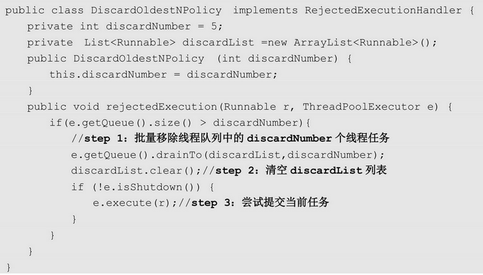
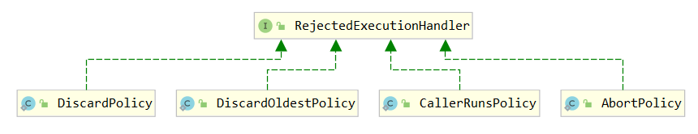

# 并发编程（基础篇）- 线程池

## 1. 线程池简介

### 1.1. 线程池的概念

线程池是 JDK 1.5 后的新特性，是用来创建和管理线程对象的容器。线程池做的工作主要是管理线程组，控制运行的线程的数量及其运行状态。

线程池主要特点是：**线程复用、控制最大并发数、管理线程**。

### 1.2. 线程池的工作原理

Java 线程池的工作原理为：JVM 先根据用户的参数创建一定数量的可运行的线程任务，并将线程任务放入队列，然后在线程创建后启动这些任务，如果线程数量超过了最大数量（由用户设置），则**超出数量的线程排队等候**，等其它线程执行完毕，线程池调度器发现队列中有可用的线程时，再从队列中取出任务来执行。

#### 1.2.1. 线程复用

在 Java 中，每个 `Thread` 类都有一个 `start` 方法。在程序调用 `start` 方法启动线程时，Java 虚拟机会调用该类的 `run` 方法。`Thread` 类的 `run` 方法中其实调用了 `Runnable` 对象的 `run` 方法，例如定义继承 `Thread` 类，在循环中不断传递进来的 `Runnable` 对象来创建线程，再调用 `start` 方法开启线程，就相当于不断执行 `run` 方法中的代码。因此可以将在循环方法中不断获取的 `Runnable` 对象存放在 Queue 中，当前线程在获取下一个 `Runnable` 对象之前可以是阻塞的，这样既能有效控制正在执行的线程个数，也能保证系统中正在等待执行的其他线程有序执行。

以下就是简单实现了一个线程池，达到了线程复用的效果。

### 1.3. 使用线程池的好处

- 降低资源消耗：重用存在的线程的复用，避免频繁创建和销毁线程对象会带来过大的系统开销。
- 提高响应速度。可有效的控制最大并发线程数，提高系统资源的使用率，同时避免过多资源竞争，避免堵塞。当任务到达时，任务可以不需要的等到线程创建就能立即执行。
- 提高线程的可管理性。线程是稀缺资源，如果无限制的创建，不仅会消耗系统资源，还会降低系统的稳定性，使用线程池可以进行统一的分配，调优和监控。
- 附加功能：提供定时执行、定期执行、单线程、并发数控制等功能。

综上所述使用线程池框架 Executor 能更好的管理线程、提供系统资源使用率。

### 1.4. 线程池的组成

一般的线程池主要分为以下 4 个组成部分：

1. 线程池管理器：用于创建并管理线程池
2. 工作线程：线程池中执行具体任务的线程
3. 任务接口：每个任务必须实现的接口，用于工作线程调度和执行策略。*注：只有线程实现了该接口，线程中的任务才能够被线程池调度。*
4. 任务队列：用于存放待处理的任务，提供一种缓冲机制。新的任务将会不断被加入队列中，执行完成的任务将被从队列中移除。

## 2. 线程池的状态

- `RUNNING`：线程最正常的状态，接受新的任务，处理等待队列中的任务。
- `SHUTDOWN`：不接受新的任务提交，但是会继续处理等待队列中的任务。
- `STOP`：不接受新的任务提交，不再处理等待队列中的任务，中断正在执行任务的线程。
- `TIDYING`：所有的任务都销毁了，workCount 为 0，线程池的状态在转换为 `TIDYING` 状态时，会执行钩子方法 `terminated()`。
- `ERMINATED`：`terminated()` 方法结束后，线程池的状态就会变成这个。

## 3. Java 内置线程池

### 3.1. 概述

JDK 中线程池框架主要涉及 Executor、ExecutorService、Callable 等接口和 Executors、ThreadPoolExecutor、Future、FutureTask 等类。

- `Executor` 框架是一个根据一组执行策略调用，调度，执行和控制的异步任务的框架
- `Executors` 是一个工具类，提供不同方法按照相关的需求创建了不同的线程池
- `ExecutorService` 接口继承了 `Executor` 接口并进行了扩展，提供了更多的方法能获得任务执行的状态并且可以获取任务的返回值。
- `ThreadPoolExecutor` 创建自定义线程池的核心类
- `Future` 表示异步计算的结果，他提供了检查计算是否完成的方法，以等待计算的完成，并可以使用 `get()` 方法获取计算的结果

### 3.2. 线程池相关类继承图


### 3.3. Executor 接口

Java 里面线程池的顶级接口是 `Executor`，但是严格意义上讲 `Executor` 并不是一个线程池，而只是一个执行线程的框架，真正的线程池接口是 `ExecutorService`。

```java
public interface Executor {
    // 执行线程任务
    void execute(Runnable command);
}
```

### 3.4. ExecutorService 接口

`ExecutorService` 接口是 java 内置的线程池接口（真正意义上），继承了 `Executor` 接口。

```java
public interface ExecutorService extends Executor
```

#### 3.4.1. 接口常用方法

```java
void shutdown();
```

- 启动一次顺序关闭，执行以前提交的任务，但不接受新任务。

```java
List<Runnable> shutdownNow();
```

- 停止所有正在执行的任务，暂停处理正在等待的任务，并返回等待执行的任务列表。

```java
<T> Future<T> submit(Callable<T> task);
```

- 执行带返回值的任务，返回一个 `Future` 对象用于获取执行结果。

```java
Future<?> submit(Runnable task);
```

- 执行 `Runnable` 任务，并返回一个表示该任务的 `Future`。

```java
<T> Future<T> submit(Runnable task, T result);
```

- 执行 `Runnable` 任务，并返回一个表示该任务的 `Future`。

```java
<T> List<Future<T>> invokeAll(Collection<? extends Callable<T>> tasks) throws InterruptedException;
```

- 提交 tasks 中所有任务，并返回 `Future` 对象集合

```java
<T> List<Future<T>> invokeAll(Collection<? extends Callable<T>> tasks,
                              long timeout, TimeUnit unit) throws InterruptedException;
```

- 提交 tasks 中所有任务，带超时时间

```java
<T> T invokeAny(Collection<? extends Callable<T>> tasks)
    throws InterruptedException, ExecutionException;
```

- 提交 tasks 中所有任务，哪个任务先成功执行完毕，返回此任务执行结果，并取消其它任务

```java
<T> T invokeAny(Collection<? extends Callable<T>> tasks,
                long timeout, TimeUnit unit)
    throws InterruptedException, ExecutionException, TimeoutException;
```

- 提交 tasks 中所有任务，哪个任务先成功执行完毕，返回此任务执行结果，并取消其它任务，带超时时间

#### 3.4.2. 示例

```java
public class ExecutorServiceDemo {

    @Test
    public void shutdownTest() {
        // 使用工厂类获取线程池对象
        ExecutorService es = Executors.newSingleThreadExecutor();
        // 提交任务
        for (int i = 1; i <= 10; i++) {
            es.submit(new ExecutorServiceDemoRunnable(i));
        }
        // 关闭线程池,仅仅是不再接受新的任务,以前的任务还会继续执行
        es.shutdown();
        es.submit(new ExecutorServiceDemoRunnable(888)); // 不能再提交新的任务了
    }

    @Test
    public void shutdownNowTest() {
        // 使用工厂类获取线程池对象
        ExecutorService es = Executors.newSingleThreadExecutor();
        // 提交任务
        for (int i = 1; i <= 10; i++) {
            es.submit(new ExecutorServiceDemoRunnable(i));
        }
        // 立刻关闭线程池，如果线程池中还有缓存的任务，没有执行，则取消执行，并返回这些任务
        List<Runnable> runnables = es.shutdownNow();
        System.out.println(runnables);
    }
}

/**
 * 任务类,包含一个任务编号,在任务中,打印出是哪一个线程正在执行任务
 */
class ExecutorServiceDemoRunnable implements Runnable {
    private final int id;

    public ExecutorServiceDemoRunnable(int id) {
        this.id = id;
    }

    @Override
    public void run() {
        // 获取线程的名称并输出
        String name = Thread.currentThread().getName();
        System.out.println(name + "执行了任务..." + id);
    }

    @Override
    public String toString() {
        return "ExecutorServiceDemoRunnable{id=" + id + "}";
    }
}
```

### 3.5. ScheduledExecutorService 接口

```java
public interface ScheduledExecutorService extends ExecutorService
```

`ScheduledExecutorService` 接口继承了 `ExecutorService` 接口，具备了延迟运行或定期执行任务的能力

**`ScheduledExecutorServic`e 常用方法**：

```java
public <V> ScheduledFuture<V> schedule(Callable<V> callable, long delay, TimeUnit unit);
```

- 延迟时间单位是 unit，数量是 delay 的时间后执行 Callable 接口的逻辑。

```java
public ScheduledFuture<?> schedule(Runnable command, long delay, TimeUnit unit);
```

- 延迟时间单位是 unit，数量是 delay 的时间后执行 Runnable 接口的逻辑。

```java
public ScheduledFuture<?> scheduleAtFixedRate(Runnable command, long initialDelay, long period, TimeUnit unit);
```

- 延迟时间单位是 unit，数量是 initialDelay 的时间后，每间隔 period 时间重复执行一次 Runnable 接口的逻辑。

```java
public ScheduledFuture<?> scheduleWithFixedDelay(Runnable command, long initialDelay, long delay, TimeUnit unit);
```

- 创建并执行一个在给定初始延迟后首次启用的定期操作，随后，在每一次执行终止和下一次执行开始之间都存在给定的延迟（delay）。

### 3.6. ThreadPoolExecutor

#### 3.6.1. 构造方法与参数说明

ThreadPoolExecutor 类的构造方法及参数说明

```java
public ThreadPoolExecutor(int corePoolSize, // 核心线程数（最多保留的线程数）
                          int maximumPoolSize, // 最大线程池大小，也就是线程池中线程的最大数量
                          long keepAliveTime, // 线程最大空闲（生存）时间，针对救急线程
                          TimeUnit unit, // 时间单位
                          BlockingQueue<Runnable> workQueue, // 线程等待（阻塞）队列
                          ThreadFactory threadFactory, // 线程创建工厂，主要用于线程创建时定义名称
                          RejectedExecutionHandler handler // 拒绝策略
                        )
```

可以通过配置不同的参数，创建出行为不同的线程池，以下是 `ThreadPoolExecutor` 构造函数的重要参数的详细说明：

- `corePoolSize`：线程池的核心线程数，线程数定义了最小可以同时运行的线程数量
- `maximumPoolSize`：线程池允许存在的最大工作线程数。其中当线程数超过核心线程数之后，会创建数量为`maximumPoolSize - corePoolSize`的“救急线程”
- `keepAliveTime`：超过核心线程数时闲置线程的存活时间。即当线程池中的线程数量大于 `corePoolSize` 的时候，如果这时没有新的任务提交，核心线程外的线程不会立即销毁，而是会等待，直到等待的时间超过了 `keepAliveTime` 配置的时间才会被回收销毁
- `unit`：`keepAliveTime` 参数的时间单位
- `workQueue`：任务执行前保存任务的队列，保存由 `execute` 方法提交的 `Runnable` 任务。当新任务来的时候会先判断当前运行的线程数量是否达到核心线程数，如果达到的话，任务就会被存放在队列中。
- `threadFactory`：为线程池提供创建新线程的线程工厂
- `handler`：线程池任务队列超过 `maximumPoolSize` 之后的拒绝策略

#### 3.6.2. 拒绝(饱和)策略

如果当前同时运行的线程数量达到线程池中最大线程数量，并且阻塞队列也已经被放满了线程时，则说明线程池的线程资源已耗尽，线程池将没有足够的线程资源执行新的任务。

ThreadPoolExecutor 定义一些拒绝策略来处理新添加的线程任务：

- `ThreadPoolExecutor.AbortPolicy`：抛出 `RejectedExecutionException` 来拒绝新任务的处理。
- `ThreadPoolExecutor.CallerRunsPolicy`：调用执行自己的线程运行任务。不会丢弃任务请求。但是这种策略会降低对于新任务提交速度，影响程序的整体性能。另外，这个策略喜欢增加队列容量。如果应用程序可以承受此延迟并且不能丢弃任何一个任务请求的话，可以选择这个策略。
- `ThreadPoolExecutor.DiscardPolicy`：不处理当前新任务，直接丢弃掉。
- `ThreadPoolExecutor.DiscardOldestPolicy`：此策略将丢弃线程队列中最早的未处理的任务请求，并尝试提交当前任务。

例如：Spring 通过 `ThreadPoolTaskExecutor` 或者直接通过 `ThreadPoolExecutor` 的构造函数创建线程池的时候，当不指定 `RejectedExecutionHandler` 饱和策略的话来配置线程池的时候默认使用的是 `ThreadPoolExecutor.AbortPolicy`。在默认情况下，`ThreadPoolExecutor` 将抛出 `RejectedExecutionException` 来拒绝新来的任务，这代表将丢失对这个任务的处理。对于可伸缩的应用程序，建议使用 `ThreadPoolExecutor.CallerRunsPolicy`。当最大池被填满时，此策略可以提供可伸缩队列。

#### 3.6.3. 自定义拒绝策略

上面默认的拒绝策略均实现了 `RejectedExecutionHandler` 接口，若无法满足实际需要，可以自行扩展 `RejectedExecutionHandler` 接口来实现拒绝策略，并捕获异常来实现自定义拒绝策略。

以下示例实现一个自定义拒绝策略 `DiscardOldestNPolicy`，该策略根据传入的参数丢弃最老的 N 个线程，以便在出现异常时释放更多的资源。具体参考代码如下：



#### 3.6.4. 线程池状态的定义

在 `ThreadPoolExecutor` 类使用 int 的高 3 位来表示线程池状态，低 29 位表示线程数量

|   状态名    | 高 3 位 | 接收新任务 | 处理阻塞队列任务 |                说明                 |
| :--------: | :-----: | :------: | :-----------: | ---------------------------------- |
|  RUNNING   |   111   |    Y     |       Y       |                                    |
|  SHUTDOWN  |   000   |    N     |       Y       | 不会接收新任务，但会处理阻塞队列剩余任务   |
|    STOP    |   001   |    N     |       N       | 会中断正在执行的任务，并抛弃阻塞队列任务   |
|  TIDYING   |   010   |    -     |       -       | 任务全执行完毕，活动线程为 0 即将进入终结 |
| TERMINATED |   011   |    -     |       -       | 终结状态                            |

从数字上比较，`TERMINATED > TIDYING > STOP > SHUTDOWN > RUNNING`。这些信息存储在一个原子变量 ctl 中，目的是将线程池状态与线程个数合二为一，这样就可以用一次 cas 原子操作进行赋值

```java
// rs 为高 3 位代表线程池状态， wc 为低 29 位代表线程个数，ctl 是合并它们
private static int ctlOf(int rs, int wc) { return rs | wc; }

private void advanceRunState(int targetState) {
    for (;;) {
        int c = ctl.get();
        if (runStateAtLeast(c, targetState) ||
            // c 为旧值， ctlOf 返回结果为新值
            ctl.compareAndSet(c, ctlOf(targetState, workerCountOf(c))))
            break;
    }
}
```

#### 3.6.5. 线程池工作原理


1. 线程池中刚开始没有线程，当一个任务提交给线程池后，线程池会创建一个新线程来执行任务。
2. 当线程数达到 corePoolSize 并没有线程空闲，这时再加入任务，新加的任务会被加入 workQueue 队列排队，直到有空闲的线程。
3. 如果队列选择了有界队列，那么任务超过了队列大小时，会创建 `maximumPoolSize - corePoolSize` 数目的线程来救急。
4. 如果线程到达 maximumPoolSize 仍然有新任务这时会执行拒绝策略。jdk 提供了 4 种拒绝策略实现（其它框架也提供了实现）：
    - `AbortPolicy`：让调用者抛出 `RejectedExecutionException` 异常（默认策略）
    - `CallerRunsPolicy`：让调用者运行任务
    - `DiscardPolicy`：放弃本次任务
    - `DiscardOldestPolicy`：放弃队列中最早的任务，本任务取而代之
    - Dubbo 的实现：在抛出 RejectedExecutionException 异常之前会记录日志，并 dump 线程栈信息，方便定位问题
    - Netty 的实现：是创建一个新线程来执行任务
    - ActiveMQ 的实现：带超时等待（60s）尝试放入队列，类似我们之前自定义的拒绝策略
    - PinPoint 的实现：它使用了一个拒绝策略链，会逐一尝试策略链中每种拒绝策略
5. 当高峰过去后，超过 corePoolSize 的救急线程如果一段时间没有任务做，需要结束节省资源，这个时间由 keepAliveTime 和 unit 两个参数来控制。



根据 `ThreadPoolExecutor` 构造方法，JDK Executors 类中提供了众多工厂方法来创建各种用途的线程池

### 3.7. 一些线程方法的区别

#### 3.7.1. 提交任务的两个方法

`execute()` 方法是定义在 `Executor` 接口中，方法接收一个 Runnable 实例，它用来执行一个任务

```java
public void execute(Runnable runnable);
```

而 `submit()` 方法是定义在 `ExecutorService` 接口中，该方法返回的是 `Future` 对象。可以用 `isDone()` 来查询 Future 是否已经完成，当任务完成时，它具有一个结果，可以调用 `get()` 来获取结果。也可以不用 `isDone()` 进行检查就直接调用 get()，在这种情况下， get() 将阻塞，直至结果准备就绪。

```java
public Future<?> submit(Runnable task);
public <T> Future<T> submit(Runnable task, T result);
public <T> Future<T> submit(Callable<T> task);
```

#### 3.7.2. 关闭线程池的两个方法

在 `ExecutorService` 接口提供了两个关闭线程池的方法，其区别如下：

- `shutdown()`：将线程池状态变为 SHUTDOWN，不会接收新任务，但会将已提交的任务执行完成。此方法不会阻塞调用线程的执行。
- `shutdownNow()`：将线程池状态变为 STOP，不会接收新任务，会将队列中的任务返回，并用 `interrupt` 的方式中断正在执行的任务

## 4. Executors 工具类创建各种类型的线程池

`Executors` 提供了一系列工厂方法用于创建线程池的工具类，该类中提供了各种静态方法创建不同类型的线程池（本质是使用`ThreadPoolExecutor`构造方法创建`ExecutorService`实现对象，区别只是设置不同的参数）。

> 引用《阿里巴巴 Java 开发手册》中关于线程池的内容：
>
> 【强制】线程池不允许使用 `Executors` 去创建，而是通过 `ThreadPoolExecutor` 的方式，这样的处理方式让写的同学更加明确线程池的运行规则，规避资源耗尽的风险。说明：`Executors` 返回的线程池对象的弊端如下：
>
> 1. `FixedThreadPool` 和 `SingleThreadPool`：允许的请求队列长度为 `Integer.MAX_VALUE`，可能会堆积大量的请求，从而导致 OOM
> 2. `CachedThreadPool`：允许的创建线程数量为 `Integer.MAX_VALUE`，可能会创建大量的线程，从而导致 OOM

### 4.1. newCachedThreadPool

```java
public class Executors {
    // 创建一个默认的线程池对象，里面的线程可重用，且在第一次使用时才创建
    public static ExecutorService newCachedThreadPool() {
        return new ThreadPoolExecutor(0, Integer.MAX_VALUE,
                                      60L, TimeUnit.SECONDS,
                                      new SynchronousQueue<Runnable>());
    }

    // 线程池中的所有线程都使用 ThreadFactory 来创建，这样的线程无需手动启动，自动执行
    public static ExecutorService newCachedThreadPool(ThreadFactory threadFactory) {
        return new ThreadPoolExecutor(0, Integer.MAX_VALUE,
                                      60L, TimeUnit.SECONDS,
                                      new SynchronousQueue<Runnable>(),
                                      threadFactory);
    }
    // ...省略
}
```

`newCachedThreadPool` 用于创建一个缓存线程池。核心线程数是 0， 最大线程数是 `Integer.MAX_VALUE`，空闲生存时间默认是 60s，意味着线程池全部的线程都是“救急线程”，可以无限被创建。

**调用 execute 创建新线程时，如果有可用线程，则重用以前构造的线程；如果现有线程没有可用的，则创建一个新线程并添加到池中，终止并从缓存中移除那些(keepAliveTime)超过默认的 60 秒未被使用的线程**。因此长时间保持空闲的线程池不会占用任何资源。

一般在创建线程时需要执行申请 CPU 和内存、记录线程状态、控制阻塞等多项工作，复杂且耗时。对于执行很多短期异步任务的程序而言，这种线程池很大程度地重用线程，从而提高程序性能。

> 适用场景：整个线程池表现为线程数会根据任务量不断增长，没有上限，当任务执行完毕，空闲1分钟后释放线程。 适合任务数比较密集，但每个任务执行时间较短的情况

### 4.2. newFixedThreadPool

```java
public class Executors {
    // 创建一个可重用固定线程数的线程池
    public static ExecutorService newFixedThreadPool(int nThreads) {
        return new ThreadPoolExecutor(nThreads, nThreads,
                                      0L, TimeUnit.MILLISECONDS,
                                      new LinkedBlockingQueue<Runnable>());
    }

    // 创建一个可重用固定线程数的线程池且线程池中的所有线程都使用 ThreadFactory 来创建
    public static ExecutorService newFixedThreadPool(int nThreads, ThreadFactory threadFactory) {
        return new ThreadPoolExecutor(nThreads, nThreads,
                                      0L, TimeUnit.MILLISECONDS,
                                      new LinkedBlockingQueue<Runnable>(),
                                      threadFactory);
    }
    // ...省略
}
```

`newFixedThreadPool` 用于创建一个**可重用固定线程数量的线程池**，并将线程资源存放在共享的**无界队列**中循环使用。

在任意点，在大多数 nThreads 线程会处于处理任务的活动状态。如果在所有线程处于活动状态时提交新任务，则在有可用线程之前，新任务将在队列中等待，直到有可用的线程资源；如果在关闭前的执行期间由于失败而导致任何线程终止，那么一个新线程将代替它执行后续的任务（如果需要）。在某个线程被显式地关闭之前，池中的线程将一直存在。

> 适用场景：任务数量已知，相对耗时的任务

### 4.3. newSingleThreadExecutor

```java
public class Executors {
    // 创建一个使用单个 worker 线程的 Executor，以无界队列方式来运行该线程
    public static ExecutorService newSingleThreadExecutor() {
        return new FinalizableDelegatedExecutorService
            (new ThreadPoolExecutor(1, 1,
                                    0L, TimeUnit.MILLISECONDS,
                                    new LinkedBlockingQueue<Runnable>()));
    }

    // 创建一个使用单个 worker 线程的 Executor，且线程池中的所有线程都使用 ThreadFactory 来创建
    public static ExecutorService newSingleThreadExecutor(ThreadFactory threadFactory) {
        return new FinalizableDelegatedExecutorService
            (new ThreadPoolExecutor(1, 1,
                                    0L, TimeUnit.MILLISECONDS,
                                    new LinkedBlockingQueue<Runnable>(),
                                    threadFactory));
    }
    // ...省略
}
```

`newSingleThreadExecutor` 创建一个保证永远有且只有一个可用线程的线程池，<font color=red>**这个线程池可以在线程死后（或发生异常时）重新启动一个线程来替代原来的线程继续执行下去**</font>！此线程池保证所有任务的执行顺序按照任务的提交顺序执行。

与手动创建单个线程的区别是：手动创建的线程如果任务执行失败而终止，而这种类型的线程池会新建一个线程，确保继续执行。

newSingleThreadExecutor 与 newFixedThreadPool 的区别：

- `Executors.newSingleThreadExecutor()` 线程个数始终为1，不能修改。其中 `FinalizableDelegatedExecutorService` 应用的是装饰器模式，只对外暴露了 `ExecutorService` 接口，因此不能调用 `ThreadPoolExecutor` 类中特有的方法
- `Executors.newFixedThreadPool(1)` 初始时为1，后续可以进行修改，对外暴露的是 `ThreadPoolExecutor` 对象，可以强转后调用 setCorePoolSize 等方法进行修改。

### 4.4. newScheduledThreadPool

```java
public class Executors {
    // 创建一个可重用固定线程数的线程池且允许延迟运行或定期执行任务
    public static ScheduledExecutorService newScheduledThreadPool(int corePoolSize) {
        return new ScheduledThreadPoolExecutor(corePoolSize);
    }

    // 创建一个可重用固定线程数的线程池且线程池中的所有线程都使用 ThreadFactory 来创建，且允许延迟运行或定期执行
    public static ScheduledExecutorService newScheduledThreadPool(
            int corePoolSize, ThreadFactory threadFactory) {
        return new ScheduledThreadPoolExecutor(corePoolSize, threadFactory);
    }
    
    // 创建一个单线程执行程序，它允许在给定延迟后运行命令或者定期地执行
    public static ScheduledExecutorService newSingleThreadScheduledExecutor() {
        return new DelegatedScheduledExecutorService
            (new ScheduledThreadPoolExecutor(1));
    }
    
    // 创建一个单线程执行程序，它可安排在给定延迟后运行命令或者定期地执行
    public static ScheduledExecutorService newSingleThreadScheduledExecutor(ThreadFactory threadFactory) {
        return new DelegatedScheduledExecutorService
            (new ScheduledThreadPoolExecutor(1, threadFactory));
    }
    // ...省略
}
```

`newScheduledThreadPool` 创建了一个可定时调度，核心线程池固定，大小无限的线程池。此线程池支持设置在给定的延迟时间后执行或者周期性执行某个线程任务。如果闲置，非核心线程池会在 `DEFAULT_KEEPALIVEMILLIS` 时间内回收

```java
ScheduledExecutorService scheduledThreadPool= Executors.newScheduledThreadPool(3);

scheduledThreadPool.schedule(newRunnable(){
    @Override
    public void run() {
        System.out.println("延迟三秒");
    }
}, 3, TimeUnit.SECONDS);

scheduledThreadPool.scheduleAtFixedRate(newRunnable(){
    @Override
    public void run() {
        System.out.println("延迟 1 秒后每三秒执行一次");
    }
}, 1, 3, TimeUnit.SECONDS);
```

### 4.5. newWorkStealingPool（JDK 1.8 新增）

```java
public class Executors {
    public static ExecutorService newWorkStealingPool(int parallelism) {
        return new ForkJoinPool
            (parallelism,
             ForkJoinPool.defaultForkJoinWorkerThreadFactory,
             null, true);
    }

    public static ExecutorService newWorkStealingPool() {
        return new ForkJoinPool
            (Runtime.getRuntime().availableProcessors(),
             ForkJoinPool.defaultForkJoinWorkerThreadFactory,
             null, true);
    }
    // ...省略
}
```

`newWorkStealingPool` 是 JDK 1.8 新增的线程池类型，创建一个持有足够线程的线程池，达到快速运算的目的，在内部通过使用多个队列来减少各个线程调度产生的竞争。

足够的线程指 JDK 根据当前线程的运行需求向操作系统申请足够的线程，以保障线程的快速执行，并很大程度地使用系统资源，提高并发计算的效率，省去用户根据 CPU 资源估算并行度的过程。开发者也可以通过带参数的重载方法指定线程的并发数。

### 4.6. 示例

```java
public class ExecutorsDemo {

    // newCachedThreadPool 方法获取线程池测试
    @Test
    public void newCachedThreadPoolTest1() {
        // 1.使用工厂类获取线程池对象
        ExecutorService es = Executors.newCachedThreadPool();
        // 2.提交任务
        for (int i = 1; i <= 10; i++) {
            es.submit(new MyRunnable(i));
        }
    }

    // newCachedThreadPool 方法获取线程池测试
    @Test
    public void newCachedThreadPoolTest2() {
        // 1.使用工厂类获取线程池对象
        ExecutorService es = Executors.newCachedThreadPool(new ThreadFactory() {
            int n = 1;

            @Override
            public Thread newThread(Runnable r) {
                return new Thread(r, "自定义的线程名称" + n++);
            }
        });
        // 2.提交任务
        for (int i = 1; i <= 10; i++) {
            es.submit(new MyRunnable(i));
        }
    }

    // newFixedThreadPool 方法获取线程池测试
    @Test
    public void newFixedThreadPoolTest1() {
        // 1.使用工厂类获取线程池对象
        ExecutorService es = Executors.newFixedThreadPool(3);
        // 2.提交任务
        for (int i = 1; i <= 10; i++) {
            es.submit(new MyRunnable(i));
        }
    }

    // newFixedThreadPool 方法获取线程池测试
    @Test
    public void newFixedThreadPoolTest2() {
        // 1.使用工厂类获取线程池对象
        ExecutorService es = Executors.newFixedThreadPool(3, new ThreadFactory() {
            int n = 1;

            @Override
            public Thread newThread(Runnable r) {
                return new Thread(r, "自定义的线程名称" + n++);
            }
        });
        // 2.提交任务
        for (int i = 1; i <= 10; i++) {
            es.submit(new MyRunnable(i));
        }
    }

    // newSingleThreadExecutor 方法获取线程池测试
    @Test
    public void newSingleThreadExecutorTest1() {
        // 1.使用工厂类获取线程池对象
        ExecutorService es = Executors.newSingleThreadExecutor();
        // 2.提交任务
        for (int i = 1; i <= 10; i++) {
            es.submit(new MyRunnable(i));
        }
    }

    // newSingleThreadExecutor 方法获取线程池测试
    @Test
    public void newSingleThreadExecutorTest2() {
        // 1.使用工厂类获取线程池对象
        ExecutorService es = Executors.newSingleThreadExecutor(new ThreadFactory() {
            int n = 1;

            @Override
            public Thread newThread(Runnable r) {
                return new Thread(r, "自定义的线程名称" + n++);
            }
        });
        // 2.提交任务
        for (int i = 1; i <= 10; i++) {
            es.submit(new MyRunnable(i));
        }
    }

    // newScheduledThreadPool 方法获取定时任务线程池，schedule 方法功能测试
    @Test
    public void newScheduledThreadPoolScheduleTest() throws InterruptedException {
        // 1.获取一个具备延迟执行任务的线程池对象
        ScheduledExecutorService es = Executors.newScheduledThreadPool(3);
        // 2.创建多个任务对象,提交任务,每个任务延迟2秒执行
        for (int i = 1; i <= 10; i++) {
            es.schedule(new MyRunnable(i), 2, TimeUnit.SECONDS);
        }
        System.out.println("main thread is over");
        Thread.sleep(4000);
    }

    // newScheduledThreadPool 方法获取定时任务线程池，scheduleAtFixedRate 方法功能测试
    @Test
    public void newScheduledThreadPoolScheduleAtFixedRateTest() throws InterruptedException {
        // 1.获取一个具备延迟执行任务的线程池对象
        ScheduledExecutorService es = Executors.newScheduledThreadPool(1, new ThreadFactory() {
            int n = 1;

            @Override
            public Thread newThread(Runnable r) {
                return new Thread(r, "自定义线程名:" + n++);
            }
        });
        // 2.创建多个任务对象，延迟1秒开始，每间隔2秒执行一个任务(不包含任务实际运行的时间，即任务完成后再算间隔)
        for (int i = 1; i <= 10; i++) {
            es.scheduleAtFixedRate(new MyRunnable2(i), 1, 2, TimeUnit.SECONDS);
        }
        System.out.println("main thread is over");
        Thread.sleep(20000);
    }

    // newScheduledThreadPool 方法获取定时任务线程池，schedule 方法功能测试
    @Test
    public void newSingleThreadScheduledExecutorScheduleWithFixedDelayTest() throws InterruptedException {
        // 1.获取一个具备延迟执行任务的线程池对象
        // 注：这里想更容易看出效果，使用只有一个线程的定时任务线程池
        ScheduledExecutorService es = Executors.newSingleThreadScheduledExecutor(new ThreadFactory() {
            int n = 1;

            @Override
            public Thread newThread(Runnable r) {
                return new Thread(r, "自定义线程名:" + n++);
            }
        });
        // 2.创建多个任务对象，延迟1秒开始，每间隔2秒执行一个任务(包含任务实际运行的时间)
        for (int i = 1; i <= 10; i++) {
            es.scheduleWithFixedDelay(new MyRunnable2(i), 1, 2, TimeUnit.SECONDS);
        }
        System.out.println("main thread is over");
        Thread.sleep(20000);
    }


}

// 用于测试的任务类，包含一个任务编号属性。在任务中，打印出是哪一个线程正在执行任务
class MyRunnable implements Runnable {
    private final int id;

    public MyRunnable(int id) {
        this.id = id;
    }

    @Override
    public void run() {
        // 获取线程的名称输出
        String name = Thread.currentThread().getName();
        System.out.println(name + "执行了任务..." + id);
    }
}

class MyRunnable2 implements Runnable {
    private final int id;

    public MyRunnable2(int id) {
        this.id = id;
    }

    @Override
    public void run() {
        String name = Thread.currentThread().getName();
        try {
            Thread.sleep(1500);
        } catch (InterruptedException e) {
            e.printStackTrace();
        }
        System.out.println(name + "执行了任务:" + id);
    }
}
```

## 5. 线程池使用 – Runnable 接口

### 5.1. 线程池使用Runnable的步骤

1. 通过 Executors 工厂类的静态方法来创建线程池对象：`newFixedThreadPool(int size)`

```java
// 创建线程池对象
ExecutorService tp = Executors.newFixedThreadPool(线程数量);
```

2. 定义Runnable的实现类
3. 重写run方法
4. 创建Rannable实现类对象

```java
MyRunnable mr = new MyRunnable();
```

5. 调用`submit(Runnable task)`提交任务，每次调用该方法就使用线程池中的一条线程，线程完毕后再放回线程池。

```java
tp.submit(mr);
//或者使用匿名内部类的方法传入Runnable对象，调用submit方法
tp.submit(new Runnable(){
    @Override
    public void run(){
        //重写run方法
    }
});
```

6. 销毁线程池
    - `shutdown()`：销毁线程池，要等待线程池中的所有任务执行完成后才销毁。
    - `shutdownNow()`：立即销毁线程池，不管线程池中的任务是否执行完成。（一般比较少用）

### 5.2. 线程池的执行任务过程

1. 刚开始创建好线程池，没有任务要执行，线程池的线程会等待任务
2. 往线程池中提交任务，线程池会派线程执行任务，有些线程没有任务接着等待
3. 如果线程池中的任务比线程多，线程池中个的线程执行任务，后面的任务等待，等到线程执行完任务，空闲的时候，就执行后面的任务
4. 如果所有任务都执行完，线程就等待任务，直到线程池被销毁，这些线程也就销毁

## 6. 线程池使用 – Callable 接口

### 6.1. Callable 接口作用

也是放在子线程上面执行的代码，返回结果并且可能抛出异常的任务。

### 6.2. Callable 接口方法

```java
@FunctionalInterface
public interface Callable<V> {
    /* 计算结果，如果无法计算结果，则抛出一个异常。 */
    V call() throws Exception;
}
```

`Callable` 与 `Runnable` 接口的区别：

- `Runnable` 接口的方法是 `run()`
- `Callable` 接口的方法是 `call()`

**call 方法的特点**：

1. 可以有返回值
2. 可以抛出异常

### 6.3. Callable 使用线程池的步骤

1. 获取线程池

```java
// 使用Executors的静态方法，定义创建的线程池的线程数量
public static ExecutorService newFixedThreadPool(int nThreads);

// 例如：
ExecutorService tp = Executors.newFixedThreadPool(线程数量);
```

2. 定义 Callable 的实现类
3. 重写 call 方法
4. 创建 Callable 实现类对象

```java
MyCallable mc = new MyCallable();
```

5. 往线程池中调用 submit(Callable<T> task) 提交任务

```java
tp.submit(mc);
// 或者使用匿名内部类的方法传入Callable对象，调用submit方法
tp.submit(new Callable(){
    @Override
    public void call(){
        // 重写run方法
    }
});
```

6. 销毁线程池shutdown();

**注意：可以同时往线程池中提交 `Runnable` 和 `Callable` 任务**

## 7. 异步计算结果 Future

`Future` 接口是 Java 专门用于描述异步计算结果的，可以通过 `Future` 对象来获取线程计算的结果;

```java
public interface Future<V>
```

### 7.1. 常用方法

```java
boolean cancel(boolean mayInterruptIfRunning);
```

- 试图取消对此任务的执行

```java
V get() throws InterruptedException, ExecutionException;
```

- 等待异步线程计算完成，然后获取其结果。

```java
V get(long timeout, TimeUnit unit) throws InterruptedException, ExecutionException, TimeoutException;
```

- 设置最大等待时。如在所给定的时间内异步线程计算完成，则获取其结果（如果结果可用），否则会抛出异常。

```java
boolean isCancelled();
```

- 如果在任务正常完成前将其取消，则返回 true。

```java
boolean isDone();
```

- 如果任务已完成，则返回 true。

### 7.2. Future 的获取与使用步骤

1. 获取 Future 对象

```java
Future<Integer> future = pool.submit(mc);
```

2. 根据 Future 对象调用get()方法拿到Call方法的返回值

```java
Integer i = future.get();
```

**注：如果多个线程调用了Future的get()方法，下面的线程是同步执行的。因为可能返回值会参与其他的操作，如果异步执行的话，那后面的操作就会出现问题，有些值还没有返回，所以系统规定了是同步执行。**

**Code Demo:(获取call方法返回值Future)**

```java
import java.util.concurrent.Callable;
import java.util.concurrent.ExecutorService;
import java.util.concurrent.Executors;
import java.util.concurrent.Future;

/*
	使用线程池方式执行任务,返回1-n的和
*/
public class MoonZero {
    public static void main(String[] args) throws Exception {
        // 创建线程池对象
        ExecutorService pool = Executors.newFixedThreadPool(2);
        // 定义变量接收线程的返回值，使用了匿名对象
        Future<Integer> future1 = pool.submit(new MyCallable(100));
        Integer sum1 = future1.get();
        Future<Integer> future2 = pool.submit(new MyCallable(50));
        Integer sum2 = future2.get();

        System.out.println("1-100的和是：" + sum1);
        System.out.println("1-50的和是：" + sum2);
        // 销毁线程池，这个会等待线程池中所有任务执行完成才销毁
        pool.shutdown();
    }
}

class MyCallable implements Callable<Integer> {
    // 定义一个成员变量用接收统计的n值
    private int num;

    // 定义一个有参的构造方法，用来传入需要统计的参数
    public MyCallable(int num) {
        this.num = num;
    }

    // 重写call方法
    @Override
    public Integer call() throws Exception {
        // 定义一个变量统计总和
        int sum = 0;
        for (int i = 1; i <= num; i++) {
            sum += i;
        }
        return sum;
    }
}
```

### 7.3. 示例

```java
public class FutureDemo {

    @Test
    public void FutureBasicTest() throws ExecutionException, InterruptedException {
        // 1.获取线程池对象
        ExecutorService es = Executors.newCachedThreadPool();
        // 2.创建 Callable 类型的任务对象，并且启动
        Future<Integer> future = es.submit(new MyCallable(1, 1));
        // 3.判断任务是否已经完成
        boolean done = future.isDone();
        System.out.println("第一次判断任务是否完成:" + done);
        boolean cancelled = future.isCancelled();
        System.out.println("第一次判断任务是否取消:" + cancelled);
        Integer v = future.get(); // 一直等待任务的执行,直到完成为止
        System.out.println("任务执行的结果是:" + v);
        boolean done2 = future.isDone();
        System.out.println("第二次判断任务是否完成:" + done2);
        boolean cancelled2 = future.isCancelled();
        System.out.println("第二次判断任务是否取消:" + cancelled2);
    }

    // 测试 Future 对象的 cancel 方法
    @Test
    public void FutureCancelTest() throws Exception {
        // 1.获取线程池对象
        ExecutorService es = Executors.newCachedThreadPool();
        // 2.创建 Callable 类型的任务对象，并且启动
        Future<Integer> future = es.submit(new MyCallable(1, 1));
        // 3.判断任务是否已经完成
        boolean b = future.cancel(true);
        System.out.println("取消任务执行的结果:" + b);
    }

    // 测试 Future 对象设置等待时间的 get 方法
    @Test
    public void FutureGetTimeoutTest() throws Exception {
        // 1.获取线程池对象
        ExecutorService es = Executors.newCachedThreadPool();
        // 2.创建 Callable 类型的任务对象，并且启动
        Future<Integer> future = es.submit(new MyCallable(1, 1));
        // 3.设置最大等待结果时间
        Integer v = future.get(1, TimeUnit.SECONDS); // 由于等待时间过短,任务来不及执行完成,会报异常
        System.out.println("任务执行的结果是:" + v);
    }

}

class MyCallable implements Callable<Integer> {
    private final int a;
    private final int b;

    public MyCallable(int a, int b) {
        this.a = a;
        this.b = b;
    }

    @Override
    public Integer call() throws Exception {
        String name = Thread.currentThread().getName();
        System.out.println(name + "准备开始计算...");
        Thread.sleep(2000);
        System.out.println(name + "计算完成...");
        return a + b;
    }
}
```

## 8. 线程池的工作流程总结（待确认是否正确）

Java 线程池刚被创建时，只是向系统申请一个用于执行线程队列和管理线程池的线程资源。在调用 `execute()` 方法添加一个任务时，线程池会按照以下流程执行任务：

- 如果正在运行的线程数量少于 `corePoolSize`（用户定义的核心线程数），线程池就会立刻创建线程并执行该线程任务。
- 如果正在运行的线程数量大于等于 `corePoolSize`，该任务就将被放入阻塞队列中。
- 在阻塞队列已满且正在运行的线程数量少于 `maximumPoolSize` 时，线程池会创建非核心线程立刻执行该线程任务。
- 在阻塞队列已满且正在运行的线程数量大于等于 `maximumPoolSize` 时，线程池将拒绝执行该线程任务并抛出 `RejectExecutionException` 异常。
- 在线程任务执行完毕后，该任务将被从线程池队列中移除，线程池将从队列中取下一个线程任务继续执行。
- 在线程处于空闲状态的时间超过 `keepAliveTime` 时间时，正在运行的线程数量超过 `corePoolSize`，该线程将会被认定为空闲线程并停止。因此在线程池中所有线程任务都执行完毕后，线程池会收缩到 `corePoolSize` 大小。

> TODO: 流程图好像有点问题，待修改


## 9. 自定义线程池实战

此部分根据线程池涉及的相关元素，自定义一个线程池实现示例

### 9.1. 自定义线程池整体架构设计图


### 9.2. 实现示例


