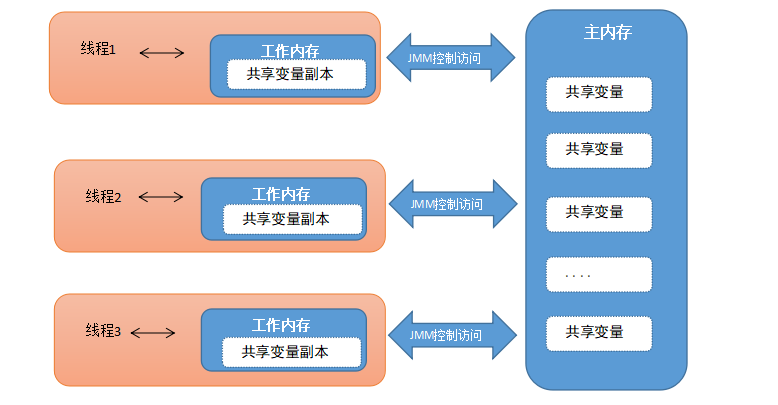

## 1. 并发编程中的三个问题

### 1.1. 多线程下变量的不可见性

在多线程并发执行下，多个线程修改共享的成员变量，会出现一个线程修改了共享变量的值后，另一个线程不能直接看到该线程修改后的变量的最新值。

#### 1.1.1. 变量不可见问题示例

```java
public class VisibilityDemo01 {
    // main方法，作为一个主线程。
    public static void main(String[] args) {
        // a.开启一个子线程
        MyThread t = new MyThread();
        t.start();

        // b.主线程执行
        while (true) {
            if (t.isFlag()) {
                System.out.println("主线程进入循环执行~~~~~");
            }
        }
    }
}

class MyThread extends Thread {
    // 成员变量
    private boolean flag = false;

    @Override
    public void run() {
        try {
            Thread.sleep(1000);
        } catch (InterruptedException e) {
            e.printStackTrace();
        }
        // 触发修改共享成员变量
        flag = true;
        System.out.println("flag=" + flag);
    }

    public boolean isFlag() {
        return flag;
    }

    public void setFlag(boolean flag) {
        this.flag = flag;
    }
}
```

运行结果：子线程中已经将 flag 设置为 true，但 main 主线程中始终没有读到修改后的最新值，从而循环一直无法进入 if 代码块，所以没有任何打印

#### 1.1.2. 问题分析


1. 线程t 从主内存读取到数据放入其对应的工作内存
2. 将 flag 的值更改为 true，但是这个时候 flag 的值还没有写回主内存
3. 此时 main 主线程读取到了 flag 的值为 false
4. 当子线程t 将 flag 的值写回去后，但是 main 函数里面的 while(true) 调用的是系统比较底层的代码，速度快，快到没有时间再去读取主存中的值，所以 while(true) 读取到的值一直是 false。(如果有一个时刻 main 线程从主内存中读取到了主内存中 flag 的最新值，那么 if 代码块就可以执行，main 线程何时从主内存中读取最新的值，我们无法控制)

#### 1.1.3. 变量不可见性内存语义

JMM(Java Memory Model)：Java内存模型，是 java 虚拟机规范中所定义的一种内存模型，Java 内存模型是标准化的，屏蔽掉了底层不同计算机的区别。

**Java 内存模型(Java Memory Model)描述了 Java 程序中各种变量(线程共享变量)的访问规则，以及在 JVM 中将变量存储到内存和从内存中读取变量这样的底层细节**。JMM 有以下规定：

- 所有的共享变量都存储于主内存。这里所说的变量指的是实例变量和类变量。不包含局部变量，因为局部变量是线程私有的，因此不存在竞争问题。
- 每一个线程还存在自己的工作内存，线程的工作内存，保留了被线程使用的变量的工作副本。
- 线程对变量的所有的操作(读，取)都必须在工作内存中完成，而不能直接读写主内存中的变量。
- 不同线程之间也不能直接访问对方工作内存中的变量，线程间变量的值的传递需要通过主内存中转来完成。

本地内存和主内存的关系：



### 1.2. 指令重排序

#### 1.2.1. 概述

指令重排序，是指为了提高性能，编译器和处理器常常会对既定的代码执行顺序进行指令重排序。

原因：一个好的内存模型实际上不会对处理器和编译器规则进行束缚，即在不改变程序执行结果的前提下，JMM 对底层尽量减少约束，尽可能提高执行效率。因此，在执行程序时，为了提高性能，编译器和处理器常常会对指令进行重排序。一般重排序可以分为如下三种：

1.编译器优化的重排序。编译器在不改变单线程程序语义的前提下，可以重新安排语句的执行顺序；
2.指令级并行的重排序。现代处理器采用了指令级并行技术来将多条指令重叠执行。如果不存在数据依赖性，处理器可以改变语句对应机器指令的执行顺序；
3.内存系统的重排序。由于处理器使用缓存和读/写缓冲区，这使得加载和存储操作看上去可能是在乱序执行的。


#### 1.2.2. 重排序的好处

重排序可以提高处理的速度。


#### 1.2.3. 重排序问题案例演示

重排序虽然可以提高执行的效率，但是在并发执行下，JVM 虚拟机底层并不能保证重排序下带来的安全性等问题。如下案例：

```java
public class OutOfOrderDemo {
    // 新建几个静态变量
    public static int a = 0, b = 0;
    public static int i = 0, j = 0;

    public static void main(String[] args) throws Exception {
        int count = 0;
        while (true) {
            count++;
            a = 0;
            b = 0;
            i = 0;
            j = 0;
            // 定义两个线程。
            // 线程A
            Thread t1 = new Thread(new Runnable() {
                @Override
                public void run() {
                    a = 1;
                    i = b;
                }
            });

            // 线程B
            Thread t2 = new Thread(new Runnable() {
                @Override
                public void run() {
                    b = 1;
                    j = a;
                }
            });

            t1.start();
            t2.start();
            t1.join(); // 让t1线程优先执行完毕
            t2.join(); // 让t2线程优先执行完毕

            // 得到线程执行完毕以后变量的结果。
            System.out.println("第" + count + "次输出结果：i = " + i + " , j = " + j);
            if (i == 0 && j == 0) {
                break;
            }
        }
    }
}
```

以上程序中的4行代码的执行顺序决定了最终 i 和 j 的值，在执行的过程中可能会出现三种情况如下：


还有一种因重排序而出现的特别情况：


**原因分析**：发生了重排序，在线程 1 和线程 2 内部的两行代码的实际执行顺序和代码在 Java 文件中的顺序是不一致的，代码指令并不是严格按照代码顺序执行的，当发生了指令重排序，这里颠倒的是 `a = 1, i = b` 以及 `j=a , b=1` 的顺序，从而直接获取了`i = b(0), j = a(0)`的值！显然这种情况就会造成程序的安全性问题。

#### 1.2.4. as-if-serial 语义

as-if-serial 语义的意思是：不管编译器和 CPU 如何重排序，必须保证在单线程情况下程序的结果是正确的。如以下数据有依赖关系，不能重排序。

- **写后读**

```java
int a = 1;
int b = a;
```

- **写后写**

```java
int a = 1;
int a = 2;
```

- 读后写

```java
int a = 1;
int b = a;
int a = 2;
```

编译器和处理器不会对存在数据依赖关系的操作做重排序，因为这种重排序会改变执行结果。但如果操作之间不存在数据依赖关系，这些操作就可能被编译器和处理器重排序。例如：

```java
int a = 1;
int b = 2;
int c = a + b;
```

#### 1.2.5. 小结

程序代码在执行过程中的先后顺序，由于 Java 在编译期以及运行期的优化，导致了代码的执行顺序未必就是开发者编写代码时的顺序。上述示例中使用 `volatile` 修饰变量后可以实现禁止指令重排序，从而修正重排序可能带来的并发安全问题。

```java
private volatile static int i = 0, j = 0;
private volatile static int a = 0, b = 0;
```

### 1.3. 原子性

#### 1.3.1. 原子性概念

原子性（Atomicity）：在一次或多次操作中，要么所有的操作都执行并且不会受其他因素干扰而中断，要么所有的操作都不执行

#### 1.3.2. 原子性问题示例

```java
public class AtomicityTest {
    // 1.定义一个共享变量number
    private static int number = 0;

    public static void main(String[] args) throws InterruptedException {
        // 2.对number进行1000的++操作
        Runnable increment = () -> {
            for (int i = 0; i < 1000; i++) {
                number++;
            }
        };

        List<Thread> list = new ArrayList<>();
        // 3.使用5个线程来进行
        for (int i = 0; i < 5; i++) {
            Thread t = new Thread(increment);
            t.start();
            list.add(t);
        }

        for (Thread t : list) {
            t.join();
        }

        System.out.println("number = " + number);
    }
}
```

使用 javap 反汇编 class 文件，对于 `number++` 而言（number 为静态变量），实际会产生如下的 JVM 字节码指令


`number++` 实际是由多条语句组成，以上多条指令在一个线程的情况下是不会出问题的，但是在多线程情况下就可能会出现问题。比如一个线程在执行 `13: iadd` 时，另一个线程又执行 `9: getstatic`，就会导致两次 `number++`，实际上只加了1。

#### 1.3.3. 小结

并发编程时，会出现原子性问题，造成此问题的原因是，当一个线程对共享变量操作到一半时，另外的线程也有可能来操作共享变量，干扰了前一个线程的操作。

## 2. 线程安全

### 2.1. 多线程程序注意事项

1. **线程之间的安全性**。同一个进程里面的多线程是资源共享的，也就是都可以访问同一个内存地址当中的一个变量。例如：若每个线程中对全局变量、静态变量只有读操作，而无写操作，一般来说，这个全局变量是线程安全的：若有多个线程同时执行写操作，一般都需要考虑线程同步，否则就可能影响线程安全
2. **线程之间的死锁**。为了解决线程之间的安全性引入了 Java 的锁机制，而一不小心就会产生 Java 线程死锁的多线程问题，因为不同的线程都在等待那些根本不可能被释放的锁，从而导致所有的工作都无法完成
3. **线程太多了会将服务器资源耗尽形成死机当机**。线程数太多有可能造成系统创建大量线程而导致消耗完系统内存以及 CPU 的“过渡切换”，造成系统的死机

### 2.2. 线程安全概念与解决方法

#### 2.2.1. 概念

- 多个线程同时操作一个共享资源时，仍然能得到正确的结果，则称为线程安全。
- 使用多线程，容易造成数据错乱。
- 可能会出现线程安全问题的因素：
    1. 多个线程
    2. 有共享数据
    3. 有多条语句操作共享数据

**注意**：实际开发中，要先保证单线程能够正确执行。

#### 2.2.2. 线程安全问题分析

一个程序运行多个线程本身是没有问题的，问题出在多个线程的共享资源。

多个线程读共享资源其实也没有问题，在多个线程对共享资源读写操作时发生指令交错，就会出现问题。一段代码块内如果存在对共享资源的多线程读写操作，称这段代码块为**临界区(Critical Section)**

多个线程在临界区内执行，由于代码的执行序列不同而导致结果无法预测，称之为发生了**竞态条件(Race Condition)**

#### 2.2.3. 解决方案

Java中提供了线程同步机制，它能够解决上述的线程安全问题。线程同步机制的作用：保证只有一个线程进入被同步的代码。解决线程案例的方案如下：

- 阻塞式的解决方案：`synchronized`，`Lock`
- 非阻塞式的解决方案：原子变量

### 2.3. 变量的线程安全分析

#### 2.3.1. 成员变量和静态变量是否线程安全

- 如果成员变量和静态变量都没有共享，则线程安全
- 如果成员变量和静态变量被共享了，根据它们的状态是否能够改变，又分两种情况
    - 如果只有读操作，则线程安全
    - 如果有读写操作，则这段代码是临界区，需要考虑线程安全

#### 2.3.2. 局部变量是否线程安全

- 局部变量是线程安全的
- 局部变量引用的对象可能会出现线程不安全的情况
    - 如果该对象没有逃离方法的作用范围，它是线程安全的
    - 如果该对象逃离方法的作用范围，则可能出现的线程安全

#### 2.3.3. 常见线程安全类

`String`、`Integer`、`StringBuffer`、`Random`、`Vector`、`Hashtable`、`java.util.concurrent` 包下的类。

以上线程安全的类是指，多个线程调用它们同一个实例的某个方法时，是线程安全的。它们的每个方法是原子的，但注意它们**多个方法的组合不是原子**的

##### 2.3.3.1. 线程安全类方法的组合

```java
Hashtable table = new Hashtable();
// 线程1，线程2
if( table.get("key") == null) {
    table.put("key", value);
}
```

以上方法的组合，不同线程可能都判断 `key` 值为空，然后同时调用 `put` 方法就可能出现线程安全问题

##### 2.3.3.2. 不可变类线程安全性

String、Integer 等都是不可变类，因为其内部的状态不可以改变，因此它们的方法都是线程安全的。

### 2.4. 死锁

#### 2.4.1. 概述

死锁是指两个或两个以上的进程（线程）在执行过程中，由于竞争资源或者由于彼此通信而造成的一种阻塞（相互等待）的现象，若无外力作用，它们都将无法推进下去。这是同步锁使用的弊端。

此时称系统处于死锁状态或系统产生了死锁，这些永远在互相等待的进程（线程）称为死锁进程（线程）。

```java
Object A = new Object();
Object B = new Object();
Thread t1 = new Thread(() -> {
    synchronized (A) {
        LOGGER.debug("t1 get lock A");
        try {
            Thread.sleep(1000);
        } catch (InterruptedException e) {
            e.printStackTrace();
        }
        synchronized (B) {
            LOGGER.debug("t1 get lock B");
            LOGGER.debug("t1 operate....");
        }
    }
}, "t1");

Thread t2 = new Thread(() -> {
    synchronized (B) {
        LOGGER.debug("t2 get lock B");
        try {
            Thread.sleep(500);
        } catch (InterruptedException e) {
            e.printStackTrace();
        }
        synchronized (A) {
            LOGGER.debug("t2 get lock A");
            LOGGER.debug("t2 operate...");
        }
    }
}, "t2");

t1.start();
t2.start();
```

上面示例中，线程1通过 `synchronized (A)` 获得 A 锁，然后通过 `Thread.sleep(1000);` 让线程2休眠 1s 为的是让线程2得到CPU执行权，然后线程2获取到B锁。线程1和线程2休眠结束了都开始企图请求获取对方的资源，然后这两个线程就会陷入互相等待的状态，这也就产生了死锁。

#### 2.4.2. 产生死锁的4个必要条件

- **互斥条件**：线程(进程)对于所分配到的资源具有排它性，即同一个资源同一时间只能被一个线程(进程)访问（占用），直到被该线程(进程)释放
- **请求与保持条件**：一个线程(进程)因请求被占用资源而发生阻塞时，对自已获得的资源保持不放。
- **不可剥夺条件**：线程(进程)已获得的资源在末使用完之前不能被其他线程强行剥夺让该线程释放，只能由线程使用完毕后自行释放资源。
- **循环等待条件**：当发生死锁时，所等待的线程(进程)必定会形成一个环路（多个线程循环请求资源，类似于死循环），造成永久阻塞

这四个条件是死锁的必要条件，只要系统发生死锁，这些条件必然成立；反之，如果上述条件之一不满足，就不会发生死锁。

#### 2.4.3. 防止死锁的方法

- 注意加锁顺序，按序申请资源。
- 尽量使用 ReentrantLock、ReentrantReadWriteLock 的 `tryLock(long timeout, TimeUnit unit)` 的方法，设置超时时间，超时可以退出防止死锁。
- 尽量使用 Java.util.concurrent 并发类代替自定义的锁。
- 尽量降低锁的使用粒度，尽量不要几个功能用同一把锁。
- 尽量减少同步的代码块。
- 一次性申请所有的资源，避免线程占有资源而且在等待其他资源。
- 占有部分资源的线程进一步申请其他资源时，如果申请不到，主动释放它占有的资源。

#### 2.4.4. 定位死锁

- 检测死锁可以使用 jconsole 工具，或者使用 jps 定位进程 id，再用 jstack 定位死锁
- 另外如果由于某个线程进入了死循环，导致其它线程一直等待，对于这种情况 linux 下可以通过 `top` 先定位到 CPU 占用高的 Java 进程，再利用 `top -Hp` 进程 id 来定位是哪个线程，最后再用 jstack 排查

### 2.5. 活锁

#### 2.5.1. 定义

活锁是指，任务或者执行者没有被阻塞，由于某些条件没有满足，导致一直重复尝试。活锁有两种情况：

1. 两个线程互相改变对方的结束条件，最终两个线程都无法结束
2. 两个线程在尝试拿锁的机制中，发生多个线程之间互相谦让，不断发生同一个线程总是拿到同一把锁，在尝试拿另一把锁时因为拿不到，而将本来已经持有的锁释放的过程。

#### 2.5.2. 活锁和死锁的区别

- 处于活锁的实体是在不断的改变状态；而处于死锁的实体表现为等待。
- 活锁有可能自行解开，死锁则不能。

#### 2.5.3. 活锁解锁方法

解决方法：每个线程休眠随机数，错开拿锁的时间。

```java
private static volatile int count = 10;

public static void main(String[] args) {
    new Thread(() -> {
        // 期望减到 0 退出循环
        while (count > 0) {
            try {
                Thread.sleep(200);
            } catch (InterruptedException e) {
                e.printStackTrace();
            }
            count--;
            System.out.println("count: " + count);
        }
    }, "t1").start();
    new Thread(() -> {
        // 期望超过 20 退出循环
        while (count < 20) {
            try {
                Thread.sleep(200);
            } catch (InterruptedException e) {
                e.printStackTrace();
            }
            count++;
            System.out.println("count: " + count);
        }
    }, "t2").start();
}
```

### 2.6. 线程饥饿

线程饥饿是指：一个或者多个线程因为种种原因无法获得所需要的资源，始终得不到 CPU 调度执行，也不能够结束。示例：

```java
for (int i = 0; i < 2; i++) {
    Thread thread = new Thread(() -> {
        while(true){
            System.out.println("高优先级线程执行....");
        }
    });
    thread.setPriority(Thread.MAX_PRIORITY);
    thread.start();
}

Thread.sleep(1000);
Thread me = new Thread(() ->  System.out.println("......................低优先级线程执行了。") );
me.setPriority(Thread.MIN_PRIORITY);
me.start();
```

Java 中导致线程饥饿的原因：

1. 高优先级线程吞噬所有的低优先级线程的获取 CPU 调试的机率。
2. 线程被永久堵塞在一个等待进入同步块的状态，因为其他线程总是能在它之前持续地对该同步块进行访问。
3. 线程在等待一个本身也处于永久等待完成的对象(比如调用这个对象的 `wait` 方法)，因为其他线程总是被持续地获得唤醒。

## 3. synchronized 对象锁

### 3.1. 简介

`synchronized` 关键字，俗称的“对象锁”。它采用互斥的方式让同一时刻至多只有一个线程能持有“对象锁”，其它线程再想获取这个“对象锁”时就会阻塞住。这样就能保证拥有锁的线程可以安全的执行临界区内的代码，不用担心线程上下文切换。`synchronized` 可以修饰类、方法、变量。

> 值得注意，虽然 java 中互斥和同步都可以采用 `synchronized` 关键字来完成，但它们还是有区别的：
>
> - 互斥是保证临界区的竞态条件发生，同一时刻只能有一个线程执行临界区代码
> - 同步是由于线程执行的先后、顺序不同、需要一个线程等待其它线程运行到某个点

Java 中的每个对象都有个 monitor 对象，加锁就是在竞争 monitor 对象。对代码块加锁是通过在前后分别加上 `monitorenter` 和 `monitorexit` 指令实现的，对方法是否加锁是通过一个标记位来判断的。

#### 3.1.1. 使用同步代码块的弊端

1. 效率低
2. 可能产生死锁

#### 3.1.2. synchronized 的版本性能优化变迁

在 Java 早期版本中，synchronized 属于重量级锁，效率低下，因为监视器锁（monitor）是依赖于底层的操作系统的 Mutex Lock 来实现的，Java 的线程是映射到操作系统的原生线程之上的。如果要挂起或者唤醒一个线程，都需要操作系统帮忙完成，而操作系统实现线程之间的切换时需要从用户态转换到内核态，这个状态之间的转换需要相对比较长的时间，时间成本相对较高，这也是为什么早期的 synchronized 效率低的原因。

在 Java 6 之后 Java 官方对从 JVM 层面对 synchronized 锁效率做了较大优化。JDK1.6 对锁的实现引入了大量的优化，如自旋锁、适应性自旋锁、锁消除、锁粗化、偏向锁、轻量级锁等技术来减少锁操作的开销。

### 3.2. synchronized 同步代码块

#### 3.2.1. 同步代码块语法格式

```java
synchronized (锁对象) {
	// 多个线程同时操作的共享资源的代码
}
```

**注意事项**：

- 锁对象可以是任意类型的对象，<font color=red>**但必做确保是同一个对象**</font>。（可以创建静态的 `Object` 对象）
- 该锁对象必须要被所有的线程共享。将锁对象定义为成员变量，并使用 `static` 修饰。

#### 3.2.2. 同步代码块作用

能够保证同一时间只有一个线程进入同步代码块中执行代码，作用于**调用的对象**。同步代码相当于那段代码是单线程执行，其他线程不能进去操作。

```java
import java.util.ArrayList;
import java.util.Random;

/*
 * 训练案例 3
 * 有一个抽奖池, 该抽奖池中存放了奖励的金额, 该抽奖池用一个数组
 * 	int[] arr = {10,5,20,50,100,200,500,800,2,80,300};
 * 	创建两个抽奖箱(线程)设置线程名称分别为“抽奖箱1”，“抽奖箱2”，
 * 	随机从arr 数组中获取奖项元素并打印在控制台上,格式如下:
 * 抽奖箱1 又产生了一个 10 元大奖
 * 抽奖箱2 又产生了一个 100 元大奖
 */
public class MyThread extends Thread {
    // 创建静态成员变量
    private static int[] arr = { 10, 5, 20, 50, 100, 200, 500, 800, 2, 80, 300 };
    private static Object obj = new Object();
    private static ArrayList<Integer> array = new ArrayList<Integer>();

    public MyThread() {
        super();
    }

    public MyThread(String name) {
        super(name);
    }

    @Override
    public void run() {
        Random ran = new Random();
        // 创建同步代码块
        while (array.size() < arr.length) {
            synchronized (obj) {
                int index = ran.nextInt(arr.length);
                // 判断元素有没有之前抽过
                if (array.contains(arr[index])) {
                    continue;
                } else {
                    array.add(arr[index]);
                }
                System.out.println(this.getName() + " 又产生了一个 " + arr[index] + " 元大奖。");
            }
        }
    }
}
```

#### 3.2.3. synchronized 面向对象方式的改造

把需要保护的共享变量放入一个类，再使用 `synchronized` 关键字保存，示例如下：

```java
public class SynchronizedClass {
    public static void main(String[] args) throws InterruptedException {
        // 创建包含共享资源的对象，在对象中进行线程安全的控制
        Counter counter = new Counter();

        Thread t1 = new Thread(() -> {
            for (int i = 0; i < 5000; i++) {
                counter.increment();
            }
        }, "t1");

        Thread t2 = new Thread(() -> {
            for (int i = 0; i < 5000; i++) {
                counter.decrement();
            }
        }, "t2");

        t1.start();
        t2.start();
        t1.join();
        t2.join();
        // 程序如果是线程安全的，最终结果是0
        System.out.println("count: " + counter.get());
    }
}

class Counter {
    private int count = 0;

    public void increment() {
        // synchronized 修饰代码，让代码块内的代码同时只有一个线程能执行
        synchronized (this) {
            count++;
        }
    }

    public void decrement() {
        synchronized (this) {
            count--;
        }
    }

    public int get() {
        synchronized (this) {
            return count;
        }
    }
}
```

### 3.3. synchronized 同步方法

#### 3.3.1. 同步方法语法格式

同步方法的语法格式是：在返回值前面添加 `synchronized` 关键字即可

##### 3.3.1.1. 修饰普通方法

```java
修饰符 synchronized 返回值类型 方法名 ( 参数列表 ) {
	// 多个线程同时操作的共享资源的代码
}
```

相当于

```java
修饰符 返回值类型 方法名 ( 参数列表 ) {
	synchronized (this) {
	    // 多个线程同时操作的共享资源的代码
	}
}
```

> Notes: 非静态同步方法实质也是使用锁对象，默认锁对象是 `this`。因此当一个线程进入某个对象的 `synchronized` 修饰的方法 A 之后，其它线程不可进入此对象的 `synchronized` 修饰的方法 B，因为非静态方法上的 `synchronized` 修饰符要求执行方法时要获得对象的锁，如果已经进入 A 方法说明对象锁已经被取走，那么试图进入 B 方法的线程就只能在等锁池（注意不是等待池哦）中等待对象的锁。

##### 3.3.1.2. 修饰静态方法

```java
修饰符 static synchronized 返回值类型 方法名 ( 参数列表 ) {
	// 多个线程同时操作的共享资源的代码
}
```

相当于

```java
修饰符 static 返回值类型 方法名 ( 参数列表 ) {
	synchronized (当前类.class) {
	    // 多个线程同时操作的共享资源的代码
	}
}
```

> Notes: **静态同步方法默认的锁对象是 `当前类.class`**。每个类中的 class 对象都只有一个，并且 Class 的相关数据在 JVM 中是全局共享的，因此静态方法锁相当于类的一个全局锁，会锁住所有调用该方法的线程。

#### 3.3.2. 同步方法注意问题

**当一个对象被锁住时，对象里面所有用 `synchronized` 修饰的方法都将产生堵塞，而对象里非 `synchronized` 修饰的方法可正常被调用，不受锁影响。**

- `synchronized` 修饰静态方法，作用范围是整个静态方法，作用于**所有对象**
- `synchronized` 修饰类，作用范围是类括号括起来的部分，作用于**所有对象**

如果一个线程A调用一个实例对象的非静态 synchronized 方法，而线程B需要调用这个实例对象所属类的静态 synchronized 方法，是允许的，不会发生互斥现象，**因为访问静态 synchronized 方法占用的锁是当前类的锁，而访问非静态 synchronized 方法占用的锁是当前实例对象锁**。

#### 3.3.3. 同步方法示例

能够保证同一时间只有一个线程执行方法中的代码，作用于**调用的对象**

```java
/*
 * 训练案例4
 * 写一个卖票的程序,
 * 1.写一个类,该类继承Thread.有一个私有类型的int 作为参数tickets.
 * 	票的总数为100,完成run 方法,输出结果的格式如下:
 * 	当前窗口为:窗口a,剩余票数为19,其中窗口a 为线程的名字
 * 2.开启四个卖票窗口(开始四个线程),同时执行卖票的程序
 */
public class Tickets extends Thread {
    private static int tickets = 100;

    // 生成有参构造方法
    public Tickets() {
        super();
    }

    public Tickets(String name) {
        super(name);
    }

    @Override
    public void run() {
        while (tickets != 0) {
            saleTicket();
        }
    }

    // 同步方法
    public static synchronized void saleTicket() {
        if (tickets > 0) {
            System.out.println(Thread.currentThread().getName() + "剩余票数为:" + --tickets);
        }
    }
}
```

### 3.4. synchronized 特性

#### 3.4.1. 保证原子性

通过 `synchronized` 代码块操作5个线程各执行1000次 `i++` 操作的原子性，示例代码：

```java
public class AtomicityTest {
    // 1.定义一个共享变量number
    private static int number = 0;
    private static Object obj = new Object();

    public static void main(String[] args) throws InterruptedException {
        // 2.对number进行1000的++操作
        Runnable increment = () -> {
            for (int i = 0; i < 1000; i++) {
                synchronized (obj) {
                    number++;
                }
            }
        };

        List<Thread> list = new ArrayList<>();
        // 3.使用5个线程来进行
        for (int i = 0; i < 5; i++) {
            Thread t = new Thread(increment);
            t.start();
            list.add(t);
        }

        for (Thread t : list) {
            t.join();
        }

        System.out.println("number = " + number);
    }
}
```

synchronized 保证原子性的原理是，保证同一时间只有一个线程拿到锁，能够进入同步代码块。

#### 3.4.2. 保证可见性

一个线程改变某个共享变量的值，另一个线程可以立即获取共享变量最新的值。示例代码：

```java
public class VisibilityTest {
    // 1.创建一个共享变量
    private static volatile boolean flag = true;
    private static Object obj = new Object();

    public static void main(String[] args) throws InterruptedException {
        // 2.创建一条线程不断读取共享变量
        new Thread(() -> {
            while (flag) {
                System.out.println(flag);
            }
        }).start();

        Thread.sleep(2000);

        // 3.创建一条线程修改共享变量
        new Thread(() -> {
            flag = false;
            System.out.println("线程修改了变量的值为false");
        }).start();
    }
}
```

`synchronized` 保证可见性的原理是，执行 `synchronized` 时，会对应 lock 原子操作会刷新工作内存中共享变量的值

#### 3.4.3. 保证有序性

synchronized 保证有序性的原理是，在加入 synchronized 后，虽然依然会发生重排序，只不过有同步代码块可以保证只有一个线程执行同步代码中的代码，从而保证有序性

#### 3.4.4. 可重入特性

**可重入**，同一个线程获得锁之后，可以直接再次获取该锁。示例代码：

```java
public class Demo01 {
    public static void main(String[] args) {
        new MyThread().start();
        new MyThread().start();
    }

    public static void test01() {
        synchronized (MyThread.class) {
            String name = Thread.currentThread().getName();
            System.out.println(name + "进入了同步代码块2");
        }
    }
}

// 1.自定义一个线程类
class MyThread extends Thread {
    @Override
    public void run() {
        synchronized (MyThread.class) {
            System.out.println(getName() + "进入了同步代码块1");

            Demo01.test01();
        }
    }
}
```

<font color=red>**小结：`synchronized` 是可重入锁，内部锁对象中有一个计数器（`recursions` 变量）会记录线程获取锁的次数。在执行完同步代码块时，计数器的数值-1，当计数器的数值为0，则释放该锁。可重入的好处是，可以避免死锁，以及更好的来封装代码。**</font>

#### 3.4.5. 不可中断特性

**不可中断**是指，一个线程获得锁后，另一个线程想要获得锁，必须处于阻塞或等待状态；如果持有锁的线程不释放锁，则想要获取锁的线程会一直阻塞或等待，不可被中断。

##### 3.4.5.1. synchronized 不可中断

`synchronized` 是不可中断，处于阻塞状态的线程会一直等待锁。示例代码：

```java
public class Synchronized_Uninterruptible {

    private static final Object obj = new Object();

    public static void main(String[] args) throws InterruptedException {
        // 1.定义一个Runnable
        Runnable run = () -> {
            // 2.在Runnable定义同步代码块
            synchronized (obj) {
                String name = Thread.currentThread().getName();
                System.out.println(name + "进入同步代码块");
                // 保证不退出同步代码块
                try {
                    Thread.sleep(888888);
                } catch (InterruptedException e) {
                    e.printStackTrace();
                }
            }
        };

        // 3.先开启一个线程来执行同步代码块
        Thread t1 = new Thread(run);
        t1.start();
        Thread.sleep(1000);
        // 4.后开启一个线程来执行同步代码块(阻塞状态)
        Thread t2 = new Thread(run);
        t2.start();

        // 5.停止第二个线程，但不能被中断
        System.out.println("停止线程前");
        t2.interrupt();
        System.out.println("停止线程后");

        System.out.println(t1.getState());
        System.out.println(t2.getState());
    }
}
```

##### 3.4.5.2. ReentrantLock 可中断

`Lock` 接口需要分以下两种情况：

- `Lock` 接口的 `lock` 方法是不可中断的
- `Lock` 接口的 `tryLock` 方法是可中断的

以下 `Lock` 接口实现的 `ReentrantLock` 的示例代码：

```java
public class Lock_Interruptible {

    private static final Lock lock = new ReentrantLock();

    public static void main(String[] args) throws InterruptedException {
        // test01();
        test02();
    }

    // Lock 的 tryLock 方法可中断
    public static void test02() throws InterruptedException {
        Runnable run = () -> {
            String name = Thread.currentThread().getName();
            boolean b = false;
            try {
                b = lock.tryLock(3, TimeUnit.SECONDS);
                if (b) {
                    System.out.println(name + "获得锁,进入锁执行");
                    Thread.sleep(88888);
                } else {
                    System.out.println(name + "在指定时间没有得到锁做其他操作");
                }
            } catch (InterruptedException e) {
                e.printStackTrace();
            } finally {
                if (b) {
                    lock.unlock();
                    System.out.println(name + "释放锁");
                }
            }
        };

        Thread t1 = new Thread(run);
        t1.start();
        Thread.sleep(1000);
        Thread t2 = new Thread(run);
        t2.start();

        System.out.println("停止t2线程前");
        t2.interrupt();
        System.out.println("停止t2线程后");

        Thread.sleep(1000);
        System.out.println(t1.getState()); // TIMED_WAITING
        System.out.println(t2.getState()); // TERMINATED
    }

    // Lock 的 lock 方法不可中断
    public static void test01() throws InterruptedException {
        Runnable run = () -> {
            String name = Thread.currentThread().getName();
            try {
                lock.lock();
                System.out.println(name + "获得锁,进入锁执行");
                Thread.sleep(88888);
            } catch (InterruptedException e) {
                e.printStackTrace();
            } finally {
                lock.unlock();
                System.out.println(name + "释放锁");
            }
        };

        Thread t1 = new Thread(run);
        t1.start();
        Thread.sleep(1000);
        Thread t2 = new Thread(run);
        t2.start();

        System.out.println("停止t2线程前");
        t2.interrupt();
        System.out.println("停止t2线程后");

        Thread.sleep(1000);
        System.out.println(t1.getState()); // TIMED_WAITING
        System.out.println(t2.getState()); // WAITING
    }
}
```

### 3.5. synchronized 锁升级过程

高效并发是从JDK 5到JDK 6的一个重要改进，HotSpot 虛拟机实现各种锁优化技术，包括偏向锁(Biased Locking)、轻量级锁(Lightweight Locking)和如适应性自旋(Adaptive Spinning)、锁消除(Lock Elimination)、锁粗化(Lock Coarsening)等，这些技术都是为了在线程之间更高效地共享数据，以及解决竞争问题，从而提高程序的执行效率。

```
无锁 -> 偏向锁 -> 轻量级锁 -> 重量级锁
```

### 3.6. 编写代码时对 synchronized 的优化

1. **减少 `synchronized` 的范围**。同步代码块中尽量短，减少同步代码块中代码的执行时间，减少锁的竞争。
2. **降低 `synchronized` 锁的粒度**。将一个锁拆分为多个锁提高并发度，如：
    - Hashtable：锁定整个哈希表，一个操作正在进行时，其它操作也同时锁定，效率低下
    - ConcurrentHashMap：局部锁定，只锁定桶，只对当前元素锁定时，其他元素不锁定
    - LinkedBlockingQueue 入队和出队使用不同的锁，相对于读写只有一个锁效率要高
3. **读写分离**。读取时不加锁，写入和删除时加锁。如：ConcurrentHashMap，CopyOnWriteArrayList 和 ConyOnWriteSet

### 3.7. 小结

`synchronized` 关键字修饰 static 静态方法和代码块上都是是给 Class 类上锁。而 `synchronized` 关键字修饰实例方法是给对象实例上锁。

尽量不要使用 `synchronized(String a)` 因为JVM中，字符串常量池具有缓存功能！

### 3.8. synchronized 使用案例

```java
import java.util.Random;

/*
 * 训练案例 5
 * 请按如下要求编写多线程程序：
 *	1.得到一个随机的整数n(n<=100)，创建n 个子线程对象。
 *	2.要求在子线程中把当前线程的名称作为元素添加一个集合中。
 *	3.当n 个线程的名称都添加到集合中，遍历集合打印每个线程的名称。
 */
public class Test05 {
    public static void main(String[] args) {
        // 创建随机对象
        Random ran = new Random();
        int n = ran.nextInt(100) + 1;
        System.out.println(n);
        // 使用循环启动线程
        for (int i = 0; i < n; i++) {
            new MyThread().start();
        }
        // 因为是多线程，所以在遍历集合时，出现array还没有完全放完所有元素，所以要做判断等到进程都走完才可以遍历集合
        while(MyThread.array.size() != n);

        // 遍历集合，输出线程的名称。
        for (MyThread mt : MyThread.array) {
            System.out.println(mt.getName());
        }
    }
}


import java.util.ArrayList;

public class MyThread extends Thread {

    public static ArrayList<MyThread> array = new ArrayList<>();
    private static Object lockObj = new Object();

    public MyThread() {
        super();
    }

    public MyThread(String name) {
        super(name);
    }

    @Override
    public void run() {
        synchronized (lockObj) {
            array.add(this);
        }
    }
}
```

## 4. Lock 接口（显式锁）

### 4.1. Lock 接口的概述

Lock 接口是 JDK 1.5 新特性，用来实现线程安全的技术。`Lock` 实现提供了比使用 `synchronized` 方法和语句可获得的更广泛的锁定操作

> Tips: **`Lock` 和 `synchronized` 都是用来同步代码的，保证线程安全**

### 4.2. Lock 接口常用方法

```java
void lock();
```

- 获取锁。如果锁未被其他线程使用，则当前线程将获取该锁；如果锁正在被其他线程持有，则将禁用当前线程，直到当前线程获取锁。

```java
void unlock();
```

- 释放当前线程所持有的锁。锁只能由持有者释放，如果当前线程并不持有该锁却执行该方法，则抛出异常。

```java
boolean tryLock();
```

- 试图给对象加锁，如果锁未被其他线程使用，则将获取该锁并返回 true，否则返回 false。与 `lock()` 方法的区别是此方法会尝试获取锁，没有可用的锁时，就立即返回；而 `lock()` 方法在获取不到锁时会一直等待，直到获取可用的锁。

```java
boolean tryLock(long time, TimeUnit unit) throws InterruptedException;
```

- 创建定时锁，如果在给定的等待时间内有可用锁，则获取该锁。否则将禁用该线程，并处于休眠状态。

```java
Condition newCondition();
```

- 创建条件对象，获取等待通知组件。该组件和当前锁绑定，当前线程只有获取了锁才能调用该组件的 `await()`，在调用后当前线程将释放锁。

### 4.3. Lock 使用步骤

`Lock` 使用步骤（以 `ReentrantLock` 实现类为例）：

1. 创建 `Lock` 接口的实现类对象 `ReentrantLock`
2. 调用 `ReentrantLock` 对象的 `lock()` 方法，获取锁
3. 将需要共享的代码块包裹起来
4. 调用 `ReentrantLock` 对象的 `unlock()` 方法，释放锁

示例格式：

```java
// 创建Lock现实类对象(成员变量)
private static Lock l = new ReentrantLock();

// 在run()方法中
l.lock();    // 获取锁
try {
    // 访问共享资源的代码
} finally {
    l.unlock();    // 释放锁, 锁一定要释放
}
```

> Tips:  **必须保证获取锁和释放锁要成对出现**

### 4.4. ReentrantLock（Lock 接口实现）

#### 4.4.1. 概述

从 Java 5 开始，引入了一个高级的处理并发的 `java.util.concurrent` 包，它提供了大量更高级的并发功能，能大大简化多线程程序的编写。在 `java.util.concurrent.locks` 包提供的 `ReentrantLock` 用于替代 `synchronized` 加锁。

`ReentrantLock` 实现了 `Lock` 接口及其定义的方法，是一个<font color=red>**可重入的独占锁**</font>。`ReentrantLock` 通过自定义队列同步器（Abstract Queued Sychronized，AQS）来实现锁的获取与释放。

> Notes: 独占锁指该锁在同一时刻只能被一个线程获取，而获取锁的其他线程只能在同步队列中等待；可重入锁指该锁能够支持一个线程对同一个资源执行多次加锁操作。

与 `synchronized`  一样，都支持可重入。但它具备以下特点：

- 可响应中断锁
- 可轮询锁请求
- 定时锁，可以设置超时时间
- 可以设置为公平锁与公平锁
- 支持多个条件变量

#### 4.4.2. 基础语法

```java
ReentrantLock lock = new ReentrantLock()
// 获取锁
reentrantLock.lock();
try {
    // 临界区
} finally {
    // 释放锁
    reentrantLock.unlock();
}
```

`ReentrantLock`获取锁更安全。必须先获取到锁，再进入`try {...}`代码块，最后使用 `finally` 保证释放锁；也可以使用`tryLock()`尝试获取锁。**同时需要注意，必须保证获取锁和释放锁要成对出现**

#### 4.4.3. ReentrantLock 常用方法

`ReentrantLock` 除了实现了 `Lock` 接口的方法，还有以下常用特有方法：

```java
public int getHoldCount()
```

- 查询当前线程保持此锁的次数，也就是此线程执行 `lock` 方法的次数。

```java
public final int getQueueLength()
```

- 返回等待获取此锁的线程估计数。比如启动 5 个线程，1 个线程获得锁，此时返回 4。

```java
public int getWaitQueueLength(Condition condition)
```

- 返回在 Condition 条件下等待该锁的线程数量。比如有 5 个线程用同一个 condition 对象，并且这 5 个线程都执行了 condition 对象的 `await` 方法，那么执行此方法将返回 5。

```java
public boolean hasWaiters(Condition condition)
```

- 查询是否有线程正在等待与给定条件有关的锁。即对于指定的 contidion 对象，有多少线程执行了 `condition.await` 方法。

```java
public final boolean hasQueuedThread(Thread thread)
```

- 查询给定的线程是否等待获取该锁

```java
public final boolean hasQueuedThreads()
```

- 查询是否有线程等待该锁

```java
public final boolean isFair()
```

- 查询该锁是否为公平锁

```java
public boolean isHeldByCurrentThread()
```

- 查询当前线程是否持有该锁，线程执行 `lock` 方法的前后状态分别是 false 和 true。

```java
public boolean isLocked()
```

- 判断此锁是否被线程占用

```java
public void lockInterruptibly() throws InterruptedException
```

- 如果当前线程未被中断，则获取该锁

#### 4.4.4. 可重入锁

**可重入锁**是指同一个线程如果首次获得了锁，那么因为它是这把锁的拥有者，因此有权利多次获取这把锁的使用权。如果是不可重入锁，那么第二次获得锁时，自己也会被锁挡住

`synchronized` 关键字<font color=red>**隐式的支持重进入**</font>，比如一个 `synchronized` 修饰的递归方法，在方法执行时，执行线程在获取了锁之后仍能连续多次地获得该锁。

`ReentrantLock` 是可重入锁，因此在调用 `lock()` 方法时，已经获取到锁的线程，能够再次调用`lock()`方法获取锁而不被阻塞。

```java
private final static ReentrantLock reentrantLock = new ReentrantLock();

@Test
public void testReentrant() {
    method1();
}

public void method1() {
    // 第1次获取锁
    reentrantLock.lock();
    try {
        System.out.println("execute method1");
        method2();
    } finally {
        reentrantLock.unlock();
    }
}

public void method2() {
    // 第2次获取锁，可多次获取
    reentrantLock.lock();
    try {
        System.out.println("execute method2");
        method3();
    } finally {
        reentrantLock.unlock();
    }
}

public void method3() {
    reentrantLock.lock();
    try {
        System.out.println("execute method3");
    } finally {
        reentrantLock.unlock();
    }
}
```

> Notes: `ReentrantLock` 获取锁和释放锁的次数要相同。
>
> - 如果释放锁的次数多于获取锁的次数，程序会抛出 `java.lang.IllegalMonitorStateException` 异常。
> - 如果释放锁的次数少于获取锁的次数，该线程就会一直持有该锁，其他线程将无法获取锁资源。

#### 4.4.5. 等待锁可打断

线程执行的过程中，通常调用`ReentrantLock`的`lock`等待获取锁，这是不可中断模式，此方式调用该线程的`interrupt`方法，不会打断线程的等待。示例如下：

```java
@Test
public void test1() throws IOException {
    Thread t1 = new Thread(() -> {
        System.out.println("t1线程启动了...");
        // lock 方法，t1 线程进行等待，获取锁。此方式不会被 interrupt 打断
        reentrantLock.lock();
        try {
            System.out.println("t1线程获得了锁...");
        } finally {
            // t1线程释放锁
            reentrantLock.unlock();
        }
    }, "t1");

    reentrantLock.lock();
    System.out.println("主线程获得了锁...");
    t1.start(); // 启动t1线程
    try {
        Thread.sleep(1000);
        t1.interrupt();
        System.out.println("主线程执行 interrupt 打断");
        Thread.sleep(1000);
    } catch (InterruptedException e) {
        e.printStackTrace();
    } finally {
        // 主线程释放锁
        reentrantLock.unlock();
        System.out.println("主线程释放锁");
    }
    System.in.read();
}
```

线程执行的过程中，调用`ReentrantLock`的`lockInterruptibly`等待获取锁，这是<font color=red>**可中断模式**</font>，此方式调用该线程的`interrupt`方法，会打断线程的等待。示例如下：

```java
@Test
public void test2() throws IOException {
    Thread t1 = new Thread(() -> {
        System.out.println("t1线程启动了..");
        try {
            // lockInterruptibly 方法获取锁，等待过程是可以被打断
            reentrantLock.lockInterruptibly();
        } catch (InterruptedException e) {
            e.printStackTrace();
            System.out.println("t1线程等待锁的过程中被打断...");
            return;
        }
        try {
            System.out.println("t1线程获得了锁...");
        } finally {
            // t1线程释放锁
            reentrantLock.unlock();
        }
    }, "t1");

    reentrantLock.lock();
    System.out.println("主线程获得了锁...");
    t1.start();
    try {
        Thread.sleep(1000);
        t1.interrupt();
        System.out.println("主线程执行 interrupt 打断");
        Thread.sleep(1000);
    } catch (InterruptedException e) {
        e.printStackTrace();
    } finally {
        reentrantLock.unlock();
        System.out.println("主线程释放锁");
    }
    System.in.read();
}
```

#### 4.4.6. 可轮询锁与定时锁

```java
public boolean tryLock()
public boolean tryLock(long timeout, TimeUnit unit) throws InterruptedException
```

`ReentrantLock`类的`tryLock()`方法可以获取**可轮询锁**，作用是立即尝试获取锁。能成功获取锁则返回`true`，否则返回`false`

```java
@Test
public void test1() throws IOException {
    Thread t1 = new Thread(() -> {
        System.out.println("t1线程启动了...");
        // tryLock 方法立即获取锁对象，成功获取到锁则返回true，否则返回false
        if (!reentrantLock.tryLock()) {
            System.out.println("t1线程获取锁失败，返回...");
            return;
        }
        try {
            System.out.println("t1线程获得了锁...");
        } finally {
            // t1线程释放锁
            reentrantLock.unlock();
        }
    }, "t1");

    reentrantLock.lock();
    System.out.println("主线程获得了锁...");
    t1.start(); // 启动t1线程
    try {
        Thread.sleep(1000);
    } catch (InterruptedException e) {
        e.printStackTrace();
    } finally {
        // 主线程释放锁
        reentrantLock.unlock();
        System.out.println("主线程释放锁");
    }
    System.in.read();
}
```

`ReentrantLock`类的`tryLock(long timeout, TimeUnit unit)`方法获取**定时锁**，作用是设置最大等待时间尝试获取锁，如在最大等待时间内获取到锁且当前线程未被中断，则返回`true`；否则将禁用当前线程，并且在发生以下 3 种情况之前，该线程一直处于**休眠**状态：

- 当前线程获取到了可用锁并返回 true
- 当前线程在进入此方法时设置了该线程的中断状态，或者当前线程在获取锁时被中断，则将抛出 `InterruptedException`，并清除当前线程的已中断状态。
- 当前线程获取锁的时间超过了指定的等待时间，则将返回 false。如果设定的时间小于等于 0，则该方法将完全不等待。

```java
@Test
public void test2() throws IOException {
    Thread t1 = new Thread(() -> {
        System.out.println("t1线程启动了...");
        try {
            // tryLock 方法尝试获取，并可以设置最大等待时间。
            if (!reentrantLock.tryLock(1, TimeUnit.SECONDS)) {
                System.out.println("t1线程等1秒后获取锁失败，返回...");
                return;
            }
        } catch (InterruptedException e) {
            e.printStackTrace();
        }
        try {
            System.out.println("t1线程获得了锁...");
        } finally {
            // t1线程释放锁
            reentrantLock.unlock();
        }
    }, "t1");

    reentrantLock.lock();
    System.out.println("主线程获得了锁...");
    t1.start(); // 启动t1线程
    try {
        Thread.sleep(2000);
    } catch (InterruptedException e) {
        e.printStackTrace();
    } finally {
        // 主线程释放锁
        reentrantLock.unlock();
        System.out.println("主线程释放锁");
    }
    System.in.read();
}
```

#### 4.4.7. 公平锁

`ReentrantLock` 默认是非公平锁。但 `ReentrantLock` 提供了一个构造函数，能够控制锁是否是公平的，事实上，非公平锁的执行效率明显高于公平锁。如果系统没有特殊的要求，一般情况下建议使用非公平锁。

```java
public ReentrantLock(boolean fair)
```

参数说明：

- `fair`：是否公平锁标识。`true`是公平锁，`false`是非公平锁。

示例：

```java
ReentrantLock lock = new ReentrantLock(true);
lock.lock();
for (int i = 0; i < 500; i++) {
    new Thread(() -> {
        lock.lock();
        try {
            System.out.println(Thread.currentThread().getName() + " running...");
        } finally {
            lock.unlock();
        }
    }, "t" + i).start();
}
// 1s 之后去争抢锁
Thread.sleep(1000);
new Thread(() -> {
    System.out.println(Thread.currentThread().getName() + " start...");
    lock.lock();
    try {
        System.out.println(Thread.currentThread().getName() + " running...");
    } finally {
        lock.unlock();
    }
}, "强行插入").start();
lock.unlock();
```

> 注意：此测试不一定总能得到相应的结果。公平锁一般没有必要使用，会降低并发度，

#### 4.4.8. 条件变量

使用 `synchronized` 加锁是有条件变量的。而 `ReentrantLock` 的条件变量比 `synchronized` 更强大，它是支持多个条件变量的。例如：

- `synchronized` 是当不满足某个条件则进入等待
- `ReentrantLock` 是支持多个条件，根据不同的条件进入不同的等待队列。唤醒时也会相应的条件对象来唤醒

条件变量使用要点：

- 使用条件变量对象调用`await`方法前，需要获取锁
- `await`方法执行后，会自动释放锁，进入 `conditionObject` 等待
- 执行了 `await` 方法的线程被唤醒（或打断、或超时）后，会取重新竞争 lock 锁
- 竞争 lock 锁成功后，从 `await` 方法后继续执行

基础使用示例：

```java
private static final ReentrantLock lock = new ReentrantLock();
private static final Condition waitBasketballQueue = lock.newCondition();
private static final Condition waitbreakfastQueue = lock.newCondition();
private static volatile boolean hasBasketball = false;
private static volatile boolean hasBreakfast = false;

public static void main(String[] args) throws InterruptedException {
    // 创建运动的线程
    new Thread(() -> {
        lock.lock(); // 上锁
        try {
            // 循环等待，拿到篮球
            while (!hasBasketball) {
                try {
                    waitBasketballQueue.await();
                } catch (InterruptedException e) {
                    e.printStackTrace();
                }
            }
            log.debug("拿到篮球了，可以去运动了！");
        } finally {
            lock.unlock(); // 释放锁
        }
    }).start();

    // 创建吃早餐的线程
    new Thread(() -> {
        lock.lock(); // 上锁
        try {
            // 循环等待，拿到早餐
            while (!hasBreakfast) {
                try {
                    waitbreakfastQueue.await();
                } catch (InterruptedException e) {
                    e.printStackTrace();
                }
            }
            log.debug("拿到早餐了，可以开吃了！");
        } finally {
            lock.unlock(); // 释放锁
        }
    }).start();

    Thread.sleep(1000);
    lock.lock();
    try {
        log.debug("篮球送到了！");
        hasBasketball = true;
        waitBasketballQueue.signal(); // 唤醒等待篮球的线程
    } finally {
        lock.unlock(); // 释放锁
    }

    Thread.sleep(1000);
    lock.lock();
    try {
        log.debug("早餐送到了！");
        hasBreakfast = true;
        waitbreakfastQueue.signal(); // 唤醒等待早餐的线程
    } finally {
        lock.unlock(); // 释放锁
    }
}
```

测试示例输出结果：

```
2023-02-16 10:23:06.824 [main] DEBUG com.moon.java.common.test.BasicTest - 篮球送到了！
2023-02-16 10:23:06.826 [Thread-1] DEBUG com.moon.java.common.test.BasicTest - 拿到篮球了，可以去运动了！
2023-02-16 10:23:07.839 [main] DEBUG com.moon.java.common.test.BasicTest - 早餐送到了！
2023-02-16 10:23:07.840 [Thread-2] DEBUG com.moon.java.common.test.BasicTest - 拿到早餐了，可以开吃了！
```

### 4.5. Lock 和 synchronized

#### 4.5.1. synchronized 和 ReentrantLock 的区别

**两者的共同点**：

- 都是用来协调多线程对共享对象、变量的访问
- 都是可重入锁，同一线程可以多次获得同一个锁
- 都保证了可见性和互斥性

**两者的不同点**：

- synchronized 是JKD 1.0 就出现的，Lock 接口是 JDK 1.5 后出现。
- Lock 是 Java 的一个接口，属于 API 级别；而 synchronized 是 Java 的内置关键字，synchronized 是内置的语言实现，属于 JVM 级别。
- synchronized 可以给类、方法、代码块加锁；而 Lock 只能给代码块加锁
- ReentrantLock 显式的获得、释放锁（**即必须手动加锁与释放锁**），synchronized 隐式获得释放锁（**不需要手动释放锁**）
- **synchronized 在发生异常时，会自动释放线程占有的锁，因此不会导致死锁现象发生；而 Lock 在发生异常时，如果没有主动通过 `unLock()` 去释放锁，则很可能造成死锁现象，因此使用 Lock 时需要在 finally 块中释放锁。**
- ReentrantLock 可响应中断、可轮回，synchronized 是不可以响应中断的，为处理锁的不可用性提供了更高的灵活性
- ReentrantLock 可以实现公平锁
- ReentrantLock 通过 Condition 可以绑定多个条件
- 底层实现不一样， synchronized 是同步阻塞，使用的是悲观并发策略，lock 是同步非阻塞，采用的是乐观并发策略
- Lock 可以让等待锁的线程响应中断，而 synchronized 却不行，使用 synchronized 时，等待的线程会一直等待下去，不能够响应中断。
- 通过 Lock 可以知道有没有成功获取锁，而 synchronized 无法知晓
- Lock 可以通过实现读写锁，提高多个线程读操作的效率。

#### 4.5.2. synchronized 和 ReentrantLock 的选择

从性能上考虑，如果有很多个线程同时抢夺资源时，`Lock` 接口的效率是要高于 `synchronized`，如果抢夺资源不激烈时，两个性能差不多。

### 4.6. tryLock、lock 和 lockInterruptibly 的区别

- `tryLock` 若有可用锁，则获取该锁并返回 true，否则返回 false，不会有延迟或等待；`tryLock(long timeout,TimeUnit unit)` 可以增加时间限制，如果超过了指定的时间还没获得锁，则返回 false。
- `lock` 若有可用锁，则获取该锁并返回 true，否则会一直等待直到获取可用锁。
- 在锁中断时，使用 `lockInterruptibly` 获取的锁会抛出异常，而 `lock` 方法获取的锁则不会发生异常。

## 5. JAVA 锁分类（完善中）

Java 中的**锁主要用于保障多并发线程情况下数据的一致性**。锁根据不同的角度，有以下的分类：

- 根据上锁的态度：
    - 乐观锁
    - 悲观锁
- 根据获取资源的公平性：
    - 公平锁
    - 非公平锁
- 根据共享资源：
    - 共享锁
    - 独占锁
- 根据锁的状态：
    - 偏向锁
    - 轻量级锁
    - 重量级锁

### 5.1. 乐观锁与悲观锁

#### 5.1.1. 乐观锁概述

乐观锁（Optimistic Locking）是一种乐观思想，即认为读多写少，遇到并发写的可能性低，每次去拿数据的时候都认为别人不会修改，所以不会上锁，但是**在更新的时候会判断一下在此期间别人有没有去更新这个数据，采取在写时先读出当前版本号，然后加锁操作**。比较跟上一次的版本号，如果一样则更新；如果不一致则重复进行“读-比较-写”的操作。

java 中的乐观锁基本都是通过 CAS 操作实现的，CAS（Compare And Swap，比较和交后换）是一种更新的原子操作，**比较当前值跟传入值是否一样，一样则更新；否则不执行更新，直接返回失败状态**。

相对悲观锁而言，乐观锁机制采取了更加宽松的加锁机制。悲观锁大多数情况下依靠数据库的锁机制实现，以保证操作最大程度的独占性。但随之而来的就是数据库性能的大量开销，特别是对长事务而言，这样的开销往往无法承受。而乐观锁机制在一定程度上解决了这个问题。乐观锁，大多是基于数据版本( Version )记录机制实现。何谓数据版本?即为数据增加一个版本标识，在基于数据库表的版本解决方案中，一般是通过为数据库表增加一个 "version" 字段来实现。读取出数据时，将此版本号一同读出，之后更新时，对此版本号加一。此时，将提交数据的版本数据与数据库表对应记录的当前版本信息进行比对，如果提交的数据版本号大于数据库表当前版本号，则予以更新，否则认为是过期数据。

#### 5.1.2. 悲观锁概述

悲观锁就是采用悲观思想处理数据，即认为写多，遇到并发写的可能性高，每次去获取数据时都认为会被修改，所以每次在读写数据的时候都会上锁，这样别人想读写这个数据就会阻塞(block)、等待直到拿到锁。一般性能较差

Java 中的悲观锁大部分都基于 AQS（Abstract Queued Synchronized，抽象的队列同步器）架构实现，定义一套多线程访问共享资源的同步框架。例如常用的` Synchronized`、`ReentrantLock`、`Semaphore`、`CountDownLatch` 等。AQS 框架的锁都是先尝试以 CAS 乐观锁去获取锁，如果获取不到，则会转换为悲观锁（如 `RetreenLock`）

#### 5.1.3. 乐观锁示例

如一个金融系统，当某个操作员读取用户的数据，并在读出的用户数据的基础上进行修改时(如更改用户帐户余额)，如果采用悲观锁机制，也就意味着整个操作过 程中(从操作员读出数据、开始修改直至提交修改结果的全过程，甚至还包括操作 员中途去煮咖啡的时间)，数据库记录始终处于加锁状态，可以想见，如果面对几百上千个并发，这样的情况将导致怎样的后果。

乐观锁机制在一定程度上解决了这个问题。乐观锁，大多是基于数据版本 ( Version )记录机制实现。何谓数据版本?即为数据增加一个版本标识，在基于数据库表的版本解决方案中，一般是通过为数据库表增加一个 "version" 字段来实现。

读取出数据时，将此版本号一同读出，之后更新时，对此版本号加一。此时，将提交数据的版本数据与数据库表对应记录的当前版本信息进行比对，如果提交的数据版本号大于数据库表当前版本号，则予以更新，否则认为是过期数据。

对于上面修改用户帐户信息的例子而言，假设数据库中帐户信息表中有一个 version 字段，当前值为 1 ;而当前帐户余额字段( balance )为 $100 。

1. 操作员 A 此时将其读出( version=1 )，并从其帐户余额中扣除 $50( $100-$50 )。
2. 在操作员 A 操作的过程中，操作员B 也读入此用户信息( version=1 )，并从其帐户余额中扣除 $20 ( $100-$20 )。
3. 操作员 A 完成了修改工作，将数据版本号加一( version=2 )，连同帐户扣除后余额( balance=$50 )，提交至数据库更新，此时由于提交数据版本大于数据库记录当前版本，数据被更新，数据库记录 version 更新为 2 。
4. 操作员 B 完成了操作，也将版本号加一( version=2 )试图向数据库提交数据( balance=$80 )，但此时比对数据库记录版本时发现，操作员 B 提交的数据版本号为 2 ，数据库记录当前版本也为 2 ，不满足 " 提交版本必须大于记录当前版本才能执行更新 " 的乐观锁策略，因此，操作员 B 的提交被驳回。

这样，就避免了操作员 B 用基于 version=1 的旧数据修改的结果覆盖操作员A 的操作结果的可能。

### 5.2. 公平锁与非公平锁

- 公平锁（Fair Lock）指在分配锁前检查是否有线程在排队等待获取该锁，优先将锁分配给排队时间最长的线程。
- 非公平锁（Nonfair Lock）指在分配锁时不考虑线程排队等待的情况，直接尝试获取锁，在获取不到锁时再排到队尾等待。

> Tips: 因为公平锁需要在多核的情况下维护一个锁线程等待队列，基于该队列进行锁的分配，因此效率比非公平锁低很多。Java 中的 `synchronized` 是非公平锁，`ReentrantLock` 默认的 `lock` 方法采用的是非公平锁。

### 5.3. 读写锁 (ReadWriteLock)

Lock 接口及对象的加锁是不区分读写的，称为普通锁。为了提高性能，Java 提供了读写锁。读写锁分为**读锁**和**写锁**两种，多个读锁不互斥，读锁与写锁互斥。在没有写锁的情况下，读是无阻塞的。

一般做法是分别定义一个读锁和一个写锁，在读取共享数据时使用读锁，在使用完成后释放读锁，在写共享数据时使用写锁，在使用完成后释放写锁 。在 Java 中，通过读写锁的接口 `java.util.concurrent.locks.ReadWriteLock` 的实现类 `ReentrantReadWriteLock` 来完成对读写锁的定义和使用。

### 5.4. 共享锁与独占锁

Java并发包提供的加锁模式分为独占锁和共享锁。

- **独占锁**：也叫互斥锁，每次只允许一个线程持有该锁，如：`ReentrantLock` 为独占锁的实现。
- **共享锁**：允许多个线程同时获取该锁，并发访问共享资源。如：`ReentrantReadWriteLock` 中的读锁为共享锁的实现。

`ReentrantReadWriteLock` 的加锁和解锁操作最终都调用内部类 Sync 提供的方法。Sync 对象通过继承 AQS（Abstract Queued Synchronizer）进行实现。AQS 的内部类 Node 定义了两个常量 `SHARED` 和 `EXCLUSIVE`，分别标识 AQS 队列中等待线程的锁获取模式。

独占锁是一种悲观的加锁策略，同一时刻只允许一个读线程读取锁资源，限制了读操作的并发性。共享锁采用了乐观的加锁策略，因为并发读线程并不会影响数据的一致性，所以允许多个执行读操作的线程同时访问共享资源。

### 5.5. 重量级锁与轻量级锁

- **重量级锁**是基于操作系统的互斥量（Mutex Lock）而实现的锁，会导致进程在用户态与内核态之间切换，相对开销较大。
- **轻量级锁**是相对于重量级锁而言的。轻量级锁的核心设计是在没有多线程竞争的前提下，减少重量级锁的使用以提高系统性能。轻量级锁适用于线程交替执行同步代码块的情况（即互斥操作，也就是没有锁竞争），JVM 就会使用轻量级锁来优化性能。但如果同一时刻有多个线程访问同一个锁，则将会导致**轻量级锁膨胀为重量级锁**。

### 5.6. 自旋锁

#### 5.6.1. 原理概述

自旋锁原理是：**如果持有锁的线程能在很短时间内释放锁资源，那么那些等待竞争锁的线程就不需要做内核态和用户态之间的切换进入阻塞挂起状态，它们只需要等待一下（自旋），等持有锁的线程释放锁后即可立即获取锁，这样就避免用户线程和内核的切换的消耗。**

线程自旋是需要占用并消耗 CPU，如果线程长时间自旋，甚至永远无法获取到锁时，将导致CPU资源被永久占用，所以需要设定一个自旋等待的最大时间。如果持有锁的线程执行的时间超过自旋等待的最大时间仍然没有释放锁，此时线程会停止自旋进入阻塞状态。

> Tips: 自旋需要占用 CPU，只有在多核 CPU 的情况下才发挥优势，单核 CPU 自旋也是会出现线程的阻塞。

#### 5.6.2. 自旋锁的优缺点

- 优点：自旋锁可以减少 CPU 上下文的切换，对于占用锁的时间非常短或锁竞争不激烈的代码块来，可能大幅度提升性能，因为自旋的 CPU 耗时明显少于线程阻塞、挂起、再唤醒时两次 CPU 上下文切换所用的时间。
- 缺点：在持有锁的线程占用锁时间过长或锁的竞争过于激烈时，线程在自旋过程中会长时间获取不到锁资源，将导致 CPU 济源的浪费。所以在系统中有复杂锁依赖的情况下不适合采用自旋锁。

#### 5.6.3. 自旋锁时间阈值的选择

自旋的执行时间选择不能太长，否则如果有大量线程处于自旋状态且占用 CPU 资源，将直接影响到系统的性能！

JDK 的不同版本所采用的自旋周期也不同，JDK 1.5 为固定的时间，JDK 1.6 引入了适应性自旋锁。适应性自旋锁的自旋时间不再是固定值，而是由上一次在同一个锁上的自旋时间及锁的拥有者的状态来决定的，可基本认为一个线程上下文切换的时间是就一个最佳时间。

### 5.7. 偏向锁

除了在多线程之间存在竞争获取锁的情况，还会经常出现同一个锁被同一个线程多次获取的情况。

在 Java 6 中引入了偏向锁来做进一步优化，偏向锁就是用于在某个线程获取某个锁之后，消除这个线程锁重入的开销，主要目的是在同一个线程多次获取某个锁的情况下尽量减少轻量级锁的执行路径，因为轻量级锁的获取及释放需要多次 CAS（Compare and Swap）原子操作，而偏向锁只需要在切换 ThreadID 时执行一次 CAS 原子操作，因此可以提高锁的运行效率。

随着锁竞争越来越激烈，偏向锁可能会升级到轻量级锁，再升级到重量级锁，但在 Java 中锁只单向升级，不会降级。

在 JDK5 中偏向锁默认是关闭的，而在 JDK6 中偏向锁默认是开启的。但在应用程序启动几秒钟之后才激活，可以使用 `-XX:BiasedLockingStartupDelay=0` 参数关闭延迟，如果确定应用程序中所有锁通常情况下处于竞争状态，可以通过 `-XX:UseBiasedLocking=false` 参数关闭偏向锁。

### 5.8. 分段锁

分段锁并非一种实际的锁，而是一种思想，用于将数据分段并在每个分段上都单独加锁，把锁进一步细粒度化，以提高并发效率。*如：`ConcurrentHashMap` 在内部就是使用分段锁实现的*。

### 5.9. 如何进行锁优化

- **减少锁持有的时间**，只在有线程安全要求的程序上加锁来尽量减少同步代码块对锁的持有时间。
- **减小锁粒度**，将单个耗时较多的锁操作拆分为多个耗时较少的锁操作来增加锁的并行度，减少同一个锁上的竞争。在减少锁的竞争后，偏向锁、轻量级锁的使用率才会提高。*减小锁粒度最典型的案例就是 `ConcurrentHashMap` 中的分段锁*。
- **锁分离**，根据不同的应用场景将锁的功能进行分离，以应对不同的变化，*最常见的锁分离思想就是读写锁*。
- **锁粗化**，通常建议尽可能将锁的操作细化以减少线程持有锁的时间，但是如果锁分得太细，将会导致系统频繁获取锁和释放锁，反而影响性能的提升。在这种情况下，建议将关联性强的锁操作集中起来处理，以提高系统整体的效率。
- **锁消除**，在开发中经常会出现在不需要使用锁的情况下误用了锁操作而引起性能下降，多数是程序编码不规范引起。因此需要检查并消除这些不必要的锁。

## 6. volatile 轻量级同步机制

### 6.1. 概述

`volatile` 关键字是用于修饰共享变量，`volatile` 变量具备以下特性：

- **线程可见性**：保证了不同线程对该 `volatile` 共享变量操作的可见性。每个线程要操作变量时会从主内存中将变量拷贝到本地内存作为副本，当线程操作变量副本并写回主内存后，会通过 CPU 总线嗅探机制告知其他线程该变量副本已经失效，需要重新从主内存中读取，从而实现其他线程能立即看到最新值。
- **禁止指令重排**：即 `volatile` 变量不会被缓存在寄存器中或者对其他处理器不可见的地方，因此在读取 `volatile` 类型的变量时总会返回最新写入的值。
- **不保证原子性**：原子性是指在一次操作或者多次操作中，要么所有的操作全部都得到了执行并且不会受到任何因素的干扰而中断，要么所有的操作都不执行。而 `volatile` 不保证原子性。

直接用于修饰定义的变量，语法格式：

```java
volatile boolean flag = true;
```

### 6.2. volatile 不保证原子性

所谓的原子性是指在一次操作或者多次操作中，要么所有的操作全部都得到了执行并且不会受到任何因素的干扰而中断，要么所有的操作都不执行。`volatile` 不保证原子性。

#### 6.2.1. 问题案例演示

```java
public class VolatileDemo {
    public static void main(String[] args) {
        // 1.创建一个线程任务对象
        Runnable target = new ThreadTarget();
        // 2.开始100个线程对象执行这个任务。
        for (int i = 1; i <= 100; i++) {
            new Thread(target, "第" + i + "个线程").start();
        }
    }
}

// 线程任务类
class ThreadTarget implements Runnable {
    // 定义一个 volatile 修饰的共享变量
    private volatile int count = 0;

    @Override
    public void run() {
        for (int i = 1; i <= 10000; i++) {
            count++;
            System.out.println(Thread.currentThread().getName() + "count =========>>>> " + count);
        }
    }
}
```

执行结果：不保证最终结果是 10000

#### 6.2.2. 问题分析

上面示例问题主要是发生在 `count++` 操作上，此操作包含 3 个步骤：

1. 从主内存中读取数据到工作内存
2. 对工作内存中的数据进行 `++` 操作
3. 将工作内存中的数据写回到主内存

`count++` 操作不是一个原子性操作，也就是说在某一个时刻对某一个操作的执行，有可能被其他的线程打断。


1. 假设此时x的值是100，线程A需要对改变量进行自增1的操作，首先它需要从主内存中读取变量x的值。由于CPU的切换关系，此时CPU的执行权被切换到了B线程。A线程就处于就绪状态，B线程处于运行状态
2. 线程B也需要从主内存中读取x变量的值,由于线程A没有对x值做任何修改因此此时B读取到的数据还是100
3. 线程B工作内存中x执行了+1操作，但是未刷新之主内存中
4. 此时CPU的执行权切换到了A线程上，由于此时线程B没有将工作内存中的数据刷新到主内存，因此A线程工作内存中的变量值还是100，没有失效。A线程对工作内存中的数据进行了+1操作
5. 线程B将101写入到主内存
6. 线程A将101写入到主内存

虽然计算了2次，但是只对A进行了1次修改。

#### 6.2.3. 小结

在多线程环境下，`volatile` 关键字可以保证共享数据的可见性，但是并不能保证对数据操作的原子性（在多线程环境下 `volatile` 修饰的变量也是线程不安全的）。在多线程环境下，要保证数据的安全性，需要使用锁机制。

### 6.3. volatile 使用场景

#### 6.3.1. 纯赋值操作

`volatile` 不适合做数值的累加操作，如`a++`；适合做纯赋值操作，如 `boolean flag = false/true;`。案例代码以下：

```java
public class UseingVolatile implements Runnable {
    // 定义一个volatile修饰的boolean变量
    public volatile boolean flag = false;
    // 定义一个原子类记录总的赋值次数
    public AtomicInteger atomicInteger = new AtomicInteger();

    @Override
    public void run() {
        for (int i = 1; i <= 10000; i++) {
            switchFlag();
            atomicInteger.incrementAndGet(); // +1
        }
    }

    private void switchFlag() {
        //flag = true; // 纯赋值操作符合预期
        flag = !flag; // 取反，类似累加的操作，这种做法不符合预期
    }
}

class Test {
    public static void main(String[] args) throws Exception {
        UseingVolatile target = new UseingVolatile();
        // 创建两个线程线程执行赋值操作
        Thread t1 = new Thread(target);
        Thread t2 = new Thread(target);
        t1.start();
        t2.start();
        // 等两个线程执行完毕以后获取执行的结果
        t1.join();
        t2.join();
        // 得到结果
        System.out.println(target.flag);
        System.out.println(target.atomicInteger.get());
    }
}
```

**小结**：`volatile` 可以适合做多线程中的纯赋值操作：如果一个共享变量自始至终只被各个线程赋值，而没有其他的操作，那么就可以用 `volatile` 来代替 `synchronized` 或者代替原子变量。因为赋值自身是有原子性的，而 `volatile` 又保证了可见性，所以就足以保证线程安全。

#### 6.3.2. 触发器

按照 `volatile` 的可见性和禁止重排序以及 happens-before 规则，`volatile` 可以作为刷新之前变量的触发器。即可以将某个变量设置为 `volatile` 修饰，其他线程一旦发现该变量修改的值后，触发获取到的该变量之前的操作都将是最新的且可见。**案例代码**以下：

```java
public class UseingVolatile {
    int a = 1;
    int b = 2;
    int c = 3;
    volatile boolean flag = false;

    public void write() {
        a = 100;
        b = 200;
        c = 300;
        flag = true; // 修饰volatile修饰的变量。
    }

    public void read() {
        while (flag) {
            System.out.println("a=" + a + ", b=" + b + " ,c=" + c);
        }
    }

    public static void main(String[] args) {
        UseingVolatile target = new UseingVolatile();
        new Thread(new Runnable() {
            @Override
            public void run() {
                target.write();
            }
        }).start();

        new Thread(new Runnable() {
            @Override
            public void run() {
                target.read();
            }
        }).start();
    }
}
```

**小结**：`volatile` 可以作为刷新之前变量的触发器。可以将某个变量设置为 `volatile` 修饰，其他线程一旦发现该变量修改的值后，触发获取到的该变量之前的操作都将是最新的且可见。

### 6.4. 总结

> Tips: volatile 实现原理详见《并发编程-原理篇》笔记

- `volatile` 修饰符适用于以下场景：某个属性被多个线程共享，其中有一个线程修改了此属性，其他线程可以立即得到修改后的值；或者作为状态变量(触发器)，如 `flag = ture`，实现轻量级同步。
- `volatile` 属性的读写操作都是无锁的，它不能替代 `synchronized`，因为它没有提供原子性和互斥性。因为无锁，不需要花费时间在获取锁和释放锁上，所以说它是低成本的。
- `volatile` 只能作用于属性，当使用 `volatile` 修饰属性，这样编译器就不会对这个属性做指令重排序。
- `volatile` 提供了可见性，任何一个线程对其的修改将立马对其他线程可见。`volatile` 属性不会被线程缓存，始终从主存中读取。
- `volatile` 提供了 happens-before 保证，对 `volatile` 变量 V 的写入 happens-before 所有其他线程后续对 V 的读操作。
- `volatile` 可以使纯赋值操作是原子的，如 `boolean flag = true; falg = false;`、long 和 double 类型等。
- `volatile` 可以在单例双重检查中实现可见性和禁止指令重排序，从而保证安全性。
- Java 中可以创建 `volatile` 类型数组，不过只是一个指向数组的引用，而不是整个数组。如果改变引用指向的数组，将会受到 `volatile` 的保护，但是如果多个线程同时改变数组的元素，`volatile` 标示符就不能起到之前的保护作用了。

#### 6.4.1. volatile 与 synchronized 的区别小结

- `volatile` 只能修饰实例变量和类变量，而 `synchronized` 可以修饰方法，以及代码块
- `volatile` 保证数据的可见性，但是不保证原子性(多线程进行写操作，不保证线程安全)；而 `synchronized` 是一种排他（互斥）的机制。
- `volatile` 用于禁止指令重排序：可以解决单例双重检查对象初始化代码执行乱序问题。
- `volatile` 可以看做是轻量版的 `synchronized`，`volatile` 不保证原子性，但是如果是对一个共享变量进行多个线程的赋值，而没有其他的操作，那么就可以用 `volatile` 来代替 `synchronized`，因为赋值本身是有原子性的，而 `volatile` 又保证了可见性，所以就可以保证线程安全了。

#### 6.4.2. 使用 synchronized 实现 volatile 的效果

使用 `synchronized` 同样可以解决共享变量可见性的问题，原因是 `synchronized` 的实现会有如下步骤

1. 线程获得锁
2. 清空变量副本
3. 拷贝共享变量最新的值到变量副本中
4. 执行代码
5. 将修改后变量副本中的值赋值给共享数据
6. 释放锁

## 7. ReentrantReadWriteLock (读写锁)

### 7.1. 概述

JDK 1.5 后提供一个读写锁 `ReentrantReadWriteLock`，内部维护了两个锁，一个用于读操作，一个用于写操作。相对于排他锁 `ReentrantLock` 同一时间只允许一个线程访问，`ReentrantReadWriteLock` 是允许多个读线程同时访问，并发性能更高，但不允许写-读线程、写-写线程同时访问。

```java
public class ReentrantReadWriteLock implements ReadWriteLock, java.io.Serializable
```

当读操作远远高于写操作时，这时候使用『读写锁』让『读-读』可以提高并发的性能。类似于数据库中的 `select ... from ... lock in share mode`

### 7.2. 基础使用示例

以下示例现实一个『数据容器类』内部分别使用读锁保护数据的 `read()` 方法，写锁保护数据的 `write()` 方法

```java
@Slf4j
class DataContainer {

    private Object data;
    private final ReentrantReadWriteLock reentrantReadWriteLock = new ReentrantReadWriteLock();
    private final ReentrantReadWriteLock.ReadLock readLock = reentrantReadWriteLock.readLock();
    private final ReentrantReadWriteLock.WriteLock writeLock = reentrantReadWriteLock.writeLock();

    public Object read() {
        log.debug("获取读锁...");
        readLock.lock();
        try {
            log.debug("读取");
            Thread.sleep(1000);
            return data;
        } catch (InterruptedException e) {
            e.printStackTrace();
        } finally {
            log.debug("释放读锁...");
            readLock.unlock();
        }
        return null;
    }

    public void write() {
        log.debug("获取写锁...");
        writeLock.lock();
        try {
            log.debug("写入");
            Thread.sleep(1000);
        } catch (InterruptedException e) {
            e.printStackTrace();
        } finally {
            log.debug("释放写锁...");
            writeLock.unlock();
        }
    }
}
```

测试『读锁-读锁』可以并发执行

```java
DataContainer dataContainer = new DataContainer();

new Thread(() -> {
    dataContainer.read();
}, "t1").start();
new Thread(() -> {
    dataContainer.read();
}, "t2").start();
```

从输出结果可以看到 t1 锁定期间，t2 的读操作不受影响

```java
2023-03-07 21:08:02.106 [t1] DEBUG c.moon.concurrent.lock.DataContainer - 获取读锁...
2023-03-07 21:08:02.106 [t2] DEBUG c.moon.concurrent.lock.DataContainer - 获取读锁...
2023-03-07 21:08:02.108 [t2] DEBUG c.moon.concurrent.lock.DataContainer - 读取
2023-03-07 21:08:02.108 [t1] DEBUG c.moon.concurrent.lock.DataContainer - 读取
2023-03-07 21:08:03.111 [t2] DEBUG c.moon.concurrent.lock.DataContainer - 释放读锁...
2023-03-07 21:08:03.111 [t1] DEBUG c.moon.concurrent.lock.DataContainer - 释放读锁...
```

测试『读锁-写锁』相互阻塞

```java
DataContainer dataContainer = new DataContainer();

new Thread(() -> {
    dataContainer.read();
}, "t1").start();
new Thread(() -> {
    dataContainer.write();
}, "t2").start();
```

从输出结果可以看到 t2 写锁定期间，t1 的读操作被阻塞

```java
2023-03-07 21:13:02.989 [t2] DEBUG c.moon.concurrent.lock.DataContainer - 获取写锁...
2023-03-07 21:13:02.989 [t1] DEBUG c.moon.concurrent.lock.DataContainer - 获取读锁...
2023-03-07 21:13:02.991 [t2] DEBUG c.moon.concurrent.lock.DataContainer - 写入
2023-03-07 21:13:04.003 [t2] DEBUG c.moon.concurrent.lock.DataContainer - 释放写锁...
2023-03-07 21:13:04.003 [t1] DEBUG c.moon.concurrent.lock.DataContainer - 读取
2023-03-07 21:13:05.017 [t1] DEBUG c.moon.concurrent.lock.DataContainer - 释放读锁...
```

> Notes: 『写锁-写锁』也是相互阻塞

### 7.3. 读写锁特点

- 读锁不支持条件变量
- 重入时升级不支持：即持有读锁的情况下去获取写锁，会导致获取写锁永久等待

```java
ReentrantReadWriteLock rw = new ReentrantReadWriteLock();
ReentrantReadWriteLock.ReadLock r = rw.readLock();
ReentrantReadWriteLock.WriteLock w = rw.writeLock();

r.lock();
try {
    // 持有读锁时再获取写锁，不支持锁升级，导致永久等待
    w.lock();
    try {
        // ...
    } finally {
        w.unlock();
    }
} finally {
    r.unlock();
}
```

- 重入时降级支持：即持有写锁的情况下去获取读锁。以下是实现缓存案例的伪代码：

```java
class CachedData {
    Object data;
    // 是否有效，如果失效，需要重新计算 data
    volatile boolean cacheValid;
    final ReentrantReadWriteLock rwl = new ReentrantReadWriteLock();

    void processCachedData() {
        rwl.readLock().lock();
        if (!cacheValid) {
            // 获取写锁前必须释放读锁
            rwl.readLock().unlock();
            rwl.writeLock().lock();
            try {
                // 判断是否有其它线程已经获取了写锁、更新了缓存, 避免重复更新
                if (!cacheValid) {
                    data = ...
                    cacheValid = true;
                }
                // 降级为读锁, 释放写锁, 这样能够让其它线程读取缓存
                rwl.readLock().lock();
            } finally {
                rwl.writeLock().unlock();
            }
        }
        // 自己用完数据, 释放读锁
        try {
            use(data);
        } finally {
            rwl.readLock().unlock();
        }
    }
}
```

### 7.4. StampedLock

此类自 JDK 8 加入，是为了进一步优化读性能，它的特点是在使用读锁、写锁时都必须配合【戳】使用

#### 7.4.1. 加解读锁

```java
long stamp = lock.readLock();
lock.unlockRead(stamp);
```

#### 7.4.2. 加解写锁

```java
long stamp = lock.writeLock();
lock.unlockWrite(stamp);
```

#### 7.4.3. 乐观读

`StampedLock` 支持 `tryOptimisticRead()` 方法（乐观读），读取完毕后需要做一次“戳校验”，如果校验通过，表示这期间确实没有写操作，数据可以安全使用，如果校验没通过，需要重新获取读锁，保证数据安全。

```java
long stamp = lock.tryOptimisticRead();
// 验戳
if (!lock.validate(stamp)) {
    // 锁升级
}
```

#### 7.4.4. 示例

使用 `StampedLock` 优化前面的『数据容器类』内部分别使用读锁保护数据的 `read()` 方法，写锁保护数据的 `write()` 方法

```java
@Slf4j
class DataContainerStamped {

    private int data;

    private final StampedLock lock = new StampedLock();

    public DataContainerStamped(int data) {
        this.data = data;
    }

    public int read(int readTime) throws InterruptedException {
        long stamp = lock.tryOptimisticRead();
        log.debug("optimistic read locking...{}", stamp);
        Thread.sleep(readTime);
        // 验戳
        if (lock.validate(stamp)) {
            log.debug("read finish...{}, data:{}", stamp, data);
            return data;
        }
        // 锁升级 - 读锁
        log.debug("updating to read lock... {}", stamp);
        try {
            stamp = lock.readLock();
            log.debug("read lock {}", stamp);
            Thread.sleep(readTime);
            log.debug("read finish...{}, data:{}", stamp, data);
            return data;
        } finally {
            log.debug("read unlock {}", stamp);
            lock.unlockRead(stamp);
        }
    }

    public void write(int newData) {
        long stamp = lock.writeLock();
        log.debug("write lock {}", stamp);
        try {
            Thread.sleep(2000);
            this.data = newData;
        } catch (InterruptedException e) {
            e.printStackTrace();
        } finally {
            log.debug("write unlock {}", stamp);
            lock.unlockWrite(stamp);
        }
    }
}
```

测试『读-读』可以优化

```java
DataContainerStamped dataContainer = new DataContainerStamped(1);

new Thread(() -> {
    try {
        dataContainer.read(1000);
    } catch (InterruptedException e) {
        e.printStackTrace();
    }
}, "t1").start();
Thread.sleep(500);
new Thread(() -> {
    try {
        dataContainer.read(0);
    } catch (InterruptedException e) {
        e.printStackTrace();
    }
}, "t2").start();
```

输出结果，可以看到实际没有加读锁

```java
2023-03-07 22:00:50.672 [t1] DEBUG c.m.c.lock.DataContainerStamped - optimistic read locking...256
2023-03-07 22:00:50.677 [t1] DEBUG c.m.c.lock.DataContainerStamped - read finish...256, data:1
2023-03-07 22:00:51.178 [t2] DEBUG c.m.c.lock.DataContainerStamped - optimistic read locking...256
2023-03-07 22:00:51.179 [t2] DEBUG c.m.c.lock.DataContainerStamped - read finish...256, data:1
```

测试『读-写』时优化读补加读锁

```java
DataContainerStamped dataContainer = new DataContainerStamped(1);

new Thread(() -> {
    try {
        dataContainer.read(1000);
    } catch (InterruptedException e) {
        e.printStackTrace();
    }
}, "t1").start();
Thread.sleep(500);
new Thread(() -> {
    try {
        dataContainer.write(100);
    } catch (Exception e) {
        e.printStackTrace();
    }
}, "t2").start();
```

输出结果：

```java
2023-03-07 22:11:41.758 [t1] DEBUG c.m.c.lock.DataContainerStamped - optimistic read locking...256
2023-03-07 22:11:42.260 [t2] DEBUG c.m.c.lock.DataContainerStamped - write lock 384
2023-03-07 22:11:42.766 [t1] DEBUG c.m.c.lock.DataContainerStamped - updating to read lock... 256
2023-03-07 22:11:44.274 [t2] DEBUG c.m.c.lock.DataContainerStamped - write unlock 384
2023-03-07 22:11:44.274 [t1] DEBUG c.m.c.lock.DataContainerStamped - read lock 513
2023-03-07 22:11:45.284 [t1] DEBUG c.m.c.lock.DataContainerStamped - read finish...513, data:100
2023-03-07 22:11:45.284 [t1] DEBUG c.m.c.lock.DataContainerStamped - read unlock 513
```

#### 7.4.5. 注意事项

- StampedLock 不支持条件变量
- StampedLock 不支持可重入
