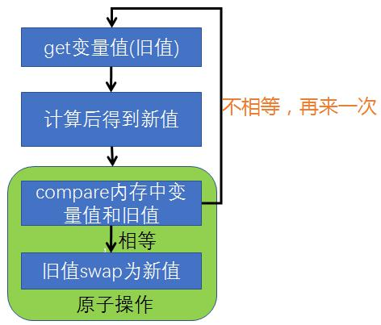

## 1. 原子操作

假定有两个操作 A 和 B，如果从执行 A 的线程来看，当另一个线程执行 B 时，要么将 B 全部执行完，要么完全不执行 B，那么 A 和 B 对彼此来说是原子的。

可以使用锁机制来实现原子操作，`synchronized` 关键字是基于阻塞的锁机制，也就是说当一个线程拥有锁的时候，访问同一资源的其它线程需要等待，直到该线程释放锁。

## 2. CAS（Compare And Swap）

### 2.1. 概念

CAS（Compare And Swap）指比较并交换。是现代 CPU 广泛支持的一种对内存中的共享数据进行操作的一种特殊指令。CAS 操作采用了乐观锁的思想，通过比较和交换保证共享变量赋值时的原子操作，这个原子操作直接由 CPU 保证。

CAS 算法包含 V,E,N 等 3 个参数：

- V 表示要更新的变量（内存中的值）
- E 表示预期的值（旧值）
- N 表示新值

仅在 V 值等于 E 值时，才会将 V 值设为 N；如果 V 值和 E 值不同，则说明已经有其他线程做了更新，当前线程什么都不做。最后 CAS 返回当前 V 的真实值。



### 2.2. CAS 与 volatile

在 CAS 获取共享变量时，为了保证该变量的可见性，需要使用 `volatile` 修饰。通常 CAS 结合 `volatile` 可以实现无锁并发，适用于线程数少、竞争不激烈、多核 CPU 的场景。

其实 CAS 的底层是 lock cmpxchg 指令（X86 架构），在单核 CPU 和多核 CPU 下都能够保证【比较-交换】的原子性。

在多核状态下，某个核执行到带 lock 的指令时，CPU 会让总线锁住，当这个核把此指令执行完毕，再开启总线。这个过程中不会被线程的调度机制所打断，保证了多个线程对内存操作的准确性，是原子的。

获取共享变量时，为了保证该变量的可见性，需要使用 volatile 修饰。它可以用来修饰成员变量和静态成员变量，避免线程从自己的工作缓存中查找变量的值，必须到主存中获取它的值，线程操作 volatile 变量都是直接操作主存。即一个线程对 volatile 变量的修改，对另一个线程可见。因此 CAS 必须借助 volatile 才能读取到共享变量的最新值来实现【比较并交换】的效果

> Notes: volatile 仅仅保证了共享变量的可见性，让其它线程能够看到最新值，但不能解决指令交错问题（不能保证原子性）

### 2.3. 无锁效率高的原因

无锁情况下，因为没有使用 `synchronized`，所以线程不会陷入阻塞，这是效率提升的因素之一。即使重试失败，线程始终在高速运行，没有停歇。而使用 synchronized 会让线程在没有获得锁的时候，发生上下文切换，进入阻塞，这个比无锁重试的花销更大。

值得注意的是，无锁需要额外 CPU 的支持。因为线程要保持运行，如果超出 CPU 核心数时，虽然线程不会进入阻塞，但由于竞争激烈，线程没有分到时间片，仍然会进入可运行状态，还是会导致上下文切换，反而效率会受影响。

## 3. CAS 实现原子操作存在的问题

### 3.1. ABA 问题

CAS 需要在操作值的时候，检查值有没有发生变化，如果没有发生变化则更新，但是如果一个值原来是 A，变成了 B，又变成了 A，那么使用 CAS 进行检查时不会感知到该值已发生变化，但是实际上却变化了。

**ABA 问题的解决思路就是使用版本号**。在变量前面追加上版本号，每次变量更新的时候把版本号加 1，那么 A -> B -> A 就会变成 1A -> 2B -> 3A。

### 3.2. 循环时间长开销大

自旋 CAS 如果长时间不成功，会给 CPU 带来非常大的执行开销。

### 3.3. 只能保证一个共享变量的原子操作

当对一个共享变量执行操作时，可以使用循环 CAS 的方式来保证原子操作，但是对多个共享变量操作时，循环 CAS 就无法保证操作的原子性，此时必须使用锁来保证。

但还有一种思路，就是把多个共享变量合并成一个共享变量来操作。比如，有两个共享变量 i＝2，j=a，合并一下 ij=2a，然后用 CAS 来操作 ij。从 Java 1.5 开始，JDK 提供了 `AtomicReference` 类来保证引用对象之间的原子性，就可以把多个变量放在一个对象里来进行 CAS 操作。

## 4. JDK 的原子操作类

### 4.1. 原子整数

在 J.U.C 并发包提供了整数类型数据的原子操作工具类，分别如下：

- `java.util.concurrent.atomic.AtomicBoolean`
- `java.util.concurrent.atomic.AtomicInteger`
- `java.util.concurrent.atomic.AtomicLong`

以 `AtomicInteger` 为例，相关 API 的使用如下：

```java
AtomicInteger i = new AtomicInteger(0);

// 获取并自增（i = 0, 结果 i = 1, 返回 0），类似于 i++
System.out.println(i.getAndIncrement());

// 自增并获取（i = 1, 结果 i = 2, 返回 2），类似于 ++i
System.out.println(i.incrementAndGet());

// 自减并获取（i = 2, 结果 i = 1, 返回 1），类似于 --i
System.out.println(i.decrementAndGet());

// 获取并自减（i = 1, 结果 i = 0, 返回 1），类似于 i--
System.out.println(i.getAndDecrement());

// 获取并加值（i = 0, 结果 i = 5, 返回 0）
System.out.println(i.getAndAdd(5));

// 加值并获取（i = 5, 结果 i = 0, 返回 0）
System.out.println(i.addAndGet(-5));

// 获取并更新（i = 0, p 为 i 的当前值, 结果 i = -2, 返回 0）
// 其中函数中的操作能保证原子，但函数需要无副作用
System.out.println(i.getAndUpdate(p -> p - 2));

// 更新并获取（i = -2, p 为 i 的当前值, 结果 i = 0, 返回 0）
// 其中函数中的操作能保证原子，但函数需要无副作用
System.out.println(i.updateAndGet(p -> p + 2));

// 获取并计算（i = 0, p 为 i 的当前值, x 为参数1, 结果 i = 10, 返回 0）
// 其中函数中的操作能保证原子，但函数需要无副作用
// getAndUpdate 如果在 lambda 中引用了外部的局部变量，要保证该局部变量是 final 的
// getAndAccumulate 可以通过 参数1 来引用外部的局部变量，但因为其不在 lambda 中因此不必是 final
System.out.println(i.getAndAccumulate(10, (p, x) -> p + x));

// 计算并获取（i = 10, p 为 i 的当前值, x 为参数1, 结果 i = 0, 返回 0）
// 其中函数中的操作能保证原子，但函数需要无副作用
System.out.println(i.accumulateAndGet(-10, (p, x) -> p + x));
```

#### 4.1.1. 通过 CAS 实现锁

> Tips: 注意不要用于实际开发生产！

定义使用原子操作工具类 `AtomicInteger` 的 CAS 来实现锁

```java
public class LockCas {
    private AtomicInteger state = new AtomicInteger(0);

    public void lock() {
        while (true) {
            if (state.compareAndSet(0, 1)) {
                break;
            }
        }
    }

    public void unlock() {
        log.debug("unlock...");
        state.set(0);
    }
}
```

测试：

```java
@Test
public void lockCasTest() throws InterruptedException {
    LockCas lock = new LockCas();
    new Thread(() -> {
        log.debug("begin...");
        lock.lock();
        try {
            log.debug("lock...");
            Thread.sleep(1000);
        } catch (InterruptedException e) {
            e.printStackTrace();
        } finally {
            lock.unlock();
        }
    }).start();
    new Thread(() -> {
        log.debug("begin...");
        lock.lock();
        try {
            log.debug("lock...");
        } finally {
            lock.unlock();
        }
    }).start();
    Thread.sleep(2500);
}
```

测试结果：

```java
2023-03-13 17:15:42.220 [Thread-2] DEBUG com.moon.java.common.test.BasicTest - begin...
2023-03-13 17:15:42.220 [Thread-1] DEBUG com.moon.java.common.test.BasicTest - begin...
2023-03-13 17:15:42.222 [Thread-2] DEBUG com.moon.java.common.test.BasicTest - lock...
2023-03-13 17:15:42.222 [Thread-2] DEBUG com.moon.java.common.test.BasicTest - unlock...
2023-03-13 17:15:42.222 [Thread-1] DEBUG com.moon.java.common.test.BasicTest - lock...
2023-03-13 17:15:43.236 [Thread-1] DEBUG com.moon.java.common.test.BasicTest - unlock...
```

### 4.2. 原子引用

在 J.U.C 并发包提供了引用类型数据的原子操作工具类，分别如下：

- `java.util.concurrent.atomic.AtomicReference`
- `java.util.concurrent.atomic.AtomicStampedReference`
- `java.util.concurrent.atomic.AtomicMarkableReference`

#### 4.2.1. AtomicReference

引用对象不安全的实现示例：

```java
BigDecimal balance;

@Test
public void decimalUnsafeTest() {
    balance = new BigDecimal(10000);
    List<Thread> ts = new ArrayList<>();
    for (int i = 0; i < 1000; i++) {
        ts.add(new Thread(() -> {
            balance = balance.subtract(BigDecimal.TEN);
        }));
    }
    ts.forEach(Thread::start);
    ts.forEach(t -> {
        try {
            t.join();
        } catch (InterruptedException e) {
            e.printStackTrace();
        }
    });
    System.out.println(balance.toString());
}
```

上面示例最终输出结果几乎都不会为0。可以使用 `AtomicReference` 通过 cas 来实现线程安全操作：

```java
AtomicReference<BigDecimal> balance;

@Test
public void atomicReferenceTest() {
    balance = new AtomicReference<>(new BigDecimal(10000));
    List<Thread> ts = new ArrayList<>();
    for (int i = 0; i < 1000; i++) {
        ts.add(new Thread(() -> {
            while (true) {
                BigDecimal prev = balance.get();
                BigDecimal next = prev.subtract(new BigDecimal(10));
                if (balance.compareAndSet(prev, next)) {
                    break;
                }
            }
        }));
    }
    ts.forEach(Thread::start);
    ts.forEach(t -> {
        try {
            t.join();
        } catch (InterruptedException e) {
            e.printStackTrace();
        }
    });
    System.out.println(balance.get());
}
```

#### 4.2.2. AtomicStampedReference

前面提过的 ABA 问题，如果希望感知到是否有其他线程对共享变量进行过「改动」，此时不能仅仅比较值，需要加一个版本号。

`AtomicStampedReference` 可以给原子引用加上版本号，追踪原子引用整个的变化过程，并且可以知道引用变量中途被更改的次数。如： A -> B -> A -> C

```java
static AtomicStampedReference<String> ref = new AtomicStampedReference<>("A", 0);

public static void main(String[] args) throws InterruptedException {
    log.debug("main start...");
    // 获取值 A
    String prev = ref.getReference();
    // 获取版本号
    int stamp = ref.getStamp();
    log.debug("版本 {}", stamp);
    // 如果中间有其它线程干扰，发生了 ABA 现象
    other();
    Thread.sleep(1000);
    // 尝试改为 C
    log.debug("change A->C {}", ref.compareAndSet(prev, "C", stamp, stamp + 1));
}

private static void other() throws InterruptedException {
    new Thread(() -> {
        log.debug("change A->B {}", ref.compareAndSet(ref.getReference(), "B", ref.getStamp(), ref.getStamp() + 1));
        log.debug("更新版本为 {}", ref.getStamp());
    }, "t1").start();
    Thread.sleep(500);
    new Thread(() -> {
        log.debug("change B->A {}", ref.compareAndSet(ref.getReference(), "A", ref.getStamp(), ref.getStamp() + 1));
        log.debug("更新版本为 {}", ref.getStamp());
    }, "t2").start();
}
```

输出结果：

```
2023-02-21 12:18:32.058 [main] DEBUG com.moon.java.common.test.BasicTest - main start...
2023-02-21 12:18:32.061 [main] DEBUG com.moon.java.common.test.BasicTest - 版本 0
2023-02-21 12:18:32.103 [t1] DEBUG com.moon.java.common.test.BasicTest - change A->B true
2023-02-21 12:18:32.103 [t1] DEBUG com.moon.java.common.test.BasicTest - 更新版本为 1
2023-02-21 12:18:32.603 [t2] DEBUG com.moon.java.common.test.BasicTest - change B->A true
2023-02-21 12:18:32.603 [t2] DEBUG com.moon.java.common.test.BasicTest - 更新版本为 2
2023-02-21 12:18:33.605 [main] DEBUG com.moon.java.common.test.BasicTest - change A->C false
```

#### 4.2.3. AtomicMarkableReference

`AtomicMarkableReference` 类原子操作<u>只关注共享引用变量是否被改动过，而不关心引用变量更忙的次数</u>。示例代码如下：

```java
@Test
public void aBAAtomicMarkableReferenceTest() throws InterruptedException {
    GarbageBag bag = new GarbageBag("装满了垃圾");
    // 参数2 mark 可以看作一个标记，表示垃圾袋满了
    AtomicMarkableReference<GarbageBag> ref = new AtomicMarkableReference<>(bag, true);

    log.debug("主线程 start...");
    GarbageBag prev = ref.getReference();
    log.debug(prev.toString());

    new Thread(() -> {
        log.debug("打扫卫生的线程 start...");
        bag.setDesc("空垃圾袋");
        while (!ref.compareAndSet(bag, bag, true, false)) {
        }
        log.debug(bag.toString());
    }).start();
    
    Thread.sleep(1000);
    log.debug("主线程想换一只新垃圾袋？");
    boolean success = ref.compareAndSet(prev, new GarbageBag("空垃圾袋"), true, false);
    log.debug("换了么？" + success);
    log.debug(ref.getReference().toString());
}

class GarbageBag {
    String desc;

    public GarbageBag(String desc) {
        this.desc = desc;
    }

    public void setDesc(String desc) {
        this.desc = desc;
    }

    @Override
    public String toString() {
        return super.toString() + " " + desc;
    }
}
```

输出结果：

```java
2023-02-21 12:31:47.791 [main] DEBUG com.moon.java.common.test.BasicTest - 主线程 start...
2023-02-21 12:31:47.793 [main] DEBUG com.moon.java.common.test.BasicTest - com.moon.java.common.test.BasicTest$GarbageBag@57fffcd7 装满了垃圾
2023-02-21 12:31:47.837 [Thread-1] DEBUG com.moon.java.common.test.BasicTest - 打扫卫生的线程 start...
2023-02-21 12:31:47.837 [Thread-1] DEBUG com.moon.java.common.test.BasicTest - com.moon.java.common.test.BasicTest$GarbageBag@57fffcd7 空垃圾袋
2023-02-21 12:31:48.840 [main] DEBUG com.moon.java.common.test.BasicTest - 主线程想换一只新垃圾袋？
2023-02-21 12:31:48.840 [main] DEBUG com.moon.java.common.test.BasicTest - 换了么？false
2023-02-21 12:31:48.840 [main] DEBUG com.moon.java.common.test.BasicTest - com.moon.java.common.test.BasicTest$GarbageBag@57fffcd7 空垃圾袋
```

### 4.3. 原子数组

在 J.U.C 并发包提供了数组类型的原子操作工具类，分别如下：

- `java.util.concurrent.atomic.AtomicIntegerArray`
- `java.util.concurrent.atomic.AtomicLongArray`
- `java.util.concurrent.atomic.AtomicReferenceArray`

数组不安全的操作示例：

```java
@Test
public void unsafeArrayTest() {
    List<Thread> ts = new ArrayList<>();
    int[] array = new int[10];
    int length = array.length;
    
    for (int i = 0; i < length; i++) {
        // 每个线程对数组作 10000 次操作
        ts.add(new Thread(() -> {
            for (int j = 0; j < 10000; j++) {
                array[j % length]++;
            }
        }));
    }
    
    ts.forEach(Thread::start); // 启动所有线程
    ts.forEach(t -> {
        try {
            t.join();
        } catch (InterruptedException e) {
            e.printStackTrace();
        }
    }); // 等所有线程结束
    System.out.println(Arrays.toString(array));
}
```

输出结果：

```java
[5129, 5055, 4994, 4979, 5068, 5125, 5164, 5133, 5167, 5174]
```

以 `AtomicIntegerArray` 原子数组操作类为例，进行数组的安全操作：

```java
@Test
public void AtomicIntegerArrayTest() {
    List<Thread> ts = new ArrayList<>();
    AtomicIntegerArray array = new AtomicIntegerArray(10);
    int length = array.length();

    for (int i = 0; i < length; i++) {
        // 每个线程对数组作 10000 次操作
        ts.add(new Thread(() -> {
            for (int j = 0; j < 10000; j++) {
                array.getAndIncrement(j % length);
            }
        }));
    }

    ts.forEach(Thread::start); // 启动所有线程
    ts.forEach(t -> {
        try {
            t.join();
        } catch (InterruptedException e) {
            e.printStackTrace();
        }
    }); // 等所有线程结束
    System.out.println(array);
}
```

输出结果正常：

```java
[10000, 10000, 10000, 10000, 10000, 10000, 10000, 10000, 10000, 10000]
```

### 4.4. 字段更新器

在 J.U.C 并发包提供了原子操作的字段更新器，分别如下：

- `java.util.concurrent.atomic.AtomicReferenceFieldUpdater`
- `java.util.concurrent.atomic.AtomicIntegerFieldUpdater`
- `java.util.concurrent.atomic.AtomicLongFieldUpdater`

利用字段更新器，可以针对对象的某个域（Field）进行原子操作，并必须配合 `volatile` 修饰的字段使用，否则会出现异常

```java
Exception in thread "main" java.lang.IllegalArgumentException: Must be volatile type
```

以 `AtomicIntegerFieldUpdater` 为例：

```java
public class BasicTest {

    private volatile int field;

    @Test
    public void atomicIntegerFieldUpdaterTest() {
        AtomicIntegerFieldUpdater<BasicTest> fieldUpdater =
                AtomicIntegerFieldUpdater.newUpdater(BasicTest.class, "field");

        BasicTest testDemo = new BasicTest();
        fieldUpdater.compareAndSet(testDemo, 0, 10);
        System.out.println(testDemo.field); // 修改成功 field = 10
        fieldUpdater.compareAndSet(testDemo, 10, 20); // 修改成功 field = 20
        System.out.println(testDemo.field);
        fieldUpdater.compareAndSet(testDemo, 10, 30); // 修改失败 field = 20
        System.out.println(testDemo.field);
    }
}
```

### 4.5. 原子累加器

在 J.U.C 并发包提供了专用于累加操作的原子累加器，其性能是高于使用原始原子整数操作类，分别如下：

- `java.util.concurrent.atomic.LongAdder`

#### 4.5.1. 累加器性能比较

比较 `AtomicLong` 与 `LongAdder` 示例：

```java
@Test
public void atomicLongTest() {
    // 测试 AtomicLong
    increment(AtomicLong::new, AtomicLong::incrementAndGet);
    // 测试 LongAdder
    increment(LongAdder::new, LongAdder::increment);
}

private <T> void increment(Supplier<T> supplier, Consumer<T> action) {
    // 获取测试的原子类
    T oprator = supplier.get();
    List<Thread> ts = new ArrayList<>();
    long start = System.nanoTime();

    // 40 个线程，每个累加 50 万
    for (int i = 0; i < 40; i++) {
        // 每个线程对数组作 10000 次操作
        ts.add(new Thread(() -> {
            for (int j = 0; j < 500000; j++) {
                action.accept(oprator); // 操作
            }
        }));
    }

    ts.forEach(Thread::start); // 启动所有线程
    ts.forEach(t -> {
        try {
            t.join();
        } catch (InterruptedException e) {
            e.printStackTrace();
        }
    }); // 等所有线程结束
    long end = System.nanoTime();
    System.out.println(oprator + " cost:" + (end - start) / 1000_000);
}
```

最终测试结果：

```
20000000 cost:394
20000000 cost:91
```

原子累加器性能提升的原因很简单，就是在有竞争时，<font color=red>**设置多个累加单元**</font>，Therad-0 累加 Cell[0]，而 Thread-1 累加 Cell[1] ... 最后将结果汇总。这样它们在累加时操作的不同的 Cell 变量，因此减少了 CAS 重试失败，从而提高性能。

## 5. Unsafe 类

通过刚才 `AtomicInteger` 的源码可以看到，`Unsafe` 类提供了原子操作。

### 5.1. 概述

```java
public final class Unsafe {}
```

`sun.misc.Unsafe` 类提供了非常底层的，操作内存、线程的方法。使 Java 拥有了像 C 语言的指针一样操作内存空间的能力，同时也带来了指针的问题。过度的使用 Unsafe 类会使得出错的几率变大，因此 Java 官方并<u>**不建议使用**</u>的，官方文档也几乎没有。<font color=red>**Unsafe 对象不能直接调用，只能通过反射获得**</font>。


### 5.2. Unsafe 的 CAS 操作

通过反射来获取 `Unsafe` 类对象

```java
import sun.misc.Unsafe;

import java.lang.reflect.Field;

public class UnsafeAccessor {
    static Unsafe unsafe;

    static {
        try {
            Field theUnsafe = Unsafe.class.getDeclaredField("theUnsafe");
            theUnsafe.setAccessible(true);
            unsafe = (Unsafe) theUnsafe.get(null);
        } catch (NoSuchFieldException | IllegalAccessException e) {
            throw new Error(e);
        }
    }

    static Unsafe getUnsafe() {
        return unsafe;
    }
}
```

创建示例的实体类

```java
@Data
class Student {
    volatile int id;
    volatile String name;
}
```

示例代码：

```java
public static void main(String[] args) throws NoSuchFieldException {
    Unsafe unsafe = UnsafeAccessor.getUnsafe();
    Field id = Student.class.getDeclaredField("id");
    Field name = Student.class.getDeclaredField("name");

    // 获得成员变量的偏移量
    long idOffset = UnsafeAccessor.unsafe.objectFieldOffset(id);
    long nameOffset = UnsafeAccessor.unsafe.objectFieldOffset(name);
    Student student = new Student();

    // 使用 cas 方法替换成员变量的值
    UnsafeAccessor.unsafe.compareAndSwapInt(student, idOffset, 0, 20); // 返回 true
    UnsafeAccessor.unsafe.compareAndSwapObject(student, nameOffset, null, "张三"); // 返回 true
    System.out.println(student); // 输出：Student{id=20, name='张三'}
}
```

### 5.3. Unsafe 实现 CAS 原理


