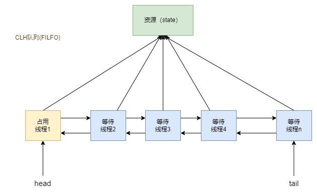

# 并发编程 - AbstractQueuedSynchronizer(AQS) 队列同步器

队列同步器 AbstractQueuedSynchronizer（简称同步器或 AQS），是用来构建锁或者其他同步组件的基础框架，它使用了一个 int 成员变量表示同步状态，通过内置的 FIFO 队列来完成资源获取线程的排队工作。并发包的大师（Doug Lea）期望它能够成为实现大部分同步需求的基础

## 1. AQS 原理

### 1.1. 概述

AQS核心思想是，如果被请求的共享资源空闲，则将当前请求资源的线程设置为有效的工作线程，并且将共享资源设置为锁定状态。如果被请求的共享资源被占用，那么就需要一套线程阻塞等待以及被唤醒时锁分配的机制，这个机制 AQS 是用 CLH 队列锁实现的，即将暂时获取不到锁的线程加入到队列中。

> CLH(Craig,Landin,and Hagersten)队列是一个虚拟的双向队列（虚拟的双向队列即不存在队列实例，仅存在结点之间的关联关系）。AQS是将每条请求共享资源的线程封装成一个CLH锁队列的一个结点（Node）来实现锁的分配。

### 1.2. AQS 原理图



AQS 使用一个 int 成员变量来表示同步状态，通过内置的 FIFO 队列来完成获取资源线程的排队工作。AQS 使用 CAS 对该同步状态进行原子操作实现对其值的修改

```java
private volatile int state; // 共享变量，使用 volatile 修饰保证线程可见性
```

```java
/**
 * 返回同步状态的当前值
 */
protected final int getState() {
    return state;
}

/**
 * 设置同步状态的值
 */
protected final void setState(int newState) {
    state = newState;
}

/**
 * 原子地（CAS操作）将同步状态值设置为给定值 update 如果当前同步状态的值等于 expect（期望值）
 */
protected final boolean compareAndSetState(int expect, int update) {
    // See below for intrinsics setup to support this
    return unsafe.compareAndSwapInt(this, stateOffset, expect, update);
}
```
