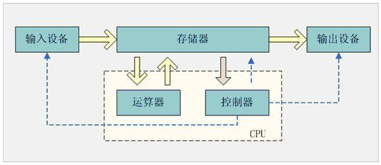
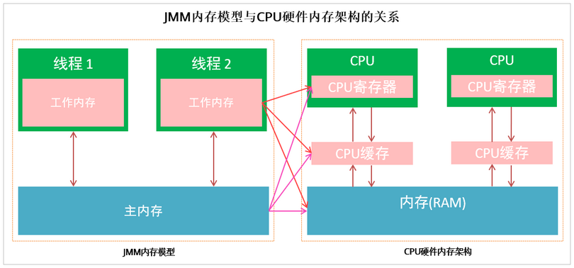

# 并发编程 - JMM(Java 内存模型)

## 1. 计算机结构（前置知识简述）

冯诺依曼，提出计算机由五大组成部分，输入设备，输出设备存储器，控制器，运算器。

- **CPU**：中央处理器，是计算机的控制和运算的核心，程序最终都会变成指令让CPU去执行，处理程序中的数据。
- **内存**：程序都是在内存中运行的，内存会保存程序运行时的数据，供CPU处理。
- **缓存**：CPU的运算速度和内存的访问速度相差比较大。这就导致CPU每次操作内存都要耗费很多等待时间。内存的读写速度成为了计算机运行的瓶颈。于是就有了在CPU和主内存之间增加缓存的设计。最靠近CPU的缓存称为L1，然后依次是 L2，L3和主内存，CPU缓存模型如图下图所示。

CPU Cache分成了三个级别: L1， L2， L3。级别越小越接近 CPU，速度也更快，同时也代表着容量越小。

1. L1 是最接近 CPU 的，它容量最小，例如 32K，速度最快，每个核上都有一个 L1 Cache。
2. L2 Cache 更大一些，例如 256K，速度要慢一些，一般情况下每个核上都有一个独立的 L2 Cache。
3. L3 Cache 是三级缓存中最大的一级，例如 12MB，同时也是缓存中最慢的一级，在同一个 CPU 插槽之间的核共享一个 L3 Cache。

Cache 的出现是为了解决 CPU 直接访问内存效率低下问题的，程序在运行的过程中，CPU 接收到指令后，它会最先向 CPU 中的一级缓存（L1 Cache）去寻找相关的数据，如果命中缓存，CPU 进行计算时就可以直接对 CPU Cache 中的数据进行读取和写人，当运算结束之后，再将 CPU Cache 中的最新数据刷新到主内存当中，CPU 通过直接访问 Cache 的方式替代直接访问主存的方式极大地提高了 CPU 的吞吐能力。但是由于一级缓存（L1 Cache）容量较小，所以不可能每次都命中。这时 CPU 会继续向下一级的二级缓存（L2 Cache）寻找，同样的道理，当所需要的数据在二级缓存中也没有的话，会继续转向 L3 Cache、内存(主存)和硬盘。

## 2. Java 内存模型

### 2.1. 概念

Java Memory Molde (Java内存模型)，简称：JMM。是 Java 虚拟机规范中所定义的一种内存模型，Java 内存模型是一套标准化的规范，描述了 Java 程序中各种变量(线程共享变量)的访问规则，以及在 JVM 中将变量存储到内存和从内存中读取变量这样的底层细节，具体如下：

- **主内存**：是所有线程都共享的，都能访问的。所有的共享变量都存储于主内存。
- **工作内存**：每一个线程有自己的工作内存，工作内存只存储该线程对共享变量的副本。线程对变量的所有的操作(读，取)都必须在工作内存中完成，而不能直接读写主内存中的变量，不同线程之间也不能直接访问对方工作内存中的变量。

> Notes: 
>
> - JMM 定义的主存、工作内存抽象概念，底层对应着 CPU 寄存器、缓存、硬件内存、CPU 指令优化等，屏蔽掉了底层不同计算机的区别。
> - 不要将 JMM 与 Java 内存结构混淆！关于“Java内存模型”的权威解释参考官网 https://download.oracle.com/otn-pub/jcp/memory_model-1.0-pfd-spec-oth-JSpec/memory_model-1_0-pfd-spec.pdf

### 2.2. 作用

Java 内存模型的作用是，在多线程读写共享数据时，对共享数据的可见性、有序性、和原子性的规则和保障。如：`synchronized`，`volatile` 等应用。还有如下几个方面体现：

- 原子性：保证指令不会受到线程上下文切换的影响
- 可见性：保证指令不会受 cpu 缓存的影响
- 有序性：保证指令不会受 cpu 指令并行优化的影响

### 2.3. CPU 缓存，内存与 Java 内存模型的关系

JMM 内存模型与 CPU 硬件内存架构的关系：

多线程的执行最终都会映射到硬件处理器上进行执行。但 Java 内存模型和硬件内存架构并不完全一致。对于硬件内存来说只有寄存器、缓存内存、主内存的概念，并没有工作内存和主内存之分，也就是说 Java 内存模型对内存的划分对硬件内存并没有任何影响，因为 JMM 只是一种抽象的概念，是一组规则，不管是工作内存的数据还是主内存的数据，对于计算机硬件来说都会存储在计算机主内存中，当然也有可能存储到 CPU 缓存或者寄存器中，因此总体上来说，Java 内存模型和计算机硬件内存架构是一个相互交叉的关系，是一种抽象概念划分与真实物理硬件的交叉。

### 2.4. 主内存与工作内存之间的交互

Java 内存模型中定义了以下8种操作来完成，主内存与工作内存之间具体的交互协议，即一个变量如何从主内存拷贝到工作内存、如何从工作内存同步回主内存之类的实现细节，虚拟机实现时必须保证下面提及的每一种操作都是原子的、不可再分的。对应如下的流程图：

主内存与工作内存之间的数据交互过程是：`lock -> read -> load -> use -> assign -> store -> write -> unlock`

> Notes: 
>
> 1. 如果对一个变量执行lock操作，将会清空工作内存中此变量的值
> 2. 对一个变量执行unlock操作之前，必须先把此变量同步到主内存中
