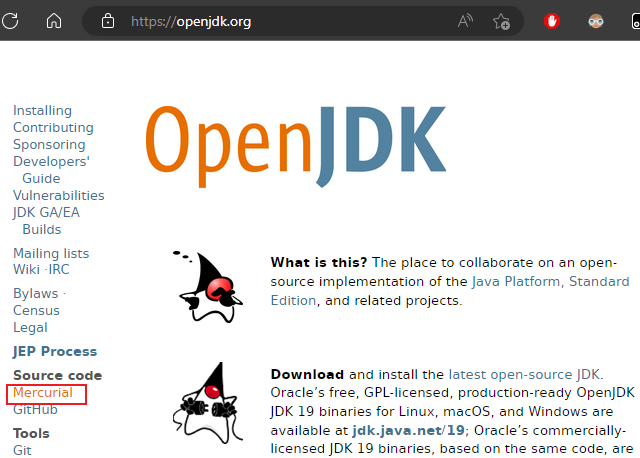
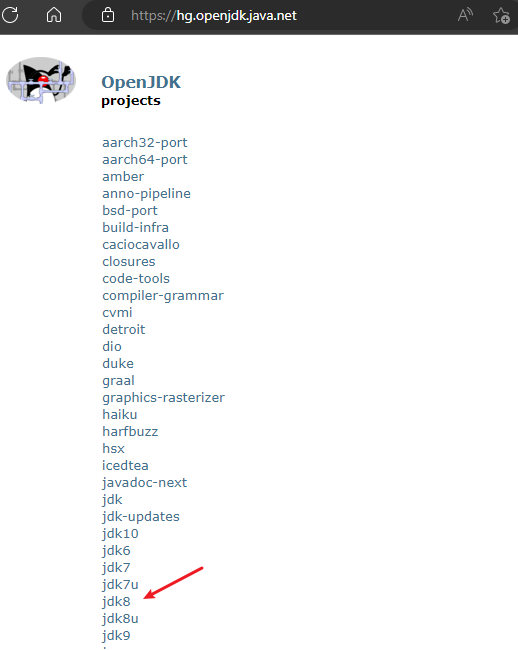
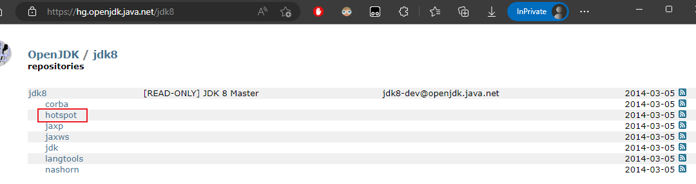
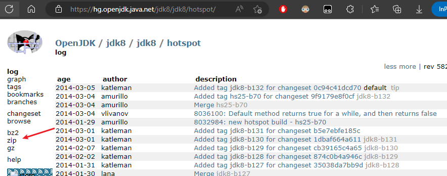
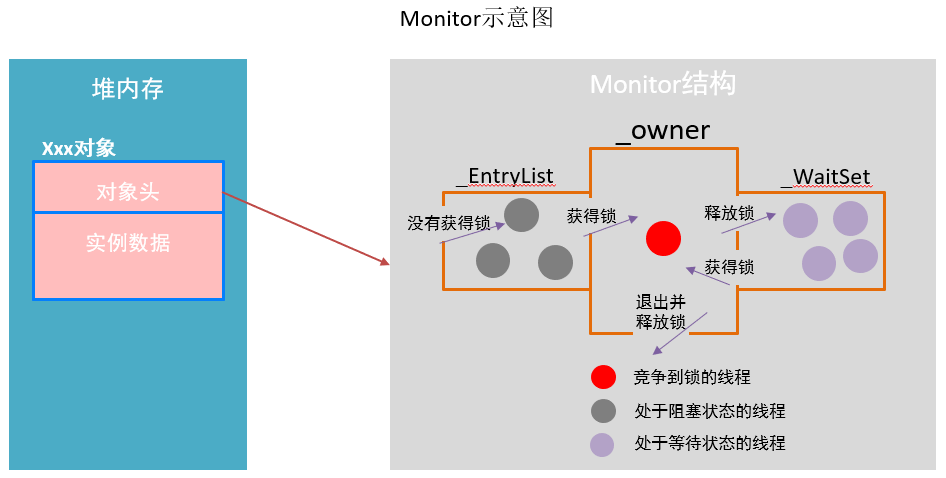

# JVM - 源码分析

## 1. JVM 源码下载

下载地址：http://openjdk.java.net/

点击 Mercurial



选择需要下载的版本



选择 hotspot



下载相应类型的压缩包



> Tips: 下载 C 语言的IDE(Clion)，地址 https://www.jetbrains.com/

## 2. synchronized 的源码分析

### 2.1. monitor 监视器锁

无论是 synchronized 代码块还是 synchronized 方法，其线程安全的语义实现最终依赖一个 monitor。在 HotSpot 虚拟机中，monitor 是由 ObjectMonitor 实现的。其源码是用 c++ 来实现的，位于 HotSpot 虚拟机源码 ObjectMonitor.hpp 文件中(src/share/vm/runtime/objectMonitor.hpp)。ObjectMonitor 主要数据结构如下：

```cpp
ObjectMonitor() {
    _header = NULL;
    _count = 0;
    _waiters = 0，
    _recursions = 0; // 线程的重入次数
    _object = NULL; // 存储该monitor的对象
    _owner = NULL; // 标识拥有该monitor的线程
    _WaitSet = NULL; // 处于wait状态的线程，会被加入到_WaitSet
    _WaitSetLock = 0 ;
    _Responsible = NULL;
    _succ = NULL;
    _cxq = NULL; // 多线程竞争锁时的单向列表
    FreeNext = NULL;
    _EntryList = NULL; // 处于等待锁block状态的线程，会被加入到该列表
    _SpinFreq = 0;
    _SpinClock = 0;
    OwnerIsThread = 0;
}
```

变量解释：

- `_owner`：初始时为 NULL。当有线程占有该 monitor 时，owner 标记为该线程的唯一标识。当线程释放 monitor 时，owner 又恢复为 NULL。owner 是一个临界资源，JVM 是通过 CAS 操作来保证其线程安全的。
- `_cxq`：竞争队列，所有请求锁的线程首先会被放在这个队列中（单向链接）。_cxq是一个临界资源，JVM通过CAS原子指令来修改_cxq队列。修改前_cxq的旧值填入了node的next字段，_cxq指向新值（新线程）。因此_cxq是一个后进先出的stack（栈）。
- `_EntryList`：_cxq队列中有资格成为候选资源的线程会被移动到该队列中。
- `_WaitSet`：因为调用wait方法而被阻塞的线程会被放在该队列中。

每一个 Java 对象都可以与一个监视器 monitor 关联，可以把它理解成为一把锁，当一个线程想要执行一段被 `synchronized` 包裹的同步方法或者代码块时，该线程得先获取到 `synchronized` 修饰的对象对应的 monitor。

在 Java 代码里不会显示地去创造一个 monitor 对象，也无需手动创建，事实上可以这么理解：monitor 并不是随着对象创建而创建的。而是通过 `synchronized` 修饰符告诉 JVM 需要为某个对象创建关联的 monitor 对象。每个线程都存在两个 ObjectMonitor 对象列表，分别为 free 和 used 列表。同时 JVM 中也维护着 global locklist。当线程需要 ObjectMonitor 对象时，首先从线程自身的 free 表中申请，若存在则使用，若不存在则从 global list 中申请。

ObjectMonitor 的数据结构中包含：`_owner`、`_WaitSet`和`_EntryList`，它们之间的关系转换可以用下图表示：



### 2.2. monitor 竞争


