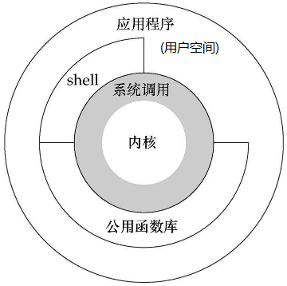

# JVM - 源码分析

## 1. JVM 源码下载

下载地址：http://openjdk.java.net/

点击 Mercurial


选择需要下载的版本


选择 hotspot


下载相应类型的压缩包


> Tips: 下载 C 语言的IDE(Clion)，地址 https://www.jetbrains.com/

## 2. synchronized 的源码分析

### 2.1. monitor 监视器锁

无论是 synchronized 代码块还是 synchronized 方法，其线程安全的语义实现最终依赖一个 monitor。在 HotSpot 虚拟机中，monitor 是由 ObjectMonitor 实现的。其源码是用 c++ 来实现的，位于 HotSpot 虚拟机源码 ObjectMonitor.hpp 文件中(src/share/vm/runtime/objectMonitor.hpp)。ObjectMonitor 主要数据结构如下：

```cpp
ObjectMonitor() {
    _header = NULL;
    _count = 0;
    _waiters = 0，
    _recursions = 0; // 线程的重入次数
    _object = NULL; // 存储该monitor的对象
    _owner = NULL; // 标识拥有该monitor的线程
    _WaitSet = NULL; // 处于wait状态的线程，会被加入到_WaitSet
    _WaitSetLock = 0 ;
    _Responsible = NULL;
    _succ = NULL;
    _cxq = NULL; // 多线程竞争锁时的单向列表
    FreeNext = NULL;
    _EntryList = NULL; // 处于等待锁block状态的线程，会被加入到该列表
    _SpinFreq = 0;
    _SpinClock = 0;
    OwnerIsThread = 0;
}
```

变量解释：

- `_owner`：初始时为 NULL。当有线程占有该 monitor 时，owner 标记为该线程的唯一标识。当线程释放 monitor 时，owner 又恢复为 NULL。owner 是一个临界资源，JVM 是通过 CAS 操作来保证其线程安全的。
- `_cxq`：竞争队列，所有请求锁的线程首先会被放在这个队列中（单向链接）。_cxq是一个临界资源，JVM通过CAS原子指令来修改_cxq队列。修改前_cxq的旧值填入了node的next字段，_cxq指向新值（新线程）。因此_cxq是一个后进先出的stack（栈）。
- `_EntryList`：_cxq队列中有资格成为候选资源的线程会被移动到该队列中。
- `_WaitSet`：因为调用wait方法而被阻塞的线程会被放在该队列中。

每一个 Java 对象都可以与一个监视器 monitor 关联，可以把它理解成为一把锁，当一个线程想要执行一段被 `synchronized` 包裹的同步方法或者代码块时，该线程得先获取到 `synchronized` 修饰的对象对应的 monitor。

在 Java 代码里不会显示地去创造一个 monitor 对象，也无需手动创建，事实上可以这么理解：monitor 并不是随着对象创建而创建的。而是通过 `synchronized` 修饰符告诉 JVM 需要为某个对象创建关联的 monitor 对象。每个线程都存在两个 ObjectMonitor 对象列表，分别为 free 和 used 列表。同时 JVM 中也维护着 global locklist。当线程需要 ObjectMonitor 对象时，首先从线程自身的 free 表中申请，若存在则使用，若不存在则从 global list 中申请。

ObjectMonitor 的数据结构中包含：`_owner`、`_WaitSet`和`_EntryList`，它们之间的关系转换可以用下图表示：


### 2.2. monitor 竞争

1. 执行 monitorenter 时，会调用 InterpreterRuntime.cpp (位于：src/share/vm/interpreter/interpreterRuntime.cpp) 的 `InterpreterRuntime::monitorenter` 函数。具体代码可参见 HotSpot 源码。

```cpp  
RT_ENTRY_NO_ASYNC(void, InterpreterRuntime::monitorenter(JavaThread* thread, BasicObjectLock* elem))
    #ifdef ASSERT
    thread->last_frame().interpreter_frame_verify_monitor(elem);
    #endif
    if (PrintBiasedLockingStatistics) {
        Atomic::inc(BiasedLocking::slow_path_entry_count_addr());
    }
    Handle h_obj(thread, elem->obj());
    assert(Universe::heap()->is_in_reserved_or_null(h_obj()), "must be NULL or an object");
    if (UseBiasedLocking) {
        // Retry fast entry if bias is revoked to avoid unnecessary inflation
        ObjectSynchronizer::fast_enter(h_obj, elem->lock(), true, CHECK);
    } else {
        ObjectSynchronizer::slow_enter(h_obj, elem->lock(), CHECK);
    }
    assert(Universe::heap()->is_in_reserved_or_null(elem->obj()), "must be NULL or an object");
```

2. 对于重量级锁，monitorenter 函数中会调用` ObjectSynchronizer::slow_enter`
3. 最终调用 `ObjectMonitor::enter`（位于：src/share/vm/runtime/objectMonitor.cpp），源码如下：

```cpp
void ATTR ObjectMonitor::enter(TRAPS) {
    // The following code is ordered to check the most common cases first
    // and to reduce RTS->RTO cache line upgrades on SPARC and IA32 processors.
    Thread * const Self = THREAD ;
    void * cur ;

    // 通过CAS操作尝试把monitor的_owner字段设置为当前线程
    cur = Atomic::cmpxchg_ptr (Self, &_owner, NULL) ;
    if (cur == NULL) {
        // Either ASSERT _recursions == 0 or explicitly set _recursions = 0.
        assert (_recursions == 0 , "invariant") ;
        assert (_owner == Self, "invariant") ;
        // CONSIDER: set or assert OwnerIsThread == 1
        return ;
    }

    // 线程重入，recursions++
    if (cur == Self) {
        // TODO-FIXME: check for integer overflow! BUGID 6557169.
        _recursions ++ ;
        return ;
    }

    // 如果当前线程是第一次进入该monitor，设置_recursions为1，_owner为当前线程
    if (Self->is_lock_owned ((address)cur)) {
        assert (_recursions == 0, "internal state error");
        _recursions = 1 ;
        // Commute owner from a thread-specific on-stack BasicLockObject address to
        // a full-fledged "Thread *".
        _owner = Self ;
        OwnerIsThread = 1 ;
        return ;
    }

    // 省略一些代码
    for (;;) {
        jt->set_suspend_equivalent();
        // cleared by handle_special_suspend_equivalent_condition()
        // or java_suspend_self()
        // 如果获取锁失败，则等待锁的释放；
        EnterI (THREAD) ;

        if (!ExitSuspendEquivalent(jt)) break ;
        //
        // We have acquired the contended monitor， but while we were
        // waiting another thread suspended us. We don't want to enter
        // the monitor while suspended because that would surprise the
        // thread that suspended us.
        //
        _recursions = 0 ;
        _succ = NULL ;
        exit (false, Self) ;
        jt->java_suspend_self();
    }
    Self->set_current_pending_monitor(NULL);
}
```

> 以上省略锁的自旋优化等操作

以上代码的具体流程概括如下：

1. 通过 CAS 尝试把 monitor 的 owner 字段设置为当前线程。
2. 如果设置之前的 owner 指向当前线程，说明当前线程再次进入 monitor，即重入锁，执行 `recursions++`，记录重入的次数。
3. 如果当前线程是第一次进入该 monitor，设置 recursions 为1，`_owner` 为当前线程，该线程成功获得锁并返回。
4. 如果获取锁失败，则等待锁的释放。

### 2.3. monitor 等待

竞争失败等待调用的是 ObjectMonitor 对象的 EnterI 方法（位于：src/share/vm/runtime/objectMonitor.cpp），源码如下所示：

```cpp
void ATTR ObjectMonitor::EnterI (TRAPS) {
    Thread * Self = THREAD ;
    // Try the lock - TATAS
    if (TryLock (Self) > 0) {
        assert (_succ != Self , "invariant") ;
        assert (_owner == Self , "invariant") ;
        assert (_Responsible != Self , "invariant") ;
        return ;
    }
    if (TrySpin (Self) > 0) {
        assert (_owner == Self , "invariant") ;
        assert (_succ != Self , "invariant") ;
        assert (_Responsible != Self , "invariant") ;
        return ;
    }
    // 省略部分代码

    // 当前线程被封装成ObjectWaiter对象node，状态设置成ObjectWaiter::TS_CXQ；
    ObjectWaiter node(Self) ;
    Self->_ParkEvent->reset() ;
    node._prev = (ObjectWaiter *) 0xBAD ;
    node.TState = ObjectWaiter::TS_CXQ ;

    // 通过CAS把node节点push到_cxq列表中
    ObjectWaiter * nxt ;
    for (;;) {
        node._next = nxt = _cxq ;
        if (Atomic::cmpxchg_ptr (&node, &_cxq, nxt) == nxt) break ;
    
        // Interference - the CAS failed because _cxq changed. Just retry.
        // As an optional optimization we retry the lock.
        if (TryLock (Self) > 0) {
            assert (_succ != Self , "invariant") ;
            assert (_owner == Self , "invariant") ;
            assert (_Responsible != Self , "invariant") ;
            return ;
        }
    }

    // 省略部分代码
    for (;;) {
        // 线程在被挂起前做一下挣扎，看能不能获取到锁
        if (TryLock (Self) > 0) break ;
        assert (_owner != Self, "invariant") ;
    
        if ((SyncFlags & 2) && _Responsible == NULL) {
            Atomic::cmpxchg_ptr (Self, &_Responsible, NULL) ;
        }

        // park self
        if (_Responsible == Self || (SyncFlags & 1)) {
            TEVENT (Inflated enter - park TIMED) ;
            Self->_ParkEvent->park ((jlong) RecheckInterval) ;
            // Increase the RecheckInterval, but clamp the value.
            RecheckInterval *= 8 ;
            if (RecheckInterval > 1000) RecheckInterval = 1000 ;
        } else {
        TEVENT (Inflated enter - park UNTIMED) ;
            // 通过park将当前线程挂起，等待被唤醒
            Self->_ParkEvent->park() ;
        }

        if (TryLock(Self) > 0) break ;
        // 省略部分代码
    }
    // 省略部分代码
}
```

当该线程被唤醒时，会从挂起的点继续执行，通过 `ObjectMonitor::TryLock` 尝试获取锁，`TryLock` 方法实现如下：

```cpp
int ObjectMonitor::TryLock (Thread * Self) {
    for (;;) {
        void * own = _owner ;
        if (own != NULL) return 0 ;
        if (Atomic::cmpxchg_ptr (Self, &_owner, NULL) == NULL) {
            // Either guarantee _recursions == 0 or set _recursions = 0.
            assert (_recursions == 0, "invariant") ;
            assert (_owner == Self, "invariant") ;
            // CONSIDER: set or assert that OwnerIsThread == 1
            return 1 ;
        }
        // The lock had been free momentarily, but we lost the race to the lock.
        // Interference -- the CAS failed.
        // We can either return -1 or retry.
        // Retry doesn't make as much sense because the lock was just acquired.
        if (true) return -1 ;
    }
}
```

以上代码的具体流程概括如下：

1. 当前线程被封装成 ObjectWaiter 对象 node，状态设置成 `ObjectWaiter::TS_CXQ`。
2. 在 for 循环中，通过 CAS 把 node 节点 push 到 `_cxq` 列表中，同一时刻可能有多个线程把自己的 node 节点 push 到 `_cxq` 列表中。
3. node 节点 push 到 `_cxq` 列表之后，通过自旋尝试获取锁，如果还是没有获取到锁，则通过 park 将当前线程挂起，等待被唤醒。
4. 当该线程被唤醒时，会从挂起的点继续执行，通过 `ObjectMonitor::TryLock` 尝试获取锁。

### 2.4. monitor 释放

当某个持有锁的线程执行完同步代码块时，会进行锁的释放，给其它线程机会执行同步代码，在 HotSpot 中，通过退出 monitor 的方式实现锁的释放，并通知被阻塞的线程，具体实现位于 `ObjectMonitor` 的 `exit` 方法中。（位于：src/share/vm/runtime/objectMonitor.cpp），源码如下所示：

```cpp
void ATTR ObjectMonitor::exit(bool not_suspended， TRAPS) {
    Thread * Self = THREAD ;
    // 省略部分代码
    if (_recursions != 0) {
    _recursions--; // this is simple recursive enter
        TEVENT (Inflated exit - recursive) ;
        return ;
    }

    // 省略部分代码
    ObjectWaiter * w = NULL ;
    int QMode = Knob_QMode ;

    // qmode = 2：直接绕过EntryList队列，从cxq队列中获取线程用于竞争锁
    if (QMode == 2 && _cxq != NULL) {
        w = _cxq ;
        assert (w != NULL, "invariant") ;
        assert (w->TState == ObjectWaiter::TS_CXQ, "Invariant") ;
        ExitEpilog (Self, w) ;
        return ;
    }

    // qmode =3：cxq队列插入EntryList尾部；
    if (QMode == 3 && _cxq != NULL) {
        w = _cxq ;
        for (;;) {
            assert (w != NULL, "Invariant") ;
            ObjectWaiter * u = (ObjectWaiter *) Atomic::cmpxchg_ptr (NULL, &_cxq, w) ;
            if (u == w) break ;
            w = u ;
        }
        assert (w != NULL , "invariant") ;
    
        ObjectWaiter * q = NULL ;
        ObjectWaiter * p ;
        for (p = w ; p != NULL ; p = p->_next) {
            guarantee (p->TState == ObjectWaiter::TS_CXQ, "Invariant") ;
            p->TState = ObjectWaiter::TS_ENTER ;
            p->_prev = q ;
            q = p ;
        }

        ObjectWaiter * Tail ;
        for (Tail = _EntryList ; Tail != NULL && Tail->_next != NULL ; Tail = Tail->_next) ;
        if (Tail == NULL) {
            _EntryList = w ;
        } else {
            Tail->_next = w ;
            w->_prev = Tail ;
        }
    }

    // qmode =4：cxq队列插入到_EntryList头部
    if (QMode == 4 && _cxq != NULL) {
        w = _cxq ;
        for (;;) {
            assert (w != NULL, "Invariant") ;
            ObjectWaiter * u = (ObjectWaiter *) Atomic::cmpxchg_ptr (NULL, &_cxq, w) ;
            if (u == w) break ;
            w = u ;
        }
        assert (w != NULL , "invariant") ;

        ObjectWaiter * q = NULL ;
        ObjectWaiter * p ;
        for (p = w ; p != NULL ; p = p->_next) {
            guarantee (p->TState == ObjectWaiter::TS_CXQ, "Invariant") ;
            p->TState = ObjectWaiter::TS_ENTER ;
            p->_prev = q ;
            q = p ;
        }
    
        if (_EntryList != NULL) {
            q->_next = _EntryList ;
            _EntryList->_prev = q ;
        }
        _EntryList = w ;
    }

    w = _EntryList ;
    if (w != NULL) {
        assert (w->TState == ObjectWaiter::TS_ENTER, "invariant") ;
        ExitEpilog (Self, w) ;
        return ;
    }
    w = _cxq ;
    if (w == NULL) continue ;

    for (;;) {
        assert (w != NULL, "Invariant") ;
        ObjectWaiter * u = (ObjectWaiter *) Atomic::cmpxchg_ptr (NULL, &_cxq, w) ;
        if (u == w) break ;
        w = u ;
    }
    TEVENT (Inflated exit - drain cxq into EntryList) ;

    assert (w != NULL , "invariant") ;
    assert (_EntryList == NULL , "invariant") ;

    if (QMode == 1) {
        // QMode == 1 : drain cxq to EntryList, reversing order
        // We also reverse the order of the list.
        ObjectWaiter * s = NULL ;
        ObjectWaiter * t = w ;
        ObjectWaiter * u = NULL ;

        while (t != NULL) {
            guarantee (t->TState == ObjectWaiter::TS_CXQ, "invariant") ;
            t->TState = ObjectWaiter::TS_ENTER ;
            u = t->_next ;
            t->_prev = u ;
            t->_next = s ;
            s = t;
            t = u ;
        }
        _EntryList = s ;
        assert (s != NULL, "invariant") ;
    } else {
        // QMode == 0 or QMode == 2
        _EntryList = w ;
        ObjectWaiter * q = NULL ;
        ObjectWaiter * p ;
        for (p = w ; p != NULL ; p = p->_next) {
            guarantee (p->TState == ObjectWaiter::TS_CXQ, "Invariant") ;
            p->TState = ObjectWaiter::TS_ENTER ;
            p->_prev = q ;
            q = p ;
        }
    }

    if (_succ != NULL) continue;

    w = _EntryList ;
    if (w != NULL) {
        guarantee (w->TState == ObjectWaiter::TS_ENTER, "invariant") ;
        ExitEpilog (Self, w) ;
        return ;
    }
    }
}
```

1. 退出同步代码块时会让 `_recursions` 减 1，当 `_recursions` 的值减为 0 时，说明线程释放了锁。
2. 根据不同的策略（由QMode指定），从 cxq 或 EntryList 中获取头节点，通过 `ObjectMonitor::ExitEpilog` 方法唤醒该节点封装的线程，唤醒操作最终由 unpark 完成，实现如下：

```cpp
void ObjectMonitor::ExitEpilog (Thread * Self, ObjectWaiter * Wakee) {
    assert (_owner == Self, "invariant") ;

    _succ = Knob_SuccEnabled ? Wakee->_thread : NULL ;
    ParkEvent * Trigger = Wakee->_event ;

    Wakee = NULL ;

    // Drop the lock
    OrderAccess::release_store_ptr (&_owner, NULL) ;
    OrderAccess::fence() ; // ST _owner vs LD in unpark()

    if (SafepointSynchronize::do_call_back()) {
        TEVENT (unpark before SAFEPOINT) ;
    }

    DTRACE_MONITOR_PROBE(contended__exit, this, object(), Self);
    Trigger->unpark() ; // 唤醒之前被pack()挂起的线程.

    // Maintain stats and report events to JVMTI
    if (ObjectMonitor::_sync_Parks != NULL) {
        ObjectMonitor::_sync_Parks->inc() ;
    }
}
```

被唤醒的线程，会回到 `void ATTR ObjectMonitor::EnterI (TRAPS)` 的第600行，继续执行 monitor 的竞争。

```cpp
// park self
if (_Responsible == Self || (SyncFlags & 1)) {
    TEVENT (Inflated enter - park TIMED) ;
    Self->_ParkEvent->park ((jlong) RecheckInterval) ;
    // Increase the RecheckInterval, but clamp the value.
    RecheckInterval *= 8 ;
    if (RecheckInterval > 1000) RecheckInterval = 1000 ;
} else {
    TEVENT (Inflated enter - park UNTIMED) ;
    Self->_ParkEvent->park() ;
}

if (TryLock(Self) > 0) break ;
```

### 2.5. monitor 是重量级锁

可以看到 ObjectMonitor 的函数调用中会涉及到 `Atomic::cmpxchg_ptr`，`Atomic::inc_ptr` 等内核函数，执行同步代码块，没有竞争到锁的对象会 `park()` 被挂起，竞争到锁的线程会 `unpark()` 唤醒。这个时候就会存在操作系统用户态和内核态的转换，这种切换会消耗大量的系统资源。所以 `synchronized` 是 Java 语言中是一个重量级(Heavyweight)的操作。

了解用户态和内核态前，需要先了解一下Linux系统的体系架构：



从上图可以看出，Linux 操作系统的体系架构分为：用户空间（应用程序的活动空间）和内核。

- 内核：本质上可以理解为一种软件，控制计算机的硬件资源，并提供上层应用程序运行的环境。
- 用户空间：上层应用程序活动的空间。应用程序的执行必须依托于内核提供的资源，包括 CPU 资源、存储资源、I/O 资源等。
- 系统调用：为了使上层应用能够访问到这些资源，内核必须为上层应用提供访问的接口：即系统调用。

所有进程初始都运行于用户空间，此时即为用户运行状态（简称：用户态）；但是当它调用系统调用执行某些操作时，例如 I/O 调用，此时需要陷入内核中运行，就称进程处于内核运行态（或简称为内核态）。系统调用的过程可以简单理解为：

1. 用户态程序将一些数据值放在寄存器中，或者使用参数创建一个堆栈，以此表明需要操作系统提供的服务。
2. 用户态程序执行系统调用。
3. CPU 切换到内核态，并跳到位于内存指定位置的指令。
4. 系统调用处理器(system call handler)会读取程序放入内存的数据参数，并执行程序请求的服务。
5. 系统调用完成后，操作系统会重置 CPU 为用户态并返回系统调用的结果。

由此可见用户态切换至内核态需要传递许多变量，同时内核还需要保护好用户态在切换时的一些寄存器值、变量等，以备内核态切换回用户态。这种切换就带来了大量的系统资源消耗，这就是在 `synchronized` 未优化之前，效率低的原因。
