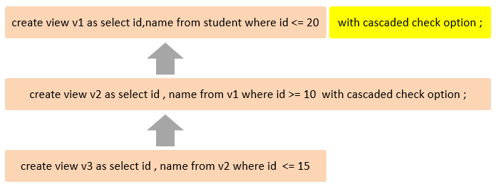
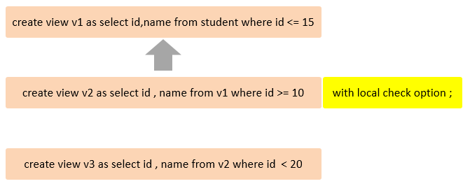
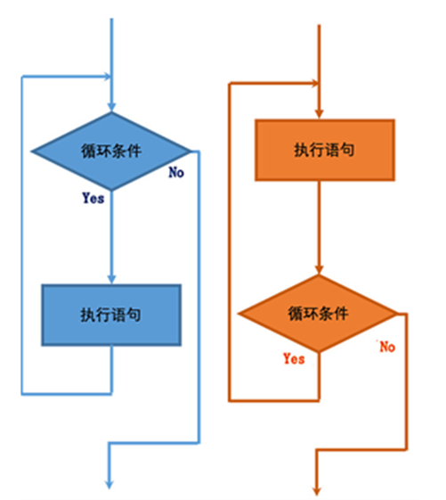
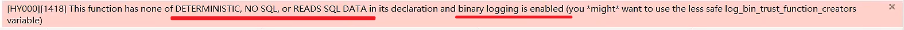
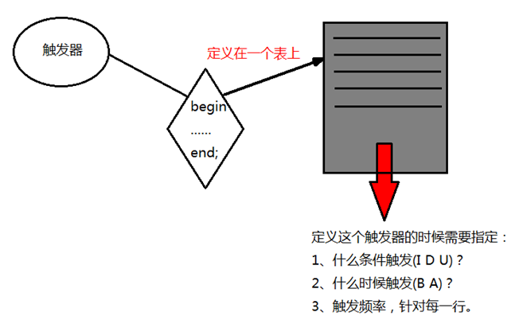
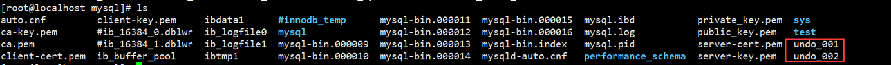
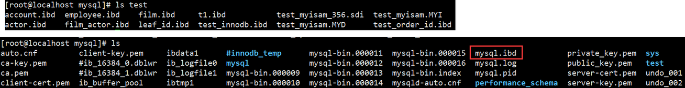

# MySQL数据库-进阶

## 1. MySQL 的视图

### 1.1. 简述

视图（view）是一个虚拟表，非真实存在，其本质是根据SQL语句获取动态的数据集，并为其命名，用户使用时只需使用视图名称即可获取结果集，并可以将其当作表来使用。

数据库中只存放了视图的定义，而并没有存放视图中的数据（即只保存了查询的SQL逻辑，不保存查询结果）。这些数据存放在原来的表中。

使用视图查询数据时，数据库系统会从原来的表中取出对应的数据。因此，视图中的数据是依赖于原来的表中的数据的。一旦表中的数据发生改变，显示在视图中的数据也会发生改变。

### 1.2. 视图的语法

#### 1.2.1. 创建视图

```sql
create [or replace] [algorithm = {undefined | merge | temptable}]
view view_name [(column_list)]
as select_statement
[with [cascaded | local] check option]
```

参数说明：

- `algorithm`：可选项，表示视图选择的算法。
- `view_name`：表示要创建的视图名称。
- `column_list`：可选项，指定视图中各个属性的名词，默认情况下与 `SELECT` 语句中的查询的属性相同。
- `select_statement`：表示一个完整的查询语句，将查询记录导入视图中。
- `[with [cascaded | local] check option]`：可选项，表示更新视图时要保证在该视图的权限范围之内。

示例：

```sql
-- 创建视图测试相关的表与数据
CREATE OR REPLACE 
VIEW view_student_1
AS
 SELECT	id,`name` FROM student WHERE id <= 10;
```


#### 1.2.2. 查询视图

- 查看创建视图语句

```sql
SHOW CREATE VIEW 视图名称;
```


- 查看视图数据。跟普通的查询语句一样，将视图的名称作为表名即可

```sql
SELECT * FROM 视图名称 ...;
```

- 通过以下命令，查看当前数据库所有表和视图，表中会区分开真实的表与视图

```sql
mysql> SHOW FULL TABLES;
+---------------------+------------+
| Tables_in_tempdb    | Table_type |
+---------------------+------------+
| score               | BASE TABLE |
| student             | BASE TABLE |
| student_course      | BASE TABLE |
| view_student_1      | VIEW       |
+---------------------+------------+
```

#### 1.2.3. 修改视图

修改视图是指修改数据库中已存在的表的定义。当基本表的某些字段发生改变时，可以通过修改视图来保持视图和基本表之间一致。MySQL中可以通过以下两种方式来修改视图。

- 方式一：通过 `CREATE OR REPLACE VIEW` 语句

```sql
CREATE OR REPLACE VIEW 视图名称[(列名列表)] 
AS 
    SELECT 语句 [ WITH [ CASCADED | LOCAL ] CHECK OPTION ]
```

示例：

```sql
CREATE OR REPLACE 
VIEW view_student_1
AS
    SELECT id,`name`,`no` FROM student WHERE id <= 10;
```

- 方式二：通过 `ALTER VIEW` 语句

```sql
alter view 视图名 as select语句;
ALTER VIEW 视图名称[(列名列表)] 
AS 
    SELECT 语句 [ WITH [ CASCADED | LOCAL ] CHECK OPTION ]
```

示例：

```sql
ALTER VIEW view_student_1 
AS 
    SELECT id,`name` FROM student WHERE id <= 10;
```

#### 1.2.4. 重命名视图

```sql
RENAME TABLE 视图名 TO 新视图名;
```

示例：

```sql
rename table view1_emp to my_view1;
```

#### 1.2.5. 删除视图

```sql
DROP VIEW [IF EXISTS] 视图名称 [,视图名称] ...;
```

> Notes: <font color=red>**删除视图时，只能删除视图的定义，不会删除原表中的数据。**</font>

示例：

```sql
drop view if exists view_student_1;
```

### 1.3. 更新视图

可以通过 `UPDATE`、`DELETE` 或 `INSERT` 等语句去操作某些视图，从而更新基表的内容。<font color=red>**对于可更新的视图，在视图中的行和基表中的行之间必须具有一对一的关系**</font>。如果视图包含下述结构中的任何一种，那么它就是不可更新的：

- 聚合函数（SUM(), MIN(), MAX(), COUNT()等）
- DISTINCT
- GROUP BY
- HAVING
- UNION 或 UNION ALL
- 位于选择列表中的子查询
- JOIN
- FROM 子句中的不可更新视图
- WHERE 子句中的子查询，引用 FROM 子句中的表。
- 仅引用文字值（在该情况下，没有要更新的基本表）

> Notes: <font color=red>**视图中虽然可以更新数据，但是有很多的限制。一般情况下，最好将视图作为查询数据的虚拟表，而不要通过视图更新数据。因为，使用视图更新数据时，如果没有全面考虑在视图中更新数据的限制，就可能会造成数据更新失败。**</font>

示例：

```sql
--  ---------更新视图-------
create or replace view view1_emp
as
select ename,job from emp;

update view1_emp set ename = '周瑜' where ename = '鲁肃';  -- 可以修改
insert into view1_emp values('孙权','文员');  -- 不可以插入

-- ----------视图包含聚合函数不可更新--------------
create or replace view view2_emp
as
select count(*) cnt from emp;

insert into view2_emp values(100);
update view2_emp set cnt = 100;

-- ----------视图包含distinct不可更新---------
create or replace view view3_emp
as
select distinct job from emp;

insert into view3_emp values('财务');

-- ----------视图包含goup by 、having不可更新------------------
create or replace view view4_emp
as
select deptno ,count(*) cnt from emp group by deptno having  cnt > 2;

insert into view4_emp values(30,100);

-- ----------------视图包含union或者union all不可更新----------------
create or replace view view5_emp
as
select empno,ename from emp where empno <= 1005
union
select empno,ename from emp where empno > 1005;

insert into view5_emp values(1015,'韦小宝');

-- -------------------视图包含子查询不可更新--------------------
create or replace view view6_emp
as
select empno,ename,sal from emp where sal = (select max(sal) from emp);

insert into view6_emp values(1015,'韦小宝',30000);

-- ----------------------视图包含join不可更新-----------------
create or replace view view7_emp
as
select dname,ename,sal from emp a join  dept b  on a.deptno = b.deptno;

insert into view7_emp(dname,ename,sal) values('行政部','韦小宝',30000);

-- --------------------视图包含常量文字值不可更新-------------------
create or replace view view8_emp
as
select '行政部' dname,'杨过'  ename;

insert into view8_emp values('行政部','韦小宝');
```

其实在定义视图时，可以通过视图的检查选项指定条件，然后在插入、修改、删除数据时，都必须满足条件才能操作。

### 1.4. 检查选项

当使用 `WITH CHECK OPTION` 子句创建视图时，MySQL 会通过视图检查正在更改的每条行数据，例如：插入，更新，删除，以使其符合视图的定义。MySQL 允许基于另一个视图创建视图，它还会检查依赖视图中的规则以保持一致性。为了确定检查的范围，mysql 提供了两个选项：`CASCADED` 和 `LOCAL`，默认值为 `CASCADED`

#### 1.4.1. CASCADED

级联操作。比如，v2视图是基于v1视图的，如果在v2视图创建的时候指定了检查选项为 `cascaded`，但是v1视图创建时未指定检查选项。则在执行检查时，不仅会检查v2，还会级联检查v2的关联视图v1。



#### 1.4.2. LOCAL

本地操作：比如，v2视图是基于v1视图的，如果在v2视图创建的时候指定了检查选项为 `local`，但是v1视图创建时未指定检查选项。则在执行检查时，只会检查v2，不会检查v2的关联视图v1。



### 1.5. 视图运用案例

1. 为了保证数据库表的安全性，开发人员在操作 tb_user 表时，只能看到的用户的基本字段，屏蔽手机号和邮箱两个字段。

```sql
create view tb_user_view as select id,`name`,profession,age,gender,`status`,createtime from tb_user;
-- 查询
select * from tb_user_view;
```

2. 查询每个学生所选修的课程（三张表联查），这个功能在很多的业务中都有使用到，为了简化操作，定义一个视图。

```sql
CREATE VIEW tb_stu_course_view 
AS 
	SELECT
		s.NAME student_name,
		s.NO student_no,
		c.NAME course_name 
	FROM
		student s,
		student_course sc,
		course c 
	WHERE
		s.id = sc.studentid 
	AND sc.courseid = c.id;
-- 查询
SELECT * FROM tb_stu_course_view;
```

### 1.6. 视图总结

#### 1.6.1. 视图的优缺点

优点：

- 简化代码：可以把重复使用的查询封装成视图重复使用，同时可以使复杂的查询易于理解和使用。不仅简化用户对数据的理解，也可以简化用户的操作。那些被经常使用的查询可以被定义为视图，从而使得用户不必为以后的操作每次指定全部的条件。
- 数据安全性：如果一张表中有很多数据，很多信息不希望让所有人看到，此时可以使用视图视，如：社会保险基金表，可以用视图只显示姓名，地址，而不显示社会保险号和工资数等，可以对不同的用户，设定不同的视图。
- 逻辑数据独立，兼容老的表结构：视图可帮助用户屏蔽真实表结构变化带来的影响

缺点：

- 性能差。数据库必须把视图的查询转化成对基本表的查询，如果这个视图是由一个复杂的多表查询所定义，那么，即使是视图的一个简单查询，数据库也把它变成一个复杂的结合体，需要花费一定的时间。
- 修改限制。当用户试图修改视图的某些行时，数据库必须把它转化为对基本表的某些行的修改。事实上，当从视图中插入或者删除时，情况也是这样。对于简单视图来说，这是很方便的；但是，对于比较复杂的视图，可能是不可修改的，特征如下：
    1. 有 UNIQUE 等集合操作符的视图。
    2. 有 GROUP BY 子句的视图。
    3. 有诸如 AVG\SUM\MAX 等聚合函数的视图。
    4. 使用 DISTINCT 关键字的视图。
    5. 连接表的视图（其中有些例外）

#### 1.6.2. 视图的特点

- 视图的列可以来自不同的表，是表的抽象和在逻辑意义上建立的新关系。
- 视图是由基本表(实表)产生的表(虚表)。
- 视图的建立和删除不影响基本表。
- 对视图内容的更新(添加，删除和修改)直接影响基本表。
- 当视图来自多个基本表时，不允许添加和删除数据。

#### 1.6.3. 视图的使用场景

- 重用SQL语句；
- 简化复杂的SQL操作。在编写查询后，可以方便的重用它而不必知道它的基本查询细节；
- 使用表的组成部分而不是整个表；
- 保护数据。可以给用户授予表的特定部分的访问权限而不是整个表的访问权限；
- 更改数据格式和表示。视图可返回与底层表的表示和格式不同的数据。

## 2. 存储过程

### 2.1. 简述

MySQL 5.0 版本开始支持存储过程。存储过程是经过预编译并存储在数据库中的一段 SQL 语句的集合，功能强大，可以实现一些比较复杂的逻辑功能，类似于JAVA语言中的方法；调用存储过程可以简化应用开发
人员的很多工作，减少数据在数据库和应用服务器之间的传输，对于提高数据处理的效率是有好处的。

<font color=red>**存储过程就是数据库 SQL 语言层面的代码封装与重用。**</font>

**特性**：

- 函数的普遍特性：模块化，封装，代码复用。可以把某一业务SQL封装在存储过程中，需要用到的时候直接调用即可
- 存储过程可以输入输出参数，可以声明变量，有 if/else, case, while 等控制语句，通过编写存储过程，可以实现复杂的逻辑功能
- 速度快，只有首次执行需经过编译和优化步骤，后续被调用可以直接执行，省去以上步骤，减少网络交互，效率提升。如果涉及到多条SQL，每执行一次都是一次网络传输。而如果封装在存储过程中，只需要网络交互一次可能就可以了

### 2.2. 存储过程基础语法

#### 2.2.1. 创建存储过程

```sql
delimiter 自定义结束符号
CREATE PROCEDURE 储存名称([ in, out, inout ] 参数名 数据类型...)
BEGIN
  sql语句
END 自定义的结束符合
delimiter ;
```

示例：

```sql
delimiter $$
create procedure proc01()
begin
  select empno,ename from emp;
end  $$
delimiter ;

-- 调用
call proc01();
```

> Notes: 
>
> - <font color=red>**特别注意：在语法中，变量声明、游标声明、handler声明是必须按照先后顺序书写的，否则创建存储过程出错。**</font>
> - 在命令行中，执行创建存储过程的 SQL 时，需要通过关键字 `delimiter` 指定 SQL 语句的结束符。

#### 2.2.2. 调用存储过程

```sql
CALL 存储过程名称 ([ 参数 ]);
```

示例：

```sql
-- 调用
call proc01();
```

#### 2.2.3. 查看存储过程

- 查询指定数据库的存储过程及状态信息

```sql
SELECT * FROM INFORMATION_SCHEMA.ROUTINES WHERE ROUTINE_SCHEMA = '数据库名称';
```

- 查询某个存储过程的定义

```sql
SHOW CREATE PROCEDURE 存储过程名称;
```

#### 2.2.4. 删除存储过程

```sql
DROP PROCEDURE [ IF EXISTS ] 存储过程名称;
```

### 2.3. 变量

在 MySQL 中变量分为三种类型：系统变量、用户定义变量、局部变量。

#### 2.3.1. 系统变量

系统变量是 MySQL 服务器提供，不是由用户定义的，属于服务器层面。分为以下两种变量：

- 全局变量(GLOBAL)：全局变量针对于所有的会话
- 会话变量(SESSION)：会话变量针对于单个会话，在另外一个会话窗口就不生效了

**查看系统变量**

```sql
-- 查看所有系统变量
SHOW [ SESSION | GLOBAL ] VARIABLES;
-- 可以通过LIKE模糊匹配方式查找变量
SHOW [ SESSION | GLOBAL ] VARIABLES LIKE '......';
-- 查看指定变量的值
SELECT @@[SESSION | GLOBAL].系统变量名;
```

**设置系统变量**

```sql
SET [ SESSION | GLOBAL ] 系统变量名 = 值;
SET @@[SESSION | GLOBAL].系统变量名 = 值;
```

> Notes: 如果没有指定 SESSION/GLOBAL，默认是 SESSION，会话变量。mysql 服务重新启动之后，所设置的全局参数会失效，若永久配置则需要在 `/etc/my.cnf` 文件中配置

#### 2.3.2. 用户（会话）定义变量

用户定义变量是用户自定义的变量，其作用域为当前连接（会话）。用户变量不用提前声明，使用时直接通过 `@变量名称` 声明即可。*类比java的成员变量*。

- **变量赋值方式1：通过 `SET` 关键字**

```sql
SET @var_name = expr [, @var_name = expr] ... ;
SET @var_name := expr [, @var_name := expr] ... ;
```

> Notes: 赋值时，可以使用`=`，也可以使用`:=`。为了区分sql的运算符`=`，推荐使用`:=`

- **变量赋值方式2：通过 `SELECT` 关键字**

```sql
SELECT @var_name := expr [, @var_name := expr] ... ;
```

- **变量赋值方式3：通过 `INTO` 关键字查询表数据后赋值**

```sql
SELECT 字段名 INTO @var_name FROM 表名;
```

- **变量的使用语法**：

```sql
SELECT @var_name [,@var_name] ...;
```

> Notes: 用户定义的变量时无需对其进行声明或初始化，此时获取变量的值为 NULL

使用示例：

```sql
delimiter $$
create procedure proc04()
begin
    set @var_name01 = 'ZS'; -- 设置用户自定义会话变量
end $$
delimiter ;
call proc04(); -- 调用存储过程
select @var_name01; -- 可以看到结果
```

#### 2.3.3. 局部变量

局部变量是根据需要定义的在局部生效的变量，访问之前，需要 `DECLARE` 声明。可用作存储过程内的局部变量和输入参数，局部变量的范围是在其内声明的 `BEGIN ... END` 块。

##### 2.3.3.1. 变量定义语法

自定义局部变量，在 begin/end 块内有效。声明变量语法：

```sql
declare var_name type [default var_value];
```

参数说明：

- `var_name`：变量名称
- `type`：变量类型，即数据库字段类型：INT、BIGINT、CHAR、VARCHAR、DATE、TIME 等。
- `var_value`：指定默认值（非必须）

示例：

```sql
declare nickname varchar(32);

-- 示例
delimiter $$
create procedure proc02()
begin
    declare var_name01 varchar(20) default 'aaa';  -- 定义局部变量
    set var_name01 = 'MooN';
    select var_name01;
end $$
delimiter ;
-- 调用存储过程
call proc02();
```

##### 2.3.3.2. 变量赋值语法

- **变量赋值方式1：通过 `SET` 关键字**

```sql
SET 变量名 = 值;
SET 变量名 := 值;
```

- **变量赋值方式2：通过 `SELECT..INTO` 语句为变量赋值**

```sql
select
    col_name [...] into var_name[,...]
from
    table_name
where condition;
```

参数说明：

- `col_name` 参数表示查询的字段名称
- `var_name` 参数是变量的名称
- `table_name` 参数指表的名称
- `condition` 参数指查询条件

> Notes: <font color=purple>注意：当将查询结果赋值给变量时，该查询语句的返回结果只能是单行单列！</font>

示例：

```sql
delimiter $$
create procedure proc03()
begin
  declare my_ename varchar(20) ;
  select ename into my_ename from emp where empno=1001;
  select my_ename;
end $$
delimiter ;
-- 调用存储过程
call proc03();
```

### 2.4. 存储过程的参数

存储过程参数的类型，主要分为以下三种：IN、OUT、INOUT。具体的含义如下：

|   类型   |                                       说明                                        |
| ------- | -------------------------------------------------------------------------------- |
| `in`    | 输入参数。该值传到存储过程的过程里面去，在存储过程中修改该参数的值不能被返回。不指定时默认 |
| `out`   | 输出参数。该值可在存储过程内部被改变，并向外输出                                       |
| `inout` | 输入输出参数。既能作为输入的参数，也可以作为输出参数                                   |

用法：

```sql
CREATE PROCEDURE 存储过程名称 ([ IN/OUT/INOUT 参数名 参数类型 ])
BEGIN
    -- SQL语句
END ;
```

#### 2.4.1. in 类型参数

`in` 类型表示传入存储过程的参数，可以传入数值或者变量，即使传入变量，并不会更改变量的值，可以内部更改，仅仅作用在函数范围内。

示例：

```sql
-- 封装有参数的存储过程，传入员工编号，查找员工信息
delimiter $$
create procedure dec_param01(in param_empno varchar(20))
begin
    select * from emp where empno = param_empno;
end $$

delimiter ;
call dec_param01('1001');

-- 封装有参数的存储过程，可以通过传入部门名和薪资，查询指定部门，并且薪资大于指定值的员工信息
delimiter $$
create procedure dec_param0x(in dname varchar(50), in sal decimal(7,2))
begin
    select * from dept a, emp b where b.sal > sal and a.dname = dname;
end $$

delimiter ;
call dec_param0x('学工部',20000);
```

#### 2.4.2. out 类型参数

`out` 类型的参数表示从存储过程内部传值给调用者

示例：

```sql
-- ---------传出参数：out---------------------------------
use mysql7_procedure;
-- 封装有参数的存储过程，传入员工编号，返回员工名字
delimiter $$
create procedure proc08(in empno int , out out_ename varchar(50))
begin
  select ename into out_ename from emp where emp.empno = empno;
end $$
delimiter ;

call proc08(1001, @o_ename);
select @o_ename;

-- 封装有参数的存储过程，传入员工编号，返回员工名字和薪资
delimiter $$
create procedure proc09(in empno int, out out_ename varchar(50), out out_sal decimal(7,2))
begin
  select ename,sal into out_ename,out_sal from emp where emp.empno = empno;
end $$
delimiter ;

call proc09(1001, @o_dname,@o_sal);
select @o_dname;
select @o_sal;
```

#### 2.4.3. inout 类型参数

`inout` 类型表示从外部传入的参数经过修改后可以返回的变量，既可以使用传入变量的值也可以修改变量的值（即使函数执行完）

示例：

```sql
-- 传入员工名，拼接部门号，传入薪资，求出年薪
delimiter $$
create procedure proc10(inout inout_ename varchar(50), inout inout_sal int)
begin
  select  concat(deptno,"_",inout_ename) into inout_ename from emp where ename = inout_ename;
  set inout_sal = inout_sal * 12;
end $$
delimiter ;
set @inout_ename = '关羽';
set @inout_sal = 3000;

call proc10(@inout_ename, @inout_sal) ;
select @inout_ename ;
select @inout_sal ;
```

### 2.5. 流程控制 - if 条件判断

`IF` 语句包含多个条件判断，根据结果为 `TRUE`、`FALSE` 执行语句，与编程语言中的`if`、`else if`、`else` 语法类似，其语法格式如下：

```sql
IF search_condition_1 THEN statement_list_1
    [ELSEIF search_condition_2 THEN statement_list_2]
    ...
    [ELSE statement_list_n]
END IF
```

示例：

```sql
-- 判断存储流程输入
delimiter $$
create procedure proc_12_if(in score int)
begin
  if score < 60
      then
          select '不及格';
    elseif  score < 80
      then
          select '及格' ;
    elseif score >= 80 and score < 90
       then
           select '良好';
  elseif score >= 90 and score <= 100
       then
           select '优秀';
     else
       select '成绩错误';
  end if;
end $$
delimiter ;
-- 调用
call proc_12_if(80);

-- 查询数据
delimiter $$
create procedure proc12_if(in in_ename varchar(50))
begin
    declare result varchar(20);
    declare var_sal decimal(7,2);
        select sal into var_sal from emp where ename = in_ename;
    if var_sal < 10000
        then set result = '试用薪资';
    elseif var_sal < 30000
        then set result = '转正薪资';
    else
        set result = '元老薪资';
    end if;
    select result;
end$$
delimiter ;
-- 调用
call proc12_if('庞统');
```

### 2.6. 流程控制 - case 条件判断

`CASE` 是另一个条件判断的语句，类似于编程语言中的switch语法。语法结构如下：

- 语法1：当 `case_value = when_value` 时，执行相应的 `statement_list` 逻辑

```sql
case case_value
    when when_value then statement_list
    [when when_value then statement_list]
    ...
    [else statement_list]
end case
```

- 语法2：当 `search_condition` 为 `true` 时，执行相应的 `statement_list` 逻辑

```sql
case
    when search_condition then statement_list
    [when search_condition then statement_list]
    ...
    [else statement_list]
end case
```

> Tips: 如果判定条件有多个，多个条件之间，可以使用 and 或 or 进行连接。

示例：

```sql
-- 语法1
delimiter $$
create procedure proc14_case(in pay_type int)
begin
  case pay_type
      when 1 then select '微信支付';
      when 2 then select '支付宝支付';
      when 3 then select '银行卡支付';
      else select '其他方式支付';
	end case ;
end $$
delimiter ;
-- 调用
call proc14_case(2);
call proc14_case(4);

-- 语法2
delimiter $$
create procedure proc_15_case(in score int)
begin
  case
    when score < 60 then select '不及格';
    when score < 80 then select '及格';
    when score >= 80 and score < 90 then select '良好';
    when score >= 90 and score <= 100 then select '优秀';
    else select '成绩错误';
  end case;
end $$
delimiter ;
-- 调用
call proc_15_case(88);
```

### 2.7. 流程控制 - 循环

#### 2.7.1. 简述

- 循环是一段在程序中只出现一次，但可能会连续运行多次的代码。
- 循环中的代码会运行特定的次数，或者是运行到特定条件成立时结束循环



**存储过程的循环分类**：

- while
- repeat
- loop

**循环控制（结束/跳过）**：

- `leave` 类似于java语言的 `break`，跳出，结束当前所在的循环
- `iterate` 类似于java语言的 `continue`，继续，结束本次循环，继续下一次

#### 2.7.2. while 循环

while 循环是有条件的循环控制语句。满足条件后，再执行循环体中的SQL语句。语法格式：

```sql
[标签名:]
WHILE
    循环条件
DO
    循环体;
END WHILE [标签名];
```

注：以上标签名可以省略。标签名一般在`leave`结束与`iterate`跳过循环时使用

示例：

```sql
-- -------存储过程-while
delimiter $$
create procedure proc16_while1(in insertcount int)
begin
    declare i int default 1;
    label:while i<=insertcount do
        insert into user(uid,username,`password`) values(i,concat('user-',i),'123456');
        set i=i+1;
    end while label;
end $$
delimiter ;

call proc16_while(10);

-- -------存储过程-while + leave
delimiter $$
create procedure proc16_while2(in insertcount int)
begin
    declare i int default 1;
    label:while i<=insertcount do
        insert into user(uid,username,`password`) values(i,concat('user-',i),'123456');
        if i=5 then leave label;
        end if;
        set i=i+1;
    end while label;
end $$
delimiter ;

call proc16_while2(10);

-- -------存储过程-while+iterate
delimiter $$
create procedure proc16_while3(in insertcount int)
begin
    declare i int default 1;
    label:while i<=insertcount do
        set i=i+1;
        if i=5 then iterate label;
        end if;
        insert into user(uid,username,`password`) values(i,concat('user-',i),'123456');
    end while label;
end $$
delimiter ;
call proc16_while3(10);
```

#### 2.7.3. repeat 循环

repeat 是有条件的循环控制语句，当满足 until 声明的条件的时候，则退出循环。语法格式：

```sql
[标签名:]
REPEAT
    循环体;
    UNTIL 条件表达式
END REPEAT [标签名];
```

示例：

```sql
-- -------存储过程-循环控制-repeat
delimiter $$
create procedure proc18_repeat(in insertCount int)
begin
     declare i int default 1;
     label:repeat
         insert into user(uid, username, password) values(i,concat('user-',i),'123456');
         set i = i + 1;
         until  i  > insertCount
     end repeat label;
     select '循环结束';
end $$
delimiter ;

call proc18_repeat(100);
```

#### 2.7.4. loop 循环

LOOP 实现简单的循环，如果不在 SQL 逻辑中增加退出循环的条件，可以用其来实现简单的死循环。LOOP 可以配合以下两个语句使用：

- LEAVE ：配合循环使用，退出循环。
- ITERATE：必须用在循环中，作用是跳过当前循环剩下的语句，直接进入下一次循环。

语法格式：

```sql
[标签:]
LOOP
    循环体;
	IF
        条件表达式
	THEN
		LEAVE [标签];
	END IF;
END LOOP;
```

示例：

```sql
-- -------存储过程-循环控制-loop
delimiter $$
create procedure proc19_loop(in insertCount int)
begin
     declare i int default 1;
     label:loop
         insert into user(uid, username, password) values(i,concat('user-',i),'123456');
         set i = i + 1;
         if i > 5
          then
           leave label;
         end if;
     end loop label;
     select '循环结束';
end $$
delimiter ;

call proc19_loop(10);
```

示例2：计算从1到n之间的偶数累加的值，n为传入的参数值。

```sql
create procedure p10(in n int)
begin
    declare total int default 0;
    sum:loop
        if n<=0 then
            leave sum;
        end if;

        if n%2 = 1 then
            set n := n - 1;
            iterate sum;
        end if;

        set total := total + n;
        set n := n - 1;
    end loop sum;
    select total;
end;

call p10(100);
```

### 2.8. 游标

游标(cursor)是用来存储查询结果集的数据类型，在存储过程和函数中可以使用游标对结果集进行循环的处理，相当于指针，指向一行一行数据。游标的使用包括游标的声明、`OPEN`、`FETCH` 和 `CLOSE`

#### 2.8.1. 基础语法

```sql
-- 声明语法
declare cursor_name cursor for select_statement
-- 打开语法
open cursor_name
-- 取值语法
fetch cursor_name into var_name [, var_name] ...
-- 关闭语法
close cursor_name
```

参数说明：

- `cursor_name`：游标的名称
- `select_statement`：查询数据表返回的结果集
- `var_name`：游标循环结果集每一行数据时，赋值的变量

示例：

```sql
use mysql7_procedure;
delimiter $$
create procedure proc20_cursor(in in_dname varchar(50))
begin
 -- 定义局部变量
 declare var_empno varchar(50);
 declare var_ename varchar(50);
 declare var_sal  decimal(7,2);

 -- 声明游标
 declare my_cursor cursor for
  select empno , ename, sal
    from  dept a ,emp b
    where a.deptno = b.deptno and a.dname = in_dname;

    -- 打开游标
  open my_cursor;
  -- 通过游标获取每一行数据
  label:loop
        fetch my_cursor into var_empno, var_ename, var_sal;
        select var_empno, var_ename, var_sal;
    end loop label;

    -- 关闭游标
    close my_cursor;
end

-- 调用存储过程
call proc20_cursor('销售部');
```

示例2：游标的使用取每行记录(多字段)

```sql
delimiter $
create PROCEDURE phoneDeal()

BEGIN
	DECLARE  id varchar(64);   -- id
	DECLARE  phone1  varchar(16); -- phone
	DECLARE  password1  varchar(32); -- 密码
	DECLARE  name1 varchar(64);   -- id
	-- 遍历数据结束标志
	DECLARE done INT DEFAULT FALSE;
	-- 游标
	DECLARE cur_account CURSOR FOR select phone,password,name from account_temp;
	-- 将结束标志绑定到游标
	DECLARE CONTINUE HANDLER FOR NOT FOUND SET done = TRUE;

	-- 打开游标
	OPEN  cur_account;
	-- 遍历
	read_loop: LOOP
		-- 取值 取多个字段
		FETCH  NEXT from cur_account INTO phone1,password1,name1;
			IF done THEN
				LEAVE read_loop;
			END IF;
		-- 你自己想做的操作
		insert into account(id,phone,password,name) value(UUID(),phone1,password1,CONCAT(name1,'的家长'));
	END LOOP;
	CLOSE cur_account;
END $
```

***注意：delimiter关键字后面必须有空格，否则在某些环境或某些情况下使用shell脚本调用执行会出现问题***

### 2.9. 异常处理 - HANDLER 条件处理程序

条件处理程序（Handler）可以用来定义在流程控制结构执行过程中遇到问题时相应的处理步骤。具体语法为：

#### 2.9.1. 语法定义

MySql存储过程也提供了对异常处理的功能：通过定义 `HANDLER` 来完成异常声明的实现。

语法格式：

```sql
DECLARE handler_action HANDLER
    FOR condition_value [, condition_value] ...
    statement

-- handler_action 取值
handler_action: {
    CONTINUE -- 继续执行剩余的代码
  | EXIT     -- 直接终止程序
  | UNDO     -- 不支持
}
-- condition_value 取值
condition_value: {
    mysql_error_code
  | SQLSTATE [VALUE] sqlstate_value
  | condition_name
  | SQLWARNING
  | NOT FOUND
  | SQLEXCEPTION
}
```

参数说明：

- handler_action 条件处理程序的名称，取值：
    - CONTINUE: 继续执行当前程序
    - EXIT: 终止执行当前程序
- condition_value 条件的取值：
    - SQLSTATE sqlstate_value: 状态码，如 02000
    - SQLWARNING: 所有以01开头的SQLSTATE代码的简写
    - NOT FOUND: 所有以02开头的SQLSTATE代码的简写
    - SQLEXCEPTION: 所有没有被SQLWARNING 或 NOT FOUND捕获的SQLSTATE代码的简写

> 具体的错误状态码，可以参考官方文档：
>
> - 5.7版本：https://dev.mysql.com/doc/refman/5.7/en/declare-handler.html
> - https://dev.mysql.com/doc/refman/8.0/en/declare-handler.html
> - https://dev.mysql.com/doc/mysql-errors/8.0/en/server-error-reference.html

#### 2.9.2. 存储过程中使用 handler

示例：

```sql
delimiter $$
create procedure proc20_cursor(in in_dname varchar(50))
begin
		-- 定义局部变量
    declare var_empno int;
    declare var_ename varchar(50);
    declare var_sal decimal(7,2);

    declare flag int default 1; -- ---------------------

    -- 声明游标
    declare my_cursor cursor for
        select empno,ename,sal
        from dept a, emp b
        where a.deptno = b.deptno and a.dname = in_dname;

    -- 定义句柄，当数据未发现时将标记位设置为0
    declare continue handler for NOT FOUND set flag = 0;
    -- 打开游标
    open my_cursor;
    -- 通过游标获取值
    label:loop
        fetch my_cursor into var_empno, var_ename,var_sal;
        -- 判断标志位
        if flag = 1 then
            select var_empno, var_ename,var_sal;
        else
            leave label;
        end if;
    end loop label;

    -- 关闭游标
    close my_cursor;
end $$;
delimiter ;

call proc21_cursor_handler('销售部');
```

### 2.10. 获取当前登陆用户

`user()` 函数用于是取得当前登陆的用户。一般在存储过程中使用，获取值。

```sql
select user() into 变量名;
```

### 2.11. 查询最后插入的数据的id

`last_insert_id()` 函数可以获得刚插入的数据的id值，这个是session 级的，并发没有问题。

```sql
insert xxxxx....;
select last_insert_id() into 变量名;
-- 上面语句可以将最近插入的数据id赋值给变量，后面可以进行对应的逻辑处理
```

### 2.12. 存储过程综合示例

```sql
/*
	创建下个月的每天对应的表user_2021_11_01、user_2021_11_02、...

	需求描述：
		我们需要用某个表记录很多数据，比如记录某某用户的搜索、购买行为(注意，此处是假设用数据库保存)，
		当每天记录较多时，如果把所有数据都记录到一张表中太庞大，需要分表，我们的要求是，每天一张表，存当天的统计数据，
		就要求提前生产这些表——每月月底创建下一个月每天的表！
*/
-- 思路：循环构建表名 user_2021_11_01 到 user_2020_11_30；并执行create语句。
drop procedure if exists proc22_demo;
delimiter $$
create procedure proc22_demo()
begin
    declare next_year int;
    declare next_month int;
    declare next_month_day int;

    declare next_month_str char(2);
    declare next_month_day_str char(2);

    -- 处理每天的表名
    declare table_name_str char(10);

    declare t_index int default 1;
    -- declare create_table_sql varchar(200);
    -- 获取下个月的年份
    set next_year = year(date_add(now(),INTERVAL 1 month));
    -- 获取下个月是几月
    set next_month = month(date_add(now(),INTERVAL 1 month));
    -- 下个月最后一天是几号
    set next_month_day = dayofmonth(LAST_DAY(date_add(now(),INTERVAL 1 month)));

    if next_month < 10
        then set next_month_str = concat('0',next_month);
    else
        set next_month_str = concat('',next_month);
    end if;


    while t_index <= next_month_day do
        if (t_index < 10)
            then set next_month_day_str = concat('0',t_index);
        else
            set next_month_day_str = concat('',t_index);
        end if;
				-- 2021_11_01
        set table_name_str = concat(next_year,'_',next_month_str,'_',next_month_day_str);
        -- 拼接create sql语句
        set @create_table_sql = concat(
                    'create table user_',
                    table_name_str,
                    '(`uid` INT ,`ename` varchar(50) ,`information` varchar(50)) COLLATE=\'utf8_general_ci\' ENGINE=InnoDB');
        -- FROM后面不能使用局部变量！
        prepare create_table_stmt FROM @create_table_sql;
        execute create_table_stmt;
        DEALLOCATE prepare create_table_stmt;

        set t_index = t_index + 1;

    end while;
end $$
delimiter ;

call proc22_demo();
```

## 3. 存储函数

### 3.1. 概述

MySQL存储函数（自定义函数），函数一般用于计算和返回一个值，可以将经常需要使用的计算或功能写成一个函数。存储函数和存储过程一样，都是在数据库中定义一些 SQL 语句的集合。

### 3.2. 创建语法

在MySQL中，创建存储函数使用 `create function` 关键字，其基本形式如下：

```sql
create function func_name ([param_name type[,...]])
returns type
	[characteristic ...]
begin
    routine_body
end;
```

参数说明：

- `func_name`：存储函数的名称。
- `param_name type`：可选项，指定存储函数的参数。`type`参数用于指定存储函数的参数类型，该类型可以是MySQL数据库中所有支持的类型。
- `RETURNS type`：指定返回值的类型。
- `characteristic`：可选项，指定存储函数的特性。
    - `DETERMINISTIC`：相同的输入参数总是产生相同的结果
    - `NO SQL`：不包含 SQL 语句
    - `READS SQL DATA`：包含读取数据的语句，但不包含写入数据的语句
- `routine_body`：SQL 代码内容。

示例：

```sql
-- 创建存储函数-没有输输入参数
drop function if exists myfunc1_emp;

delimiter $$
create function myfunc1_emp() returns int
begin
  declare cnt int default 0;
    select count(*) into  cnt from emp;
  return cnt;
end $$
delimiter ;
-- 调用存储函数
select myfunc1_emp();

-- 创建存储过程-有输入参数
drop function if exists myfunc2_emp;

delimiter $$
create function myfunc2_emp(in_empno int) returns varchar(50)
begin
    declare out_name varchar(50);
    select ename into out_name from emp where  empno = in_empno;
    return out_name;
end $$
delimiter ;

select myfunc2_emp(1008);
```

### 3.3. 注意问题

1. 在 mysql8.0 版本中 binlog 默认是开启的，一旦开启了，mysql 就要求在定义存储过程时，需要指定 `characteristic` 特性，否则就会报如下错误：



2. 如果创建时出现错误，执行以下命令

```sql
set global log_bin_trust_function_creators=TRUE; -- 信任子程序的创建者
```

### 3.4. 存储函数与存储过程的区别

1. 存储函数有且只有一个返回值，而存储过程可以有多个返回值，也可以没有返回值。
2. 存储函数只能有输入参数，而且不能带`in`，而存储过程可以有多个`in`、`out`、`inout`参数。
3. 存储过程中的语句功能更强大，存储过程可以实现很复杂的业务逻辑，而函数有很多限制，如不能在函数中使用`insert`、`update`、`delete`、`create`等语句；
4. 存储函数只完成查询的工作，可接受输入参数并返回一个结果，也就是函数实现的功能针对性比较强。
5. 存储过程可以调用存储函数。但函数不能调用存储过程。
6. 存储过程一般是作为一个独立的部分来执行(`call`调用)。而函数可以作为查询语句的一个部分来调用

## 4. 触发器

### 4.1. 概述

触发器，就是一种特殊的存储过程。触发器和存储过程一样是一个能够完成特定功能、存储在数据库服务器上的SQL片段，但是触发器无需调用，当对数据库表中的数据执行DML操作时自动触发这个SQL片段的执行，无需手动调用。

**在MySQL中，只有执行`insert`,`delete`,`update`操作时才能触发触发器的执行**。

触发器的这种特性可以协助应用在数据库端确保数据的完整性，日志记录，数据校验等操作。

使用别名 `OLD` 和 `NEW` 来引用触发器中发生变化的记录内容，这与其他的数据库是相似的。现在触发器还只支持行级触发，不支持语句级触发

### 4.2. 触发器的特性

1. 什么条件会触发：I、D、U
2. 什么时候触发：在增删改前或者后
3. 触发频率：针对每一行执行
4. 触发器定义在表上，附着在表上



### 4.3. 触发器语法定义

#### 4.3.1. 创建语法

- 创建只有一个执行语句的触发器

```sql
CREATE TRIGGER 触发器名 BEFORE | AFTER 触发事件[ INSERT | UPDATE | DELETE ]
ON 表名 FOR EACH ROW
执行语句;
```

- 创建有多个执行语句的触发器

```sql
CREATE TRIGGER 触发器名 BEFORE | AFTER 触发事件[ INSERT | UPDATE | DELETE ]
ON 表名 FOR EACH ROW
BEGIN
	执行语句列表
END;
```

参数说明：

- 触发事件：取值：`insert` | `update` | `delete`


示例：

```sql
-- 如果触发器存在，则先删除
drop trigger if  exists trigger_test1;
-- 创建触发器trigger_test1
create trigger trigger_test1
after insert on user -- 触发时机：当添加user表数据时触发
for each row
    insert into user_logs values(NULL,now(), '有新用户注册');

-- 添加数据，触发器自动执行并添加日志代码
insert into user values(1,'张三','123456');

-- 如果触发器trigger_test2存在，则先删除
drop trigger if exists trigger_test2;
-- 创建触发器trigger_test2
delimiter $$
create trigger trigger_test2
after update on user  -- 触发时机：当修改user表数据时触发
for each row -- 每一行
begin
    insert into user_logs values(NULL,now(), '用户修改发生了修改');
end $$

delimiter ;

-- 添加数据，触发器自动执行并添加日志代码
update user set password = '888888' where uid = 1;
```

#### 4.3.2. 操作关键字 (NEW|OLD)

MySQL 中定义了 `NEW` 和 `OLD`，用来表示触发器的所在表中，触发了触发器的那一行数据，来引用触发器中发生变化的记录内容。

|    触发器类型     |             触发器类型`NEW` 和 `OLD` 的使用             |
| :--------------: | ----------------------------------------------------- |
| `INSERT` 型触发器 | `NEW` 表示将要或者已经新增的数据                         |
| `UPDATE` 型触发器 | `OLD` 表示修改之前的数据，`NEW` 表示将要或已经修改后的数据 |
| `DELETE` 型触发器 | `OLD` 表示将要或者已经删除的数据                         |

使用方法：

- `NEW.columnName`：获取新增数据某一列的值，`columnName`为相应数据表某一列名

示例：

```sql
create trigger trigger_test3 after insert
on user for each row
insert into user_logs values(NULL,now(),concat('有新用户添加，信息为:',NEW.uid,NEW.username,NEW.password));

-- 测试
insert into user values(4,'赵六','123456');
```

#### 4.3.3. 查看触发器

语法：

```sql
show triggers;
```

#### 4.3.4. 删除触发器

如果没有指定 schema_name，默认为当前数据库。语法：

```sql
drop trigger [if exists] [schema_name.]trigger_name;
```

示例：

```sql
drop trigger if exists trigger_test1;
```

### 4.4. 触发器注意事项

1. MYSQL 中触发器中不能对本表进行 `insert`, `update`, `delete` 操作，以免递归循环触发
2. 尽量少使用触发器，假设触发器触发每次执行1s，insert table 500条数据，那么就需要触发500次触发器，光是触发器执行的时间就花费了500s，而insert 500条数据一共是1s，那么这个insert的效率就非常低了。
3. 触发器是针对每一行的；对增删改非常频繁的表上切记不要使用触发器，因为它会非常消耗资源。

## 5. 分区表(了解)

> Tips: 此知识点只需要了解，实际项目的应用极少

### 5.1. 简介

分区是指根据一定的规则，数据库把一个表分解成多个更小的、更容易管理的部分。就访问数据库的应用而言，逻辑上只有一个表或一个索引，但是实际上这个表可能由数 10 个物理分区对象组成，每个分区都是一个独立的对象，可以独自处理，可以作为表的一部分进行处理。

分区表是一个独立的逻辑表，但是底层由多个物理子表组成。实现分区的代码实际上是对一组底层表的的封装。对分区表的请求，都会转化成对存储引擎的接口调用。**分区对于 SQL 层来说是一个完全封装底层实现的黑盒子，对应用是透明的**。

从底层的文件系统可以看出，每一个分区表都有一个使用`#`分隔命名的表文件。

MySQL 在创建表时使用`PARTITION BY`子句定义每个分区存放的数据。在执行查询的时候，优化器根据分区定义过滤那些数据不在的分区，这样查询就无须扫描所有分区。

分区的一个主要目的是将数据按照一个较粗的粒度分在不同的表中。另外，也方便一次批量删除整个分区的数据。分区表作用如下：

- 表非常大以至于无法全部都放在内存中，或者只在表的最后部分有热点数据，其他均是历史数据。
- 分区表的数据更容易维护。例如，想批量删除大量数据可以使用清除整个分区的方式。另外，还可以对一个独立分区进行优化、检查、修复等操作。
- 分区表的数据可以分布在不同的物理设备上，从而高效地利用多个硬件设备。可以使用分区表来避免某些特殊的瓶颈，例如 InnoDB 的单个索引的互斥访问、ext3 文件系统的 inode 锁竞争等。
- 如果需要,还可以备份和恢复独立的分区,这在非常大的数据集的场景下效果非常好。

分区表的限制：

- 一个表最多只能有 1024 个分区
- 如果分区字段中有主键或者唯一索引的列，那么所有主键列和唯一索引列都必须包含进来
- 分区表中无法使用外键约束

### 5.2. 分区表的原理

分区表由多个相关的底层表实现，这些底层表也是由句柄对象（Handlerobject)表示，所以也可以直接访问各个分区。存储引擎管理分区的各个底层表和管理普通表一样（所有的底层表都必须使用相同的存储引擎)，分区表的索引只是在各个底层表上各自加上一个完全相同的索引。从存储引擎的角度来看，底层表和一个普通表没有任何不同，存储引擎也无须知道这是一个普通表还是一个分区表的一部分。分区表上的操作按照下面的操作逻辑进行:

虽然每个操作都会“先打开并锁住所有的底层表”，但这并不是说分区表在处理过程中是锁住全表的。如果存储引擎能够自己实现行级锁，例如 InnoDB，则会在分区层释放对应表锁。这个加锁和解锁过程与普通 InnoDB 上的查询类似。

### 5.3. 分区表的类型

#### 5.3.1. MySQL 支持的分区表

- RANGE 分区：基于属于一个给定连续区间的列值，把多行分配给分区。
- LIST 分区：类似于按 RANGE 分区，区别在于 LIST 分区是基于列值匹配一个离散值集合中的某个值来进行选择。
- HASH 分区：基于用户定义的表达式的返回值来进行选择的分区，该表达式使用将要插入到表中的这些行的列值进行计算。这个函数可以包含 MySQL 中有效的、产生非负整数值的任何表达式。
- KEY 分区：类似于按 HASH 分区，区别在于 KEY 分区只支持计算一列或多列，且 MySQL 服务器提供其自身的哈希函数。必须有一列或多列包含整数值。
- 复合分区/子分区：目前只支持 RANGE 和 LIST 的子分区，且子分区的类型只能为 HASH 和 KEY。

#### 5.3.2. 分区的基本语法

- RANGE 分区

```sql
CREATE TABLE test (
    order_date DATETIME NOT NULL,
）ENGINE=InnoDB
PARTITION BY RANGE(YEAR(order_date))(
PARTITION p_0 VALUES LESS THAN (2010) ,
PARTITION p_1 VALUES LESS THAN (2011),
PARTITION p_2 VALUES LESS THAN (2012),
PARTITION p_other VALUES LESS THAN MAXVALUE);
```

- LIST 分区(类似枚举)

```sql
CREATE TABLE h2 (
    c1 INT,
    c2 INT
PARTITION BY LIST(c1) (
PARTITION p0 VALUES IN (1, 4, 7),
PARTITION p1 VALUES IN (2, 5, 8));
```

- range 和 List 都是整数类型分区，其实 range 和 List 也支持非整数分区，但是要结合 COLUMN 分区，支持整形、日期、字符串

```sql
CREATE TABLE emp_date(
    id INT NOT NULL,
    ename VARCHAR (30),
    hired DATE NOT NULL DEFAULT '1970-01-01',
    separated DATE NOT NULL DEFAULT '9999-12-31',
    job VARCHAR(30) NOT NULL,
    store_id INT NOT NULL)
PARTITION BY RANGE COLUMNS (separated)(
PARTITION pO VALUES LESS THAN ('1996-01-01'),
PARTITION p1 VALUES LESS THAN ('2001-01-01'),
PARTITION p2 VALUES LESS THAN ('2006-01-01'));

CREATE TABLE expenses (
    expense_date DATE NOT NULL,
    category VARCHAR(30),
    amount DECIMAL (10,3)
)
PARTITION BY LIST COLUMNS (category)(
PARTITION p0 VALUES IN ('a','b') ,
PARTITION p1 VALUES IN('c','d'),
PARTITION p2 VALUES IN('e','f'),
PARTITION p3 VALUES IN('g'),
PARTITION p4 VALUES IN('h'));

-- 在结合 COLUMN 分区时还支持多列
CREATE TABLE rc3(
    a INT,
    b INT)
PARTITION BY RANGE COLUMNS(a,b)(
PARTITION p01 VALUES LESS THAN (0,10),
PARTITION p02 VALUES LESS THAN (10,10),
PARTITION p03 VALUES LESS THAN (10,20),
PARTITION p04 VALUES LESS THAN (10,35),
PARTITION p05 VALUES LESS THAN (10,MAXVALUE),
PARTITION p06 VALUES LESS THAN (MAXVALUE,MAXVALUE));
```

- Hash 分区

```sql
CREATE TABLE emp (
    id INT NOT NULL,
    ename VARCHAR(30),
    hired DATE NOT NULL DEFAULT '1970-01-01'
    separated DATENOT NULL DEFAULT '9999-12-31',
    job VARCHAR(30) NOT NULL,
    store_id INT NOT NULL
)
PARTITION BY HASH (store_id) PARTITIONS 4;
```

> 以上示例创建了一个基于 store_id 列 HASH 分区的表，表被分成了 4 个分区，如果我们插入的记录`store_id=234`，则 `234 mod 4 = 2`，这条记录就会保存到第二个分区。虽然在HASH()中直接使用的 store_id 列，但是 MySQL 是允许基于某列值返回一个整数值的表达式或者 MySQL 中有效的任何函数或者其他表达式都是可以的。

- key分区

```sql
- 创建了一个基于 job 字段进行 Key 分区的表，表被分成了 4 个分区。KEY ()里只允许出现表中的字段。
CREATE TABLE emp (
    id INT NOT NULL,
    ename VARCHAR(30),
    hired DATE NOT NULL DEFAULT '1970-01-01'
    separated DATENOT NULL DEFAULT '9999-12-31',
    job VARCHAR(30) NOT NULL,
    store_id INT NOT NULL
)
PARTITION BY KEY (job) PARTITIONS 4;
```

### 5.4. 不建议使用 mysql 分区表

在实际互联网项目中，MySQL分区表用的极少，更多的是分库分表。

分库分表除了支持 MySQL 分区表的水平切分以外，还支持垂直切分，把一个很大的库（表）的数据分到几个库（表）中，每个库（表）的结构都相同，但他们可能分布在不同的 mysql 实例，甚至不同的物理机器上，以达到降低单库（表）数据量，提高访问性能的目的。两者对比如下：

- 分区表，分区键设计不太灵活，如果不走分区键，很容易出现全表锁
- 一旦数据量并发量上来，如果在分区表实施关联，就是一个灾难
- 分库分表，使用者来掌控业务场景与访问模式，可控。分区表，由 mysql 本身来实现，不太可控
- 分区表无论怎么分，都是在一台机器上，天然就有性能的上限

## 6. Mysql 8.0 新特性详解

> Tips: 建议使用 8.0.17 及之后的版本

### 6.1. 新增降序索引

MySQL 早期的版本中在语法上是支持降序索引，但实际上创建的仍然是升序索引。如下MySQL 5.7 所示，c2字段降序，但是从`show create table`看c2仍然是升序。

```sql
# ====MySQL 5.7演示====
mysql> create table t1(c1 int,c2 int,index idx_c1_c2(c1,c2 desc));
mysql> insert into t1 (c1,c2) values(1, 10),(2,50),(3,50),(4,100),(5,80);
mysql> show create table t1\G
*************************** 1. row ***************************
       Table: t1
Create Table: CREATE TABLE `t1` (
  `c1` int(11) DEFAULT NULL,
  `c2` int(11) DEFAULT NULL,
  KEY `idx_c1_c2` (`c1`,`c2`)    -- 注意这里，c2字段是升序
) ENGINE=InnoDB DEFAULT CHARSET=latin1

mysql> explain select * from t1 order by c1,c2 desc;  --5.7也会使用索引，但是Extra字段里有filesort文件排序
+----+-------------+-------+------------+-------+---------------+-----------+---------+------+------+----------+-----------------------------+
| id | select_type | table | partitions | type  | possible_keys | key       | key_len | ref  | rows | filtered | Extra                       |
+----+-------------+-------+------------+-------+---------------+-----------+---------+------+------+----------+-----------------------------+
|  1 | SIMPLE      | t1    | NULL       | index | NULL          | idx_c1_c2 | 10      | NULL |    1 |   100.00 | Using index; Using filesort |
+----+-------------+-------+------------+-------+---------------+-----------+---------+------+------+----------+-----------------------------+
```

8.0 版本可见 c2 字段降序。<font color=red>**注意：只有 Innodb 存储引擎支持降序索引**</font>。

```sql
# ====MySQL 8.0演示====
mysql> create table t1(c1 int,c2 int,index idx_c1_c2(c1,c2 desc));
mysql> insert into t1 (c1,c2) values(1, 10),(2,50),(3,50),(4,100),(5,80);
mysql> show create table t1\G
*************************** 1. row ***************************
       Table: t1
Create Table: CREATE TABLE `t1` (
  `c1` int DEFAULT NULL,
  `c2` int DEFAULT NULL,
  KEY `idx_c1_c2` (`c1`,`c2` DESC)  --注意这里的区别，降序索引生效了
) ENGINE=InnoDB DEFAULT CHARSET=utf8mb4 COLLATE=utf8mb4_0900_ai_ci

mysql> explain select * from t1 order by c1,c2 desc;  --Extra字段里没有filesort文件排序，充分利用了降序索引
+----+-------------+-------+------------+-------+---------------+-----------+---------+------+------+----------+-------------+
| id | select_type | table | partitions | type  | possible_keys | key       | key_len | ref  | rows | filtered | Extra       |
+----+-------------+-------+------------+-------+---------------+-----------+---------+------+------+----------+-------------+
|  1 | SIMPLE      | t1    | NULL       | index | NULL          | idx_c1_c2 | 10      | NULL |    1 |   100.00 | Using index |
+----+-------------+-------+------------+-------+---------------+-----------+---------+------+------+----------+-------------+

mysql> explain select * from t1 order by c1 desc,c2;  --Extra字段里有Backward index scan，意思是反向扫描索引;
+----+-------------+-------+------------+-------+---------------+-----------+---------+------+------+----------+----------------------------------+
| id | select_type | table | partitions | type  | possible_keys | key       | key_len | ref  | rows | filtered | Extra                            |
+----+-------------+-------+------------+-------+---------------+-----------+---------+------+------+----------+----------------------------------+
|  1 | SIMPLE      | t1    | NULL       | index | NULL          | idx_c1_c2 | 10      | NULL |    1 |   100.00 | Backward index scan; Using index |
+----+-------------+-------+------------+-------+---------------+-----------+---------+------+------+----------+----------------------------------+

mysql> explain select * from t1 order by c1 desc,c2 desc;  --Extra字段里有filesort文件排序，排序必须按照每个字段定义的排序或按相反顺序才能充分利用索引
+----+-------------+-------+------------+-------+---------------+-----------+---------+------+------+----------+-----------------------------+
| id | select_type | table | partitions | type  | possible_keys | key       | key_len | ref  | rows | filtered | Extra                       |
+----+-------------+-------+------------+-------+---------------+-----------+---------+------+------+----------+-----------------------------+
|  1 | SIMPLE      | t1    | NULL       | index | NULL          | idx_c1_c2 | 10      | NULL |    1 |   100.00 | Using index; Using filesort |
+----+-------------+-------+------------+-------+---------------+-----------+---------+------+------+----------+-----------------------------+

mysql> explain select * from t1 order by c1,c2;    --Extra字段里有filesort文件排序，排序必须按照每个字段定义的排序或按相反顺序才能充分利用索引
+----+-------------+-------+------------+-------+---------------+-----------+---------+------+------+----------+-----------------------------+
| id | select_type | table | partitions | type  | possible_keys | key       | key_len | ref  | rows | filtered | Extra                       |
+----+-------------+-------+------------+-------+---------------+-----------+---------+------+------+----------+-----------------------------+
|  1 | SIMPLE      | t1    | NULL       | index | NULL          | idx_c1_c2 | 10      | NULL |    1 |   100.00 | Using index; Using filesort |
+----+-------------+-------+------------+-------+---------------+-----------+---------+------+------+----------+-----------------------------+
```

### 6.2. group by 不再隐式排序

5.7 版本使用`group by`进行排序，会隐式将对分组的字段进行排序

```sql
# ====MySQL 5.7演示====
mysql> select count(*),c2 from t1 group by c2;
+----------+------+
| count(*) | c2   |
+----------+------+
|        1 |   10 |
|        2 |   50 |
|        1 |   80 |
|        1 |  100 |
+----------+------+
```

8.0 版本对于 `group by` 字段不再隐式排序，如需要排序，必须显式加上 `order by` 子句。

```sql
# ====MySQL 8.0演示====
mysql> select count(*),c2 from t1 group by c2;   --8.0版本group by不再默认排序
+----------+------+
| count(*) | c2   |
+----------+------+
|        1 |   10 |
|        2 |   50 |
|        1 |  100 |
|        1 |   80 |
+----------+------+

mysql> select count(*),c2 from t1 group by c2 order by c2;  --8.0版本group by不再默认排序，需要自己加order by
+----------+------+
| count(*) | c2   |
+----------+------+
|        1 |   10 |
|        2 |   50 |
|        1 |   80 |
|        1 |  100 |
+----------+------+
```

### 6.3. 增加隐藏索引

在 8.0 版本中，可以使用 `invisible` 关键字在创建表或者进行表变更中设置索引为隐藏索引。索引隐藏只是不可见，但是数据库后台还是会维护隐藏索引的，但在查询时优化器不使用该索引，就算使用`force index` 关键字，优化器也不会使用该索引，同时优化器也不会报索引不存在的错误，因为索引仍然真实存在，必要时，也可以把隐藏索引快速恢复成可见。

> Notes: <font color=red>**主键不能设置为 invisible**</font>。

软删除就可以使用隐藏索引，比如分析某个索引没用了，删除后发现这个索引在某些时候还是有用的，就要把该索引恢复回去，如果表数据量很大的话，这种操作耗费时间是很多的，成本很高，此时就可以将索引先设置为隐藏索引，等到真的确认索引没用了再删除。

- **创建隐藏索引**

```sql
# 创建t2表，里面的c2字段为隐藏索引
mysql> create table t2(c1 int, c2 int, index idx_c1(c1), index idx_c2(c2) invisible);

mysql> show index from t2\G
*************************** 1. row ***************************
        Table: t2
   Non_unique: 1
     Key_name: idx_c1
 Seq_in_index: 1
  Column_name: c1
    Collation: A
  Cardinality: 0
     Sub_part: NULL
       Packed: NULL
         Null: YES
   Index_type: BTREE
      Comment: 
Index_comment: 
      Visible: YES
   Expression: NULL
*************************** 2. row ***************************
        Table: t2
   Non_unique: 1
     Key_name: idx_c2
 Seq_in_index: 1
  Column_name: c2
    Collation: A
  Cardinality: 0
     Sub_part: NULL
       Packed: NULL
         Null: YES
   Index_type: BTREE
      Comment: 
Index_comment: 
      Visible: NO   --隐藏索引不可见
   Expression: NULL
```

- **测试隐藏索引c2是否被使用**

```sql
mysql> explain select * from t2 where c1=1;
+----+-------------+-------+------------+------+---------------+--------+---------+-------+------+----------+-------+
| id | select_type | table | partitions | type | possible_keys | key    | key_len | ref   | rows | filtered | Extra |
+----+-------------+-------+------------+------+---------------+--------+---------+-------+------+----------+-------+
|  1 | SIMPLE      | t2    | NULL       | ref  | idx_c1        | idx_c1 | 5       | const |    1 |   100.00 | NULL  |
+----+-------------+-------+------------+------+---------------+--------+---------+-------+------+----------+-------+

mysql> explain select * from t2 where c2=1;  --隐藏索引c2不会被使用
+----+-------------+-------+------------+------+---------------+------+---------+------+------+----------+-------------+
| id | select_type | table | partitions | type | possible_keys | key  | key_len | ref  | rows | filtered | Extra       |
+----+-------------+-------+------------+------+---------------+------+---------+------+------+----------+-------------+
|  1 | SIMPLE      | t2    | NULL       | ALL  | NULL          | NULL | NULL    | NULL |    1 |   100.00 | Using where |
+----+-------------+-------+------------+------+---------------+------+---------+------+------+----------+-------------+
```

- **设置会话查询优化器对隐藏索引可见**

```sql
mysql> select @@optimizer_switch\G   -- 查看各种参数
*************************** 1. row ***************************
@@optimizer_switch: index_merge=on,index_merge_union=on,index_merge_sort_union=on,index_merge_intersection=on,engine_condition_pushdown=on,index_condition_pushdown=on,mrr=on,mrr_cost_based=on,block_nested_loop=on,batched_key_access=off,materialization=on,semijoin=on,loosescan=on,firstmatch=on,duplicateweedout=on,subquery_materialization_cost_based=on,use_index_extensions=on,condition_fanout_filter=on,derived_merge=on,use_invisible_indexes=off,skip_scan=on,hash_join=on

mysql> set session optimizer_switch="use_invisible_indexes=on";  -- 在会话级别设置查询优化器可以看到隐藏索引

mysql> select @@optimizer_switch\G
*************************** 1. row ***************************
@@optimizer_switch: index_merge=on,index_merge_union=on,index_merge_sort_union=on,index_merge_intersection=on,engine_condition_pushdown=on,index_condition_pushdown=on,mrr=on,mrr_cost_based=on,block_nested_loop=on,batched_key_access=off,materialization=on,semijoin=on,loosescan=on,firstmatch=on,duplicateweedout=on,subquery_materialization_cost_based=on,use_index_extensions=on,condition_fanout_filter=on,derived_merge=on,use_invisible_indexes=on,skip_scan=on,hash_join=on

mysql> explain select * from t2 where c2=1;
+----+-------------+-------+------------+------+---------------+--------+---------+-------+------+----------+-------+
| id | select_type | table | partitions | type | possible_keys | key    | key_len | ref   | rows | filtered | Extra |
+----+-------------+-------+------------+------+---------------+--------+---------+-------+------+----------+-------+
|  1 | SIMPLE      | t2    | NULL       | ref  | idx_c2        | idx_c2 | 5       | const |    1 |   100.00 | NULL  |
+----+-------------+-------+------------+------+---------------+--------+---------+-------+------+----------+-------+
```

- **修改索引是否隐藏**

```sql
mysql> alter table t2 alter index idx_c2 visible;
Query OK, 0 rows affected (0.02 sec)
Records: 0  Duplicates: 0  Warnings: 0

mysql> alter table t2 alter index idx_c2 invisible;
Query OK, 0 rows affected (0.01 sec)
Records: 0  Duplicates: 0  Warnings: 0
```

### 6.4. 新增函数索引

MySQL 早期的版本中，如果在查询中加入了函数，索引不生效。在 8.0 版本之后引入了函数索引，MySQL 8.0.13 开始支持在索引中使用`函数(表达式)`的值。

**函数索引基于虚拟列功能实现**，在 MySQL 中相当于新增了一个列，这个列会根据查询条件中的函数来进行计算结果，然后使用函数索引的时候就会用这个计算后的列作为索引。

```sql
mysql> create table t3(c1 varchar(10),c2 varchar(10)); -- 创建测试的表
mysql> create index idx_c1 on t3(c1);     -- 创建普通索引
mysql> create index func_idx on t3((UPPER(c2)));  -- 创建一个大写的函数索引

mysql> show index from t3\G
*************************** 1. row ***************************
        Table: t3
   Non_unique: 1
     Key_name: idx_c1
 Seq_in_index: 1
  Column_name: c1
    Collation: A
  Cardinality: 0
     Sub_part: NULL
       Packed: NULL
         Null: YES
   Index_type: BTREE
      Comment: 
Index_comment: 
      Visible: YES
   Expression: NULL
*************************** 2. row ***************************
        Table: t3
   Non_unique: 1
     Key_name: func_idx
 Seq_in_index: 1
  Column_name: NULL
    Collation: A
  Cardinality: 0
     Sub_part: NULL
       Packed: NULL
         Null: YES
   Index_type: BTREE
      Comment: 
Index_comment: 
      Visible: YES
   Expression: upper(`c2`)    -- 函数表达式

mysql> explain select * from t3 where upper(c1)='moonzero';
+----+-------------+-------+------------+------+---------------+------+---------+------+------+----------+-------------+
| id | select_type | table | partitions | type | possible_keys | key  | key_len | ref  | rows | filtered | Extra       |
+----+-------------+-------+------------+------+---------------+------+---------+------+------+----------+-------------+
|  1 | SIMPLE      | t3    | NULL       | ALL  | NULL          | NULL | NULL    | NULL |    1 |   100.00 | Using where |
+----+-------------+-------+------------+------+---------------+------+---------+------+------+----------+-------------+

mysql> explain select * from t3 where upper(c2)='moonzero';  --使用了函数索引
+----+-------------+-------+------------+------+---------------+----------+---------+-------+------+----------+-------+
| id | select_type | table | partitions | type | possible_keys | key      | key_len | ref   | rows | filtered | Extra |
+----+-------------+-------+------------+------+---------------+----------+---------+-------+------+----------+-------+
|  1 | SIMPLE      | t3    | NULL       | ref  | func_idx      | func_idx | 43      | const |    1 |   100.00 | NULL  |
+----+-------------+-------+------------+------+---------------+----------+---------+-------+------+----------+-------+
```

### 6.5. innodb 存储引擎可跳过锁等待

在 5.7 及之前的版本，执行`select...for update`语句时，如果获取不到锁则会一直等待，直到 `innodb_lock_wait_timeout` 超时。

在 8.0 版本后，对于`select …… for share`(8.0新增加查询共享锁的语法)或`select …… for update`，在语句后面添加 `NOWAIT`、`SKIP LOCKED` 等关键字语法，可以跳过锁等待，或者跳过锁定，能够立即返回。假设查询的行已经加锁，两个关键字分别处理逻辑如下：

- `nowait` 关键字的语句会立即报错返回。
- `skip locked` 关键字的语句也会立即返回，但只是返回的结果中不包含被锁定的行。

> 应用场景：比如查询余票记录，如果某些记录已经被锁定，用 skip locked 可以跳过被锁定的记录，只返回没有锁定的记录，提高系统性能。

```sql
# 先打开一个session1:
mysql> select * from t1;
+------+------+
| c1   | c2   |
+------+------+
|    1 |   10 |
|    2 |   50 |
|    3 |   50 |
|    4 |  100 |
|    5 |   80 |
+------+------+
    
mysql> begin; -- 开启事务
mysql> update t1 set c2 = 60 where c1 = 2;     -- 锁定第二条记录


# 打开另外一个session2:    
mysql> select * from t1 where c1 = 2 for update;   -- 等待超时
ERROR 1205 (HY000): Lock wait timeout exceeded; try restarting transaction

mysql> select * from t1 where c1 = 2 for update nowait;   -- 查询立即返回
ERROR 3572 (HY000): Statement aborted because lock(s) could not be acquired immediately and NOWAIT is set.

mysql> select * from t1 for update skip locked;  -- 查询立即返回，过滤掉了第二行记录
+------+------+
| c1   | c2   |
+------+------+
|    1 |   10 |
|    3 |   50 |
|    4 |  100 |
|    5 |   80 |
+------+------+
```

### 6.6. 新增 innodb_dedicated_server 自适应参数

8.0 版本新增 `innodb_dedicated_server`参数，能够让 InnoDB 根据服务器上检测到的内存大小自动配置 `innodb_buffer_pool_size`，`innodb_log_file_size` 等参数，会尽可能多的占用系统可占用资源提升性能。解决非专业人员安装数据库后默认初始化数据库参数默认值偏低的问题。<u>**但前提是服务器是专用来给 MySQL 数据库的，如果还有其他软件或者资源或者多实例 MySQL 使用，不建议开启该参数，不然会影响其它程序。**</u>

### 6.7. 死锁检查控制

MySQL 8.0（MySQL 5.7.15）增加了一个新的动态变量 `innodb_deadlock_detect`，用于控制系统是否执行 InnoDB 死锁检查，默认是打开的。死锁检测会耗费数据库性能的，对于高并发的系统，可以关闭死锁检测功能，提高系统性能。但是要确保系统极少情况会发生死锁，同时要将锁等待超时参数调小一点，以防出现死锁等待过久的情况。

```sql
mysql> show variables like '%innodb_deadlock_detect%';  -- 默认值是ON，打开
+------------------------+-------+
| Variable_name          | Value |
+------------------------+-------+
| innodb_deadlock_detect | ON    |
+------------------------+-------+
```

### 6.8. undo 文件不再使用系统表空间

默认创建2个UNDO表空间，不再使用系统表空间。



### 6.9. binlog 日志过期时间精确到秒

在 8.0 版本之前，binlog 日志过期时间是通过 `expire_logs_days` 参数来设置，时间单位是“天”；而在 8.0 版本中，默认日志过期时间使用 `binlog_expire_logs_seconds` 参数（名称发生变化）来配置，并且单位为“秒”。

### 6.10. 默认字符集的变动

在 8.0 版本之前，默认字符集为`latin1`，utf8 默认指向的是`utf8mb3`；8.0 版本默认字符集为`utf8mb4`，utf8 默认指向的也是`utf8mb4`。

### 6.11. 系统表的存储引擎的变动

8.0 版本将系统表(mysql)和数据字典表全部改为 InnoDB 存储引擎，默认的 MySQL 实例将不包含 MyISAM 表，除非手动创建 MyISAM 表。

### 6.12. 元数据存储变动

MySQL 8.0删除了之前版本的元数据文件，例如表结构.frm等文件，全部集中放入mysql.ibd文件里。可以看见下图test库文件夹里已经没有了frm文件。



### 6.13. 自增变量持久化

在 8.0 以前的版本，自增主键 AUTO_INCREMENT 的值如果大于`max(primary key)+1`，在 MySQL 重启后，会重置`AUTO_INCREMENT=max(primary key)+1`，这种现象在某些情况下会导致业务主键冲突或者其他难以发现的问题。

> [官网对于自增主键重启重置问题的说明](https://bugs.mysql.com/bug.php?id=199)

```sql
# ====MySQL 5.7演示====
mysql> create table t(id int auto_increment primary key,c1 varchar(20));
mysql> insert into t(c1) values('Laker1'),('Laker2'),('Laker3');

mysql> select * from t;
+----+--------+
| id | c1     |
+----+--------+
|  1 | Laker1 |
|  2 | Laker2 |
|  3 | Laker3 |
+----+--------+

mysql> delete from t where id = 3;

mysql> select * from t;
+----+--------+
| id | c1     |
+----+--------+
|  1 | Laker1 |
|  2 | Laker2 |
+----+--------+

mysql> exit;
Bye

# 重启MySQL服务，并重新连接MySQL，此时自增主键 AUTO_INCREMENT 为 3
mysql> insert into t(c1) values('Laker4');

mysql> select * from t;
+----+--------+
| id | c1     |
+----+--------+
|  1 | Laker1 |
|  2 | Laker2 |
|  3 | Laker4 |
+----+--------+
3 rows in set (0.00 sec)

mysql> update t set id = 5 where c1 = 'Laker1';

mysql> select * from t;
+----+--------+
| id | c1     |
+----+--------+
|  2 | Laker2 |
|  3 | Laker4 |
|  5 | Laker1 |
+----+--------+

mysql> insert into t(c1) values('Laker5');

mysql> select * from t;
+----+--------+
| id | c1     |
+----+--------+
|  2 | Laker2 |
|  3 | Laker4 |
|  4 | Laker5 |
|  5 | Laker1 |
+----+--------+

mysql> insert into t(c1) values('Laker6');
ERROR 1062 (23000): Duplicate entry '5' for key 'PRIMARY'
```

在 8.0 版本将会对 AUTO_INCREMENT 值进行持久化，MySQL 重启后，该值将不会改变，从而解决以上问题。

```sql
# ====MySQL 8.0演示====
mysql> create table t(id int auto_increment primary key,c1 varchar(20));
mysql> insert into t(c1) values('Laker1'),('Laker2'),('Laker3');

mysql> select * from t;
+----+--------+
| id | c1     |
+----+--------+
|  1 | Laker1 |
|  2 | Laker2 |
|  3 | Laker3 |
+----+--------+
3 rows in set (0.00 sec)

mysql> delete from t where id = 3;

mysql> select * from t;
+----+--------+
| id | c1     |
+----+--------+
|  1 | Laker1 |
|  2 | Laker2 |
+----+--------+
2 rows in set (0.00 sec)

mysql> exit;
Bye
[root@localhost ~]# service mysqld restart
Shutting down MySQL.... SUCCESS! 
Starting MySQL... SUCCESS! 

# 重新连接MySQL
mysql> insert into t(c1) values('Laker4');

mysql> select * from t;  --生成的id为4，不是3
+----+--------+
| id | c1     |
+----+--------+
|  1 | Laker1 |
|  2 | Laker2 |
|  4 | Laker4 |
+----+--------+
3 rows in set (0.00 sec)

mysql> update t set id = 5 where c1 = 'Laker1';

mysql> select * from t;
+----+--------+
| id | c1     |
+----+--------+
|  2 | Laker2 |
|  4 | Laker4 |
|  5 | Laker1 |
+----+--------+
3 rows in set (0.00 sec)

mysql> insert into t(c1) values('Laker5');

mysql> select * from t;
+----+--------+
| id | c1     |
+----+--------+
|  2 | Laker2 |
|  4 | Laker4 |
|  5 | Laker1 |
|  6 | Laker5 |
+----+--------+
```

### 6.14. DDL 操作原子化

MySQL 8.0 开始支持原子 DDL 操作，保证事务完整性，要么成功要么回滚。其中与表相关的原子 DDL 只支持 InnoDB 存储引擎。

- 一个原子 DDL 操作内容包括：更新数据字典，存储引擎层的操作，在 binlog 中记录 DDL 操作。
- 支持与表相关的 DDL：数据库、表空间、表、索引的 CREATE、ALTER、DROP 以及 TRUNCATE TABLE。
- 支持的其它 DDL ：存储程序、触发器、视图、UDF 的 CREATE、DROP 以及ALTER 语句。
- 支持账户管理相关的 DDL：用户和角色的 CREATE、ALTER、DROP 以及适用的 RENAME等等。

```sql
# MySQL 5.7
mysql> show tables;
+----------------+
| Tables_in_test |
+----------------+
| account        |
| employee       |
| t1             |
+----------------+

mysql> drop table t1,t2;  -- 删除表报错不会回滚，t1表会被删除
ERROR 1051 (42S02): Unknown table 'test.t2'
mysql> show tables;
+----------------+
| Tables_in_test |
+----------------+
| account        |
| employee       |
+----------------+


# MySQL 8.0  
mysql> show tables;
+----------------+
| Tables_in_test |
+----------------+
| account        |
| employee       |
| t1             |
+----------------+

mysql> drop table t1,t2;  -- 删除表报错会回滚，t1表依然还在
ERROR 1051 (42S02): Unknown table 'test.t2'
mysql> show tables;  
+----------------+
| Tables_in_test |
+----------------+
| account        |
| employee       |
| t1             |
+----------------+
```

### 6.15. 参数修改持久化

MySQL 8.0 版本支持在线修改全局参数并持久化，通过加上 `PERSIST` 关键字，可以将修改的参数持久化到新的配置文件（mysqld-auto.cnf）中，重启 MySQL 时，可以从该配置文件获取到最新的配置参数。而通过`set global`命令设置的变量参数在 MySQL 重启后会失效。

```sql
mysql> set persist innodb_lock_wait_timeout=25;
```

系统会在数据目录下生成一个 json 格式的 mysqld-auto.cnf 的文件，格式化后如下所示：

```json
{
	"Version": 1,
	"mysql_server": {
		"innodb_lock_wait_timeout": {
			"Value": "25",
			"Metadata": {
				"Timestamp": 1675290252103863,
				"User": "root",
				"Host": "localhost"
			}
		}
	}
}
```

<font color=red>**当 my.cnf 和 mysqld-auto.cnf 同时存在时，后者具有更高优先级。**</font>
