## 1. 事务(transaction)的概念

在实际的业务开发中，有些业务操作要多次访问数据库。一个业务要发送多条 SQL 语句给数据库执行。需要将多次访问数据库的操作视为一个整体来执行，要么全部执行成功。要么全部执行失败。

事务就是数据库管理系统（DBMS）执行过程中的一个逻辑单位（不可再进行分割），由一个有限的数据库操作序列构成（多个 DML 语句，`select` 语句不包含事务），要不全部成功，要不全部不成功。如果其中有一条 SQL 语句执行失败，那么之前已经成功的SQL语句都要进行事务的回滚（撤销）。

## 2. 事务特性

事务应该具有4个属性：原子性、一致性、隔离性、持久性。这四个属性通常称为 ACID 特性。


### 2.1. 原子性（Atomicity）

原子性：事务操作中的所有SQL语句不可再分割，要么全部执行成功，要么全部执行失败。对于一个事务来说，不能只执行其中的一部分操作。

```
示例：
A卡扣除500元
B卡增加500元
在整个事务操作中，A卡与B卡要同时成功或者同时失败，不能只出现扣除或者只出现增加的情况
```

### 2.2. 一致性（Consistency）

一致性：事务将数据库从一种一致性转换到另外一种一致性状态，事务开始之前和事务结束之后的数据要保持一致。

```
示例：
A卡扣除500元
B卡增加500元
在整个事务操作前后，A卡与B卡的总和前后一致
```

### 2.3. 隔离性（Isolation）

多个事务的操作是互不干扰的，一个事务的执行不能被其他事务干扰。即一个事务内部的操作及使用的数据对并发的其他事务是隔离的，并发执行的各个事务之间不能互相干扰。

```
示例：
A卡余额为1200元、B卡余额为300元
A卡两次转入B卡，分别都是500元
从理论上完成以上两次转账后，A卡余额为200元，B卡的余额为1300元

如果将A卡两次转入B卡的操作分别称为T1和T2，在现实世界中T1和T2应该是没有关系的两次操作，但在真实的数据库操作中，可能会出现T1与T2的操作是交替执行的。
此时，T1与T2都先读取了A卡的余额，然后T1基于原来A卡的余额去减操作并分别更新A、B卡，而T2因为某些原因，读取余额后等待了一段时间才继续操作，此时T2的减操作还是基于A卡最原来的余额。所以两次减操作后，其实相当于A卡只减了一次，而B卡却加了两次。
```

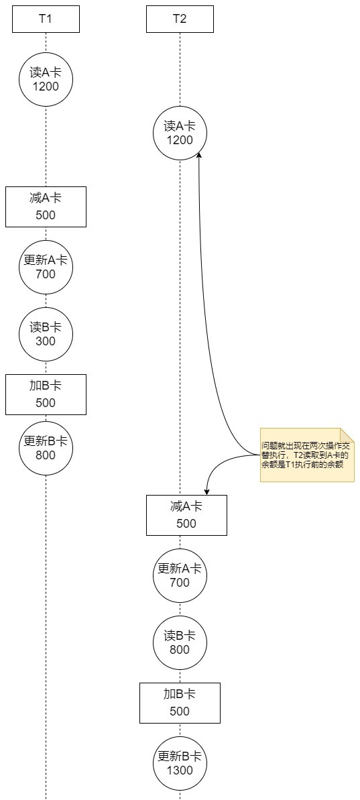

> 对于现实世界中状态转换对应的某些数据库操作来说，不仅要保证这些操作以原子性的方式执行完成，而且要保证其它的状态转换不会影响到本次状态转换，这个规则被称之为隔离性。

### 2.4. 持久性（Durability）

事务一旦提交，则其所做的修改就会永久保存到数据库中，是不可逆的。此时即使系统崩溃，已经提交的修改数据也不会丢失。

## 3. 事务隔离级别

### 3.1. 事务并发引发的3个问题

MySQL 是一个客户端/服务器架构的软件，对于同一个服务器来说，可以有若干个客户端与之连接，每个客户端与服务器连接上之后，就可以称之为一个会话（Session）。每个客户端都可以在自己的会话中向服务器发出请求语句，一个请求语句可能是某个事务的一部分，也就是对于服务器来说可能同时处理多个事务。

事务有一个称之为隔离性的特性，理论上在某个事务对某个数据进行访问时，其他事务应该进行排队，当该事务提交之后，其他事务才可以继续访问这个数据，这样的话并发事务的执行就变成了串行化执行。但是对串行化执行性能影响太大，既想保持事务的一定的隔离性，又想让服务器在处理访问同一数据的多个事务时性能尽量高些，当舍弃隔离性的时候，可能会带来以下一些数据问题。

#### 3.1.1. 脏读（Dirty Read）

一个事务读取到了另一个事务中修改但未提交的数据。

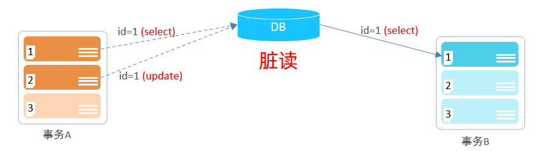

#### 3.1.2. 不可重复读（Non-Repeatable Read）

一个事务多次读取的数据内容不一致，称之为不可重复读。通常要求是同一个事务中多次读取时数据，结果都应该是一致的。一般是由于另一个事务 `update` 语句修改数据后并提交后引发。

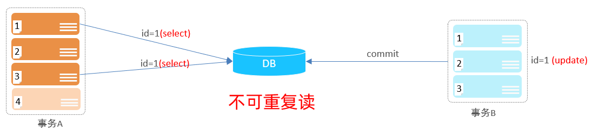

#### 3.1.3. 幻读（Phantom）

一个事务中多次查询的数据的记录数不一致。要求在一个事务多次读取的数据的数量是一致的，一般是由另一个事务的 `insert` 或 `delete` 引发。

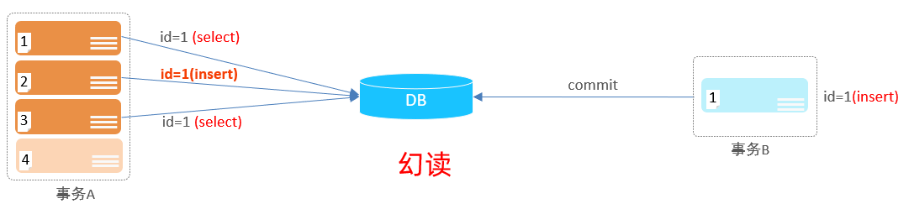

> 有一点值得注意：如果事务2是删除了符合的记录而不是插入新记录，事务1之后再根据相同的条件读取的记录变少了，这种现象算不算幻读呢？
>
> 在SQL92标准中，这个上面的示例是属于幻读，但在 MySQL 中规定这种现象不属于“幻读”，而是被归纳到“不可重复读”，幻读强调的是一个事务按照某个相同条件多次读取记录时，后读取时读到了之前没有读到的记录。

#### 3.1.4. 更新丢失(Lost Update)或脏写

当两个或多个事务选择同一行数据修改，有可能发生某个事务更新丢失问题，即最后的更新覆盖了由其他事务所做的更新。

例如：事务1读取某表中的数据`A=20`，事务2也读取`A=20`，事务1修改`A=A-1`，事务2也修改`A=A-1`，最终结果`A=19`，事务1的修改被丢失。

### 3.2. 隔离级别的作用

隔离级别就用来解决并发访问存在的问题。隔离级别越低，越严重的问题就越可能发生。在 SQL 标准中设立了4个隔离级别。

> 并发事务问题按严重性排序：`脏读 > 不可重复读 > 幻读`

#### 3.2.1. 常用数据库支持与默认的隔离级别

SQL92 标准的隔离级别分类表如下：

| 级别 |   名字   |     隔离级别      | 脏读 | 不可重复读 | 幻读 |               概述                |
| :--: | ------- | ---------------- | :--: | :-------: | :--: | -------------------------------- |
|  1   | 读未提交 | read uncommitted |  √   |     √     |  √   | 一个事务读取到了另一个事务未提交的数据 |
|  2   | 读已提交 | read committed   |  ×   |     √     |  √   | 一个事务读取到另一个事务已经提交的数据 |
|  3   | 可重复读 | repeatable read  |  ×   |     ×     |  √   | 同一个事务中多次读取数据内容一致      |
|  4   | 串行化   | serializable     |  ×   |     ×     |  ×   | 同时只能有一个事务执行。相当于单线程   |

> 注：√ 代表存在的问题。**一般只要求使用到级别3可重复读即可**。<font color=red>**MySQL 的隔离级别与 SQL92 标准有点差别，MySQL 的可重复读级别基本上已经解决了“幻读”的问题**</font>

不同的数据库厂商对 SQL 标准中规定的四种隔离级别支持不一样。

- Oracle 就只支持 READ COMMITTED 和 SERIALIZABLE 隔离级别。
- MySQL 虽然支持 4 种隔离级别，但与 SQL 标准中所规定的各级隔离级别允许发生的问题却有些出入，MySQL 在 REPEATABLE READ 隔离级别下，是可以禁止幻读问题的发生的。

不同数据库厂商默认的隔离级别

- MySQL: 可重复读（REPEATABLE READ）
- Qracle、SQL Server: 读已提交（READ COMMITTED）

#### 3.2.2. 设置事务的隔离级别

修改事务的隔离级别的命令：

```sql
SET [GLOBAL|SESSION] TRANSACTION ISOLATION LEVEL level;
```

其中的`level`可选值有4个：`REPEATABLE READ` | `READ COMMITTED` | `READ UNCOMMITTED` | `SERIALIZABLE`

设置事务的隔离级别的语句中，在`SET`关键字后可以放置`GLOBAL`关键字、`SESSION`关键字或者什么都不放，这样会对不同范围的事务产生不同的影响，具体如下：

- **使用 `GLOBAL` 关键字（在全局范围影响）**：

```sql
-- 示例：只对执行完该语句之后产生的会话起作用。当前已经存在的会话无效。
SET GLOBAL TRANSACTION ISOLATION LEVEL SERIALIZABLE;
```

- **使用 `SESSION` 关键字（在会话范围影响）**：

```sql
-- 对当前会话的所有后续的事务有效。该语句可以在已经开启的事务中间执行，但不会影响当前正在执行的事务。如果在事务之间执行，则对后续的事务有效。
SET SESSION TRANSACTION ISOLATION LEVEL SERIALIZABLE;
```

- **上述两个关键字都不用（只对执行语句后的下一个事务产生影响）**：

```sql
-- 只对当前会话中下一个即将开启的事务有效。下一个事务执行完后，后续事务将恢复到之前的隔离级别。该语句不能在已经开启的事务中间执行，会报错的。
SET TRANSACTION ISOLATION LEVEL SERIALIZABLE;
```

- **在服务器启动时想改变事务的默认隔离级别，修改启动参数`transaction-isolation`的值。**

```bash
# 默认隔离级别就从原来的REPEATABLE READ 变成了 SERIALIZABLE。
--transaction-isolation=SERIALIZABLE
```

#### 3.2.3. MySQL数据库查看当前事务的隔离级别的命令

想要查看当前会话默认的隔离级别可以通过查看系统变量`transaction_isolation`的值

```sql
-- 传统写法
SHOW VARIABLES LIKE 'transaction_isolation';

-- 简便的写法：5.7.20版本后
SELECT @@transaction_isolation;

-- 简便的写法：在 MySQL 5.7.20 的版本中引入来替换tx_isolation的，以前的版本将上述用到系统变量transaction_isolation 的地方替换为 tx_isolation。
SELECT @@tx_isolation;
```

## 4. MySQL 事务操作

### 4.1. 事务基础操作流程

1. 开启事务。任何一条DML语句(insert、update、delete)执行，标志事务的开启
> Notes: <font color=red>**开启一个新的事务，之前的事务会自动提交**</font>
2. 提交事务，将所有的DML语句操作历史记录和底层硬盘数据来一次同步。<font color=red>**一旦事务提交了，无法通过回滚撤消**</font>
3. 回滚事务，将所有的DML语句操作历史记录全部清空

### 4.2. 自动事务提交模式（MySQL 默认）

MySQL 默认是每一条 DML(增删改)语句都是一个单独的事务，每条语句都会自动开启一个事务，并且执行完毕后自动提交事务。也就是说，当执行完一条DML语句时，MySQL会立即隐式的通过 `commit` 提交事务。

### 4.3. 显式事务提交模式

#### 4.3.1. 控制事务方式1

MySQL中全局变量`autocommit`默认值是1，自动提交事务。通过以下语句可以查询当前事务的提交方式参数值：

```sql
select @@autocommit;
```

1. 设置全局开启/禁止提交事务（0 关闭，1 开启）。关闭自动提交后，需要手动提交事务

```sql
set @@autocommit = 0;
```

2. 提交事务

```sql
COMMIT;
```

3. 回滚事务

```sql
ROLLBACK;
```

> Notes: 此方式是修改了全局的事务的自动提交行为。若把默认的自动提交修改为了手动提交，此时往后执行的 DML 语句都不会提交，需要手动的执行提交操作。

#### 4.3.2. 控制事务方式2

1. 开启事务。

```sql
start transaction;
```

2. 提交事务

```sql
COMMIT;
```

3. 回滚事务

```sql
ROLLBACK;
```

> Notes: 此方式是开启一次性事务，针对本次一系列的操作。一旦开启事务，接下来的所有的SQL语句都是在同一个事务中，直到提交或回滚，该事务才会结束。

### 4.4. 隐式提交模式

当使用`START TRANSACTION`或者`BEGIN`语句开启了一个事务，或者把系统变量`autocommit`的值设置为`OFF`时，事务就不会进行自动提交，但是如果期间输入了某些语句之后就会MySQL会自动将事务提交，像输入了`COMMIT`语句一样，这种因为某些特殊的语句而导致事务提交的情况称为隐式提交。

#### 4.4.1. 执行DDL语句

执行了定义或修改数据库对象的数据定义语言（DDL），所谓的数据库对象，指的就是数据库、表、视图、存储过程等等这些东西。当使用`CREATE`、`ALTER`、`DROP`等语句去修改数据库对象时，就会隐式的提交前边语句所属于的事务

```sql
BEGIN;
SELECT ... # 事务中的一条语句
UPDATE ... # 事务中的一条语句
... # 事务中的其它语句
CREATE TABLE ... # 此语句会隐式的提交前边语句所属于的事务
```

#### 4.4.2. 隐式使用或修改 mysql 数据库中的表

当使用 `ALTER USER`、`CREATE USER`、`DROP USER`、`GRANT`、`RENAME USER`、`REVOKE`、`SET PASSWORD`等语句时也会隐式的提交前边语句所属于的事务。

#### 4.4.3. 事务控制或关于锁定的语句

- 在一个会话里，一个事务还没提交或者回滚时又使用 `START TRANSACTION` 或者 `BEGIN` 语句开启了另一个事务时，会隐式的提交上一个事务。

```sql
BEGIN;
SELECT ... # 事务中的一条语句
UPDATE ... # 事务中的一条语句
... # 事务中的其它语句
BEGIN; # 此语句会隐式的提交前边语句所属于的事务
```

- 当前的`autocommit`系统变量的值为`OFF`，然后手动把它修改为`ON`时，也会隐式的提交前边语句所属的事务。
- 使用`LOCK TABLES`、`UNLOCK TABLES` 等关于锁定的语句也会隐式的提交前边语句所属的事务。

#### 4.4.4. 加载数据的语句

使用 `LOAD DATA` 语句来批量往数据库中导入数据时，也会隐式的提交前边语句所属的事务。

#### 4.4.5. 关于 MySQL 复制的一些语句

使用`START SLAVE`、`STOP SLAVE`、`RESET SLAVE`、`CHANGE MASTER TO`等语句时也会隐式的提交前边语句所属的事务。

#### 4.4.6. 其它的相关语句

使用`ANALYZE TABLE`、`CACHE INDEX`、`CHECK TABLE`、`FLUSH`、`LOAD INDEX INTOCACHE`、`OPTIMIZE TABLE`、`REPAIR TABLE、RESET`等语句也会隐式的提交前边语句所属的事务。

### 4.5. 保存点

如果你开启了一个事务，执行了很多语句，忽然发现某条语句有点问题，使用 `ROLLBACK` 语句来让数据库状态恢复到事务执行之前的样子，然后一切从头再来，但是可能根据业务和数据的变化，不需要全部回滚。所以 MySQL 里提出了一个保存点（英文：savepoint）的概念，就是在事务对应的数据库语句中打几个点，在调用 `ROLLBACK` 语句时可以指定会滚到哪个点，而不是回到最初的原点。

#### 4.5.1. 基础语法

定义保存点的语法如下：

```sql
SAVEPOINT 保存点名称;
```

当想回滚到某个保存点时，可以使用下边这个语句（下边语句中的单词WORK 和 SAVEPOINT 是可有可无的）：

```sql
ROLLBACK TO [SAVEPOINT] 保存点名称;
```

删除某个保存点语句：

```sql
RELEASE SAVEPOINT 保存点名称;
```

> *注：很少会使用，通常在存储过程中有可能会用到*

#### 4.5.2. 保存点示例

```sql
-- 自动提交事务是开启的
show variables like '%autocommit%';
set autocommit=0;
insert into testdemo values(5,5,5);
savepoint order_exp;
insert into testdemo values(6,6,6);
savepoint order_exp_2;
insert into testdemo values(7,7,7);
savepoint s3;
select * from testdemo;
rollback to savepoint order_exp_2;
rollback;
```

### 4.6. 事务注意事项

可重复读（repeatable read）的隔离级别下使用了MVCC(multi-version concurrency control)机制，select 操作是快照读（历史版本）；insert、update 和 delete 等操作是当前读（当前版本）。

即当开启事务后，后面多次查询的数据均为首次查询时的快照数据，不会受其他后面提交事务的影响；而使用更新操作时，则会读取当前最新的数据，因此一般在事务更新数据，都尽量使用以下方式进行更新，

```sql
UPDATE account SET balance = balance - 50 WHERE	id = 1;
```

并且在此事务更新后，会为这条数据上行锁，此时其他事务是无法操作此条数据。

## 5. 事务使用的总结

### 5.1. 大事务的影响

- 并发情况下，数据库连接池容易被撑爆
- 锁定太多的数据，造成大量的阻塞和锁超时
- 执行时间长，容易造成主从延迟
- 回滚所需要的时间比较长
- undo log 膨胀
- 容易导致死锁

### 5.2. 事务优化

- 将查询等数据准备操作放到事务外
- 事务中避免远程调用，远程调用要设置超时，防止事务等待时间太久
- 事务中避免一次性处理太多数据，可以拆分成多个事务分次处理
- 更新等涉及加锁的操作尽可能放在事务靠后的位置
- 能异步处理的尽量异步处理
- 应用侧(业务代码)保证数据一致性，非事务执行

### 5.3. 事务问题定位

可以通过查询 MySQl 的系统数据库 `information_schema`.`innodb_trx`，查询指定执行耗时的事务信息

```sql
-- 查询执行时间超过2秒的事务，用于定位超长事务问题
SELECT
	*
FROM
	information_schema.innodb_trx
WHERE
	TIME_TO_SEC( timediff( now( ), trx_started ) ) > 2;
```

使用 `kill 事务对应的线程id` 命令强制结束事务，即上面语句查出结果里的 `trx_mysql_thread_id` 字段的值

## 6. 事务的底层原理

在事务的实现机制上，MySQL 采用的是 WAL（Write-ahead logging，预写式日志）机制来实现的。在使用 WAL 的系统中，所有的修改都先被写入到日志中，然后再被应用到系统中。通常包含 redo 和 undo 两部分信息。

- redo log 称为重做日志，每当有操作时，在数据变更之前将操作写入 redo log，这样当发生掉电之类的情况时系统可以在重启后继续操作。
- undo log 称为撤销日志，当一些变更执行到一半无法完成时，可以根据撤销日志恢复到变更之间的状态。

其中事务的原子性、一致性、持久化，实际上是由 InnoDB 中的两份日志来保证的，一份是 redo log 日志，一份是 undo log 日志。而持久性是通过数据库的锁，加上 MVCC 来保证的。


MySQL 中用 redo log 来在系统 Crash 重启之类的情况时修复数据（事务的持久性），而 undo log 来保证事务的原子性。

## 7. redo log（重做日志）

### 7.1. redo 日志的作用

InnoDB 存储引擎是以页为单位来管理存储空间，在进行的增删改查操作其实本质上都是在访问页面（包括读页面、写页面、创建新页面等操作）。而在访问页面之前，需要把在磁盘上的页缓存到内存中的 Buffer Pool，如果只在内存的 Buffer Pool 中修改了页面，假设在事务提交后突然发生了某个故障，导致内存中的数据都失效了，那么这个已经提交了的事务对数据库中所做的更改也就跟着丢失了。

如果在事务提交完成之前把该事务所修改的所有页面都刷新到磁盘，会有以下问题：

- 一个页面默认是 16KB 大小，只修改一个字节（或者一小部分内容）就要刷新 16KB 的数据，比较浪费。
- 一个事务可能包含很多语句，即使是一条语句也可能修改许多页面，该事务修改的这些页面可能并不相邻，这就意味着在将某个事务修改的 Buffer Pool 中的页面刷新到磁盘时，会出现大量的随机 IO，效率很慢。

为了已经提交了的事务对数据库中数据所做的修改永久生效，即使后来系统崩溃，在重启后也能把这种修改恢复出来。其实没有必要在每次事务提交时就把该事务在内存中修改过的全部页面刷新到磁盘，只需要把修改了内容记录下来即可。

> 如：某个事务将系统表空间中的第 100 号页面中偏移量为 1000 处的那个字节的值 1 改成 2

在事务提交时，把上述内容刷新到磁盘中，即使之后系统崩溃了，重启之后只要按照上述内容所记录的步骤重新更新一下数据页，那么该事务对数据库中所做的修改又可以被恢复出来，达到事务持久性的目的。因为在系统崩溃重启时需要按照上述内容所记录的步骤重新更新数据页，所以上述内容也被称之为重做日志，英文名为 redo log，也可以称之为 redo 日志。

使用此方式相比前端事务提交时将所有修改过的内存中的页面刷新到磁盘的方式有以下优势：

- **redo 日志占用的空间非常小**。存储表空间 ID、页号、偏移量以及需要更新的值所需的存储空间是很小的。
- **redo 日志是顺序写入磁盘的**。在执行事务的过程中，每执行一条语句，就可能产生若干条 redo 日志，这些日志是按照产生的顺序写入磁盘的，也就是使用顺序 IO。

该日志文件由两部分组成：**重做日志缓冲（redo log buffer）**以及**重做日志文件（redo log file）**，前者是在内存中，后者在磁盘中。当事务提交之后会把所有修改信息都存到该日志文件中，用于在刷新该页到磁盘，发生错误时，进行数据恢复使用。

### 7.2. redo log 关键参数

```sql
mysql> SHOW VARIABLES LIKE '%innodb_log_%';
+------------------------------------+----------+
| Variable_name                      | Value    |
+------------------------------------+----------+
| innodb_log_buffer_size             | 1048576  |
| innodb_log_checksums               | ON       |
| innodb_log_compressed_pages        | ON       |
| innodb_log_file_size               | 50331648 |
| innodb_log_files_in_group          | 2        |
| innodb_log_group_home_dir          | .\       |
| innodb_log_spin_cpu_abs_lwm        | 80       |
| innodb_log_spin_cpu_pct_hwm        | 50       |
| innodb_log_wait_for_flush_spin_hwm | 400      |
| innodb_log_write_ahead_size        | 8192     |
| innodb_log_writer_threads          | ON       |
+------------------------------------+----------+
```

通过以上 SQL 语句可以查询到 redo log 相关的关键参数，重点关注的参数如下：

- `innodb_log_buffer_size`：设置 redo log buffer 大小参数，默认16M ，最大值是4096M，最小值为1M。
- `innodb_log_group_home_dir`：设置 redo log 文件存储位置参数，默认值为"`./`"，即 innodb 数据文件存储位置，其中 redo log 文件如：ib_logfile0、ib_logfile1。（*注：mysql 8.0 版本后名称好像不一样了*）
- `innodb_log_files_in_group`：设置 redo log 文件的个数，命名方式如: ib_logfile0, iblogfile1,...iblogfileN。默认2个，最大100个。
- `innodb_log_file_size`：设置单个 redo log 文件大小，默认值为48M，最大值为512G。注意最大值指的是整个 redo log 系列文件之和，即(`innodb_log_files_in_group * innodb_log_file_size`)不能大于最大值512G。

> Notes: 后面会结合具体场景分析说明配置的作用。

### 7.3. redo 日志格式

redo 日志本质上只是记录了一下事务对数据库的修改内容。 InnoDB 们针对事务对数据库的不同修改场景定义了多种类型的 redo 日志，但是绝大部分类型的 redo 日志都有下边这种通用的结构：


各个部分的详细释义如下：

- `type`：该条 redo 日志的类型，redo 日志设计大约有 53 种不同的类型日志。
- `space ID`：表空间 ID。
- `page number`：页号。
- `data`：该条 redo 日志的具体内容。

#### 7.3.1. 简单 redo 日志类型

InnoDB 的记录行格式，如果没有为某个表显式的定义主键，并且表中也没有定义`unique`键，那么 InnoDB 会自动的为表添加一个称之为 row_id 的隐藏列作为主键。为这个 row_id 隐藏列赋值的方式如下：

服务器会在内存中维护一个全局变量，每当向某个包含隐藏的 row_id 列的表中插入一条记录时，就会把该变量的值当作新记录的 row_id 列的值，并且把该变量自增 1。每当这个变量的值为 256 的倍数时，就会将该变量的值刷新到系统表空间的页号为 7 的页面中一个称之为 Max Row ID 的属性处。

当系统启动时，会将上边提到的 Max Row ID 属性加载到内存中，将该值加上 256 之后赋值给前面提到的全局变量。

Max Row ID 属性占用的存储空间是 8 个字节，当某个事务向某个包含 row_id 隐藏列的表插入一条记录，并且为该记录分配的 row_id 值为 256 的倍数时，就会向系统表空间页号为 7 的页面的相应偏移量处写入 8 个字节的值。

实际上写入操作是在 Buffer Pool 中完成的，需要为这个页面的修改记录一条 redo 日志，以便在系统崩溃后能将已经提交的该事务对该页面所做的修改恢复出来。这种情况下对页面的修改是极其简单的，redo 日志中只需要记录一下在某个页面的某个偏移量处修改了几个字节的值，具体被修改的内容是啥就好了，InnoDB 把这种极其简单的 redo 日志称之为物理日志，并且根据在页面中写入数据的多少划分了几种不同的 redo 日志类型：

- MLOG_1BYTE（type 字段对应的十进制数字为 1）：表示在页面的某个偏移量处写入 1 个字节的 redo 日志类型。
- MLOG_2BYTE（type 字段对应的十进制数字为 2）：表示在页面的某个偏移量处写入 2 个字节的 redo 日志类型。
- MLOG_4BYTE（type 字段对应的十进制数字为 4）：表示在页面的某个偏移量处写入 4 个字节的 redo 日志类型。
- MLOG_8BYTE（type 字段对应的十进制数字为 8）：表示在页面的某个偏移量处写入 8 个字节的 redo 日志类型。
- MLOG_WRITE_STRING（type 字段对应的十进制数字为 30）：表示在页面的某个偏移量处写入一串数据。

Max Row ID 属性实际占用 8 个字节的存储空间，所以在修改页面中的该属性时，会记录一条类型为 MLOG_8BYTE 的 redo 日志，MLOG_8BYTE 的 redo 日志结构如下所示：


> offset 代表在页面中的偏移量。
>
> 其余 MLOG_1BYTE、MLOG_2BYTE、MLOG_4BYTE 类型的 redo 日志结构和MLOG_8BYTE 的类似，只不过具体数据中包含对应个字节的数据而已。MLOG_WRITE_STRING 类型的 redo 日志表示写入一串数据，但是因为不能确定写入的具体数据占用多少字节，所以需要在日志结构中还会多一个 len 字段。

#### 7.3.2. 复杂 redo 日志类型

有些情况，执行一条语句会修改非常多的页面，包括系统数据页面和用户数据页面（用户数据指的就是聚簇索引和二级索引对应的B+树）。如：以 INSERT 语句为例，它除了要向 B+树的页面中插入数据，也可能更新系统数据 Max Row ID 的值。表中包含多少个索引，一条 INSERT 语句就可能更新多少棵 B+树。

针对某一棵 B+树来说，既可能更新叶子节点页面，也可能更新非叶子节点页面，也可能创建新的页面（在该记录插入的叶子节点的剩余空间比较少，不足以存放该记录时，会进行页面的分裂，在非叶子节点页面中添加目录项记录）。

在语句执行过程中，除了 INSERT 语句对所有页面的修改都保存到 redo 日志中去。一个数据页中除了存储实际的记录之后，还有什么 File Header、Page Header、Page Directory 等等部分，所以每往叶子节点代表的数据页里插入一条记录时，还有其他很多地方会跟着更新。

> 比如：可能更新 Page Directory 中的槽信息、Page Header 中的各种页面统计信息，比如槽数量可能会更改，还未使用的空间最小地址可能会更改，本页面中的记录数量可能会更改，各种信息都可能会被修改，同时数据页里的记录是按照索引列从小到大的顺序组成一个单向链表的，每插入一条记录，还需要更新上一条记录的记录头信息中的 next_record 属性来维护这个单向链表。

记录复杂的写入数据，有两种解决方案：

1. 方案一：在每个修改的地方都记录一条 redo 日志
2. 方案二：将整个页面的第一个被修改的字节到最后一个修改的字节之间所有的数据当成是一条物理 redo 日志中的具体数据。

这些类型的 redo 日志既包含物理层面的意思，也包含逻辑层面的意思，具体指：

- 物理层面看，这些日志都指明了对哪个表空间的哪个页进行了修改。
- 逻辑层面看，在系统崩溃重启时，并不能直接根据这些日志里的记载，将页面内的某个偏移量处恢复成某个数据，而是需要调用一些事先准备好的函数，执行完这些函数后才可以将页面恢复成系统崩溃前的样子。

一个 redo 日志类型而只是把在本页面中变动（比如插入、修改）一条记录所有必备的要素记了下来，之后系统崩溃重启时，服务器会调用相关向某个页面变动（比如插入、修改）一条记录的那个函数，而 redo 日志中的那些数据就可以被当成是调用这个函数所需的参数，在调用完该函数后，页面中的相关值也就都被恢复到系统崩溃前的值。

<font color=red>**总结：redo 日志会把事务在执行过程中对数据库所做的所有修改都记录下来，在之后系统崩溃重启后可以把事务所做的任何修改都恢复出来。**</font>

### 7.4. Mini-Transaction

#### 7.4.1. Mini-Transaction 的概念

MySQL 把对底层页面中的一次原子访问的过程称之为一个 Mini-Transaction。*比如：修改一次 Max Row ID 的值算是一个 Mini-Transaction，向某个索引对应的 B+树中插入一条记录的过程也算是一个Mini-Transaction。*

一个 Mini-Transaction 可以包含一组 redo 日志，在进行崩溃恢复时这一组 redo 日志作为一个不可分割的整体。

一个事务可以包含若干条语句，每一条语句其实是由若干个 Mini-Transaction 组成，每一个 Mini-Transaction 又可以包含若干条 redo 日志，最终形成了一个树形结构。

#### 7.4.2. 以组的形式写入 redo 日志

一条 INSERT 语句可能会修改很多的页面，对这些页面的更改都发生在 Buffer Pool 中，所以在修改完页面之后，需要记录一下相应的 redo 日志。而执行语句的过程中产生的 redo 日志被 InnoDB 人为的划分成了若干个不可分割的组。

以向某个索引对应的 B+树插入一条记录为例，在向 B+树中插入这条记录之前，需要先定位到这条记录应该被插入到哪个叶子节点代表的数据页中，定位到具体的数据页之后，有两种可能的情况：

- 情况一：该数据页的剩余的空闲空间充足，足够容纳这一条待插入记录，这种情况处理就很简单，直接把记录插入到这个数据页中，记录一条 redo 日志即可，把这种情况称之为**乐观插入**。
- 情况二：该数据页剩余的空闲空间不足。此时处理相对比较复杂，在这个处理过程要对多个页面进行修改，也就意味着会产生很多条 redo 日志，把这种情况称之为**悲观插入**。这种情况需要进行页的分裂操作：
    1. 新建一个叶子节点；
    2. 然后把原先数据页中的一部分记录复制到这个新的数据页中
    3. 然后再把记录插入进去，把这个叶子节点插入到叶子节点链表中
    4. 非叶子节点中添加一条目录项记录指向这个新创建的页面
    5. 非叶子节点空间不足，继续分裂

注意：在页的分裂过程中，由于需要新申请数据页，还需要改动一些系统页面，比方说要修改各种段、区的统计信息信息，各种链表的统计信息，也会产生redo日志。当然在乐观插入时也可能产生多条 redo 日志。

InnoDB 认为向某个索引对应的 B+树中插入一条记录的这个过程必须是原子的，不能说插了一半之后就停止了。redo 日志是为了在系统崩溃重启时恢复崩溃前的状态，如果在悲观插入的过程中只记录了一部分 redo 日志，那么在系统崩溃重启时会将索引对应的 B+树恢复成一种不正确的状态。

所以规定在执行这些需要保证原子性的操作时必须以组的形式来记录的 redo 日志，在进行系统崩溃重启恢复时，针对某个组中的 redo 日志，要么把全部的日志都恢复掉，要么一条也不恢复。在实现上，根据多个 redo 日志的不同，使用了特殊的 redo 日志类型作为组的结尾，来表示一组完整的 redo 日志。

### 7.5. redo 日志的写入过程

#### 7.5.1. redo log block 和日志缓冲区

InnoDB 为了更好的进行系统崩溃恢复，把通过 Mini-Transaction 生成的 redo 日志都放在了大小为 512 字节的块（block）中

MySQL 为了解决磁盘速度过慢的问题而引入了 Buffer Pool。同理，写入 redo 日志时也不能直接直接写到磁盘上，实际上在服务器启动时就向操作系统申请了一大片称之为 redo log buffer 的连续内存空间，翻译成中文就是 redo 日志缓冲区，也可以简称为 log buffer。这片内存空间被划分成若干个连续的 redo log block，可以通过启动参数 `innodb_log_buffer_size` 来指定 log buffer 的大小，该启动参数的默认值为 16MB。

向 log buffer 中写入 redo 日志的过程是顺序的，也就是先往前边的 block 中写，当该 block 的空闲空间用完之后再往下一个 block 中写。

Mini-Transaction 执行过程中可能产生若干条 redo 日志，这些 redo 日志是一个不可分割的组，所以其实并不是每生成一条 redo 日志，就将其插入到 log buffer 中，而是每个 Mini-Transaction 运行过程中产生的日志先暂时存到一个地方，当该 Mini-Transaction 结束的时候，将过程中产生的一组 redo 日志再全部复制到 log buffer 中。

#### 7.5.2. redo 日志刷盘时机

Mini-Transaction 运行过程中产生的一组 redo 日志是在 Mini-Transaction 结束时会被复制到 log buffer 中，但在一些情况下它们会被刷新到磁盘里，比如：

- log buffer 空间不足时。log buffer 的大小是有限的（通过系统变量 innodb_log_buffer_size 指定），如果不停的往这个有限大小的 log buffer 里塞入日志，很快它就会被填满。InnoDB 认为如果当前写入 log buffer 的 redo 日志量已经占满了 log buffer 总容量的大约一半左右，就需要把这些日志刷新到磁盘上。
- 事务提交时。使用 redo 日志记录事务的操作主要是因为它占用的空间少，并且是顺序写，在事务提交时可以不把修改过的 Buffer Pool 页面刷新到磁盘，但是为了保证持久性，必须要把修改这些页面对应的 redo 日志刷新到磁盘
- MySQL 后台有一个线程，大约每秒都会刷新一次 log buffer 中的 redo 日志到磁盘
- 正常关闭服务器时

#### 7.5.3. redo 日志文件组

使用以下命令可以查看 MySQL 的数据目录，其中默认有两个名为 `ib_logfile0` 和 `ib_logfile1` 的文件，log buffer 中的日志默认情况下就是刷新到这两个磁盘文件中。

```sql
-- 查询数据库的数据目录
SHOW VARIABLES LIKE 'datadir';
```

修改以下启动参数来设置 redo 日志文件

- `innodb_log_group_home_dir`，该参数指定了 redo 日志文件所在的目录，默认值就是当前的数据目录
- `innodb_log_file_size`，该参数指定了每个 redo 日志文件的大小，默认值为 48MB
- `innodb_log_files_in_group`，该参数指定 redo 日志文件的个数，默认值为 2，最大值为 100

磁盘上的 redo 日志文件可以不只一个，而是以一个日志文件组的形式出现的。这些文件以 `ib_logfile[数字]`（数字可以是 0、1、2...）的形式进行命名。在将 redo 日志写入日志文件组时，是从 `ib_logfile0` 开始写，如果 `ib_logfile0` 写满了，就接着 `ib_logfile1` 写，同理，`ib_logfile1` 写满了就去写 `ib_logfile2`，依此类推。如果写满最后一个文件，就会重新转到 `ib_logfile0` 继续写。

#### 7.5.4. redo 日志文件格式

log buffer 本质上是一片连续的内存空间，被划分成了若干个 512 字节大小的 block。将 log buffer 中的 redo 日志刷新到磁盘的本质就是把 block 的镜像写入日志文件中，所以 redo 日志文件其实也是由若干个 512 字节大小的 block 组成。

redo 日志文件组中的每个文件大小都一样，格式也一样，都是由两部分组成：前 2048 个字节，也就是前 4 个 block 是用来存储一些管理信息的。从第 2048 字节往后是用来存储 log buffer 中的 block 镜像的。

### 7.6. Log Sequence Number

自MySQL系统开始运行，就不断的在修改页面，Redo 日志的量在不断的递增，InnoDB 为记录已经写入的 redo 日志量，设计了一个称之为 Log Sequence Number (日志序列号，简称 LSN)的全局变量。规定初始 LSN 的值为 8704（也就是一条 redo 日志也没写入时，LSN 的值为 8704）。

在向 log buffer 中写入 redo 日志时不是一条一条写入的，而是以一个 Mini-Transaction 生成的一组 redo 日志为单位进行写入的。从上边的描述中可以看出来，每一组由 Mini-Transaction 生成的 redo 日志都有一个唯一的 LSN 值与其对应，LSN 值越小，说明 redo 日志产生的越早。

#### 7.6.1. flushed_to_disk_lsn

InnoDB 中有一个 `buf_next_to_write` 的全局变量，标记当前 log buffer 中已经有哪些日志被刷新到磁盘中了。

LSN 是表示当前系统中写入的 redo 日志量，这包括了写到 log buffer 而没有刷新到磁盘的日志，相应的，InnoDB 也有一个表示刷新到磁盘中的 redo 日志量的全局变量 `flushed_to_disk_lsn`。

系统第一次启动时，`flushed_to_disk_lsn`变量的值和初始的 lsn 值是相同的，都是 8704。随着系统的运行，redo 日志被不断写入 log buffer，但是并不会立即刷新到磁盘，lsn 的值就和 `flushed_to_disk_lsn` 的值也不断变化

当有新的 redo 日志写入到 log buffer 时，首先 LSN 的值会增长，但`flushed_to_disk_lsn`不变，随后随着不断有log buffer中的日志被刷新到磁盘上，`flushed_to_disk_lsn`的值也跟着增长。如果两者的值相同时，说明 log buffer 中的所有 redo 日志都已经刷新到磁盘中了。

> Tips: 应用程序向磁盘写入文件时其实是先写到操作系统的缓冲区中去，如果某个写入操作要等到操作系统确认已经写到磁盘时才返回，那需要调用一下操作系统提供的 `fsync` 函数。其实只有当系统执行了 `fsync` 函数后，`flushed_to_disk_lsn` 的值才会跟着增长，当仅仅把 log buffer 中的日志写入到操作系统缓冲区却没有显式的刷新到磁盘时，另外的一个名为 `write_lsn` 的值跟着增长。当然系统的 LSN 值远不止前面描述的 lsn，还有很多。

#### 7.6.2. 查看系统中的各种 LSN 值

查看当前 InnoDB 存储引擎中的各种 LSN 值的情况

```sql
SHOW ENGINE INNODB STATUS;
```

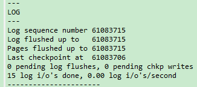

- `Log sequence number`：代表系统中的 lsn 值，也就是当前系统已经写入的 redo日志量，包括写入 log buffer 中的日志。
- `Log flushed up to`：代表 flushed_to_disk_lsn 的值，也就是当前系统已经写入磁盘的 redo 日志量。
- `Pages flushed up to`：代表 flush 链表中被最早修改的那个页面对应的 oldest_modification 属性值。
- `Last checkpoint at`：当前系统的 checkpoint_lsn 值。

### 7.7. innodb_flush_log_at_trx_commit 参数

为了保证事务的持久性，用户线程在事务提交时需要将该事务执行过程中产生的所有 redo 日志都刷新到磁盘上，但这样会很明显的降低数据库性能。

MySQL 提供了控制 redo log 的写入策略的系统变量参数 `innodb_flush_log_at_trx_commit`，该变量有 3 个可选的值：

- 当该系统变量值为`0`时，表示在事务提交时不立即将 redo log buffer 中向磁盘中同步 redo 日志，这个任务是交给后台线程做的。数据库宕机可能会丢失数据。
- 当该系统变量值为`1`时（默认值），表示在事务提交时需要将 redo 日志同步持久化到磁盘。此方式可以保证事务的持久性，数据最安全，不会因为数据库宕机丢失数据，但是效率稍微差一点，线上系统推荐这个设置。
- 当该系统变量值为`2`时，表示在事务提交时需要将 redo 日志写到操作系统的缓冲区（page cache）中，但并不需要马上将日志真正的刷新到磁盘。*这种情况如果数据库宕机，事务的持久性还是可以保证的，不会丢失数据的；但如果操作系统宕机了，page cache 里的数据还没来得及写入磁盘文件的话，那就不能保证持久性了，会丢失数据*。

#### 7.7.1. redo log 写入策略流程图

InnoDB 有一个后台线程，每隔 1 秒，就会把 redo log buffer 中的日志，调用 操作系统函数 write 写到文件系统的 page cache，然后调用操作系统函数 fsync 持久化到磁盘文件。 

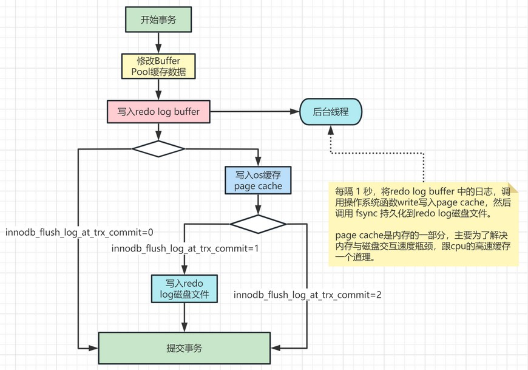

#### 7.7.2. 查询与设置参数

查询看当前事务 redo 日志刷盘参数

```sql
mysql> show variables like 'innodb_flush_log_at_trx_commit';
+--------------------------------+-------+
| Variable_name                  | Value |
+--------------------------------+-------+
| innodb_flush_log_at_trx_commit | 1     |
+--------------------------------+-------+
1 row in set (0.02 sec)
```

设置 `innodb_flush_log_at_trx_commit` 参数值(也可以在 my.ini 或 my.cnf 文件里配置)：

```sql
set global innodb_flush_log_at_trx_commit=1;  
```

### 7.8. 崩溃后的恢复

#### 7.8.1. 恢复机制

MySQL 可以根据 redo 日志中的各种 LSN 值，来确定恢复的起点和终点。然后将 redo 日志中的数据，以哈希表的形式，将一个页面下的放到哈希表的一个槽中。之后就可以遍历哈希表，因为对同一个页面进行修改的 redo 日志都放在了一个槽里，所以可以一次性将一个页面修复好（避免了很多读取页面的随机 IO）。并且通过各种机制，避免无谓的页面修复，比如已经刷新的页面，进而提升崩溃恢复的速度

#### 7.8.2. 崩溃后的恢复为什么不用 binlog？

1. redo log 与 binlog 两者使用方式不一样。binlog 会记录表所有更改操作，包括更新删除数据，更改表结构等等，主要用于人工恢复数据；而 redo log 对于用户是不可见的，它是 InnoDB 用于保证crash-safe 能力的，也就是在事务提交后 MySQL 崩溃的话，可以保证事务的持久性，即事务提交后其更改是永久性的。
2. redo log 是 InnoDB 引擎特有的；binlog 是 MySQL 的 Server 层实现的，所有引擎都可以使用。
3. redo log 是物理日志，记录的是“在某个数据页上做了什么修改”，恢复的速度更快；binlog 是逻辑日志，记录的是这个语句的原始逻辑，比如“给ID=2为的记录的c字段加1”
4. redo log 是“循环写”的日志文件，redo log 只会记录未刷盘的日志，已经刷入磁盘的数据都会从 redo log 这个有限大小的日志文件里删除。binlog 是追加日志，保存的是全量的日志。
5. **重点**：当数据库crash（崩溃）后，想要恢复未刷盘但已经写入 redo log 和 binlog 的数据到内存时，binlog 是无法恢复的。虽然 binlog 拥有全量的日志，但没有一个标志让 innoDB 判断哪些数据已经入表(写入磁盘)，哪些数据还没有。

> 比如，binlog 记录了两条日志：
>
> - 给 ID=2 这一行的 c 字段加 1
> - 给 ID=2 这一行的 c 字段加 1
>
> 在记录 1 入表后，记录 2 未入表时，数据库 crash。重启后，只通过 binlog 数据库无法判断这两条记录哪条已经写入磁盘，哪条没有写入磁盘，不管是两条都恢复至内存，还是都不恢复，对 ID=2 这行数据来说，都不对。
>
> 但 redo log 不一样，只要刷入磁盘的数据，都会从 redo log 中抹掉，数据库重启后，直接把 redo log 中的数据都恢复至内存就可以了。

## 8. undo log（撤销日志）

InnoDB 对 undo log 文件的管理采用段的方式，也就是回滚段（rollback segment）。每个回滚段记录了 1024 个 undo log segment ，每个事务只会使用一个 undo log segment。

MySQL 5.5 版本，只有一个回滚段，最大同时支持的事务数量为1024个。从 MySQL 5.6 版本开始，InnoDB 支持最大 128 个回滚段，故其支持同时在线的事务限制提高到了 `128*1024`。

### 8.1. 查询 undo log 参数

```sql
mysql> SHOW VARIABLES LIKE '%innodb_undo_%';
+--------------------------+-------+
| Variable_name            | Value |
+--------------------------+-------+
| innodb_undo_directory    | .\    |
| innodb_undo_log_encrypt  | OFF   |
| innodb_undo_log_truncate | ON    |
| innodb_undo_tablespaces  | 2     |
+--------------------------+-------+
```

参数说明：

- `innodb_undo_directory`：设置 undo log 文件所在的路径。该参数的默认值为"`./`"，即 innodb 数据文件存储位置，目录下 ibdata1 文件就是 undo log 存储的位置。
- `innodb_undo_logs`：设置 undo log 文件内部回滚段的个数，默认值为 128。
- `innodb_undo_tablespaces`：设置 undo log 文件的数量，这样回滚段可以较为平均地分布在多个文件中。设置该参数后，会在路径 `innodb_undo_directory` 看到 undo 为前缀的文件。

### 8.2. 事务回滚

事务需要保证原子性，要么全部成功，要么全部失败。比如：

1. 事务执行过程中可能遇到各种错误，比如服务器本身的错误，操作系统错误，甚至是突然断电导致的错误。
2. 在事务执行过程中手动输入 `ROLLBACK` 语句结束当前的事务的执行。

以上情况都会导致事务执行到一半就结束。为了保证事务的原子性，需要把东西改回原先的样子，这个过程就称之为回滚（英文名：rollback）

每当要对一条记录做改动时（改动是指 `INSERT`、`DELETE`、`UPDATE`等），都需要把回滚时所需的内容都给记录下来。例如：

- 插入一条记录时，至少要把这条记录的主键值记下来，之后回滚的时候只需要把这个主键值对应的记录删掉。
- 删除了一条记录，至少要把这条记录中的内容都记下来，这样之后回滚时再把由这些内容组成的记录插入到表中。
- 修改了一条记录，至少要把修改这条记录前的旧值都记录下来，这样之后回滚时再把这条记录更新为旧值。

**为了回滚而记录的这些东西称之为撤销日志，英文名为 undo log（undo日志）。这里需要注意的一点是，由于查询操作（`SELECT`）并不会修改任何用户记录，所以在查询操作执行时，并不需要记录相应的 undo 日志**。在InnoDB中，不同类型的操作产生的 undo 日志的格式也是不同的

### 8.3. 事务ID

#### 8.3.1. 给事务分配 id 的时机

一个事务可以是一个只读事务，或者是一个读写事务。

- 开启一个只读事务

```sql
START TRANSACTION READ ONLY;
```

- 开启一个读写事务

```sql
START TRANSACTION READ WRITE;

-- 以下方式开启的事务默认也算是读写事务。
BEGIN;
START TRANSACTION;
```

如果某个事务执行过程中对某个表执行了增、删、改操作，那么 InnoDB 存储引擎就会给它分配一个独一无二的事务 id，分配方式如下：

- 对于只读事务来说，只有在它第一次对某个用户创建的临时表执行增、删、改操作时才会为这个事务分配一个事务 id，否则的话是不分配事务 id 的。
- 对于读写事务来说，只有在它第一次对某个表（包括用户创建的临时表）执行增、删、改操作时才会为这个事务分配一个事务 id，否则的话也是不分配事务id 的。

> *注：上面描述的事务id分配策略是针对 MySQL 5.7 而言，以前版本的分配方式可能不同。*

#### 8.3.2. 事务 id 生成机制

事务 id 本质上就是一个数字。分配策略和隐藏列 row_id（当用户没有为表创建主键和 UNIQUE 键时 InnoDB 自动创建的列）的分配策略大致相同。具体策略如下：

服务器会在内存中维护一个全局变量，每当需要为某个事务分配一个事务id时，就会把该变量的值当作事务id分配给该事务，并且把该变量自增1。

每当这个变量的值为 256 的倍数时，就会将该变量的值刷新到系统表空间的页号为 5 的页面中一个称之为 Max Trx ID 的属性处，这个属性占用 8 个字节的存储空间。

当系统下一次重新启动时，会将上边提到的 Max Trx ID 属性加载到内存中，将该值加上 256 之后赋值给我们前边提到的全局变量（因为在上次关机时该全局变量的值可能大于 Max Trx ID 属性值）。

这样就可以保证整个系统中分配的事务 id 值是一个递增的数字。先被分配id 的事务得到的是较小的事务 id，后被分配 id 的事务得到的是较大的事务 id。

### 8.4. 隐藏列

聚簇索引的记录除了会保存完整的用户数据以外，而且还会自动添加名为 trx_id、roll_pointer 的隐藏列，如果用户没有在表中定义主键以及 UNIQUE 键，还会自动添加一个名为 row_id 的隐藏列。

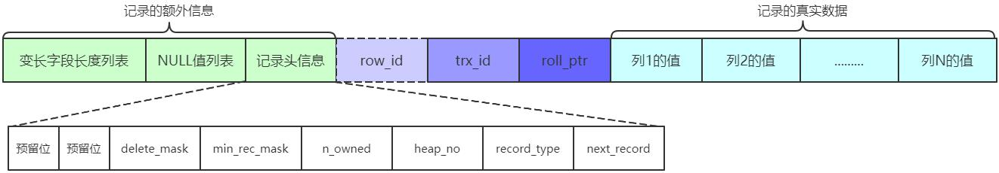

> 其中的 trx_id 列就是某个对这个聚簇索引记录做改动的语句（INSERT、DELETE、UPDATE 操作）所在的事务对应的事务 id

隐藏字段及其含义分别是：

|   隐藏字段   |                              含义                              |
| ----------- | -------------------------------------------------------------- |
| DB_TRX_ID   | 最近修改事务ID，记录插入这条记录或最后一次修改该记录的事务ID         |
| DB_ROLL_PTR | 回滚指针，指向这条记录的上一个版本，用于配合undo log，指向上一个版本 |
| DB_ROW_ID   | 隐藏主键，如果表结构没有指定主键，将会生成该隐藏字段                 |

### 8.5. undo 日志的格式

InnoDB 存储引擎在实际进行增、删、改记录时，都需要记录对应的 undo 日志。一般每1条记录的改动都对应1条undo日志，但在某些更新记录操作中，可能会对应2条undo日志

一个事务在执行过程中涉及新增、删除、更新若干条记录，也就是说需要记录很多条对应的 undo 日志，这些 undo 日志会被从0开始编号，也就是说根据生成的顺序分别被称为第0号undo日志、第1号undo日志、...、第n号undo日志等，这个编号也被称之为undo no。

undo 日志是被记录到类型为`FIL_PAGE_UNDO_LOG`的页面中。这些页面可以从系统表空间中分配，也可以从一种专门存放 undo 日志的表空间，也就是所谓的 undo tablespace 中分配。

#### 8.5.1. INSERT 操作对应的 undo 日志

##### 8.5.1.1. 基础处理流程

InnoDB 的设计了一个类型为`TRX_UNDO_INSERT_REC`的undo日志。当插入记录后回滚时，只需要将该记录删除即可，所以undo日志主要是记录该记录的主键信息。

- 当主键只包含一个列，类型为`TRX_UNDO_INSERT_REC`的undo日志中只需要记录该列占用的存储空间大小和真实值
- 当主键包含多个列，则需要记录每个列占用的存储空间大小和对应的真实值

当向某个表中插入一条记录时，实际上需要向聚簇索引和所有的二级索引都插入一条记录。不过记录 undo 日志时，只需要考虑向聚簇索引插入记录时的情况，因为聚簇索引记录和二级索引记录是一一对应的，在回滚插入操作时，只需要知道这条记录的主键信息，然后根据主键信息做对应的删除操作，做删除操作时就会顺带着把所有二级索引中相应的记录也删除掉。*DELETE 操作和 UPDATE 操作对应的 undo 日志也都是针对聚簇索引记录而言的*。

##### 8.5.1.2. roll_pointer 的作用

roll_pointer 本质上就是一个指向记录对应的 undo 日志的一个指针。比如向表里插入了 2 条记录，每条记录都有与其对应的一条 undo 日志。记录被存储到了类型为`FIL_PAGE_INDEX`的页面中（数据页），undo 日志被存放到了类型为`FIL_PAGE_UNDO_LOG`的页面中。

#### 8.5.2. DELETE 操作对应的 undo 日志

##### 8.5.2.1. 基础处理流程

插入到页面中的记录会根据记录头信息中的 next_record 属性组成一个单向链表，该链表称之为**正常记录链表**。删除的记录也会根据记录头信息中的 next_record 属性组成一个链表，只是这个链表中的记录占用的存储空间可以被重新利用，所以这个链表也称为**垃圾链表**。

Page Header 部分有一个称之为`PAGE_FREE`的属性，它指向由被删除记录组成的垃圾链表中的头节点。

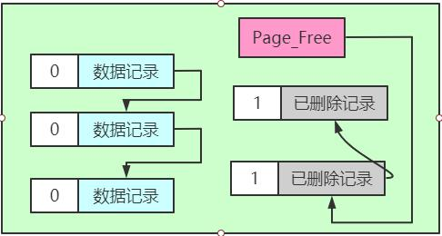

> 注：上图示例只把记录的 delete_mask 标志位展示了出来

上面示例，正常记录链表中包含了 3 条正常记录，垃圾链表里包含了 2 条已删除记录。页面的 Page Header 部分的 PAGE_FREE 属性的值代表指向垃圾链表头节点的指针。假设使用 DELETE 语句删除正常记录链表中的最后一条记录，该删除的过程需要经历两个阶段：

- 阶段一：将记录的`delete_mask`标识位设置为1，这个阶段称之为`delete mark`。正常记录链表中的最后一条记录的`delete_mask`值被设置为 1，但是并没有被加入到垃圾链表。也就是此时记录处于一个中间状态。在删除语句所在的事务提交之前，被删除的记录一直都处于这种所谓的中间状态。

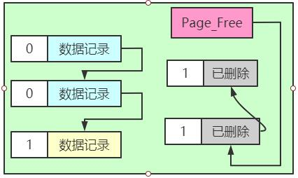

- 阶段二：当该删除语句所在的事务提交之后，会有专门的线程来真正删除记录。所谓真正的删除就是把该记录从正常记录链表中移除，并且加入到垃圾链表中，然后还要调整一些页面的其他信息，比如页面中的用户记录数量 PAGE_N_RECS、上次插入记录的位置 PAGE_LAST_INSERT、垃圾链表头节点的指针 PAGE_FREE、页面中可重用的字节数量 PAGE_GARBAGE、还有页目录的一些信息等等。这个阶段称之为 purge。

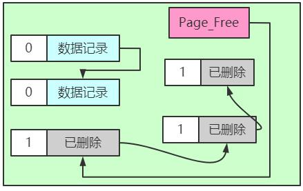

在阶段二执行完后，这条记录就算是真正的被删除。这条已删除记录占用的存储空间也可以被重新利用。

在删除语句所在的事务提交之前，只会经历阶段一，也就是 delete mark 阶段（提交之后就不用回滚了，所以只需考虑对删除操作的阶段一做的影响进行回滚）。InnoDB 中就会产生一种称之为`TRX_UNDO_DEL_MARK_REC`类型的 undo 日志。

##### 8.5.2.2. 版本链

在对一条记录进行 delete mark 操作前，需要把该记录的旧的 trx_id 和 roll_pointer 隐藏列的值都给记到对应的 undo 日志中来，就是图中显示的 old trx_id 和 old roll_pointer 属性。这样有一个好处，那就是可以通过 undo 日志的 old roll_pointer 找到记录在修改之前对应的 undo 日志。比方说在一个事务中，先插入了一条记录，然后又执行对该记录的删除操作，这个过程的示意图如下：

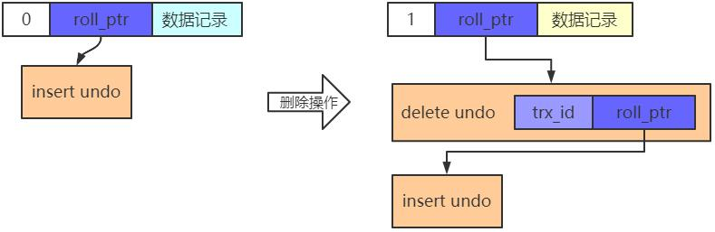

执行完 delete mark操作后，它对应的 undo日志和 INSERT 操作对应的 undo 日志就串成了一个链表。这个链表就称之为版本链。

#### 8.5.3. UPDATE 操作对应的 undo 日志

在执行 UPDATE 语句时，InnoDB 对更新主键和不更新主键这两种情况有不同的处理方案

##### 8.5.3.1. 不更新主键的情况

在不更新主键的情况下，又可以细分为被更新的列占用的存储空间不发生变化和发生变化的情况。

<font color=blue>**就地更新（in-place update）**</font>

更新记录时，<font color=red>**对于被更新的每个列来说，如果更新后的列和更新前的列占用的存储空间都一样大**</font>，那么就可以进行就地更新，也就是直接在原记录的基础上修改对应列的值。需要注意的一点是，如果有任何一个被更新的列更新前比更新后占用的存储空间大，或者更新前比更新后占用的存储空间小都不能进行就地更新。

<font color=blue>**先删除掉旧记录，再插入新记录**</font>

在不更新主键的情况下，如果有任何一个被更新的列更新前和更新后占用的存储空间大小不一致，那么就需要先把这条旧的记录从聚簇索引页面中删除掉，然后再根据更新后列的值创建一条新的记录插入到页面中。

值得注意的是，此删除并不是 delete mark 操作，而是真正的删除掉，也就是把这条记录从正常记录链表中移除并加入到垃圾链表中，并且修改页面中相应的统计信息（比如 PAGE_FREE、PAGE_GARBAGE 等这些信息）。由用户线程同步执行真正的删除操作，真正删除之后紧接着就要根据各个列更新后的值创建的新记录插入。

如果新创建的记录占用的存储空间大小不超过旧记录占用的空间，那么可以直接重用被加入到垃圾链表中的旧记录所占用的存储空间，否则的话需要在页面中新申请一段空间以供新记录使用，如果本页面内已经没有可用的空间的话，那就需要进行页面分裂操作，然后再插入新记录。

针对 UPDATE 不更新主键的情况（包括上边所说的就地更新和先删除旧记录再插入新记录），InnoDB 设计了一种类型为`TRX_UNDO_UPD_EXIST_REC`的 undo 日志。

##### 8.5.3.2. 更新主键的情况

在聚簇索引中，记录是按照主键值的大小连成了一个单向链表的，如果更新了某条记录的主键值，意味着这条记录在聚簇索引中的位置将会发生改变。并且更新的记录可能相隔很大，中间隔好多个页，针对 UPDATE 语句中更新了记录主键值的这种情况，InnoDB 在聚簇索引中分了两步处理：

<font color=blue>**将旧记录进行 delete mark 操作**</font>

在 UPDATE 语句所在的事务提交前，对旧记录只做一个 delete mark 操作，在事务提交后才由专门的线程做 purge 操作，把它加入到垃圾链表中。*注意区别：不更新记录主键值的情况，会先真正删除旧记录，再插入新记录*

之所以只对旧记录做 delete mark 操作，是因为别的事务同时也可能访问这条记录，如果把它真正的删除加入到垃圾链表后，别的事务就不能访问了。此功能就是MVCC

<font color=blue>**创建一条新记录**</font>

根据更新后各列的值创建一条新记录，并将其插入到聚簇索引中（需重新定位插入的位置）。由于更新后的记录主键值发生了改变，所以需要重新从聚簇索引中定位这条记录所在的位置，然后把它插进去。

针对 UPDATE 语句更新记录主键值的这种情况，在对该记录进行 delete mark 操作前，会记录一条类型为`TRX_UNDO_DEL_MARK_REC`的 undo 日志；之后插入新记录时，会记录一条类型为`TRX_UNDO_INSERT_REC`的 undo 日志，也就是说每对一条记录的主键值做改动时，会记录 2 条 undo 日志

### 8.6. FIL_PAGE_UNDO_LOG 页面

表空间其实是由许许多多的页面构成的，页面默认大小为16KB。这些页面有不同的类型，比如类型为`FIL_PAGE_INDEX`的页面用于存储聚簇索引以及二级索引，类型为`FIL_PAGE_TYPE_FSP_HDR`的页面用于存储表空间头部信息的，还有其他各种类型的页面，其中`FIL_PAGE_UNDO_LOG`类型的页面是专门用来存储 undo 日志的。

### 8.7. undo log 日志删除时机

- 新增操作，在事务提交之后就可以清除掉了。
- 修改操作，事务提交之后不能立即清除掉，这些日志会用于 mvcc。只有当 MySQL 检测到没有事务用到该版本信息时才可以清除。

## 9. MVCC（多版本并发控制）

### 9.1. 事务并发执行遇到的问题

> *详见前面章节《事务并发引发的3个问题》*

不同的数据库厂商对 SQL 标准中规定的四种隔离级别支持不一样，MySQL 在 REPEATABLE READ 隔离级别下，是可以很大程度避免幻读问题的发生的

### 9.2. MVCC 的概述

MVCC (Multi-Version Concurrency Control)，即多版本并发控制，主要是为了提高数据库的并发性能。

串行化隔离级别为了保证较高的隔离性是通过将所有操作加锁互斥来实现的。而在读已提交和可重复读的隔离级别下，是通过 MVCC 机制来保证的，对同一行数据的读和写两个操作默认是不会通过加锁互斥来保证隔离性，避免了频繁加锁互斥。*这里的『读』是指的快照读，而不是当前读，当前读加锁操作是一种悲观锁*。

MVCC 机制是通过 **read-view 机制与 undo 版本链比对机制**来实现，使得不同的事务会根据版本链对比规则读取同一条数据在版本链上的不同版本数据。

### 9.3. MVCC 的核心组成部分

#### 9.3.1. undo 日志版本链

对于使用 InnoDB 存储引擎的表来说，它的聚簇索引记录中都包含两个必要的隐藏列（row_id 并不是必要的，创建的表中有主键或者非 NULL 的 UNIQUE 键时都不会包含 row_id 列）

- `trx_id`：每次一个事务对某条聚簇索引记录进行改动时，都会把该事务的事务 id 赋值给 trx_id 隐藏列。
- `roll_pointer`：每次对某条聚簇索引记录进行改动时，都会把旧的版本写入到 undo 日志中，然后这个隐藏列就相当于一个指针，可以通过它来找到该记录修改前的信息。

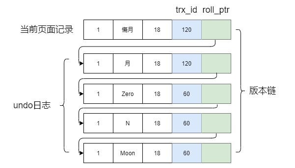

对该记录每次更新后，都会将旧值放到一条 undo 日志中，就算是该记录的一个旧版本，随着更新次数的增多，所有的版本都会被 roll_pointer 属性连接成一个链表，这个链表称为**版本链**，版本链的头节点就是当前记录最新的值。另外，每个版本中还包含生成该版本时对应的事务 id。于是可以利用这个记录的版本链来控制并发事务访问相同记录的行为，那么这种机制就被称之为**多版本并发控制(Mulit-Version Concurrency Control MVCC)**。

#### 9.3.2. ReadView

为了实现不同事务的控制，InnoDB 提出了一个 ReadView 的概念。ReadView（读视图）是**快照读**SQL 执行时 MVCC 提取数据的依据，在 ReadView 内部记录并维护一个系统当前活跃事务链表（未提交的），表示生成 ReadView 的时候还在活跃的事务。**该链表包含在创建 ReadView 之前还未提交的事务，不包含创建 ReadView 之后提交的事务**。

值得注意的是，<font color=red>**begin/start transaction 命令并不是一个事务的起点，而是在它们之后执行的第一个修改操作或加排它锁操作(比如`select...for update`)的语句，事务才真正启动，此时才会向 mysql 申请真正的事务 id，mysql 内部是严格按照事务的启动顺序来分配事务 id**</font>。

ReadView 中主要包含4个比较重要的内容：

- `m_ids`：表示在生成 ReadView 时当前系统中活跃的读写事务的事务 id 列表。
- `min_trx_id`：表示在生成 ReadView 时当前系统中活跃的读写事务中最小的事务 id，也就是 m_ids 中的最小值。
- `max_trx_id`：表示生成 ReadView 时系统中应该分配给下一个事务的 id 值。注意 `max_trx_id` 并不是 `m_ids` 中的最大值，事务 id 是递增分配的。比方说现在有 id 为 1，2，3 这三个事务，之后 id 为 3 的事务提交了。那么一个新的读事务在生成 ReadView 时，`m_ids` 就包括 1 和 2，`min_trx_id` 的值就是 1，`max_trx_id`的值就是 4。
- `creator_trx_id`：表示生成该 ReadView 的事务 id。

有了这个 ReadView，在访问某条记录时，只需要按照相关的规则，判断记录的某个版本是否可见。

### 9.4. undo 日志版本链与 ReadView 机制详解

#### 9.4.1. 不同隔离级别事务读取记录的区别

- 对于使用 READ UNCOMMITTED 隔离级别的事务来说，由于可以读到未提交事务修改过的记录，所以直接读取记录的最新版本即可。
- 对于使用 SERIALIZABLE 隔离级别的事务来说，InnoDB 使用加锁的方式来访问记录。
- 对于使用 READ COMMITTED 和 REPEATABLE READ 隔离级别的事务来说，都必须保证读到已经提交了的事务修改过的记录，也就是说假如另一个事务已经修改了记录但是尚未提交，是不能直接读取最新版本的记录的

**因此，READ COMMITTED 和 REPEATABLE READ 这两种隔离级别关键是需要判断一下版本链中的哪个版本是当前事务可见的**。

#### 9.4.2. 不同隔离级别创建 ReadView 的时机

在 MySQL 中，READ COMMITTED 和 REPEATABLE READ 隔离级别的的一个非常大的区别就是它们<font color=red>**生成 ReadView 的时机不同**</font>。

-  实现 READ COMMITTED 隔离级别，事务里每次执行查询操作时都会按照数据库当前状态重新生成 readview，也就是每次查询都是跟数据库里当前所有事务提交状态来比对数据是否可见，因此可以实现每次都能查到已提交的最新数据的效果。
- 实现 REPEATABLE READ 隔离级别，事务里每次执行查询操作时都是使用第一次查询时生成的 readview，也就是都是以第一次查询时当时数据库里所有事务提交状态来比对数据是否可见，因此可以实现每次查询的可重复读的效果。

#### 9.4.3. 修改操作的事务实现原理

*以下是 REPEATABLE READ 隔离级别下的事务实现说明*。假设插入一条记录的事务 id 为 80 并且已经提交事务，后面有3个事务 id 分别为 300、100、200 的事务对这条记录进行 UPDATE 操作，操作流程如下：

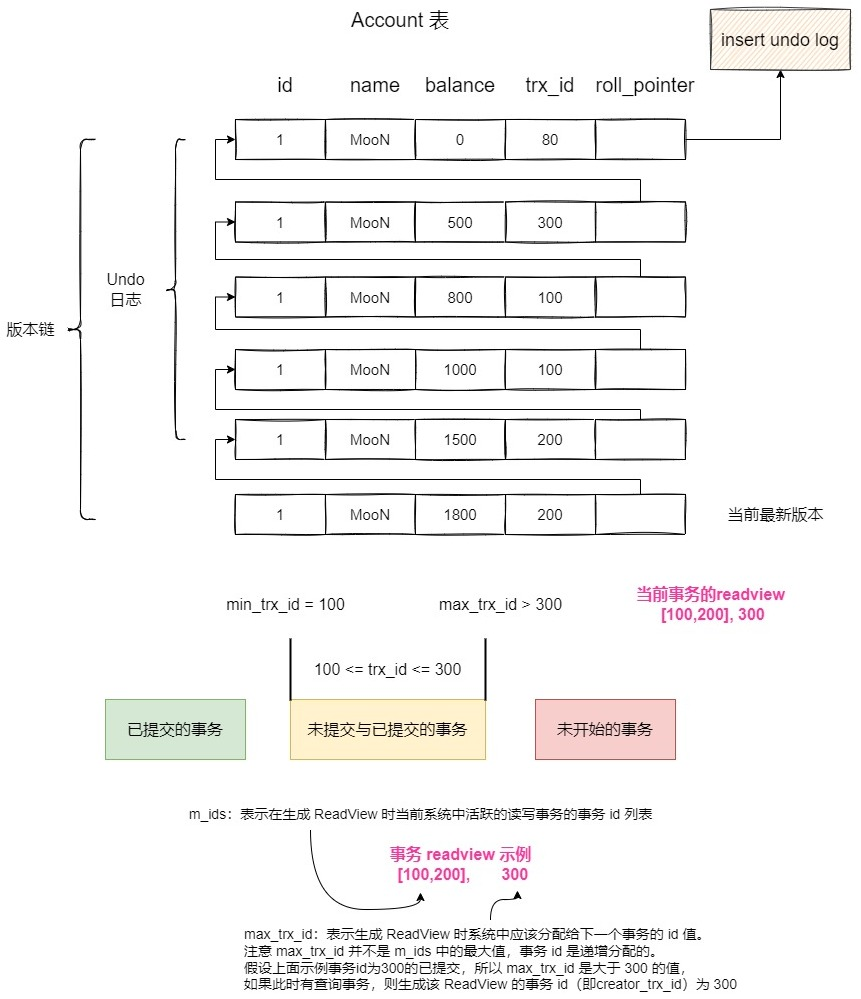

版本链比对规则如下：

1. 如果被访问版本的 trx_id 属性值与 ReadView 中的 creator_trx_id 值相同，意味着当前事务在访问它自己修改过的记录，所以该版本可以被当前事务访问。
2. 如果被访问版本的 trx_id 属性值小于 ReadView 中的 min_trx_id 值，表明生成该版本的事务在当前事务生成 ReadView 前已经提交，所以该版本可以被当前事务访问。*即 row 的 trx_id 在上图的绿色部分( `trx_id < min_trx_id` )，数据是可见的。*
3. 如果被访问版本的 trx_id 属性值大于或等于 ReadView 中的 max_trx_id 值，表明生成该版本的事务在当前事务生成 ReadView 后才开启，所以该版本不可以被当前事务访问。*即 row 的 trx_id 在上图的红色部分，数据是不可见。(若 row 的 trx_id 就是当前自己的事务是可见的）*
4. 如果被访问版本的 trx_id 属性值在 ReadView 的 min_trx_id 和 max_trx_id 之间(`min_trx_id < trx_id < max_trx_id`)，*即 row 的 trx_id 在上图的黄色部分*。那就需要判断一下 trx_id 属性值是不是在 m_ids 列表中，包括以下两种情况：
    - 如果 row 的 trx_id 在视图数组中，说明创建 ReadView 时生成该版本的事务还是活跃的，该版本不可以被访问(若 row 的 trx_id 就是当前自己的事务是可见的)；
    - 如果 row 的 trx_id 不在视图数组中，说明创建 ReadView 时生成该版本的事务已经被提交，该版本可以被访问。
5. 如果某个版本的数据对当前事务不可见的话，那就顺着版本链找到下一个版本的数据，继续按照上边的步骤判断可见性，依此类推，直到版本链中的最后一个版本。如果最后一个版本也不可见的话，那么就意味着该条记录对该事务完全不可见，查询结果就不包含该记录

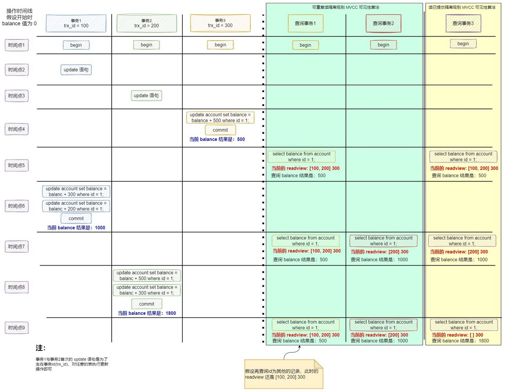

#### 9.4.4. 删除操作的事务实现原理

对于删除的情况可以认为是 update 操作的特殊情况，会将版本链上最新的数据复制一份，然后将 trx_id 修改成删除操作的 trx_id，同时将该条记录的头信息（record header）里的（deleted_flag）标记位设置为 true，用于表示当前记录已经被删除，在查询时按照上面的规则查到对应的记录如果 delete_flag 标记位为 true，意味着记录已被删除，则不返回数据。

### 9.5. (！待整理)MVCC 下的幻读解决和幻读现象 

> TODO: 待整理

### 9.6. MVCC 小结

MVCC（Multi-Version Concurrency Control ，多版本并发控制）指的就是在使用 READ COMMITTD、REPEATABLE READ 这两种隔离级别的事务在执行普通的 SELECT 操作时访问记录的版本链的过程，这样子可以使不同事务的读-写、写-读操作并发执行，从而提升系统性能。

MVCC 的实现原理就是通过 InnoDB 表的隐藏字段、UndoLog 版本链、ReadView 来实现的。版本链保存有历史版本记录，通过 ReadView 判断当前版本的数据是否可见，如果不可见，再从版本链中找到上一个版本，继续进行判断，直到找到一个可见的版本。

而 MVCC+锁，则实现了事务的隔离性。而一致性则是由 redolog 与 undolog 保证。

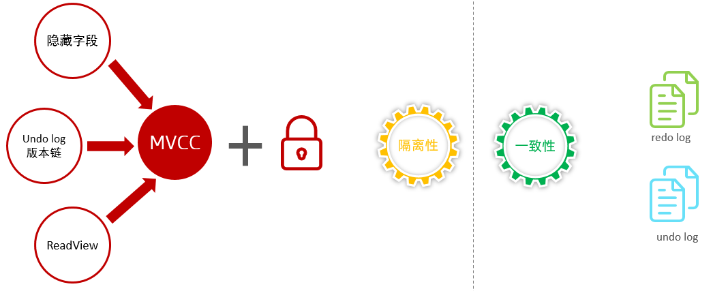

READ COMMITTD、REPEATABLE READ 这两个隔离级别的一个很大不同就是：生成 ReadView 的时机不同

- READ COMMITTD 在每一次进行普通 SELECT 操作前都会生成一个 ReadView
- REPEATABLE READ 只在第一次进行普通 SELECT 操作前生成一个 ReadView，之后的查询操作都重复使用该 ReadView，从而基本上可以避免幻读现象

执行 DELETE 语句或者更新主键的 UPDATE 语句并不会立即把对应的记录完全从页面中删除，而是执行一个所谓的 delete mark 操作，相当于只是对记录打上了一个删除标志位，这主要就是为MVCC服务。MVCC 只是在进行**普通的 SEELCT 查询**时才生效
