# MySQL数据库-锁

## 1. 概述

锁是计算机协调多个进程或线程并发访问某一资源的机制（避免争抢）。在数据库中，除传统的计算资源（CPU、RAM、I/O）的争用以外，数据也是一种供许多用户共享的资源。如何保证数据并发访问的一致性、有效性是所有数据库必须解决的一个问题，锁冲突也是影响数据库并发访问性能的一个重要因素。

### 1.1. InnoDB 锁分类

按照 MySQL 官方的说法，InnoDB 中锁可以分为：

- Shared and Exclusive Locks
- Intention Locks
- Record Locks
- Gap Locks
- Next-Key Locks
- Insert Intention Locks
- AUTO-INC Locks
- Predicate Locks for Spatial Indexes

> 官网说明：https://dev.mysql.com/doc/refman/5.7/en/innodb-locking.html

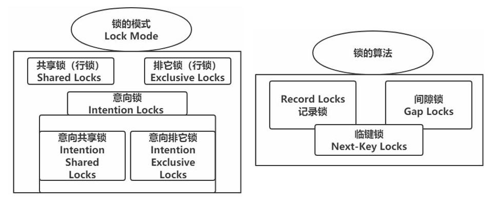

InnoDB 存储引擎既支持表锁，也支持行锁。表锁实现简单，占用资源较少，粒度很粗，性能较差；行锁粒度更细，可以实现更精准的并发控制。

### 1.2. 锁的分类

MySQL中的锁，按照锁的粒度分，分为以下三类：

- 全局锁：锁定数据库中的所有表。
- 表级锁：每次操作锁住整张表，称之为表级锁或者表锁，这种锁的粒度比较粗。
- 行级锁：每次操作锁住对应的行数据，称之为行级锁或者行锁，这种锁的粒度比较细。

给表加的锁也可以分为共享锁（S 锁）和独占锁（X 锁）

### 1.3. 表锁与行锁的比较

- 锁定粒度：表锁 > 行锁
- 加锁效率：表锁 > 行锁
- 冲突概率：表锁 > 行锁
- 并发性能：表锁 < 行锁

### 1.4. 表的S锁与X锁

**如果一个事务给表加了 S 锁**

- 别的事务可以继续获得该表的 S 锁
- 别的事务可以继续获得该表中的某些记录的 S 锁
- 别的事务不可以继续获得该表的 X 锁
- 别的事务不可以继续获得该表中的某些记录的 X 锁

**如果一个事务给表加了 X 锁（意味着该事务要独占这个表）**

- 别的事务不可以继续获得该表的 S 锁
- 别的事务不可以继续获得该表中的某些记录的 S 锁
- 别的事务不可以继续获得该表的 X 锁
- 别的事务不可以继续获得该表中的某些记录的 X 锁

## 2. 解决并发事务问题

在数据库中，除传统的计算资源（如 CPU、RAM、I/O 等）的争用以外，数据也是一种供许多用户共享的资源。事务并发执行时可能带来的各种问题，最大的一个难点是：一方面要最大程度地利用数据库的并发访问，另外一方面还要确保每个用户能以一致的方式读取和修改数据，尤其是一个事务进行读取操作，另一个同时进行改动操作的情况下。

各个数据库厂商对 SQL 标准的支持都可能不一样，与 SQL 标准不同的一点就是，MySQL 在 REPEATABLE READ 隔离级别实际上就基本解决了幻读问题。解决脏读、不可重复读、幻读这些问题有两种可选的解决方案：

### 2.1. 方案一：读操作 MVCC，写操作进行加锁

MVCC 就是通过生成一个 ReadView，然后通过 ReadView 找到符合条件的记录版本（历史版本是由 undo 日志构建的），其实就像是在生成 ReadView 的那个时刻做了一个快照，查询语句只能读到在生成 ReadView 之前已提交事务所做的更改，在生成 ReadView 之前未提交的事务或者之后才开启的事务所做的更改是看不到的。而写操作肯定针对的是最新版本的记录，读记录的历史版本和改动记录的最新版本本身并不冲突，也就是采用MVCC 时，读-写操作并不冲突。

普通的 SELECT 语句在 READ COMMITTED 和 REPEATABLE READ 隔离级别下会使用到 MVCC 读取记录。

- 在 READ COMMITTED 隔离级别下，一个事务在执行过程中每次执行 SELECT 操作时都会生成一个 ReadView，ReadView 的存在本身就保证了事务不可以读取到未提交的事务所做的更改，也就是避免了脏读现象；
- 在 REPEATABLE READ 隔离级别下，一个事务在执行过程中只有第一次执行 SELECT 操作才会生成一个 ReadView，之后的 SELECT 操作都复用这个 ReadView，这样也就避免了不可重复读和很大程度上避免了幻读的问题。

### 2.2. 一致性读（Consistent Reads）/快照读

事务利用 MVCC 进行的读取操作称之为一致性读（一致性无锁读，也称之为快照读）。所有普通的 SELECT 语句（plain SELECT，指不加锁的 select 语句在非串行化事务隔离级别下）在 READ COMMITTED、REPEATABLE READ 隔离级别下都算是一致性读。

一致性读并不会对表中的任何记录做加锁操作，其他事务可以自由的对表中的记录做改动。采用 MVCC 方式的话，读-写操作彼此并不冲突，性能更高，采用加锁方式的话，读-写操作彼此需要排队执行，影响性能。

### 2.3. 方案二：读、写操作都采用加锁的方式

- 脏读的产生是因为当前事务读取了另一个未提交事务写的一条记录，如果另一个事务在写记录的时候就给这条记录加锁，那么当前事务就无法继续读取该记录了，所以也就不会有脏读问题的产生了。
- 不可重复读的产生是因为当前事务先读取一条记录，另外一个事务对该记录做了改动之后并提交之后，当前事务再次读取时会获得不同的值，如果在当前事务读取记录时就给该记录加锁，那么另一个事务就无法修改该记录，也不会发生不可重复读的情况
- 幻读问题的产生是因为当前事务读取了一个范围的记录，然后另外的事务向该范围内插入了新记录，当前事务再次读取该范围的记录时发现了新插入的新记录，把新插入的那些记录称之为幻影记录。采用加锁的方式解决幻读问题就有不太容易了，因为当前事务在第一次读取记录时那些幻影记录并不存在，所以读取的时候加锁就有点麻烦

## 3. 全局锁

### 3.1. 概述

全局锁就是对整个数据库实例加锁，加锁后整个实例就处于只读状态，后续的DML的写语句，DDL语句，已经更新操作的事务提交语句都将被阻塞。其典型的使用场景是做全库的逻辑备份，对所有的表进行锁定，从而获取一致性视图，保证数据的完整性。

### 3.2. 语法

- 加全局锁

```sql
flush tables with read lock;
```

- 数据备份(示例)。*注：mysqldump 是 mysql 提供的备份工具，需要在系统的命令行执行，而非 mysql 客户端中执行。*

```sql
mysqldump -uroot –p123456 temp_db > temp_db.sql
```

- 释放锁

```sql
unlock tables;
```

### 3.3. 特点

数据库中加全局锁，是一个比较重的操作，存在以下问题：

- 如果在主库上备份，那么在备份期间都不能执行更新，业务基本上就得停摆。
- 如果在从库上备份，那么在备份期间从库不能执行主库同步过来的二进制日志（binlog），会导致主从延迟。

在 InnoDB 引擎中，可以在备份时加上参数 `--single-transaction` 参数来完成不加锁的一致性数据备份。

```sql
mysqldump --single-transaction -uroot –p123456 temp_db > temp_db.sql
```

## 4. 锁定读（Locking Reads）/LBCC

锁定读（Locking Reads）也称当前读，读取的是最新版本，并且对读取的记录加锁，阻塞其他事务同时改动相同记录，避免出现安全问题。以下的情况是当前读：

|              SQL              |  行锁类型  |                  说明                   |
| ----------------------------- | --------- | --------------------------------------- |
| SELECT ...（正常）             | 不加任何锁 |                                         |
| SELECT ... LOCK IN SHARE MODE | 共享锁     | 需要手动在SELECT之后加LOCK IN SHARE MODE |
| SELECT ... FOR UPDATE         | 排他锁     | 需要手动在SELECT之后加FOR UPDATE         |
| INSERT ...                    | 排他锁     | 自动加锁                                 |
| UPDATE ...                    | 排他锁     | 自动加锁                                 |
| INSERT ...                    | 排他锁     | 自动加锁                                 |
| 串行化事务隔离级别              |           | 串行                                    |

当前读这种实现方式，也可以称之为 LBCC（基于锁的并发控制，Lock-Based Concurrency Control）

### 4.1. 共享锁（读锁）和独占锁（写锁）

使用加锁时，既要允许读-读情况不受影响，又要使写-写、读-写或写-读情况中的操作相互阻塞，MySQL 中的锁可以分成：

- 共享锁（读锁），英文名：Shared Locks，简称 S 锁。在事务要读取一条记录时，需要先获取该记录的 S 锁。
- 独占锁（排他锁、写锁），英文名：Exclusive Locks，简称 X 锁。在事务要改动一条记录时，需要先获取该记录的 X 锁。

**两种锁的兼容性**：

> 假如事务 E1 首先获取了一条记录的 S 锁之后，事务 E2 接着也要访问这条记录：
>
> 1. 如果事务 E2 想要再获取一个记录的 S 锁，那么事务 E2 也会获得该锁，也就意味着事务 E1 和 E2 在该记录上同时持有 S 锁。
> 2. 如果事务 E2 想要再获取一个记录的 X 锁，那么此操作会被阻塞，直到事务 E1 提交之后将 S 锁释放掉。
> 3. 如果事务 E1 首先获取了一条记录的 X 锁之后，那么不管事务 E2 接着想获取该记录的 S 锁还是 X 锁都会被阻塞，直到事务 E1 提交。

两种行锁的兼容情况如下:


**总结：S 锁和 S 锁是兼容的，S 锁和 X 锁是不兼容的，X 锁和 X 锁也是不兼容的**

### 4.2. 锁定读的 SELECT 语句

可以通过以下语句显示给记录集加共享锁或排他锁。

- 对读取的记录加 S 锁的语法格式：

```sql
SELECT... LOCK IN SHARE MODE;
```

就是在普通的 SELECT 语句后边加 LOCK IN SHARE MODE，如果当前事务执行了该语句，那么它会为读取到的记录加 S 锁，这样允许别的事务继续获取这些记录的 S 锁（比如别的事务也使用`SELECT ... LOCK IN SHARE MODE`语句来读取这些记录），但是不能获取这些记录的 X 锁（比如使用`SELECT ... FOR UPDATE`语句来读取这些记录，或者直接修改这些记录）。如果别的事务想要获取这些记录的 X 锁，那么它们会阻塞，直到当前事务提交之后将这些记录上的 S 锁释放掉。

- 对读取的记录加 X 锁的语法格式：

```sql
SELECT... FOR UPDATE;
```

普通的 SELECT 语句后边加`FOR UPDATE`，如果当前事务执行了该语句，那么它会为读取到的记录加 X 锁，这样既不允许别的事务获取这些记录的 S 锁（比方说别的事务使用`SELECT ... LOCK IN SHARE MODE`语句来读取这些记录），也不允许获取这些记录的 X 锁（比如说使用`SELECT... FOR UPDATE`语句来读取这些记录，或者直接修改这些记录）。如果别的事务想要获取这些记录的 S 锁或者 X 锁，那么它们会阻塞，直到当前事务提交之后将这些记录上的 X 锁释放掉。

### 4.3. 写操作的锁

#### 4.3.1. DELETE 操作

对一条记录做 DELETE 操作的过程，先在B+树中定位到这条记录的位置，然后获取一下这条记录的X锁，然后再执行 delete mark 操作。可以把这个定位待删除记录在B+树中位置的过程看成是一个获取X锁的锁定读。

#### 4.3.2. INSERT 操作

一般情况下，新插入一条记录的操作并不加锁，InnoDB 通过一种称之为隐式锁来保护这条新插入的记录在本事务提交前不被别的事务访问。也有特殊情况下 INSERT 操作也是会获取锁

#### 4.3.3. UPDATE 操作

对一条记录做 UPDATE 操作时分为三种情况：

- 如果未修改该记录的键值并且被更新的列占用的存储空间在修改前后未发生变化，则先在 B+树中定位到这条记录的位置，然后再获取一下记录的 X 锁，最后在原记录的位置进行修改操作。可以把这个定位待修改记录在B+树中位置的过程看成是一个获取 X 锁的锁定读。
- 如果未修改该记录的键值并且至少有一个被更新的列占用的存储空间在修改前后发生变化，则先在B+树中定位到这条记录的位置，然后获取一下记录的X锁，将该记录彻底删除掉（就是把记录彻底移入垃圾链表），最后再插入一条新记录。这个定位待修改记录在B+树中位置的过程看成是一个获取 X 锁的锁定读，新插入的记录由 INSERT 操作提供的隐式锁进行保护。
- 如果修改了该记录的键值，则相当于在原记录上做 DELETE 操作之后再来一次 INSERT 操作，加锁操作就需要按照 DELETE 和 INSERT 的规则进行了。

## 5. 表级锁

### 5.1. 概述

表级锁，每次操作锁住整张表。锁定粒度大，发生锁冲突的概率最高，并发度最低。应用在MyISAM、InnoDB、BDB等存储引擎中。对于表级锁，主要分为以下三类：

- 表锁
- 元数据锁（meta data lock，MDL）
- 意向锁

### 5.2. 表锁的分类

- 表共享读锁（read lock，S 锁）
- 表独占写锁（write lock，X 锁）

在对某个表执行 SELECT、INSERT、DELETE、UPDATE 语句时，InnoDB 存储引擎是不会为这个表添加表级别的 S 锁或者 X 锁的。

InnoDB 存储引擎提供的表级 S 锁或者 X 锁是相当鸡肋，只会在一些特殊情况下，比如：崩溃恢复过程中用到。但也是可以手动获取相应的锁。但注意的是，尽量避免在使用 InnoDB 存储引擎的表上使用 `LOCK TABLES` 这样的手动锁表语句，它们并不会提供什么额外的保护，只是会降低并发能力而已。

#### 5.2.1. 表锁的语法

当在系统变量 `autocommit=0`、`innodb_table_locks = 1` 时，手动获取 InnoDB 存储引擎提供的表 t 的 S 锁或者 X 锁的语法格式如下：

```sql
-- InnoDB 存储引擎会对表加表级别的 S 锁。
LOCK TABLES 表名 READ;
-- InnoDB 存储引擎会对表加表级别的 X 锁。
LOCK TABLES 表名 WRITE;
```

**释放锁语法格式**：

```sql
UNLOCK TABLES;
-- 或者客户端断开连接
```

#### 5.2.2. 表锁的读写锁测试

**读锁测试**

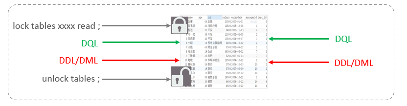

左侧为客户端一，对指定表加了读锁，不会影响右侧客户端二的读，但是会阻塞右侧客户端的写。

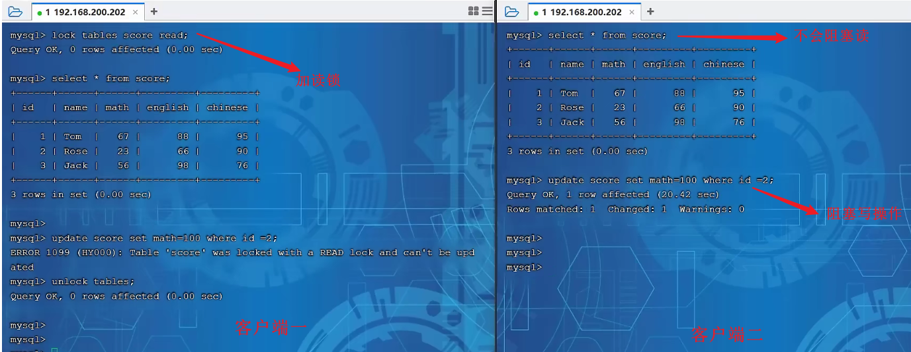

**写锁测试**

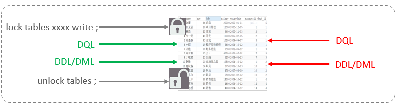

左侧为客户端一，对指定表加了写锁，会阻塞右侧客户端的读和写。

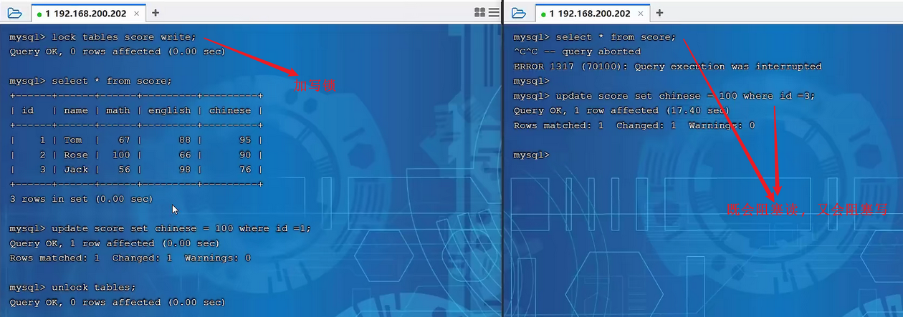

> <font color=red>**结论：读锁不会阻塞其他客户端的读，但是会阻塞写；写锁既会阻塞其他客户端的读，又会阻塞其他客户端的写。**</font>

### 5.3. 表级别的 AUTO-INC 锁

在使用 MySQL 过程中，可以为表的某个列添加 `AUTO_INCREMENT` 属性，之后在插入记录时，可以不指定该列的值，系统会自动为它赋上递增的值系统实现这种自动给 AUTO_INCREMENT 修饰的列递增赋值，其实现原理主要是两个：

1. 采用 AUTO-INC 锁，也就是在执行插入语句时就在表级别加一个 AUTO-INC 锁，然后为每条待插入记录的 AUTO_INCREMENT 修饰的列分配递增的值，在该语句执行结束后，再把 AUTO-INC 锁释放掉。这样一个事务在持有 AUTO-INC 锁的过程中，其他事务的插入语句都要被阻塞，可以保证一个语句中分配的递增值是连续的。

如果插入语句在执行前不可以确定具体要插入多少条记录（无法预计即将插入记录的数量），比方说使用`INSERT ... SELECT`、`REPLACE ... SELECT`或者`LOAD DATA`这种插入语句，一般是使用 AUTO-INC 锁为 AUTO_INCREMENT 修饰的列生成对应的值。

2. 采用一个轻量级的锁，在为插入语句生成 AUTO_INCREMENT 修饰的列的值时获取一下这个轻量级锁，然后生成本次插入语句需要用到的 AUTO_INCREMENT 列的值之后，就把该轻量级锁释放掉，并不需要等到整个插入语句执行完才释放锁。

如果插入语句在执行前就可以确定具体要插入多少条记录，那么一般采用轻量级锁的方式对 AUTO_INCREMENT 修饰的列进行赋值。这种方式可避免锁定表，可以提升插入性能。

InnoDB 提供了一个称之为 `innodb_autoinc_lock_mode` 的系统变量来控制到底使用上述两种方式中的哪种来为 AUTO_INCREMENT 修饰的列进行赋值

- 当 `innodb_autoinc_lock_mode` 值为 0 时，一律采用 AUTO-INC 锁
- 当 `innodb_autoinc_lock_mode` 值为 2 时，一律采用轻量级锁
- 当 `innodb_autoinc_lock_mode` 值为 1 时，两种方式混着来（也就是在插入记录数量确定时采用轻量级锁，不确定时使用 AUTO-INC 锁）

需要注意：当 `innodb_autoinc_lock_mode` 值为 2 时，可能会造成不同事务中的插入语句为 AUTO_INCREMENT 修饰的列生成的值是交叉的，在有主从复制的场景中是不安全的。

> MySQL 5.7.X 版本中缺省值为 1

### 5.4. 元数据锁

**元数据锁**（meta data lock），简写MDL。在对某个表执行一些诸如 `ALTER TABLE`、`DROP TABLE` 这类的 DDL 语句时，其他事务对这个表并发执行诸如 `SELECT`、`INSERT`、`DELETE`、`UPDATE` 的语句会发生阻塞。同样，某个事务中对某个表执行 `SELECT`、`INSERT`、`DELETE`、`UPDATE` 语句时，在其他会话中对这个表执行 DDL 语句也会发生阻塞。

以上过程是通过在 server 层使用称之为**元数据锁**来实现的，一般情况下也不会使用 InnoDB 存储引擎自己提供的表级别的 S 锁和 X 锁。

MDL加锁过程是系统自动控制，无需显式使用。在 MySQL 5.5 中引入了MDL，当对一张表进行增删改查的时候，加MDL读锁(共享)；当对表结构进行变更操作的时候，加MDL写锁(排他)。

常见的SQL操作时，所添加的元数据锁：

#### 5.4.1. 元数据锁效果测试

- 当执行 SELECT、INSERT、UPDATE、DELETE 等语句时，添加的是元数据共享锁（SHARED_READ / SHARED_WRITE），之间是兼容的。

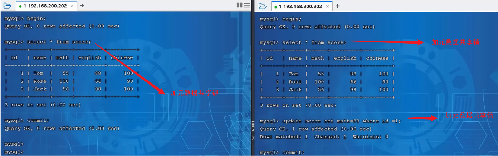

- 当执行SELECT语句时，添加的是元数据共享锁（SHARED_READ），会阻塞元数据排他锁（EXCLUSIVE），之间是互斥的。

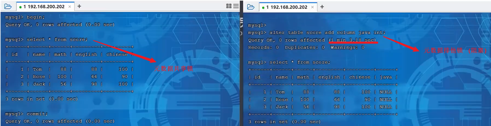

#### 5.4.2. 查看元数据锁

通过操作的过程中，可以通过以下 SQL 可以查看数据库中的元数据锁的情况：

```sql
SELECT object_type,	object_schema, object_name, lock_type, lock_duration FROM PERFORMANCE_SCHEMA.metadata_locks;
```

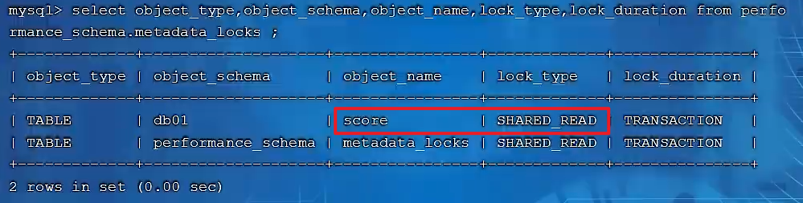

### 5.5. 意向锁

在对表上锁的时候，如果需要获取是否有行被上锁，那就需要依次扫描整个表，这种处理方式的效率太慢。所以 InnoDB 提出了一种意向锁（英文名：Intention Locks）。

假如没有意向锁，客户端一对表加了行锁后，客户端二如何给表加表锁呢，来通过示意图简单分析一下：

首先客户端一，开启一个事务，然后执行DML操作，在执行DML语句时，会对涉及到的行加行锁。

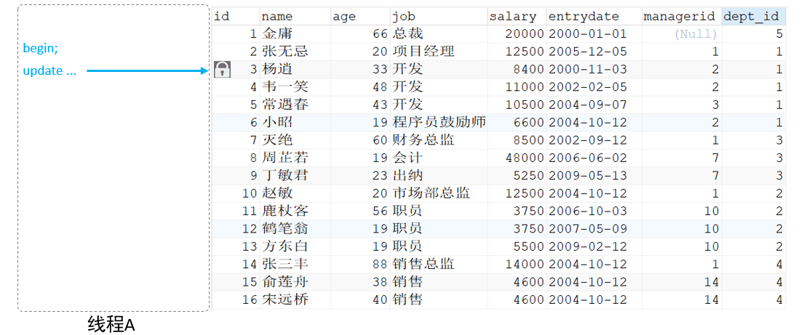

当客户端二，想对这张表加表锁时，会检查当前表是否有对应的行锁，如果没有，则添加表锁，此时就会从第一行数据，检查到最后一行数据，效率较低。

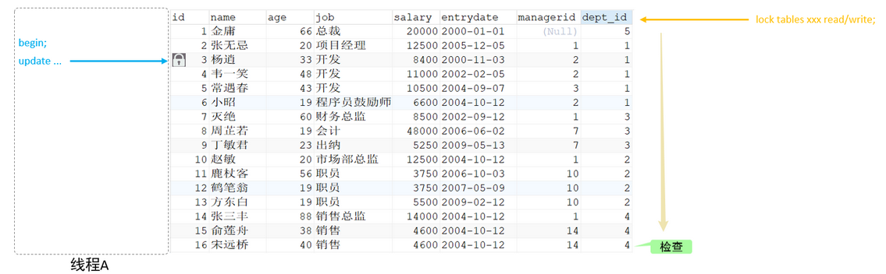

引入意向锁之后，客户端一，在执行DML操作时，会对涉及的行加行锁，同时也会对该表加上意向锁。

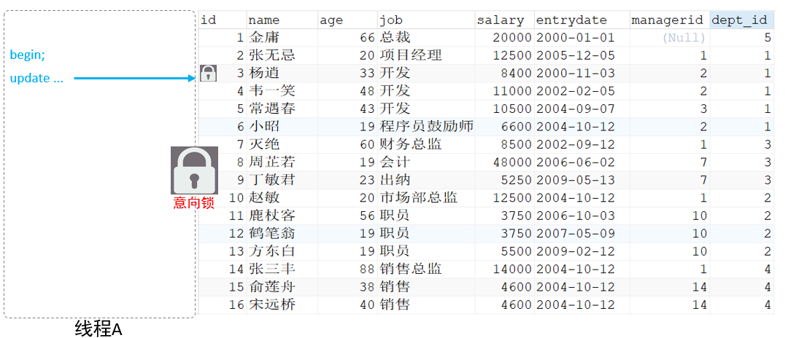

而其他客户端，在对这张表加表锁的时候，会根据该表上所加的意向锁来判定是否可以成功加表锁，而不用逐行判断行锁情况了。

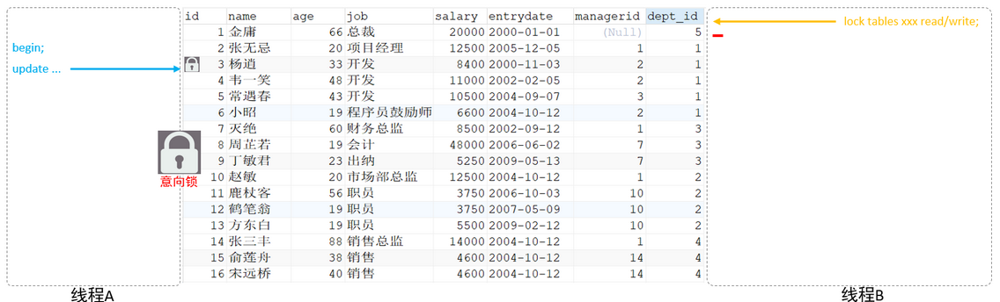

<font color=red>**总结：意向锁是表级锁，它们的提出仅仅为了后续在加表级别的 S 锁和 X 锁时可以快速判断表中的记录是否被上锁，以避免用遍历的方式来查看表中有没有上锁的记录。用户并不能手动添加意向锁，只能由 InnoDB 存储引擎自行添加。**</font>

#### 5.5.1. 分类

- **意向共享锁**，英文名：Intention Shared Lock，简称 IS 锁。当事务准备在某条记录上加 S 锁时，需要先在表级别加一个 IS 锁。由语句 `select ... lock in share mode` 添加。与表锁共享锁(read)兼容，与表锁排他锁(write)互斥。
- **意向独占锁**，英文名：Intention Exclusive Lock，简称 IX 锁。当事务准备在某条记录上加 X 锁时，需要先在表级别加一个 IX 锁。由 `insert、update、delete、select...for update` 添加 。与表锁共享锁(read)及排他锁(write)都互斥，意向锁之间不会互斥。

> Tips: <font color=red>**一旦事务提交了，意向共享锁、意向排他锁，都会自动释放。**</font>

可以通过以下 SQL，查看意向锁及行锁的加锁情况：

```sql
SELECT object_schema,object_name,index_name,lock_type,lock_mode,lock_data FROM performance_schema.data_locks;
```

#### 5.5.2. 表级别的各种锁的兼容性

其实 IS 锁和 IX 锁是兼容的，IX 锁和 IX 锁是兼容的。表级别的各种锁的兼容性如下：

|     |   X   |  IX   |   S   |  IS   |
| --- | ----- | ----- | ----- | ----- |
| X   | 不兼容 | 不兼容 | 不兼容 | 不兼容 |
| IX  | 不兼容 |       | 不兼容 |       |
| S   | 不兼容 | 不兼容 |       |       |
| IS  | 不兼容 |       |       |       |

锁的组合性：

|      |  X  | IX  |  S  | IS  |
| ---- | --- | --- | --- | --- |
| 表锁 | √   | √   | √   | √   |
| 行锁 | √   |     | √   |     |

## 6. 行级锁

### 6.1. InnoDB 的行级锁

行锁，也称为记录锁，即在记录上加的锁，锁定粒度最小，发生锁冲突的概率最低，并发度最高。应用在InnoDB存储引擎中。

<font color=red>值得注意的是，这个记录指的是**通过给索引上的索引项加锁。InnoDB 这种行锁实现特点意味着：只有通过索引条件检索数据，InnoDB 才使用行级锁，否则，InnoDB 将使用表锁**</font>。不论是使用主键索引、唯一索引或普通索引，InnoDB 都会使用行锁来对数据加锁。

只有执行计划真正使用了索引，才能使用行锁：即便在条件中使用了索引字段，但是否使用索引来检索数据是由 MySQL 通过判断不同执行计划的代价来决定的，如果 MySQL 认为全表扫描效率更高，比如对一些很小的表，它就不会使用索引，这种情况下 InnoDB 将使用表锁，而不是行锁。同时当使用范围条件而不是相等条件检索数据，并请求锁时，InnoDB 会给符合条件的已有数据记录的索引项加锁。

InnoDB 中，行锁也是分成了各种类型。即使对同一条记录加行锁，如果类型不同，起到的功效也是不同。主要分为以下三类：

- 行锁（Record Lock）：锁定单个行记录的锁，防止其他事务对此行进行 update 和 delete。在 RC、RR 隔离级别下都支持

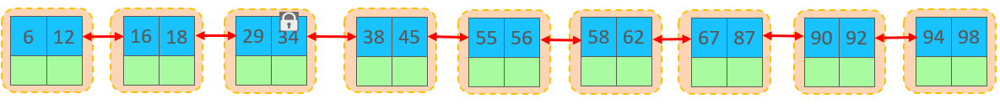

- 间隙锁（Gap Lock）：锁定索引记录间隙（不含该记录），确保索引记录间隙不变，防止其他事务在这个间隙进行 insert，产生幻读。在 RR 隔离级别下都支持。

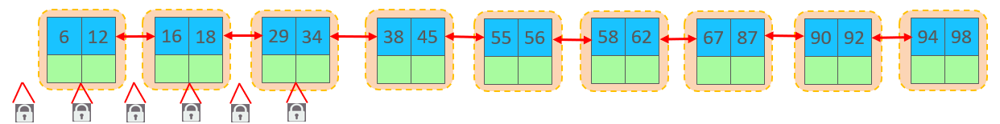

- 临键锁（Next-Key Lock）：行锁和间隙锁组合，同时锁住数据，并锁住数据前面的间隙 Gap。在 RR 隔离级别下支持。

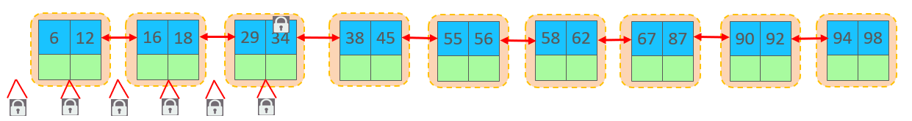

### 6.2. Record Locks（行锁）

记录锁，就是仅仅把一条记录锁上，官方的类型名称为：LOCK_REC_NOT_GAP。例如把id值为9的记录加一个记录锁，示意图如下：


记录锁是有 S 锁和 X 锁之分

- 当一个事务获取了一条记录的 S 型记录锁后，其他事务也可以继续获取该记录的 S 型记录锁，但不可以继续获取 X 型记录锁；
- 当一个事务获取了一条记录的 X 型记录锁后，其他事务既不可以继续获取该记录的 S 型记录锁，也不可以继续获取 X 型记录锁；

### 6.3. Gap Locks（间隙锁）

MySQL 在 REPEATABLE READ 隔离级别下是可以解决幻读问题的，解决方案有两种，可以使用 MVCC 方案解决，也可以采用加锁方案解决。但是在使用加锁方案解决时有问题，就是事务在第一次执行读取操作时，那些幻影记录尚不存在，无法给这些幻影记录加上记录锁。

InnoDB 提出了一种名为 Gap Locks 的锁，官方的类型名称为：LOCK_GAP，也可以简称为 gap 锁。<font color=red>**间隙锁实质上是对索引前后的间隙上锁，不对索引本身上锁**</font>。

例如：会话1开启一个事务，执行

```sql
begin;
update `user` set age = 27 where id = 9;
```

此时会在id为9的记录前后加了 gap 锁。意味着不允许别的事务在这条记录前后间隙插入新记录。


会话2开启一个事务，执行

```sql
begin;
insert into `user` values (12, '傷月', 22);
```

此时会报错：`Lock wait timeout exceeded; try restarting transaction`。因为主键（或者索引）正好在9~13之间，此区间存在间隙锁，所以不能插入。

如果将id改成15，此时新增的记录不在被锁的区间内，所以可以成功插入

```sql
insert into `user` values (15, '傷月', 22);
```

> Tips: 间隙锁唯一目的是防止其他事务插入间隙。间隙锁可以共存，一个事务采用的间隙锁不会阻止另一个事务在同一间隙上采用间隙锁。

### 6.4. Next-Key Locks（临键锁）

有些情况，既想锁住某条记录，又想阻止其他事务在该记录前边的间隙插入新记录，所以 InnoDB 就提出了一种名为 Next-Key Locks 的锁，官方的类型名称为：LOCK_ORDINARY，也可以简称为 next-key 锁。<font color=red>**next-key 锁的本质就是一个记录锁和一个 gap 锁的合体**</font>，即包含记录本身。

默认情况下，InnoDB 以 REPEATABLE READ 隔离级别运行。在这种情况下，InnoDB 使用 Next-Key Locks 锁进行搜索和索引扫描，这可以防止幻读的发生。

- 索引上的等值查询(唯一索引)，给不存在的记录加锁时，优化为间隙锁
- 索引上的等值查询(非唯一普通索引)，向右遍历时最后一个值不满足查询需求时，next-key lock 退化为间隙锁
- 索引上的范围查询(唯一索引)，会访问到不满足条件的第一个值为止

### 6.5. Insert Intention Locks

一个事务在插入一条记录时需要判断一下插入位置是不是被别的事务加了所谓的 gap 锁（next-key 锁也包含 gap 锁），如果有的话，插入操作需要等待，直到拥有 gap 锁的那个事务提交。

InnoDB 规定事务在等待的时候也需要在内存中生成一个锁结构，表明有事务想在某个间隙中插入新记录，但是现在处于等待状态。这种类型的锁命名为 Insert Intention Locks，官方的类型名称为：LOCK_INSERT_INTENTION，也可以称为插入**意向锁**。

可以理解为插入意向锁是一种锁的的等待队列，让等锁的事务在内存中进行排队等待，当持有锁的事务完成后，处于等待状态的事务就可以获得锁继续事务了。

### 6.6. 隐式锁

锁的的维护是需要成本的，为了节约资源，MySQL 在设计提出了一个隐式锁的概念。一般情况下 INSERT 操作是不加锁的，当然真的有并发冲突的情况下，还是会导致问题的。

在MySQL中，一个事务对新插入的记录可以不显式的加锁，但是别的事务在对这条记录加S锁或者X锁时，会去检查索引记录中的trx_id隐藏列，然后进行各种判断，会先帮助当前事务生成一个锁结构，然后自己再生成一个锁结构后进入等待状态。但是由于事务id的存在，相当于加了一个隐式锁。此时隐式锁就起到了延迟生成锁的用处。这个过程，用户无法干预，是由引擎自动处理的，对用户是完全透明的，只需了解即可。

## 7. MySQL 其他存储引擎中的锁

MySQL 支持多种存储引擎，不同存储引擎对锁的支持也是不一样

| 存储引擎 | 表级锁 | 行级锁 |
| -------- | ------ | ------ |
| MyISAM   | ✅    | ❌    |
| InnoDB   | ✅    | ✅    |
| MEMORY   | ✅    | ❌    |
| BDB      | ✅    | ❌    |

对于 MyISAM、MEMORY、MERGE 这些存储引擎来说，它们只支持表级锁，而且这些引擎并不支持事务，所以使用这些存储引擎的锁一般都是针对当前会话而言。

因为使用 MyISAM、MEMORY、MERGE 这些存储引擎的表在同一时刻只允许一个会话对表进行写操作，所以这些存储引擎实际上最好用在只读，或者大部分都是读操作，或者单用户的情景下。另外，在 MyISAM 存储引擎中有一个称之为 Concurrent Inserts 的特性，支持在对 MyISAM 表读取时同时插入记录，这样可以提升一些插入速度。

> 其他存储引擎的锁具体的细节参考官方文档

### 7.1. 锁的内存结构

锁其实是一个内存中的结构，在事务执行前本来是没有锁的，也就是说一开始是没有锁结构和记录进行关联的，当一个事务想对这条记录做改动时，首先会看看内存中有没有与这条记录关联的锁结构，如没有的话，此时就会在内存中生成一个锁结构与之关联。**锁结构里至少要有两个比较重要的属性**：

- `trx信息`：代表这个锁结构是哪个事务生成的。
- `is_waiting`：代表当前事务是否在等待。


当事务T1改动了某条记录后，就生成了一个锁结构与该记录关联，因为之前没有别的事务为这条记录加锁，所以`is_waiting`属性就是`false`，此场景称为获取锁成功，或者加锁成功，然后就可以继续执行操作了。

在事务T1提交之前，另一个事务T2也想对该记录做改动，那么先去看看有没有锁结构与该记录关联，如发现有一个锁结构与之关联后，然后也生成了一个锁结构与这条记录关联，不过锁结构的`is_waiting`属性值为`true`，表示当前事务需要等待，把这个场景就称之为获取锁失败，或者加锁失败，或者没有成功的获取到锁

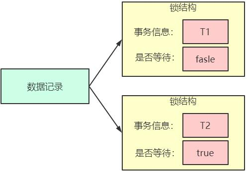

在事务T 提交之后，就会把该事务生成的锁结构释放掉，然后看看还有没有别的事务在等待获取锁，发现了事务T2还在等待获取锁，所以把事务T2对应的锁结构的`is_waiting`属性设置为`false`，然后把该事务对应的线程唤醒，让它继续执行，此时事务T2就算获取到锁了。

> **锁的实现方式与并发编程里的CLH队列非常相似**

对一条记录加锁的本质就是在内存中创建一个锁结构与之关联。但是实际上，当一个事务对多条记录加锁时，并不是一个记录一个锁结构，如果每条记录都生成一个锁结构，不管是执行效率还是空间效率来说都是很不划算的。

锁结构实际是很复杂的，可以大概了解下里面包含的元素：

- 锁所在的事务信息：无论是表级锁还是行级锁，一个锁属于一个事务，这里记载着该锁对应的事务信息。
- 索引信息：对于行级锁来说，需要记录一下加锁的记录属于哪个索引。
- 表锁/行锁信息：表级锁结构和行级锁结构在这个位置的内容是不同的。
    - 表级锁记载着这是对哪个表加的锁，还有其他的一些信息
    - 行级锁记载了记录所在的表空间、记录所在的页号、区分到底是为哪一条记录加了锁的数据结构
- 锁模式：锁是 IS，IX，S，X 中的哪一种。
- 锁类型：表锁还是行锁，行锁的具体类型。
- 其他一些和锁管理相关的数据结构，比如哈希表和链表等。

**总结：同一个事务里，同一个数据页面，同一个加锁类型的锁会保存在一起。**

### 7.2. 锁表的原因分析

1. 锁表发生在insert、update、delete 中
2. 锁表的原理是 数据库使用独占式封锁机制，当执行上面的语句时，对表进行锁住，直到发生commit 或者 回滚 或者退出数据库用户
3. 锁表的原因：
	- 第一、 A程序执行了对 tableA 的 insert ，并还未 commit时，B程序也对tableA 进行insert 则此时会发生资源正忙的异常 就是锁表
	- 第二、锁表常发生于并发而不是并行（并行时，一个线程操作数据库时，另一个线程是不能操作数据库的，cpu 和i/o 分配原则）
4. 减少锁表的概率：
	1. 减少insert 、update 、delete 语句执行 到 commit 之间的时间。具体点批量执行改为单个执行、优化sql自身的非执行速度
	2. 如果异常对事物进行回滚

### 7.3. 如何判断数据库表已经锁表

查询语法：`select * from v$locked_object;`

可以获得被锁的对象的object_id及产生锁的会话sid。

## 8. 查看事务加锁的情况

```sql
show engine innodb status;
```

查看事务加锁的情况，不过一般情况下，看不到哪个事务对哪些记录加了那些锁，需要修改系统变量 `innodb_status_output_locks`（MySQL5.6.16 引入），缺省值是`OFF`。

```sql
mysql> show variables like 'innodb_status_output_locks';
+----------------------------+-------+
| Variable_name              | Value |
+----------------------------+-------+
| innodb_status_output_locks | OFF   |
+----------------------------+-------+
```

修改全局变量 `innodb_status_output_locks` 为 `ON`，开启。

```sql
-- 修改为开启
mysql> set global innodb_status_output_locks = ON;

-- 查询
mysql> show variables like 'innodb_status_output_locks';
+----------------------------+-------+
| Variable_name              | Value |
+----------------------------+-------+
| innodb_status_output_locks | ON    |
+----------------------------+-------+
```

此时开启一个事务来测试效果，再次执行`show engine innodb status\G`

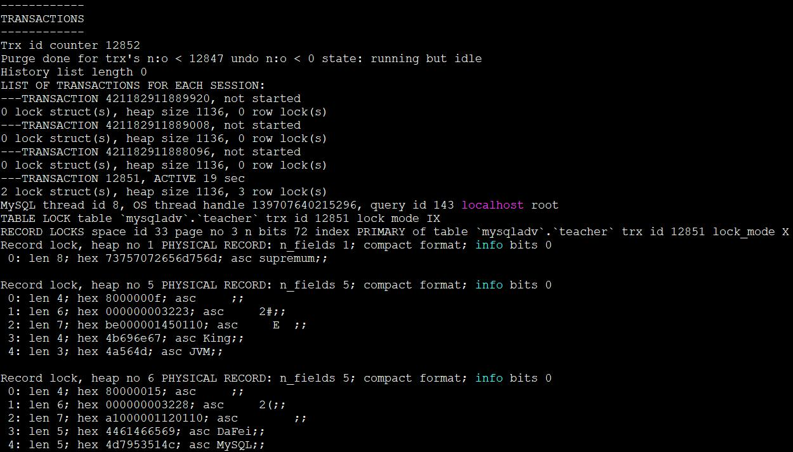

分析结果如下：

```
TABLE LOCK table `mysqladv`.`teacher` trx id 12851 lock mode IX
```

1. 表示事务 ID 为 12851 对 mysqladv 下的 teacher 表加了表级意向独占锁。

```
RECORD LOCKS space id 33 page no 4 n bits 72 index idx_name of table `mysqladv`.`teacher` trx id 12852 lock_mode X locks gap before rec
```

2. 表示一个内存中的锁结构
    - `space id 33`：表空间 id 为 33
    - `page no 3`：页编号为 4
    - `ndex PRIMARY`：对应的索引是 idx_name；
    - `lock_mode X locks gap before rec`：存放的是一个 X 型的 gap 锁

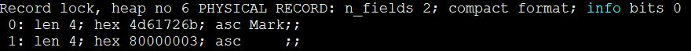

表示的加锁记录的详细信息

```
RECORD LOCKS space id 33 page no 4 n bits 72 index idx_name of table `mysqladv`.`teacher` trx id 12852 lock_mode X
```

3. 表示一个内存中的锁结构
    - `space id 33`：表空间 id 为 33
    - `page no 3`：页编号为 4
    - `index PRIMARY`：对应的索引是 idx_name
    - `lock_mode X`：存放的是一个 X 型的 next-key 锁
4. 如果是记录锁，则会显示`lock_mode X locks rec but not gap`

## 9. 死锁和空间锁

一般来说，只要有并发和加锁这两种情况的共同加持下，都会有死锁的可能。

### 9.1. 死锁的概念

指两个或两个以上的进程在执行过程中，由于竞争资源或者由于彼此通信而造成的一种阻塞的现象，若无外力作用，它们都将无法推进下去。此时称系统处于死锁状态或系统产生了**死锁**。

### 9.2. 死锁的学术化的定义

死锁的发生必须具备以下四个必要条件。

1. **互斥条件**：指进程对所分配到的资源进行排它性使用，即在一段时间内某资源只由一个进程占用。如果此时还有其它进程请求资源，则请求者只能等待，直至占有资源的进程用毕释放。
2. **请求和保持条件**：指进程已经保持至少一个资源，但又提出了新的资源请求，而该资源已被其它进程占有，此时请求进程阻塞，但又对自己已获得的其它资源保持不放。
3. **不剥夺条件**：指进程已获得的资源，在未使用完之前，不能被剥夺，只能在使用完时由自己释放。
4. **环路等待条件**：指在发生死锁时，必然存在一个进程-资源的环形链，即进程集合`{P0，P1，P2，...，Pn}`中的 P0 正在等待一个 P1 占用的资源；P1正在等待 P2 占用的资源，...，Pn 正在等待已被 P0 占用的资源。

理解了死锁的原因，尤其是产生死锁的四个必要条件，就可以最大可能地避免、预防和解除死锁。只要打破四个必要条件之一就能有效预防死锁的发生。

- **打破互斥条件**：改造独占性资源为虚拟资源，大部分资源已无法改造。
- **打破不可抢占条件**：当一进程占有一独占性资源后又申请一独占性资源而无法满足，则退出原占有的资源。
- **打破占有且申请条件**：采用资源预先分配策略，即进程运行前申请全部资源，满足则运行，不然就等待，这样就不会占有且申请。
- **打破循环等待条件**：实现资源有序分配策略，对所有设备实现分类编号，所有进程只能采用按序号递增的形式申请资源。

> 避免死锁常见的算法有有序资源分配法、银行家算法。

### 9.3. MySQL 中的死锁

MySQL 中的死锁的成因是一样的。如以下示例

1. 会话1：

```sql
begin;
select * from `user` where id = 1 for update;
```

2. 会话2：

```sql
begin;
select * from `user` where id = 3 for update;
```

3. 会话1执行以下语句，可以看到这个语句的执行将会被阻塞

```sql
select * from `user` where id = 3 for update;
```

4. 此时会话2执行以下语句，MySQL 检测到了死锁，并结束了会话 2 中事务的执行

```sql
mysql> select * from `user` where id = 1 for update;
ERROR 1213 (40001): Deadlock found when trying to get lock; try restarting transaction
```

此时，切回会话 1，发现原本阻塞的 SQL 语句执行完成了。

同时通过以下语句，可以看见死锁的详细情况：

```sql
show engine innodb status\G
```

### 9.4. Predicate Locks for Spatial Indexes

MySQL5.7 开始 MySQL 整合了 boost.geometry 库以更好的支持空间数据类型，并支持在在 Spatial 数据类型的列上构建索引，在 InnoDB 内，这个索引和普通的索引有所不同，基于 R-TREE 的结构，目前支持对 2D 数据的描述，暂不支持 3D

R-TREE 和 BTREE 不同，它能够描述多维空间，而多维数据并没有明确的数据顺序，因此无法在 RR 隔离级别下构建 NEXT-KEY 锁以避免幻读，因此 InnoDB 使用称为 Predicate Lock 的锁模式来加锁，会锁住一块查询用到的被称为MBR(minimum boundingrectangle/box)的数据区域。 因此这个锁不是锁到某个具体的记录之上的，可以理解为一种 Page 级别的锁。

Predicate Lock 和普通的记录锁或者表锁（如上所述）存储在不同的 lock hash中，其相互之间不会产生冲突。

