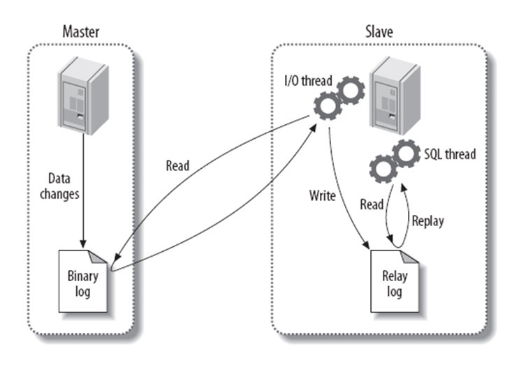

# MySQL 运维篇

## 1. 主从复制、读写分离

### 1.1. 主从复制过程

> Tips: 日志名词解释：
>
> - Binary log：主数据库的二进制日志
> - Relay log：从服务器的中继日志

有3个线程以及之间的关联，基本原理流程如下：

- 第一步：master 在每个事务更新数据完成之前，开启 binlog 线程，将所有改变数据库的操作记录串行地写入到 master 的 binlog 文件中。
- 第二步：salve 开启一个I/O Thread，该线程在 master 打开一个普通连接，主要工作是 binlog dump process。如果读取的进度已经跟上了 master，就进入睡眠状态并等待 master 产生新的事件。I/O线程最终的目的是将 master 的 binlog 内容写入到自己的 relay log（中继日志）中。
- 第三步：salve 开户一个 SQL Thread，会读取 relay log（中继日志），并顺序执行该日志中的 SQL 事件，从而与主数据库中的数据保持一致。
