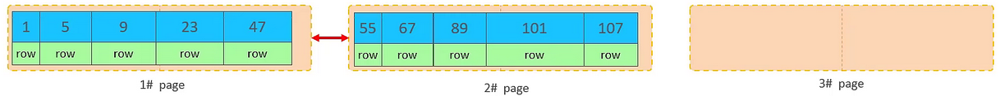
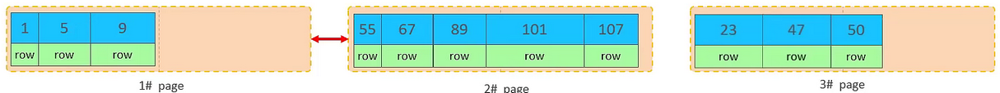
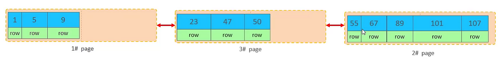
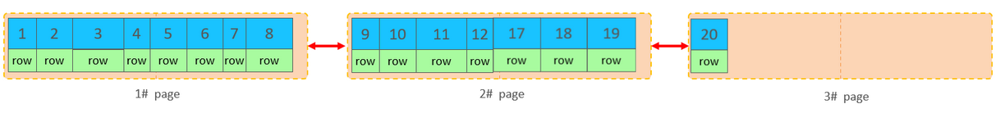
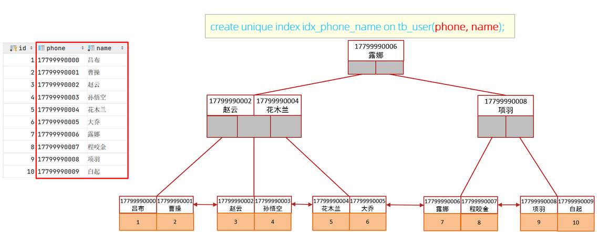

# MySQL 数据库性能优化

## 1. 性能优化总论


上图显示，越往上走，难度越来越高，收益却是越来越小的。

比如硬件和 OS 调优，需要对硬件和 OS 有着非常深刻的了解，仅仅就磁盘一项来说，一般非 DBA 能想到的调整就是 SSD 盘比用机械硬盘更好，但其实它至少包括了，使用什么样的磁盘阵列（RAID）级别、是否可以分散磁盘 IO、是否使用裸设备存放数据，使用哪种文件系统（目前比较推荐的是 XFS），操作系统的磁盘调度算法（目前比较推荐 deadline，对机械硬盘和 SSD 都比较合适。从内核 2.5开始，默认的 I/O 调度算法是 Deadline，之后默认 I/O 调度算法为 Anticipatory，直到内核 2.6.17 为止，从内核 2.6.18 开始，CFQ 成为默认的 IO 调度算法，但CFQ 并不推荐作为数据库服务器的磁盘调度算法。）选择，是否需要调整操作系统文件管理方面比如 atime 属性等等。

> TIPS：裸设备(raw device)，也叫裸分区（原始分区），是一种没有经过格式化，不被 Unix 通过文件系统来读取的特殊块设备文件。由应用程序负责对它进行读写操作。不经过文件系统的缓冲。它是不被操作系统直接管理的设备。这种设备少了操作系统这一层，I/O 效率更高。

查看磁盘调度算法：永久地修改 IO 调度算法，需要修改内核引导参数

```sql
dmesg |grep -i scheduler
df -m
more /sys/block/vda/queue/scheduler
```


在进行优化时，首先需要关注和优化的应该是架构，对于架构调优，在系统设计时首先需要充分考虑业务的实际情况，是否可以把不适合数据库做的事情放到数据仓库、搜索引擎或者缓存中去做；然后考虑写的并发量有多大，是否需要采用分布式；最后考虑读的压力是否很大，是否需要读写分离。对于核心应用或者金融类的应用，需要额外考虑数据安全因素，数据是否不允许丢失。

作为金字塔的底部的架构调优，采用更适合业务场景的架构能最大程度地提升系统的扩展性和可用性。在设计中进行垂直拆分能尽量解耦应用的依赖，对读压力比较大的业务进行读写分离能保证读性能线性扩展，而对于读写并发压力比较大的业务在 MySQL 上也有采用读写分离的大量案例。

作为金字塔的底部，在底层硬件系统、SQL 语句和参数都基本定型的情况下，单个 MySQL 数据库能提供的性能、扩展性等就基本定型了。但是通过架构设计和优化，却能承载几倍、几十倍甚至百倍于单个 MySQL 数据库能力的业务请求能力。

对于 MySQL 调优，需要确认业务表结构设计是否合理，SQL 语句优化是否足够，该添加的索引是否都添加了，是否可以剔除多余的索引等等。

最后确定系统、硬件有哪些地方需要优化，系统瓶颈在哪里，哪些系统参数需要调整优化，进程资源限制是否提到足够高；在硬件方面是否需要更换为具有更高 I/O 性能的存储硬件，是否需要升级内存、CPU、网络等。

如果在设计之初架构就不合理，比如没有进行读写分离，那么后期的 MySQL 和硬件、系统优化的成本就会很高，并且还不一定能最终解决问题。如果业务性能的瓶颈是由于索引等 MySQL 层的优化不够导致的，那么即使配置再高性能的I/O存储硬件或者 CPU 也无法支撑业务的全表扫描。

所以重点关注 MySQL 方面的调优，特别是索引。SQL/索引调优要求对业务和数据流非常清楚。在阿里巴巴内部，有三分之二的 DBA 是业务 DBA，从业务需求讨论到表结构审核、SQL 语句审核、上线、索引更新、版本迭代升级，甚至哪些数据应该放到非关系型数据库中，哪些数据放到数据仓库、搜索引擎或者缓存中，都需要这些 DBA 跟踪和复审。他们甚至可以称为数据架构师（Data Architecher）。

## 2. MySQL数据库优化准备工作

### 2.1. 慢查询的定义与作用

慢查询日志，就是查询花费大量时间的日志，是指 mysql 记录所有执行超过 `long_query_time` 参数设定的时间阈值的 SQL 语句的日志。该日志能为 SQL 语句的优化带来很好的帮助。默认情况下，慢查询日志是关闭的。

### 2.2. 慢查询基础-优化数据访问

查询性能低下最基本的原因是访问的数据太多。大部分性能低下的查询都可以通过减少访问的数据量的方式进行优化。对于低效的查询，一般通过下面两个步骤来分析总是很有效：

1. 确认应用程序是否在检索大量超过需要的数据。这通常意味着访问了太多的行，但有时候也可能是访问了太多的列。
2. 确认 MySQL 服务器层是否在分析大量超过需要的数据行。

#### 2.2.1. 请求了不需要的数据

有些查询会请求超过实际需要的数据，然后这些多余的数据会被应用程序丢弃。这会给 MySQL 服务器带来额外的负担，并增加网络开销，另外也会消耗应用服务器的 CPU 和内存资源。

- **查询不需要的记录**

大数开发者使用习惯，先使用SELECT 语句查询大量的结果，然后获取前面的 N 行后关闭结果集。他们认为 MySQL会执行查询，并只返回他们需要的N条数据，然后停止查询。实际情况是 MySQL会查询出全部的结果集，客户端的应用程序会接收全部的结果集数据，然后抛弃其中大部分数据。最简单有效的解决方法就是在这样的查询后面加上`LIMIT`。

- **总是取出全部列**

使用`SELECT * `的时候，MySQL会取出全部列，会让优化器无法完成索引覆盖扫描这类优化，还会为服务器带来额外的 I/O、内存和 CPU 的消耗。

有时可以允许查询返回超过需要的数据。如果这种做法可以简化开发，能提高相同代码片段的复用性，这种做法也是值得考虑的。如果应用程序使用了某种缓存机制，或者有其他考虑，获取超过需要的数据也可能有其好处，但不要忘记这样做的代价是什么。获取并缓存所有的列的查询，相比多个独立的只获取部分列的查询可能就更有好处。

- **重复查询相同的数据**

不断地重复执行相同的查询，然后每次都返回完全相同的数据。比较好的方案是，当初次查询的时候将这个数据缓存起来，需要的时候从缓存中取出，这样性能显然会更好。

#### 2.2.2. 是否在扫描额外的记录

对于 MySQL，最简单的衡量查询开销的三个指标：**响应时间、扫描的行数、返回的行数**

- **响应时间**

响应时间是两个部分之和：服务时间和排队时间。

服务时间是指数据库处理这个查询真正花了多长时间。

排队时间是指服务器因为等待某些资源而没有真正执行查询的时间（*可能是等 I/O 操作完成，也可能是等待行锁等。*）

当看到一个查询的响应时间的时候，首先需要审视这个响应时间是否是一个合理的值。概括地说，了解这个查询需要哪些索引以及它的执行计划是什么，然后计算大概需要多少个顺序和随机 I/O，再用其乘以在具体硬件条件下一次 I/O 的消耗时间。最后把这些消耗都加起来，就可以获得一个大概参考值来判断当前响应时间是不是一个合理的值。

- **扫描的行数和返回的行数**

分析查询时，查看该查询扫描的行数是非常有帮助的。这在一定程度上能够说明该查询找到需要的数据的效率高不高。

理想情况下扫描的行数和返回的行数应该是相同的。实际这种情况很少出现，扫描的行数对返回的行数的比率通常很小，一般在 1:1 和 10:1 之间，不过有时候这个值也可能非常非常大。

- **扫描的行数和访问类型**

评估查询开销的时候，需要考虑一下从表中找到某一行数据的成本。MySQL 有好几种访问方式可以查找并返回一行结果。有些访问方式可能需要扫描很多行才能返回一行结果，也有些访问方式可能无须扫描就能返回结果。

在 EXPLAIN 语句中的 type 列反映了查询的访问类型。如果查询没有办法找到合适的访问类型，那么解决的最好办法通常就是增加一个合适的索引，为什么索引对于查询优化如此重要了。索引让 MySQL 以最高效、扫描行数最少的方式找到需要的记录。

一般 MySQL 能够使用如下三种方式应用 `WHERE` 条件，从好到坏依次为：

1. 在索引中使用 WHERE 条件来过滤不匹配的记录。这是在存储引擎层完成
2. 使用索引覆盖扫描（在 Extra 列中出现了 Using index）来返回记录，直接从索引中过滤不需要的记录并返回命中的结果。这是在 MySQL 服务器层完成的，但无须再回表查询记录
3. 从数据表中返回数据，然后过滤不满足条件的记录（在 Extra 列中出现 Using Where)。这在 MySQL 服务器层完成，MySQL 需要先从数据表读出记录然后过滤

好的索引可以让查询使用合适的访问类型，尽可能地只扫描需要的数据行。如果发现查询需要扫描大量的数据但只返回少数的行，那么通常可以尝试下面的技巧去优化它：

1. 使用索引覆盖扫描，把所有需要用的列都放到索引中，这样存储引擎无须回表获取对应行就可以返回结果了
2. 改变库表结构。例如使用单独的汇总表。
3. 重写这个复杂的查询，让 MySQL 优化器能够以更优化的方式执行这个查询。

### 2.3. 重构查询的方式

优化有问题的查询时，目标应该是找到一个更优的方法获得实际需要的结果。有时候，可以将查询转换一种写法让其返回一样的结果，但是性能更好。但也可以通过修改应用代码，用另一种方式完成查询，最终达到一样的目的。

#### 2.3.1. 一个复杂查询还是多个简单查询

设计查询时需要考虑是否需要将一个复杂的查询分成多个简单的查询。

MySQL 从设计上让连接和断开连接都很轻量级，在返回一个小的查询结果方面很高效。现代的网络速度比以前要快很多，无论是带宽还是延迟。在某些版本的 MySQL 上，即使在一个通用服务器上，也能够运行每秒超过 10 万的查询，即使是一个千兆网卡也能轻松满足每秒超过 2000 次的查询。所以运行多个小查询现在已经不是大问题了。

MySQL 内部每秒能够扫描内存中上百万行数据，相比之下，MySQL 响应数据给客户端就慢得多了。在其他条件都相同的时候,使用尽可能少的查询当然是更好的。但是有时候，将一个大查询分解为多个小查询是很有必要的。

在应用设计的时候，如果一个查询能够胜任时还写成多个独立查询是不明智的。例如，应用对一个数据表做 10 次独立的查询来返回 10 行数据，每个查询返回一条结果，查询 10 次。

#### 2.3.2. 切分查询

将大查询切分成小查询，每个查询功能完全一样，只完成一小部分，每次只返回一小部分查询结果。

删除旧的数据就是一个很好的例子。定期地清除大量数据时，如果用一个大的语句一次性完成的话，则可能需要一次锁住很多数据、占满整个事务日志、耗尽系统资源、阻塞很多小的但重要的查询。将一个大的 DELETE 语句切分成多个较小的查询可以尽可能小地影响 MySQL 性能，同时还可以减少 MySQL 复制的延迟。

一次删除一万行数据一般来说是一个比较高效而且对服务器影响也最小的做法。同时，需要注意的是，如果每次删除数据后，都暂停一会儿再做下一次删除，这样也可以将服务器上原本一次性的压力分散到一个很长的时间段中，就可以大大降低对服务器的影响，还可以大大减少删除时锁的持有时间。

#### 2.3.3. 分解关联查询

很多高性能的应用都会对关联查询进行分解。简单地，可以对每一个表进行一次单表查询，然后将结果在应用程序中进行关联。用分解关联查询的方式重构查询有如下的优势：

- 让**缓存的效率更高**。许多应用程序可以方便地缓存单表查询对应的结果对象。将查询分解后，执行单个查询**可以减少锁的竞争**。
- 在应用层做关联，可以更容易对数据库进行拆分，**更容易做到高性能和可扩展**。查询本身效率也可能会有所提升。
- 可以**减少冗余记录的查询**。在应用层做关联查询，意味着对于某条记录应用只需要查询一次,而在数据库中做关联查询,则可能需要重复地访问一部分数据。从这点看，这样的重构还可能会减少网络和内存的消耗。

这样相当于**在应用中实现了哈希关联**，而不是使用 MySQL 的嵌套循环关联。某些场景哈希关联的效率要高很多。

在很多场景下，通过重构查询将关联放到应用程序中将会更加高效，这样的场景有很多，比如：当应用能够方便地缓存单个查询的结果的时候、当可以将数据分布到不同的 MySQL 服务器上的时候、当能够使用`IN()`的方式代替关联查询的时候、当查询中使用同一个数据表的时候。

### 2.4. SQL 执行效率查询

MySQL 客户端连接成功后，通过 `show [session|global] status` 命令可以查询服务器状态信息，查看当前数据库的 INSERT、UPDATE、DELETE、SELECT 的访问频次：

通过上述指令，可以查看到当前数据库到底是以查询为主，还是以增删改为主，从而为数据库优化提供参考依据。如果是以增删改为主，可以考虑不对其进行索引的优化。如果是以查询为主，那么就要考虑对数据库的索引进行优化了。

#### 2.4.1. 查看当前会话统计结果

```sql
mysql> show session status like 'Com_______';
+---------------+-------+
| Variable_name | Value |
+---------------+-------+
| Com_binlog    | 0     |
| Com_commit    | 0     |
| Com_delete    | 0     |
| Com_insert    | 0     |
| Com_repair    | 0     |
| Com_revoke    | 0     |
| Com_select    | 7     |
| Com_signal    | 0     |
| Com_update    | 0     |
| Com_xa_end    | 0     |
+---------------+-------+
```

重要指标说明：

- Com_delete: 删除次数
- Com_insert: 插入次数
- Com_select: 查询次数
- Com_update: 更新次数

#### 2.4.2. 查看自数据库上次启动至今统计结果

```sql
mysql> show global status like 'Com_______';
+---------------+-------+
| Variable_name | Value |
+---------------+-------+
| Com_binlog    | 0     |
| Com_commit    | 0     |
| Com_delete    | 0     |
| Com_insert    | 0     |
| Com_repair    | 0     |
| Com_revoke    | 0     |
| Com_select    | 18    |
| Com_signal    | 0     |
| Com_update    | 0     |
| Com_xa_end    | 0     |
+---------------+-------+
```

#### 2.4.3. 查看针对Innodb引擎的统计结果

```sql
mysql> show status like 'Innodb_rows_%';
+----------------------+-------+
| Variable_name        | Value |
+----------------------+-------+
| Innodb_rows_deleted  | 0     |
| Innodb_rows_inserted | 650   |
| Innodb_rows_read     | 847   |
| Innodb_rows_updated  | 0     |
+----------------------+-------+
```

### 2.5. 慢查询日志配置

#### 2.5.1. 查询慢查询日志相关参数

当查询超过一定的时间没有返回结果的时候，才会记录到慢查询日志中。**默认不开启**，采样的时候手工开启。可以帮助找出执行慢的sql语句

- 查看慢SQL日志是否启用（on表示启用）

```sql
show variables like 'slow_query_log';
```

- MySQL 中可以设定一个阈值，将运行时间超过该值的所有SQL 语句都记录到慢查询日志中。`long_query_time` 参数就是这个阈值。默认值为10（10秒）。查看执行慢于多少秒的SQL会记录到日志文件中

```sql
show variables like 'long_query_time';
```

- 对于没有运行的 SQL 语句没有使用索引，则 MySQL 数据库也可以将这条 SQL 语句记录到慢查询日志文件，控制参数是：

```sql
show VARIABLES like '%log_queries_not_using_indexes%';
```

- 对于产生的慢查询日志，可以指定输出的位置，通过参数`log_output`来控制，可以输出到[TABLE][FILE][FILE,TABLE]。默认是输出到文件，可以配置把慢查询输出到表，不过一般不推荐输出到表。

```sql
show VARIABLES like 'log_output';
```

- 使用模糊搜索，查看所有含有query的变量信息

```sql
show variables like '%query%';
```

#### 2.5.2. 开启慢查询日志方式1 - 修改mysql配置参数

mysql 配置文件名称是：`my.ini`（Linux系统下的文件名为`/etc/my.cnf`）

window 下可以通过打开【服务】，右键点击mysql服务，查询【属性】。里面有`--defaults-file="D:\development\MySQL\MySQL Server 5.5\my.ini"`，可以打到mysql配置文件的位置


修改配置文件，**1代表on，0做表off**。(*注：如果mysql5.5版本，配置文件是没有慢日志的配置，而5.7版本的配置文件里是默认有慢日志的配置。所以5.5需要自己手动增加*)：

```properties
[mysqld]
# ====== 5.5版本需要手动增加，5.7以上版本默认有慢日志配置 ======

log_slow_queries=ON
# 是否开启慢查询日志
slow_query_log=ON
# 指定保存路径及文件名，默认为数据文件目录
slow_query_log_file="slow-query.log"
# 指定多少秒返回查询结果为慢查询
long_query_time=2
# 记录所有没有使用到索引的查询语句
log_queries_not_using_indexes=ON
# 记录那些由于查找了多于1000次而引发的慢查询
min_examined_row_limit=1000
# 记录那些慢的optimize table, analyze table和alter table语句
log_slow_admin_statements=1
# 记录由slave所产生的慢查询
log_slow_slave_statements=1

# The TCP/IP Port the MySQL Server will listen on
port=3306
```

修改配置文件后需要重启mysql服务才能生效

#### 2.5.3. 开启慢查询日志方式2 - 命令行修改慢查询配置

**命令行修改配置方式不需要重启即可生效，但如果重启之后会自动失效**。因为mysql数据库每次启动，都是读取本身的my.ini配置文件，以配置文件的参数为准

```sql
-- 启动停止慢查询日志
set global slow_query_log=1;
-- 指定慢查询日志得存储路径及文件（默认和数据文件放一起）
set global slow_query_log_file="slow-query.log";
--  指定记录慢查询日志 SQL 执行时间得伐值（单位：秒，默认 10 秒）
set global long_query_time=2;
-- 是否记录未使用索引的 SQL
set global log_queries_not_using_indexes=1;
set global min_examined_row_limit=1000;
set global log_slow_admin_statements=1;
set global log_slow_slave_statements=1;
-- 指定日志输出的位置，日志存放的地方可以是[TABLE][FILE][FILE,TABLE]
set global log_output='FILE,TABLE';
```

如果需要修改其他参数，可以通过以下命令查阅

```sql
show variables like '%query%';
show variables like '%slow%';
```

#### 2.5.4. 慢查询日志保存位置

windows 与 linux 系统的慢查询日志默认是和数据文件放一起。linux 系统默认数据文件存储位置是 `/var/lib/mysql/`，可以通过查看 `/etc/my.cnf` 配置文件确认日志与数据的保存位置。

### 2.6. 查询缓存

#### 2.6.1. 查询缓存状态

Query Cache 会缓存 select 查询，安装 mysql 时默认是开启。但是如果对表进行了 insert, update, delete, truncate, alter table, drop table, or drop database 等操作时，之前的缓存会无效并且删除。这样一定程度上会影响数据库的性能。

所以对一些频繁变动表的情况开启缓存是不明智的。还有一种情况是在测试数据库性能的时候也需要关闭缓存，避免缓存对于测试数据的影响

查询缓存的启用状态，query_cache_type 字段是  on的时候，代表开启缓存

```sql
show variables like '%cache%';
```

#### 2.6.2. 关闭缓存

关闭缓存有两种方式：一种是临时关闭，一种是永久关闭

1. 临时关闭，直接在命令行执行

```sql
-- 一般建议缓存的大小为32M (33554432)
set global query_cache_size=0;
-- 如果配置文件中为关闭缓存的话，不能通过命令开启缓存
set global query_cache_type=0;
```

2. 永久关闭，修改配置文件my.cnf(my.ini)，添加以下配置

```ini
# 设置缓存的大小
query_cache_size=0
# 设置关闭缓存
query_cache_type=0
```

#### 2.6.3. `sql_no_cache`关键字禁用缓存

可以使用`sql_no_cache`关键字在sql语句中直接禁用缓存。如：

```sql
-- 指定当前查询不使用缓存
select sql_no_cache count(*) from test_table;
-- 指定当前查询使用缓存（其实不需要加此关键字，因为默认缓存已经开启了）
select sql_cache count(*) from test_table;
```

## 3. SQL 语句性能分析

### 3.1. 定位低效率执行的 SQL

可以通过以下两种方式定位执行效率较低的 SQL 语句。

- 通过慢查询日志定位那些执行效率较低的 SQL 语句。
- 通过 `EXPLAIN` 执行计划分析
- 使用 `show processlist` 命令查看当前MySQL在进行的线程，包括线程的状态、是否锁表等，可以实时地查看 SQL 的执行情况，同时对一些锁表操作进行优化。
- 使用 profile 详情分析

### 3.2. 慢查询解读分析

#### 3.2.1. 慢日志格式

一条完整的日志包括：时间、主机信息、执行信息、执行时间、执行内容

```log
# Time: 2021-04-24T00:22:49.818178Z
# User@Host: root[root] @ localhost [127.0.0.1]
# Query_time: 0.011991  Lock_time: 0.000000 Rows_sent: 10374  Rows_examined: 14376
SET timestamp=1554258810;
SELECT t.id,t.a_ids FROM t_main t WHERE t.a_ids LIKE '%,%';
```

从慢查询日志里面摘选一条慢查询日志，数据组成如下：

- `Time: 2021-04-24T00:22:49.818178Z`：查询执行时间
- `User@Host: root[root] @ localhost [127.0.0.1]`：用户名、用户的 IP 信息、线程 ID 号
- `Query_time: 0.011991`：执行花费的时长【单位：毫秒】
- `Lock_time: 0.000000`：执行获得锁的时长
- `Rows_sent: 10374`：获得的结果行数
- `Rows_examined: 14376`：扫描的数据行数
- `SET timestamp=1554258810;`：这 SQL 执行的具体时间
- 最后一行：执行的 SQL 语句

#### 3.2.2. 分析工具(了解)

##### 3.2.2.1. Mysqldumpslow

mysqldumpslow 是 mysql 自带的用来分析慢查询的工具，基于 perl 开发。常用的慢查询日志分析工具，汇总除查询条件外其他完全相同的 SQL，并将分析结果按照参数中所指定的顺序输出。语法格式如下：

```bash
mysqldumpslow -s r -t 10 slow-mysql.log
```

参数说明

```
-s order (c,t,l,r,at,al,ar)
    c:总次数
    t:总时间
    l:锁的时间
    r:获得的结果行数
    at,al,ar :指 t,l,r 平均数【例如：at = 总时间/总次数】
-s 对结果进行排序，怎么排，根据后面所带的 (c,t,l,r,at,al,ar)，缺省为 at
-t NUM just show the top n queries：仅显示前 n 条查询
-g PATTERN grep: only consider stmts that include this string：通过 grep 来筛选语句。
```

示例：

```bash
./mysqldumpslow -s t -t 10 /home/mysql/mysql57/data/iZwz9j203ithc4gu1uvb2wZ-slow.log
```


```bash
./mysqldumpslow -s t -t 10 /home/mysql/mysql57/data/iZwz9j203ithc4gu1uvb2wZ-slow.log -g select
```


> Windows 下需要下载安装 perl 编译器，下载地址：http://pan.baidu.com/s/1i3GLKAp
>
> 参考资料：https://www.cnblogs.com/moss_tan_jun/p/8025504.html

##### 3.2.2.2. Mysqlsla

Mysqlsla 是 daniel-nichter 用 perl 写的一个脚本，专门用于处理分析 Mysql 的日志而存在。通过 Mysql 的日志主要分为：General log，slow log，binary log 三种。通过 query 日志，可以分析业务的逻辑，业务特点。通过 slow log，可以找到服务器的瓶颈。通过 binary log，可以恢复数据。Mysqlsla 可以处理其中的任意日志。

参考：https://yq.aliyun.com/articles/59260

##### 3.2.2.3. pt-query-digest

pt-query-digest 是用于分析 mysql 慢查询的一个工具，它可以分析 binlog、General log、slowlog，也可以通过 SHOWPROCESSLIST 或者通过 tcpdump 抓取的 MySQL 协议数据来进行分析。可以把分析结果输出到文件中，分析过程是先对查询语句的条件进行参数化，然后对参数化以后的查询进行分组统计，统计出各查询的执行时间、次数、占比等，可以借助分析结果找出问题进行优化。

参考：https://blog.csdn.net/seteor/article/details/24017913

### 3.3. EXPLAIN 执行计划

#### 3.3.1. explain简介

一条查询语句在经过 MySQL 查询优化器的各种基于成本和规则的优化会后生成一个所谓的执行计划，这个执行计划展示了接下来具体执行查询的方式，比如多表连接的顺序是什么，对于每个表采用什么访问方法来具体执行查询等等。

MySQL数据库的`explain`关键字显示了MySQL如何使用索引来处理select语句以及连接表，`explain`可以帮助分析 select 语句，知道查询效率低下的原因，从而改进查询语句，让查询优化器能够更好的工作。总体来说，通过`EXPLAIN`关键字可以：

- 表的读取顺序
- 数据读取操作的操作类型
- 哪些索引可以使用
- 哪些索引被实际使用
- 表之间的引用
- 每张表有多少行被优化器查询

#### 3.3.2. 执行计划的语法

在SQL查询语句前加上`EXPLAIN`关键字即可。 **`EXPLAIN`后面即是要分析的SQL语句**。示例如下：

```sql
mysql> EXPLAIN SELECT * FROM order_exp;
+----+-------------+-----------+------------+------+---------------+------+---------+------+-------+----------+-------+
| id | select_type | table     | partitions | type | possible_keys | key  | key_len | ref  | rows  | filtered | Extra |
+----+-------------+-----------+------------+------+---------------+------+---------+------+-------+----------+-------+
|  1 | SIMPLE      | order_exp | NULL       | ALL  | NULL          | NULL | NULL    | NULL | 10311 |   100.00 | NULL  |
+----+-------------+-----------+------------+------+---------------+------+---------+------+-------+----------+-------+
```

> 除了以`SELECT`开头的查询语句，其余的`DELETE`、`INSERT`、`REPLACE`以及`UPDATE` 语句前边都可以加上`EXPLAIN`，用来查看这些语句的执行计划

#### 3.3.3. 字段类型汇总表

|     字段      |                                    说明                                     |
| :-----------: | --------------------------------------------------------------------------- |
|      id       | 查询中执行 `select` 子句或操作表的顺序，每个`SELECT`关键字都对应一个唯一的id      |
|  select_type  | 所使用的SELECT查询类型，*常见类型详见各列说明章节*                               |
|     table     | 所使用的的数据表的名字                                                        |
|  partitions   | 匹配的分区信息                                                                |
|     type      | 表示 MySQL 在表中找到所需行的方式，又称“访问类型”。*取值与优劣排序详见各列说明章节* |
| possible_keys | 可能使用哪个索引在表中找到记录                                                 |
|      key      | 实际使用的索引                                                                |
|    key_len    | 索引中使用的字节数长度                                                        |
|      ref      | 当使用索引列等值查询时，显示哪个与索引列进行等值匹配的对象信息被使用了              |
|     rows      | 估算的找到所需的记录所需要读取的行数                                            |
|   filtered    | 通过条件过滤出后剩余行数的百分比估计值                                          |
|     extra     | 包含不适合在其他列中显示但十分重要的额外信息                                     |

#### 3.3.4. id 列

选定的执行计划中查询的序列号。**表示查询中执行select子句或操作表的顺序，<font color=red>id值越大优先级越高</font>，越先被执行。id相同，执行顺序由上至下**。

##### 3.3.4.1. 单 SELECT 关键字

```sql
mysql> EXPLAIN SELECT * FROM s1 WHERE order_no = 'a';
+----+-------------+-------+------------+------+---------------+--------------+---------+-------+------+----------+-------+
| id | select_type | table | partitions | type | possible_keys | key          | key_len | ref   | rows | filtered | Extra |
+----+-------------+-------+------------+------+---------------+--------------+---------+-------+------+----------+-------+
|  1 | SIMPLE      | s1    | NULL       | ref  | idx_order_no  | idx_order_no | 152     | const |    1 |   100.00 | NULL  |
+----+-------------+-------+------------+------+---------------+--------------+---------+-------+------+----------+-------+
```

##### 3.3.4.2. 连接查询

对于连接查询来说，一个`SELECT`关键字后边的`FROM`子句中可以跟随多个表，所以在连接查询的执行计划中，每个表都会对应一条记录，但是这些记录的id 值都是相同的

```sql
mysql> EXPLAIN SELECT * FROM s1 INNER JOIN s2;
+----+-------------+-------+------------+------+---------------+------+---------+------+------+----------+---------------------------------------+
| id | select_type | table | partitions | type | possible_keys | key  | key_len | ref  | rows | filtered | Extra                                 |
+----+-------------+-------+------------+------+---------------+------+---------+------+------+----------+---------------------------------------+
|  1 | SIMPLE      | s1    | NULL       | ALL  | NULL          | NULL | NULL    | NULL |    1 |   100.00 | NULL                                  |
|  1 | SIMPLE      | s2    | NULL       | ALL  | NULL          | NULL | NULL    | NULL |    1 |   100.00 | Using join buffer (Block Nested Loop) |
+----+-------------+-------+------------+------+---------------+------+---------+------+------+----------+---------------------------------------+
```

##### 3.3.4.3. 包含子查询

对于包含子查的查询语句来说，就可能涉及多个`SELECT`关键字，所以在包含子查询的查询语句的执行计划中，每个`SELECT`关键字都会对应一个唯一的id值

```sql
mysql> EXPLAIN SELECT * FROM s1 WHERE id IN (SELECT id FROM s2) OR order_no = 'a';
+----+--------------------+-------+------------+-----------------+---------------+---------+---------+------+------+----------+-------------+
| id | select_type        | table | partitions | type            | possible_keys | key     | key_len | ref  | rows | filtered | Extra       |
+----+--------------------+-------+------------+-----------------+---------------+---------+---------+------+------+----------+-------------+
|  1 | PRIMARY            | s1    | NULL       | ALL             | idx_order_no  | NULL    | NULL    | NULL |    1 |   100.00 | Using where |
|  2 | DEPENDENT SUBQUERY | s2    | NULL       | unique_subquery | PRIMARY       | PRIMARY | 8       | func |    1 |   100.00 | Using index |
+----+--------------------+-------+------------+-----------------+---------------+---------+---------+------+------+----------+-------------+
```

需要特别注意，查询优化器可能对涉及子查询的查询语句进行重写，从而转换为连接查询。所以如果想知道查询优化器对某个包含子查询的语句是否进行了重写，直接查看执行计划即可

```sql
mysql> EXPLAIN SELECT * FROM s1 WHERE id IN (SELECT id FROM s2 WHERE order_no = 'a');
+----+-------------+-------+------------+--------+----------------------+---------+---------+--------------+------+----------+-------------+
| id | select_type | table | partitions | type   | possible_keys        | key     | key_len | ref          | rows | filtered | Extra       |
+----+-------------+-------+------------+--------+----------------------+---------+---------+--------------+------+----------+-------------+
|  1 | SIMPLE      | s1    | NULL       | ALL    | PRIMARY              | NULL    | NULL    | NULL         |    1 |   100.00 | NULL        |
|  1 | SIMPLE      | s2    | NULL       | eq_ref | PRIMARY,idx_order_no | PRIMARY | 8       | tempdb.s1.id |    1 |   100.00 | Using where |
+----+-------------+-------+------------+--------+----------------------+---------+---------+--------------+------+----------+-------------+
```

> 虽然示例的查询语句是一个子查询，但是执行计划中 s1 和 s2 表对应的记录的 id 值全部是 1，这就表明了查询优化器将子查询转换为了连接查询

##### 3.3.4.4. 包含 UNION 子句

包含`UNION`子句的查询语句，`UNION`子句会把多个查询的结果集合并起来并对结果集中的记录进行去重。MySQL使用的是内部的临时表来实现去重。在查询计划中，在内部创建了一个名为`<union1,2>`的临时表（就是执行计划第三条记录的 table 列的名称)，id 为 NULL 表明这个临时表是为了合并两个查询的结果集而创建的

```sql
mysql> EXPLAIN SELECT * FROM s1 UNION SELECT * FROM s2;
+------+--------------+------------+------------+------+---------------+------+---------+------+------+----------+-----------------+
| id   | select_type  | table      | partitions | type | possible_keys | key  | key_len | ref  | rows | filtered | Extra           |
+------+--------------+------------+------------+------+---------------+------+---------+------+------+----------+-----------------+
|    1 | PRIMARY      | s1         | NULL       | ALL  | NULL          | NULL | NULL    | NULL |    1 |   100.00 | NULL            |
|    2 | UNION        | s2         | NULL       | ALL  | NULL          | NULL | NULL    | NULL |    1 |   100.00 | NULL            |
| NULL | UNION RESULT | <union1,2> | NULL       | ALL  | NULL          | NULL | NULL    | NULL | NULL | NULL     | Using temporary |
+------+--------------+------------+------------+------+---------------+------+---------+------+------+----------+-----------------+
```

跟`UNION`对比起来，`UNION ALL`就不需要为最终的结果集进行去重，它只是单纯的把多个查询的结果集中的记录合并成一个并返回给用户，所以也就不需要使用临时表。所以在包含`UNION ALL`子句的查询的执行计划中，就没有那个id为NULL的记录

```sql
mysql> EXPLAIN SELECT * FROM s1 UNION ALL SELECT * FROM s2;
+----+-------------+-------+------------+------+---------------+------+---------+------+------+----------+-------+
| id | select_type | table | partitions | type | possible_keys | key  | key_len | ref  | rows | filtered | Extra |
+----+-------------+-------+------------+------+---------------+------+---------+------+------+----------+-------+
|  1 | PRIMARY     | s1    | NULL       | ALL  | NULL          | NULL | NULL    | NULL |    1 |   100.00 | NULL  |
|  2 | UNION       | s2    | NULL       | ALL  | NULL          | NULL | NULL    | NULL |    1 |   100.00 | NULL  |
+----+-------------+-------+------------+------+---------------+------+---------+------+------+----------+-------+
```

#### 3.3.5. select_type 列

表示所使用select查询类型，MySQL 为每一个`SELECT`关键字代表的小查询都定义了一个称之为`select_type`的属性，意思是我们只要知道了某个小查询的`select_type`属性，就知道了这个小查询在整个大查询中扮演了一个什么角色。常见类型汇总表如下：

|         类型         |                                                                                                         说明                                                                                                          |
| :------------------: | --------------------------------------------------------------------------------------------------------------------------------------------------------------------------------------------------------------------- |
|        SIMPLE        | 简单的select查询，SQL中不包含子查询或者UNION。                                                                                                                                                                           |
|       PRIMARY        | 最外层的select查询，查询中包含复杂的子查询部分，最外层查询被标记为PRIMARY                                                                                                                                                   |
|        UNION         | UNION 中的第二个或随后的select查询，不依赖于外部查询的结果集                                                                                                                                                               |
|     UNION RESULT     | 从 UNION 表获取结果集的SELECT查询被标记为 UNION RESULT                                                                                                                                                                   |
|       SUBQUERY       | 子查询中的第一个 select 查询，不依赖于外部查询的结果集                                                                                                                                                                     |
|   DEPENDENT UNION    | UNION 中的第二个或随后的select查询，依赖于外部查询的结果集                                                                                                                                                                 |
|  DEPENDENT SUBQUERY  | 子查询中的第一个 select 查询，依赖于外部查询的结果集                                                                                                                                                                       |
|       DERIVED        | DERIVED（衍生）用来表示包含在 from 子句中的子查询的 select 语句。若 UNION 包含在 FROM 子句的子查询中，外层 SELECT 将被标记为 DERIVED。mysql 会递归执行并将结果放到一个临时表中。服务器内部称为"派生表"，因为该临时表是从子查询中派生出来 |
|     MATERIALIZED     | 物化子查询                                                                                                                                                                                                             |
| UNCACHEABLE SUBQUERY | 结果集不能被缓存的子查询，必须重新为外层查询的每一行进行评估，极少出现                                                                                                                                                       |
|  UNCACHEABLE UNION   | UNION 中的第二个或随后的select查询，属于不可缓存的子查询，极少出现                                                                                                                                                          |
|      DEPENDENT       | 意味着 select 依赖于外层查询中发现的数据                                                                                                                                                                                 |
|     UNCACHEABLE      | 意味着 select 中的某些特性阻止结果被缓存于一个 item_cache中                                                                                                                                                               |

##### 3.3.5.1. SIMPLE 类型

简单的 select 查询，查询中不包含子查询或者 UNION

```sql
mysql> EXPLAIN SELECT * FROM s1 WHERE order_no = 'a';
+----+-------------+-------+------------+------+---------------+--------------+---------+-------+------+----------+-------+
| id | select_type | table | partitions | type | possible_keys | key          | key_len | ref   | rows | filtered | Extra |
+----+-------------+-------+------------+------+---------------+--------------+---------+-------+------+----------+-------+
|  1 | SIMPLE      | s1    | NULL       | ref  | idx_order_no  | idx_order_no | 152     | const |    1 |   100.00 | NULL  |
+----+-------------+-------+------------+------+---------------+--------------+---------+-------+------+----------+-------+
```

连接查询也算是 SIMPLE 类型

```sql
mysql> EXPLAIN SELECT * FROM s1 INNER JOIN s2;
+----+-------------+-------+------------+------+---------------+------+---------+------+------+----------+---------------------------------------+
| id | select_type | table | partitions | type | possible_keys | key  | key_len | ref  | rows | filtered | Extra                                 |
+----+-------------+-------+------------+------+---------------+------+---------+------+------+----------+---------------------------------------+
|  1 | SIMPLE      | s1    | NULL       | ALL  | NULL          | NULL | NULL    | NULL |    1 |   100.00 | NULL                                  |
|  1 | SIMPLE      | s2    | NULL       | ALL  | NULL          | NULL | NULL    | NULL |    1 |   100.00 | Using join buffer (Block Nested Loop) |
+----+-------------+-------+------------+------+---------------+------+---------+------+------+----------+---------------------------------------+
```

##### 3.3.5.2. PRIMARY 类型

对于包含`UNION`、`UNION ALL`或者子查询的大查询来说，它是由几个小查询组成的，其中最左边的那个查询的`select_type`值就是`PRIMARY`

```sql
mysql> EXPLAIN SELECT * FROM s1 UNION SELECT * FROM s2;
+------+--------------+------------+------------+------+---------------+------+---------+------+------+----------+-----------------+
| id   | select_type  | table      | partitions | type | possible_keys | key  | key_len | ref  | rows | filtered | Extra           |
+------+--------------+------------+------------+------+---------------+------+---------+------+------+----------+-----------------+
|    1 | PRIMARY      | s1         | NULL       | ALL  | NULL          | NULL | NULL    | NULL |    1 |   100.00 | NULL            |
|    2 | UNION        | s2         | NULL       | ALL  | NULL          | NULL | NULL    | NULL |    1 |   100.00 | NULL            |
| NULL | UNION RESULT | <union1,2> | NULL       | ALL  | NULL          | NULL | NULL    | NULL | NULL | NULL     | Using temporary |
+------+--------------+------------+------------+------+---------------+------+---------+------+------+----------+-----------------+
```

##### 3.3.5.3. UNION 类型

对于包含`UNION`或者`UNION ALL`的大查询来说，它是由几个小查询组成的，其中除了最左边的那个小查询以外，其余的查询的`select_type`值就是`UNION`。（*参考上面`PRIMARY`的示例*）

##### 3.3.5.4. UNION RESULT 类型

MySQL 选择使用临时表来完成`UNION`查询的去重工作，针对该临时表的查询的`select_type`就是`UNION RESULT`。（*参考上面`PRIMARY`的示例*）

##### 3.3.5.5. SUBQUERY 类型

如果包含子查询的查询语句不能够转为对应的`semi-join`的形式，并且该子查询是不相关子查询，并且查询优化器决定采用将该子查询物化的方案来执行该子查询时，该子查询的第一个`SELECT`关键字代表的那个查询的`select_type`就是`SUBQUERY`

```sql
mysql> EXPLAIN SELECT * FROM s1 WHERE id IN (SELECT id FROM s2) OR order_no = 'a';
+----+--------------------+-------+------------+-----------------+---------------+---------+---------+------+------+----------+-------------+
| id | select_type        | table | partitions | type            | possible_keys | key     | key_len | ref  | rows | filtered | Extra       |
+----+--------------------+-------+------------+-----------------+---------------+---------+---------+------+------+----------+-------------+
|  1 | PRIMARY            | s1    | NULL       | ALL             | idx_order_no  | NULL    | NULL    | NULL |    1 |   100.00 | Using where |
|  2 | DEPENDENT SUBQUERY | s2    | NULL       | unique_subquery | PRIMARY       | PRIMARY | 8       | func |    1 |   100.00 | Using index |
+----+--------------------+-------+------------+-----------------+---------------+---------+---------+------+------+----------+-------------+
```

需要注意的是，由于`select_type`为`SUBQUERY`的子查询由于会被物化，所以只需要执行一遍

> 涉及相关名词解释：
>
> - **semi-join**：半连接优化技术，本质上是把子查询上拉到父查询中，与父查询的表做 join 操作。关键词是“上拉”。对于子查询，其子查询部分相对于父表的每个符合条件的元组，都要把子查询执行一轮。效率低下。用半连接操作优化子查询，是把子查询上拉到父查询中，这样子查询的表和父查询中的表是并列关系，父表的每个符合条件的元组，只需要在子表中找符合条件的元组即可。简单来说，就是通过将子查询上拉对父查询中的数据进行筛选，以使获取到最少量的足以对父查询记录进行筛选的信息就足够了。
> - **子查询物化**：子查询的结果通常缓存在内存或临时表中。
> - **关联/相关子查询**：子查询的执行依赖于外部查询。多数情况下是子查询的`WHERE`子句中引用了外部查询的表。自然“非关联/相关子查询”的执行则不依赖与外部的查询。

##### 3.3.5.6. DEPENDENT UNION、DEPENDENT SUBQUERY 类型

在包含`UNION`或者`UNION ALL`的大查询中，如果各个小查询都依赖于外层查询的话，那除了最左边的那个小查询之外，其余的小查询的`select_type`的值就是`DEPENDENT UNION`。例如以下查询：

```sql
mysql> EXPLAIN SELECT * FROM s1 WHERE id IN (SELECT id FROM s2 WHERE id = 3 UNION SELECT id FROM s1 WHERE id = 1);
+------+--------------------+------------+------------+-------+---------------+---------+---------+-------+------+----------+-----------------+
| id   | select_type        | table      | partitions | type  | possible_keys | key     | key_len | ref   | rows | filtered | Extra           |
+------+--------------------+------------+------------+-------+---------------+---------+---------+-------+------+----------+-----------------+
|    1 | PRIMARY            | s1         | NULL       | ALL   | NULL          | NULL    | NULL    | NULL  |    2 |   100.00 | Using where     |
|    2 | DEPENDENT SUBQUERY | s2         | NULL       | const | PRIMARY       | PRIMARY | 8       | const |    1 |   100.00 | Using index     |
|    3 | DEPENDENT UNION    | s1         | NULL       | const | PRIMARY       | PRIMARY | 8       | const |    1 |   100.00 | Using index     |
| NULL | UNION RESULT       | <union2,3> | NULL       | ALL   | NULL          | NULL    | NULL    | NULL  | NULL | NULL     | Using temporary |
+------+--------------------+------------+------------+-------+---------------+---------+---------+-------+------+----------+-----------------+
```

> 示例查询比较复杂，大查询里包含了一个子查询，子查询里又是由`UNION`连起来的两个小查询。从执行计划中可以看出来，`SELECT id FROM s2 WHERE id = 3`这个小查询由于是子查询中第一个查询，所以它的`select_type`是`OEPENDENTSUBOUERY`，而`SELECT id FROM s1 WHERE id = 1`这个查询的`select_type`就是`DEPENDENT UNION`。

MySQL优化器对`IN`操作符的优化会将`IN`中的非关联子查询优化成一个关联子查询。我们可以在执行上面那个执行计划后，马上执行`show warnings\G`，可以看到MySQL对SQL语句的大致改写情况：


##### 3.3.5.7. DERIVED 类型

对于采用物化的方式执行的包含派生表的查询，该派生表对应的子查询的`select_type`就是`DERIVED`

```sql
mysql> EXPLAIN SELECT * FROM (SELECT id, count(*) as c FROM s1 GROUP BY id) AS derived_s1 where c >1;
+----+-------------+------------+------------+-------+-------------------------------------------------------+---------+---------+------+------+----------+-------------+
| id | select_type | table      | partitions | type  | possible_keys                                         | key     | key_len | ref  | rows | filtered | Extra       |
+----+-------------+------------+------------+-------+-------------------------------------------------------+---------+---------+------+------+----------+-------------+
|  1 | PRIMARY     | <derived2> | NULL       | ALL   | NULL                                                  | NULL    | NULL    | NULL |    2 |    50.00 | Using where |
|  2 | DERIVED     | s1         | NULL       | index | PRIMARY,u_idx_day_status,idx_order_no,idx_insert_time | PRIMARY | 8       | NULL |    2 |   100.00 | Using index |
+----+-------------+------------+------------+-------+-------------------------------------------------------+---------+---------+------+------+----------+-------------+
```

上面示例id为2的记录就代表子查询的执行方式，该子查询是以物化的方式执行的。id 为 1 的记录代表外层查询，注意到它的 table 列显示的是`<derived2>`，表示该查询是针对将派生表物化之后的表进行查询的。

##### 3.3.5.8. MATERIALIZED 类型

当查询优化器在执行包含子查询的语句时，选择将子查询物化之后与外层查询进行连接查询时，该子查询对应的`select_type` 属性就是`MATERIALIZED`，例如以下查询：


执行计划的id值为2的第三条记录，说明查询优化器是要把子查询先转换成物化表。

执行计划的前两条记录的id值都为1，说明这两条记录对应的表进行连接查询，需要注意的是第二条记录的`table`列的值是`<subquery2>`，说明该表其实就是id为2对应的子查询执行之后产生的物化表，然后将 s1和该物化表进行连接查询

##### 3.3.5.9. UNCACHEABLE SUBQUERY、UNCACHEABLE UNION 类型

极少出现，示例如下：

```sql
mysql> explain select * from s1 where id = ( select id from s2 where order_no=@@sql_log_bin);
+----+----------------------+-------+------------+-------+---------------+--------------+---------+------+------+----------+--------------------------------+
| id | select_type          | table | partitions | type  | possible_keys | key          | key_len | ref  | rows | filtered | Extra                          |
+----+----------------------+-------+------------+-------+---------------+--------------+---------+------+------+----------+--------------------------------+
|  1 | PRIMARY              | NULL  | NULL       | NULL  | NULL          | NULL         | NULL    | NULL | NULL | NULL     | no matching row in const table |
|  2 | UNCACHEABLE SUBQUERY | s2    | NULL       | index | idx_order_no  | idx_order_no | 152     | NULL |    2 |    50.00 | Using where; Using index       |
+----+----------------------+-------+------------+-------+---------------+--------------+---------+------+------+----------+--------------------------------+
```

#### 3.3.6. table 列

不论我们的查询语句有多复杂，里边包含了多少个表，到最后也是需要对每个表进行单表访问。MySQL 规定 EXPLAIN 语句输出的每条记录都对应着某个单表的访问方法，该条记录的 table 列代表着该表的表名，是显示这一行的数据所使用的数据表的名字，是按被读取的先后顺序排列。


> 由示例可以看出：只涉及对 s1 表的单表查询，所以 EXPLAIN 输出中只有一条记录，其中的 table 列的值是 s1，而连接查询的执行计划中有两条记录，这两条记录的table列分别是 s1 和 s2。

#### 3.3.7. partitions 列

和分区表有关，一般情况下查询语句的执行计划的`partitions`列的值都是`NULL`。

#### 3.3.8. type 列

显示连接使用了何种类型。**此列是分析执行计划重要的指标**，连接类型结果值从最好到最差的排序如下：

```
NULL > system > const > eq_ref > ref > fulltext > ref_or_null > index_merge > unique_subquery > index_subquery > range > index > ALL
```

> 出现比较多的是 `system | const | eq_ref | ref | range | index | ALL`
>
> <font color=red>**一般来说，保证查询至少达到range级别，最好能达到ref级别**</font>。

type 列常见的类型汇总表：

|       类型        |                                                                                                                           说明                                                                                                                           |
| :---------------: | ------------------------------------------------------------------------------------------------------------------------------------------------------------------------------------------------------------------------------------------------------- |
|       `all`       | full table scan，mysql将遍历全表以找到匹配的行；全表扫描从磁盘中获取数据百万级别的数据ALL类型的数据尽量优化                                                                                                                                                       |
|      `index`      | Full index scan，扫描遍历索引树(扫描全表的索引，从索引中获取数据)。index和all的区别在于index类型只遍历索引                                                                                                                                                       |
|      `range`      | 索引范围扫描，对索引的扫描开始于某一点，返回匹配值的行，只检索给定范围的行，使用一个索引来选着行。key列显示使用了哪个索引。一般在WHERE语句中出现`between`、`<`、`>`、`in`等查询，这种给定范围扫描比全表扫描要好。因为它只需要开始于索引的某一点，而结束于另一点，不用扫描全部索引。 |
| `index_subquery`  | 该联接类型类似于unique_subquery。可以替换IN子查询，但只适合下列形式的子查询中的非唯一索引：`value IN (SELECT key_column FROM single_table WHERE some_expr)`                                                                                                      |
| `unique_subquery` | 该类型替换了下面形式的`IN`子查询的 ref: `value IN (SELECT primary_key FROM single_table WHERE some_expr) `。unique_subquery是一个索引查找函数，可以完全替换子查询，效率更高。                                                                                     |
|   `index_merge`   | 该联接类型表示使用了索引合并优化方法                                                                                                                                                                                                                        |
|   `ref_or_null`   | 该联接类型如同ref，但是添加了MySQL可以专门搜索包含NULL值的行                                                                                                                                                                                                  |
|    `fulltext`     | 全文索引                                                                                                                                                                                                                                                 |
|       `ref`       | 非唯一性索引扫描，返回匹配某个单独值的所有行，常见于使用非唯一索引即唯一索引的非唯一前缀进行查找；本质上是一种索引访问，它返回所有匹配某个单独值的行，就是说它可能会找到多条符合条件的数据，所以他是查找与扫描的混合体。                                                        |
|     `eq_ref`      | 唯一性索引扫描，对于每个索引键，表中只有一条记录与之匹配，常用于主键或者唯一索引扫描                                                                                                                                                                              |
|      `const`      | 当mysql对某查询某部分进行优化，并转为一个常量时，使用这些访问类型。通过索引一次查到数据，该类型主要用于比较primary key或者unique索引，因为只匹配一行数据，所以很快；如果将主键置于WHERE语句后面，Mysql就能将该查询转换为一个常量。                                            |
|     `system`      | 表只有一条记录(等于系统表)，这是const类型的特例，平时业务中不会出现                                                                                                                                                                                            |
|      `NULL`       | MySQL 在优化过程中分解语句，执行时甚至不用访问表或索引，例如从一个索引列里选取最小值可以通过单独索引查找完成                                                                                                                                                        |

##### 3.3.8.1. system 类型

当表中只有一条记录并且该表使用的存储引擎的统计数据是精确的，那么对该表的访问方式就是`system`级别。比如MyISAM、Memory之类：


> <font color=red>**注意：只有在MyISAM这种存储引擎中，才会精确统计数据，如果改成使用InnoDB存储引擎，因为该引擎的统计非精确的，所以使用`select * from table`的话，会进行全表扫描（即`all`类型）**</font>


##### 3.3.8.2. const 类型

当根据主键或者唯一二级索引列与常数进行等值匹配，来定位一条记录，对单表的访问的类型被MySQL定义为`const`（*意思是常数级别的，代价是可以忽略不计的*）。如果主键或者唯一二级索引是<u>**由多个列**</u>构成的话，<u>**组成索引的每一个列都是与常数进行等值比较**</u>时，此时访问方法才是`const`。

```sql
mysql> EXPLAIN SELECT * FROM s1 WHERE id = 1;
+----+-------------+-------+------------+-------+---------------+---------+---------+-------+------+----------+-------+
| id | select_type | table | partitions | type  | possible_keys | key     | key_len | ref   | rows | filtered | Extra |
+----+-------------+-------+------------+-------+---------------+---------+---------+-------+------+----------+-------+
|  1 | SIMPLE      | s1    | NULL       | const | PRIMARY       | PRIMARY | 8       | const |    1 |   100.00 | NULL  |
+----+-------------+-------+------------+-------+---------------+---------+---------+-------+------+----------+-------+
```

B+树叶子节点中的记录是按照索引列排序的，对于的聚簇索引来说，它对应的B+树叶子节点中的记录就是按照id列排序的。B+树矮胖，所以这样根据主键值定位一条记录的速度很快。同样，根据唯一联合索引列来定位一条记录的速度也很快，MySQL会分两步执行，首先在唯一联合索引对应的B+树中，根据索引列与常数的等值比较条件定位到一条联合索引记录，然后再根据该记录的id值到聚簇索引中获取到完整的行记录。

<u>值得注意的是：对于唯一二级索引来说，<font color=red>**查询该列包含为NULL值的情况比较特殊，在MySQL中认为每一个`null`都是独一无二的，并且会将所有为null值的行数据索引的叶子结点的最前面**</font>。而唯一二级索引列并不限制 NULL 值的数量，所以可能会访问到多条记录，也就是说`is null`不可以使用`const`类型访问方法来执行。</u>

##### 3.3.8.3. eq_ref 类型

在连接查询时，如果被驱动表是通过主键或者唯一二级索引列等值匹配的方式进行访问的（如果该主键或者唯一二级索引是联合索引的话，所有的索引列都必须进行等值比较），则对该被驱动表的访问类型就是 `eq_ref`。


> 涉及相关名词解释，**驱动表与被驱动表**：A表和B表`join`连接查询，如果通过A表的结果集作为循环基础数据，然后一条一条地通过该结果集中的数据作为过滤条件到B表中查询数据，然后合并结果。那么称A表为驱动表，B表为被驱动表。
>
> 以上示例，MySQL 打算将 s2 作为驱动表，s1 作为被驱动表，重点关注 s1 的访问方法是`eq_ref`，表明在访问 s1 表的时候可以通过主键的等值匹配来进行访问。

##### 3.3.8.4. ref 类型

当通过普通的二级索引列与常量进行等值匹配时来查询某个表，那么对该表的访问类型就可能是`ref`。本质上也是一种索引访问，它返回所有匹配某个单独值的行，然而，它可能会找到多个符合条件的行，所以它属于查找和扫描的混合体

```sql
mysql> EXPLAIN SELECT * FROM s1 WHERE order_no = '3';
+----+-------------+-------+------------+------+---------------+--------------+---------+-------+------+----------+-------+
| id | select_type | table | partitions | type | possible_keys | key          | key_len | ref   | rows | filtered | Extra |
+----+-------------+-------+------------+------+---------------+--------------+---------+-------+------+----------+-------+
|  1 | SIMPLE      | s1    | NULL       | ref  | idx_order_no  | idx_order_no | 152     | const |    1 |   100.00 | NULL  |
+----+-------------+-------+------------+------+---------------+--------------+---------+-------+------+----------+-------+
```

> 以上示例的查询，可以选择全表扫描来逐一对比搜索条件是否满足要求，也可以先使用二级索引找到对应记录的id值，然后再回表到聚簇索引中查找完整的行记录。

由于普通二级索引并不限制索引列值的唯一性，所以可能找到多条对应的记录，也就是说使用普通二级索引来执行查询的代价取决于等值匹配到的二级索引记录条数。如果匹配的记录较少，则回表的代价还是比较低的，所以 MySQL 可能选择使用索引而不是全表扫描的方式来执行查询。这种搜索条件为二级索引列与常数等值比较，采用二级索引来执行查询的访问类型称为`ref`。

通过普通的二级索引进行等值比较后，由于不能确认唯一性，可能匹配到多条连续的记录，而不是像主键或者唯一二级索引那样最多只能匹配1条记录，所以这种`ref`访问类型比`const`要差些。此方法等值匹配记录少的时候，效率还行；如果记录太多那么回表的成本就变得很大。

需要注意以下两种情况：

1. 二级索引列值为`NULL`的情况。不论是普通的二级索引，还是唯一二级索引，它们的索引列对包含`NULL`值的数量并不限制，所以采用`列名 IS NULL`这种形式的搜索条件最多只能使用`ref`的访问类型，而不是`const`的类型。
2. 对于某个包含多个索引列的二级索引来说，只要是最左边的连续索引列是与常数的等值比较就可能采用`ref`的访问类型；如果最左边的连续索引列并不全部是等值比较的话，它的访问类型就不能称为`ref`。

```sql
-- 是ref类型
SELECT * FROM order_exp WHERE insert_time = '2021-03-22 18:28:23';
SELECT * FROM order_exp WHERE insert_time = '2021-03-22 18:28:23' AND order_status = 0;
-- 非ref类型
SELECT * FROM order_exp WHERE insert_time = '2021-03-22 18:28:23' AND order_status > -1;
```

##### 3.3.8.5. fulltext 类型

全文索引，极少使用。暂不研究

##### 3.3.8.6. ref_or_null 类型

查询某个二级索引列的值等于某个常数的记录，和该列的值为 NULL 的记录


其中`order_no`是可以为空


这个查询相当于先分别从 order_exp_cut 表的 idx_order_no 索引对应的B+树中找出 `order_no IS NULL` 和 `order_no= 'abc'`的两个连续的记录范围，然后根据这些二级索引记录中的 id 值再回表查找完整的用户记录。

##### 3.3.8.7. index_merge 类型

一般情况下对于某个表的查询只能使用到一个索引，在某些场景下可以使用**索引合并**的方式来执行查询：


##### 3.3.8.8. unique_subquery 类型

类似于两表连接中被驱动表的 `eg_ref` 访问类型，`unique _subquery` 是针对在一些包含`IN`子查询的查询语句中，如果查询优化器决定将`IN`子查询转换为`EXISTS`子查询，而且子查询可以使用到主键进行等值匹配的话，那么该子查询执行计划的 type 列的值就是 `unique_subquery`


> 执行计划的第二条记录的 type 值就是 `unique_subquery`，说明在执行子查询时会使用到 id 列的索引。

##### 3.3.8.9. index_subquery 类型

index_subquery 与 unique_subquery 类似，只不过访问子查询中的表时使用的是普通的索引

```sql
EXPLAIN SELECT * FROM s1 WHERE order_no IN (SELECT order_no FROM s2 where s1.insert_time = s2.insert_time) OR order_no = 'a';
```


> 这个语句和 unique_subquery 章节中的唯一不同是 in 子句的字段由 id 变成了 order_no。

##### 3.3.8.10. range 类型

如果使用索引获取某些范围区间的记录，那么就可能使用到`range`访问类型，一般在 `where` 语句中出现了`between`、`<`、`>`、`in`等的查询。

这种范围扫描索引扫描比全表扫描要好，因为它只需要开始于索引的某一点，而结束语另一点，不用扫描全部索引。

```sql
EXPLAIN SELECT * FROM s1 WHERE order_no IN ('a', 'b', 'c');
EXPLAIN SELECT * FROM s1 WHERE order_no > 'a' AND order_no < 'b';
```


这种利用索引进行范围匹配的访问方法称之为：range。此处所说的使用索引进行范围匹配中的“索引”可以是聚簇索引，也可以是二级索引。

##### 3.3.8.11. index 类型

当可以使用索引覆盖，但需要扫描全部的索引记录时，该表的访问方法就是 index。


##### 3.3.8.12. all 类型

全表扫描，将遍历全表以找到匹配的行


#### 3.3.9. possible_keys 列

指显示可能应用在这张表中的索引。如果为空，没有可能的索引。可以为相关的域从WHERE语句中选择一个合适的语句

另外需要注意的一点是，<font color=red>**possible keys 列中的值并不是越多越好，可能使用的索引越多，查询优化器计算查询成本时就得花费更长时间**</font>，所以如果可以的话，尽量删除那些用不到的索引。

#### 3.3.10. key 列

指实际使用的索引。如果为NULL，则没有使用索引。很少的情况下，MYSQL会选择优化不足的索引。这种情况下，可以在SELECT语句中使用USE INDEX（indexname）来强制使用一个索引或者用IGNORE INDEX（indexname）来强制MYSQL忽略索引

#### 3.3.11. key_len 列

表示索引中使用的字节数，可通过该列计算查询中使用的索引长度。在不损失精确性的情况下，长度越短越好。

key_len 显示的值为索引字段的最大可能长度，并非实际使用长度，即 key_len 是根据表定义计算而得，不是通过表内检索出来的。计算方式是如下：

- 对于使用固定长度类型的索引列来说，它实际占用的存储空间的最大长度就是该固定值，对于指定字符集的变长类型的索引列来说，比如某个索引列的类型是 VARCHAR(100)，使用的字符集是 utf8，那么该列实际占用的最大存储空间就是 100 x 3 = 300 个字节。
- 如果该索引列可以存储 NULL 值，则 key_len 比不可以存储 NULL 值时多 1 个字节；对于变长字段来说，都会有 2 个字节的空间来存储该变长列的实际长度。


> 由于 id 列的类型是 bigint，并且不可以存储 NULL 值，所以在使用该列的索引时 key_len 大小就是 8。


> 由于 order_no 列的类型是`VARCHAR(50)`，所以该列实际最多占用的存储空间就是 50*3 字节，又因为该列是可变长度列，所以 key_len 需要加 2，所以最后 ken_len 的值就是 152。

*注意：`char`和`varchar`跟字符编码也有密切的联系，比如latin1占用1个字节，gbk占用2个字节，utf8占用3个字节*

索引最大长度是 768 字节，当字符串过长时，mysql 会做一个类似左前缀索引的处理，将前半部分的字符提取出来做索引。

##### 3.3.11.1. key_len 计算规则

**字符串类型**：5.0.3 以后版本中，定义时的 n 均代表字符数，而不是字节数，如果是 utf-8，一个数字或字母占1个字节，一个汉字占3个字节

- `char(n)`：如果存汉字长度就是 3n 字节
- `varchar(n)`：如果存汉字则长度是 3n + 2 字节，加的 2 字节用来存储字符串长度，因为 varchar 是变长字符串

**数值类型**：

- tinyint：1 字节
- smallint：2 字节
- int：4 字节
- bigint：8字节

**时间类型**：

- date：3 字节
- timestamp：4 字节
- datetime：8 字节

如果字段允许为 NULL，需要 1 字节记录是否为 NULL

#### 3.3.12. ref 列

显示索引的哪一列被使用了，有时候是一个常量。表示哪些列或常量被用于查找索引列上的值，可能值为：`库.表.字段`、常量、null、`func`


> 与索引作等值匹配的对象是一个常数


> 聚簇索引与一个列进行等值匹配的条件


> 与索引列进行等值匹配的对象是一个函数

#### 3.3.13. rows 列

MYSQL认为必须检查的用来返回请求数据的行数。根据表统计信息及索引选用的情况，大致估算找到所需记录需要读取的行数。

查询优化器决定使用全表扫描的方式对某个表执行查询时，执行计划的rows列就代表预计需要扫描的行数，如果使用索引来执行查询时，执行计划的rows列就代表预计扫描的索引记录行数。


#### 3.3.14. filtered 列

显示了通过条件过滤出的行数的百分比估计值。查询优化器预测有多少条记录满足其余的搜索条件。


从执行计划的 key 列中可以看出来，该查询使用 PRIMARY 索引来执行查询，从 rows 列可以看出满足 `id > 5890` 的记录有 5286 条。执行计划的 filtered 列就代表查询优化器预测在这 5286 条记录中，有多少条记录满足其余的搜索条件，也就是 `order_note = 'a'`这个条件的百分比。此处 filtered 列的值是 10.0，说明查询优化器预测在 5286 条记录中有 10.00%的记录满足 `order_note = 'a'`这个条件。

对于单表查询来说，这个 filtered 列的值没什么意义，我们更关注在连接查询中驱动表对应的执行计划记录的 filtered 值


从执行计划中可以看出来，查询优化器打算把s1当作驱动表，s2当作被驱动表。可以看到驱动表s1表的执行计划的rows列为10573，filtered 列为33.33，这意味着驱动表s1的扇出值就是`10573 x 33.33 % = 3524.3`，这说明还要对被驱动表执行大约3524次查询。

#### 3.3.15. Extra 列

关于MYSQL如何解析查询的额外信息，包含不适合在其他列中显示但十分重要的额外信息。通过这些额外信息来更准确的理解 MySQL 到底将如何执行给定的查询语句。

例如可以看到的坏的例子是Using temporary和Using filesort，意思MYSQL根本不能使用索引，结果是检索会很慢。

##### 3.3.15.1. No tables used

当查询语句的没有 FROM 子句时将会提示该额外信息。

##### 3.3.15.2. impossible where

查询语句的 WHERE 子句永远为 FALSE 时将会提示该额外信息。这个值强调了 where 语句会导致没有符合条件的行。

##### 3.3.15.3. No matching min/max row

当查询列表处有 MIN 或者 MAX 聚集函数，但是并没有符合 WHERE 子句中的搜索条件的记录时，将会提示该额外信息。


##### 3.3.15.4. Using index

当查询列表以及搜索条件中只包含属于某个索引的列，即select操作使用了索引覆盖，避免访问了表的数据行，效率不错。

- 如果同时出现Using where，表明索引被用来执行索引键值的查找。
- 如果没有同时出现using where 表明索引用来读取数据而非执行查找动作。

```shell
mysql> explain select order_number from tb_order group by order_number;
+----+-------------+----------+-------+--------------------+--------------------+---------+------+------+-------------+
| id | select_type | table    | type  | possible_keys      | key                | key_len | ref  | rows | Extra       |
+----+-------------+----------+-------+--------------------+--------------------+---------+------+------+-------------+
| 1  | SIMPLE      | tb_order | index | index_order_number | index_order_number | 99      | NULL |  1   | Using index |
+----+-------------+----------+-------+--------------------+--------------------+---------+------+------+-------------+
1 row in set (0.00 sec)
```

##### 3.3.15.5. Using index condition

搜索条件中虽然出现了索引列，但却不能使用到索引

```sql
SELECT * FROM s1 WHERE order_no > 'z' AND order_no LIKE '%a';
```

其中的`order_no > 'z'`可以使用到索引，但是`order_no LIKE '%a'`却无法使用到索引

这里出现了<font color=red>**“索引条件下推”**</font>的概念。

1. 先根据`order_no > 'z'`这个条件，定位到二级索引 idx_order_no 中对应的二级索引记录。
2. 对于指定的二级索引记录，先不着急回表，而是先检测一下该记录是否满足`order_no LIKE '%a'`这个条件，如果这个条件不满足，则该二级索引记录就没必要回表。
3. 对于满足`order_no LIKE '%a'`这个条件的二级索引记录执行回表操作。

回表操作其实是一个随机 IO，比较耗时，所以上述修改可以省去很多回表操作的成本。这个改进称之为索引条件下推（英文名：ICP ，Index Condition Pushdown）。如果在查询语句的执行过程中将要使用索引条件下推这个特性，在 Extra 列中将会显示 Using index condition

##### 3.3.15.6. Using where

表示 mysql 服务器将在存储引擎检索行后再进行过滤。许多where条件里涉及索引中的列，当（并且如果）它读取索引时，就能被存储引擎检验，因此不是所有带 where 字句的查询都会显示"Using where"。有时"Using where"的出现就是一个暗示：查询可受益与不同的索引。

当使用索引访问来执行对某个表的查询，并且该语句的 WHERE 子句中有除了该索引包含的列之外的其他搜索条件时，在 Extra 列中也会提示上述信息。


出现了 Using where，只是表示在 server 层根据 where 条件进行了过滤，和是否全表扫描或读取了索引文件没有关系，有认为把Using where 和是否读取索引进行关联，也有认为把 Using where 和回表进行了关联，都是不正确。

> MySQL 官方的说明：https://dev.mysql.com/doc/refman/5.7/en/explain-output.html#explain_extra
>
> Extra 列中出现了 Using where 代表 WHERE 子句用于限制要与下一个表匹配或发送给客户端的行。很明显，Using where 只是表示 MySQL 使用 where 子句中的条件对记录进行了过滤。

##### 3.3.15.7. Using join buffer (Block Nested Loop)

在连接查询执行过程中，当被驱动表不能有效的利用索引加快访问速度，MySQL 一般会为其分配一块名叫 join buffer 的内存块来加快查询速度。

该值强调了在获取连接条件时没有使用索引，并且需要连接缓冲区来存储中间结果。如果出现了这个值，那应该注意，根据查询的具体情况可能需要添加索引来改进性能。


> - Using join buffer (Block Nested Loop)：这是因为对表 s1 的访问不能有效利用索引，只好退而求其次，使用 join buffer 来减少对 s1 表的访问次数，从而提高性能。
> - Using where：可以看到查询语句中有一个`s1.order_note = s2.order_note`条件，因为 s2 是驱动表，s1 是被驱动表，所以在访问 s1 表时，s1.order_note 的值已经确定下来了，所以实际上查询 s1 表的条件就是`s1.order_note = 一个常数`，所以提示了 Using where 额外信息。

##### 3.3.15.8. Not exists

当使用左（外）连接时，如果 WHERE 子句中包含要求被驱动表的某个列等于 NULL 值的搜索条件，而且那个列又是不允许存储 NULL 值的，那么在该表的执行计划的 Extra 列就会提示 Not exists 额外信息


> 上述查询中 s1 表是驱动表，s2 表是被驱动表，s2.id 列是主键而且不允许存储 NULL 值的，而 WHERE 子句中又包含`s2.id IS NULL`的搜索条件。

##### 3.3.15.9. Using intersect(...)、Using union(...)和 Using sort_union(...)

当 MySQL 决定要在一个给定的表上使用超过一个索引的时候，就会出现以下格式中的一个，详细说明使用的索引以及合并的类型

- 如果执行计划的 Extra 列出现了`Using intersect(...)`提示，说明准备使用Intersect 索引合并的方式执行查询，括号中的`...`表示需要进行索引合并的索引名称；
- 如果出现了`Using union(...)`提示，说明准备使用 Union 索引合并的方式执行查询；
- 如果出现了 `Using sort_union(...)`提示，说明准备使用 Sort-Union 索引合并的方式执行查询。

##### 3.3.15.10. Zero limit

当 LIMIT 子句的参数为 0 时，表示不打算从表中读出任何记录，将会提示该额外信息。

##### 3.3.15.11. Using filesort(文件排序)

mysql无法按照表内既定的索引顺序进行读取，称为“文件排序”。

很多情况下排序操作无法使用到索引，只能在内存中（记录较少的时候）或者磁盘中（记录较多的时候）进行排序，MySQL把这种在内存中或者磁盘上进行排序的方式统称为文件排序。如果某个查询需要使用文件排序的方式执行查询，就会在执行计划的 Extra 列中显示 Using filesort

```shell
mysql> explain select order_number from tb_order order by order_money;
+----+-------------+----------+------+---------------+------+---------+------+------+----------------+
| id | select_type | table    | type | possible_keys | key  | key_len | ref  | rows | Extra          |
+----+-------------+----------+------+---------------+------+---------+------+------+----------------+
| 1  | SIMPLE      | tb_order | ALL  | NULL          | NULL | NULL    | NULL |  1   | Using filesort |
+----+-------------+----------+------+---------------+------+---------+------+------+----------------+
1 row in set (0.00 sec)
```

说明：order_number是表内的一个唯一索引列，但是order by没有使用该索引列排序，所以mysql使用不得不另起一列进行排序。

##### 3.3.15.12. Using temporary

Mysql使用了临时表保存中间结果，常见于排序`order by`和分组查询`group by`。

比如在执行许多包含 DISTINCT、GROUP BY、UNION 等子句的查询过程中，如果不能有效利用索引来完成查询，MySQL 很有可能寻求通过建立内部的临时表来执行查询。如果查询中使用到了内部的临时表，在执行计划的 Extra 列将会显示 Using temporary 提示

```shell
mysql> explain select order_number from tb_order group by order_money;
+----+-------------+----------+------+---------------+------+---------+------+------+---------------------------------+
| id | select_type | table    | type | possible_keys | key  | key_len | ref  | rows | Extra                           |
+----+-------------+----------+------+---------------+------+---------+------+------+---------------------------------+
| 1  | SIMPLE      | tb_order | ALL  | NULL          | NULL | NULL    | NULL |  1   | Using temporary; Using filesort |
+----+-------------+----------+------+---------------+------+---------+------+------+---------------------------------+
1 row in set (0.00 sec)
```

上述执行计划的 Extra 列不仅仅包含 Using temporary 提示，还包含 Using filesort 提示。因为 MySQL 会在包含 GROUP BY 子句的查询中默认添加上 ORDER BY 子句，也就是说上述查询其实和下边这个查询等价：

```sql
EXPLAIN SELECT order_note, COUNT(*) AS amount FROM s1 GROUP BY order_note order by order_note;
```

如果并不想为包含 GROUP BY 子句的查询进行排序，需要显式的写上 `ORDER BY NULL`


这样执行计划中就没有 Using filesort 的提示了，也就意味着执行查询时可以省去对记录进行文件排序的成本了。很明显，执行计划中出现 Using temporary 并不是一个好的征兆，因为建立与维护临时表要付出很大成本的，所以我们最好能使用索引来替代掉使用临时表。

##### 3.3.15.13. Start temporary, End temporary

有子查询时，查询优化器会优先尝试将 IN 子查询转换成 semi-join(半连接优化技术，本质上是把子查询上拉到父查询中，与父查询的表做 join 操作)，而semi-join 又有好多种执行策略，当执行策略为 DuplicateWeedout 时，也就是通过建立临时表来实现为外层查询中的记录进行去重操作时，驱动表查询执行计划的 Extra 列将显示 Start temporary 提示，被驱动表查询执行计划的 Extra 列将显示 End temporary 提示。

##### 3.3.15.14. select tables optimized away

这个值意味着仅通过使用索引，优化器可能仅从聚合函数结果中返回一行

##### 3.3.15.15. LooseScan

在将 In 子查询转为 semi-join 时，如果采用的是 LooseScan 执行策略，则在驱动表执行计划的 Extra 列就是显示 LooseScan 提示。

##### 3.3.15.16. FirstMatch(tbl_name)

在将 In 子查询转为 semi-join 时，如果采用的是 FirstMatch 执行策略，则在被驱动表执行计划的 Extra 列就是显示 FirstMatch(tbl_name)提示。

### 3.4. explain 两个变种

#### 3.4.1. explain extended

> Notes: 在 5.7 版本以前可以使用，后续的版本已取消此关键字。

`explain extended` 会在 `explain` 的基础上额外提供一些查询优化的信息。

```sql
mysql> explain extended select * from film where id = 1;
```

紧随其后通过 `show warnings` 命令可以得到优化后的查询语句，从而看出优化器做了什么优化。额外还有 filtered 列，是一个百分比的值，`rows * filtered/100` 可以估算出将要和 explain 中前一个表进行连接的行数（前一个表指 explain 中的id值比当前表id值小的表）。

```sql
mysql> show warnings;
```

#### 3.4.2. explain partitions

相比 `explain` 多了个 `partitions` 字段，如果查询是基于分区表的话，会显示查询将访问的分区。

### 3.5. 分析慢 sql 的其他方法

通过应用程序访问 MySQL 服务时，有时候性能不一定全部卡在语句的执行上。常用的手段是通过慢查询日志定位那些执行效率较低的SQL语句。

1. 慢查询日志在查询结束以后才记录，在应用反映执行效率出现问题的时候查询未必执行完成
2. 有时候问题的产生不一定是语句的执行，有可能是其他原因导致的。慢查询日志并不能定位问题。

#### 3.5.1. 通过 show processlist 分析 SQL

```sql
show processlist;
```


- id列，用户登录mysql时，系统分配的"connection_id"，可以使用函数`connection_id()`查看
- user列，显示当前用户。如果不是root，这个命令就只显示用户权限范围的sql语句
- host列，显示这个语句是从哪个ip的哪个端口上发的，可以用来跟踪出现问题语句的用户
- db列，显示这个进程目前连接的是哪个数据库
- command列，显示当前连接的执行的命令，一般取值为休眠（sleep），查询（query），连接（connect）等
- time列，显示这个状态持续的时间，单位是秒
- state列，显示使用当前连接的sql语句的状态，很重要的列。state描述的是语句执行中的某一个状态。一个sql语句，以查询为例，可能需要经过copying to tmp table、sorting result、sending data等状态才可以完成
- info列，显示这个sql语句，是判断问题语句的一个重要依据

通过上面的命令可以查看线程状态。可以了解当前 MySQL 在进行的线程，包括线程的状态、是否锁表等，可以实时地查看SQL的执行情况，同时对一些锁表操作进行优化。在一个繁忙的服务器上，可能会看到大量的不正常的状态，例如 `statistics` 正占用大量的时间。这通常表示，某个地方有异常了。如：

- statistics
The server is calculating statistics to develop a query execution plan. If a thread is in this state for a long time, the server is probably disk-bound performing other work.
服务器正在计算统计信息以研究一个查询执行计划。如果线程长时间处于此状态，则服务器可能是磁盘绑定执行其他工作。

- Creating tmp table

The thread is creating a temporary table in memory or on disk. If the table is created in memory but later is converted to an on-disk table, the state during that operation is Copying to tmp table on disk.

该线程正在内存或磁盘上创建临时表。如果表在内存中创建但稍后转换为磁盘表，则该操作期间的状态将为 Copying to tmp table on disk

- Sending data

The thread is reading and processing rows for a SELECT statement, and sending data to the client. Because operations occurring during this state tend to perform large amounts of disk access (reads), it is often the longest-running state over the lifetime of a given query.

线程正在读取和处理 SELECT 语句的行 ，并将数据发送到客户端。由于在此状态期间发生的操作往往会执行大量磁盘访问（读取），因此它通常是给定查询生命周期中运行时间最长的状态。

> 具体状态参数解释参考官网：https://dev.mysql.com/doc/refman/5.7/en/general-thread-states.html

#### 3.5.2. 通过 show profile 分析 SQL

对于每个线程到底时间耗费在哪里，可以通过 `show profile` 来分析。

1. 首先检查当前 MySQL 是否支持 profile

```sql
mysql> SELECT @@have_profiling;
+------------------+
| @@have_profiling |
+------------------+
| YES              |
+------------------+
```

2. 默认 profiling 是关闭的，执行如下命令可以查看是否开启 profiling。（0-关闭；1-开启）

```sql
mysql> select @@profiling;
+-------------+
| @@profiling |
+-------------+
|           0 |
+-------------+
```

3. 可以通过 `set` 语句在 Session 级别开启 profiling：

```sql
set profiling=1;
```

4. 执行一个 SQL 查询。（*如：`select count(*) from order_exp;`*）
5. 执行以下系列的语句，可以以不同的方式来查看执行的耗时

- 查看当前 SQL 的 Query ID 和 SQL 语句执行的耗时：

```sql
mysql> show profiles;
+----------+------------+--------------------------------+
| Query_ID | Duration   | Query                          |
+----------+------------+--------------------------------+
|        1 | 0.01082900 | select count(*) from order_exp |
|        2 | 0.00130800 | select count(*) from order_exp |
|        3 | 0.00159725 | select count(*) from order_exp |
|        4 | 0.00131825 | select count(*) from order_exp |
+----------+------------+--------------------------------+
```

- 通过 `show profile for query query_id` 语句查看指定 query_id 的 SQL 执行过程中每个阶段的状态和消耗的时间

```sql
mysql> show profile for query 1;
+----------------------+----------+
| Status               | Duration |
+----------------------+----------+
| starting             | 0.000035 |
| checking permissions | 0.000003 |
| Opening tables       | 0.000010 |
| init                 | 0.000007 |
| System lock          | 0.000005 |
| optimizing           | 0.000002 |
| statistics           | 0.000007 |
| preparing            | 0.000006 |
| executing            | 0.000001 |
| Sending data         | 0.010714 |
| end                  | 0.000003 |
| query end            | 0.000004 |
| closing tables       | 0.000004 |
| freeing items        | 0.000023 |
| cleaning up          | 0.000006 |
+----------------------+----------+
```

通过仔细检查输出，能够发现在执行`COUNT(*)`的过程中，时间主要消耗在`Sending data`这个状态上。

- 通过 `show profile cpu for query query_id;` 请求，查看指定 query_id 的 SQL 语句 CPU 的使用情况

```sql
mysql> show profile cpu for query 1;
+----------------------+----------+----------+------------+
| Status               | Duration | CPU_user | CPU_system |
+----------------------+----------+----------+------------+
| starting             | 0.000035 | 0.000000 | 0.000000   |
| checking permissions | 0.000003 | 0.000000 | 0.000000   |
| Opening tables       | 0.000010 | 0.000000 | 0.000000   |
| init                 | 0.000007 | 0.000000 | 0.000000   |
| System lock          | 0.000005 | 0.000000 | 0.000000   |
| optimizing           | 0.000002 | 0.000000 | 0.000000   |
| statistics           | 0.000007 | 0.000000 | 0.000000   |
| preparing            | 0.000006 | 0.000000 | 0.000000   |
| executing            | 0.000001 | 0.000000 | 0.000000   |
| Sending data         | 0.010714 | 0.000000 | 0.000000   |
| end                  | 0.000003 | 0.000000 | 0.000000   |
| query end            | 0.000004 | 0.000000 | 0.000000   |
| closing tables       | 0.000004 | 0.000000 | 0.000000   |
| freeing items        | 0.000023 | 0.000000 | 0.000000   |
| cleaning up          | 0.000006 | 0.000000 | 0.000000   |
+----------------------+----------+----------+------------+
```

- 在获取到最消耗时间的线程状态后，MySQL 支持进一步选择 all、cpu、block io、contextswitch、page faults 等明细类型来查看 MySQL 在使用什么资源上耗费了过高的时间:

```sql
show profile all for query 1\G;
```


能够发现 Sending data 状态下，时间主要消耗在 CPU 上了。所以`show profile`能够在做SQL优化时帮助了解时间都耗费到哪里去了，同时如果 MySQL 源码感兴趣，还可以通过 `show profile source for query` 查看 SQL 解析执行过程中每个步骤对应的源码的文件、函数名以及具体的源文件行数。

|    字段    |            含义             |
| :--------: | -------------------------- |
|   Status   | sql语句执行的状态            |
|  Duration  | sql执行过程中第一个步骤的耗时 |
|  CPU_user  | 当前用户占有的CPU            |
| CPU_system | 系统占有的CPU               |

## 4. SQL 优化最佳实践

### 4.1. SQL 编写规范

1.	SQL语句中优先使用in代替or。in是范围查找，MySQL内部会对in的列表值进行排序后查找，比or效率更高
2.	如果查询结果集不需要去重、排序，应使用UNION ALL代替UNION
3.	将查询条件中的or关键字转换为UNION ALL，从应用层面处理UNION ALL中的重复数据
4.	需要使用随机数查询时，不应使用order by rand()。order by rand()会为表增加一个伪列，然后用rand()函数为每一行数据计算出rand()值，然后再基于该行排序，这通常都会生成磁盘上的临时表，因此效率非常低。**建议先使用rand()函数获得随机的主键值，然后通过主键获取数据**
5. 使用批量插入的SQL语句。
6.	insert 和 update 等语句中以及select嵌套语句的最里面层，应使用明确的字段名，避免使用“`*`”。这样可减少网络带宽消耗，有效利用覆盖索引（如有），表结构变更对程序基本无影响
7.	使用group by 的时候，如果确认不需要排序，应使用order by null，避免多余的排序。因为group by默认会进行排序
8.	进行数据比较时，如果两边的数据类型不一致，应在一方加上类型转换的函数，避免隐式类型转换。日期类型是特例，包换DATE、TIME、DATETIME。例如：

```sql
select e.username from employee e where e.birthday >= '1999-12-12 11:11:11'
```

9.	限制表连接操作所涉及的表的个数。参与表连接的表数量不宜超过3个，**若有超过3个表连接的需求，建议从应用层面进行优化**
10.	限制嵌套查询的层数。过多的嵌套层数，会使用查询语句的复杂度大幅增加而影响执行效率，查询语句的嵌套层数不应该多于3层

### 4.2. 插入数据优化

如果需要一次性往数据库表中插入多条记录，可以从以下3个方面进行优化。

1. 批量插入数据SQL语句，减少与数据库交互次数。如：

```sql
insert into tb_test values(1,'Tom'),(2,'Cat'),(3,'Jerry');

-- 其他
insert ... on duplicate key update
replace into
insert ignore
insert into values(), (), ...
```

2. 手动控制事务

```sql
start transaction;
insert into tb_test values(1,'Tom'),(2,'Cat'),(3,'Jerry');
insert into tb_test values(4,'Tom'),(5,'Cat'),(6,'Jerry');
insert into tb_test values(7,'Tom'),(8,'Cat'),(9,'Jerry');
commit;
```

3. 主键顺序插入，性能要高于乱序插入。

```
主键乱序插入 : 8 1 9 21 88 2 4 15 89 5 7 3
主键顺序插入 : 1 2 3 4 5 7 8 9 15 21 88 89
```

### 4.3. MySQL 大批量数据导入性能优化

#### 4.3.1. 传统的 insert 优化

如果使用传统的 insert 插入大批量数据，提高导入性能一般有以下几点：

1.	对于有主键的表，导入前将数据按照主键的顺序排序，可以有效提高导入数据的效率
2.	导入数据前通过`set unique_checks=0`，关闭唯一性校验，可以提高导入效率，导入完成后再用`set unique_checks=1`打开
3.	通过`set autocommit=0`，关闭自动提交，可以提高导入效率
4.	insert语句采用`INSERT INTO VALUES(), (), ...`的方式，一条件语句插入多条数据（但需要注意SQL语句长度限制【max_allowed_packet参数，大基线默认32M】），可以幅度提高导入的效率
5.	使用工具导入（如：load data），比通过sql语句方式提速20倍。需要`show global variables like 'local_infile';`查看是否开启，通过`set global local_infile=1;`开启
6.	使用`insert delayed ...`异步插入的方式（先写入内存），mysql可以进行合并写入，提高性能（注意：如果mysql数据库设备宕机，会丢失数据）
7.	对于要先查询是否有记录，有记录就update，没有记录则insert，最好采用下面的语法执行，减少sql交互

```sql
insert ... on duplicate key update
replace into
insert ignore
```

#### 4.3.2. 使用 load 指令

如果一次性需要插入大批量数据(几百万的记录)，使用 insert 语句插入性能较低，此时可以使用 MySQL 数据库提供的 `load` 指令进行插入。操作如下：


1. 首先，检查一个全局系统变量 `'local_infile'` 的状态， 如果得到如下显示 `Value=OFF`，则说明这是不可用的

```sql
mysql> show global variables like 'local_infile';
+---------------+-------+
| Variable_name | Value |
+---------------+-------+
| local_infile  | ON    |
+---------------+-------+
```

2. 修改 `local_infile` 值为 on，开启 local_infile

```sql
set global local_infile=1;
```

3. 使用 load 命令加载数据

```sql
load data local infile 'D:\\sql_data\\sql.log' into table tb_user fields terminated by ',' lines terminated by '\n';
```

> 命令参数说明：
>
> - `'D:\\sql_data\\sql.log'`：待导入的数据文件
> - `tb_user`：待导入的表名称
> - `fields terminated by ','`：每行数据的字段值的分隔符是“`,`”
> - `lines terminated by '\n'`：每行数据的分隔符是换行符“`\n`”

#### 4.3.3. 主键顺序导入

因为 InnoDB 类型的表是按照主键的顺序保存的，所以将导入的数据按照主键的顺序排列，可以有效的提高导入数据的效率。如果 InnoDB 表没有主键，那么系统会自动默认创建一个内部列作为主键，所以如果可以给表创建一个主键，将可以利用这点，来提高导入数据的效率。

#### 4.3.4. 关闭唯一性校验

在导入数据前执行 `SET UNIQUE_CHECKS=0`，关闭唯一性校验，在导入结束后执行 `SET UNIQUE_CHECKS=1`，恢复唯一性校验，可以提高导入的效率。

```sql
-- 导入前，关闭唯一性校验
SET UNIQUE_CHECKS=0;
-- 导入数据
load data local infile 'D:\\sql_data\\sql.log' into table tb_user fields terminated by ',' lines terminated by '\n';
-- 导入后，开启唯一性校验
SET UNIQUE_CHECKS=1;
```

### 4.4. 主键优化

以下分析主键顺序插入的性能是要高于乱序插入的原因

#### 4.4.1. 数据组织方式

在InnoDB存储引擎中，表数据都是根据主键顺序组织存放的，这种存储方式的表称为索引组织表(index organized table IOT)。

行数据，都是存储在聚集索引的叶子节点上的。InnoDB的逻辑结构图（*引用于《MySQL数据库01-体系架构》笔记*）：


在 InnoDB 引擎中，数据行是记录在逻辑结构 page 页中的，而每一个页的大小是固定的，默认16K。那也就意味着，一个页中所存储的行也是有限的，如果插入的数据行row在该页存储不小，将会存储到下一个页中，页与页之间会通过指针连接。

#### 4.4.2. 页分裂

页可以为空，也可以填充一半，也可以填充100%。每个页包含了2-N行数据(如果一行数据过大，会行溢出)，根据主键排列。

##### 4.4.2.1. 主键顺序插入效果

1. 从磁盘中申请页，主键顺序插入


2. 第一个页没有满，继续往第一页插入


3. 当第一个也写满之后，再写入第二个页，页与页之间会通过指针连接


4. 当第二页写满了，再往第三页写入


##### 4.4.2.2. 主键乱序插入效果

假设加入1#,2#页都已经写满了，存放了如图所示的数据


此时再插入id为50的记录，是不会开启新一个页


因为，索引结构的叶子节点是有顺序的。按照顺序，应该存储在47之后。


但是47所在的1#页，已经写满了，存储不了50对应的数据了。那么此时会开辟一个新的页3#。



但是并不会直接将50存入3#页，而是会将1#页后一半的数据，移动到3#页，然后在3#页，插入50。




移动数据，并插入id为50的数据之后，那么此时，这三个页之间的数据顺序是有问题的。1#的下一个页，应该是3#，3#的下一个页是2#。所以，此时，需要重新设置链表指针。



上述的这种现象，称之为"页分裂"，是比较耗费性能的操作。

#### 4.4.3. 页合并

目前表中已有数据的索引结构(叶子节点)如下：


当对已有数据进行删除时，具体的效果如下：

当删除一行记录时，实际上记录并没有被物理删除，只是记录被标记（flaged）为删除并且它的空间变得允许被其他记录声明使用。


当继续删除2#的数据记录


当页中删除的记录达到 MERGE_THRESHOLD（默认为页的50%），InnoDB 会开始寻找最靠近的页（前或后）看看是否可以将两个页合并以优化空间使用。


删除数据，并将页合并之后，再次插入新的数据21，则直接插入3#页



这个里面所发生的合并页的这个现象，就称之为"页合并"。

> Tips: `MERGE_THRESHOLD` 合并页的阈值，可以自行设置，在创建表或者创建索引时指定。

#### 4.4.4. 主键索引设计原则

- 满足业务需求的情况下，尽量降低主键的长度。
- 插入数据时，尽量选择顺序插入，选择使用 `AUTO_INCREMENT` 自增主键。
- 尽量不要使用 UUID 做主键或者是其他自然主键，如身份证号。因为其数值既是乱序，长度又过长
- 业务操作时，避免对主键的修改。

### 4.5. 优化 order by 语句

MySQL 一般有两种排序方式：

- `Using filesort`：通过表的索引或全表扫描，读取满足条件的数据行，然后在排序缓冲区 sort buffer 中完成排序操作，所有不是通过索引直接返回排序结果的排序都叫 FileSort 排序。
- `Using index`：通过有序索引顺序扫描直接返回有序数据，这种情况即为 using index，不需要额外排序，操作效率高

对于以上的两种排序方式，**Using index 的性能高，而 Using filesort 的性能低**，在优化排序操作时，尽量要优化为 Using index。

#### 4.5.1. Filesort 的优化

通过创建合适的索引，能够减少 Filesort 的出现，但是在某些情况下，条件限制不能让Filesort消失，那就需要加快 Filesort的排序操作。MySQL 对于 Filesort 有两种排序算法：

- 两次扫描算法 ：MySQL4.1 之前，使用该方式排序。首先根据条件取出排序字段和行指针信息，然后在排序区 sort buffer 中排序，如果sort buffer不够，则在临时表 temporary table 中存储排序结果。完成排序之后，再根据行指针回表读取记录，该操作可能会导致大量随机I/O操作。
- 一次扫描算法：一次性取出满足条件的所有字段，然后在排序区 sort  buffer 中排序后直接输出结果集。排序时内存开销较大，但是排序效率比两次扫描算法要高。

MySQL 通过比较系统变量 `max_length_for_sort_data` 的大小和Query语句取出的字段总大小，来判定是否那种排序算法，如果 `max_length_for_sort_data` 更大，那么使用第二种优化之后的算法；否则使用第一种。

可以适当提高 `sort_buffer_size` 和 `max_length_for_sort_data` 系统变量，来增大排序区的大小，提高排序的效率。

#### 4.5.2. 通过索引优化

假设 tb_user 表的 age, phone 都没有索引，那么查询排序时就会出现 Using filesort，排序性能较低。

```sql
mysql> explain select id,age,phone from tb_user order by age, phone;
+----+-------------+---------+------------+------+---------------+------+---------+------+------+----------+----------------+
| id | select_type | table   | partitions | type | possible_keys | key  | key_len | ref  | rows | filtered | Extra          |
+----+-------------+---------+------------+------+---------------+------+---------+------+------+----------+----------------+
|  1 | SIMPLE      | tb_user | NULL       | ALL  | NULL          | NULL | NULL    | NULL |   24 |   100.00 | Using filesort |
+----+-------------+---------+------------+------+---------------+------+---------+------+------+----------+----------------+
```

给 age, phone 创建联合索引

```sql
CREATE INDEX idx_user_age_phone_aa ON tb_user ( age, phone );
```

创建索引后，根据 age, phone 进行升序排序。由原来的 Using filesort， 变为了 Using index，性能就是比较高的了。

```sql
mysql> explain select id,age,phone from tb_user order by age;
+----+-------------+---------+------------+-------+---------------+-----------------------+---------+------+------+----------+-------------+
| id | select_type | table   | partitions | type  | possible_keys | key                   | key_len | ref  | rows | filtered | Extra       |
+----+-------------+---------+------------+-------+---------------+-----------------------+---------+------+------+----------+-------------+
|  1 | SIMPLE      | tb_user | NULL       | index | NULL          | idx_user_age_phone_aa | 37      | NULL |   24 |   100.00 | Using index |
+----+-------------+---------+------------+-------+---------------+-----------------------+---------+------+------+----------+-------------+

mysql> explain select id,age,phone from tb_user order by age, phone;
+----+-------------+---------+------------+-------+---------------+-----------------------+---------+------+------+----------+-------------+
| id | select_type | table   | partitions | type  | possible_keys | key                   | key_len | ref  | rows | filtered | Extra       |
+----+-------------+---------+------------+-------+---------------+-----------------------+---------+------+------+----------+-------------+
|  1 | SIMPLE      | tb_user | NULL       | index | NULL          | idx_user_age_phone_aa | 37      | NULL |   24 |   100.00 | Using index |
+----+-------------+---------+------------+-------+---------------+-----------------------+---------+------+------+----------+-------------+
```

根据 age, phone 进行降序排序。此时也会出现 Using index，但是此时 Extra 中出现了 Backward index scan，这个代表反向扫描索引，因为在MySQL中创建的索引，默认索引的叶子节点是从小到大排序的，而查询排序时是从大到小，所以在扫描时就是反向扫描，就会出现 Backward index scan。在 MySQL 8 版本中，支持降序索引，也可以创建降序索引。

```sql
mysql> explain select id,age,phone from tb_user order by age desc, phone desc;
+----+-------------+---------+------------+-------+---------------+-----------------------+---------+------+------+----------+----------------------------------+
| id | select_type | table   | partitions | type  | possible_keys | key                   | key_len | ref  | rows | filtered | Extra                            |
+----+-------------+---------+------------+-------+---------------+-----------------------+---------+------+------+----------+----------------------------------+
|  1 | SIMPLE      | tb_user | NULL       | index | NULL          | idx_user_age_phone_aa | 37      | NULL |   24 |   100.00 | Backward index scan; Using index |
+----+-------------+---------+------------+-------+---------------+-----------------------+---------+------+------+----------+----------------------------------+
```

根据 phone，age 进行升序排序，phone在前，age在后。排序时不满足最左前缀法则，因此出现了 filesort 排序。在创建索引的时候，age是第一个字段，phone是第二个字段，所以排序时也该按照这个顺序来，否则就会出现 Using filesort。

```sql
mysql> explain select id,age,phone from tb_user order by phone, age;
+----+-------------+---------+------------+-------+---------------+-----------------------+---------+------+------+----------+-----------------------------+
| id | select_type | table   | partitions | type  | possible_keys | key                   | key_len | ref  | rows | filtered | Extra                       |
+----+-------------+---------+------------+-------+---------------+-----------------------+---------+------+------+----------+-----------------------------+
|  1 | SIMPLE      | tb_user | NULL       | index | NULL          | idx_user_age_phone_aa | 37      | NULL |   24 |   100.00 | Using index; Using filesort |
+----+-------------+---------+------------+-------+---------------+-----------------------+---------+------+------+----------+-----------------------------+
```

根据 age, phone 进行降序一个升序，一个降序。

```sql
mysql> explain select id,age,phone from tb_user order by age asc , phone desc ;
+----+-------------+---------+------------+-------+---------------+-----------------------+---------+------+------+----------+-----------------------------+
| id | select_type | table   | partitions | type  | possible_keys | key                   | key_len | ref  | rows | filtered | Extra                       |
+----+-------------+---------+------------+-------+---------------+-----------------------+---------+------+------+----------+-----------------------------+
|  1 | SIMPLE      | tb_user | NULL       | index | NULL          | idx_user_age_phone_aa | 37      | NULL |   24 |   100.00 | Using index; Using filesort |
+----+-------------+---------+------------+-------+---------------+-----------------------+---------+------+------+----------+-----------------------------+
```

因为创建索引时，如果未指定顺序，默认都是按照升序排序的，而查询时，一个升序，一个降序，此时就会出现 Using filesort。


创建联合索引(age 升序排序，phone 倒序排序)。**注：需要 MySQL 8.0 以上版本**

```sql
mysql> CREATE INDEX idx_user_age_phone_ad ON tb_user ( age ASC, phone DESC );

mysql> SHOW INDEX FROM tb_user;
+---------+------------+-----------------------+--------------+-------------+-----------+-------------+----------+--------+------+------------+---------+---------------+
| Table   | Non_unique | Key_name              | Seq_in_index | Column_name | Collation | Cardinality | Sub_part | Packed | Null | Index_type | Comment | Index_comment |
+---------+------------+-----------------------+--------------+-------------+-----------+-------------+----------+--------+------+------------+---------+---------------+
| tb_user |          0 | PRIMARY               |            1 | id          | A         |          24 | NULL     | NULL   |      | BTREE      |         |               |
| tb_user |          1 | idx_user_age_phone_aa |            1 | age         | A         |          19 | NULL     | NULL   | YES  | BTREE      |         |               |
| tb_user |          1 | idx_user_age_phone_aa |            2 | phone       | A         |          24 | NULL     | NULL   |      | BTREE      |         |               |
| tb_user |          1 | idx_user_age_phone_ad |            1 | age         | A         |          19 | NULL     | NULL   | YES  | BTREE      |         |               |
| tb_user |          1 | idx_user_age_phone_ad |            2 | phone       | D         |          24 | NULL     | NULL   |      | BTREE      |         |               |
+---------+------------+-----------------------+--------------+-------------+-----------+-------------+----------+--------+------+------------+---------+---------------+
```

再次查询，成功优化为 Using index

```sql
mysql> explain select id,age,phone from tb_user order by age asc, phone desc;
+----+-------------+---------+------------+-------+---------------+-----------------------+---------+------+------+----------+-------------+
| id | select_type | table   | partitions | type  | possible_keys | key                   | key_len | ref  | rows | filtered | Extra       |
+----+-------------+---------+------------+-------+---------------+-----------------------+---------+------+------+----------+-------------+
|  1 | SIMPLE      | tb_user | NULL       | index | NULL          | idx_user_age_phone_ad | 37      | NULL |   24 |   100.00 | Using index |
+----+-------------+---------+------------+-------+---------------+-----------------------+---------+------+------+----------+-------------+
```

> Notes: 以下测试sql都使用了覆盖索引，没有进行回表查询。

#### 4.5.3. order by 优化原则

1. 根据排序字段建立合适的索引，多字段排序时，也遵循最左前缀法则。
2. 尽量使用覆盖索引。
3. 多字段排序，一个升序一个降序，此时需要注意联合索引在创建时的规则（ASC/DESC）。
4. 如果不可避免的出现 filesort，大数据量排序时，可以适当增大排序缓冲区大小 sort_buffer_size(默认256k)。

### 4.6. 优化 group by 语句

`GROUP BY` 实际上也同样会进行排序操作，而且与 `ORDER BY` 相比，`GROUP BY` 主要只是多了排序之后的分组操作。当然，如果在分组的时候还使用了其他的一些聚合函数，那么还需要一些聚合函数的计算。所以，在 `GROUP BY` 的实现过程中，与 `ORDER BY` 一样也可以利用到索引。

如果查询包含 `group by` 但是用户想要避免排序结果的消耗，则可以执行 `order by null` 禁止排序。(*其实通过索引来优化后，本来就已经排序了，这么做有必须吗？*)

```sql
explain select age,count(*) from emp group by age;

explain select age,count(*) from emp group by age order by null;
```

#### 4.6.1. 通过索引优化

无索引的情况进行分组查询

```sql
mysql> explain select profession, count(*) from tb_user group by profession;
+----+-------------+---------+------------+------+---------------+------+---------+------+------+----------+-----------------+
| id | select_type | table   | partitions | type | possible_keys | key  | key_len | ref  | rows | filtered | Extra           |
+----+-------------+---------+------------+------+---------------+------+---------+------+------+----------+-----------------+
|  1 | SIMPLE      | tb_user | NULL       | ALL  | NULL          | NULL | NULL    | NULL |   24 |   100.00 | Using temporary |
+----+-------------+---------+------------+------+---------------+------+---------+------+------+----------+-----------------+
```

对 profession、age、status 字符创建一个联合索引

```sql
CREATE INDEX idx_user_pro_age_sta ON tb_user ( profession, age, `status` );
```

再执行上面的分组查询

```sql
mysql> explain select profession, count(*) from tb_user group by profession;
+----+-------------+---------+------------+-------+----------------------+----------------------+---------+------+------+----------+-------------+
| id | select_type | table   | partitions | type  | possible_keys        | key                  | key_len | ref  | rows | filtered | Extra       |
+----+-------------+---------+------------+-------+----------------------+----------------------+---------+------+------+----------+-------------+
|  1 | SIMPLE      | tb_user | NULL       | index | idx_user_pro_age_sta | idx_user_pro_age_sta | 42      | NULL |   24 |   100.00 | Using index |
+----+-------------+---------+------------+-------+----------------------+----------------------+---------+------+------+----------+-------------+
```

如果仅仅根据 age 分组，就会出现 Using temporary ；而如果是根据 profession,age 两个字段同时分组，则不会出现 Using temporary。因此可以得到<font color=red>**结论：对于有联合索引的字段进行分组操作，也是符合最左前缀法则的**</font>。

```sql
mysql> explain select profession, count(*) from tb_user group by age;
+----+-------------+---------+------------+-------+----------------------+----------------------+---------+------+------+----------+------------------------------+
| id | select_type | table   | partitions | type  | possible_keys        | key                  | key_len | ref  | rows | filtered | Extra                        |
+----+-------------+---------+------------+-------+----------------------+----------------------+---------+------+------+----------+------------------------------+
|  1 | SIMPLE      | tb_user | NULL       | index | idx_user_pro_age_sta | idx_user_pro_age_sta | 42      | NULL |   24 |   100.00 | Using index; Using temporary |
+----+-------------+---------+------------+-------+----------------------+----------------------+---------+------+------+----------+------------------------------+

mysql> explain select profession, count(*) from tb_user group by profession,age;
+----+-------------+---------+------------+-------+----------------------+----------------------+---------+------+------+----------+-------------+
| id | select_type | table   | partitions | type  | possible_keys        | key                  | key_len | ref  | rows | filtered | Extra       |
+----+-------------+---------+------------+-------+----------------------+----------------------+---------+------+------+----------+-------------+
|  1 | SIMPLE      | tb_user | NULL       | index | idx_user_pro_age_sta | idx_user_pro_age_sta | 42      | NULL |   24 |   100.00 | Using index |
+----+-------------+---------+------------+-------+----------------------+----------------------+---------+------+------+----------+-------------+

mysql> explain select profession, count(*) from tb_user where profession = '软件工程' group by age;
+----+-------------+---------+------------+------+----------------------+----------------------+---------+-------+------+----------+-------------+
| id | select_type | table   | partitions | type | possible_keys        | key                  | key_len | ref   | rows | filtered | Extra       |
+----+-------------+---------+------------+------+----------------------+----------------------+---------+-------+------+----------+-------------+
|  1 | SIMPLE      | tb_user | NULL       | ref  | idx_user_pro_age_sta | idx_user_pro_age_sta | 36      | const |    4 |   100.00 | Using index |
+----+-------------+---------+------------+------+----------------------+----------------------+---------+-------+------+----------+-------------+
```

#### 4.6.2. 分组操作原则

1. 在分组操作时，可以通过索引来提高效率
2. 分组操作时，索引的使用也是满足最左前缀法则的


### 4.7. 优化 limit 查询

一般分页查询时，通过创建覆盖索引能够比较好地提高性能。但有些情况，如 `limit 9000000,10`，此时需要 MySQL 排序前 9000010 记录，仅仅返回 9000000 - 9000010 的记录，其他记录丢弃，查询排序的代价非常大。

```sql
mysql> select count(*) from tb_sku;
+----------+
| count(*) |
+----------+
| 10000000 |
+----------+

mysql> select * from tb_sku limit 9000000,10;
10 rows in set (11.92 sec)
```

- 优化思路一：在索引上完成排序分页操作，通过创建“覆盖索引”+“子查询”的方式进行优化，最后根据主键关联回表查询所需要的其他列内容

```sql
mysql> SELECT * FROM tb_sku a, ( SELECT id FROM tb_sku ORDER BY id LIMIT 9000000, 10 ) b WHERE a.id = b.id;
10 rows in set (6.74 sec)
```

- 优化思路二：如果是主键自增的表，可以把 `limit` 查询转换成某个位置的查询。*但需要保证 id 必须连续*

```sql
mysql> SELECT * FROM tb_sku WHERE id > 9000000 LIMIT 10;
10 rows in set (0.16 sec)
```

### 4.8. 优化 count 查询

#### 4.8.1. 优化思路

在大数据量的表中执行 `select count(*) from 表;` 的操作时，是非常耗时。不同的存储引擎会有不同的处理：

- MyISAM 引擎把一个表的总行数存在了磁盘上，因此执行 `count(*)` 的时候会直接返回这个数，效率很高；但是如果是带条件的 count 操作，MyISAM 也是非常慢。
- InnoDB 引擎执行 `count(*)` 的时候，需要把数据一行一行地从引擎里面读出来，然后累积计数，因此效率非常底。

如果说要大幅度提升 InnoDB 表的 count 效率，主要的优化思路：自己进行计数(可以借助于 redis 这样的数据库进行，但是如果是带条件的 count 操作还是比较麻烦了)，新增/删除由自己来维护。

#### 4.8.2. count 的各种用法

`count()` 是一个聚合函数，对于返回的结果集，一行行地判断，如果 count 函数的参数不是 NULL，累计值就加 1，否则不加，最后返回累计值。主要用法有以下几种：

- `count(主键)`：InnoDB 引擎会遍历整张表，把每一行的主键 id 值都取出来，返回给服务层。服务层拿到主键后，直接按行进行累加(主键不可能为null) 
- `count(字段)`：分以下两种情况
    - 没有 not null 约束的字段：InnoDB 引擎会遍历整张表把每一行的字段值都取出来，返回给服务层，服务层判断是否为 null，不为 null则计数累加。
    - 有 not null 约束的字段：InnoDB 引擎会遍历整张表把每一行的字段值都取出来，返回给服务层，直接按行进行累加。
- `count(数字)`：InnoDB 引擎遍历整张表，但不取值。服务层对于返回的每一行，都赋指定的“数字”的值，直接按行进行累加。
- `count(*)`：InnoDB 引擎并不会把全部字段取出来，而是专门做了优化，不取值，服务层直接按行进行累加。

> Notes: 综上所述，按照效率的排序是，`count(字段) < count(主键 id) < count(1) ≈ count(*)`，所以尽量使用 `count(*)`。

### 4.9. 优化 update 语句

update 语句执行时的注意事项。当执行根据主键 id 更新的 SQL 语句时，会锁定id所在的一行的数据，然后事务提交之后，行锁释放。

```sql
update course set name = 'javaEE' where id = 1 ;
```

但是当执行根据没有索引的字段更新的 SQL 时，行锁会升级为了表锁，导致该 update 语句的性能大大降低。

```sql
-- name 字段没有建索引
update course set name = 'SpringBoot' where name = 'PHP';
```

> Notes: InnoDB 的行锁是针对索引加的锁，不是针对记录加的锁，并且该索引不能失效，否则会从行锁升级为表锁。因此更新数据时最好以索引列做为条件。

### 4.10. 优化子查询

子查询的执行效率不高。子查询时，MySQL需要为内层查询语句的查询结果建立一个临时表。然后外层查询语句再临时表中查询记录。查询完毕后，MySQL需要撤销这些临时表。所以子查询的速度会受到一定的影响。如果查询的数据量比较大，影响速度就会随之增大。在MySQL中可以使用连接查询来代替子查询，连接查询不需要建立临时表，其速度比子查询要快。

有些情况下，子查询是可以被更高效的连接（JOIN）替代。

```sql
explain select * from user where uid in (select uid from user_role);

-- 优化
explain select * from user u,user_role ur where u.uid = ur.uid;
```

连接(join)查询之所以更有效率一些 ，是因为MySQL不需要在内存中创建临时表来完成这个逻辑上需要两个步骤的查询工作。

### 4.11. SQL 语法优化的总结

1. 使用`EXPLAIN`关键字去查看执行计划
    - `type`列，连接类型。一个好的SQL语句至少要达到range级别。杜绝出现all级别。
    - `key`列，使用到的索引名。如果没有选择索引，值是NULL。可以采取强制索引方式。
    - `key_len`列，索引长度。
    - `rows`列，扫描行数。该值是个预估值。
    - `extra`列，详细说明。注意，常见的不太友好的值，如下：Using filesort，Using temporary。
2. 比较运算符能用`=`就不用`<>`，因为`=`增加了索引的使用几率。
2. 如果确定只有一条查询结果，则使用`LIMIT 1`。可以避免全表扫描，找到对应结果后就不会再继续扫描了。使EXPLAIN中type列达到const类型
3. 为列选择合适的数据类型。能用TINYINT就不用SMALLINT，能用SMALLINT就不用INT
4. 将大的`DELETE`、`UPDATE`、`INSERT`查询变成多个小查询。一个执行几十行、几百行数据的sql尽量优化成多个小的sql
5. 如果结果集允许重复或者保证两个结果集不出现重复时，使用`UNION ALL`代替`UNION`，因为`UNION ALL`不去重，效率高于`UNION`
6. 尽量避免使用`SELECT *`，因为它会进行全表扫描，不能有效利用索引，增大了数据库服务器的负担，以及它与应用程序客户端之间的网络IO开销
7. `WHERE`子句、`JOIN`子句、`ORDER BY`的列里面的列尽量使用索引。根据实际情况进行调整，因为有时索引太多也会降低性能

## 5. 高性能的索引策略

索引可以快速的定位表中的某条记录。如果查询时不使用索引，查询语句将查询表中的所有字段，查询速度会很慢；如果使用索引进行查询，查询语句只查询索引字段，可以减少查询的记录数，提高查询速度。

### 5.1. 索引创建策略

#### 5.1.1. 索引列的类型尽量小

类型大小指的就是该类型表示的数据范围的大小。原因如下：

- 数据类型越小，在查询时进行的比较操作越快（CPU 层次)
- 数据类型越小，索引占用的存储空间就越少，在一个数据页内就可以放下更多的记录，从而减少磁盘/0 带来的性能损耗，也就意味着可以把更多的数据页缓存在内存中，从而加快读写效率。

此建议对于表的主键来说更加适用，因为不仅是聚簇索引中会存储主键值，其他所有的二级索引的节点处都会存储一份记录的主键值，如果主键适用更小的数据类型，也就意味着节省更多的存储空间和更高效的I/O。

#### 5.1.2. 索引的选择性/离散性

创建索引应该选择选择性/离散性高的列。索引的选择性/离散性是指，不重复的索引值（也称为基数，cardinality)和数据表的记录总数(N)的比值，范围从1/N 到 1 之间。索引的选择性越高则查询效率越高，因为选择性高的索引可以让MySQL 在查找时过滤掉更多的行。唯一索引的选择性是 1，这是最好的索引选择性，性能也是最好的。

很差的索引选择性就是列中的数据重复度很高，如：性别、是/否字典类字段等。

计算索引的选择性/离散性。

```sql
mysql> SELECT COUNT(DISTINCT order_no)/COUNT(*) cnt FROM order_exp;
+--------+
| cnt    |
+--------+
| 0.9676 |
+--------+
```

```sql
mysql> SELECT COUNT(DISTINCT order_status)/COUNT(*) cnt FROM order_exp;
+--------+
| cnt    |
+--------+
| 0.0001 |
+--------+
```

显然，order_no 列上的索引就比 order_status 列上的索引的选择性就要好，离散性更高。

#### 5.1.3. 前缀索引

当字段类型为字符串（varchar，text，longtext等）时，有时候需要索引很长的字符串，这会让索引变得很大，查询时，浪费大量的磁盘IO，影响查询效率。一种解决方案是**模拟哈希索引**。模拟哈希索引的做法：一个表中 a 字段很长，想把它作为一个索引，可以增加一个 a_hash 字段来存储 a 的哈希值，然后在 a_hash 上建立索引，相对于之前的索引速度会有明显提升，一个是对完整的 a 做索引，而后者则是用整数哈希值做索引，显然数字的比较比字符串的匹配要高效得多。

模拟哈希索引的缺点：

1. 需要额外维护 order_not_hash 字段；
2. 哈希算法的选择决定了哈希冲突的概率，不良的哈希算法会导致重复值很多
3. 不支持范围查找

于是有改进的方案 - <font color=red>**前缀索引**</font>：就是以开始的一部分字符前缀，建立索引，这样可以大大节约索引空间，从而提高索引效率。一般情况下需要保证某个列前缀的选择性也是足够高的，以满足查询性能。（尤其对于 BLOB、TEXT 或者很长的 VARCHAR 类型的列，应该使用前缀索引，因为 MySQL 不允许索引这些列的完整长度）。创建语法如下：

```sql
-- 方式一：
CREATE INDEX 索引名称 ON 表名(字段名(长度));
-- 方式二：
ALTER TABLE 表名 ADD KEY (字段名(长度));
```

那么前缀索引的的长度选择多少最合适？诀窍在于要选择足够长的前缀以保证较高的选择性，同时又不能太长（以便节约空间)。所谓的<font color=red>**选择性**</font>是指不重复的索引值（基数）和数据表的记录总数的比值，索引选择性越高则查询效率越高，唯一索引的选择性是 1，这是最好的索引选择性，性能也是最好的。

前缀应该足够长，以使得前缀索引的选择性接近于索引整个列。即前缀的“基数”应该接近于完整列的“基数”。为了决定前缀的合适长度，可以找到最常见的值的列表，然后和最常见的前缀列表进行比较


可以看见，从第 10 个开始选择性的增加值很高，随着前缀字符的越来越多，选择度也在不断上升，但是增长到第 15 时，已经和第 14 没太大差别了，选择性提升的幅度已经很小了，都非常接近整个列的选择性了。那么针对这个字段做前缀索引的话，从第 13 到第 15 都是不错的选择，甚至第 12 也不是不能考虑。然后就是创建索引：

```sql
ALTER TABLE order_exp ADD KEY (order_note(14));
```

前缀索引是一种能使索引更小、更快的有效办法，但另一方面也有其缺点MySQL 无法使用前缀索引做 `ORDER BY` 和 `GROUP BY`，也无法使用前缀索引做覆盖扫描。有时候**后缀索引** (suffix index)也有用途（例如，找到某个域名的所有电子邮件地址)。MySQL 原生并不支持反向索引，但是可以把字符串反转后存储，并基于此建立前缀索引。可以通过触发器或者应用程序自行处理来维护索引。

前缀索引的查询流程图示：


#### 5.1.4. 只为用于搜索、排序或分组的列创建索引

只为出现在`WHERE`子句中的列、连接子句中的连接列创建索引，而出现在查询列表中的列一般就没必要建立索引了，除非是需要使用覆盖索引；又或者为出现在`ORDER BY`或`GROUP BY`子句中的列创建索引

#### 5.1.5. 多列索引列的顺序的选择

建立索引的目的是：希望通过索引进行数据查找，减少随机IO，增加查询性能 ，索引能过滤出越少的数据，则从磁盘中读入的数据也就越少。

正确的顺序依赖于使用该索引的查询，并且同时需要考虑如何更好地满足排序和分组的需要。在一个多列 B-Tree 索引中，索引列的顺序意味着索引首先按照最左列进行排序，其次是第二列，等等。所以，索引可以按照升序或者降序进行扫描，以满足精确符合列顺序的 ORDER BY、GROUP BY 和 DISTINCT 等子句的查询需求。

如何选择索引的列顺序有一个经验法则：将选择性最高的列放到索引最前列。当不需要考虑排序和分组时，将选择性最高的列放在前面通常是很好的。这时候索引的作用只是用于优化 WHERE 条件的查找。在这种情况下，这样设计的索引确实能够最快地过滤出需要的行，对于在 WHERE 子句中只使用了索引部分前缀列的查询来说选择性也更高。

性能不只是依赖于索引列的选择性，也和查询条件的有关。可能需要根据那些运行频率最高的查询来调整索引列的顺序，比如排序和分组，让这种情况下索引的选择性最高。同时在优化性能的时候，可能需要使用相同的列但顺序不同的索引来满足不同类型的查询需求。

索引列顺序的选择总结如下：

- **区分度最高的放在联合索引的最左侧（区分度=列中不同值的数量/列的总行数）；**
- **尽量把字段长度小的列放在联合索引的最左侧（因为字段长度越小，一页能存储的数据量越大，IO性能也就越好）；**
- **使用最频繁的列放到联合索引的左侧（这样可以比较少的建立一些索引）。**

#### 5.1.6. 设计三星索引

##### 5.1.6.1. 概念

对于一个查询而言，一个三星索引，可能是其最好的索引。如果查询使用三星索引，一次查询通常只需要进行一次磁盘随机读以及一次窄索引片的扫描，因此其相应时间通常比使用一个普通索引的响应时间少几个数量级。

> 三星索引概念是在《Rrelational Database Index Design and the optimizers》 一书中提出来的。原文如下：
>
> The index earns one star if it places relevant rows adjacent to each other, a second star if its rows are sorted in the order the query needs, and a final star if it contains all the columns needed for the query.
>
> 索引将相关的记录放到一起则获得一星；如果索引中的数据顺序和查找中的排列顺序一致则获得二星；如果索引中的列包含了查询中需要的全部列则获得三星。

**一星**：

如果一个查询相关的索引行是相邻的或者至少相距足够靠近的话，必须扫描的索引片宽度就会缩至最短，也就是说，让索引片尽量变窄，也就是我们所说的索引的扫描范围越小越好。

**二星（排序星）**：

在满足一星的情况下，当查询需要排序，group by、 order by，如果查询所需的顺序与索引是一致的（索引本身是有序的），是不是就可以不用再另外排序了，一般来说排序可是影响性能的关键因素。

**三星（宽索引星）**：

在满足了二星的情况下，如果索引中所包含了这个查询所需的所有列（包括 `where` 子句 和 `select` 子句中所需的列，也就是覆盖索引），这样一来，查询就不再需要回表了，减少了查询的步骤和 IO 请求次数，性能几乎可以提升一倍。

第三颗星是最重要。因为将一个列排除在索引之外可能会导致很多磁盘随机读（回表操作）。第一和第二颗星重要性差不多，可以理解为第三颗星比重是 50%，第一颗星为 27%，第二颗星为 23%，所以在大部分的情况下，会先考虑第一颗星，但会根据业务情况调整这两颗星的优先度。

##### 5.1.6.2. 达成三星索引

```sql
-- 创建表
create table customer(
    cno int,
    lname varchar(10),
    fname varchar(10),
    sex int,
    weight int,
    city varchar(10)
);
-- 创建索引
create index idx_cust on customer(city, lname, fname, cno);
```

符合三星索引

```sql
select cno,fname from customer where lname =’xx’ and city =’yy’ order by fname;
```

- 第一颗星：所有等值谓词的列，是组合索引的开头的列，可以把索引片缩得很窄，符合。
- 第二颗星：order by 的 fname 字段在组合索引中且是索引自动排序好的，符合。
- 第三颗星：select 中的 cno 字段、fname 字段在组合索引中存在，符合。

##### 5.1.6.3. 达不成三星索引

```sql
-- 创建表
CREATE TABLE `test` (
    `id` int(11) NOT NULL AUTO_INCREMENT,
    `user_name` varchar(100) DEFAULT NULL,
    `sex` int(11) DEFAULT NULL,
    `age` int(11) DEFAULT NULL,
    `c_date` datetime DEFAULT NULL,
    PRIMARY KEY (`id`),
) ENGINE=InnoDB AUTO_INCREMENT=12 DEFAULT CHARSET=utf8;
```

达不到三星索引的sql分析

```sql
select user_name,sex,age from test where user_name like 'test%' and sex = 1 ORDER BY age;
```

如果建立索引(user_name,sex,age)：

- 第三颗星，满足
- 第一颗星，满足
- 第二颗星，不满足，user_name 采用了范围匹配，sex 是过滤列，此时 age 列无法保证有序的。

如果建立索引(sex, age，user_name)：

- 第一颗星，不满足，只可以匹配到 sex，sex 选择性很差，意味着是一个宽索引片
- 第二颗星，满足，等值 sex 的情况下，age 是有序的
- 第三颗星，满足，select 查询的列都在索引列中

以上2个索引，都是无法同时满足三星索引设计中的三个需求的，只能尽力满足2个。而在多数情况下，能够满足2颗星，已经能缩小很大的查询范围了，具体最终要保留那一颗星（排序星 or 窄索引片星）

#### 5.1.7. 主键选择很少改变的列

选择不经常修改的列做为主键。因为行是按照聚集索引物理排序的，如果主键频繁改变(update)，物理顺序会改变，MySQL 要不断调整 B+树，并且中间可能会产生页面的分裂和合并等等，会导致性能会急剧降低。

#### 5.1.8. 避免建立冗余索引和重复索引

建立冗余索引和重复索引，这样会增加查询优化器生成执行计划的时间。需要单独维护重复的索引，并且优化器在优化查询的时候也需要逐个地进行考虑，这会影响性能。重复索引是指在相同的列上按照相同的顺序创建的相同类型的索引。

- **重复索引示例：primary key(id)、index(id)、unique index(id)**
- **冗余索引示例：index(a,b,c)、index(a,b)、index(a)**

冗余索引和重复索引有一些不同。如果创建了索引(A,B)，再创建索引(A)就是冗余索引，因为这只是前一个索引的前缀索引。因此索引(A,B)也可以当作索引(A)来使用（这种冗余只是对 B-Tree 索引来说的)。但是如果再创建索引 (B,A)，则不是冗余索引，索引(B)也不是，因为 B 不是索引(A,B)的最左前缀列。已有的索引(A)，扩展为(A，ID)，其中 ID 是主键，对于 InnoDB 来说主键列已经包含在二级索引中了，所以这也是冗余的。

删除冗余索引和重复索引，但首先要做的是找出这样的索引。可以通过写一些复杂的访问`INFORMATION_SCHEMA`表的查询来找

#### 5.1.9. 删除未使用的索引

有一些服务器永远不用的索引，建议考虑删除。

### 5.2. 索引使用策略

#### 5.2.1. 不在索引列上做任何操作

如果查询中的列不是独立的，则 MySQL 就不会使用索引。“独立的列”是指索引列不能是表达式的一部分，也不能是函数的参数。即不在索引列上做任何的逻辑处理

```sql
SELECT * FROM order_exp WHERE order_status + 1 = 1;
SELECT * FROM order_exp WHERE TO_DAYS(insert_time) - TO_DAYS(expire_time) <= 10;
```

WHERE 中的表达式其实等价于` order_status = 0`，但是 MySQL 无法自动解析这个方程式；在索引列上使用函数，也是无法利用索引的。

#### 5.2.2. 尽量全值匹配

建立了联合索引列后，如果搜索条件中的列和索引列一致的话，这种情况就称为全值匹配

```sql
select * from order_exp where insert_time='2021-03-22 18:34:55' and order_status=0 and expire_time='2021-03-22 18:35:14';
```

上述语句的联合索引中的三个列都用到。<font color=red>值得注意是，WHERE 子句中的几个`and`连接的搜索条件的顺序对查询结果是否使用索引，是没有任何影响</font>。查询优化器会分析这些搜索条件并且按照可以使用的索引中列的顺序来决定先使用哪个搜索条件，后使用哪个搜索条件。

#### 5.2.3. 最佳左前缀法则

建立了联合索引列，如果在查询语句中无法包含全部联合索引中的列时，但要遵守最左前缀法则。指的是查询从索引的最左前列开始并且不跳过索引中的列，并且遇到范围查询(`>`、`<`、`between`、`like`)就停止匹配

```sql
-- 联合索引
index(a,b,c)

-- 能使用索引
select * from t where a = 'xxx' and b = 1;
select * from t where a = 'xxx';

-- 无法使用索引
select * from t where b = 1;
select * from t where b = 1 and c = '3';
```

根据联合索引的数据结构可以分析，索引是先按a，再按b，最后按c来进行排序，如果跳过a直接使用b或者c去匹配，因为b与c可能是乱序，所以查询优化器可能就会直接选择全表扫描。

如果想使用联合索引中尽可能多的列，搜索条件中的各个列必须是联合索引中从最左边连续的列。

> Tips: 最左前缀法则中指的最左边的列，是指在查询时，联合索引的最左边的字段(即是第一个字段)必须存在，与编写SQL时<font color=red>**条件的先后顺序无关**</font>。mysql的查询优化器会优化成索引可以识别的形式

#### 5.2.4. 范围条件放最后

这一点，也是针对联合索引而言。所有记录都是按照索引列的值从小到大的顺序排好序的，而联合索引则是按创建索引时的顺序进行分组排序。

对于一个联合索引来说，虽然对多个列都进行范围查找时只能用到最左边那个索引列，但是如果左边的列是精确查找，则右边的列可以进行范围查找：

```sql
mysql> explain select * from order_exp_cut where insert_time='2021-03-22 18:34:55' and order_status=0 and expire_time>'2021-03-22 18:23:57' and expire_time<'2021-03-22 18:35:00';
+----+-------------+---------------+------------+-------+------------------+------------------+---------+------+------+----------+-----------------------+
| id | select_type | table         | partitions | type  | possible_keys    | key              | key_len | ref  | rows | filtered | Extra                 |
+----+-------------+---------------+------------+-------+------------------+------------------+---------+------+------+----------+-----------------------+
|  1 | SIMPLE      | order_exp_cut | NULL       | range | u_idx_day_status | u_idx_day_status | 13      | NULL |    1 |   100.00 | Using index condition |
+----+-------------+---------------+------------+-------+------------------+------------------+---------+------+------+----------+-----------------------+
```

中间有范围查询会导致后面的列全部失效，无法充分利用这个联合索引

```sql
mysql> explain select * from order_exp_cut where insert_time='2021-03-22 18:23:42' and order_status>-1 and expire_time>'2021-03-22 18:35:14';
+----+-------------+---------------+------------+-------+------------------+------------------+---------+------+------+----------+-----------------------+
| id | select_type | table         | partitions | type  | possible_keys    | key              | key_len | ref  | rows | filtered | Extra                 |
+----+-------------+---------------+------------+-------+------------------+------------------+---------+------+------+----------+-----------------------+
|  1 | SIMPLE      | order_exp_cut | NULL       | range | u_idx_day_status | u_idx_day_status | 8       | NULL |    1 |    50.00 | Using index condition |
+----+-------------+---------------+------------+-------+------------------+------------------+---------+------+------+----------+-----------------------+
```

> Notes: 当范围查询使用 `>=` 或 `<=` 时，是可以使用联合索引（待验证）

#### 5.2.5. 优先使用覆盖索引

**覆盖索引**：是指查询使用了索引，并且需要返回索引所包含的列，即包含了所有查询字段(where,select,ordery by,group by包含的字段)的索引。

对于频繁的查询优先考虑使用覆盖索引。覆盖索引是非常有用的工具，能够极大地提高性能，三星索引里最重要的那颗星就是宽索引星。查询只需要扫描索引而无须回表的有以下好处：

- 索引条目通常远小于数据行大小，所以如果只需要读取索引，那 MySQL 就会极大地减少数据访问量。这对缓存的负载非常重要，因为这种情况下响应时间大部分花费在数据拷贝上。覆盖索引对于 I/O 密集型的应用也有帮助，因为索引比数据更小，更容易全部放入内存中。
- **可以把随机IO变成顺序IO加快查询效率**。由于覆盖索引是按键值的顺序存储的，对于IO密集型的范围查找来说，对比随机从磁盘读取每一行的数据IO要少的多，因此利用覆盖索引在访问时也可以把磁盘的随机读取的IO转变成索引查找的顺序IO。。
- 由于 InnoDB 的聚簇索引，覆盖索引对 InnoDB 表特别有用。InnoDB 的二级索引在叶子节点中保存了行的主键值，所以如果二级主键能够覆盖查询，则可以避免对主键索引的二次查询。

所以尽量使用覆盖索引(只访问索引的查询(索引列和查询列一致))，不是必要的情况下减少`select *`，除非是需要将表中的全部列检索后，进行缓存。


#### 5.2.6. 不等于要慎用

mysql 在使用不等于(`!=`或者`<>`)的时候无法使用索引会导致全表扫描

```sql
mysql> EXPLAIN SELECT * FROM order_exp WHERE order_no <> 'DD00_6S';
+----+-------------+-----------+------------+------+---------------+------+---------+------+-------+----------+-------------+
| id | select_type | table     | partitions | type | possible_keys | key  | key_len | ref  | rows  | filtered | Extra       |
+----+-------------+-----------+------------+------+---------------+------+---------+------+-------+----------+-------------+
|  1 | SIMPLE      | order_exp | NULL       | ALL  | idx_order_no  | NULL | NULL    | NULL | 10311 |    55.93 | Using where |
+----+-------------+-----------+------------+------+---------------+------+---------+------+-------+----------+-------------+
```

#### 5.2.7. null / not Null 对索引的影响

需要注意搜索条件是 null/not null 对索引的可能影响

- `is not null` 容易导致索引失效
- `is null` 则会区分被检索的列是否允许为null，如果可以为 null 则会走 ref 类型的索引访问，如果不能为null，也是全表扫描。

注意：如果联合索引上使用时覆盖索引时，情况又不同，可以使用上索引。

#### 5.2.8. 注意使用 LIKE 关键字

在查询语句中使用`LIKE`关键字进行查询时，如果匹配字符串的第一个字符为“`%`”时，索引将不会被使用。如果“`%`”不是在第一个位置，索引就会被使用。

如果使用覆盖索引可以改善这个索引失效的问题。即在`select`语句中只查询索引列，则即使在开始使用“`%`”进行匹配，索引也会被使用。

```sql
SELECT 索引列1,索引列2,... FROM table_name WHERE 索引列 like '%xxx';
```

#### 5.2.9. 字符类型加引号

搜索条件列为字符串时，如果不加单引号，会导致索引失效。因为MySQL的查询优化器，会自动的进行类型转换（隐式转换），然后再进行比较，自然造成索引失效。

#### 5.2.10. 查询语句中使用 OR 关键字

查询语句只有`OR`关键字时，如果`OR`前后的两个条件的列都是索引时，查询中将使用索引；如果`OR`前后有其中一个条件的列不是索引，查询中将不使用索引。

#### 5.2.11. 使用索引扫描来做排序和分组

只有当索引的列顺序和 ORDER BY 子句的顺序完全一致，并且所有列的排序方向（倒序或正序）都一样时，MySQL 才能够使用索引来对结果做排序。如果查询需要关联多张表，则只有当 0RDER BY 子句引用的字段全部为第一个表时，才能使用索引做排序。

#### 5.2.12. 排序要当心

- ASC、DESC 两种排序别混用。对于使用联合索引进行排序的场景，各个排序列的排序顺序是一致的，也就是要么各个列都是 ASC 规则排序，要么都是 DESC 规则排序。
- 排序列包含非同一个索引的列。这种情况也不能使用索引进行排序

#### 5.2.13. 尽可能按主键顺序插入行

最好避免随机的（不连续且值的分布范围非常大）聚簇索引，特别是对于I/O密集型的应用。如果聚簇索引的插入变得完全随机，会存在以下的问题：

- 写入的目标页可能已经刷到磁盘上并从缓存中移除，或者是还没有被加载到缓存中，InnoDB 在插入之前不得不先找到并从磁盘读取目标页到内存中。这将导致大量的随机 IO。
- 因为写入是乱序的，InnoDB 不得不频繁地做页分裂操作，以便为新的行分配空间。页分裂会导致移动大量数据，一次插入最少需要修改三个页而不是一个页。

所以使用 InnoDB 时应该尽可能地按主键顺序插入数据，并且尽可能地使用单调增加的聚簇键的值来插入新行。

#### 5.2.14. 优化 Count 查询

`COUNT()`是一个特殊的函数，有两种非常不同的作用：它可以统计某个列值的数量，也可以统计行数。

- 在统计列值时要求列值是非空的（不统计 NULL)。
- `COUNT()`的另一个作用是统计结果集的行数。常用的就是就是当我们使用`COUNT(*)`。实际上，它会忽略所有的列而直接统计所有的行数。

通常来说，`COUNT()`都需要扫描大量的行（意味着要访问大量数据）才能获得精确的结果，因此是很难优化的。在 MySQL 层面能做的基本只有索引覆盖扫描了。如果这还不够，就需要考虑修改应用的架构，可以用估算值取代精确值，可以增加汇总表，或者增加类似 Redis 这样的外部缓存系统。

#### 5.2.15. 优化 limit 分页

在系统中需要进行分页操作的时候，我们通常会使用 LIMIT 加上偏移量的办法实现，同时加上合适的 ORDER BY 子句。

例如：偏移量非常大的查询，这时 MySQL 需要查询 10010 条记录然后只返回最后 10 条，前面 10000 条记录都将被抛弃，这样的代价非常高。

优化此类分页查询的一个最简单的办法是，会先查询翻页中需要的 N 条数据的主键值，然后根据主键值回表查询所需要的 N 条数据，在此过程中查询 N 条数据的主键 id 在索引中完成，所以效率会高一些。


最佳的方式是在业务上进行配合修改为以下语句：


采用这种写法，需要前端通过点击 More 来获得更多数据，而不是纯粹的翻页，因此，每次查询只需要使用上次查询出的数据中的 id 来获取接下来的数据即可，但这种写法需要业务配合。

#### 5.2.16. 索引 SET 规范

**尽量避免使用外键约束**

- 不建议使用外键约束（foreign key），但一定要在表与表之间的关联键上建立索引；
- 外键可用于保证数据的参照完整性，但建议在业务端实现；
- 外键会影响父表和子表的写操作从而降低性能。

#### 5.2.17. 查询语句中使用联合（多列）索引

联合（多列）索引是在表的多个字段上创建一个索引。只有查询条件中使用了这些字段中第一个字段时，索引才会被使用；如果查询条件中使用多列索引中的第二个字段时，索引将会失效。*这就是“最佳左前缀法则”原理*

在业务场景中，如果存在多个查询条件，考虑针对于查询字段建立索引时，建议建立联合索引，而非单列索引。

如果查询使用的是联合索引，具体的结构示意图如下：



#### 5.2.18. 多个单列索引

如果一个表创建了多个单列索引，即使`where`查询条件中都使用这些索引列，但也只会匹配一个最优索引生效。所以一般建议使用组合索引

#### 5.2.19. in / not in 对索引的影响

在索引列使用 `in` 查询条件，是可以使用索引；但使用 `not in` 则索引失效。

如果是主键索引，则 `in` 和 `not in`，均可使用索引。

#### 5.2.20. SQL 提示

SQL 提示，是优化数据库的一个重要手段，即是在 SQL 语句中加入一些人为的提示来达到优化操作的目的。

- `use index`：建议 MySQL 使用哪一个索引完成此次查询（仅仅是建议，mysql内部还会再次进行评估是否使用索引）

```sql
explain select * from tb_user use index(idx_user_pro) where profession = '软件工程';
```


- `ignore index`：忽略指定的索引

```sql
explain select * from tb_user ignore index(idx_user_pro) where profession = '软件工程';
```


- `force index`：强制使用索引

```sql
explain select * from tb_user force index(idx_user_pro) where profession = '软件工程';
```


### 5.3. 索引列建议总结

1. 针对于数据量较大，且查询比较频繁的表建立索引。
2. **出现在 SELECT、UPDATE、DELETE 语句的 WHERE 从句中的列，或者包含在 ORDER BY、GROUP BY、DISTINCT 中的字段**。但并不建议将符合 `where` 和 `ORDER BY`、`GROUP BY` 中的字段的列都各自建立一个索引，通常是建立联合索引效果更好
3. 尽量选择区分度高的列作为索引，尽量建立唯一索引，区分度越高，使用索引的效率越高。
4. 如果是字符串类型的字段，字段的长度较长，可以针对于字段的特点，建立前缀索引。
5. 尽量使用联合索引，减少单列索引，查询时，联合索引很多时候可以覆盖索引，节省存储空间，避免回表，提高查询效率。
6. 要控制索引的数量，索引并不是多多益善，索引越多，维护索引结构的代价也就越大，会影响增删改的效率。
7. 如果索引列不能存储 NULL 值，请在创建表时使用 NOT NULL 约束它。当优化器知道每列是否包含 NULL 值时，它可以更好地确定哪个索引最有效地用于查询。
8. **多表join的关联列**

下图是引用网络的资料：


> Tips: `like KK%` 相当于`=常量`，`%KK`和`%KK%`相当于范围查询

## 6. MySQL 的查询成本

### 6.1. 成本的概念

MySQL 执行一个查询可以有不同的执行方案，它会选择其中成本最低，或者说代价最低的那种方案去真正的执行查询。在 MySQL 中一条查询语句的执行成本是由下边这两个方面组成的：

- **I/O 成本**：数据库的表经常使用的 MyISAM、InnoDB 存储引擎都是将数据和索引都存储到磁盘上的，当查询表中的记录时，需要先把数据或者索引加载到内存中然后再操作。这个从磁盘到内存这个加载的过程损耗的时间称之为 I/O 成本。
- **CPU 成本**：读取以及检测记录是否满足对应的搜索条件、对结果集进行排序等这些操作损耗的时间称之为 CPU 成本

对于 InnoDB 存储引擎来说，页是磁盘和内存之间交互的基本单位，MySQL 规定读取一个页面花费的成本默认是1.0，读取以及检测一条记录是否符合搜索条件的成本默认是0.2。1.0、0.2 这些数字称之为成本常数，这两个成本常数最常用到，当然还有其他的成本常数。

注意，不管读取记录时需不需要检测是否满足搜索条件，其成本都算是0.2。

### 6.2. 单表查询的成本 - 基于成本的优化步骤（TODO mark: 待补充）

在一条单表查询语句真正执行之前，MySQL 的查询优化器会找出执行该语句所有可能使用的方案，对比之后找出成本最低的方案，这个成本最低的方案就是所谓的执行计划，之后才会调用存储引擎提供的接口真正的执行查询，这个过程主要是：

1. 根据搜索条件，找出所有可能使用的索引
2. 计算全表扫描的代价
3. 计算使用不同索引执行查询的代价
4. 对比各种执行方案的代价，找出成本最低的那一个

示例成本分析sql

```sql
SELECT
	*
FROM
	order_exp
WHERE
	order_no IN ( 'DD00_6S', 'DD00_9S', 'DD00_10S' )
	AND expire_time > '2021-03-22 18:28:28'
	AND expire_time <= '2021-03-22 18:35:09' AND insert_time > expire_time
	AND order_note LIKE '%7 排 1%'
	AND order_status = 0;
```

#### 6.2.1. 根据搜索条件，找出所有可能使用的索引

对于 B+树索引来说，只要索引列和常数使用`=`、`<=>`、`IN`、`NOT IN`、`IS NULL`、`IS NOT NULL`、`>`、`<`、`>=`、`<=`、`BETWEEN`、`!=`（不等于也可以写成`<>`）或者 `LIKE` 操作符连接起来，就可以产生一个所谓的范围区间（`LIKE`匹配字符串前缀也行），MySQL 把一个查询中可能使用到的索引称之为 possible keys。


### 6.3. 单表查询的成本 - 基于索引统计数据的成本计算


### 6.4. EXPLAIN 输出成本

### 6.5. Optimizer Trace 分析优化器执行计划

对于 MySQL5.6 之前的版本来说，只能通过 `EXPLAIN` 语句查看到最后优化器决定使用的执行计划，却无法知道它为什么做这个决策。

在 MySQL 5.6 以及之后的版本中，MySQL 提出了一个 optimizer trace 的功能，这个功能可以让我们方便的查看优化器生成执行计划的整个过程，这个功能的开启与关闭由系统变量 `optimizer_trace` 决定

#### 6.5.1. 检查是否开启 Trace 功能

语法：

```sql
SHOW VARIABLES LIKE 'optimizer_trace';
```

结果：

```bash
+-----------------+--------------------------+
| Variable_name   | Value                    |
+-----------------+--------------------------+
| optimizer_trace | enabled=off,one_line=off |
+-----------------+--------------------------+
1 row in set (0.01 sec)
```

从输出结果可知。`enabled` 值为 `off`，表明这个功能默认是关闭的。`one_line` 的值是控制输出格式是否在一行显示，如果为 `on` 那么所有输出都将在一行中展示。

#### 6.5.2. 使用 Trace 功能

开启 Trace 功能，必须首先把 `enabled` 的值改为 `on`。同时可设置格式为JSON，并设置 trace 最大能够使用的内存大小，避免解析过程中因为默认内存过小而不能够完整展示。

```sql
SET optimizer_trace="enabled=on",end_markers_in_json=on;
set optimizer_trace_max_mem_size=1000000;
```

输入想要查看优化过程的查询语句，当该查询语句执行完成后，就可以到 information_schema 数据库下的 OPTIMIZER_TRACE 表中查看完整的优化过程。 OPTIMIZER_TRACE 表有 4 个列，分别是：

- QUERY：表示执行的查询语句。
- TRACE：表示优化过程的 JSON 格式文本。
- MISSING_BYTES_BEYOND_MAX_MEM_SIZE：由于优化过程可能会输出很多，如果超过某个限制时，多余的文本将不会被显示，这个字段展示了被忽略的文本字节数。
- INSUFFICIENT_PRIVILEGES：表示是否没有权限查看优化过程，默认值是 0，只有某些特殊情况下才会是 1，暂时不关心这个字段的值。

最后，输入以下查询语句，检查 information_schema.optimizer_trace 就可以知道 MySQL 是如何执行 SQL 的

```sql
SELECT * FROM information_schema.OPTIMIZER_TRACE \G;
```


> 注：展示的内容极多，日后需要时再慢慢了解

最后当停止查看语句的优化过程时，把 optimizer trace 功能关闭

```sql
SET optimizer_trace="enabled=off";
```

#### 6.5.3. 注意事项

<font color=red>**开启 trace 会影响 mysql 性能，所以只能临时分析 sql 使用，用完之后立即关闭**</font>

### 6.6. 连接查询的成本

**连接查询总成本 = 单次访问驱动表的成本 + 驱动表扇出数(即从驱动表查出的记录数) x 单次访问被驱动表的成本**

### 6.7. 调节成本常数


## 7. 全局考虑性能优化

### 7.1. 为什么查询速度会慢

快速的查询，真正重要是响应时间。如果把查询看作是一个任务，那么它由一系列子任务组成，每个子任务都会消耗一定的时间。如果要优化查询，实际上要优化其子任务，要么消除其中一些子任务，要么减少子任务的执行次数，要么让子任务运行得更快。

MySQL 查询的生命周期大致可以按照顺序来看：从客户端，到服务器，然后在服务器上进行解析，生成执行计划，执行，并返回结果给客户端。其中“执行”可以认为是整个生命周期中最重要的阶段，这其中包括了大量为了检索数据到存储引擎的调用以及调用后的数据处理，包括排序、分组等。

在完成这些任务的时候，查询需要在不同的地方花费时间，包括网络，CPU计算，生成统计信息和执行计划、锁等待（互斥等待）等操作，尤其是向底层存储引擎检索数据的调用操作，这些调用需要在内存操作，CPU 操作和内存不足时导致的IO操作上消耗时间。根据存储引擎不同，可能还会产生大量的上下文切换以及系统调用。**优化查询的目的就是减少和消除这些操作所花费的时间**。

### 7.2. 查询执行的流程

MySQL 执行一个查询的过程。具体流程如下图：


1. 客户端发送一条查询给服务器。
2. 服务器先检查查询缓存，如果命中了缓存，则立刻返回存储在缓存中的结果。否则进入下一阶段。
3. 服务器端进行 SQL 解析、预处理，再由优化器生成对应的执行计划。
4. MySQL 根据优化器生成的执行计划，调用存储引擎的 API 来执行查询。
5. 将结果返回给客户端。

很多查询优化工作实际上就是遵循一些原则让优化器能够按照预想的合理的方式运行。但除了查询优化器之外，其他部分也是对查询的性能有一定程度的影响。

### 7.3. MySQL 客户端/服务器通信协议

大致理MySQL解通信协议。MySQL 客户端和服务器之间的通信协议是“半双工”的，这意味着，在任何一个时刻，要么是由服务器向客户端发送数据，要么是由客户端向服务器发送数据，这两个动作不能同时发生。所以，无法也无须将一个消息切成小块独立来发送。

这种协议让 MySQL 通信简单快速，但会没法进行流量控制。一旦一端开始发生消息，另一端要接收完整个消息才能响应它。

客户端用一个单独的数据包将查询传给服务器。当查询的语句很长的时，参数`max_allowed_packet`就相当重要。一般服务器响应给用户的数据通常很多，由多个数据包组成。当服务器开始响应客户端请求时，客户端必须完整地接收整个返回结果，而不能简单地只取前面几条结果，然后让服务器停止发送数据。这种情况下，客户端若接收完整的结果，然后取前面几条需要的结果，或者接收完几条结果后就直接地断开连接，都不是好方法。这也是在必要的时候一定要在查询中加上`LIMIT`限制的原因。

当客户端从服务器取数据时，看起来是一个拉数据的过程，但实际上是 MySQL 在向客户端推送数据的过程。客户端不断地接收从服务器推送的数据，客户端也没法让服务器停下来。

多数连接 MySQL 的库函数都可以获得全部结果集并缓存到内存里，还可以逐行获取需要的数据。默认一般是获得全部结果集并缓存到内存中。MySQL 通常需要等所有的数据都已经发送给客户端才能释放这条查询所占用的资源，所以接收全部结果并缓存通常可以减少服务器的压力，让查询能够早点结束、早点释放相应的资源。

当使用库函数从 MySQL 获取数据时，其结果看起来都像是从 MySQL 服务器获取数据，而实际上都是从这个库函数的缓存获取数据。多数情况下这没什么问题，但是如果需要返回一个很大的结果集的时候，这种做法就可能有问题，因为库函数会花很多时间和内存来存储所有的结果集。对于 Java 程序来说，很有可能发生 OOM，所以 MySQL 的 JDBC 里提供了`setFetchSize()`之类的功能，来解决这个问题：

1. 当`statement`设置以下属性时，采用的是流数据接收方式，每次只从服务器接收部份数据，直到所有数据处理完毕，不会发生JVM OOM。

```java
setResultSetType(ResultSet.TYPE_FORWARD_ONLY);
setFetchSize(Integer.MIN_VALUE);
```

2. 调用`statement`的`enableStreamingResults`方法，实际上`enableStreamingResults`方法内部封装的就是第 1 种方式。
3. 设置连接属性`useCursorFetch=true`(5.0 版驱动开始支持)，`statement`以`TYPE_FORWARD_ONLY`打开，再设置`fetch size`参数，表示采用服务器端游标，每次从服务器取`fetch_size`条数据。

```java
con = DriverManager.getConnection(url);
ps = (PreparedStatement) con.prepareStatement(sql,ResultSet.TYPE_FORWARD_ONLY, ResultSet.CONCUR_READ_ONLY);
ps.setFetchSize(Integer.MIN_VALUE);
ps.setFetchDirection(ResultSet.FETCH_REVERSE);
rs = ps.executeQuery();
while (rs.next()) {
    ……实际的业务处理
}
```

### 7.4. 查询状态

对于一个 MySQL 连接，或者说一个线程，任何时刻都有一个状态，该状态表示了 MySQL 当前正在做什么。在一个查询的生命周期中，状态会变化很多次。

### 7.5. 查询优化处理

查询的生命周期的下一步是将一个 SQL 转换成一个执行计划，MySQL 再依照这个执行计划和存储引擎进行交互。这包括多个子阶段：解析 SQL、预处理、优化 SQL 执行计划。这个过程中任何错误（例如语法错误）都可能终止查询。在实际执行中，这几部分可能一起执行也可能单独执行。

MySQL 的查询优化器是一个非常复杂的部件，它使用了很多优化策略来生成一个最优的执行计划。优化策略可以简单地分为两种，一种是静态优化，一种是动态优化。

静态优化可以直接对解析树进行分析，并完成优化。例如，优化器可以通过一些简单的代数变换将`WHERE`条件转换成另一种等价形式。静态优化不依赖于特别的数值，如`WHERE`条件中带入的一些常数等。静态优化在第一次完成后就一直有效，即使使用不同的参数重复执行查询也不会发生变化。可以认为这是一种“编译时优化”。

动态优化则和查询的上下文有关，也可能和很多其他因素有关，例如`WHERE`条件中的取值、索引中条目对应的数据行数等。这需要在每次查询的时候都重新评估，可以认为这是“运行时优化”。

优化器是相当复杂性和智能的。如果没有必要，不要去干扰优化器的工作，让优化器按照它的方式工作。尽量按照优化器的提示去优化我们的表、索引和 SQL 语句，比如写查询，或者重新设计更优的库表结构，或者添加更合适的索引。但是请尽可能的保持 SQL 语句的简洁。当然，虽然优化器已经很智能了，但是有时候也无法给出最优的结果。如果能够确认优化器给出的不是最佳选择，并且清楚优化背后的原理，那么也可以帮助优化器做进一步的优化。

MySQL 架构由多个层次组成。在服务器层有查询优化器，却没有保存数据和索引的统计信息。统计信息申存储引擎实现，不同的存储引擎可能会存储不同的统计信息（也可以按照不同的格式存储统计信息)。某些引擎，例如 Archive 引擎，则根本就没有存储任何统计信息!

因为服务器层没有任何统计信息，所以 MySQL 查询优化器在生成查询的执行计划时，需要向存储引擎获取相应的统计信息。存储引擎则提供给优化器对应的统计信息，包括:每个表或者索引有多少个页面、每个表的每个索引的基数是多少、数据行和索引长度、索引的分布信息等。优化器根据这些信息来选择一个最优的执行计划。

### 7.6. 查询执行引擎

在解析和优化阶段，MySQL 将生成查询对应的执行计划，MySQL 的查询执行引擎则根据这个执行计划来完成整个查询。相对于查询优化阶段，查询执行阶段不是那么复杂：MySQL 只是简单地根据执行计划给出的指令逐步执行。

### 7.7. 返回结果给客户端

查询执行的最后一个阶段是将结果返回给客户端。即使查询不需要返回结果集给客户端，MySQL 仍然会返回这个查询的一些信息，如该查询影响到的行数。如果查询可以被缓存，那么 MySQL 在这个阶段也会将结果存放到查询缓存中。

MySQL 将结果集返回客户端是一个增量、逐步返回的过程。一旦服务器开始生成第一条结果时，MySQL 就可以开始向客户端逐步返回结果集了。

这样处理有两个好处﹔服务器端无须存储太多的结果，也就不会因为要返回太多结果而消耗太多内存。另外，这样的处理也让 MySQL 客户端第一时间获得返回的结果。结果集中的每一行都会以一个满足 MySQL 客户端/服务器通信协议的封包发送，再通过 TCP 协议进行传输，在 TCP 传输的过程中，可能对 MySQL 的封包进行缓存然后批量传输。

## 8. InnoDB 引擎底层解析

### 8.1. InnoDB 中的统计数据

查询成本的时候经常用到一些统计数据，比如通过 `SHOW TABLE STATUS` 可以看到关于表的统计数据，通过 `SHOW INDEX` 可以看到关于索引的统计数据。这些统计都是相应的存储引擎来实现。

#### 8.1.1. 统计数据存储方式

InnoDB 提供了两种存储统计数据的方式：

- 永久性的统计数据，这种统计数据存储在磁盘上，也就是服务器重启之后这些统计数据还在。
- 非永久性的统计数据，这种统计数据存储在内存中，当服务器关闭时这些这些统计数据就都被清除掉了，等到服务器重启之后，在某些适当的场景下才会重新收集这些统计数据。

MySQL提供了系统变量`innodb_stats_persistent`来控制到底采用哪种方式去存储统计数据。在 MySQL 5.6.6 之前，`innodb_stats_persistent`的值默认是`OFF`，也就是说 InnoDB 的统计数据默认是存储到内存的，之后的版本中`innodb_stats_persistent`的值默认是`ON`，也就是统计数据默认被存储到磁盘中。

查询当前存储统计数据的方式

```sql
SHOW VARIABLES LIKE 'innodb_stats_persistent';
```


InnoDB 默认是以表为单位来收集和存储统计数据的，也就是说可以把某些表的统计数据（以及该表的索引统计数据）存储在磁盘上，把另一些表的统计数据存储在内存中。

在创建和修改表的时候通过指定 `STATS_PERSISTENT` 属性来指明该表的统计数据存储方式：

```sql
CREATE TABLE 表名 (...) Engine=InnoDB, STATS_PERSISTENT = (1|0);
ALTER TABLE 表名 Engine=InnoDB, STATS_PERSISTENT = (1|0);
```

> - 当`STATS_PERSISTENT=1`时，表明我们想把该表的统计数据永久的存储到磁盘上
> - 当`STATS_PERSISTENT=0`时，表明我们想把该表的统计数据临时的存储到内存中
> - 如果在创建表时未指定`STATS_PERSISTENT`属性，那默认采用系统变量`innodb_stats_persistent`的值作为该属性的值

#### 8.1.2. 基于磁盘的永久性统计数据

当选择把某个表以及该表索引的统计数据存放到磁盘上时，实际上是把这些统计数据存储到了两个表里：

```sql
mysql> SHOW TABLES FROM mysql LIKE 'innodb%';
+---------------------------+
| Tables_in_mysql (innodb%) |
+---------------------------+
| innodb_index_stats        |
| innodb_table_stats        |
+---------------------------+
2 rows in set (0.01 sec)
```

这两个表都位于 mysql 系统数据库下。

- `innodb_table_stats` 存储了关于表的统计数据，每一条记录对应着一个表的统计数据。
- `innodb_index_stats` 存储了关于索引的统计数据，每一条记录对应着一个索引的一个统计项的统计数据。

##### 8.1.2.1. innodb_table_stats

**innodb_table_stats 表结构与字段的作用**

```sql
mysql> desc mysql.innodb_table_stats;
+--------------------------+-----------------+------+-----+-------------------+-----------------------------------------------+
| Field                    | Type            | Null | Key | Default           | Extra                                         |
+--------------------------+-----------------+------+-----+-------------------+-----------------------------------------------+
| database_name            | varchar(64)     | NO   | PRI | NULL              |                                               |
| table_name               | varchar(199)    | NO   | PRI | NULL              |                                               |
| last_update              | timestamp       | NO   |     | CURRENT_TIMESTAMP | DEFAULT_GENERATED on update CURRENT_TIMESTAMP |
| n_rows                   | bigint unsigned | NO   |     | NULL              |                                               |
| clustered_index_size     | bigint unsigned | NO   |     | NULL              |                                               |
| sum_of_other_index_sizes | bigint unsigned | NO   |     | NULL              |                                               |
+--------------------------+-----------------+------+-----+-------------------+-----------------------------------------------+
```

- database_name 数据库名
- table_name 表名
- last_update 本条记录最后更新时间
- n_rows 表中记录的条数
- clustered_index_size 表的聚簇索引占用的页面数量
- sum_of_other_index_sizes 表的其他索引占用的页面数量

**innodb_table_stats 表内容分析**，几个重要统计信息项的值如下：

```sql
mysql> SELECT * FROM mysql.innodb_table_stats WHERE database_name = 'tempdb';
+---------------+---------------------+---------------------+---------+----------------------+--------------------------+
| database_name | table_name          | last_update         | n_rows  | clustered_index_size | sum_of_other_index_sizes |
+---------------+---------------------+---------------------+---------+----------------------+--------------------------+
| tempdb        | account             | 2022-08-04 22:30:34 |       7 |                    1 |                        0 |
| tempdb        | article             | 2022-08-04 22:29:42 |      17 |                    1 |                        0 |
| tempdb        | article_data        | 2022-08-04 22:29:42 |       0 |                    1 |                        1 |
| tempdb        | article_type        | 2022-08-04 22:29:42 |       4 |                    1 |                        1 |
| tempdb        | comment             | 2022-08-04 22:29:42 |       2 |                    1 |                        1 |
| tempdb        | course              | 2022-08-05 14:50:03 |       4 |                    1 |                        0 |
| tempdb        | dept                | 2022-08-05 14:49:53 |       6 |                    1 |                        0 |
| tempdb        | emp                 | 2022-08-05 14:50:13 |      17 |                    1 |                        0 |
| tempdb        | employee            | 2022-08-04 22:29:43 |       6 |                    1 |                        0 |
| tempdb        | order_exp           | 2022-08-04 22:29:43 |   10625 |                   97 |                       74 |
| tempdb        | order_exp_cut       | 2022-08-04 22:29:43 |       2 |                    1 |                        2 |
| tempdb        | s1                  | 2022-08-04 22:29:43 |       3 |                    1 |                        3 |
| tempdb        | s2                  | 2022-08-04 22:29:43 |       3 |                    1 |                        3 |
| tempdb        | salgrade            | 2022-08-05 14:49:53 |       8 |                    1 |                        0 |
| tempdb        | score               | 2022-08-04 22:29:43 |       5 |                    1 |                        0 |
| tempdb        | student             | 2022-08-05 14:49:53 |       4 |                    1 |                        0 |
| tempdb        | student_course      | 2022-08-05 14:50:23 |       6 |                    1 |                        2 |
| tempdb        | tb_sku              | 2022-08-05 11:08:22 | 9214983 |               234496 |                        0 |
| tempdb        | tb_user             | 2022-08-05 10:39:47 |      24 |                    1 |                        2 |
| tempdb        | teacher             | 2022-08-04 22:29:54 |       5 |                    1 |                        1 |
| tempdb        | type                | 2022-08-04 22:30:04 |       2 |                    1 |                        0 |
| tempdb        | user                | 2022-08-04 22:30:14 |       3 |                    1 |                        0 |
+---------------+---------------------+---------------------+---------+----------------------+--------------------------+
```

- `n_rows` 的值是10625，表明order_exp表中大约有10625条记录，注意这个数据是估计值。
- `clustered_index_size` 的值是97，表明order_exp表的聚簇索引占用97个页面，这个值是也是一个估计值。
- `sum_of_other_index_sizes` 的值是74，表明order_exp表的其他索引一共占用81个页面，这个值是也是一个估计值。

**n_rows 统计项的收集**，InnoDB 统计一个表中有多少行记录的执行流程如下：

按照一定算法（并不是纯粹随机的）选取几个叶子节点页面，计算每个页面中主键值记录数量，然后计算平均一个页面中主键值的记录数量乘以全部叶子节点的数量就算是该表的 n_rows 值

这个 n_rows 值精确与否取决于统计时采样的页面数量，MySQL 用名为 innodb_stats_persistent_sample_pages 的系统变量来控制使用永久性的统计数据时，计算统计数据时采样的页面数量。该值设置的越大，统计出的 n_rows值越精确，但是统计耗时也就最久；该值设置的越小，统计出的 n_rows 值越不精确，但是统计耗时特别少。所以在实际使用是需要我们去权衡利弊，该系统变量的默认值是 20。

InnoDB 默认是以表为单位来收集和存储统计数据的，也可以单独设置某个表的采样页面的数量，设置方式就是在创建或修改表的时候通过指定`STATS_SAMPLE_PAGES`属性来指明该表的统计数据存储方式：

```sql
CREATE TABLE 表名 (...) Engine=InnoDB, STATS_SAMPLE_PAGES = 具体的采样页面数量;
ALTER TABLE 表名 Engine=InnoDB, STATS_SAMPLE_PAGES = 具体的采样页面数量;
```

如果在创建表的语句中并没有指定`STATS_SAMPLE_PAGES`属性的话，将默认使用系统变量`innodb_stats_persistent_sample_pages`的值作为该属性的值。`clustered_index_size`和`sum_of_other_index_sizes` 统计项的收集牵涉到很具体的 InnoDB 表空间的知识和存储页面数据的细节

##### 8.1.2.2. innodb_index_stats

**innodb_index_stats 表结构与字段的作用**

```sql
mysql> desc mysql.innodb_table_stats;
+--------------------------+-----------------+------+-----+-------------------+-----------------------------------------------+
| Field                    | Type            | Null | Key | Default           | Extra                                         |
+--------------------------+-----------------+------+-----+-------------------+-----------------------------------------------+
| database_name            | varchar(64)     | NO   | PRI | NULL              |                                               |
| table_name               | varchar(199)    | NO   | PRI | NULL              |                                               |
| last_update              | timestamp       | NO   |     | CURRENT_TIMESTAMP | DEFAULT_GENERATED on update CURRENT_TIMESTAMP |
| n_rows                   | bigint unsigned | NO   |     | NULL              |                                               |
| clustered_index_size     | bigint unsigned | NO   |     | NULL              |                                               |
| sum_of_other_index_sizes | bigint unsigned | NO   |     | NULL              |                                               |
+--------------------------+-----------------+------+-----+-------------------+-----------------------------------------------+
```

- database_name 数据库名
- table_name 表名
- index_name 索引名
- last_update 本条记录最后更新时间
- stat_name 统计项的名称
- stat_value 对应的统计项的值
- sample_size 为生成统计数据而采样的页面数量
- stat_description 对应的统计项的描述

**innodb_index_stats 表的每条记录代表着一个索引的一个统计项**，几个重要统计信息项的值如下：


- `index_name`：说明该记录是哪个索引的统计信息
    - 从示例结果中可以看出来，PRIMARY 索引（也就是主键）占了3条记录，idx_expire_time 索引占了6条记录。
- `stat_name`：表示针对该索引的统计项名称
    - `n_leaf_pages`：表示该索引的叶子节点占用多少页面。
    - `size`：表示该索引共占用多少页面。
    - `n_diff_pfxNN`：表示对应的索引列不重复的值有多少。（其中“NN”可以被替换为01、02、03...的数字）
- `stat_value`：该索引在该统计项上的值
- `sample_size`：表明了采样的页面数量是多少
    - 对于有多个列的联合索引来说，采样的页面数量是：`innodb_stats_persistent_sample_pages × 索引列的个数`。
    - 当需要采样的页面数量大于该索引的叶子节点数量的话，就直接采用全表扫描来统计索引列的不重复值数量了。所以可以在查询结果中看到不同索引对应的size列的值可能是不同的。
- `stat_description`：指的是来描述该统计项的含义的

以`u_idx_day_status`索引为例。

- n_diff_pfx01 表示的是统计 insert_time 这单单一个列不重复的值有多少。
- n_diff_pfx02 表示的是统计 insert_time,order_status 这两个列组合起来不重复的值有多少。
- n_diff_pfx03 表示的是统计 insert_time,order_status,expire_time 这三个列组合起来不重复的值有多少。
- n_diff_pfx04 表示的是统计 key_pare1、key_pare2、expire_time、id 这四个列组合起来不重复的值有多少。

> 查询`innodb_stats_persistent_sample_pages`值

```sql
mysql> show variables like '%innodb_stats_persistent_sample_pages%';
+--------------------------------------+-------+
| Variable_name                        | Value |
+--------------------------------------+-------+
| innodb_stats_persistent_sample_pages | 20    |
+--------------------------------------+-------+
```

##### 8.1.2.3. 定期更新统计数据

随着不断的对表进行增删改操作，表中的数据也一直在变化，innodb_table_stats 和 innodb_index_stats 表里的统计数据也在变化。MySQL 提供了如下两种更新统计数据的方式：

**开启 innodb_stats_auto_recalc**

系统变量 innodb_stats_auto_recalc 决定着服务器是否自动重新计算统计数据，它的默认值是 ON，也就是该功能默认是开启的。每个表都维护了一个变量，该变量记录着对该表进行增删改的记录条数，如果发生变动的记录数量超过了表大小的 10%，并且自动重新计算统计数据的功能是打开的，那么服务器会重新进行一次统计数据的计算，并且更新 innodb_table_stats 和 innodb_index_stats 表。

自动重新计算统计数据的过程是异步发生的，也就是即使表中变动的记录数超过了 10%，自动重新计算统计数据也不会立即发生，可能会延迟几秒才会进行计算。

InnoDB 默认是以表为单位来收集和存储统计数据的，所以也可以单独为某个表设置是否自动重新计算统计数的属性，设置方式就是在创建或修改表的时候通过指定`STATS_AUTO_RECALC`属性来指明该表的统计数据存储方式：

```sql
CREATE TABLE 表名 (...) Engine=InnoDB, STATS_AUTO_RECALC = (1|0);
ALTER TABLE 表名 Engine=InnoDB, STATS_AUTO_RECALC = (1|0)
```

- 当`STATS_AUTO_RECALC=1`时，表明想让该表自动重新计算统计数据
- 当`STATS_AUTO_RECALC=0`时，表明不想让该表自动重新计算统计数据
- 如果在创建表时未指定`STATS_AUTO_RECALC`属性，那默认采用系统变量`innodb_stats_auto_recalc`的值作为该属性的值。

**手动调用 ANALYZE TABLE 语句来更新统计信息**

如果 innodb_stats_auto_recalc 系统变量的值为 OFF 的话。也可以手动调用 ANALYZE TABLE 语句来重新计算统计数据

```sql
ANALYZE TABLE 表名;
```

ANALYZE TABLE 语句会立即重新计算统计数据，也就是这个过程是同步的，在表中索引多或者采样页面特别多时这个过程可能会特别慢最好在业务不是很繁忙的时候再运行。

#### 8.1.3. 手动更新 innodb_table_stats 和 innodb_index_stats 表

innodb_table_stats 和 innodb_index_stats 表就相当于一个普通的表一样，能对它们做增删改查操作。这也就意味着可以手动更新某个表或者索引的统计数据。

- 步骤一：更新 innodb_table_stats 表
- 步骤二：让 MySQL 查询优化器重新加载更改过的数据

更新完 innodb_table_stats 只是单纯的修改了一个表的数据，需要让 MySQL 查询优化器重新加载我们更改过的数据，运行以下的命令即可：

```sql
FLUSH TABLE 表名;
```

### 8.2. InnoDB 记录存储结构和索引页结构(TODO mark: 整理中)

InnoDB 是一个将表中的数据存储到磁盘上的存储引擎，所以即使关机后重启，数据还是存在的。而真正处理数据的过程是发生在内存中的，所以需要把磁盘中的数据加载到内存中，如果是处理写入或修改请求的话，还需要把内存中的内容刷新到磁盘上。

当从表中获取某些记录时，InnoDB 采取的方式是：将数据划分为若干个页，以页作为磁盘和内存之间交互的基本单位，InnoDB 中页的大小一般为 16 KB。也就是在一般情况下，一次最少从磁盘中读取 16KB 的内容到内存中，一次最少把内存中的 16KB 内容刷新到磁盘中。

以记录为单位来向表中插入数据的，这些记录在磁盘上的存放方式也被称为**行格式**或者**记录格式**。InnoDB 存储引擎设计了4种不同类型的行格式，分别是 Compact、Redundant、Dynamic 和 Compressed 行格式。

#### 8.2.1. 指定行格式的语法

创建或修改表的语句中指定行格式：

```sql
CREATE TABLE 表名 (列的信息) ROW_FORMAT=行格式名称;
```

##### 8.2.1.1. COMPACT 类型行格式


MySQL对于变长列，如 VARCHAR(M)、VARBINARY(M)、各种 TEXT 类型，各种 BLOB 类型。存储真实数据的同时，也会保存这些数据占用的字节数。

Compact 行格式会把可能为 NULL 的列统一管理起来，存储到 NULL 值列表。每个允许存储 NULL 的列对应一个二进制位，二进制位的值为 1 时，代表该列的值为 NULL。二进制位的值为 0 时，代表该列的值不为 NULL。


还有用于描述记录的**记录头信息**，它是由固定的 5 个字节组成。5 个字节也就是 40 个二进制位，不同的位代表不同的意思。

|      列名      | 位数 |                                         说明                                         |
| -------------- | --- | ------------------------------------------------------------------------------------ |
| 预留位1         | 1    | 没有使用                                                                              |
| 预留位2         | 1    | 没有使用                                                                              |
| `delete_mask`  | 1    | 标记该记录是否被删除                                                                   |
| `min_rec_mask` | 1    | B+树的每层非叶子节点中的最小记录都会添加该标记                                            |
| `n_owned`      | 4    | 表示当前记录拥有的记录数                                                                |
| `heap_no`      | 13   | 表示当前记录在页的位置信息                                                              |
| `record_type`  | 3    | 表示当前记录的类型，0 表示普通记录，1 表示 B+树非叶子节点记录，2 表示最小记录，3 表示最大记录 |
| `next_record`  | 16   | 表示下一条记录的相对位置                                                                |

记录的真实数据除了自定义的列的数据以外，MySQL 会为每个记录默认的添加一些列（也称为隐藏列），包括：

- `DB_ROW_ID(row_id)`：非必须，6 字节，表示行 ID，唯一标识一条记录
- `DB_TRX_ID`：必须，6 字节，表示事务 ID
- `DB_ROLL_PTR`：必须，7 字节，表示回滚指针

##### 8.2.1.2. Redundant 行格式

Redundant 行格式是 MySQL5.0 之前用的一种行格式


#### 8.2.2. 索引页格式


### 8.3. InnoDB 的内存结构总结

#### 8.3.1. InnoDB 的内存结构和磁盘存储结构图总结


其中的 Insert/Change Buffer 主要是用于对二级索引的写入优化，Undo 空间则是 undo 日志一般放在系统表空间，但是通过参数配置后，也可以用独立表空间存放，所以用虚线表示。

#### 8.3.2. 扩展知识

计算机基础原理，但凡是对硬盘的读写操作，都是先从硬盘上数据读取到内存，然后cpu再从内存中读取数据。修改数据数据的操作也是一样，从先内存中的数据进行操作后，然后再将内存中的数据持久化到磁盘中。

所以之前在mysql的成本计算中提到的I/O成本与CPU成本。就是分别指从磁盘到内存，然后cpu读取内存的时间成本。

内存的扩容成本是很昂贵的，一般都是尽可能一次申请合适的内存。如JVM，一般会将堆的最小值与最大值都设置为一样，为了防止在运行过程中出现向cpu重新申请内存的操作。因为一般内存区域都是连续的。所以一般内存的扩容是先向cpu申请新的一块内存区域，然后将原本的内存中的数据再复制到新的内存区域中。这个扩容成本是巨大的。

## 9. MySQL 的执行原理

### 9.1. 单表访问之索引合并

MySQL 在一般情况下执行一个查询时最多只会用到单个二级索引，但存在有特殊情况，在这些特殊情况下也可能在一个查询中使用到多个二级索引，MySQL 中这种使用到多个索引来完成一次查询的执行方法称之为：索引合并（index merge），具体的索引合并算法有以下的3种：

#### 9.1.1. 并集（Intersection）合并

某个查询可以使用多个二级索引，将从多个二级索引中查询到的结果取交集。

```sql
SELECT * FROM table WHERE index1 = 'a' AND index2 = 'b';
```

假设这个查询使用 Intersection 合并的方式执行的话，那执行过程是：

- 从`index1`相应的二级索引对应的B+树中取出`index1 = 'a'`的相关记录。
- 从`index2`相应的二级索引对应的B+树中取出`index2 = 'b'`的相关记录。

因为二级索引的组成结构都是由索引列+主键构成，所以可以计算出这两个结果集中主键的交集。然后再根据这个主键的交集去进行回表操作，也就是从聚簇索引中把指定的主键的完整行记录返回。

【问题】：不同的查询方式的执行成本比较

- **只读取一个二级索引的成本**：按照某个搜索条件读取一个二级索引，根据从该二级索引得到的主键值进行回表操作，然后再过滤其他的搜索条件
- **读取多个二级索引之后取交集成本**：按照不同的搜索条件分别读取不同的二级索引，将从多个二级索引得到的主键值取交集，然后进行回表操作

【解释】：虽然读取多个二级索引比读取一个二级索引消耗性能，但是大部分情况下读取二级索引的操作是顺序I/O，而回表操作是随机I/O，所以如果只读取一个二级索引时需要回表的记录数特别多，而读取多个二级索引之后取交集的记录数非常少，当节省的因为回表而造成的性能损耗比访问多个二级索引带来的性能损耗更高时，读取多个二级索引后取交集比只读取一个二级索引的成本更低。

MySQL 在以下特定的情况下才可能会使用到 Intersection 索引合并

##### 9.1.1.1. 情况一：等值匹配

- 二级索引列是等值匹配的情况
- 对于联合索引来说，在联合索引中的每个列都必须等值匹配，不能出现只匹配部分列的情况。

满足以上的情况，才可能会使用到索引合并

##### 9.1.1.2. 情况二：主键列可以是范围匹配

```sql
SELECT * FROM 表 WHERE 主键列 > 100 AND 索引列 = 'a';
```

对于 InnoDB 的二级索引来说，记录先是按照索引列进行排序，如果该二级索引是一个联合索引，那么会按照联合索引中的各个列依次排序。而二级索引的用户记录是由索引列 + 主键构成的，二级索引列的值相同的记录可能会有好多条，这些索引列的值相同的记录又是按照主键的值进行排序的

<font color=red>**之所以在二级索引列都是等值匹配的情况下才可能使用Intersection 索引合并，是因为在这种情况下根据二级索引查询出的结果集是按照主键值排序的**</font>。因为各个二级索引中查询的到的结果集按主键排好序，取交集的过程比较容易。按照有序的主键值去回表取记录有个专有名词，叫：Rowid Ordered Retrieval，简称 ROR。

如果从各个二级索引中查询出的结果集并不是按照主键排序的话，那就要先把结果集中的主键值排序完再来做上边的那个过程，就比较耗时了。

<font color=red>****不仅是多个二级索引之间可以采用 Intersection 索引合并，索引合并也可以有聚簇索引。在搜索条件中有主键的范围匹配的情况下也可以使用 Intersection 索引合并索引合并</font>。如上例，通过二级索引查询到相应的主键值集合，因为主键已经排序，所以很容易就匹配主键范围条件，取最终的结果集

##### 9.1.1.3. 索引并集合并小结

上边的情况一和情况二只是发生 Intersection 索引合并的必要条件，不是充分条件。也就是说即使情况一、情况二成立，也不一定发生 Intersection索引合并，这得看优化器的具体分析。优化器只有在单独根据搜索条件从某个二级索引中获取的记录数太多，导致回表开销太大，而通过 Intersection 索引合并后需要回表的记录数大大减少时才会使用 Intersection 索引合并。

#### 9.1.2. Union 合并

查询时经常会把既符合某个搜索条件的记录取出来，也把符合另外的某个搜索条件的记录取出来，然后这些不同的搜索条件之间是`OR`关系。有时候`OR`关系的不同搜索条件会使用到不同的索引，如：

```sql
SELECT * FROM 表 WHERE 索引列1 = 'a' OR 索引列2 = 'b';
```

Union 是并集的意思，适用于使用不同索引的搜索条件之间使用`OR`连接起来的情况。与 Intersection 索引合并类似，MySQL 在某些特定的情况下才可能会使用到 Union 索引合并：

##### 9.1.2.1. 情况一：等值匹配

分析与Intersection 合并同理

##### 9.1.2.2. 情况二：主键列可以是范围匹配

分析与 Intersection 合并同理

##### 9.1.2.3. 情况三：使用 Intersection 索引合并的搜索条件

此情况是，搜索条件的某些部分使用 Intersection 索引合并的方式得到的主键集合和其他方式得到的主键集合取交集。比如：

```sql
SELECT * FROM order_exp WHERE insert_time = 'a' AND order_status = 'b' AND expire_time = 'c' OR (order_no = 'a' AND expire_time = 'b');
```

优化器可能采用这样的方式来执行这个查询：

- 先按照搜索条件 order_no = 'a' AND expire_time = 'b'从索引 idx_order_no 和 idx_expire_time 中使用 Intersection 索引合并的方式得到一个主键集合。
- 再按照搜索条件 insert_time = 'a' AND order_status = 'b' AND expire_time = 'c' 从联合索引 u_idx_day_status 中得到另一个主键集合。
- 采用 Union 索引合并的方式把上述两个主键集合取并集，然后进行回表操作，将结果返回给客户端。

##### 9.1.2.4. 索引并集合并小结

查询条件符合了以上情况也不一定就会采用 Union 索引合并，也得看优化器的具体分析。优化器只有在单独根据搜索条件从某个二级索引中获取的记录数比较少，通过 Union 索引合并后进行访问的代价比全表扫描更小时才会使用Union 索引合并。

#### 9.1.3. Sort-Union 合并

Union 索引合并的使用条件必须保证各个二级索引列在进行等值匹配的条件下才可能被用到。有一些情况：

```sql
SELECT * FROM 表 WHERE 索引列1 < 'a' OR 索引列2 > 'z';
```

- 先根据索引列1从二级索引中获取到记录，并将记录上的主键进行排序
- 同样操作索引列2
- 两个二级索引主键值都是排好序后，后续的操作和 Union 索引合并方式就一样了

上述这种先按照二级索引记录的主键值进行排序，之后按照 Union 索引合并方式执行的方式称之为 Sort-Union 索引合并，很显然，这种 Sort-Union 索引合并比单纯的 Union 索引合并多了一步对二级索引记录的主键值排序的过程。

#### 9.1.4. 联合索引替代 Intersection 索引合并

在使用 Intersection 索引合并的方式来处理的查询语句，是因为查询条件的列分别是索引，并且是各个单独的B+树。可以直接将其各个二级索引合并成一个联合索引

### 9.2. 连接查询的实现原理

> 连接查询的基础知识详见前面《连接查询》的章节

#### 9.2.1. 嵌套循环连接（Nested-Loop Join）

- 两表连接查询：驱动表只会被访问一次，但被驱动表具体访问次数取决于对驱动表执行单表查询后的结果集中的记录条数。
- 内连接查询：选取哪个表为驱动表都没关系
- 外连接查询：驱动表是固定的，也就是说左（外）连接的驱动表就是左边的那个表，右（外）连接的驱动表就是右边的那个表。
- 3个表连接查询：那么首先两表连接得到的结果集作为新的驱动表，然后第三个表作为被驱动表

从上面可以看出，连接查询这个过程就像是一个嵌套的循环，所以这种驱动表只访问一次，但被驱动表却可能被多次访问，访问次数取决于对驱动表执行单表查询后的结果集中的记录条数的连接执行方式称之为嵌套循环连接（Nested-Loop Join），这是最简单，也是最笨拙的一种连接查询算法，时间复杂度是`O(N*M*L)`。

#### 9.2.2. 使用索引加快连接速度

被驱动表其实就相当于一次单表查询，假设查询驱动表后的结果集中有N条记录，根据嵌套循环连接算法需要对被驱动表查询N次。

```sql
SELECT * FROM e1, e2 WHERE e1.m1 > 1 AND e1.m1 = e2.m2 AND e2.n2 < 'd';
```

如上示例，如果给被驱动表的连接列（即上例的m2列）建立索引，因为m2列的条件是等值查找，所以可能使用到`ref`类型的访问方法； 如果m2列是e2表的主键或者唯一二级索引列，那么使用`e2.m2 = 常数值`这样的条件从 e2 表中查找记录的过程的代价就是常数级别的。在单表中使用主键值或者唯一二级索引列的值进行等值查找的方式称之为`const`，而 MySQL 把在连接查询中对被驱动表使用主键值或者唯一二级索引列的值进行等值查找的查询执行方式称之为：`eq_ref`。

如果连接查询条件列与其他条件列都存在索引，需要从所有索引中选一个代价更低的去执行对被驱动表的查询。当然，建立了索引不一定使用索引，只有在二级索引+回表的代价比全表扫描的代价更低时才会使用索引。

有时候连接查询的查询列表和过滤条件中可能只涉及被驱动表的部分列，而这些列都是某个索引的一部分，这种情况下即使不能使用`eq_ref`、`ref`、`ref_or_null`或者`range`这些访问方法执行对被驱动表的查询的话，也可以使用索引扫描，也就是index(索引覆盖)的访问方法来查询被驱动表。

#### 9.2.3. 基于块的嵌套循环连接（Block Nested-Loop Join）

扫描一个表的过程其实是先把这个表从磁盘上加载到内存中，然后从内存中比较匹配条件是否满足。当表数据量很大的时候，每次访问被驱动表，被驱动表的记录会被加载到内存中，在内存中的每一条记录只会和驱动表结果集的一条记录做匹配，之后就会被从内存中清除掉。然后再从驱动表结果集中拿出另一条记录，再一次把被驱动表的记录加载到内存中一遍，驱动表结果集中有多少条记录，就得把被驱动表从磁盘上加载到内存中多少次。这个 I/O 代价就非常大了，所以需想办法：尽量减少访问被驱动表的次数。

MySQL 提出了一个 join buffer 的概念，join buffer 就是执行连接查询前申请的一块固定大小的内存，先把若干条驱动表结果集中的记录装在这个 join buffer 中，然后**开始扫描被驱动表，每一条被驱动表的记录一次性和 join buffer 中的多条驱动表记录做匹配，**因为匹配的过程都是在内存中完成的，所以这样可以显著减少被驱动表的 I/O 代价。使用 join buffer 的过程如下图所示：


其中最好的情况是 join buffer 足够大，能容纳驱动表结果集中的所有记录。这种加入了 join buffer 的嵌套循环连接算法称之为**基于块的嵌套连接（Block Nested-Loop Join）算法**。

这个 join buffer 的大小是可以通过启动参数或者系统变量`join_buffer_size`进行配置，默认大小为 262144 字节（也就是 256KB），最小可以设置为 128 字节。

```sql
show variables like 'join_buffer_size' ;
```


对于优化被驱动表的查询来说，最好是为被驱动表加上效率高的索引，如果实在不能使用索引，并且自己的机器的内存也比较大可以尝试调大`join_buffer_size`的值来对连接查询进行优化。

需要注意的是，驱动表的记录并不是所有列都会被放到 join buffer 中，只有查询列表中的列和过滤条件中的列才会被放到 join buffer 中，所以最好不要把`*`作为查询列表，只将需要的列放到查询列表就好了，这样还可以在 join buffer 中放置更多的记录。

## 10. MySQL 的查询重写规则（了解）

### 10.1. 条件化简

查询语句的搜索条件本质上是一个表达式，MySQL 的查询优化器会简化这些表达式。

#### 10.1.1. 移除不必要的括号

表达式里有许多无用的括号，如：

```sql
((a = 5 AND b = c) OR ((a > c) AND (c < 5)))
```

优化器会把那些用不到的括号移除

```sql
(a = 5 and b = c) OR (a > c AND c < 5)
```

#### 10.1.2. 常量传递（constant_propagation）

当表达式是某个列和某个常量做等值匹配（`a=5`），当这个表达式和其他涉及列a的表达式使用`AND`连接起来时，可以将其他表达式中的a的值替换为5

```sql
a = 5 AND b > a
-- 替换成
a = 5 AND b > 5

-- 多个列之间存在等值匹配的关系
a = b and b = c and c = 5
-- 替换成
a = 5 and b = 5 and c = 5
```

#### 10.1.3. 移除没用的条件（trivial_condition_removal）

对于一些永远为`TRUE`或者`FALSE`的表达式，优化器会将其移除。

```sql
(a < 1 and b = b) OR (a = 6 OR 5 != 5)
-- 简化后
(a < 1 and TRUE) OR (a = 6 OR FALSE)
-- 最终的表达式
a < 1 OR a = 6
```

#### 10.1.4. 表达式计算

在查询开始执行之前，如果表达式中只包含常量的话，它的值会被先计算出来。

```sql
a = 5 + 1
-- 简化
a = 6
```

需要注意的是，如果某个列并不是以单独的形式作为表达式的操作数时，比如出现在函数中，出现在某个更复杂表达式中，优化器是不会尝试对这些表达式进行化简的。如：

```sql
ABS(a) > 5
-a < -8
```

所以只有搜索条件中索引列和常数使用某些运算符连接起来才可能使用到索引，以上会示例可能会使索引失效

#### 10.1.5. 常量表检测

使用主键等值匹配或者唯一二级索引列等值匹配作为搜索条件来查询某个表。MySQL把通过这两种方式查询的表称之为常量表（英文名：constant tables）。

```sql
SELECT * FROM table1 INNER JOIN table2
    ON table1.column1 = table2.column2
    WHERE table1.primary_key = 1;
```

优化器在分析以上查询语句时，先首先执行常量表查询，然后把查询中涉及到该表的条件全部替换成常数，最后再分析其余表的查询成本。所以这个查询可以使用主键和常量值的等值匹配来查询 table1 表，也就是在这个查询中 table1 表相当于常量表，在分析对 table2 表的查询成本之前，就会执行对 table1 表的查询，并把查询中涉及 table1 表的条件都替换掉，也就是上边的语句会被转换成：

```sql
SELECT table1 表记录的各个字段的常量值, table2.* 
FROM table1 INNER JOIN table2 ON table1 表 column1 列的常量值 = table2.column2;
```

### 10.2. 外连接消除

外连接和内连接的本质区别就是：对于外连接的驱动表的记录来说，如果无法在被驱动表中找到匹配`ON`子句中的过滤条件的记录，那么该记录仍然会被加入到结果集中，对应的被驱动表记录的各个字段使用`NULL`值填充；而内连接的驱动表的记录如果无法在被驱动表中找到匹配`ON`子句中的过滤条件的记录，那么该记录会被舍弃。

只要在搜索条件中指定关于被驱动表相关列的值不为`NULL`，那么外连接中在被驱动表中找不到符合`ON`子句条件的驱动表记录也就被排除出最后的结果集了，也就是说：在这种情况下：外连接和内连接也就没有什么区别了！

```sql
SELECT * FROM e1 LEFT JOIN e2 ON e1.m1 = e2.m2 WHERE e2.n2 IS NOT NULL;
-- 或者
SELECT * FROM e1 LEFT JOIN e2 ON e1.m1 = e2.m2 WHERE e2.m2 = 2;
```

这种在外连接查询中，指定的`WHERE`子句中包含被驱动表中的列不为 NULL 值的条件称之为空值拒绝（英文名：reject-NULL）。在被驱动表的`WHERE`子句符合空值拒绝的条件后，外连接和内连接可以相互转换。这种转换带来的好处就是查询优化器可以通过评估表的不同连接顺序的成本，选出成本最低的那种连接顺序来执行查询。

### 10.3. 子查询优化（待补充）

> TODO: 待补充内容
>
> 1. 子查询的执行方式
> 2. 标量子查询、行子查询的执行方式
> 3. MySQL 对 IN 子查询的优化
> 4. 物化表转连接
