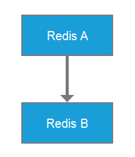
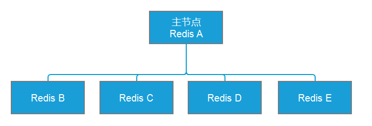

# Redis 场景应用设计

## 1. Redis 主从模式

### 1.1. 概述

部署 Redis 主从结构，是为了 Redis 服务的高可用。主从的所存取数据是一样的。

在复制的概念中，数据库分为两类，一类是主数据库（master），另一类是从数据库（slave）。

- 主数据库主要用于执行读写操作，当写操作导致数据变化时会自动将数据同步给从数据库。
- 从数据库一般只用于读操作，并接受主数据库同步过来的数据。

**一个主数据库可以拥有多个从数据库，而一个从数据库只能拥有一个主数据库，从库还可以作为其他数据库的主库**。

### 1.2. 常用的主从结构

- **一主一从**：用于主节点故障转移从节点，当主节点的“写”命令并发高且需要持久化，可以只在从节点开启AOF（主节点不需要）



- **一主多从**：针对“读”较多的场景，“读”由多个从节点来分担，但节点越多，主节点同步到多节点的次数也越多，影响带宽，也加重主节点的稳定



- **树状主从**：一主多从的缺点（主节点推送次数多压力大）可用些方案解决，主节点只推送一次数据到从节点1，再由从节点2推送到11，减轻主节点推送的压力


### 1.3. 主从数据复制的原理

Redis 提供了复制功能，可以实现在主数据库（Master）中的数据更新后，自动将更新的数据同步到从数据库（Slave）。一个主数据库可以拥有多个从数据库，而一个从数据库只能拥有一个主数据库。主从数据复制原理图如下：


1. 一个从数据库在启动后，会向主数据库发送 SYNC 命令。
2. 主数据库在接收到 SYNC 命令后会开始在后台保存快照（即 RDB 持久化的过程），并将保存快照期间接收到的命令缓存起来。在该持久化过程中会生成一个`.rdb`快照文件。
3. 在主数据库快照执行完成后，Redis 会将快照文件和所有缓存的命令以`.rdb`快照文件的形式发送给从数据库。
4. 从数据库收到主数据库的`.rdb`快照文件后，载入该快照文件到本地。
5. 从数据库执行载入后的`.rdb`快照文件，将数据写入内存中。以上过程被称为**复制初始化**。
6. 在复制初始化结束后，主数据库在每次收到写命令时都会将命令同步给从数据库，从而保证主从数据库的数据一致。

### 1.4. 主从复制配置

Redis 开启复制功能时，主数据库无须进行任何配置，而从数据库需要在配置文件中增加以下内容：

```properties
# slaveof master_address master_port
slaveof 127.0.0.1 9000
# 如果 master 有密码，则需要设置 masterauth
masterauth=123456
```

在上述配置中，`slaveof` 后面的配置分别为**主数据库的IP地址**和**端口**，在主数据库开启了密码认证后需要将 `masterauth` 设置为主数据库的密码，在配置完成后重启 Redis，主数据库上的数据就会同步到从数据库上。

## 2. Redis 哨兵模式

### 2.1. 概述

在主从架构中，当主数据库遇到异常中断服务后，开发者可以通过手动的方式选择一个从数据库来升格为主数据库，以使得系统能够继续提供服务。然而整个过程相对麻烦且需要人工介入，难以实现自动化。

Redis 2.8 开始在主从模式上添加了一个哨兵工具，实现自动化监控集群的运行状态和故障恢复功能。哨兵是一个独立运行的进程，通过发送命令让 Redis 服务器返回其运行状态，监控 redis 主、从数据库是否正常运行。在监测到 Master 库宕机时会自动将 Slave 库切换成 Master 库，然后通过发布与订阅模式通知其他从服务器修改配置文件，完成主备热切。


### 2.2. （待整理）高可用

- 它与被认为是不间断操作的容错技术有所不同。是目前企业防止核心系统因故障而无法工作的最有效保护手段
- 高可用一般指服务的冗余，一个服务挂了，可以自动切换到另外一个服务上，不影响客户体验

### 2.3. （待整理）主从如何进行故障转移

- 主节点(master)故障，从节点slave-1端执行 slaveof no one后变成新主节点；
- 其它的节点成为新主节点的从节点，并从新节点复制数据；
- 需要人工干预，无法实现高可用

### 2.4. （待整理）哨兵机制(sentinel)实现高可用原理

原理：当主节点出现故障时，由Redis Sentinel自动完成故障发现和转移，并通知应用方，实现高可用性


## 3. Redis 集群

使用哨兵，redis每个实例也是全量存储，每个redis存储的内容都是完整的数据，这样会造成浪费内存。为了最大化利用内存，可以采用集群，就是分布式存储。即每台redis分别存储不同的内容，共有16384个slot。每个redis分得一些slot，通过算法`hash_slot = crc16(key) mod 16384` 找到对应slot，从而知道数据是存在那个redis节点中。

### 3.1. 概述

Redis 集群实现了在多个 Redis 节点之间进行数据分片和数据复制。基于 Redis 集群的数据自动分片能力，能够方便地对 Redis 集群进行横向扩展，以提高 Redis 集群的吞吐量。基于 Redis 集群的数据复制能力，在集群中的一部分节点失效或者无法进行通信时，Redis 仍然可以基于副本数据对外提供服务，这提高了集群的可用性。


## 4. Redis 的集群总结

Redis 有三种集群模式：**主从模式**、**哨兵模式**和**集群模式**。

Redis集群遵循如下原则：

- 所有 Redis 节点彼此都通过 PING-PONG 机制互联，内部使用二进制协议优化传输速度和带宽。
- 在集群中超过半数的节点检测到某个节点 Fail 后将该节点设置为 Fail 状态。
- 客户端与 Redis 节点直连，客户端连接集群中任何一个可用节点即可对集群进行操作。
- Redis-Cluster 把所有的物理节点都映射到 0～16383 的 slot（槽）上，Cluster 负责维护每个节点上数据槽的分配。Redis 的具体数据分配策略为：在 Redis 集群中内置了16384个散列槽；在需要在Redis集群中放置一个Key-Value时，Redis 会先对 Key 使用 CRC16 算法算出一个结果，然后把结果对 16384 求余数，这样每个Key都会对应一个编号为0～16383的散列槽；Redis 会根据节点的数量大致均等地将散列槽映射到不同的节点。
