## 1. NoSQL 概述

### 1.1. 什么是NoSQL

NoSQL(NoSQL = Not Only SQL)，意即“不仅仅是SQL”，是一项全新的数据库理念，泛指非关系型的数据库。

关系型数据库指的是，表与表之间有主外键，这种表之间有关系的数据，我们叫做关系型数据库。

### 1.2. 为什么需要NoSQL

随着互联网web2.0网站的兴起，非关系型的数据库现在成了一个极其热门的新领域，非关系数据库产品的发展非常迅速。而传统的关系数据库在应付web2.0网站，特别是超大规模和高并发的SNS类型的web2.0纯动态网站已经显得力不从心，暴露了很多难以克服的问题，例如：

1. **High performance - 对数据库高并发读写的需求**
    - web2.0网站要根据用户个性化信息来实时生成动态页面和提供动态信息，所以基本上无法使用动态页面静态化技术，因此数据库并发负载非常高，往往要达到每秒上万次读写请求。关系数据库应付上万次SQL查询还勉强顶得住，但是应付上万次SQL写数据请求，硬盘IO就已经无法承受了。其实对于普通的BBS网站，往往也存在对高并发写请求的需求，例如网站的实时统计在线用户状态，记录热门帖子的点击次数，投票计数等，因此这是一个相当普遍的需求。
2. **Huge Storage - 对海量数据的高效率存储和访问的需求**
    - 类似Facebook，twitter，Friendfeed这样的SNS网站，每天用户产生海量的用户动态，以Friendfeed为例，一个月就达到了2.5亿条用户动态，对于关系数据库来说，在一张2.5亿条记录的表里面进行SQL查询，效率是极其低下乃至不可忍受的。再例如大型web网站的用户登录系统，例如腾讯，盛大，动辄数以亿计的帐号，关系数据库也很难应付。
3. **High Scalability && High Availability - 对数据库的高可扩展性和高可用性的需求**
    - 在基于web的架构当中，数据库是最难进行横向扩展的，当一个应用系统的用户量和访问量与日俱增的时候，你的数据库却没有办法像web server和app server那样简单的通过添加更多的硬件和服务节点来扩展性能和负载能力。对于很多需要提供24小时不间断服务的网站来说，对数据库系统进行升级和扩展是非常痛苦的事情，往往需要停机维护和数据迁移，为什么数据库不能通过不断的添加服务器节点来实现扩展呢？

**NoSQL数据库的产生就是为了解决大规模数据集合多重数据种类**带来的挑战，尤其是大数据应用难题。

### 1.3. 主流NoSQL产品分类

NoSQL数据库的四大分类如下：

- **键值(Key-Value)存储数据库**
    - 相关产品： Tokyo Cabinet/Tyrant、**Redis**、Voldemort、Berkeley DB
    - 典型应用： 内容缓存，主要用于处理大量数据的高访问负载。
    - 数据模型： 一系列键值对
    - 优势： 快速查询
    - 劣势： 存储的数据缺少结构化
- **列存储数据库**
    - 相关产品：Cassandra, HBase, Riak
    - 典型应用：分布式的文件系统
    - 数据模型：以列簇式存储，将同一列数据存在一起
    - 优势：查找速度快，可扩展性强，更容易进行分布式扩展
    - 劣势：功能相对局限
- **文档型数据库**
    - 相关产品：CouchDB、**MongoDB**
    - 典型应用：Web应用（与Key-Value类似，Value是结构化的）
    - 数据模型： 一系列键值对
    - 优势：数据结构要求不严格
    - 劣势： 查询性能不高，而且缺乏统一的查询语法
- **图形(Graph)数据库**
    - 相关数据库：Neo4J、InfoGrid、Infinite Graph
    - 典型应用：社交网络
    - 数据模型：图结构
    - 优势：利用图结构相关算法。
    - 劣势：需要对整个图做计算才能得出结果，不容易做分布式的集群方案。

### 1.4. NoSQL特点

在大数据存取上具备关系型数据库无法比拟的性能优势，例如：

1.	易扩展
	- NoSQL数据库种类繁多，但是一个共同的特点都是去掉关系数据库的关系型特性。数据之间无关系，这样就非常容易扩展。也无形之间，在架构的层面上带来了可扩展的能力。
2.	大数据量，高性能
	- NoSQL数据库都具有非常高的读写性能，尤其在大数据量下，同样表现优秀。这得益于它的无关系性，数据库的结构简单。
3.	灵活的数据模型
	- NoSQL无需事先为要存储的数据建立字段，随时可以存储自定义的数据格式。而在关系数据库里，增删字段是一件非常麻烦的事情。如果是非常大数据量的表，增加字段简直就是一个噩梦。这点在大数据量的Web2.0时代尤其明显。
4.	高可用
	- NoSQL在不太影响性能的情况，就可以方便的实现高可用的架构。比如Cassandra，HBase模型，通过复制模型也能实现高可用。

综上所述，NoSQL的非关系特性使其成为了后Web2.0时代的宠儿，助力大型Web2.0网站的再次起飞，是一项全新的数据库革命性运动。

## 2. Redis 基础入门

### 2.1. Redis 介绍

redis 是一种基于键值对（key-value）数据库，其中 value 可以为 string、hash、list、set、zset 等多种数据结构，可以满足很多应用场景。还提供了键过期，发布订阅，事务，流水线等附加功能

> 流水线：Redis 的流水线功能允许客户端一次将多个命令请求发送给服务器，并将被执行的多个命令请求的结果在一个命令回复中全部返回给客户端，使用这个功能可以有效地减少客户端在执行多个命令时需要与服务器进行通信的次数

Redis 相关网站：

- [Redis 官网](https://redis.io/)
- [Redis 官方文档](https://redis.io/documentation)
- [Redis 官网国内中文翻译版](http://redis.cn/)
- [Redis 命令参考文档](http://redisdoc.com/)
- [Redisson 官网](https://redisson.org/)

### 2.2. Redis 优缺点

优点：

1. **基于内存操作，速度快**（*官方给出的读写性能 10 万/S，与机器性能也有关*）：
    - 数据放内存中是速度快的主要原因
    - C 语言实现，与操作系统距离近
    - 使用了单线程架构，预防多线程可能产生的竞争问题
2. **键值对的数据结构服务器，支持多种数据类型**：包括 String、Hash、List、Set、ZSet 等，并且每种数据类型底层都做了优化，让读取数据的速度更快。
3. **丰富的功能**：键过期，发布订阅，事务，流水线等等
4. Reids 是**单线程**：简单稳定，避免线程切换开销及多线程的竞争问题。单线程是指网络请求使用一个线程来处理，即一个线程处理所有网络请求，但 Redis 运行时不止有一个线程，比如数据持久化的过程会另起线程。*Redis 6.0 后开始支持多线程*。
5. **支持持久化**：有 RDB 和 AOF 两种持久化机制，将数据持久化到硬盘，以有效地避免发生断电或机器故障，数据可能会丢失的问题。
6. **支持主从复制**：实现多个相同数据的 redis 副本
7. **支持高可用和分布式**：哨兵机制实现高可用，保证 redis 节点故障发现和自动转移
8. **支持事务**：所有操作都是原子性的，同时还支持对几个操作合并后的原子性执行。
9. **I/O 多路复用模型**：Redis 采用 I/O 多路复用技术。使用单线程来轮询描述符，将数据库的操作都转换成了事件，不在网络I/O上浪费过多的时间。
10. **客户端语言多**：java php python c c++ nodejs 等

缺点：

1. 对结构化查询的支持比较差。
2. 数据库容量受到物理内存的限制，不适合用作海量数据的高性能读写，因此 Redis 适合的场景主要局限在较小数据量的操作。
3. Redis 较难支持在线扩容，在集群容量达到上限时在线扩容会变得很复杂。

### 2.3. redis 应用场景

- **缓存热点数据**（最多使用）：关系型数据库作为存储层，其吞吐能力有限，由于 Redis 具有支撑高并发的特性，所以使用 Redis 保存一些热点数据进行缓存，如数据查询、短连接、新闻内容、商品内容等等。请求数据时合理使用缓存，通常能起到加速数据的读写速度和降低后端数据库压力的作用。
- **计数**：利用 Redis 原子性的自增操作，可以实现快速计数、查询缓存的功能，同时数据可以异步落地到其他数据源。如：视频网站播放数，网站浏览数统计、统计用户点赞数、用户访问数等。
- **分布式集群架构中共享/存储 Session 或 token**：一个分布式 Web 服务将用户的 Session 信息（例如用户登录信息）保存在各自服务器中，当使用负载均衡时，分布式服务会将用户的访问均衡到不同服务器上，用户刷新一次访问可能会请求到没有保存登陆 session 信息的服务，此时会出现需要重新登录的情况，这种操作对于用户十分不友好。为了解决多个服务器共享 Session 的问题，可以使用 Redis 将用户的 Session 进行集中管理，在这种模式下只要保证 Redis 是高可用和扩展性的，每次用户更新或者查询登录信息都直接从 Redis 中集中获取。
- **限速器**：一般用于安全的考虑或者资源的控制，会在每次进行登录时，让用户输入手机验证码，从而确定是否是用户本人。但是为了短信接口不被频繁访问，会限制用户每分钟获取验证码的频率，例如一分钟不能超过 5 次。一些网站限制一个 IP 地址不能在一秒钟之内方问超过 n 次也可以采用类似限速的思路。Redis 可用于限制某个用户访问某个接口的频率，比如秒杀场景用于防止用户快速点击带来不必要的压力。
- **应用排行榜**：按照热度排名，按照发布时间排行，主要用到列表和有序集合。
- **社交网络好友关系**：利用集合的一些命令，如交集、并集、差集等，实现共同好友、共同爱好、赞、踩、粉丝、下拉刷新、聊天室的在线好友列表等功能。
- **简单的消息队列**：可以使用 Redis 自身的发布/订阅模式或者 List 数据结构来实现简单的消息队列，实现异步操作。如：秒杀、抢购、12306等等
- **数据过期处理**，可以精确到毫秒。

### 2.4. 重大版本

1. 版本号第二位为奇数，为非稳定版本（2.7、2.9、3.1）
2. 第二为偶数，为稳定版本（2.6、2.8、3.0）
3. 当前奇数版本是下一个稳定版本的开发版本，如 2.9 是 3.0 的开发版本

### 2.5. Redis 与 Memcached 的区别

- Redis 只使用单核；而 Memcached 可以使用多核。
- Redis 支持多种数据类型；而 MemCached 数据结构单一，仅用来缓存数据。
- Redis 支持数据持久化；MemCached 不支持数据持久化，重启后数据会消失。
- Redis 提供主从同步机制和 cluster 集群部署能力，能够提供高可用服务；Memcached 没有提供原生的集群模式，需要依靠客户端实现往集群中分片写入数据。
- Redis 的速度比 Memcached 快很多。
- Redis 使用**单线程的多路 IO 复用模型**；Memcached 使用**多线程的非阻塞 IO 模型**。

## 3. Redis数据结构介绍

- redis是一种高级的key-value的存储系统，其中value支持多种类型的数据结构：

1. **字符串（String）**：二进制安全的字符串，
2. **散列（Hash）**：由`field`和关联的`value`组成的map数据结构。`field`和`value`都是字符串的。
3. **列表（List）**：按插入顺序排序的字符串元素的集合。基本上就是链表（linked lists）。
4. **集合（Set）**：不重复且无序的字符串元素的集合。
5. **有序集合（SortedSet）**：类似Set，但是每个字符串元素都关联到一个叫`score`浮动数值（floating number value）。里面的元素总是通过score进行着排序，所以不同的是，它是可以检索的一系列元素。
6. **Bit arrays (或者说 simply bitmaps)**：通过特殊的命令，可以将 String 值当作一系列 bits 处理：可以设置和清除单独的 bits，数出所有设为 1 的 bits 的数量，找到最前的被设为 1 或 0 的 bit，等等。
7. **HyperLogLogs**：这是被用于估计一个 set 中元素数量的概率性的数据结构。

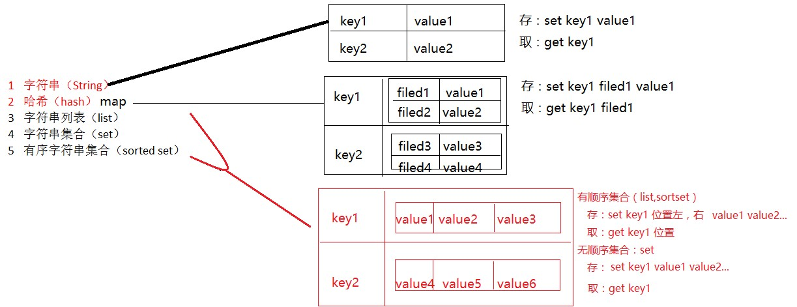

### 3.1. Redis keys（键）

Redis key值是二进制安全的，这意味着可以用任何二进制序列作为key值，如`foo`的简单字符、一个JPEG文件的内容、空字符串都是有效key值。关于key的定义，需要注意的几点：

1. key不要太长，最好不要操作1024个字节，这不仅会消耗内存还会降低查找效率
2. key不要太短，如果太短会降低key的可读性
3. 在项目中，key最好有一个统一的命名规范，如：`项目名_模块名_存储内容=""`、`业务名:表名:id`

### 3.2. String（字符串类型）

这是最简单 Redis 类型。值可以是任何种类的字符串（包括二进制数据），例如可以在一个键下保存一副 jpeg 图片。但值的长度不能超过 512MB。

### 3.3. Hash（哈希）

Redis 的 Hashes（哈希）类型，类似的Java中的哈希类型，数据结构，但是要注意，哈希类型中的映射关系叫作 field-value，注意这里的 value 是指 field 对应的值，不是键对应的值。

### 3.4. Set（无序去重集合类型）

Redis 的 Set 类型，无序去重的集合。Set 提供了交集、并集等方法。*对于实现共同好友、共同关注等功能特别方便*。

### 3.5. List（有序可重复集合类型）

Redis 的 List 类型，有序可重复的集合，底层是依赖双向链表实现的。

### 3.6. SortedSet（有序去重集合类型）

Redis 的 SortedSet 类型，相当于可排序的 Set 集合，内部维护了一个 `score` 的参数来实现排序。*适用于排行榜和带权重的消息队列等场景*。

### 3.7. Redis 集合类型存储数据的特点

#### 3.7.1. 共同点

对于集合类型(List/Set/SortSet)，有如下共同点：

- **如果元素都没有，那么这个 key 自动从 Redis 中删除**
- **如果强行删除 key，那么原来的所有 value 也会被删除**

#### 3.7.2. SortedSet 和 List 异同点

相同点：

1. 都是有序的
2. 都可以获得某个范围内的元素

不同点：

1. 列表基于链表实现，获取两端元素速度快，访问中间元素速度慢；有序集合基于散列表和跳跃表实现，访问中间元素时间复杂度是 `OlogN`
2. 列表不能简单的调整某个元素的位置；有序列表可以调整，只需要更改元素的分数
3. 有序集合更耗内存

### 3.8. Redis 特殊的数据类型

- Bitmap：位图，可以认为是一个以位为单位数组，数组中的每个单元只能存0或者1，数组的下标在 Bitmap 中叫做偏移量。Bitmap 的长度与集合中元素个数无关，而是与基数的上限有关。
- Hyperloglog：是用来做基数统计的算法，其优点是，在输入元素的数量或者体积非常非常大时，计算基数所需的空间总是固定的、并且是很小的。典型的使用场景是统计独立访客。
- Geospatial：主要用于存储地理位置信息，并对存储的信息进行操作，适用场景如定位、附近的人等。

## 4. Jedis（Java 操作 Redis）

### 4.1. Jedis概述

Jedis 就是 Java 语法操作 Redis 的技术，类似于JDBC

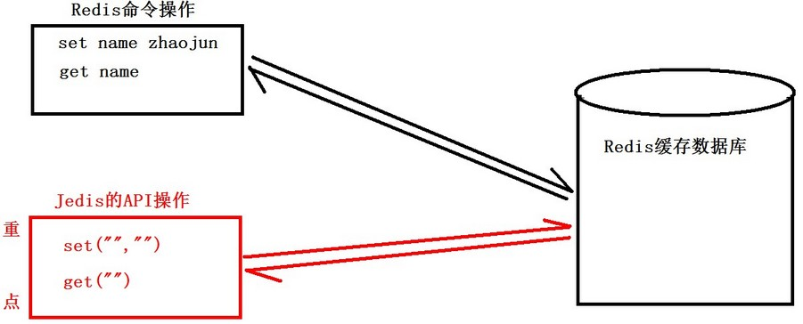

### 4.2. Java连接Redis

- 导入jar包
    - commons-pool2-2.3.jar
    - jedis-2.7.0.jar

### 4.3. Jedis类相关方法
#### 4.3.1. 构造方法

```java
Jedis(String host, String port);
// 获取Jedis对象
// host：Redis服务器ip地址
// port：Redis服务器端口
```

#### 4.3.2. 常用方法

```java
String set(String key, String value);
// 设置键值，成功返回“ok”

String get(String key, String value);
// 根据键获取值
```

### 4.4. Jedis连接池配置对象

- **构造方法**

```java
JedisPoolConfig config = new JedisPoolConfig();
```

- **常用设置初始参数方法**

```java
void setMaxTotal(int maxTotal);
// 设置连接池最大连接数，参数为int类型

void setMaxWaitMillis(long maxWaitMillis);
// 设置最大等待时间，参数为long类型毫秒值
```

### 4.5. JedisPool连接池对象

- **构造方法**

```java
JedisPool(JedisPoolConfig poolConfig, String host, int port);
// poolConfig：连接池配置对象，需要设置相关初始化参数
// host：Redis数据库ip地址
// port：Redis数据库端口
```

- **JedisPool 常用方法**

```java
Jedis getResource();
// 获取Jedis对象
```

### 4.6. 单实例与Jedis连接池连接

```java
package lessonDemo;

import org.junit.Test;

import redis.clients.jedis.Jedis;
import redis.clients.jedis.JedisPool;
import redis.clients.jedis.JedisPoolConfig;

public class TestJedis {
    // 单例连接
    @Test
    public void testJedis() {
        // 设置ip地址和端口，获取jedis对象
        Jedis jedis = new Jedis("192.168.34.128", 6379);

        // 设置数据
        String n = jedis.set("gender", "man");
        System.out.println(n);
        // 获取值
        String value = jedis.get("gender");
        System.out.println(value);
        // 释放资源
        jedis.close();
    }

    // 连接池连接
    @Test
    public void testJedisPool() {
        // 获取连接池配置对象，设置配置项
        JedisPoolConfig config = new JedisPoolConfig();

        // 最大连接数
        config.setMaxTotal(30);
        // 最大空闲连接数
        config.setMaxIdle(10);

        // 获取连接池
        JedisPool jedisPool = new JedisPool(config, "192.168.34.128", 6379);

        // 获取jedis对象
        Jedis jedis = jedisPool.getResource();
        // 设置数据
        jedis.set("java", "kaka2");
        System.out.println(jedis.get("java"));

        // 释放资源
        jedis.close();
        jedisPool.close();
    }
}
```

### 4.7. Jedis连接池工具类

```java
package com.moonzero.utils;

import java.util.ResourceBundle;

import redis.clients.jedis.Jedis;
import redis.clients.jedis.JedisPool;
import redis.clients.jedis.JedisPoolConfig;

/**
 * Jedis连接工具类
 */
public class JedisUtil {
    // 设置静态连接池成员变量
    // 最大连接数
    private static String maxTotal;
    // 最大等待时间
    private static String maxWaitMillis;
    // Redis数据库ip地址
    private static String host;
    // Redis数据库端口号
    private static String port;
    // 定义连接池对象
    private static JedisPool pool;

    // 静态代码块
    static {
        // 创建ResourceBundle对象，读取redis.properites配置文件
        ResourceBundle rb = ResourceBundle.getBundle("jedis");
        maxTotal = rb.getString("maxTotal");
        maxWaitMillis = rb.getString("maxWaitMillis");
        host = rb.getString("host");
        port = rb.getString("port");

        // Jedis配置对象，设置初始参数
        JedisPoolConfig config = new JedisPoolConfig();
        config.setMaxTotal(Integer.parseInt(maxTotal));
        config.setMaxWaitMillis(Long.parseLong(maxWaitMillis));

        // 获取Jedis连接池对象
        pool = new JedisPool(config, host, Integer.parseInt(port));
    }

    // 获取Jedis连接对象方法
    public static Jedis getJedis() {
        return pool.getResource();
    }
}
```

配置文件jedis.properties

```properties
maxTotal=10
maxWaitMillis=2000
host=192.168.34.128
port=6379
```

## 5. 持久化机制

### 5.1. 概述

Redis 的高性能是由于其将所有数据都存储在了内存中，为了使 Redis 在重启之后仍能保证数据不丢失，需要将数据从内存中同步到硬盘中，这一过程就是持久化。

Redis 支持两种方式的持久化机制，**RDB方式与AOF方式**。可以单独使用其中一种或将二者结合使用。

1. RDB 持久化（默认支持，无需配置）：该机制是指在指定的时间间隔内将内存中的数据集快照写入磁盘。
2. AOF 持久化：该机制将以日志的形式记录服务器所处理的每一个写操作，在 Redis 服务器启动之初会读取该文件来重新构建数据库，以保证启动后数据库中的数据是完整的。
3. 无持久化：可以通过配置的方式禁用 Redis 服务器的持久化功能，即将 Redis 视为一个功能加强版的 memcached。

### 5.2. RDB

RDB 持久化（Redis DataBase 缩写快照），在指定的时间间隔内把当前进程数据生成快照（.rdb）文件保存到硬盘的过程。Redis 启动时会读取 RDB 快照文件，将数据从硬盘载入内存。通过 RDB 方式的持久化，一旦 Redis 异常退出，就会丢失最近一次持久化以后更改的数据。

RDB 持久化有手动触发和自动触发的两种方式。

#### 5.2.1. 手动触发

手动触发有 `save` 和 `bgsave` 两命令

- `save` 命令：阻塞当前 Redis，直到 RDB 持久化过程完成为止，若内存实例比较大会造成长时间阻塞，线上生产环境不建议使用。
- `bgsave` 命令：redis 进程执行 fork 操作创建子线程，由子线程完成持久化，阻塞时间很短（微秒级），是 save 的优化，在执行 `redis-cli shutdown` 关闭 redis 服务时，如果没有开启 AOF 持久化，会自动执行 bgsave。显然 bgsave 是对 save 的优化。

`bgsave` 是主流的触发 RDB 持久化的方式，执行过程如下：

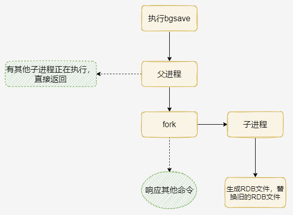

1. 执行 `BGSAVE` 命令。
2. Redis 父进程判断当前是否存在正在执行的子进程，如果存在，`BGSAVE` 命令直接返回。
3. 父进程执行 fork 操作创建子进程，fork 操作过程中父进程会阻塞。
4. 父进程 fork 完成后，父进程继续接收并处理客户端的请求，而子进程开始将内存中的数据写进硬盘的临时文件。
5. 当子进程写完所有数据后会用该临时文件替换旧的 RDB 文件。

#### 5.2.2. 自动触发

根据配置规则进行自动快照，如 `SAVE 100 10`，100秒内至少有10个键被修改则进行快照。如果从节点执行全量复制操作，主节点会自动执行 `BGSAVE` 生成 RDB 文件并发送给从节点。默认情况下执行 `shutdown` 命令关闭 Reids 时，如果没有开启 AOF 持久化功能则自动执行 `BGSAVE` 命令。

具体配置操作如下：

- 修改配置文件 redis.conf，配置快照参数

```conf
save 900 1     # 每900秒(15分钟)至少有1个key发生变化，则dump内存快照。
save 300 10    # 每300秒(5分钟)至少有10个key发生变化，则dump内存快照
save 60 10000  # 每60秒(1分钟)至少有10000个key发生变化，则dump内存快照
```

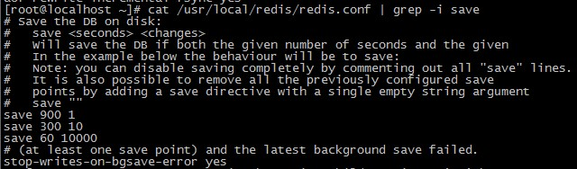

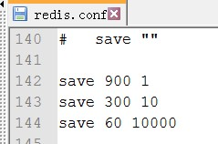

- 设置保存位置设置

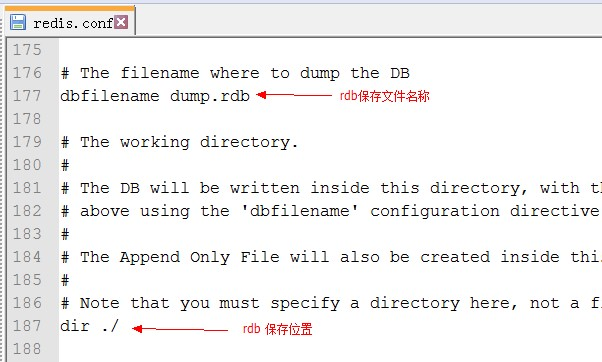

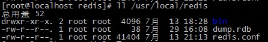

#### 5.2.3. RDB 文件备份与恢复操作

**备份操作**：

```bash
127.0.0.1:6379> config set dir /usr/local
ok

127.0.0.1:6379> bgsave
```

上述命令的含义是，先设置 rdb 文件保存路径，然后执行持久化后，将 dump.rdb 保存到 usr/local 下

**恢复操作**：将 dump.rdb 放到 redis 安装目录与 redis.conf 同级目录，重启 redis 即可。

#### 5.2.4. RDB 优劣分析

**优势**：

1. 一旦采用该方式，那么整个 Redis 数据库将只包含一个文件，这对于文件备份而言是非常完美的。比如可能打算每个小时归档一次最近24小时的数据，同时还要每天归档一次最近30天的数据。通过这样的备份策略，一旦系统出现灾难性故障，可以非常容易的进行恢复。
2. 对于备份、全量复制、灾难恢复而言，RDB 是非常不错的选择。因为可以非常轻松的将一个单独的二进制文件压缩后再转移到其它存储介质上。
3. 性能最大化。对于 Redis 的服务进程而言，在开始持久化时，它唯一需要做的只是fork（分叉）出子进程，之后再由子进程完成这些持久化的工作，这样就可以极大的避免服务主进程执行IO操作了。
4. 相比于 AOF 机制，如果数据集很大，加载 RDB 恢复数据效率远快于 AOF 方式。

**劣势**：

1. 无法做到实时持久化，因为系统一旦在定时持久化之前出现宕机现象，此前没有来得及写入磁盘的数据都将丢失。如果想保证数据的高可用性，即最大限度的避免数据丢失，那么 RDB 将不是一个很好的选择。
2. 由于 RDB 是通过 fork 子进程来协助完成数据持久化工作的，每次都要创建子进程，频繁操作成本过高。因此，如果当数据集较大时，可能会导致整个服务器停止服务几百毫秒，甚至是1秒钟
3. RDB 文件使用特定二进制格式保存，Redis 版本升级过程中有多个格式的 RDB 版本，会存在老版本 Redis 无法兼容新版 RDB 格式的问题。

### 5.3. AOF

针对 RDB 不适合实时持久化，redis 提供了 AOF 持久化（Append Only File）方式。以独立日志的方式记录每次写命令，Redis 重启时会重新执行 AOF 文件中的命令达到恢复数据的目的。

AOF 的主要作用是解决了数据持久化的实时性，AOF 是 Redis 持久化的主流方式。开启 AOF 方式持久化后每执行一条写命令，Redis 就会将该命令写进 `aof_buf` 缓冲区，AOF 缓冲区根据对应的策略向硬盘做同步操作。

#### 5.3.1. AOF 配置详解

默认情况下 Redis 没有开启 AOF 方式的持久化，通过 `appendonly` 参数启用。

默认情况下系统每30秒会执行一次同步操作。为了防止缓冲区数据丢失，可以在 Redis 写入 AOF 文件后主动要求系统将缓冲区数据同步到硬盘上。可以通过 `appendfsync` 参数设置同步的时机

```conf
appendonly yes # 启用 aof 持久化方式

# appendfsync always # 每收到写命令就立即强制写入磁盘，最慢的，但是保证完全的持久化，不推荐使用
appendfsync everysec # 每秒强制写入磁盘一次，性能和持久化方面做了折中，推荐
# appendfsync no # 完全依赖 os，性能最好,持久化没保证（操作系统自身的同步）

no-appendfsync-on-rewrite yes # 正在导出 rdb 快照的过程中,要不要停止同步 aof
auto-aof-rewrite-percentage 100 # aof 文件大小比起上次重写时的大小,增长率100%时,重写
auto-aof-rewrite-min-size 64mb # aof 文件,至少超过 64M 时,重写
```

- 修改 redis.conf 设置文件，修改`appendonly yes` (默认AOF处于关闭，为 no)

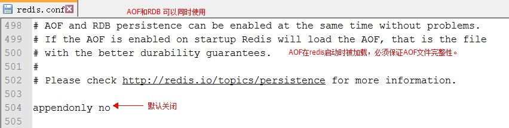

- 手动开启

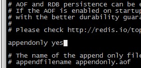

- 策略的选择：

```
always    #每次有数据修改发生时都会写入AOF文件
everysec  #每秒钟同步一次，该策略为AOF的缺省策略
no       #从不同步。高效但是数据不会被持久化
```

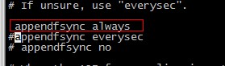

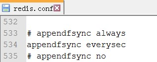

- 默认文件名：appendfilename "appendonly.aof"。可以修改为指定文件名称

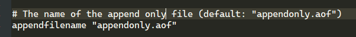

#### 5.3.2. AOF 流程说明

AOF 持久化执行流程：命令写入(append)、文件同步(sync)、文件重写(rewrite)、重启加载(load)

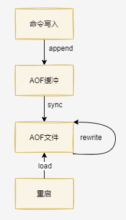

1. 所有的写入命令(如：`set`、`hset` 等)会 append（追加）到 aof_buf（缓冲区）中
2. AOF 缓冲区根据对应的策略，向硬盘做 sync（同步）
3. 随着 AOF 文件越来越大，需要定期对 AOF 文件进行 rewrite（重写），达到压缩文件体积的目的。AOF 文件重写是把 Redis 进程内的数据转化为写命令同步到新 AOF 文件的过程。
4. 当 Redis 服务器重启时，可以 load（加载）AOF 文件进行数据恢复。

#### 5.3.3. AOF 恢复操作

1. 设置 `appendonly yes`
2. 将 appendonly.aof 文件放到 dir 参数指定的目录
3. 启动 Redis，Redis 会自动加载 appendonly.aof 文件

#### 5.3.4. AOF 优劣分析

**优势**：

1. 该机制可以带来更高的数据安全性，即数据持久性。Redis中提供了3中同步策略，即**每秒同步、每修改同步和不同步**。事实上，每秒同步也是异步完成的，其效率也是非常高的，所差的是一旦系统出现宕机现象，那么这一秒钟之内修改的数据将会丢失。而每修改同步，可以将其视为同步持久化，即每次发生的数据变化都会被立即记录到磁盘中。可以预见，这种方式在效率上是最低的。至于无同步，无需多言，我想大家都能正确的理解它。
2. 由于该机制对日志文件的写入操作采用的是 append-only 模式，所以没有磁盘寻址的开销，写入性能非常高。即使在写入过程中即使出现宕机现象，也不会破坏日志文件中已经存在的内容。然而如果本次操作只是写入了一半数据就出现了系统崩溃问题，不用担心，在 Redis 下一次启动之前，可以通过 redis-check-aof 工具来帮助解决数据一致性的问题。
3. 如果日志过大，Redis 可以自动启用 rewrite 机制。即 Redis 以 append 模式不断的将修改数据写入到老的磁盘文件中，同时 Redis 还会创建一个新的文件用于记录此期间有哪些修改命令被执行。因此在进行 rewrite 切换时可以更好的保证数据安全性。AOF 文件没被 rewrite 之前（文件过大时会对命令进行合并重写），可以删除其中的某些命令（比如误操作的 flushall ）
4. AOF 包含一个格式清晰、易于理解的日志文件用于记录所有的修改操作。事实上也可以通过该文件完成数据的重建。

**劣势**：

1. 对于相同数量的数据集而言，AOF 文件通常要大于 RDB 文件，且恢复速度慢。
2. 根据同步策略的不同，AOF 在运行启动效率上往往会慢于 RDB。总之，每秒同步策略的效率是比较高的，同步禁用策略的效率和 RDB 一样高效。

### 5.4. RDB 与 AOF 比较

#### 5.4.1. 重启时恢复加载顺序及流程比较

1. 当 AOF 和 RDB 文件同时存在时，优先加载
2. 若关闭了 AOF，加载 RDB 文件
3. 加载 AOF/RDB 成功，redis 重启成功
4. AOF/RDB 存在错误，redis 启动失败并打印错误信息

#### 5.4.2. RDB 和 AOF 如何选择

通常来说，应该同时使用两种持久化方案，以保证数据安全。

- 如果数据不敏感，且可以从其他地方重新生成，可以关闭持久化。
- 如果数据比较重要，且能够承受几分钟的数据丢失，比如缓存等，只需要使用 RDB 即可。
- 如果是用做内存数据，要使用 Redis 的持久化，建议是 RDB 和 AOF 都开启。
- 如果只用 AOF，优先使用 `everysec` 的配置选择，因为它在可靠性和性能之间取了一个平衡。

当 RDB 与 AOF 两种方式都开启时，Redis 会优先使用 AOF 恢复数据，因为 AOF 保存的文件比 RDB 文件更完整。

## 6. Redis 事务

### 6.1. 概述

Redis 支持分布式环境下的事务操作，其事务可以一次执行多个命令，其特征是：<font color=red>**在事务中的所有命令都会串行化的顺序执行，并且在执行过程中，不会被其他客户端发送来的命令请求打断**</font>。服务器在执行完事务中的所有命令之后，才会继续处理其他客户端的其他命令。

### 6.2. Redis 事务的特性

- 原子性：Redis 的单条命令是原子性执行的，<font color=purple>**但事务却不保证原子性，并且没有回滚。即事务中如果有某一条命令执行失败，其后的命令仍然会被继续执行不会被影响**</font>。
- 隔离性：Redis 是单进程程序，并且它保证在执行事务时，不会对事务进行中断，事务可以运行直到执行完所有事务队列中的命令为止。因此 Redis 的事务是总是带有隔离性的。

### 6.3. 事务的执行流程

Redis 的事务操作分为**开启事务**、**命令入队列**、**执行事务**三个阶段。执行流程如下图：

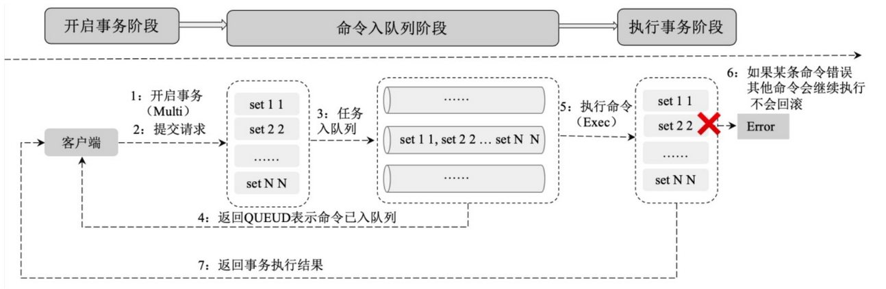

事务的生命周期如下：

1. 事务开启：客户端执行 `multi` 命令开启事务。
2. 提交请求：客户端提交命令到事务。
3. 任务入队列：Redis 将客户端请求放入事务队列中等待执行。
4. 入队状态反馈：服务器返回 `QURUD`，表示命令已被放入事务队列。
5. 执行命令：客户端通过 `exec` 命令来执行事务。
6. 事务执行错误：在 Redis 事务中如果某条命令执行错误，则其他命令会继续执行，不会回滚。可以通过 `watch` 监控事务执行的状态并处理命令执行错误的异常情况。
7. 执行结果反馈：服务器向客户端返回事务执行的结果。

### 6.4. 事务相关命令

> Notes: 此部分内容详见[《Redis 操作命令》笔记](/数据库/Redis/Redis-操作命令)

### 6.5. 基于 Spring Boot 的实现事务

```java
private final RedisTemplate redisTemplate;

public void transactionSet(Map<String, Objects> commandList) {
	// 1. 开启事务权限
	redisTemplate.setEnableTransactionSupport(true);
	try {
		// 2. 开启事务
		redisTemplate.multi();
		// 3. 执行事务命令
		for (Map.Entry<String, Objects> entry : commandList.entrySet()) {
			String key = entry.getKey();
			Objects value = entry.getValue();
			redisTemplate.opsForValue().set(key, value);
		}
		// 4. 成功提交
		redisTemplate.exec();
	} catch (Exception e) {
		// 5. 失败则回滚
		redisTemplate.discard();
	}
}
```

以上示例方法接收事务命令 commandList 并以事务命令列表在一个事务中执行。具体步骤为：开启事务权限、开启事务、执行事务命令、提供事务和回滚事务。

## 7. Redis 消息订阅与发布

### 7.1. 概述

Redis 发布、订阅是一种消息通信模式：发送者（Pub）向频道（Channel）发送消息；订阅者（Sub）接收频道上的消息。Redis 客户端可以订阅任意数量的频道，发送者也可以向任意频道发送数据。

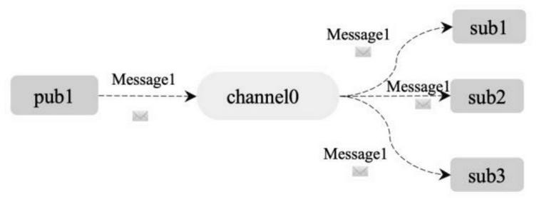

上图是，1个发送者（pub1）、1个频道（channe0）和 3个订阅者（sub1、sub2、sub3）的关系。由于 3 个订阅者 sub1、sub2、sub3 都订阅了频道 channel0，在发送者 pub1 向频道 channel0 发送一条消息后，这条消息就会被发送给订阅它的三个客户端。

### 7.2. 订阅与发布相关命令

> Notes: 此部分内容详见[《Redis 操作命令》笔记](/数据库/Redis/Redis-操作命令)

## 8. 扩展知识

### 8.1. Redis 过期键的删除策略

Redis 是 key-value 数据库，可以设置 Redis 中缓存的 key 的过期时间。Redis 的过期策略就是指当 Redis 中缓存的 key 过期了，过期策略通常有以下三种：

- 定时过期：每个设置过期时间的key都需要创建一个定时器，到过期时间就会立即清除。该策略可以立即清除过期的数据，对内存很友好；但是会占用大量的CPU资源去处理过期的数据，从而影响缓存的响应时间和吞吐量。
- 惰性过期：只有当访问一个key时，才会判断该key是否已过期，过期则清除。该策略可以最大化地节省CPU资源，却对内存非常不友好。极端情况可能出现大量的过期key没有再次被访问，从而不会被清除，占用大量内存。
- 定期过期：每隔一定的时间，会扫描一定数量的数据库的expires字典中一定数量的key，并清除其中已过期的key。该策略是前两者的一个折中方案。通过调整定时扫描的时间间隔和每次扫描的限定耗时，可以在不同情况下使得CPU和内存资源达到最优的平衡效果。

> Notes: 
>
> - Redis中同时使用了惰性过期和定期过期两种过期策略。
> - expires字典会保存所有设置了过期时间的key的过期时间数据，其中，key是指向键空间中的某个键的指针，value是该键的毫秒精度的UNIX时间戳表示的过期时间。键空间是指该Redis集群中保存的所有键

### 8.2. Redis 的内存淘汰策略

如果 Redis 使用的内存达到设置的上限，Redis 的写命令会返回错误信息，但是读命令还可以正常返回。此时可以配置内存淘汰机制，当 Redis 达到内存上限时会冲刷掉旧的内容。

**Redis 的内存淘汰策略**是指在 Redis 的用于缓存的内存不足时，怎么处理需要新写入且需要申请额外空间的数据。

**全局的键空间选择性移除**

- noeviction：当内存不足以容纳新写入数据时，新写入操作会报错。
- allkeys-lru：当内存不足以容纳新写入数据时，在键空间中，移除最近最少使用的 key。（这个是最常用的）
- allkeys-random：当内存不足以容纳新写入数据时，在键空间中，随机移除某个 key。

**设置过期时间的键空间选择性移除**

- volatile-lru：当内存不足以容纳新写入数据时，在设置了过期时间的键空间中，移除最近最少使用的 key。
- volatile-random：当内存不足以容纳新写入数据时，在设置了过期时间的键空间中，随机移除某个 key。
- volatile-ttl：当内存不足以容纳新写入数据时，在设置了过期时间的键空间中，有更早过期时间的 key 优先移除。

总结：Redis 的内存淘汰策略的选取并不会影响过期的 key 的处理。内存淘汰策略用于处理内存不足时的需要申请额外空间的数据；过期策略用于处理过期的缓存数据。

### 8.3. Redis 最佳实践

#### 8.3.1. 键名的生产实践

Redis 没有命令空间，而且也没有对键名有强制要求。设计合理的键名，有利于防止键冲突和项目的可维护性。

- 推荐使用键命名方式具有可读性和可管理性，建议以业务名(或数据库名)为前缀(防止key冲突)，用冒号分隔。例如：`业务名:对象名:id:[属性]`
- 推荐保持键的简洁性。在保证语义的前提下，控制key的长度，当key较多时，内存占用也不容忽视。例如：`user:{uid}:friends:messages:{mid}`可简化为`u:{uid}:fr:m:{mid}`，从而减少由于键过长的内存浪费
- **不能包含特殊字符**。反例：包含空格、换行、单双引号以及其他转义字符

### 8.4. Redis 的线程模型

Redis 基于 Reactor 模式开发了网络事件处理器，这个处理器被称为**文件事件处理器**。它的组成结构为4部分：

- 多个套接字
- IO多路复用程序
- 文件事件分派器
- 事件处理器

因为文件事件分派器队列的消费是单线程的，所以 Redis 才叫单线程模型。

- 文件事件处理器使用I/O多路复用（multiplexing）程序来同时监听多个套接字，并根据套接字目前执行的任务来为套接字关联不同的事件处理器。
- 当被监听的套接字准备好执行连接 accept、read、write、close 等操作时，与操作相对应的文件事件就会产生，这时文件事件处理器就会调用套接字之前关联好的事件处理器来处理这些事件。

虽然文件事件处理器以单线程方式运行，但通过使用 I/O 多路复用程序来监听多个套接字，文件事件处理器既实现了高性能的网络通信模型，又可以很好地与 redis 服务器中其他同样以单线程方式运行的模块进行对接，这保持了 Redis 内部单线程设计的简单性。

#### 8.4.1. 为何选择单线程模型？

- **避免过多的上下文切换开销**：程序始终运行在进程中单个线程内，没有多线程切换的场景。
- **避免同步机制的开销**：如果 Redis 选择多线程模型，需要考虑数据同步的问题，则必然会引入某些同步机制，会导致在操作数据过程中带来更多的开销，增加程序复杂度的同时还会降低性能。
- **实现简单，方便维护**：如果 Redis 使用多线程模式，那么所有的底层数据结构的设计都必须考虑线程安全问题，那么 Redis 的实现将会变得更加复杂。

#### 8.4.2. Redis 6.0 版本后为何引入多线程

Redis 支持多线程主要有两个原因：

- 可以充分利用服务器 CPU 资源，旧版本中单线程模型的主线程只能利用一个 cpu。
- 多线程任务可以分摊 Redis 同步 IO 读写的负荷。

## 9. (待整理)解决分布式锁的框架-redisson

redisson官网：https://redisson.org/

### 9.1. 简介

与Jedis很相似的用于操作Redis的框架，其中实现一个功能是在高并发的情况，给Redis加上锁，并且在线程的执行过程中，判断当前线程是否已经执行结束，会自动给当前的锁增加存活时间，以便让当前线程完全执行后，再去释放锁。

分布式锁-案例：

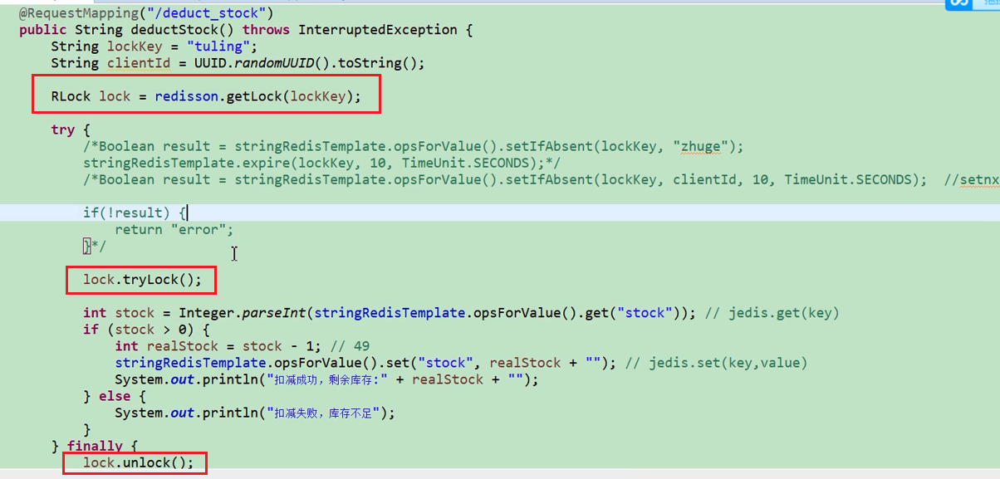

