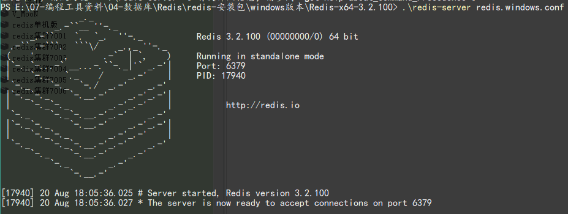

# Redis 安装

## 1. windows 版本

### 1.1. 直接运行Redis服务

- 下载 Windows 版本的 redis：https://github.com/MicrosoftArchive/redis/tags
- 下载 Redis-x64-3.2.100 版本，解压 Redis-x64-3.2.100.zip。
- 进入 cmd 命令行，进入 Redis-x64-3.2.100 目录，运行以下命令。（*注：如果使用powershell打开，需要在命令前增加“`./`”*）

```bash
redis-server redis.windows.conf
```

出现下图说明，redis启动成功



### 1.2. 将 Redis 注册为服务

- 进入cmd命令行，进入redis所在目录，运行以下命令（*注：如果使用powershell打开，需要在命令前增加“./”*）

```bash
redis-server --service-install redis.windows-service.conf --loglevel verbose
```

- 成功执行命令后，刷新服务，会看到多了一个redis服务


- 进入redis所在目录，输入常用的redis服务命令

```bash
redis-server.exe --service-uninstall    # 卸载服务
redis-server.exe --service-start    # 开启服务
redis-server.exe --service-stop    # 停止服务
```

## 2. windows图形化操作界面

### 2.1. redis-desktop-manager

- windows版本的redis客户端官网：https://redisdesktop.com/download
- 下载 redis-desktop-manager-0.9.2.806.exe，安装后启动redis客户端：【据说0.9.3（最后一个免费版本），待测试】
- 配置redis链接：选择连接到Redis服务器，配置主机地址与端口号

## 3. linux 版本

### 3.1. 安装（压缩包安装）

> - 参考文档：
>    - E:\07-编程工具资料\04-数据库\Redis\Redis安装和使用.docx
>   - E:\07-编程工具资料\04-数据库\Redis\Redis安装.doc

1. **安装 redis 的依赖环境**

```bash
[root@localhost src]# yum -y install gcc automake autoconf libtool make
```

2. **上传安装包**

获取到安装包，使用 `rz` 命令（需要系统支持）并将它上传到 linux 的 `/usr/local/src/` 目录下

```bash
[root@localhost src]# ls
redis-5.0.4.tar.gz
```

3. **解压**

解压安装包，得到一个redis-5.0.4目录

```bash
[root@localhost src]# tar -zxvf redis-5.0.4.tar.gz
[root@localhost src]# ls
redis-5.0.4 redis-5.0.4.tar.gz
```

4. **编译**

进入 redis 目录，在目录下执行 `make` 命令

```bash
[root@localhost src]# cd redis-5.0.4
[root@localhost redis-5.0.4]# make
```

5. **安装**

执行安装命令，注意此处指定了安装目录为 `/usr/local/redis`

```bash
[root@localhost redis-5.0.4]# make PREFIX=/usr/local/redis install
```

6. **复制配置文件**

将配置文件复制到 redis 的安装目录的bin目录下

```bash
[root@localhost redis-5.0.4]# cd /usr/local/redis/bin/
[root@localhost bin]# ls
redis-benchmark redis-check-aof redis-check-rdb redis-cli redis-sentinelredis-server
[root@localhost bin]# cp /usr/local/src/redis-5.0.4/redis.conf ./
[root@localhost bin]# ls
redis-benchmark redis-check-aof redis-check-rdb redis-cli redis.conf redis-sentinel redis-server
```

7. **修改redis的配置文件**

修改 redis 的配置文件，将注解绑定和保护模式关闭，方便从客户端连接测试

```bash
[root@localhost bin]# vim redis.conf
```


8. **启动redis服务**

```bash
[root@localhost bin]# ./src/redis-server redis.conf &
```

### 3.2. 执行相关文件

|     可执行文件     |           作用           |
| ---------------- | ----------------------- |
| redis-server     | 启动 redis               |
| redis-cli        | redis 命令行客户端         |
| redis-benchmark  | 基准测试工具               |
| redis-check-aof  | AOF 持久化文件检测和修复工具 |
| redis-check-dump | RDB 持久化文件检测和修复工具 |
| redis-sentinel   | 启动哨兵                  |

### 3.3. 启动

#### 3.3.1. redis-server 服务端启动

默认配置：redis-server，日志输出版本信息，端口：6379

- 启动方式1（不建议），`--port` 指定端口号

```bash
redis-server --port 6380
```

- 启动方式2，以配置文件方式启动

```bash
redis-server /opt/redis/redis.conf
```

- 启动方式3：修改 redis.conf 配置文件，增加 `daemonize yes` 配置以后端模式启动。启动时，指定配置文件。


```bash
./redis-server redis.conf
```

#### 3.3.2. redis-cli 客户端启动与停止

1. 交互式启动。`-h`用于指定服务器ip，默认是`127.0.0.1`；`-p`用于指定服务的端口，默认是 6379；`-a`用于指定密码

```bash
redis-cli -h {host} -p {prot} -a {password}
```

2. 命令式启动，直接连接并且操作

```bash
redis-cli -h 127.0.0.1 -p 6379 get hello
```

3. 停止 redis 服务

```bash
# 使用客户端登陆
redis-cli -a 123456
# 关闭前生成持久化文件
shutdown nosave|save
```

使用以上命令断开连接，持久化文件生成，相对安全。还可以用 `kill -9 pid` 命令关闭，但此方式不会做持久化，还会造成缓冲区非法关闭，可能会造成 AOF 和丢失数据，所以不推荐。

#### 3.3.3. redis-cli 客户端监控命令

打开 redis-cli 客户端后，输入以下命令打开 redis 服务的数据监控

```bash
monitor
```
