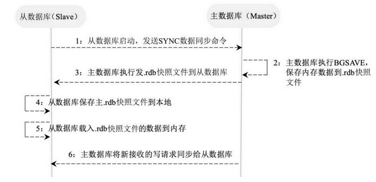
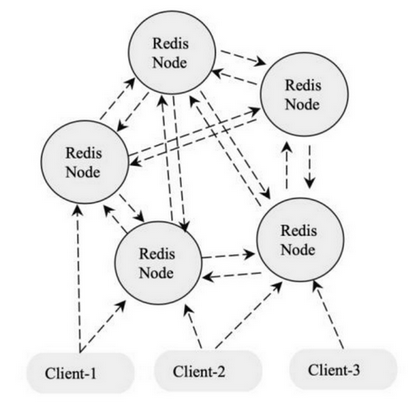

## 1. Redis 的部署方案简述

Redis 的部署分为：Redis 单机版安装、Redis 主从模式安装、Redis 哨兵模式安装和 Redis Cluster（集群模式）安装。

- **单机版**：单机部署，单机redis能够承载的 QPS 大概就在上万到几万不等。实际生产这种部署方式很少使用，一般都是用于本地测试开发。存在的问题：
    1. 内存容量有限
    2. 处理能力有限
    3. 无法高可用
- **主从模式**：一主多从，主负责写，并且将数据复制到其它的 slave 节点，从节点负责处理所有的读请求。这样也可以很轻松实现水平扩容，支撑读高并发。master 节点挂掉后，需要手动指定新的 master，可用性不高，基本不用。
- **哨兵模式**：通过哨兵机制（Sentinel）可以自动切换主从节点，因此解决了主从复制存在不能自动故障转移、达不到高可用的问题。master 节点挂掉后，哨兵进程会主动选举新的 master，可用性高，但是每个节点存储的数据是一样的，浪费内存空间。数据量不是很多，集群规模不是很大，需要自动容错容灾的时候使用。
- **Redis cluster**：服务端分片技术，3.0版本开始正式提供。Redis Cluster 并没有使用一致性 hash，而是采用slot(槽)的概念，一共分成16384个槽。将请求发送到任意节点，接收到请求的节点会将查询请求发送到正确的节点上执行。主要是针对海量数据+高并发+高可用的场景，如果是海量数据，那么建议使用 Redis cluster，所有主节点的容量总和就是 Redis cluster 可缓存的数据容量。

## 2. Redis 单机模式

### 2.1. windows 单机版

#### 2.1.1. 直接运行 Redis 服务

> Windows 版本的 redis 下载地址：https://github.com/MicrosoftArchive/redis/tags

下载 Redis-x64-3.2.100 版本，解压 Redis-x64-3.2.100.zip 到无中文与空格的目录中。

进入 cmd 命令行，进入 Redis-x64-3.2.100 目录，运行以下命令。（*注：如果使用powershell打开，需要在命令前增加“`./`”*）

```bash
redis-server redis.windows.conf
```

出现下图说明，redis启动成功


#### 2.1.2. 将 Redis 注册为服务

- 进入 cmd 命令行，进入 redis 所在目录，运行以下命令（*注：如果使用powershell打开，需要在命令前增加“./”*）

```bash
redis-server --service-install redis.windows-service.conf --loglevel verbose
```

- 成功执行命令后，刷新服务，会看到多了一个redis服务


- 进入redis所在目录，输入常用的redis服务命令

```bash
redis-server.exe --service-uninstall    # 卸载服务
redis-server.exe --service-start    # 开启服务
redis-server.exe --service-stop    # 停止服务
```

### 2.2. linux 单机版

#### 2.2.1. 安装（压缩包安装）

> - 参考文档：
>   - E:\07-编程工具资料\04-数据库\Redis\Redis安装和使用.docx
>   - E:\07-编程工具资料\04-数据库\Redis\Redis安装.doc

1. **安装 redis 的依赖环境**

```bash
[root@localhost src]# yum -y install gcc automake autoconf libtool make
```

2. **上传安装包**

获取到安装包，使用 `rz` 命令（需要系统支持）并将它上传到 linux 的 `/usr/local/src/` 目录下

```bash
[root@localhost src]# ls
redis-5.0.4.tar.gz
```

3. **解压**

解压安装包，得到一个redis-5.0.4目录

```bash
[root@localhost src]# tar -zxvf redis-5.0.4.tar.gz
[root@localhost src]# ls
redis-5.0.4 redis-5.0.4.tar.gz
```

4. **编译**

进入 redis 目录，在目录下执行 `make` 命令

```bash
[root@localhost src]# cd redis-5.0.4
[root@localhost redis-5.0.4]# make
```

5. **安装**

执行安装命令，注意此处指定了安装目录为 `/usr/local/redis`

```bash
[root@localhost redis-5.0.4]# make PREFIX=/usr/local/redis install
```

6. **复制配置文件**

将配置文件复制到 redis 的安装目录的bin目录下

```bash
[root@localhost redis-5.0.4]# cd /usr/local/redis/bin/
[root@localhost bin]# ls
redis-benchmark redis-check-aof redis-check-rdb redis-cli redis-sentinelredis-server
[root@localhost bin]# cp /usr/local/src/redis-5.0.4/redis.conf ./
[root@localhost bin]# ls
redis-benchmark redis-check-aof redis-check-rdb redis-cli redis.conf redis-sentinel redis-server
```

7. **修改redis的配置文件**

修改 redis 的配置文件，将注解绑定和保护模式关闭，方便从客户端连接测试

```bash
[root@localhost bin]# vim redis.conf
```


8. **启动redis服务**

```bash
[root@localhost bin]# ./src/redis-server redis.conf &
```

#### 2.2.2. 可执行相关文件

|     可执行文件     |           作用           |
| ---------------- | ----------------------- |
| redis-server     | 启动 redis               |
| redis-cli        | redis 命令行客户端         |
| redis-benchmark  | 基准测试工具               |
| redis-check-aof  | AOF 持久化文件检测和修复工具 |
| redis-check-dump | RDB 持久化文件检测和修复工具 |
| redis-sentinel   | 启动哨兵                  |

#### 2.2.3. redis-server 服务端启动

默认配置：redis-server，日志输出版本信息，端口：6379

- 启动方式1（不建议），`--port` 指定端口号

```bash
redis-server --port 6380
```

- 启动方式2，以配置文件方式启动

```bash
redis-server /opt/redis/redis.conf
```

- 启动方式3：修改 redis.conf 配置文件，增加 `daemonize yes` 配置以后端模式启动。启动时，指定配置文件。


```bash
./redis-server redis.conf
```

#### 2.2.4. redis-cli 客户端启动与停止

1. 交互式启动。`-h`用于指定服务器ip，默认是`127.0.0.1`；`-p`用于指定服务的端口，默认是 6379；`-a`用于指定密码

```bash
redis-cli -h {host} -p {prot} -a {password}
```

2. 命令式启动，直接连接并且操作

```bash
redis-cli -h 127.0.0.1 -p 6379 get hello
```

3. 停止 redis 服务

```bash
# 使用客户端登陆
redis-cli -a 123456
# 关闭前生成持久化文件
shutdown nosave|save
```

使用以上命令断开连接，持久化文件生成，相对安全。还可以用 `kill -9 pid` 命令关闭，但此方式不会做持久化，还会造成缓冲区非法关闭，可能会造成 AOF 和丢失数据，所以不推荐。

#### 2.2.5. redis-cli 客户端监控命令

打开 redis-cli 客户端后，输入以下命令打开 redis 服务的数据监控

```bash
monitor
```

## 3. Redis 主从模式

### 3.1. 概述

部署 Redis 主从结构，是为了 Redis 服务的高可用。主从的所存取数据是一样的。在复制的概念中，数据库分为两类，一类是主数据库（master），另一类是从数据库（slave）。

- 主数据库主要用于执行读写操作，当写操作导致数据变化时会自动将数据同步给从数据库。
- 从数据库一般只用于读操作，并接受主数据库同步过来的数据。

**一个主数据库可以拥有多个从数据库，而一个从数据库只能拥有一个主数据库，从库还可以作为其他数据库的主库**。

### 3.2. 常用的主从结构

- **一主一从**：用于主节点故障转移从节点，当主节点的“写”命令并发高且需要持久化，可以只在从节点开启AOF（主节点不需要）


- **一主多从**：针对“读”较多的场景，“读”由多个从节点来分担，但节点越多，主节点同步到多节点的次数也越多，影响带宽，也加重主节点的稳定


- **树状主从**：一主多从的缺点（主节点推送次数多压力大）可用些方案解决，主节点只推送一次数据到从节点1，再由从节点2推送到11，减轻主节点推送的压力


### 3.3. 主从数据复制的原理

Redis 提供了复制功能，可以实现在主数据库（Master）中的数据更新后，自动将更新的数据同步到从数据库（Slave）。一个主数据库可以拥有多个从数据库，而一个从数据库只能拥有一个主数据库。主从数据复制原理图如下：



1. 一个从数据库在启动后，会向主数据库发送 SYNC 命令。
2. 主数据库在接收到 SYNC 命令后会开始在后台保存快照（即 RDB 持久化的过程），并将保存快照期间接收到的命令缓存起来。在该持久化过程中会生成一个`.rdb`快照文件。
3. 在主数据库快照执行完成后，Redis 会将快照文件和所有缓存的命令以`.rdb`快照文件的形式发送给从数据库。
4. 从数据库收到主数据库的`.rdb`快照文件后，载入该快照文件到本地。
5. 从数据库执行载入后的`.rdb`快照文件，将数据写入内存中。以上过程被称为**复制初始化**。
6. 在复制初始化结束后，主数据库在每次收到写命令时都会将命令同步给从数据库，从而保证主从数据库的数据一致。

### 3.4. 主从复制配置

Redis 开启复制功能时，主数据库无须进行任何配置，而从数据库需要在配置文件中增加以下内容：

```properties
# slaveof master_address master_port
slaveof 127.0.0.1 9000
# 如果 master 有密码，则需要设置 masterauth
masterauth=123456
```

在上述配置中，`slaveof` 后面的配置分别为**主数据库的IP地址**和**端口**，在主数据库开启了密码认证后需要将 `masterauth` 设置为主数据库的密码，在配置完成后重启 Redis，主数据库上的数据就会同步到从数据库上。

## 4. Redis 哨兵模式

### 4.1. 概述

在主从架构中，当主数据库遇到异常中断服务后，开发者可以通过手动的方式选择一个从数据库来升格为主数据库，以使得系统能够继续提供服务。然而整个过程相对麻烦且需要人工介入，难以实现自动化。

Redis 2.8 开始在主从模式上添加了一个哨兵工具，实现自动化监控集群的运行状态和故障恢复功能。哨兵是一个独立运行的进程，通过发送命令让 Redis 服务器返回其运行状态，监控 redis 主、从数据库是否正常运行。在监测到 Master 库宕机时会自动将 Slave 库切换成 Master 库，然后通过发布与订阅模式通知其他从服务器修改配置文件，完成主备热切。


### 4.2. （待整理）高可用

- 它与被认为是不间断操作的容错技术有所不同。是目前企业防止核心系统因故障而无法工作的最有效保护手段
- 高可用一般指服务的冗余，一个服务挂了，可以自动切换到另外一个服务上，不影响客户体验

### 4.3. （待整理）主从如何进行故障转移

- 主节点(master)故障，从节点slave-1端执行 slaveof no one后变成新主节点；
- 其它的节点成为新主节点的从节点，并从新节点复制数据；
- 需要人工干预，无法实现高可用

### 4.4. （待整理）哨兵机制(sentinel)实现高可用原理

原理：当主节点出现故障时，由Redis Sentinel自动完成故障发现和转移，并通知应用方，实现高可用性

## 5. Redis 集群

使用哨兵，redis每个实例也是全量存储，每个redis存储的内容都是完整的数据，这样会造成浪费内存。为了最大化利用内存，可以采用集群，就是分布式存储。即每台redis分别存储不同的内容，共有16384个slot。每个redis分得一些slot，通过算法`hash_slot = crc16(key) mod 16384` 找到对应slot，从而知道数据是存在那个redis节点中。

### 5.1. 概述

Redis 集群实现了在多个 Redis 节点之间进行数据分片和数据复制。基于 Redis 集群的数据自动分片能力，能够方便地对 Redis 集群进行横向扩展，以提高 Redis 集群的吞吐量。基于 Redis 集群的数据复制能力，在集群中的一部分节点失效或者无法进行通信时，Redis 仍然可以基于副本数据对外提供服务，这提高了集群的可用性。



## 6. Redis 的三种集群方案总结

Redis 有三种集群模式：**主从模式**、**哨兵模式**和**集群模式**。

Redis集群遵循如下原则：

- 所有 Redis 节点彼此都通过 PING-PONG 机制互联，内部使用二进制协议优化传输速度和带宽。
- 在集群中超过半数的节点检测到某个节点 Fail 后将该节点设置为 Fail 状态。
- 客户端与 Redis 节点直连，客户端连接集群中任何一个可用节点即可对集群进行操作。
- Redis-Cluster 把所有的物理节点都映射到 0～16383 的 slot（槽）上，Cluster 负责维护每个节点上数据槽的分配。Redis 的具体数据分配策略为：在 Redis 集群中内置了16384个散列槽；在需要在Redis集群中放置一个Key-Value时，Redis 会先对 Key 使用 CRC16 算法算出一个结果，然后把结果对 16384 求余数，这样每个Key都会对应一个编号为0～16383的散列槽；Redis 会根据节点的数量大致均等地将散列槽映射到不同的节点。

## 7. Redis 图形化客户端

### 7.1. Redis Desktop Manager

windows版本的redis客户端官网：https://redisdesktop.com/download

下载 redis-desktop-manager-0.9.2.806.exe，安装后启动redis客户端。【据说0.9.3（最后一个免费版本），待测试】

配置redis链接：选择连接到Redis服务器，配置主机地址与端口号
