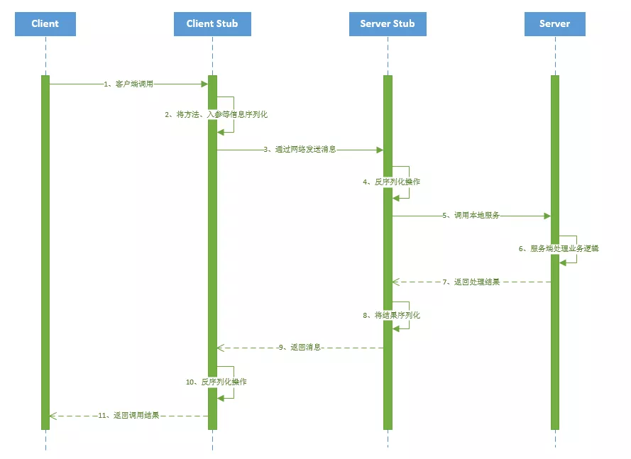

# 面试题 Dubbo

## 1. 什么是 RPC

RPC（Remote Procedure Call Protocol）远程过程调用协议，它是一种通过网络从远程计算机程序上请求服务，而不需要了解底层网络技术的协议。简言之，RPC 使得程序能够像访问本地系统资源一样，去访问远端系统资源。比较关键的一些方面包括：通讯协议、序列化、资源（接口）描述、服务框架、性能、语言支持等。

RPC 框架的好处：

1. 长链接，不必每次通信都要像 http 一样的 3 次握手等等，减少了网络开销；
2. RPC 框架一般都有注册中心，有丰富的监控管理；发布、下线接口、动态扩展等，对调用方来说是无感知、统一化的操作。
3. 安全性。

socket 只是一个简单的网络通信方式，只是创建通信双方的通信通道，而要实现 rpc 的功能，还需要对其进行封装，以实现更多的功能。

RPC 一般配合 netty 框架、spring 自定义注解来编写轻量级框架，其实 netty 内部是封装了 socket 的，较新的 jdk 的 IO 一般是 NIO，即非阻塞 IO，在高并发网站中，RPC 的优势会很明显

## 2. PRC 架构组件

一个基本的 RPC 架构里面应该至少包含以下 4 个组件：

1. 客户端（Client）：服务调用方（服务消费者）
2. 客户端存根（Client Stub）：存放服务端地址信息，将客户端的请求参数数据信息打包成网络消息，再通过网络传输发送给服务端
3. 服务端存根（Server Stub）：接收客户端发送过来的请求消息并进行解包，然后再调用本地服务进行处理
4. 服务端（Server）：服务的真正提供者

具体调用过程：

1. 服务消费者（client 客户端）通过调用本地服务的方式调用需要消费的服务；
2. 客户端存根（client stub）接收到调用请求后负责将方法、入参等信息序列化（组装）成能够进行网络传输的消息体；
3. 客户端存根（client stub）找到远程的服务地址，并且将消息通过网络发送给服务端；
4. 服务端存根（server stub）收到消息后进行解码（反序列化操作）；
5. 服务端存根（server stub）根据解码结果调用本地的服务进行相关处理；
6. 本地服务执行具体业务逻辑并将处理结果返回给服务端存根（server stub）；
7. 服务端存根（server stub）将返回结果重新打包成消息（序列化）并通过网络发送至消费方；
8. 客户端存根（client stub）接收到消息，并进行解码（反序列化）；
9. 服务消费方得到最终结果；

> Notes: RPC 框架的实现目标则是将上图的第 2-10 步完好地封装起来，也就是把调用、编码/解码的过程给封装起来，让用户感觉上像调用本地服务一样的调用远程服务。
