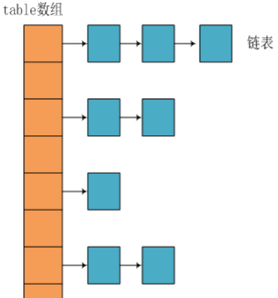

# Java 基础面试题

## 1. String 是最基本的数据类型吗？

答：Java 中的基本数据类型只有 8 个：byte、short、int、long、float、double、char、boolean；除了基本类型（primitive type），剩下的都是引用类型（reference type），Java 5 以后引入的枚举类型也算是一种比较特殊的引用类型。

## 2. 请说说你对反射的了解？

得分点 反射概念,通过反射机制可以实现什么

Java 程序中,许多对象在运行时都会有编译时异常和运行时异常两种,例如多态情况下`Car c = new Audi();`这行代码运行时会生成一个 c 变量,在编译时该变量的类型是 Car,运行时该变量类型为 Audi；另外还有更极端的情况,例如程序在运行时接收到了外部传入的一个对象,这个对象的编译时类型是 Object,但程序又需要调用这个对象运行时类型的方法,这种情况下,有两种解决方法：

第一种做法是假设在编译时和运行时都完全知道类型的具体信息,在这种情况下,可以先使用 instanceof 运算符进行判断,再利用强制类型转换将其转换成其运行时类型的变量。

第二种做法是编译时根本无法预知该对象和类可能属于哪些类,程序只依靠运行时信息来发现该对象和类的真实信息,这就必须使用反射。

具体来说,通过反射机制,我们可以实现如下的操作：

- 程序运行时,可以通过反射获得任意一个类的 Class 对象,并通过这个对象查看这个类的信息；
- 程序运行时,可以通过反射创建任意一个类的实例,并访问该实例的成员；
- 程序运行时,可以通过反射机制生成一个类的动态代理类或动态代理对象。

加分回答

Java 的反射机制在实际项目中应用广泛,常见的应用场景有：

- 使用 JDBC 时,如果要创建数据库的连接,则需要先通过反射机制加载数据库的驱动程序；
- 多数框架都支持注解/XML 配置,从配置中解析出来的类是字符串,需要利用反射机制实例化；
- 面向切面编程（AOP）的实现方案,是在程序运行时创建目标对象的代理类,这必须由反射机制来实现。

## 3. java 中四种修饰符的限制范围

private < 默认 < protected < public

- public: 任意包下任意类都可以访问；
- protected: 任意包下任意子类都可以访问或同包下的任意类
- 默认(包权限): 同包下的任意类都可以访问
- private: 只能在本类中使用

## 4. Object 类中的方法

toString(), equals(), clone(), getClass(), hashCode(), wait(), notify(), notifyAll()

8、接口和抽象类的区别。(注意 JDK8 的接口可以有实现)

相同点：都不能创建对象，都可以定义抽象方法

不同点：

1. 抽象类可以定义成员变量（和常量）；接口不能定义成员变量，但可以定义常量
2. 抽象类可以有构造方法，接口不能有构造方法
3. 抽象类只能单继承，接口是可以多现实
4. 抽象类的成员没有修饰符，接口中的成员有默认修饰符;
5. 如果抽象类实现接口，则可以把接口中方法映射到抽象类中作为抽象方法而不必实现，而在抽象类的子类中实现接口中方法；现实接口的类必须实现所有抽象方法

jdk1.8 之后，接口可以定义非抽象方法，实现类不需要现实该方法

## 5. 动态代理的两种方式，以及区别

实现方式有两种，一种是基于接口（使用 JDK 的 Proxy 类），一种是基于子类（使用第三方 jar 包 cglib）

- JDK 动态接口代理：通过反射去调用目标类的代码，将增加部分的代码。Proxy 类利用 InvocationHandler 动态创建一个接口的实例
- CGlib 动态代理：与 JDK 的方法主要区别在于，在运行期动态生成新的 class

## 6. Java 序列化的方式

- ObjectOutputStream:提供序列化对象并把其写入流的方法
- ObjectInputStream：读取流并反序列化对象
- Serializable：一个对象想要被序列化，那么它的类就要实现 此接口，这个对象的所有属性（包括 private 属性、包括其引用的对象）都可以被序列化和反序列化来保存、传递。
- Externalizable：他是 Serializable 接口的子类，有时我们不希望序列化那么多，可以使用这个接口，这个接口的 writeExternal()和 readExternal()方法可以指定序列化哪些属性;

## 7. 传值和传引用的区别，Java 是怎么样的，有没有传值引用

传值，作为方法的形参，方法中修改值不会影响原来的值

传引用，作为方法的形参，实参与形参都是引用同一个内存地址，所以方法中修改会改变原来的值

传值引用？？

# Java 集合面试题

## 1. Java 集合的快速失败机制 “fail-fast”？

“fail-fast” 是当多个线程对 java 集合进行结构上的改变的操作时的一种错误检测机制。例如：假设存在两个线程（线程 1、线程 2），线程 1 通过 Iterator 在遍历集合 A 中的元素，在某个时候线程 2 修改了集合 A 的结构（是结构上面的修改，而不是简单的修改集合元素的内容），那么这个时候程序就会抛出 `ConcurrentModificationException` 异常，从而产生 fail-fast 机制。

原因：迭代器在遍历时直接访问集合中的内容，并且在遍历过程中使用一个 modCount 变量。集合在被遍历期间如果内容发生变化，就会改变 modCount 的值。每当迭代器使用 hashNext()/next()遍历下一个元素之前，都会检测 modCount 变量是否为 expectedmodCount 值，是的话就返回遍历；否则抛出异常，终止遍历。

解决办法如下：

1. 在遍历过程中，所有涉及到改变 modCount 值得地方全部加上 `synchronized`
2. 使用 `CopyOnWriteArrayList` 来替换 `ArrayList`

## 2. 一个 ArrayList 在循环过程中删除，会不会出问题，为什么

方式 1：如果使用 for 循环中删除一个元素，因为 ArrayList 的删除元素是重新复制新的数组，所以原来的数组的 size 就减 1，此时索引+1，就会出现跳过下一个元素遍历的情况

> 注：如果使用倒序遍历时即使发生元素删除也不影响后序元素遍历。

方式 2：foreach 原理是因为这些集合类都实现了 Iterable 接口，该接口中定义了 Iterator 迭代器的产生方法，并且 foreach 就是通过 Iterable 接口在序列中进行移动。也就是说：在编译的时候编译器会自动将对 for 这个关键字的使用转化为对目标的迭代器的使用，forEach 循环删除报错

方式 3：用 Iterator 循环删除的时候，调用的是 ArrayList 里面的 remove 方法，删除元素后 modCount 会增加，expectedModCount 则不变，这样就造成了 expectedModCount ！= modCount，那么就抛出异常了。

总结：Iterator 调用 ArrayList 的删除方法报错，Iterator 调用迭代器自己的删除方法，单线程不会报错，多线程会报错。

## 3. Iterator 和 ListIterator 的区别

- Iterator 可以遍历 Set 和 List 集合，而 ListIterator 只能遍历 List。
- Iterator 只能单向遍历，而 ListIterator 可以双向遍历（向前/后遍历）。
- ListIterator 实现 Iterator 接口，然后添加了一些额外的功能，比如添加一个元素、替换一个元素、获取前面或后面元素的索引位置

## 4. ArrayList 和 LinkedList 的区别与选择

区别：

- **数据结构实现**：ArrayList 是动态数组的数据结构实现，而 LinkedList 是双向链表的数据结构实现。
- **随机访问效率**：ArrayList 比 LinkedList 在随机访问的时候效率要高，因为 LinkedList 是线性的数据存储方式，所以需要移动指针从前往后依次查找。
- **增加和删除效率**：在非首尾的增加和删除操作，LinkedList 要比 ArrayList 效率要高，因为 ArrayList 增删操作要影响数组内的其他数据的下标。
- **内存空间占用**：LinkedList 比 ArrayList 更占内存，因为 LinkedList 的节点除了存储数据，还存储了两个引用，一个指向前一个元素，一个指向后一个元素。
- **线程安全**：ArrayList 和 LinkedList 都是不同步的，也就是不保证线程安全；

选择建议：

- 如果需要大量非首尾增删元素，则建议使用 LinkedList
- 如果只是遍历查询元素，不进行增删操作，则建议使用 ArrayList

## 5. ArrayList 和 Vector 的区别

此两个类都实现了 List 接口（List 接口继承了 Collection 接口），它们都是有序集合

- **线程安全**：Vector 使用了 `Synchronized` 来实现线程同步，是线程安全的，而 ArrayList 是非线程安全的。
- **性能**：ArrayList 在性能方面要优于 Vector。
- **扩容**：ArrayList 和 Vector 都会根据实际的需要动态的调整容量，只不过在 Vector 扩容每次会增加 1 倍，而 ArrayList 只会增加 50%。

Vector 类的所有方法都是同步的。可以由两个线程安全地访问一个 Vector 对象、但是一个线程访问 Vector 的话代码要在同步操作上耗费大量的时间。

Arraylist 不是同步的，所以在不需要保证线程安全时时建议使用 Arraylist

## 6. Map 的常用实现类 HashMap / LinkedHashMap / TreeMap 的区别

1. HashMap: 基于哈希表的 Map 接口的实现类，并允许使用 null 值和 null 键（**HashMap 最多只允许一条记录的键为 null，允许多条记录的值为 null。**），**键是唯一，存储和取出没有顺序**。
2. LinkedHashMap: 基于哈希表的 Map 接口的实现类，并允许使用 null 值和 null 键，**键是唯一，存储和取出有顺序**
3. TreeMap：从功能上讲，TreeMap 有着比 HashMap 更为强大的功能，它实现了 SortedMap 接口，这意味着它可以对元素进行排序。TreeMap 的性能略微低于 HashMap。如果在开发中需要对元素进行排序，那么使用 HashMap 便无法实现这种功能，使用 TreeMap 的迭代输出将会以元素顺序进行。**LinkedHashMap 是基于元素进入集合的顺序或者被访问的先后顺序排序，TreeMap 则是基于元素的固有顺序 (由 Comparator 或者 Comparable 确定)。即：LinkedHashMap 是根据元素增加或者访问的先后顺序进行排序，而 TreeMap 则根据元素的 Key 进行排序**。

## 7. HashSet 的实现原理？

HashSet 是基于 HashMap 实现的，HashSet 的值存放于 HashMap 的 key 上，HashMap 的 value 统一为 PRESENT，因此 HashSet 的实现比较简单，相关 HashSet 的操作，基本上都是直接调用底层 HashMap 的相关方法来完成，HashSet 不允许重复的值

## 8. 为什么 ArrayList 的 elementData 加上 transient 修饰

ArrayList 实现了 Serializable 接口，可以支持序列化。transient 的作用是说不希望 elementData 数组被序列化，然后重写了 writeObject 实现。

每次序列化时，先调用 defaultWriteObject() 方法序列化 ArrayList 中的非 transient 元素，然后遍历 elementData，只序列化已存入的元素，这样既加快了序列化的速度，又减小了序列化之后的文件大小。

## 9. HashMap 的实现原理？

HashMap 是基于哈希表的 Map 接口的非同步实现。此实现提供所有可选的映射操作，并允许使用 null 值和 null 键。此类不保证映射的顺序，特别是它不保证该顺序恒久不变。

在 Java 编程语言中，保存数据有两种比较简单的数据结构：数组和链表（模拟指针引用）。所有的数据结构都可以用这两个基本结构来构造的，HashMap 也不例外。

- 数组的特点是：寻址容易，插入和删除困难；
- 链表的特点是：寻址困难，但插入和删除容易；

所以将数组和链表结合在一起，发挥两者各自的优势，使用一种叫做**拉链法**的方式可以解决哈希冲突。HashMap 的数据结构实际上是一个“链表散列”的数据结构，即数组和链表的结合体。

HashMap 基于 Hash 算法实现的，具体如下：

1. 当我们往 Hashmap 中 put 元素时，利用 key 的 hashCode 重新 hash 计算出当前对象的元素在数组中的下标
2. 存储时，如果出现 hash 值相同的 key，此时有两种情况。
   1. 如果 key 相同，则覆盖原始值；
   2. 如果 key 不同（出现冲突），则将当前的 key-value 放入链表中
3. 获取时，直接找到 hash 值对应的下标，在进一步判断 key 是否相同，从而找到对应值。
4. 理解了以上过程就不难明白 HashMap 是如何解决 hash 冲突的问题，核心就是使用了数组的存储方式，然后将冲突的 key 的对象放入链表中，一旦发现冲突就在链表中做进一步的对比。

> 需要注意 Jdk 1.8 中对 HashMap 的实现做了优化，当链表中的节点数据超过八个之后，该链表会转为红黑树来提高查询效率，从原来的 `O(n)` 到 `O(logn)`

### 9.1. JDK1.8 之前实现

JDK1.8 之前采用的是拉链法。拉链法：将链表和数组相结合。也就是说创建一个链表数组，数组中每一格就是一个链表。若遇到哈希冲突，则将冲突的值加到链表中即可。

### 9.2. JDK1.8 之后实现

相比于之前的版本，jdk1.8 在解决哈希冲突时有了较大的变化，当链表长度大于阈值（默认为 8）时，将链表转化为红黑树，以减少搜索时间。

数组+链表。通过计算 key 的 hashCode 的值，再去取模来决定当前 Entry 对象存储的索引位置，如果当前位置为空，则直接存储；如果当时位置已经存在内容，则将给存储的数据加上 next 指针，指向之前存在的数据。
jdk8 主要是对 HashMap 做了红黑树的优化，使树的结构相对平衡，减小链的长度，达到加快查询的速度

### 9.3. JDK1.7 VS JDK1.8

JDK1.8 主要解决或优化了一下问题：

1. resize 扩容优化
2. 引入了红黑树，目的是避免单条链表过长而影响查询效率
3. 解决了多线程死循环问题，但仍是非线程安全的，多线程时可能会造成数据丢失问题。

| 区别                     | JDK1.7                                                                 | JDK1.8                                                                                             |
| ------------------------ | ---------------------------------------------------------------------- | -------------------------------------------------------------------------------------------------- |
| 存储结构                 | 数组+链表                                                              | 数组+链表+红黑树                                                                                   |
| 初始化方式               | 单独函数：inflateTable()                                               | 直接集成到了扩容函数 resize()中                                                                    |
| hash 值计算方式          | 扰动处理=9 次扰动=4 次位运算+5 次异或运算                              | 扰动处理=2 次扰动=1 次位运算+1 次异或运算                                                          |
| 存放数据的规则           | 无冲突时，存放数组；冲突时，存放链表                                   | 无冲突时：存放数组 冲突 & `链表长度 < 8`：存放单链表 冲突 & `链表长度 > 8`：树化并存放红黑树 |
| 插入数据方式             | 头插法（先将原位置的数据移到后 1 位，再插入数据到该位置）              | 尾插法（直接插入到链表尾部/红黑树）                                                                |
| 扩容后存储位置的计算方式 | 全部按照原来方法进行计算（即`hashCode ->> 扰动函数 ->> (h&length-1)`） | 按照扩容后的规律计算（即`扩容后的位置=原位置 or 原位置 + 旧容量`）                                 |

## 10. (待学习)HashMap 的 put 方法的具体流程

当 put 元素的时候，首先计算 key 的 hash 值，这里调用了 hash 方法，hash 方法实际是让`key.hashCode()`与`key.hashCode()>>>16`进行异或操作，高 16bit 补 0，一个数和 0 异或不变，所以 hash 函数大概的作用就是：**高 16bit 不变，低 16bit 和高 16bit 做了一个异或，目的是减少碰撞**。按照函数注释，因为 bucket 数组大小是 2 的幂，计算下标`index = (table.length - 1) & hash`，如果不做 hash 处理，相当于散列生效的只有几个低 bit 位，为了减少散列的碰撞，设计者综合考虑了速度、作用、质量之后，使用高 16bit 和低 16bit 异或来简单处理减少碰撞，而且 JDK8 中用了复杂度 `O(logn)`的树结构来提升碰撞下的性能。

putVal 方法执行流程图

## 11. (待学习)HashMap 的扩容操作是怎么实现的？

## 12. 说说 HashMap 底层原理？

得分点 数据结构、put()流程、扩容机制

数据结构 在 JDK8 中,HashMap 底层是采用“数组+链表+红黑树”来实现的。

HashMap 是基于哈希算法来确定元素的位置（槽）的,当我们向集合中存入数据时,它会计算传入的 Key 的哈希值,并利用哈希值取余来确定槽的位置。如果元素发生碰撞,也就是这个槽已经存在其他的元素了,则 HashMap 会通过链表将这些元素组织起来。如果碰撞进一步加剧,某个链表的长度达到了 8,则 HashMap 会创建红黑树来代替这个链表,从而提高对这个槽中数据的查找的速度。

HashMap 中,数组的默认初始容量为 16,这个容量会以 2 的指数进行扩容。具体来说,当数组中的元素达到一定比例的时候 HashMap 就会扩容,这个比例叫做负载因子,默认为 0.75。自动扩容机制,是为了保证 HashMap 初始时不必占据太大的内存,而在使用期间又可以实时保证有足够大的空间。采用 2 的指数进行扩容,是为了利用位运算,提高扩容运算的效率。

put()方法的执行过程中,主要包含四个步骤：

1. 判断数组,若发现数组为空,则进行首次扩容。
2. 判断头节点,若发现头节点为空,则新建链表节点,存入数组。
3. 判断头节点,若发现头节点非空,则将元素插入槽内。其中,第 3 步又可以细分为如下三个小步骤：
   1. 若元素的 key 与头节点一致,则直接覆盖头节点。
   2. 若元素为树型节点,则将元素追加到树中。
   3. 若元素为链表节点,则将元素追加到链表中。追加后,需要判断链表长度以决定是否转为红黑树。若链表长度达到 8、数组容量未达到 64,则扩容。若链表长度达到 8、数组容量达到 64,则转为红黑树。
4. 插入元素后,判断元素的个数,若发现超过阈值则再次扩容。

扩容机制 向 HashMap 中添加数据时,有三个条件会触发它的扩容行为：

1. 如果数组为空,则进行首次扩容。
2. 将元素接入链表后,如果链表长度达到 8,并且数组长度小于 64,则扩容。
3. 添加后,如果数组中元素超过阈值,即比例超出限制（默认为 0.75）,则扩容。

并且,每次扩容时都是将容量翻倍,即创建一个 2 倍大的新数组,然后再将旧数组中的数组迁移到新数组里。由于 HashMap 中数组的容量为 2^N,所以可以用位移运算计算新容量,效率很高。

加分回答

HashMap 是非线程安全的,在多线程环境下,多个线程同时触发 HashMap 的改变时,有可能会发生冲突。所以,在多线程环境下不建议使用 HashMap,可以考虑使用 Collections 将 HashMap 转为线程安全的 HashMap,更为推荐的方式则是使用 ConcurrentHashMap。

## 13. 说说 ConcurrentHashMap？

得分点 数组+链表+红黑树、锁的粒度

在 JDK8 中,ConcurrentHashMap 的底层数据结构与 HashMap 一样,也是采用“数组+链表+红黑树”的形式。同时,它又采用锁定头节点的方式降低了锁粒度,以较低的性能代价实现了线程安全。底层数据结构的逻辑可以参考 HashMap 的实现,下面我重点介绍它的线程安全的实现机制。

1. 初始化数组或头节点时,ConcurrentHashMap 并没有加锁,而是 CAS 的方式进行原子替换（原子操作,基于 Unsafe 类的原子操作 API）。
2. 插入数据时会进行加锁处理,但锁定的不是整个数组,而是槽中的头节点。所以,ConcurrentHashMap 中锁的粒度是槽,而不是整个数组,并发的性能很好。
3. 扩容时会进行加锁处理,锁定的仍然是头节点。并且,支持多个线程同时对数组扩容,提高并发能力。每个线程需先以 CAS 操作抢任务,争抢一段连续槽位的数据转移权。抢到任务后,该线程会锁定槽内的头节点,然后将链表或树中的数据迁移到新的数组里。
4. 查找数据时并不会加锁,所以性能很好。另外,在扩容的过程中,依然可以支持查找操作。如果某个槽还未进行迁移,则直接可以从旧数组里找到数据。如果某个槽已经迁移完毕,但是整个扩容还没结束,则扩容线程会创建一个转发节点存入旧数组,届时查找线程根据转发节点的提示,从新数组中找到目标数据。

加分回答

ConcurrentHashMap 实现线程安全的难点在于多线程并发扩容,即当一个线程在插入数据时,若发现数组正在扩容,那么它就会立即参与扩容操作,完成扩容后再插入数据到新数组。在扩容的时候,多个线程共同分担数据迁移任务,每个线程负责的迁移数量是 `(数组长度 >>> 3) / CPU核心数`。 也就是说,为线程分配的迁移任务,是充分考虑了硬件的处理能力的。多个线程依据硬件的处理能力,平均分摊一部分槽的迁移工作。另外,如果计算出来的迁移数量小于 16,则强制将其改为 16,这是考虑到目前服务器领域主流的 CPU 运行速度,每次处理的任务过少,对于 CPU 的算力也是一种浪费。

## 14. HashMap 、ConcurrentHashMap 和 Hashtable 的区别

1. 线程安全：HashMap 是线程不安全；而 ConcurrentHashMap 和 Hashtable 是线程安全的。
2. key 是否允许有 null 值：HashMap 允许有 null，但只能存在一个；而 ConcurrentHashMap 和 Hashtable 都不允许。

## 15. 你知道哪些线程安全的集合？

得分点 Collections、java.util.concurrent (JUC)

java.util 包下的集合类中,大部分都是非线程安全的,但也有少数的线程安全的集合类,例如 Vector、Hashtable,它们都是非常古老的 API。虽然它们是线程安全的,但是性能很差,已经不推荐使用了。

对于这个包下非线程安全的集合,可以利用 Collections 工具类,该工具类提供的 synchronizedXxx()方法,可以将这些集合类包装成线程安全的集合类。

从 JDK 1.5 开始,并发包下新增了大量高效的并发的容器,这些容器按照实现机制可以分为三类。

- 第一类是以降低锁粒度来提高并发性能的容器,它们的类名以 Concurrent 开头,如 ConcurrentHashMap。
- 第二类是采用写时复制技术实现的并发容器,它们的类名以 CopyOnWrite 开头,如 CopyOnWriteArrayList。
- 第三类是采用 Lock 实现的阻塞队列,内部创建两个 Condition 分别用于生产者和消费者的等待,这些类都实现了 BlockingQueue 接口,如 ArrayBlockingQueue。

加分回答

Collections 还提供了如下三类方法来返回一个不可变的集合,这三类方法的参数是原有的集合对象,返回值是该集合的“只读”版本。通过 Collections 提供的三类方法,可以生成“只读”的 Collection 或 Map。

- emptyXxx()：返回一个空的不可变的集合对象
- singletonXxx()：返回一个只包含指定对象的不可变的集合对象
- unmodifiableXxx()：返回指定集合对象的不可变视图

# Java IO 面试题

## 1. BIO,NIO,AIO 有什么区别?

- BIO：Block IO 同步阻塞式 IO，就是我们平常使用的传统 IO，它的特点是模式简单使用方便，并发处理能力低。
- NIO：Non IO 同步非阻塞 IO，是传统 IO 的升级，客户端和服务器端通过 Channel（通道）通讯，实现了多路复用。
- AIO：Asynchronous IO 是 NIO 的升级，也叫 NIO2，实现了异步非堵塞 IO，异步 IO 的操作基于事件和回调机制。

详细回答

- BIO (Blocking I/O): 同步阻塞 I/O 模式，数据的读取写入必须阻塞在一个线程内等待其完成。在活动连接数不是特别高（小于单机 1000）的情况下，这种模型是比较不错的，可以让每一个连接专注于自己的 I/O 并且编程模型简单，也不用过多考虑系统的过载、限流等问题。线程池本身就是一个天然的漏斗，可以缓冲一些系统处理不了的连接或请求。但是，当面对十万甚至百万级连接的时候，传统的 BIO 模型是无能为力的。因此，我们需要一种更高效的 I/O 处理模型来应对更高的并发量。
- NIO (New I/O): NIO 是一种同步非阻塞的 I/O 模型，在 Java 1.4 中引入了 NIO 框架，对应 java.nio 包，提供了 Channel , Selector，Buffer 等抽象。NIO 中的 N 可以理解为 Non-blocking，不单纯是 New。它支持面向缓冲的，基于通道的 I/O 操作方法。 NIO 提供了与传统 BIO 模型中的 Socket 和 ServerSocket 相对应的 SocketChannel 和 ServerSocketChannel 两种不同的套接字通道实现,两种通道都支持阻塞和非阻塞两种模式。阻塞模式使用就像传统中的支持一样，比较简单，但是性能和可靠性都不好；非阻塞模式正好与之相反。对于低负载、低并发的应用程序，可以使用同步阻塞 I/O 来提升开发速率和更好的维
- AIO (Asynchronous I/O): AIO 也就是 NIO 2。在 Java 7 中引入了 NIO 的改进版 NIO 2,它是异步非阻塞的 IO 模型。异步 IO 是基于事件和回调机制实现的，也就是应用操作之后会直接返回，不会堵塞在那里，当后台处理完成，操作系统会通知相应的线程进行后续的操作。AIO 是异步 IO 的缩写，虽然 NIO 在网络操作中，提供了非阻塞的方法，但是 NIO 的 IO 行为还是同步的。对于 NIO 来说，我们的业务线程是在 IO 操作准备好时，得到通知，接着就由这个线程自行进行 IO 操作，IO 操作本身是同步的。查阅网上相关资料，我发现就目前来说 AIO 的应用还不是很广泛，Netty 之前也尝试使用过 AIO，不过又放弃了

# Java 异常面试题

## 1. JVM 的异常处理

Java 通过面向对象的方法进行异常处理，一旦方法抛出异常，系统自动根据该异常对象寻找合适异常处理器（Exception Handler）来处理该异常，把各种不同的异常进行分类，并提供了良好的接口。

在一个方法中如果发生异常，这个方法会创建一个异常对象，并转交给 JVM，该异常对象包含异常名称，异常描述以及异常发生时应用程序的状态。创建异常对象并转交给 JVM 的过程称为抛出异常。可能有一系列的方法调用，最终才进入抛出异常的方法，这一系列方法调用的有序列表叫做调用栈。

JVM 会顺着调用栈去查找看是否有可以处理异常的代码，如果有，则调用异常处理代码。当 JVM 发现可以处理异常的代码时，会把发生的异常传递给它。如果 JVM 没有找到可以处理该异常的代码块，JVM 就会将该异常转交给默认的异常处理器（默认处理器为 JVM 的一部分），默认异常处理器打印出异常信息并终止应用程序。

## 2. NoClassDefFoundError 和 ClassNotFoundException 区别？

NoClassDefFoundError 是一个 Error 类型的异常，是由 JVM 引起的，不应该尝试捕获这个异常。引起该异常的原因是 JVM 或 ClassLoader 尝试加载某类时在内存中找不到该类的定义，该动作发生在运行期间，即编译时该类存在，但是在运行时却找不到了，可能是变异后被删除了等原因导致；

ClassNotFoundException 是一个受查异常，需要显式地使用 try-catch 对其进行捕获和处理，或在方法签名中用 throws 关键字进行声明。当使用 Class.forName, ClassLoader.loadClass 或 ClassLoader.findSystemClass 动态加载类到内存的时候，通过传入的类路径参数没有找到该类，就会抛出该异常；另一种抛出该异常的可能原因是某个类已经由一个类加载器加载至内存中，另一个加载器又尝试去加载它。
