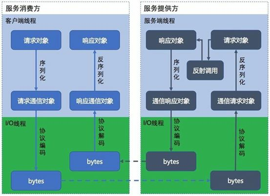

# Day01 分布式服务框架-Dubbo

## 1. 电商行业技术特点

- 技术新
- 技术范围广
- 分布式
- 高并发、集群、负载均衡、高可用
- 海量数据
- 业务复杂
- 系统安全

## 2. 主要电商模式

### 2.1. B2B--企业对企业

B2B （ Business to Business）是指进行电子商务交易的供需双方都是商家（或企业、公司），她（他）们使用了互联网的技术或各种商务网络平台，完成商务交易的过程。电子商务是现代 B2B marketing的一种具体主要的表现形式。

案例：阿里巴巴、慧聪网

### 2.2. C2C--个人对个人

C2C即 Customer（Consumer） to Customer（Consumer），意思就是消费者个人间的电子商务行为。比如一个消费者有一台电脑，通过网络进行交易，把它出售给另外一个消费者，此种交易类型就称为C2C电子商务。

案例：淘宝、易趣、瓜子二手车

### 2.3. B2C--企业对个人

B2C是Business-to-Customer的缩写，而其中文简称为“商对客”。“商对客”是电子商务的一种模式，也就是通常说的直接面向消费者销售产品和服务商业零售模式。这种形式的电子商务一般以网络零售业为主，主要借助于互联网开展在线销售活动。B2C即企业通过互联网为消费者提供一个新型的购物环境——网上商店，消费者通过网络在网上购物、网上支付等消费行为。

案例：唯品会、乐蜂网

### 2.4. C2B--个人对企业

C2B（Consumer to Business，即消费者到企业），是互联网经济时代新的商业模式。这一模式改变了原有生产者（企业和机构）和消费者的关系，是一种消费者贡献价值（Create Value）， 企业和机构消费价值（Consume Value）。

C2B模式和我们熟知的供需模式（DSM, Demand Supply Model）恰恰相反，真正的C2B 应该先有消费者需求产生而后有企业生产，即先有消费者提出需求，后有生产企业按需求组织生产。通常情况为消费者根据自身需求定制产品和价格，或主动参与产品设计、生产和定价，产品、价格等彰显消费者的个性化需求，生产企业进行定制化生产。

案例：海尔商城、 尚品宅配

### 2.5. O2O--线上到线下

O2O即Online To Offline（在线离线/线上到线下），是指将线下的商务机会与互联网结合，让互联网成为线下交易的平台，这个概念最早来源于美国。O2O的概念非常广泛，既可涉及到线上，又可涉及到线下,可以通称为O2O。主流商业管理课程均对O2O这种新型的商业模式有所介绍及关注。

案例：美团、饿了吗

### 2.6. F2C--工厂到个人

F2C指的是Factory to customer，即从厂商到消费者的电子商务模式。

### 2.7. B2B2C -企业-企业-个人

B2B2C是一种电子商务类型的网络购物商业模式，B是BUSINESS的简称，C是CUSTOMER的简称，第一个B指的是商品或服务的供应商，第二个B指的是从事电子商务的企业，C则是表示消费者。

第一个BUSINESS，并不仅仅局限于品牌供应商、影视制作公司和图书出版商，任何的商品供应商或服务供应商都能可以成为第一个BUSINESS；第二B是B2B2C模式的电子商务企业，通过统一的经营管理对商品和服务、消费者终端同时进行整合，是广大供应商和消费者之间的桥梁，为供应商和消费者提供优质的服务，是互联网电子商务服务供应商。C表示消费者，在第二个B构建的统一电子商务平台购物的消费者；

B2B2C的来源于目前的B2B、B2C模式的演变和完善，把B2C和C2C完美地结合起来，通过B2B2C模式的电子商务企业构建自己的物流供应链系统，提供统一的服务。

案例：京东商城、天猫商城

## 3. 项目需求分析与系统设计

### 3.1. 品优购简介

品优购网上商城是一个综合性的 B2B2C 平台，类似京东商城、天猫商城。网站采用商家入驻的模式，商家入驻平台提交申请，有平台进行资质审核，审核通过后，商家拥有独立的管理后台录入商品信息。商品经过平台审核后即可发布。

品优购网上商城主要分为网站前台、运营商后台、商家管理后台三个子系统

#### 3.1.1. 网站前台

主要包括网站首页、商家首页、商品详细页、、搜索页、会员中心、订单与支付相关页面、秒杀频道等。


#### 3.1.2. 运营商后台

运营商的运营人员的管理后台。主要包括商家审核、品牌管理、规格管理、模板管理、商品分类管理、商品审核、广告类型管理、广告管理、订单查询、商家结算等。


#### 3.1.3. 商家管理后台

入驻的商家进行管理的后台，主要功能是对商品的管理以及订单查询统计、资金结算等功能。


### 3.2. 系统架构

#### 3.2.1. 什么是SOA架构

SOA是Service-Oriented Architecture的首字母简称，它是一种支持面向服务的架构样式。从服务、基于服务开发和服务的结果来看，面向服务是一种思考方式。其实SOA架构更多应用于互联网项目开发。

为什么互联网项目会采用SOA架构呢？随着互联网的发展，网站应用的规模不断扩大，常规的垂直应用架构已无法应对，分布式服务架构以及流动计算架构势在必行，迫切需一个治理系统确保架构有条不紊的演进。

***SOA架构是一种思想，实现的两种框架Dubbo和Spring Cloud***

#### 3.2.2. 品优购架构分析


### 3.3. 数据库表结构

|         表名称          |             含义             |
| :---------------------: | :--------------------------: |
|        tb_brand         |             品牌             |
|    tb_specification     |             规格             |
| tb_specification_option |           规格选项           |
|    tb_type_template     | 类型模板：用于关联品牌和规格 |
|       tb_item_cat       |           商品分类           |
|        tb_seller        |             商家             |
|        tb_goods         |             商品             |
|      tb_goods_desc      |           商品详情           |
|         tb_item         |           商品明细           |
|       tb_content        |         内容（广告）         |
|   tb_content_category   |       内容（广告）类型       |
|         tb_user         |             用户             |
|        tb_order         |             订单             |
|      tb_order_item      |           订单明细           |
|       tb_pay_log        |           支付日志           |
|    tb_seckill_goods     |           秒杀商品           |
|    tb_seckill_order     |           秒杀订单           |

### 3.4. 框架组合

品优购采用当前流行的前后端编程架构。

- 后端框架采用：Spring + SpringMVC + MyBatis + Dubbo
- 前端采用：angularJS + Bootstrap

## 4. Dubbo 框架

### 4.1. RPC框架

#### 4.1.1. 什么是RPC

RPC（Remote Procedure Call Protocol）远程过程调用协议，它是一种通过网络从远程计算机程序上请求服务，而不需要了解底层网络技术的协议。简言之，RPC使得程序能够像访问本地系统资源一样，去访问远端系统资源。比较关键的一些方面包括：通讯协议、序列化、资源（接口）描述、服务框架、性能、语言支持等。

简单的说，**RPC就是从一台机器(客户端)上通过参数传递的方式调用另一台机器(服务器)上的一个函数或方法(可以统称为服务)并得到返回的结果。**

#### 4.1.2. RPC架构组件

一个基本的RPC架构里面应该至少包含以下4个组件：

1. **客户端（Client）**：服务调用方（服务消费者）
2. **客户端存根（Client Stub）**：存放服务端地址信息，将客户端的请求参数数据信息打包成网络消息，再通过网络传输发送给服务端
3. **服务端存根（Server Stub）**：接收客户端发送过来的请求消息并进行解包，然后再调用本地服务进行处理
4. **服务端（Server）**：服务的真正提供者


具体调用过程：

1. 服务消费者（client客户端）通过调用本地服务的方式调用需要消费的服务；
2. 客户端存根（client stub）接收到调用请求后负责将方法、入参等信息序列化（组装）成能够进行网络传输的消息体；
3. 客户端存根（client stub）找到远程的服务地址，并且将消息通过网络发送给服务端；
4. 服务端存根（server stub）收到消息后进行解码（反序列化操作）；
5. 服务端存根（server stub）根据解码结果调用本地的服务进行相关处理；
6. 本地服务执行具体业务逻辑并将处理结果返回给服务端存根（server stub）；
7. 服务端存根（server stub）将返回结果重新打包成消息（序列化）并通过网络发送至消费方；
8. 客户端存根（client stub）接收到消息，并进行解码（反序列化）；
9. 服务消费方得到最终结果；

而RPC框架的实现目标则是将上面的第2-10步完好地封装起来，也就是把调用、编码/解码的过程给封装起来，让用户感觉上像调用本地服务一样的调用远程服务。

#### 4.1.3. RPC的实现原理架构图



### 4.2. Dubbo简介

Dubbo是一个分布式服务框架，是阿里巴巴开源项目Dubbo，被国内电商及互联网项目中使用。

Dubbo 致力于提供高性能和透明化的RPC远程服务调用方案，以及SOA服务治理方案。简单的说，dubbo就是个服务框架，如果没有分布式的需求，其实是不需要用的，只有在分布式的时候，才有dubbo这样的分布式服务框架的需求，并且本质上是个服务调用，就是个远程服务调用的分布式框架。

官网地址：

- http://dubbo.io/
- http://dubbo.apache.org

### 4.3. Dubbo架构图


- 节点角色说明：
    - Provider: 暴露服务的服务提供方。
    - Consumer: 调用远程服务的服务消费方。
    - Registry: 服务注册与发现的注册中心。
    - Monitor: 统计服务的调用次数和调用时间的监控中心。
    - Container: 服务运行容器。
- 调用关系说明：
	0. 服务容器负责启动，加载，运行服务提供者。
	1. 服务提供者在启动时，向注册中心注册自己提供的服务。
	2. 服务消费者在启动时，向注册中心订阅自己所需的服务。
	3. 注册中心返回服务提供者地址列表给消费者，如果有变更，注册中心将基于长连接推送变更数据给消费者。
	4. 服务消费者，从提供者地址列表中，基于软负载均衡算法，选一台提供者进行调用，如果调用失败，再选另一台调用。
	5. 服务消费者和提供者，在内存中累计调用次数和调用时间，定时每分钟发送一次统计数据到监控中心。

### 4.4. Zookeeper注册中心（Dubbo推荐使用）

#### 4.4.1. Zookeeper介绍

- 官方推荐使用 zookeeper 注册中心。注册中心负责服务地址的注册与查找，相当于目录服务，服务提供者和消费者只在启动时与注册中心交互，注册中心不转发请求，压力较小。
- Zookeeper 是 Apacahe Hadoop 的子项目，是一个树型的目录服务，支持变更推送，适合作为 Dubbo 服务的注册中心，工业强度较高，可用于生产环境。
- **一句话总结：zookeeper = 文件系统 + 监听通知机制**
    - **文件系统**：每个目录节点都可以存储数据
    - **监听通知机制**：客户端注册监听它关心的目录节点，当目录节点发生变化（数据改变、被删除、子目录节点增加删除）时，zookeeper会通知客户端

#### 4.4.2. Linux系统安装Zookeeper

- 安装参考：【资料\zookeeper\Linux安装zookeeper.docx】
- 下载地址：http://www.apache.org/dyn/closer.cgi/zookeeper
- 安装环境：
    - Linux：CentOS7.4
    - Jdk:1.8以上版本

1. 使用rz命令上传【zookeeper-3.4.11.tar.gz】

```cmd
cd /usr/local
```

2. 解压与删除

```cmd
tar -xzvf zookeeper-3.4.11.tar.gz
rm -rf zookeeper-3.4.11.tar.gz
```

3. 创建data目录

```cmd
# 重命名
mv zookeeper-3.4.11 dubbo-zookeeper
# 切换目录
cd dubbo-zookeeper
# 创建目录
mkdir data
```

4. 修改zoo.cfg

```cmd
cd conf
cp zoo_sample.cfg zoo.cfg

vi zoo.cfg
dataDir=/usr/local/dubbo-zookeeper/data（新建的data目录所在的位置）
```


5. 启动与查看状态

```cmd
cd /usr/local/dubbo-zookeeper/bin
./zkServer.sh start
或
/usr/local/dubbo-zookeeper/bin/zkServer.sh start

#查看状态
cd /usr/local/dubbo-zookeeper/bin
./zkServer.sh status
或
/usr/local/dubbo-zookeeper/bin/zkServer.sh status
```


6. 开放2181端口

zookeeper使用2181端口号，为了能对外正常使用zookeeper，需要开放2181端口号，或者关闭防火墙

```cmd
# 对外开放2181端口
firewall-cmd --zone=public --add-port=2181/tcp --permanent

–zone：作用域
–add-port=2181/tcp：添加端口，格式为：端口/通讯协议
–permanent：永久生效，没有此参数重启后失效

# 重启防火墙
firewall-cmd --reload

# 查看已经开放的端口
firewall-cmd --list-ports

# 停止防火墙
systemctl stop firewalld.service

# 禁止防火墙开机启动
systemctl disable firewalld.service
```

### 4.5. Dubbo监控中心

在开发时，需要知道注册中心都注册了哪些服务，以便我们开发和测试。我们可以通过部署一个管理中心来实现。其实管理中心就是一个web应用，部署到tomcat即可。

#### 4.5.1. 监控中心安装

1. 编译源码，得到war包
    - dubbo-2.5.7.zip是dubbo的源码，可以使用maven命令编译源码得到“管理端”的war包
    - 将此压缩包解压，在命令符下进入dubbo-admin目录，输入maven命令：`mvn package -Dmaven.skip.test=true`
2. 进入target文件夹，有dubbo-admin-2.5.7.war，在linux服务器上安装tomcat，将此war包上传到linux服务器的tomcat的webapps下。

#### 4.5.2. Linux部署dubbo监控中心

部署监控中心参考：【`资料\dubbo\安装部署dubbo的监控中心monitor.docx`】

安装apache-tomcat-8.5.28.tar.gz版本

1. 安装tomcat，部署dubbo-admin-2.5.7.war

```cmd
cd /usr/local

mkdir web && cd web

使用rz 上传apache-tomcat-8.5.28.tar.gz

tar -xzvf apache-tomcat-8.5.28.tar.gz
rm -rf apache-tomcat-8.5.28.tar.gz

#重命名
mv apache-tomcat-8.5.28 tomcat-dubbo-monitor

cd tomcat-dubbo-monitor/webapps

rm -rf *

mkdir ROOT && cd ROOT

使用rz 上传dubbo-admin-2.5.7.war

jar -xvf dubbo-admin-2.5.7.war

rm -f dubbo-admin-2.5.7.war
```

2. 修改 WEB-INF/dubbo.properties属性文件

```cmd
cd  WEB-INF

vi dubbo.properties
# 修改其中的dubbo.registry.address=zookeeper://192.168.12.131:2181为注册中的实际地址。

# 启动tomcat
cd /usr/local/web/tomcat-dubbo-monitor/bin
./startup.sh
或
/usr/local/web/tomcat-dubbo-monitor/bin/startup.sh
```


3. 开放8080端口

tomcat使用8080端口号，为了能对外正常使用tomcat，需要开放8080端口号，或者关闭防火墙

```cmd
# 对外开放8080端口
firewall-cmd --zone=public --add-port=8080/tcp --permanent

–zone：作用域
–add-port=8080/tcp：添加端口，格式为：端口/通讯协议
–permanent：永久生效，没有此参数重启后失效

#重启防火墙
firewall-cmd --reload

# 查看已经开放的端口
firewall-cmd --list-ports

#停止防火墙
systemctl stop firewalld.service

#禁止防火墙开机启动
systemctl disable firewalld.service
```

#### 4.5.3. 登录监控中心

打开浏览器，输入http://192.168.12.131:8080，登录用户名和密码均为root进入首页。 (192.168.12.131)是部署的linux主机地址。

### 4.6. Dubbo框架使用小结

```
一、服务提供者(pinyougou-sellergoods-service)：
	1. 配置依赖jar:
		<!-- dubbo相关 -->
		<dependency>
			<groupId>com.alibaba</groupId>
			<artifactId>dubbo</artifactId>
		</dependency>
		<dependency>
			<groupId>org.apache.zookeeper</groupId>
			<artifactId>zookeeper</artifactId>
		</dependency>
		<dependency>
			<groupId>com.github.sgroschupf</groupId>
			<artifactId>zkclient</artifactId>
		</dependency>

	2. dubbo整合Spring注册服务:
	a. 引用dubbo命名空间:
		xmlns:dubbo="http://code.alibabatech.com/schema/dubbo"
			http://code.alibabatech.com/schema/dubbo
			http://code.alibabatech.com/schema/dubbo/dubbo.xsd
	 
	b. 注册服务
		<!-- 导入数据访问的Spring配置文件 -->
		<import resource="classpath:applicationContext-mapper.xml"/>

		<!--####### dubbo服务提供者 #######-->
		<!-- 配置当前应用的名称 -->
		<dubbo:application name="pinyougou-sellergoods"/>
		<!-- 配置注册中心，注册服务 -->
		<dubbo:registry address="zookeeper://192.168.12.132:2181"/>

		<!-- 配置用dubbo协议在20880端口暴露服务 -->
		<dubbo:protocol name="dubbo" port="20880"/>

		<!-- 配置需要暴露的服务 -->
		<dubbo:service 
			interface="com.pinyougou.sellergoods.service.BrandService" 
			ref="branddService"/>
		<bean id="branddService" 
			class="com.pinyougou.sellergoods.service.impl.BrandServiceImpl"/>

二、服务消费者(pinyougou-manager-web)：
	1. 配置依赖jar:
		<!-- dubbo相关 -->
		<dependency>
			<groupId>com.alibaba</groupId>
			<artifactId>dubbo</artifactId>
		</dependency>
		<dependency>
			<groupId>org.apache.zookeeper</groupId>
			<artifactId>zookeeper</artifactId>
		</dependency>
		<dependency>
			<groupId>com.github.sgroschupf</groupId>
			<artifactId>zkclient</artifactId>
		</dependency>

	2. dubbo整合Spring发现服务:
	a. 引用dubbo命名空间:
		xmlns:dubbo="http://code.alibabatech.com/schema/dubbo"
			http://code.alibabatech.com/schema/dubbo
			http://code.alibabatech.com/schema/dubbo/dubbo.xsd

	b. 发现服务:
		<!-- ############## 配置dubbo服务消费者 ############## -->
		<!-- 配置当前应用的名称 -->
		<dubbo:application name="pinyougou-manager-web"/>

		<!-- 配置注册中心，注册服务 -->
		<dubbo:registry address="zookeeper://192.168.12.132:2181"/>

		<!-- 配置引用服务，产生服务接口的代理对象-->
		<dubbo:reference id="brandService"
			interface="com.pinyougou.sellergoods.service.BrandService"/>
```

## 5. 项目搭建

### 5.1. 工程结构分析与设计

- 开发工具：IntelliJ IDEA
- 版本控制：Git
- 工程说明：
    - pinyougou 聚合父项目
    - pinyougou-common 公共模块
    - pinyougou-pojo 通用实体类模块
    - pinyougou-mapper 通用数据访问模块
    - pinyougou-xxxxx 某服务层聚合模块
    - pinyougou-xxxxx-interface  某服务层接口模块
    - pinyougou-xxxxx-service   某服务层实现模块
    - pinyougou-xxxxx-web    某web模块

### 5.2. 使用idea创建项目

创建Maven工程步骤参考《IDEA 笔记》。注意：使用idea创建maven时选择的类型


#### 5.2.1. pinyougou聚合父项目(pom)

pom.xml文件：【资料\pinyougou-pom.xml】

```xml
<?xml version="1.0" encoding="UTF-8"?>

<project xmlns="http://maven.apache.org/POM/4.0.0" xmlns:xsi="http://www.w3.org/2001/XMLSchema-instance"
         xsi:schemaLocation="http://maven.apache.org/POM/4.0.0 http://maven.apache.org/xsd/maven-4.0.0.xsd">

    <modelVersion>4.0.0</modelVersion>
    <groupId>com.moon</groupId>
    <artifactId>pinyougou-parent</artifactId>
    <version>1.0-SNAPSHOT</version>
    <modules>
        <module>pinyougou-common</module>
        <module>pinyougou-pojo</module>
        <module>pinyougou-mapper</module>
        <module>pinyougou-sellergoods</module>
        <module>pinyougou-manager-web</module>
        <module>pinyougou-shop-web</module>
    </modules>
    <packaging>pom</packaging>
    <name>${project.artifactId}</name>

    <!-- 定义全局的属性(定义依赖jar包的版本号) -->
    <properties>
        <java.version>1.8</java.version>
        <junit.version>4.12</junit.version>
        <tomcat.version>8.5.28</tomcat.version>
        <spring.version>4.3.10.RELEASE</spring.version>
        <spring.security.version>4.2.3.RELEASE</spring.security.version>
        <mybatis.version>3.4.1</mybatis.version>
        <mybatis.spring.version>1.3.1</mybatis.spring.version>
        <pagehelper.version>5.0.0</pagehelper.version>
        <mapper.version>3.4.0</mapper.version>
        <mybatis.paginator.version>1.2.15</mybatis.paginator.version>
        <mysql.version>5.1.38</mysql.version>
        <druid.version>1.0.9</druid.version>
        <dubbo.version>2.5.7</dubbo.version>
        <zookeeper.version>3.4.11</zookeeper.version>
        <zkclient.version>0.1</zkclient.version>
        <commons-lang3.version>3.3.2</commons-lang3.version>
        <commons-io.version>1.3.2</commons-io.version>
        <commons-net.version>3.3</commons-net.version>
        <commons-logging.version>1.2</commons-logging.version>
        <commons-fileupload.version>1.3.1</commons-fileupload.version>
        <commons-codec.version>1.9</commons-codec.version>
        <jedis.version>2.9.0</jedis.version>
        <activemq.version>5.14.5</activemq.version>
        <freemarker.version>2.3.26-incubating</freemarker.version>
        <joda-time.version>2.5</joda-time.version>
        <spring.data.redis.version>1.8.6.RELEASE</spring.data.redis.version>
        <cas.client.version>3.4.1</cas.client.version>
        <solrj.version>4.10.3</solrj.version>
        <ik.version>2012_u6</ik.version>
        <slf4j.version>1.7.5</slf4j.version>
        <fastjson.version>1.2.29</fastjson.version>
        <fastdfs.version>1.25-RELEASE</fastdfs.version>
        <httpclient.version>4.5.3</httpclient.version>
        <kaptcha.version>2.3.2</kaptcha.version>
    </properties>

    <!-- 依赖管理配置(用于锁定指定版本) -->
    <dependencyManagement>
        <dependencies>
            <!-- junit -->
            <dependency>
                <groupId>junit</groupId>
                <artifactId>junit</artifactId>
                <version>${junit.version}</version>
                <scope>test</scope>
            </dependency>
            <!-- servlet-api -->
            <dependency>
                <groupId>org.apache.tomcat.embed</groupId>
                <artifactId>tomcat-embed-core</artifactId>
                <version>${tomcat.version}</version>
                <scope>provided</scope>
            </dependency>
            <!-- spring4 -->
            <dependency>
                <groupId>org.springframework</groupId>
                <artifactId>spring-webmvc</artifactId>
                <version>${spring.version}</version>
            </dependency>
            <dependency>
                <groupId>org.springframework</groupId>
                <artifactId>spring-jdbc</artifactId>
                <version>${spring.version}</version>
            </dependency>
            <dependency>
                <groupId>org.springframework</groupId>
                <artifactId>spring-context</artifactId>
                <version>${spring.version}</version>
            </dependency>
            <dependency>
                <groupId>org.springframework</groupId>
                <artifactId>spring-web</artifactId>
                <version>${spring.version}</version>
            </dependency>
            <dependency>
                <groupId>org.springframework</groupId>
                <artifactId>spring-context-support</artifactId>
                <version>${spring.version}</version>
            </dependency>
            <dependency>
                <groupId>org.springframework</groupId>
                <artifactId>spring-test</artifactId>
                <version>${spring.version}</version>
            </dependency>
            <!-- mybatis -->
            <dependency>
                <groupId>org.mybatis</groupId>
                <artifactId>mybatis</artifactId>
                <version>${mybatis.version}</version>
            </dependency>
            <dependency>
                <groupId>org.mybatis</groupId>
                <artifactId>mybatis-spring</artifactId>
                <version>${mybatis.spring.version}</version>
            </dependency>
            <dependency>
                <groupId>com.github.pagehelper</groupId>
                <artifactId>pagehelper</artifactId>
                <version>${pagehelper.version}</version>
            </dependency>
            <!-- 通用Mapper -->
            <dependency>
                <groupId>tk.mybatis</groupId>
                <artifactId>mapper</artifactId>
                <version>${mapper.version}</version>
            </dependency>
            <dependency>
                <groupId>com.github.miemiedev</groupId>
                <artifactId>mybatis-paginator</artifactId>
                <version>${mybatis.paginator.version}</version>
            </dependency>
            <!-- mysql -->
            <dependency>
                <groupId>mysql</groupId>
                <artifactId>mysql-connector-java</artifactId>
                <version>${mysql.version}</version>
            </dependency>
            <!-- druid连接池 -->
            <dependency>
                <groupId>com.alibaba</groupId>
                <artifactId>druid</artifactId>
                <version>${druid.version}</version>
            </dependency>
            <!-- dubbo相关 -->
            <dependency>
                <groupId>com.alibaba</groupId>
                <artifactId>dubbo</artifactId>
                <version>${dubbo.version}</version>
            </dependency>
            <dependency>
                <groupId>org.apache.zookeeper</groupId>
                <artifactId>zookeeper</artifactId>
                <version>${zookeeper.version}</version>
                <exclusions>
                    <exclusion>
                        <groupId>org.slf4j</groupId>
                        <artifactId>slf4j-api</artifactId>
                    </exclusion>
                </exclusions>
            </dependency>
            <dependency>
                <groupId>com.github.sgroschupf</groupId>
                <artifactId>zkclient</artifactId>
                <version>${zkclient.version}</version>
                <exclusions>
                    <exclusion>
                        <groupId>org.apache.zookeeper</groupId>
                        <artifactId>zookeeper</artifactId>
                    </exclusion>
                    <exclusion>
                        <groupId>log4j</groupId>
                        <artifactId>log4j</artifactId>
                    </exclusion>
                </exclusions>
            </dependency>
            <!-- 日志 -->
            <dependency>
                <groupId>org.slf4j</groupId>
                <artifactId>slf4j-log4j12</artifactId>
                <version>${slf4j.version}</version>
            </dependency>
            <!-- apache工具组件 -->
            <dependency>
                <groupId>org.apache.commons</groupId>
                <artifactId>commons-lang3</artifactId>
                <version>${commons-lang3.version}</version>
            </dependency>
            <dependency>
                <groupId>org.apache.commons</groupId>
                <artifactId>commons-io</artifactId>
                <version>${commons-io.version}</version>
            </dependency>
            <dependency>
                <groupId>commons-codec</groupId>
                <artifactId>commons-codec</artifactId>
                <version>${commons-codec.version}</version>
            </dependency>
            <!-- 文件上传组件 -->
            <dependency>
                <groupId>commons-fileupload</groupId>
                <artifactId>commons-fileupload</artifactId>
                <version>${commons-fileupload.version}</version>
            </dependency>
            <dependency>
                <groupId>org.csource</groupId>
                <artifactId>fastdfs-client</artifactId>
                <version>${fastdfs.version}</version>
            </dependency>
            <!-- JSON处理工具包 -->
            <dependency>
                <groupId>com.alibaba</groupId>
                <artifactId>fastjson</artifactId>
                <version>${fastjson.version}</version>
            </dependency>
            <!-- redis缓存 -->
            <dependency>
                <groupId>redis.clients</groupId>
                <artifactId>jedis</artifactId>
                <version>${jedis.version}</version>
            </dependency>
            <dependency>
                <groupId>org.springframework.data</groupId>
                <artifactId>spring-data-redis</artifactId>
                <version>${spring.data.redis.version}</version>
            </dependency>
            <!-- activeMQ依赖 -->
            <dependency>
                <groupId>org.apache.activemq</groupId>
                <artifactId>activemq-client</artifactId>
                <version>${activemq.version}</version>
            </dependency>
            <dependency>
                <groupId>org.springframework</groupId>
                <artifactId>spring-jms</artifactId>
                <version>${spring.version}</version>
            </dependency>
            <!-- freemarker -->
            <dependency>
                <groupId>org.freemarker</groupId>
                <artifactId>freemarker</artifactId>
                <version>${freemarker.version}</version>
            </dependency>
            <!-- spring-security -->
            <dependency>
                <groupId>org.springframework.security</groupId>
                <artifactId>spring-security-web</artifactId>
                <version>${spring.security.version}</version>
            </dependency>
            <dependency>
                <groupId>org.springframework.security</groupId>
                <artifactId>spring-security-config</artifactId>
                <version>${spring.security.version}</version>
            </dependency>
            <!-- 验证码 -->
            <dependency>
                <groupId>com.github.penggle</groupId>
                <artifactId>kaptcha</artifactId>
                <version>${kaptcha.version}</version>
                <exclusions>
                    <exclusion>
                        <groupId>javax.servlet</groupId>
                        <artifactId>javax.servlet-api</artifactId>
                    </exclusion>
                </exclusions>
            </dependency>
            <dependency>
                <groupId>org.springframework.security</groupId>
                <artifactId>spring-security-cas</artifactId>
                <version>${spring.security.version}</version>
            </dependency>
            <dependency>
                <groupId>org.jasig.cas.client</groupId>
                <artifactId>cas-client-core</artifactId>
                <version>${cas.client.version}</version>
                <!-- 排除slf4j-api包冲突 -->
                <exclusions>
                    <exclusion>
                        <groupId>org.slf4j</groupId>
                        <artifactId>slf4j-api</artifactId>
                    </exclusion>
                </exclusions>
            </dependency>
            <!-- solrj -->
            <dependency>
                <groupId>org.apache.solr</groupId>
                <artifactId>solr-solrj</artifactId>
                <version>${solrj.version}</version>
            </dependency>
            <dependency>
                <groupId>com.janeluo</groupId>
                <artifactId>ikanalyzer</artifactId>
                <version>${ik.version}</version>
            </dependency>
            <!-- httpclient -->
            <dependency>
                <groupId>org.apache.httpcomponents</groupId>
                <artifactId>httpclient</artifactId>
                <version>${httpclient.version}</version>
            </dependency>
        </dependencies>
    </dependencyManagement>

    <!-- 项目构建部分 -->
    <build>
        <!-- 插件管理(用于锁定插件版本) -->
        <pluginManagement>
            <plugins>
                <!-- 配置编译插件 -->
                <plugin>
                    <groupId>org.apache.maven.plugins</groupId>
                    <artifactId>maven-compiler-plugin</artifactId>
                    <version>3.3</version>
                    <configuration>
                        <source>${java.version}</source>
                        <target>${java.version}</target>
                        <encoding>UTF-8</encoding>
                    </configuration>
                </plugin>
                <!-- 配置tomcat插件 -->
                <plugin>
                    <groupId>org.apache.tomcat.maven</groupId>
                    <artifactId>tomcat7-maven-plugin</artifactId>
                    <version>2.2</version>
                </plugin>
            </plugins>
        </pluginManagement>
        <plugins>
            <!-- 配置编译插件 -->
            <plugin>
                <groupId>org.apache.maven.plugins</groupId>
                <artifactId>maven-compiler-plugin</artifactId>
                <version>3.3</version>
            </plugin>
        </plugins>
    </build>
</project>
```

#### 5.2.2. 通用项目工程

分别创建 pinyougou-common通用工具类(jar)、pinyougou-pojo通用实体类(jar)、pinyougou-mapper通用数据访问(jar) 等三个 jar 类型的 maven 工程。*下面以 pinyougou-mapper 为例*

##### 5.2.2.1. 相关配置文件

- 第一步：在pom.xml文件中添加依赖

```xml
<?xml version="1.0" encoding="UTF-8"?>

<project xmlns="http://maven.apache.org/POM/4.0.0" xmlns:xsi="http://www.w3.org/2001/XMLSchema-instance"
         xsi:schemaLocation="http://maven.apache.org/POM/4.0.0 http://maven.apache.org/xsd/maven-4.0.0.xsd">
    <parent>
        <artifactId>pinyougou-parent</artifactId>
        <groupId>com.moon</groupId>
        <version>1.0-SNAPSHOT</version>
    </parent>
    <modelVersion>4.0.0</modelVersion>
    <artifactId>pinyougou-mapper</artifactId>
    <packaging>jar</packaging>
    <name>pinyougou-mapper</name>

    <!-- 配置依赖关系 -->
    <dependencies>
        <!-- spring-context-->
        <dependency>
            <groupId>org.springframework</groupId>
            <artifactId>spring-context</artifactId>
        </dependency>
        <!-- spring-jdbc -->
        <dependency>
            <groupId>org.springframework</groupId>
            <artifactId>spring-jdbc</artifactId>
        </dependency>
        <!-- mybatis -->
        <dependency>
            <groupId>org.mybatis</groupId>
            <artifactId>mybatis</artifactId>
        </dependency>
        <!-- mybatis-spring -->
        <dependency>
            <groupId>org.mybatis</groupId>
            <artifactId>mybatis-spring</artifactId>
        </dependency>
        <!-- mysql -->
        <dependency>
            <groupId>mysql</groupId>
            <artifactId>mysql-connector-java</artifactId>
        </dependency>
        <!-- druid连接池 -->
        <dependency>
            <groupId>com.alibaba</groupId>
            <artifactId>druid</artifactId>
        </dependency>
        <!-- pinyougou-pojo -->
        <dependency>
            <groupId>com.moon</groupId>
            <artifactId>pinyougou-pojo</artifactId>
            <version>${project.version}</version>
        </dependency>
    </dependencies>
</project>
```

- 第二步：applicationContext-mapper.xml Spring整合MyBatis配置文件

```xml
<?xml version="1.0" encoding="UTF-8"?>
<beans xmlns:xsi="http://www.w3.org/2001/XMLSchema-instance"
       xmlns="http://www.springframework.org/schema/beans"
       xmlns:tx="http://www.springframework.org/schema/tx"
       xmlns:context="http://www.springframework.org/schema/context"
       xsi:schemaLocation="http://www.springframework.org/schema/beans
         http://www.springframework.org/schema/beans/spring-beans.xsd
         http://www.springframework.org/schema/tx
         http://www.springframework.org/schema/tx/spring-tx.xsd
         http://www.springframework.org/schema/context
         http://www.springframework.org/schema/context/spring-context.xsd">

    <!-- 配置加载属性文件 -->
    <context:property-placeholder
            location="classpath*:props/*.properties"/>
    <!-- 配置数据源 -->
    <bean id="dataSource" class="com.alibaba.druid.pool.DruidDataSource"
          destroy-method="close">
        <property name="url" value="${jdbc.url}"/>
        <property name="username" value="${jdbc.username}"/>
        <property name="password" value="${jdbc.password}"/>
        <property name="driverClassName" value="${jdbc.driver}"/>
        <property name="maxActive" value="${jdbc.maxActive}"/>
        <property name="minIdle" value="${jdbc.minIdle}"/>
    </bean>
    <!-- 配置SqlSessionFactory -->
    <bean id="sqlSessionFactory" class="org.mybatis.spring.SqlSessionFactoryBean">
        <!-- 设置数据源 -->
        <property name="dataSource" ref="dataSource"/>
        <!-- 设置类型别名 (采用包扫描) -->
        <property name="typeAliasesPackage" value="com.pinyougou.pojo"/>
        <!-- 设置SQL映射文件 -->
        <property name="mapperLocations" value="classpath:mappers/**/*.xml"/>
        <!-- 设置mybatis-config.xml -->
        <property name="configLocation" value="classpath:mybatis-config.xml"/>
    </bean>

    <!-- 配置数据访问接口的代理对象 (批量配置)
        到基础包下扫描所有的数据访问接口，再创建它们的代理对象，然后交给Spring容器
        bean的id: 默认为接口的类名，首字母小写
    -->
    <bean class="org.mybatis.spring.mapper.MapperScannerConfigurer">
        <property name="basePackage" value="com.pinyougou.mapper"/>
    </bean>

    <!-- 配置数据源事务管理器(DataSourceTransactionManager) -->
    <bean id="transactionManager" class="org.springframework.jdbc.datasource.DataSourceTransactionManager">
        <property name="dataSource" ref="dataSource"/>
    </bean>

    <!-- 配置开启事务注解驱动，由于dubbo用@service注解暴露服务，
        业务层需要加事务会产生代理对象，需设置proxy-target-class为true采用cglib产生代理 -->
    <tx:annotation-driven transaction-manager="transactionManager"
                          proxy-target-class="true"/>
</beans>
```

- 第三步：src/main/resources/props/db.properties 数据源属性配置文件

```properties
jdbc.driver=com.mysql.jdbc.Driver
jdbc.url=jdbc:mysql://localhost:3306/pinyougou_db?characterEncoding=utf-8
jdbc.username=root
jdbc.password=123456
jdbc.maxActive=10
jdbc.minIdle=5
```

- 第四步：src/main/resources/mybatis-config.xml MyBatis全局配置文件

```xml
<?xml version="1.0" encoding="UTF-8"?>
<!DOCTYPE configuration
        PUBLIC "-//mybatis.org//DTD Config 3.0//EN"
        "http://mybatis.org/dtd/mybatis-3-config.dtd">
<configuration>
    <!-- 全局的设置信息-->
    <settings>
        <!-- 配置用生成的主键值 -->
        <setting name="useGeneratedKeys" value="true"/>
        <!-- 开启驼峰命名(方便自动映射) dept_id deptId -->
        <setting name="mapUnderscoreToCamelCase" value="true"/>
    </settings>
</configuration>
```

- 第五步：mappers/TestMapper.xml（暂时使用，后面再修改名称）

##### 5.2.2.2. 配置文件的注意点

在MyBatis总配置文件中，使用了两个新的配置

1. 在`<settings>`标签中，配置用生成的主键值`<setting name="useGeneratedKeys" value="true"/>`
2. 在`<settings>`标签中，配置开启驼峰命名(方便自动映射)
    - 效果说明：当数据库表的字段为dept_id，会自动转换成deptId
    - `<setting name="mapUnderscoreToCamelCase" value="true"/>`

applicationContext-mapper.xml文件是配置spring整合mapper和事务，本次使用阿里的连接池DruidDataSource，使用的效率会更高

配置开启事务注解驱动，由于dubbo用@service注解暴露服务，业务层需要加事务会产生代理对象，需设置proxy-target-class为true采用cglib产生代理

#### 5.2.3. pinyougou-sellergoods商家服务聚合(pom)

- pom.xml添加依赖，注意后面的<module>配置的子模块是后面创建子模块自动增加进去

```xml
<?xml version="1.0" encoding="UTF-8"?>

<project xmlns="http://maven.apache.org/POM/4.0.0" xmlns:xsi="http://www.w3.org/2001/XMLSchema-instance"
         xsi:schemaLocation="http://maven.apache.org/POM/4.0.0 http://maven.apache.org/xsd/maven-4.0.0.xsd">
    <parent>
        <artifactId>pinyougou-parent</artifactId>
        <groupId>com.moon</groupId>
        <version>1.0-SNAPSHOT</version>
    </parent>
    <modelVersion>4.0.0</modelVersion>
    <artifactId>pinyougou-sellergoods</artifactId>
    <packaging>pom</packaging>
    <name>pinyougou-sellergoods</name>

    <build>
        <plugins>
            <!-- 配置tomcat插件 -->
            <plugin>
                <groupId>org.apache.tomcat.maven</groupId>
                <artifactId>tomcat7-maven-plugin</artifactId>
                <configuration>
                    <path>/</path>
                    <port>9001</port>
                </configuration>
            </plugin>
        </plugins>
    </build>
    <modules>
        <module>pinyougou-sellergoods-interface</module>
        <module>pinyougou-sellergoods-service</module>
    </modules>
</project>
```

##### 5.2.3.1. pinyougou-sellergoods-interface商家服务接口(jar)

- pom.xml添加依赖

```xml
<?xml version="1.0" encoding="UTF-8"?>
<project xmlns="http://maven.apache.org/POM/4.0.0"
         xmlns:xsi="http://www.w3.org/2001/XMLSchema-instance"
         xsi:schemaLocation="http://maven.apache.org/POM/4.0.0 http://maven.apache.org/xsd/maven-4.0.0.xsd">
    <parent>
        <artifactId>pinyougou-sellergoods</artifactId>
        <groupId>com.moon</groupId>
        <version>1.0-SNAPSHOT</version>
    </parent>
    <modelVersion>4.0.0</modelVersion>
    <artifactId>pinyougou-sellergoods-interface</artifactId>
    <packaging>jar</packaging>
    <name>pinyougou-sellergoods-interface</name>

    <dependencies>
        <dependency>
            <groupId>com.moon</groupId>
            <artifactId>pinyougou-pojo</artifactId>
            <version>${project.version}</version>
        </dependency>
        <!-- JSON处理工具包 -->
        <dependency>
            <groupId>com.alibaba</groupId>
            <artifactId>fastjson</artifactId>
        </dependency>
    </dependencies>
</project>
```

##### 5.2.3.2. pinyougou-sellergoods-service商家服务实现(war)

- 第一步：pom.xml添加依赖

```xml
<?xml version="1.0" encoding="UTF-8"?>
<project xmlns="http://maven.apache.org/POM/4.0.0"
         xmlns:xsi="http://www.w3.org/2001/XMLSchema-instance"
         xsi:schemaLocation="http://maven.apache.org/POM/4.0.0 http://maven.apache.org/xsd/maven-4.0.0.xsd">
    <parent>
        <artifactId>pinyougou-sellergoods</artifactId>
        <groupId>com.moon</groupId>
        <version>1.0-SNAPSHOT</version>
    </parent>
    <modelVersion>4.0.0</modelVersion>
    <artifactId>pinyougou-sellergoods-service</artifactId>
    <packaging>war</packaging>
    <name>pinyougou-sellergoods-service</name>

    <dependencies>
        <!-- 日志 -->
        <dependency>
            <groupId>org.slf4j</groupId>
            <artifactId>slf4j-log4j12</artifactId>
        </dependency>
        <!-- spring -->
        <dependency>
            <groupId>org.springframework</groupId>
            <artifactId>spring-web</artifactId>
        </dependency>
        <!-- apache工具组件 -->
        <dependency>
            <groupId>org.apache.commons</groupId>
            <artifactId>commons-lang3</artifactId>
        </dependency>
        <!-- dubbo相关 -->
        <dependency>
            <groupId>com.alibaba</groupId>
            <artifactId>dubbo</artifactId>
        </dependency>
        <dependency>
            <groupId>org.apache.zookeeper</groupId>
            <artifactId>zookeeper</artifactId>
        </dependency>
        <dependency>
            <groupId>com.github.sgroschupf</groupId>
            <artifactId>zkclient</artifactId>
        </dependency>
        <!-- pinyougou-mapper -->
        <dependency>
            <groupId>com.moon</groupId>
            <artifactId>pinyougou-mapper</artifactId>
            <version>${project.version}</version>
        </dependency>
        <!-- pinyougou-sellergoods-interface -->
        <dependency>
            <groupId>com.moon</groupId>
            <artifactId>pinyougou-sellergoods-interface</artifactId>
            <version>${project.version}</version>
        </dependency>
    </dependencies>
</project>
```

- 第二步：在webapps下创建WEB-INF/web.xml，加载spring容器

```xml
<?xml version="1.0" encoding="UTF-8"?>
<web-app xmlns:xsi="http://www.w3.org/2001/XMLSchema-instance"
         xmlns="http://java.sun.com/xml/ns/javaee"
         xsi:schemaLocation="http://java.sun.com/xml/ns/javaee
         http://java.sun.com/xml/ns/javaee/web-app_3_0.xsd" version="3.0">

    <!-- 配置Spring加载文件 -->
    <context-param>
        <param-name>contextConfigLocation</param-name>
        <param-value>classpath:applicationContext*.xml</param-value>
    </context-param>
    <!-- 配置Spring的核心监听器 -->
    <listener>
        <listener-class>org.springframework.web.context.ContextLoaderListener</listener-class>
    </listener>
</web-app>
```

- 第三步：在根目录加入log4j.properties

```properties
log4j.rootLogger=DEBUG,stdout
log4j.appender.stdout=org.apache.log4j.ConsoleAppender
log4j.appender.stdout.layout=org.apache.log4j.PatternLayout
log4j.appender.stdout.layout.ConversionPattern=%-d{yyyy-MM-dd HH:mm:ss,SSS} [%t] [%c]-[%p] %m%n
```

- 第四步：创建包com.pinyougou.sellergoods.service.impl
- 第五步：在src/main/resources下创建applicationContext-service.xml

```xml
<?xml version="1.0" encoding="utf-8"?>
<beans xmlns="http://www.springframework.org/schema/beans"
       xmlns:xsi="http://www.w3.org/2001/XMLSchema-instance"
       xmlns:dubbo="http://code.alibabatech.com/schema/dubbo"
       xsi:schemaLocation="http://www.springframework.org/schema/beans
                  http://www.springframework.org/schema/beans/spring-beans.xsd
                  http://code.alibabatech.com/schema/dubbo
                  http://code.alibabatech.com/schema/dubbo/dubbo.xsd">

    <!-- 导入数据访问配置文件 -->
    <import resource="classpath:applicationContext-mapper.xml"/>
    <!-- 配置当前应用的名称 -->
    <dubbo:application name="pinyougou-sellergoods-service"/>
    <!-- 配置zookeeper作为注册中心，注册服务地址 -->
    <dubbo:registry protocol="zookeeper" address="192.168.12.131:2181"/>
    <!-- 用dubbo协议在20880端口暴露服务 -->
    <dubbo:protocol name="dubbo" port="20880"/>
    <!-- 配置采用包扫描来暴露服务 -->
    <dubbo:annotation package="com.pinyougou.sellergoods.service.impl"/>
</beans>
```

##### 5.2.3.3. dubbo服务化接口配置说明

配置applicationContext-service.xml文件时，因为需要读取mapper，dao层配置文件。所以使用<import>标签导入数据访问配置文件applicationContext-mapper.xml。

下面是注册中心配置服务

```xml
<dubbo:application name="pinyougou-sellergoods-service"/>
	<!-- 配置当前应用的名称，作用只是在dubbo管理后台看到此服务的名称 -->
<dubbo:registry protocol="zookeeper" address="192.168.12.131:2181"/>
	<!-- 配置zookeeper作为注册中心，protocol属性是注册中心类型，address属性是注册服务ip地址 -->
<dubbo:protocol name="dubbo" port="20880"/>
	<!-- 用dubbo协议在20880端口暴露服务（固定配置） -->
<dubbo:annotation package="com.pinyougou.sellergoods.service.impl"/>
	<!-- 配置采用包扫描来暴露服务 -->
```

#### 5.2.4. pinyougou-manager-web运营商管理后台(war)

##### 5.2.4.1. 相关配置文件

- 第一步：pom.xml添加依赖

```xml
<?xml version="1.0" encoding="UTF-8"?>

<project xmlns="http://maven.apache.org/POM/4.0.0" xmlns:xsi="http://www.w3.org/2001/XMLSchema-instance"
         xsi:schemaLocation="http://maven.apache.org/POM/4.0.0 http://maven.apache.org/xsd/maven-4.0.0.xsd">
    <parent>
        <artifactId>pinyougou-parent</artifactId>
        <groupId>com.moon</groupId>
        <version>1.0-SNAPSHOT</version>
    </parent>
    <modelVersion>4.0.0</modelVersion>
    <artifactId>pinyougou-manager-web</artifactId>
    <packaging>war</packaging>
    <name>pinyougou-manager-web</name>

    <!-- 配置依赖关系 -->
    <dependencies>
        <!-- servlet-api -->
        <dependency>
            <groupId>org.apache.tomcat.embed</groupId>
            <artifactId>tomcat-embed-core</artifactId>
            <scope>provided</scope>
        </dependency>
        <!-- 日志 -->
        <dependency>
            <groupId>org.slf4j</groupId>
            <artifactId>slf4j-log4j12</artifactId>
        </dependency>
        <!-- apache工具组件 -->
        <dependency>
            <groupId>org.apache.commons</groupId>
            <artifactId>commons-lang3</artifactId>
        </dependency>
        <!-- spring4 -->
        <dependency>
            <groupId>org.springframework</groupId>
            <artifactId>spring-webmvc</artifactId>
        </dependency>
        <!-- dubbo -->
        <dependency>
            <groupId>com.alibaba</groupId>
            <artifactId>dubbo</artifactId>
        </dependency>
        <!-- zookeeper分布式协调服务 -->
        <dependency>
            <groupId>org.apache.zookeeper</groupId>
            <artifactId>zookeeper</artifactId>
        </dependency>
        <!-- zkclient(zookeeper客户端) -->
        <dependency>
            <groupId>com.github.sgroschupf</groupId>
            <artifactId>zkclient</artifactId>
        </dependency>
        <!-- 加密解密 -->
        <dependency>
            <groupId>commons-codec</groupId>
            <artifactId>commons-codec</artifactId>
        </dependency>
        <!-- 依赖pinyougou-common模块 -->
        <dependency>
            <groupId>com.moon</groupId>
            <artifactId>pinyougou-common</artifactId>
            <version>${project.version}</version>
        </dependency>
        <!-- 依赖pinyougou-sellergoods-interface模块 -->
        <dependency>
            <groupId>com.moon</groupId>
            <artifactId>pinyougou-sellergoods-interface</artifactId>
            <version>${project.version}</version>
        </dependency>
    </dependencies>

    <!-- 构建部分 -->
    <build>
        <plugins>
            <!-- 配置tomcat插件 -->
            <plugin>
                <groupId>org.apache.tomcat.maven</groupId>
                <artifactId>tomcat7-maven-plugin</artifactId>
                <configuration>
                    <port>9101</port>
                    <path>/</path>
                </configuration>
            </plugin>
        </plugins>
    </build>
</project>
```

- 第二步：在webapps下创建WEB-INF/web.xml，加载spring容器

```xml
<?xml version="1.0" encoding="UTF-8"?>
<web-app xmlns:xsi="http://www.w3.org/2001/XMLSchema-instance"
         xmlns="http://java.sun.com/xml/ns/javaee"
         xsi:schemaLocation="http://java.sun.com/xml/ns/javaee
         http://java.sun.com/xml/ns/javaee/web-app_3_0.xsd" version="3.0">

    <!-- 配置Spring MVC前端控制器(核心控制器) -->
    <servlet>
        <servlet-name>pinyougou-manager-web</servlet-name>
        <servlet-class>org.springframework.web.servlet.DispatcherServlet</servlet-class>
        <init-param>
            <param-name>contextConfigLocation</param-name>
            <param-value>classpath:pinyougou-manager-web-servlet.xml</param-value>
        </init-param>
        <load-on-startup>1</load-on-startup>
    </servlet>
    <servlet-mapping>
        <servlet-name>pinyougou-manager-web</servlet-name>
        <url-pattern>/</url-pattern>
    </servlet-mapping>

    <!-- 配置全局编码过滤器 -->
    <filter>
        <filter-name>characterEncodingFilter</filter-name>
        <filter-class>org.springframework.web.filter.CharacterEncodingFilter</filter-class>
        <init-param>
            <param-name>encoding</param-name>
            <param-value>UTF-8</param-value>
        </init-param>
    </filter>
    <filter-mapping>
        <filter-name>characterEncodingFilter</filter-name>
        <url-pattern>/*</url-pattern>
    </filter-mapping>

    <!-- 欢迎列表 -->
    <welcome-file-list>
        <welcome-file>index.html</welcome-file>
    </welcome-file-list>
</web-app>
```

- 第三步：加入log4j.properties，复制之前的文件
- 第四步：创建包com.pinyougou.manager.controller
- 第五步：在src/main/resources下创建 pinyougou-manager-web-servlet.xml

```xml
<?xml version="1.0" encoding="utf-8"?>
<beans xmlns="http://www.springframework.org/schema/beans"
       xmlns:xsi="http://www.w3.org/2001/XMLSchema-instance"
       xmlns:mvc="http://www.springframework.org/schema/mvc"
       xmlns:dubbo="http://code.alibabatech.com/schema/dubbo"
       xmlns:context="http://www.springframework.org/schema/context"
       xsi:schemaLocation="http://www.springframework.org/schema/beans
                  http://www.springframework.org/schema/beans/spring-beans.xsd
                  http://www.springframework.org/schema/mvc
                  http://www.springframework.org/schema/mvc/spring-mvc.xsd
                  http://code.alibabatech.com/schema/dubbo
                  http://code.alibabatech.com/schema/dubbo/dubbo.xsd
                  http://www.springframework.org/schema/context
                  http://www.springframework.org/schema/context/spring-context.xsd">

    <!-- 开启MVC注解驱动 -->
    <mvc:annotation-driven>
        <!-- 配置消息转换 -->
        <mvc:message-converters>
            <!-- 配置用fastjson做为json处理框架 -->
            <bean class="com.alibaba.fastjson.support.spring.FastJsonHttpMessageConverter">
                <!-- 配置支持的类型 -->
                <property name="supportedMediaTypes"
                          value="application/json;charset=UTF-8"/>
            </bean>
        </mvc:message-converters>
    </mvc:annotation-driven>
    <!-- 配置静态资源用WEB容器默认的servlet来处理 -->
    <mvc:default-servlet-handler/>

    <!-- ############## 配置dubbo服务消费者 ############## -->
    <!-- 配置当前应用的名称 -->
    <dubbo:application name="pinyougou-manager-web"/>
    <!-- 配置zookeeper作为注册中心，发现服务地址 -->
    <dubbo:registry address="zookeeper://192.168.12.131:2181"/>
    <!-- 配置采用包扫描来引用服务，产生服务接口的代理对象 -->
    <dubbo:annotation package="com.pinyougou.manager.controller"/>
</beans>
```

##### 5.2.4.2. 配置相关说明

- pinyougou-manager-web-servlet.xml是springmvc的主配置文件，本次使用fastjson框架处理转json格式，效率相对jackson高。但需要在MVC注解驱动中配置
- 配置dubbo服务消费者

```xml
<!-- 配置当前应用的名称，，作用只是在dubbo管理后台看到此服务的名称 -->
<dubbo:application name="pinyougou-manager-web"/>
<!-- 配置zookeeper作为注册中心，发布服务地址 -->
<dubbo:registry address="zookeeper://192.168.12.131:2181"/>
<!-- 配置采用包扫描来引用服务，产生服务接口的代理对象 -->
<dubbo:annotation package="com.pinyougou.manager.controller"/>
```

#### 5.2.5. pinyougou-shop-web商家管理后台(war)

- 构建web模块pinyougou-shop-web与运营商管理后台的构建方式类似
    - pom.xml、web.xml、pinyougou-shop-web-servlet.xml、log4j.properties
- 区别：
    1. 定义tomcat的启动端口为9102
    2. pinyougou-shop-web-servlet.xml
- 注意：dubbo:annotation用于扫描`@Service`注解。
- pinyougou-shop-web-servlet.xml，需要修改的部分

```xml
<!-- ############## 配置dubbo服务消费者 ############## -->
<!-- 配置当前应用的名称 -->
<dubbo:application name="pinyougou-shop-web"/>
<!-- 配置zookeeper作为注册中心，发现服务地址 -->
<dubbo:registry address="zookeeper://192.168.12.131:2181"/>
<!-- 配置采用包扫描来引用服务，产生服务接口的代理对象 -->
<dubbo:annotation package="com.pinyougou.shop.controller"/>
```

### 5.3. 实体类与数据访问工程

编写Brand.java、BrandMapper.java、BrandMapper.xml

- Brand实体类

```java
public class Brand implements Serializable {
	// 品牌编号，主键id
	private Long id;
	// 品牌名称
	private String name;
	// 品牌首字母
	private String firstChar;
	...
}
```

- BrandMapper数据访问层接口

```xml
public interface BrandMapper {
	/**
	 * 查询全部品牌
	 */
	@Select("select * from tb_brand order by id asc")
	List<Brand> findAll();
}
```

- BrandMapper.xml映射文件

```xml
<?xml version="1.0" encoding="UTF-8" ?>
<!DOCTYPE mapper
        PUBLIC "-//mybatis.org//DTD Mapper 3.0//EN"
        "http://mybatis.org/dtd/mybatis-3-mapper.dtd">
<mapper namespace="com.pinyougou.mapper.BrandMapper">

</mapper>
```

### 5.4. 品牌列表-后端代码

#### 5.4.1. 需求分析

完成品牌管理的后端代码，在浏览器可查询品牌的数据（json格式）

#### 5.4.2. 服务层

- 服务层接口类，在pinyougou-sellergoods-interface 工程创建BrandService接口

```java
public interface BrandService {
	// 查询所有品牌
	List<Brand> findAll();
}
```

- 服务层实现类，注意@Service注解是使用dubbo框架的注解

```java
// 使用dubbo注解管理此类(使用cglib，此注解需要指定对象的接口)
@Service(interfaceName = "com.pinyougou.sellergoods.service.BrandService")
// 开启事务
// (注:当开启事务之后，业务层需要产生代理对象，需要事务注解驱动改成使用cglib，如果proxy-target-class="false"，会报错)
@Transactional(readOnly = false)
public class BrandServiceImpl implements BrandService {
	// 注入数据访问接口代理对象
	@Autowired
	private BrandMapper brandMapper;

	@Override
	public List<Brand> findAll() {
		return brandMapper.findAll();
	}
}
```

注：开启事务的情况相关配置


#### 5.4.3. 控制器类

- `@RestController`注解相当于`@ResponseBody` ＋ `@Controller`合在一起的作用
- `@GetMapping("xxx")`注解相当于`@RequestMapping(value = "xxx", method = RequestMethod.GET)`
- 需要注入注册的服务，需要使用`@Reference`注解，是框架注解。

在pinyougou-manager-web工程创建com.pinyougou.manager.controller包，包下创建BrandController类

```java
// 使用注解管理此类，@RestController注解相当于@ResponseBody ＋ @Controller合在一起的作用
@RestController
public class BrandController {
	// 使用dubbo框架注解，注入品牌服务接口代理对象
	@Reference
	private BrandService brandService;

	// 查询所有的品牌
	@GetMapping("/brand/findAll")
	public List<Brand> findAll() {
		return brandService.findAll();
	}
}
```

#### 5.4.4. 测试

1. 先将linux系统中的Zookeeper注册中心和dubbo服务开启
2. 对linux快照（用于后期如果出现问题时恢复），每次将linux挂起，就不需要每次都开启以上两个服务
3. 安装品优购所有模块：`pinyougou:  clean install`
4. 启动两个工程（前面两个）：
    - `pinyougou-sellergoods  tomcat7:run`
    - `pinyougou-manager-web  tomcat7:run`
    - `pinyougou-shop-web     tomcat7:run`
5. 在浏览器地址栏输入：http://localhost:9101/brand/findAll


## 6. 附录：常见错误

### 6.1. 在注册中心找不到对应的服务

```
java.lang.IllegalStateException: Failed to check the status of the service com.pinyougou.sellergoods.service.BrandService. No provider available for the service com.pinyougou.sellergoods.service.BrandService from the url zookeeper://192.168.12.128:2181/com.alibaba.dubbo.registry.RegistryService?application=pinyougou-manager-web&dubbo=2.5.7&interface=com.pinyougou.sellergoods.service.BrandService&methods=update,get,delete,selectOptionList,add,getListByPage&pid=3980&revision=0.0.1-SNAPSHOT&side=consumer&timestamp=1501146823396 to the consumer 172.16.17.14 use dubbo version 2.5.7
```

这种错误是服务层代码没有成功注册到注册中心导致，请检查一下你的服务层代码是否添加了`@service`注解，并且该注解的包一定是`com.alibaba.dubbo.config.annotation`包，不是`org.springframework.stereotype.Service`，这个地方极容易出错。另外还有一个原因就是你的服务层工程由于某些原因没有正常启动，也无法注册到注册中心里。

### 6.2. 无法连接到注册中心

```
org.I0Itec.zkclient.exception.ZkTimeoutException: Unable to connect to zookeeper server within timeout: 5000	org.I0Itec.zkclient.ZkClient.connect(ZkClient.java:876)	org.I0Itec.zkclient.ZkClient.<init>(ZkClient.java:98)	org.I0Itec.zkclient.ZkClient.<init>(ZkClient.java:92)	org.I0Itec.zkclient.ZkClient.<init>(ZkClient.java:80)
	com.alibaba.dubbo.remoting.zookeeper.zkclient.ZkclientZookeeperClient.<init>(ZkclientZookeeperClient.java:26)
```

请检查IP与端口是否填写正确，检查注册中心是否正常启动

## 7. Git版本控制（idea）

参考[《Git 笔记 - 客户端使用篇》笔记](/DevOps/版本管理工具/Git-客户端)
