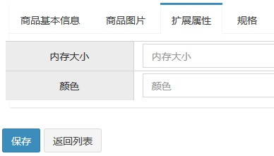
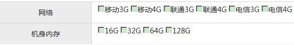
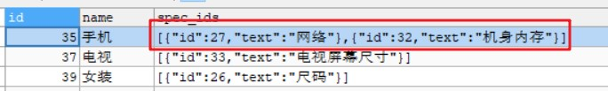
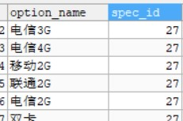
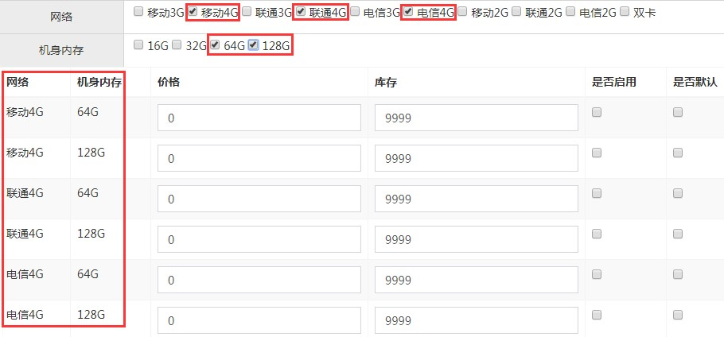
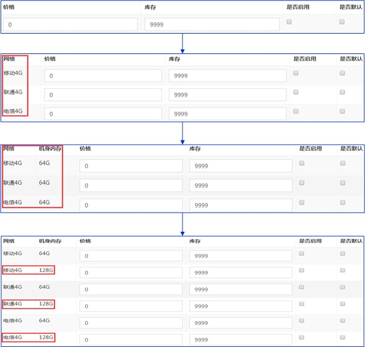

# Day07 商品录入模块【二】（选择商品分类&选择品牌&选择规格&SKU）

---

## 1. 商品录入【选择商品分类】
### 1.1. 需求分析

在商品录入界面实现商品分类的选择（三级分类）下拉框。当用户选择一级分类后，二级分类列表要相应更新，当用户选择二级分类后，三级列表要相应更新。

### 1.2. 商品分类下拉列表-后端控制层

在pinyougou-shop-web工程中创建ItemCatController，复制pinyougou-manager-web工程的ItemCatController即可

```java
@RestController
@RequestMapping("/itemCat")
public class ItemCatController {

    /* timeout: 连接服务超时的时长(30秒)  */
    @Reference(timeout = 30000)
    private ItemCatService itemCatService;

    /**
     * 根据父级id查询商品分类
     *
     * @param parentId 商品分类父级id
     * @return 商品分类list集合
     */
    @GetMapping("/findItemCatByParentId")
    // 使用注解定义父目录id初始值为0
    public List<ItemCat> findItemCatByParentId(
            @RequestParam(value = "parentId", defaultValue = "0") Long parentId) {
        try {
            // 调用服务层根据父级id查询的方法
            return itemCatService.findItemCatByParentId(parentId);
        } catch (Exception e) {
            e.printStackTrace();
            return null;
        }
    }
}
```

### 1.3. 商品分类下拉列表-前端部分
#### 1.3.1. 一级分类下拉选择框

- 在goodsController.js增加异步请求查询方法

```js
/**
 * 定义根据父级id查询商品分类的方法
 * @param parentId 商品分类父级目录id
 * @param name  以传入的参数做会变量的名称，对象属性使用Object[]来定义
 */
$scope.findItemCatByParentId = (parentId, name) => {
    // 发送get请求，获取商品分类集合
    baseService.sendGet('/itemCat/findItemCatByParentId', 'parentId=' + parentId)
        .then(response => {
            // 给$scope对象增加一个name值的属性，封装返回的分类列表
            $scope[name] = response.data;
        });
};
```

- goods_edit.html页面加载时调用查询分类方法，初始化根据父目录id查询分类，传入父目录id与保存一级目录的变量名

```html
<body class="hold-transition skin-red sidebar-mini"
      ng-app="pinyougou" ng-controller="goodsController"
      ng-init="findItemCatByParentId(0, 'itemCatList1');">
```

- 修改goods_edit.html一级分类下拉选择框，使用`ng-options`指令生成下拉框

```html
<td>
    <!--
        ng-model 定义下拉框选择后绑定的变量
        ng-options
            as 前面的变量是下拉框的value
            as 后面的变量是下拉框显示的名称name
     -->
    <select class="form-control"
            ng-model="goods.category1Id"
            ng-options="item.id as item.name for item in itemCatList1">
        <option value="">===请选择===</option>
    </select>
</td>
```

`ng-options`属性可以在表达式中使用数组或对象来自动生成一个select中的option列表。`ng-options`与`ng-repeat`很相似，很多时候可以用`ng-repeat`来代替`ng-options`。但是`ng-options`提供了一些好处，例如减少内存提高速度，以及提供选择框的选项来让用户选择。

#### 1.3.2. 二级分类下拉选择框

- `$watch`方法用于监控某个变量的值，当被监控的值发生变化，就自动执行相应的函数。
- 页面控制层goodsController增加监听方法，然后根据一级目录改变查询二级分类

```js
 /* 用$watch监听 goods.category1Id 变量发生改变(查询二级分类) */
$scope.$watch('goods.category1Id', function (newVal, oldVal) {
    // 当一级菜单发生变化，需要将二级下拉框绑定的值清空
    $scope.goods.category2Id = null;
    $scope.itemCatList2 = null;

    // 当改变的新值为不空，调用查询商品分类方法
    if (newVal) {
        $scope.findItemCatByParentId(newVal, 'itemCatList2');
    }
});
```

- 修改goods_edit.html中二级分类下拉框，绑定数据。增加判断，当一级下拉框选择后再显示二级下拉框

```html
<select class="form-control select-sm"
        ng-if="goods.category1Id != null && goods.category1Id !=''"
        ng-model="goods.category2Id"
        ng-options="item.id as item.name for item in itemCatList2">
    <option value="">===请选择===</option>
</select>
```

#### 1.3.3. 三级分类下拉选择框

- 页面控制层goodsController增加监听二级下拉框方法，根据二级目录改变查询三级分类

```js
/* 用$watch监听 goods.category2Id 变量发生改变(查询三级分类) */
$scope.$watch('goods.category2Id', function (newVal, oldVal) {
    // 当二级菜单发生变化，需要将三级下拉框绑定的值清空
    $scope.itemCatList3 = null;
    $scope.goods.category3Id = null;

    // 当改变的新值为不空，调用查询商品分类方法
    if (newVal) {
        $scope.findItemCatByParentId(newVal, 'itemCatList3');
    }
});
```

- 修改goods_edit.html中三级分类下拉框，绑定数据。并且当二级下拉框选择后再显示三级下拉框

```html
<select class="form-control select-sm"
        ng-if="goods.category2Id != null && goods.category2Id !=''"
        ng-model="goods.category3Id"
        ng-options="item.id as item.name for item in itemCatList3">
    <option value="">===请选择===</option>
</select>
```

#### 1.3.4. 读取模版ID

- 后端控制层ItemCatController，添加根据分类id查询模版id方法

```java
/**
 * 根据id查询商品分类
 *
 * @param id 商品分类id
 * @return 商品分类实体类
 */
@GetMapping("/findOne")
public ItemCat findOne(@RequestParam("id") Long id) {
    try {
        // 调用服务层根据id查询的方法
        return itemCatService.findOne(id);
    } catch (Exception e) {
        e.printStackTrace();
        return null;
    }
}
```

- 服务层ItemCatServiceg与ItemCatServiceImpl实现类，添加查询方法

```java
/**
 * 根据id查询商品分类
 *
 * @param id 商品分类id
 * @return 商品分类实体类
 */
ItemCat findOne(Long id);

@Override
public ItemCat findOne(Long id) {
    // 调用通用mapper根据id查询方法
    try {
        return itemCatMapper.selectByPrimaryKey(id);
    } catch (Exception e) {
        throw new RuntimeException(e);
    }
}
```

- 前端控制层js添加监听三级分类改变的方法

```js
/* 用$watch监听 goods.category3Id 变量发生改变(查询分类对象，获取类型模版id) */
$scope.$watch('goods.category3Id', function (newVal, oldVal) {
    // 如果3级分类发生变化，将清空绑定的模版id
    $scope.goods.typeTemplateId = null;

    // 当改变的新值为不空，根据商品分类主键id查询一个商品分类对象
    if (newVal) {
        baseService.findOne('/itemCat/findOne', newVal)
            .then(function (response) {
                $scope.goods.typeTemplateId = response.data.typeId;
            });
    }
});
```

- goods_edit.html显示模板ID

```html
<td ng-if="goods.typeTemplateId != null && goods.typeTemplateId != ''">
    模板ID:{{ goods.typeTemplateId }}
</td>
```

- *注：*
    - *原来教程在一级、二级、三级分类下拉框变化时判断当上一级下拉框的值为空才去清空当前下拉框里的数据。其实不管上一级是否的值是否为空，都应该清空下一级下拉框数据。所以对上面的代码进行优化，与教程不一致*
    - *如果想隐藏模板id，因为已经设置了监听一级和二级分类改变，只需要监听三级分类，如果三级分类为空时，将模板id清空*

---

## 2. 商品录入【品牌选择】
### 2.1. 需求分析

在用户选择商品分类后，品牌列表要根据用户所选择的分类进行更新。具体的逻辑是根据用户选择的三级分类找到对应的商品类型模板，商品类型模板中存储了品牌的列表json数据。

### 2.2. 品牌选择下拉框-后端部分

- pinyougou-shop-web工程创建TypeTemplateController，创建根据主键id查询模版的方法

```java
/**
 * 类型模版控制器
 */
@RestController
@RequestMapping("/typeTemplate")
public class TypeTemplateController {

    /* 引入服务接口代理对象 */
    @Reference(timeout = 30000)
    private TypeTemplateService typeTemplateService;

    /**
     * 根据类型模版主键id查询一个类型模版对象
     *
     * @param id 模版id
     * @return 模版对象
     */
    @GetMapping("/findOne")
    public TypeTemplate findOne(@RequestParam("id") Long id) {
        try {
            // 调用服务层根据id查询方法
            return typeTemplateService.findTypeTemplateById(id);
        } catch (Exception e) {
            e.printStackTrace();
            return null;
        }
    }
}
```

- 服务层TypeTemplateService与TypeTemplateServiceImpl增加根据id查询方法

```java
/**
 * 根据主键id查询模版
 *
 * @param id 模版id
 * @return 模版对象
 */
TypeTemplate findTypeTemplateById(Long id);

@Override
public TypeTemplate findTypeTemplateById(Long id) {
    try {
        // 调用通用mapper根据id查询方法
        return typeTemplateMapper.selectByPrimaryKey(id);
    } catch (Exception e) {
        e.printStackTrace();
        throw new RuntimeException(e);
    }
}
```

### 2.3. 品牌选择下拉框-前端部分

- pinyougou-shop-web工程页面控制层goodsController增加查询监听模版id改变的方法

```js
/* 用$watch监听 goods.typeTemplateId 变量发生改变(查询类型模版对象) */
$scope.$watch('goods.typeTemplateId', function (newVal, oldVal) {
    // 1. 如果模版id变化，初始化模版对象与清空绑定到goods对象的brandId
    $scope.typeTemplate = {};
    $scope.goods.brandId = null;

    // 当改变的新值不为空时，根据类型模版主键id查询一个类型模版对象
    if (newVal) {
        baseService.findOne('/typeTemplate/findOne', newVal).then(function (response) {
            if (response.data) {
                // 获取响应数据
                $scope.typeTemplate = response.data;
                // 把品牌的json格式字符串转化成json数组[{}]，设置到模版中的品牌列表
                $scope.typeTemplate.brandIds =
                    JSON.parse($scope.typeTemplate.brandIds);
            }
        });
    }
});
```

- goods_edit.html页面品牌下拉框遍历结果

```html
<div class="col-md-2 title">品牌</div>
<div class="col-md-10 data">
	<select class="form-control"
            ng-model="goods.brandId"
            ng-options="brand.id as brand.text for brand in typeTemplate.brandIds">
        <option value="">===请选择===</option>
    </select>
</div>
```

---

## 3. 商品录入【扩展属性】
### 3.1. 需求分析

- 在商品录入实现扩展属性的录入



- 新增页面的扩展属性标签的属性是根据选择的模版id查询的tb_type_template表，获取custom_attribute_items的值
    - 例：`[{"text":"分辨率"},{"text":"摄像头"}]`
- 录入的扩展属性值是插入到tb_goods_desc表的custom_attribute_items字段
    - 格式：`[{"text":"分辨率","value":"1920*1080(FHD)"},{"text":"摄像头","value":"1200万像素"}]`

### 3.2. 扩展属性-前端部分

- 修改goodsController.js监听`goods.typeTemplateId`的方法，在用户更新模板ID时，读取模板中的扩展属性赋给商品的扩展属性
- 当类型下拉框发生变化时，如果不清空`goods.goodsDesc.customAttributeItems`的值，则扩展属性还是显示上一次选择模版的扩展属性。所以在监听`goods.typeTemplateId`的值变化中，增加清空操作

```js
/* 用$watch监听 goods.typeTemplateId 变量发生改变(查询类型模版对象) */
$scope.$watch('goods.typeTemplateId', function (newVal, oldVal) {
    // 1. 如果模版id变化，初始化模版对象与清空绑定到goods对象的brandId
    $scope.typeTemplate = {};
    $scope.goods.brandId = null;
    // 2. 清空扩展属性和绑定的值
    $scope.goods.goodsDesc.customAttributeItems = null;

    // 当改变的新值不为空时，根据类型模版主键id查询一个类型模版对象
    if (newVal) {
        baseService.findOne('/typeTemplate/findOne', newVal).then(function (response) {
            if (response.data) {
                // 获取响应数据
                $scope.typeTemplate = response.data;
                // 把品牌的json格式字符串转化成json数组[{}]，设置到模版中的品牌列表
                $scope.typeTemplate.brandIds =
                    JSON.parse($scope.typeTemplate.brandIds);

                // 把类型模版对象中的扩展属性json格式字符串转化成json数组
                $scope.goods.goodsDesc.customAttributeItems =
                    JSON.parse($scope.typeTemplate.customAttributeItems);
            }
        });
    }
});
```

- 在goods_edit.html页面遍历转换后的扩展属性数组。

```html
<!--扩展属性-->
<div class="tab-pane" id="customAttribute">
	<div class="row data-type">
		<div ng-repeat="item in goods.goodsDesc.customAttributeItems">
			<div class="col-md-2 title">{{ item.text }}</div>
			<div class="col-md-10 data">
				<input class="form-control"
                       placeholder="{{ item.text }}"
                       ng-model="item.value">
			</div>
		</div>
	</div>
</div>
```

<font color="red">*注：关于输入框绑定值的问题，因为goods对象中扩展属性是对象数据，如果直接改变局部变量item，数组里的引用对象也会改变*</font>

---

## 4. 商品录入【规格选择】
### 4.1. 需求分析

显示规格及选项列表（复选框）如下图，并保存用户选择的结果



### 4.2. 显示规格选项列表

- 由于模板中只记录了规格名称，而除了显示规格名称还是显示规格下的规格选项，所以需要在后端扩充方法
- 此功能查询tb_type_template表中的spec_ids字段，<font color="red">**查询显示规格名称**</font>



- 还需要查询tb_specification_option表中的option_name字段，<font color="red">**查询显示规格下的规格选项**</font>



#### 4.2.1. 规格选项列表-后端部分

- 修改pinyougou-shop-web工程控制层TypeTemplateController，新增根据id查询规格与规格选项的方法

```java
/**
 * 根据模版id查询所有的规格与规格选项
 *      数据库spec_ids字段存储数据[{"id":27,"text":"网络"},{"id":32,"text":"机身内存"}]
 *      所以定义返回的数据类型是List<Map>，返回是转成json格式
 *
 * @param id 模版id
 * @return map格式的规格与规格选项的List集合
 */
@GetMapping("/findSpecByTemplateId")
public List<Map> findSpecByTemplateId(@RequestParam("id") Long id) {
    // 调用服务层查询规格与规格选项方法
    try {
        return typeTemplateService.findSpecByTypeTemplateId(id);
    } catch (Exception e) {
        e.printStackTrace();
        return null;
    }
}
```

- 服务层TypeTemplateService与TypeTemplateServiceImpl实现类，增加查询方法

```java
/**
 * 根据模版id查询所有的规格与规格选项
 *
 * @param id 模版id
 * @return 规格与规格选项List集合
 */
List<Map> findSpecByTypeTemplateId(Long id);
```

```java
/**
 * 注入规格选项数据访问层代理对象
 */
@Autowired
private SpecificationOptionMapper specificationOptionMapper;

@Override
public List<Map> findSpecByTypeTemplateId(Long id) {
    try {
        // 1. 根据主键id查询类型模版(或者直接调用通用mapper根据id查询)
        TypeTemplate typeTemplate = this.findTypeTemplateById(id);

        // 2.1 获取模版中关联的规格：[{"id":27,"text":"网络"},{"id":32,"text":"机身内存"}]
        String specIds = typeTemplate.getSpecIds();
        // 2.2 将json对象数组类型的字符串转换成List<Map>的集合格式
        List<Map> specList = JSONArray.parseArray(specIds, Map.class);

        /*
         * 需要返回的数据格式：
         *     [{"id":27,"text":"网络", "options" : [{"optionName" : ""}]},
         *     {"id":32,"text":"机身内存", "options" : [{},{}]}]
         */
        // 3. 遍历规格集合
        for (Map map : specList) {
            /* 迭代时map中的格式
             *      map : {"id":27,"text":"网络"}
             */
            // 3.1 获取规格id
            Long specId = Long.parseLong(map.get("id").toString());

            // 3.2 创建规格选项对象，设置规格id，用于条件查询所有规格选项
            SpecificationOption so = new SpecificationOption();
            so.setSpecId(specId);

            /*
             * 3.3 查询规格选项数据,如果对象只有一个属性，就是条件查询
             *      SELECT * FROM tb_specification_option WHERE spec_id = 27
             */
            List<SpecificationOption> options = specificationOptionMapper.select(so);

            // 3.4 将查询结果封装到map集合中
            map.put("options", options);
        }

        // 返回结果集
        return specList;

    } catch (Exception e) {
        e.printStackTrace();
        throw new RuntimeException(e);
    }
}
```

- 测试：登陆后输入网址，http://shop.moon.com/typeTemplate/findSpecByTemplateId?id=37

#### 4.2.2. 规格选项列表-前端部分

- 修改pinyougou-shop-web的前端控制器goodsController中的监听三级分类的方法中，增加发送异步请求查询规格的代码
- 根据扩展属性一样，当类型下拉框发生变化时，需要在监听`goods.typeTemplateId`的值变化中，增加清空`$scope.specList`的操作

```js
$scope.$watch('goods.typeTemplateId', function (newVal, oldVal) {
    ......
    // 3. 清空规格选项数据
    $scope.specList = {};

    if (newVal) {
        ......
        /* 根据类型模版主键id查询规格选项数据 */
        baseService.findOne('/typeTemplate/findSpecByTemplateId', newVal).then(function (response) {
            /*
            * 获取返回规格选项，格式：
            *   [{"options":[{"id":98,"optionName":"移动3G","orders":1,"specId":27},{},...],"id":27,"text":"网络"},{}..]
            */
            $scope.specList = response.data;
        });
    }
});
```

- 修改goods_edit.html页面遍历规格

```html
<div class="row data-type">
	<div ng-repeat="spec in specList">
		<div class="col-md-2 title">{{ spec.text }}</div>
		<div class="col-md-10 data">
			<span ng-repeat="option in spec.options">
                <input type="checkbox">{{ option.optionName }}
			</span>
		</div>
	</div>
</div>
```

### 4.3. 保存选中规格选项
#### 4.3.1. 需求分析

- 需要将用户选中的选项保存在`tb_goods_desc`表的`specification_items`字段中，定义json格式如下：

```json
[{"attributeName":"规格名称","attributeValue":["规格选项1","规格选项2"....]},....]
```

#### 4.3.2. 代码实现

- 在pinyougou-shop-web工程的baseController.js增加从json数组中根据key的值，查询指定的json对象的工具方法

```js
/**
 * 从json数组中根据key查询指定的json对象
 * @param jsonArr   json对象数组
 * @param key       指定的属性名
 * @param keyValue  指定的属性的值
 * @returns {Object} 返回指定key属性值为keyValue的对象
 */
$scope.searchJsonByKey = function (jsonArr, key, keyValue) {
    for (let i = 0; i < jsonArr.length; i++) {
        // 循环json数据，如果指定key属性值为keyValue，返回该对象
        if (jsonArr[i][key] == keyValue) {
            return jsonArr[i];
        }
    }
};
```

- goodsController.js在定义数据存储结构$scope.goods中增加'specificationItems'属性；增加修改规格选项方法

```js
/* 定义数据存储实体结构 */
$scope.goods = {goodsDesc: {itemImages: [], specificationItems: []}};

......

/**
 * 定义修改规格选项的方法，组合后保存的规格选项格式如下
 *  [{"attributeValue":["联通4G","移动4G","电信4G"],"attributeName":"网络"},
 *      {"attributeValue":["64G","128G"],"attributeName":"机身内存"}]
 * @param $event
 * @param name 指定的属性名
 * @param value 指定的属性的值
 */
$scope.updateSpecAttr = function ($event, name, value) {
    // 调用根据属性值查询对象的工具方法，查询指定的attributeName属性值的对象
    var obj = $scope.searchJsonByKey($scope.goods.goodsDesc.specificationItems,
        'attributeName', name);

    // 判断返回的对象是否为空
    if (obj) {
        // specificationItems数组已经存在指定的attributeName属性。
        // 1. 使用$event.target获取鼠标点击对象，判断checkbox是否选中
        if ($event.target.checked) {
            // 选中，往attributeValue数组中添加一个元素
            obj.attributeValue.push(value);
        } else {
            // 未选中，往attributeValue数组中移除一个元素
            obj.attributeValue.splice(obj.attributeValue.indexOf(value), 1);
        }

        // 2. 判断attributeValue数组中是否有元素
        if (obj.attributeValue.length == 0) {
            // 如果没有任何选中的元素，将该对象从specificationItems数组中移除
            $scope.goods.goodsDesc.specificationItems
                .slice($scope.goods.goodsDesc.specificationItems.indexOf(obj), 1);
        }

    } else {
        // specificationItems数组中指定的attributeName属性不存在，即第一次选中该属性，往数组里增加属性
        var tempObj = {attributeValue: [value], attributeName: name};
        $scope.goods.goodsDesc.specificationItems.push(tempObj);
    }
};
```

- 根据扩展属性一样，当类型下拉框发生变化时，需要在监听`goods.typeTemplateId`的值变化中，增加清空已经勾选的规格选项`$scope.goods.goodsDesc.specificationItems`的操作

```js
/* 用$watch监听 goods.typeTemplateId 变量发生改变(查询类型模版对象) */
$scope.$watch('goods.typeTemplateId', function (newVal, oldVal) {
    ......
    // 3. 清空规格选项数据与绑定勾选的规格选项
    $scope.specList = {};
    $scope.goods.goodsDesc.specificationItems = [];
    ......
}
```

- goods_edit.html页面在循环选项的checkbox中绑定点击事件，勾选时调用保存的规格选项方法

```html
<div ng-repeat="spec in specList">
	<div class="col-md-2 title">{{ spec.text }}</div>
	<div class="col-md-10 data">
		<span ng-repeat="option in spec.options">
            <input type="checkbox"
                   ng-click="updateSpecAttr($event, spec.text, option.optionName)">
            {{ option.optionName }}
		</span>
	</div>
</div>
```

*注：在页面显示测试{{goods.goodsDesc.specificationItems}}*

---

## 5. 商品录入【SKU商品信息】
### 5.1. 需求分析
#### 5.1.1. 需求

基于上一步完成的规格选择，根据选择的规格录入商品的SKU信息，当用户选择相应的规格，下面的SKU列表就会自动生成



#### 5.1.2. 实现思路

1. 先定义一个初始的不带规格名称的集合，只有一条记录

```js
/** 定义SKU变量，并初始化 */
$scope.goods.items = [{spec:{}, price:0, num:9999, status:'0', isDefault:'0'}];
```

2. 循环用户选择的规格，根据规格名称和已选择的规格选项对原集合进行扩充，添加规格名称和值，新增的记录数与选择的规格选项个数相同



### 5.2. 生成SKU商品信息-前端部分
#### 5.2.1. 生成SKU表（tb_item）

- goodsController.js实现创建sku列表的方法

```js
/* 创建SKU商品数据列表 */
$scope.createItems = function () {
    /*
     * 1. 定义SKU商品变量，初始化不带规格名称的集合，并只有一条记录
     *      其中规格选项格式：spec: {"网络":"联通4G","机身内存":"64G"}
     */
    $scope.goods.items = [{spec: {}, price: 0, num: 9999, status: '0', isDefault: '0'}];

    /*
     * 2. 定义规格选项数组变量，获取当前选择规格选项数据
     *      [{"attributeValue":["移动4G","联通3G","移动3G"],"attributeName":"网络"},{},...]
     */
    var specItems = $scope.goods.goodsDesc.specificationItems;

    // 3. 迭代规格选项数据
    for (let i = 0; i < specItems.length; i++) {
        // 调用封装的转换SKU商品的方法，得到新得SKU集合
        $scope.goods.items = swapItems($scope.goods.items,
            specItems[i].attributeName, specItems[i].attributeValue);
    }
};

/**
 * 定义把规格选项转换成SKU商品的方法
 * @param items 需要转换的数组
 * @param columnName 规格选项对象的attributeName
 * @param columnValue 规格选项对象的attributeValue
 */
var swapItems = function (items, columnName, columnValue) {
    // 定义返回的新的SKU数组
    var newItems = new Array();

    // 循环旧的SKU数组
    for (let i = 0; i < items.length; i++) {
        /* 获取一个旧的SKU商品，格式如下：
         * {'spec' : {}, 'price' : 0,'num' : 9999, 'status' : 0, 'isDefault' : 0}
         * 循环当前选择规格选项数据attributeValue：["移动4G","联通3G","移动3G"]
         */
        for (let j = 0; j < columnValue.length; j++) {
            // 克隆一个新的SKU
            var newItem = JSON.parse(JSON.stringify(items[i]));
            // 增加SKU商品对象spec属性新的key，其spec属性保存格式例如: {"网络":"联通4G","机身内存":"64G"}
            newItem.spec[columnName] = columnValue[j];
            newItems.push(newItem)
        }
    }
    return newItems;
};
```

- 修改goods_edit.html页面，给规格选项列表checkbox绑定点击事件，勾选规格属性后调用生成SKU列表的方法

```html
<span ng-repeat="option in spec.options">
    <input type="checkbox"
           ng-click="updateSpecAttr($event, spec.text, option.optionName);createItems();">
    {{ option.optionName }}
</span>
```

- 当类型下拉框发生变化时，需要在监听`goods.typeTemplateId`的值变化中，增加清空已生成SKU商品规格选项数据`$scope.goods.items`的操作

```js
$scope.$watch('goods.typeTemplateId', function (newVal, oldVal) {
    ......
    // 4. 清空已经生成SKU商品信息数组
    $scope.goods.items = null;
    ......
}
```

- 在页面上添加表达式，进行测试：{{goods.items}}


#### 5.2.2. 显示SKU列表

- 修改goods_edit.html页面上，色么绑定SKU列表

```html
<thead>
	<tr>
        <th ng-repeat="spec in goods.goodsDesc.specificationItems">
            {{ spec.attributeName }}
        </th>
		<th class="sorting">价格</th>
		<th class="sorting">库存</th>
		<th class="sorting">是否启用</th>
		<th class="sorting">是否默认</th>
	</tr>
</thead>
<tbody>
	<tr ng-repeat="item in goods.items">
        <td ng-repeat="spec in goods.goodsDesc.specificationItems">
            {{item.spec[spec.attributeName]}}
        </td>
        <td><input class="form-control" placeholder="价格"
                   ng-model="item.price">
		</td>
		<td><input class="form-control" placeholder="库存数量"
                   ng-model="item.num">
		</td>
		<td><input type="checkbox" ng-model="item.status"
                   ng-true-value="1" ng-false-value="0"
                   ng-checked="item.status == 1">
        </td>
		<td><input type="checkbox" ng-model="item.isDefault"
                   ng-true-value="1" ng-false-value="0"
                   ng-checked="item.isDefault == 1">
        </td>
	</tr>
</tbody>
```

#### 5.2.3. 保存数据时，清空所有新增页面绑定的数据

<font color="red">***注：在goodsController.js中的saveOrUpdate方法，在请求保存后台成功后，将之前查询后台返回的规格选项数据清空***</font>

```js
// 清空后台返回的规格选项数据
$scope.specList = {};
```

### 5.3. 生成SKU商品信息-后端部分

- 在服务层GoodsServiceImpl中注入需要保存的相关数据访问mapper接口

```java
@Autowired
private ItemMapper itemMapper;
@Autowired
private ItemCatMapper itemCatMapper;
@Autowired
private BrandMapper brandMapper;
@Autowired
private SellerMapper sellerMapper;
```

- 修改GoodsServiceImpl.java的saveGoods方法，增加代码，实现对SKU商品信息的保存

```java
@Override
public void saveGoods(Goods goods) {
    try {
        // 1.设置审核状态(未审核)
        goods.setAuditStatus("0");
        // 2.调用商品mapper保存方法，往SPU表（tb_goods）添加数据
        goodsMapper.insertSelective(goods);

        // 3.设置商品描述id,与商品的id一对一。**因为是持久态，goods保存后已经有id**
        goods.getGoodsDesc().setGoodsId(goods.getId());
        // 4.调用商品描述mapper保存，往商品描述表（tb_goods_desc）添加数据
        goodsDescMapper.insertSelective(goods.getGoodsDesc());

        // 5 迭代所有的SKU具体商品集合，往SKU表商品表（tb_item）表添加数据
        for (Item item : goods.getItems()) {
            /*
             *  前端上送的item格式，例：
             *      {'spec' : {}, 'price' : 0, 'num' : 9999, 'status' : 0, 'isDefault' : 0}
             *  其中spec属性的格式，例：
             *      spec: {"网络":"联通4G","机身内存":"64G"}
             *  5.1 设置SKU商品的标题(格式：SPU标题 + 规格选项)
             */
            StringBuilder title = new StringBuilder(goods.getGoodsName());

            // 5.1.1 将商品的的规格选项json格式字符串转成map集合
            Map specMap = JSON.parseObject(item.getSpec(), Map.class);

            // 5.1.2 循环获取规格选项map所有的值的集合
            for (Object obj : specMap.values()) {
                // 将所有规格选项的值拼接到商品的标题中
                title.append(" ").append(obj.toString());
            }

            // 5.1.3 将拼接好的标题设置到商品对象中
            item.setTitle(title.toString());

            // 5.2 设置商品SKU对象其他属性（抽取成方法）
            setItemInfo(item, goods);

            // 5.3 调用item数据访问层接口保存商品
            itemMapper.insertSelective(item);
        }

    } catch (Exception e) {
        e.printStackTrace();
        throw new RuntimeException(e);
    }
}

/**
 * 设置SKU商品的信息（封装启动与不启动规格选项时的公共属性）
 *
 * @param item  SKU商品对象
 * @param goods SPU商品对象
 */
private void setItemInfo(Item item, Goods goods) {
    /*
     *  设置SKU商品的图片，前端上送的格式如下：
     *  goods.goodsDesc.itemImages =
     * [{"color":"金色","url":"http://image.pinyougou.com/jd/wKgMg1qtKEOATL9nAAFti6upbx4132.jpg"},
     * {"color":"银色","url":"http://image.pinyougou.com/jd/wKgMg1qtKJyAHQ9sAAFuOBobu-A759.jpg"}]
     */
    // 从商品描述中获取保存商品图片的json格式字符串,转成Array<Map>
    List<Map> imageList = JSON.parseArray(goods.getGoodsDesc().getItemImages(), Map.class);

    // 判断描述是否有图片
    if (imageList != null && imageList.size() > 0) {
        // 取第一张图片做为商品的显示的图片
        item.setImage(imageList.get(0).get("url").toString());
    }

    // 设置SKU商品的三级分类id
    item.setCategoryid(goods.getCategory3Id());
    // 设置SKU商品的创建时间
    item.setCreateTime(new Date());
    // 设置SKU商品的修改时间
    item.setUpdateTime(item.getCreateTime());
    // 设置SKU商品关联的SPU的id
    item.setGoodsId(goods.getId());
    // 设置SKU商品关联的商家id
    item.setSellerId(goods.getSellerId());
    // 设置SKU商品的三级分类名称
    item.setCategory(itemCatMapper.selectByPrimaryKey(goods.getCategory3Id()).getName());
    // 设置SKU商品的品牌名称
    item.setBrand(brandMapper.selectByPrimaryKey(goods.getBrandId()).getName());
    // 设置SKU商品的店铺名称
    item.setSeller(sellerMapper.selectByPrimaryKey(goods.getSellerId()).getNickName());
}
```

---

## 6. 商品录入【是否启用规格】
### 6.1. 需求分析

在规格面板添加是否启用规格，当用户没有选择该项，将原来的规格面板和SKU列表隐藏，用户保存商品后只生成一个SKU。

### 6.2. 启用规格-前端部分

修改goods_edit.html添加复选框，绑定goods的`isEnableSpec`属性。用if指令控制规格面板与SKU列表的显示与隐藏

```html
<div class="row data-type">
	<div class="col-md-2 title">是否启用规格</div>
	<div class="col-md-10 data">
		<input type="checkbox" ng-model="goods.isEnableSpec"
               ng-true-value="1" ng-false-value="0"
               ng-checked="goods.isEnableSpec == 1">
	</div>
</div>
<p>
<div ng-if="goods.isEnableSpec == 1">
    ......
</div>
```

### 6.3. 启用规格-后端部分

修改GoodServiceImpl的原来saveGoods方法，增加判断是否开启规格。如果不开启商品SPU即商品SKU

```java
@Override
public void saveGoods(Goods goods) {
    try {
        // 1.设置审核状态(未审核)
        goods.setAuditStatus("0");
        // 2.调用商品mapper保存方法，往SPU表（tb_goods）添加数据
        goodsMapper.insertSelective(goods);

        // 3.设置商品描述id,与商品的id一对一。**因为是持久态，goods保存后已经有id**
        goods.getGoodsDesc().setGoodsId(goods.getId());
        // 4.调用商品描述mapper保存，往商品描述表（tb_goods_desc）添加数据
        goodsDescMapper.insertSelective(goods.getGoodsDesc());

        // 判断是否开启规格
        if ("1".equals(goods.getIsEnableSpec())) {
            // 5 迭代所有的SKU具体商品集合，往SKU表商品表（tb_item）表添加数据
            for (Item item : goods.getItems()) {
                /*
                 *  前端上送的item格式，例：
                 *      {'spec' : {}, 'price' : 0, 'num' : 9999, 'status' : 0, 'isDefault' : 0}
                 *  其中spec属性的格式，例：
                 *      spec: {"网络":"联通4G","机身内存":"64G"}
                 *  5.1 设置SKU商品的标题(格式：SPU标题 + 规格选项)
                 */
                StringBuilder title = new StringBuilder(goods.getGoodsName());

                // 5.1.1 将商品的的规格选项json格式字符串转成map集合
                Map specMap = JSON.parseObject(item.getSpec(), Map.class);

                // 5.1.2 循环获取规格选项map所有的值的集合
                for (Object obj : specMap.values()) {
                    // 将所有规格选项的值拼接到商品的标题中
                    title.append(" ").append(obj.toString());
                }

                // 5.1.3 将拼接好的标题设置到商品对象中
                item.setTitle(title.toString());

                // 5.2 设置商品SKU对象其他属性（抽取成方法）
                setItemInfo(item, goods);

                // 5.3 调用item数据访问层接口保存商品
                itemMapper.insertSelective(item);
            }
        } else {
            /*
             * 创建SKU具体商品对象(SPU就是SKU)
             *   格式：{'spec': {}, 'price': 0, 'num': 9999, 'status': 0, 'isDefault': 0}
             */
            Item item = new Item();
            // 设置SKU商品的标题
            item.setTitle(goods.getGoodsName());
            // 设置SKU商品的价格
            item.setPrice(goods.getPrice());
            // 设置SKU商品库存
            item.setNum(9999);
            // 设置SKU商品启用状态
            item.setStatus("1");
            // 设置是否默认
            item.setIsDefault("1");
            // 设置规格选项
            item.setSpec("{}");
            // 设置商品SKU对象其他属性（抽取成方法）
            setItemInfo(item, goods);
            // 调用item数据访问层接口保存商品
            itemMapper.insertSelective(item);
        }

    } catch (Exception e) {
        e.printStackTrace();
        throw new RuntimeException(e);
    }
}
```