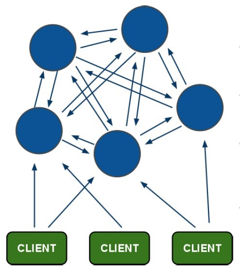
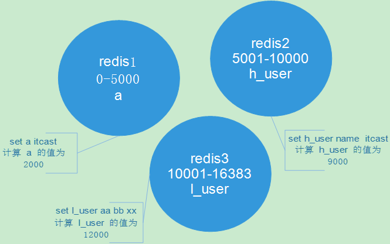
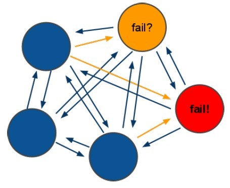
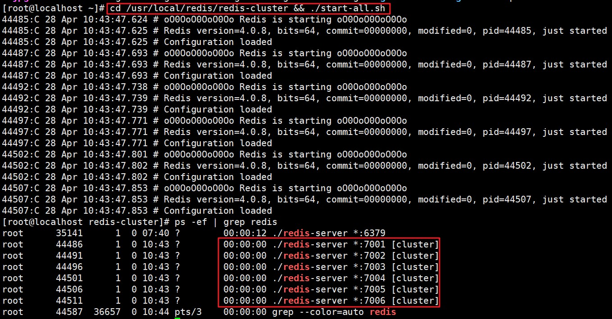

# Day09 广告管理&Spring Data Redis缓存方案

## 1. 网站前台分析
### 1.1. 网站前台有哪些页面

- 网站首页
- 商家（店铺）首页
- 商品详细页
- 商品搜索页
- 购物车列表页
- 购物选项选择页
- 支付页
- 用户注册页
- 用户登录页
- 用户中心页等

### 1.2. 网站首页广告

- 首页海报（轮播图）
- 今日推荐
- 猜你喜欢
- 楼层广告

### 1.3. 数据库广告相关表结构分析

- tb_content_category 广告分类表

| 字段 |  类型   | 长度 |     含义     |
| :--: | :-----: | :--: | :----------: |
|  id  | bigint  |      |     主键     |
| name | varchar |  25  | 广告分类名称 |

- tb_content 广告表

|    字段     |  类型   | 长度 |    含义    |
| :---------: | :-----: | :--: | :--------: |
|     id      | bigint  |      |    主键    |
| category_id | bigint  |      | 广告分类ID |
|    title    | varchar | 200  |  广告标题  |
|     url     | varchar | 500  |  广告链接  |
|     pic     | varchar | 300  |  图片地址  |
|   status    | varchar |  1   |    状态    |
| sort_order  |   int   |      |    排序    |

## 2. 运营商后台【广告类型及广告管理】
### 2.1. 需求分析

实现广告类型表与广告表的增删改查

### 2.2. 搭建广告服务工程
#### 2.2.1. pinyougou-content聚合项目

参考之前模块与讲义，pinyougou-content的web端口9002

- 创建pom类型的maven工程

> 说明：创建成功后，删除src目录。

- pom.xml添加依赖

```xml
<?xml version="1.0" encoding="UTF-8"?>
<project xmlns="http://maven.apache.org/POM/4.0.0"
         xmlns:xsi="http://www.w3.org/2001/XMLSchema-instance"
         xsi:schemaLocation="http://maven.apache.org/POM/4.0.0
                             http://maven.apache.org/xsd/maven-4.0.0.xsd">
    <parent>
        <artifactId>pinyougou-parent</artifactId>
        <groupId>com.moon</groupId>
        <version>1.0-SNAPSHOT</version>
    </parent>
    <modelVersion>4.0.0</modelVersion>
    <artifactId>pinyougou-content</artifactId>
    <packaging>pom</packaging>
    <name>pinyougou-content</name>

    <build>
        <plugins>
            <!-- 配置tomcat插件 -->
            <plugin>
                <groupId>org.apache.tomcat.maven</groupId>
                <artifactId>tomcat7-maven-plugin</artifactId>
                <configuration>
                    <path>/</path>
                    <port>9002</port>
                </configuration>
            </plugin>
        </plugins>
    </build>
</project>
```

#### 2.2.2. pinyougou-content-interface服务接口模块

- 参考之前模块与讲义，创建jar类型的maven工程pinyougou-content-interface服务接口

> 说明：创建包com.pinyougou.content.service

- pom.xml添加依赖

```xml
<?xml version="1.0" encoding="UTF-8"?>
<project xmlns="http://maven.apache.org/POM/4.0.0"
         xmlns:xsi="http://www.w3.org/2001/XMLSchema-instance"
         xsi:schemaLocation="http://maven.apache.org/POM/4.0.0
         http://maven.apache.org/xsd/maven-4.0.0.xsd">
    <parent>
        <artifactId>pinyougou-content</artifactId>
        <groupId>com.moon</groupId>
        <version>1.0-SNAPSHOT</version>
    </parent>
    <modelVersion>4.0.0</modelVersion>
    <artifactId>pinyougou-content-interface</artifactId>
    <packaging>jar</packaging>
    <name>pinyougou-content-interface</name>

    <!-- 配置依赖关系-->
    <dependencies>
        <dependency>
            <groupId>com.moon</groupId>
            <artifactId>pinyougou-pojo</artifactId>
            <version>${project.version}</version>
        </dependency>
        <!-- JSON处理工具包 -->
        <dependency>
            <groupId>com.alibaba</groupId>
            <artifactId>fastjson</artifactId>
        </dependency>
        <dependency>
            <groupId>com.moon</groupId>
            <artifactId>pinyougou-common</artifactId>
            <version>${project.version}</version>
        </dependency>
        <!-- pagehelper -->
        <dependency>
            <groupId>com.github.pagehelper</groupId>
            <artifactId>pagehelper</artifactId>
        </dependency>
    </dependencies>
</project>
```

#### 2.2.3. pinyougou-content-service服务实现模块

参考之前模块与讲义。创建web类型的maven工程pinyougou-content-service

- 第一步：pom.xml添加依赖

```xml
<?xml version="1.0" encoding="UTF-8"?>
<project xmlns="http://maven.apache.org/POM/4.0.0"
         xmlns:xsi="http://www.w3.org/2001/XMLSchema-instance"
         xsi:schemaLocation="http://maven.apache.org/POM/4.0.0
         http://maven.apache.org/maven-v4_0_0.xsd">
    <parent>
        <artifactId>pinyougou-content</artifactId>
        <groupId>com.moon</groupId>
        <version>1.0-SNAPSHOT</version>
    </parent>
    <modelVersion>4.0.0</modelVersion>
    <artifactId>pinyougou-content-service</artifactId>
    <packaging>war</packaging>
    <name>pinyougou-content-service</name>

    <dependencies>
        <!-- 日志 -->
        <dependency>
            <groupId>org.slf4j</groupId>
            <artifactId>slf4j-log4j12</artifactId>
        </dependency>
        <!-- spring -->
        <dependency>
            <groupId>org.springframework</groupId>
            <artifactId>spring-web</artifactId>
        </dependency>
        <!--<dependency>
            <groupId>org.springframework</groupId>
            <artifactId>spring-jdbc</artifactId>
        </dependency>-->
        <!-- dubbo相关 -->
        <dependency>
            <groupId>com.alibaba</groupId>
            <artifactId>dubbo</artifactId>
        </dependency>
        <dependency>
            <groupId>org.apache.zookeeper</groupId>
            <artifactId>zookeeper</artifactId>
        </dependency>
        <dependency>
            <groupId>com.github.sgroschupf</groupId>
            <artifactId>zkclient</artifactId>
        </dependency>
        <!-- pinyougou-mapper -->
        <dependency>
            <groupId>com.moon</groupId>
            <artifactId>pinyougou-mapper</artifactId>
            <version>${project.version}</version>
        </dependency>
        <!-- pinyougou-content-interface -->
        <dependency>
            <groupId>com.moon</groupId>
            <artifactId>pinyougou-content-interface</artifactId>
            <version>${project.version}</version>
        </dependency>
        <!-- pinyougou-common -->
        <dependency>
            <groupId>com.moon</groupId>
            <artifactId>pinyougou-common</artifactId>
            <version>${project.version}</version>
        </dependency>
    </dependencies>
</project>
```

- 第二步：在webapps下创建WEB-INF/web.xml ，加载spring容器

```xml
<?xml version="1.0" encoding="UTF-8"?>
<web-app xmlns:xsi="http://www.w3.org/2001/XMLSchema-instance"
         xmlns="http://java.sun.com/xml/ns/javaee"
         xsi:schemaLocation="http://java.sun.com/xml/ns/javaee
         http://java.sun.com/xml/ns/javaee/web-app_3_0.xsd" version="3.0">

    <!-- 配置Spring加载文件 -->
    <context-param>
        <param-name>contextConfigLocation</param-name>
        <param-value>classpath:applicationContext*.xml</param-value>
    </context-param>
    <!-- 配置Spring的核心监听器 -->
    <listener>
        <listener-class>org.springframework.web.context.ContextLoaderListener</listener-class>
    </listener>

</web-app>
```

- 第三步：在src/main/resources下创建log4j.properties

```properties
log4j.rootLogger=DEBUG,stdout
log4j.appender.stdout=org.apache.log4j.ConsoleAppender
log4j.appender.stdout.layout=org.apache.log4j.PatternLayout
log4j.appender.stdout.layout.ConversionPattern=%-d{yyyy-MM-dd HH:mm:ss,SSS} [%t] [%c]-[%p] %m%n
```

- 第四步：创建包com.pinyougou.content.service.impl
- 第五步：在src/main/resources下创建applicationContext-service.xml
    - 注意：在applicationContext-service.xml配置中，目前有两个服务工程，当两个工程同时启动时会发生端口冲突，因为连接dubbo注册中心的端口默认是20880，所以我们需要配置一下pinyougou-content-service工程的dubbo端口为20881。

```xml
<?xml version="1.0" encoding="utf-8"?>
<beans xmlns="http://www.springframework.org/schema/beans"
       xmlns:xsi="http://www.w3.org/2001/XMLSchema-instance"
       xmlns:dubbo="http://code.alibabatech.com/schema/dubbo"
       xsi:schemaLocation="http://www.springframework.org/schema/beans
                  http://www.springframework.org/schema/beans/spring-beans.xsd
                  http://code.alibabatech.com/schema/dubbo
                  http://code.alibabatech.com/schema/dubbo/dubbo.xsd">

    <!-- 导入数据访问配置文件 -->
    <import resource="classpath:applicationContext-mapper.xml"/>

    <!--####### 配置dubbo服务提供者 #######-->
    <!-- 配置当前应用的名称 -->
    <dubbo:application name="pinyougou-content-service"/>
    <!-- 配置zookeeper作为注册中心，注册服务地址 -->
    <dubbo:registry protocol="zookeeper" address="192.168.12.131:2181"/>
    <!-- 用dubbo协议在20881端口暴露服务  -->
    <dubbo:protocol name="dubbo" port="20881"/>
    <!-- 配置采用包扫描来暴露服务 -->
    <dubbo:annotation package="com.pinyougou.content.service.impl"/>
</beans>
```

- 第六步：pinyougou-manager-web工程pom.xml引入依赖pinyougou-content-interface

```xml
<!-- 依赖pinyougou-content-interface模块 -->
<dependency>
    <groupId>com.moon</groupId>
    <artifactId>pinyougou-content-interface</artifactId>
    <version>${project.version}</version>
</dependency>
```

#### 2.2.4. idea创建启动内容服务设置

- 选择Run/Debug Configurations，新增Maven启动
- 设置Working directory为pinyougou-content
- 设置Command line为`clean tomcat7:run`
- 保存，启动

### 2.3. 创建广告服务(content)-服务层（准备工作）
#### 2.3.1. 创建内容接口

- pinyougou-content-interface创建ContentCategoryService接口

```java
/**
 * 内容分类服务接口
 */
public interface ContentCategoryService {
}
```

- pinyougou-content-interface创建ContentService接口

```java
/**
 * 内容服务接口
 */
public interface ContentService {
}
```

#### 2.3.2. 创建实现类

- pinyougou-content-service创建ContentCategoryServiceImpl实现类

```java
/**
 * 内容分类服务接口实现类
 */
// 使用dubbo注解管理此类
@Service(interfaceName = "com.pinyougou.content.service.ContentCategoryService")
// 开启事务
@Transactional(readOnly = false, rollbackFor = RuntimeException.class)
public class ContentCategoryServiceImpl implements ContentCategoryService {

    // 注入数据接口代理对象
    @Autowired
    private ContentCategoryMapper contentCategoryMapper;

}
```

- pinyougou-content-service创建ContentServiceImpl实现类

```java
/**
 * 内容服务接口实现类
 */
// 使用dubbo注解管理此类
@Service(interfaceName = "com.pinyougou.content.service.ContentService")
// 开启事务
@Transactional(readOnly = false, rollbackFor = RuntimeException.class)
public class ContentServiceImpl implements ContentService {

    // // 使用注解注入数据访问层mapper接口代理对象
    @Autowired
    private ContentMapper contentMapper;

}
```

#### 2.3.3. 创建表现层控制器

- pinyougou-manager-web创建ContentCategoryController

```java
/**
 * 内容分类控制器
 */
@RestController
@RequestMapping("/contentCategory")
public class ContentCategoryController {
    /**
     * 引用服务接口代理对象
     */
    @Reference
    private ContentCategoryService contentCategoryService;
}
```

- pinyougou-manager-web创建ContentController

```java
/**
 * 内容控制器
 */
@RestController
@RequestMapping("/content")
public class ContentController {
    /**
     * 引用服务接口代理对象
     */
    @Reference
    private ContentService contentService;
}
```

- 拷贝【资料\前端js】到pinyougou-manager-web

*说明：测试运行广告分类管理和广告管理页面*

### 2.4. 广告分类管理
#### 2.4.1. content_category.html页面

content_category.html页面，引入相关js，引入控制器(之前提供的资料里，已经完成此部分代码，但需要修改部分地方，与控制器的参数一致)

```html
<script type="text/javascript" src="/plugins/angularjs/angular.min.js"></script>
<!-- 分页组件开始 -->
<link rel="stylesheet" href="/plugins/angularjs/pagination.css"/>
<script src="/plugins/angularjs/pagination.js"></script>
<!-- 分页组件结束 -->
<script src="/js/base-pagination.js"></script>
<script src="/js/service/baseService.js"></script>
<script src="/js/controller/baseController.js"></script>
<script src="/js/controller/contentCategoryController.js"></script>

<body class="hold-transition skin-red sidebar-mini"
      ng-app="pinyougou" ng-controller="contentCategoryController">

<button type="button" class="btn btn-default" title="删除"
        ng-click="delete();">
    <i class="fa fa-trash-o"></i> 删除
</button>

<tbody>
	<tr ng-repeat="entity in dataList">
		<td><input type="checkbox" ng-click="updateSelection($event,entity.id)"></td>
		<td>{{entity.id}}</td>
		<td>{{entity.name}}</td>
		<td class="text-center">
			<button type="button" class="btn bg-olive btn-xs"
				ng-click="show(entity);"
				data-toggle="modal" data-target="#editModal">修改</button>
		</td>
	</tr>
</tbody>

<tr>
	<td>分类名称</td>
	<td><input class="form-control"
		ng-model="entity.name" placeholder="分类名称">
	</td>
</tr>

<button class="btn btn-success" data-dismiss="modal"
		aria-hidden="true"
		ng-click="saveOrUpdate();">保存</button>
```

#### 2.4.2. 分页查询、添加、修改、删除

- pinyougou-manager-web控制层ContentCategoryController增加，查询、添加、修改、删除的方法，参考之前模块

```java
/**
 * 内容分类控制器
 */
@RestController
@RequestMapping("/contentCategory")
public class ContentCategoryController {
    /**
     * 引用服务接口代理对象
     */
    @Reference(timeout = 30000)
    private ContentCategoryService contentCategoryService;

    /**
     * 分页查询内容分类
     *
     * @param page 开始页
     * @param rows 每页大小
     * @return 分页结果集
     */
    @GetMapping("/findByPage")
    public PageResult<ContentCategory> findByPage(@RequestParam("page") Integer page,
                                                  @RequestParam("rows") Integer rows) {
        try {
            // 调用服务接口分页查询方法
            return contentCategoryService.findByPage(page, rows);
        } catch (Exception e) {
            e.printStackTrace();
            return null;
        }
    }


    /**
     * 添加内容分类
     *
     * @param ContentCategory 内容分类对象
     * @return 成功/失败标识符
     */
    @PostMapping("/save")
    public boolean save(@RequestBody ContentCategory contentCategory) {
        try {
            // 调用服务层新增方法
            contentCategoryService.saveContentCategory(contentCategory);
            return true;
        } catch (Exception e) {
            // 新增失败
            e.printStackTrace();
        }
        return false;
    }

    /**
     * 修改内容分类
     *
     * @param ContentCategory 内容分类对象
     * @return 成功/失败标识符
     */
    @PostMapping("/update")
    public boolean update(@RequestBody ContentCategory contentCategory) {
        try {
            // 调用服务层修改的方法
            contentCategoryService.updateContentCategory(contentCategory);
            return true;
        } catch (Exception e) {
            e.printStackTrace();
        }
        return false;
    }

    /**
     * 批量删除内容分类
     *
     * @param ids 需要删除内容分类id数组
     * @return 成功/失败标识符
     */
    @GetMapping("/delete")
    public boolean delete(Long[] ids) {
        try {
            // 调用服务层批量删除方法
            contentCategoryService.deleteContentCategory(ids);
            return true;
        } catch (Exception e) {
            e.printStackTrace();
        }
        return false;
    }

}
```

- 修改服务ContentCategoryService与ContentCategoryServiceImpl现实类，增加相应的方法。参考以前完成的模块

```java
// 使用dubbo注解管理此类
@Service(interfaceName = "com.pinyougou.content.service.ContentCategoryService")
// 开启事务
@Transactional(readOnly = false, rollbackFor = RuntimeException.class)
public class ContentCategoryServiceImpl implements ContentCategoryService {

    // 注入数据接口代理对象
    @Autowired
    private ContentCategoryMapper contentCategoryMapper;

    /**
     * 分页查询内容分类
     *
     * @param page 开始页
     * @param rows 每页大小
     * @return 分页结果集
     */
    @Override
    public PageResult<ContentCategory> findByPage(Integer page, Integer rows) {
        try {
            // 使用分页助手开启分页，获取pageInfo对象
            PageInfo<ContentCategory> pageInfo = PageHelper.startPage(page, rows)
                    .doSelectPageInfo(new ISelect() {
                        @Override
                        public void doSelect() {
                            // 通用mapper查询所有数据的方法
                            contentCategoryMapper.selectAll();
                        }
                    });

            // 返回PageResult对象
            return new PageResult<ContentCategory>(pageInfo.getTotal(), pageInfo.getList());
        } catch (Exception e) {
            throw new RuntimeException(e);
        }
    }

    /**
     * 添加内容分类
     *
     * @param contentCategory 内容分类对象
     */
    @Override
    public void saveContentCategory(ContentCategory contentCategory) {
        try {
            contentCategoryMapper.insertSelective(contentCategory);
        } catch (Exception e) {
            e.printStackTrace();
            throw new RuntimeException(e);
        }
    }

    /**
     * 修改内容分类
     *
     * @param contentCategory 内容分类对象
     */
    @Override
    public void updateContentCategory(ContentCategory contentCategory) {
        try {
            contentCategoryMapper.updateByPrimaryKeySelective(contentCategory);
        } catch (Exception e) {
            e.printStackTrace();
            throw new RuntimeException(e);
        }
    }

    /**
     * 批量删除内容分类
     *
     * @param ids 需要删除内容分类id数组
     */
    @Override
    public void deleteContentCategory(Long[] ids) {
        try {
            // 使用自定义sql进行批量删除
            contentCategoryMapper.deleteBrandByIds(ids);
        } catch (Exception e) {
            e.printStackTrace();
            throw new RuntimeException(e);
        }
    }
}
```

- 修改ContentCategoryMapper与配置文件，增加自定义的sql语句

```java
public interface ContentCategoryMapper extends Mapper<ContentCategory> {
    /**
     * 根据id批量删除内容分类
     *
     * @param ids 内容分类id数组
     */
    void deleteContentCategoryByIds(@Param("ids") Long[] ids);
}
```

```xml
<delete id="deleteContentCategoryByIds">
    delete from tb_content_category
    <where>
        <foreach collection="ids" item="id" open="id in (" separator="," close=")">
            #{id}
        </foreach>
    </where>
</delete>
```

### 2.5. 广告管理
#### 2.5.1. 广告图片上传

- 第一步：将pinyougou-shop-web的以下资源拷贝到pinyougou-manager-web：

> UploadController.java、uploadService.js、application.properties、fastdfs_client.conf

- 第二步：在pinyougou-manager-web中pom.xml配置依赖jar包【fastdfs-client】、【commons-fileupload】

```xml
<!-- fastdfs-client -->
<dependency>
    <groupId>org.csource</groupId>
    <artifactId>fastdfs-client</artifactId>
</dependency>
<!-- commons-fileupload -->
<dependency>
    <groupId>commons-fileupload</groupId>
    <artifactId>commons-fileupload</artifactId>
</dependency>
```

- 第三步：在pinyougou-manager-web 的pinyougou-manager-web-servlet.xml中添加上传到fastDFS配置，文件上传解析器。

> 参考Day06 商品录入模块-->商家后台-商品录入【商品图片上传】-->2、相关配置

```xml
<!-- 配置加载属性文件 -->
<context:property-placeholder location="classpath:application.properties"/>

<!-- 配置文件上传解析器，id必须是固定的multipartResolver -->
<bean id="multipartResolver"
      class="org.springframework.web.multipart.commons.CommonsMultipartResolver">
    <!-- 配置文件上传默认编码 -->
    <property name="defaultEncoding" value="UTF-8"/>
    <!-- 配置文件上传的大小 2MB -->
    <property name="maxUploadSize" value="2097152"/>
</bean>
```

- 第四步：在contentController.js引入uploadService.js

```js
/** 控制器层 */
app.controller("contentController", function ($scope, $controller,
        baseService, uploadService) {
    ......
}
```

- 第五步：在content.html 引入js

```html
<script type="text/javascript" src="/plugins/angularjs/angular.min.js"></script>
<!-- 分页组件开始 -->
<link rel="stylesheet" href="/plugins/angularjs/pagination.css"/>
<script src="/plugins/angularjs/pagination.js"></script>
<!-- 分页组件结束 -->
<script src="/js/base-pagination.js"></script>
<script src="/js/service/baseService.js"></script>
<script src="/js/service/uploadService.js"></script>
<script src="/js/controller/baseController.js"></script>
<script src="/js/controller/contentController.js"></script>
```

- 第六步：在contentController.js编写代码

```js
/* 初始化页面保存内容的实体 */
$scope.entity = {};
/* 定义文件上传方法 */
$scope.uploadFile = function () {
    debugger
    uploadService.uploadFile().then(function (response) {
        // 判断响应的状态码
        if (response.data.status === 200) {
            // 上传文件成功，获取响应的文件访问url
            $scope.entity.pic = response.data.url;
            // 获取文件存储的组名与文件名（用于关闭时删除上传的文件）
            $scope.entity.group = response.data.group;
            $scope.entity.fileName = response.data.fileName;
        } else {
            alert('上传失败')
        }
    });
};
```

- 第七步：修改content.html页面

```html
初始化指令：
<body class="hold-transition skin-red sidebar-mini"
      ng-app="pinyougou" ng-controller="contentController">

分页组件:
<!-- 分页 -->
<tm-pagination conf="paginationConf"></tm-pagination>

文件上传：
<td><input type="file" id="file" />
	<button class="btn btn-primary" type="button"
            ng-click="uploadFile();">上传</button></td>
```

- 第八步：列表中显示图片

```html

```

#### 2.5.2. 新增时关闭弹出框，删除已经上传的图片

- 修改contentController控制器，增加删除图片的代码

```js
/* 定义删除文件的方法 */
$scope.deleteFile = function () {
    // 判断是否为新增
    if ($scope.entity.id) {
        // 修改内容，则不请求后台删除文件
        return;
    }

    // 定义当前处理对象
    var file = $scope.entity;
    // 判断是否已经上传了文件
    if (!file.pic || file.pic === '') {
        // 图片url不存在，则不请求删除文件
        return;
    }

    // 发送post请求后端删除文件
    baseService.sendPost("/deleteFile", {
        group: file.group,
        fileName: file.fileName
    }).then(function (response) {
        // 获取返回标识
        if (response.data) {
            console.log("删除文件成功");
        } else {
            console.log("删除文件失败");
        }
    });
};
```

- 修改content.html页面，关闭弹出框按钮绑定点击事件

```html
<button class="btn btn-default" data-dismiss="modal"
        ng-click="deleteFile();"
	aria-hidden="true">关闭</button>
```

#### 2.5.3. 广告类目选择

- 运营商pinyougou-manager-web工程控制层ContentCategoryController，增加查询所有内容类目的方法

```java
/**
 * 查询全部的内容分类
 *
 * @return List<ContentCategory>内容分类结果集
 */
@GetMapping("/findAll")
public List<ContentCategory> findAll() {
    try {
        // 调用服务层查询所有的方法
        return contentCategoryService.findAll();
    } catch (Exception e) {
        e.printStackTrace();
        return new ArrayList<ContentCategory>();
    }
}
```

- 广告类目服务层ContentCategoryService与ContentCategoryServiceImpl增加查询方法

```java
/**
 * 查询所有内容分类
 *
 * @return List<ContentCategory>
 */
List<ContentCategory> findAll();

@Override
public List<ContentCategory> findAll() {
    try {
        return contentCategoryMapper.selectAll();
    } catch (Exception e) {
        e.printStackTrace();
        throw new RuntimeException(e);
    }
}
```

- 在contentController.js中添加增加所有类目代码

```js
/* 定义查询广告分类的方法 */
$scope.findContentCategoryList = function () {
    baseService.sendGet('/contentCategory/findAll').then(function (response) {
        $scope.contentCategoryList = response.data;
    })
};
```

- 在content.html 初始化查询所有类目方法，将广告分类数据循环加到下拉菜单中

```html
<body class="hold-transition skin-red sidebar-mini"
      ng-app="pinyougou" ng-controller="contentController"
      ng-init="findContentCategoryList();">

<td>广告分类</td>
<td><select class="form-control"
            ng-model="entity.categoryId"
            ng-options="c.id as c.name for c in contentCategoryList">
        <option value="">==请选择广告分类==</option>
    </select>
</td>
```

#### 2.5.4. 广告管理分页显示、查询、添加、修改、删除

参考广告分类管理，将代码复制后修改即可

##### 2.5.4.1. 广告管理-后端部分

- 修改控制层ContentController，增加分页查询、新增、修改和删除的方法

```java
/**
 * 内容控制器
 */
@RestController
@RequestMapping("/content")
public class ContentController {
    /**
     * 引用服务接口代理对象
     */
    @Reference(timeout = 30000)
    private ContentService contentService;

    /**
     * 分页查询内容
     *
     * @param page 开始页
     * @param rows 每页大小
     * @return 分页结果集
     */
    @GetMapping("/findByPage")
    public PageResult<Content> findByPage(@RequestParam("page") Integer page,
                                          @RequestParam("rows") Integer rows) {
        try {
            // 调用服务接口分页查询方法
            return contentService.findByPage(page, rows);
        } catch (Exception e) {
            e.printStackTrace();
            return null;
        }
    }


    /**
     * 添加内容
     *
     * @param Content 内容对象
     * @return 成功/失败标识符
     */
    @PostMapping("/save")
    public boolean save(@RequestBody Content content) {
        try {
            // 调用服务层新增方法
            contentService.saveContent(content);
            return true;
        } catch (Exception e) {
            // 新增失败
            e.printStackTrace();
        }
        return false;
    }

    /**
     * 修改内容分类
     *
     * @param Content 内容对象
     * @return 成功/失败标识符
     */
    @PostMapping("/update")
    public boolean update(@RequestBody Content content) {
        try {
            // 调用服务层修改的方法
            contentService.updateContent(content);
            return true;
        } catch (Exception e) {
            e.printStackTrace();
        }
        return false;
    }

    /**
     * 批量删除内容
     *
     * @param ids 需要删除内容id数组
     * @return 成功/失败标识符
     */
    @GetMapping("/delete")
    public boolean delete(Long[] ids) {
        try {
            // 调用服务层批量删除方法
            contentService.deleteContent(ids);
            return true;
        } catch (Exception e) {
            e.printStackTrace();
        }
        return false;
    }

}
```

- 修改服务层ContentService与ContentServiceImpl现实类，实现相关的方法

```java
@Service(interfaceName = "com.pinyougou.content.service.ContentService")
@Transactional(readOnly = false, rollbackFor = RuntimeException.class)
public class ContentServiceImpl implements ContentService {

    // 使用注解注入数据访问层mapper接口代理对象
    @Autowired
    private ContentMapper contentMapper;

    /**
     * 分页查询内容
     *
     * @param page 开始页
     * @param rows 每页大小
     * @return 分页结果集
     */
    @Override
    public PageResult<Content> findByPage(Integer page, Integer rows) {
        try {
            // 使用分页助手开启分页，获取pageInfo对象
            PageInfo<Content> pageInfo = PageHelper.startPage(page, rows)
                    .doSelectPageInfo(new ISelect() {
                        @Override
                        public void doSelect() {
                            // 通用mapper查询所有数据的方法
                            contentMapper.selectAll();
                        }
                    });

            // 返回PageResult对象
            return new PageResult<Content>(pageInfo.getTotal(), pageInfo.getList());
        } catch (Exception e) {
            throw new RuntimeException(e);
        }
    }

    /**
     * 添加内容
     *
     * @param content
     */
    @Override
    public void saveContent(Content content) {
        try {
            contentMapper.insertSelective(content);
        } catch (Exception e) {
            e.printStackTrace();
            throw new RuntimeException(e);
        }
    }

    /**
     * 修改内容
     *
     * @param content
     */
    @Override
    public void updateContent(Content content) {
        try {
            contentMapper.updateByPrimaryKeySelective(content);
        } catch (Exception e) {
            e.printStackTrace();
            throw new RuntimeException(e);
        }
    }

    /**
     * 批量删除内容
     *
     * @param ids 需要删除内容id数组
     */
    @Override
    public void deleteContent(Long[] ids) {
        try {
            // 使用自定义sql进行批量删除
            contentMapper.deleteContentByIds(ids);
        } catch (Exception e) {
            e.printStackTrace();
            throw new RuntimeException(e);
        }
    }
}
```

- 修改ContentMapper与配置文件，增加自定义sql语句

```java
public interface ContentMapper extends Mapper<Content> {
    /**
     * 批量删除广告
     *
     * @param ids 广告id数组
     */
    void deleteContentByIds(@Param("ids") Long[] ids);
}
```

```xml
<delete id="deleteContentByIds">
    delete from tb_content
    <where>
        <foreach collection="ids" item="id" open="id in (" separator="," close=")">
            #{id}
        </foreach>
    </where>
</delete>
```

##### 2.5.4.2. 广告管理-前端部分

- 将【资料/content.html】复制到pinyougou-manager-web工程中
- 修改pinyougou-manager-web工程的content.html页面，引入相关js，引入控制器(需要修改部分地方，与后端控制器的参数一致)

```html
遍历分页查询数据：
<tr ng-repeat="entity in dataList">
    <td><input type="checkbox"></td>
    <td>{{entity.id}}</td>
    <td>{{entity.categoryId}}</td>
    <td>{{entity.title}}</td>
    <td>{{entity.url}}</td>
    <td></td>
    <td>{{entity.sortOrder}}</td>
    <td>{{entity.status}}</td>
</tr>

添加：
<button type="button" class="btn btn-default" title="新建"
        data-toggle="modal" data-target="#editModal"
        ng-click="entity={}">
	<i class="fa fa-file-o"></i> 新建
</button>

<table class="table table-bordered table-striped" width="800px">
	<tr>
		<td>广告分类</td>
		<td><select class="form-control"
                    ng-model="entity.categoryId"
                    ng-options="c.id as c.name for c in contentCategoryList">
                <option value="">==请选择广告分类==</option>
		    </select>
        </td>
	</tr>
	<tr>
		<td>标题</td>
		<td><input class="form-control" placeholder="标题"
                   ng-model="entity.title"></td>
	</tr>
	<tr>
		<td>URL</td>
		<td><input class="form-control" placeholder="URL"
                   ng-model="entity.url">
		</td>
	</tr>
	<tr>
		<td>排序</td>
		<td><input class="form-control" placeholder="排序"
                   ng-model="entity.sortOrder"></td>
	</tr>
	<tr>
		<td>广告图片</td>
		<td>
			<table>
				<tr>
					<td><input type="file" id="file" />
						<button class="btn btn-primary" type="button">上传</button></td>
					<td></td>
				</tr>
			</table>
		</td>
	</tr>
	<tr>
		<td>是否有效</td>
		<td><input type="checkbox" class="icheckbox_square-blue"
                   ng-model="entity.status" ng-checked="entity.status == 1"
                   ng-true-value="1" ng-false-value="0">
		</td>
	</tr>
</table>

<button class="btn btn-success" data-dismiss="modal"
        ng-click="saveOrUpdate();"
	aria-hidden="true">保存</button>

修改：
<button type="button" class="btn bg-olive btn-xs"
        data-toggle="modal" data-target="#editModal"
        ng-click="show(entity);">修改</button>

删除：
<td><input type="checkbox"
           ng-click="updateSelection($event, entity.id)"></td>

<button type="button" class="btn btn-default"
        title="删除" ng-click="delete();">
	<i class="fa fa-trash-o"></i> 删除
</button>
```

##### 2.5.4.3. 广告状态

- 修改contentController.js，增加状态字典数组

```js
/* 定义广告状态字典数组 */
$scope.status = ['无效', '有效'];
```

- 修改content.html的列表

```html
<td>{{status[entity.status]}}</td>
```

*注：在广告内容修改时有一个bug，不勾选“是否有效”时，还是绑定到对象是勾选的值。后端接收到的数据永远都是1*

## 3. 网站首页【广告展示】
### 3.1. 需求分析

修改门户网站的首页，当其轮播广告图根据后台设置的广告列表动态产生

### 3.2. 搭建工程
#### 3.2.1. 配置文件

创建war模块pinyougou-portal-web，此工程为网站前台的入口，参照其它war模块编写配置文件，不需要添加SpringSecurity框架

- pom.xml中配置tomcat启动端口为9103

```xml
<?xml version="1.0" encoding="UTF-8"?>
<project xmlns="http://maven.apache.org/POM/4.0.0"
         xmlns:xsi="http://www.w3.org/2001/XMLSchema-instance"
         xsi:schemaLocation="http://maven.apache.org/POM/4.0.0
         http://maven.apache.org/xsd/maven-4.0.0.xsd">
    <parent>
        <artifactId>pinyougou-parent</artifactId>
        <groupId>com.moon</groupId>
        <version>1.0-SNAPSHOT</version>
    </parent>
    <modelVersion>4.0.0</modelVersion>
    <artifactId>pinyougou-portal-web</artifactId>
    <packaging>war</packaging>
    <name>pinyougou-portal-web</name>

    <!-- 配置依赖关系 -->
    <dependencies>
        <!-- servlet-api -->
        <dependency>
            <groupId>org.apache.tomcat.embed</groupId>
            <artifactId>tomcat-embed-core</artifactId>
            <scope>provided</scope>
        </dependency>
        <!-- 日志 -->
        <dependency>
            <groupId>org.slf4j</groupId>
            <artifactId>slf4j-log4j12</artifactId>
        </dependency>
        <!-- apache工具组件 -->
        <dependency>
            <groupId>org.apache.commons</groupId>
            <artifactId>commons-lang3</artifactId>
        </dependency>
        <!-- spring4 -->
        <dependency>
            <groupId>org.springframework</groupId>
            <artifactId>spring-webmvc</artifactId>
        </dependency>
        <!-- dubbo -->
        <dependency>
            <groupId>com.alibaba</groupId>
            <artifactId>dubbo</artifactId>
        </dependency>
        <!-- zookeeper分布式协调服务 -->
        <dependency>
            <groupId>org.apache.zookeeper</groupId>
            <artifactId>zookeeper</artifactId>
        </dependency>
        <!-- zkclient(zookeeper客户端) -->
        <dependency>
            <groupId>com.github.sgroschupf</groupId>
            <artifactId>zkclient</artifactId>
        </dependency>
        <!-- pinyougou-common -->
        <dependency>
            <groupId>com.moon</groupId>
            <artifactId>pinyougou-common</artifactId>
            <version>${project.version}</version>
        </dependency>
        <!-- pinyougou-content-interface -->
        <dependency>
            <groupId>com.moon</groupId>
            <artifactId>pinyougou-content-interface</artifactId>
            <version>${project.version}</version>
        </dependency>
    </dependencies>

    <!-- 构建部分 -->
    <build>
        <plugins>
            <!-- 配置tomcat插件 -->
            <plugin>
                <groupId>org.apache.tomcat.maven</groupId>
                <artifactId>tomcat7-maven-plugin</artifactId>
                <configuration>
                    <port>9103</port>
                    <path>/</path>
                </configuration>
            </plugin>
        </plugins>
    </build>
</project>
```

- 创建pinyougou-portal-web-servlet.xml文件，配置dubbo服务消费者

```xml
<?xml version="1.0" encoding="utf-8"?>
<beans xmlns="http://www.springframework.org/schema/beans"
       xmlns:xsi="http://www.w3.org/2001/XMLSchema-instance"
       xmlns:mvc="http://www.springframework.org/schema/mvc"
       xmlns:dubbo="http://code.alibabatech.com/schema/dubbo"
       xmlns:context="http://www.springframework.org/schema/context"
       xsi:schemaLocation="http://www.springframework.org/schema/beans
                  http://www.springframework.org/schema/beans/spring-beans.xsd
                  http://www.springframework.org/schema/mvc
                  http://www.springframework.org/schema/mvc/spring-mvc.xsd
                  http://code.alibabatech.com/schema/dubbo
                  http://code.alibabatech.com/schema/dubbo/dubbo.xsd
                  http://www.springframework.org/schema/context
                  http://www.springframework.org/schema/context/spring-context.xsd">

    <!-- 开启MVC注解驱动 -->
    <mvc:annotation-driven>
        <!-- 配置消息转换 -->
        <mvc:message-converters>
            <!-- 配置用fastjson做为json处理框架 -->
            <bean class="com.alibaba.fastjson.support.spring.FastJsonHttpMessageConverter">
                <!-- 配置支持的类型 -->
                <property name="supportedMediaTypes"
                          value="application/json;charset=UTF-8"/>
            </bean>
        </mvc:message-converters>
    </mvc:annotation-driven>

    <!-- 配置静态资源用WEB容器默认的servlet来处理 -->
    <mvc:default-servlet-handler/>

    <!-- ############## 配置dubbo服务消费者 ############## -->
    <!-- 配置当前应用的名称 -->
    <dubbo:application name="pinyougou-portal-web"/>
    <!-- 配置注册中心，注册服务 -->
    <dubbo:registry address="zookeeper://192.168.12.131:2181"/>
    <!-- 配置引用服务，产生服务接口的代理对象(采用包扫描)-->
    <dubbo:annotation package="com.pinyougou.portal.controller"/>

</beans>
```

- 配置web.xml文件

```xml
<?xml version="1.0" encoding="UTF-8"?>
<web-app xmlns:xsi="http://www.w3.org/2001/XMLSchema-instance"
         xmlns="http://java.sun.com/xml/ns/javaee"
         xsi:schemaLocation="http://java.sun.com/xml/ns/javaee
         http://java.sun.com/xml/ns/javaee/web-app_3_0.xsd" version="3.0">

    <!-- 配置Spring MVC前端控制器(核心控制器) -->
    <servlet>
        <servlet-name>pinyougou-portal-web</servlet-name>
        <servlet-class>org.springframework.web.servlet.DispatcherServlet</servlet-class>
        <init-param>
            <param-name>contextConfigLocation</param-name>
            <param-value>classpath:pinyougou-portal-web-servlet.xml</param-value>
        </init-param>
        <load-on-startup>1</load-on-startup>
    </servlet>
    <servlet-mapping>
        <servlet-name>pinyougou-portal-web</servlet-name>
        <url-pattern>/</url-pattern>
    </servlet-mapping>

    <!-- 配置全局编码过滤器 -->
    <filter>
        <filter-name>characterEncodingFilter</filter-name>
        <filter-class>org.springframework.web.filter.CharacterEncodingFilter</filter-class>
        <init-param>
            <param-name>encoding</param-name>
            <param-value>UTF-8</param-value>
        </init-param>
    </filter>
    <filter-mapping>
        <filter-name>characterEncodingFilter</filter-name>
        <url-pattern>/*</url-pattern>
    </filter-mapping>

    <!-- 欢迎列表 -->
    <welcome-file-list>
        <welcome-file>index.html</welcome-file>
    </welcome-file-list>

</web-app>
```

- 配置log4j.properties

```properties
log4j.rootLogger=DEBUG,stdout
log4j.appender.stdout=org.apache.log4j.ConsoleAppender
log4j.appender.stdout.layout=org.apache.log4j.PatternLayout
log4j.appender.stdout.layout.ConversionPattern=%-d{yyyy-MM-dd HH:mm:ss,SSS} [%t] [%c]-[%p] %m%n
```

#### 3.2.2. 前端资源

1. 把【资料\网站首页静态资源】拷贝到pinyougou-portal-web模块的webapp目录下
2. 在js文件夹创建base.js 和 base-pagination.js，创建service 和controller文件夹。

#### 3.2.3. 配置nginx

- 配置hosts:

> 127.0.0.1 www.pinyougou.com  
> 127.0.0.1 pinyougou.com

- 配置nginx，修改nginx.conf，增加配置

```conf
server {
	listen       80;
	server_name  www.moon.com moon.com;

	proxy_set_header X-Forwarded-Host $host;
	proxy_set_header X-Forwarded-Server $host;

	location / {
		   proxy_pass http://127.0.0.1:9103;
		   proxy_connect_timeout 600;
		   proxy_read_timeout 600;
	}
}
```

### 3.3. 门户网站广告查询-后端部分

根据广告类型id查询数据

#### 3.3.1. 内容控制层

pinyougou-portal-web创建控制器类ContentController，增加查询广告内容的方法

```java
/**
 * 内容控制器
 */
@RestController
@RequestMapping("/content")
public class ContentController {

    // 注入内容服务
    @Reference(timeout = 30000)
    private ContentService contentService;

    /**
     * 根据分类id查询内容
     *
     * @param categoryId 内容分类id
     * @return 内容对象list集合
     */
    @GetMapping("/findContentByCategoryId")
    public List<Content> findContentByCategoryId(
            @RequestParam("categoryId") Long categoryId) {
        try {
            // 调用服务层查询内容的方法
            return contentService.findContentByCategoryId(categoryId);
        } catch (Exception e) {
            e.printStackTrace();
            return new ArrayList<Content>();
        }
    }
}
```

#### 3.3.2. 内容服务层

pinyougou-content-service模块ContentService与ContentServiceImpl实现查询方法

```java
/**
 * 根据分类id查询内容
 *
 * @param categoryId 内容分类id
 * @return 内容对象list集合
 */
List<Content> findContentByCategoryId(Long categoryId);

@Override
public List<Content> findContentByCategoryId(Long categoryId) {
    try {
        // 1. 创建示范对象，传入需要查询的pojo类
        Example example = new Example(Content.class);

        // 2. 创建查询条件对象
        Example.Criteria criteria = example.createCriteria();

        /*
         *  3.1 通过查询条件对象，添加查询条件（广告分类id等于）
         *      （注：添加条件时不是写表字段，写pojo属性）
         */
        criteria.andEqualTo("categoryId", categoryId);
        // 3.2 增加查询条件，内容状态为"1"有效
        criteria.andEqualTo("status", "1");

        // 4 示范对象，设置排序
        example.orderBy("sortOrder").asc();

        /*
         * 最后示范对象创建的sql语句相当于：
         *  select * from tb_content
         *  where category_id=1 and status='1'
         *  order by sort_order asc;
         */
        return contentMapper.selectByExample(example);
    } catch (Exception e) {
        e.printStackTrace();
        throw new RuntimeException(e);
    }
}
```

### 3.4. 门户网站广告查询-前端部分
#### 3.4.1. 控制层（contentController.js）

pinyougou-portal-web创建contentController.js，从其他工程拷贝baseService.js到本工程中

```js
/* 定义首页控制器层 */
app.controller('contentController', function ($scope, baseService) {
    /* 定义查询广告数据方法 */
    $scope.findContentByCategoryId = function (categoryId) {
        baseService.sendGet('/content/findContentByCategoryId', 'categoryId=' + categoryId)
            .then(function (response) {
                // 获取响应的数据
                $scope.contentList = response.data;
            });
    };
});
```

#### 3.4.2. 修改index.html页面

- pinyougou-portal-web工程的index.html引入js，与初始化指令，页面加载时调用查询广告内容方法，查询分类是1的广告

```html
<script type="text/javascript" src="/plugins/angularjs/angular.min.js"></script>
<script src="/js/base.js"></script>
<script src="/js/service/baseService.js"></script>
<script src="/js/controller/contentController.js"></script>

<body ng-app="pinyougou"
      ng-controller="contentController"
      ng-init="findContentByCategoryId(1);">
```

- 修改首页轮播图(大概在527行)，遍历数组

```html
<!--banner轮播-->
<div id="myCarousel" data-ride="carousel" data-interval="4000" class="sui-carousel slide">
  <ol class="carousel-indicators">
    <!-- 下面圆点控制 -->
    <li ng-repeat="content in contentList"
        data-target="#myCarousel"
        data-slide-to="{{ $index }}"
        class="{{ $index == 0 ? 'active' : '' }}"></li>
  </ol>
  <div class="carousel-inner">
    <div ng-repeat="content in contentList"
         class="{{ $index == 0 ? 'active item' : 'item' }}">
        <a href="{{ content.url }}">
    	    
        </a>
    </div>
  </div>
    <a href="#myCarousel" data-slide="prev" class="carousel-control left">‹</a>
    <a href="#myCarousel" data-slide="next" class="carousel-control right">›</a>
</div>
```

## 4. SpringDataRedis 简介
### 4.1. 项目常见问题思考

目前的系统已经实现了广告后台管理和广告前台展示，但是对于首页每天有大量的人访问，对数据库造成很大的访问压力，甚至是瘫痪。那如何解决呢？通常的做法有两种：**一种是数据缓存、一种是网页静态化**

### 4.2. Redis

redis是一款开源的高性能的Key-Value数据库，运行在内存中，由ANSI C编写。企业开发通常采用Redis来实现缓存。同类的产品还有memcached、MongoDB等。

#### 4.2.1. Redis集群原理
##### 4.2.1.1. Redis-cluster架构图



1. 所有的redis节点彼此互联(PING-PONG机制)，内部使用二进制协议优化传输速度和带宽。
2. 节点的fail是通过集群中超过半数的节点检测失效时才生效。
3. 客户端与redis节点直连，不需要中间proxy层。客户端不需要连接集群所有节点，连接集群中任何一个可用节点即可。
4. redis-cluster把所有的物理节点映射到[0-16383]slot上，cluster负责维护`node<->slot<->value`

Redis集群中内置了16384个哈希槽，当需要在Redis集群中放置一个key-value时，redis先对key使用crc16算法算出一个结果，然后把结果对16384求余数，这样每个key都会对应一个编号在0-16383之间的哈希槽，redis会根据节点数量大致均等的将哈希槽映射到不同的节点。一个节点对应一台redis服务器。**16384个哈希槽最大可以对应16384台redis服务器**。



##### 4.2.1.2. Redis-cluster投票&容错



投票过程是集群中所有master参与,如果半数以上master节点与master节点通信超时(cluster-node-timeout),认为当前master节点挂掉。

什么时候整个集群不可用(cluster_state:fail)?

A：如果集群任意master挂掉,且当前master没有slave.集群进入fail状态,也可以理解成集群的<font color="red">**slot映射[0-16383]不完整时进入fail状态**</font>. ps : redis-3.0.0.rc1加入cluster-require-full-coverage参数,默认关闭,打开集群兼容部分失败。

B：如果集群**超过半数以上master挂掉**，无论是否有slave，集群进入fail状态。

#### 4.2.2. Linux安装Redis单机版

参考安装文档：`\Java编程工具资料\数据库\Redis\redis-安装文档与安装包（项目2）\Linux安装Redis单机版.docx`

#### 4.2.3. Linux安装Redis集群版

参考安装文档：`\Java编程工具资料\数据库\Redis\redis-安装文档与安装包（项目2）\Linux安装Redis集群版.docx`

为了保证可以进行投票，至少需要**3个主节点**，每个主节点都需要至少一个从节点,所以需要至少**3个从节点**。

**一共需要6台redis服务器；可以使用6个redis实例。6个redis实例的端口号：7001~7006**

#### 4.2.4. Redis集群连接
##### 4.2.4.1. 工具连接

redis的单机版，默认是16个数据库，但是redis-Cluster集群版，有n个数据库(多个主数据库则多少个，整个集群算是一个数据库)。


```shell
# 使用redis命令行客户端连接
cd /usr/local/redis/bin
./redis-cli -h 192.168.12.131 -p 7006 -c
```

***【注意】一定要加-c参数,节点之间则可以互相跳转***

说明：使用图形客户端连接时；因为有3台主redis数据库，所以需要连接3台。

##### 4.2.4.2. 代码连接

```java
/** 使用JedisCluster集群对象 */
@Test
public void test() throws Exception{
	/** 定义Set集合封装主机与端口HostAndPort(集群节点) */
	Set<HostAndPort> nodes = new HashSet<>();
	/** 添加多个集群节点 */
	nodes.add(new HostAndPort("192.168.12.131", 7001));
	nodes.add(new HostAndPort("192.168.12.131", 7002));
	nodes.add(new HostAndPort("192.168.12.131", 7003));
	nodes.add(new HostAndPort("192.168.12.131", 7004));
	nodes.add(new HostAndPort("192.168.12.131", 7005));
	nodes.add(new HostAndPort("192.168.12.131", 7006));

	/** 创建JedisCluster集群对象 */
	JedisCluster jedisCluster = new JedisCluster(nodes);
	/** 设置数据 */
	jedisCluster.set("test", "jedisCluster");
	/** 获取数据 */
	System.out.println(jedisCluster.get("test"));
	/** 关闭JedisCluster */
	jedisCluster.close();
}
```

### 4.3. Jedis

Jedis是Redis官方推出的一款面向Java的客户端，提供了很多接口供Java语言调用。可以在Redis官网下载，当然还有一些开源爱好者提供的客户端，如Jredis、SRP等等，**推荐使用Jedis**。

### 4.4. Spring Data Redis

Spring-Data-Redis是Spring的大家庭一部分，提供了在Spring应用中通过简单的配置访问Redis服务，对Reids底层开发包(Jedis，JRedis and RJC)进行了高度封装，RedisTemplate提供了Redis各种操作、异常处理及序列化，支持发布订阅，并对Spring 3.1 cache进行了实现。

Spring-Data-Redis针对jedis提供了如下功能：

1. 连接池自动管理，提供了一个高度封装的***RedisTemplate***类
2. 针对jedis客户端中大量api进行了归类封装，将同一类型操作封装为operation接口如下：
    - `ValueOperations`：简单K-V操作
    - `SetOperations`：set类型数据操作
    - `ZSetOperations`：zset类型数据操作
    - `HashOperations`：hash类型的数据操作
    - `ListOperations`：list类型的数据操作

### 4.5. Spring Data Redis入门Demo
#### 4.5.1. 搭建项目

- 构建Maven模块spring-data-redis-test（jar）类型
- pom.xml引入jedis、spring-data-redis、spring-test依赖

```xml
<dependencies>
    <dependency>
        <groupId>redis.clients</groupId>
        <artifactId>jedis</artifactId>
        <version>2.9.0</version>
    </dependency>
    <dependency>
        <groupId>org.springframework.data</groupId>
        <artifactId>spring-data-redis</artifactId>
        <version>1.8.6.RELEASE</version>
    </dependency>
    <dependency>
        <groupId>org.springframework</groupId>
        <artifactId>spring-test</artifactId>
        <version>4.3.10.RELEASE</version>
    </dependency>
</dependencies>
```

#### 4.5.2. 操作Redis单机版（相关配置）

- 在src/main/resources下创建redis-config.properties

```properties
redis.host=192.168.12.131
redis.port=6379
```

- 在src/main/resources下创建applicationContext-redis.xml

```xml
<?xml version="1.0" encoding="UTF-8"?>
<beans xmlns="http://www.springframework.org/schema/beans"
       xmlns:xsi="http://www.w3.org/2001/XMLSchema-instance"
       xmlns:context="http://www.springframework.org/schema/context"
       xsi:schemaLocation="http://www.springframework.org/schema/beans
        http://www.springframework.org/schema/beans/spring-beans.xsd
        http://www.springframework.org/schema/context
        http://www.springframework.org/schema/context/spring-context.xsd">

    <!--############### 配置Redis单机版 ################-->
    <!-- 加载属性文件 -->
    <context:property-placeholder location="classpath:redis-config.properties"/>

    <!-- 配置Redis的连接工厂 -->
    <bean id="connectionFactory"
          class="org.springframework.data.redis.connection.jedis.JedisConnectionFactory">
        <property name="hostName" value="${redis.host}"/>
        <property name="port" value="${redis.port}"/>
    </bean>

    <!-- 配置RedisTemplate -->
    <bean id="redisTemplate" class="org.springframework.data.redis.core.RedisTemplate">
        <property name="connectionFactory" ref="connectionFactory"/>
    </bean>

</beans>
```

- linux系统，开启单机版的Redis


#### 4.5.3. Redis单机版常用操作Demo

```java
/**
 * Redis单机版测试
 */
@RunWith(SpringJUnit4ClassRunner.class)
@ContextConfiguration(locations = "classpath:applicationContext-redis.xml")
public class Redis01Test {

    // 注入redis模版对象
    @Autowired
    private RedisTemplate<Object, Object> redisTemplate;

    /* 操作String */
    @Test
    public void stringTest() {
        /*设置值*/
        redisTemplate.boundValueOps("name").set("测试");
        /*删除值*/
        // redisTemplate.delete("name");
        /*获取值*/
        String name = (String) redisTemplate.boundValueOps("name").get();
        System.out.println(name);
    }

    /* 操作set类型 */
    @Test
    public void setTest() {
        /*设置元素值*/
        redisTemplate.boundSetOps("name1").add("测试1", "测试2");
        redisTemplate.boundSetOps("name1").add("测试3");

        /* 删除set中的一个元素 */
        // redisTemplate.boundSetOps("name1").remove("测试1");
        /* 删除set集合 */
        // redisTemplate.delete("name1");
        /* 获取值 */
        Set name = redisTemplate.boundSetOps("name1").members();
        System.out.println(name);
    }

    /* 操作list类型 */
    @Test
    public void listTest() {
		/* 设置元素值(右压栈：后添加的对象排在后边)
		redisTemplate.boundListOps("name1").rightPush("xx1");
		redisTemplate.boundListOps("name1").rightPush("xx2");
		redisTemplate.boundListOps("name1").rightPush("xx3");*/

        /* 设置元素值(左压栈：后添加的对象排在前边) */
        redisTemplate.boundListOps("name1").leftPush("xx1");
        redisTemplate.boundListOps("name1").leftPush("xx2");
        redisTemplate.boundListOps("name1").leftPush("xx3");

        /* 移除集合中某个元素 */
        // redisTemplate.boundListOps("name1").remove(0, "xx1");

        /* 删除整个list */
        // redisTemplate.delete("name1");

        /* 获取所有元素的值 */
        List data1 = redisTemplate.boundListOps("name1").range(0, -1);
        System.out.println(data1);

        /* 查询集合某个元素 */
        String data2 = (String) redisTemplate.boundListOps("name1").index(0);
        System.out.println(data2);
    }

    /* 操作Hash类型 */
    @Test
    public void hashTest() {
        /* 设置元素值 */
        redisTemplate.boundHashOps("name2").put("a", "xxA");
        redisTemplate.boundHashOps("name2").put("b", "xxB");
        redisTemplate.boundHashOps("name2").put("c", "xxC");

        /* 删除指定的key */
        // redisTemplate.boundHashOps("name2").delete("a");

        /* 删除所有 */
        // redisTemplate.delete("name2");

        /* 获取所有的key */
        Set keys = redisTemplate.boundHashOps("name2").keys();
        System.out.println(keys);

        /* 获取所有的值 */
        List values = redisTemplate.boundHashOps("name2").values();
        System.out.println(values);

        /* 获取指定的值 */
        Object o = redisTemplate.boundHashOps("name2").get("a");
        System.out.println(o);

    }
}
```

#### 4.5.4. 操作Redis集群版

- linux系统，开启集群版



- 在src/main/resources下创建redis-cluster.properties

```properties
# 配置集群中的节点
spring.redis.cluster.nodes=192.168.12.131:7001,192.168.12.131:7002,192.168.12.131:7003,192.168.12.131:7004,192.168.12.131:7005,192.168.12.131:7006
```

- 创建applicationContext-redis-cluster.xml文件，配置集群版

```xml
<?xml version="1.0" encoding="UTF-8"?>
<beans xmlns="http://www.springframework.org/schema/beans"
       xmlns:xsi="http://www.w3.org/2001/XMLSchema-instance"
       xmlns:context="http://www.springframework.org/schema/context"
       xsi:schemaLocation="http://www.springframework.org/schema/beans
        http://www.springframework.org/schema/beans/spring-beans.xsd
        http://www.springframework.org/schema/context
        http://www.springframework.org/schema/context/spring-context.xsd">

    <!--############### 配置Redis集群版 ################-->
    <!-- 配置属性源 -->
    <bean id="propertySource" class="org.springframework.core.io.support.ResourcePropertySource">
        <constructor-arg name="location" value="classpath:redis-cluster.properties"/>
    </bean>

    <!-- 配置Redis集群的节点信息 -->
    <bean id="clusterConfig" class="org.springframework.data.redis.connection.RedisClusterConfiguration">
        <constructor-arg name="propertySource" ref="propertySource"/>
    </bean>

    <!-- 配置redis的连接工厂 -->
    <bean id="connectionFactory"
          class="org.springframework.data.redis.connection.jedis.JedisConnectionFactory">
        <constructor-arg name="clusterConfig" ref="clusterConfig"/>
    </bean>

    <!-- 配置RedisTemplate -->
    <bean id="redisTemplate" class="org.springframework.data.redis.core.RedisTemplate">
        <!-- 设置Redis的连接工厂 -->
        <property name="connectionFactory" ref="connectionFactory"/>
    </bean>

</beans>
```

- 集群版型测试类代码与与单机版测试代码一样，变化的是加载的Spring配置文件不一样

```java
/**
 * Redis集群版测试
 */
@RunWith(SpringJUnit4ClassRunner.class)
@ContextConfiguration(locations = "classpath:applicationContext-redis-cluster.xml")
public class RedisClusterTest {

	// 注入redis模版对象
	@Autowired
	private RedisTemplate<Object, Object> redisTemplate;

   ......
}
```

## 5. 网站首页【缓存广告数据】
### 5.1. 需求分析

现在首页的广告每次都是从数据库读取，这样当网站访问量达到高峰时段，对数据库压力很大，并且影响执行效率。所以需要将这部分广告数据缓存起来

### 5.2. 读取缓存
#### 5.2.1. 公共组件层

因为缓存对于整个的系统来说是通用功能。广告需要用，其它数据可能也会用到，所以我们将配置放在公共组件层（pinyougou-common）中较为合理

1. pinyougou-common工程pom.xml引入Redis的依赖

```xml
<dependencies>
    <!-- 引入jedis -->
    <dependency>
        <groupId>redis.clients</groupId>
        <artifactId>jedis</artifactId>
    </dependency>
    <!-- 引入spring-data-redis -->
    <dependency>
        <groupId>org.springframework.data</groupId>
        <artifactId>spring-data-redis</artifactId>
    </dependency>
</dependencies>
```

2. 在pinyougou-common工程的resources/props目录下创建redis的properties配置文件
    - 将测试的单机版与集群版相关配置复制到common工程中
    - 单机版属性文件：redis-config.properties

    ```properties
    # 配置Redis的主机
    redis.host=192.168.12.131
    # 配置Redis的端口
    redis.port=6379
    ```

    - 集群版属性文件：redis-cluster.properties

    ```properties
    # 配置集群中的节点
    spring.redis.cluster.nodes=192.168.12.131:7001,192.168.12.131:7002,192.168.12.131:7003,192.168.12.131:7004,192.168.12.131:7005,192.168.12.131:7006
    ```

3. 在pinyougou-common工程创建applicationContext-redis.xml配置文件

```xml
<?xml version="1.0" encoding="UTF-8"?>
<beans xmlns="http://www.springframework.org/schema/beans"
       xmlns:xsi="http://www.w3.org/2001/XMLSchema-instance"
       xsi:schemaLocation="http://www.springframework.org/schema/beans
        http://www.springframework.org/schema/beans/spring-beans.xsd">

    <!--############### 配置Redis单机版 ################-->
    <!-- 加载单机版的属性文件（此部分需要删除）
    <context:property-placeholder location="classpath:props/redis-config.properties"/> -->

    <!-- 配置单机版的Redis的连接工厂
    <bean id="connectionFactory"
          class="org.springframework.data.redis.connection.jedis.JedisConnectionFactory">
        <property name="hostName" value="${redis.host}"/>
        <property name="port" value="${redis.port}"/>
    </bean> -->

    <!--############### 配置Redis集群版 ################-->
    <!-- 配置属性源 -->
    <bean id="propertySource" class="org.springframework.core.io.support.ResourcePropertySource">
        <constructor-arg name="location" value="classpath:props/redis-cluster.properties"/>
    </bean>

    <!-- 配置Redis集群的节点信息 -->
    <bean id="clusterConfig" class="org.springframework.data.redis.connection.RedisClusterConfiguration">
        <constructor-arg name="propertySource" ref="propertySource"/>
    </bean>

    <!-- 配置redis的连接工厂 -->
    <bean id="connectionFactory"
          class="org.springframework.data.redis.connection.jedis.JedisConnectionFactory">
        <constructor-arg name="clusterConfig" ref="clusterConfig"/>
    </bean>

    <!-- 配置RedisTemplate -->
    <bean id="redisTemplate" class="org.springframework.data.redis.core.RedisTemplate">
        <!-- 设置Redis的连接工厂 -->
        <property name="connectionFactory" ref="connectionFactory"/>
    </bean>

</beans>
```

使用单机版Redis时，将`<context:property-placeholder location="classpath*:props/*.properties"/>`删除

<font color="red">***注意：单机版需要将加载属性文件的配置部分删除，因为使用其他模块加载属性文件即可，否则会引起冲突，服务启动后会报错，说加载不了属性文件***</font>

在pinyougou-mapper工程的applicationContext-mapper.xml中已经配置了`<context:property-placeholder location="classpath*:props/*.properties"/>`，如果单机版不删除以上那部分配置，会引起冲突

4. 配置pinyougou-content-service模块依赖pinyougou-common模块（其实在之前已经依赖，因为服务层用到PageResult实体类）

```xml
<!-- pinyougou-common -->
<dependency>
    <groupId>com.moon</groupId>
    <artifactId>pinyougou-common</artifactId>
    <version>${project.version}</version>
</dependency>
```

5. pinyougou-content-service的applicationContext-service.xml中，增加Redis的配置文件

```xml
<!-- 导入Redis访问的Spring配置文件 -->
<import resource="classpath:applicationContext-redis.xml"/>
```

### 5.3. 服务实现层(增加操作缓存部分)

修改pinyougou-content-service的ContentServiceImpl，增加存入缓存的代码

```java
// 注入redis缓存操作对象
@Autowired
private RedisTemplate redisTemplate;

@Override
public List<Content> findContentByCategoryId(Long categoryId) {
    try {
        // 定义返回的广告数据list集合
        List<Content> contentList = null;

        try {
            // 从Redis中获取广告缓存数据
            contentList = (List<Content>) redisTemplate.boundValueOps("content").get();

            if (contentList != null && contentList.size() > 0) {
                // 集合不为空，返回广告集合
                System.out.println("Redis缓存中获取...");
                return contentList;
            }
        } catch (Exception e) {
            // 如果缓存出现异常，则继续执行以下代码，读取数据库数据
            e.printStackTrace();
        }

        /*
         * ====如果缓存中没有取到广告数据，读取数据库====
         */
        // 1. 创建示范对象，传入需要查询的pojo类
        Example example = new Example(Content.class);

        // 2. 创建查询条件对象
        Example.Criteria criteria = example.createCriteria();

        /*
         *  3.1 通过查询条件对象，添加查询条件（广告分类id等于）
         *      （注：添加条件时不是写表字段，写pojo属性）
         */
        criteria.andEqualTo("categoryId", categoryId);
        // 3.2 增加查询条件，内容状态为"1"有效
        criteria.andEqualTo("status", "1");

        // 4 示范对象，设置排序
        example.orderBy("sortOrder").asc();

        /*
         * 最后示范对象创建的sql语句相当于：
         *  select * from tb_content
         *  where category_id=1 and status='1'
         *  order by sort_order asc;
         */
        contentList = contentMapper.selectByExample(example);

        try {
            // 5 将从数据库获取的广告数据设置到redis缓存中
            if (contentList != null && contentList.size() > 0) {
                redisTemplate.boundValueOps("content").set(contentList);
            }
        } catch (Exception e) {
            // 如果缓存出现异常，继续返回
            e.printStackTrace();
        }

        return contentList;
    } catch (Exception e) {
        e.printStackTrace();
        throw new RuntimeException(e);
    }
}
```

### 5.4. 更新缓存（新增/修改/删除广告后清除缓存）

修改pinyougou-content-service工程ContentServiceImpl.java 的saveContent（新增）、updateContent（修改）、deleteContent（删除）方法，当广告数据发生变更时，增加清除缓存的代码即可，这样再次查询才能获取最新的数据，因为每次查询广告的方法都先从缓存中拿数据，如果没有则查询数据库并将数据更新到缓存中

```java
@Override
public void saveContent(Content content) {
    try {
        contentMapper.insertSelective(content);
        try {
            // 清除redis缓存
            redisTemplate.delete("content");
        } catch (Exception e) {
            // 清理失败，暂时不需要操作
        }
    } catch (Exception e) {
        e.printStackTrace();
        throw new RuntimeException(e);
    }
}

@Override
public void updateContent(Content content) {
    try {
        contentMapper.updateByPrimaryKeySelective(content);
        try {
            // 清除redis缓存
            redisTemplate.delete("content");
        } catch (Exception e) {
            // 清理失败，暂时不需要操作
        }
    } catch (Exception e) {
        e.printStackTrace();
        throw new RuntimeException(e);
    }
}

@Override
public void deleteContent(Long[] ids) {
    try {
        // 使用自定义sql进行批量删除
        contentMapper.deleteContentByIds(ids);
        try {
            // 清除redis缓存
            redisTemplate.delete("content");
        } catch (Exception e) {
            // 清理失败，暂时不需要操作
        }
    } catch (Exception e) {
        e.printStackTrace();
        throw new RuntimeException(e);
    }
}
```