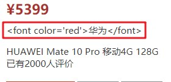
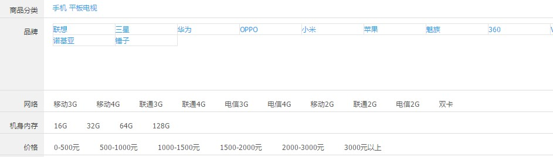
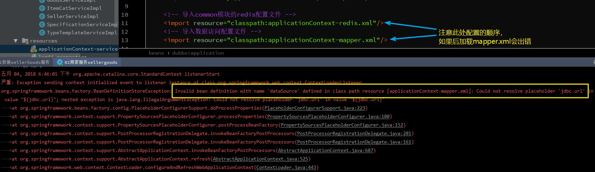
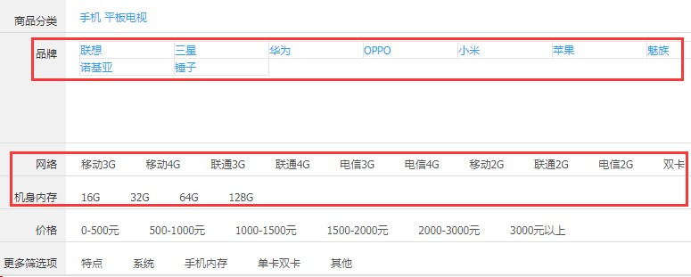
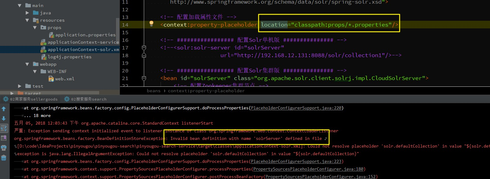
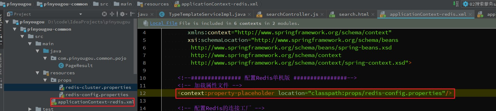
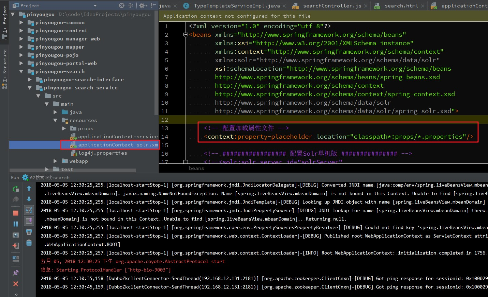

# Day11 搜索解决方案（二）-高亮&显示分类规格&搜索过滤

主要运行pinyougou-search服务与pinyougou-search-web搜索系统

## 1. 搜索结果-高亮显示

### 1.1. 需求分析

将用户输入的关键字在标题中以红色的字体显示出来，就是搜索中常用的高亮显示

### 1.2. 高亮显示-后端部分

修改pinyougou-search服务层现实类ItemSearchServiceImpl.java，增加solr高亮显示部分代码

```java
@Override
public Map<String, Object> search(Map<String, Object> params) {
    try {
        // 定义Map集合封装返回数据
        Map<String, Object> data = new HashMap<String, Object>();

        // 获取页面传递的关键字
        String keywords = (String) params.get("keywords");

        // 判断关键字是否为空
        if (StringUtils.isNoneBlank(keywords)) {
            /* =========有关键字，设置高亮========== */
            // 创建高亮查询对象
            HighlightQuery highlightQuery = new SimpleHighlightQuery();
            // 创建高亮选项对象
            HighlightOptions highlightOptions = new HighlightOptions();
            // 设置高亮格式器前缀
            highlightOptions.setSimplePrefix("<font color='red'>");
            // 设置高亮格式器后缀
            highlightOptions.setSimplePostfix("</font>");
            // 设置高亮的字段
            highlightOptions.addField("title");
            // 将高亮选项对象设置到高亮查询对象中
            highlightQuery.setHighlightOptions(highlightOptions);
            /* =========设置高亮========== */

            // 创建条件查询对象，按关键字查询
            Criteria criteria = new Criteria("keywords").is(keywords);
            // 高亮查询对象设置查询条件
            highlightQuery.addCriteria(criteria);

            // 获取高亮分页对象
            HighlightPage highlightPage = solrTemplate
                    .queryForHighlightPage(highlightQuery, SolrItem.class);

            // 获取高亮选项集合
            List<HighlightEntry<SolrItem>> highlightEntry = highlightPage.getHighlighted();

            // 迭代高亮选项集合
            for (HighlightEntry<SolrItem> entry : highlightEntry) {
                // 获取集合中检索到的原solrItem对象
                SolrItem solrItem = entry.getEntity();
                // 判断所有的Field的高亮集合及集合中第一个Field的高亮内容，再判断title的Field是否有高亮内容
                if (entry.getHighlights().size() > 0 && entry
                        .getHighlights().get(0).getSnipplets().size() > 0) {
                    // 获取title的高亮内容
                    String title = entry.getHighlights().get(0).getSnipplets().get(0);
                    // 将获取的高亮的内容设置到原来的solrItem对象中
                    solrItem.setTitle(title);
                }
            }

            // 获取高亮分页查询的数据，设置到map集合中
            data.put("rows", highlightPage.getContent());

        } else {
            /* 没有传递关键字，使用简单查询(不包含高亮) */
            // 创建普通的查询对象（使用Query接口或者实现类SimpleQuery都可以）
            SimpleQuery simpleQuery = new SimpleQuery("*:*");

            // 设置分页对象
            ScoredPage<SolrItem> scoredPage = solrTemplate
                    .queryForPage(simpleQuery, SolrItem.class);

            // 获取分页查询的数据，设置到map集合中
            List<SolrItem> solrItemList = scoredPage.getContent();

            // 返回查询数据
            data.put("rows", solrItemList);
        }

        // 返回查询数据
        return data;

    } catch (Exception e) {
        e.printStackTrace();
        throw new RuntimeException(e);
    }
}
```

### 1.3. 前端代码

测试后发现高亮显示的html代码原样输出



这是angularJS为了防止html攻击采取的安全机制。如何在页面上显示html的结果呢？可以用到$sce服务的trustAsHtml方法来实现转换。

因为这个功能具有一定通用性，可以通过angularJS的过滤器来简化开发，这样只写一次，调用的时候就非常方便了，看代码：

- 修改pinyougou-search-web/js/base.js，添加$sce服务

```js
/* 使用$sce服务写成过滤器 */
app.filter('trustHtml', function ($sce) {
    return function (html) {
        return $sce.trustAsHtml(html);
    };
});
```

- 修改search.html，调用过滤器：
    - ng-bind-html指令用于显示html内容
    - 竖线 | 用于调用过滤器 (373行)

```html
<div class="attr" style="line-height: 20px;"
     ng-bind-html="item.title | trustHtml">
</div>
```

> 注意：商品标题文本太长，可使用用样式控制用省略号显示。在style样式中增加下面的属性：  
> `style="line-height: 20px;white-space:nowrap;overflow:hidden;text-overflow:ellipsis;"`

## 2. 搜索业务规则分析

### 2.1. 需求分析

在关键字搜索的基础上添加面板搜索功能。面板上有商品分类、品牌、各种规格和价格区间等条件



业务规则：

1. 当用户输入关键字搜索后，除了显示列表结果外，还应该显示通过这个关键字搜索到的记录都有哪些商品分类
2. 根据第一个商品分类查询对应的模板，根据模板查询出品牌列表
3. 根据第一个商品分类查询对应的模板，根据模板查询出规格列表
4. 当用户点击搜索面板的商品分类时，显示按照这个关键字查询结果的基础上，筛选此分类的结果
5. 当用户点击搜索面板的品牌时，显示在以上结果的基础上，筛选此品牌的结果
6. 当用户点击搜索面板的规格时，显示在以上结果的基础上，筛选此规格的结果
7. 当用户点击价格区间时，显示在以上结果的基础上，按价格进行筛选的结果
8. 当用户点击搜索面板的相应条件时，隐藏已点击的条件

### 2.2. 实现思路

1. 搜索面板的商品分类需要使用Spring Data Solr的分组查询来实现
2. 为了能够提高查询速度，我们需要把查询面板的品牌、规格数据提前放入redis
3. 查询条件的构建、面板的隐藏需要使用angularJS来实现
4. 后端的分类、品牌、规格、价格区间查询需要使用过滤查询来实现

## 3. 查询分类列表

### 3.1. 需求分析

根据搜索关键字查询商品分类名称列表

### 3.2. 后端代码-查询商品分类

- 在search查询方法中，增加根据关键字查询分类代码，并返回查询分类
    1. 有输入关键字，则返回根据关键字查询的分类
    2. 没有输入关键字，则返回null（可以不用设置）
- 修改服务层ItemSearchServiceImpl，增加查询分类searchCategoryList方法，使用分组查询

```java
/**
 * 通过关键字查询商品分类数据(使用分组查询)
 *
 * @param keywords 输入的搜索关键字
 * @return 查询的结果集
 */
private List<String> searchCategoryList(String keywords) {

    // 创建集合封装返回商品分类数据
    List<String> categoryList = new ArrayList<String>();

    // 创建查询对象
    Query query = new SimpleQuery();

    // 创建查询条件
    Criteria criteria = new Criteria("keywords").is(keywords);
    // 设置查询条件
    query.addCriteria(criteria);

    // 创建分组选项对象，设置分组的字段名称
    GroupOptions groupOptions = new GroupOptions().addGroupByField("category");
    // 设置分组查询条件
    query.setGroupOptions(groupOptions);

    // 获取分组分页对象
    GroupPage<SolrItem> groupPage = solrTemplate.queryForGroupPage(query, SolrItem.class);
    // 根据分组Field获取分组结果集
    GroupResult<SolrItem> groupResult = groupPage.getGroupResult("category");
    // 获取分组选项的集合
    List<GroupEntry<SolrItem>> groupEntries = groupResult.getGroupEntries().getContent();

    /* 遍历分组选项集合 */
    for (GroupEntry<SolrItem> groupEntry : groupEntries) {
        // 获取category字段分组值，封装到集合中
        categoryList.add(groupEntry.getGroupValue());
    }
    // 返回数据
    return categoryList;
}
```

- 修改search查询方法，增加查询分类部分代码

```java
@Override
public Map<String, Object> search(Map<String, Object> params) {

    try {
        // 定义Map集合封装返回数据
        Map<String, Object> data = new HashMap<String, Object>();

        // 获取页面传递的关键字
        String keywords = (String) params.get("keywords");

        // 判断关键字是否为空
        if (StringUtils.isNoneBlank(keywords)) {
            ......
            /* 调用方法，根据关键字查询商品分类数据 */
            List<String> categoryList = searchCategoryList(keywords);
            // 将获取的商品分类集合设置到map集合中
            data.put("categoryList", categoryList);

            // 获取高亮分页查询的数据，设置到map集合中
            data.put("rows", highlightPage.getContent());

        } else {
            ......
            /* 输入关键字，将设置商品分类为null（可以不用设置） */
            data.put("categoryList", null);
        }

        // 返回查询数据
        return data;

    } catch (Exception e) {
        e.printStackTrace();
        throw new RuntimeException(e);
    }
}
```

### 3.3. 前端代码-显示商品分类

修改search.html，在页面遍历返回数据结果集，显示商品分类

```html
<!-- 判断显示搜索关键字所属的商品分类 -->
<div class="type-wrap" ng-if="resultMap.categoryList != null">
	<div class="fl key">商品分类</div>
	<div class="fl value">
		<a href="#" style="padding-right: 15px"
           ng-repeat="category in resultMap.categoryList">
            {{ category }}
        </a>
	</div>
	<div class="fl ext"></div>
</div>
```

## 4. 缓存商品分类、品牌与规格数据

### 4.1. 需求分析

- 将商品分类数据、品牌数据、和规格数据都放入Redis存储。因为此部分数据变化频率小，在搜索经常使用，将放到缓存中，加强搜索的性能
    1. 在运营商后台商品分类管理页面新增【更新缓存】按钮，将商品分类数据放入缓存（Hash），以分类名称作为key，以模板ID作为值。
    2. 在运营商后台商品类型模板管理页面新增【更新缓存】按钮，分别将品牌数据和规格数据放入缓存（Hash），以模板ID作为key，以品牌列表和规格列表作为值

### 4.2. 缓存商品分类数据

- 将商品分类表存入缓存，pinyougou-sellergoods-service工程需要引入pinyougou-common工程依赖，修改pom.xml文件

```xml
<!-- 依赖pinyougou-common，引入缓存redis配置 -->
<dependency>
    <groupId>com.moon</groupId>
    <artifactId>pinyougou-common</artifactId>
    <version>${project.version}</version>
</dependency>
```

- 修改applicationContext-service.xml，导入redis配置文件（配置文件在common模块中，因为缓存可能是多个模块使用到，所以放到common模块中，使用时再依赖即可）

```xml
<!-- 导入common模块的redis配置文件 -->
<import resource="classpath:applicationContext-redis.xml"/>
```

- 在ItemCatService接口和ItemCatServiceImpl实现类增加保存数据到redis方法

```java
/**
 * 添加商品分类数据到Redis中
 */
void saveToRedis();

/**
 * 注入缓存模版对象
 */
@Autowired
private RedisTemplate redisTemplate;

@Override
public void saveToRedis() {
    // 调用mapper对象查询所有商品的分类
    List<ItemCat> itemCatList = itemCatMapper.selectAll();

    /*
     * 循环集合，设置到redis。以hash类型存储
     *    存储key名为"itemCats"
     *    value部分为hash集合
     *        其中key: 分类名称  value: 模版id
     */
    for (ItemCat itemCat : itemCatList) {
        redisTemplate.boundHashOps("itemCats")
                .put(itemCat.getName(), itemCat.getTypeId());
    }
}
```

- ItemCatController控制层增加保存数据到redis方法

```java
/**
 * 更新商品分类缓存数据
 *
 * @return 成功/失败标识
 */
@PostMapping("/updateRedis")
public boolean updateRedis() {
    try {
        itemCatService.saveToRedis();
        return true;
    } catch (Exception e) {
        e.printStackTrace();
    }
    return false;
}
```

- itemCatController.js增加更新缓存方法

```js
/* 定义更新缓存的方法 */
$scope.updateRedis = () => {
    // 发送post请求
    baseService.sendPost('/itemCat/updateRedis').then(response => {
        if (response.data) {
            alert("缓存更新成功!");
        } else {
            alert("缓存更新失败!");
        }
    });
};
```

- item-cat.html页面增加更新缓存的按钮

```html
<button type="button" class="btn btn-default" title="更新缓存"
        ng-click="updateRedis();">
	<i class="fa fa-trash-o"></i> 更新缓存
</button>
```

<font color="red">***！！（如果在此配置文件中有引入mapper.xml的配置的话）注意：此处配置加载文件的顺序，如果mapper.xml配置文件放在redis配置文件后面会出错***</font>



### 4.3. 缓存品牌和规格列表数据

- 商品服务的TypeTemplateService接口与TypeTemplateServiceImpl实现类，增加数据保存到缓存中

```java
/**
 * 把品牌与规格选项数据存入缓存
 */
void saveToRedis();

/**
 * 注入redis缓存模版对象
 */
@Autowired
private RedisTemplate redisTemplate;

@Override
public void saveToRedis() {
    // 查询所有的类型模板
    List<TypeTemplate> typeTemplateList = typeTemplateMapper.selectAll();

    // 循环类型模板集合
    for (TypeTemplate typeTemplate : typeTemplateList) {
        /*
         * 存储品牌列表，存储为hash类型，key名称为"brandList"
         *      value部分为map集合，其中key为模版id，value为品牌map集合
         */
        // 获取该模版对应的品牌数据，转成Map
        List<Map> brandList = JSON.parseArray(typeTemplate.getBrandIds(), Map.class);
        // 将品牌存入Redis中
        redisTemplate.boundHashOps("brandList").put(typeTemplate.getId(), brandList);

        // 根据模版id查询规格与规格选项
        List<Map> specList = findSpecByTypeTemplateId(typeTemplate.getId());
        /*
         * 将规格与规格选项列表存储到Redis中
         *      存储为hash类型，key名称为"specList"
         *      value部分为map集合，其中key为模版id，value为规格与规格选项list集合
         */
        redisTemplate.boundHashOps("specList").put(typeTemplate.getId(), specList);
    }
}
```

- 运营商后台系统的控制层TypeTemplateController增加更新数据缓存的方法

```java
/**
 * 更新品牌与规格的缓存数据
 *
 * @return 成功/失败标识
 */
@PostMapping("/updateRedis")
public boolean updateRedis() {
    try {
        typeTemplateService.saveToRedis();
        return true;
    } catch (Exception e) {
        e.printStackTrace();
    }
    return false;
}
```

- 运营商后台系统的控制器typeTemplateController.js增加更新数据缓存的方法

```js
/* 定义更新缓存的方法 */
$scope.updateRedis = () => {
    // 发送post请求
    baseService.sendPost('/typeTemplate/updateRedis').then(response => {
        if (response.data) {
            alert("缓存更新成功!");
        } else {
            alert("缓存更新失败!");
        }
    });
};
```

- 修改type_template.html，增加更新数据到缓存的按钮

```html
<button type="button" class="btn btn-default"
        title="更新缓存" ng-click="updateRedis();">
	<i class="fa fa-trash-o"></i> 更新缓存
</button>
```

### 4.4. 更新缓存数据

在linux系统启动redis，运行运营商管理后台，打开商品分类和类型模板管理页，点击【更新缓存】按钮即可将数据放入缓存中

## 5. 显示品牌和规格数据

### 5.1. 需求分析

在搜索面板区域显示第一个分类的品牌和规格列表



### 5.2. 显示品牌和规格-后端部分

- 在pinyougou-search-service项目pom.xml增加common模块的依赖

```xml
<!-- 依赖pinyougou-common，引入缓存redis配置 -->
<dependency>
    <groupId>com.moon</groupId>
    <artifactId>pinyougou-common</artifactId>
    <version>${project.version}</version>
</dependency>
```

- 修改搜索服务实现模块的applicationContext-service.xml配置文件，导入common模块的redis配置文件

```xml
<!-- 配置导入common模块中的Redis配置文件 -->
<import resource="classpath:applicationContext-redis.xml"/>
```

- 修改搜索服务实现模块的实现类ItemSearchServiceImpl增加搜索品牌与规格选项的方法

```java
/* 注入RedisTemplate缓存模版 */
@Autowired
private RedisTemplate redisTemplate;

/**
 * 根据分类名称，从(Redis)缓存中查询品牌与规格选项数据
 *
 * @param categoryName 分类名称
 * @return 品牌与规格选项map集合
 */
private Map<String, Object> searchBrandAndSpecList(String categoryName) {
    // 定义Map集合封装品牌与规格选项数据
    Map<String, Object> map = new HashMap<String, Object>(2);
    // 从缓存商品分类中获取类型模版id
    Long typeId = (Long) redisTemplate.boundHashOps("itemCats").get(categoryName);

    // 从缓存中获取品牌列表
    List<Map> brandList = (List<Map>) redisTemplate.boundHashOps("brandList").get(typeId);
    // 将查询的品牌集合设置到map集合中
    map.put("brandList", brandList);

    // 从缓存中查询规格选项集合
    List<Map> specList = (List<Map>) redisTemplate.boundHashOps("specList").get(typeId);
    // 将查询的规格选项设置到map集合中
    map.put("specList", specList);
    return map;
}
```

- 修改实现类的search方法，增加查询品牌与规格选项的部分代码

```java
@Override
public Map<String, Object> search(Map<String, Object> params) {
    try {
        ......
        // 判断关键字是否为空
        if (StringUtils.isNoneBlank(keywords)) {
            ......
            /* 调用方法，根据关键字查询商品分类数据 */
            List<String> categoryList = searchCategoryList(keywords);
            // 将获取的商品分类集合设置到map集合中
            data.put("categoryList", categoryList);

            /* 判断商品分类集合，查询品牌与规格选项数据 */
            if (categoryList != null && categoryList.size() > 0) {
                // 根据第一个分类名称，从redis缓存查询品牌与规格选项数据
                Map<String, Object> map = searchBrandAndSpecList(categoryList.get(0));
                /*
                 * 将品牌与规格选项数据封装到map集合中
                 *  putAll(Map<? extends K, ? extends V> m),将原有的map集合封装到新的集合中
                 */
                data.putAll(map);
            }

            // 获取高亮分页查询的数据，设置到map集合中
            data.put("rows", highlightPage.getContent());
        } else {
            ....
        }
        ......
}
```

### 5.3. 显示品牌和规格-前端部分

#### 5.3.1. 获取品牌列表

修改页面search.html，实现循环品牌列表

```html
<!-- 判断显示搜索关键字所包含的品牌 -->
<div class="type-wrap logo" ng-if="resultMap.brandList != null">
	<div class="fl key brand">品牌</div>
	<div class="value logos">
		<ul class="logo-list">
            <li style="margin-right:5px;margin-bottom:5px;text-align:center;width:100px;"
                ng-repeat="brand in resultMap.brandList">
                <a href="#">{{ brand.text }}</a>
            </li>
		</ul>
	</div>
	<div class="ext">
		<a href="javascript:void(0);" class="sui-btn">多选</a>
		<a href="javascript:void(0);">更多</a>
	</div>
</div>
```

#### 5.3.2. 获取规格列表

修改页面search.html，实现循环规格列表

```html
<!-- 判断显示搜索关键字所包含的规格选项 -->
<div class="type-wrap" ng-if="resultMap.specList != null"
     ng-repeat="spec in resultMap.specList">
	<div class="fl key">{{ spec.text }}</div>
	<div class="fl value">
		<ul class="type-list">
			<li ng-repeat="o in spec.options">
				<a>{{ o.optionName }}</a>
			</li>
		</ul>
	</div>
	<div class="fl ext"></div>
</div>
```

### 5.4. 注意问题

因为之前在common公共模块中引入redis配置时，将读取属性文件的代码也写上，结果在搜索服务模块中配置加载属性文件时。会出现报错，说无法加载solr的配置文件。

后面查看资料，发现是因为与common公共模块中的配置冲突，导致搜索服务也读取不了属性文件





**解决方案：**

将common公共模块的redis配置文件中的加载属性文件的部分删除，然后在引用common模块中的redis的服务中，<font color="red">***配置加载依赖模块的配置文件***</font>即可（注意一个系统中，包含依赖的系统，<font color="red">只能一个地方使用classpath*</font>）

```xml
<context:property-placeholder location="classpath*:props/*.properties"/>
```




## 6. 过滤条件构建

### 6.1. 需求分析

- 点击搜索面板上的分类、品牌和规格，实现查询条件的构建。查询条件以面包屑的形式显示。
- 当面包屑显示分类、品牌和规格时，要同时隐藏搜索面板对应的区域。
- 用户可以点击面包屑上的X撤销查询条件。撤销后显示搜索面包相应的区域。

### 6.2. 添加搜索项

#### 6.2.1. 添加搜索项的方法

- 当点击搜索面板上的分类、品牌和规格后，将点击的内容封装到搜索对象中
- 修改pinyougou-search-web的searchController.js中json类型对象searchParam，定义多个属性用于封装页面的点击的搜索条件；定义增加搜索项的方法

```js
/* 定义json对象封装页面的搜索参数 */
$scope.searchParam = {'keywords': '', 'category': '', 'brand': '', 'spec': {}};
/* 定义添加搜索项的方法 */
$scope.addSearchItem = (key, value) => {
    // 判断页面点击的是商品分类或者品牌
    if (key == 'category' || key == 'brand') {
        $scope.searchParam[key] = value;
    } else {
        $scope.searchParam.spec[key] = value;
    }
};
```

#### 6.2.2. 点击搜索项

- 修改pinyougou-search-web的search.html，为搜索面板的标签增加点击事件
- search.html，修改点击商品分类标签

```html
<div class="fl key">商品分类</div>
<div class="fl value">
	<a href="#" style="padding-right: 15px"
       ng-click="addSearchItem('category', category);"
       ng-repeat="category in resultMap.categoryList">
        {{ category }}
    </a>
</div>
```

- search.html，修改点击品牌标签

```html
<div class="fl key brand">品牌</div>
<div class="value logos">
	<ul class="logo-list">
        <li style="margin-right:5px;margin-bottom:5px;text-align:center;width:100px;"
            ng-click="addSearchItem('brand', brand.text);"
            ng-repeat="brand in resultMap.brandList">
            <a href="#">{{ brand.text }}</a>
        </li>
	</ul>
</div>
```

- search.html，修改点击规格选项标签

```html
<div class="type-wrap" ng-if="resultMap.specList != null"
     ng-repeat="spec in resultMap.specList">
	<div class="fl key">{{ spec.text }}</div>
	<div class="fl value">
		<ul class="type-list">
			<li ng-repeat="o in spec.options">
				<a ng-click="addSearchItem(spec.text, o.optionName);">
                    {{ o.optionName }}
                </a>
			</li>
		</ul>
	</div>
	<div class="fl ext"></div>
</div>
```

#### 6.2.3. 显示面包屑搜索导航

注意：到目前为止，只实现了点击后将搜索条件在面包屑搜索导航中，并将值增加到搜索条件对象中，并没有实现查询

修改pinyougou-search-web的search.html，用面包屑形式显示搜索条件

```html
<!--bread-->
<div class="bread">
	<ul class="fl sui-breadcrumb">
		<li>搜索结果</li>
	</ul>
	<ul class="tags-choose">
		<li class="tag" ng-if="searchParam.category != ''">
            商品分类：{{ searchParam.category }}
            <i class="sui-icon icon-tb-close"></i>
        </li>
		<li class="tag" ng-if="searchParam.brand != ''">
            品牌：{{ searchParam.brand }}
            <i class="sui-icon icon-tb-close"></i>
        </li>
		<li class="tag" ng-repeat="(key, value) in searchParam.spec">
            {{key}} : {{value}}
            <i class="sui-icon icon-tb-close"></i>
        </li>
	</ul>
	<form class="fl sui-form form-dark">
		<div class="input-control control-right">
			<input type="text" />
			<i class="sui-icon icon-touch-magnifier"></i>
		</div>
	</form>
	<div class="clearfix"></div>
</div>
```

### 6.3. 删除搜索项

删除已经选定的搜索条件

#### 6.3.1. 删除搜索项方法

修改pinyougou-search-web工程searchController.js，定义删除的方法

```js
/* 定义删除搜索项的方法 */
$scope.removeSearchItem = (key) => {
    // 断点击移除的是商品分类或者品牌
    if (key == 'category' || key == 'brand') {
        $scope.searchParam[key] == '';
    } else {
        /* 移除规格，直接赋值为空字符串后为{'网络':''}，
         *  因为页面是直接遍历，不是判断是否为空才显示，
         *  所以必须spec中对应的属性删除
         */
        delete $scope.searchParam.spec[key];
    }
};
```

<font color="red">***注意：删除规格时，不能直接赋值为空字符串***</font>

#### 6.3.2. 页面调用方法

修改pinyougou-search-web工程的search.html，增加点击事件，调用删除搜索条件方法

```html
<ul class="tags-choose">
	<li class="tag" ng-if="searchParam.category != ''"
        ng-click="removeSearchItem('category');">
        商品分类：{{ searchParam.category }}
        <i class="sui-icon icon-tb-close"></i>
    </li>
	<li class="tag" ng-if="searchParam.brand != ''"
        ng-click="removeSearchItem('brand');">
        品牌：{{ searchParam.brand }}
        <i class="sui-icon icon-tb-close"></i>
    </li>
	<li class="tag" ng-repeat="(key, value) in searchParam.spec"
        ng-click="removeSearchItem(key);">
        {{key}} : {{value}}
        <i class="sui-icon icon-tb-close"></i>
    </li>
</ul>
```

### 6.4. 隐藏查询面板

- 即点击搜索条件后，将对应的搜索条件所在的区域隐藏起来
- 修改search.html，隐藏分类面板

```html
<!-- 判断显示搜索关键字所属的商品分类 -->
<div class="type-wrap" ng-if="resultMap.categoryList != null && searchParam.category == ''">
```

- 隐藏品牌面板

```html
<!-- 判断显示搜索关键字所包含的品牌 -->
<div class="type-wrap logo" ng-if="resultMap.brandList != null && searchParam.brand == ''">
```

- 隐藏规格面板

```html
<!-- 判断显示搜索关键字所包含的规格选项 -->
<div class="type-wrap" ng-if="resultMap.specList != null && searchParam.spec[spec.text] == null"
     ng-repeat="spec in resultMap.specList">
```

## 7. 过滤查询

### 7.1. 需求分析

根据上一步构建的查询条件，实现分类、品牌和规格的过滤查询

### 7.2. 分类、品牌、规格过滤查询实现

**注意规格选项过滤查询实现思路：规格有多项，需要循环过滤。循环规格查询条件，根据key得到域名称，根据value设置过滤条件。**

- 修改pinyougou-search-service工程的ItemSearchServiceImpl.java，增加过滤查询部分代码

```java
......
// 创建条件查询对象，按关键字查询
Criteria criteria = new Criteria("keywords").is(keywords);
// 高亮查询对象设置查询条件
highlightQuery.addCriteria(criteria);

/* =========增加过滤查询========== */
// 商品分类过滤，获取页面传递的分类搜索
String category = (String) params.get("category");
// 判断商品品牌搜索是否为空
if (StringUtils.isNoneBlank(category)) {
    // 创建条件对象
    Criteria criteriaCategory = new Criteria("category").is(category);
    // 高亮查询添加过滤条件
    highlightQuery.addFilterQuery(new SimpleFilterQuery(criteriaCategory));
}

// 商品品牌过滤，获取页面传递的品牌搜索
String brand = (String) params.get("brand");
// 判断商品品牌搜索是否为空
if (StringUtils.isNoneBlank(brand)) {
    // 创建条件对象
    Criteria criteriaBrand = new Criteria("brand").is(brand);
    // 添加过滤条件
    highlightQuery.addFilterQuery(new SimpleFilterQuery(criteriaBrand));
}

// 规格选项过滤 spec_*，获取页面传递的规格搜索参数
Map<String, Object> specMap = (Map<String, Object>) params.get("spec");
// 判断规格搜索参数是否为空
if (specMap != null && specMap.size() > 0) {
    // 遍历map集合
    for (String key : specMap.keySet()) {
        // 创建条件对象,例："spec_网络
        Criteria criteriaSpec = new Criteria("spec_" + key).is(specMap.get(key));
        // 添加过滤条件
        highlightQuery.addFilterQuery(new SimpleFilterQuery(criteriaSpec));
    }
}
/* =========增加过滤查询========== */

// 获取高亮分页对象
HighlightPage highlightPage = solrTemplate
        .queryForHighlightPage(highlightQuery, SolrItem.class);
......
```

### 7.3. 根据分类查询该分类下对应的品牌、规格数据

修改商品搜索服务实现类，ItemSearchServiceImp中的search()查询方法，增加对检索是否有分类名称进行判断

```java
......
/* 判断检索条件中是否包含商品分类名称 */
if (StringUtils.isNoneBlank(category)) {
    // 检索条件已包含商品分类，则直接根据检索的分类查询对象的品牌与规格
    Map<String, Object> map = searchBrandAndSpecList(category);
    data.putAll(map);
} else {
    /* 检索条件不包含商品分类，则根据关键字（keywords）查询所有分类 */
    /* 调用方法，根据关键字查询商品分类数据 */
    List<String> categoryList = searchCategoryList(keywords);
    // 将获取的商品分类集合设置到map集合中
    data.put("categoryList", categoryList);

    /* 判断商品分类集合，查询品牌与规格选项数据 */
    if (categoryList != null && categoryList.size() > 0) {
        // 根据第一个分类名称，从redis缓存查询品牌与规格选项数据
        Map<String, Object> map = searchBrandAndSpecList(categoryList.get(0));
        /*
         * 将品牌与规格选项数据封装到map集合中
         *  putAll(Map<? extends K, ? extends V> m),将原有的map集合封装到新的集合中
         */
        data.putAll(map);
    }
}
......
```

### 7.4. 提交查询

修改searchController.js在添加和删除筛选条件时自动调用搜索方法$scope.search();

```js
/* 定义添加搜索项的方法 */
$scope.addSearchItem = (key, value) => {
    ......
    /* 添加搜索项后，执行索引的方法 */
    $scope.search()
};

/* 定义删除搜索项的方法 */
$scope.removeSearchItem = (key) => {
    ......
    /* 删除搜索项后，执行索引的方法 */
    $scope.search()
};
```
