# Day15 SpringBoot框架&短信微服务&用户中心注册功能

## 1. Spring Boot入门

*注：Spring boot此处只有简单的入门介绍，内容都是本次项目使用的到的知识点与代码，详细Spring Booot的使用笔记见《\Java\编程资料笔记\【08】Spring Cloud & Spring Boot\Spring Boot笔记.md》*

### 1.1. 什么是Spring Boot?

Spring 诞生时是 Java 企业版（Java Enterprise Edition，JEE，也称 J2EE）的轻量级代替品。无需开发重量级的 Enterprise JavaBean（EJB），Spring 为企业级Java 开发提供了一种相对简单的方法，通过依赖注入和面向切面编程，用简单的Java 对象（Plain Old Java Object，POJO）实现了 EJB 的功能。

<u>**Spring 的组件代码是轻量级的，但它的配置却是重量级的。**</u>

- **第一阶段：xml配置**
    - 在Spring 1.x时代，使用Spring开发满眼都是xml配置的Bean，随着项目的扩大，我们需要把xml配置文件放到不同的配置文件里，那时需要频繁的在开发的类和配置文件之间进行切换
- **第二阶段：注解配置**
    - 在Spring 2.x 时代，随着JDK1.5带来的注解支持，Spring提供了声明Bean的注解（例如@Controller、@Service），大大减少了配置量。主要使用的方式是应用的基本配置（如数据库配置）用xml，业务配置用注解
- **第三阶段：java配置**
    - Spring 3.0 引入了基于 Java 的配置能力，这是一种类型安全的可重构配置方式，可以代替 XML。我们目前刚好处于这个时代。现在Spring和Springboot都推荐使用java配置。
    - 所有这些配置都代表了开发时的损耗。因为在思考 Spring 特性配置和解决业务问题之间需要进行思维切换，所以写配置挤占了写应用程序逻辑的时间。除此之外，项目的依赖管理也是件吃力不讨好的事情。决定项目里要用哪些库就已经够让人头痛的了，你还要知道这些库的哪个版本和其他库不会有冲突，这难题实在太棘手。并且，依赖管理也是一种损耗，添加依赖不是写应用程序代码。一旦选错了依赖的版本，随之而来的不兼容问题毫无疑问会是生产力杀手。

Spring Boot其设计目的是用来简化Spring应用的初始搭建以及开发采用约定优于配置，只需要“run”就能创建一个独立的、生产级别的Spring应用。Spring Boot为Spring平台及第三方库提供开箱即用的设置（提供默认设置），这样我们就可以简单的开始。多数Spring Boot应用只需要很少的Spring配置。

可以使用SpringBoot创建java应用，并使用`java –jar`启动它，或者采用传统的war部署方式。

<font color="red">**Spring Boot主要特点：**</font>

- 创建独立的Spring应用程序
- 嵌入的Tomcat，无需部署WAR文件
- 简化Maven配置
- 自动配置Spring
- 提供生产就绪型功能，如指标，健康检查和外部配置
- 绝对没有代码生成和对XML没有要求配置

<font color="red">***Spring Boot主要的作用是用于简化spring整合其他框架，自动解决不同框架的依赖jar包的冲突，内嵌了整合其他框架的代码***</font>

### 1.2. Spring Boot 入门demo

#### 1.2.1. 起步依赖

- 创建Maven模块springboot-test（打包方式jar）
- 在pom.xml中添加依赖，注意：更换父工程spring-boot-starter-parent（不需要指定Web启动器版本，因为已经在父工程进行版本控制）

```xml
<!-- 配置springboot父级工程 -->
<parent>
    <groupId>org.springframework.boot</groupId>
    <artifactId>spring-boot-starter-parent</artifactId>
    <version>1.5.6.RELEASE</version>
</parent>
<modelVersion>4.0.0</modelVersion>
<artifactId>springboot-test</artifactId>
<name>springboot-test</name>
<packaging>jar</packaging>

<!-- 配置依赖启动器 -->
<dependencies>
    <!-- 配置Web启动器(内嵌tomcat、整合SpringMVC、整合jackson) -->
    <dependency>
        <groupId>org.springframework.boot</groupId>
        <artifactId>spring-boot-starter-web</artifactId>
    </dependency>
</dependencies>
```

- 配置依赖后，工程会自动添加许多jar包。这些jar包正是做开发时需要导入的jar包。因为这些jar包刚才引入的<font color="red">***spring-boot-starter-web**</font>所引用了，所以引用spring-boot-starter-web后会自动把依赖传递过来

#### 1.2.2. 变更JDK版本

默认情况下工程的JDK版本是1.6，而通常用使用1.8的版本，所以需要在pom.xml中添加以下配置

```xml
<!-- 配置全局的属性 -->
<properties>
    <!-- 更改JDK版本号 -->
    <java.version>1.8</java.version>
</properties>
```

说明：添加后更新工程，会发现版本已经变更为1.8，配置成功如下图：

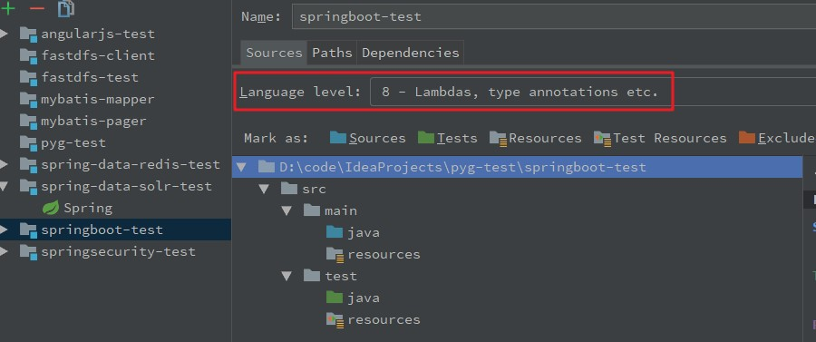

**注意：虽然JDK1.6或者1.7都可以使用SpringBoot，但SpringBoot官方建议使用JDK1.8，要使用JDK1.8，首先必须要配置JDK1.8后，才可以使用上述方法设置。**

#### 1.2.3. 引导类

Spring Boot不需要配置文件，只需要创建一个引导类，例：在com.moon.springboot包下创建Application.java引导类

```java
/**
 * SpringBoot引导类
 * 该注解配置当前类为SpringBoot引导类，代表为SpringBoot应用的运行主类
 * * 	如果不使用scanBasePackages属性配置指定扫描的基础包，
 * * 	默认约定是扫描当前引导类所在的包下的所有包和所有类
 */
@SpringBootApplication(scanBasePackages = {"com.moon.springboot"})
public class Application {
    public static void main(String[] args) {
        // 直接运行Spring应用
        SpringApplication.run(Application.class, args);
    }
}
```

`@SpringBootApplication`：代表为SpringBoot应用的运行主类

```java
// SpringBoot应用启动类
@SpringBootApplication(scanBasePackages={"xx.xxx.xxx"}) // scanBasePackages指定扫描的基础包
```

简单解释一下`@SpringBootApplication`其实就是以下三个注解的总和：

- `@Configuration`：用于定义一个配置类。
- `@EnableAutoConfiguration`：Spring Boot会自动根据你jar包的依赖来自动配置项目。
- `@ComponentScan`： 告诉Spring哪个packages 的用注解标识的类会被spring自动扫描并且装入bean容器。

<font color="purple">***注：如果配置@SpringBootApplication注解，不指定注解扫描的包，默认约定是扫描当前引导类所在的同级包下的<u>所有包和所有类以及下级包的类（若为JPA项目还可以扫描标注@Entity的实体类）</u>，建议入口类放置的位置在groupId+arctifactID组合的包名下；如果需要指定扫描包使用注解`@SpringBootApplication(scanBasePackages = 'xxx.xxx.xx')`***</font>

直接执行这个引导类，现控制台会出现【Spring】标识，这个代表成功启动

这个标识是Spring启动标识，如果不想要，可以设置取消

```java
@SpringBootApplication(scanBasePackages = {"com.moon.springboot"})
public class Application {
   public static void main(String[] args) {
      /* 取消设置Sring启动的标识 */
      // 创建SpringApplication应用对象
      SpringApplication springApplication = new SpringApplication(Application.class);
      // 设置横幅模式(设置关闭)
      springApplication.setBannerMode(Banner.Mode.OFF);
      // 运行spring应用
      springApplication.run(args);
   }
}
```

*参考《\Java\编程资料笔记\【08】Spring Cloud & Spring Boot\Spring Boot笔记-其他相关内容.md》附录2. Spring-Boot的application.properties中的banner设置，可以通过修改配置文件制定自己的标识*

#### 1.2.4. Spring MVC实现

现在开始使用spring MVC框架，实现json数据的输出。如果按照原来的做法，需要在web.xml中添加一个DispatcherServlet的配置，再添加一个spring的配置文件

- spring加入配置

```xml
<!-- controller注解扫描 -->
<context:component-scan base-package="com.moon.springboot.controller" />
<!-- 注解驱动 -->
<mvc:annotation-driven />
```

- web.xml加入配置

```xml
<!-- 配置前端控制器 -->
<servlet>
	<servlet-name>springmvc-test</servlet-name>
	<servlet-class>org.springframework.web.servlet.DispatcherServlet</servlet-class>
	<init-param>
		<param-name>contextConfigLocation</param-name>
		<param-value>classpath:spring/*.xml</param-value>
	</init-param>
</servlet>
<servlet-mapping>
	<servlet-name>springmvc-test</servlet-name>
	<url-pattern>/</url-pattern>
</servlet-mapping>
```


但是使用SpringBoot，可以直接写com.moon.springboot.controller.HelloController.java类

```java
@RestController
public class HelloController {
   /** 测试控制方法 */
   @GetMapping("/hello")
   public String hello() {
      return "测试SpringBoot成功";
   }
}
```

运行启动类来运行程序，在浏览器地址栏输入 `http://localhost:8080/hello` 即可看到运行结果

#### 1.2.5. 修改tomcat启动端口

在src/main/resources下创建application.properties

```properties
# 配置tomcat的端口号
server.port=8888
```

重新运行引导类，地址栏输入：`http://localhost:8888/hello`

#### 1.2.6. 读取配置文件信息与注入业务层

- 在src/main/resources下的application.properties增加配置

```properties
# 配置自己的属性
url=http://www.moon.com
```

- 在类中读取这个配置信息与注入在默认扫描的包下的业务类，修改HelloController

```java
@RestController
public class HelloController {
   /* 注入配置文件中的相关属性 */
   @Value("${url}")
   private String url;

   /* 注入业务层（在springboot默认扫描的包下） */
   @Autowired
   private UserService userService;

    @GetMapping("/hello")
   public String hello() {
      System.out.println("读取配置文件：" + url);
      userService.say();
      return "测试SpringBoot成功";
   }
}
```

- 项目架构

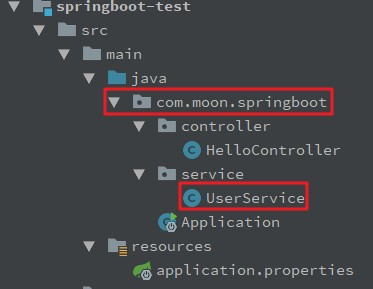

- 运行结果

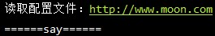

### 1.3. Spring Boot的使用说明（部分）

Spring Boot完整使用笔记详见《\Java\编程资料笔记\【08】Spring Cloud & Spring Boot\Spring Boot笔记.md》或day15 的资料中的《Spring Boot课程讲义.docx》

#### 1.3.1. Spring Boot配置原理

Spring Boot框架是一个将整合框架的整合代码都写好了的框架。所以需要知道它的工作原理才能够，找到各种整合框架可以配置的属性，以及属性对应的属性名。

##### 1.3.1.1. 配置原理说明

SpringBoot的`spring-boot-autoconfigure-1.5.6.RELEASE.jar`中编写了所有内置支持的框架的自动整合代码。

所有支持的框架根据功能类型来划分包，每个包都有一个XxxAutoConfiguration配置类，都是一个基于纯注解的配置类，是各种框架整合的代码。如图所示：

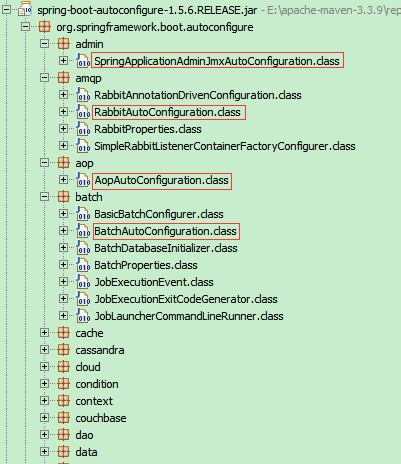

如果配置的框架有默认的配置参数，都放在一个命名为XxxProperties的属性类，如图所示：

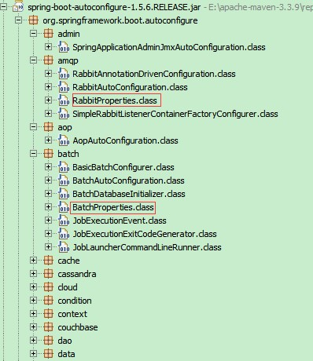

通过项目的resources下的application.properties文件可以修改每个整合框架的默认属性，从而实现了快速整合的目的。

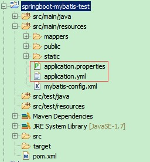

##### 1.3.1.2. 配置流程说明

- 第一步：配置一个内置整合框架的参数，先到`spring-boot-autoconfigure-1.5.6.RELEASE.jar`找到对应的模块。
- 第二步：如果该框架有可以配置的参数，那么对应的整合模块中一定有一个XxxProperties类，在里面可以找可以设置的参数。
- 第三步：在resources源目录下的`application.properties`文件里面可以修改XxxProperties类中默认的参数。

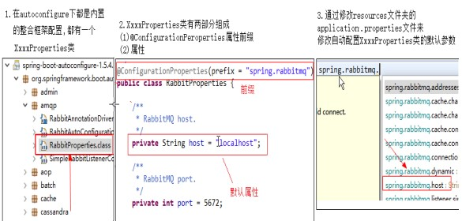

#### 1.3.2. Spring Boot 配置文件

默认情况下，Spring Boot会加载resources目录下的`application.properties`或`application.yml`来获得配置的参数。

SpringBoot支持一种由SpringBoot框架自制的配置文件格式。后缀为yml。yml后缀的配置文件的功能和properties后缀的配置文件的功能是一致的。

**Spring Boot能支持两种配置文件：**

- `application.properties`：键值对风格配置文件
- `application.yml`：层级树键值对风格配置文件

##### 1.3.2.1. application.properties

**单配置文件：**

```properties
# 配置数据源
spring.datasource.driverClassName=com.mysql.jdbc.Driver
spring.datasource.url=jdbc:mysql://localhost:3306/springboot_db
spring.datasource.username=root
spring.datasource.password=123456
spring.datasource.type=com.mchange.v2.c3p0.ComboPooledDataSource
```

**多配置文件：**

- 第一步：在application.properties配置文件下，增加多个application-xxx.properties文件名的配置文件，其中xxx是一个任意的字符串。

```
application-database.properties
application-jpa.properties
application-freemarker.properties
```

- 第二步：在application.properties总配置文件指定，加载的多个配置文件。<font color="red">***需要在application.properties中指定其它配置文件：***</font>

```properties
spring.profiles.active=database,jpa,freemarker
```

##### 1.3.2.2. application.yml

YML文件格式是YAML (YAML Aint Markup Language)层级树键值对格式文件。

**单配置文件：**

```yml
# 配置数据源
spring:
    datasource:
      url: jdbc:mysql://localhost:3306/springboot_db
      driverClassName: com.mysql.jdbc.Driver
      username: root
      password: 123456
      type: com.mchange.v2.c3p0.ComboPooledDataSource
```

其实application.yml配置文件就是将原来application.properties使用（`.`）分割的方式，改为树状结构，使用（`:`）分割。

<font color="purple">***注意：最后key的字段与值之间的冒号（:）后面一定要有一个空格。***</font>

**多配置文件：**

- 第一步：在application.yml配置文件下，增加多个application-xxx.yml文件名的配置文件，其中xxx是一个任意的字符串。

```
application-database.yml
application-jpa.yml
application-freemarker.yml
```

- 第二步：在application.yml总配置文件指定，加载的多个配置文件。<font color="red">***需要在application.yml中指定其它配置文件：***</font>

```yml
spring:
   profiles:
     active: database,jpa,freemarker
```

### 1.4. Spring Boot与ActiveMQ整合

#### 1.4.1. 使用内嵌ActiveMQ服务

- 在pom.xml中引入ActiveMQ起步依赖（不需要指定版本，因为已经在父工程进行版本控制）

```xml
<!-- 配置ActiveMQ启动器 -->
<dependency>
    <groupId>org.springframework.boot</groupId>
    <artifactId>spring-boot-starter-activemq</artifactId>
</dependency>
```

- 在com.moon.springboot.controller包下，创建消息生产者

```java
@RestController
public class ProducerController {
   /* 注入JmsTemplate消息模版 */
   @Autowired
   private JmsTemplate jmsTemplate;

   /* 发送消息 */
   @GetMapping("/send")
   public void sendMessage(String message) {
      // 发送消息
      jmsTemplate.convertAndSend("testSpringBootActiveMQ", message);
   }
}
```

- 在com.moon.springboot.listener包下，创建消息消费者

```java
@Component
public class MyMessageListener {
   // 接收消息
   @JmsListener(destination = "testSpringBootActiveMQ")
   public void readMessage(String message) {
      System.out.println("接收消息：" + message);
   }
}
```

测试：启动服务后，在浏览器执行`http://localhost:8888/send?message=moon`即可看到控制台输出消息提示。<font color="red">**Spring Boot内置了ActiveMQ的服务**</font>，所以不用单独启动也可以执行应用程序。

#### 1.4.2. 使用外部ActiveMQ服务

在src/main/resources下的application.properties增加配置, 指定ActiveMQ的地址

```properties
# 配置ActiveMQ消息中间件的连接地址
spring.activemq.broker-url=tcp://192.168.12.131:61616
```

运行后，会在activeMQ服务中看到发送的queue

#### 1.4.3. 发送Map类型信息

- 在发送消息类中增加发送消息方法

```java
/*发送map消息*/
@GetMapping("/sendMap")
public void send() {
   // 创建map集合封装信息
   Map<String, String> map = new HashMap<>();
   map.put("id", "1");
   map.put("name", "moon");
   map.put("age", "18");
   // 发送消息
   jmsTemplate.convertAndSend("test.map", map);
}
```

- 在监听类中增加消费方法

```java
// 接收map消息
@JmsListener(destination = "test.map")
public void readMapMessage(Map<String, String> map) {
   System.out.println("接收map类型消息：" + map);
}
```

### 1.5. ActiveMQ 常用 API

`class JmsTemplate extends JmsDestinationAccessor implements JmsOperations`

相关方法：

- `void convertAndSend(String destinationName, final Object message)`
    - 发送消息到指定队列
        - 参数destinationName：消息队列的名称
        - 参数message：需要发送的消息

监听类获取消息，在指定的消费消息的方法上使用`@JmsListener`注解，属性`destination = "消息队列名称"`

## 2. 短信发送平台【阿里大于】

### 2.1. 短信发送sdk（旧版）

具体使用参考项目一与day15教材

#### 2.1.1. 测试项目配置依赖

- 创建Maven模块sms-test，pom.xml加入依赖

```xml
<?xml version="1.0" encoding="UTF-8"?>
<project xmlns="http://maven.apache.org/POM/4.0.0"
         xmlns:xsi="http://www.w3.org/2001/XMLSchema-instance"
         xsi:schemaLocation="http://maven.apache.org/POM/4.0.0
         http://maven.apache.org/xsd/maven-4.0.0.xsd">
    <parent>
        <artifactId>pyg-test</artifactId>
        <groupId>com.moon</groupId>
        <version>1.0-SNAPSHOT</version>
    </parent>
    <modelVersion>4.0.0</modelVersion>
    <artifactId>sms-test</artifactId>
    <packaging>jar</packaging>
    <name>sms-test</name>

    <dependencies>
        <dependency>
            <groupId>com.aliyun</groupId>
            <artifactId>aliyun-java-sdk-core</artifactId>
            <version>4.0.6</version> <!-- 注：如提示报错，先升级基础包版，无法解决可联系技术支持 -->
        </dependency>
        <dependency>
            <groupId>com.aliyun</groupId>
            <artifactId>aliyun-java-sdk-dysmsapi</artifactId>
            <version>1.1.0</version>
        </dependency>
    </dependencies>

</project>
```

#### 2.1.2. 测试项目工具类

- 定义SmsSendUtil短信发送工具类：

```java
public class SmsSendUtil {

    /**
     * 产品名称:云通信短信API产品,开发者无需替换
     */
    private static final String PRODUCT = "Dysmsapi";
    /**
     * 产品域名,开发者无需替换
     */
    private static final String DOMAIN = "dysmsapi.aliyuncs.com";

    // 签名KEY(需要修改的地方)
    private static final String ACCESS_KEY_ID = "<accessKeyId>";
    // 签名密钥(需要修改的地方)
    private static final String ACCESS_KEY_SECRET = "<accessSecret>";
    // 短信模板ID: SMS_11480310(需要修改的地方)
    private static final String TEMPLATE_CODE = "SMS_xxx";
    // 短信签名(需要修改的地方)
    private static final String SIGN_NAME = "xxx";

    /**
     * 发送短信验证码方法
     *
     * @param phoneNum 手机号码
     * @param verify   验证码
     * @return true: 成功 false: 失败
     */
    public static boolean send(String phoneNum, String verify) {
        try {
            /** 可自助调整超时时间 */
            System.setProperty("sun.net.client.defaultConnectTimeout", "10000");
            System.setProperty("sun.net.client.defaultReadTimeout", "10000");
            /** 初始化acsClient,暂不支持region化 */
            IClientProfile profile = DefaultProfile.getProfile("cn-hangzhou",
                    ACCESS_KEY_ID, ACCESS_KEY_SECRET);
            /** cn-hangzhou: 中国.杭州 */
            DefaultProfile.addEndpoint("cn-hangzhou", "cn-hangzhou",
                    PRODUCT, DOMAIN);
            IAcsClient acsClient = new DefaultAcsClient(profile);
            /** 组装请求对象*/
            SendSmsRequest request = new SendSmsRequest();
            // 必填: 待发送手机号
            request.setPhoneNumbers(phoneNum);
            // 必填: 短信签名-可在短信控制台中找到
            request.setSignName(SIGN_NAME);
            // 必填: 短信模板-可在短信控制台中找到
            request.setTemplateCode(TEMPLATE_CODE);
            /**
             * 可选: 模板中的变量替换JSON串,
             * 如模板内容为"亲爱的${name},您的验证码为${code}"
             */
            request.setTemplateParam("{\"code\":\"" + verify + "\"}");
            // hint 此处可能会抛出异常，注意catch
            SendSmsResponse sendSmsResponse = acsClient.getAcsResponse(request);
            /** 判断短信是否发送成功 */
            return sendSmsResponse.getCode() != null &&
                    sendSmsResponse.getCode().equals("OK");
        } catch (Exception ex) {
            throw new RuntimeException(ex);
        }
    }

    public static void main(String[] args) {
        System.out.println(send("手机号", "123789"));
    }
}
```

### 2.2. 短信发送sdk（新版）

#### 2.2.1. 阿里云官网：短信服务SDK升级说明

短信服务新版SDK源码已经托管至开源平台Github，您使用GitHub clone的方式使用SDK，也可以使用依赖管理工具安装（PHP除外），<font color="red">***Demo代码可通过OpenAPI Explorer生成，所有SDK均只依赖SDK核心库，使用通用的Request及Response来处理接口请求及响应***</font>。

2019年1月22日，短信服务发布了新版SDK，此日期后接入SDK的用户使用的均为新版SDK；2019年1月22日前接入的SDK的用户使用的是旧版SDK。相较于旧版SDK，新版SDK有以下优势：

- 融入阿里云OpenAPI技术体系，改善用户体验。通过新版短信服务SDK，用户可以使用阿里云资源如API Explorer、CloudShell等工具体验API。
- 阿里云统一维护，降低故障风险。新版短信服务SDK由阿里云SDK统一维护，同时支持自动更新及故障预警，包括Github通知和Deprecated提示等。

新版短信服务SDK提供了更稳定、完善的开发环境，建议您尽快升级SDK。

#### 2.2.2. 新版SDK使用说明

> 说明 无论您要使用哪个产品的开发工具包，都必须安装SDK核心库。例如，如果要使用ECS的Java SDK，您需要安装Java SDK核心库和ECS的Java SDK。

发送demo代码直接在官网的OpenAPI Explorer生成

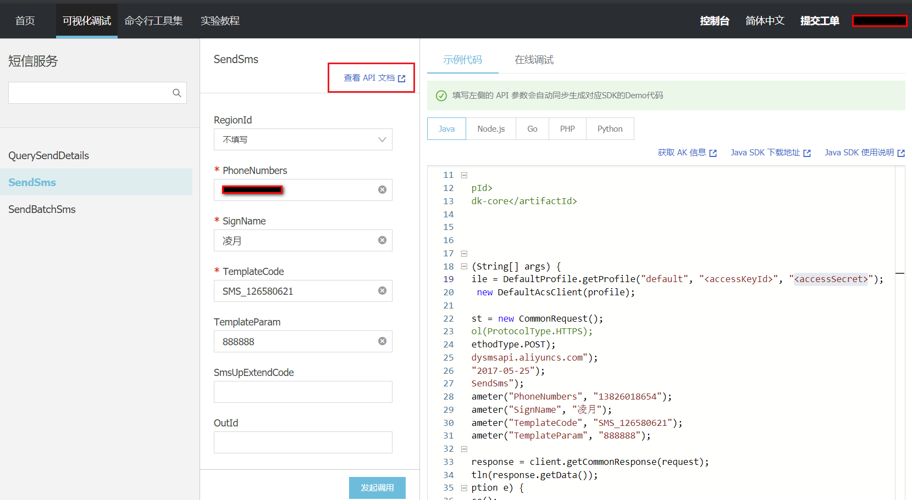

#### 2.2.3. 配置依赖

```xml
<dependency>
    <groupId>com.aliyun</groupId>
    <artifactId>aliyun-java-sdk-core</artifactId>
    <version>3.7.0</version>
</dependency>
<dependency>
    <groupId>com.aliyun</groupId>
    <artifactId>aliyun-java-sdk-ecs</artifactId>
    <version>4.11.0</version>
</dependency>
```

#### 2.2.4. 新版短信发送Demo

```java
/**
 * 阿里大于短信发送Demo(新版)
 */
/*
pom.xml
<dependency>
    <groupId>com.aliyun</groupId>
    <artifactId>aliyun-java-sdk-core</artifactId>
    <version>4.0.3</version>
</dependency>
*/
public class CommonRpc {
    public static void main(String[] args) {
        /*
         *  修改参数字符串
         *      <accessSecret>：主账号AccessKey的ID。
         *      <accessSecret>：主账号AccessKey的密钥
         *      还需要修改putQueryParameter的内容
         */
        DefaultProfile profile = DefaultProfile.getProfile("default", "<accessKeyId>", "<accessSecret>");
        IAcsClient client = new DefaultAcsClient(profile);

        CommonRequest request = new CommonRequest();
        //request.setProtocol(ProtocolType.HTTPS);
        request.setMethod(MethodType.POST);
        request.setDomain("dysmsapi.aliyuncs.com");
        request.setVersion("2017-05-25");
        request.setAction("SendSms");
        request.putQueryParameter("PhoneNumbers", "手机号");
        request.putQueryParameter("SignName", "凌月");
        request.putQueryParameter("TemplateCode", "SMS_126580621");
        request.putQueryParameter("TemplateParam", "{\"code\":\"888889\"}");
        try {
            CommonResponse response = client.getCommonResponse(request);
            System.out.println(response.getData());
        } catch (ServerException e) {
            e.printStackTrace();
        } catch (ClientException e) {
            e.printStackTrace();
        }
    }
}
```

*新版的短信发送比旧版的区别，不需要下载安装`aliyun-java-sdk-dysmsapi`到maven仓库，只需要依赖`aliyun-java-sdk-core`核心包就好*

## 3. 短信微服务

### 3.1. 需求分析

构建一个通用的短信发送服务模块，接收ActiveMQ的消息（Map类型）消息包括手机号（phoneNum）、短信模板号（templateCode）、签名（signName）、消息字符串（message）

### 3.2. 使用Spring Boot搭建短信微服务工程

<font color="red">***注意：本项目当时使用的Spring Boot版本是`1.5.6.RELEASE`，但配置后maven报错，上去官网（2019.2.15）去找当时最新的版本`2.1.2.RELEASE`，项目没有报错，暂时使用，观察是否使用时与1.5.6版有什么区别***</font>

***注：本次使用新版的短信发送，没有使用教程的方法***

- 创建工程pinyougou-sms（JAR工程），配置pom.xml引入相关依赖

```xml
<?xml version="1.0" encoding="UTF-8"?>
<project xmlns="http://maven.apache.org/POM/4.0.0"
         xmlns:xsi="http://www.w3.org/2001/XMLSchema-instance"
         xsi:schemaLocation="http://maven.apache.org/POM/4.0.0
         http://maven.apache.org/xsd/maven-4.0.0.xsd">
    <!-- 依赖spring boot -->
    <parent>
        <groupId>org.springframework.boot</groupId>
        <artifactId>spring-boot-starter-parent</artifactId>
        <version>2.1.2.RELEASE</version>
    </parent>
    <modelVersion>4.0.0</modelVersion>
    <artifactId>pinyougou-sms</artifactId>
    <packaging>jar</packaging>
    <name>pinyougou-sms</name>
    <description>Spring Boot短信微服务工程</description>

    <!-- 定义全局属性 -->
    <properties>
        <java.version>1.8</java.version>
    </properties>
    <!-- 配置依赖关系 -->
    <dependencies>
        <!-- 配置WEB启动器 -->
        <dependency>
            <groupId>org.springframework.boot</groupId>
            <artifactId>spring-boot-starter-web</artifactId>
        </dependency>
        <!-- 配置ActiveMQ启动器 -->
        <dependency>
            <groupId>org.springframework.boot</groupId>
            <artifactId>spring-boot-starter-activemq</artifactId>
        </dependency>

        <!-- 阿里大于短信发送依赖（旧版） -->
        <!--<dependency>
            <groupId>com.aliyun</groupId>
            <artifactId>aliyun-java-sdk-core</artifactId>
            <version>3.2.8</version>
        </dependency>
        <dependency>
            <groupId>com.aliyun</groupId>
            <artifactId>aliyun-java-sdk-dysmsapi</artifactId>
            <version>1.1.0</version>
        </dependency>-->

        <!-- 阿里大于短信发送依赖（新版） -->
        <dependency>
            <groupId>com.aliyun</groupId>
            <artifactId>aliyun-java-sdk-core</artifactId>
            <version>3.7.0</version>
        </dependency>
        <dependency>
            <groupId>com.aliyun</groupId>
            <artifactId>aliyun-java-sdk-ecs</artifactId>
            <version>4.11.0</version>
        </dependency>

        <!-- 依赖fastjson工具 -->
        <dependency>
            <groupId>com.alibaba</groupId>
            <artifactId>fastjson</artifactId>
            <version>1.2.29</version>
        </dependency>
    </dependencies>

    <build>
        <plugins>
            <plugin>
                <groupId>org.springframework.boot</groupId>
                <artifactId>spring-boot-maven-plugin</artifactId>
            </plugin>
        </plugins>
    </build>

</project>
```

- 在com.pinyougou.sms包下创建引导类Application.java

```java
/**
 * 短信微服务主入口（Spring Boot 引导类）
 */
@SpringBootApplication
public class Application {
    public static void main(String[] args) {
        /* 创建SpringApplication应用对象 */
        SpringApplication application = new SpringApplication(Application.class);
        /* 设置横幅模式(设置关闭) */
        application.setBannerMode(Banner.Mode.OFF);
        /* 运行spring应用 */
        application.run(args);
    }
}
```

- 创建配置文件application.yml层级树键值对配置文件

```yml
# 配置项目的端口号
server:
  port: 9004
# 配置消息中间件ActiveMQ的tcp请求地址
spring:
  activemq:
    broker-url: tcp://192.168.12.131:61616
# 配置短信发送的accessKey
sms:
  accessKeyId: xxxxxxx
  accessKeySecret: xxxxx
```

<font color="red">***注：上传到GIT的发送短信配置id与secret改了，不能正常发送短信的***</font>

### 3.3. 短信工具类

- 参照官网新版短信demo，写短信发送的工具类

```java

```

- 参照之前的短信SmsSendUtil工具类，旧版，*本次使用新版的，这个暂时没有用*

```java
package com.pinyougou.sms.util;

/** 短信发送工具类 */
@Component
public class SmsSendUtil {

    /** 产品名称:云通信短信API产品,开发者无需替换 */
    private static final String PRODUCT = "Dysmsapi";
    /** 产品域名,开发者无需替换 */
    private static final String DOMAIN = "dysmsapi.aliyuncs.com";
    // 签名KEY
    @Value("${sms.accessKeyId}")
    private String accessKeyId;
    // 签名密钥
    @Value("${sms.accessKeySecret}")
    private String accessKeySecret;

    /**
     * 短信发送方法
     * @param phoneNum 手机号码
     * @param signName 短信签名
     * @param templateCode 短信模版id
     * @param message 短信内容
     * @return true: 发送成功， false：发送失败
     */
    public boolean send(String phoneNum, String signName,
                        String templateCode, String message){
        try {
            /** 可自助调整超时时间 */
            System.setProperty("sun.net.client.defaultConnectTimeout", "10000");
            System.setProperty("sun.net.client.defaultReadTimeout", "10000");
            /** 初始化acsClient,暂不支持region化 */
            IClientProfile profile = DefaultProfile.getProfile("cn-hangzhou",
                    accessKeyId,accessKeySecret);
            /** cn-hangzhou: 中国.杭州 */
            DefaultProfile.addEndpoint("cn-hangzhou","cn-hangzhou",
                    PRODUCT, DOMAIN);
            IAcsClient acsClient = new DefaultAcsClient(profile);
            /** 组装请求对象*/
            SendSmsRequest request = new SendSmsRequest();
            // 必填: 待发送手机号
            request.setPhoneNumbers(phoneNum);
            // 必填: 短信签名-可在短信控制台中找到
            request.setSignName(signName);
            // 必填: 短信模板-可在短信控制台中找到
            request.setTemplateCode(templateCode);
            /**
             * 可选: 模板中的变量替换JSON串,
             * 如模板内容为"亲爱的${name},您的验证码为${code}"
             */
            request.setTemplateParam(message);
            // hint 此处可能会抛出异常，注意catch
            SendSmsResponse sendSmsResponse = acsClient.getAcsResponse(request);
            /** 判断短信是否发送成功 */
            return sendSmsResponse.getCode() != null &&
                    sendSmsResponse.getCode().equals("OK");
        }catch (Exception ex){
            throw new RuntimeException("短信发送出现异常！", ex);
        }
    }
}
```

### 3.4. 消息监听类

创建SmsSendListener.java，监听发送消息的队列消息

```java
/**
 * 短信发送的监听器(接收消息发送短信)
 */
@Component
public class SmsSendListener {

    /* 注入发送短信的工具类 */
    @Autowired
    private SmsSendUtil smsSendUtil;

    /**
     * 监听目标消息，发送短信
     *
     * @param map 消息体包含的参数
     */
    @JmsListener(destination = "sms") // 监听的目标消息
    public void sendSms(Map<String, String> map) {
        try {
            // 调用工具类发送短信
            boolean responseFlag = smsSendUtil
                    .send(map.get("phoneNum"),
                            map.get("signName"),
                            map.get("templateCode"),
                            map.get("message"));
            System.out.println("是否发送成功：" + responseFlag);

            if (!responseFlag) {
                // 如果发送失败，引发异常，回滚消息
                throw new RuntimeException();
            }
        } catch (Exception e) {
            e.printStackTrace();
            throw new RuntimeException(e);
        }
    }
}
```

### 3.5. 代码测试

在com.pinyougou.sms.controller包下创建SmsController.java，写测试的方法

```java
/**
 * 发送短信测试控制层
 */
@RestController
public class SmsController {

    /* 注入jms模版对象 */
    @Autowired
    private JmsTemplate jmsTemplate;

    /* 测试方法 */
    @GetMapping("/send")
    public void send() {
        String msg = "888888";

        // 创建Map集合封装消息
        Map<String, String> map = new HashMap<>();
        map.put("phoneNum", "手机号");
        map.put("signName", "凌月");
        map.put("templateCode", "SMS_126580621");
        map.put("msessage", "{\"code\" : \"" + msg + "\"}");

        // 发送消息
        jmsTemplate.convertAndSend("sms", map);
    }
}
```

- 启动pinyougou-sms应用: `spring-boot:run`
- 地址栏输入：`http://127.0.0.1:9004/send`
- 观察控制台输出；随后短信也成功发送到手机上

## 4. 用户中心

### 4.1. 需求分析

完成用户注册功能：

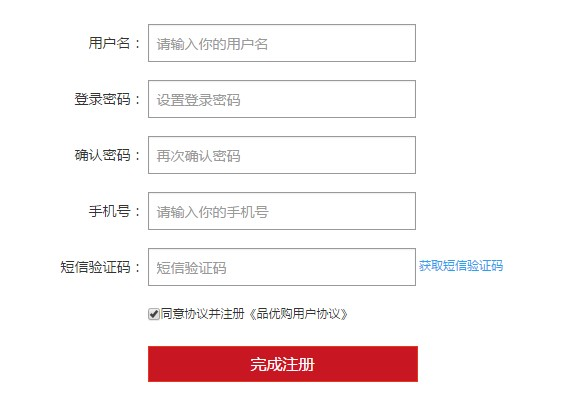

### 4.2. 用户服务层与用户表现层-工程搭建

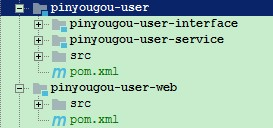

#### 4.2.1. pinyougou-user聚合模块

创建maven项目pinyougou-user，使用pom类型。修改pom.xml配置

```xml
<?xml version="1.0" encoding="UTF-8"?>
<project xmlns="http://maven.apache.org/POM/4.0.0"
         xmlns:xsi="http://www.w3.org/2001/XMLSchema-instance"
         xsi:schemaLocation="http://maven.apache.org/POM/4.0.0
         http://maven.apache.org/xsd/maven-4.0.0.xsd">
    <parent>
        <artifactId>pinyougou-parent</artifactId>
        <groupId>com.moon</groupId>
        <version>1.0-SNAPSHOT</version>
    </parent>
    <modelVersion>4.0.0</modelVersion>
    <artifactId>pinyougou-user</artifactId>
    <packaging>pom</packaging>
    <name>pinyougou-user</name>

    <build>
        <plugins>
            <!-- 配置tomcat插件 -->
            <plugin>
                <groupId>org.apache.tomcat.maven</groupId>
                <artifactId>tomcat7-maven-plugin</artifactId>
                <configuration>
                    <path>/</path>
                    <port>9005</port>
                </configuration>
            </plugin>
        </plugins>
    </build>
</project>
```

#### 4.2.2. pinyougou-user-interface服务接口层

创建maven项目，选择jar类型。修改pom.xml配置

```xml
<?xml version="1.0" encoding="UTF-8"?>
<project xmlns="http://maven.apache.org/POM/4.0.0"
         xmlns:xsi="http://www.w3.org/2001/XMLSchema-instance"
         xsi:schemaLocation="http://maven.apache.org/POM/4.0.0
         http://maven.apache.org/xsd/maven-4.0.0.xsd">
    <parent>
        <artifactId>pinyougou-user</artifactId>
        <groupId>com.moon</groupId>
        <version>1.0-SNAPSHOT</version>
    </parent>
    <modelVersion>4.0.0</modelVersion>
    <artifactId>pinyougou-user-interface</artifactId>
    <packaging>jar</packaging>
    <name>pinyougou-user-interface</name>

    <!-- 配置依赖关系 -->
    <dependencies>
        <dependency>
            <groupId>com.moon</groupId>
            <artifactId>pinyougou-pojo</artifactId>
            <version>${project.version}</version>
        </dependency>
    </dependencies>
</project>
```

#### 4.2.3. pinyougou-user-service服务实现层

- 创建maven项目，选择war类型。修改pom.xml配置

```xml
<?xml version="1.0" encoding="UTF-8"?>
<project xmlns="http://maven.apache.org/POM/4.0.0"
         xmlns:xsi="http://www.w3.org/2001/XMLSchema-instance"
         xsi:schemaLocation="http://maven.apache.org/POM/4.0.0
         http://maven.apache.org/xsd/maven-4.0.0.xsd">
    <parent>
        <artifactId>pinyougou-user</artifactId>
        <groupId>com.moon</groupId>
        <version>1.0-SNAPSHOT</version>
    </parent>
    <modelVersion>4.0.0</modelVersion>
    <artifactId>pinyougou-user-service</artifactId>
    <packaging>war</packaging>
    <name>pinyougou-user-service</name>

    <dependencies>
        <!-- 日志 -->
        <dependency>
            <groupId>org.slf4j</groupId>
            <artifactId>slf4j-log4j12</artifactId>
        </dependency>
        <!-- spring -->
        <dependency>
            <groupId>org.springframework</groupId>
            <artifactId>spring-web</artifactId>
        </dependency>
        <!-- dubbo相关 -->
        <dependency>
            <groupId>com.alibaba</groupId>
            <artifactId>dubbo</artifactId>
        </dependency>
        <dependency>
            <groupId>org.apache.zookeeper</groupId>
            <artifactId>zookeeper</artifactId>
        </dependency>
        <dependency>
            <groupId>com.github.sgroschupf</groupId>
            <artifactId>zkclient</artifactId>
        </dependency>
        <!-- pinyougou-mapper -->
        <dependency>
            <groupId>com.moon</groupId>
            <artifactId>pinyougou-mapper</artifactId>
            <version>${project.version}</version>
        </dependency>
        <!-- pinyougou-user-interface -->
        <dependency>
            <groupId>com.moon</groupId>
            <artifactId>pinyougou-user-interface</artifactId>
            <version>${project.version}</version>
        </dependency>
        <!-- pinyougou-common -->
        <dependency>
            <groupId>com.moon</groupId>
            <artifactId>pinyougou-common</artifactId>
            <version>${project.version}</version>
        </dependency>
        <!-- activemq-client -->
        <dependency>
            <groupId>org.apache.activemq</groupId>
            <artifactId>activemq-client</artifactId>
        </dependency>
        <!-- spring-jms -->
        <dependency>
            <groupId>org.springframework</groupId>
            <artifactId>spring-jms</artifactId>
        </dependency>
    </dependencies>

</project>
```

- 修改web.xml，配置spring的核心监听器

```xml
<?xml version="1.0" encoding="UTF-8"?>
<web-app xmlns:xsi="http://www.w3.org/2001/XMLSchema-instance"
         xmlns="http://java.sun.com/xml/ns/javaee"
         xsi:schemaLocation="http://java.sun.com/xml/ns/javaee
         http://java.sun.com/xml/ns/javaee/web-app_3_0.xsd"
         version="3.0">

    <!-- 配置Spring加载文件 -->
    <context-param>
        <param-name>contextConfigLocation</param-name>
        <param-value>classpath:applicationContext*.xml</param-value>
    </context-param>
    <!-- 配置Spring的核心监听器 -->
    <listener>
        <listener-class>org.springframework.web.context.ContextLoaderListener</listener-class>
    </listener>

</web-app>
```

- 提供Spring 配置文件applicationContext-service.xml

```xml
<?xml version="1.0" encoding="utf-8"?>
<beans xmlns="http://www.springframework.org/schema/beans"
       xmlns:xsi="http://www.w3.org/2001/XMLSchema-instance"
       xmlns:dubbo="http://code.alibabatech.com/schema/dubbo"
       xsi:schemaLocation="http://www.springframework.org/schema/beans
                  http://www.springframework.org/schema/beans/spring-beans.xsd
                  http://code.alibabatech.com/schema/dubbo
                  http://code.alibabatech.com/schema/dubbo/dubbo.xsd">

    <!-- 导入数据访问配置文件 -->
    <import resource="classpath:applicationContext-mapper.xml"/>
    <!-- 配置导入common模块中的Redis配置文件 -->
    <import resource="classpath:applicationContext-redis.xml"/>

    <!--####### 配置dubbo服务提供者 #######-->
    <!-- 配置当前应用的名称 -->
    <dubbo:application name="pinyougou-user-service"/>
    <!-- 配置zookeeper作为注册中心，注册服务地址 -->
    <dubbo:registry protocol="zookeeper" address="192.168.12.131:2181"/>
    <!-- 用dubbo协议在20883端口暴露服务  -->
    <dubbo:protocol name="dubbo" port="20883"/>
    <!-- 配置采用包扫描来暴露服务 -->
    <dubbo:annotation package="com.pinyougou.user.service.impl"/>

</beans>
```

- 创建log4j.properties文件

#### 4.2.4. pinyougou-user-web表现层

- 创建war工程，将注册功能放入此工程。修改pom.xml配置文件，引入相关依赖

```xml
<?xml version="1.0" encoding="UTF-8"?>
<project xmlns="http://maven.apache.org/POM/4.0.0"
         xmlns:xsi="http://www.w3.org/2001/XMLSchema-instance"
         xsi:schemaLocation="http://maven.apache.org/POM/4.0.0
         http://maven.apache.org/xsd/maven-4.0.0.xsd">
    <parent>
        <artifactId>pinyougou-parent</artifactId>
        <groupId>com.moon</groupId>
        <version>1.0-SNAPSHOT</version>
    </parent>
    <modelVersion>4.0.0</modelVersion>
    <artifactId>pinyougou-user-web</artifactId>
    <packaging>war</packaging>
    <name>pinyougou-user-web</name>

    <!-- 配置依赖关系 -->
    <dependencies>
        <!-- JSON处理工具包 -->
        <dependency>
            <groupId>com.alibaba</groupId>
            <artifactId>fastjson</artifactId>
        </dependency>
        <!-- servlet-api -->
        <dependency>
            <groupId>org.apache.tomcat.embed</groupId>
            <artifactId>tomcat-embed-core</artifactId>
            <scope>provided</scope>
        </dependency>
        <!-- 日志 -->
        <dependency>
            <groupId>org.slf4j</groupId>
            <artifactId>slf4j-log4j12</artifactId>
        </dependency>
        <!-- apache工具组件 -->
        <dependency>
            <groupId>org.apache.commons</groupId>
            <artifactId>commons-lang3</artifactId>
        </dependency>
        <!-- spring4 -->
        <dependency>
            <groupId>org.springframework</groupId>
            <artifactId>spring-webmvc</artifactId>
        </dependency>
        <!-- dubbo -->
        <dependency>
            <groupId>com.alibaba</groupId>
            <artifactId>dubbo</artifactId>
        </dependency>
        <!-- zookeeper分布式协调服务 -->
        <dependency>
            <groupId>org.apache.zookeeper</groupId>
            <artifactId>zookeeper</artifactId>
        </dependency>
        <!-- zkclient(zookeeper客户端) -->
        <dependency>
            <groupId>com.github.sgroschupf</groupId>
            <artifactId>zkclient</artifactId>
        </dependency>
        <!-- 加密解密 -->
        <dependency>
            <groupId>commons-codec</groupId>
            <artifactId>commons-codec</artifactId>
        </dependency>
        <!-- pinyougou-common -->
        <dependency>
            <groupId>com.moon</groupId>
            <artifactId>pinyougou-common</artifactId>
            <version>${project.version}</version>
        </dependency>
        <!-- pinyougou-user-interface -->
        <dependency>
            <groupId>com.moon</groupId>
            <artifactId>pinyougou-user-interface</artifactId>
            <version>${project.version}</version>
        </dependency>
    </dependencies>

    <!-- 构建部分 -->
    <build>
        <plugins>
            <!-- 配置tomcat插件 -->
            <plugin>
                <groupId>org.apache.tomcat.maven</groupId>
                <artifactId>tomcat7-maven-plugin</artifactId>
                <configuration>
                    <port>9106</port>
                    <path>/</path>
                </configuration>
            </plugin>
        </plugins>
    </build>

</project>
```

- 修改web.xml，配置Spring MVC前端控制器(核心控制器)

```xml
<?xml version="1.0" encoding="UTF-8"?>
<web-app xmlns:xsi="http://www.w3.org/2001/XMLSchema-instance"
         xmlns="http://java.sun.com/xml/ns/javaee"
         xsi:schemaLocation="http://java.sun.com/xml/ns/javaee
         http://java.sun.com/xml/ns/javaee/web-app_3_0.xsd" version="3.0">

    <!-- 配置Spring MVC前端控制器(核心控制器) -->
    <servlet>
        <servlet-name>pinyougou-user-web</servlet-name>
        <servlet-class>org.springframework.web.servlet.DispatcherServlet</servlet-class>
        <init-param>
            <param-name>contextConfigLocation</param-name>
            <param-value>
                classpath:pinyougou-user-web-servlet.xml
            </param-value>
        </init-param>
        <load-on-startup>1</load-on-startup>
    </servlet>
    <servlet-mapping>
        <servlet-name>pinyougou-user-web</servlet-name>
        <url-pattern>/</url-pattern>
    </servlet-mapping>

    <!-- 配置全局编码过滤器 -->
    <filter>
        <filter-name>characterEncodingFilter</filter-name>
        <filter-class>org.springframework.web.filter.CharacterEncodingFilter</filter-class>
        <init-param>
            <param-name>encoding</param-name>
            <param-value>UTF-8</param-value>
        </init-param>
    </filter>
    <filter-mapping>
        <filter-name>characterEncodingFilter</filter-name>
        <url-pattern>/*</url-pattern>
    </filter-mapping>

    <!-- 欢迎列表 -->
    <welcome-file-list>
        <welcome-file>index.html</welcome-file>
    </welcome-file-list>

</web-app>
```

- 创建pinyougou-user-web-servlet.xml文件，配置dubbo服务消费者

```xml
<?xml version="1.0" encoding="utf-8"?>
<beans xmlns="http://www.springframework.org/schema/beans"
       xmlns:xsi="http://www.w3.org/2001/XMLSchema-instance"
       xmlns:mvc="http://www.springframework.org/schema/mvc"
       xmlns:dubbo="http://code.alibabatech.com/schema/dubbo"
       xsi:schemaLocation="http://www.springframework.org/schema/beans
                  http://www.springframework.org/schema/beans/spring-beans.xsd
                  http://www.springframework.org/schema/mvc
                  http://www.springframework.org/schema/mvc/spring-mvc.xsd
                  http://code.alibabatech.com/schema/dubbo
                  http://code.alibabatech.com/schema/dubbo/dubbo.xsd">

    <!-- 开启MVC注解驱动 -->
    <mvc:annotation-driven>
        <!-- 配置消息转换 -->
        <mvc:message-converters>
            <!-- 配置用fastjson做为json处理框架 -->
            <bean class="com.alibaba.fastjson.support.spring.FastJsonHttpMessageConverter">
                <!-- 配置支持的类型 -->
                <property name="supportedMediaTypes"
                          value="application/json;charset=UTF-8"/>
            </bean>
        </mvc:message-converters>
    </mvc:annotation-driven>

    <!-- 配置静态资源用WEB容器默认的servlet来处理 -->
    <mvc:default-servlet-handler/>

    <!-- ############## 配置dubbo服务消费者 ############## -->
    <!-- 配置当前应用的名称 -->
    <dubbo:application name="pinyougou-user-web"/>
    <!-- 配置注册中心，注册服务 -->
    <dubbo:registry address="zookeeper://192.168.12.131:2181"/>
    <!-- 配置引用服务，产生服务接口的代理对象(采用包扫描)-->
    <dubbo:annotation package="com.pinyougou.user.controller"/>

</beans>
```

- 创建log4j.properties
- 拷贝【资料\用户中心静态资源】到pinyougou-user-web的webapp目录

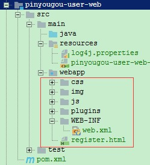

### 4.3. 配置域名访问

- 修改pinyougou-user-web工程web.xml文件

```xml
<!-- 欢迎列表 -->
<welcome-file-list>
    <welcome-file>register.html</welcome-file>
</welcome-file-list>
```

- 修改hosts文件：`127.0.0.1  user.moon.com`
- 修改Nginx的nginx.conf配置反向代理

```conf
server {
	listen       80;
	server_name  user.moon.com;

	proxy_set_header X-Forwarded-Host $host;
	proxy_set_header X-Forwarded-Server $host;

	location / {
		   proxy_pass http://127.0.0.1:9106;
		   proxy_connect_timeout 600;
		   proxy_read_timeout 600;
	}
}
```

启动：pinyougou-sms、pinyougou-user、pinyougou-user-web三个项目
访问地址：http://user.moon.com，可访问用户注册页面

### 4.4. 基本注册功能（无发送短信获取验证码）

#### 4.4.1. 用户服务接口

- 创建pinyougou-user-interface用户服务接口UserService与pinyougou-user-service实现类UserServiceImpl

```java
/**
 * 用户服务接口
 */
public interface UserService {

    /**
     * 添加（注册）用户
     *
     * @param user 用户实体对象
     */
    void saveUser(User user);
}

/**
 * 用户服务接口实现类
 */
@Service(interfaceName = "com.pinyougou.user.service.UserService")
@Transactional(readOnly = false, rollbackFor = RuntimeException.class)
public class UserServiceImpl implements UserService {

    /* 注入用户数据访问层mapper */
    @Autowired
    private UserMapper userMapper;

    @Override
    public void saveUser(User user) {
        try {
            // 设置创建日期
            user.setCreated(new Date());
            // 设置修改日期
            user.setUpdated(user.getCreated());
            // 设置用户密码MD5加密
            user.setPassword(DigestUtils.md5Hex(user.getPassword()));
            // 调用用户mapper保存用户
            userMapper.insertSelective(user);
        } catch (Exception e) {
            e.printStackTrace();
            throw new RuntimeException(e);
        }
    }

}
```

#### 4.4.2. 用户控制层

修改pinyougou-user-web的UserController.java，增加添加用户的方法

```java
/**
 * 用户控制器
 */
@RestController
@RequestMapping("/user")
public class UserController {

    /* 注入用户服务 */
    @Reference(timeout = 10000)
    private UserService userService;

    /**
     * 添加（注册）用户
     *
     * @param user 用户实体
     * @return 成功/失败标识
     */
    @PostMapping("/save")
    public boolean saveUser(@RequestBody User user) {
        try {
            // 调用服务接口保存用户的方法
            userService.saveUser(user);
            return true;
        } catch (Exception e) {
            e.printStackTrace();
        }
        return false;
    }

}
```

#### 4.4.3. 用户前端控制器

- 从其他模块中复制base.js、base-pagination.js、baseService.js、baseController.js，创建userController.js，增加添加用户的js方法

```js
/* 定义用户控制器层 */
app.controller('userController', function ($scope, baseService) {
    /* 定义用户对象 */
    $scope.user = {};
    /* 定义保存（注册）用户的方法 */
    $scope.save = () => {
        // 进行前端的表单的校验
        if ($scope.user.password != $scope.password) {
            alert("密码不一致，请重新输入！");
            return;
        }

        // 调用服务层post请求方法
        baseService.sendPost('/user/save', $scope.user).then(response => {
            if (response.data) {
                alert("注册成功！");
                // 重置用户对象
                $scope.user = {};
                $scope.password = '';
            } else {
                alert("注册失败！");
            }
        });
    };
});
```

#### 4.4.4. 修改用户中心前端页面

- 修改页面register.html，引入js

```html
<!-- 引入angularjs框架 -->
<script src="/plugins/angularjs/angular.min.js"></script>
<!-- 导入angular框架mvc分层后的js文件start -->
<script src="/js/base.js"></script>
<script src="/js/service/baseService.js"></script>
<script src="/js/controller/userController.js"></script>
<!-- 导入angular框架mvc分层后的js文件end -->
```

- 初始化指令

```html
<body ng-app="pinyougou" ng-controller="userController">
```

- 绑定表单

```html
<form class="sui-form form-horizontal">
    <div class="control-group">
        <label class="control-label">用户名：</label>
        <div class="controls">
            <input type="text" placeholder="请输入你的用户名"
                    ng-model="user.username"
                    class="input-xfat input-xlarge">
        </div>
    </div>
	<div class="control-group">
		<label class="control-label">登录密码：</label>
		<div class="controls">
			<input type="password" placeholder="设置登录密码"
                   ng-model="user.password"
                   class="input-xfat input-xlarge">
		</div>
	</div>
	<div class="control-group">
		<label class="control-label">确认密码：</label>
		<div class="controls">
			<input type="password" placeholder="再次确认密码"
			        ng-model="password"
                   class="input-xfat input-xlarge">
		</div>
	</div>

	<div class="control-group">
		<label class="control-label">手机号：</label>
		<div class="controls">
			<input type="text" placeholder="请输入你的手机号"
                   ng-model="user.phone"
                   class="input-xfat input-xlarge">
		</div>
	</div>
	<div class="control-group">
		<label class="control-label">短信验证码：</label>
		<div class="controls">
			<input type="text" placeholder="短信验证码" class="input-xfat input-xlarge">  <a href="#">获取短信验证码</a>
		</div>
	</div>

	<div class="control-group">
		<label class="control-label">&nbsp;&nbsp;&nbsp;&nbsp;&nbsp;&nbsp;</label>
		<div class="controls">
			<input name="m1" type="checkbox" value="2" checked=""><span>同意协议并注册《品优购用户协议》</span>
		</div>
	</div>
	<div class="control-group">
		<label class="control-label"></label>
		<div class="controls btn-reg">
			<a class="sui-btn btn-block btn-xlarge btn-danger"
               ng-click="save();">完成注册</a>
		</div>
	</div>
</form>
```

### 4.5. 注册判断短信验证码

#### 4.5.1. 实现思路

点击页面上的“获取短信验证码”连接，向后端传递手机号。后端随机生成6位数字作为短信验证码，将其保存在redis中（手机号作为KEY），并发送到短信网关。

用户注册时，后端根据手机号查询redis中的验证码与用户填写的验证码是否相同，如果不同则提示用户不能注册。

#### 4.5.2. 发送验证码

- 修改pinyougou-user服务工程UserService接口与UserServiceImpl实现类，增加sendSmsCode()方法，发送消息调用发送短信微服务

```java
/**
 * 发送短信验证码
 *
 * @param phone 用户注册手机号
 */
void sendSmsCode(String phone);

/* 注入redis模版操作对象 */
@Autowired
private RedisTemplate<String, String> redisTemplate;
@Override
public void sendSmsCode(String phone) {
    try {
        // 生成6位随机数
        String code = UUID.randomUUID().toString().replaceAll("-", "")
                .replaceAll("[a-z|A-Z]", "").substring(0, 6);
        System.out.println("生成的6位随机数:" + code);

        // 发送消息ActiveMQ中间件，用来发送短信(暂无)

        // 将验证码存入Redis中(设置有效时间90秒)
        redisTemplate.boundValueOps(phone).set(code, 90, TimeUnit.SECONDS);
    } catch (Exception e) {
        e.printStackTrace();
        throw new RuntimeException(e);
    }
}
```

- 修改pinyougou-user-web的UserController，增加发送验证码方法

```java
/**
 * 发送短信验证码
 *
 * @param phone 用户手机字符串
 * @return 成功/失败标识
 */
@GetMapping("/sendCode")
public boolean sendCode(String phone) {
    try {
        // 调用服务接口发送验证码
        userService.sendSmsCode(phone);
        return true;
    } catch (Exception e) {
        e.printStackTrace();
    }
    return false;
}
```

- 修改pinyougou-user-web的前端userController.js控制器，增加发送短信方法

```js
/* 定义发送短信验证码方法 */
$scope.sendCode = () => {
    // 判断手机号码
    if ($scope.user.phone) {
        // 手机不空，发送请求获取验证码
        baseService.sendGet('/user/sendCode?phone=' + $scope.user.phone)
            .then(response => {
                alert(response.data ? "验证码发送成功！" : "验证码发送失败！");
            });
    } else {
        alert("请输入手机号码！");
    }
};
```

- 修改页面register.html(70行)，绑定点击事件，调用发送短信方法

```html
<a href="javascript:;" ng-click="sendCode();" style="cursor:pointer">获取短信验证码</a>
```

#### 4.5.3. 用户注册检查验证码

- 修改pinyougou-user服务的UserService服务接口与UserServiceImpl实现类，增加校验验证码方法

```java
/**
 * 检查短信验证码是否正确
 *
 * @param phone 用户手机号字符串
 * @param code  用户输入的验证码
 * @return 成功/失败标识
 */
boolean checkSmsCode(String phone, String code);

@Override
public boolean checkSmsCode(String phone, String code) {
    // 获取缓存中用户手机对应的验证码
    String sysCode = redisTemplate.boundValueOps(phone).get();
    return StringUtils.isNoneBlank(code) && code.equalsIgnoreCase(sysCode);
}
```

- 修改pinyougou-user-web的UserController原有saveUser方法，增加判断验证码

```java
@PostMapping("/save")
public boolean saveUser(@RequestBody User user, String smsCode) {
    try {
        // 调用用户服务接口校验验证码
        boolean checkFlag = userService.checkSmsCode(user.getPhone(), smsCode);

        if (checkFlag) {
            // 验证码校验成功，调用服务接口保存用户的方法
            userService.saveUser(user);
            return true;
        }
    } catch (Exception e) {
        e.printStackTrace();
    }
    return false;
}
```

- 修改pinyougou-user-web的前端userController.js控制器save方法，增加用户输入的验证码

```js
$scope.save = () => {
    // 进行前端的表单的校验
    if ($scope.user.password != $scope.password) {
        alert("密码不一致，请重新输入！");
        return;
    }

    // 调用服务层post请求方法
    baseService.sendPost('/user/save?smsCode='
        + $scope.smsCode, $scope.user).then(response => {
        if (response.data) {
            alert("注册成功！");
            // 重置用户对象
            $scope.user = {};
            $scope.password = '';
            $scope.smsCode = '';
        } else {
            alert("注册失败！");
        }
    });
};
```

- 修改页面，绑定验证码变量(68行)

```html
<input type="text" placeholder="短信验证码"
       ng-model="smsCode"
       class="input-xfat input-xlarge">
```

#### 4.5.4. 短信验证码发送到手机

- pinyougou-user-service创建消息中间件配置文件applicationContext-jms.xml，注意文件不需要配置读取properties文件，因为applicationContext-service.xml中引入的applicationContext-mapper.xml中已经配置了`<context:property-placeholder location="classpath*:props/*.properties"/>`

```xml
<?xml version="1.0" encoding="utf-8"?>
<beans xmlns="http://www.springframework.org/schema/beans"
       xmlns:xsi="http://www.w3.org/2001/XMLSchema-instance"
       xsi:schemaLocation="http://www.springframework.org/schema/beans
           http://www.springframework.org/schema/beans/spring-beans.xsd">

    <!--########### 通用配置 #############-->
    <bean id="activeMQConnectionFactory"
          class="org.apache.activemq.ActiveMQConnectionFactory">
        <!-- 设置brokerURL(连接消息中间件的地址) -->
        <property name="brokerURL" value="${brokerURL}"/>
    </bean>
    <!-- 配置Spring-JMS的单例连接工厂 -->
    <bean id="singleConnectionFactory" class="org.springframework.jms.connection.SingleConnectionFactory">
        <!-- 设置ActiveMQ的连接工厂交由它管理-->
        <property name="targetConnectionFactory" ref="activeMQConnectionFactory"/>
    </bean>

    <!--########### 消息生产者配置 #############-->
    <!-- 配置JmsTemplate模版对象发送消息 -->
    <bean id="jmsTemplate" class="org.springframework.jms.core.JmsTemplate">
        <!-- 设置连接工厂 -->
        <property name="connectionFactory" ref="singleConnectionFactory"/>
    </bean>
    <!-- 配置消息的目标(点对点)，发送短信消息 -->
    <bean id="smsQueue" class="org.apache.activemq.command.ActiveMQQueue">
        <!-- 设置队列名称 -->
        <constructor-arg value="sms"/>
    </bean>

</beans>
```

- 创建src/main/resources/props/jms.properties，配置连接消息中间件地址与发送短信的模版、签名

```properties
# 配置消息中间件的连接地址
brokerURL=tcp://192.168.12.131:61616
# 配置短信模版id
templateCode=SMS_126580621
# 配置短信签名
signName=\u51cc\u6708
```

<font color="red">注意：此处不能将jms.properties直接在resources目录下，因为applicationContext-service.xml引入了mapper层的配置`<import resource="classpath:applicationContext-mapper.xml"/>`，而mapper配置文件中引入了`<context:property-placeholder location="classpath*:props/*.properties"/>`</font>

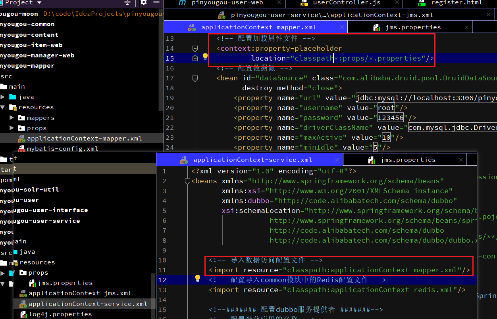

- 修改pinyougou-user-service的UserServiceImpl原有的sendSmsCode()方法，增加发送短信消息部分

```java
/* 注入jms模版操作对象 */
@Autowired
private JmsTemplate jmsTemplate;
/* 注入消息目标 */
@Autowired
private Destination smsQueue;
/* 读取配置文件，获取发送信息配置内容 */
@Value("${templateCode}")
private String templateCode;
@Value("${signName}")
private String signName;

@Override
public void sendSmsCode(String phone) {
    try {
        // 生成6位随机数
        String code = UUID.randomUUID().toString().replaceAll("-", "")
                .replaceAll("[a-z|A-Z]", "").substring(0, 6);
        System.out.println("生成的6位随机数:" + code);

        // 发送消息ActiveMQ中间件，用于发送短信
        jmsTemplate.send(smsQueue, new MessageCreator() {
            @Override
            public Message createMessage(Session session) throws JMSException {
                // 创建map对象信息对象，封装相关发送短信的数据
                MapMessage mapMessage = session.createMapMessage();
                mapMessage.setString("phoneNum", phone);
                mapMessage.setString("templateCode", templateCode);
                mapMessage.setString("signName", signName);
                mapMessage.setString("message", "{\"code\" : \"" + code + "\"}");
                return mapMessage;
            }
        });

        // 将验证码存入Redis中(设置有效时间90秒)
        redisTemplate.boundValueOps(phone).set(code, 90, TimeUnit.SECONDS);
    } catch (Exception e) {
        e.printStackTrace();
        throw new RuntimeException(e);
    }
}
```

#### 4.5.5. properties文件值为中文时，编码转换的方法

当properties文件属性是中文时，会存在乱码的问题

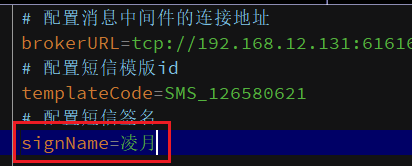

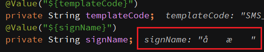

<font color="purple">***解决方法1：使用jdk自带的`native2ascii`命令，将中文转换后再复制到properties文件中***</font>

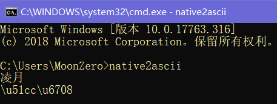

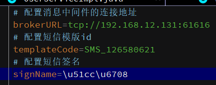
