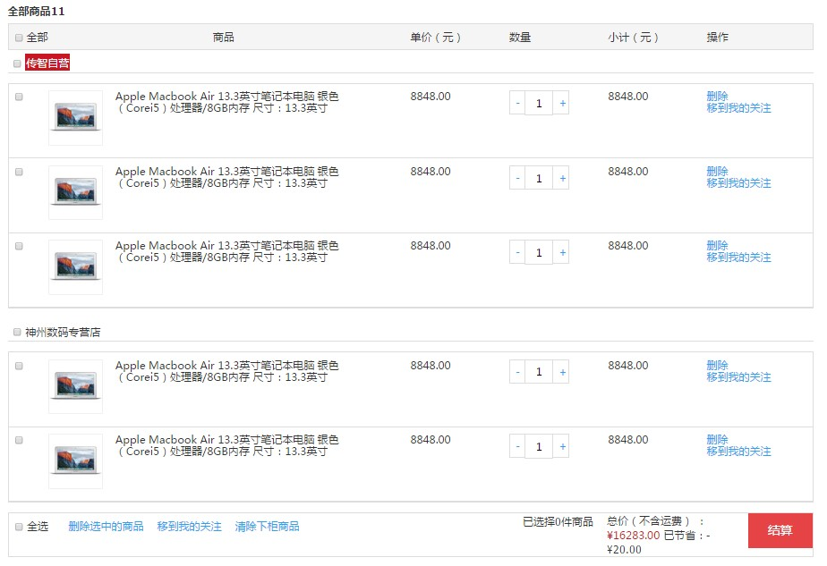
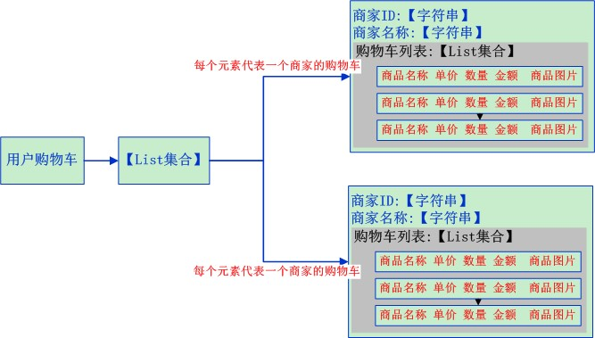

# Day17 购物车解决方案&子系统集成CAS

## 1. 购物车需求分析与解决方案

### 1.1. 需求分析

用户在商品详细页点击加入购物车，提交商品SKU编号和购买数量，添加到购物车。购物车展示页面如下



### 1.2. 实现思路

购物车数据的存储结构如下



**当用户在未登录的情况下，将此购物车存入Cookie, 在用户登录的情况下，将购物车数据存入redis。如果用户登录时，Cookie中存在购物车，需要将Cookie的购物车合并到redis中存储。**

### 1.3. 购物车工程搭建

- pinyougou-cart：聚合父模块工程，打包方式采用pom
    - pinyougou-cart-interface：服务接口模块工程，打包方式采用jar
    - pinyougou-cart-service：服务实现模块工程，打包方式采用war
- pinyougou-cart-web：表现层模块工程，打包方式采用war

#### 1.3.1. pinyougou-cart聚合模块

- pom.xml配置文件

```xml
<?xml version="1.0" encoding="UTF-8"?>
<project xmlns="http://maven.apache.org/POM/4.0.0"
         xmlns:xsi="http://www.w3.org/2001/XMLSchema-instance"
         xsi:schemaLocation="http://maven.apache.org/POM/4.0.0
         http://maven.apache.org/xsd/maven-4.0.0.xsd">
    <parent>
        <artifactId>pinyougou-parent</artifactId>
        <groupId>com.moon</groupId>
        <version>1.0-SNAPSHOT</version>
    </parent>
    <modelVersion>4.0.0</modelVersion>
    <artifactId>pinyougou-cart</artifactId>
    <packaging>pom</packaging>
    <name>pinyougou-cart</name>
    <build>
        <plugins>
            <!-- 配置tomcat插件 -->
            <plugin>
                <groupId>org.apache.tomcat.maven</groupId>
                <artifactId>tomcat7-maven-plugin</artifactId>
                <configuration>
                    <path>/</path>
                    <port>9006</port>
                </configuration>
            </plugin>
        </plugins>
    </build>
</project>
```

#### 1.3.2. pinyougou-cart-interface服务接口

- pom.xml文件，配置pojo工程的依赖

```xml
<?xml version="1.0" encoding="UTF-8"?>
<project xmlns="http://maven.apache.org/POM/4.0.0"
         xmlns:xsi="http://www.w3.org/2001/XMLSchema-instance"
         xsi:schemaLocation="http://maven.apache.org/POM/4.0.0
         http://maven.apache.org/xsd/maven-4.0.0.xsd">
    <parent>
        <artifactId>pinyougou-cart</artifactId>
        <groupId>com.moon</groupId>
        <version>1.0-SNAPSHOT</version>
    </parent>
    <modelVersion>4.0.0</modelVersion>
    <artifactId>pinyougou-cart-interface</artifactId>
    <packaging>jar</packaging>
    <name>pinyougou-cart-interface</name>

    <!-- 配置依赖关系 -->
    <dependencies>
        <!-- pinyougou-pojo -->
        <dependency>
            <groupId>com.moon</groupId>
            <artifactId>pinyougou-pojo</artifactId>
            <version>${project.version}</version>
        </dependency>
    </dependencies>
</project>
```

#### 1.3.3. pinyougou-cart-service服务实现层

- pom.xml文件，配置相关依赖

```xml
<?xml version="1.0" encoding="UTF-8"?>
<project xmlns="http://maven.apache.org/POM/4.0.0"
         xmlns:xsi="http://www.w3.org/2001/XMLSchema-instance"
         xsi:schemaLocation="http://maven.apache.org/POM/4.0.0
         http://maven.apache.org/xsd/maven-4.0.0.xsd">
    <parent>
        <artifactId>pinyougou-cart</artifactId>
        <groupId>com.moon</groupId>
        <version>1.0-SNAPSHOT</version>
    </parent>
    <modelVersion>4.0.0</modelVersion>
    <artifactId>pinyougou-cart-service</artifactId>
    <packaging>war</packaging>
    <name>pinyougou-cart-service</name>

    <dependencies>
        <!-- 日志 -->
        <dependency>
            <groupId>org.slf4j</groupId>
            <artifactId>slf4j-log4j12</artifactId>
        </dependency>
        <!-- spring -->
        <dependency>
            <groupId>org.springframework</groupId>
            <artifactId>spring-web</artifactId>
        </dependency>
        <!-- dubbo相关 -->
        <dependency>
            <groupId>com.alibaba</groupId>
            <artifactId>dubbo</artifactId>
        </dependency>
        <dependency>
            <groupId>org.apache.zookeeper</groupId>
            <artifactId>zookeeper</artifactId>
        </dependency>
        <dependency>
            <groupId>com.github.sgroschupf</groupId>
            <artifactId>zkclient</artifactId>
        </dependency>
        <!-- pinyougou-mapper -->
        <dependency>
            <groupId>com.moon</groupId>
            <artifactId>pinyougou-mapper</artifactId>
            <version>${project.version}</version>
        </dependency>
        <!-- pinyougou-common -->
        <dependency>
            <groupId>com.moon</groupId>
            <artifactId>pinyougou-common</artifactId>
            <version>${project.version}</version>
        </dependency>
        <!-- pinyougou-cart-interface -->
        <dependency>
            <groupId>com.moon</groupId>
            <artifactId>pinyougou-cart-interface</artifactId>
            <version>${project.version}</version>
        </dependency>
    </dependencies>
</project>
```

- web.xml，配置spring核心监听器，与加载配置文件

```xml
<?xml version="1.0" encoding="UTF-8"?>
<web-app xmlns:xsi="http://www.w3.org/2001/XMLSchema-instance"
         xmlns="http://java.sun.com/xml/ns/javaee"
         xsi:schemaLocation="http://java.sun.com/xml/ns/javaee
         http://java.sun.com/xml/ns/javaee/web-app_3_0.xsd" version="3.0">

    <!-- 配置Spring加载文件 -->
    <context-param>
        <param-name>contextConfigLocation</param-name>
        <param-value>classpath:applicationContext*.xml</param-value>
    </context-param>
    <!-- 配置Spring的核心监听器 -->
    <listener>
        <listener-class>org.springframework.web.context.ContextLoaderListener</listener-class>
    </listener>

</web-app>
```

- 创建applicationContext-service.xml文件，配置dubbo服务提供者，暴露服务`port="20884"`

```xml
<?xml version="1.0" encoding="utf-8"?>
<beans xmlns="http://www.springframework.org/schema/beans"
       xmlns:xsi="http://www.w3.org/2001/XMLSchema-instance"
       xmlns:dubbo="http://code.alibabatech.com/schema/dubbo"
       xsi:schemaLocation="http://www.springframework.org/schema/beans
                  http://www.springframework.org/schema/beans/spring-beans.xsd
                  http://code.alibabatech.com/schema/dubbo
                  http://code.alibabatech.com/schema/dubbo/dubbo.xsd">

    <!-- 导入数据访问配置文件 -->
    <import resource="classpath:applicationContext-mapper.xml"/>
    <!-- 配置导入common模块中的Redis配置文件 -->
    <import resource="classpath:applicationContext-redis.xml"/>

    <!--####### 配置dubbo服务提供者 #######-->
    <!-- 配置当前应用的名称 -->
    <dubbo:application name="pinyougou-cart-service"/>
    <!-- 配置zookeeper作为注册中心，注册服务地址 -->
    <dubbo:registry protocol="zookeeper" address="192.168.12.131:2181"/>
    <!-- 用dubbo协议在20884端口暴露服务  -->
    <dubbo:protocol name="dubbo" port="20884"/>
    <!-- 配置采用包扫描来暴露服务 -->
    <dubbo:annotation package="com.pinyougou.cart.service.impl"/>

</beans>
```

- 创建log4j.properties文件

#### 1.3.4. pinyougou-cart-web表现层

- 配置pom.xml文件，配置相关依赖（包括单点登陆CAS客户端依赖），配置端口9108

```xml
<?xml version="1.0" encoding="UTF-8"?>
<project xmlns="http://maven.apache.org/POM/4.0.0"
         xmlns:xsi="http://www.w3.org/2001/XMLSchema-instance"
         xsi:schemaLocation="http://maven.apache.org/POM/4.0.0
         http://maven.apache.org/xsd/maven-4.0.0.xsd">
    <parent>
        <artifactId>pinyougou-parent</artifactId>
        <groupId>com.moon</groupId>
        <version>1.0-SNAPSHOT</version>
    </parent>
    <modelVersion>4.0.0</modelVersion>
    <artifactId>pinyougou-cart-web</artifactId>
    <packaging>war</packaging>
    <name>pinyougou-cart-web</name>

    <!-- 配置依赖关系 -->
    <dependencies>
        <!-- servlet-api -->
        <dependency>
            <groupId>org.apache.tomcat.embed</groupId>
            <artifactId>tomcat-embed-core</artifactId>
            <scope>provided</scope>
        </dependency>
        <!-- 日志 -->
        <dependency>
            <groupId>org.slf4j</groupId>
            <artifactId>slf4j-log4j12</artifactId>
        </dependency>
        <!-- JSON处理工具包 -->
        <dependency>
            <groupId>com.alibaba</groupId>
            <artifactId>fastjson</artifactId>
        </dependency>
        <!-- apache工具组件 -->
        <dependency>
            <groupId>org.apache.commons</groupId>
            <artifactId>commons-lang3</artifactId>
        </dependency>
        <!-- spring4 -->
        <dependency>
            <groupId>org.springframework</groupId>
            <artifactId>spring-webmvc</artifactId>
        </dependency>
        <!-- dubbo -->
        <dependency>
            <groupId>com.alibaba</groupId>
            <artifactId>dubbo</artifactId>
        </dependency>
        <!-- zookeeper分布式协调服务 -->
        <dependency>
            <groupId>org.apache.zookeeper</groupId>
            <artifactId>zookeeper</artifactId>
        </dependency>
        <!-- zkclient(zookeeper客户端) -->
        <dependency>
            <groupId>com.github.sgroschupf</groupId>
            <artifactId>zkclient</artifactId>
        </dependency>
        <!-- pinyougou-cart-interface -->
        <dependency>
            <groupId>com.moon</groupId>
            <artifactId>pinyougou-cart-interface</artifactId>
            <version>${project.version}</version>
        </dependency>
        <!-- pinyougou-common -->
        <dependency>
            <groupId>com.moon</groupId>
            <artifactId>pinyougou-common</artifactId>
            <version>${project.version}</version>
        </dependency>
        <!-- cas-client-core -->
        <dependency>
            <groupId>org.jasig.cas.client</groupId>
            <artifactId>cas-client-core</artifactId>
        </dependency>
    </dependencies>
    <!-- 构建部分 -->
    <build>
        <plugins>
            <!-- 配置tomcat插件 -->
            <plugin>
                <groupId>org.apache.tomcat.maven</groupId>
                <artifactId>tomcat7-maven-plugin</artifactId>
                <configuration>
                    <port>9108</port>
                    <path>/</path>
                </configuration>
            </plugin>
        </plugins>
    </build>

</project>
```

- 配置web.xml文件，配置配置Spring MVC核心控制器、全局编码过滤器、**CAS单点登录客户端配置**。（*参考pyg-test里的casclient01客户端项目配置，不同的地方是需要配置有些资源不需要拦截。*）

```xml
<?xml version="1.0" encoding="UTF-8"?>
<web-app xmlns:xsi="http://www.w3.org/2001/XMLSchema-instance"
         xmlns="http://java.sun.com/xml/ns/javaee"
         xsi:schemaLocation="http://java.sun.com/xml/ns/javaee
         http://java.sun.com/xml/ns/javaee/web-app_3_0.xsd" version="3.0">

    <!-- 配置Spring MVC前端控制器(核心控制器) -->
    <servlet>
        <servlet-name>pinyougou-cart-web</servlet-name>
        <servlet-class>org.springframework.web.servlet.DispatcherServlet</servlet-class>
        <init-param>
            <param-name>contextConfigLocation</param-name>
            <param-value>classpath:pinyougou-cart-web-servlet.xml</param-value>
        </init-param>
        <load-on-startup>1</load-on-startup>
    </servlet>
    <servlet-mapping>
        <servlet-name>pinyougou-cart-web</servlet-name>
        <url-pattern>/</url-pattern>
    </servlet-mapping>

    <!-- 配置全局编码过滤器 -->
    <filter>
        <filter-name>characterEncodingFilter</filter-name>
        <filter-class>org.springframework.web.filter.CharacterEncodingFilter</filter-class>
        <init-param>
            <param-name>encoding</param-name>
            <param-value>UTF-8</param-value>
        </init-param>
    </filter>
    <filter-mapping>
        <filter-name>characterEncodingFilter</filter-name>
        <url-pattern>/*</url-pattern>
    </filter-mapping>

    <!--############## CAS单点登录配置-begin ################-->
    <!-- 配置单点退出过滤器 (可选配置) -->
    <filter>
        <filter-name>ssoutFilter</filter-name>
        <filter-class>org.jasig.cas.client.session.SingleSignOutFilter</filter-class>
        <!-- 配置CAS服务URL前缀 -->
        <init-param>
            <param-name>casServerUrlPrefix</param-name>
            <param-value>http://sso.moon.com</param-value>
        </init-param>
    </filter>
    <filter-mapping>
        <filter-name>ssoutFilter</filter-name>
        <url-pattern>/*</url-pattern>
    </filter-mapping>

    <!-- 配置身份认证过滤器(必须启用)(注：此部分拦截不需要跳转到CAS登录系统) -->
    <filter>
        <filter-name>anonAuthenticationFilter</filter-name>
        <filter-class>org.jasig.cas.client.authentication.AuthenticationFilter</filter-class>
        <init-param>
            <!-- 配置CAS服务端登录地址 -->
            <param-name>casServerLoginUrl</param-name>
            <param-value>http://sso.moon.com</param-value>
        </init-param>
        <init-param>
            <!-- 配置服务名称 -->
            <param-name>serverName</param-name>
            <param-value>http://cart.moon.com</param-value>
        </init-param>
        <!-- 配置“gateway=true”时，启用异步方式认证 -->
        <init-param>
            <param-name>gateway</param-name>
            <param-value>true</param-value>
        </init-param>
    </filter>
    <filter-mapping>
        <filter-name>anonAuthenticationFilter</filter-name>
        <!-- 只拦截html页面，即购物车页面不需要登录，查看订单与支付时才需要登录 -->
        <url-pattern>*.html</url-pattern>
    </filter-mapping>

    <!-- 配置身份认证过滤器(必须启用)(注：此部分拦截需要跳转到CAS登录系统) -->
    <filter>
        <filter-name>authenticationFilter</filter-name>
        <filter-class>org.jasig.cas.client.authentication.AuthenticationFilter</filter-class>
        <init-param>
            <!-- 配置CAS服务端登录地址 -->
            <param-name>casServerLoginUrl</param-name>
            <param-value>http://sso.moon.com</param-value>
        </init-param>
        <init-param>
            <!-- 配置服务名称 -->
            <param-name>serverName</param-name>
            <param-value>http://cart.moon.com</param-value>
        </init-param>
    </filter>
    <filter-mapping>
        <filter-name>authenticationFilter</filter-name>
        <!-- 只拦截order部分的页面，订单查看与支付时需要登录 -->
        <url-pattern>/order/*</url-pattern>
    </filter-mapping>

    <!-- 该过滤器负责对ticket的校验工作(必须启用) -->
    <filter>
        <filter-name>ticketValidationFilter</filter-name>
        <filter-class>org.jasig.cas.client.validation.Cas20ProxyReceivingTicketValidationFilter</filter-class>
        <!-- 配置CAS服务URL前缀 -->
        <init-param>
            <param-name>casServerUrlPrefix</param-name>
            <param-value>http://sso.moon.com</param-value>
        </init-param>
        <!-- 配置服务名称 -->
        <init-param>
            <param-name>serverName</param-name>
            <param-value>http://cart.moon.com</param-value>
        </init-param>
    </filter>
    <filter-mapping>
        <filter-name>ticketValidationFilter</filter-name>
        <url-pattern>/*</url-pattern>
    </filter-mapping>

    <!--
      配置HttpServletRequest请求包裹过滤器 (可选配置)
      说明：通过HttpServletRequest的getRemoteUser()方法获取SSO登录用户名
    -->
    <filter>
        <filter-name>httpServletRequestWrapperFilter</filter-name>
        <filter-class>org.jasig.cas.client.util.HttpServletRequestWrapperFilter</filter-class>
    </filter>
    <filter-mapping>
        <filter-name>httpServletRequestWrapperFilter</filter-name>
        <url-pattern>/*</url-pattern>
    </filter-mapping>
    <!--############## CAS单点登录配置-end ################-->

    <!-- 欢迎列表 -->
    <welcome-file-list>
        <welcome-file>cart.html</welcome-file>
    </welcome-file-list>

</web-app>
```

- 创建pinyougou-cart-web-servlet.xml文件，配置dubbo服务消费者

```xml
<?xml version="1.0" encoding="utf-8"?>
<beans xmlns="http://www.springframework.org/schema/beans"
       xmlns:xsi="http://www.w3.org/2001/XMLSchema-instance"
       xmlns:mvc="http://www.springframework.org/schema/mvc"
       xmlns:dubbo="http://code.alibabatech.com/schema/dubbo"
       xsi:schemaLocation="http://www.springframework.org/schema/beans
                  http://www.springframework.org/schema/beans/spring-beans.xsd
                  http://www.springframework.org/schema/mvc
                  http://www.springframework.org/schema/mvc/spring-mvc.xsd
                  http://code.alibabatech.com/schema/dubbo
                  http://code.alibabatech.com/schema/dubbo/dubbo.xsd">

    <!-- 开启MVC注解驱动 -->
    <mvc:annotation-driven>
        <!-- 配置消息转换 -->
        <mvc:message-converters>
            <!-- 配置用fastjson做为json处理框架 -->
            <bean class="com.alibaba.fastjson.support.spring.FastJsonHttpMessageConverter">
                <!-- 配置支持的类型 -->
                <property name="supportedMediaTypes"
                          value="application/json;charset=UTF-8"/>
            </bean>
        </mvc:message-converters>
    </mvc:annotation-driven>

    <!-- 配置静态资源用WEB容器默认的servlet来处理 -->
    <mvc:default-servlet-handler/>

    <!-- ############## 配置dubbo服务消费者 ############## -->
    <!-- 配置当前应用的名称 -->
    <dubbo:application name="pinyougou-cart-web"/>
    <!-- 配置注册中心，注册服务 -->
    <dubbo:registry address="zookeeper://192.168.12.131:2181"/>
    <!-- 配置引用服务，产生服务接口的代理对象(采用包扫描)-->
    <dubbo:annotation package="com.pinyougou.cart.controller"/>

</beans>
```

- 创建log4j.properties文件
- 拷贝【资料\购物车系统静态资源】到pinyougou-cart-web工程src/main/webapp目录下
- 将【资料】中的CookieUtils.java工具类拷贝到pinyougou-common工程的com.pinyougou.common.cookie包下，修改pinyougou-common工程pom.xml文件，引入servlet-api依赖

```xml
<!-- servlet-api -->
<dependency>
    <groupId>org.apache.tomcat.embed</groupId>
    <artifactId>tomcat-embed-core</artifactId>
    <scope>provided</scope>
</dependency>
```

#### 1.3.5. 购物车实体类

在pinyougou-pojo工程的com.pinyougou.cart包中创建购物车实体类Cart.java

```java
public class Cart implements Serializable {
    // 商家ID
    private String sellerId;
    // 商家名称
    private String sellerName;
    // 购物车明细集合
    private List<OrderItem> orderItems;
    /* setter and getter method */
}
```

<font color="red">***说明：这个类是对每个商家的购物车进行的封装。***</font>

### 1.4. 配置域名访问

- 修改hosts文件，增加映射：`127.0.0.1  cart.pinyougou.com`
- 修改nginx.conf配置文件，设置携带域名: `proxy_set_header Host $host;`

```conf
server {
	listen       80;
	server_name  cart.moon.com;

	proxy_set_header X-Forwarded-Host $host;
	proxy_set_header X-Forwarded-Server $host;
	proxy_set_header Host $host;

	location / {
		   proxy_pass http://127.0.0.1:9108;
		   proxy_connect_timeout 600;
		   proxy_read_timeout 600;
	}
}
```

## 2. 购物车系统集成CAS与实现购物车功能【pinyougou-cart-web】

### 2.1. 集成CAS单点登陆

#### 2.1.1. 购物车系统-后端控制层

创建LoginController.java，获取登陆的用户名返回前端

```java
/**
 * 购物车系统-登陆控制器
 */
@RequestMapping("/user")
@RestController
public class LoginController {
    /**
     * 获取登录用户名
     *
     * @return 返回用户名相关数据的map
     */
    @GetMapping("/showName")
    public Map<String, String> showName(HttpServletRequest request) {
        /*
         * 因为整合了CAS，在CAS登录后，会将用户名信息存储到当前系统服务器的session中
         *     所以通过request.getRemoteUser()获取登陆的用户名
         */
        String name = request.getRemoteUser();
        Map<String, String> data = new HashMap<String, String>(1);
        data.put("loginName", name);
        return data;
    }
}
```

#### 2.1.2. 购物车系统-前端页面

- 在js/controller目录下创建baseController.js，定义获取用户名请求的方法

```js
/* 定义基础的控制器层 */
app.controller('baseController', function ($scope, $http) {
    /* 定义获取登录用户名方法 */
    $scope.loadUsername = () => {
        // 定义重定向的URL，因为后期会从不同的页面跳转到登陆，此时需要返回不同的页面
        $scope.redirectUrl = window.encodeURIComponent(location.href);
        // 发送get请求，获取登录用户名
        $http.get('/user/showName').then(response => {
            $scope.loginName = response.data.loginName;
        });
    };
});
```

- 在js/controller目录下创建cartController.js，继承baseController

```js
/* 定义控制器层 */
app.controller('cartController', function ($scope, $controller, baseService) {
    /* 指定继承baseController */
    $controller('baseController', {$scope: $scope});
});
```

- 前端页面cart.html，导入angular相关js文件，初始化指令，修改登陆与退出的url

```html
<script src="/plugins/angularjs/angular.min.js"></script>
<script src="/js/base.js"></script>
<script src="/js/service/baseService.js"></script>
<script src="/js/controller/baseController.js"></script>
<script src="/js/controller/cartController.js"></script>

......

<body ng-app="pinyougou" ng-controller="cartController"
      ng-init="loadUsername();">

......

<li class="f-item" ng-if="loginName">{{ loginName }}, 品优购欢迎您！</li>
<li class="f-item" ng-if="!loginName">请
    <a href="http://sso.moon.com/?service={{redirectUrl}}">登录</a>
	<a href="http://user.moon.com/register.html">免费注册</a>
</li>
<li class="f-item" ng-if="loginName">
    <a href="http://sso.moon.com/logout?service={{redirectUrl}}">退出</a>
</li>
```

### 2.2. Cookie存储购物车

#### 2.2.1. 需求分析

使用cookie存储购物车数据，服务层负责逻辑，控制层负责读写cookie。

<font color="red">*说明：cookie的value存储`List<Cart>`的json格式字符串数据。*</font>

#### 2.2.2. 购物车-服务接口层

pinyougou-cart-interface服务层接口的com.pinyougou.cart.service包下创建CartService接口，定义增加商品到购物车的方法

```java
/**
 * 购物车服务接口
 */
public interface CartService {
    /**
     * 添加SKU商品到购物车
     *
     * @param carts  原来的购物车(注：一个Cart对应一个商家)
     * @param itemId SKU商品id
     * @param num    购买数据
     * @return 修改后的购物车
     */
    List<Cart> addItemToCart(List<Cart> carts, Long itemId, Integer num);
}
```

#### 2.2.3. 购物车-服务实现层

- **实现思路：**
1. 根据SKU商品ID查询SKU商品对象
2. 获取商家ID
3. 根据商家ID判断购物车集合中是否存在该商家的购物车
4. 如果购物车集合中不存在该商家的购物车
    1. 创建新的购物车对象
    2. 将新的购物车对象添加到购物车集合
5. 如果购物车集合中存在该商家的购物车
    1. 判断购物车订单明细集合中是否存在该商品
    2. 如果没有，新增购物车订单明细
    3. 如果有，在原购物车订单明细上添加数量，更改金额
- pinyougou-cart-service工程创建CartServiceImpl.java，实现增加商品到购物车方法

```java
/**
 * 购物车服务实现类
 */
// 使用dubbo注解管理此类
@Service(interfaceName = "com.pinyougou.cart.service.CartService")
// 开启事务
@Transactional(readOnly = false, rollbackFor = RuntimeException.class)
public class CartServiceImpl implements CartService {

    /* 注入SKU表数据访问接口 */
    @Autowired
    private ItemMapper itemMapper;

    /**
     * 添加SKU商品到购物车
     *
     * @param carts  原来的购物车(注：一个Cart对应一个商家)
     * @param itemId SKU商品id
     * @param num    购买数据
     * @return 修改后的购物车
     */
    @Override
    public List<Cart> addItemToCart(List<Cart> carts, Long itemId, Integer num) {
        try {
            // 1. 根据SKU商品ID查询SKU商品对象
            Item item = itemMapper.selectByPrimaryKey(itemId);

            // 2. 获取商家ID
            String sellerId = item.getSellerId();

            // 3. 循环购物车集合，根据商家ID获取该商家的购物车
            Cart cart = searchCartBySellerId(carts, sellerId);

            // 判断购物车集合中是否存在该商家的购物车
            if (cart == null) {
                // 4.1 购物车集合中不存在该商家的购物车，创建新的购物车对象
                cart = new Cart();

                /*
                 * 4.2 设置购物车对象相关属性
                 *      4.2.1 设置购物车商家id与商家名称
                 */
                cart.setSellerId(sellerId);
                cart.setSellerName(item.getSeller());

                // 4.2.2 创建订单明细集合
                List<OrderItem> orderItems = new ArrayList<OrderItem>(1);
                // 4.2.3 调用封装的方法，添加购买商品对象到订单明细对象
                OrderItem orderItem = createOrderItem(item, num);

                // 4.2.4 设置订单对象到订单明细集合
                orderItems.add(orderItem);
                // 4.2.5 设置订单明细集合到购物车对象
                cart.setOrderItems(orderItems);

                // 4.3 将新的购物车对象添加到购物车集合
                carts.add(cart);
            } else {
                // 5.1 判断购物车订单明细集合中是否存在该商品
                OrderItem orderItem = searchOrderItemByItemId(cart.getOrderItems(), itemId);

                if (orderItem == null) {
                    // 5.2 如果没有，新增购物车订单明细
                    orderItem = createOrderItem(item, num);
                    cart.getOrderItems().add(orderItem);
                } else {
                    /*
                     * 5.3 如果有，在原购物车订单明细上添加数量，更改金额
                     *      5.3.1 添加购物数量
                     */
                    orderItem.setNum(orderItem.getNum() + num);

                    // 5.3.2 修改购买金额小计
                    orderItem.setTotalFee(new BigDecimal(
                            orderItem.getPrice().doubleValue() * orderItem.getNum()));

                    // 5.3.3 判断购买数量是不是小于等零
                    if (orderItem.getNum() <= 0) {
                        // 从当前购物车集合中删除该商品
                        cart.getOrderItems().remove(orderItem);
                    }

                    // 5.3.4 判断商家的购物车中是否有商品
                    if (cart.getOrderItems().size() == 0) {
                        // 删除当前商家的购物车
                        carts.remove(cart);
                    }
                }
            }
            return carts;
        } catch (Exception e) {
            e.printStackTrace();
            throw new RuntimeException(e);
        }
    }

    /**
     * 从订单明细集合中获取指定订单明细对象
     *
     * @param orderItems 订单明细集合
     * @param itemId     商品id
     * @return 订单对象
     */
    private OrderItem searchOrderItemByItemId(List<OrderItem> orderItems, Long itemId) {
        for (OrderItem orderItem : orderItems) {
            if (orderItem.getItemId().equals(itemId)) {
                return orderItem;
            }
        }
        return null;
    }

    /**
     * 创建订单明细
     *
     * @param item 商品对象
     * @param num  购买数量
     * @return 订单明细对象
     */
    private OrderItem createOrderItem(Item item, Integer num) {
        // 创建订单明细对象
        OrderItem orderItem = new OrderItem();

        // 将商品对象的数据设置到订单明细对象中
        orderItem.setItemId(item.getId());
        orderItem.setGoodsId(item.getGoodsId());
        orderItem.setTitle(item.getTitle());
        orderItem.setPrice(item.getPrice());
        orderItem.setNum(num);
        orderItem.setPicPath(item.getImage());
        orderItem.setSellerId(item.getSellerId());

        // 计算商品小计
        orderItem.setTotalFee(new BigDecimal(item.getPrice().doubleValue() * num));
        return orderItem;
    }

    /**
     * 从购物车集合中获取指定商家id的购物车
     *
     * @param carts    购物车集合
     * @param sellerId 商家id
     * @return 购物车对象
     */
    private Cart searchCartBySellerId(List<Cart> carts, String sellerId) {
        for (Cart cart : carts) {
            if (cart.getSellerId().equals(sellerId)) {
                return cart;
            }
        }
        return null;
    }
}
```

#### 2.2.4. 购物车-后端控制层

- 实现思路分析：
    - 从Cookie中获取购物车
    - 往购物车中添加商品
    - 将购物车存入Cookie
- 在pinyougou-cart-web工程新建CartController.java，创建“添加购物车addCart()”与“查询购物车findCart()”方法

```java
/**
 * 购物车控制器
 */
@RestController
@RequestMapping("/cart")
public class CartController {

    /* 注入购物车服务层 */
    @Reference(timeout = 30000)
    private CartService cartService;

    /* 注入HttpServletRequest和HttpServletResponse */
    @Autowired
    private HttpServletRequest request;
    @Autowired
    private HttpServletResponse response;

    /**
     * 添加SKU商品到购物车
     *
     * @param itemId SKU商品id
     * @param num    添加的数量（删除时为负数）
     * @return 成功/失败标识
     */
    @GetMapping("/addCart")
    public boolean addCart(Long itemId, Integer num) {
        try {
            // 获取原来的购物车
            List<Cart> carts = findCart();
            /*
             * 调用服务层添加SKU商品到购物车的方法，返回修改后的购物车
             *      其实是引用类型，不需要返回也能修改
             */
            carts = cartService.addItemToCart(carts, itemId, num);

            /* 用户未登录（购物车数据存储到Cookie，保存时间设置一天，因为有中文数据所以编码保存） */
            CookieUtils.setCookie(request, response,
                    CookieUtils.CookieName.PINYOUGOU_CART,
                    JSON.toJSONString(carts), 3600 * 24, true);

            /* 用户已登录(购物车数据存储到Redis)，暂未实现 */

            // 添加成功，返回信息
            return true;
        } catch (Exception e) {
            e.printStackTrace();
        }
        return false;
    }

    /**
     * 查询购物车(多个商品)
     *
     * @return （多个）购物车对象集合
     */
    @GetMapping("/findCart")
    public List<Cart> findCart() {
        /* 未登录用户，从Cookie中获取获取购物车集合json字符串 */
        String cartStr = CookieUtils.getCookieValue(request,
                CookieUtils.CookieName.PINYOUGOU_CART, true);

        // 判断购物车是否为空
        if (StringUtils.isBlank(cartStr)) {
            // 设置购物车字符串为空的集合
            cartStr = "[]";
        }

        /* 登录用户，从Redis中获取购物车(暂未实现) */

        // 返回转换后的购物车对象集合
        return JSON.parseArray(cartStr, Cart.class);
    }
}
```

<font color="red">*注：可以使用Spring MVC将`HttpServletRequest`与`HttpServletResponse`注入到当前控制类的成员变量中，也是可以做为方法的局部变量注入；以前一直是某个方法使用则注入为方法的局部变量*</font>

- 测试：
    - 查看购物车：http://cart.moon.com/cart/findCart
    - 添加购物车：http://cart.moon.com/cart/addCart?itemId=1369458&num=100

### 2.3. 购物车前端代码

#### 2.3.1. 需求分析

实现购物车页面的展示与相关操作：可以实现购物车列表、数量的增减与移除以及合计数统计。

#### 2.3.2. 购物车列表

##### 2.3.2.1. 前端控制层

修改pinyougou-cart-web的cartController.js，定义查询购物车数据的方法

```js
/* 定义控制器层 */
app.controller('cartController', function ($scope, $controller, baseService) {

    /* 指定继承baseController */
    $controller('baseController', {$scope: $scope});

    /* 查询购物车数据 */
    $scope.findCart = () => {
        // 发送get请求查询购物车数据
        baseService.sendGet("/cart/findCart").then(response => {
            $scope.carts = response.data;
        });
    }
});
```

##### 2.3.2.2. 购物车前端页面

- 修改cart.html页面，初始化查询方法

```html
<body ng-app="pinyougou" ng-controller="cartController"
      ng-init="loadUsername();findCart();">
```

- 循环显示购物车列表(82行-169行)

```html
<div class="cart-item-list" ng-repeat="cart in carts">
	<div class="cart-shop">
		<input type="checkbox" name="" value="" />
		<span class="shopname self">
            {{ cart.sellerName }}【商品ID：{{ cart.sellerId }}】
        </span>
	</div>
	<div class="cart-body">
		<div class="cart-list" ng-repeat="orderItem in cart.orderItems">
			<ul class="goods-list yui3-g">
				<li class="yui3-u-1-24">
					<input type="checkbox" name="" value="" />
				</li>
				<li class="yui3-u-11-24">
					<div class="good-item">
						<div class="item-img">
                            <!-- 增加点击链接跳转商品详情页面 -->
                            <a href="http://item.moon.com/{{ orderItem.goodsId }}.html">
                                
                            </a>
                        </div>
						<div class="item-msg">{{ orderItem.title }}</div>
					</div>
				</li>

				<li class="yui3-u-1-8">
                    <span class="price">{{ orderItem.price.toFixed(2) }}</span>
                </li>
				<li class="yui3-u-1-8">
					<a href="javascript:void(0)" class="increment mins">-</a>
					<input autocomplete="off" type="text" 
                           ng-model="orderItem.num" minnum="1" class="itxt" />
					<a href="javascript:void(0)" class="increment plus">+</a>
				</li>
				<li class="yui3-u-1-8">
                    <span class="sum">{{ orderItem.totalFee.toFixed(2) }}</span>
                </li>
				<li class="yui3-u-1-8">
					<a href="#none">删除</a><br />
					<a href="#none">移到我的关注</a>
				</li>
			</ul>
		</div>
	</div>
</div>
```

<font color="">**注：JavaScript的`toFixed()`方法，可把`Number`四舍五入为指定小数位数的数字。语法：`NumberObject.toFixed(num)`，参数：num规定小数的位数，是0 ~ 20之间的值，包括0和20。**</font>

#### 2.3.3. 购物车数量增减与移除

##### 2.3.3.1. 前端控制层

- pinyougou-cart-web的cartController.js，定义增加SKU商品到购物车的方法

```js
/* 添加SKU商品到购物车 */
$scope.addCart = (itemId, num) => {
    // 发送get请求增加/减少商品到购物车
    baseService.sendGet("/cart/addCart",
        "itemId=" + itemId + "&num=" + num).then(response => {
            if (response.data) {
                // 成功返回数据，重新查询购物车数据
                $scope.findCart();
            } else {
                alert("操作失败！");
            }
    });
};
```

##### 2.3.3.2. 购物车前端页面

- 修改pinyougou-cart-web的cart.html实现数量增减(113行)

```html
<li class="yui3-u-1-8">
	<a href="javascript:void(0)" class="increment mins"
       ng-click="addCart(orderItem.itemId, -1);">-</a>
	<input autocomplete="off" type="text"
           ng-model="orderItem.num" minnum="1" class="itxt" />
	<a href="javascript:void(0)" class="increment plus"
       ng-click="addCart(orderItem.itemId, 1);">+</a>
</li>
```

- 实现删除功能(127行)

```html
<li class="yui3-u-1-8">
    <!-- 实现删除功能：只需要将现在数量变成负数传到后端即可 -->
	<a href="#none" ng-click="addCart(orderItem.itemId, -orderItem.num);">删除</a><br />
	<a href="#none">移到我的关注</a>
</li>
```

#### 2.3.4. 购买商品的总合计金额

##### 2.3.4.1. 前端控制层

修改cartController.js，修改findCart()方法，增加查询购物车返回的数据处理逻辑

```js
/* 查询购物车数据 */
$scope.findCart = () => {
    // 发送get请求查询购物车数据
    baseService.sendGet("/cart/findCart").then(response => {
        $scope.carts = response.data;
        // 定义总计对象
        $scope.totalEntity = {totalNum: 0, totalMoney: 0.00};
        // 循环购物车集合(用其他循环方法)，累加数量与金额
        $scope.carts.forEach((cart, index) => {
            // 迭代当前购物车订单明细集合
            cart.orderItems.forEach((orderItem, index) => {
                // 购买数量累加
                $scope.totalEntity.totalNum += orderItem.num;
                // 购买小计金额累加
                $scope.totalEntity.totalMoney += orderItem.totalFee;
            });
        });
    });
};
```

##### 2.3.4.2. 购物车前端页面

修改cart.html(147行)，显示总数量与总金额

```html
<div class="chosed">
    已选择<span>{{ totalEntity.totalNum }}</span>件商品
</div>
<div class="sumprice">
	<span><em>总价（不含运费） ：</em>
        <i class="summoney">¥{{ totalEntity.totalMoney.toFixed(2) }}</i>
    </span>
	<span><em>已节省：</em><i>-¥20.00</i></span>
</div>
```

### 2.4. Redis存储购物车

#### 2.4.1. 需求分析

判断当前用户是否登录，如果未登录采用Cookie存储，如果登录则采用Redis存储。登录后要进行Cookie购物车与Redis购物车的合并操作，并清除Cookie购物车。

<font color="red">**说明：redis的value存储`List<Cart>`二进制数据。**</font>

#### 2.4.2. 购物车存取-后端部分

##### 2.4.2.1. 服务接口层

- 修改pinyougou-cart-interface中CartService.java
    - 定义从Redis查询购物车findCartRedis()方法
    - 定义将购物车保存到Redis的saveCartToReids()方法

```java
/**
 * 根据登录用户名，从Redis中查询购物车
 *
 * @param userName 登录的用户名
 * @return 购物车集合
 */
List<Cart> findCartRedis(String userName);

/**
 * 将购物车保存到Redis
 *
 * @param userName 登录的用户名
 * @param cartList    购物车集合
 */
void saveCartToReids(String userName, List<Cart> cartList);
```

##### 2.4.2.2. 服务实现层

修改pinyougou-cart-service中CartServiceImpl.java实现方法，注入Redis模版类，实现接口查询与保存到Redis的方法

```java
 /**
 * 根据登录用户名，从Redis中查询购物车
 *
 * @param userName 登录的用户名
 * @return 购物车集合
 */
@Override
public List<Cart> findCartRedis(String userName) {
    System.out.println("获取Redis中购物车: " + userName);
    // 从Redis获取购物车数据
    List<Cart> cartList = (List<Cart>) redisTemplate
            .boundValueOps("cart_" + userName).get();

    if (cartList == null) {
        cartList = new ArrayList<Cart>(0);
    }
    return cartList;
}

/**
 * 将购物车保存到Redis
 *
 * @param userName 登录的用户名
 * @param cartList 购物车集合
 */
@Override
public void saveCartToReids(String userName, List<Cart> cartList) {
    System.out.println("往Redis存入购物车: " + userName);
    // 将用户购物车数据存储到Redis中
    redisTemplate.boundValueOps("cart_" + userName).set(cartList);
}
```

##### 2.4.2.3. 控制层

- 修改pinyougou-cart-web工程控制层CartController的findCart方法，获取登录用户名并判断是否已经登录，登录后调用服务层从Redis中查询购物车数据

```java
@GetMapping("/findCart")
public List<Cart> findCart() {
    // 获取当前登陆用户名
    String userName = request.getRemoteUser();

    // 定义返回的购物车集合
    List<Cart> cartList = null;

    // 判断用户是否已经登录
    if (StringUtils.isNoneBlank(userName)) {
        /* 登录用户，从Redis中获取购物车 */
        cartList = cartService.findCartRedis(userName);

    } else {
        /* 未登录用户，从Cookie中获取获取购物车集合json字符串 */
        String cartStr = CookieUtils.getCookieValue(request,
                CookieUtils.CookieName.PINYOUGOU_CART, true);

        // 判断购物车是否为空
        if (StringUtils.isBlank(cartStr)) {
            // 设置购物车字符串为空的集合
            cartStr = "[]";
        }
        // 将保存在cookies转换购物车对象集合
        cartList = JSON.parseArray(cartStr, Cart.class);
    }
    // 返回购物车集合
    return cartList;
}
```

- 修改CartController的addCart方法，获取登录用户名，如果登录将购物车数据加到Redis中

```java
@GetMapping("/addCart")
public boolean addCart(Long itemId, Integer num) {
    try {
        // 获取当前登陆用户名
        String userName = request.getRemoteUser();

        // 获取原来的购物车
        List<Cart> carts = findCart();
        /*
         * 调用服务层添加SKU商品到购物车的方法，返回修改后的购物车
         *      其实是引用类型，不需要返回也能修改
         */
        carts = cartService.addItemToCart(carts, itemId, num);

        // 判断用户是否登录
        if (StringUtils.isNoneBlank(userName)) {
            /* 用户已登录(购物车数据存储到Redis) */
            cartService.saveCartToReids(userName, carts);

        } else {
            /* 用户未登录（购物车数据存储到Cookie，保存时间设置一天，因为有中文数据所以编码保存） */
            CookieUtils.setCookie(request, response,
                    CookieUtils.CookieName.PINYOUGOU_CART,
                    JSON.toJSONString(carts), 3600 * 24, true);
        }
        // 添加成功，返回信息
        return true;
    } catch (Exception e) {
        e.printStackTrace();
    }
    return false;
}
```

#### 2.4.3. 购物车合并-后端部分

##### 2.4.3.1. 服务接口与实现层

修改pinyougou-cart-interface工程的CartService.java定义合并方法，CartServiceImpl.java实现方法

```java
/**
 * 合并购物车
 *
 * @param cookieCarts Cookie购物车
 * @param redisCarts  Redis购物车
 * @return 合并后的购物车
 */
List<Cart> margeCart(List<Cart> cookieCarts, List<Cart> redisCarts);

@Override
public List<Cart> margeCart(List<Cart> cookieCarts, List<Cart> redisCarts) {
    // 迭代cookie中的购物车
    for (Cart cookieCart : cookieCarts) {
        // 迭代订单明细集合
        for (OrderItem orderItem : cookieCart.getOrderItems()) {
            // 调用将增加商品到购物车的方法，将cookie购物车数据加入到redis购物车
            redisCarts = addItemToCart(redisCarts,
                    orderItem.getItemId(), orderItem.getNum());
        }
    }
    return redisCarts;
}
```

##### 2.4.3.2. 控制层

修改pinyougou-cart-web工程CartController的findCart方法，增加在登陆后先从cookie中获取购物车数据，再合并数据到redis中

```java
@GetMapping("/findCart")
public List<Cart> findCart() {
    // 获取当前登陆用户名
    String userName = request.getRemoteUser();

    // 定义返回的购物车集合
    List<Cart> cartList = null;

    // 无论用户是否登录，都需要从cookis中获取数据，将此部分提前
    String cartStr = CookieUtils.getCookieValue(request,
            CookieUtils.CookieName.PINYOUGOU_CART, true);

    // 判断用户是否已经登录
    if (StringUtils.isNoneBlank(userName)) {
        /* 登录用户，从Redis中获取购物车 */
        cartList = cartService.findCartRedis(userName);

        /*######## 将cookie的数据合并到redis中 ########*/
        // 判断Cookie中是否有购物车数据
        if (StringUtils.isNoneBlank(cartStr)) {
            // 转换购物车json字符串
            List<Cart> cookieCarts = JSON.parseArray(cartStr, Cart.class);

            // cookie有数据则进行合并
            cartList = cartService.margeCart(cookieCarts, cartList);

            // 删除cookie中的购物车数据
            CookieUtils.deleteCookie(request, response,
                    CookieUtils.CookieName.PINYOUGOU_CART);

            // 调用服务层方法，将合并后的购物车存储到Redis中
            cartService.saveCartToReids(userName, cartList);
        }

    } else {
        /* 未登录用户，从Cookie中获取获取购物车集合json字符串 */
        // 判断购物车是否为空
        if (StringUtils.isBlank(cartStr)) {
            // 设置购物车字符串为空的集合
            cartStr = "[]";
        }
        // 将保存在cookies转换购物车对象集合
        cartList = JSON.parseArray(cartStr, Cart.class);
    }
    // 返回购物车集合
    return cartList;
}
```

## 3. 门户系统集成CAS【pinyougou-portal-web】

### 3.1. 配置pom.xml、web.xml文件

- pom.xml文件，引入CAS客户端依赖

```xml
<!-- cas-client-core -->
<dependency>
    <groupId>org.jasig.cas.client</groupId>
    <artifactId>cas-client-core</artifactId>
</dependency>
```

- web.xml文件，配置CAS单点登陆。（*注：门户系统不需要登录都可以浏览，所以配置认证过滤器不拦截所以html页面*）

```xml
<!--############## CAS单点登录配置-begin ################-->
<!-- 配置单点退出过滤器 (可选配置) -->
<filter>
    <filter-name>ssoutFilter</filter-name>
    <filter-class>org.jasig.cas.client.session.SingleSignOutFilter</filter-class>
    <!-- 配置CAS服务URL前缀 -->
    <init-param>
        <param-name>casServerUrlPrefix</param-name>
        <param-value>http://sso.moon.com</param-value>
    </init-param>
</filter>
<filter-mapping>
    <filter-name>ssoutFilter</filter-name>
    <url-pattern>/*</url-pattern>
</filter-mapping>

<!-- 配置身份认证过滤器(必须启用)(注：此部分拦截不需要跳转到CAS登录系统) -->
<filter>
    <filter-name>anonAuthenticationFilter</filter-name>
    <filter-class>org.jasig.cas.client.authentication.AuthenticationFilter</filter-class>
    <init-param>
        <!-- 配置CAS服务端登录地址 -->
        <param-name>casServerLoginUrl</param-name>
        <param-value>http://sso.moon.com</param-value>
    </init-param>
    <init-param>
        <!-- 配置服务名称 -->
        <param-name>serverName</param-name>
        <param-value>http://www.moon.com</param-value>
    </init-param>
    <!-- 配置“gateway=true”时，启用异步方式认证 -->
    <init-param>
        <param-name>gateway</param-name>
        <param-value>true</param-value>
    </init-param>
</filter>
<filter-mapping>
    <filter-name>anonAuthenticationFilter</filter-name>
    <!-- 只拦截html页面 -->
    <url-pattern>*.html</url-pattern>
</filter-mapping>

<!-- 该过滤器负责对ticket的校验工作(必须启用) -->
<filter>
    <filter-name>ticketValidationFilter</filter-name>
    <filter-class>org.jasig.cas.client.validation.Cas20ProxyReceivingTicketValidationFilter</filter-class>
    <!-- 配置CAS服务URL前缀 -->
    <init-param>
        <param-name>casServerUrlPrefix</param-name>
        <param-value>http://sso.moon.com</param-value>
    </init-param>
    <!-- 配置服务名称 -->
    <init-param>
        <param-name>serverName</param-name>
        <param-value>http://www.moon.com</param-value>
    </init-param>
</filter>
<filter-mapping>
    <filter-name>ticketValidationFilter</filter-name>
    <url-pattern>/*</url-pattern>
</filter-mapping>

<!--
  配置HttpServletRequest请求包裹过滤器 (可选配置)
  说明：通过HttpServletRequest的getRemoteUser()方法获取SSO登录用户名
-->
<filter>
    <filter-name>httpServletRequestWrapperFilter</filter-name>
    <filter-class>org.jasig.cas.client.util.HttpServletRequestWrapperFilter</filter-class>
</filter>
<filter-mapping>
    <filter-name>httpServletRequestWrapperFilter</filter-name>
    <url-pattern>/*</url-pattern>
</filter-mapping>
<!--############## CAS单点登录配置-end ################-->
```

### 3.2. 后端-控制层

创建LoginController.java，返回登录用户名

```java
/**
 * 门户系统-登陆控制器
 */
@RequestMapping("/user")
@RestController
public class LoginController {
    /**
     * 获取登录用户名
     *
     * @return 返回用户名相关数据的map
     */
    @GetMapping("/showName")
    public Map<String, String> showName(HttpServletRequest request) {
        String name = request.getRemoteUser();
        Map<String, String> data = new HashMap<String, String>(1);
        data.put("loginName", name);
        return data;
    }
}
```

### 3.3. 前端页面

- 在controller目录中创建baseController.js，定义获取登录用户名方法

```js
/* 定义基础的控制器层 */
app.controller('baseController', function ($scope, $http) {
    /* 定义获取登录用户名方法 */
    $scope.loadUsername = () => {
        // 定义重定向的URL，因为后期会从不同的页面跳转到登陆，此时需要返回不同的页面
        $scope.redirectUrl = window.encodeURIComponent(location.href);
        // 发送get请求，获取登录用户名
        $http.get('/user/showName').then(response => {
            $scope.loginName = response.data.loginName;
        });
    };
});
```

- 修改controller/contentController.js，继承baseController

```js
/* 定义首页控制器层 */
app.controller('contentController', function ($scope, $controller, baseService) {
    /* 指定继承baseController */
    $controller('baseController', {$scope: $scope});
    ......
});
```

- 前端页面(index.html)，修改显示用户名

```html
<script src="/js/controller/baseController.js"></script>

<body ng-app="pinyougou"
      ng-controller="contentController"
      ng-init="findContentByCategoryId(1);loadUsername();">

<ul class="fl">
    <li class="f-item" ng-if="loginName">{{ loginName }}, 品优购欢迎您！</li>
    <li class="f-item" ng-if="!loginName">请
        <a href="http://sso.moon.com/?service={{redirectUrl}}">登录</a>
        <a href="http://user.moon.com/register.html">免费注册</a>
    </li>
    <li class="f-item" ng-if="loginName">
        <a href="http://sso.moon.com/logout?service={{redirectUrl}}">退出</a>
    </li>
</ul>
```

## 4. 搜索系统集成CAS【pinyougou-search-web】

### 4.1. 配置pom.xml、web.xml文件

- pom.xml文件，引入CAS客户端依赖

```xml
<!-- cas-client-core -->
<dependency>
    <groupId>org.jasig.cas.client</groupId>
    <artifactId>cas-client-core</artifactId>
</dependency>
```

- web.xml文件，配置CAS单点登陆。（*注：搜索系统不需要登录都可以浏览，所以配置认证过滤器不拦截所以html页面*）

```xml
<!--############## CAS单点登录配置-begin ################-->
<!-- 配置单点退出过滤器 (可选配置) -->
<filter>
    <filter-name>ssoutFilter</filter-name>
    <filter-class>org.jasig.cas.client.session.SingleSignOutFilter</filter-class>
    <!-- 配置CAS服务URL前缀 -->
    <init-param>
        <param-name>casServerUrlPrefix</param-name>
        <param-value>http://sso.moon.com</param-value>
    </init-param>
</filter>
<filter-mapping>
    <filter-name>ssoutFilter</filter-name>
    <url-pattern>/*</url-pattern>
</filter-mapping>

<!-- 配置身份认证过滤器(必须启用)(注：此部分拦截不需要跳转到CAS登录系统) -->
<filter>
    <filter-name>anonAuthenticationFilter</filter-name>
    <filter-class>org.jasig.cas.client.authentication.AuthenticationFilter</filter-class>
    <init-param>
        <!-- 配置CAS服务端登录地址 -->
        <param-name>casServerLoginUrl</param-name>
        <param-value>http://sso.moon.com</param-value>
    </init-param>
    <init-param>
        <!-- 配置服务名称 -->
        <param-name>serverName</param-name>
        <param-value>http://search.moon.com</param-value>
    </init-param>
    <!-- 配置“gateway=true”时，启用异步方式认证 -->
    <init-param>
        <param-name>gateway</param-name>
        <param-value>true</param-value>
    </init-param>
</filter>
<filter-mapping>
    <filter-name>anonAuthenticationFilter</filter-name>
    <!-- 只拦截html页面 -->
    <url-pattern>*.html</url-pattern>
</filter-mapping>

<!-- 该过滤器负责对ticket的校验工作(必须启用) -->
<filter>
    <filter-name>ticketValidationFilter</filter-name>
    <filter-class>org.jasig.cas.client.validation.Cas20ProxyReceivingTicketValidationFilter</filter-class>
    <!-- 配置CAS服务URL前缀 -->
    <init-param>
        <param-name>casServerUrlPrefix</param-name>
        <param-value>http://sso.moon.com</param-value>
    </init-param>
    <!-- 配置服务名称 -->
    <init-param>
        <param-name>serverName</param-name>
        <param-value>http://search.moon.com</param-value>
    </init-param>
</filter>
<filter-mapping>
    <filter-name>ticketValidationFilter</filter-name>
    <url-pattern>/*</url-pattern>
</filter-mapping>

<!--
  配置HttpServletRequest请求包裹过滤器 (可选配置)
  说明：通过HttpServletRequest的getRemoteUser()方法获取SSO登录用户名
-->
<filter>
    <filter-name>httpServletRequestWrapperFilter</filter-name>
    <filter-class>org.jasig.cas.client.util.HttpServletRequestWrapperFilter</filter-class>
</filter>
<filter-mapping>
    <filter-name>httpServletRequestWrapperFilter</filter-name>
    <url-pattern>/*</url-pattern>
</filter-mapping>
<!--############## CAS单点登录配置-end ################-->
```

### 4.2. 后端-控制层

创建LoginController.java，返回登录用户名

```java
/**
 * 搜索系统-登陆控制器
 */
@RequestMapping("/user")
@RestController
public class LoginController {
    /**
     * 获取登录用户名
     *
     * @return 返回用户名相关数据的map
     */
    @GetMapping("/showName")
    public Map<String, String> showName(HttpServletRequest request) {
        String name = request.getRemoteUser();
        Map<String, String> data = new HashMap<String, String>(1);
        data.put("loginName", name);
        return data;
    }
}
```

### 4.3. 前端页面

- 在controller目录中创建baseController.js，定义获取登录用户名方法

```js
/* 定义基础的控制器层 */
app.controller('baseController', function ($scope, $http) {
    /* 定义获取登录用户名方法 */
    $scope.loadUsername = () => {
        // 定义重定向的URL，因为后期会从不同的页面跳转到登陆，此时需要返回不同的页面
        $scope.redirectUrl = window.encodeURIComponent(location.href);
        // 发送get请求，获取登录用户名
        $http.get('/user/showName').then(response => {
            $scope.loginName = response.data.loginName;
        });
    };
});
```

- 修改controller/searchController.js，继承baseController

```js
/* 定义首页控制器层 */
app.controller('searchController', function ($scope, $location, $controller, baseService) {
    /* 指定继承baseController */
    $controller('baseController', {$scope: $scope});
    ......
});
```

- 前端页面(search.html)，修改显示用户名

```html
<script src="/js/controller/baseController.js"></script>

<!-- 导入控制器，并初始化搜索方法 -->
<body ng-app="pinyougou" ng-controller="searchController"
      ng-init="getkeywords();loadUsername();">

<ul class="fl">
    <li class="f-item" ng-if="loginName">{{ loginName }}, 品优购欢迎您！</li>
    <li class="f-item" ng-if="!loginName">请
        <a href="http://sso.moon.com/?service={{redirectUrl}}">登录</a>
        <a href="http://user.moon.com/register.html">免费注册</a>
    </li>
    <li class="f-item" ng-if="loginName">
        <a href="http://sso.moon.com/logout?service={{redirectUrl}}">退出</a>
    </li>
</ul>
```

## 5. 详情系统集成CAS【pinyougou-item-web】

### 5.1. 配置pom.xml、web.xml文件

- pom.xml文件，引入CAS客户端依赖

```xml
<!-- cas-client-core -->
<dependency>
    <groupId>org.jasig.cas.client</groupId>
    <artifactId>cas-client-core</artifactId>
</dependency>
<!-- servlet-api -->
<dependency>
    <groupId>org.apache.tomcat.embed</groupId>
    <artifactId>tomcat-embed-core</artifactId>
    <scope>provided</scope>
</dependency>
```

- web.xml文件，在Spring MVC核心前端控制器增加`<servlet-mapping>`，配置CAS单点登陆。（*注：商品详情系统不需要登录都可以浏览，所以配置认证过滤器不拦截所以html页面*）

```xml
<servlet-mapping>
    <servlet-name>pinyougou-item-web</servlet-name>
    <url-pattern>/</url-pattern>
</servlet-mapping>

......

<!--############## CAS单点登录配置-begin ################-->
<!-- 配置单点退出过滤器 (可选配置) -->
<filter>
    <filter-name>ssoutFilter</filter-name>
    <filter-class>org.jasig.cas.client.session.SingleSignOutFilter</filter-class>
    <!-- 配置CAS服务URL前缀 -->
    <init-param>
        <param-name>casServerUrlPrefix</param-name>
        <param-value>http://sso.moon.com</param-value>
    </init-param>
</filter>
<filter-mapping>
    <filter-name>ssoutFilter</filter-name>
    <url-pattern>/*</url-pattern>
</filter-mapping>

<!-- 配置身份认证过滤器(必须启用)(注：此部分拦截不需要跳转到CAS登录系统) -->
<filter>
    <filter-name>anonAuthenticationFilter</filter-name>
    <filter-class>org.jasig.cas.client.authentication.AuthenticationFilter</filter-class>
    <init-param>
        <!-- 配置CAS服务端登录地址 -->
        <param-name>casServerLoginUrl</param-name>
        <param-value>http://sso.moon.com</param-value>
    </init-param>
    <init-param>
        <!-- 配置服务名称 -->
        <param-name>serverName</param-name>
        <param-value>http://item.moon.com</param-value>
    </init-param>
    <!-- 配置“gateway=true”时，启用异步方式认证 -->
    <init-param>
        <param-name>gateway</param-name>
        <param-value>true</param-value>
    </init-param>
</filter>
<filter-mapping>
    <filter-name>anonAuthenticationFilter</filter-name>
    <!-- 只拦截html页面 -->
    <url-pattern>*.html</url-pattern>
</filter-mapping>

<!-- 该过滤器负责对ticket的校验工作(必须启用) -->
<filter>
    <filter-name>ticketValidationFilter</filter-name>
    <filter-class>org.jasig.cas.client.validation.Cas20ProxyReceivingTicketValidationFilter</filter-class>
    <!-- 配置CAS服务URL前缀 -->
    <init-param>
        <param-name>casServerUrlPrefix</param-name>
        <param-value>http://sso.moon.com</param-value>
    </init-param>
    <!-- 配置服务名称 -->
    <init-param>
        <param-name>serverName</param-name>
        <param-value>http://item.moon.com</param-value>
    </init-param>
</filter>
<filter-mapping>
    <filter-name>ticketValidationFilter</filter-name>
    <url-pattern>/*</url-pattern>
</filter-mapping>

<!--
  配置HttpServletRequest请求包裹过滤器 (可选配置)
  说明：通过HttpServletRequest的getRemoteUser()方法获取SSO登录用户名
-->
<filter>
    <filter-name>httpServletRequestWrapperFilter</filter-name>
    <filter-class>org.jasig.cas.client.util.HttpServletRequestWrapperFilter</filter-class>
</filter>
<filter-mapping>
    <filter-name>httpServletRequestWrapperFilter</filter-name>
    <url-pattern>/*</url-pattern>
</filter-mapping>
<!--############## CAS单点登录配置-end ################-->
```

### 5.2. 后端-控制层

创建LoginController.java，返回登录用户名

```java
/**
 * 搜索系统-登陆控制器
 */
@RequestMapping("/user")
@RestController
public class LoginController {
    /**
     * 获取登录用户名
     *
     * @return 返回用户名相关数据的map
     */
    @GetMapping("/showName")
    public Map<String, String> showName(HttpServletRequest request) {
        String name = request.getRemoteUser();
        Map<String, String> data = new HashMap<String, String>(1);
        data.put("loginName", name);
        return data;
    }
}
```

### 5.3. 前端页面

- 在controller目录中创建baseController.js，定义获取登录用户名方法

```js
/* 定义基础的控制器层 */
app.controller('baseController', function ($scope, $http) {
    /* 定义获取登录用户名方法 */
    $scope.loadUsername = () => {
        // 定义重定向的URL，因为后期会从不同的页面跳转到登陆，此时需要返回不同的页面
        $scope.redirectUrl = window.encodeURIComponent(location.href);
        // 发送get请求，获取登录用户名
        $http.get('/user/showName').then(response => {
            $scope.loginName = response.data.loginName;
        });
    };
});
```

- 修改controller/itemController.js，继承baseController

```js
/* 定义首页控制器层 */
app.controller('itemController', function ($scope, $controller) {
    /* 指定继承baseController */
    $controller('baseController', {$scope: $scope});
    ......
});
```

- 前端页面(item.ftl)，引入js与初始化显示用户名方法

```html
<script src="/js/controller/baseController.js"></script>

<body ng-app="pinyougou" ng-controller="itemController"
      ng-init="num=1;loadSku();loadUsername();">
```

- 前端页面(header.ftl)，显示登录用户名

```html
<ul class="fl">
    <li class="f-item" ng-if="loginName">{{ loginName }}, 品优购欢迎您！</li>
    <li class="f-item" ng-if="!loginName">请
        <a href="http://sso.moon.com/?service={{redirectUrl}}">登录</a>
        <a href="http://user.moon.com/register.html">免费注册</a>
    </li>
    <li class="f-item" ng-if="loginName">
        <a href="http://sso.moon.com/logout?service={{redirectUrl}}">退出</a>
    </li>
</ul>
```

<font color="red">*注：因为配置静态网页，里面有\icontroller\temController.js，详情页面优先使用静态资源的js文件，所以需要将静态资源的js删除，或者将新的js文件替换*</font>

## 6. 配置Nginx携带域名

修改nginx/conf/nginx.conf文件，增加`proxy_set_header Host $host;`配置

```conf
server {
	listen       80;
	server_name  www.moon.com moon.com;

	proxy_set_header X-Forwarded-Host $host;
	proxy_set_header X-Forwarded-Server $host;
	proxy_set_header Host $host;

	location / {
		   proxy_pass http://127.0.0.1:9103;
		   proxy_connect_timeout 600;
		   proxy_read_timeout 600;
	}
}
```

<font color="red">*注：如果不配置携带域名，使用CAS单点登陆时就会返回端口号*</font>
