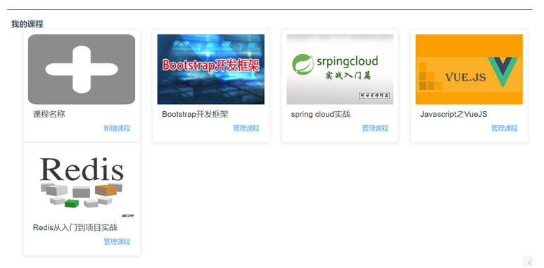
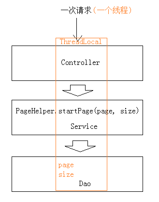
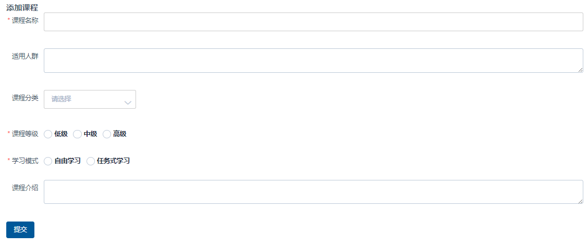
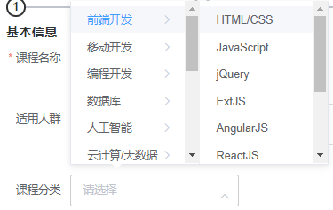
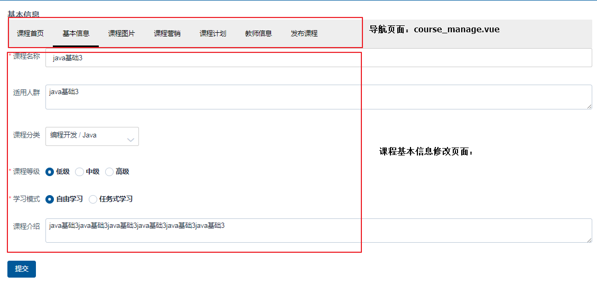

# Day07 课程管理功能模块

## 1. 我的课程
### 1.1. 需求分析

课程添加完成后可通过我的课程进入课程修改页面，此页面显示我的课程列表，如下图所示，可分页查询。



上边的查询要实现分页、会存在多表关联查询，所以建议使用mybatis实现我的课程查询。

### 1.2. API接口

- 接口输入参数：页码、每页显示个数、查询条件（本次功能不涉及，但建议每个接口都定义查询条件的入参，方便日后扩展）
- 输出结果类型：`QueryResponseResult<自定义类型>`

在api工程的course包下CourseControllerApi接口，新增相应的接口

```java
@ApiOperation("查询我的课程列表")
public QueryResponseResult<CourseInfo> findCourseList(int page, int size, CourseListRequest courseListRequest);
```

### 1.3. 课程管理服务
#### 1.3.1. PageHelper 分页助手

- PageHelper是mybatis的通用分页插件，通过mybatis的拦截器实现分页功能，拦截sql查询请求，添加分页语句，最终实现分页查询功能。
- 我的课程具有分页功能，本项目使用Pagehelper实现Mybatis分页功能开发，由于本项目使用springboot开发，在springboot上集成pagehelper（https://github.com/pagehelper/pagehelper-spring-boot）
- PageHelper的使用方法及原理如下：
    - 在调用dao的service方法中设置分页参数：`PageHelper.startPage(page, size)`，分页参数会设置在ThreadLocal中PageHelper在mybatis执行sql前进行拦截，从ThreadLocal取出分页参数，修改当前执行的sql语句，添加分页sql。
    - 最后执行添加了分页sql的sql语句，实现分页查询。



1. 配置pom.xml文件，添加依赖

```xml
<dependency>
    <groupId>com.github.pagehelper</groupId>
    <artifactId>pagehelper-spring-boot-starter</artifactId>
    <version>1.2.4</version>
</dependency>
```

2. 在application.yml中配置pageHelper操作的数据库类型

```yml
pagehelper:
  helper-dialect: mysql
```

#### 1.3.2. Dao 层

1. 修改CourseMapper接口，增加查询的方法

```java
@Mapper
public interface CourseMapper {
    CourseBase findCourseBaseById(String id);

    /**
     * 查询所有课程集合
     *
     * @param courseListRequest 列表查询条件
     * @return pagehelper分页助手Page类
     */
    Page<CourseInfo> findCourseList(CourseListRequest courseListRequest);
}
```

2. 修改CourseMapper.xml映射文件，编写查询的sql

```xml
<!-- 查询我的课程集合 -->
<select id="findCourseList" resultType="com.xuecheng.framework.domain.course.ext.CourseInfo"
        parameterType="com.xuecheng.framework.domain.course.request.CourseListRequest">
    SELECT
        cb.*,
        ( SELECT pic FROM course_pic cp WHERE cp.courseid = cb.id ) pic
    FROM
        course_base cb
</select>
```

3. 使用junit，测试前修改日志级别为debug，并跟踪运行日志，发现sql语句中已经包括分页语句。

```java
@SpringBootTest
@RunWith(SpringRunner.class)
public class TestDao {
    @Autowired
    CourseMapper courseMapper;

    // 测试分页助手
    @Test
    public void testPageHelper() {
        // 查询第1页，每页显示10条记录
        PageHelper.startPage(1, 10);
        Page<CourseInfo> courseList = courseMapper.findCourseList(new CourseListRequest());

        List<CourseInfo> result = courseList.getResult();
        long total = courseList.getTotal();

        System.out.println(result);
        System.out.println(total);
    }
}
```

#### 1.3.3. Service 层

修改CourseService类，增加我的课程列表查询的方法

```java
/* 注入课程mapper接口 */
@Autowired
private CourseMapper courseMapper;

/**
 * 课程列表分页查询
 *
 * @param page              开始页
 * @param size              每页大小
 * @param courseListRequest 查询条件
 * @return 查询响应对象
 */
public QueryResponseResult<CourseInfo> findCourseList(int page, int size,
                                                      CourseListRequest courseListRequest) {
    // 判断是否有查询条件、分页条件
    if (courseListRequest == null) {
        courseListRequest = new CourseListRequest();
    }
    if (page <= 0) {
        page = 1;
    }
    if (size <= 0) {
        size = 20;
    }

    // 设置分页参数
    PageHelper.startPage(page, size);
    // 分页查询
    Page<CourseInfo> courseList = courseMapper.findCourseList(courseListRequest);

    // 获取查询列表
    List<CourseInfo> resultList = courseList.getResult();
    // 获取总记录数
    long total = courseList.getTotal();
    // 创建返回查询结果集
    QueryResult<CourseInfo> courseInfoQueryResult = new QueryResult<>();
    courseInfoQueryResult.setList(resultList);
    courseInfoQueryResult.setTotal(total);

    // 响应数据
    return new QueryResponseResult<CourseInfo>(CommonCode.SUCCESS, courseInfoQueryResult);
}
```

#### 1.3.4. Controller 层

修改CourseController，实现CourseControllerApi接口的findCourseList()查询我的课程方法

```java
/**
 * 查询我的课程列表
 *
 * @param page              当前页码
 * @param size              每页大小
 * @param courseListRequest 查询条件实体类
 * @return
 */
@Override
@GetMapping("/coursebase/list/{page}/{size}")
public QueryResponseResult<CourseInfo> findCourseList(@PathVariable("page") int page,
                                                      @PathVariable("size") int size,
                                                      CourseListRequest courseListRequest) {
    return courseService.findCourseList(page, size, courseListRequest);
}
```

#### 1.3.5. 测试

使用postman或swagger-ui测试课程列表接口。

### 1.4. 前端页面说明
#### 1.4.1. 页面

我的课程列表使用element 的card组件，代码参考前端工程，xc-ui-pc-teach\src\module\course\page\course_list.vue

#### 1.4.2. Api调用

1. 修改src\module\course\api\course.js，定义查询课程列表的Api方法

```js
// 我的课程列表
export const findCourseList = (page, size, params) => {
  // 使用工具类将json对象转成key/value，对于查询条件，向服务端传入key/value串
  let queries = querystring.stringify(params)
  return http.requestQuickGet(apiUrl + "/course/coursebase/list/" + page + "/" + size + "?" + queries)
}
```

2. 在 course_list.vue 页面调用 findCourseList 方法

```js
// 获取课程列表
getCourse() {
    courseApi.findCourseList(this.page, this.size, {}).then((res) => {
        if (res.success) {
            this.total = res.queryResult.total;
            this.courses = res.queryResult.list;
        }

    });
},
```

3. 在mounted钩子中调用getCourse方法

```js
mounted() {
    // 查询我的课程
    this.getCourse();
}
```

4. 在分页方法中调用getCourse方法

```js
// 分页方法
handleCurrentChange(val) {
    this.page = val;
    this.getCourse();
},
```

#### 1.4.3. 测试

注意：由于课程图片服务器没有搭建，这里图片暂时无法显示。

## 2. 新增课程
### 2.1. 需求分析

- 用户操作流程如下：
    1. 用户进入“我的课程”页面，点击“新增课程”，进入新增课程页面
    2. 填写课程信息，选择课程分类、课程等级、学习模式等
    3. 信息填写完毕，点击“提交”，课程添加成功或课程添加失败并提示失败原因
- 需要解决的是在新增页面上输入的信息：
    1. 课程分类。多级分类，需要方便用户去选择
    2. 课程等级、学习模式等这些选项建议是可以配置的

### 2.2. 课程分类查询
#### 2.2.1. 介绍

在新增课程界面需要选择课程所属分类，分类信息是整个项目非常重要的信息，课程即商品，分类信息设置的好坏直接影响用户访问量

- 分类信息出现的位置有：
    1. 首页分类导航
    2. 课程的归属地，添加课程时要选择课程的所属分类

#### 2.2.2. 数据表结构

该功能涉及的category表

```sql
CREATE TABLE `category` (
  `id` varchar(32) NOT NULL COMMENT '主键',
  `name` varchar(32) NOT NULL COMMENT '分类名称',
  `label` varchar(32) DEFAULT NULL COMMENT '分类标签默认和名称一样',
  `parentid` varchar(32) DEFAULT NULL COMMENT '父结点id',
  `isshow` char(1) DEFAULT NULL COMMENT '是否显示',
  `orderby` int(4) DEFAULT NULL COMMENT '排序字段',
  `isleaf` char(1) DEFAULT NULL COMMENT '是否叶子',
  PRIMARY KEY (`id`)
) ENGINE=InnoDB DEFAULT CHARSET=utf8;
```

#### 2.2.3. 分类查询
##### 2.2.3.1. 返回的数据结构分析

- 在添加课程时需要选择课程所属的分类，这里需要定义课程分类查询接口。
- 接口格式要根据前端需要的数据格式来定义，前端展示课程分类使用elemenet-ui的cascader（级联选择器）组件
- 数据格式例子如下

```json
[
    {
        "value": "zhinan",
        "label": "指南",
        "children": [
            {
                "value": "shejiyuanze",
                "label": "设计原则",
                "children": [
                    {
                        "value": "yizhi",
                        "label": "一致"
                    },
                    {
                        "value": "fankui",
                        "label": "反馈"
                    },
                    {
                        "value": "xiaolv",
                        "label": "效率"
                    },
                    {
                        "value": "kekong",
                        "label": "可控"
                    }
                ]
            }
        ]
    }
]
```

##### 2.2.3.2. 数据模型

1. 定义category的模型与数据库表字段对应

```java

@Data
@ToString
@Entity
@Table(name = "category")
@GenericGenerator(name = "jpa-assigned", strategy = "assigned")
public class Category implements Serializable {
    private static final long serialVersionUID = -906357110051689484L;

    @Id
    @GeneratedValue(generator = "jpa-assigned")
    @Column(length = 32)
    private String id;
    private String name;
    private String label;
    private String parentid;
    private String isshow;
    private Integer orderby;
    private String isleaf;
}
```

2. 定义数据返回前端的数据格式

```java
@Data
@ToString
public class CategoryNode extends Category {
    List<CategoryNode> children;
}
```

##### 2.2.3.3. Api接口

在xc-service-api工程创建`com.xuecheng.api.course.CategoryControllerApi`接口，定义查询分类的方法

```java
@Api(value = "课程分类接口", description = "课程分类管理", tags = {"课程分类管理"})
public interface CategoryControllerApi {
    @ApiOperation("查询分类")
    public CategoryNode findList();
}
```

##### 2.2.3.4. dao层

根据数据格式的分析，此查询需要返回树型数据格式，为了开发方便，使用mybatis实现查询

1. 定义mapper接口

```java
/**
 * 课程分类mapper接口
 */
@Mapper
public interface CategoryMapper {
    /**
     * 查询课程分类
     *
     * @return 课程分类树型数据格式
     */
    public CategoryNode selectList();
}
```

2. 定义mapper映射文件，采用表的自连接方式输出树型结果集

```xml
<?xml version="1.0" encoding="UTF-8" ?>
<!DOCTYPE mapper PUBLIC "-//mybatis.org//DTD Mapper 3.0//EN"
        "http://mybatis.org/dtd/mybatis-3-mapper.dtd" >
<mapper namespace="com.xuecheng.manage_course.dao.CategoryMapper">
    <!-- 定义课程分类树型结构的映射关系 -->
    <resultMap id="categoryMap" type="com.xuecheng.framework.domain.course.ext.CategoryNode">
        <id column="one_id" property="id"/>
        <result column="one_name" property="name"/>
        <result column="one_label" property="label"/>
        <result column="one_isshow" property="isshow"/>
        <result column="one_isleaf" property="isleaf"/>
        <result column="one_orderby" property="orderby"/>
        <result column="one_parentid" property="parentid"/>
        <!-- 定义二级节点集合 -->
        <collection property="children" ofType="com.xuecheng.framework.domain.course.ext.CategoryNode">
            <id column="two_id" property="id"/>
            <result column="two_name" property="name"/>
            <result column="two_label" property="label"/>
            <result column="two_isshow" property="isshow"/>
            <result column="two_isleaf" property="isleaf"/>
            <result column="two_orderby" property="orderby"/>
            <result column="two_parentid" property="parentid"/>
            <!-- 定义三级节点集合 -->
            <collection property="children" ofType="com.xuecheng.framework.domain.course.ext.CategoryNode">
                <id column="three_id" property="id"/>
                <result column="three_name" property="name"/>
                <result column="three_label" property="label"/>
                <result column="three_isshow" property="isshow"/>
                <result column="three_isleaf" property="isleaf"/>
                <result column="three_orderby" property="orderby"/>
                <result column="three_parentid" property="parentid"/>
            </collection>
        </collection>
    </resultMap>

    <select id="selectList" resultMap="categoryMap">
        SELECT
            t.id AS one_id,
            t.`NAME` AS one_name,
            t.label AS one_label,
            t.isshow AS one_isshow,
            t.isleaf AS one_isleaf,
            t.orderby AS one_orderby,
            t.parentid AS one_parentid,
            t2.id AS two_id,
            t2.`NAME` AS two_name,
            t2.label AS two_label,
            t2.isshow AS two_isshow,
            t2.isleaf AS two_isleaf,
            t2.orderby AS two_orderby,
            t2.parentid AS two_parentid,
            t3.id AS three_id,
            t3.`NAME` AS three_name,
            t3.label AS three_label,
            t3.isshow AS three_isshow,
            t3.isleaf AS three_isleaf,
            t3.orderby AS three_orderby,
            t3.parentid AS three_parentid
        FROM
            category t
            LEFT JOIN category t2 ON t.id = t2.parentid
            LEFT JOIN category t3 ON t2.id = t3.parentid
        WHERE
            t.parentid = '0'
        ORDER BY
            t.orderby,
            t2.orderby,
            t3.orderby
    </select>
</mapper>
```

##### 2.2.3.5. Service 层

创建CategoryService类，增加查询分类方法

```java
/**
 * 课程分类服务
 */
@Service
public class CategoryService {
    /* 注入课程分类mapper接口 */
    @Autowired
    private CategoryMapper categoryMapper;

    /**
     * 查询课程分类
     *
     * @return 课程分类节点
     */
    public CategoryNode findList() {
        return categoryMapper.selectList();
    }
}
```

##### 2.2.3.6. Controller 层

创建CategoryController实现CategoryControllerApi接口，实现查询方法

```java
/**
 * 课程分类控制层
 */
@RestController
@RequestMapping("/category")
public class CategoryController implements CategoryControllerApi {
    /* 注入课程分类服务 */
    @Autowired
    private CategoryService categoryService;

    @Override
    @GetMapping("/list")
    public CategoryNode findList() {
        return categoryService.findList();
    }
}
```

##### 2.2.3.7. 接口测试

- postman测试接口地址：http://127.0.0.1:31200/category/list
- swagger-ui地址：http://127.0.0.1:31200/swagger-ui.html

### 2.3. 数据字典
#### 2.3.1. 介绍

在新增课程界面需要选择课程等级、课程状态等，这些信息统一采用数据字典管理的方式

本项目对一些业务的分类配置信息，比如：课程等级、课程状态、用户类型、用户状态等进行统一管理，通过在数据库创建数据字典表来维护这些分类信息

数据字典对系统的业务分类进行统一管理，并且也可以解决硬编码问题，比如添加课程时选择课程等级，下拉框中的课程等级信息如果在页面硬编码将造成不易修改维护的问题，所以从数据字典表中获取，如果要修改名称则在数据字典修改即可，提高系统的可维护性

#### 2.3.2. 数据模型

- 在mongodb中创建数据字典表sys_dictionary。举例，其中一个字典信息如下

```json
{
    "_id" : ObjectId("5a7e8d2dd019f15418fa2b71"),
    "d_name" : "课程等级",
    "d_type" : "200",
    "d_value" : [
        {
            "sd_name" : "低级",
            "sd_id" : "200001",
            "sd_status" : "1"
        },
        {
            "sd_name" : "中级",
            "sd_id" : "200002",
            "sd_status" : "1"
        },
        {
            "sd_name" : "高级",
            "sd_id" : "200003",
            "sd_status" : "1"
        }
    ]
}
```

- 字段说明如下：
    - d_name：字典名称
    - d_type：字典分类
    - d_value：字典数据
    - sd_name：项目名称
    - sd_id：项目id
    - sd_status：项目状态（1：可用，0：不可用）
- xc-framework-model工程，创建数据字典模型类SysDictionary

```java
@Data
@ToString
@Document(collection = "sys_dictionary")
public class SysDictionary {
    @Id
    private String id;

    @Field("d_name")
    private String dName;

    @Field("d_type")
    private String dType;

    @Field("d_value")
    private List<SysDictionaryValue> dValue;
}
```

- 创建数据字典值SysDictionaryValue类

```java
@Data
@ToString
public class SysDictionaryValue {
    @Field("sd_id")
    private String sdId;

    @Field("sd_name")
    private String sdName;

    @Field("sd_status")
    private String sdStatus;
}
```

#### 2.3.3. 字典查询接口
##### 2.3.3.1. API接口

为了方便其它子系统使用，在xc-service-api工程cms模块下创建字典查询接口，根据字典的type查询字典信息，接口定义如下

```java
/**
 * 数据字典API接口
 */
@Api(value = "数据字典接口", description = "提供数据字典接口的管理、查询功能")
public interface SysDicthinaryControllerApi {
    @ApiOperation("数据字典查询接口")
    public SysDictionary getByType(String type);
}
```

##### 2.3.3.2. Dao 层

在xc-service-manage-cms模块下创建数据库的dao层SysDictionaryRepository类

```java
/**
 * 数据字典-数据访问层接口
 */
@Repository
public interface SysDictionaryRepository extends MongoRepository<SysDictionary, String> {
    /**
     * 根据字典分类查询字典信息
     *
     * @param dType 类型
     * @return 数据字典实体类
     */
    SysDictionary findBydType(String dType);
}
```

##### 2.3.3.3. Service 层

```java
/**
 * 数据字典服务层
 */
@Service
public class SysdictionaryService {
    /* 注入数据字典dao接口 */
    @Autowired
    private SysDictionaryRepository sysDictionaryRepository;

    /**
     * 根据字典分类type查询字典信息
     *
     * @param type 字典分类
     * @return 数据字典数据
     */
    public SysDictionary findDictionaryByType(String type) {
        return sysDictionaryRepository.findBydType(type);
    }
}
```

##### 2.3.3.4. Controller 层

```java
/**
 * 数据字典控制层
 */
@RestController
@RequestMapping("/sys/dictionary")
public class SysDictionaryController implements SysDicthinaryControllerApi {
    /* 注入数据字典服务层 */
    @Autowired
    private SysdictionaryService sysdictionaryService;

    /**
     * 根据字典分类id查询字典信息
     *
     * @param type 字典类型
     * @return 数据字典对象
     */
    @Override
    @GetMapping("/get/{type}")
    public SysDictionary getByType(@PathVariable("type") String type) {
        return sysdictionaryService.findDictionaryByType(type);
    }
}
```

##### 2.3.3.5. 测试

- 测试url：http://127.0.0.1:31001/sys/dictionary/get/200
- Swagger：http://127.0.0.1:31001/swagger-ui.html

### 2.4. 新增课程页面完善

需求完成数据字典显示及课程分类显示

#### 2.4.1. 新增课程页面

1. 页面效果如下



2. 在teach前端工程的course模块下创建course_add.vue页面，代码参考xc-ui-pc-teach工程：src\module\course\page\course_add.vue
3. 配置页面路由

```js
import course_add from '@/module/course/page/course_add.vue';

export default [{
  path: '/course',
  component: Home,
  name: '课程管理',
  hidden: false,
  iconCls: 'el-icon-document',
  children: [
    ......
    {
      path: '/course/add/base',
      name: '新增课程',
      component: course_add,
      hidden: true
    },
    ......
  ]
}]
```

4. 在我的课程页面course_list.vue，添加“新增课程”链接

```html
<router-link class="mui-tab-item" :to="{path:'/course/add/base'}">
    <el-button type="text" class="button">新增课程</el-button>
</router-link>
```

#### 2.4.2. 查询数据字典

课程添加页面中课程等级、学习模式需要从数据字典查询字典信息

1. 在/base/api/system.js中，定义公用方法数据字典查询

```js
import http from './public'
let sysConfig = require('@/../config/sysConfig')
let apiUrl = sysConfig.xcApiUrlPre;

/* 数据字典 */
export const sys_getDictionary = dType => {
  return http.requestQuickGet(apiUrl + '/sys/dictionary/get/' + dType)
}
```

2. 在mounted钩子中定义方法，在页面获取数据字典

```js
mounted() {
    // 查询数据字典-课程等级
    systemApi.sys_getDictionary("200").then(res => {
        this.gradeList = res.dvalue;
    })
    // 查询数据字典-学习模式
    systemApi.sys_getDictionary("201").then(res => {
        this.studymodelList = res.dvalue;
    })
}
```

#### 2.4.3. 查询课程分类

课程添加页面中课程分类采用Cascader级联选择器组件完成

1. course_add.vue页面引入组件

```html
<el-form-item label="课程分类" prop="categoryActive">
    <el-cascader
        expand-trigger="hover"
        :options="categoryList"
        v-model="categoryActive"
        :props="props"
    ></el-cascader>
</el-form-item>
```

2. 在本模块的course.js中定义api接口方法

```js
// 查询课程分类
export const category_findlist = () => {
  return http.requestQuickGet(apiUrl + '/category/list')
}
```

3. 在mounted钩子中，在页面获取课程分类

```js
mounted() {
    // 查询课程分类
    courseApi.category_findlist().then(res => {
        this.categoryList = res.children;
        console.log(this.categoryList)

    })
    ......
}
```

4. 页面效果



5. 用户选择课程分类后，所选分类 ID 绑定到categoryActive（数组）中，选择了一级、二级分类，分别存储在categoryActive数组的第一个、第二个元素中

### 2.5. 新增课程 API 接口

在xc-service-api工程的CourseControllerApi接口编写新增课程的方法

```java
@Api(value = "课程管理接口", description = "课程管理接口，提供课程的增、删、改、查", tags = {"课程管理"})
public interface CourseControllerApi {
    ......
    @ApiOperation("添加课程基础信息")
    public AddCourseResult addCourseBase(CourseBase courseBase);
}
```

### 2.6. 新增课程服务端

在xc-service-manage-course工程添加新增课程接口实现

#### 2.6.1. Dao 层

```java
public interface CourseBaseRepository extends JpaRepository<CourseBase, String> {
}
```


#### 2.6.2. Service 层

修改CourseService类，创建新增课程方法

```java
/**
     * 添加课程信息
     *
     * @param courseBase 课程对象
     * @return 响应结果
     */
    @Transactional
    public AddCourseResult addCourseBase(CourseBase courseBase) {
        // 课程状态默认为未发布
        courseBase.setStatus("202001");
        courseBaseRepository.save(courseBase);
        // 返回响应对象
        return new AddCourseResult(CommonCode.SUCCESS, courseBase.getId());
    }
```

#### 2.6.3. Controller 层

修改CourseController类，实现新增课程方法

```java
/**
 * 添加课程基础信息
 *
 * @param courseBase 课程信息对象
 * @return 响应结果
 */
@Override
@PostMapping("/coursebase/add")
public AddCourseResult addCourseBase(@RequestBody CourseBase courseBase) {
    return courseService.addCourseBase(courseBase);
}
```

### 2.7. 新增课程前端
#### 2.7.1. Api方法定义

在前端定义请求服务端添加课程的api的方法，在course模块中定义方法

```js
/* 添加课程基础信息 */
export const addCourseBase = params => {
  return http.requestPost(apiUrl + '/course/coursebase/add', params)
}
```

#### 2.7.2. Api方法调用

在course_add.vue 调用api提交课程信息

```js
methods: {
    // 新增课程提交
    save() {
        this.$refs.courseForm.validate(valid => {
            // 校验表单
            if (valid) {
                this.$confirm('确认提交吗？', '提示', {}).then(() => {
                    // 选择课程分类存储到categoryActive
                    this.courseForm.mt = this.categoryActive[0] // 大分类
                    this.courseForm.st = this.categoryActive[1] // 小分类
                    // 请求服务接口
                    courseApi.addCourseBase(this.courseForm).then(res => {
                        if (res.success) {
                            this.$message.success("提交成功")
                            // 跳转到我的课程
                            this.$router.push({ path: '/course/list' })
                        } else {
                            if (res.message) {
                                this.$message.error(res.message);
                            } else {
                                this.$message.error('提交失败');
                            }
                        }
                    })
                })
            }
        })
    }
},
```

#### 2.7.3. 测试

- 注意：将course_base表中的company_id改为非必填，待认证功能开发完成再修改为必填
- 测试流程：
    1. 进入我的课程，点击“新增课程”打开新增课程页面
    2. 输入课程信息，点击提交

## 3. 课程信息修改
### 3.1. 需求分析

课程添加成功进入课程管理页面，通过课程管理页面修改课程的基本信息、编辑课程图片、编辑课程营销信息等

### 3.2. 课程管理页面说明
#### 3.2.1. 页面结构



#### 3.2.2. 课程管理导航页面

1. 定义course_manage.vue为课程管理导航页面，导航效果使用Element-UI的NavMenu组件实现。源码参考xc-ui-pc-teach工程
2. 创建各各信息管理页面。通过管理页面的导航可以进入各各信息管理页面，这里先创建各各信息管理页面，页面内容暂时为空，待开发时再完善，在本模块的page目录下创建course_manage目录，此目录存放各各信息管理页面，页面明细如下：
    - 课程管理首页：course_summary.vue
    - 基本信息修改页面：course_baseinfo.vue
    - 图片管理页面：course_picture.vue
    - 营销信息页面：course_marketinfo.vue
    - 老师信息页面：course_teacher.vue
    - 课程计划页面：course_plan.vue
    - 课程发布页面：course_pub.vue
3. 创建路由，源码参考xc-ui-pc-teach工程

### 3.3. 修改课程 Api 接口

- 修改课程需要在CourseControllerApi创建如下接口：
1. 根据课程ID查询课程信息

```java
@ApiOperation("获取课程基础信息")
public CourseBase getCourseBaseById(String courseId) throws RuntimeException;
```

2. 修改课程信息提交

```java
@ApiOperation("更新课程基础信息")
public ResponseResult updateCourseBase(String courseId, CourseBase courseBase);
```

### 3.4. 服务端
#### 3.4.1. dao 层

使用原来的CourseBaseRepository接口即可

#### 3.4.2. service 层

修改CourseService类，增加查询课程与修改课程的方法

```java
/**
 * 根据课程id查询课程信息
 *
 * @param courseId 课程id
 * @return 课程对象
 */
public CourseBase getCoursebaseById(String courseId) {
    Optional<CourseBase> optional = courseBaseRepository.findById(courseId);
    if (optional.isPresent()) {
        return optional.get();
    }
    return null;
}


/**
 * 修改课程
 *
 * @param courseId   课程id
 * @param courseBase 修改的课程对象
 * @return 响应结查
 */
@Transactional
public ResponseResult updateCoursebase(String courseId, CourseBase courseBase) {
    // 根据课程id查询课程
    CourseBase courseBaseDb = getCoursebaseById(courseId);

    if (courseBase == null) {
        // 抛出查询课程不存在的自定义异常
        ExceptionCast.cast(CourseCode.COURSE_PUBLISH_NOT_EXIST);
    }

    // 修改课程信息
    courseBaseDb.setName(courseBase.getName());
    courseBaseDb.setMt(courseBase.getMt());
    courseBaseDb.setSt(courseBase.getSt());
    courseBaseDb.setGrade(courseBase.getGrade());
    courseBaseDb.setStudymodel(courseBase.getStudymodel());
    courseBaseDb.setUsers(courseBase.getUsers());
    courseBaseDb.setDescription(courseBase.getDescription());
    courseBaseRepository.save(courseBaseDb);

    // 返回操作成功
    return ResponseResult.SUCCESS();
}
```

#### 3.4.3. controller 层

修改CourseController类，实现查询和修改的方法

```java
/**
 * 获取课程基础信息
 *
 * @param courseId 课程id
 * @return 课程信息对象
 * @throws RuntimeException
 */
@Override
@GetMapping("/coursebase/get/{courseId}")
public CourseBase getCourseBaseById(@PathVariable("courseId") String courseId)
        throws RuntimeException {
    return courseService.getCoursebaseById(courseId);
}

/**
 * 更新课程信息
 *
 * @param courseId   课程id
 * @param courseBase 课程信息对象
 * @return 响应结果
 */
@Override
@PutMapping("/coursebase/update/{id}")
public ResponseResult updateCourseBase(@PathVariable("id") String courseId, 
                                       @RequestBody CourseBase courseBase) {
    return courseService.updateCoursebase(courseId, courseBase);
}
```

### 3.5. 前端
#### 3.5.1. 修改页面

在course模块下的course_manage目录下创建course_baseinfo.vue页面，本页面实现课程修改，代码参考xc-ui-pc-teach工程

#### 3.5.2. 前端 API 方法

修改course.js，增加获取课程基本信息和更新课程基本信息的方法

```js
/** 获取课程基本信息 */
export const getCoursebaseById = id => {
  return http.requestQuickGet(apiUrl + '/course/coursebase/get/' + id)
}

/** 更新课程基本信息 */
export const updateCoursebase = (id, course) => {
  return http.requestPut(apiUrl + '/course/coursebase/update/' + id, course)
}
```

#### 3.5.3. 课程信息显示

修改course_baseinfo.vue，在mounted钩子方法中查询课程信息及数据字典

```js
mounted() {
    // 查询数据字典字典
    systemApi.sys_getDictionary('201').then((res) => {
        this.studymodelList = res.dvalue;
    });
    systemApi.sys_getDictionary('200').then((res) => {
        this.gradeList = res.dvalue;
    });
    // 取课程分类
    courseApi.category_findlist({}).then((res) => {
        this.categoryList = res.children;
    });
    // 从url中获取课程id
    this.courseid = this.$route.params.courseid;
    // 查询课程信息
    courseApi.getCoursebaseById(this.courseid).then(res => {
        this.courseForm = res;
        // 课程分类显示，需要两级分类
        this.categoryActive.push(this.courseForm.mt);
        this.categoryActive.push(this.courseForm.st);
    });
}
```

#### 3.5.4. 课程修改提交

修改course_baseinfo.vue，增加保存课程修改的方法

```js
methods: {
    save() {
        //修改课程
        this.$refs.courseForm.validate(valid => {
            if (valid) {
                this.$confirm('确认提交吗？', '提示', {}).then(() => {
                    this.editLoading = true;
                    let mt = this.categoryActive[0];
                    let st = this.categoryActive[1];
                    this.courseForm.mt = mt;
                    this.courseForm.st = st;
                    let id = this.courseForm.id
                    courseApi.updateCoursebase(id, this.courseForm).then(res => {
                        this.editLoading = false;
                        if (res.success) {
                            this.$message({
                                message: '提交成功',
                                type: 'success'
                            });
                        } else {
                            if (res.message) {
                                this.$message.error(res.message);
                            } else {
                                this.$message.error('提交失败');
                            }
                        }
                    });
                });
            }
        });
    }
},
```

## 4. 课程营销
### 4.1. 需求分析

课程营销信息包括课程价格、课程有效期等信息


### 4.2. 数据模型

课程营销信息使用course_market表存储，定义数据模型类如下

```java
@Data
@ToString
@Entity
@Table(name = "course_market")
@GenericGenerator(name = "jpa-assigned", strategy = "assigned")
public class CourseMarket implements Serializable {
    private static final long serialVersionUID = -916357110051689486L;
    @Id
    @GeneratedValue(generator = "jpa-assigned")
    @Column(length = 32)
    private String id;
    private String charge;
    private String valid;
    private String qq;
    private Float price;
    private Float price_old;
    @Column(name = "start_time")
    private Date startTime;
    @Column(name = "end_time")
    private Date endTime;
}
```

### 4.3. 后端API

1. 修改CourseControllerApi接口，增加查询课程营销信息接口方法

```java
@ApiOperation("获取课程营销信息")
public CourseMarket getCourseMarketById(String courseId);
```

2. 更新课程营销信息接口方法

```java
@ApiOperation("更新课程营销信息")
public ResponseResult updateCourseMarket(String id, CourseMarket courseMarket);
```

### 4.4. 课程管理服务
#### 4.4.1. dao 层

在xc-service-manage-course工程，增加CourseMarketRepository接口

```java
/**
 * 课程营销JPA接口
 */
public interface CourseMarketRepository extends JpaRepository<CourseMarket, String> {
}
```

#### 4.4.2. service 层

在CourseService类中，增加课程营销查询与修改的方法

```java
@Service
public class CourseService {
    /* 注入课程营销JPA接口 */
    @Autowired
    private CourseMarketRepository courseMarketRepository;

    /**
     * 根据课程id查询课程营销信息
     *
     * @param courseId 课程id
     * @return 课程营销对象
     */
    public CourseMarket getCourseMarketById(String courseId) {
        Optional<CourseMarket> optional = courseMarketRepository.findById(courseId);
        if (optional.isPresent()) {
            return optional.get();
        }
        return null;
    }

    /**
     * 更新课程营销信息
     *
     * @param id           课程id
     * @param courseMarket 课程营销对象
     * @return 响应标识
     */
    @Transactional
    public ResponseResult updateCourseMarket(String id, CourseMarket courseMarket) {
        // 根据id查询课程营销对象
        CourseMarket courseMarketDb = this.getCourseMarketById(id);

        if (courseMarketDb != null) {
            // 将页面修改的值设置到从数据库查询的对象中
            courseMarketDb.setCharge(courseMarket.getCharge());
            // 课程有效期，开始时间
            courseMarketDb.setStartTime(courseMarket.getStartTime());
            // 课程有效期，结束时间
            courseMarketDb.setEndTime(courseMarket.getEndTime());
            courseMarketDb.setPrice(courseMarket.getPrice());
            courseMarketDb.setQq(courseMarket.getQq());
            courseMarketDb.setValid(courseMarket.getValid());
            courseMarketRepository.save(courseMarketDb);

        } else {
            /* 课程营销信息不存在，则进行新增操作 */
            // 设置课程id
            courseMarket.setId(id);
            // 添加课程营销信息
            courseMarketRepository.save(courseMarket);
        }

        // 返回操作成功
        return ResponseResult.SUCCESS();
    }
}
```

#### 4.4.3. controller 层

修改CourseController类，实现新增的两个接口

```java
/**
 * 获取课程营销信息
 *
 * @param courseId 课程id
 * @return 数据库中的课程信息对象
 */
@Override
@GetMapping("/coursemarket/get/{courseId}")
public CourseMarket getCourseMarketById(@PathVariable("courseId") String courseId) {
    return courseService.getCourseMarketById(courseId);
}

/**
 * 更新课程营销信息
 *
 * @param id           课程id
 * @param courseMarket 页面上送的课程信息对象
 * @return 响应结果
 */
@Override
@PutMapping("/coursemarket/update/{id}")
public ResponseResult updateCourseMarket(@PathVariable("id") String id,
                                         @RequestBody CourseMarket courseMarket) {
    return courseService.updateCourseMarket(id, courseMarket);
}
```

### 4.5. 前端页面
#### 4.5.1. 定义API请求后端方法

修改course.js，增加查询与更新课程信息的请求方法

```js
/** 获取课程营销信息 */
export const getCourseMarketById = id => {
  return http.requestQuickGet(apiUrl + '/course/coursemarket/get/' + id)
}

/** 更新课程营销信息 */
export const updateCourseMarket = (id, courseMarket) => {
  return http.requestPut(apiUrl + '/course/coursemarket/update/' + id, courseMarket)
}
```

#### 4.5.2. 页面请求后端

编写 course_marketinfo.vue，实现相关功能

1. 页面template部分参考xc-ui-pc-teach\src\module\course\page\course_manage\course_marketinfo.vue源代码
2. 定义数据模型，封装页面数据，参考源代码
3. 定义保存方法

```js
methods: {
    save: function () {
        this.$refs.courseMarketForm.validate(valid => {
            if (valid) {
                this.$confirm('确认提交吗？', '提示', {}).then(() => {
                    courseApi.updateCourseMarket(this.courseid, this.courseMarketForm).then(res => {
                        this.editLoading = false;
                        if (res.success) {
                            this.$message.success('提交成功');
                        } else {
                            this.$message.error('提交失败');
                        }
                    });
                });
            }
        });
    }
},
```

4. 在mounted钩子方法中查询课程营销信息及数据字典信息

```js
mounted() {
    // 课程id
    this.courseid = this.$route.params.courseid;
    this.courseMarketForm.id = this.courseid;
    // 查询字典
    systemApi.sys_getDictionary('203').then(res => {
        this.chargeList = res.dvalue;
    });
    systemApi.sys_getDictionary('204').then(res => {
        this.validList = res.dvalue;
    });

    // 获取课程营销信息
    courseApi.getCourseMarketById(this.courseid).then(res => {
        if (res && res.id) {
            this.courseMarketForm = res;
        }
    });
}
```
