# 项目概述与技术简介

此部分内容主要是了解系统的功能、背景、场景及项目要求。在架构角度思考系统可能面临的问题以及解决方案，还有了解本项目所涉及一些中间件的基础知识。

## 1. 项目概述

### 1.1. 概述

本项目实现了一个完整的红包雨模式抽奖系统，包括管理后台与前端界面。

由管理后台配置相关活动和奖品等信息，前端用户通过参与活动，完成抽奖。

### 1.2. 项目背景

- **电商活动**

互联网的发展中，电商是典型的应用场景。各种促销、活动已成为电商公司必备的业务模块，尤其C端业务，面向普通大众用户。在所有活动中，抽奖是最典型的一种。

- **红包雨**

红包雨活动，是以实现随机派发红包的形式完成宣传与促销。也可以理解为抽奖的一种特殊形式，奖品即红包。

- **企业年会**

公司年会中的抽奖环节更是必不可少。尤其互联网公司，线上抽奖基本成为大家约定俗成的形式。打开手机，参与抽奖。正是本项目所涉及的现实应用场景。

### 1.3. 系统要求

- **并发性**

抽奖系统比如涉及到访问量大的问题。系统涉及所面临的第一关，即活动开始的瞬间，大批用户点击的涌入。怎样设计系统以达到如此高并发情况下的及时响应是本项目的重中之重。

- **库存控制**

抽奖面临的必然是奖品。数量控制是必须要做到精准吻合。不允许出现设置了5个奖品，最终6人中奖这种类似的问题出现。其中的本质是奖品库存的控制。

- **投放策略**

投放策略是指：在活动时间段内，管理员设置好的一堆奖品如何投放？红包何时出现？年会奖品什么时候可以被抽中？

本项目中会给使用最常见的一种策略，即在活动时间内，奖品随机出现。最后还会给出引申，如何灵活扩展实现其他的投放算法。

- **边界控制**

活动的边界是指，活动何时开始，何时结束，倒计时如何控制等问题。开始前要提防用户提前进入抽奖。结束后要即使反馈结果给用户，告知活动已结束。

- **活动自由配置**

活动的配置由后台管理员完成，可以自由配置活动的开始结束时间，主题、活动简介、有哪些奖品、不同等级的用户中奖的策略。这就要求系统必须具备足够的业务灵活度。

- **中奖策略**

每个用户参与抽奖后，要遵从后台管理员所设定的中奖策略，典型的场景是针对用户设置最大中奖数。一旦用户中奖后，要进入计数，达到最大中奖数后，即使活动未结束，用户继续参与，也不能再让其中奖。而是将奖品机会倾向于其他参与者。

## 2. 项目功能展示

### 2.1. 管理后台

#### 2.1.1. 会员管理模块

功能：用户查询、用户新增、删除、修改密码

用户管理为管理员提供基本的用户录入。本项目以企业年会为背景，可参与抽奖的用户由管理员后台直接录入，不允许私自注册其他非法账号。已录入的账号可以在抽奖前端页面中登录，参与抽奖。

在电商面向 C 端用户的情况下，新增一个注册接口，允许用户自行注册参与抽奖。

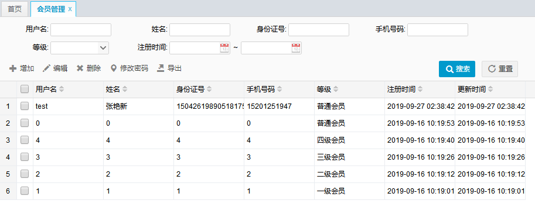

#### 2.1.2. 会员等级模块

功能：等级新增、删除、编辑

不同等级的会员有不同的中奖策略设置。比如高级别的会员中奖次数更多。详细会涉及下面介绍的活动配置中的策略配置

#### 2.1.3. 活动管理

##### 2.1.3.1. 基础信息配置

功能：新增活动，修改活动，删除活动，配置活动基本信息（开始结束时间，标题，说明）。活动的基本信息管理功能

##### 2.1.3.2. 策略配置

功能：新增，修改，删除策略

策略涉及到用户的中奖次数，可以为不同等级的用户设置不同的最大中奖机会。不设置或者设置为 0 表示次数不限。

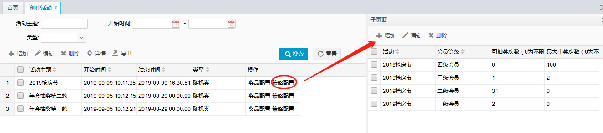

##### 2.1.3.3. 奖品配置

功能：添加，删除，编辑奖品

为活动配置响应的奖品，可以添加多个不同的奖品，并为每个奖品设置单独的数量。

#### 2.1.4. 奖品管理

功能：奖品增加，编辑，删除

录入奖品的基本信息，可以供多个活动引用。

#### 2.1.5. 信息管理

##### 2.1.5.1. 中奖统计

功能：只有按条件查询，不涉及其他操作

统计每个活动的奖品总数，以及被抽走的数量。该功能只涉及数据的统计，不涉及新增修改删除，属于只读操作。

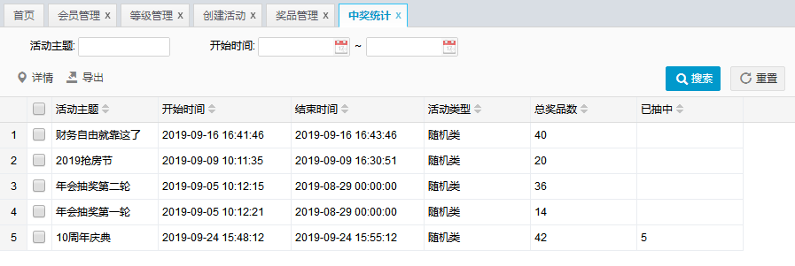

##### 2.1.5.2. 中奖列表

功能：基于各种条件查询中奖详情

可以根据所需条件，查询到相关的中奖信息，中奖人信息，奖品信息，中奖时间等。该功能只涉及数据的统计，不涉及新增修改删除，属于只读操作。

#### 2.1.6. 系统管理

##### 2.1.6.1. 操作日志

功能：查询管理员的操作日志

该功能用于记录管理员的操作。可以根据 IP，操作时间内容，以及操作人查询到在后台中的行为。只涉及数据的统计，不涉及新增修改删除，属于只读操作。

### 2.2. 用户前台

#### 2.2.1. 活动列表

#### 2.2.2. 活动详情

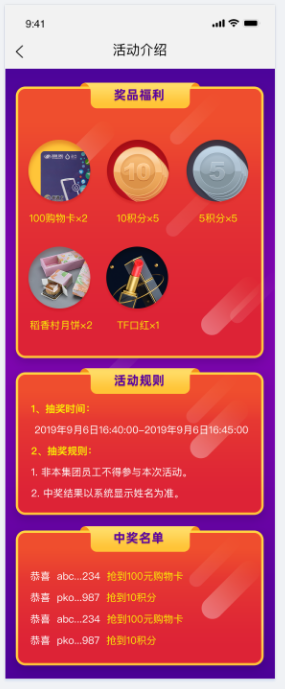

#### 2.2.3. 抽奖展示

#### 2.2.4. 个人中心

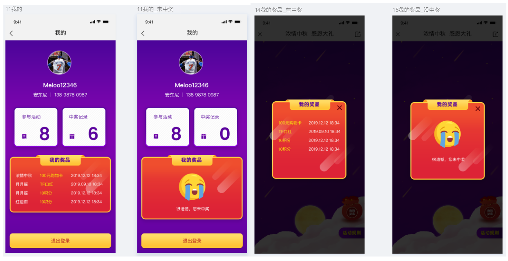

## 3. 涉及中间件介绍

此部分主要介绍项目中涉及的一些中间件，各个中间件的详细介绍与使用详见各个学习笔记

### 3.1. Redis

#### 3.1.1. 简介

Redis 是当前比较热门的 NOSQL 系统之一，它是一个开源的使用 ANSI c语言编写的 key-value 存储系统。

#### 3.1.2. 应用场景

1. 缓存，这是Redis当今最为人熟知的使用场景。在提升服务器性能方面非常有效；
2. 排行榜，使用传统的关系型数据库（mysql oracle 等）来做这个事，非常的麻烦，而利用Redis的zset(有序集合)数据结构能够简单的搞定；
3. 计算器/限速器，利用Redis中原子性的自增操作，我们可以统计类似用户点赞数、用户访问数等，这类操作如果用MySQL，频繁的读写会带来相当大的压力；限速器比较典型的使用场景是限制某个用户访问某个API的频率，常用的有抢购时，防止用户疯狂点击带来不必要的压力，在本项目中会用到该功能；
4. 好友关系，利用集合的一些命令，比如求交集、并集、差集等。可以方便解决一些共同好友、共同爱好之类的功能；
5. 简单消息队列，除了Redis自身的发布/订阅模式，我们也可以利用List来实现一个队列机制，比如：到货通知、邮件发送之类的需求，不需要高可靠，但是会带来非常大的DB压力，完全可以用List来完成异步解耦；
6. Session共享，借助spring-session，后端用Redis保存Session后，无论用户落在那台机器上都能够获取到对应的Session信息。
7. 热数据查询，一些频繁被访问的数据，经常被访问的数据如果放在关系型数据库，每次查询的开销都会很大，而放在redis中，因为redis 是放在内存中的，会得到量级的提升。

#### 3.1.3. 数据类型

- hset: key-field-value结构，用于一组相似类别的k-v值存储。类似java中的hashset工具
- list: 队列，可以实现左右进出操作。类比java中的LinkedList，本项目中的抽奖令牌桶，使用的就是list
- kv: 最典型的缓存存储结构，value可以存储对应的对象。
- zset: 有序集合，在排序类，例如搜索词排名场景中会用到。

#### 3.1.4. 相关命令

详见[《Redis 操作命令》](/04-数据库/03-Redis/04-Redis操作命令)

#### 3.1.5. 三种模式

- **主从复制**: 主从模式指的是使用一个redis实例作为主机，其余的实例作为备份机。主机和从机的数据完全一致，主机支持数据的写入和读取等各项操作，而从机则只支持与主机数据的同步和读取。

主从模式很好的解决了数据备份问题，并且由于主从服务数据几乎是一致的，因而可以将写入数据的命令发送给主机执行，而读取数据的命令发送给不同的从机执行，从而达到读写分离的目的。

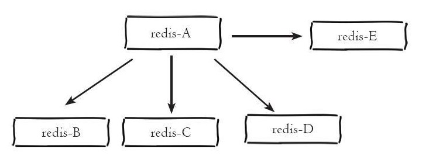

- **哨兵**: 哨兵模式是一种特殊的模式，哨兵是一个独立的进程，独立运行。

当哨兵监测到master宕机，会自动将slave切换成master，然后通过发布订阅模式通知其他的从服务器，修改配置文件，让它们切换主机。做到了主从自动切换和高可用。

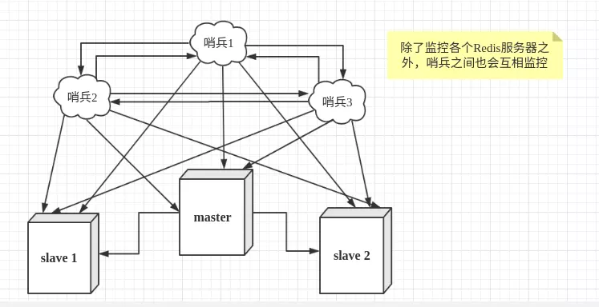

- **集群**: Redis Cluster是一个高性能高可用的分布式系统。由多个Redis实例组成的整体，数据按照Slot存储分布在多个Redis实例上，通过Gossip协议来进行节点之间通信。

Redis 3.0之后版本支持。客户端连任意节点。

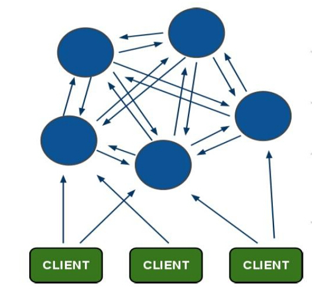

#### 3.1.6. 持久化

Redis支持 RDB 和 AOF 两种持久化机制，持久化功能有效地避免因进程退出造成的数据丢失问题，当下次重启时利用之前持久化文件即可实现数据恢复。

##### 3.1.6.1. RDB

在指定时间间隔内，将内存中的数据集快照写入磁盘，也就是Snapshot快照，它恢复时是将快照文件直接读到内存中，来达到恢复数据的，rdb也是redis默认的持久化方式。

Redis会单独创建(fork)一个子进程来进行持久化，会先将数据写进一个临时文件中，等到持久化过程结束了，再用这个临时文件替换上次持久化好的文件。在这个过程中，只有子进程来负责IO操作，主进程仍然处理客户端的请求，这就确保了极高的性能。

- 优点：适合大规模数据恢复的场景，数据紧凑，易迁移
- 缺点 RDB这种持久化方式数据完整性很难保证，虽然我们可以用过修改持久化的频率，但是如果还没有触发快照时，本机就宕机了，那么对数据库所做的写操作就丢失了。 每次进行RDB时，父进程都会fork一个子进程，由子进程来进行实际的持久化操作，数据量大时，那么fork出子进程的这个过程将是非常耗时的。

##### 3.1.6.2. AOF

以日志的形式记录Redis每一个写操作，将Redis执行过的所有写指令记录下来，注意，读操作是不需要记录的，redis启动之后会读取appendonly.aof文件，将之前的操作复现，来完成恢复数据的工作。

- appendfsync always：每修改同步，每一次发生数据变更都会持久化到磁盘上，性能较差，但数据完整性较好。
- appendfsync everysec：每秒同步，每秒内记录操作，异步操作，如果一秒内宕机，有数据丢失。
- appendfsync no：不同步。

重写：当然如果AOF 文件一直被追加，这就可能导致AOF文件过于庞大。因此，为了避免这种状况，Redis新增了重写机制，当AOF文件的大小超过所指定的阈值时，Redis会自动启用AOF文件的内容压缩，只保留可以恢复数据的最小指令集

- 优点：看上去轻量化，增量形式；保留了redis的历史操作；多种策略配置，相对灵活
- 缺点：对于相同的数据集来说，AOF文件要比RDB文件大；根据所使用的持久化策略来说，AOF的速度要慢与RDB。

### 3.2. Zookeeper

#### 3.2.1. 简介

zookeeper是一个分布式服务框架，是Apache Hadoop 的一个子项目，它主要是用来解决分布式应用中经常遇到的一些数据管理问题，如：统一命名服务、状态同步服务、集群管理、分布式应用配置项的管理等。

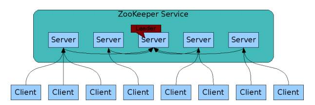

#### 3.2.2. 节点类型

- 临时节点: 临时节点的生命周期和客户端会话绑定在一起，客户端会话失效，则这个节点就会被自动清除。
- 永久节点: 该数据节点被创建后，就会一直存在于zookeeper服务器上，直到有删除操作来主动删除这个节点。

#### 3.2.3. 使用场景

- 配置中心: 配置中心，顾名思义就是将配置数据写到ZK节点上，供各个分布式机器获取配置，同时监听自己对应的节点。实现配置信息的集中式管理和动态更新。
- 命名服务: 在分布式系统中，通过使用命名服务，客户端应用能够根据指定名字来获取资源或服务的地址，提供者等信息。被命名的实体通常可以是集群中的机器，提供的服务地址，远程对象等等，这些我们都可以统称他们为名字（Name）。通过调用ZK提供的创建节点的API，能够很容易创建一个全局唯一的path，这个path就可以作为一个名称。
- 分布式通知: ZooKeeper的watcher注册与异步通知机制，能够很好的实现分布式环境下不同系统之间的通知与协调，实现对数据变更的实时处理。不同系统都对ZK上同一个znode进行注册，监听znode的变化（包括znode本身内容及子节点的），其中一个系统update了znode，那么另一个系统能够收到通知，并作出相应处理
- 选主: 利用ZooKeeper的一致性，能够保证在分布式高并发情况下节点创建的全局唯一性，即：同时有多个客户端请求创建 /currentMaster 节点，最终一定只有一个客户端请求能够创建成功。利用这个特性，就能很轻易的在分布式环境中进行集群选取了。
- 分布式锁: 分布式锁，这个主要得益于ZooKeeper的节点创建和事件监听机制。

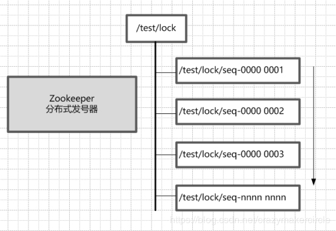

#### 3.2.4. 相关命令

- 创建节点 `create`
- 列出节点 `ls`
- 获取节点信息 `get`
- 检查状态 `stat`
- 修改节点 `set`
- 删除节点 `rmr`
- 删除节点 `delete`

#### 3.2.5. 高可用

集群与选主: 以5台机器启动时场景为主，过程如下：

1. 服务器1启动，此时只有它一台服务器启动了，它发出去的报没有任何响应，所以它的选举状态一直是LOOKING状态。
2. 服务器2启动，它与最开始启动的服务器1进行通信，互相交换自己的选举结果，由于两者都没有历史数据，所以id值较大的服务器2胜出，但是由于没有达到超过半数以上的服务器都同意选举它(这个例子中的半数以上是3)，所以服务器1，2还是继续保持LOOKING状态。
3. 服务器3启动，根据前面的理论分析，服务器3成为服务器1，2，3中的老大，而与上面不同的是，此时有三台服务器选举了它，所以它成为了这次选举的leader。
4. 服务器4启动，根据前面的分析，理论上服务器4应该是服务器1，2，3，4中最大的，但是由于前面已经有半数以上的服务器选举了服务器3，状态是following ，所以它只能接收当小弟的命了。
5. 服务器5启动，同4一样，当小弟。

### 3.3. RabbitMQ

#### 3.3.1. 简介

RabbitMQ 是一个由erlang开发的AMQP（Advanced Message Queue ）的开源实现

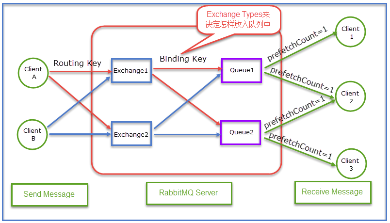

#### 3.3.2. 模块介绍

- Broker：可以简单理解为一台物理机器。
- Producer：消息生产者，就是投递消息的程序。
- Consumer：消息消费者，就是接受消息的程序。
- Exchange：消息交换机，它指定消息按什么规则，路由到哪个队列。fanout，direct，topic，header
- Queue：消息的载体，每个消息都会被投到一个或多个队列。
- Binding：绑定，它的作用就是把exchange和queue按照路由规则绑定起来。
- Routing Key：路由关键字，exchange根据这个关键字进行消息投递。
- vhost：虚拟主机，一个broker里可以有多个vhost，用作不同用户的权限分离。（不涉及）

#### 3.3.3. 应用场景

消息传递、异步处理、应用解耦、流量削峰

#### 3.3.4. 高可用

- 发送方：confirm机制（发送成功后有异步通知）
- 消费端：ACK消息应答机制
- rabbit：queue持久化，消息持久化（deliveryMode=2）

### 3.4. Nginx

Nginx是一款轻量级的Web 服务器/反向代理服务器及电子邮件（IMAP/POP3）代理服务器，在BSD-like 协议下发行。其特点是占有内存少，并发能力强，事实上nginx的并发能力在同类型的网页服务器中几乎成为公认的标杆，在百度、京东、新浪、网易、腾讯、淘宝等互联网公司中均有应用。

#### 3.4.1. 动静分离

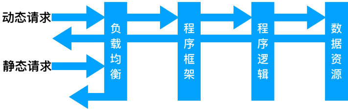

- **静态资源**：由 nginx 作为 web 服务器身份，直接返回
- **动态资源**：nginx 将请求转发出去，交给后端应用服务器处理

#### 3.4.2. 负载均衡

当网站的访问量达到一定程度后，单台服务器不能满足用户的请求时，需要用多台服务器集群提升并行处理能力。并且多台服务器可以平均分担负载，不会因为某台服务器负载高宕机而某台服务器闲置的情况。这时使用nginx实现了机器之间的负载均衡。

#### 3.4.3. 配置介绍

详见[《Nginx 基础笔记》](/07-分布式架构&微服务架构/05-Nginx/01-Nginx笔记)
