# 第16章 服务调用链路追踪

> 注：此章节使用了 Spring Cloud Sleuth + Zipkin 的解决方案。更多内容详见[《Spring Cloud Sleuth》笔记](/分布式架构&微服务架构/SpringCloud/Spring-Cloud-Sleuth)

## 1. 链路追踪概述

### 1.1. 问题分析

随着分布式服务架构的流行，特别是**微服务**等设计理念在系统中的应用，每个服务变得越来越简单、纯粹，而复杂度被转移到了多个服务间协作的整体架构层面，各微服务间的调用关系也变得越来越复杂。通常一个由客户端发起的请求在后端系统中会经过多个不同的微服务调用来协同产生最后的请求结果，<font color=red>**这个过程就产生了一个服务调用链路**</font>。

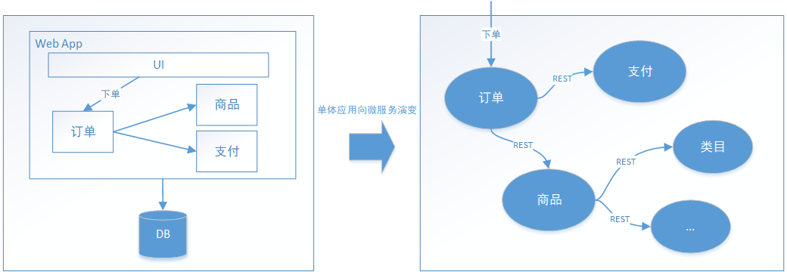

左图展示的是单体应用，在同一个进程中不同业务模块的相互调用；右图展示的是微服务架构，微服务间通过 rest 调用协作实现业务流程。随着业务的不断扩张，服务之间互相调用会越来越复杂

即使作为分布式系统的设计者、开发者，也很难清楚的说出某个服务的调用链路，况且服务调用链路还是动态变化的。在复杂的微服务架构系统中，几乎每一个前端请求都会形成一个复杂的分布式服务调用链路，一次请求少则经过三四次服务调用完成，多则跨越几十个甚至是上百个服务节点。

在这样的前提下，每条链路中任何一个依赖服务出现延迟过高或者错误都有可能引起请求最后的失败。并且当整个请求变慢或不可用时，开发人员是无法得知该请求是由某个或某些后端服务引起的。

### 1.2. 解决方案

#### 1.2.1. 错误分析的关键信息

在复杂微服务调用情况中发生错误时，至少需要得到以下信息用于分析并得出最优的解决方案：

1. **服务调用依赖图**，用于了解本次请求需要经过哪些服务才能顺利完成，可进行梳理服务依赖关系以及优化，如下图：

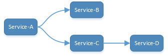

2. **服务调用链路错误信息**，若请求出现**错误**，快速定位哪个环节出现问题，各个调用环节的可用性分析，并优化，如下图：

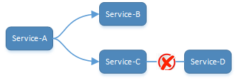

3. **服务调用链路中各阶段的耗时信息**，若请求出现**延迟**，可进行性能分析，并优化，如下图：

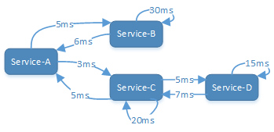

因此获取以上三点信息至关重要。可以在合适的位置(例如：微服务调用的前后)记录日志，然后对日志进行汇总、分析，即可获得以上三点信息，但是日志数据是纯文本，不便于观察，如果对日志进行汇总、分析时能支持图形化输出展示就更好了，于是业界慢慢形成了一个成熟完善的服务调用链路追踪系统。简单来说，服务调用链路追踪系统就是用来在生产环境跟踪、记录问题的，可以直观的看出每个 service 之间的调用关系和消耗的时间。下面以追踪日志举例：

| 请求追踪编号 | 服务  |   方法   |    执行前时间     |   执行完成时间    |
| ------------ | ----- | ------- | ---------------- | ---------------- |
| 1201         | 服务A | send    | 1458702548786000 | 1458702548886000 |
| 1201         | 服务B | receive | 1458702548926000 | 1458702549526000 |

追踪日志必须要有一个<font color=red>**请求追踪编号**</font>来表示多条日志为一个请求触发的多个服务调用，并记录执行的服务、方法执行前时间戳、执行完成时间戳等信息。以上追踪日志表示：编号为 1201 的这次请求经历了服务A.send方法、服务B.receive方法来完成整个请求链路。

#### 1.2.2. Spring Cloud Sleuth + Zipkin

Spring Cloud Sleuth + Zipkin 是 Java 开源体系中成熟的服务调用链路追踪方案，其中 Spring Cloud Sleuth 以 jar 包的形式嵌入在应用程序中，完成对追踪日志的采集并上报至 Zipkin，Zipkin 对所有服务上报来的日志进行汇总，分析，最终以图形化的形式展示给用户。

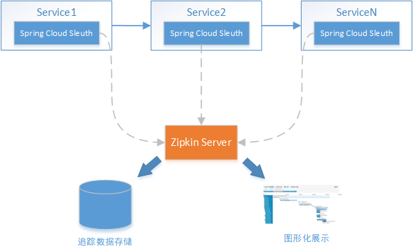

## 2. Spring Cloud Sleuth

Spring Cloud Sleuth 实现了一种分布式的服务链路跟踪解决方案，通过使用 Sleuth 可以让我们快速定位某个服务的问题。简单来说，Sleuth 相当于调用链监控工具的客户端，集成在各个微服务上，负责产生调用链监控数据。Spring Cloud Sleuth 可以结合 Zipkin，将信息发送到 Zipkin Server，利用 Zipkin 来存储和展示数据(详见前面章节的图示)

### 2.1. 基础使用

要在项目中使用 Spring Cloud Sleuth，只需要两步即可：

- 修改项目 pom.xml 文件，引入 sleuth 依赖

```xml
<dependencyManagement>
    <dependencies>
        <dependency>
            <groupId>org.springframework.cloud</groupId>
            <artifactId>spring-cloud-dependencies</artifactId>
            <version>${release.train.version}</version>
            <type>pom</type>
            <scope>import</scope>
        </dependency>
    </dependencies>
</dependencyManagement>

<dependencies>
    <dependency>
        <groupId>org.springframework.cloud</groupId>
        <artifactId>spring-cloud-starter-sleuth</artifactId>
    </dependency>
</dependencies>
```

- 修改 spring boot 配置

```properties
# 是否开启sleuth
spring.sleuth.enabled=true

# 添加日志级别（可选）
logging.level.org.springframework.web.servlet.DispatcherServlet=DEBUG
```

### 2.2. 入门案例简介

入门案例会创建两个微服务，并通过 RestTemplate 实现服务之间的调用，形成如下调用链：

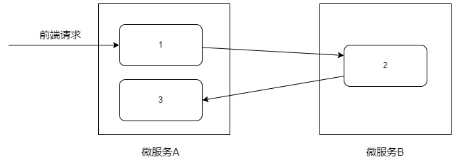

### 2.3. 功能实现

#### 2.3.1. 聚合父工程

创建 maven 聚合工程，引入依赖

```xml
<?xml version="1.0" encoding="UTF-8"?>
<project xmlns="http://maven.apache.org/POM/4.0.0"
         xmlns:xsi="http://www.w3.org/2001/XMLSchema-instance"
         xsi:schemaLocation="http://maven.apache.org/POM/4.0.0 http://maven.apache.org/xsd/maven-4.0.0.xsd">

    <parent>
        <groupId>org.springframework.boot</groupId>
        <artifactId>spring-boot-starter-parent</artifactId>
        <version>2.2.4.RELEASE</version>
        <relativePath/>
    </parent>

    <modelVersion>4.0.0</modelVersion>
    <groupId>com.moon</groupId>
    <artifactId>spring-cloud-sleuth-demo</artifactId>
    <version>1.0-SNAPSHOT</version>
    <packaging>pom</packaging>
    <description>
        Spring Cloud Sleuth 基础入门示例
    </description>

    <modules>
        <module>sleuth-demo1</module>
        <module>sleuth-demo2</module>
    </modules>

    <dependencyManagement>
        <dependencies>
            <dependency>
                <groupId>org.springframework.cloud</groupId>
                <artifactId>spring-cloud-dependencies</artifactId>
                <version>Greenwich.RELEASE</version>
                <type>pom</type>
                <scope>import</scope>
            </dependency>
        </dependencies>
    </dependencyManagement>

    <build>
        <finalName>${project.name}</finalName>
        <resources>
            <resource>
                <directory>src/main/resources</directory>
                <filtering>true</filtering>
                <includes>
                    <include>**/*</include>
                </includes>
            </resource>
            <resource>
                <directory>src/main/java</directory>
                <includes>
                    <include>**/*.xml</include>
                </includes>
            </resource>
        </resources>
        <plugins>
            <plugin>
                <groupId>org.springframework.boot</groupId>
                <artifactId>spring-boot-maven-plugin</artifactId>
            </plugin>

            <plugin>
                <groupId>org.apache.maven.plugins</groupId>
                <artifactId>maven-compiler-plugin</artifactId>
                <configuration>
                    <source>1.8</source>
                    <target>1.8</target>
                </configuration>
            </plugin>

            <plugin>
                <artifactId>maven-resources-plugin</artifactId>
                <configuration>
                    <encoding>utf-8</encoding>
                    <useDefaultDelimiters>true</useDefaultDelimiters>
                </configuration>
            </plugin>
        </plugins>
    </build>
</project>
```

#### 2.3.2. 微服务A

- 新建 Maven 子工程 sleuth-demo1，引入依赖

```xml
<dependencies>
    <dependency>
        <groupId>org.springframework.boot</groupId>
        <artifactId>spring-boot-starter-web</artifactId>
    </dependency>
    <dependency>
        <groupId>org.springframework.cloud</groupId>
        <artifactId>spring-cloud-starter-sleuth</artifactId>
    </dependency>
    <dependency>
        <groupId>org.projectlombok</groupId>
        <artifactId>lombok</artifactId>
    </dependency>
</dependencies>
```

- 项目 application.properties 配置文件

```properties
spring.application.name=sleuth-demo1
server.servlet.context-path=/sleuth1
server.port=58011

# 开启 Sleuth
spring.sleuth.enabled=true
```

- 项目启动类

```java
@SpringBootApplication
public class SleuthDemo1Application {

    public static void main(String[] args) {
        SpringApplication.run(SleuthDemo1Application.class, args);
    }

    @Bean
    public RestTemplate getRestTemplate() {
        return new RestTemplate();
    }
}
```

- 控制层

```java
@RestController
@Slf4j
public class TestController {

    @Autowired
    private RestTemplate restTemplate;

    @GetMapping("service1")
    public String node1() {
        log.info("Sleuth1_Service1");
        String sleuth2_service1 = restTemplate.getForObject("http://localhost:58012/sleuth2/service1", String.class);
        return "sleuth1_service1--->" + sleuth2_service1;
    }

    @GetMapping("service2")
    public String node2() {
        log.info("sleuth1_service2");
        return "sleuth1_service2";
    }
}
```

#### 2.3.3. 微服务B

- 新建 Maven 子工程 sleuth-demo2，引入依赖

```xml
<dependencies>
    <dependency>
        <groupId>org.springframework.boot</groupId>
        <artifactId>spring-boot-starter-web</artifactId>
    </dependency>
    <dependency>
        <groupId>org.springframework.cloud</groupId>
        <artifactId>spring-cloud-starter-sleuth</artifactId>
    </dependency>
    <dependency>
        <groupId>org.projectlombok</groupId>
        <artifactId>lombok</artifactId>
    </dependency>
</dependencies>
```

- 项目 application.properties 配置文件

```properties
spring.application.name=sleuth-demo2
server.servlet.context-path=/sleuth2
server.port=58012

# 开启 Sleuth
spring.sleuth.enabled=true
```

- 项目启动类

```java
@SpringBootApplication
public class SleuthDemo2Application {

    public static void main(String[] args) {
        SpringApplication.run(SleuthDemo2Application.class, args);
    }

    @Bean
    public RestTemplate getRestTemplate() {
        return new RestTemplate();
    }
}
```

- 控制层

```java
@RestController
@Slf4j
public class TestController {

    @Autowired
    private RestTemplate restTemplate;

    @GetMapping("service1")
    public String node1() {
        log.info("sleuth2_service1");
        String sleuth1_service2 =
                restTemplate.getForObject("http://localhost:58011/sleuth1/service2",String.class);
        return "sleuth2_service1--->"+sleuth1_service2 ;
    }
}
```

### 2.4. 功能测试

通过浏览器访问以下地址，进行测试

```
GET http://localhost:58011/sleuth1/service1
```

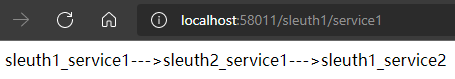

查看控制台日志输出：

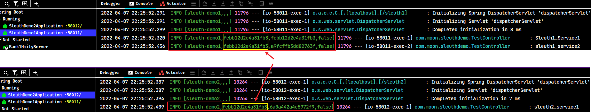

上图中的红框内容是在引入 Sleuth 之后多出来的日志，日志的格式为：`[applicationName, traceId, spanId, export]`，Sleuth 可以在发起每个请求时生成 traceId、spanId，同一个请求链路的 traceid 是一样的，每次调用生成的 spanid 的值是不一样的。

- `applicationName`：应用的名称，也就是 `application.properties` 配置文件中的 `spring.application.name` 属性的值。
- `traceId`：一个请求分配的 ID 号，用来标识一条请求链路。
- `spanId`：表示一个基本的工作单元，一个请求可以包含多个步骤，每个步骤都拥有自己的 spanId。
- `export`：布尔类型。表示是否要将该信息输出到类似 Zipkin 这样的追踪服务端进行收集和展示。

## 3. Zipkin

### 3.1. 简介

通过 Spring Cloud Sleuth 产生的调用链监控信息，可以得知微服务之间的调用链路，但是监控信息是通过日志查看，始终不太直观，且日志是分散在各个服务中的。因此需要集中存储追踪日志，并且需要一个图形化的工具去展示这些信息，此时可以使用 zipkin

Zipkin 是 Twitter 的一个开源项目，它致力于收集服务的实时数据，以解决微服务架构中的延迟问题，包括数据的收集、存储、查找和展现。可以使用它来收集各个服务器上请求链路的追踪数据，并通过它提供的 REST API 接口来查询跟踪数据以实现对分布式系统的监控程序，从而及时地发现系统中出现的延迟升高问题并找出系统性能瓶颈的根源。除了面向开发的 API 接口之外，它也提供了方便的 UI 组件来帮助直观的搜索跟踪信息和分析请求链路明细，比如：可以查询某段时间内各用户请求的处理时间等。

Zipkin 提供了可插拔数据存储方式：In-Memory、MySql、Cassandra 以及 Elasticsearch。

### 3.2. Zipkin 服务启动

Zipkin 服务端编译后 jar 包下载地址：https://search.maven.org/artifact/io.zipkin/zipkin-server

> 个人目前使用版本是：zipkin-server-2.23.16-exec.jar

进入 zipkin 的 jar 包所在位置，使用命令行启动 Zipkin 服务端：

```bash
java -jar zipkin-server-2.23.16-exec.jar
```

使用浏览器访问 http://localhost:9411/，访问图形化控制台，此时服务端启动成功。

### 3.3. Sleuth 与 Zipkin 集成

#### 3.3.1. 聚合工程

由于此示例涉及到服务注册中心、服务A、服务B 等三个工程，因此使用 maven 父工程来统一依赖管理。在父工程 pom 引入 spring boot 及 spring cloud 依赖：

```xml
<?xml version="1.0" encoding="UTF-8"?>
<project xmlns="http://maven.apache.org/POM/4.0.0"
         xmlns:xsi="http://www.w3.org/2001/XMLSchema-instance"
         xsi:schemaLocation="http://maven.apache.org/POM/4.0.0 http://maven.apache.org/xsd/maven-4.0.0.xsd">

    <parent>
        <groupId>org.springframework.boot</groupId>
        <artifactId>spring-boot-starter-parent</artifactId>
        <version>2.1.13.RELEASE</version>
    </parent>

    <modelVersion>4.0.0</modelVersion>
    <groupId>com.moon</groupId>
    <artifactId>spring-cloud-sleuth-zipkin-demo</artifactId>
    <version>1.0-SNAPSHOT</version>
    <packaging>pom</packaging>
    <description>
        Spring Cloud Sleuth 集成 zipkin 基础入门示例
    </description>

    <dependencyManagement>
        <dependencies>
            <dependency>
                <groupId>org.springframework.cloud</groupId>
                <artifactId>spring-cloud-dependencies</artifactId>
                <version>Greenwich.RELEASE</version>
                <type>pom</type>
                <scope>import</scope>
            </dependency>
        </dependencies>
    </dependencyManagement>

</project>
```

#### 3.3.2. Eureka 注册中心服务

- 创建注册中心服务 discovery-server，引用以下依赖：

```xml
<dependencies>
    <dependency>
        <groupId>org.springframework.cloud</groupId>
        <artifactId>spring-cloud-starter-netflix-eureka-server</artifactId>
    </dependency>

    <dependency>
        <groupId>org.springframework.boot</groupId>
        <artifactId>spring-boot-starter-actuator</artifactId>
    </dependency>
</dependencies>
```

- 创建 application.yml 配置文件

```yml
server:
  port: 58020
spring:
  application:
    name: sleuth-discovery
eureka:
  client:
    fetch-registry: false
    register-with-eureka: false
    serviceUrl:
      defaultZone: http://${eureka.instance.hostname}:${server.port}/eureka/
  instance:
    hostname: localhost
```

- 项目启动类，开启服务 eureka

```java
@SpringBootApplication
@EnableEurekaServer
public class DiscoveryServer {
    public static void main(String[] args) {
        SpringApplication.run(DiscoveryServer.class, args);
    }
}
```

#### 3.3.3. 微服务A

- 创建 service-a 项目，引入相关依赖

```xml
<dependencies>
    <dependency>
        <groupId>org.springframework.boot</groupId>
        <artifactId>spring-boot-starter-web</artifactId>
    </dependency>

    <dependency>
        <groupId>org.springframework.cloud</groupId>
        <artifactId>spring-cloud-starter-zipkin</artifactId>
    </dependency>

    <dependency>
        <groupId>org.springframework.cloud</groupId>
        <artifactId>spring-cloud-starter-netflix-eureka-client</artifactId>
    </dependency>

    <dependency>
        <groupId>org.springframework.cloud</groupId>
        <artifactId>spring-cloud-starter-openfeign</artifactId>
    </dependency>

    <dependency>
        <groupId>org.springframework.cloud</groupId>
        <artifactId>spring-cloud-starter-netflix-hystrix</artifactId>
    </dependency>
</dependencies>
```

- 创建 application.yml 配置文件

```yml
server:
  port: 58021
  servlet:
    context-path: /service-a
spring:
  application:
    name: sleuth-with-zipkin-service-a
  sleuth:
    enabled: true # 开启Sleuth
    sampler:
      probability: 1 # 采样率，取值范围 0-1
  zipkin:
    base-url: http://localhost:9411 # 指定 zipkin server 的地址,上报追踪日志

eureka:
  client:
    serviceUrl:
      defaultZone: http://localhost:58020/eureka/
```

- 创建项目启动类，在类上标识 `@EnableFeignClients` 注解开启 feign 支持
- 创建服务B 的 feign 代理接口

```java
@FeignClient(name = "sleuth-with-zipkin-service-b")
public interface ServiceBAgent {

    @GetMapping("/service-b/service")
    String service();
}
```

- 测试请求接口

```java
@RestController
public class ServiceAController {

    @Autowired
    private ServiceBAgent serviceBAgent;

    @GetMapping("service1")
    public String service1() {
        String serviceb = serviceBAgent.service();
        return "service-a-service1" + "--->" + serviceb;
    }

    @GetMapping("service2")
    public String service2() {
        return "service-a-service2";
    }
}
```

#### 3.3.4. 微服务B

- 创建 service-b 项目，引入相关依赖(与微服务A一样)
- 创建 application.yml 配置文件

```yml
server:
  port: 58022
  servlet:
    context-path: /service-b
spring:
  application:
    name: sleuth-with-zipkin-service-b
  sleuth:
    enabled: true # 开启Sleuth
    sampler:
      probability: 1 # 采样率，取值范围 0-1
  zipkin:
    base-url: http://localhost:9411 # 指定 zipkin server 的地址,上报追踪日志

eureka:
  client:
    serviceUrl:
      defaultZone: http://localhost:58020/eureka/
```

- 创建项目启动类，在类上标识 `@EnableFeignClients` 注解开启 feign 支持
- 创建服务B 的 feign 代理接口

```java
@FeignClient(name = "sleuth-with-zipkin-service-a")
public interface ServiceAAgent {

    @GetMapping("/service-a/service2")
    String service2();
}
```

- 测试请求接口

```java
@RestController
public class ServiceBController {

    @Autowired
    private ServiceAAgent serviceAAgent;

    @GetMapping("service")
    public String service() {
        String service2 = serviceAAgent.service2();
        // int a = 10 / 0; // 模拟异常
        return "service-b-service" + "--->" + service2;
    }
}
```

#### 3.3.5. 功能测试

##### 3.3.5.1. zipkin 配置补充说明

```yml
spring:
  sleuth:
    sampler:
      probability: 1 # 采样率，取值范围 0-1
```

上面配置是设置 zipkin 的采样率，追踪日志由 Sleuth 产生，日志的采集由 Zipkin 负责，采集多少数据可以通过采样率(取值范围0-1)进行控制。假设一次请求包含四次微服务调用，如果采样率设置为1，即对所有调用产生的日志进行采集；如果采样率设置为0.5，即只对一半调用产生的日志进行采集。采集率越高，数据越丰富，但是采集压力和负担也大，所以在实际开发中，采样率并不是越高越好，视情况而定。

##### 3.3.5.2. 正常情况测试

启动 Zipkin，启动注册中心和两个微服务，然后通过浏览器访问 http://localhost:58021/service-a/service1

查看控制台日志输出，如下图所示：

使用浏览器访问 http://localhost:9411/，点击查找，可以查看到刚刚测试产生的服务调用链路信息。点击链路信息后，可以进入到服务链路的详情页面，在这里可以看到整条服务链路，并且可以看到每一
个服务调用(span)的耗时：

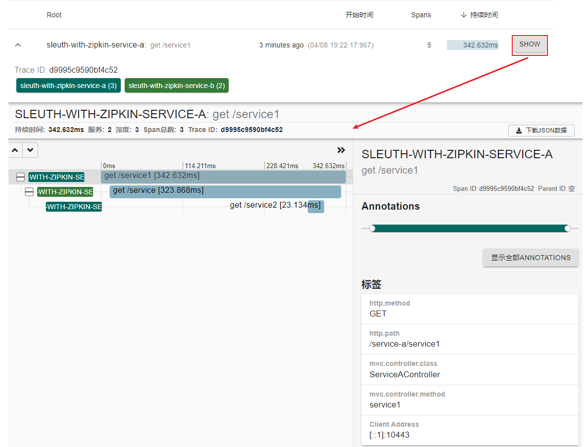

点击左侧区域中每一行信息(span)，在右侧区域可查看其详细信息

##### 3.3.5.3. 异常情况测试

在 ServiceBController 类中制造异常，然后重启微服务B，再次进行功能测试：

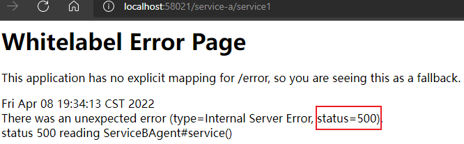

图中红色部分为异常请求，点击可以查看详细信息，如下图所示：

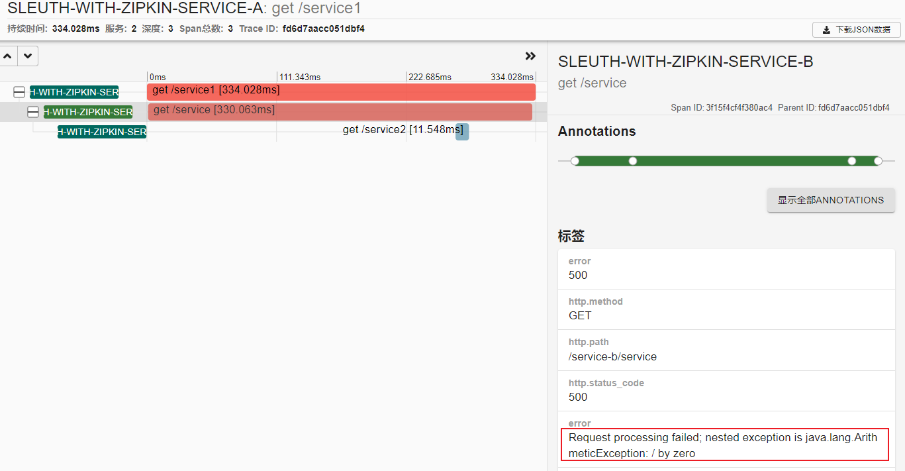

### 3.4. Zipkin 与 Elasticsearch 集成

Zipkin 默认是将监控数据存储在内存的，如果 Zipkin 服务挂掉或重启的话，那么监控数据就会丢失。如果想要搭建生产环境下可用的 Zipkin，就需要实现监控数据的持久化。以下是 Elasticsearch 作为 Zipkin 的持久化方案。

#### 3.4.1. 集成步骤

- 下载、配置并启动 Elasticsearch 及 head 插件(*注意：Elasticsearch 的版本不要超过6.0*)
- 通过下面命令启动 Zipkin 服务端

```bash
java -DSTORAGE_TYPE=elasticsearch -DES_HOSTS=http://localhost:9200 -jar zipkin-server-2.23.16-exec.jar
```

> 命令参数解释： 
>
> - `STORAGE_TYPE` 用于指定 Zipkin 的存储类型，这里为 elasticsearch
> - `ES_HOSTS` 则用于指定 Elasticsearch 服务器地址列表，有多个节点时使用逗号分隔

#### 3.4.2. 集成测试

- 启动所有相关服务后，再次通过浏览器访问 http://localhost:58021/service-a/service1
- 在 es-head(http://localhost:9100/) 中观察到产生了如下索引：

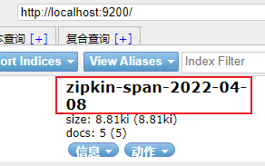

- 浏览该索引中存储的数据

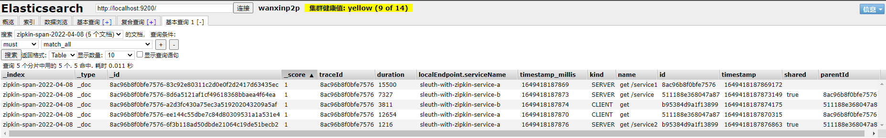

### 3.5. 小结

到目前为止，已基本完成使用 Spring Cloud Sleuth + Zipkin 建设一个完整的分布式追踪系统。Spring Cloud Sleuth 作为客户端嵌入在微服务内，当发生微服务间调用时就会产生追踪日志并上报给Zipkin 服务端，而 Zipkin 会聚合所有微服务的追踪日志，进行数据存储、分析与展示。最终，用户可通过 Zipkin 的 UI 直观的获得网络延迟、调用链路、系统依赖等信息，从而决策如何对系统进行优化、调整。

## 4. 万信金融项目集成服务链路追踪

### 4.1. 集成步骤

- 在 wanxinp2p-api 工程的 pom.xml 中增加 Spring Cloud Sleuth 与 Zipkin 的依赖。（因为多数）

```xml
<dependency>
    <groupId>org.springframework.cloud</groupId>
    <artifactId>spring-cloud-starter-sleuth</artifactId>
</dependency>
<dependency>
    <groupId>org.springframework.cloud</groupId>
    <artifactId>spring-cloud-starter-zipkin</artifactId>
</dependency>
```

- 在 Apollo 配置中心的 common-template 项目中新建 `micro_service.spring-zipkin` 名称空间，并增加 Spring Cloud Sleuth 与 Zipkin 的配置：

```properties
# 开启sleuth
spring.sleuth.enabled=true
# 设置zipkin服务地址
spring.zipkin.base-url=http://localhost:9411
# 采样率，取值范围0-1
spring.sleuth.sampler.probability=1
```

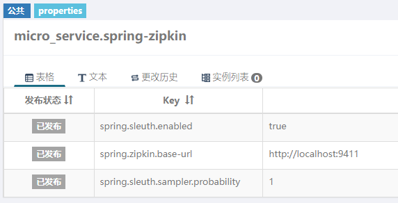

- 在 Apollo 的其他项目中(例如：account-service、gateway-server、uaa、consumer-service...)，关联 `micro_service.spring-zipkin` 名称空间
- 在相关微服务的 application.yml 中引入 `micro_service.spring-zipkin` 名称空间

### 4.2. 集成测试

以登录功能为例进行测试

#### 4.2.1. 启动服务

1. 启动 Apollo、zipkin 服务
2. 后端需要启动：
    - wanxinp2p-discover-server 微服务
    - wanxinp2p-gateway-server 微服务
    - wanxinp2p-uaa-service 微服务
    - wanxinp2p-account-service 微服务
    - wanxinp2p-consumer-service 微服务
3. 启动H5前端

#### 4.2.2. 测试步骤

- 访问H5页面，进行登陆操作
- 使用浏览器访问 http://localhost:9411/，查看调用链路信息与依赖分析

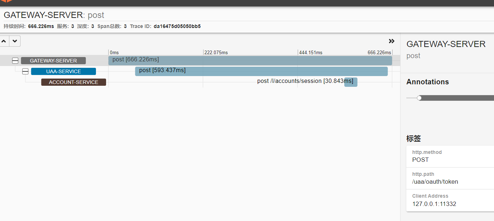

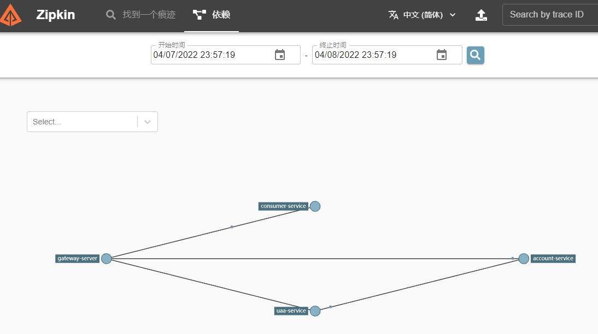

可以看出登录操作的服务调用路径为：gateway-server(网关) -> uaa -> account-service(统一账户)
