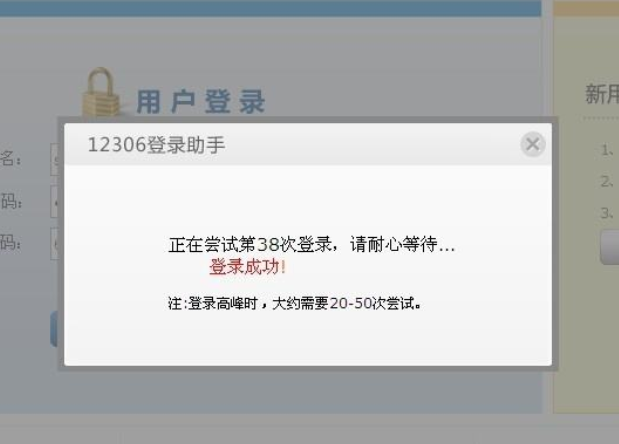
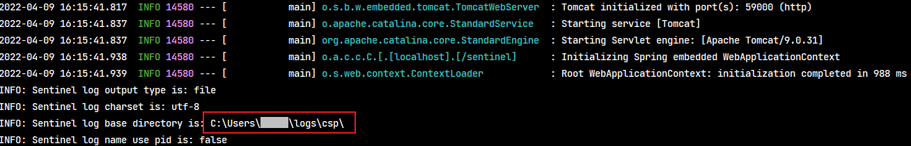
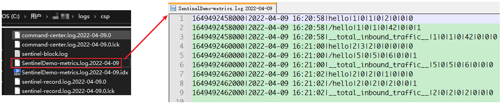
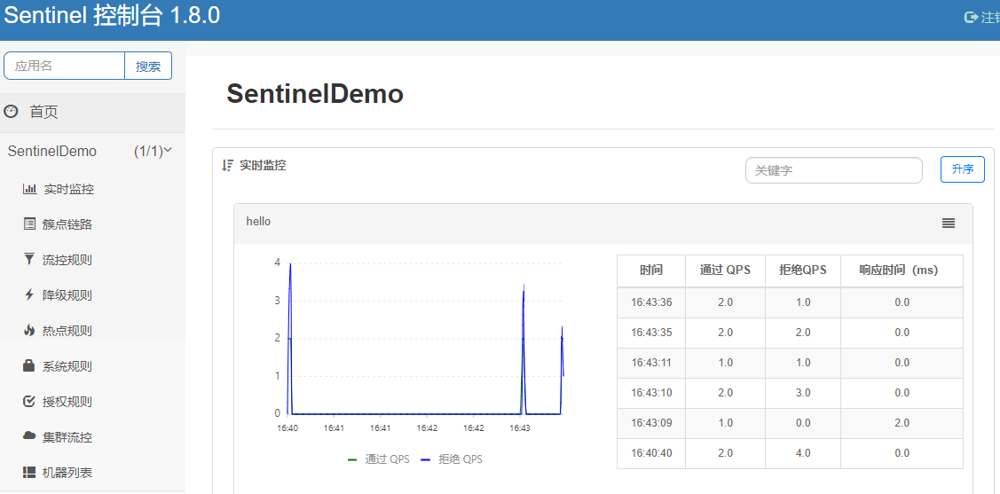
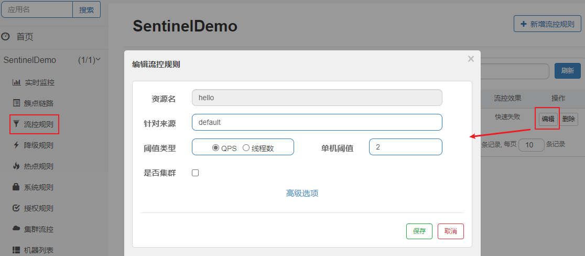
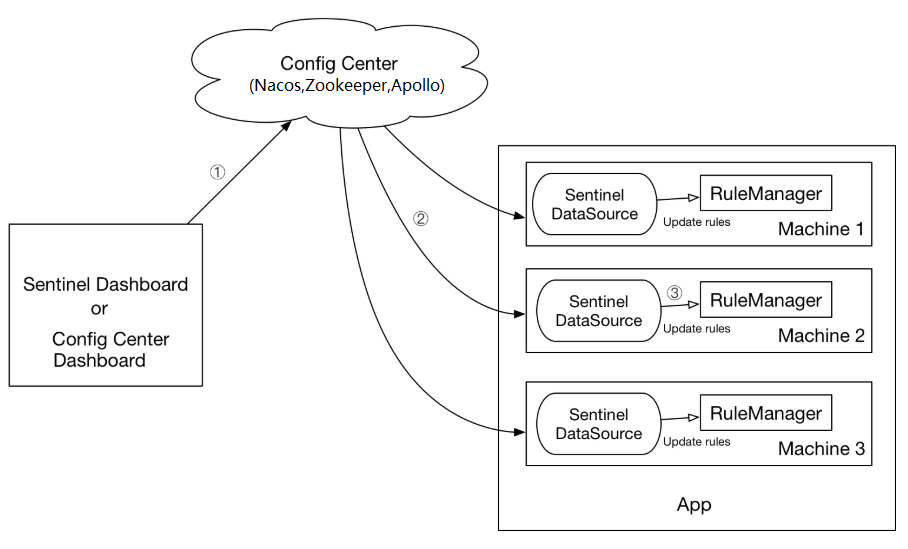
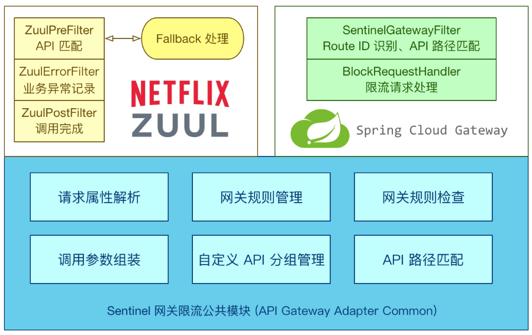
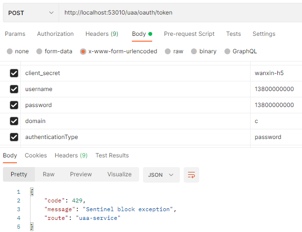

# 第17章 Sentinel 限流

> Spring Cloud Alibaba Sentinel 的更多内容详见[《Spring Cloud Alibaba》笔记](/分布式架构&微服务架构/SpringCloud/Spring-Cloud-Alibaba?id=spring-cloud-alibaba-sentinel)

## 1. 限流概述

### 1.1. 问题分析

在软件系统中，如果一个系统每天可服务100万用户，突然有一天来了500万，如果对系统进行限流，很有可能导致这500万用户一下子就压垮系统，导致只有少数的用户实际完成服务。因此为了保证系统至少还能为这100万用户提供正常服务，需要对系统进行限流设计。



**限流的定义：就是限制系统的输入和输出流量，达到保护系统的目的。**

一般来说系统的吞吐量是可以被测算的，为了保证系统的稳定运行，一旦达到的需要限制的阈值，就需要采取一些措施以完成限制流量的目的。比如：延迟处理，拒绝处理，或者部分拒绝处理等等。

### 1.2. Sentinel 简介

目前比较流行的就是通过限流算法，常见的有计数器算法、令牌桶算法、漏桶算法和滑动窗口算法。行业中已有成熟的框架去实现限流，而这些框架内部会采用一些限流算法。

随着微服务的流行，服务和服务之间的稳定性变得越来越重要。Sentinel 是阿里巴巴开源的**面向分布式服务架构的轻量级流量控制框架**，主要以流量为切入点，从流量控制、熔断降级、系统负载保护等多个维度来保护服务的稳定性，*下面主要介绍流量控制*。

#### 1.2.1. 发展历史

- 2012 年，Sentinel 诞生，主要功能为入口流量控制。
- 2013-2017 年，Sentinel 在阿里巴巴集团内部迅速发展，成为基础技术模块，覆盖了所有的核心场景。Sentinel 也因此积累了大量的流量归整场景以及生产实践。
- 2018 年，Sentinel 开源。

#### 1.2.2. 主要特性

- **丰富的应用场景**：Sentinel 承接了阿里巴巴近 10 年的双十一大促流量的核心场景，例如秒杀（即突发流量控制在系统容量可以承受的范围）、消息削峰填谷、集群流量控制、实时熔断下游不可用应用等。
- **完备的实时监控**：Sentinel 同时提供实时的监控功能。您可以在控制台中看到接入应用的单台机器秒级数据，甚至 500 台以下规模的集群的汇总运行情况。
- **广泛的开源生态**：Sentinel 提供开箱即用的与其它开源框架/库的整合模块，例如与 Spring Cloud、Dubbo、gRPC 的整合。您只需要引入相应的依赖并进行简单的配置即可快速地接入Sentinel。
- **完善的 SPI 扩展点**：Sentinel 提供简单易用、完善的 SPI 扩展接口。您可以通过实现扩展接口来快速地定制逻辑。例如定制规则管理、适配动态数据源等。

#### 1.2.3. 组成部分

Sentinel 的使用可以分为两个部分:

- 核心库（Java 客户端）：不依赖任何框架/库，能够运行于 Java 8 及以上的版本的运行时环境，同时对 Dubbo / Spring Cloud 等框架也有较好的支持。
- 控制台（Dashboard）：Dashboard 主要负责管理推送规则、监控、管理机器信息等。基于 Spring Boot 开发，打包后可以直接运行，不需要额外的 Tomcat 等应用容器。

> 核心库不依赖 Dashboard，但是结合 Dashboard 可以取得最好的效果。

## 2. Sentinel 基础使用

### 2.1. 实现限流步骤

使用 Sentinel 来实现限流，主要分为几个步骤：

1. 定义资源，这里的资源可以是任何东西，例如某个服务，某个服务里的方法，甚至是一段代码。
2. 定义规则，指的是流量控制规则
3. 检验规则是否生效

先把可能需要保护的资源定义好，之后再配置规则。也可以理解为，只要有了资源，就可以在任何时候灵活地定义各种流量控制规则。在编码的时候，只需要考虑这个代码是否需要保护，如果需要保护，就将之定义为一个资源。

对于主流框架，Sentinel 都提供了适配，只需要按照适配中的说明配置，Sentinel 就会默认定义提供的服务，方法等为资源。

### 2.2. 入门案例

#### 2.2.1. 示例项目搭建与依赖

- 创建名为 sentinel-demo 的 maven 工程，引入以下依赖

```xml
<?xml version="1.0" encoding="UTF-8"?>
<project xmlns="http://maven.apache.org/POM/4.0.0"
         xmlns:xsi="http://www.w3.org/2001/XMLSchema-instance"
         xsi:schemaLocation="http://maven.apache.org/POM/4.0.0 http://maven.apache.org/xsd/maven-4.0.0.xsd">

    <parent>
        <groupId>org.springframework.boot</groupId>
        <artifactId>spring-boot-starter-parent</artifactId>
        <version>2.1.13.RELEASE</version>
    </parent>

    <modelVersion>4.0.0</modelVersion>
    <groupId>com.moon</groupId>
    <artifactId>sentinel-demo</artifactId>
    <version>1.0-SNAPSHOT</version>

    <properties>
        <maven.compiler.source>8</maven.compiler.source>
        <maven.compiler.target>8</maven.compiler.target>
    </properties>

    <dependencyManagement>
        <dependencies>
            <dependency>
                <groupId>org.springframework.cloud</groupId>
                <artifactId>spring-cloud-dependencies</artifactId>
                <version>Greenwich.RELEASE</version>
                <type>pom</type>
                <scope>import</scope>
            </dependency>
        </dependencies>
    </dependencyManagement>

    <dependencies>
        <dependency>
            <groupId>org.springframework.boot</groupId>
            <artifactId>spring-boot-starter-web</artifactId>
        </dependency>
        <dependency>
            <groupId>org.springframework.cloud</groupId>
            <artifactId>spring-cloud-starter</artifactId>
        </dependency>
        <!-- sentinel 依赖，版本号参考官方方法：
            https://github.com/alibaba/spring-cloud-alibaba/wiki/%E7%89%88%E6%9C%AC%E8%AF%B4%E6%98%8E
         -->
        <dependency>
            <groupId>com.alibaba.cloud</groupId>
            <artifactId>spring-cloud-starter-alibaba-sentinel</artifactId>
            <version>2.1.4.RELEASE</version>
        </dependency>
    </dependencies>

    <build>
        <plugins>
            <plugin>
                <groupId>org.springframework.boot</groupId>
                <artifactId>spring-boot-maven-plugin</artifactId>
            </plugin>
        </plugins>
    </build>

</project>
```

- 创建项目 配置文件

```yml
server:
  port: 59000
  servlet:
    context-path: /sentinel
spring:
  application:
    name: SentinelDemo
```

- 创建项目启动类

```java
@SpringBootApplication
public class SentinelDemoApplication {
    public static void main(String[] args) {
        SpringApplication.run(SentinelDemoApplication.class, args);
    }
}
```

#### 2.2.2. 定义资源与规则

```java
@Service
public class TestService {

    /**
     * 标识资源
     *
     * @return
     */
    @SentinelResource(value = "hello", blockHandler = "exceptionHandler")
    public String hello() {
        return "Hello Sentinel";
    }

    /**
     * 资源被限制后的执行的逻辑
     *
     * @param ex
     * @return
     */
    public String exceptionHandler(BlockException ex) {
        ex.printStackTrace();
        return "系统繁忙，请稍候";
    }

    /**
     * 定义了限流资源和限流规则，使用 @PostConstruct 注解，让类在构造方法执行完毕后会自动运行
     */
    @PostConstruct
    public void initFlowRules() {
        List<FlowRule> rules = new ArrayList<>();

        // 封装限流规则
        FlowRule rule = new FlowRule();
        rule.setResource("hello");
        rule.setGrade(RuleConstant.FLOW_GRADE_QPS);
        rule.setCount(2);

        rules.add(rule);

        // 加载限流规则，使其启用
        FlowRuleManager.loadRules(rules);
    }
}
```

- `@SentinelResource` 注解用来标识是否是资源，会被限流、降级。上述例子中该注解的属性 `value = "hello"` 表示资源名。
- `@SentinelResource` 还提供了其它额外的属性如 `blockHandler` 来指定被限流后的操作。
- `initFlowRules` 方法内定义了限流资源和限流规则，在构造方法执行完毕后会自动运行

#### 2.2.3. 请求控制层

创建请求接口，用于测试并调用业务层接口

```java
@RestController
public class TestController {

    @Autowired
    private TestService testService;

    @GetMapping("hello")
    public String hello() {
        return testService.hello();
    }
}
```

#### 2.2.4. 功能测试

通过浏览器访问 http://localhost:59000/sentinel/hello，慢速刷新，则持续显示 `Hello Sentinel`；快速刷新则会交替出现 `Hello Sentinel` 与 `系统繁忙，请稍候`。这说明对 hello 资源限流成功。

还可以通过查看日志获取限流详情，日志文件的位置可以在控制台找到(下图中红框处)。



在该目录下找到 `SentinelDemo-metrics.log.yyyy-MM-dd` 文件，查看该文件内容如下所示：



### 2.3. Sentinel-Dashboard 图形化控制台

Sentinel 提供一个轻量级的开源控制台（Dashboard），它提供机器发现以及健康情况管理、监控（单机和集群），规则管理和推送的功能。可以从官方网站中下载最新版本编译后的控制台 jar 包，*本次示例使用v1.8.0版本*

> 官网下载地址：https://github.com/alibaba/Sentinel/releases/

#### 2.3.1. 启动服务

下载 jar 包后，通过如下命令启动 Dashboard：

```bash
java -Dserver.port=9898 -jar sentinel-dashboard-1.8.0.jar
```

> 注意：需要 JDK 版本为 1.8 及以上版本

通过浏览器打开 http://localhost:9898 即可访问 Dashboard，默认用户名和密码都是 `sentinel`

#### 2.3.2. 示例项目接入 Dashboard 控制台

在示例项目 application.yml 中增加如下配置：

```yml
spring:
  cloud:
    sentinel:
      transport:
        # 设置 dashboard 的地址
        dashboard: localhost:9898
```

重启微服务并重新通过浏览器访问 http://localhost:59000/sentinel/hello，快慢速刷新几次。通过控制台可以查看到相应的接口情况



前面示例是通过 Java 代码来设置限流规则，同时 Sentinel 也支持通过 Dashboard 图形化控制台来设置限流规则，如下图所示：



### 2.4. 限流规则详解

#### 2.4.1. 限流规则参数

一条限流规则主要由下面几个元素组成，可以组合这些元素来实现不同的限流效果：

- `resource` : 资源名，即限流规则的作用对象
- `grade` : 限流阈值类型（QPS 或并发线程数）
- `count` : 限流阈值
- `limitApp` : 流控针对的调用来源，若为 default 则不区分调用来源
- `controlBehavior` : 流量控制效果（直接拒绝、Warm Up、匀速排队等待）
    - **直接拒绝**（RuleConstant.CONTROL_BEHAVIOR_DEFAULT）方式是默认的流量控制方式，当 QPS 超过任意规则的阈值后，新的请求就会被立即拒绝，拒绝方式为抛出 `FlowException`。这种方式适用于对系统处理能力确切已知的情况下，比如通过压测确定了系统的准确水位时。
    - **Warm Up**（RuleConstant.CONTROL_BEHAVIOR_WARM_UP）方式，即预热/冷启动方式。当系统长期处于低水位的情况下，当流量突然增加时，直接把系统拉升到高水位可能瞬间把系统压垮。通过"冷启动"，让通过的流量缓慢增加，在一定时间内逐渐增加到阈值上限，给冷系统一个预热的时间，避免冷系统被压垮。
    - **排队等待**（RuleConstant.CONTROL_BEHAVIOR_RATE_LIMITER）方式会严格控制请求通过的间隔时间，也即是让请求以均匀的速度通过，对应的是漏桶算法。

#### 2.4.2. 动态规则

前面不管是通过 Java 代码还是通过 Dashboard 的方式去设置限流规则，都属于手动方式，不够灵活。这种方式一般仅用于测试和演示，生产环境上一般通过动态规则源的方式来动态管理限流规则。也就是说，很多时候限流规则会被存储在文件、数据库或者配置中心当中。Sentinel 的 `DataSource` 接口提供了对接任意配置源的能力。

官方推荐<font color=red>**通过控制台设置规则后将规则推送到统一的规则中心，客户端实现 `ReadableDataSource` 接口端监听规则中心实时获取变更**</font>，流程如下：



常见的实现方式有：

- **拉取式**：客户端主动向某个规则管理中心定期轮询拉取规则，这个规则中心可以是 RDBMS、文件，甚至是 VCS 等。这样做的方式是简单，缺点是无法及时获取变更；实现拉模式的数据源最简单的方式是继承 `AutoRefreshDataSource` 抽象类，然后实现 `readSource()` 方法，在该方法里从指定数据源读取字符串格式的配置数据。
- **推送式**：规则中心统一推送，客户端通过注册监听器的方式时刻监听变化，比如使用 Nacos、Zookeeper、Apollo 等配置中心。这种方式有更好的实时性和一致性保证。实现推模式的数据源最简单的方式是继承 `AbstractDataSource` 抽象类，在其构造方法中添加监听器，并实现 `readSource()` 从指定数据源读取字符串格式的配置数据。

**下面使用 Apollo 配置规则**

Sentinel 针对携程 Apollo 作了相应适配，底层可以采用 Apollo 作为规则配置数据源。使用时只需添加以下依赖：

```xml
<dependency>
    <groupId>com.alibaba.csp</groupId>
    <artifactId>sentinel-datasource-apollo</artifactId>
    <version>1.6.2</version>
</dependency>
```

然后创建 `ApolloDataSource` 并将其注册至对应的 `RuleManager` 上即可。例如：

```java
// namespaceName 对应Apollo的命名空间名称
// ruleKey 对应规则存储的key
// defaultRules 对应连接不上Apollo时的默认规则
ReadableDataSource<String, List<FlowRule>> flowRuleDataSource = new
ApolloDataSource<>(namespaceName, ruleKey, defaultRules, source ->
JSON.parseObject(source, new TypeReference<List<FlowRule>>() {}));
FlowRuleManager.register2Property(flowRuleDataSource.getProperty());
```

> 注：具体的使用，详见下个章节与万信金融项目整合

## 3. 万信金融项目实现网关限流

万信金融 P2P 平台在发展过程中，吞吐量也会与日俱增，为了保证系统稳定性，需要考虑使用 Sentinel 进行限流。由于该平台使用 HTTP 网关作为系统的唯一入口，因此使用 Sentinel 的网关限流模式。

### 3.1. 网关限流概述

Sentinel 支持整合 Spring Cloud Gateway、Zuul 等主流的网关进行限流。Sentinel 1.6.0 引入了 Sentinel API Gateway Adapter Common 模块，此模块中包含网关限流的规则和自定义 API。整体架构如下图所示：



### 3.2. 限流功能实现

万信金融 p2p 项目采用 spring cloud zuul 作为网关，采用携程 apollo 作为配置中心。因此可以使用 Sentinel 集成 Zuul，并采用 apollo 作为限流规则数据源。

> 可参考官方详细文档 [网关限流 - Zuul 1.x](https://github.com/alibaba/Sentinel/wiki/%E7%BD%91%E5%85%B3%E9%99%90%E6%B5%81#zuul-1x)

#### 3.2.1. 添加依赖

在父工程 pom 文件中(wanxinp2p/pom.xml)，增加如下依赖管理：

```xml
<dependency>
    <groupId>com.alibaba.csp</groupId>
    <artifactId>sentinel-zuul-adapter</artifactId>
    <version>1.6.2</version>
</dependency>

<dependency>
    <groupId>com.alibaba.csp</groupId>
    <artifactId>sentinel-datasource-apollo</artifactId>
    <version>1.6.2</version>
</dependency>
```

在网关工程的 pom 文件中(wanxinp2p-gateway-server/pom.xml)，增加上面的依赖：

```xml
<!-- sentinel 限流相关依赖 -->
<dependency>
    <groupId>com.alibaba.csp</groupId>
    <artifactId>sentinel-zuul-adapter</artifactId>
</dependency>
<dependency>
    <groupId>com.alibaba.csp</groupId>
    <artifactId>sentinel-datasource-apollo</artifactId>
</dependency>
```

#### 3.2.2. Sentinel 与 zuul 集成相关配置

使用的是 Spring Cloud Netflix Zuul，在 wanxinp2p-gateway-server 工程 config 包的 `ZuulConfig` 配置类中，直接创建三个限流过滤器 filter 并注入到 Spring 环境中，作为 Zuul 与 Sentinel 的集成点：

```java
@Configuration
public class ZuulConfig {
    // ....省略
    /**
     * pre过滤器，在请求路由之前进行限流操作
     */
    @Bean
    public ZuulFilter sentinelZuulPreFilter() {
        // We can also provider the filter order in the constructor.
        return new SentinelZuulPreFilter();
    }

    /**
     * post过滤器，路由之后恢复资源
     */
    @Bean
    public ZuulFilter sentinelZuulPostFilter() {
        return new SentinelZuulPostFilter();
    }

    /**
     * error过滤器，异常后的处理
     */
    @Bean
    public ZuulFilter sentinelZuulErrorFilter() {
        return new SentinelZuulErrorFilter();
    }
}
```

#### 3.2.3. 设置动态规则

> 可参考官方文档 [动态规则扩展](https://sentinelguard.io/zh-cn/docs/dynamic-rule-configuration.html)

在 Apollo 配置中心中找到网关项目(gateway-server)，在 application 命名空间中新增限流规则配置

```properties
sentinel.rule.gateway-flow-rule=[{"resource": "uaa-service","resourceMode": 0,"grade": 1,"count": 2,"intervalSec": 1,"controlBehavior": 0,"burst": 0,"maxQueueingTimeoutMs": 500,"paramItem": {} }]
```

配置值解析：

```js
[
    {
        "resource": "uaa-service", // 对应zuul的routes，这里的资源指的是统一认证服务
        "resourceMode": 0, // 网关模式
        "grade": 1, // QPS限流模式
        "count": 2, // 上限值
        "intervalSec": 1, // 统计时间窗口，单位是秒，默认是1秒
        "controlBehavior": 0, // 流量控制效果（直接拒绝、Warm Up、匀速排队等待）
        "burst": 0, // 应对突发请求时额外允许的请求数目
        "maxQueueingTimeoutMs": 500, // 匀速排队模式下的最长排队时间，单位是毫秒，仅在匀速排队模式下生效
        "paramItem": { // 动态参数，目前不需要
        }
    }
]
```

在 `ZuulConfig` 配置类中增加限流规则配置，采用 apollo 作为 Sentinel 的动态规则数据源(前提是该项目已正确配置 apollo 并能够成功连接)。

```java
/**
 * 从Apollo上获取限流规则并进行配置
 */
@PostConstruct
private void initGatewayRules() {
    // namespaceName 对应 Apollo 的命名空间名称
    String namespaceName = "application";
    // ruleKey 对应规则存储的 key
    String ruleKey = "sentinel.rule.gateway-flow-rule";
    // defaultRules 对应连接不上 Apollo 时的默认规则
    String defaultRules = "";
    // 从Apollo上获取限流规则并封装到ApolloDataSource
    ReadableDataSource<String, Set<GatewayFlowRule>> flowRuleDataSource = new ApolloDataSource<>(
            namespaceName, ruleKey, defaultRules,
            source -> JSON.parseObject(source, new TypeReference<Set<GatewayFlowRule>>() {
            })
    );
    // 注册限流规则
    GatewayRuleManager.register2Property(flowRuleDataSource.getProperty());
}
```

### 3.3. 功能测试

由于登录业务中涉及到 uaa-service，所以这里就以登录功能为例进行测试。

为了测试方便，通过 Postman 频繁发送登录请求

```json
POST http://localhost:53010/uaa/oauth/token
```

如果一秒内的访问次数超过两次，将会得到如下信息：

```json
{
    "code": 429,
    "message": "Sentinel block exception",
    "route": "uaa-service"
}
```



也可以结合 Dashboard 图形化控制台观察效果
