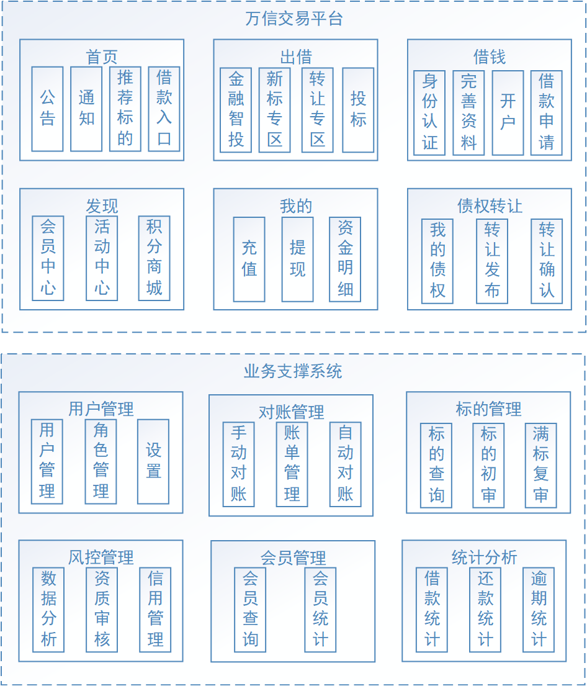

# 第01章 项目介绍与开发环境搭建

## 1. 项目介绍

### 1.1. 项目背景

P2P金融又叫P2P信贷，P2P是 peer-to-peer 或 person-to-person 的简写，意思是个人对个人，P2P金融是指个人与个人间的小额借贷交易，一般需要借助电子商务专业网络平台帮助借贷双方确立借贷关系并完成相关交易手续。

目前，国家对P2P行业的监控与规范性控制越来越严格，出台了很多政策来对其专项整治，P2P平台之前所采用的“资金池模式”与“第三方支付托管”（见下文定义）已经不合规了，国家主张采用“银行存管模式”来规避P2P平台挪用借投人资金的风险，通过银行开发的“银行存管系统”管理投资者的资金，每位P2P平台用户在银行的存管系统内都会有一个独立账号，P2P平台来管理交易，做到资金和交易分开，让P2P平台不能接触到资金，就可以一定程度避免资金被挪用的风险。

#### 1.1.1. 什么是资金池模式？

此模式下，投资人利用第三方支付/银行的通道先把资金打到平台的银行账户，P2P的平台就池子一样，汇聚了投资人和借款人的资金，这个汇集资金的池子叫做资金池，是P2P平台方最容易跑路的模式。

#### 1.1.2. 什么是第三方支付托管模式？

此模式下，投资人/借款人除了要在P2P平台注册外，还要在第三方支付平台注册，也就是平台和第三方各有一套账户体系。经过第三方支付的资金托管后，由于资金沉淀发生在第三方支付在银行的备付金账户上，P2P平台运营方只能看到投资人/借款人账户余额的变化及债权匹配关系，不能像资金池那样擅自挪用投资人的钱，但是这里存在安全风险的是第三方支付机构。

#### 1.1.3. 什么是银行存管模式？

此种模式下，涉及到2套账户体系，P2P平台和银行各一套账户体系。投资人在P2P平台注册后，会同时跳转到银行再开一个电子账户，2个账户间有一一对应的关系。当投资人投资时，资金进入的是平台在银行为投资人开设的二级账户中，每一笔交易，是由银行在投资人与借款人间的交易划转，P2P平台仅能看到信息的流动。


### 1.2. 项目概述

本项目开发的万信金融是一款面向互联网大众提供的理财服务和个人消费信贷服务的金融平台，依托大数据风控技术，为用户提供方便、快捷、安心的P2P金融服务。本项目包括交易平台和业务支撑两个部分，

- 交易平台主要实现理财服务，包括：借钱、出借等模块
- 业务支撑包括：标的管理、对账管理、风控管理等模块。

项目采用先进的互联网技术进行研发，保证了P2P双方交易的安全性、快捷性及稳定性。

### 1.3. 功能模块



| 功能模块名称 |                                                  功能说明                                                  |
| :---------: | --------------------------------------------------------------------------------------------------------- |
|     首页     | 用于快速进入理财服务的入口。                                                                                 |
|     借钱     | 借款人通过借钱模块完成发标操作，首先借款人需要进行身份认证、开户并填写借款金额，发布标的后需要审核通过后完成借钱业务。 |
|     出借     | 出借人作为投资人从平台上选择要投资的标的进行投资，经过满标复审最终出借成功。                                       |
|     发现     | 专为会员提供优质服务，比如积分商城等。                                                                         |
|     我的     | 为借款人和投资人提供个人中心，可快捷查询标的、债权等。                                                          |
|   债权转让   | 债权人通过债权转让功能转让自己的债权。                                                                         |
|   用户管理   | 统一管理B端用户的信息、权限等。                                                                               |
|   对账管理   | 核对p2p平台和银行存管之间的账单是否一致。                                                                      |
|   标的管理   | 对所有标的进行初审、复审等管理操作。                                                                          |
|   风控管理   | 统一管理借款人的认证信息、信用信息等。                                                                         |
|   会员管理   | 统一管理C端用户，包括：会员 信息、积分等。                                                                     |
|   统计分析   | 通过大数据技术对借款、还款、逾期进行统计分析。                                                                 |

### 1.4. 核心业务流程


通过项目原型进一步了解项目的业务流程，包括：首页、借钱、出借等等（参考“项目原型”）。

## 2. 项目的技术架构

### 2.1. 技术架构

万信金融采用当前流行的前后端分离架构开发，由用户层、UI 层、微服务层、数据层等部分组成，为 PC、App、H5 等客户端用户提供服务。下图是系统的技术架构图：


各模块说明如下：

- **用户层**：描述了本系统所支持的用户类型包括：pc 用户、app 用户、h5 用户。pc 用户通过浏览器访问系统、app 用户通过 android、ios 手机访问系统，H5 用户通过 h5页 面访问系统。
- **CDN**：全称Content Delivery Network，即内容分发网络，本系统所有静态资源全部通过CDN加速来提高访问速度。系统静态资源包括：html页面、js文件、css文件、image图片、pdf和ppt及doc教学文档、video视频等。
- **负载均衡**：系统的CDN层、UI层、服务层及数据层均设置了负载均衡服务，上图仅在UI层前边标注了负载均衡。 每一层的负载均衡会根据系统的需求来确定负载均衡器的类型，系统支持4层负载均衡+7层负载均衡结合的方式，4层负载均衡是指在网络传输层进行流程转发，根据IP和端口进行转发，7层负载均衡完成HTTP协议负载均衡及反向代理的功能，根据url进行请求转发。
- **UI 层**：描述了系统向pc用户、app用户、h5用户提供的产品界面。根据系统功能模块特点确定了UI层包括如下产品界面类型：
    - 面向C端用户的万信金融交易平台
    - 面向B端服务的万信金融业务支撑系统
- **微服务层**：将系统服务分类两类：业务微服务、基础微服务。 
    - 业务微服务：主要为C端和B端服务提供业务服务，包括统一认证、交易中心、还款服务等。
    - 基础微服务：为系统级的公共服务，不涉及具体的业务，包括文件服务、配置服务、调度服务等。
- **数据层**：描述了系统的数据存储的内容类型
    - 关系型数据库：持久化的业务数据，使用MySQL。
    - 消息队列：存储系统服务间通信的消息，本身提供消息存取服务，与微服务层的系统服务连接。
    - 索引库：存储标的信息的索引信息，本身提供索引维护及搜索的服务，与微服务层的系统服务连接。
    - 缓存：作为系统的缓存服务，存储标的信息、验证码信息、用户信息等，与微服务层的所有服务连接。
    - 文件存储：提供系统静态资源文件的分布式存储服务，文件存储服务器作为CDN服务器的数据来源，CDN上的静态资源将最终在文件存储服务器上保存多份。
- **外部系统接口**：
    - 银行存管系统接口，借钱、出借交易全部通过银行存管系统存储订单信息。
    - 支付宝、微信、网银支付接口，本系统提供支付宝、微信、网银三种支付接口。
    - 短信接口，本系统与第三方平台对接短信发送接口。
    - 邮件接口，本系统需要连接第三方的smpt邮件服务器对外发送电子邮件。
    - 文件存储 ，静态资源文件的存储采用第三方文件服务方式，本系统初期采用七牛云文件存储 
    - CDN，本系统与第三方CDN服务对接，使用CDN加速服务来提高本系统的访问速度。
- **银行存管系统**：目前国家主张采用“银行存管模式”来规避P2P平台挪用借投人资金的风险，通过银行开发的“银行存管系统”管理投资者的资金，每位P2P平台用户在银行的存管系统内都会有一个独立账号，P2P平台来管理交易，做到资金和交易分开。P2P平台需要与银行存管系统接口，存储借款人和投资人之间的交易信息。
- **DevOps**：英文 Development 和 Operations 的组合，是一组过程、方法与系统的统称，用于促进开发（应用程序/软件工程）、技术运营和质量保障（QA）部门之间的沟通、协作与整合。本项目供了许多开发、运营、维护支撑的系统，包括： 
    - Eureka 服务治理中心：提供服务治理服务，包括：服务注册、服务获取等。
    - Spring Cloud Config 服务配置管理中心：提供服务配置管理服务，包括：配置文件更新、配置文件下发等。
    - Hystrix Dashboard 服务熔断监控：监控熔断的请求响应时间、成功率等 。
    - Zipkin 服务追踪监控：监控服务调用链路健康情况。
    - Jenkins 持续集成服务：提供系统持续集成服务。
    - Git/GitLab 代码管理服务：提供git代码管理服务。
    - ELK 日志分析服务：提供elk日志分析服务，包括系统运行日志分析、告警服务。
    - Docker 容器化部署服务：将本系统所有服务采用容器化部署方式。
    - Maven 项目管理工具：提供管理项目所有的Java包依赖、项目工程打包服务。

### 2.2. 业务流程举例

1. 用户可以通过 PC、手机等客户端访问万信金融平台。
2. 系统应用 CDN 技术，对一些图片、CSS、视频等资源从 CDN 调度访问。
3. 所有的请求全部经过负载均衡器。
4. 首先请求 UI 层，渲染用户界面。
5. 借款人登录系统发布标的，UI 层通过网关请求服务层，服务层完成业务处理，将数据持久化到数据层。
6. 投资人登录系统查询新的标的进行投标，其系统执行流程和发标过程一致，UI 层请求服务层业务处理，服务层查询数据层并将数据持久化到数据层。

### 2.3. 技术栈

#### 2.3.1. 技术架构简图

下图是项目技术架构的简图，通过简图了解项目所使用的技术栈。重点了解微服务技术栈：**万信金融服务端基于 Spring Boot 构建，采用 Spring Cloud 微服务框架**。


#### 2.3.2. 基础设施

业务数据持久化采用 MySQL，数据缓存采用 Redis，采用 RocketMQ 的事务消息机制完成部分场景下的分布式事务控制，采用 Elasticsearch 完成标的信息搜索，与自研的分布式文件系统进行接口完成文件上传与分布式存储。

#### 2.3.3. 组件

系统微服务基于 SpringBoot+SpringCloud 开发，数据库连接池采用 Druid，POJO 构建采用 Lombok，日志系统采用 Log4j2，Guava 工具类库，Mybatis Plus 持久层接口实现，Sharding-jdbc 分库分表组件，Swagger 接口规范组件，Elastic-job 分布式任务调度组件，sentinel 限流组件。

#### 2.3.4. 接入

Zuul 网关完成客户端认证、路由转发等功能，Ribbon 完成客户端负载均衡，Feign 完成微服务远程调用，Hystrix 完成熔断降级处理，JWT 提供前后端令牌管理方案。

#### 2.3.5. 视图

平台支持 H5、App 等各种前端。

### 2.4. 技术解决方案

1. 微服务技术应用于P2P金融业务解决方案
2. 接口规范 SpringBoot+Swagger
3. 持久层编码 MyBatis Plus
4. 分布式系统配置中心：Apollo
5. UAA认证方案：Spring Security Oauth2+JWT+ZUUL
6. 分布式事务解决方案（RocketMQ、Hmily、requestNo同步机制）
7. 分库分表解决方案：Sharding-jdbc
8. 分布式任务调度方案：Elastic-job
9. 安全交易方案：HTTPS+SHA1withRSA
10. 身份认证方案：百度AI
11. 短信验证系统方案：短信验证服务+第三方短信平台（腾讯）

### 2.5. 项目开发软硬件环境

- windows 7 以上操作系统(64位)
- 至少8G内存，推荐12G以上
- JDK 8+
- Maven 3.2+
- IDEA 2018+
- MySQL 5.6.5+

## 3. 开发环境搭建

### 3.1. 初始化数据库环境

本项目使用 MySQL 数据存储数据。开发环境需要安装MySQL 数据库(v5.6.5+)。

执行以下 SQL 脚本导入数据，脚本位置：wanxinp2p-project\document\sql ：

- 执行 wanxinp2p-init.sql 创建P2P平台数据库并导入初始数据
- 执行 wanxindepository-init.sql 创建银行存管系统数据库并导入初始数据

导入的数据库清单如下：

|       数据库名称       |          数据内容          |
| :------------------: | :-----------------------: |
|       p2p_uaa        |        统一认证数据         |
|     p2p_account      |        统一账户数据         |
|     p2p_consumer     |        用户中心数据         |
|  p2p_transaction_0   |       交易中心数据库1       |
|  p2p_transaction_1   |       交易中心数据库2       |
|     p2p_undo_log     | 分布式事务框架 Hmily 数据库 |
|    p2p_repayment     |        还款中心数据         |
|       p2p_file       |        文件存储服务         |
| p2p_bank_depository  |        银行存管系统         |
| p2p_depository_agent |    银行存管代理服务数据     |
|  p2p_reconciliation  |          对账数据          |

> 备注：表、表中的字段以及表关系会在后续开发过程中再梳理

### 3.2. 初始化微服务基础工程

#### 3.2.1. 开发工具基础配置

- 配置 maven 环境

在 setting.xml 中配置私服地址(企业最常用)、阿里云中央仓库

```xml
...
<servers>
    <server>
        <id>maven-releases</id>
        <username>私服账号</username>
        <password>私服密码</password>
    </server>
    <server>
        <id>maven-snapshots</id>
        <username>私服账号</username>
        <password>私服密码</password>
    </server>
</servers>
...
<mirrors>
    <!-- 私服 -->
    <mirror>
        <id>nexus</id>
        <mirrorOf>*</mirrorOf>
        <url>私服地址</url>
    </mirror>
    <!-- 阿里云Maven中央仓库 -->
    <mirror>
	  <!-- 镜像的唯一标识符，用于区分不同的 mirror 元素（名称随意，不重复即可） -->
	  <id>aliyunmaven</id>
	  <!-- 对哪种仓库进行镜像，即指定替代哪种仓库 -->
	  <mirrorOf>*</mirrorOf>
	  <!-- 镜像名称（不配置也可以） -->
	  <name>阿里云公共仓库</name>
	  <!-- 镜像url -->
	  <url>https://maven.aliyun.com/repository/public</url>
	</mirror>
</mirrors>
```

- IDEA中进行如下配置 maven


- 配置编码


- 配置 JDK1.8。先在本机安装JDK1.8，并设置好环境变量(`JAVA_HOME`)，然后在IDEA中配置JDK1.8


#### 3.2.2. 使用 IDE 开发工具导入基础工程

> 本项目服务端工程使用 Intellij IDEA 开发

直接用 IDEA 导入基础工程，此工程已配置一些基础的依赖。打开后的基础工程结构如下图所示：


- wanxinp2p：这是整个项目的父工程，管理依赖环境
- wanxinp2p-api ：存放整个项目的API ( 接口+各种实体类 )
- wanxinp2p-common：存放整个项目的通用组件 ( 各种业务封装类+工具类 )
- wanxinp2p-gateway-service：网关微服务，端口号 53010
- wanxinp2p-consumer-service：用户中心微服务，端口号 53050
- wanxinp2p-discover-server：服务注册中心（Eureka），端口号 53000

> 基础工程代码包位置：`wanxinp2p-project\document\init-backend-projcet\wanxinp2p.zip`

#### 3.2.3. 基础工程关系图


#### 3.2.4. 基础工程测试


- 访问 Eureka 服务注册中心
- 直接访问一个 Controller 进行测试
- 通过网关访问微服务的一个 Controller 进行测试


## 4. Apollo 配置中心

本项目使用了 Apollo 作为配置中心，各个微服务的大部分配置信息由 Apollo 统一管理

### 4.1. 应用配置中心 Apollo 学习

此部分详见 [分布式配置中心《Apollo 笔记》](/分布式微服务/配置中心/Apollo)

### 4.2. 微服务基础工程加入 Apollo 配置中心

#### 4.2.1. Apollo 环境搭建

1. 执行数据库表数据初始化 sql 脚本(包含有基础工程的初始配置)
    > 脚本位置：`wanxinp2p-project\document\sql\apollo\`。先运行 `apolloconfigdb.sql` 与 `apolloportaldb.sql`，最后再运行 `p2p_apollo-init.sql`
2. 下载准备好 Apollo 相关 jar 包（apollo-adminservice-1.6.1.jar、apollo-configservice-1.6.1.jar、apollo-portal-1.6.1.jar）。复制项目脚本到 jar 包目录下，需修改其中的 MySQL 数据库账号密码，最后运行启动
    > 脚本位置：`wanxinp2p-project\document\script\runApollo.bat`

#### 4.2.2. 改造微服务基础工程配置文件

分别对 wanxinp2p-consumer-service 与 wanxinp2p-gateway-server 等工程进行改造

- 每个微服务工程都引入 Apollo 客户端依赖

```xml
<dependency>
    <groupId>com.ctrip.framework.apollo</groupId>
    <artifactId>apollo-client</artifactId>
    <version>1.2.0</version>
</dependency>
```

- 在 resources 目录下新建 apollo-env.properties 文件，添加以下配置

```properties
# 开发环境
dev.meta=http://localhost:8080
# 功能验收测试环境
fat.meta=http://apollo.fat.xxx.com
# 用户验收测试环境
uat.meta=http://apollo.uat.xxx.com
# 生产环境
pro.meta=http://www.moon.com
```

- 修改原项目的 application.yml 配置文件，将配置 apollo 必需项，移除原有一些配置项（已在配置中心中设置的），以 consumer 服务为示例：

```yml
app:
  id: consumer-service # apollo 项目的 AppId 配置
apollo:
  bootstrap:
    # 开启 apollo.bootstrap，用于集成 springboot
    enabled: true
    # 指定 namespaces，多个使用逗号分隔
    namespaces: application,micro_service.spring-boot-druid,micro_service.spring-boot-http,micro_service.spring-eureka,micro_service.spring-hystrix,micro_service.spring-ribbon,micro_service.spring-boot-redis,micro_service.mybatis-plus,micro_service.spring-rocketmq

spring:
  application:
    name: consumer-service

logging:
  config: classpath:log4j2-dev.xml
```

> 默认本地配置缓存位置：`C:\opt\data\`

#### 4.2.3. 启动服务测试

1. 使用脚本启动3个 apollo 服务
2. 启动 wanxinp2p-discover-server 服务
3. 启动 wanxinp2p-consumer-service 和 wanxinp2p-gateway-server 服务，修改启动的 VM options

```shell
# wanxinp2p-consumer-service
-Denv=dev -Dapollo.cluster=DEFAULT -Dserver.port=53050

# wanxinp2p-gateway-server
-Denv=dev -Dapollo.cluster=DEFAULT -Dserver.port=53010
```

4. 输入 `http://localhost:53010/consumer/hello`，请求服务进行测试，成功说明成功引入 apollo 配置中心

> <font color=purple>**注意：往后的开发过程中，每次都需先启动 Apollo，再启动 p2p 后端微服务工程！**</font>

## 5. 项目开发辅助工具

此章节介绍一些开发辅助工具

### 5.1. API接口文档利器：Swagger

#### 5.1.1. 简介

Swagger 是一个规范和完整的框架，用于生成、描述、调用和可视化 RESTful 风格的 Web 服务(https://swagger.io/)。 它的主要作用是：

1. 使得前后端分离开发更加方便，有利于团队协作
2. 接口的文档在线自动生成，降低后端开发人员编写接口文档的负担
3. 功能测试 Spring 已经将 Swagger 纳入自身的标准，建立了 Spring-swagger 项目，现在叫 Springfox。通过在项目中引入Springfox ，即可非常简单快捷的使用 Swagger。

#### 5.1.2. SpringBoot 集成 Swagger

- 引入依赖

```xml
<dependency>
    <groupId>io.springfox</groupId>
    <artifactId>springfox-swagger2</artifactId>
    <version>2.9.2</version>
</dependency>
<dependency>
    <groupId>io.springfox</groupId>
    <artifactId>springfox-swagger-ui</artifactId>
    <version>2.9.2</version>
</dependency>
```

只需要在 wanxinp2p-common 模块中进行配置即可，因为其他微服务工程都直接或间接依赖 wanxinp2p-common 模块

- 在需要修改的工程中 application.properties 配置 swagger 的启动开关

```properties
# 开启swagger
swagger.enable=true
```

*注：此部分配置已经迁移到 apollo 配置中心。公共模块是私有配置，所以需要手动到 consumer-service 中配置*


- 在相应的工程的 config 包中添加 swagger 配置类

```java
@Configuration
@ConditionalOnProperty(prefix = "swagger", value = {"enable"}, havingValue = "true")
@EnableSwagger2  // 开启 swagger 注解支持
public class SwaggerConfiguration {

    @Bean
    public Docket buildDocket() {
        return new Docket(DocumentationType.SWAGGER_2)
                .apiInfo(buildApiInfo())
                .select()
                // 要扫描的API(Controller)基础包
                .apis(RequestHandlerSelectors.basePackage("com.moon.wanxinp2p"))
                .paths(PathSelectors.any())
                .build();
    }

    private ApiInfo buildApiInfo() {
        Contact contact = new Contact("MooNkirA", "", "");
        return new ApiInfoBuilder()
                .title("万信金融P2P平台-用户服务API文档")
                .description("包含用户服务api")
                .contact(contact)
                .version("1.0.0").build();
    }
}
```

#### 5.1.3. Swagger 常用注解

在 Java 类中添加 Swagger 的注解即可生成 Swagger 接口文档，常用 Swagger 注解如下：

- `@Api`：修饰整个类，描述Controller的作用
- `@ApiOperation`：描述一个类的一个方法，或者说一个接口
- `@ApiParam`：单个参数的描述信息
- `@ApiModel`：用对象来接收参数
- `@ApiModelProperty`：用对象接收参数时，描述对象的一个字段
- `@ApiResponse`：HTTP响应其中1个描述
- `@ApiResponses`：HTTP响应整体描述
- `@ApiIgnore`：使用该注解忽略这个API
- `@ApiError `：发生错误返回的信息
- `@ApiImplicitParam`：一个请求参数
- `@ApiImplicitParams`：多个请求参数的描述信息

其中 `@ApiImplicitParam` 的属性如下：

- `paramType`：查询参数类型，可取值如下：
    - `path`：以地址的形式提交数据
    - `query`：直接跟参数完成自动映射赋值
    - `body`：以流的形式提交，仅支持 POST 请求
    - `header`：参数在 request headers 里边提交
    - `form`：以 form 表单的形式提交，仅支持 POST 请求
- `dataType`：参数的数据类型只作为标志说明，并没有实际验证。如：`Long`、`String` 等
- `name`：接收参数名
- `value`：接收参数的意义描述
- `required`：参数是否必填，`true`表示必填，`false`表示非必填
- `defaultValue`：默认值

#### 5.1.4. Swagger 生成文档

- 启动 wanxinp2p-consumer-service 服务工程，用浏览器访问：http://localhost:53010/consumer/swagger-ui.html


- 点击其中任意一项即可打开接口详情


- 点击“Try it out”开始测试，并录入参数信息


- 点击“Execute"发送请求，执行测试


#### 5.1.5. 工作原理

1. wanxinp2p-consumer-service 工程启动时会扫描到 `SwaggerConfiguration` 配置类
2. 在此类中指定了扫描包路径 `com.moon.wanxinp2p`，会找到在此包下及子包下标记有 `@RestController` 注解的 controller 类
3. 根据 controller 类中的 Swagger 注解生成 API 文档

### 5.2. 接口调试利器：Postman

Postman 是一款功能强大的 http 接口测试工具，使用 Postman 可以完成 http 各种请求的功能测试。作为服务器端开发人员，当一个业务功能开发完毕后，应该用 Postman 进行功能测试。

1. 新建集合(建议一个微服务新建一个对应的集合)


2. 在某集合中新建请求，并录入请求信息


3. 使用 postman 测试 http 接口


4. get 请求与参数设置


5. post 请求与参数设置 - form 表单数据


6. post 请求与参数设置 - JSON数据


