## 1. 传统用户登陆实现方式

注册功能完成，接着需要实现登录功能。传统实现方式的思路：查询数据库，确定账号和密码是否存在(正确)。

### 1.1. 定义请求方法

在 wanxinp2p-api 工程的 `AccountAPI` 接口中定义登录方法 `login` 与封装请求参数的实体类

```java
@Data
@ApiModel(value = "AccountLoginDTO", description = "账户登录信息")
public class AccountLoginDTO {
    @ApiModelProperty("用户名")
    private String username;
    @ApiModelProperty("手机号")
    private String mobile;
    @ApiModelProperty("密码")
    private String password;
    @ApiModelProperty("域 (c：c端用户；b：b端用户)")
    private String domain;
}
```

```java
/**
 * 用户登录
 *
 * @param accountLoginDTO 封装用户登录信息
 * @return
 */
RestResponse<AccountDTO> login(AccountLoginDTO accountLoginDTO);
```

### 1.2. 业务层功能实现

在 wanxinp2p-account-service 工程业务层 `AccountService` 接口中新增登录方法 `login`，并由 `AccountServiceImpl` 实现类来实现功能

```java
@Override
public AccountDTO login(AccountLoginDTO accountLoginDTO) {
    // 先根据用户名进行查询，然后再比对密码
    Account account = null;
    if (accountLoginDTO.getDomain().equalsIgnoreCase("c")) {
        // 如果是c端用户，用户名就是手机号
        account = getAccountByMobile(accountLoginDTO.getMobile());
    } else {
        // 如果是b端用户，用户名就是账号
        account = getAccountByUsername(accountLoginDTO.getUsername());
    }
    if (account == null) {
        // 用户不存在，抛出业务异常
        throw new BusinessException(AccountErrorCode.E_130104);
    }

    AccountDTO accountDTO = new AccountDTO();
    BeanUtils.copyProperties(account, accountDTO);
    if (smsEnable) {
        // 如果为true，表示采用短信验证码登录，无需比较密码
        return accountDTO;
    }
    // 验证密码
    if (PasswordUtil.verify(accountLoginDTO.getPassword(), account.getPassword())) {
        return accountDTO;
    }

    throw new BusinessException(AccountErrorCode.E_130105);
}

/**
 * 根据用户名获取账户信息
 */
private Account getAccountByUsername(String username) {
    return this.getOne(new QueryWrapper<Account>().lambda().eq(Account::getUsername, username)
}

/**
 * 根据手机号获取账户信息
 */
private Account getAccountByMobile(String mobile) {
    return this.getOne(new QueryWrapper<Account>().lambda().eq(Account::getMobile, mobile));
}
```

### 1.3. 控制层实现

修改 `AccountController` 类，实现接口的 `login` 方法

```java
@ApiOperation("用户登录")
@ApiImplicitParam(name = "accountLoginDTO", value = "登录信息",
        required = true, dataType = "AccountLoginDTO", paramType = "body")
@PostMapping(value = "/l/accounts/session")
@Override
public RestResponse<AccountDTO> login(@RequestBody AccountLoginDTO accountLoginDTO) {
    return RestResponse.success(accountService.login(accountLoginDTO));
}
```

### 1.4. 存在问题

传统登录实现方式在应付分布式、微服务场景时存在的问题：

- 每个微服务都要进行登录校验，但项目通常都需要单点登录
- 不同微服务间的会话保持问题
- 认证方式单一，无法适应各种认证场景（如：扫码，指纹...），毫无扩展性

## 2. UAA 认证服务

### 2.1. 概述

P2P 平台作为网络贷款平台，采用了前后端分离、分布式、微服务等架构，这就决定了传统的登录实现方式无法满足登陆认证的需求。为了解决这个问题，要在 P2P 平台引入独立的 UAA 服务。 UAA 全称是 User Account and Authentication，简称为认证服务，UAA 服务使用 Spring Security+Oauth2+JWT 技术栈实现，结合前面的网关服务(gateway)来完成 P2P 平台的认证和授权业务功能。

### 2.2. 什么是认证、授权、会话

**认证(authentication)** ：用户认证即用户去访问系统资源时系统要求验证用户的身份信息，身份合法方可继续访问。常见的用户身份认证形式有：账号密码登录，二维码登录，手机短信登录，指纹认证等方式。

**授权(authorization)**：用户认证通过后去访问系统的资源，系统会判断用户是否拥有访问资源的权限，只允许访问有权限的系统资源，没有权限的资源将无法访问，这个过程叫授权。

**会话(session)** ：会话是指用户登入系统后，系统会记住该用户的登录状态，他可以在系统连续操作直到登出的过程。

## 3. 数据安全

### 3.1. 概述

为了保证数据安全，需要解决三个问题：机密性、完整性、身份验证（抗抵赖性）

- 机密性：传输内容非明文，即使数据被外界截获，也不能被他人解释或破解。
- 完整性：传输过程中内容不能够被篡改，若信息被篡改或不完整，接收方能够得知。
- 身份验证（抗抵赖性）：接收方能够验证数据的实际发送方，确保数据不是被人“冒名顶替”而伪造的。

### 3.2. 机密性

**机密性**可通过**加密算法**保证，加密算法定义了明文、密文之间如何转换，也就是加解密的过程。加密算法分为：**对称加密**和**非对称加密**。

#### 3.2.1. 对称加密算法

对称加密指加密和解密使用**相同密钥**的加密算法。有时又叫传统密码算法，就是加密秘钥能够从解密密钥中推算出来，同时解密密钥也可以从加密密钥中推算出来。而在大多数的对称算法中，加密密钥和解密密钥是**相同的**，所以也称这种加密算法为秘密密钥算法或单密钥算法。它要求发送方和接收方在安全通信之前，商定一个密钥。对称算法的安全性依赖于密钥，泄漏密钥就意味着任何人都可以对他们发送或接收的消息解密，所以密钥的保密性对通信性至关重要。

常见的对称加密算法主要有 DES，AES，3DES、RC2、RC4 和 RC5 等。

#### 3.2.2. 非对称加密算法

如果加密和解密使用的是两个不同的密钥，这种算法叫作**非对称加密算法**。非对称加密算法需要**两个密钥**：公开密钥(`public key`)和私有密钥(`private key`)，公开密钥与私有密钥是一对。

- 如果用公开密钥对数据进行加密，只有用对应的私有密钥才能解密
- 如果用私有密钥对数据进行加密，那么只有用对应的公开密钥才能解密

非对称加密算法实现机密信息交换的基本过程是：

- 甲方生成一对密钥并将其中的一把作为公用密钥向其它方公开
- 得到该公用密钥的乙方使用该密钥对机密信息进行加密后再发送给甲方
- 甲方再用自己保存的另一把专用密钥对加密后的信息进行解密

常见的非对称加密算法：RSA、DSA、ECC 等。

#### 3.2.3. RSA 算法示例

```java
public class RSAEncrypt {

    final static Base64.Decoder decoder = Base64.getDecoder();
    final static Base64.Encoder encoder = Base64.getEncoder();

    /**
     * RSA公钥加密
     *
     * @param str       加密字符串
     * @param publicKey 公钥
     * @return 密文
     * @throws Exception 加密过程中的异常信息
     */
    public static String encrypt(String str, String publicKey) throws Exception {
        // base64编码的公钥
        byte[] decoded = decoder.decode(publicKey);
        RSAPublicKey pubKey = (RSAPublicKey) KeyFactory.getInstance("RSA")
                .generatePublic(new X509EncodedKeySpec(decoded));
        // RSA加密
        Cipher cipher = Cipher.getInstance("RSA");
        cipher.init(Cipher.ENCRYPT_MODE, pubKey);
        String outStr = encoder.encodeToString(cipher.doFinal(str.getBytes(StandardCharsets.UTF_8)));
        return outStr;
    }

    /**
     * RSA私钥解密
     *
     * @param str        加密字符串
     * @param privateKey 私钥
     * @return 明文
     * @throws Exception 解密过程中的异常信息
     */
    public static String decrypt(String str, String privateKey) throws Exception {
        // base64解码后的字符串
        byte[] inputByte = decoder.decode(str.getBytes(StandardCharsets.UTF_8));
        // base64编码的私钥
        byte[] decoded = decoder.decode(privateKey);
        RSAPrivateKey priKey = (RSAPrivateKey) KeyFactory.getInstance("RSA")
                .generatePrivate(new PKCS8EncodedKeySpec(decoded));
        // RSA解密
        Cipher cipher = Cipher.getInstance("RSA");
        cipher.init(Cipher.DECRYPT_MODE, priKey);
        String outStr = new String(cipher.doFinal(inputByte));
        return outStr;
    }

    /**
     * 生成密钥对
     *
     * @return 公私钥对
     * @throws Exception
     */
    public static KeyPair getKeyPair() throws Exception {
        KeyPairGenerator keyGen = KeyPairGenerator.getInstance("RSA");
        // 可以理解为：加密后的密文长度，实际原文要小些 越大 加密解密越慢
        keyGen.initialize(512);
        KeyPair keyPair = keyGen.generateKeyPair();
        return keyPair;
    }

    public static Map<Integer, String> genKeyPair() throws Exception {
        Map<Integer, String> keyMap = new HashMap<>();
        // 生成公私钥对
        KeyPair keyPair = getKeyPair();
        PublicKey publicKey = keyPair.getPublic();
        PrivateKey privateKey = keyPair.getPrivate();

        String publicKeyString = encoder.encodeToString(publicKey.getEncoded());
        // 得到私钥字符串
        String privateKeyString = encoder.encodeToString(privateKey.getEncoded());
        // 将公钥和私钥保存到Map
        keyMap.put(0, publicKeyString);  // 0表示公钥
        keyMap.put(1, privateKeyString);  // 1表示私钥
        return keyMap;
    }

    /**
     * 测试RSA加解密
     */
    public static void main(String[] args) throws Exception {
        Map<Integer, String> keyMap = RSAEncrypt.genKeyPair();
        String content = "天锁斩月";
        System.out.println("随机生成的公钥为:" + keyMap.get(0));
        System.out.println("随机生成的私钥为:" + keyMap.get(1));
        String messageEn = RSAEncrypt.encrypt(content, keyMap.get(0));
        System.out.println("加密后的字符串为:" + messageEn);
        String messageDe = RSAEncrypt.decrypt(messageEn, keyMap.get(1));
        System.out.println("解密后的字符串为:" + messageDe);
    }
}
```

### 3.3. 完整性

#### 3.3.1. 概述

信息**完整性**可通过提取并对比**消息摘要**的方式来实现。**消息摘要**就是根据一定的运算规则对原始数据进行某种形式的信息提取，通过消息摘要后的消息摘要的长度总是固定的，它也叫做数据指纹，因为它可以唯一的标识一段数据。

常见的摘要算法有：sha1、sha256、md5、crc32 等。

#### 3.3.2. SHA256 摘要算法示例

```java
public class SHA256 {

    /**
     * 实现SHA256加密
     *
     * @param str 加密后的报文
     * @return
     */
    public static String getSHA256(String str) {
        MessageDigest messageDigest;
        String encodestr = "";
        try {
            messageDigest = MessageDigest.getInstance("SHA-256");
            messageDigest.update(str.getBytes(StandardCharsets.UTF_8));
            encodestr = byte2Hex(messageDigest.digest());
        } catch (NoSuchAlgorithmException e) {
            e.printStackTrace();
        }
        return encodestr;
    }

    private static String byte2Hex(byte[] bytes) {
        StringBuffer stringBuffer = new StringBuffer();
        String temp = null;
        for (int i = 0; i < bytes.length; i++) {
            temp = Integer.toHexString(bytes[i] & 0xFF);
            if (temp.length() == 1) {
                stringBuffer.append("0");
            }
            stringBuffer.append(temp);
        }
        return stringBuffer.toString();
    }

    /**
     * 测试SHA256摘要算法
     */
    public static void main(String[] args) {
        String content = "死亡笔记";
        System.out.println(content + ": 第一次摘要后的字符串为:" + SHA256.getSHA256(content));
        content = "言叶之庭"; // 模拟数据被窜改，两次加密后结果不一样的
        System.out.println(content + ": 第二次摘要后的字符串为:" + SHA256.getSHA256(content));
    }
}
```

#### 3.3.3. 小结

从上面的内容可以了解到**摘要算法**的特性，发送方和接收方可以约定使用**相同**的**摘要算法**对原文进行摘要运算，双方得出的**消息摘要**若一致，说明数据在传输过程中没有被篡改。

### 3.4. 身份验证

#### 3.4.1. 概述

即使保证了数据的机密性和完整性，这里面仍然存在一些问题：

- **接收方**若要验证消息完整性，必须得到**发送方**对消息产生的摘要，若第三方得知**摘要算法**，那摘要也是可以被伪造的，因此摘要本身也需要被加密。
- 消息发送来源如何确定，怎么确定不是第三方伪造的？

发送方将消息原文使用摘要算法生成摘要，再用私钥对摘要进行加密，生成**数字签名**，然后将内容附上数字签名一起传输。

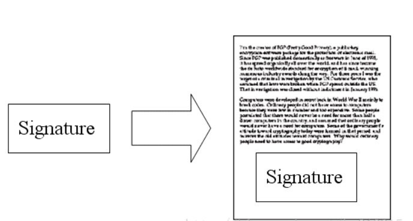

接收方收到消息后，用发送方的公钥对数字签名进行解密(能解密成功就完成了对发送方的身份验证)，得到摘要 A，然后再对原文使用摘要算法生成摘要 B，比对摘要 A 和 B 是否相同，相同则说明内容没有被篡改。


#### 3.4.2. 示例

此示例使用 SHA1 作为摘要算法，使用 RSA 作为签名加密算法的签名及验签过程，在 `RSAEncrypt.java` 中增加以下代码：

```java
public static final String SIGN_ALGORITHMS = "SHA1WithRSA";

/**
 * RSA签名
 *
 * @param content       待签名数据
 * @param privateKey    私钥
 * @param input_charset 编码格式
 * @return 签名值
 */
public static String sign(String content, String privateKey, String input_charset) {
    try {
        PKCS8EncodedKeySpec priPKCS8 = new PKCS8EncodedKeySpec(decoder.decode(privateKey));
        KeyFactory keyf = KeyFactory.getInstance("RSA");
        PrivateKey priKey = keyf.generatePrivate(priPKCS8);
        Signature signature = Signature.getInstance(SIGN_ALGORITHMS);
        signature.initSign(priKey);
        signature.update(content.getBytes(input_charset));
        byte[] signed = signature.sign();
        return encoder.encodeToString(signed);
    } catch (Exception e) {
        e.printStackTrace();
    }
    return null;
}

/**
 * RSA验签名检查
 *
 * @param content       待签名数据
 * @param sign          签名值
 * @param public_key    公钥
 * @param input_charset 编码格式
 * @return 布尔值
 */
public static boolean verify(String content, String sign, String public_key, String input_charset) {
    try {
        KeyFactory keyFactory = KeyFactory.getInstance("RSA");
        byte[] encodedKey = decoder.decode(public_key);
        PublicKey pubKey = keyFactory.generatePublic(new X509EncodedKeySpec(encodedKey));
        Signature signature = Signature.getInstance(SIGN_ALGORITHMS);
        signature.initVerify(pubKey);
        signature.update(content.getBytes(input_charset));
        return signature.verify(decoder.decode(sign));
    } catch (Exception e) {
        e.printStackTrace();
    }
    return false;
}
```

测试签名、验证签名

```java
@Test
public void testSHA1WithRSA() throws Exception {
    Map<Integer, String> akeyMap = RSAEncrypt.genKeyPair(); // a方密钥对
    System.out.println("随机生成的a方公钥为:" + akeyMap.get(0));
    System.out.println("随机生成的a方私钥为:" + akeyMap.get(1));

    String content = "金田一少年之事件簿";

    System.out.println("------------ a向b发送数据，使用a的私钥生成签名 -----------");
    String signature = RSAEncrypt.sign(content, akeyMap.get(1), "utf-8");
    System.out.println("原文:'" + content + "'生成签名：" + signature);

    System.out.println("---------- b接收到a发的数据，使用a的公钥验证签名 -----------");
    if (RSAEncrypt.verify(content, signature, akeyMap.get(0), "utf-8")) {
        System.out.println("验证签名成功：" + signature);
    } else {
        System.out.println("验证签名失败！");
    }
}
```

### 3.5. 总结

- 通过**加密算法**对数据原文的加密、解密，能保证数据传输过程中的**机密性**。
- 通过**数字签名**机制，既可以保证数据**完整性**，也可以对数据来源进行**身份验证**。
- 针对**非对称加密技术**的应用，通常使用两种方式：
  - **传输过程中的数据加密**，使用接收方公钥加密，接收方私钥解密，保证数据在传输过程中是密文。
  - **接收方对信息来源的确认**，发送方会使用私钥对数据签名，接收方使用发送方公钥进行验签。

## 4. 用户认证机制

用户认证表面上看只是系统校验用户名（身份）、密码（凭证）的过程。但是为了会话保持，提高安全性，适应不同系统架构以及各种各样的认证方式（用户名、密码，二维码，短信，三方认证，单点登录...），认证的机制也在不断演进，传统的账号密码登录变成了只是认证方式中的一种。

### 4.1. 基于 Session 认证

目前大多数 web 应用的用户认证机制都是基于 session 的。用户认证成功后，在服务端生成用户相关的数据保存在 session 中(当前会话)，而发给客户端的 sesssion_id 存放到 cookie 中，这样用客户端请求时带上 session_id 就可以验证服务器端是否存在 session 数据，以此完成用户的合法校验。当用户登出或过期时就将服务端 session 销毁，客户端的 session_id 也就无效了。


而在分布式的环境下，基于 session 的认证会出现一个问题。当第一次访问网站的时候，负载均衡将本地的请求分配到 Web 服务器 A，那么 session 创建在 Web 服务器 A，第二次访问的时候，如果不做处理就不能保证还是会落到 Web 服务器 A 了。此时，通常的做法有下面几种：

- **Session 复制**：多台应用服务器之间同步 session，使 session 保持一致，对外透明
- **Session 粘滞**：当用户访问集群中某台服务器后，强制指定后续所有请求均落到此机器上
- **Session 数据集中存储**：将 Session 存入分布式缓存集群中，所有服务器应用实例统一从分布式缓存集群中存取 Session

总体来讲，基于 session 认证的认证方式，可以更好的在服务端对会话进行控制，且安全性较高。但是，session 机制方式基于 cookie，在移动应用上无法有效使用，并且无法跨域，保持会话的做法非常麻烦。

### 4.2. 基于 Token 认证

随着 Restful API、微服务的兴起，基于 Token 的认证现在已经越来越普遍。基于 token 的用户认证是一种服务端无状态的认证方式，所谓服务端无状态指的是 token 本身包含登录用户所有的相关数据，而客户端在认证后的每次请求都会携带 token，因此服务器端无需存放 token 数据。

当用户认证后，服务端生成一个 token 发给客户端，客户端可以放到 cookie 或 localStorage 等存储中，每次请求时带上 token，服务端收到 token 通过验证后即可确认用户身份。


#### 4.2.1. 什么是 JWT

目前市面上基于 token 的认证方式大都采用的是 JWT(Json Web Token)。

JSON Web Token（JWT）是一个开放的行业标准（RFC 7519），它定义了一种简洁的、自包含的协议格式，用于在通信双方传递 json 对象，传递的信息经过数字签名可以被验证和信任。

#### 4.2.2. JWT 令牌结构

JWT 令牌由 Header、Payload、Signature 三部分组成，每部分中间使用点（`.`）分隔，比如：`xxxxx.yyyyy.zzzzz`

- **Header**：第一部分是头部包括令牌的类型（即 JWT）及使用的哈希算法（如 HMAC、SHA256 或 RSA）。

例子：

```json
{
	"alg": "HS256"，
	"typ": "JWT"
}
```

将上边的内容使用 Base64Url 编码，得到一个字符串就是 JWT 令牌的第一部分。

- **Payload**：第二部分是负载，内容也是一个 json 对象，它是存放有效信息的地方，它可以存放 jwt 提供的现成字段，比如：iss（签发者），exp（过期时间戳）， sub（面向的用户）等，也可自定义字段。此部分不建议存放敏感信息，因为此部分可以解码还原原始内容。

例子：

```json
{
	"sub": "1234567890"，
	"name": "456"，
	"admin": true
}
```

最后将第二部分负载使用 Base64Url 编码，得到一个字符串就是 JWT 令牌的第二部分。

- **Signature**：第三部分是签名，此部分用于防止 JWT 内容被篡改。这个部分使用 base64url 将前两部分进行编码，编码后使用点（`.`）连接组成字符串，最后使用 header 中声明签名算法进行签名。

例子：

```java
HMACSHA256(base64UrlEncode(header) + "." + base64UrlEncode(payload)，secret)
```

- base64UrlEncode(header)：jwt 令牌的第一部分。
- base64UrlEncode(payload)：jwt 令牌的第二部分。
- secret：签名所使用的密钥。

> 怎么保证令牌的安全？非对称加密算法需要两个密钥来进行加密和解密，这两个秘钥是公开密钥（public key，简称公钥）和私有密钥（private key，简称私钥）。公钥是密钥对中公开的部分，私钥则是非公开的部分，通过这种算法得到的密钥对能保证在世界范围内是唯一的 。用公钥加密的数据只有对应的私钥才可以解密

#### 4.2.3. JWT 令牌优缺点

**JWT 令牌的优点：**

1. JWT 基于 json，非常方便解析。
2. 可以在令牌中自定义丰富的内容，易扩展。
3. 基于 token 认证这种方式服务端不用存储认证数据，易维护，扩展性强， token 存在 localStorage 可避免 CSRF，并且可以实现 web 和 app 统一认证机制。
4. 通过非对称加密算法及数字签名技术，JWT 防止篡改，安全性高。

**JWT 令牌的缺点：**

token 由于自包含信息，因此一般数据量较大，而且每次请求都需要传递，因此比较占带宽。另外，token 的签名验签操作也会给 cpu 带来额外的负担。但是随着硬件的提升和带宽的提高，这些缺点变得越来越微不足道。

### 4.3. OAuth2.0 认证

#### 4.3.1. 概述

OAuth（开放授权）是一个开放标准，允许用户授权第三方应用访问他们存储在另外的服务提供者上的信息，而不需要将用户名和密码提供给第三方应用或分享他们数据的所有内容。OAuth2.0 是 OAuth 协议的延续版本，但不兼容 OAuth 1.0（即完全废止了 OAuth1.0）。

> 此部分内容详细介绍见[《授权认证概述》笔记((/分布式微服务/Authorization-Certification/Authorization-Overview))]中的《OAuth2.0》相关章节

#### 4.3.2. OAuth2 的授权方式

在整个基于 OAuth2 的认证机制中，获取令牌是最关键的一步，OAuth2  提供了四种授权(获取令牌)方式：

- 授权码模式（Authorization Code）
- 隐式授权模式（Implicit）
- 密码模式（Resource Owner Password Credentials）
- 客户端模式（Client Credentials）

> 四种方式均采用不同的执行流程。万信项目目前只使用了密码模式。

只需要往认证服务器上发送请求并传递一些参数即可获得令牌：

```
http://认证服务器/oauth/token?client_id=p2pweb&client_secret=fgsdgrf&grant_type=password&username=zhangsan&password=123456
```

参数列表如下：

- `client_id`：客户端准入标识。服务提供商不可能随便允许一个**客户端**就接入到它的**认证服务器**，需要提供客户端标识和秘钥。
- `client_secret`：客户端秘钥。
- `grant_type`：授权类型，填写 password 表示密码模式
- `username`：资源拥有者用户名。
- `password`：资源拥有者密码。

> 注：这种模式十分简单，但是直接将用户敏感信息泄漏给了 client，因此这就说明这种模式只能用于 client 是自己开发的情况下，即一般用于自己开发的第一方原生 App 或第一方单页面应用。P2P 项目中的各个接入方，都是本身自己开发的项目，所以采用密码模式没有问题。

## 5. 集成 UAA 认证服务

### 5.1. 本项目引入 OAuth2 的分析

P2P 项目中，引入 OAuth2 的主要目的：

1. 将来 P2P 项目考虑到灵活性和可扩展性，也会支持通过第三方授权登录(例如: QQ，微信等)，提高客户体验
2. P2P 项目采用前后端分离开发架构，前端有 PC 端(H5)、有移动端(APP)、还有管理端，包括各个微服务，他们彼此之间都是第三方，这些接入端都需要统一做认证管理

### 5.2. 本项目认证需求分析

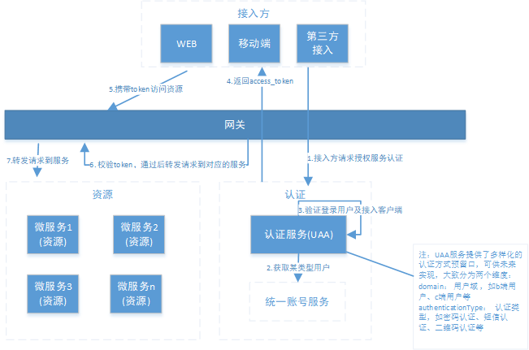

上图的**接入方**对应 OAuth2.0 的**客户端**，无论是 P2P 自身的应用还是第三方接入都通过统一的机制接入平台，**用户**对应 OAuth2.0 的**资源拥有者**。流程描述如下：

1. 用户登录通过接入方(目前指前端)在 P2P 平台登录，接入方采取 OAuth2.0 密码模式请求认证服务(UAA)。
2. 认证服务(UAA)调用统一账号服务去验证该用户，并获取用户权限信息。
3. 认证服务(UAA)获取接入方权限信息，并验证接入方是否合法。
4. 若登录用户以及接入方都合法，生成 jwt 令牌返回给接入方，其中 jwt 中包含了用户权限及接入方权限。
5. 后续，接入方携带 jwt 令牌对 P2P 平台的微服务资源进行访问。
6. API 网关对令牌解析、并验证接入方的权限是否能够访问本次请求的微服务。
7. 如果接入方的权限没问题，API 网关会将请求转发至微服务，并将原请求附加上解析后的明文用户信息 jsonToken，微服务用 jsonToken 来识别本次请求的用户会话。

流程所涉及到统一账号服务、UAA 服务、API 网关这三个组件，因此下面介绍三个组件的职责。

- 统一账号服务：提供 B 端用户和 C 端用户的登录账号、密码、角色、权限、资源等系统级信息的管理，不包含用户业务信息。
- UAA 服务：它承载了 OAuth2.0 接入方认证、登入用户的认证、授权以及生成令牌的职责，并连接“统一账号服务”，完成实际的用户认证、授权功能。
- API 网关：作为系统的唯一入口，API 网关封装了系统内部架构，为接入方提供定制的 API 集合。它可能还具有其它职责，如身份验证、监控、负载均衡、缓存、请求分片与管理、静态响应处理。API 网关方式的核心要点是，所有的接入方和消费端都通过统一的网关接入微服务，在网关层处理所有的非业务功能。

网关整合 OAuth2.0 有两种思路，一种是授权服务器采用 jwt， 统一在网关层验证，判断权限等操作；另一种是让资源端处理，网关只做路由转发。​ 通过前面的流程描述，显然使用了第一种方式比较好。把 API 网关作为 OAuth2.0 的资源服务器角色，实现接入客户端权限拦截、令牌解析并转发当前登录用户信息(jsonToken)给微服务，这样下游微服务就不需要关心令牌格式解析以及 OAuth2.0 相关机制了。

### 5.3. UAA 服务简介

UAA 服务是 P2P 平台中的统一认证中心，集认证和授权功能于一身，采用 Spring Security 整合 OAuth2.0 实现**授权服务器(认证服务器)**角色，同时使用 JWT 令牌技术来存储和传递用户信息。UAA 服务中的 Spring Security 相关配置、基础使用代码参考 [《Spring Cloud Security 笔记》](/分布式微服务/SpringCloud/Spring-Cloud-Security) ，本服务重点关注以下两个功能：

1. **UAA 服务给接入方提供了用户认证并返回令牌的接口**
2. **UAA 服务在认证过程中，它需要调用统一账号服务来完成 c 端以及 b 端用户的实际验证**

> 其中第(1)点，Spring Security OAuth2 已经提供了对外的接口，无需开发者实现；第(2)点需要开发者进行编码衔接，完成 UAA 调用统一账号服务的过程。

### 5.4. 基础环境搭建

- 将 wanxinp2p-uaa-service 工程复制到项目目录下，在 IDEA 中以 maven 的方式导入
- 配置以下 VM options 参数，启动服务，服务的端口是 53020

```bash
-Denv=dev -Dapollo.cluster=DEFAULT -Dserver.port=53020
```

- 创建 UAA 数据库 p2p_uaa，执行 `wanxinp2p-project\document\sql\uaa.sql` 导入 oauth_client_details 表（_以前的总 sql 脚本已有此表初始化，如没有则再次导入即可_），此表用来存储客户端信息，OAuth2.0 接入方认证就是通过此表，表中相关字段解释如下：
  - `client_id`：接入客户端 id
  - `client_secret`：接入客户端秘钥
  - `access_token_validity`：访问 token 的有效期（秒）
  - `refresh_token_validity`：刷新 token 的有效期（秒）
  - `authorized_grant_type`：该客户端支持的授权类型，`authorization_code`，`password`，`client_credentials`
  - `scope`：作用域，可以将其作为权限来考虑/使用，也可考虑其他用法，非必填
  - `authorities`：指该客户端的权限，必填
- 启动 Apollo 配置中心，新建一个项目 `uaa-service`

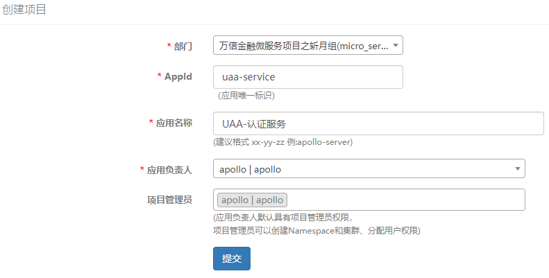

- 关联 common-template 项目中的公共 namespace。包括 micro_service.spring-boot-http、micro_service.spring-eureka、micro_service.spring-ribbon、micro_service.spring-cloud-feign、micro_service.spring-boot-druid，其中需要添加或者覆盖的内容如下：
  - micro_service.spring-boot-http 命名空间：`server.servlet.context-path = /uaa`
  - micro_service.spring-boot-druid 命名空间：`spring.datasource.url = jdbc:mysql://localhost:3306/p2p_uaa?useUnicode=true&useSSL=false`

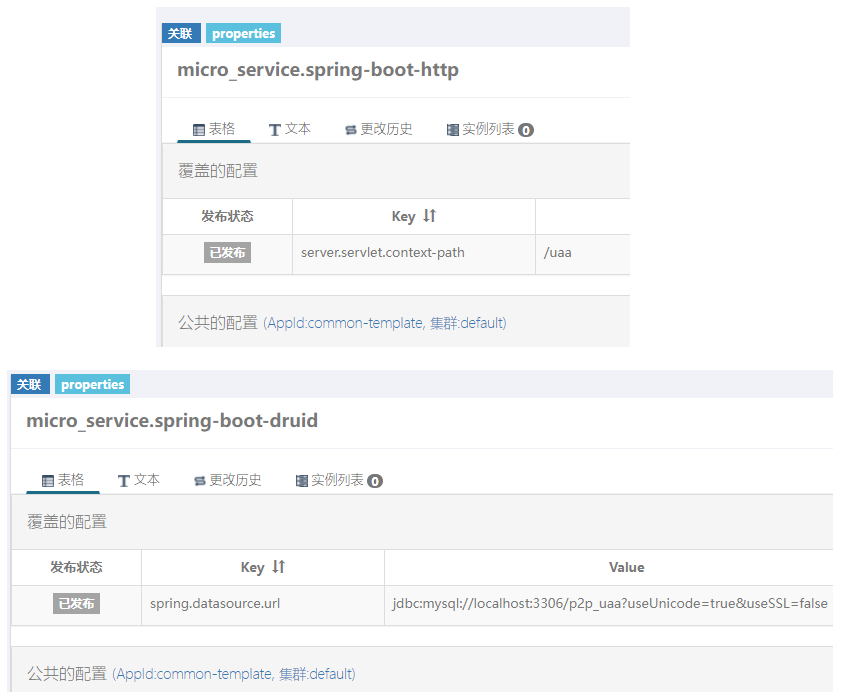

- 修改 gateway-server 配置，增加 uaa 服务的路由配置

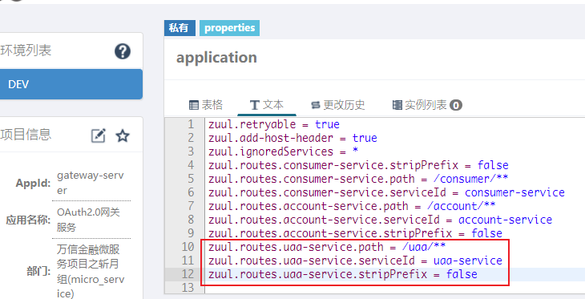

- 启动测试中心与 uaa 服务，测试是否正常启动

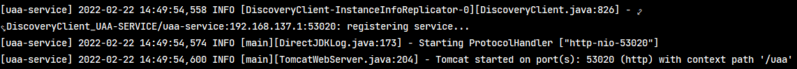

## 6. 认证(登录)功能实现

### 6.1. 需求分析

集成 UAA 服务后，该功能交互流程如下(参考注册登录流程图最后部分，详见《02-前端环境搭建与短信校验注册功能》)：

1. 前端请求统一账户服务获取短信验证码
2. 前端校验手机号是否存在，校验验证码是否正确，如果存在则说明已经注册
3. 前端发起登录请求，请求 UAA 认证服务
4. UAA 首先校验客户端是否有权限访问系统，如果有权限则会请求统一账户服务(`account-service`)获取账号及权限信息，生成 Token
5. UAA 向客户端响应 Token，登录成功。

### 6.2. 功能实现

#### 6.2.1. 定义远程调用接口

- 在 wanxinp2p-uaa-service 工程的 agent 包下创建 `AccountApiAgent` 代理接口，定义调用 wanxinp2p-account-service 工程的 `login` 接口方法

```java
@FeignClient("account-service")
public interface AccountApiAgent {
    @PostMapping(value = "/account/l/accounts/session")
    RestResponse<AccountDTO> login(@RequestBody AccountLoginDTO accountLoginDTO);
}
```

- 在 wanxinp2p-uaa-service 工程启动类开启 Feign 注解的支持，指定扫描的包路径

```java
@SpringBootApplication
@EnableDiscoveryClient
@EnableFeignClients(basePackages = {"com.moon.wanxinp2p.uaa.agent"})
@ComponentScan(basePackages = {"com.moon.wanxinp2p.common", "com.moon.wanxinp2p.uaa"}) // 扫描接口，common工程所在包
public class UAAServer {
    public static void main(String[] args) {
        SpringApplication.run(UAAServer.class, args);
    }
}
```

#### 6.2.2. 自定义认证处理类配置

在 UAA 工程有配置类 `com.moon.wanxinp2p.uaa.config.SecurityConfig`，继承 Spring Security 框架的 `WebSecurityConfigurerAdapter` 类，此配置类用于配置创建认证管理器、密码编码器、安全拦截机制。在重写的 `configure(AuthenticationManagerBuilder auth)` 方法中，加入了自定义的认证管理器 `IntegrationUserDetailsAuthenticationHandler` 类

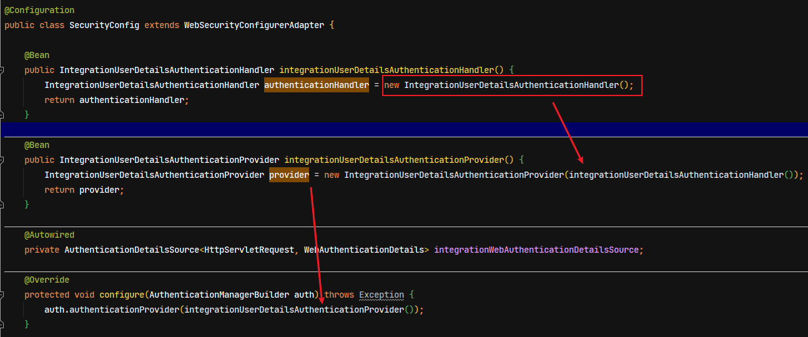

UAA 工程的 `com.moon.wanxinp2p.uaa.domain.IntegrationUserDetailsAuthenticationHandler` 类，其中实现的 `authentication` 方法就是 Spring Security 用于认证处理。

```java
/**
 * 认证处理过程
 *
 * @param domain             用户域，如b端用户、c端用户等，用户扩展
 * @param authenticationType 认证类型，如密码认证，短信认证等，用于扩展
 * @param token              Spring Security 的 token 对象，可提取用户名、密码等用于认证的信息
 * @return UnifiedUserDetails 自定义的 UserDetails 接口实现，用于登录成功后返回的存放相关信息
 */
public UnifiedUserDetails authentication(String domain, String authenticationType,
                                         UsernamePasswordAuthenticationToken token) {
    ....
}
```

方法参数说明：

- **domain**：用户域 ，说明了此次登录的是 b 端用户还是 c 端用户，由接入方传入
- **authenticationType**：说明了此次登录的方式，如密码认证，短信认证等，由接入方传入
- **token**：Spring Security 的 token 对象(<font color=red>_需要注意，此对象不是认证的令牌_</font>)，里面存放了接入方调用 UAA 接口进行认证时传入的用户名、密码等需要验证的信息

返回值说明：

- **UnifiedUserDetails**：自定义 Spring Security 框架的 `UserDetails` 接口实现对象，用于存放登录成功时返回的信息，比如账号基本信息、权限、资源等。此方法返回该对象给 Spring Security OAuth2 框架，Spring Security OAuth2 框架会根据里面的内容生成 jwt 令牌，从而使令牌中保存了登录用户的相关数据。

#### 6.2.3. 授权认证处理具体实现

修改 `IntegrationUserDetailsAuthenticationHandler.authentication()` 方法，编写认证处理逻辑

```java
public UnifiedUserDetails authentication(String domain, String authenticationType,
                                         UsernamePasswordAuthenticationToken token) {
    // 从客户端获取用户名并校验
    String username = token.getName();
    if (StringUtils.isBlank(username)) {
        throw new BadCredentialsException("账户为空");
    }

    // 获取密码并校验
    String presentedPassword = (String) token.getCredentials();
    if (StringUtils.isBlank(presentedPassword)) {
        throw new BadCredentialsException("密码为空");
    }

    // 远程调用统一账户服务，组装请求参数
    AccountLoginDTO accountLoginDTO = new AccountLoginDTO();
    accountLoginDTO.setDomain(domain);
    accountLoginDTO.setUsername(username);
    accountLoginDTO.setMobile(username);
    accountLoginDTO.setPassword(presentedPassword);
    // 远程服务调用，进行账户密码校验
    AccountApiAgent accountApiAgent = ApplicationContextHelper.getBean(AccountApiAgent.class);
    RestResponse<AccountDTO> response = accountApiAgent.login(accountLoginDTO);

    // 请求异常处理
    if (response == null || response.getCode() != 0) {
        throw new BadCredentialsException("登录失败");
    }

    // 登录成功，把用户数据封装到 UnifiedUserDetails 对象中
    UnifiedUserDetails unifiedUserDetails =
            new UnifiedUserDetails(response.getResult().getUsername(), presentedPassword, AuthorityUtils.createAuthorityList());
    unifiedUserDetails.setMobile(response.getResult().getMobile());
    return unifiedUserDetails;
}
```

### 6.3. 功能测试

本测试需要启动 apollo、discover-server、gateway-server、uaa-service、ccount-service 等服务

#### 6.3.1. 登录（生成令牌）测试(待测试，因为初始化的数据不一致)

- **功能说明**：用户登录时生成并返回令牌，该令牌用于访问 P2P 平台内受保护资源。
- **访问路径**：POST http://localhost:53010/uaa/oauth/token
- **请求参数**：
  - `grant_type`：授权类型，可取值有：`authorization_code`，`implicit`，`client_credentials`，`password`
  - `client_id`：接入客户端 id（_与 oauth_client_details 表一致_）
  - `client_secret`：接入客户端密钥（_与 oauth_client_details 表一致_）
  - `username`：登录用户名
  - `password`：登录密码
  - `domain`：用户域 ，如 b 端管理用户、c 端受众用户（扩展协议）
  - `authenticationType`：认证类型，如密码认证，短信认证，二维码认证等（扩展协议）

```json
grant_type:password
client_id:wanxin-p2p-web-h5
client_secret:wanxin-h5
username:13800000000
password:13800000000
domain:c
authenticationType:password
```

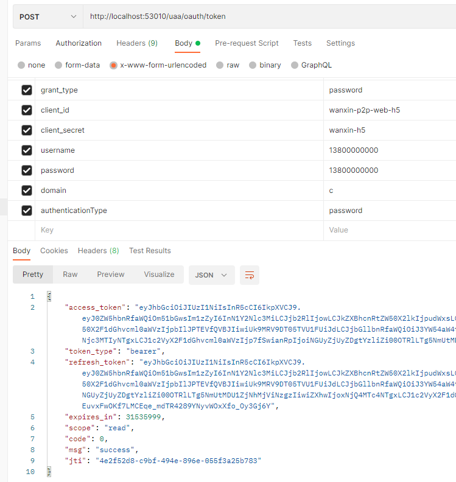

- **返回参数**：
  - `access_token`：访问令牌，这是我们所需的令牌
  - `token_type`：令牌类型，传递令牌是需要在令牌前面增加这个类型作为前缀
  - `refresh_token`：刷新令牌，访问令牌到期后，可以通过刷新令牌重新生成访问令牌
  - `expires_in`：访问令牌的有效期，单位是秒
  - `code` : 状态码，0 表示正常
  - `msg`：操作结果，success 表示成功
  - `jti`：身份令牌，主要用来作为一次性 token，从而回避重复请求攻击

> <font color=violet>**注意：这里使用 postman 测试时，如果在 body 中使用 raw 类型的请求参数，会失败！必须使用 x-www-form-urlencoded **</font>

#### 6.3.2. 解析令牌测试

- **功能说明**： 从访问令牌中解析出原始数据
- **访问路径**：POST http://localhost:53020/uaa/oauth/check_token
- **请求参数**：
  - token : 访问令牌

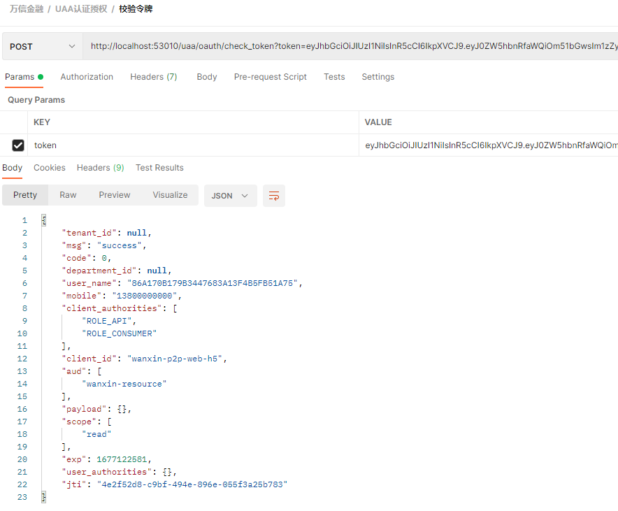

- **响应内容**：
  - `code`：响应编码，0 代表成功
  - `msg`：响应描述，'success' 代表成功
  - `user_name`：用户名
  - `mobile`：手机号
  - `active`：状态
  - `client_authorities`：接入客户端的权限，数组
  - `client_id`：接入客户端 id
  - `exp`：令牌剩余有效期
  - `user_authorities`：登入用户的角色及权限(微服务或应用侧使用)

#### 6.3.3. 前后端集成测试

增加启动 h5 前端、短信验证码服务，在页面中进行前后端联调

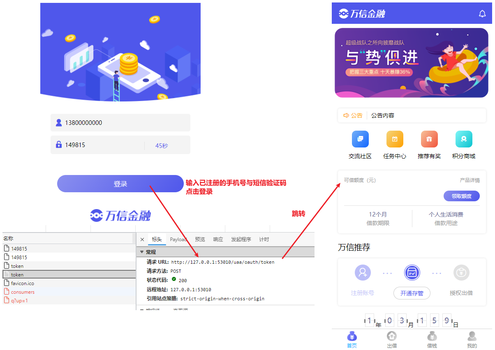

前端的代码

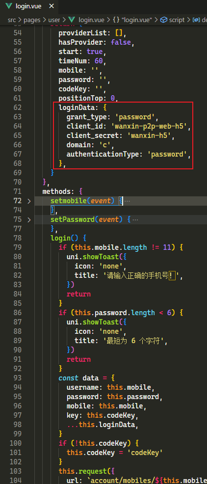

## 7. 网关服务认证拦截功能

### 7.1. 需求分析

目前项目中的网关服务（gateway-server）只是做了路由转发，并没有起到真正网关的作用，下面将对网关服务进行改造，让其在 P2P 认证授权体系里负责以下两部分内容：

1. 令牌解析并转发当前登录用户信息给微服务
2. 作为 OAuth2.0 的资源服务器角色，实现接入方权限拦截


### 7.2. 网关环境准备

以上功能涉及 Spring Security OAuth2 授权认证，所以需要在网关服务中引入相关依赖及配置

#### 7.2.1. 引入依赖

修改 wanxinp2p-gateway-server 工程的 pom.xml 文件，引入 Spring Security OAuth2 相关依赖

```xml
<!-- Spring Security OAuth2 相关依赖 -->
<dependency>
    <groupId>org.springframework.cloud</groupId>
    <artifactId>spring-cloud-starter-security</artifactId>
</dependency>
<dependency>
    <groupId>org.springframework.cloud</groupId>
    <artifactId>spring-cloud-starter-oauth2</artifactId>
</dependency>
<dependency>
    <groupId>org.springframework.security</groupId>
    <artifactId>spring-security-jwt</artifactId>
</dependency>
```

#### 7.2.2. 配置类

在 wanxinp2p-gateway-server 工程中的 config 包下，新增以下配置类：

- `ClientDefaultAccessTokenConverter` ：明文令牌与 Spring OAuth2Authentication 的相互转换

```java
public class ClientDefaultAccessTokenConverter implements AccessTokenConverter {

    private UserAuthenticationConverter userTokenConverter = new DefaultUserAuthenticationConverter();

    private boolean includeGrantType;

    /**
     * Converter for the part of the data in the token representing a user.
     *
     * @param userTokenConverter the userTokenConverter to set
     */
    public void setUserTokenConverter(UserAuthenticationConverter userTokenConverter) {
        this.userTokenConverter = userTokenConverter;
    }

    /**
     * Flag to indicate the the grant type should be included in the converted token.
     *
     * @param includeGrantType the flag value (default false)
     */
    public void setIncludeGrantType(boolean includeGrantType) {
        this.includeGrantType = includeGrantType;
    }

    public static final String CLIENT_AUTHORITIES = "client_authorities";

    public Map<String, ?> convertAccessToken(OAuth2AccessToken token, OAuth2Authentication authentication) {
        Map<String, Object> response = new HashMap<>();
        OAuth2Request clientToken = authentication.getOAuth2Request();

        if (!authentication.isClientOnly()) {
            response.putAll(userTokenConverter.convertUserAuthentication(authentication.getUserAuthentication()));

            // 增加对client Authorities支持
            if (authentication.getOAuth2Request().getAuthorities() != null && !authentication.getOAuth2Request().getAuthorities().isEmpty()) {
                response.put(CLIENT_AUTHORITIES,
                        AuthorityUtils.authorityListToSet(authentication.getOAuth2Request().getAuthorities()));
            }
            // 结束增加对client Authorities支持
        } else {
            if (clientToken.getAuthorities() != null && !clientToken.getAuthorities().isEmpty()) {
                response.put(UserAuthenticationConverter.AUTHORITIES,
                        AuthorityUtils.authorityListToSet(clientToken.getAuthorities()));
            }
        }

        if (token.getScope() != null) {
            response.put(SCOPE, token.getScope());
        }
        if (token.getAdditionalInformation().containsKey(JTI)) {
            response.put(JTI, token.getAdditionalInformation().get(JTI));
        }

        if (token.getExpiration() != null) {
            response.put(EXP, token.getExpiration().getTime() / 1000);
        }

        if (includeGrantType && authentication.getOAuth2Request().getGrantType() != null) {
            response.put(GRANT_TYPE, authentication.getOAuth2Request().getGrantType());
        }

        response.putAll(token.getAdditionalInformation());

        response.put(CLIENT_ID, clientToken.getClientId());
        if (clientToken.getResourceIds() != null && !clientToken.getResourceIds().isEmpty()) {
            response.put(AUD, clientToken.getResourceIds());
        }

        return response;
    }

    public OAuth2AccessToken extractAccessToken(String value, Map<String, ?> map) {
        DefaultOAuth2AccessToken token = new DefaultOAuth2AccessToken(value);
        Map<String, Object> info = new HashMap<>(map);
        info.remove(EXP);
        info.remove(AUD);
        info.remove(CLIENT_ID);
        info.remove(SCOPE);
        if (map.containsKey(EXP)) {
            token.setExpiration(new Date((Long) map.get(EXP) * 1000L));
        }
        if (map.containsKey(JTI)) {
            info.put(JTI, map.get(JTI));
        }
        token.setScope(extractScope(map));
        token.setAdditionalInformation(info);
        return token;
    }

    public OAuth2Authentication extractAuthentication(Map<String, ?> map) {
        Map<String, String> parameters = new HashMap<>();
        Set<String> scope = extractScope(map);
        Authentication user = userTokenConverter.extractAuthentication(map);
        String clientId = (String) map.get(CLIENT_ID);
        parameters.put(CLIENT_ID, clientId);
        if (includeGrantType && map.containsKey(GRANT_TYPE)) {
            parameters.put(GRANT_TYPE, (String) map.get(GRANT_TYPE));
        }
        Set<String> resourceIds = new LinkedHashSet<>(map.containsKey(AUD) ?
                getAudience(map) : Collections.emptySet());

        Collection<? extends GrantedAuthority> authorities = null;
        if (user == null && map.containsKey(AUTHORITIES)) {
            @SuppressWarnings("unchecked")
            String[] roles = ((Collection<String>) map.get(AUTHORITIES)).toArray(new String[0]);
            authorities = AuthorityUtils.createAuthorityList(roles);
        }
        // 增加对client Authorities支持
        if (user != null && map.containsKey(CLIENT_AUTHORITIES)) {
            String[] clentRoles = ((Collection<String>) map.get(CLIENT_AUTHORITIES)).toArray(new String[0]);
            authorities = AuthorityUtils.createAuthorityList(clentRoles);
            // 增加额外属性
            parameters.put("mobile", (String) map.get("mobile"));
            parameters.put("tenant_id", (String) map.get("tenant_id"));
            parameters.put("department_id", (String) map.get("department_id"));
            parameters.put("user_authorities", JSON.toJSONString(map.get("user_authorities")));
            parameters.put("payload", JSON.toJSONString(map.get("payload")));
            // 结束增加额外属性
        }
        // 结束增加对client Authorities支持

        OAuth2Request request = new OAuth2Request(parameters, clientId, authorities, true, scope, resourceIds, null, null,
                null);
        return new OAuth2Authentication(request, user);
    }

    private Collection<String> getAudience(Map<String, ?> map) {
        Object auds = map.get(AUD);
        if (auds instanceof Collection) {
            @SuppressWarnings("unchecked")
            Collection<String> result = (Collection<String>) auds;
            return result;
        }
        return Collections.singleton((String) auds);
    }

    private Set<String> extractScope(Map<String, ?> map) {
        Set<String> scope = Collections.emptySet();
        if (map.containsKey(SCOPE)) {
            Object scopeObj = map.get(SCOPE);
            if (String.class.isInstance(scopeObj)) {
                scope = new LinkedHashSet<>(Arrays.asList(String.class.cast(scopeObj).split(" ")));
            } else if (Collection.class.isAssignableFrom(scopeObj.getClass())) {
                @SuppressWarnings("unchecked")
                Collection<String> scopeColl = (Collection<String>) scopeObj;
                scope = new LinkedHashSet<>(scopeColl);    // Preserve ordering
            }
        }
        return scope;
    }
}
```

- `JWTConfig`：配置 Spring Security OAuth2 采用 jwt 令牌方式

```java
@Configuration
public class JWTConfig {

    private final static String SIGNING_KEY = "wanxin123";

    @Bean
    public TokenStore tokenStore() {
        return new JwtTokenStore(accessTokenConverter());
    }

    @Bean
    public JwtAccessTokenConverter accessTokenConverter() {
        JwtAccessTokenConverter converter = new JwtAccessTokenConverter();
        converter.setSigningKey(SIGNING_KEY); // 对称秘钥，资源服务器使用该秘钥来解密
        converter.setAccessTokenConverter(new ClientDefaultAccessTokenConverter());
        return converter;
    }
}
```

- `ResouceServerConfig`：Spring Security OAuth2 资源服务实现，用于定义网关服务对各个接入客户端的权限拦截规则，可以指定某个接入客户端只允许访问部分微服务

```java
@Configuration
public class ResouceServerConfig {

    public static final String RESOURCE_ID = "wanxin-resource";

    private final AuthenticationEntryPoint point = new RestOAuth2AuthExceptionEntryPoint();

    private final RestAccessDeniedHandler handler = new RestAccessDeniedHandler();

    /**
     * 统一认证中心 资源拦截
     */
    @Configuration
    @EnableResourceServer
    public class UAAServerConfig extends ResourceServerConfigurerAdapter {

        @Autowired
        private TokenStore tokenStore;

        @Override
        public void configure(ResourceServerSecurityConfigurer resources) throws Exception {
            resources.tokenStore(tokenStore)
                    .resourceId(RESOURCE_ID)
                    .stateless(true);
        }

        @Override
        public void configure(HttpSecurity http) throws Exception {
            http.sessionManagement()
                    .sessionCreationPolicy(SessionCreationPolicy.IF_REQUIRED)
                    .and()
                    .authorizeRequests()
                    .antMatchers("/uaa/druid/**").denyAll()
                    .antMatchers("/uaa/**").permitAll();
        }
    }

    /**
     * c端用户服务 资源拦截
     */
    @Configuration
    @EnableResourceServer
    public class ConsumerServerConfig extends ResourceServerConfigurerAdapter {

        @Autowired
        private TokenStore tokenStore;

        @Override
        public void configure(ResourceServerSecurityConfigurer resources) throws Exception {
            resources.tokenStore(tokenStore)
                    .resourceId(RESOURCE_ID)
                    .stateless(true);

            resources.authenticationEntryPoint(point).accessDeniedHandler(handler);
        }

        @Override
        public void configure(HttpSecurity http) throws Exception {
            http.sessionManagement()
                    .sessionCreationPolicy(SessionCreationPolicy.IF_REQUIRED)
                    .and()
                    .authorizeRequests()
                    .antMatchers("/consumer/l/**").denyAll()
                    .antMatchers("/consumer/my/**").access("#oauth2.hasScope('read') and #oauth2.clientHasRole('ROLE_CONSUMER')")
                    .antMatchers("/consumer/m/**").access("#oauth2.hasScope('read') and #oauth2.clientHasRole('ROLE_ADMIN')")
                    .antMatchers("/consumer/**").permitAll();
        }
    }
}
```

- `RestAccessDeniedHandler`：修改网关错误响应与平台整体风格一致，无需关注

```java
public class RestAccessDeniedHandler implements AccessDeniedHandler {
    @Override
    public void handle(HttpServletRequest request, HttpServletResponse response, AccessDeniedException ex) throws IOException, ServletException {
        RestResponse<String> restResponse = new RestResponse<>(HttpStatus.FORBIDDEN.value(), "没有权限");
        HttpUtil.writerError(restResponse, response);
    }
}
```

- `RestOAuth2AuthExceptionEntryPoint`：修改网关错误响应与平台整体风格一致，无需关注

```java
public class RestOAuth2AuthExceptionEntryPoint extends OAuth2AuthenticationEntryPoint {
    @Override
    public void commence(HttpServletRequest request, HttpServletResponse response, AuthenticationException e) throws IOException, ServletException {
        RestResponse<String> restResponse = new RestResponse<>(HttpStatus.UNAUTHORIZED.value(), e.getMessage());
        HttpUtil.writerError(restResponse, response);
    }
}
```

#### 7.2.3. 相关配置

- 为了使前端能够通过网关访问到每个微服务，所以每增加一个微服务，都需要在 Apollo 的 gateway-server 上新增路由配置
- UAA 服务数据库(p2p_uaa)中的 oauth_client_details 表配置了接入客户端的信息，其中 `authorities` 字段用于指定该客户端的接入权限，如下图所示，wanxin-p2p-web-h5 这个接入客户端，有`ROLE_CONSUMER`，`ROLE_API` 两个权限。目前，在 P2P 项目中只开发了 wanxin-p2p-web-h5 这一个客户端。

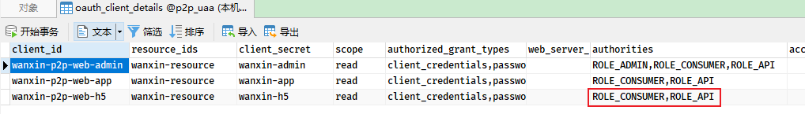

- 在 gateway-server 工程中的 `ResouceServerConfig` 类里定义资源服务配置，主要配置的内容就是定义一些匹配规则，描述某个接入客户端需要什么样的权限才能访问某个微服务。

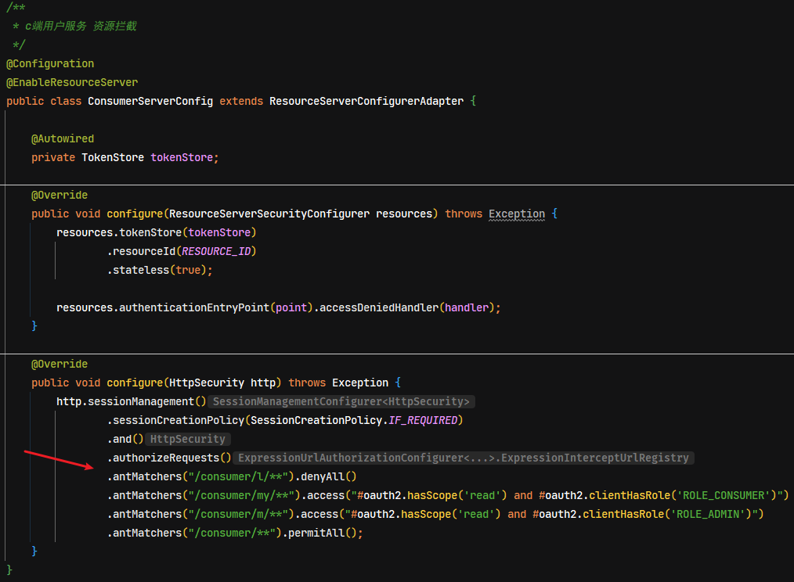

经过以上配置，如果网关接收到的请求 url 符合 `/consumer/**` 表达式，该请求将被转发至 consumer-service (用户中心)。为了便于权限拦截，将微服务内部的接口进行了细分，大体分为三类：

1. 受保护的 c 端用户接口(C 端用户登录后可访问)。
   - url 格式：`/服务名称/my/资源名称/*`
   - 访问方式：需要携带 C 端用户认证所获取的 Access Token 才可访问
2. 受保护的 b 端用户接口(B 端管理员用户登录后可访问)
   - url 格式：`/服务名称/m/资源名称/*`
   - 访问方式：需要携带 B 端用户认证所获取的 Access Token 才可访问。
3. 公开资源
   - url 格式：`/服务名称/资源名称/*`
   - 访问方式：无限制

例如 `.antMatchers("/consumer/my/**").access("#oauth2.hasScope('read') and #oauth2.clientHasRole('ROLE_CONSUMER')")`

以上匹配规则描述了：某个发往用户中心的请求，要想访问 url 匹配 `/my/**` 规则的资源，接入客户端需要 `scope` (范围字段)中包含 `read`，并且 `authorities`(权限字段)中需要包含 `ROLE_CONSUMER`，这跟 oauth_client_details 表中的数据是相对应的。

### 7.3. 认证拦截功能实现

认证与权限控制拦截功能主要由框架(Spring Security OAuth2)实现，开发者无需处理。只需要增加自定义网关服务过滤器，在请求前置拦截时，把令牌中的用户信息取出来并转发给微服务使用。

在 wanxinp2p-gateway-server 工程的 filter 包中创建 `AuthFilter` 过滤器

```java
@Component
public class AuthFilter extends ZuulFilter {

    /**
     * 过滤器的类型
     */
    @Override
    public String filterType() {
        return "pre"; // 前置过滤器，可以在请求被路由之前调用
    }

    /**
     * 过滤器执行顺序
     */
    @Override
    public int filterOrder() {
        return 0;
    }

    /**
     * 是否启用此过滤器
     */
    @Override
    public boolean shouldFilter() {
        return true;
    }

    /**
     * 过滤器处理逻辑
     */
    @Override
    public Object run() throws ZuulException {
        // 1.获取 Spring Security OAuth2 的认证信息对象
        Authentication authentication = SecurityContextHolder.getContext().getAuthentication();
        if (!(authentication instanceof OAuth2Authentication)) {
            // instanceof 判断已包含 authentication == null
            return null; // 无 token 访问网关内资源，直接返回 null
        }

        // 2.将当前登录的用户以及接入客户端的信息放入Map中
        OAuth2Authentication oauth = (OAuth2Authentication) authentication;
        // 定义转发的数据结构
        Map<String, String> jsonToken = new HashMap<>(oauth.getOAuth2Request().getRequestParameters());

        /*
         * 3.将 jsonToken 写入转发微服务的 request 中，
         *  微服务就能通过 request.getParams("jsonToken") 获取转发的数据
         */
        // 获取 zuul 上下文对象
        RequestContext context = RequestContext.getCurrentContext();
        HttpServletRequest request = context.getRequest();
        request.getParameterMap(); // 关键步骤，一定要get一下，下面这行代码才能取到值

        Map<String, List<String>> params = context.getRequestQueryParams();
        if (params == null) {
            params = new HashMap<>();
        }
        List<String> paramsList = new ArrayList<>();
        paramsList.add(EncryptUtil.encodeUTF8StringBase64(JSON.toJSONString(jsonToken)));
        params.put("jsonToken", paramsList);
        context.setRequestQueryParams(params);
        return null;
    }
}
```

### 7.4. 功能测试

在 wanxinp2p-consumer-service 工程的 `ConsumerController` 类中新定义一个受保护的资源测试方法：

```java
@ApiOperation("过网关受保护资源，进行认证拦截测试")
@ApiImplicitParam(name = "jsonToken", value = "访问令牌", required = true, dataType = "String")
@GetMapping(value = "/m/consumers/test")
public RestResponse<String> testResources(String jsonToken) {
    return RestResponse.success(EncryptUtil.decodeUTF8StringBase64(jsonToken));
}
```

启动相关服务后，在 Postman 中发起请求

```
GET http://localhost:53010/consumer/m/consumers/test?access_token=XXX
```

第一次测试是没有权限

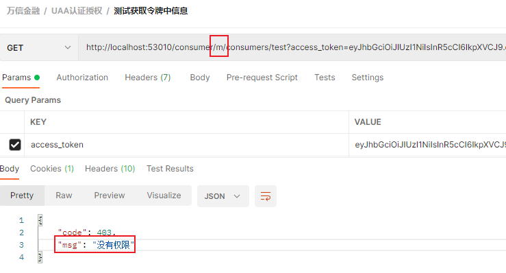

因为 h5 权限配置没有相关 `m/**` 请求 url 的角色

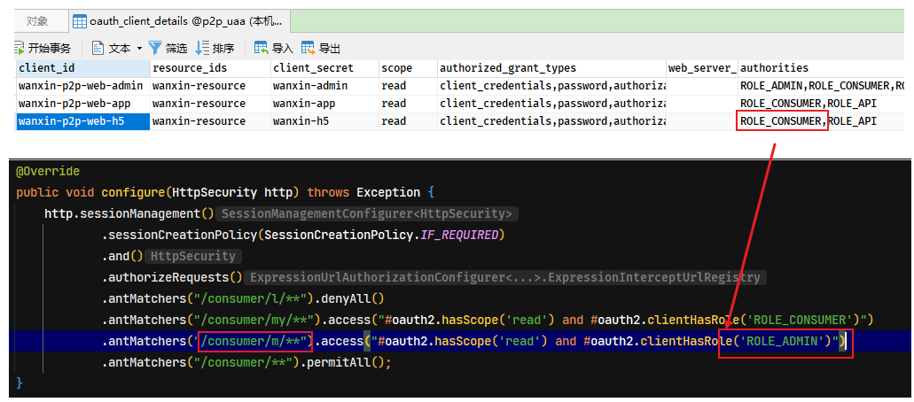

修改网关服务中的 `ResouceServerConfig$ConsumerServerConfig.configure()` 方法，增加 `m/**` 请求 url 的角色 `ROLE_CONSUMER`。再次测试，可以成功访问，并获取到从网关服务转发的 json 字符串

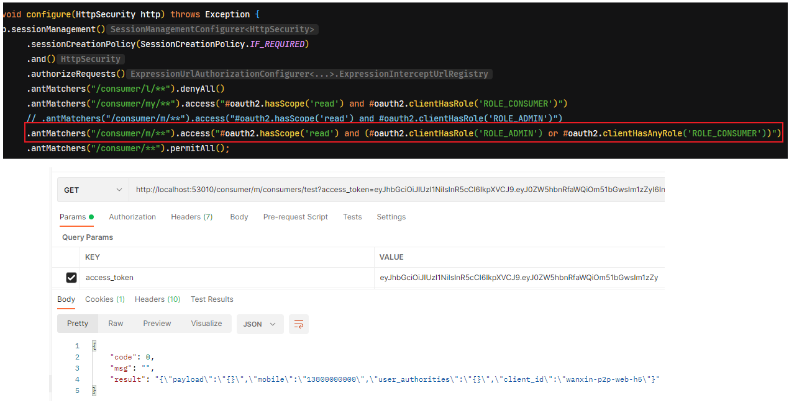

### 7.5. 微服务自定义拦截器获取请求数据

在认证拦截功能中，如果网关校验令牌成功，就会把当前登录用户的一些信息存放到请求中，然后转发给各个微服务，而考虑到从请求中取数据的功能可能会被多次使用，所以这里采用 SpringMVC 的拦截器来实现该功能。网关转发到微服务的请求会被该拦截器接收，然后在该拦截器中取出数据并做相应处理。

- 在相关的微服务工程中创建 `TokenInterceptor` 拦截器，重写 `preHandle` 方法，进行请求前拦截处理

```java
public class TokenInterceptor implements HandlerInterceptor {
    @Override
    public boolean preHandle(HttpServletRequest request, HttpServletResponse response, Object handler) throws Exception {
        // 获取网关转发的用户json字符串
        String jsonToken = request.getParameter("jsonToken");
        if (StringUtils.isNotBlank(jsonToken)) {
            // 将字符串转成实体对象
            LoginUser loginUser = JSON.parseObject(EncryptUtil.decodeUTF8StringBase64(jsonToken),
                    new TypeReference<LoginUser>() {
                    });
            // 设置到请求域
            request.setAttribute("jsonToken", loginUser);
        }
        return true;
    }
}
```

- 创建 `WebConfig` 配置类，向 SpringMVC 注册自定义的拦截器

```java
@Configuration
public class WebConfig implements WebMvcConfigurer {
    /**
     * 注册自定义的拦截器
     */
    @Override
    public void addInterceptors(InterceptorRegistry registry) {
        registry.addInterceptor(new TokenInterceptor()).addPathPatterns("/**");
    }
}
```
