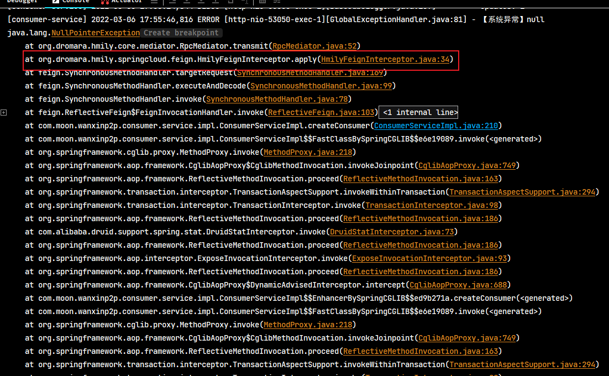

## 1. 用户开户功能需求分析

开户是指借款用户和投资用户在注册后、交易前都需要在银行存管系统开通个人存管账户，在开户流程中银行存管系统是一个很重要的系统，它是当前 P2P 平台最常见的一种模式，为了保证资金不流向 P2P 平台，由银行存管系统去管理借款用户和投资用户的资金，P2P 平台与银行存管系统进行接口交互为借款用户和投资用户搭建交易的桥梁，它们之间的关系如下：


借款人和投资人需要开通两个账户，一个是P2P平台的，一个是银行存管系统的。两者的账户数据需要进行同步。

### 1.1. 开户业务时序图


上图可以将开户流程分成三个阶段，分别是：生成开户数据、请求开户、开户结果通知。每个阶段详细说明详见上图与下面阶段开发章节

### 1.2. 相关涉及系统介绍

- **存管系统**：不属于 P2P 平台，属于银行系统，专门负责对接 P2P 账户及交易，此系统在银行部署，P2P 平台的交易主要与存管系统交互。*由于存管系统属于银行，无需开发，直接提供源码工程。*
- **存管代理服务**：属于 P2P 平台，为了使 P2P 平台与银行存管系统松耦合，专门设立存管代理服务与存管系统对接，P2P 平台的各个服务都通过存管代理服务与银行存管系统交互。
- **开卡银行**：不属于 P2P 平台，属于银行系统，是银行用于管理储蓄卡信息的系统。为了使用方便，把该系统合并到了存管系统中。

## 2. 银行存管系统

由于银行存管系统不属于P2P平台，无需开发，直接提供了一个该系统源码，只需要在本地部署该系统，并熟悉它的接口信息。

### 2.1. 银行存管系统部署指南

#### 2.1.1. 数据库初始化

执行 `wanxinp2p-project\document\sql\wanxindepository-init.sql` 的脚本，初始化银行存管系统的数据库与表

#### 2.1.2. 导入项目

银行存管系统工程已有现成的源码工程，导入 maven 工程即可。位置：`wanxinp2p-project\wanxinp2p\wanxindepository\`


#### 2.1.3. 设置启动参数

配置以下 VM options 参数，启动服务，服务的端口是 55010

```bash
-Denv=dev -Dapollo.cluster=DEFAULT -Dserver.port=55010
```

#### 2.1.4. apollo 配置

启动 apollo 配置中心，修改银行存管系统相关的配置（*在项目初始化脚本中已经配置*）


#### 2.1.5. 项目运行测试

运行 test 包中的 BankCardServiceTest.java，进行测试

### 2.2. 银行存管系统接口说明

接口说明详见[《银行存管系统接口说明.pdf》文档](/项目资料/万信金融/银行存管系统接口说明.pdf)

## 3. 存管代理服务工程

此服务是 P2P 项目的工程，用于对接银行存管系统。

### 3.1. 导入工程

导入P2P存管代理微服务基础源码工程 (wanxinp2p-depository-agent-service)

### 3.2. apollo 配置

- 在 apollo 配置中心新增相应的 `depository-agent-service` 项目，修改 application 命名空间增加以下配置：

```properties
depository.publicKey = MFwwDQYJKoZIhvcNAQEBBQADSwAwSAJBAJKcP4TjCb9+OKf0uvHkDO6njI8b9KKlu3ZdCkom4SONf8KkZ1jVl6A7XWnJ33gBLnbTGVUm5I+XvFEG5bSWVbkCAwEAAQ==
p2p.privateKey = MIIBVAIBADANBgkqhkiG9w0BAQEFAASCAT4wggE6AgEAAkEApkqNoES+508OiULK5UIEuZ9WxIUG7fB92V0vEi1FyNJgzMc2gi5hy8eGcyYyLWJdEt5h1vC8jclCgEcMY3lp3QIDAQABAkAUhQia6UDBXEEH8QUGazIYEbBsSZoETHPLGbOQQ6Pj1tb6CVC57kioBjwtNBnY2jBDWi5K815LnOBcJSSjJPwhAiEA2eO6VZMTkdjQAkpB5dhy/0C3i8zs0c0M1rPoTA/RpkUCIQDDYHJPqHLkQyd//7sEeYcm8cMBTvDKBXyiuGk8eLRauQIgQo6IlalGmg+Dgp+SP5Z9kjD/oCmp0XB0UoVEGS/f140CIQCsG9YXHgi31ACD3T9eHcBVKjvidyveix7UKSdrQdl+4QIgNCtRVLV+783e7PX5hRXD+knsWTQxDEMEsHi1KsAWtPk=
p2p.publicKey = MFwwDQYJKoZIhvcNAQEBBQADSwAwSAJBAKZKjaBEvudPDolCyuVCBLmfVsSFBu3wfdldLxItRcjSYMzHNoIuYcvHhnMmMi1iXRLeYdbwvI3JQoBHDGN5ad0CAwEAAQ==
p2p.code = wanxinp2p
depository.url = http://localhost:55010/wanxindepository
```


- depository-agent-service 项目关联相关公共的命名空间，并对部分项目的配置进行修改覆盖，关联清单如下：
    - micro_service.spring-boot-druid 命名空间需修改，修改项如下：
        - 数据库地址：`spring.datasource.url = jdbc:mysql://localhost:3306/p2p_depository_agent?useUnicode=true&useSSL=false`
    - micro_service.spring-boot-http 命名空间需修改，修改项如下：
        - 项目根路径：`server.servlet.context-path = /depository-agent`
    - micro_service.spring-eureka
    - micro_service.spring-hystrix
    - micro_service.spring-cloud-feign
    - micro_service.spring-ribbon
    - micro_service.mybatis-plus 命名空间需修改，修改项如下：
        - mp 包扫描路径：`mybatis-plus.typeAliasesPackage = com.moon.wanxinp2p.depository.entity`
    - micro_service.spring-rocketmq
    - micro_service.spring-boot-redis
    - micro_service.spring-boot-http
- 修改 gateway-server 配置，增加 depository-agent-service 服务的路由配置

```properties
zuul.routes.depository-agent-service.path = /depository-agent/**
zuul.routes.depository-agent-service.serviceId = depository-agent-service
zuul.routes.depository-agent-service.stripPrefix = false
```

### 3.3. 项目启动参数配置

配置以下 VM options 参数，启动服务，服务的端口是 53070

```bash
-Denv=dev -Dapollo.cluster=DEFAULT -Dserver.port=53070
```

## 4. 第一阶段：生成开户数据

### 4.1. 需求分析

**第一阶段：生成开户数据(开户业务流程图中 1.1-1.8)**

1. 前端填写开户信息。前端会先查询开户信息，如果曾经填写了开户信息则在界面直接显示，用户可以修改；如果曾经没有填写开户信息则用户在界面填写开户信息
2. 前端请求用户中心服务开户
3. 用户中心服务准备开户数据，并把开户信息保存到用户中心
4. 用户中心服务请求存管代理服务生成交易记录（未同步），并对开户数据进行签名
5. 存管代理服务将签名后的开户数据返回给用户中心
6. 用户中心将开户数据返回给前端

涉及银行存管系统的接口信息详见《银行存管系统接口说明.pdf》文档中的“个人绑卡开户”章节

### 4.2. 接口定义

#### 4.2.1. 相关实体类定义

- 在 wanxinp2p-api 工程中，创建 `depository` 包，定义封装与银行存管系统对接使用的签名请求数据实体 `GatewayRequest`

```java
@Data
@ApiModel(value = "GatewayRequest", description = "与银行存管系统对接使用的签名请求数据")
public class GatewayRequest {
    @ApiModelProperty("请求的存管接口名")
    private String serviceName;
    @ApiModelProperty("平台编号，平台与存管系统签约时获取")
    private String platformNo;
    @ApiModelProperty("业务数据报文，json格式")
    private String reqData;
    @ApiModelProperty("对reqData参数的签名")
    private String signature;
    @ApiModelProperty("银行存管系统地址")
    private String depositoryUrl;
}
```

- 在 `consumer` 模块，创建 `ConsumerRequest` 实体类，用于封装平台c端用户开户信息请求

```java
@Data
@ApiModel(value = "ConsumerRequest", description = "平台c端用户开户信息")
public class ConsumerRequest {
    @ApiModelProperty("id")
    private Long id;
    @ApiModelProperty("用户名")
    private String username;
    @ApiModelProperty("真实姓名")
    private String fullname;
    @ApiModelProperty("身份证号")
    private String idNumber;
    @ApiModelProperty("银行编码")
    private String bankCode;
    @ApiModelProperty("银行卡号")
    private String cardNumber;
    @ApiModelProperty("手机号")
    private String mobile;
    @ApiModelProperty("角色")
    private String role;
    @ApiModelProperty("请求流水号")
    private String requestNo;
    @ApiModelProperty("用户编号")
    private String userNo;
    @ApiModelProperty("页面回跳 URL")
    private String callbackUrl;
}
```

#### 4.2.2. 用户中心生成开户数据接口

修改 wanxinp2p-api 工程中 `ConsumerAPI` 接口，新增 `createConsumer` 生成开户数据方法：

```java
/**
 * 生成开户请求数据
 */
RestResponse<GatewayRequest> createConsumer(ConsumerRequest consumerRequest);
```

#### 4.2.3. 存管代理生成开户数据接口

在 wanxinp2p-api 工程中 `depository` 包中，新建一个 `DepositoryAgentApi` 的接口，然后定义 `createConsumer` 开通存管账户方法：

```java
public interface DepositoryAgentApi {
    /**
     * 开通存管账户
     *
     * @param consumerRequest 开户信息
     * @return
     */
    RestResponse<GatewayRequest> createConsumer(ConsumerRequest consumerRequest);
}
```

### 4.3. 用户中心生成开户数据功能实现

> 以下是 wanxinp2p-consumer-service 工程功能实现

#### 4.3.1. 数据访问层接口

- 创建 p2p_consumer 数据库的 bank_card 表相应的实体类 `BankCard`

```java
@Data
@TableName("bank_card")
public class BankCard implements Serializable {
    /** 主键 */
    @TableId(value = "ID", type = IdType.AUTO)
    private Long id;
    /** 用户标识 */
    @TableField("CONSUMER_ID")
    private Long consumerId;
    /** 银行编码 */
    @TableField("BANK_CODE")
    private String bankCode;
    /** 银行名称 */
    @TableField("BANK_NAME")
    private String bankName;
    /** 银行卡号 */
    @TableField("CARD_NUMBER")
    private String cardNumber;
    /** 银行预留手机号 */
    @TableField("MOBILE")
    private String mobile;
    /** 可用状态 */
    @TableField("STATUS")
    private Integer status;
}
```

- 单独抽取出来一个处理银行卡业务的接口，在 mapper 包中新建 `BankCardMapper` 接口，继承 MP 的 `BaseMapper`：

```java
public interface BankCardMapper extends BaseMapper<BankCard> {
}
```

- 在 `mapper.xml` 包下创建 mapper 映射文件

```xml
<?xml version="1.0" encoding="UTF-8" ?>
<!DOCTYPE mapper PUBLIC "-//mybatis.org//DTD Mapper 3.0//EN" "http://mybatis.org/dtd/mybatis-3-mapper.dtd">
<mapper namespace="com.moon.wanxinp2p.consumer.mapper.BankCardMapper">
</mapper>
```

#### 4.3.2. 远程调用代理

在 agent 包中新建一个远程调用存管代理服务的 Feign 代理接口 `DepositoryAgentApiAgent`

```java
@FeignClient("depository-agent-service") // 服务 id
public interface DepositoryAgentApiAgent {
    /**
     * 生成开户数据
     */
    @PostMapping("/depository-agent/l/consumers")
    RestResponse<GatewayRequest> createConsumer(@RequestBody ConsumerRequest consumerRequest);
}
```

#### 4.3.3. 功能业务层接口与实现

- 在 wanxinp2p-api 工程的 consumer 模块中，创建业务接口返回的银行信息传输实体类 `BankCardDTO`

```java
@Data
@ApiModel(value = "BankCardDTO", description = "银行卡信息")
public class BankCardDTO {
    @ApiModelProperty("标识")
    private Long id;
    @ApiModelProperty("用户标识")
    private Long consumerId;
    @ApiModelProperty("用户实名")
    private String fullName;
    @ApiModelProperty("银行编码")
    private String bankCode;
    @ApiModelProperty("银行名称")
    private String bankName;
    @ApiModelProperty("银行卡号")
    private String cardNumber;
    @ApiModelProperty("银行预留手机号")
    private String mobile;
    @ApiModelProperty("可用状态")
    private Integer status;
}
```

- 创建 `BankCardService` 接口，继承 MP 的 `IService` 接口。在接口中定义以下方法：

```java
public interface BankCardService extends IService<BankCard> {
    /**
     * 根据用户ID获取银行卡信息
     *
     * @param consumerId 用户id
     * @return
     */
    BankCardDTO getByConsumerId(Long consumerId);

    /**
     * 根据用户卡号获取银行卡信息
     *
     * @param cardNumber 卡号
     * @return
     */
    BankCardDTO getByCardNumber(String cardNumber);
}
```

- 创建 `BankCardService` 接口现实类 `BankCardServiceImpl`，继承 MP 的 `ServiceImpl` 类

```java
@Service
public class BankCardServiceImpl extends ServiceImpl<BankCardMapper, BankCard> implements BankCardService {

    /**
     * 获取银行卡信息
     */
    @Override
    public BankCardDTO getByConsumerId(Long consumerId) {
        BankCard bankCard = this.getOne(new QueryWrapper<BankCard>().lambda().eq(BankCard::getConsumerId, consumerId));
        return convertEntityToDTO(bankCard);
    }

    /**
     * 获取银行卡信息
     */
    @Override
    public BankCardDTO getByCardNumber(String cardNumber) {
        BankCard bankCard = this.getOne(new QueryWrapper<BankCard>().lambda().eq(BankCard::getCardNumber, cardNumber));
        return convertEntityToDTO(bankCard);
    }

    private BankCardDTO convertEntityToDTO(BankCard bankCard) {
        if (bankCard == null) {
            return null;
        }
        BankCardDTO bankCardDTO = new BankCardDTO();
        BeanUtils.copyProperties(bankCard, bankCardDTO);
        return bankCardDTO;
    }
}
```

- 在 `ConsumerService` 接口中新增 `createConsumer` 方法

```java
/**
 * 生成开户数据
 */
RestResponse<GatewayRequest> createConsumer(ConsumerRequest consumerRequest);
```

- 在 `ConsumerServiceImpl` 类中实现 `ConsumerService` 接口的 `createConsumer` 方法

```java
@Autowired
private BankCardService bankCardService;
// 注入 feign 存管代理服务接口
@Autowired
private DepositoryAgentApiAgent depositoryAgentApiAgent;

@Override
@Transactional
public RestResponse<GatewayRequest> createConsumer(ConsumerRequest consumerRequest) {
    // 1.判断当前用户是否已经开户，根据用户手机号查询用户表
    ConsumerDTO consumerDTO = getByMobile(consumerRequest.getMobile());

    if (consumerDTO == null) {
        // 用户不存在
        throw new BusinessException(ConsumerErrorCode.E_140101);
    }

    // 判断 isBindCard（是否绑定银行卡）是否为1
    if (consumerDTO.getIsBindCard() == 1) {
        // 已经绑卡
        throw new BusinessException(ConsumerErrorCode.E_140105);
    }

    // 2.判断提交过来的银行卡是否已被绑定
    BankCardDTO bankCardDTO = bankCardService.getByCardNumber(consumerRequest.getCardNumber());
    if (bankCardDTO != null && StatusCode.STATUS_IN.getCode().compareTo(bankCardDTO.getStatus()) == 0) {
        throw new BusinessException(ConsumerErrorCode.E_140151);
    }

    // 3.更新用户的信息
    consumerRequest.setId(consumerDTO.getId());
    //产生请求流水号和用户编号
    consumerRequest.setUserNo(CodeNoUtil.getNo(CodePrefixCode.CODE_CONSUMER_PREFIX));
    consumerRequest.setRequestNo(CodeNoUtil.getNo(CodePrefixCode.CODE_REQUEST_PREFIX));
    //设置查询条件和需要更新的数据
    UpdateWrapper<Consumer> updateWrapper = new UpdateWrapper<>();
    updateWrapper.lambda().eq(Consumer::getMobile, consumerDTO.getMobile());
    updateWrapper.lambda().set(Consumer::getUserNo, consumerRequest.getUserNo());
    updateWrapper.lambda().set(Consumer::getRequestNo, consumerRequest.getRequestNo());
    updateWrapper.lambda().set(Consumer::getFullname, consumerRequest.getFullname());
    updateWrapper.lambda().set(Consumer::getIdNumber, consumerRequest.getIdNumber());
    updateWrapper.lambda().set(Consumer::getAuthList, "ALL");
    update(updateWrapper);

    // 4.保存银行卡信息
    BankCard bankCard = new BankCard();
    bankCard.setConsumerId(consumerDTO.getId());
    bankCard.setBankCode(consumerRequest.getBankCode());
    bankCard.setCardNumber(consumerRequest.getCardNumber());
    bankCard.setMobile(consumerRequest.getMobile());
    bankCard.setStatus(StatusCode.STATUS_OUT.getCode());
    // 根据用户id查询银行卡信息
    BankCardDTO existBankCard = bankCardService.getByConsumerId(bankCard.getConsumerId());
    if (existBankCard != null) {
        bankCard.setId(existBankCard.getId());
    }
    // 新增或更新银行卡信息
    bankCardService.saveOrUpdate(bankCard);

    // 5.准备数据，发起远程调用，把数据发到存管代理服务
    return depositoryAgentApiAgent.createConsumer(consumerRequest);
}
```

#### 4.3.4. 请求控制类

- 因为需要获取登陆用户的手机号，之前自定义的 Spring MVC 拦截器 `TokenInterceptor` 已经将从网关服务转发时上送的用户 json 字符串转成 `LoginUser` 实例，并存入请求域中的 `jsonToken` 字段。所以定义以下工具类，用于获取用户信息

```java
public class SecurityUtil {
    /**
     * 获取当前登录用户
     */
    public static LoginUser getUser() {
        ServletRequestAttributes servletRequestAttributes = (ServletRequestAttributes) RequestContextHolder
                .getRequestAttributes();

        if (servletRequestAttributes != null) {
            HttpServletRequest request = servletRequestAttributes.getRequest();

            Object jwt = request.getAttribute("jsonToken");
            if (jwt instanceof LoginUser) {
                return (LoginUser) jwt;
            }
        }

        return new LoginUser();
    }
}
```

- 修改 `ConsumerController` 类，实现`ConsumerAPI` 接口的 `createConsumer` 生成开户数据方法，因为前端上送的开户信息中，没有当前用户的手机号，所以需要通过工具类获取

```java
@ApiOperation("生成开户请求数据")
@ApiImplicitParam(name = "consumerRequest", value = "开户信息", required = true, dataType = "ConsumerRequest", paramType = "body")
@PostMapping("/my/consumers")
@Override
public RestResponse<GatewayRequest> createConsumer(@RequestBody ConsumerRequest consumerRequest) {
    // 从 gateway 转发请求时设置的用户信息数据中，获取用户的手机号
    LoginUser user = SecurityUtil.getUser();
    consumerRequest.setMobile(user.getMobile());
    return consumerService.createConsumer(consumerRequest);
}
```

### 4.4. 存管代理生成开户数据功能实现

> 以下是 wanxinp2p-depository-agent-service 工程功能实现

#### 4.4.1. 数据访问层接口

- 创建 p2p_depository_agent 数据库的 depository_record 表相应的实体类 `DepositoryRecord`

```java
@Data
@AllArgsConstructor
@NoArgsConstructor
@EqualsAndHashCode(callSuper = false)
@Accessors(chain = true)
public class DepositoryRecord implements Serializable {

    /**
     * 主键
     */
    @TableId("ID")
    private Long id;

    /**
     * 请求流水号
     */
    @TableField("REQUEST_NO")
    private String requestNo;

    /**
     * 请求类型:1.用户信息(新增、编辑)、2.绑卡信息
     */
    @TableField("REQUEST_TYPE")
    private String requestType;

    /**
     * 业务实体类型
     */
    @TableField("OBJECT_TYPE")
    private String objectType;

    /**
     * 关联业务实体标识
     */
    @TableField("OBJECT_ID")
    private Long objectId;

    /**
     * 请求时间
     */
    @TableField("CREATE_DATE")
    private LocalDateTime createDate;

    /**
     * 是否是同步调用
     */
    @TableField("IS_SYN")
    private Integer isSyn;

    /**
     * 数据同步状态
     */
    @TableField("REQUEST_STATUS")
    private Integer requestStatus;

    /**
     * 消息确认时间
     */
    @TableField("CONFIRM_DATE")
    private LocalDateTime confirmDate;
}
```

- 在 mapper 包中新建 `DepositoryRecordMapper` 接口，继承 MP 的 `BaseMapper`：

```java
public interface DepositoryRecordMapper extends BaseMapper<DepositoryRecord> {
}
```

-  在 `mapper.xml` 包下创建 mapper 映射文件

```xml
<?xml version="1.0" encoding="UTF-8"?>
<!DOCTYPE mapper PUBLIC "-//mybatis.org//DTD Mapper 3.0//EN" "http://mybatis.org/dtd/mybatis-3-mapper.dtd">
<mapper namespace="com.moon.wanxinp2p.depository.mapper.DepositoryRecordMapper">
</mapper>
```

#### 4.4.2. 功能业务层接口与实现

- 新建 `DepositoryRecordService` 接口，并定义 `createConsumer` 开通存管账户方法

```java
public interface DepositoryRecordService extends IService<DepositoryRecord> {

    /**
     * 开通存管账户
     *
     * @param consumerRequest 开户信息
     * @return
     */
    GatewayRequest createConsumer(ConsumerRequest consumerRequest);
}
```

- 此业务要对返回数据进行加密，所以需要读取配置中心中配置的密钥。这里将相关读取配置的处理逻辑封装成 `ConfigService`

```java
@Service
@EnableApolloConfig
public class ConfigService {

    @ApolloConfig
    private Config config;

    /**
     * 银行存管系统服务地址
     *
     * @return
     */
    public String getDepositoryUrl() {
        return config.getProperty("depository.url", null);
    }

    /**
     * 银行存管系统公钥
     *
     * @return
     */
    public String getDepositoryPublicKey() {
        return config.getProperty("depository.publicKey", null);
    }

    /**
     * 万信P2P系统公钥
     *
     * @return
     */
    public String getP2pPublicKey() {
        return config.getProperty("p2p.publicKey", null);
    }

    /**
     * 万信P2P系统 标识
     *
     * @return
     */
    public String getP2pCode() {
        return config.getProperty("p2p.code", null);
    }

    /**
     * 万信P2P系统私钥
     *
     * @return
     */
    public String getP2pPrivateKey() {
        return config.getProperty("p2p.privateKey", null);
    }
}
```

- 创建接口实现类 `DepositoryRecordServiceImpl`，继承 MP 的 `ServiceImpl` 类。主要实现的业务逻辑是保存开户信息与返回数据进行签名加密处理

```java
@Service
public class DepositoryRecordServiceImpl extends ServiceImpl<DepositoryRecordMapper, DepositoryRecord> implements DepositoryRecordService {

    // 注入配置读取工具类
    @Autowired
    private ConfigService configService;

    /**
     * 开通存管账户
     *
     * @param consumerRequest 开户信息
     * @return
     */
    @Override
    public GatewayRequest createConsumer(ConsumerRequest consumerRequest) {
        /* 1.保存开户信息 */
        saveDepositoryRecord(consumerRequest);

        /* 2.封装返回数据，并进行签名 */
        // 将开户的数据转成json字符串
        String reqData = JSON.toJSONString(consumerRequest);
        // 调用工具类方法，使用私钥对 json 字符串签名
        String sign = RSAUtil.sign(reqData, configService.getP2pPrivateKey(), CommonConstants.UTF8);

        // 创建接口返回实体
        GatewayRequest gatewayRequest = new GatewayRequest();
        // 请求的存管接口名，详见《银行存管接口说明.pdf》
        gatewayRequest.setServiceName(ServiceNameConstants.NAME_PERSONAL_REGISTER);
        // 平台编号，平台与存管系统签约时获取。配置在apollo上
        gatewayRequest.setPlatformNo(configService.getP2pCode());
        // 业务数据报文，json格式。进行转码
        gatewayRequest.setReqData(EncryptUtil.encodeURL(EncryptUtil.encodeUTF8StringBase64(reqData)));
        // 签名
        gatewayRequest.setSignature(EncryptUtil.encodeURL(sign));
        // 银行存管系统地址。配置在apollo上
        gatewayRequest.setDepositoryUrl(configService.getDepositoryUrl() + "/gateway");
        return gatewayRequest;
    }

    /**
     * 保存开户信息
     *
     * @param consumerRequest
     */
    private void saveDepositoryRecord(ConsumerRequest consumerRequest) {
        DepositoryRecord record = new DepositoryRecord();
        // 请求流水号
        record.setRequestNo(consumerRequest.getRequestNo());
        // 请求类型
        record.setRequestType(DepositoryRequestTypeCode.CONSUMER_CREATE.getCode());
        // 业务实体类型
        record.setObjectType(CommonConstants.OBJECT_TYPE_CONSUMER);
        // 关联业务实体标识
        record.setObjectId(consumerRequest.getId());
        // 请求时间
        record.setCreateDate(LocalDateTime.now());
        // 数据同步状态（未）
        record.setRequestStatus(StatusCode.STATUS_OUT.getCode());
        this.save(record); // MP 提供的保存方法
    }
}
```

- 在 wanxinp2p-common 工程中定义的常量类

```java
public final class CommonConstants {

    // 字符编码
    public final static String UTF8 = "UTF-8";

    private CommonConstants() {
    }
}

public final class ServiceNameConstants {

    /* 存管接口名 - 个人绑卡开户接口 */
    public final static String NAME_PERSONAL_REGISTER = "PERSONAL_REGISTER";

    private ServiceNameConstants() {
    }
}
```

#### 4.4.3. 请求控制类

创建 `DepositoryAgentController` 控制类，实现`DepositoryAgentApi` 接口的 `createConsumer` 生成开户数据方法

```java
@Api(value = "存管代理服务", tags = "depository-agent")
@RestController
public class DepositoryAgentController implements DepositoryAgentApi {

    @Autowired
    private DepositoryRecordService depositoryRecordService;

    /**
     * 开通存管账户
     *
     * @param consumerRequest 开户信息
     * @return
     */
    @ApiOperation("生成开户请求数据")
    @ApiImplicitParam(name = "consumerRequest", value = "开户信息",
            required = true, dataType = "ConsumerRequest", paramType = "body")
    @PostMapping("/l/consumers")
    @Override
    public RestResponse<GatewayRequest> createConsumer(@RequestBody ConsumerRequest consumerRequest) {
        return RestResponse.success(depositoryRecordService.createConsumer((consumerRequest)));
    }
}
```

### 4.5. 解决 Hmily 与 Feign 冲突报错 NullPointerException

这里在开发的过程有一个大坑，排查了很久都解决问题。就是 consumer-service 使用了 hmily 作为解决分布式事务的框架，但与原生的 feign 会有冲突。

#### 4.5.1. 问题复现

在用户开户方法 `ConsumerServiceImpl.createConsumer`中，进行本地数据库操作后，会通过 feign 进行远程调用 depository-agent-service 服务。通过断点可以看到， `DepositoryAgentApiAgent` 接口代理对象是存在的


但如果调用相应的方法，就会出现 NullPointerException。



#### 4.5.2. 问题分析

出现上述问题后，就开始进行问题的分析。刚开始一直以为是feign接口中方法定义不正确，但核对后方法的定义完全没有问题


然后分析可以是feign通过服务id无法获取到真正的服务地址，但通过查看断点，代理对象中的服务地址是正确的，所以也排除这种可能性。


突然发现报错日志中的一行，才恍然大悟，原来应该是使用了 Hmily 的 feign 代理，而不是原生的 feign。

```
at org.dromara.hmily.springcloud.feign.HmilyFeignInterceptor.apply(HmilyFeignInterceptor.java:34)
```

然后测试将 consumer-service 中 Hmily 的相关配置注释了，再测试，结果就成功远程调用。至此，问题定位就是 hmily 与 feign 的冲突。

#### 4.5.3. 解决方案

在项目中使用了 Hmily 解决分布式事务的一致性，由于 Hmily 会注册一个 `HmilyFeignInterceptor`，并且 feign 会将其添加到 `SynchronousMethodHandler` 中的 `requestInterceptors` ，当 feign 客户端执行 `HmilyFeignInterceptor` 中 apply 方法

```java
public class HmilyFeignInterceptor implements RequestInterceptor {
    @Override
    public void apply(final RequestTemplate requestTemplate) {
        RpcMediator.getInstance().transmit(requestTemplate::header, HmilyTransactionContextLocal.getInstance().get());
    }
}
```

然后由于 `HmilyTransactionContextLocal.getInstance().get()` 获取到的 `HmilyTransactionContext` 为 null ，所以在 `transmit` 方法中抛出 NullPointerException 异常。


<font color=red>解决方法：consumer-service 项目中定义一个 Spring 的后置处理器，将所有标识了 `@FeignClient` 注解的接口中没有被 `@Hmily` 注解修饰的方法，移除 `HmilyFeignInterceptor`</font>。具体实现如下：

```java
package com.moon.wanxinp2p.consumer.postprocessor;

import feign.InvocationHandlerFactory;
import feign.RequestInterceptor;
import lombok.extern.slf4j.Slf4j;
import org.dromara.hmily.annotation.Hmily;
import org.dromara.hmily.springcloud.feign.HmilyFeignInterceptor;
import org.springframework.beans.BeansException;
import org.springframework.beans.factory.config.BeanPostProcessor;
import org.springframework.cloud.openfeign.FeignClient;
import org.springframework.core.annotation.AnnotationUtils;
import org.springframework.stereotype.Component;
import org.springframework.stereotype.Controller;
import org.springframework.web.bind.annotation.RestController;

import java.lang.reflect.Field;
import java.lang.reflect.Method;
import java.util.List;
import java.util.Map;

/**
 * 后置处理器，将 @FeignClient 代理接口中没有被 @Hmily 注解修饰的方法，从 HmilyFeignInterceptor 中移除。
 */
@Component
@Slf4j
public class HmilyFeignPostProcessor implements BeanPostProcessor {

    @Override
    public Object postProcessBeforeInitialization(Object bean, String beanName) throws BeansException {
        return BeanPostProcessor.super.postProcessBeforeInitialization(bean, beanName);
    }

    @Override
    public Object postProcessAfterInitialization(Object bean, String beanName) throws BeansException {
        Class<?> clazz = bean.getClass();
        // 对所有含有 @FeignClient 的bean进行处理
        if (AnnotationUtils.findAnnotation(clazz, FeignClient.class) != null) {
            // 排除含有 @Controller 和 @RestController 注解的bean
            if (AnnotationUtils.findAnnotation(clazz, Controller.class) != null ||
                    AnnotationUtils.findAnnotation(clazz, RestController.class) != null) {
                return bean;
            }
            try {
                // 获取代理类中的 FeignInvocationHandler
                Field h = bean.getClass().getSuperclass().getDeclaredField("h");
                boolean hAccessible = h.isAccessible();
                h.setAccessible(true);
                Object feignInvocationHandler = h.get(bean);
                /*
                 * 获取 FeignInvocationHandler 中 dispatch 字段的 Map<Method, MethodHandler> dispatch 属性。
                 * dispatch中包含feign代理的方法 和 SynchronousMethodHandler
                 */
                Field dispatchField = feignInvocationHandler.getClass().getDeclaredField("dispatch");
                boolean dispatchAccessible = dispatchField.isAccessible();
                dispatchField.setAccessible(true);
                Map<Method, InvocationHandlerFactory.MethodHandler> dispatch =
                        (Map<Method, InvocationHandlerFactory.MethodHandler>) dispatchField.get(feignInvocationHandler);

                /*
                 * SynchronousMethodHandler 中的 List<RequestInterceptor> requestInterceptors 字段
                 * 加载了Hmily对feign的拦截器 HmilyFeignInterceptor
                 */
                for (Map.Entry<Method, InvocationHandlerFactory.MethodHandler> entry : dispatch.entrySet()) {
                    /*
                     * 没有添加 @Hmily 注解的方法不需要被 Hmily 拦截处理，
                     * 否则会因为加载的 HmilyTransactionContext 为 null 导致 NullPointerException
                     */
                    if (AnnotationUtils.findAnnotation(entry.getKey(), Hmily.class) == null) {
                        Field riField = entry.getValue().getClass().getDeclaredField("requestInterceptors");
                        boolean riAccessible = riField.isAccessible();
                        riField.setAccessible(true);
                        List<RequestInterceptor> requestInterceptors = (List<RequestInterceptor>) riField.get(entry.getValue());
                        for (RequestInterceptor interceptor : requestInterceptors) {
                            if (interceptor instanceof HmilyFeignInterceptor) {
                                requestInterceptors.remove(interceptor);
                                break;
                            }
                        }
                        riField.setAccessible(riAccessible);
                        log.info("{}.{} 方法移除 HmilyFeignInterceptor", beanName, entry.getKey().getName());
                    }
                }
                dispatchField.setAccessible(dispatchAccessible);
                h.setAccessible(hAccessible);
            } catch (Exception e) {
                log.warn("{} exception", beanName);
                e.printStackTrace();
            }
        }
        return bean;
    }
}
```

### 4.6. 功能测试

#### 4.6.1. 启动服务

测试前置准备，因为短信验证注册与登陆前面已经测试通过，所以这里为了后续的测试方便，在 apollor 配置中，关闭短信验证功能


1. 启动 Apollo 服务
2. 后端需要启动：
    - wanxinp2p-discover-server 微服务
    - wanxinp2p-gateway-server 微服务
    - wanxinp2p-uaa-service 微服务
    - wanxinp2p-account-service 微服务
    - wanxinp2p-consumer-service 微服务
    - wanxinp2p-depository-agent-service 微服务

#### 4.6.2. 测试步骤

1. 使用 postman 进行登陆

- 请求url：

```
POST http://localhost:53010/uaa/oauth/token
```

- 请求参数：

```json
grant_type:password
client_id:wanxin-p2p-web-h5
client_secret:wanxin-h5
username:13800000000
password:13800000000
domain:c
authenticationType:password
```


2. 登陆成功后，使用 postman 测试请求开户功能

- 请求url: 

```json
POST http://127.0.0.1:53010/consumer/my/consumers
```

- 请求参数

```json
{
    "fullname":"天锁斩月",
    "idNumber":"440000000",
    "bankCode":"888",
    "cardNumber":"95588888"
}
```

- 复制登陆后返回的 token，在请求的 header 中增加授权校验的参数 `Authorization`。*注意：token 字符串前端需要标识 token_type，都在返回的令牌内容中*


- 请求成功后，返回存管代理服务生成的与银行存管系统对接使用签名加密后相关的请求数据


## 5. 第二阶段：请求开户

### 5.1. 需求分析

**第二阶段：请求开户(开户业务流程图中 2.1-2.8)**

1. 前端携带开户信息请求银行存管系统
2. 银行存管系统向前端返回开户信息确定页面
3. 前端确认完成提交开户请求到银行存管系统
4. 银行存管系统接收开户数据并进行校验，校验银行卡信息，信息无误则将开户信息保存至存管系统（校验过程中存管系统会请求开户银行校验银行卡信息）

### 5.2. 功能实现

请求开户功能是直接由前端调整银行存管服务的服务接口，此部分涉及 p2p 项目后端工程开发，直接进行测试即可

### 5.3. 功能测试

#### 5.3.1. 注意事项

1. 为了测试方便，可以考虑关闭短信验证码功能。具体配置位置在 account-service 项目中


2. 测试时一定要从数据库中挑选C端用户进行登录
3. 身份证、银行卡等信息要从数据库中挑选

#### 5.3.2. 启动服务

1. 启动 Apollo 服务
2. 后端需要启动：
    - wanxinp2p-discover-server 微服务
    - wanxinp2p-gateway-server 微服务
    - wanxinp2p-uaa-service 微服务
    - wanxinp2p-account-service 微服务
    - wanxinp2p-consumer-service 微服务
    - wanxinp2p-depository-agent-service 微服务
    - wanxindepository 银行存管系统
3. 启动前端H5

#### 5.3.3. 测试步骤

1. 使用数据库表中的c端用户，如果关闭了短信验证码登陆的话，直接输入密码码处直接输入手机号即可
2. 登陆成功后跳转，点击页面中的“开通存管”按钮


3. 填写开户信息，注意用户的身份与银行卡号信息不能随便乱填，因为银行存管系统服务会查询数据库进行校验。所以内容需要参考 p2p_bank_depository 数据库中 bank_card（银行卡表）和 bank_user（银行用户表）


4. 如果填写开户信息提交成功后，页面会自动根据p2p项目返回的银行请求url，直接将数据提交到银行存管系统服务，校验成功后，页面会跳转到银行存管系统返回的确认页面


5. 填写交易密码，此密码存在  p2p_bank_depository 数据库的 bank_card 表中的 `PASSWORD` 字段，点击提交


6. 提交后，银行存管系统进行数据校验与数据记录，成功会回去重定向到 p2p 项目的“开户成功”提示页面


## 6. 第三阶段：开户结果通知

### 6.1. 需求分析

**第三阶段：开户结果通知(开户业务流程图中 3.1-3.4)**

1. 开户成功后，银行存管系统异步通知存管代理服务
2. 存管代理服务接收到开户成功通知后更新交易状态为同步
3. 存管代理服务通知用户中心服务
4. 用户中心服务接收到开户成功的消息保存开户信息

### 6.2. 开户成功后存在问题

#### 6.2.1. 问题分析

参考前面的“开户业务流程图”以及第二阶段的演示效果，会发现其实在第二阶段的时候开户业务就完成了。但是还要考虑到 P2P 平台与银行存管系统之间属于跨系统交互，银行存管系统的业务处理时间和结果，用户中心无法干预，只能被动等待银行存管系统处理完毕，那如果银行存管系统忙，不能很快响应，用户将不能很快看到开户成功的页面，或者响应时网络出现问题，用户就无法看到开户成功的页面

#### 6.2.2. 解决方案

银行存管系统处理完该开户请求后，除了会重定向到 P2P 中开户成功的页面之外，还将回调 P2P 存管代理服务的接口，通知处理结果，若通知失败，则按一定策略进行重试。同时，银行存管系统会提供**开户结果查询的接口**，供 P2P 用户中心主动查询开户结果。

P2P 存管代理服务接收到开户通知后，还要告知给 P2P 用户中心服务，但是由于 P2P 用户中心服务是被动等待方，所以这里采用 RocketMQ 消息中间件进行异步通知。也就是说，P2P 存管代理服务接收到开户通知后会发消息给 RocketMQ，而 P2P 用户中心服务会从 RocketMQ 中获取消息。

### 6.3. RocketMQ 环境搭建

> RocketMQ 详细教程详见[《分布式消息中件间 RocketMQ》笔记](/分布式微服务/消息中件间/RocketMQ)

#### 6.3.1. 下载与安装 RocketMQ

到官网下载 RocketMQ 到本地并配置，到安装目录的 bin 文件中执行下面命令启动 RocketMQ

```bash
start mqnamesrv.cmd
start mqbroker.cmd -n 127.0.0.1:9876 autoCreateTopicEnable=true
```

启动 RocketMQ 图形化管理后台

```bash
java -jar rocketmq-console-ng-1.0.0.jar --server.port=7777 --rocketmq.config.namesrvAddr=127.0.0.1:9876
```

#### 6.3.2. RocketMQ 客户端依赖

此功能涉及到使用 RocketMQ 的分别是 wanxinp2p-consumer-service 和 wanxinp2p-depository-agent-service。检查服务工程的 pom 文件是否引入 RocketMQ 客户端依赖

```xml
<!-- RocketMQ 客户端依赖 -->
<dependency>
    <groupId>org.apache.rocketmq</groupId>
    <artifactId>rocketmq-spring-boot-starter</artifactId>
</dependency>
```

#### 6.3.3. apollo 配置

- 检查用户中心服务和存管代理服务在 Apollo 上的是否配置 mq（micro_service.spring-rocketmq 的命名空间配置）。其中 consumer-service 服务需要新增 `rocketmq.consumer.group` 配置

```properties
rocketmq.consumer.group = CID_P2P_GATEWAY_NOTIFY
```


- 检查 wanxinp2p-consumer-service 和 wanxinp2p-depository-agent-service 的 application.yml 配置中是否引入 `micro_service.spring-rocketmq` 的名称空间

### 6.4. 存管代理服务

修改 wanxinp2p-depository-agent-service 工程，完成以下两件事情：

1. 给银行存管系统提供开户后的回调接口，更新本地的交易记录状态
2. 定义消息生产者，给用户中心服务发送开户结果的异步消息。

#### 6.4.1. 定义实体类

在 wanxinp2p-api 工程的 depository 模块中，定义功能涉及的实体类

- 定义用于接收银行存管系统服务返回参数信息基类 `DepositoryBaseResponse`

```java
@Data
@Accessors(chain = true)
public class DepositoryBaseResponse implements Serializable {
    @ApiModelProperty("返回码")
    private String respCode;
    @ApiModelProperty("描述信息")
    private String respMsg;
    @ApiModelProperty("交易状态")
    private Integer status;
    @ApiModelProperty("请求流水号")
    private String requestNo;
}
```

- 定义给用户中心发送开户返回参数信息实体类 `DepositoryConsumerResponse`

```java
@Data
public class DepositoryConsumerResponse extends DepositoryBaseResponse {
    @ApiModelProperty("银行代码")
    private String bankCode;
    @ApiModelProperty("银行名称")
    private String bankName;
}
```

#### 6.4.2. 更新交易记录状态

- 在 `DepositoryRecordService` 接口中新增 `modifyRequestStatus` 方法：

```java
/**
 * 根据请求流水号更新请求状态
 *
 * @param requestNo
 * @param requestsStatus
 * @return
 */
Boolean modifyRequestStatus(String requestNo, Integer requestsStatus);
```

- 在 `DepositoryRecordServiceImpl` 类中实现 `modifyRequestStatus` 方法，更新 depository_record 表中的 `REQUEST_STATUS` 和 `CONFIRM_DATE` 字段

```java
@Override
public Boolean modifyRequestStatus(String requestNo, Integer requestsStatus) {
    // 使用 LambdaUpdateWrapper 方式根据流水号更新状态与确认时间字段
    return this.update(
            Wrappers.<DepositoryRecord>lambdaUpdate()
                    .eq(DepositoryRecord::getRequestNo, requestNo)
                    .set(DepositoryRecord::getRequestStatus, requestsStatus)
                    .set(DepositoryRecord::getConfirmDate, LocalDateTime.now())
    );
}
```

#### 6.4.3. 定义消息生产者

在工程中的 message 包下，创建消息生产者 `GatewayMessageProducer`，发送消息到 RocketMQ

```java
@Component
public class GatewayMessageProducer {

    @Autowired
    private RocketMQTemplate rocketMQTemplate;

    /**
     * 用户开户结果异步消息发送
     */
    public void personalRegister(DepositoryConsumerResponse response) {
        rocketMQTemplate.convertAndSend("TP_GATEWAY_NOTIFY_AGENT:PERSONAL_REGISTER", response);
    }
}
```

#### 6.4.4. 开户结果回调通知接口

创建 `DepositoryNotifyController` 类，用来接收银行存管系统的开户结果回调通知。

```java
@Api(value = "银行存管系统通知服务", tags = "depository-agent")
@RestController
public class DepositoryNotifyController {

    @Autowired
    private DepositoryRecordService depositoryRecordService;

    @Autowired
    private GatewayMessageProducer gatewayMessageProducer;

    @ApiOperation("接受银行存管系统开户回调结果")
    @ApiImplicitParams({
            @ApiImplicitParam(name = "serviceName", value = "请求的存管接口名", required = true, dataType = "String", paramType = "query"),
            @ApiImplicitParam(name = "platformNo", value = "平台编号，平台与存管系统签约时获取", required = true, dataType = "String", paramType = "query"),
            @ApiImplicitParam(name = "signature", value = "对reqData参数的签名", required = true, dataType = "String", paramType = "query"),
            @ApiImplicitParam(name = "reqData", value = "业务数据报文，json格式", required = true, dataType = "String", paramType = "query")
    })
    // params 属性用于指定限制请求参数的条件
    @GetMapping(value = "/gateway", params = "serviceName=PERSONAL_REGISTER")
    public String receiveDepositoryCreateConsumerResult(@RequestParam("serviceName") String serviceName,
                                                        @RequestParam("platformNo") String platformNo,
                                                        @RequestParam("signature") String signature,
                                                        @RequestParam("reqData") String reqData) {
        // 获取银行存管系统返回的响应字符串，需要Base64解码后，再封装成 DepositoryConsumerResponse 实体
        DepositoryConsumerResponse depositoryConsumerResponse = JSON.parseObject(EncryptUtil.decodeUTF8StringBase64(reqData), DepositoryConsumerResponse.class);
        // 1.更新请求记录的状态
        depositoryRecordService.modifyRequestStatus(depositoryConsumerResponse.getRequestNo(), depositoryConsumerResponse.getStatus());

        // 2.发送异步消息给用户中心服务
        gatewayMessageProducer.personalRegister(depositoryConsumerResponse);

        // 3.返回结果
        return "OK";
    }
}
```

### 6.5. 用户中心服务

修改 wanxinp2p-consumer-service 工程，主要新增对 RocketMQ 消息的监听，更新本地用户开户状态的更新

#### 6.5.1. 更新开户状态

- 在 `ConsumerService` 接口中新增 `modifyResult` 更新结果状态的方法

```java
/**
 * 更新开户结果
 *
 * @param response
 * @return
 */
Boolean modifyResult(DepositoryConsumerResponse response);
```

- 在 `ConsumerServiceImpl` 类中实现 `modifyResult` 方法，主要处理业务是
    - 更新 consumer 表的 `IS_BIND_CARD` 和 `STATUS` 字段
    - 更新 bank_card 表的 `STATUS` 和 `BANK_NAME` 字段

```java
@Override
@Transactional
public Boolean modifyResult(DepositoryConsumerResponse response) {
    // 根据响应码来判断状态 成功时 status=1；失败时 status=2
    int status = DepositoryReturnCode.RETURN_CODE_00000.getCode().equals(response.getRespCode())
            ? StatusCode.STATUS_IN.getCode() : StatusCode.STATUS_FAIL.getCode();

    // 根据请求号（requestNo）查询用户信息
    Consumer consumer = getOne(Wrappers.<Consumer>lambdaQuery().eq(Consumer::getRequestNo, response.getRequestNo()));

    if (consumer != null) {
        Long consumerId = consumer.getId();

        // 更新用户信息状态 （consumer 表的 STATUS 和 IS_BIND_CARD）
        this.update(Wrappers.<Consumer>lambdaUpdate()
                .eq(Consumer::getId, consumerId)
                .set(Consumer::getIsBindCard, status)
                .set(Consumer::getStatus, status)
        );

        // 更新银行卡信息状态
        return bankCardService.update(Wrappers.<BankCard>lambdaUpdate()
                .eq(BankCard::getConsumerId, consumerId)
                .set(BankCard::getBankCode, response.getBankCode())
                .set(BankCard::getBankName, response.getBankName())
                .set(BankCard::getStatus, status)
        );
    }

    return false;
}
```

#### 6.5.2. 定义消息监听者

在 message 包中创建 `GatewayNotifyConsumer` 类，用来接收存管代理服务发送的开户结果通知消息

```java
@Component
public class GatewayNotifyConsumer {

    @Autowired
    private ConsumerService consumerService;

    /*
     * 从 apollo 中心注入 rocketmq 相关配置。
     *  但值得注意的是，RocketMQ 的消费者是在当前类的构造方法中初始化。
     *  而因为 spring 依赖注入机制是，对象会先实例化（执行构造方法），此时内存存在对象的引用，
     *  然后再对使用 @Value、@Autowired 等注解的属性进行依赖注入。
     *  所以当类被创建（构造方法执行，RocketMQ 消费者已经开始初始化），此时 @Value 注解标识的属性还没有依赖注入，属性值都是 null
     *  但创建消费者需要使用这两个属性，就会报出值为 null 的错误。
     *
     *  解决这个问题只需要将构造方法改成有参构造，有形参使用 @Value 注解，
     *  此时 spring 实例化对象就会先到容器中查找相应的对象或者值，再执行构造方法实例化对象
     */
    /*@Value("${rocketmq.consumer.group}")
    private String consumerGroup;
    @Value("${rocketmq.name-server}")
    private String mqNameServer;*/

    /*
     * 在构造方法中，初始化 RocketMQ 的监听器
     */
    public GatewayNotifyConsumer(@Value("${rocketmq.consumer.group}") String consumerGroup,
                                 @Value("${rocketmq.name-server}") String mqNameServer) throws MQClientException {
        /* 使用 RocketMQ 原生的 API 方式创建消息消费者 */
        // 1. 创建消费者，并且为其指定消费者组名
        DefaultMQPushConsumer consumer = new DefaultMQPushConsumer(consumerGroup);
        // 2. 为消费者设置 NameServer 的地址
        consumer.setNamesrvAddr(mqNameServer);
        /*
         * 3. 指定消费者订阅的主题和标签
         *  String topic            消息主题名称
         *  String subExpression    消息标签名称（`*`代表所有标签）
         */
        consumer.subscribe("TP_GATEWAY_NOTIFY_AGENT", "*");
        // 4. 指定消费的顺序，此处指定从最后一个开始消费
        consumer.setConsumeFromWhere(ConsumeFromWhere.CONSUME_FROM_LAST_OFFSET);

        // 5. 注册监听器。设置一个回调函数，并在函数中编写接收到消息之后的处理方法
        consumer.registerMessageListener(new MessageListenerConcurrently() {
            // 处理获取到的消息
            @Override
            public ConsumeConcurrentlyStatus consumeMessage(List<MessageExt> msgs, ConsumeConcurrentlyContext context) {
                // 消费逻辑
                try {
                    // 获取列表中第一个元素，是消息对象实例
                    Message message = msgs.get(0);
                    // 获取消息主题
                    String topic = message.getTopic();
                    // 获取消息标签
                    String tags = message.getTags();
                    // 获取消息体
                    String body = new String(message.getBody(), StandardCharsets.UTF_8);
                    System.out.println("接收到消息主题 ===> " + topic);
                    System.out.println("接收到消息标签 ===> " + tags);
                    System.out.println("接收到消息主体 ===> " + body);

                    // 判断是否用户开户注册
                    if (ServiceNameConstants.NAME_PERSONAL_REGISTER.equals(tags)) {
                        DepositoryConsumerResponse response = JSON.parseObject(body, DepositoryConsumerResponse.class);
                        // 调用用户更新状态业务方法
                        consumerService.modifyResult(response);
                    }
                    // ...其他的消息类型判断与处理
                } catch (Exception e) {
                    return ConsumeConcurrentlyStatus.RECONSUME_LATER;
                }

                // 返回消费成功状态
                return ConsumeConcurrentlyStatus.CONSUME_SUCCESS;
            }
        });

        // 5. 启动消费者
        consumer.start();
    }
}
```

> <font color=purple>**值得注意的一点，这里是在构造方法中进行 RocketMQ 消费者的初始化，注意使用 `@Value` 注解进行依赖注入到类属性的值会为 null 的问题。**（具体问题分析在代码注释中）</font>

### 6.6. 功能测试

#### 6.6.1. 注意事项

在测试此部分功能前，先到银行存管系统工程代码中，找到 `UserServiceImpl` 类，把图中红框里的代码取消注释。这两处代码用来在银行存管系统处理完业务后发送消息。之前为了方便测试出开户第二阶段的效果，把这两处代码注释掉了。


#### 6.6.2. 启动服务

1. 启动 Apollo 服务
2. 启动 RocketMQ 服务和 rocketmq-console-ng-1.0.0.jar 后台管理服务
3. 后端需要启动：
    - wanxinp2p-discover-server 微服务
    - wanxinp2p-gateway-server 微服务
    - wanxinp2p-uaa-service 微服务
    - wanxinp2p-account-service 微服务
    - wanxinp2p-consumer-service 微服务
    - wanxinp2p-depository-agent-service 微服务
    - wanxindepository  银行存管系统
4. 启动前端H5

为了方便测试，这里提供 sql 脚本可以新添加几个新用户进行登录和开户测试(密码即手机号)：

```sql
USE `p2p_consumer`;
INSERT INTO `consumer` ( `ID`, `USERNAME`, `MOBILE`, `IS_BIND_CARD` )
VALUES
	( 1001, '15378791981', '15378791981', 0 ),
	( 1002, '15378791982', '15378791982', 0 ),
	( 1003, '15378791983', '15378791983', 0 ),
	( 1004, '15378791984', '15378791984', 0 ),
	( 1005, '15378791985', '15378791985', 0 );

USE `p2p_account`;
INSERT INTO `account` ( `ID`, `USERNAME`, `MOBILE`, `PASSWORD`, `DOMAIN` )
VALUES
	( 2001, '15378791981', '15378791981', '84ca7ae9e232f8ad4de6604c61668b465b15e8b77e25414e', 'c' ),
	( 2002, '15378791982', '15378791982', 'a7926810be7659b025958b43469126895c6299757f39cd32', 'c' ),
	( 2003, '15378791983', '15378791983', '349966a4092c00000f57a483267280d3c228b5eb8a90b80b', 'c' ),
	( 2004, '15378791984', '15378791984', 'e9552ff2707ad9204121408ae84b8617f62948752403af22', 'c' ),
	( 2005, '15378791985', '15378791985', 'e9c390d3ac0116940034b97974b08bd35051b03f3c50887f', 'c' );
```

#### 6.6.3. 测试步骤

按第二阶段的功能测试步骤即可，一直到开户成功的提示页面。查看控制台输出消息的相关内容，与检查数据库的状态是否被修改。

depository-agent-service 银行存管代理服务回调接口执行了，更新请求记录状态


consumer-service 用户服务监听到存管代理服务的 RocketMQ 消息，执行用户和银行状态的更新


