# 第07章 用户发标

## 1. 用户发标需求分析

### 1.1. 什么是发标

P2P行业习惯把平台里某个投资项目称为“标的”，简称“标”。一个标的一般至少包含：描述、借款用途、借款总额、还款方式、借款利率、借款期限等基本信息。通俗来讲：

- “标的”就是：借款人在P2P平台发起的借款项目。
- “发标”就是：借款人在P2P平台申请借款。


### 1.2. 业务流程图

发标流程如下：


### 1.3. 业务功能相关页面展示

填写借款信息页面


申请成功，等待审核页面


P2P 平台管理员审核借款信息页面


审核通过后，就可在H5前端的出借列表中看到标的信息


### 1.4. 业务功能交互流程

“发标”即是借款人在 P2P 平台申请借款，具体交互流程如下：


1. 用户在前端填写借款信息
2. 前端请求交易中心保存标的信息
3. 管理员审核标的信息
4. 交易中心请求存管代理服务生成交易记录（未同步），并对标的数据进行签名
5. 存管代理服务携带标的签名数据请求银行存管系统
6. 银行存管系统保存标的信息，返回同步成功给存管代理服务
7. 存管代理服务更新交易记录，返回同步成功给交易中心
8. 交易中心确认同步成功，更新标的信息

## 2. P2P 项目分库分表

### 2.1. 问题分析

在 P2P 平台中，标的信息和投标信息做为平台基础业务数据存在。随着平台的发展，这些数据可能会越来越多，甚至达到亿级。以 MySQL 为例，单库数据量在 5000 万以内性能比较好，超过阈值后性能会随着数据量的增大而明显降低。单表的数据量超过1000 万，性能也会下降严重。这就会导致查询一次所花的时间变长，并发操作达到一定量时可能会卡死，甚至把系统给拖垮，因此需要对 P2P 平台的数据库进行分库分表提升性能，并使用 Sharding-JDBC 进行数据库操作。

### 2.2. 数据库设计

1. 项目单独创建 p2p_transaction 数据库(交易中心)存储和标的相关的数据，例如：标的信息、投标信息等。首先对该数据库进行分库，相同发标人的数据最好不要分散，否则查询相关信息要跨库，因此以**发标人ID**作为分片键，分片策略采取 `发标人ID % 2`。


2. 然后再对 p2p_transaction 库内的标的信息和投标信息进行分表，根据需求此两个表会以**标的ID**作为关联键联合查询，因此以**标的ID**作为分片键，分片策略采取 `标的ID % 2`，并将标的信息和投标信息设置为**绑定表**，最终形成如下数据库设计：


3. p2p_transaction 数据库和表的初始化在项目开始时已经使用脚本创建了。位置：`wanxinp2p-project\document\sql\wanxinp2p-init.sql`

### 2.3. 环境搭建

#### 2.3.1. 配置本地主从架构和数据同步

> MySQL 主从数据库搭建过程详见 [《第06章 分库分表解决方案 Sharding-JDBC》](/项目资料/万信金融/06-分库分表解决方案-Sharding-JDBC)

基于之前已经搭建好的两个 MySQL 服务，分别修改两个服务的配置文件 my.ini，增加需要同步的数据库

主库 my.ini 配置：

```properties
[mysqld]
# 设置需要同步的数据库
binlog-do-db=p2p_transaction_0
binlog-do-db=p2p_transaction_1
```

从库 my.ini 配置（*免安装版本没有my.ini文件，复制安装版的即可*）：

```properties
[mysqld]
# 设置需要同步的数据库
replicate_wild_do_table=p2p_transaction_0.%
replicate_wild_do_table=p2p_transaction_1.%
```

#### 2.3.2. 基础工程搭建

导入 wanxinp2p-transaction-service 基础工程。p2p 项目中所有交易相关的都在此微服务中处理。

#### 2.3.3. Apollo 配置

- 在 Apollo 中创建 transaction-service 项目，并关联相关公共的命名空间，并对部分项目的配置进行修改覆盖，关联清单如下：
    - micro_service.spring-boot-http 命名空间需修改，修改项如下：
        - 项目根路径：`server.servlet.context-path = /transaction`
    - micro_service.spring-eureka
    - micro_service.spring-cloud-feign
    - micro_service.spring-ribbon
    - micro_service.mybatis-plus 命名空间需修改，修改项如下：
        - mp 包扫描路径：`mybatis-plus.typeAliasesPackage = com.moon.wanxinp2p.transaction.entity`
    - micro_service.spring-rocketmq
- 修改 application 命名空间，主要新增 sharding-jdbc 相关配置，具体如下：

```properties
swagger.enable = true
spring.mvc.throw-exception-if-no-handler-found = true

spring.shardingsphere.datasource.names = ds0,ds1

spring.shardingsphere.datasource.ds0.type = com.alibaba.druid.pool.DruidDataSource
spring.shardingsphere.datasource.ds0.driver-class-name = com.mysql.cj.jdbc.Driver
spring.shardingsphere.datasource.ds0.url = jdbc:mysql://localhost:3306/p2p_transaction_0?useUnicode=true&useSSL=false&characterEncoding=utf8
spring.shardingsphere.datasource.ds0.username = root
spring.shardingsphere.datasource.ds0.password = 123456

spring.shardingsphere.datasource.ds1.type = com.alibaba.druid.pool.DruidDataSource
spring.shardingsphere.datasource.ds1.driver-class-name = com.mysql.cj.jdbc.Driver
spring.shardingsphere.datasource.ds1.url = jdbc:mysql://localhost:3306/p2p_transaction_1?useUnicode=true&useSSL=false&characterEncoding=utf8
spring.shardingsphere.datasource.ds1.username = root
spring.shardingsphere.datasource.ds1.password = 123456

spring.shardingsphere.sharding.default-database-strategy.inline.sharding-column = CONSUMER_ID
spring.shardingsphere.sharding.default-database-strategy.inline.algorithm-expression = ds$->{CONSUMER_ID % 2}

spring.shardingsphere.sharding.tables.project.actual-data-nodes = ds$->{0..1}.project_$->{0..1}
spring.shardingsphere.sharding.tables.project.table-strategy.inline.sharding-column = ID
spring.shardingsphere.sharding.tables.project.table-strategy.inline.algorithm-expression = project_$->{ID % 2}

spring.shardingsphere.sharding.tables.tender.actual-data-nodes = ds$->{0..1}.tender_$->{0..1}
spring.shardingsphere.sharding.tables.tender.table-strategy.inline.sharding-column = PROJECT_ID
spring.shardingsphere.sharding.tables.tender.table-strategy.inline.algorithm-expression = tender_$->{PROJECT_ID % 2}

spring.shardingsphere.sharding.binding-tables = project,tender

spring.shardingsphere.props.sql.show = true
```

- 修改 gateway-server 项目，增加交易中心服务（wanxinp2p-transaction-service）的路由配置，具体如下：

```properties
zuul.routes.transaction-service.path = /transaction/**
zuul.routes.transaction-service.serviceId = transaction-service
zuul.routes.transaction-service.stripPrefix = false
```

- 工程本地配置文件 application.yml

```yml
app:
  id: transaction-service
apollo:
  bootstrap:
    enabled: true
    namespaces: application,micro_service.spring-boot-http,micro_service.spring-eureka,micro_service.spring-cloud-feign,micro_service.spring-ribbon,micro_service.mybatis-plus,micro_service.spring-rocketmq

spring:
  application:
    name: transaction-service
  main:
    allow-bean-definition-overriding: true

logging:
  config: classpath:log4j2-dev.xml
```

#### 2.3.4. 项目启动参数配置

配置以下 VM options 参数，启动服务，服务的端口是 53060

```bash
-Denv=dev -Dapollo.cluster=DEFAULT -Dserver.port=53060
```

完成以上配置后，测试启动项目

## 3. 交易中心服务保存标的信息功能

### 3.1. 需求分析

此功能定义在 wanxinp2p-transaction-service 交易服务工程中，保存借款人发出的标的信息到数据库中

### 3.2. 接口定义

#### 3.2.1. 相关实体类定义

- 定义接口封装新增标的请求参数的实体类

```java
@Data
public class ProjectDTO {

    /** 主键 */
    @JsonSerialize(using = ToStringSerializer.class)
    private Long id;

    /** 发标人用户标识 */
    private Long consumerId;

    /** 发标人用户编码 */
    private String userNo;

    /** 标的编码 */
    private String projectNo;

    /** 标的名称 */
    private String name;

    /** 标的描述 */
    private String description;

    /** 标的类型 */
    private String type;

    /** 标的期限(单位:天) */
    private Integer period;

    /** 年化利率(投资人视图) */
    private BigDecimal annualRate;

    /** 年化利率(借款人视图) */
    private BigDecimal borrowerAnnualRate;

    /** 年化利率(平台佣金，利差) */
    private BigDecimal commissionAnnualRate;

    /** 还款方式 */
    private String repaymentWay;

    /** 募集金额 */
    private BigDecimal amount;

    /** 标的状态 */
    private String projectStatus;

    /** 创建时间 */
    private LocalDateTime createDate;

    /** 可用状态 */
    private Integer status;

    /** 是否是债权出让标 */
    private Integer isAssignment;

    /** 请求流水号 */
    private String requestNo;

    /** 剩余额度 */
    private BigDecimal remainingAmount;

    /** 风险等级, 目前默认B */
    private String risk = "B";

    /** 出借人数*/
    private Integer tenderCount;
}
```

- 定义接口封装查询条件参数的实体类

```java
@Data
@ApiModel(value = "ProjectQueryDTO", description = "标的信息查询对象")
public class ProjectQueryDTO {

    @ApiModelProperty("标的类型")
    private String type;

    @ApiModelProperty("名称")
    private String name;

    @ApiModelProperty("起止标的期限(单位:天)")
    private Integer startPeriod;

    @ApiModelProperty("起止标的期限(单位:天)")
    private Integer endPeriod;

    @ApiModelProperty("起止年化利率(投资人视图)")
    private BigDecimal startAnnualRate;

    @ApiModelProperty("起止年化利率(投资人视图)")
    private BigDecimal endAnnualRate;

    @ApiModelProperty("年化利率(借款人视图)")
    private BigDecimal borrowerAnnualRate;

    @ApiModelProperty("还款方式")
    private String repaymentWay;

    @ApiModelProperty("标的状态")
    private String projectStatus;
}
```

#### 3.2.2. 交易中心服务 API 接口

在 wanxinp2p-api 工程中新建 transaction 包，在该包中定义 `TransactionApi` 交易接口，在该接口中定义发标（借款人新增标的）的方法

```java
public interface TransactionApi {
    /**
     * 借款人发标（新增标的）
     *
     * @param projectDTO
     * @return
     */
    RestResponse<ProjectDTO> createProject(ProjectDTO projectDTO);
}
```

### 3.3. 获取登录用户信息功能实现

由于保存标的时，需要用到当前登录用户的一些信息，因此交易中心需要远程访问用户中心。

#### 3.3.1. 定义请求接口与实现

- 在 wanxinp2p-api 工程中的 `ConsumerAPI` 接口中新增获得当前登录用户的方法

```java
/**
 * 根据手机号获得当前登录用户
 *
 * @param mobile
 * @return
 */
RestResponse<ConsumerDTO> getCurrConsumer(String mobile);
```

> 值得注意的是，本来此接口中可以通过工具类的方法 `SecurityUtil.getUser().getMobile()` 获取到当前登陆用户的手机号，但因为是请求交易中心服务（transaction-service），然后再通过 feign 远程请求用户服务（consumer-service），此时如果通过此方式是无法获取到当前登陆用户，这是因为登陆用户的数据是通过 gateway 的过滤器从请求携带的token中解析出来，放到请求域，然后转到微服务中，所以用户新增标的是请求交易中心服务（transaction-service）是可以在请求域中获取到用户，而用户服务（consumer-service）请求域中没有数据。所以这里定义接口是通过形参的方式将用户手机号传递到用户服务（consumer-service）

- 在 `wanxinp2p-consumer-service` 工程的 `ConsumerController` 实现方法

```java
@ApiOperation("获取登录用户信息")
@GetMapping("/l/currConsumer/{mobile}")
@Override
public RestResponse<ConsumerDTO> getCurrConsumer(@PathVariable("mobile") String mobile) {
    // 调用业务层根据手机号查询方法
    return RestResponse.success(consumerService.getByMobile(mobile));
}
```

> 注：原业务层接口实现中已经有根据用户手机号查询用户的方法 `getByMobile`，但原来是 `private` 方法，这些将方法修改为 `public`，然后在 `ConsumerService` 接口中增加该方法的定义

#### 3.3.2. 定义远程调用代理接口

在交易中心微服务工程 transaction-service 的 agent 包中，创建 Feign 代理接口 `ConsumerApiAgent`，远程请求用户服务接口

```java
@FeignClient("consumer-service") // 服务 id
public interface ConsumerApiAgent {
    /**
     * 根据手机号获得当前登录用户
     */
    @GetMapping("/consumer/l/currConsumer/{mobile}")
    RestResponse<ConsumerDTO> getCurrConsumer(@PathVariable("mobile") String mobile);
}
```

### 3.4. 新增标的功能实现

#### 3.4.1. 持久层接口定义

- 创建 p2p_transaction_0（p2p_transaction_1） 数据库的 project_0（project_1） 标的信息表相应的实体类 `Project`

```java
@Data
@EqualsAndHashCode(callSuper = false)
@Accessors(chain = true)
public class Project implements Serializable {

    private static final long serialVersionUID = 1L;

    /**
     * 主键
     */
    @TableId("ID")
    private Long id;

    /**
     * 发标人用户标识
     */
    @TableField("CONSUMER_ID")
    private Long consumerId;

    /**
     * 发标人用户编码
     */
    @TableField("USER_NO")
    private String userNo;

    /**
     * 标的编码
     */
    @TableField("PROJECT_NO")
    private String projectNo;

    /**
     * 标的名称
     */
    @TableField("NAME")
    private String name;

    /**
     * 标的描述
     */
    @TableField("DESCRIPTION")
    private String description;

    /**
     * 标的类型
     */
    @TableField("TYPE")
    private String type;

    /**
     * 标的期限(单位:天)
     */
    @TableField("PERIOD")
    private Integer period;

    /**
     * 年化利率(投资人视图)
     */
    @TableField("ANNUAL_RATE")
    private BigDecimal annualRate;

    /**
     * 年化利率(借款人视图)
     */
    @TableField("BORROWER_ANNUAL_RATE")
    private BigDecimal borrowerAnnualRate;

    /**
     * 年化利率(平台佣金，利差)
     */
    @TableField("COMMISSION_ANNUAL_RATE")
    private BigDecimal commissionAnnualRate;

    /**
     * 还款方式
     */
    @TableField("REPAYMENT_WAY")
    private String repaymentWay;

    /**
     * 募集金额
     */
    @TableField("AMOUNT")
    private BigDecimal amount;

    /**
     * 标的状态
     */
    @TableField("PROJECT_STATUS")
    private String projectStatus;

    /**
     * 创建时间
     */
    @TableField("CREATE_DATE")
    private LocalDateTime createDate;

    /**
     * 修改时间
     */
    @TableField("MODIFY_DATE")
    private LocalDateTime modifyDate;

    /**
     * 可用状态
     */
    @TableField("STATUS")
    private Integer status;

    /**
     * 是否是债权出让标
     */
    @TableField("IS_ASSIGNMENT")
    private Integer isAssignment;
}
```

- 在 mapper 包中新建标的信息 `ProjectMapper` 接口，继承 MP 的 `BaseMapper`：

```java
public interface ProjectMapper extends BaseMapper<Project> {
}
```

-  在 `mapper.xml` 包下创建 mapper 映射文件

```xml
<?xml version="1.0" encoding="UTF-8" ?>
<!DOCTYPE mapper PUBLIC "-//mybatis.org//DTD Mapper 3.0//EN" "http://mybatis.org/dtd/mybatis-3-mapper.dtd">
<mapper namespace="com.moon.wanxinp2p.transaction.mapper.ProjectMapper">
</mapper>
```

#### 3.4.2. 功能业务层接口与实现

业务层主要的处理逻辑是补充标的信息，保存到数据库中。值得注意的是，标的部分字段的值是管理员在 apollo 配置的（<u>*个人觉得这部分设计不合理，毕竟开发后的项目交给客户使用，一般业务人员都是只会使用后台管理平台，不要去搞项目配置中心，万一业务人员胡乱修改一些配置，就会影响整个项目*</u>），如：流标时间、年化利率、最小投标金额等。

- 在 service 包中创建 `ConfigService` 类，使用 `@EnableApolloConfig` 开启读取 Apollo 配置，并通过 `@ApolloConfig` 注解注入 apollo 配置实例，方便读取配置中心上相关配置值。

```java
@Service
@EnableApolloConfig
public class ConfigService {

    @ApolloConfig
    private Config config;

    /**
     * 获取流标时间, 单位天
     */
    public Integer getMiscarryDays() {
        return Integer.parseInt(config.getProperty("miscarry.days", "15"));
    }

    /**
     * 借款人给平台的利率 ( 借款人让利 )
     */
    public BigDecimal getCommissionBorrowerAnnualRate() {
        return new BigDecimal(config.getProperty("commission.borrower.annual.rate", null));
    }


    /**
     * 投资人让出利率 ( 投资人让利 )
     */
    public BigDecimal getCommissionInvestorAnnualRate() {
        return new BigDecimal(config.getProperty("commission.investor.annual.rate", null));
    }


    /**
     * 年化利率(平台佣金，利差)
     *
     * @return
     */
    public BigDecimal getCommissionAnnualRate() {
        return getCommissionBorrowerAnnualRate().add(getCommissionInvestorAnnualRate());
    }

    /**
     * 年化利率(借款人视图)
     *
     * @return
     */
    public BigDecimal getBorrowerAnnualRate() {
        return new BigDecimal(config.getProperty("borrower.annual.rate", null));
    }

    /**
     * 年化利率(投资人视图) = 借款人利率 - ( 平台佣金 = 借款人佣金  +  投资人佣金 )
     *
     * @return
     */
    public BigDecimal getAnnualRate() {
        return getBorrowerAnnualRate().subtract(getCommissionAnnualRate());
    }

    /**
     * 最小投标金额
     *
     * @return
     */
    public BigDecimal getMiniInvestmentAmount() {
        // 如果配置文件中没有获取到, 这里使用默认值: 100.0, 有则使用配置文件中的
        return new BigDecimal(config.getProperty("mini.investment.amount", "100.0"));
    }
}
```

- 在 service 包中新建 `ProjectService` 接口，并定义 `createProject` 保存标的信息方法

```java
public interface ProjectService {
    /** 创建标的 */
    ProjectDTO createProject(ProjectDTO projectDTO);
}
```

- 创建接口实现类 `ProjectServiceImpl`，继承 MP 的 `ServiceImpl` 类。实现 `createProject` 方法

```java
@Service
@Slf4j
public class ProjectServiceImpl extends ServiceImpl<ProjectMapper, Project> implements ProjectService {

    @Autowired
    private ConsumerApiAgent consumerApiAgent;

    @Autowired
    private ConfigService configService;

    /**
     * 创建标的
     *
     * @param projectDTO
     * @return ProjectDTO
     */
    @Override
    public ProjectDTO createProject(ProjectDTO projectDTO) {
        // 通过 Spring Security 工具类，获取网关转发请求域中的用户实例
        LoginUser user = SecurityUtil.getUser();
        // 远程调用用户服务，根据手机号获取完整的用户信息
        RestResponse<ConsumerDTO> response = consumerApiAgent.getCurrConsumer(user.getMobile());
        ConsumerDTO consumer = response.getResult();
        if (consumer == null) {
            // 用户不存在
            throw new BusinessException(CommonErrorCode.E_140101);
        }

        // 创建标的实例
        Project project = new Project();
        // 设置标的相关字段
        project.setConsumerId(consumer.getId());
        project.setUserNo(consumer.getUserNo());
        // 生成标的编码
        project.setProjectNo(CodeNoUtil.getNo(CodePrefixCode.CODE_PROJECT_PREFIX));
        // 标的状态修改
        project.setProjectStatus(ProjectCode.COLLECTING.getCode());
        // 标的可用状态修改, 未同步
        project.setStatus(StatusCode.STATUS_OUT.getCode());
        // 设置标的创建时间
        project.setCreateDate(LocalDateTime.now());
        // 设置还款方式
        project.setRepaymentWay(RepaymentWayCode.FIXED_REPAYMENT.getCode());
        // 设置标的类型
        project.setType(ProjectTypeCode.TYPE_CODE_NEW.getCode());
        // 年化利率(借款人视图)，在 apollo 中配置
        project.setBorrowerAnnualRate(configService.getBorrowerAnnualRate());
        // 年化利率(投资人视图)，在 apollo 中配置
        project.setAnnualRate(configService.getAnnualRate());
        // 年化利率(平台佣金，利差)，在 apollo 中配置
        project.setCommissionAnnualRate(configService.getCommissionAnnualRate());
        // 债权转让
        project.setIsAssignment(0);
        // 判断男女
        String sex = Integer.parseInt(consumer.getIdNumber().substring(16, 17)) % 2 == 0 ? "女士" : "先生";
        // 构造借款次数查询条件
        QueryWrapper<Project> queryWrapper = new QueryWrapper<>();
        queryWrapper.lambda().eq(Project::getConsumerId, consumer.getId());
        // 设置标的名字, 姓名+性别+第N次借款（已借款次数+1）
        project.setName(consumer.getFullname() + sex + "第" + (count(queryWrapper) + 1) + "次借款");

        // 保存
        save(project);
        // 复制响应
        BeanUtils.copyProperties(project, projectDTO);
        return projectDTO;
    }
}
```

#### 3.4.3. 请求控制类

创建 `TransactionController` 控制类，调用 `ProjectService` 业务接口

```java
@Api(value = "交易中心服务", tags = "transaction")
@RestController
public class TransactionController implements TransactionApi {

    @Autowired
    private ProjectService projectService;

    /**
     * 借款人发标（新增标的）
     *
     * @param projectDTO
     * @return
     */
    @ApiOperation("借款人发标")
    @ApiImplicitParam(name = "project", value = "标的信息",
            required = true, dataType = "Project", paramType = "body")
    @PostMapping("/my/projects")
    @Override
    public RestResponse<ProjectDTO> createProject(ProjectDTO projectDTO) {
        return RestResponse.success(projectService.createProject(projectDTO));
    }

}
```

### 3.5. 登陆用户信息查询接口

用户登录成功后，可以直接进行发标，但是根据业务需求，只有在已开户的情况下才可以发标。因此在发标时，前端需要判断当前登录用户是否已经开户(绑定银行卡)，如果未开，就跳转到开户界面，如果已开就继续发标。同时，还要判断用户申请的借款金额是否超标，如果超标就不允许发标。要想知道当前登录用户是否开户以及可贷额度，就必须获取当前登录用户的相关信息，并返回给前端使用。

- 在 wanxinp2p-api 工程中的 `ConsumerAPI` 接口中新增获取当前登录用户的方法 `getMyConsumer`

```java
/**
 * 获取当前登录用户
 */
RestResponse<ConsumerDTO> getMyConsumer();
```

- 在 `ConsumerController` 类中实现该方法

```java
/**
 * 获取当前登录用户（用于前端直接请求用户服务）
 */
@ApiOperation("获取登录用户信息")
@GetMapping("/my/consumers")
@Override
public RestResponse<ConsumerDTO> getMyConsumer() {
    // 使用工具类，从请求域中获取到用户手机号
    ConsumerDTO dto = consumerService.getByMobile(SecurityUtil.getUser().getMobile());
    return RestResponse.success(dto);
}
```

consumerDTO 中的 `loanAmount` 属性表示可贷额度，`isBindCard` 属性表示是否开户，前端发标页面会自动访问该方法，获得这些数据后会自动进行业务处理。

注意：每个借款人的可贷额度都不相同，这个跟借款人自身的综合情况(信用、月收入、工作性质等)有关，可贷额度由P2P平台根据借款人自身的综合情况进行评估并设置，这里暂时简化处理，由我们自己直接去表里设置值即可(不能低于2000)。

### 3.6. 前后端集成测试

#### 3.6.1. 启动服务

1. 启动 Apollo 服务
2. 后端需要启动：
    - wanxinp2p-discover-server 微服务
    - wanxinp2p-gateway-server 微服务
    - wanxinp2p-uaa-service 微服务
    - wanxinp2p-account-service 微服务
    - wanxinp2p-consumer-service 微服务
    - wanxinp2p-transaction-service 微服务
3. 启动前端 wanxinp2p-web-app 项目

#### 3.6.2. apollo 相关业务配置

修改 apollo 中的 transaction-service 项目的 application 名称空间的配置，增加以下发标相关的业务配置：

```properties
# 最小投资金额
mini.investment.amount = 100.0
# 年化利率(借款人)
borrower.annual.rate = 0.15
# 借款人佣金
commission.borrower.annual.rate = 0
# 投资人佣金
commission.investor.annual.rate = 0
# 流标时间
miscarry.days = 15
```

> 注：需要复制到配置中心时，需要将注释删除

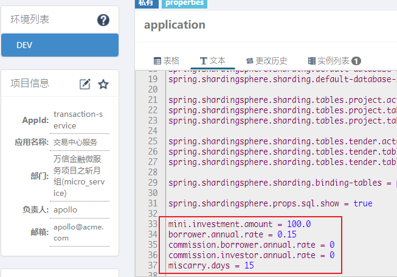

#### 3.6.3. 测试步骤

1. 使用未开户的用户登陆，点击借款申请时，会跳转开户页面

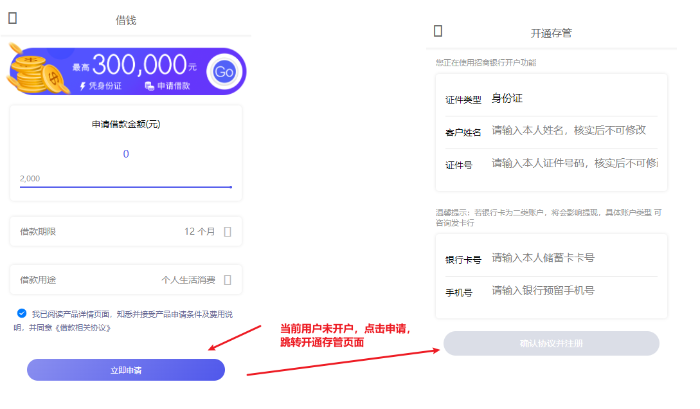

2. 使用已经开户的用户登陆，选择相关数据后，点击“立即申请”
3. 申请成功会跳转“审核中”页面

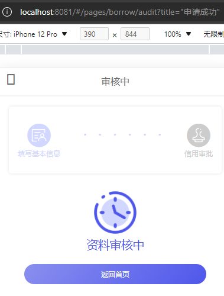

4. 如果同一个用户新增两条申请，则根据上面数据库分库规则，同一个用户都保存到同一个数据库中，而不同的记录会分别记录到 `project_0` 和 `project_1` 表中。

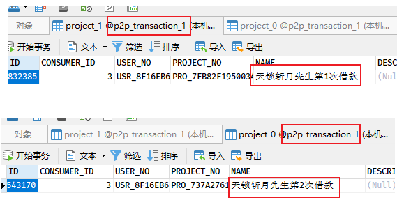

## 4. 查询标的信息

### 4.1. 部署 P2P 后台管理平台前端工程

交易中心保存完标的信息后，P2P 公司管理员就需要登录万信金融管理平台对该标的进行审核，该功能同样放在 wanxinp2p-transaction-service 工程中实现，但是该功能需要一个独立的前端(管理平台)作为审核的入口。


#### 4.1.1. 后台管理平台前端工程

p2p 后台管理平台前端工程地址：`wanxinp2p-project\wanxinp2p-frontend\wanxinp2p-web-manager\`

wanxinp2p-web-manager 是万信金融管理平台的前端工程，使用前端代码编辑器打开即可（如：VSCode）。该前端工程使用 vue-element-admin 集成方案，具体采用了 vue [2.6.10] + element-ui[2.7.0] + axios 技术栈。该前端工程直接使用现成，功能无需编码。


#### 4.1.2. 搭建运行环境

- 使用 vscode 打开 wanxinp2p-web-manager  前端工程，在项目的根目录中运行命令安装项目相关依赖，在终端控制台会看到日志输出，等待联网下载依赖库

```bash
npm install
```

- 执行以下命令，启动该前端工程。项目的端口号是：8079。可以通过修改 vue.config.js 文件中的 `const port = xxx` 来指定端口号

```bash
npm run dev
```

- 该前端工程会使用 ESlint 进行语法检查，开发环境下启动会经常因为语法格式不正确而报错，为了方便，暂时将 ESlint 停用。具体的配置在 vue.config.js 文件中：

```js
module.exports = {
    ...
    lintOnSave: false,
    ...
}
```

- 在浏览器中访问 `http://localhost:8079/#/` 登录页面，账号和密码都是 admin。要想登录成功，后端需要启动 Apollo 以及 wanxinp2p-discover-server、wanxinp2p-account-service、wanxinp2p-consumer-service、wanxinp2p-gateway-server、wanxinp2p-uaa-service 等微服务。

### 4.2. 需求分析

审核标的业务需要首先实现标的信息的分页查询，查询出来的标的信息会在管理平台中展示出来，只有P2P公司的管理员看到这些标的信息了，才能进行审核操作。


### 4.3. 接口定义

#### 4.3.1. 定义公共分页响应实体类

因为很多查询功能都需要分页，所以在 wanxinp2p-common 工程的 domain 包中定义统一的分页响应实体 `PageVO<T>`

```java
public class PageVO<T> implements Iterable<T>, Serializable {

    private List<T> content = new ArrayList<>();
    private long total;
    private int pageNo;
    private int pageSize;

    public PageVO() {
    }

    public PageVO(List<T> content, long total, int pageNo, int pageSize) {
        this.content = content;
        this.total = total;
        this.pageNo = pageNo;
        this.pageSize = pageSize;
    }

    /**
     * Returns if there is a previous page.
     *
     * @return if there is a previous page.
     */
    public boolean hasPrevious() {
        return getPageNo() > 0;
    }

    /**
     * Returns if there is a next page.
     *
     * @return if there is a next page.
     */
    public boolean hasNext() {
        return getPageNo() + 1 < getTotalPage();
    }

    /**
     * Returns whether the current page is the first one.
     *
     * @return whether the current page is the first one.
     */
    public boolean isFirst() {
        return !hasPrevious();
    }

    /**
     * Returns whether the current  page is the last one.
     *
     * @return whether the current  page is the last one.
     */
    boolean isLast() {
        return !hasNext();
    }

    /**
     * Returns the total amount of elements of all pages.
     *
     * @return the total amount of elements of all pages.
     */
    public long getTotal() {
        return total;
    }

    public void setTotal(long total) {
        this.total = total;
    }

    /**
     * Returns the number of total pages.
     *
     * @return the number of total pages
     */
    public int getTotalPage() {
        return getPageSize() == 0 ? 1 : (int) Math.ceil((double) total / (double) getPageSize());
    }

    /**
     * Returns the page content as unmodifiable {@link List}.
     *
     * @return Returns the page content as unmodifiable {@link List}
     */
    public List<T> getContent() {
        return Collections.unmodifiableList(content);
    }

    public void setContent(List<T> content) {
        this.content = content;
    }

    /**
     * Returns whether the current page has content.
     *
     * @return whether the current page has content.
     */
    public boolean hasContent() {
        return getContentSize() > 0;
    }

    /**
     * Returns the number of elements on current page.
     *
     * @return the number of elements on current page.
     */
    public int getContentSize() {
        return content.size();
    }

    /**
     * Returns the number of items of each page.
     *
     * @return the number of items of each page
     */
    public int getPageSize() {
        return pageSize;
    }

    public void setPageSize(int pageSize) {
        this.pageSize = pageSize;
    }

    /**
     * Returns the number of current page. (Zero-based numbering.)
     *
     * @return the number of current page.
     */
    public int getPageNo() {
        return pageNo;
    }

    /**
     * Set the number of current page. (Zero-based numbering.)
     */
    public void setPageNo(int pageNo) {
        this.pageNo = pageNo;
    }

    public Iterator<T> iterator() {
        return getContent().iterator();
    }
}
```

#### 4.3.2. 条件查询接口

在 wanxinp2p-api 工程的 `TransactionApi` 接口中新增查询方法 `queryProjects`，实现带条件的分页查询

```java
/**
 * 检索标的信息
 *
 * @param projectQueryDTO 封装查询条件
 * @param order           排序的方式
 * @param pageNo          当前页
 * @param pageSize        每页大小
 * @param sortBy          排序的字段
 * @return
 */
RestResponse<PageVO<ProjectDTO>> queryProjects(ProjectQueryDTO projectQueryDTO, String order,
                                               Integer pageNo, Integer pageSize, String sortBy);
```

### 4.4. 业务功能实现

#### 4.4.1. 业务层实现

- 在 wanxinp2p-transaction-service 工程中的 `ProjectService` 接口，新增条件查询的业务方法 `queryProjectsByQueryDTO`

```java
/**
 * 根据分页条件检索标的信息
 *
 * @param projectQueryDTO 封装查询条件
 * @param order           排序的方式
 * @param pageNo          当前页
 * @param pageSize        每页大小
 * @param sortBy          排序的字段
 * @return
 */
PageVO<ProjectDTO> queryProjectsByQueryDTO(ProjectQueryDTO projectQueryDTO, String order,
                                           Integer pageNo, Integer pageSize, String sortBy);
```

- 在 `ProjectServiceImpl` 类中实现方法，主要是查询条件的处理

```java
@Override
public PageVO<ProjectDTO> queryProjectsByQueryDTO(ProjectQueryDTO projectQueryDTO, String order,
                                                    Integer pageNo, Integer pageSize, String sortBy) {
    // 构建查询条件
    QueryWrapper<Project> queryWrapper = createQueryWrapper(projectQueryDTO, order, sortBy);

    // 构造分页对象
    Page<Project> page = new Page<>(pageNo, pageSize);

    // 执行查询
    IPage<Project> iPage = page(page, queryWrapper);

    // 结果类型转换
    List<ProjectDTO> projectDTOList = convertProjectEntitysToDTOs(iPage.getRecords());
    // 封装结果
    return new PageVO<>(projectDTOList, iPage.getTotal(), pageNo, pageSize);
}

/**
 * 构建查询条件
 */
private QueryWrapper<Project> createQueryWrapper(ProjectQueryDTO projectQueryDTO, String order, String sortBy) {
    // 构造查询条件
    QueryWrapper<Project> queryWrapper = new QueryWrapper<>();
    LambdaQueryWrapper<Project> lambdaQueryWrapper = queryWrapper.lambda();

    // 标的类型
    if (StringUtils.hasText(projectQueryDTO.getType())) {
        lambdaQueryWrapper.eq(Project::getType, projectQueryDTO.getType());
    }
    // 起止年化利率(投资人) -- 区间
    if (null != projectQueryDTO.getStartAnnualRate()) {
        lambdaQueryWrapper.ge(Project::getAnnualRate, projectQueryDTO.getStartAnnualRate());
    }
    if (null != projectQueryDTO.getEndAnnualRate()) {
        lambdaQueryWrapper.le(Project::getAnnualRate, projectQueryDTO.getEndAnnualRate());
    }
    // 借款期限 -- 区间
    if (null != projectQueryDTO.getStartPeriod()) {
        lambdaQueryWrapper.ge(Project::getPeriod, projectQueryDTO.getStartPeriod());
    }
    if (null != projectQueryDTO.getEndPeriod()) {
        lambdaQueryWrapper.le(Project::getPeriod, projectQueryDTO.getEndPeriod());
    }
    // 标的状态
    if (StringUtils.hasText(projectQueryDTO.getProjectStatus())) {
        lambdaQueryWrapper.eq(Project::getProjectStatus,
                projectQueryDTO.getProjectStatus());
    }

    // 排序
    if (StringUtils.hasText(order) && StringUtils.hasText(sortBy)) {
        if ("asc".equalsIgnoreCase(order)) {
            queryWrapper.orderByAsc(sortBy);
        } else if ("desc".equalsIgnoreCase(order)) {
            queryWrapper.orderByDesc(sortBy);
        }
    } else {
        // 没有上送排序规则，则按创建日期倒序
        lambdaQueryWrapper.orderByDesc(Project::getCreateDate);
    }

    return queryWrapper;
}

/**
 * entity 转 dto
 */
private List<ProjectDTO> convertProjectEntitysToDTOs(List<Project> projectList) {
    if (projectList == null) {
        return null;
    }
    return projectList.stream().map(p -> {
        ProjectDTO dto = new ProjectDTO();
        BeanUtils.copyProperties(p, dto);
        return dto;
    }).collect(Collectors.toList());
}
```

#### 4.4.2. 请求控制类

修改 `TransactionController` 类实现接口的方法，调用业务层实现

```java
@ApiOperation("检索标的信息")
@ApiImplicitParams({
        @ApiImplicitParam(name = "projectQueryDTO", value = "标的信息查询对象", required = true,
                dataType = "ProjectQueryDTO", paramType = "body"),
        @ApiImplicitParam(name = "order", value = "顺序", dataType = "string", paramType = "query"),
        @ApiImplicitParam(name = "pageNo", value = "页码", required = true,
                dataType = "int", paramType = "query"),
        @ApiImplicitParam(name = "pageSize", value = "每页记录数", required = true,
                dataType = "int", paramType = "query"),
        @ApiImplicitParam(name = "sortBy", value = "排序字段", required = true,
                dataType = "string", paramType = "query")})
@PostMapping("/projects/q")
@Override
public RestResponse<PageVO<ProjectDTO>> queryProjects(@RequestBody ProjectQueryDTO projectQueryDTO, String order,
                                                      Integer pageNo, Integer pageSize, String sortBy) {
    return RestResponse.success(projectService.queryProjectsByQueryDTO(projectQueryDTO, order, pageNo, pageSize, sortBy));
}
```

### 4.5. 功能测试

#### 4.5.1. 启动服务

1. 启动 Apollo 服务
2. 后端需要启动：
    - wanxinp2p-discover-server 微服务
    - wanxinp2p-gateway-server 微服务
    - wanxinp2p-uaa-service 微服务
    - wanxinp2p-account-service 微服务
    - wanxinp2p-consumer-service 微服务
    - wanxinp2p-transaction-service 微服务
3. 启动前端 wanxinp2p-web-manager 项目

#### 4.5.2. 测试步骤

1. 访问管理后台前端页面 `http://localhost:8079/`，登陆用户 admin/admin
2. 点击【准备中待审核】菜单，测试查询

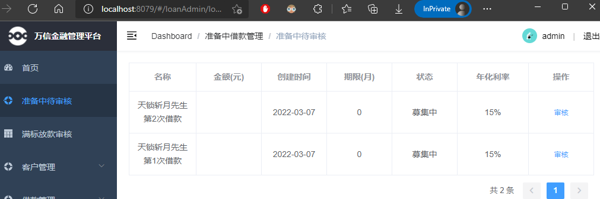

3. 使用 postman 直接请求测试

```json
POST http://127.0.0.1:53010/transaction/projects/q?pageNo=1&pageSize=5

{
    "type": "",
    "startPeriod": null,
    "endPeriod": null,
    "startAnnualRate": null,
    "endAnnualRate": null,
    "projectStatus": ""
}
```

## 5. 审核标的

### 5.1. 需求分析

参考前面章节中的业务流程时序图。用户发标后，P2P平台的管理员会对标的信息进行审核，审核通过后会通过存管代理服务将标的信息同步到银行存管系统

### 5.2. 接口定义

#### 5.2.1. 交易中心审核标的接口

在 wanxinp2p-api 工程的 `TransactionApi` 接口中定义审核标的信息的方法 

```java
/**
 * 管理员审核标的信息
 *
 * @param id
 * @param approveStatus
 * @return
 */
RestResponse<String> projectsApprovalStatus(Long id, String approveStatus);
```

#### 5.2.2. 存管代理服务标的同步接口

在 wanxinp2p-api 工程的 `DepositoryAgentApi` 接口中定义向银行存管系统发送标的信息的方法

```java
/**
 * 向银行存管系统发送标的信息
 *
 * @param projectDTO
 * @return
 */
RestResponse<String> createProject(ProjectDTO projectDTO);
```

### 5.3. 业务实现

#### 5.3.1. 交易中心审核标的信息业务实现

- 在 wanxinp2p-transaction-service 交易中心微服务中，定义一个 Feign 代理接口 `DepositoryAgentApiAgent`，调用存管代理微服务的标的同步接口发送标的信息

```java
@FeignClient(value = "depository-agent-service")
public interface DepositoryAgentApiAgent {

    @PostMapping(value = "/depository-agent/l/createProject")
    RestResponse<String> createProject(@RequestBody ProjectDTO projectDTO);
}
```

-  在 `ProjectService` 接口中新增 `projectsApprovalStatus` 方法，用于审核标的信息：

```java
/**
 * 管理员审核标的信息
 *
 * @param id
 * @param approveStatus
 * @return
 */
String projectsApprovalStatus(Long id, String approveStatus);
```

- 在 `ProjectServiceImpl` 类中实现该方法

```java
@Override
public String projectsApprovalStatus(Long id, String approveStatus) {
    // 根据 id 查询标的信息
    Project project = this.getById(id);
    // 转成 dto 传输对象
    ProjectDTO dto = new ProjectDTO();
    BeanUtils.copyProperties(project, dto);
    // 生成请求流水号
    dto.setRequestNo(CodeNoUtil.getNo(CodePrefixCode.CODE_REQUEST_PREFIX));

    // 通过 feign 远程访问存管代理服务接口，传递标的信息
    RestResponse<String> response = depositoryAgentApiAgent.createProject(dto);

    // 失败则抛异常（根据银行存管系统文档返回说明，成功则返回"00000"）
    if (!DepositoryReturnCode.RETURN_CODE_00000.getCode().equals(response.getResult())) {
        throw new BusinessException(TransactionErrorCode.E_150113);
    }

    // 响应结果是成功，则修改状态
    update(Wrappers.<Project>lambdaUpdate()
            .set(Project::getStatus, Integer.parseInt(approveStatus))
            .eq(Project::getId, id)
    );
    return "success";
}
```

- 修改 `TransactionController` 控制类，调用业务层接口审核标的方法

```java
@ApiOperation("管理员审核标的信息")
@ApiImplicitParams({
        @ApiImplicitParam(name = "id", value = "标的id", required = true, dataType = "long", paramType = "path"),
        @ApiImplicitParam(name = "approveStatus", value = "审批状态", required = true, dataType = "ref", paramType = "path")
})
@PutMapping("/m/projects/{id}/projectStatus/{approveStatus}")
@Override
public RestResponse<String> projectsApprovalStatus(@PathVariable("id") Long id,
                                                    @PathVariable("approveStatus") String approveStatus) {
    return RestResponse.success(projectService.projectsApprovalStatus(id, approveStatus));
}
```

#### 5.3.2. 存管代理服务标的同步业务实现

- 创建存管代理请求银行存管系统服务接口传输的实体类 `ProjectRequestDataDTO`

```java
@Data
public class ProjectRequestDataDTO implements Serializable {
    /**
     * 请求流水号
     */
    private String requestNo;
    /**
     * 平台用户编号
     */
    private String userNo;
    /**
     * 标的号
     */
    private String projectNo;
    /**
     * 标的金额
     */
    private BigDecimal projectAmount;
    /**
     * 标的名称
     */
    private String projectName;
    /**
     * 标的描述
     */
    private String projectDesc;
    /**
     * 标的产品类型
     */
    private String projectType;
    /**
     * 标的期限
     */
    private Integer projectPeriod;
    /**
     * 年化利率( 5%只传5 )
     */
    private BigDecimal annualRate;
    /**
     * 还款方式
     */
    private String repaymentWay;
    /**
     * 是否是债权出让标
     */
    private Integer isAssignment;
}
```

- 在 wanxinp2p-api 工程的 `depository.model` 包中， 创建 `DepositoryResponseDTO` 传输实体类，用于银行存管系统返回字符串, 转换的json对象

```java
@Data
public class DepositoryResponseDTO<T> implements Serializable {
    /**
     * 业务数据报文，JSON格式
     */
    @ApiModelProperty("业务数据报文，JSON格式")
    private T respData;
    /**
     * 签名
     */
    @ApiModelProperty("签名数据")
    private String signature;
}
```

- 在 wanxinp2p-depository-agent-service 工程的 `DepositoryRecordService` 接口中新增 `createProject` 方法

```java
/**
 * 保存标的
 *
 * @param projectDTO
 * @return
 */
DepositoryResponseDTO<DepositoryBaseResponse> createProject(ProjectDTO projectDTO);
```

- 在 `DepositoryRecordServiceImpl` 类中实现调用银行存管系统新增标的

```java
@Override
public DepositoryResponseDTO<DepositoryBaseResponse> createProject(ProjectDTO projectDTO) {
    // 1. 本地保存交易记录
    DepositoryRecord depositoryRecord = new DepositoryRecord()
            .setRequestNo(projectDTO.getRequestNo()) // 设置请求流水号
            .setRequestType(DepositoryRequestTypeCode.CREATE.getCode()) // 设置请求类型
            .setObjectType("Project") // 设置关联业务实体类型
            .setObjectId(projectDTO.getId()) // 设置关联业务实体标识
            .setCreateDate(LocalDateTime.now()) // 设置请求时间
            .setRequestStatus(StatusCode.STATUS_OUT.getCode()); // 设置数据同步状态
    // 保存数据
    save(depositoryRecord);

    // 2. 签名数据，将 ProjectDTO 转换为银行存管系统的请求类型 ProjectRequestDataDTO
    ProjectRequestDataDTO requestDataDTO = new ProjectRequestDataDTO();
    BeanUtils.copyProperties(projectDTO, requestDataDTO);
    // 转成 JSON 字符串
    String jsonString = JSON.toJSONString(requestDataDTO);
    // 使用 base64 编码
    String reqData = EncryptUtil.encodeUTF8StringBase64(jsonString);

    // 3. 使用 OKHttpClient 发送 Http 请求向银行存管系统发送数据(标的信息)，根据结果修改状态并返回结果
    return sendHttpGet("CREATE_PROJECT", reqData, depositoryRecord);
}

/**
 * 向银行存管系统发送同步的 GET 请求
 * 2022.03.19 修改方法入参，移除 url 形参，直接在方法中读取配置中心值并拼接
 *
 * @param serviceName      银行存管系统中服务名称
 * @param reqData          请求数据（已签名）
 * @param depositoryRecord 存管交易记录
 * @return
 */
private DepositoryResponseDTO<DepositoryBaseResponse> sendHttpGet(String serviceName, String reqData,
                                                                  DepositoryRecord depositoryRecord) {
    /*
     * 银行存管系统接收的4大参数: serviceName, platformNo, reqData, signature。
     * signature会在okHttp拦截器(SignatureInterceptor)中处理
     */
    // 平台编号
    String platformNo = configService.getP2pCode();
    // 银行存管系统 url
    String url = configService.getDepositoryUrl() + "/service";
    // redData签名
    // 发送请求, 获取结果, 如果检验签名失败, 拦截器会在结果中放入: "signature", "false"
    String responseBody = okHttpService
            .doSyncGet(url + "?serviceName=" + serviceName + "&platformNo=" + platformNo + "&reqData=" + reqData);
    DepositoryResponseDTO<DepositoryBaseResponse> depositoryResponse = JSON
            .parseObject(responseBody, new TypeReference<DepositoryResponseDTO<DepositoryBaseResponse>>() {
            });

    // 响应后, 根据结果更新数据库( 进行签名判断 )。判断签名(signature)是为 false, 如果是说明验签失败!
    boolean isFail = "false".equals(depositoryResponse.getSignature());

    // 根据响应是否成功，设置数据同步状态
    depositoryRecord.setRequestStatus(isFail ?
            StatusCode.STATUS_FAIL.getCode() : StatusCode.STATUS_IN.getCode());
    // 设置消息确认时间
    depositoryRecord.setConfirmDate(LocalDateTime.now());
    // 更新数据库
    updateById(depositoryRecord);

    if (isFail) {
        // 抛业务异常
        throw new BusinessException(DepositoryErrorCode.E_160101);
    }

    return depositoryResponse;
}
```

- 在存管代理工程中，创建HTTP请求工具类 `OkHttpService` 和 `SignatureInterceptor`
    - `OkHttpService` 类封装了一个方法，该方法通过 `OkHttpClient` 发送 Http 请求，通过该方法往银行存管系统发起请求。
    - `SignatureInterceptor` 类是一个通用请求拦截器，用来拦截请求并进行签名和验签。

```java
@Log4j2
@Service
public class SignatureInterceptor implements Interceptor {

    private final String METHOD_GET = "GET";

    @Autowired
    private ConfigService configService;

    /**
     * 签名的编码
     */
    private final String INPUT_CHARSET = "UTF-8";

    @Override
    public Response intercept(Chain chain) throws IOException {
        // 拦截请求，获取到该次请求的request
        Request request = chain.request();
        Response response = null;
        Request requestProcess = null;
        // 请求银行存管系统的请求是GET, 这里只处理GET
        if (METHOD_GET.equals(request.method())) {
            // 获取原请求地址
            String url = request.url().toString();
            // 获取参数解码
            final String reqData = getParam(url, "reqData");
            String jsonString = EncryptUtil.decodeUTF8StringBase64(reqData);
            final String serviceName = getParam(url, "serviceName");
            final String platformNo = getParam(url, "platformNo");
            //
            String base = url.substring(0, url.indexOf("?") + 1);

            // 进行签名
            final String sign = RSAUtil.sign(jsonString, configService.getP2pPrivateKey(), INPUT_CHARSET);
            // 修改请求地址, 并添加签名参数
            url = base + "serviceName=" + URLEncoder.encode(serviceName, INPUT_CHARSET)
                    + "&platformNo=" + URLEncoder.encode(platformNo, INPUT_CHARSET)
                    + "&reqData=" + URLEncoder.encode(reqData, INPUT_CHARSET)
                    + "&signature=" + URLEncoder.encode(sign, INPUT_CHARSET);
            // 重新构造请求
            Request.Builder builder = request.newBuilder();
            builder.get().url(url);
            requestProcess = builder.build();
            // 执行请求
            response = chain.proceed(requestProcess);
            // 得到结果集,
            final String result = response.body().string();
            // 转换成json进行结果验签
            final JSONObject parseObject = JSON.parseObject(result);
            // 获取业务报文, 这个是base64的需要解密
            final String respData = parseObject.getString("respData");
            // 获取签
            final String signature = parseObject.getString("signature");
            // 进行验签
            if (RSAUtil.verify(respData, signature, configService.getDepositoryPublicKey(), INPUT_CHARSET)) {
                // 验签成功
                // 重新构造结果集, 原因是response.body().toString();调用后, body中值会请空
                response = response.newBuilder().body(ResponseBody.create(response.body().contentType(), parseObject.toJSONString())).build();
            } else {
                // 验签失败, 把signature修改为false, 用于业务判断,
                // 这个地方不能抛业务异常的原因是存管代理服务要根据结果更新数据库, 如果抛业务异常数据库就办法处理!
                parseObject.put("signature", "false");
                // 构造新的返回值
                response = response.newBuilder().body(ResponseBody.create(response.body().contentType(), parseObject.toJSONString())).build();
            }
        } else {
            // 其他请求不处理
            response = chain.proceed(request);
        }
        // 返回结果集
        return response;
    }

    /**
     * 获取url中参数
     *
     * @param url
     * @param name
     * @return
     */
    public static String getParam(String url, String name) {
        String params = url.substring(url.indexOf("?") + 1, url.length());
        final String[] splitter = params.split("&");
        for (String str : splitter) {
            if (str.startsWith(name + "=")) {
                return str.substring(name.length() + 1);
            }
        }
        return "";
    }

    public static void main(String[] args) {
        String str = "http://sdfasdf?serviceName=wanxinp2p&platformNo=wanxinp2p&reqData=eyJhbW91bnQiOjExMTEsImJpelR5cGUiOiJURU5ERVIiLCJwcm9qZWN0Tm8iOiJQUk9fREQxMzAyRTQxQjA1NDZCMTk2Mjg2RkY2MTQ2Q0JCOUYiLCJyZXF1ZXN0Tm8iOiJSRVFfMjJDMjZDQzY0RkIyNEEyRjlCNjU2OUQ2MzgzQkEwMUIiLCJ1c2VyTm8iOiI0In0=";
        String base = str.substring(0, str.indexOf("?") + 1);
        System.out.println(base);
        System.out.println(getParam(str, "reqData"));
    }

}
```

```java
@Log4j2
@Service
public class OkHttpService {

    @Autowired
    private SignatureInterceptor signatureInterceptor;

    /**
     * okHttp 同步 GET 请求
     *
     * @param url
     * @return
     */
    public String doSyncGet(String url) {
        OkHttpClient okHttpClient = new OkHttpClient().newBuilder().addInterceptor(signatureInterceptor).build();
        Request request = new Request.Builder().url(url).build();
        try (Response response = okHttpClient.newCall(request).execute()) {
            return response.body().string();
        } catch (IOException e) {
            log.warn("请求出现异常: ", e);
        }
        return "";
    }
}
```

- 修改 `DepositoryAgentController` 控制类，调用业务层向银行存管系统发送标的信息方法

```java
@ApiOperation(value = "向存管系统发送标的信息")
@ApiImplicitParam(name = "projectDTO", value = "向存管系统发送标的信息",
        required = true, dataType = "ProjectDTO", paramType = "body")
@PostMapping("/l/createProject")
@Override
public RestResponse<String> createProject(@RequestBody ProjectDTO projectDTO) {
    DepositoryResponseDTO<DepositoryBaseResponse> responseDTO = depositoryRecordService.createProject(projectDTO);
    // 获取响应数据
    DepositoryBaseResponse respData = responseDTO.getRespData();
    // 设置响应结果和响应信息
    RestResponse<String> response = new RestResponse<>();
    response.setResult(respData.getRespCode());
    response.setMsg(respData.getRespMsg());
    return response;
}
```

### 5.4. 前后端集成测试

#### 5.4.1. 启动服务

1. 启动 Apollo 服务
2. 后端需要启动：
    - wanxinp2p-discover-server 微服务
    - wanxinp2p-gateway-server 微服务
    - wanxinp2p-uaa-service 微服务
    - wanxinp2p-account-service 微服务
    - wanxinp2p-consumer-service 微服务
    - wanxinp2p-depository-agent-service 微服务
    - wanxinp2p-transaction-service 微服务
    - wanxindepository  银行存管系统
3. 启动前端 wanxinp2p-web-manager 项目

#### 5.4.2. 测试步骤

1. 登陆管理后台，http://localhost:8079/，使用 admin/admin 账号登陆。
2. 点击【准备中待审核】菜单，再选择一条记录点击审核

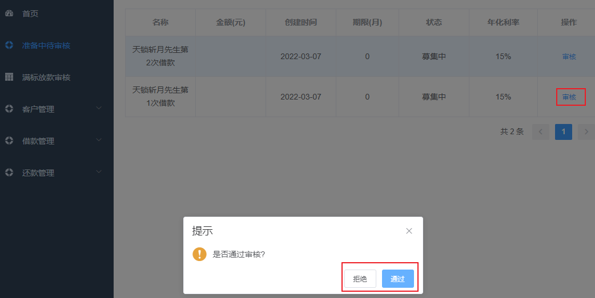

3. 点击“拒绝”按钮，测试拒绝状态。观察后台控制台输出与数据库表变化

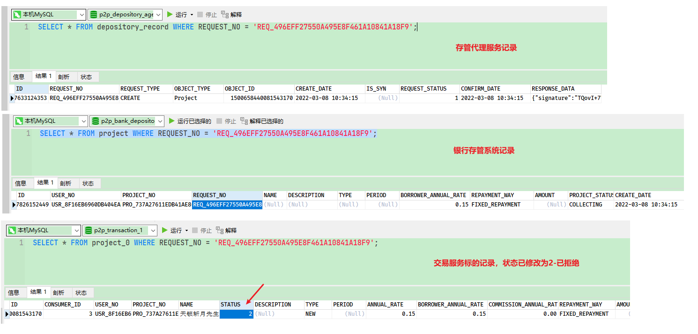

4. 点击“通过”按钮，测试通过状态。观察后台控制台输出与数据库表变化


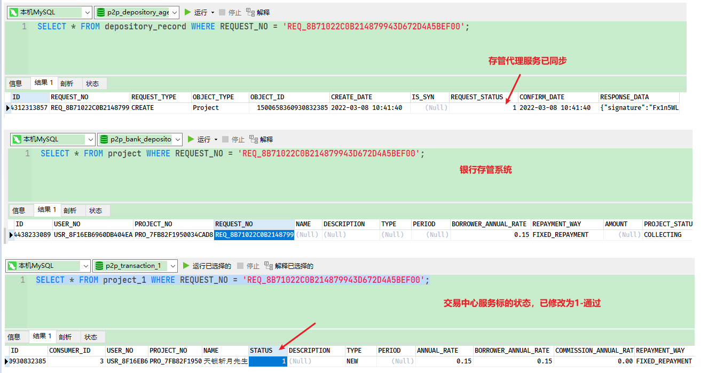

## 6. 分布式事务幂等性

### 6.1. 问题分析

在审核标的业务中，交易中心服务会向存管代理服务发起远程请求，存管代理服务会向银行存管系统发起远程请求，在整个过程中，业务处理可能会比较耗时。另外，在生产环境里，微服务很有可能会以集群形式进行部署，此时会出现一个问题需要解决，结合下图一起分析。

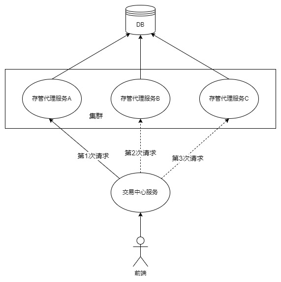

假设：前端请求交易中心服务审核标的，交易中心服务向存管代理服务A发起远程请求，存管代理服务A在向数据库保存完交易记录后出现网络问题，此时，交易中心服务一直等待，前端也收不到响应信息，那么客户在等待一段时间后，很有可能会在前端再次点击按钮请求交易中心服务审核标的，交易中心服务向存管代理服务B发起远程请求，存管代理服务B向数据库保存交易记录……，最终导致数据库中存在重复数据。

还有一个问题也是需要解决的，就是客户通过前端在短时间(例如5秒)内多次点击按钮重复发送请求，此时，应该只允许其中一个请求拥有执行权。就需要让接口实现幂等性来解决这类问题。

### 6.2. 幂等性定义

幂等性指的是：一个业务操作，不管重复执行多少次，最终产生的效果或返回的结果都和执行一次是一样的。

### 6.3. 审核标的业务幂等性功能实现

当存管代理服务被交易中心远程请求时，首先根据该请求的 requestNo 获取交易记录，然后分三种情况进行处理：

1. 若交易记录不存在则新增交易记录，requestNo 为唯一索引，新保存的数据的状态为“未同步”
2. 若交易记录存在并且数据状态为“未同步”，此阶段存在并发可能，利用 redis 原子性自增，来争夺请求执行权，若 count 大于1，说明已有线程在执行该操作，直接返回“正在处理”
3. 若交易记录存在并且数据状态为“已同步”，直接返回处理结果

#### 6.3.1. 数据库表字段改造

在之前的代码中，requestNo 每次在请求时都会新生成一个值，因此无法满足实现幂等性的需求。所以需要改造标的表，增加记录流水号的字段。执行以下脚本：

```sql
ALTER TABLE `p2p_transaction_0`.`project_0` ADD COLUMN `REQUEST_NO` VARCHAR ( 50 ) NULL COMMENT '发标请求流水号' AFTER `IS_ASSIGNMENT`;
ALTER TABLE `p2p_transaction_0`.`project_1` ADD COLUMN `REQUEST_NO` VARCHAR ( 50 ) NULL COMMENT '发标请求流水号' AFTER `IS_ASSIGNMENT`;
ALTER TABLE `p2p_transaction_1`.`project_0` ADD COLUMN `REQUEST_NO` VARCHAR ( 50 ) NULL COMMENT '发标请求流水号' AFTER `IS_ASSIGNMENT`;
ALTER TABLE `p2p_transaction_1`.`project_1` ADD COLUMN `REQUEST_NO` VARCHAR ( 50 ) NULL COMMENT '发标请求流水号' AFTER `IS_ASSIGNMENT`;
```

> *注：如果之前项目的初始化脚本已经包含此字段，可以跳过*

#### 6.3.2. 相关实体类改造

- 标的实体类 `com.moon.wanxinp2p.transaction.entity.Project`，增加请求流水号属性

```java
public class Project implements Serializable {
    ....
    /**
     * 发标请求流水号
     */
    @TableField("REQUEST_NO")
    private String requestNo;
}
```

- 在 `com.moon.wanxinp2p.api.transaction.model.ProjectDTO` 类中新增对应的属性。（*如已定义，则跳过*）

```java
@Data
public class ProjectDTO {
    ....
    /** 请求流水号 */
    private String requestNo;
}
```

#### 6.3.3. 交易中心服务的审核标的方法改造

根据前面的分析，是根据请求中的 `requestNo` 来实现幂等性，所以在 `ProjectServiceImpl.projectsApprovalStatus` 审核标的业务方法中，不能每次都生成新的 `requestNo`。而改造成当请求流水号 `requestNo` 不存在时，才生成（即第一次请求时生成，往后的请求都不会再次生成），并保存到数据库中

```java
@Override
public String projectsApprovalStatus(Long id, String approveStatus) {
    // 根据 id 查询标的信息
    Project project = this.getById(id);
    // 转成 dto 传输对象
    ProjectDTO dto = new ProjectDTO();
    BeanUtils.copyProperties(project, dto);

    // 生成流水号(不存在才生成)
    if (StringUtils.isEmpty(dto.getRequestNo())) {
        dto.setRequestNo(CodeNoUtil.getNo(CodePrefixCode.CODE_REQUEST_PREFIX));
        // 更新 project_0/project_1 表的 REQUEST_NO 字段
        update(Wrappers.<Project>lambdaUpdate()
                .set(Project::getRequestNo, dto.getRequestNo())
                .eq(Project::getId, id)
        );
    }
    ....
}
```

#### 6.3.4. 存管代理服务实现幂等性

- 针对上面幂等性问题中的第3种情况，在银行存管系统返回处理结果时，需要把该结果保存到数据库中，这样才能保证第3种情况通过 `requestNo` 查询后，能拿到并返回处理结果。因此在 depository_record 表中新增一个字段 `RESPONSE_DATA`，用来保存银行存管系统返回的处理结果。执行以下脚本：

```sql
ALTER TABLE `p2p_depository_agent`.`depository_record` ADD COLUMN `RESPONSE_DATA` text NULL COMMENT '银行存管系统处理结果' AFTER `CONFIRM_DATE`;
```

> *注：如果之前项目的初始化脚本已经包含此字段，可以跳过*

- 修改 `DepositoryRecord` 类，新增对应的属性

```java
public class DepositoryRecord implements Serializable {
    ....
    /**
     * 返回数据
     */
    @TableField("RESPONSE_DATA")
    private String responseData;
}
```

- 对 wanxinp2p-depository-agent-service 工程的 `DepositoryRecordServiceImpl` 类中，单独定义一个方法实现幂等性：

```java
/**
 * 实现幂等性
 *
 * @param record 交易记录
 * @return
 */
private DepositoryResponseDTO<DepositoryBaseResponse> handleIdempotent(DepositoryRecord record) {
    // 1. 根据 requestNo 进行查询
    String requestNo = record.getRequestNo();
    DepositoryRecord depositoryRecord = this.getEntityByRequestNo(requestNo);

    // 2. 判断数据库的交易记录是否存在
    if (depositoryRecord == null) {
        // 不存在，则补全属性值，
        record.setCreateDate(LocalDateTime.now()); // 设置请求时间
        record.setRequestStatus(StatusCode.STATUS_OUT.getCode()); // 设置数据同步状态
        // 保存交易记录
        this.save(record);
        // 因为银行存管系统此时并没有记录，所以直接返回空
        return null;
    }

    // 3. 判断交易记录，如果是未同步状态，则说明是重复点击，重复请求的情况
    if (StatusCode.STATUS_OUT.getCode().compareTo(depositoryRecord.getRequestStatus()) == 0) {
        /*
         * 利用redis的原子性，争夺执行权。调用 redis 的 incrBy 自增命令。
         * 如果 requestNo 不存在则返回1；如果已经存在，则会返回（requestNo已存在个数+1）
         */
        Long count = cache.incrBy(requestNo, 1L);

        if (count == 1) {
            // 说明当前是第1次请求
            cache.expire(requestNo, 5); // 设置 requestNo 有效期5秒
            // 因为银行存管系统此时并没有记录，所以直接返回空
            return null;
        } else if (count > 1) {
            // 若count大于1，说明已有线程在执行该操作，直接返回“正在处理”
            throw new BusinessException(DepositoryErrorCode.E_160103);
        }
    }

    /*
        * 4. 交易记录已经存在，并且状态是“已同步”/"同步失败"，说明已经请求银行存管系统并且返回。
        *   则获取表中的 RESPONSE_DATA 字段，转成 DepositoryResponseDTO<DepositoryBaseResponse> 返回即可
        */
    return JSON.parseObject(depositoryRecord.getResponseData(),
            new TypeReference<DepositoryResponseDTO<DepositoryBaseResponse>>() {
            });
}

/**
 * 根据请求流水号查询交易信息
 *
 * @param requestNo 请求流水号
 * @return
 */
private DepositoryRecord getEntityByRequestNo(String requestNo) {
    return getOne(new QueryWrapper<DepositoryRecord>().lambda().eq(DepositoryRecord::getRequestNo, requestNo));
}
```

- 对 `DepositoryRecordServiceImpl.createProject` 方法进行改造，调用幂等控制方法

```java
@Override
public DepositoryResponseDTO<DepositoryBaseResponse> createProject(ProjectDTO projectDTO) {
    // 1. 创建 DepositoryRecord 记录对象，设置必要的属性
    DepositoryRecord depositoryRecord = new DepositoryRecord()
            .setRequestNo(projectDTO.getRequestNo()) // 设置请求流水号
            .setRequestType(DepositoryRequestTypeCode.CREATE.getCode()) // 设置请求类型
            .setObjectType("Project") // 设置关联业务实体类型
            .setObjectId(projectDTO.getId()); // 设置关联业务实体标识

    // 不直接保存交易，而是调用幂等性处理方法
    DepositoryResponseDTO<DepositoryBaseResponse> responseDTO = this.handleIdempotent(depositoryRecord);
    // 判断幂等性处理后返回不空，则说明已经请求银行存管系统并得到响应结果
    if (responseDTO != null) {
        // 直接返回结果即可
        return responseDTO;
    }

    // 返回结果为空，则说明第1次请求，这里再次查询，确保是最新的交易记录
    depositoryRecord = this.getEntityByRequestNo(projectDTO.getRequestNo());

    // 2. 签名数据，将 ProjectDTO 转换为银行存管系统的请求类型 ProjectRequestDataDTO
    ....
}
```

- 修改 DepositoryRecordServiceImpl 类的 sendHttpGet 方法，新增当请求银行存管系统返回后，记录响应结果

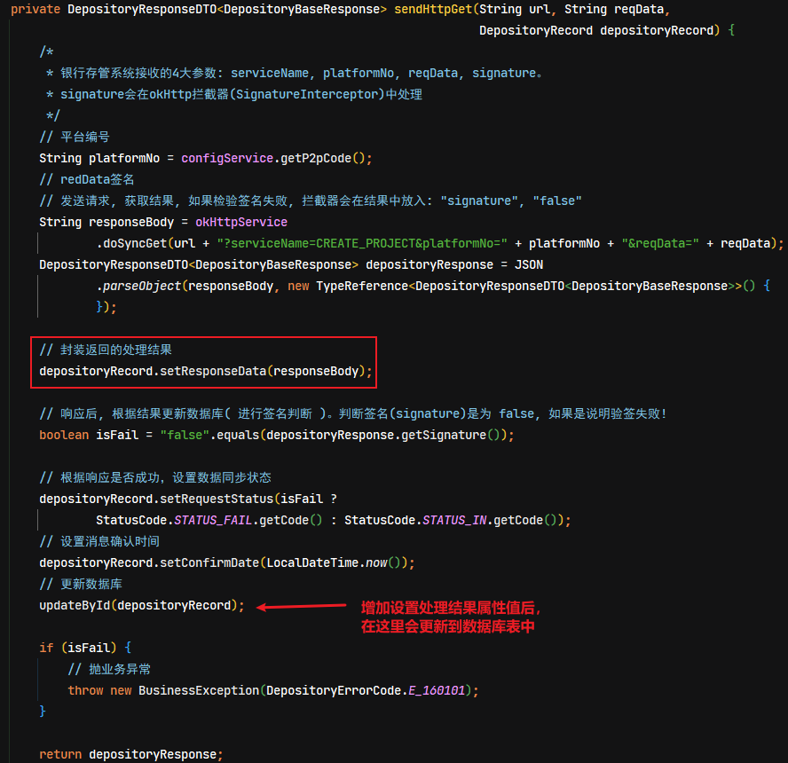

### 6.4. 功能测试

#### 6.4.1. 启动服务

1. 启动 Apollo 服务
2. 后端需要启动：
    - wanxinp2p-discover-server 微服务
    - wanxinp2p-gateway-server 微服务
    - wanxinp2p-uaa-service 微服务
    - wanxinp2p-account-service 微服务
    - wanxinp2p-consumer-service 微服务
    - wanxinp2p-depository-agent-service 微服务【**为了看到测试效果，需要至少在本地启动三个存管代理服务(端口号为53070、53071、53072)用来模拟集群环境**】
    - wanxinp2p-transaction-service 微服务
    - wanxindepository  银行存管系统
3. 启动 Redis 服务
4. 启动前端 wanxinp2p-web-manager 项目

> **注意：检查 Apollo 的 depository-agent-service 项目配置，是否引入了 micro_service.spring-boot-redis 的公共名称空间，还有本地项目配置中是否引入了相应的 namespaces**

#### 6.4.2. 测试步骤

启动前端h5页面，新增多条借款记录，用于测试（然后可以关闭h5服务）。登陆管理后台，点击审核进行测试

1. 测试多次请求是只新增一个 reuqestNo。

这里在第一次请求时，将断点设置在请求银行存管前

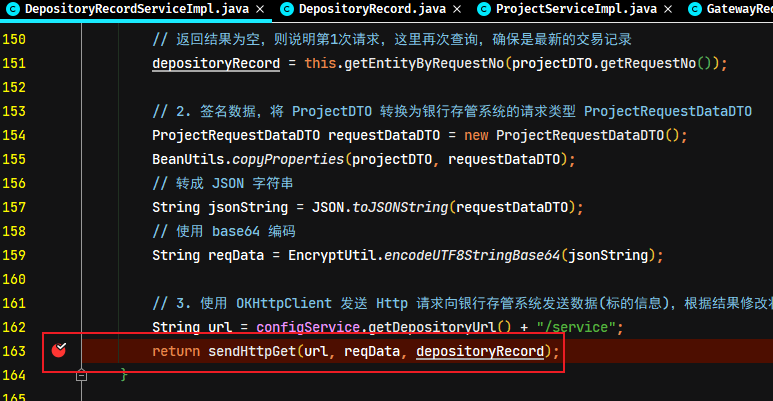

然后不放开断点，在查询交易前后再打上一个断点，然后页面点击第二次请求，观察是否根据请求流水号查询到记录

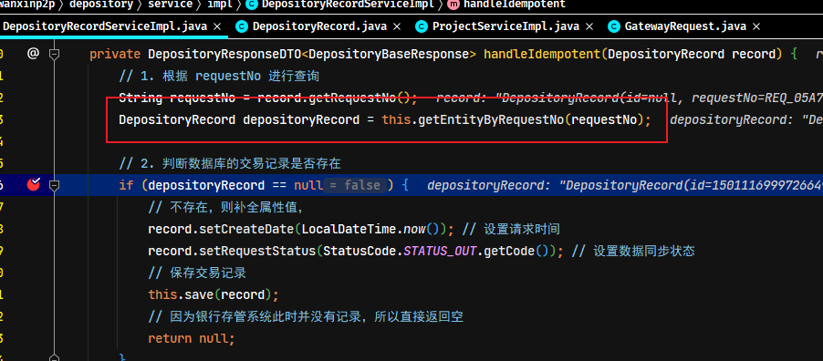

2. 测试交易记录存在，但状态为“未同步”，多个请求是否只有其中一个请求真正执行操作。

这里跟上面一样，在请求银行存管前打上一个断点，然后在redis

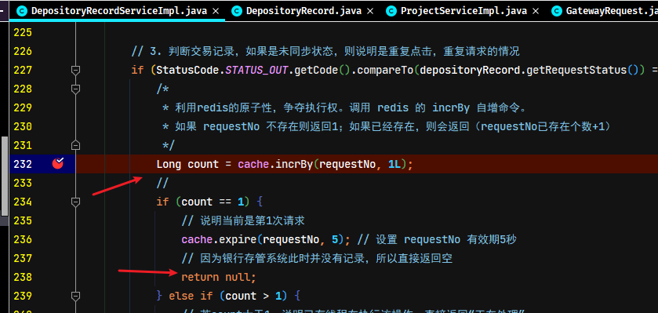
