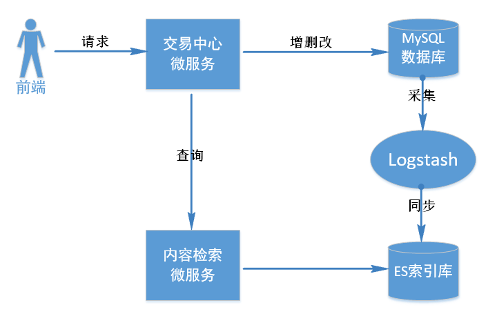
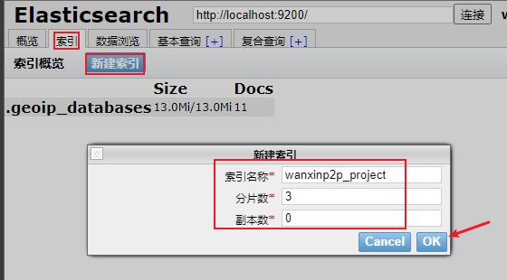
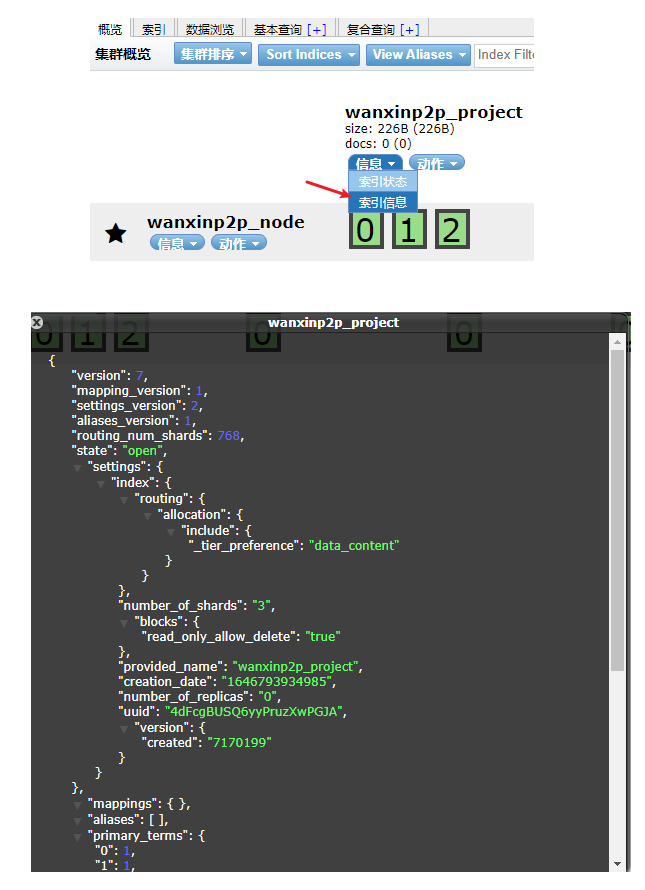
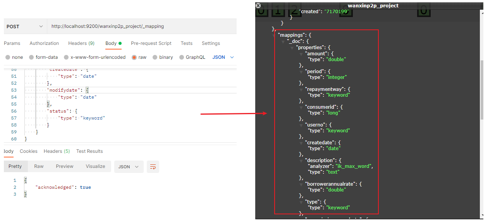
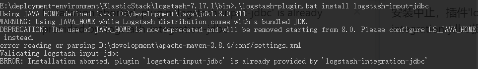
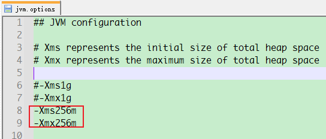
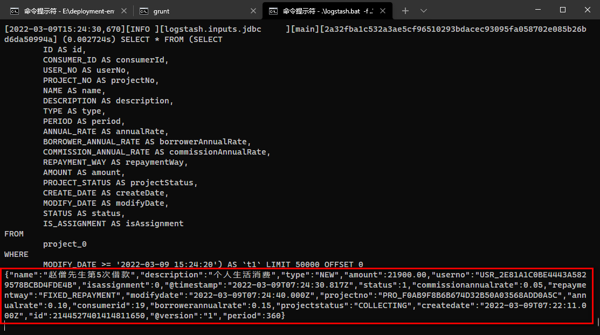

# 第08章 标的检索

## 1. 快速检索需求分析

为了提高数据库性能，对交易中心数据库 p2p_transaction 进行了分库分表、读写分离，但是即便如此，当进行某些查询时，仍然面临性能瓶颈。例如：要进行模糊查询，要进行多字段过滤，在数据量很大的情况下，类似这种查询仍然会比较耗时。在这种情况下，可以考虑使用全文检索技术来进一步优化性能。

由于 P2P 项目中会有多处业务数据有这种需求，所以单独创建一个内容检索微服务工程为整个项目提供全文检索服务，该工程主要采用 ElasticSearch+Logstash 技术实现。具体交互流程如下所示：


1. 前端请求交易中心检索标的
2. 交易中心接到请求后，请求内容检索服务进行查询
3. 内容检索服务请求 ES 索引库查询标的信息
4. 返回查询结果

## 2. 技术方案

由于标的信息是存储在 MySQL 数据库中的，而全文检索是从 ES 索引库获取的数据。因此，需要解决 MySQL 数据库和 ES 索引库之间的数据同步问题，即：MySQL 数据库中的标的信息发生变化时，ES 索引库中的数据也随之变化。

Logstash 作为 Elasicsearch 常用的实时数据采集引擎，可以采集来自不同数据源的数据。通过 Logstash 就可以解决 MySQL 数据库和ES索引库之间的数据同步问题，具体解决方案如下图所示：



## 3. 搭建ES环境

### 3.1. 安装和配置

ElasticSearch、IK分词器以及head插件的下载与安装，详见[《ElasticSearch 分布式全文搜索引擎》笔记](/分布式微服务/ElasticStack/ElasticSearch)。此项目暂时采用单机环境，在企业实际部署时，视情况可以采用集群。elasticsearch.yml 配置如下：

```yml
# 配置elasticsearch的集群名称，默认是elasticsearch。
cluster.name: wanxinp2p
# 节点名，通常一台物理服务器就是一个节点，es会默认随机指定一个名字
node.name: wanxinp2p_node
# 设置绑定主机的ip地址，设置为0.0.0.0表示绑定任何ip，允许外网访问，生产环境建议设置为具体的ip
network.host: 0.0.0.0
# 设置对外服务的http端口，默认为9200
http.port: 9200
# 集群结点之间通信端口
transport.tcp.port: 9300
# 主结点数量的最少值
discovery.zen.minimum_master_nodes: 1
# 设置为true可以锁住ES使用的内存，避免内存与swap分区交换数据
bootstrap.memory_lock: true
# 单节点
discovery.type: single-node
# 开启cors跨域访问支持，默认为false
http.cors.enabled: true
# 跨域访问允许的域名地址，(允许所有域名)使用正则
http.cors.allow-origin: "*"
# 设置索引数据的存储路径，默认是es根目录下的data文件夹
# path.data: xxx\data
# 设置日志文件的存储路径，默认是es根目录下的logs文件夹
# path.logs: xxx\logs
```

进入ElasticSearch根目录，进入bin目录，在cmd下运行：elasticsearch.bat

### 3.2. 创建索引库和映射

- 启动本机 ES 服务和 head 插件服务，通过 head 插件在 wanxinp2p_node 节点快速创建 wanxinp2p_project 索引库（3个分片，0个副本）



创建后可以查看索引库信息



- 通过 Postman 创建映射：

```json
POST http://localhost:9200/wanxinp2p_project/_mapping

{
    "properties": {
        "isassignment": {
            "type": "keyword"
        },
        "amount": {
            "type": "double"
        },
        "period": {
            "type": "integer"
        },
        "repaymentway": {
            "type": "keyword"
        },
        "consumerid": {
            "type": "long"
        },
        "userno": {
            "type": "keyword"
        },
        "description": {
            "analyzer": "ik_max_word",
            "type": "text"
        },
        "annualrate": {
            "type": "double"
        },
        "type": {
            "type": "keyword"
        },
        "borrowerannualrate": {
            "type": "double"
        },
        "projectstatus": {
            "type": "keyword"
        },
        "projectno": {
            "type": "keyword"
        },
        "commissionannualrate": {
            "type": "keyword"
        },
        "name": {
            "analyzer": "ik_max_word",
            "type": "text"
        },
        "id": {
            "type": "long"
        },
        "createdate": {
            "type": "date"
        },
        "modifydate": {
            "type": "date"
        },
        "status": {
            "type": "keyword"
        }
    }
}
```

创建成功



## 4. Logstash 数据采集和同步

### 4.1. 下载和安装 Logstash

1. 从官网 https://www.elastic.co/cn/downloads/logstash 下载 Logstash 7.15.1版本（ZIP），和本项目使用的 Elasticsearch 7.15.1版本一致。
2. 解压到不带中文与空格的任意路径
3. 安装 logstash-input-jdbc 插件， Logstash 通过该插件实现从数据库采集数据。由于该插件是由 ruby 脚本语言开发的，所以需要先自行下载 ruby 并安装，下载地址: https://rubyinstaller.org/downloads/ ，*项目开发时下载 rubyinstaller-3.1.1-1-x64 版本*。安装完成后在命令行窗口执行 `ruby -v` 命令检查是否安装成功
    - 注：因为主是为了安装 logstash 插件，所以没有安装“MSYS2 development toolchain”等，安装完成时也没有勾选 Run 'ridk install' to setup ....
4. 安装完 ruby 后，就可以安装 logstash-input-jdbc 插件。在命令行窗口中切换到 Logstash 的 bin 目录下，执行如下命令即可：

```bash
.\logstash-plugin.bat install logstash-input-jdbc
```

> 注：7.15.1 版本已经安装了 logstash-input-jdbc 插件，如果出现以下提示，即可跳过上面的第3、4步



### 4.2. Logstash 配置

Logstash的工作是从MySQL中读取数据，然后向ES中写入数据从而创建索引。因此它需要知道数据库相关的信息和ES相关的信息，我们需要提供两个配置文件：

1. mysql-es.conf：配置从哪个数据库和表读取数据，和配置把读取到的数据写入到哪个 ES 索引库中
2. 模板文件：索引库的映射配置


#### 4.2.1. 创建模板文件

在 logstash 的 config 目录中创建 wanxinp2p_project_template.json 作为模板文件，配置索引库映射，内容如下:

```json
{
    "mappings": {
        "properties": {
            "isassignment": {
                "type": "keyword"
            },
            "amount": {
                "type": "double"
            },
            "period": {
                "type": "integer"
            },
            "repaymentway": {
                "type": "keyword"
            },
            "consumerid": {
                "type": "long"
            },
            "userno": {
                "type": "keyword"
            },
            "description": {
                "analyzer": "ik_max_word",
                "type": "text"
            },
            "annualrate": {
                "type": "double"
            },
            "type": {
                "type": "keyword"
            },
            "borrowerannualrate": {
                "type": "double"
            },
            "projectstatus": {
                "type": "keyword"
            },
            "projectno": {
                "type": "keyword"
            },
            "commissionannualrate": {
                "type": "keyword"
            },
            "name": {
                "analyzer": "ik_max_word",
                "type": "text"
            },
            "id": {
                "type": "long"
            },
            "createdate": {
                "type": "date"
            },
            "modifydate": {
                "type": "date"
            },
            "status": {
                "type": "keyword"
            }
        }
    },
    "template": "wanxinp2p_project"
}
```

#### 4.2.2. 配置 mysql-es.conf

- 首先需要执行如下 sql 语句，在标的信息表中增加一个字段：

```sql
ALTER TABLE `p2p_transaction_0`.`project_0` ADD COLUMN `MODIFY_DATE` datetime ( 0 ) NULL DEFAULT NULL COMMENT '修改时间' AFTER `CREATE_DATE`;
ALTER TABLE `p2p_transaction_0`.`project_1` ADD COLUMN `MODIFY_DATE` datetime ( 0 ) NULL DEFAULT NULL COMMENT '修改时间' AFTER `CREATE_DATE`;
ALTER TABLE `p2p_transaction_1`.`project_0` ADD COLUMN `MODIFY_DATE` datetime ( 0 ) NULL DEFAULT NULL COMMENT '修改时间' AFTER `CREATE_DATE`;
ALTER TABLE `p2p_transaction_1`.`project_1` ADD COLUMN `MODIFY_DATE` datetime ( 0 ) NULL DEFAULT NULL COMMENT '修改时间' AFTER `CREATE_DATE`;
```

- 在 Logstash 的 config 目录下创建 mysql-es.conf 配置文件，Logstash 会根据该配置文件从 MySQL 中读取数据并同步到 ES 库中。

```
input {
  jdbc {
    jdbc_connection_string => "jdbc:mysql://localhost:3306/p2p_transaction_0?useUnicode=true&characterEncoding=utf-8&useSSL=false"
    jdbc_user => "root"
    jdbc_password => "123456"
    jdbc_driver_library => "D:/development/maven/repository/mysql/mysql-connector-java/8.0.11/mysql-connector-java-8.0.11.jar"
    jdbc_driver_class => "com.mysql.cj.jdbc.Driver"
    jdbc_paging_enabled => true
    jdbc_page_size => "50000"
    # 时区设置
    jdbc_default_timezone =>"Asia/Shanghai"
    # 要执行的sql
    statement_filepath => "D:/code/wanxinp2p-project/document/logstash/wanxinp2p-project_0.sql"
    # 每隔10秒执行一次
    schedule => "*/10 * * * * *"
    # 是否记录最后一次的运行时间
    record_last_run => true
    # 记录最后一次运行时间的位置
    last_run_metadata_path => "./logstash_metadata"
  }

  jdbc {
    jdbc_connection_string => "jdbc:mysql://localhost:3306/p2p_transaction_0?useUnicode=true&characterEncoding=utf-8&useSSL=false"
    jdbc_user => "root"
    jdbc_password => "123456"
    jdbc_driver_library => "D:/development/maven/repository/mysql/mysql-connector-java/8.0.11/mysql-connector-java-8.0.11.jar"
    jdbc_driver_class => "com.mysql.cj.jdbc.Driver"
    jdbc_paging_enabled => true
    jdbc_page_size => "50000"
    jdbc_default_timezone =>"Asia/Shanghai"

    statement_filepath => "D:/code/wanxinp2p-project/document/logstash/wanxinp2p-project_1.sql"
    schedule => "*/10 * * * * *"
    record_last_run => true
    last_run_metadata_path => "./logstash_metadata"
  }

  jdbc {
    jdbc_connection_string => "jdbc:mysql://localhost:3306/p2p_transaction_1?useUnicode=true&characterEncoding=utf-8&useSSL=false"
    jdbc_user => "root"
    jdbc_password => "123456"
    jdbc_driver_library => "D:/development/maven/repository/mysql/mysql-connector-java/8.0.11/mysql-connector-java-8.0.11.jar"
    jdbc_driver_class => "com.mysql.cj.jdbc.Driver"
    jdbc_paging_enabled => true
    jdbc_page_size => "50000"
    jdbc_default_timezone =>"Asia/Shanghai"

    statement_filepath => "D:/code/wanxinp2p-project/document/logstash/wanxinp2p-project_0.sql"
    schedule => "*/10 * * * * *"
    record_last_run => true
    last_run_metadata_path => "./logstash_metadata"
  }

  jdbc {
    jdbc_connection_string => "jdbc:mysql://localhost:3306/p2p_transaction_1?useUnicode=true&characterEncoding=utf-8&useSSL=false"
    jdbc_user => "root"
    jdbc_password => "123456"
    jdbc_driver_library => "D:/development/maven/repository/mysql/mysql-connector-java/8.0.11/mysql-connector-java-8.0.11.jar"
    jdbc_driver_class => "com.mysql.cj.jdbc.Driver"
    jdbc_paging_enabled => true
    jdbc_page_size => "50000"
    jdbc_default_timezone =>"Asia/Shanghai"

    statement_filepath => "D:/code/wanxinp2p-project/document/logstash/wanxinp2p-project_1.sql"
    schedule => "*/10 * * * * *"
    record_last_run => true
    last_run_metadata_path => "./logstash_metadata"
  }
}

output {
  elasticsearch {
    # ES服务器地址
    hosts => "localhost:9200"
    # ES索引库名字
    index => "wanxinp2p_project"
    # 取表中主键值作为文档ID
    document_id => "%{id}"
    # 模板文件地址
    template => "E:/deployment-environment/ElasticStack/logstash-7.17.1/config/wanxinp2p_project_template.json"
    # 模板文件名字
    template_name => "wanxinp2p_project"
    # 覆盖默认模板
    template_overwrite => true
  }
  # 日志输出
  stdout {
      codec => json_lines
  } 
}
```

Logstash 会根据上述配置自动执行数据采集和同步工作，每次执行完成会在 config 的 logstash_metadata 文件中记录执行时间，下次以此时间为基准进行增量同步，该时间在 sql 语句中可以通过 `:sql_last_value` 获取。

举例：假设 logstash 上次执行的时间是 10:10，会被记录到 logstash_metadata 文件中，假设在10:15修改了表中的ID为2138626794958675970的标的信息，`MODIFY_DATE` 的值就是10:15 logstash 在 10:20 再次执行sql查询语句：`WHERE MODIFY_DATE >= :sql_last_value(10:10)`

> 上述配置文件中及其涉及的sql脚本都在项目仓库中提供（wanxinp2p-project\document\logstash\）

### 4.3. 测试

1. 运行项目的文档文件夹中的脚本，增加测试数据
2. 启动 ES 和 head 插件，然后进入 Logstash 的 bin 目录中执行如下命令启动 Logstash

```bash
.\logstash.bat -f ..\config\mysql-es.conf
```

3. 因为此项目已经开启很多服务，如果遇到内存溢出的报错，请修改 Logstash 的 config 目录下的 jvm.options 文件，把1g的默认内存改小：



4. 修改标的信息表中的任意数据，并且修改 `MODIFY_DATE` 为当前时间
    - 观察 ES 索引库是否发生数据同步
    - 观察 Logstash 控制台

控制台会10秒输出一次配置的查询语句，并如果有同步的数据，会输出同步的数据



数据同步到 es 服务中


## 5. 搭建开发环境

### 5.1. 导入内容搜索微服务基础工程

导入 wanxinp2p-content-search-service 基础工程。p2p 项目中所有搜索相关的都在此微服务中处理。

### 5.2. Apollo 配置

- 在 Apollo 中创建 content-search-service 项目存储内容检索微服务工程的相关配置，关联相关公共的命名空间，并对部分项目的配置进行修改覆盖，关联清单如下：
    - micro_service.spring-boot-http 命名空间需修改，修改项如下：
        - 项目根路径：`server.servlet.context-path = /content-search`
    - micro_service.spring-eureka
    - micro_service.spring-cloud-feign
    - micro_service.spring-ribbon
    - micro_service.spring-boot-es
        - es服务地址：`wanxinp2p.es.host = 127.0.0.1:9200`
        - es索引库名称：`wanxinp2p.es.index = wanxinp2p_project`
- 修改 application 命名空间，新增相关配置，具体如下：

```properties
swagger.enable = true
spring.mvc.throw-exception-if-no-handler-found = true
```

### 5.3. 项目启动参数配置

配置以下 VM options 参数，启动服务，服务的端口是 53090

```bash
-Denv=dev -Dapollo.cluster=DEFAULT -Dserver.port=53090
```

分别启动 apollo 服务、es 服务、wanxinp2p-discover-server 和 wanxinp2p-content-search-service 测试是否正常

## 6. 标的快速检索功能

标的快速检索功能是用户在h5页面中，选择不同查询条件，请求交易中心服务，然后交易中心微服务再调用内容搜索服务进行查询，最后返回结果

### 6.1. 接口定义

#### 6.1.1. 交易中心标的查询接口

在 wanxinp2p-api 工程的 `TransactionApi` 接口中新增查询方法

```java
/**
 * 标的信息快速检索
 */
RestResponse<PageVO<ProjectDTO>> searchProjects(ProjectQueryDTO projectQueryDTO,
                                                Integer pageNo, Integer pageSize, String sortBy, String order);
```

#### 6.1.2. 检索服务标的查询接口

在 wanxinp2p-api 工程中新建 search 包，在该包中创建子包 model，并创建标的检索条件实体类

```java
@Data
@ApiModel(value = "ProjectQueryParamsDTO", description = "标的检索条件")
public class ProjectQueryParamsDTO {

    @ApiModelProperty("标的标识")
    private Long id;

    @ApiModelProperty("数据标识列表")
    private Long [] ids;

    @ApiModelProperty("标的名称(分词匹配)")
    private String name;

    @ApiModelProperty("标的描述(分词匹配)")
    private String description;

    @ApiModelProperty("起止标的期限(单位:天)")
    private Integer startPeriod;

    @ApiModelProperty("起止标的期限(单位:天)")
    private Integer endPeriod;

    @ApiModelProperty("起止年化利率(投资人视图)")
    private BigDecimal startAnnualRate;

    @ApiModelProperty("起止年化利率(投资人视图)")
    private BigDecimal endAnnualRate;

    @ApiModelProperty("标的状态")
    private String projectStatus;

    @ApiModelProperty("可用状态")
    private Integer status;

    @ApiModelProperty("是否是债权出让标")
    private Integer isAssignment;
}
```

在 search 包中创建 `ContentSearchApi` 接口，并定义检索标的方法：

```java
public interface ContentSearchApi {
    /**
     * 检索标的
     */
    RestResponse<PageVO<ProjectDTO>> queryProjectIndex(ProjectQueryParamsDTO projectQueryParamsDTO,
                                                       Integer pageNo, Integer pageSize, String sortBy, String order);
}
```

### 6.2. 交易中心标的查询功能

修改 wanxinp2p-transaction-service 交易中标微服务工程，实现调用检索微服务实现标的查询功能

#### 6.2.1. 创建 Feign 代理

在工程的 agent 包中，创建调用检索服务的 Feign 代理接口

```java
@FeignClient("content-search-service")
public interface ContentSearchApiAgent {
    // 注意：FeignClient 接口有参数时，必须在参数加@PathVariable("XXX")和@RequestParam("XXX")注解，并且必须要指定对应的参数值
    @PostMapping(value = "/content-search/l/projects/indexes/q")
    RestResponse<PageVO<ProjectDTO>> queryProjectIndex(@RequestBody ProjectQueryDTO projectQueryParamsDTO,
                                                       @RequestParam(value = "pageNo") Integer pageNo,
                                                       @RequestParam(value = "pageSize") Integer pageSize,
                                                       @RequestParam(value = "sortBy", required = false) String sortBy,
                                                       @RequestParam(value = "order", required = false) String order);
}
```

#### 6.2.2. 业务层接口新增查询方法与实现

- 修改 `ProjectService` 接口，新增查询方法

```java
/**
 * 标的信息检索
 */
PageVO<ProjectDTO> queryProjects(ProjectQueryDTO projectQueryDTO, String order,
                                 Integer pageNo, Integer pageSize, String sortBy);
```

- 在 `ProjectServiceImpl` 类中实现查询方法，远程调用内容搜索微服务接口

```java
@Override
public PageVO<ProjectDTO> queryProjects(ProjectQueryDTO projectQueryDTO, String order,
                                        Integer pageNo, Integer pageSize, String sortBy) {
    RestResponse<PageVO<ProjectDTO>> response = contentSearchApiAgent
            .queryProjectIndex(projectQueryDTO, pageNo, pageSize, sortBy, order);
    if (response.isSuccessful()) {
        return response.getResult();
    } else {
        log.error("标的信息检索错误：{}", response.getMsg());
        throw new BusinessException(CommonErrorCode.UNKOWN);
    }
}
```

#### 6.2.3. 请求控制层实现查询

修改 `TransactionController` 类实现查询方法，并定义相关的请求路径，调用业务层查询接口

```java
@ApiOperation("从ES检索标的信息")
@ApiImplicitParams({
        @ApiImplicitParam(name = "projectQueryDTO", value = "标的信息条件对象", required = true, dataType = "ProjectQueryDTO", paramType = "body"),
        @ApiImplicitParam(name = "order", value = "顺序", dataType = "string", paramType = "query"),
        @ApiImplicitParam(name = "pageNo", value = "页码", required = true, dataType = "int", paramType = "query"),
        @ApiImplicitParam(name = "pageSize", value = "每页记录数", required = true, dataType = "int", paramType = "query"),
        @ApiImplicitParam(name = "sortBy", value = "排序字段", dataType = "string", paramType = "query")})
@PostMapping("/projects/indexes/q")
@Override
public RestResponse<PageVO<ProjectDTO>> searchProjects(@RequestBody ProjectQueryDTO projectQueryDTO,
                                                       Integer pageNo, Integer pageSize, String sortBy, String order) {
    return RestResponse.success(projectService.queryProjects(projectQueryDTO, order, pageNo, pageSize, sortBy));
}
```

### 6.3. 检索服务标的查询功能

#### 6.3.1. 业务层接口与实现

- 新增标的检索业务层接口 `ProjectIndexService`

```java
public interface ProjectIndexService {
    /**
     * 检索标的
     */
    PageVO<ProjectDTO> queryProjectIndex(ProjectQueryParamsDTO projectQueryParamsDTO,
                                         Integer pageNo, Integer pageSize, String sortBy, String order);
}
```

- 创建 `ProjectIndexServiceImpl` 实现类，通过 Elasticsearch 原生 API 实现标的检索(条件+分页+排序)：

```java
@Service
@Slf4j
public class ProjectIndexServiceImpl implements ProjectIndexService {

    @Autowired
    private RestHighLevelClient restHighLevelClient;

    @Value("${wanxinp2p.es.index}")
    private String projectIndex;

    /**
     * 检索标的
     */
    @Override
    public PageVO<ProjectDTO> queryProjectIndex(ProjectQueryParamsDTO projectQueryParamsDTO,
                                                Integer pageNo, Integer pageSize, String sortBy, String order) {
        // 创建搜索请求对象(SearchRequest)，索引库名称从apollo配置中心获取
        SearchRequest searchRequest = new SearchRequest(this.projectIndex);
        // 搜索源构建对象(SearchSourceBuilder)
        SearchSourceBuilder searchSourceBuilder = new SearchSourceBuilder();

        /* 设置搜索条件 */
        // 创建条件封装对象
        BoolQueryBuilder queryBuilder = QueryBuilders.boolQuery();
        // 非空判断并封装条件
        if (StringUtils.isNotBlank(projectQueryParamsDTO.getName())) {
            queryBuilder.must(QueryBuilders.termQuery("name", projectQueryParamsDTO.getName()));
        }
        if (projectQueryParamsDTO.getStartPeriod() != null) {
            queryBuilder.must(QueryBuilders.rangeQuery("period").gte(projectQueryParamsDTO.getStartPeriod()));
        }
        if (projectQueryParamsDTO.getEndPeriod() != null) {
            queryBuilder.must(QueryBuilders.rangeQuery("period").lte(projectQueryParamsDTO.getEndPeriod()));
        }

        // 向搜索源构建对象设置查询条件
        searchSourceBuilder.query(queryBuilder);
        // 向搜索源构建对象设置排序参数
        if (StringUtils.isNotBlank(sortBy) && StringUtils.isNotBlank(order)) {
            if ("asc".equalsIgnoreCase(order)) {
                searchSourceBuilder.sort(sortBy, SortOrder.ASC);
            }
            if ("desc".equalsIgnoreCase(order)) {
                searchSourceBuilder.sort(sortBy, SortOrder.DESC);
            }
        } else {
            // 默认按创建时间倒序
            searchSourceBuilder.sort("createdate", SortOrder.DESC);
        }

        // 向搜索源构建对象设置分页参数
        searchSourceBuilder.from((pageNo - 1) * pageSize);
        searchSourceBuilder.size(pageSize);

        // 搜索请求对象(SearchRequest)中设置上面构造好的搜索源(SearchSourceBuilder)
        searchRequest.source(searchSourceBuilder);

        try {
            /* 执行搜索，向ES发起http请求 */
            SearchResponse response = restHighLevelClient.search(searchRequest, RequestOptions.DEFAULT);

            // 获取搜索结果
            SearchHits hits = response.getHits();
            // 匹配到的总记录数
            long totalHits = hits.getTotalHits().value;
            log.info("搜索匹配到的总记录数：{}", totalHits);

            // 得到匹配度高的文档
            SearchHit[] searchHits = hits.getHits();
            // 循环搜索结果，转成dto
            List<ProjectDTO> list = new ArrayList<>();
            for (SearchHit hit : searchHits) {
                ProjectDTO projectDTO = new ProjectDTO();
                // 获取源文档内容Map
                Map<String, Object> sourceMap = hit.getSourceAsMap();
                projectDTO.setAmount(new BigDecimal((Double) sourceMap.get("amount")));
                projectDTO.setProjectStatus((String) sourceMap.get("projectstatus"));
                projectDTO.setPeriod(Integer.parseInt(sourceMap.get("period").toString()));
                projectDTO.setName((String) sourceMap.get("name"));
                projectDTO.setDescription((String) sourceMap.get("description"));
                projectDTO.setId(Long.parseLong(sourceMap.get("id").toString()));
                projectDTO.setAnnualRate(new BigDecimal(sourceMap.get("annualrate").toString()));

                list.add(projectDTO);
            }

            // 封装为 PageVO 对象并返回
            PageVO<ProjectDTO> pageVO = new PageVO<>();
            pageVO.setTotal(totalHits);
            pageVO.setContent(list);
            pageVO.setPageSize(pageSize);
            pageVO.setPageNo(pageNo);
            return pageVO;
        } catch (IOException e) {
            log.error("标的检索出现异常：{}", e.getMessage(), e);
            return null;
        }
    }
}
```

#### 6.3.2. 请求控制层实现查询

创建 `ContentSearchController` 控制类实现 `ContentSearchApi` 接口查询方法

```java
@ApiOperation("检索标的")
@ApiImplicitParams({
        @ApiImplicitParam(name = "projectQueryParamsDTO", value = "标的检索参数", required = true, dataType = "ProjectQueryParamsDTO", paramType = "body"),
        @ApiImplicitParam(name = "pageNo", value = "页码", required = true, dataType = "int", paramType = "query"),
        @ApiImplicitParam(name = "pageSize", value = "每页记录数", required = true, dataType = "int", paramType = "query"),
        @ApiImplicitParam(name = "sortBy", value = "排序字段", dataType = "String", paramType = "query"),
        @ApiImplicitParam(name = "order", value = "顺序", dataType = "String", paramType = "query")})
@PostMapping(value = "/l/projects/indexes/q")
@Override
public RestResponse<PageVO<ProjectDTO>> queryProjectIndex(@RequestBody ProjectQueryParamsDTO projectQueryParamsDTO,
                                                          @RequestParam Integer pageNo, @RequestParam Integer pageSize,
                                                          @RequestParam(required = false) String sortBy, 
                                                          @RequestParam(required = false) String order) {
    return RestResponse.success(projectIndexService.queryProjectIndex(projectQueryParamsDTO, pageNo, pageSize, sortBy, order));
}
```

### 6.4. 功能测试

#### 6.4.1. 启动服务

1. 启动 Apollo 服务
2. 启动 es 服务与 Logstash 服务
3. 后端需要启动：
    - wanxinp2p-discover-server 微服务
    - wanxinp2p-gateway-server 微服务
    - wanxinp2p-uaa-service 微服务
    - wanxinp2p-account-service 微服务
    - wanxinp2p-consumer-service 微服务
    - wanxinp2p-transaction-service 微服务
    - wanxinp2p-content-search-service 微服务
4. 启动前端 wanxinp2p-web-app 项目

#### 6.4.2. 测试步骤

1. 启动相关服务后，h5登陆
2. 选择“出借”标签页，选择不同的查询条件


