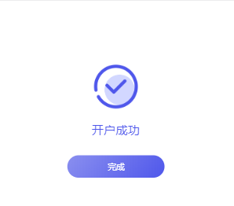
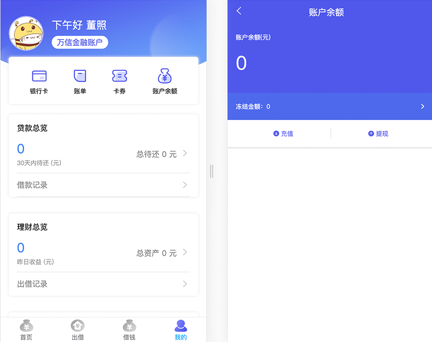
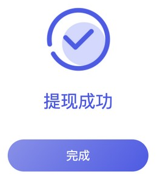
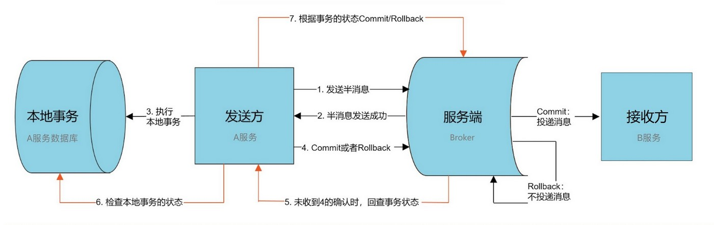

# 第19章 项目总结

> 此章节是全面所有章节的总结与回顾，部分内容有重复

## 1. 项目介绍

### 1.1. 行业简介

P2P 金融又叫 P2P 信贷。其中，P2P是 peer-to-peer 或 person-to-person 的简写，意思是：个人对个人。P2P金融指个人与个人间的小额借贷交易，一般需要借助电子商务专业网络平台帮助借贷双方确立借贷关系并完成相关交易手续。借款者可自行发布借款信息，包括金额、利息、还款方式和时间，实现自助式借款；借出者根据借款人发布的信息，自行决定借出金额，实现自助式借贷。

目前，国家对 P2P 行业的监控与规范性控制越来越严格，出台了很多政策来对其专项整治。主张采用“银行存管模式”来规避 P2P 平台挪用借投人资金的风险，通过银行开发的“银行存管系统”管理投资者的资金，每位 P2P 平台用户在银行的存管系统内都会有一个独立账号，平台来管理交易，做到资金和交易分开，让 P2P 平台不能接触到资金，就可以一定程度避免资金被挪用的风险。


### 1.2. 项目概述

万信金融是一款面向互联网大众提供的理财服务和个人消费信贷服务的金融平台，依托大数据风控技术，为用户提供方便、快捷、安心的P2P金融服务。本项目包括**交易平台**和**业务支撑**两个部分

- 交易平台主要实现理财服务，包括：借钱、出借等模块
- 业务支撑包括：标的管理、对账管理、风控管理等模块

项目采用先进的互联网技术进行研发，保证了 P2P 双方交易的安全性、快捷性及稳定性。

## 2. 系统整体说明

### 2.1. 系统涉及的用户角色

|   系统角色   |               角色描述                |
| ---------- | ----------------------------------- |
| 借款人      | 在平台进行网络借款的用户                |
| 投资人      | 对平台发布的借款债券进行购买的用户        |
| 平台运营人员 | 审核平台借款人和借款信息，负责平台日常运营 |

### 2.2. 功能架构

万信金融包括万信交易平台和业务支撑系统两个核心子系统，各个子系统又分为六个模块：


| 功能模块名称 |                                                     功能说明                                                     |
| :---------: | ---------------------------------------------------------------------------------------------------------------- |
|     首页     | 用于快速进入理财服务的入口。                                                                                      |
|     借钱     | 借款人通过借钱模块完成发标操作，首先借款人需要进行身份认证、开户并填写借款金额，发布标的后需要审核通过后完成借钱业务。 |
|     出借     | 出借人作为投资人从平台上选择要投资的标的进行投资，经过满标复审最终出借成功。                                         |
|     发现     | 专为会员提供优质服务，比如积分商城等。                                                                             |
|     我的     | 为借款人和投资人提供个人中心，可快捷查询标的、债权等。                                                              |
|   债权转让   | 债权人通过债权转让功能转让自己的债权。                                                                             |
|   用户管理   | 统一管理B端用户的信息、权限等。                                                                                    |
|   对账管理   | 核对p2p平台和银行存管之间的账单是否一致。                                                                          |
|   标的管理   | 对所有标的进行初审、复审等管理操作。                                                                               |
|   风控管理   | 统一管理借款人的认证信息、信用信息等。                                                                             |
|   会员管理   | 统一管理C端用户，包括：会员 信息、积分等。                                                                         |
|   统计分析   | 通过大数据技术对借款、还款、逾期进行统计分析。                                                                     |

### 2.3. 技术架构

万信金融采用当前流行的前后端分离架构开发，由用户层、UI 层、微服务层、数据层等部分组成，为 PC、App、H5 等客户端用户提供服务。下图是系统的技术架构图：


### 2.4. 技术解决方案

1. 微服务技术应用于 P2P 金融业务解决方案
2. 微服务架构采用 Spring Cloud 开发
3. 接口规范 SpringBoot + Swagger
4. 持久层框架采用 MyBatisPlus
5. 分布式系统配置中心 Apollo
6. UAA 认证采用 Spring Security Oauth2 + JWT + ZUUL
7. 分布式事务多种解决方案共用（TCC、可靠消息最终一致性、最大努力通知）
8. 分库分表采用 Sharding-jdbc
9. 分布式任务调度采用 Elastic-job
10. 安全交易采用 HTTPS + SHA1withRSA
11. 采用 redis 实现消息幂等性
12. 采用 Elastic-search 实现标的检索
13. 短信验证系统采用短信验证服务+第三方短信平台（腾讯）
14. 使用百度AI人工智能服务平台实现实名认证
15. 采用 spring-cloud-zuul-ratelimit 和 Sentinel 限流机制
16. 服务链路追踪采用 Spring Cloud Sleuth + Zipkin
17. 平台部署采用 Docker Compose

## 3. 业务描述

### 3.1. 整体业务描述

借款人在平台注册成功后，先要进行绑卡和实名认证来完成开户，然后平台会对借款人进行基础信用审核，审核通过后即可发起借款申请；平台运营人员会审核借款信息，通过后投资人可以在平台进行充值投资，待标的满标之后，平台进行满标复审后进行放款，借款人就可以拿到借款的款项，在到期还款日当天平台会自动从借款人的账户中将应还本息划拨到投资人账户。


### 3.2. 关键业务描述

#### 3.2.1. 开户业务流程

开户是指借款用户和投资用户在注册后、交易前都需要在银行存管系统开通个人存管账户，在开户流程中银行存管系统是一个很重要的系统，它是当前 P2P 平台最常见的一种模式，为了保证资金不流向 P2P 平台，由银行存管系统去管理借款用户和投资用户的资金，P2P 平台与银行存管系统进行接口交互为借款用户和投资用户搭建交易的桥梁。


1. 进入开户界面。借款人或投资人在平台交易前平台会校验是否开户，如果未开户自动进入开户界面；借款人或投资人也可以在首页点击“开通存管”


2. 在开户界面填写开户信息


3. 填写信息完成后点击“确认协议并注册”，确认开户是否正确，同时需要设置交易密码。


4. 开户成功



#### 3.2.2. 发标业务流程

P2P 行业习惯把平台里某个投资项目称为“标的”，简称“标”。一个标的一般至少包含：描述、借款用途、借款总额、还款方式、借款利率、借款期限等基本信息。通俗来讲“标的”就是：借款人在P2P平台发起的借款项目。“发标”就是：借款人在P2P平台申请借款。发标流程如下：


1. 填写借款信息


2. 申请成功，等待审核


3. P2P 平台管理员审核借款信息


4. 审核通过后，就可在H5前端的出借列表中看到标的信息


#### 3.2.3. 充值业务流程

用户通过银行存管系统把银行卡中的金额转入到万信金融 P2P 平台余额中，即为充值。投资人在投标前需要先充值，就好比你把银行卡中的金额转入到支付宝或微信中是一个道理。充值流程如下：


1. 用户在'我的'页面点击'账户余额'



2. 点击充值(如果用户尚未开户，会被自动跳转到开户界面)，填写充值金额


3. 确认信息并输入开户时设置的交易密码


4. 充值成功


#### 3.2.4. 投标业务流程

在 P2P 平台投资整个环节当中，借款人把自己需要借款的信息发布在平台上，这个需求就是一个借款项目，也是一个标的，投资人对这个借款项目进行投资就叫做投标。

借款人发标并通过审核后，投资人就可以在P2P平台看到这些标的信息(可投资项目)，投资人对这个项目进行投资(出借)就叫做投标。用户投标流程如下：


1. 用户浏览借款列表(标的)


2. 选择标的，输入投标金额


3. 确认出借，支付金额


4. 投标成功，显示预期收益


#### 3.2.5. 满标放款业务流程

当一个借款项目的所有借款金额被投资人投资后，由管理员且审核通过，P2P平台会将把所筹资金打入借款人在平台的账户中。当一个标的已经筹集到了所借的全部资金，即为“满标”。此时P2P平台管理员会进行审核，审核通过后，P2P平台会把投资人的出借资金打入借款人在平台的账户中，这就叫“放款”，此时借款人贷款成功。平台放款流程如下：


1. 管理员审核满标标的


2. 确认审核结果


3. 审核通过，放款成功

#### 3.2.6. 还款业务流程

当按照借款时约定的还款方式，平台会自动在还款日当天将应还本息从借款人账户划拨到投资人账户。满标放款审核通过后，就意味着交易已经达成。借款人以后就需要按照借款时约定的还款方式，在还款日当天将应还本息通过平台归还给投资人，这叫用户还款。借款人应该在临近还款日时，把应还的金额充值到平台账户中，平台在还款日当天会自动进行扣款。业务流程如下所示：


用户还款由系统通过定时任务自动触发，不需要用户手动进行。

#### 3.2.7. 提现业务流程

投资人在收到标的的回款后，将余额从银行存管系统的虚拟账户中提取到自己绑定的储蓄卡。业务流程如下所示：


1. 用户在'我的'页面点击'账户余额'


2. 点击提现，填写提现金额


3. 确认提现信息并输入开户时设置的交易密码


4. 提现成功



## 4. 项目涉及技术答疑

> 此部分内容主要是对项目中涉及技术、设计等各方面解析

### 4.1. 配置中心

#### 4.1.1. 什么是配置中心？为什么要使用它？

传统配置形式(例如：配置文件)存在的问题：

1. 缺少权限控制：由于配置能改变程序的行为，不正确的配置甚至能引起灾难，所以对配置的修改必须有比较完善的权限控制
2. 缺少版本控制：在整个开发过程中，配置会经常发生修改，版本控制非常必要
3. 缺少实时控制：配置发生变化后，需要重启才能生效，费时费力，迫切需要实时生效(热发布)
4. 微服务化和分布式带来的挑战


- 当系统从一个单体应用，被拆分成分布式系统上一个个服务节点后，配置文件也必须跟着迁移（分割），这样配置就变得非常分散，造成使用和管理难度变大。不仅如此，各个节点服务的配置中难免会包含很多冗余代码。
- 同一个应用程序在不同的环境（开发，测试，生产）和不同的集群经常需要有不同的配置，需要能方便得进行动态切换。

配置中心将配置从各个应用中剥离出来，自成一体，对所有的配置进行单独的统一管理，优雅的解决了上述诸多问题。在系统架构中，和安全、日志、监控等非功能需求一样，配置管理也是一种非功能需求。配置中心是整个微服务基础架构体系中的一个组件。**总得来说，配置中心就是一种统一管理各种应用配置的基础服务组件。**


#### 4.1.2. 请简述 Apollo 框架运行原理

Apollo（阿波罗）是携程框架部门研发的分布式配置中心，能够集中化管理应用不同环境、不同集群的配置，配置修改后能够实时推送到应用端，并且具备规范的权限、流程治理等特性，适用于微服务配置管理场景。项目使用Apollo完成集中管理配置，将各微服务的配置从服务中剥离出来，统一管理，优雅的解决了配置的动态变更、持久化和运维成本等问题。


### 4.2. UAA服务

UAA 服务是万信金融平台的统一认证中心，集认证和授权功能于一身，采用 Spring Security 整合 OAuth2.0 实现授权服务器(认证服务器)角色，同时使用 JWT 令牌技术来存储和传递用户信息。

#### 4.2.1. 什么是令牌(token)？JWT是什么？它起什么作用？

随着 Restful API、微服务的兴起，基于 Token 的认证现在已经越来越普遍。基于 token 的用户认证是一种服务端无状态的认证方式，所谓服务端无状态指的 token 本身包含登录用户所有的相关数据，而客户端在认证后的每次请求都会携带 token，因此服务器端无需存放 token 数据。

当用户认证后，服务端生成一个 token 发给客户端，客户端可以放到 cookie 或 localStorage 等存储中，每次请求时带上 token，服务端收到 token 通过验证后即可确认用户身份。


市面上基于 token 的认证方式大都采用的是 JWT(Json Web Token)。JSON Web Token（JWT）是一个开放的行业标准（RFC 7519），它定义了一种简洁的、自包含的协议格式，用于在通信双方传递 json 对象，传递的信息经过数字签名可以被验证和信任。

#### 4.2.2. 请介绍项目中的认证流程


上图的接入方对应 OAuth2.0 的客户端，无论是平台自身的应用还是第三方接入都通过统一的机制接入平台，用户对应 OAuth2.0 的资源拥有者。

流程描述：

1. 用户登录通过接入方(目前指前端)在平台登录，接入方采取 OAuth2.0 密码模式请求认证服务(UAA)
2. 认证服务(UAA)调用统一账号服务去验证该用户，并获取用户权限信息
3. 认证服务(UAA)获取接入方权限信息，并验证接入方是否合法
4. 若登录用户以及接入方都合法，生成 jwt 令牌返回给接入方，其中 jwt 中包含了用户权限及接入方权限
5. 接入方携带 jwt 令牌对平台的微服务资源进行访问
6. API 网关对令牌解析、并验证接入方的权限是否能够访问本次请求的微服务
7. 如果接入方的权限没问题，API 网关会将请求转发至微服务，并将原请求附加上解析后的明文用户信息 JsonToken，微服务用 JsonToken 来识别本次请求的用户会话

### 4.3. 分库分表

#### 4.3.1. 为什么要分库分表？

在 P2P 平台中，标的信息和投标信息做为平台基础业务数据存在。随着平台的发展，这些数据可能会越来越多，甚至达到亿级。以 MySQL 为例，单库数据量在 5000 万以内性能比较好，超过阈值后性能会随着数据量的增大而明显降低。单表的数据量超过 1000w，性能也会下降严重。这就会导致查询一次所花的时间变长，并发操作达到一定量时可能会卡死，甚至把系统给拖垮，因此 P2P 平台需要解决这个性能瓶颈问题。

是否可以通过提升服务器硬件能力来提高数据处理能力？能，但是这种方案很贵，并且提高硬件是有上限的。那能不能**把数据分散在不同的数据库中，使得单一数据库和表的数据量变小，从而达到提升数据库操作性能的目的**？ 可以，这就是数据库分库分表。

分库分表就是把较大的数据库和数据表按照某种策略进行拆分。目的在于：降低每个库、每张表的数据量，减小数据库的负担，提高数据库的效率，缩短查询时间。另外，因为分库分表这种改造是可控的，底层还是基于 RDBMS，因此整个数据库的运维体系以及相关基础设施都是可重用的

#### 4.3.2. 请介绍几种常见的分库分表方式

- 垂直分表：可以把一个宽表的字段按访问频次、业务耦合松紧、是否是大字段的原则拆分为多个表，这样既能使业务清晰，还能提升部分性能。拆分后，尽量从业务角度避免联查，否则性能方面将得不偿失。
- 垂直分库：可以把多个表按业务耦合松紧归类，分别存放在不同的库，这些库可以分布在不同服务器，从而使访问压力被多服务器负载，大大提升性能，同时能提高整体架构的业务清晰度，不同的业务库可根据自身情况定制优化方案。但是它需要解决跨库带来的所有复杂问题。
- 水平分库：可以把一个表的数据(按数据行)分到多个不同的库，每个库只有这个表的部分数据，这些库可以分布在不同服务器，从而使访问压力被多服务器负载，大大提升性能。它不仅需要解决跨库带来的所有复杂问题，还要解决数据路由的问题。
- 水平分表：可以把一个表的数据(按数据行)分到多个同一个数据库的多张表中，每个表只有这个表的部分数据，这样做能小幅提升性能，它仅仅作为水平分库的一个补充优化。

为了对 P2P 平台的数据库进行分库分表提升性能，项目选择使用 Sharding-JDBC 进行数据库操作。

1. 项目单独创建 p2p_transaction 数据库(交易中心)存储和标的相关的数据，例如：标的信息、投标信息等。首先对该数据库进行分库，相同发标人的数据最好不要分散，否则查询相关信息要跨库，因此以**发标人ID**作为分片键，分片策略采取 `发标人ID % 2`。


2. 然后再对 p2p_transaction 库内的标的信息和投标信息进行分表，根据需求此两个表会以**标的ID**作为关联键联合查询，因此以**标的ID**作为分片键，分片策略采取 `标的ID % 2`，并将标的信息和投标信息设置为**绑定表**，最终形成如下数据库设计：


#### 4.3.3. 什么是读写分离？它起什么作用？

面对日益增加的系统访问量以及高并发的情况，数据库的性能面临着巨大瓶颈。 数据库的“写”操作是比较耗时的(例如：写10000条数据到oracle可能要3分钟)，而数据库的“读”操作相对较快(例如：从oracle读10000条数据可能只要5秒钟)。在高并发的情况下，写操作会严重拖累读操作，这是单纯分库分表无法解决的。

可以将数据库拆分为主库和从库，主库只负责处理增删改操作，从库只负责处理查询操作，这就是读写分离。它能够有效的避免由数据更新导致的行锁，使得整个系统的查询性能得到极大的改善。


还可以搞一主多从，这样就可以将查询请求均匀的分散到多个从库，能够进一步的提升系统的处理能力。 使用多主多从的方式，不但能够提升系统的吞吐量，还能够提升系统的可用性，可以达到在任何一个数据库宕机，甚至磁盘物理损坏的情况下仍然不影响系统的正常运行。


读写分离的数据节点中的数据内容是一致的，所以在采用读写分离时，要注意解决主从数据同步的问题。**Sharding-JDBC 读写分离则是根据SQL语义的分析，将读操作和写操作分别路由至主库与从库**。它提供透明化读写分离，让使用方尽量像使用一个数据库一样进行读写分离操作。Sharding-JDBC 不提供主从数据库的数据同步功能，需要采用其他机制支持。


### 4.4. 分布式事务解决方案

#### 4.4.1. 什么是分布式事务？

随着互联网的快速发展，软件系统由原来的单体应用转变为分布式应用，下图描述了单体应用向分布式微服务应用的演变(如下图所示)。分布式系统会把一个应用系统拆分为可独立部署的多个服务，因此需要服务与服务之间远程协作才能完成事务操作，这种分布式系统环境下的事务机制称之为**分布式事务**。

同样一个功能，原来是由一个系统完成的，即使这个功能包含很多个操作，也可以采用数据库事务(本地事务)搞定，而现在这个功能中包含的多个操作可能是由多个系统(微服务)参与完成的，此时数据库事务(本地事务)就无能为力了，这就需要新的分布式事务理论来支撑了。


#### 4.4.2. 什么是TCC(补偿事务)?

TCC(Try/Confirm/Cancel) 编程模式的核心思想是：针对每个分支事务操作，都要向全局事务发起方注册 Try、Confirm 和 Cancel 三个操作，具体这些操作由开发者根据业务进行实现，然后分为两个阶段去执行：

1. **Try** 阶段主要是做业务检查(一致性)及资源预留(隔离)，此阶段仅是一个初步操作，它和后续的 Confirm 一起才能真正构成一个完整的业务逻辑。
2. **Confirm** 阶段主要是做确认提交，Try 阶段所有分支事务执行成功后开始执行 Confirm。通常情况下，采用 TCC 则认为 Confirm 阶段是不会出错的。即：只要 Try 成功，Confirm 一定成功。若 Confirm 阶段真的出错了，需引入重试机制或人工处理。
3. **Cancel** 阶段主要是在业务执行错误，需要回滚的状态下执行分支事务的业务取消，预留资源释放。通常情况下，采用 TCC 则认为 Cancel 阶段也是一定成功的。若 Cancel 阶段真的出错了，需引入重试机制或人工处理。


在 P2P 项目的注册功能中，用户向用户中心发起注册请求，用户中心保存用户业务信息，然后远程调用统一账号服务保存该用户所对应的账号信息，该业务存在分布式事务问题。

针对注册业务，如果用户与账号信息不一致，则会导致严重问题，因此该业务对一致性要求较为严格，且属于执行时间较短的业务。TCC 方案的软状态时间很短，一致性较强，因此此业务选用 TCC 型分布式事务解决方案。


#### 4.4.3. 如何通过 RocketMQ 事务消息实现最终一致性事务

RocketMQ 中的 Broker 与发送方具备双向通信能力，使得 broker 天生可以作为一个事务协调者存在；并且 RocketMQ 本身提供了存储机制，使得事务消息可以持久化保存；这些优秀的设计可以保证即使发生了异常，RocketMQ 依然能够保证达成事务的最终一致性。

1. 发送方发送一个事务消息给 Broker，RocketMQ 会将消息状态标记为“Prepared”（预备状态），此时这条消息暂时不能被接收方消费。这样的消息称之为 Half Message，即半消息。
2. Broker 返回发送成功给发送方
3. 发送方执行本地事务(例如，操作数据库)，Producer 端执行业务代码逻辑，通过本地数据库事务控制。
4. 若本地事务执行成功，发送 commit 消息给 Broker，RocketMQ 会将消息状态标记为“可消费”，此时这条消息就可以被接收方消费；若本地事务执行失败，发送 rollback 消息给 Broker，RocketMQ 将删除该消息。
5. 如果发送方在本地事务过程中，出现服务挂掉，网络闪断或者超时，那 Broker 将无法收到确认结果。此时 RocketMQ 将会不停的询问发送方来获取本地事务的执行状态，这个过程叫**事务回查**。
6. 发送方会检查本地的事务状态
7. Broker 会根据事务回查的结果来决定 Commit 或 Rollback，这样就保证了消息发送与本地事务同时成功或同时失败。



在 P2P 项目的满标放款业务中，交易中心修改标的状态为“还款中”，同时要通知还款服务生成还款计划和应收明细。两者为原子性绑定，即：标的状态修改成功，就必须生成还款计划和应收明细。由于涉及到两个独立的微服务，所以会存在分布式事务问题。

还款微服务生成还款计划和应收明细很有可能是一个较为耗时的业务，不建议阻塞主业务流程，并且此业务对强一致性要求较低，因此可以采用 RocketMQ 可靠消息实现最终一致性这个解决方案。


### 4.5. 分布式定时任务 Elastic-job

#### 4.5.1. 什么是任务调度？什么是分布式定时任务？

思考以下业务场景的解决方案：

- 某电商系统需要在每天上午10点，下午3点，晚上8点发放一批优惠券。
- 某银行系统需要在信用卡到期还款日的前三天进行短信提醒。
- 某财务系统需要在每天凌晨0:10结算前一天的财务数据，统计汇总。
- 某网站为了实现天气实时展示，每隔10分钟就去天气服务器获取最新的实时天气信息。

以上业务场景的解决方案就是任务调度。

任务调度是指系统为了自动完成特定任务，在约定的特定时刻去执行任务的过程。有了任务调度即可解放更多的人力，而是由系统自动去执行任务。

当前软件的架构已经开始向分布式架构转变，将单体结构拆分为若干服务，服务之间通过网络交互来完成业务处理。在分布式架构下，一个服务往往会部署多个实例来运行项目的业务，如果在这种分布式系统环境下运行任务调度，称之为分布式任务调度。

#### 4.5.2. 请说一下分片的概念

任务的分布式执行，需要将一个任务拆分为多个独立的任务项，然后由分布式的服务器分别执行某一个或几个分片项。

例如：有一个遍历数据库某张表的作业，现有2台服务器。为了快速的执行作业，那么每台服务器应执行作业的50%。为满足此需求，可将作业分成2片，每台服务器执行1片。作业遍历数据的逻辑应为：服务器A遍历ID以奇数结尾的数据；服务器B遍历ID以偶数结尾的数据。 如果分成10片，则作业遍历数据的逻辑应为：每片分到的分片项应为`ID%10`，而服务器A被分配到分片项0,1,2,3,4；服务器B被分配到分片项5,6,7,8,9，直接的结果就是服务器A遍历ID以0-4结尾的数据；服务器B遍历ID以5-9结尾的数据。

在P2P项目中，借款人将来每个月都需要在还款日之前还款，这需要通过定时任务去自动触发功能的执行。这里可以采用 Elastic-Job 实现分布式定时还款任务，在查询到期的还款计划时根据`NUMBER_OF_PERIODS`(期数)字段进行分片。相应的 sql 如下：

```xml
<select id="selectDueRepaymentBySharding" resultType="com.moon.wanxinp2p.repayment.entity.RepaymentPlan">
    SELECT *
    FROM repayment_plan
    WHERE DATE_FORMAT(SHOULD_REPAYMENT_DATE, '%Y-%m-%d') = #{date}
        AND REPAYMENT_STATUS = '0'
        AND MOD(NUMBER_OF_PERIODS, #{shardingCount}) = #{shardingItem};
</select>
```

### 4.6. ElasticSearch(ES) + Logstash

#### 4.6.1. 请说一下 ES 进行全文检索的原理？

在通过 ES 往索引库中存储数据时，数据会被分词产生词条，该词条会被存储到内部的一个列表中(目录)，数据本身则会作为一个文档进行存储，词条和文档有对应关系。 在通过 ES 从索引库中搜索数据时，ES 会拿着搜索关键字和列表中(目录)的词条进行匹配，一旦匹配上会立即直接定位到对应的文档。


为了提高数据库性能，对交易中心数据库 p2p_transaction 进行了分库分表、读写分离，但是即便如此，当进行某些查询时，仍然面临性能瓶颈。例如：进行模糊查询，进行多字段过滤，在数据量很大的情况下，类似这种查询仍然会比较耗时。在这种情况下，考虑使用全文检索技术来进一步优化性能。

由于 P2P 项目中会有多处业务数据有这种需求，所以单独创建一个微服务工程(下图中的内容检索服务)为整个项目提供全文检索服务，该工程主要采用 ElasticSearch+Logstash 技术实现。具体交互流程如下所示


1. 前端请求交易中心检索标的
2. 交易中心接到请求后，请求内容检索服务进行查询
3. 内容检索服务请求 ES 索引库查询标的信息
4. 返回查询结果

#### 4.6.2. Logstash 是干什么的？

本项目中由于标的信息是存储在 MySQL 数据库中的，而全文检索是从 ES 索引库获取的数据。因此，需要解决 MySQL 数据库和 ES 索引库之间的数据同步问题。即：MySQL 数据库中的标的信息发生变化时，ES 索引库中的数据也随之变化。

Logstash 作为 Elasicsearch 常用的实时数据采集引擎，可以采集来自不同数据源的数据，并输出到ES索引库中创建索引。增删改操作是针对数据库的，查询操作是针对索引库，两者之间自然要进行数据同步。通过 Logstash 就可以解决 MySQL 数据库和ES索引库之间的数据同步问题，具体解决方案如下图所示：


### 4.7. 数据安全

#### 4.7.1. 什么是非对称加密算法

**非对称加密算法需要两个密钥：公开密钥(public key)和私有密钥(private key)**。公开密钥与私有密钥是一对，如果用公开密钥对数据进行加密，只有用对应的私有密钥才能解密；如果用私有密钥对数据进行加密，那么只有用对应的公开密钥才能解密。因为加密和解密使用的是两个不同的密钥，所以这种算法叫作非对称加密算法。

非对称加密算法实现机密信息交换的基本过程是：甲方生成一对密钥并将其中的一把作为公用密钥向其它方公开，得到该公用密钥的乙方使用该密钥对机密信息进行加密后再发送给甲方，甲方再用自己保存的另一把专用密钥对加密后的信息进行解密。常见的非对称加密算法：RSA、DSA、ECC等。

#### 4.7.2. 说一下项目在跟第三方系统对接时如何保证数据安全

万信金融平台要和第三方系统（银行存管系统）进行交互，为了验证消息发送者的身份，确保其他人无法伪造身份所以需要对传输数据要进行签名和验签。有两个基本要求：

1. 所有请求和返回报文都包含签名，接收方务必检查签名的正确性，以保证业务数据合法安全。
2. 签名使用标准签名算法“SHA1withRSA”。

交互流程：

1. 在系统开始交互之前，万信金融平台和银行存管系统要交换各自系统的公钥


2. A端对传输内容 msg 签名，B端验签


3. B端对出传输内容msg签名，A端验签


## 5. 项目管理

### 5.1. 项目周期

一期开发天数：

合计：9人/40天，共360人/天

一期测试天数：

测试用例：2人/3天，测试计划：1人/1天，系统测试：3人/10天，性能测试：2人/2天

合计：2人/3天+1人/1天+3人/10天+2人/2天，共41人/天

上线周期为：15人团队2.5个月

二期维护周期：开发3人/20天，测试1人/10天，共70人/天

### 5.2. 团队组成

- 团队人数：15人
- 项目设计师：2人，主要负责P2P业务、P2P运营平台需求调研、概要设计和银行存管系统API。
- 项目开发人员：9人，主要负责项目开发。
- 项目测试人员：3人，主要负责项目测试。
- 产品经理：1人，负责产品推广与产品调研、确定客户需求。

### 5.3. 项目预算

- 开发人员：人均25000/月，480人/天，项目预算为55万。
- 实际项目开发完成延期：8天。
- 迭代周期：需求变更及系统维护，系统不断迭代，周期为两年，两年之后转交支持人员。
