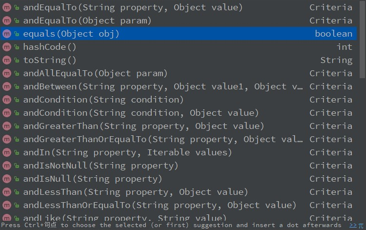
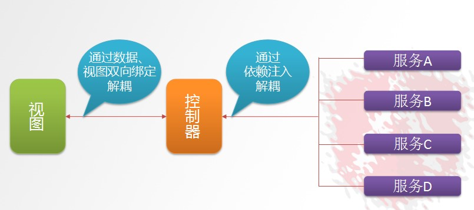

# Day02 前端框架AngularJS、通用Mapper

## 1. PageHelper 分页助手

- 在开发过程中对数据进行分页查询是很常见的功能；这里引入一个第三方开发的Mybatis分页插件PageHelper。
    - 详细见《mybatis框架相关.xmind》
- 官方网站 http://mybatis.tk/
- 源代码与文档 https://github.com/pagehelper/Mybatis-PageHelper
- 参考文档地址：
    - https://github.com/pagehelper/Mybatis-PageHelper/blob/master/wikis/zh/HowToUse.md

### 1.1. 搭建测试项目

- 创建mybatis_db数据库并导入参考：资料\sql\notice测试数据.sql
- 创建maven项目pyg-test父项目（pom），再创建mybatis-pager：分页模块(jar)
- 创建mybatis-pager Maven项目，注意packaging类型为jar即可，在这个项目中主要使用分页助手，写测试代码。

引入依赖pyg-test/pom.xml

```xml
<!-- 配置依赖关系 -->
<dependencies>
    <dependency>
        <groupId>junit</groupId>
        <artifactId>junit</artifactId>
        <version>4.12</version>
        <scope>test</scope>
    </dependency>
    <dependency>
        <groupId>log4j</groupId>
        <artifactId>log4j</artifactId>
        <version>1.2.17</version>
    </dependency>
</dependencies>

<!-- 构建部分 -->
<build>
    <plugins>
        <plugin>
            <groupId>org.apache.maven.plugins</groupId>
            <artifactId>maven-compiler-plugin</artifactId>
            <version>3.3</version>
            <configuration>
                <source>1.8</source>
                <target>1.8</target>
                <encoding>UTF-8</encoding>
            </configuration>
        </plugin>
    </plugins>
</build>
```

引入分页测试项目的依赖jar包，mybatis-pager/pom.xml

```xml
<dependencies>
    <dependency>
        <groupId>org.mybatis</groupId>
        <artifactId>mybatis</artifactId>
        <version>3.4.1</version>
    </dependency>
    <dependency>
        <groupId>mysql</groupId>
        <artifactId>mysql-connector-java</artifactId>
        <version>5.1.43</version>
    </dependency>
    <!-- pagehelper分页插件 -->
    <dependency>
        <groupId>com.github.pagehelper</groupId>
        <artifactId>pagehelper</artifactId>
        <version>5.1.3</version>
    </dependency>
</dependencies>
```

创建MyBatis的全局配置文件mybatis-config.xml到resources文件夹

```xml
<?xml version="1.0" encoding="UTF-8"?>
<!DOCTYPE configuration
        PUBLIC "-//mybatis.org//DTD Config 3.0//EN"
        "http://mybatis.org/dtd/mybatis-3-config.dtd">
<configuration>
    <!-- 加载属性文件 -->
    <properties resource="jdbc.properties"/>
    <!-- 全局的设置信息-->
    <settings>
        <!-- 开启缓存 -->
        <setting name="cacheEnabled" value="true"/>
        <!-- 开启驼峰命名(方便自动映射) -->
        <setting name="mapUnderscoreToCamelCase" value="true"/>
    </settings>

    <!-- 配置插件 -->
    <plugins>
        <!-- 该拦截器会拦截SQL语句 -->
        <plugin interceptor="com.github.pagehelper.PageInterceptor">
            <!-- 配置数据库方言 -->
            <property name="helperDialect" value="mysql"/>
            <!-- 配置开启统计查询 -->
            <property name="rowBoundsWithCount" value="true"/>
        </plugin>
    </plugins>

    <!-- 配置MyBatis3的的环境 -->
    <environments default="project">
        <environment id="project">
            <!-- 配置事务管理器-->
            <transactionManager type="JDBC"/>
            <!-- 配置数据源(用MyBatis3自带的连接池)-->
            <dataSource type="POOLED">
                <!-- 驱动类名 -->
                <property name="driver" value="${driver}"/>
                <!-- URL -->
                <property name="url" value="${url}"/>
                <!-- 用户名-->
                <property name="username" value="${username}"/>
                <!-- 密码 -->
                <property name="password" value="${password}"/>
            </dataSource>
        </environment>
    </environments>

    <!-- 配置数据库表访问接口或映射文件 -->
    <mappers>
        <mapper resource="mapper/NoticeMapper.xml"/>
    </mappers>
</configuration>
```

添加日志配置文件log4j.properties和jdbc.properties数据库配置文件到resources资源文件夹

```properties
# jdbc.properties
driver=com.mysql.jdbc.Driver
url=jdbc:mysql://localhost:3306/mybatis_db
username=root
password=123456

# log4j.properties
log4j.rootLogger=DEBUG,stdout
log4j.appender.stdout=org.apache.log4j.ConsoleAppender
log4j.appender.stdout.layout=org.apache.log4j.PatternLayout
log4j.appender.stdout.layout.ConversionPattern=%-d{yyyy-MM-dd HH:mm:ss,SSS} [%t] [%c]-[%p] %m%n
```

在pojo包下创建实体类Notice.java，提供“NoticeMapper.xml” mybatis映射配置文件到resources/mapper/资源文件夹

### 1.2. 使用PageHelper分页操作
#### 1.2.1. 创建Mapper和映射文件

- NoticeMapper接口

```java
public interface NoticeMapper {
    // 查询所有的方法
    List<Notice> findAll();
}
```

- resources\mapper\NoticeMapper.xml映射文件

```xml
<?xml version="1.0" encoding="UTF-8" ?>
<!DOCTYPE mapper
        PUBLIC "-//mybatis.org//DTD Mapper 3.0//EN"
        "http://mybatis.org/dtd/mybatis-3-mapper.dtd">
<mapper namespace="com.moon.mybatis.mapper.NoticeMapper">
    <select id="findAll" resultType="com.moon.mybatis.pojo.Notice">
        select * from notice order by id asc
    </select>
</mapper>
```

#### 1.2.2. 添加PageHelper分页依赖

- 配置相关依赖jar包：pagehelper-5.0.0.jar、jsqlparser-0.9.5.jar
- pom.xml添加依赖

```xml
<!-- pagehelper分页插件 -->
<dependency>
    <groupId>com.github.pagehelper</groupId>
    <artifactId>pagehelper</artifactId>
    <version>5.0.0</version>
</dependency>
```

#### 1.2.3. mybatis-config.xml配置pagehelper

- 配置生成分页拦截器对象（com.github.pagehelper.PageInterceptor）
- 分页拦截器常用属性
    1. helperDialect 数据库方言
        - 如：oracle, mysql, mariadb, sqlite, hsqldb, postgresql, db2, sqlserver, informix, h2, sqlserver2012, derby
    3. rowBoundsWithCount 是否开启统计查询
- 在mybatis-config.xml文件中添加配置信息；在environments标签**之前**添加配置信息

```xml
<!-- 配置插件 -->
<plugins>
    <!-- 该拦截器会拦截SQL语句，拦截后会在语句后加上分页条件 -->
    <plugin interceptor="com.github.pagehelper.PageInterceptor">
        <!-- 配置数据库方言 -->
        <property name="helperDialect" value="mysql"/>
        <!-- 配置开启统计查询 -->
        <property name="rowBoundsWithCount" value="true"/>
    </plugin>
</plugins>
```

#### 1.2.4. 使用分页助手步骤

- PageHelper分页助手在使用过程中比较简单；只需要在查询之前调用如下的代码即可：PageHelper.startPage(page, rows);
    - page表示页号，rows表示每页数据大小
- 使用分页操作方式1(注意：此方式只会对开启分页后最近的方法有效，第二个方法以后不分页)：
	1. PageHelper.startPage(page, rows)开启分页后，调用mapper接口的查询方法，实际查询返回的是Page接口代理对象。
	2. 使用PageInfo(List<T> list)构造方法，传入上面查询出来集合对象，创建PageInfo对象
	3. 调用pageInfo对象相关方法，获取分页相关数据
- 使用分页操作方式2：
    1. PageHelper.startPage(page, rows)开启分页后，调用Page<E>对象doSelectPageInfo(ISelect select)方法，创建PageInfo<E>对象
    2. 使用匿名内部类创建ISelect接口的实现，重写doSelect()方法，指定需要分页查询的方法

测试分页助手PageHepler，使用两种方式

```java
public class NoticeMapperTest {
    // 定义数据访问接口
    private NoticeMapper noticeMapper;
    // 定义mybatis核心操作对象
    private SqlSession sqlSession;

    /**
     * 初始化相关参数
     */
    @Before
    public void before() throws IOException {
        // 获取mybatis总配置文件的流对象
        InputStream is = Resources.getResourceAsStream("mybatis-config.xml");

        // 创建sessionFactory对象
        SqlSessionFactory sqlSessionFactory = new SqlSessionFactoryBuilder().build(is);

        // 获取SqlSession，自动提交事务
        sqlSession = sqlSessionFactory.openSession(true);

        // 获取数据访问接口代理对象
        noticeMapper = sqlSession.getMapper(NoticeMapper.class);
    }

    /**
     * 测试分页查询所有的公告:方式1
     */
    @Test
    public void findByPage1() {
        // 启动分页
        PageHelper.startPage(1, 3);
        // 调用接口方法查询，实际返回的是Page接口代理对象
        List<Notice> noticeList = noticeMapper.findAll();

        // 创建pageInfo对象
        PageInfo<Notice> pageInfo = new PageInfo<>(noticeList);

        // 调用pageInfo对象相关方法，获取分页数据
        System.out.println("当前页码：" + pageInfo.getPageNum());
        System.out.println("每页显示的记录数：" + pageInfo.getPageSize());
        System.out.println("总页码：" + pageInfo.getPages());
        System.out.println("总记录数：" + pageInfo.getTotal());
        System.out.println("上一页：" + pageInfo.getPrePage());
        System.out.println("下一页：" + pageInfo.getNextPage());
        System.out.println("分页list数据：" + pageInfo.getList());
        for (Notice notice : pageInfo.getList()) {
            System.out.println(notice);
        }

        // 注意，只会对开启分页后最近的方法有效，第二方法后不分页
        List<Notice> noticeList2 = noticeMapper.findAll();
    }

    /**
     * 测试分页查询所有的公告:方式2
     */
    @Test
    public void findByPage2() {
        // 启动分页,调用方法创建pageInfo对象
        PageInfo<Notice> pageInfo = PageHelper.startPage(1, 3).doSelectPageInfo(new ISelect() {
            @Override
            public void doSelect() {
                // 指定分页查询的方法
                noticeMapper.findAll();
            }
        });

        // 调用pageInfo对象相关方法，获取分页数据
        System.out.println("当前页码：" + pageInfo.getPageNum());
        System.out.println("每页显示的记录数：" + pageInfo.getPageSize());
        System.out.println("总页码：" + pageInfo.getPages());
        System.out.println("总记录数：" + pageInfo.getTotal());
        System.out.println("上一页：" + pageInfo.getPrePage());
        System.out.println("下一页：" + pageInfo.getNextPage());
        System.out.println("分页list数据：" + pageInfo.getList());
        for (Notice notice : pageInfo.getList()) {
            System.out.println(notice);
        }
    }

    /**
     * 关闭资源
     */
    @After
    public void after() {
        sqlSession.close();
    }
}
```

### 1.3. PageHelper相关api
#### 1.3.1. `PageHelper` 类
- `public static <E> com.github.pagehelper.Page<E> startPage(int pageNum, int pageSize)`
    - 静态方法，获取Page对象
    - 参数pageNum：当前页
    - 参数pageSize：每页显示数量

#### 1.3.2. `Page<E>` 类
- `public <E> com.github.pagehelper.PageInfo<E> doSelectPageInfo(com.github.pagehelper.ISelect select)`
    - 指定执行分页的sql语句，返回PageInfo对象
    - 参数select：接口实现，实现doSelect方法

#### 1.3.3. `PageInfo<T>` 类
- `public PageInfo(java.util.List<T> list)`
    - 构造方法
    - 参数list：接口查询方法返回List集合
- `int getPageNum()`
    - 获取当前页码
- `int getPageSize()`
    - 获取每页显示的记录数
- `int getPages()`
    - 获取查询总页数
- `long getTotal()`
    - 获取查询总记录数
- `int getPrePage()`
    - 获取上一页
- `int getNextPage()`
    - 获取下一页
- `List<T> getList()`
    - 获取查询分页list数据

## 2. 通用Mapper

通用Mapper是封装一些通用Mapper接口的API，在开发过程中常见的CRUD代码可以省略不写，因为这些操作基本上比较固定和通用，所以对这些常用的操作进行了封装

详见 资料\mybatis\ 中的《mybatis框架相关.xmind》

特点：极其方便的使用MyBatis单表的增删改查，支持单表操作，不支持通用的多表联合查询

### 2.1. 配置通用 Mapper

说明：把分页模块的拷贝到该模块中。（项目结构、log4j.properties、mybatis-config.xml、jdbc.properties）

#### 2.1.1. 配置pom.xml添加依赖

```xml
<!-- 配置通用mapper -->
<dependency>
    <groupId>tk.mybatis</groupId>
    <artifactId>mapper</artifactId>
    <version>4.0.1</version>
</dependency>
```

### 2.2. 使用步骤(案例参考pyg-test)
#### 2.2.1. 使用注解指定封装的实体类

通用Mapper所进行的也是将查询结果与具体的实体类进行映射，但如果是一般的数据库操作，它是不再需要写*Mapper.xml文件的；它通过jpa注解实现数据库表与实体类的结果映射。

```java
// Notice实体类
@Table(name = "notice")
public class Notice implements Serializable {
    @Id
    @Column(name = "ID")
    @GeneratedValue(strategy = GenerationType.IDENTITY)
    private Long id;
    @Column(name = "TITLE")
    private String title;
    @Column(name = "CONTENT")
    private String content;
    ...
}
```

#### 2.2.2. 编写NoticeMapper继承Mapper

接口不需要定义方法，需要继承Mapper(tk.mybatis.mapper.common.Mapper)

```java
public interface NoticeMapper extends Mapper<Notice> {}
```

#### 2.2.3. 将NoticeMapper添加到mybatis-config.xml总配置文件

修改mybatis-config.xml，将原来的resource属性加载映射文件改成加载接口，原来的映射文件可以不需要

```xml
<!-- 配置数据库表访问接口或映射文件 -->
<mappers>
    <mapper class="com.moon.mybatis.mapper.NoticeMapper"/>
</mappers>
```

#### 2.2.4. 测试，整合使用分页查询

- 使用通用mapper前需要注册接口，并设置指定使用那个mapper接口。初始化方法中增加注册需要使用的mapper接口

```java
/**
 * 初始化相关参数
 */
@Before
public void before() throws IOException {
    ......
    // ******* 注册自己哪些接口继承了通用Mapper接口 **********
    MapperHelper mapperHelper = new MapperHelper();
    // 注册自己项目中使用的通用Mapper接口，这里没有默认值，必须手动注册
    mapperHelper.registerMapper(NoticeMapper.class);
    // 执行配置信息
    mapperHelper.processConfiguration(sqlSession.getConfiguration());
}
```

- 先开启分页，再指定通用的操作方法
    - 查询所有所有的方法更新成selectXxx() 一批查询方法即可；
    - insertXxx() 一批插入方法
    - updateXxx() 一批修改方法
    - deleteXxx() 一批删除方法

```java
/*根据id主键查询*/
@Test
public void findOne() {
    Notice notice = noticeMapper.selectByPrimaryKey(2L);
    System.out.println(notice);
}

/*使用通用mapper新增记录*/
@Test
public void save() {
    Notice notice = new Notice();
    notice.setContent("测试一下通用mapper添加");
    // 选择性添加，会判断实体中的属性是否有值， 有值就生成到sql语句中
    int row = noticeMapper.insertSelective(notice);
    System.out.println("受影响的记录数：" + row);
    // 也有ORM的功能，操作过的对象需要持久态，可以与数据库建立映射关系
    System.out.println("主键：" + notice.getId());
}

/* 使用通用mapper修改记录 */
@Test
public void update() {
    Notice notice = new Notice();
    notice.setId(55L);
    notice.setTitle("测试修改");
    int row = noticeMapper.updateByPrimaryKeySelective(notice);
    System.out.println("受影响的记录数：" + row);
}

/* 使用通用mapper删除记录 */
@Test
public void delete() {
    int row = noticeMapper.deleteByPrimaryKey(55L);
    System.out.println("受影响的记录数：" + row);
}
```

### 2.3. 通用的Example查询对象-使用步骤

1. 创建示范对象，传入需要查询的pojo类

    `Example example = new Example(Class<?> entityClass)`

2. 创建查询条件对象

	`Example.Criteria criteria = example.createCriteria();`

3. 通过查询条件对象，添加查询条件，（注：添加条件时不是写表字段，写pojo属性）

	添加相关查询条件方法。

    > 例：`criteria.andEqualTo("categoryId", categoryId)`
    > 
    > `criteria.andEqualTo("status", "1")`



4. 排序，使用Example示例对象的orderBy()方法获取排序对象

    `OrderBy orderBy(String property)`

    调用OrderBy对象的`asc()/desc()`进行排序

	> 例：`example.orderBy("sortOrder").asc();`

5. 调用通用mapper的示例

    ```java
	@SelectProvider(type = ExampleProvider.class, method = "dynamicSQL")
	List<T> selectByExample(Object example)
    ```

    > 例：`xxxMapper.selectByExample(example);`

### 2.4. 使用小结
#### 2.4.1. 使用要点

1. 配置依赖jar包，mapper-3.4.0.jar、persistence-api-1.0.jar
2. 实体加JPA注解(解决类与表之间的映射关系)
3. 自定义数据访问接口继承Mapper接口
4. 纯spring配置文件，配置加载mapper接口
5. Java编码步骤
    1. 创建`MapperHelper`对象
    2. `mapperHelper.registerMapper()`注册mapper接口
    3. `mapperHelper.processConfiguration()`执行配置信息
6. 调用常用方法
    - `selectXxx()` 一批查询方法
    - `insertXxx()` 一批插入方法
    - `updateXxx()` 一批修改方法
    - `deleteXxx()` 一批删除方法

#### 2.4.2. 关于通用Mapper方法中带Selective的说明：

- 在通用Mapper的方法中：insert和insertSelective或者其它方法带有Selective的与没有带的是有区别的；
- 区别就是：带有Selective的方法进行操作时如果属性为null则对应的属性不会进行操作。
- 如：insertSelective插入一个对象时，如果对象中的name属性为null那么它在转为sql语句时，name字段是不会出现在sql语句中；而没有带Selective的则会出现。

## 3. 集成通用Mapper和分页助手到项目
### 3.1. 加入依赖

- 集成通用Mapper，需要给pojo加JPA注解，所以通用Mapper依赖需要加到pinyougou-pojo项目的pom.xml

    ```xml
    <dependencies>
        <!-- 配置通用mapper -->
        <dependency>
            <groupId>tk.mybatis</groupId>
            <artifactId>mapper</artifactId>
        </dependency>
    </dependencies>
    ```

- 集成分页助手PageHelper：
    - 在pinyougou-mapper中加入依赖
    - 在pinyougou-manager-web与pinyougou-shop-web也分别加入依赖

    ```xml
    <!-- 配置分页插件 -->
    <dependency>
        <groupId>com.github.pagehelper</groupId>
        <artifactId>pagehelper</artifactId>
    </dependency>
    ```

### 3.2. 修改配置文件
#### 3.2.1. 分页助手配置

打开pinyougou-mapper/src/main/resources/mybatis-config.xml，添加如下配置信息：

```xml
<!-- 配置插件 -->
<plugins>
    <plugin interceptor="com.github.pagehelper.PageInterceptor">
        <!-- 配置方言 -->
        <property name="helperDialect" value="mysql"/>
        <!-- 配置统计总录数 -->
        <property name="rowBoundsWithCount" value="true"/>
    </plugin>
</plugins>
```

#### 3.2.2. 通用Mapper配置

打开pinyougou-mapper/src/main/resources/applicationContext-mapper.xml添加如下配置信息

```xml
<!-- 采用包扫描的方法注册我们的接口继承了通用Mapper -->
<bean class="tk.mybatis.spring.mapper.MapperScannerConfigurer">
    <!-- 设置数据访问接口类 -->
    <property name="basePackage" value="com.pinyougou.mapper" />
</bean>
```

#### 3.2.3. 拷贝实体、数据访问接口、SQL映射文件(准备好的资源)

1. 将【资料\实体类】中所有的类 拷贝到pinyougou-pojo模块com.pinyougou.pojo下。
2. 将【资料\数据访问接口类】中所有的类 拷贝到pinyougou-mapper模块com.pinyougou.mapper下。
3. 将【资料\数据访问SQL映射文件】中所有的映射文件 拷贝到pinyougou-mapper模块src/main/resources/mappers下。

### 3.3. 测试使用分页查询
#### 3.3.1. 修改BrandMapper

在pinyougou-mapper项目编写BrandMapper接口 继承 Mapper<Brand>接口，删除findAll()方法。

#### 3.3.2. 修改BrandServiceImpl

将原来调用Mapper的findAll()方法换成通用mapper的查询方法

```java
public List<Brand> findAll() {
	// 调用数据层接口方法，使用通用mapper
	return brandMapper.selectAll();
}
```

## 4. 前端框架 AngularJS

### 4.1. AngularJS 简介

- AngularJS  诞生于2009年，由Misko Hevery 等人创建，后为Google所收购。是一款优秀的前端JS框架。AngularJS有着诸多特性，最为核心的是：<font color="red">**MVC、模块化、自动化双向数据绑定、依赖注入**</font>等等
- 官方网站：https://angularjs.org/
- 下载地址：https://code.angularjs.org/


### 4.2. AngularJS四大特征

#### 4.2.1. MVC 模式

- Angular遵循软件工程的MVC模式,并鼓励展现，数据，和逻辑组件之间的松耦合.通过依赖注入（dependency injection），Angular为客户端的Web应用带来了传统服务端的服务，例如独立于视图的控制。 因此，后端减少了许多负担，产生了更轻的Web应用。



- Model:数据,其实就是angular变量(`$scope.XX`);
- View: 数据的呈现,Html+Directive(指令);
- Controller:操作数据,就是function,数据的增删改查;

#### 4.2.2. 双向绑定

AngularJS是建立在这样的信念上的：即声明式编程应该用于构建用户界面以及编写软件构建，而指令式编程非常适合来表示业务逻辑。框架采用并扩展了传统HTML，通过双向的数据绑定来适应动态内容，双向的数据绑定允许模型和视图之间的自动同步。因此，AngularJS使得对DOM的操作不再重要并提升了可测试性。


#### 4.2.3. 依赖注入

依赖注入(Dependency Injection,简称DI)是一种设计模式, 指某个对象依赖的其他对象无需手工创建，则此对象在创建时，其依赖的对象由框架来自动创建并注入进来,其实就是最少知识法则;模块中所有的service和provider两类对象，都可以根据形参名称实现DI.

#### 4.2.4. 模块化设计

- 高内聚低耦合法则：
	1. 官方提供的模块 ng、ngRoute、ngAnimate
	2. 用户自定义的模块 `angular.module('模块名',[ ])`

### 4.3. 基础指令

#### 4.3.1. 构建web模块angularjs-test(war)用于测试

- 配置pom.xml依赖

```xml
<!-- 配置依赖关系 -->
<dependencies>
    <dependency>
        <groupId>org.springframework</groupId>
        <artifactId>spring-webmvc</artifactId>
        <version>4.3.10.RELEASE</version>
    </dependency>
    <dependency>
        <groupId>com.fasterxml.jackson.core</groupId>
        <artifactId>jackson-databind</artifactId>
        <version>2.8.9</version>
    </dependency>
</dependencies>
```

- 配置web.xml

```xml
<!-- 配置Spring MVC前端控制器(核心控制器) -->
<servlet>
    <servlet-name>angular</servlet-name>
    <servlet-class>org.springframework.web.servlet.DispatcherServlet</servlet-class>
    <init-param>
        <param-name>contextConfigLocation</param-name>
        <param-value>classpath:springmvc.xml</param-value>
    </init-param>
    <load-on-startup>1</load-on-startup>
</servlet>
<servlet-mapping>
    <servlet-name>angular</servlet-name>
    <url-pattern>/</url-pattern>
</servlet-mapping>

<!-- 配置全局编码过滤器 -->
<filter>
    <filter-name>characterEncodingFilter</filter-name>
    <filter-class>org.springframework.web.filter.CharacterEncodingFilter</filter-class>
    <init-param>
        <param-name>encoding</param-name>
        <param-value>utf-8</param-value>
    </init-param>
</filter>
<filter-mapping>
    <filter-name>characterEncodingFilter</filter-name>
    <url-pattern>/*</url-pattern>
</filter-mapping>
```

- 配置springmvc.xml

```xml
<!-- 开启组件扫描 -->
<context:component-scan base-package="com.moon.angular.controller"/>
<!-- 开启MVC注解驱动 -->
<mvc:annotation-driven/>
<!-- 配置静态资源用WEB容器默认的servlet来处理 -->
<mvc:default-servlet-handler/>
```

- 拷贝【\angularjs\angular.min.js】到src/main/webapp/js/目录下

#### 4.3.2. 使用说明

- ng-app 指令定义了 AngularJS 应用的根元素，在根元素的所有子元素中用到指令，angularJs会自动识别。
- ng-app 指令在网页加载完毕时会自动初始化应用中的angularJS的指令。
- 使用时需要在使用的标签加班属性【ng-app】
- 例：`<body ng-app> (()) </body>`

<font color="red">*一般都定义在`<body>`标签中*</font>

#### 4.3.3. 表达式

- 表达式可以是变量或是运算式
- 语法格式：`{{变量名}}` 或 `{{对象.变量名}}`

```html
<!DOCTYPE html>
<html lang="en">
<head>
    <meta charset="UTF-8">
    <title>Angular表达式</title>
    <meta name="Copyright" content="All Rights Reserved"/>
    <script src="js/angular.min.js"></script>
    <script type="text/javascript">

    </script>
</head>
<body ng-app>
    {{100+100}}<hr/>
    {{100-100}}<hr/>
    {{100*100}}<hr/>
    {{6/2}}<hr/>
</body>
</html>
```

#### 4.3.4. 双向绑定

- ng-model 指令用于绑定变量,这样用户在文本框输入的内容会绑定到变量上，而表达式可以实时地输出变量
- 语法格式：`ng-model="变量名"` 或 `ng-model="对象.变量名"`
- 一般在`<input>`文本输入框中使用。

```html
<body ng-app>
    姓名：<input type="text" ng-model="name"/><br/>
    性别：<input type="text" ng-model="user.sex"/><br/>
    年龄：<input type="number" ng-model="user.age"/><br/>
    <h2>取值</h2><hr/>
    姓名：{{name}}<br/>
    性别：{{user.sex}}<br/>
    年龄：{{user.age}}<br/>
</body>
```

#### 4.3.5. 初始化指令

- 使用`ng-init`指令来对变量初始化，可以放置到任何`<>`标签中，
- 语法格式：`ng-init="变量名1='变量值1';变量名2='变量值2';..."`

```html
<body ng-app ng-init="name='傷月';user={sex:'male',age:18}">
    姓名：<input type="text" ng-model="name"/><br/>
    性别：<input type="text" ng-model="user.sex"/><br/>
    年龄：<input type="number" ng-model="user.age"/><br/>
    <h2>取值</h2><hr/>
    姓名：{{name}}<br/>
    性别：{{user.sex}}<br/>
    年龄：{{user.age}}<br/>
</body>
```

#### 4.3.6. 控制器

- 定义模块语法格式：
    - `var 变量名 = angular.module("模块名", []);`
- 定义控制器语法格式：
    - `模块变量名.controller("控制器名", function($scope){});`
- <font color="blue">ng-app指定模块变量名，ng-controller指定所使用的控制器。</font>
- 理解`$scope`作用域：
    - `$scope`贯穿整个 AngularJS App应用，它与数据模型相关联，同时也是表达式执行的上下文。有了`$scope`就在视图和控制器之间建立了一个通道，基于作用域视图在修改数据时会立刻更新`$scope`，同样的`$scope`发生改变时也会立刻重新渲染视图。
    - 在方法，如果想定义一个可变方法名的时候，可以使用`$scope[变量名]`来实现

```html
        <script type="text/javascript">
        // 定义一个模块
        var app = angular.module("myApp",[]);
        // 在模块中添加控制器
       app.controller("myController",function ($scope) {
           // 定义方法
           $scope.add = function () {
               return parseInt($scope.x) + parseInt($scope.y);
           }
           // 定义变量
           $scope.username = "测试控制器定义变量";
       });
    </script>
</head>
<body ng-app="myApp" ng-controller="myController">
    x：<input type="text" ng-model="x"/><br/>
    y：<input type="text" ng-model="y"/><br/>
    <h2>取值</h2><hr/>
    方法：{{add()}}<br/>
    变量：{{username}}<br/>
</body>
```

#### 4.3.7. 事件指令

- 语法格式：`ng-xxx="控制器中定义的方法名();"`
- 事件指令列表：
    - ng-click：单击事件
    - ng-dblclick：双击事件
    - ng-blur：失去焦点事件
    - ng-focus：获取焦点事件
    - ng-change：对应onchange改变事件
    - ng-keydown：键盘按键按下事件
    - ng-keyup：键盘按键按下并松开
    - ng-keypress：同上
    - ng-mousedown：鼠标按下事件
    - ng-mouseup：鼠标按下弹起
    - ng-mouseenter：鼠标进入事件
    - ng-mouseleave：鼠标离开事件
    - ng-mousemove：鼠标移动事件
    - ng-mouseover：鼠标进入事件
- <font color="red">ng-xxx事件指令，绑定控制器的某个方法。</font>

```html
<script type="text/javascript">
    // 定义一个模块
    var app = angular.module("myApp",[]);

    // 在模块中添加控制器
   app.controller("myController",function ($scope) {
       // 定义方法
       $scope.add = function () {
           $scope.count =  parseInt($scope.x) + parseInt($scope.y);
       };
       $scope.blur = function () {
           alert($scope.x);
       };
       $scope.keyup = function(){
           alert($scope.y);
       };
   });
</script>
</head>
<body ng-app="myApp" ng-controller="myController">
    x：<input type="text" ng-model="x" ng-blur="blur()"/><br/>
    y：<input type="text" ng-model="y" ng-keyup="keyup()"/><br/>
    <input type="button" value="计算" ng-click="add()"/><br/>
    计算结果： {{count}}
</body>
```

#### 4.3.8. 循环数组/对象数组

- `ng-repeat`指令用于循环数组变量
- 语法格式：`ng-repeat="变量名 in 集合或数组"`
    - `$index`：获取迭代时的索引号

<font color="red">注：循环的里的变量，到循环外就无效</font>

- 循环数组

```html
<script type="text/javascript">
    // 定义一个模块
    var app = angular.module("myApp",[]);
    // 在模块中添加控制器
   app.controller("myController",function ($scope) {
       // 定义数组
       $scope.list = [100,200,300,400,500,600];
   });
</script>
</head>
<body ng-app="myApp" ng-controller="myController">
    <ul>
        <li ng-repeat="i in list">
            {{i}}
        </li>
    </ul>
</body>
```

- 循环对象数组

```html
<script type="text/javascript">
    // 定义一个模块
    var app = angular.module("myApp",[]);
    // 在模块中添加控制器
   app.controller("myController",function ($scope) {
       // 定义数组
       $scope.list = [{name:'敌法师',sex:'男',age:30},
                       {name:'幽鬼',sex:'女',age:25},
                       {name:'剑圣',sex:'男',age:20}];
   });
</script>
</head>
<body ng-app="myApp" ng-controller="myController">
    <table border="1">
        <tr>
            <th>编号</th>
            <th>姓名</th>
            <th>性别</th>
            <th>年龄</th>
        </tr>
        <tr ng-repeat="user in list">
            <td>{{$index + 1}}</td>
            <td>{{user.name}}</td>
            <td>{{user.sex}}</td>
            <td>{{user.age}}</td>
        </tr>
    </table>
</body>
```

#### 4.3.9. 条件指令

语法格式：`ng-if="条件表达式";`

```html
<script type="text/javascript">
    // 定义一个模块
    var app = angular.module("myApp",[]);
    // 在模块中添加控制器
    app.controller("myController",function ($scope) {
       $scope.user = {age : 22};
    });
</script>
</head>
<body ng-app="myApp" ng-controller="myController">
    <div ng-if="user.age > 20">如果条件满足，我就会出现</div>
    {{user.age}}
</body>
```

#### 4.3.10. 复选框

- `ng-true-value="xx"`: 选中复选框，此时值为xx(可以是boolean、字符串、数字等)
- `ng-false-value="yy"`: 未中复选框，此时值为yy(可以是boolean、字符串、数字等)
- `ng-checked="true|false"`：配置此属性，判断是否选中复选框

```html
<script type="text/javascript">
    // 定义一个模块
    var app = angular.module("myApp",[]);
    // 在模块中添加控制器
   app.controller("myController",function ($scope) {
       // 设置复选框的值
       $scope.checkValue1 = true;
       $scope.checkValue2 = 1;
       $scope.ck = false;
   });
</script>
</head>
<body ng-app="myApp" ng-controller="myController">
    <input type="checkbox" ng-model="checkValue1">1<br/>
    <input type="checkbox" ng-model="checkValue2"
           ng-true-value="1"
           ng-false-value="2">2<br/>
    {{checkValue1}} <br/>
    {{checkValue2}} <br/>
    <input type="checkbox" ng-model="ck">全选<br/>
    <input type="checkbox" ng-checked="ck">广州市<br/>
    <input type="checkbox" ng-checked="ck">深圳市<br/>
    <input type="checkbox" ng-checked="ck">东莞市<br/>
</body>
```

#### 4.3.11. 下拉列表框
- `ng-options="元素变量.键 as 元素变量.键 for 元素变量in 数组"`：选项值表达式绑定
    - 注：第1个变量是下拉框的值(value)，提交的值；
    - 第2个变量是下拉框显示的内容
- `ng-selected="true|false"`: 是否选中下拉列表框指定的选项

```html
<script type="text/javascript">
    // 定义一个模块
    var app = angular.module("myApp",[]);
    // 在模块中添加控制器
   app.controller("myController",function ($scope) {
       // 定义下拉列表需要的数据
       $scope.cities = [{id : 1, name :'广州市'},
                       {id : 2, name :'深圳市'},
                       {id : 3, name :'中山市'}];
   });
</script>
</head>
<body ng-app="myApp" ng-controller="myController">
    <!-- 第1个变量是下拉框的值(value)，提交的值
        第2个变量是下拉框的显示内容
     -->
    <select ng-model="v" ng-options="c.id as c.name for c in cities">
        <option value="">==请选择城市==</option>
    </select>
    <br/>选中值：{{v}} <br/>
    <select>
        <option value="1" ng-selected="true">选项1</option>
        <option value="2">选项2</option>
    </select>
</body>
```

### 4.4. 内置服务

#### 4.4.1. `$timeout`服务

- `$timeout`服务对应了`window.setTimeout`函数，<font color="red">只执行一次</font>。如果想循环输出，需要放到函数里
- 语法格式：`$timeout(函数, 间隔时间毫秒)`;
- <font color="red">注：使用内置服务，需要在定义模块时声明到function的参数列表中</font>

```html
<head>
......
<script type="text/javascript">
    // 定义一个模块
    var app = angular.module("myApp",[]);
    // 在模块中添加控制器
   app.controller("myController",function ($scope, $timeout) {
        // 定义初始计算变量
        $scope.count = 1;
        // 定义调用方法
        var time = function () {
            $scope.count++;
            $timeout(function () {
                time();
            },500);
        };
        // 调用一次
        time();
   });
</script>
</head>
<body ng-app="myApp" ng-controller="myController">
    {{count}}
</body>
```

#### 4.4.2. `$interval`服务

- `$interval`服务对应了`window.setInterval`函数。循环执行
- 语法格式：`$interval(函数,间隔时间毫秒,总调用次数);`
- 注：服务有返回值，返回一个定时器对象，使用`$interval.cancel(定义时器对象);`可以停止计数器

```html
<head>
......
<script type="text/javascript">
    // 定义一个模块
    var app = angular.module("myApp",[]);
    // 在模块中添加控制器
   app.controller("myController",function ($scope, $interval) {
        // 定义初始计算变量
        $scope.count = 1;
        // 定义调用方法
       var timer = $interval(function () {
            $scope.count++;
            if($scope.count == 5){
                $interval.cancel(timer)
            }
       },500,50);
   });
</script>
</head>
<body ng-app="myApp" ng-controller="myController">
    {{count}}
</body>
```

#### 4.4.3. `$watch`监听服务

- watch持续监听某变量的变化，更新界面
- 语法格式：`$watch("监听的变量名", function(newVal, oldVal){});`
- 注：`$watch`服务不需要在定义模块时声明到function的参数列表中，newVal, oldVal

```html
<head>
......
<script type="text/javascript">
    // 定义一个模块
    var app = angular.module("myApp",[]);
    // 在模块中添加控制器
    app.controller("myController",function ($scope) {
        // 监听变量改变
        $scope.$watch("name", function (newVal, oldVal) {
            $scope.result = "新值：" + newVal + ", 旧值：" + oldVal;
        })
   });
</script>
</head>
<body ng-app="myApp" ng-controller="myController">
    输入：<input type="text" ng-model="name"/>
    <br/>{{result}}
</body>
```

#### 4.4.4. `$location` 服务

##### 4.4.4.1. 简介

`$location`服务解析在浏览器地址栏中的URL（基于`window.location`）并且让URL在你的应用中可用。改变在地址栏中的URL会作用到`$location`服务，同样的，改变`$location`服务也会改变浏览器的地址栏。（可以使用`$location`进行重定向等操作）

##### 4.4.4.2. $location服务

- 暴露浏览器地址栏中的URL，让你可以：
    - 监察URL。
    - 改变URL。
- 与浏览器同步URL，当：
    - 改变地址栏。
    - 单击『前进』『后退』或一个历史记录中的链接。
    - 打开一个链接。
    - 将URL对象表示为一个方法集。 (protocol, host, port, path, search, hash)

##### 4.4.4.3. 服务依赖

- $browser
- $sniffer
- $rootElement

##### 4.4.4.4. 内置方法

- `absUrl()`：只读；根据在RFC 3986中指定的规则，返回url，带有所有的片段。
- `hash()`：读、写；当带有参数时，返回哈希碎片；当在带有参数的情况下，改变哈希碎片时，返回$location。
- `host()`：只读；返回url中的主机路径。
- `path()`：读、写；当没有任何参数时，返回当前url的路径；当带有参数时，改变路径，并返回$location。（返回的路径永远会带有/）
- `port()`：只读；返回当前路径的端口号。
- `protocol()`：只读；返回当前url的协议。
- `replace()`：如果被调用，就会用改变后的URL直接替换浏览器中的历史记录，而不是在历史记录中新建一条信息，这样可以阻止『后退』。
- `search()`：读、写；当不带参数调用的时候，以对象形式返回当前url的搜索部分。
- `url()`：读、写；当不带参数时，返回url；当带有参数时，返回$location。

##### 4.4.4.5. 内置事件

- `$locationChangeStart`：在URL改变前发生。这种改变可以通过调用事件的preventDefault方法为阻止。查看`ng.$rootScope.Scope#$on`获得更多的细节。成功时触发`$locationChangeSuccess`事件。
- `$locationChangeSuccess`：当URL改变后发生。

##### 4.4.4.6. 使用方法

- 何时使用$location

> 任何你想要改变当前URL的时候，都可以使用$location。

- $location不会做

> 当浏览器的URL改变时，不会重新加载整个页面。如果想要重新加载整个页面，需要使用$window.location.href。

- 例子详见Day08，【商家后台-商品管理（商品修改）】的【基本信息读取-前端部分】
- 例子2详见Day12，首页搜索传递关键字跳转到搜索系统

#### 4.4.5. `$sce`服务

##### 4.4.5.1. 什么是SCE

SCE，即strict contextual escaping，是angularjs严格的控制上下文访问。

由于angular默认是开启SCE的，因此也就是说默认会决绝一些不安全的行为，比如你使用了某个第三方的脚本或者库、加载了一段html等等。

这样做确实是安全了，避免一些跨站XSS，但是有时候我们自己想要加载特定的文件，这时候怎么办呢？

##### 4.4.5.2. 常用的方法

- `$sce.trustAs(type, name);`
- `$sce.trustAsHtml(value);`
- `$sce.trustAsUrl(value);`
- `$sce.trustAsResourceUrl(value);`
- `$sce.trustAsJs(value);`

> 其中后面的几个都是基于第一个api使用的，比如trsutAsUrl其实调用的是`trsutAs($sce.URL,"xxxx");`

其中type可选的值为：

```js
$sce.HTML
$sce.CSS
$sce.URL //a标签中的href，img标签中的src
$sce.RESOURCE_URL //ng-include,src或者ngSrc，比如iframe或者Object
$sce.JS
```

##### 4.4.5.3. 案例-使用sce做成过滤器

- angularJS为了防止html攻击采取的安全机制。无法正确显示后台返回的数据中带有各种各样的html标签。必须要使用$sce这个服务来解决的问题。
- 所谓sce即“Strict Contextual Escaping”的缩写。翻译成中文就是“严格的上下文模式”也可以理解为安全绑定吧。
- 它可以通过使用`$sce.trustAsHtml()`。该方法将值转换为特权所接受并能安全地使用“ng-bind-html”。
    - 使用过滤器：
        - ng-bind-html指令用于显示html内容
        - 竖线 | 用于调用过滤器
- 例子详见Day11，【搜索结果-高亮显示】的【前端代码】

(网络资料)来自官网的例子：ng-bind-html

```html
<!DOCTYPE html>
<html>
<head>
    <title></title>
    <script src="http://apps.bdimg.com/libs/angular.js/1.2.16/angular.min.js"></script>
</head>
<body ng-app="mySceApp">
    <div ng-controller="AppController">
      <i ng-bind-html="explicitlyTrustedHtml" id="explicitlyTrustedHtml"></i>
    </div>
    <script type="text/javascript">
        angular.module('mySceApp',[])
        .controller('AppController', ['$scope', '$sce',
          function($scope, $sce) {
            $scope.explicitlyTrustedHtml = $sce.trustAsHtml(
                '<span onmouseover="this.textContent=&quot;Explicitly trusted HTML bypasses ' +
                'sanitization.&quot;">Hover over this text.</span>');
          }]);
    </script>
</body>
</html>
```

(网络资料)实际工作中的例子：ng-src链接

```html
<!DOCTYPE html>
<html>
<head>
    <title></title>
    <script src="http://apps.bdimg.com/libs/angular.js/1.2.16/angular.min.js"></script>
</head>
<body ng-app="mySceApp">
<div ng-controller="AppController">
    <iframe width="100%" height="100%" seamless frameborder="0" ng-src="{{trustSrc}}"></iframe>
</div>
    <script type="text/javascript">
        angular.module('mySceApp',[])
        .controller('AppController', ['$scope','$sce',function($scope,$sce) {
            $scope.trustSrc = $sce.trustAs($sce.RESOURCE_URL,"http://fanyi.youdao.com/");
            // $scope.trustSrc = $sce.trustAsResourceUrl("http://fanyi.youdao.com/");//等同于这个方法
          }]);
    </script>
</body>
</html>
```

#### 4.4.6. `$http`服务

使用内置服务$http服务来实现异步请求后台，获取数据

##### 4.4.6.1. `$http()`发送请求(待修改完善)

- 语法格式：

```js
$http({
	method : 'get|post', // 请求方式
	url : '', // 请求URL
	params : {'name':'admin'}, // 请求参数（用于get请求）
或	data : {'name':'admin'}, // 请求参数（用于post请求）
    headers: {'Content-Type': undefined},  // 配置请求头。anjularjs对于post和get请求默认的Content-Type header 是application/json
                                           // 通过设置'Content-Type': undefined，浏览器会把Content-Type设置为multipart/form-data
    transformRequest: angular.identity   // 配置转换对象
}).then(function(response){ // 请求成功
	// response: 响应对象封装了响应数据、状态码
},function(response){ // 请求失败
	// response:  响应对象封装了响应状态码
});
```

- 相关参数使用：
    - `response`: json对象 (封装了响应数据与响应状态码)
    - `response.data`: 响应数据 `[{}] List<Map>`
    - `response.status`: 响应状态码
- 发送异步请求

```html
<script type="text/javascript">
    // 定义一个模块
    var app = angular.module("myApp", []);
    // 在模块中添加控制器
    app.controller("myController", function ($scope, $http) {
        /*用http()发送异步请求*/
        $http({
            method: "post", // 请求方式
            url: "/city", // 请求URL
            params: {"id": 11} // 请求参数
        }).then(function (response) { // 请求成功（返回的参数名定义无限制）
            // response: 响应对象封装了响应数据、状态码
            alert(JSON.stringify(response));
            /*获取响应数据*/
            if (response.status == 200) {
                $scope.cities = response.data;
            }
        }, function (response) { // 请求失败
            // response:  响应对象封装了响应状态码
            alert(response)
        });
    });
</script>
</head>
<body ng-app="myApp" ng-controller="myController">
    <select ng-model="code" ng-options="city.id as city.name for city in cities">
        <option value="">==请选择城市==</option>
    </select>{{code}}
</body>
```

- 控制层返回数据

```java
@RestController
public class CityController {
   /*处理get请求与post请求*/
   @RequestMapping("/city")
   public List<Map<String, String>> getCity(@RequestParam("id") Long id) {
      System.out.println("请求参数id: " + id);
      List<Map<String, String>> data = new ArrayList<>();
      Map<String, String> city1 = new HashMap<>();
      city1.put("id", "1");
      city1.put("name", "广州市");
      Map<String, String> city2 = new HashMap<>();
      city2.put("id", "2");
      city2.put("name", "深圳市");
      Map<String, String> city3 = new HashMap<>();
      city3.put("id", "3");
      city3.put("name", "惠州市");
      data.add(city1);
      data.add(city2);
      data.add(city3);
      return data;
   }
}
```

##### 4.4.6.2. `$http.get()`发送请求

- 语法格式：

```js
// 第一种格式
$http.get(URL,{
    params: {
       "id":id
    }
}).then(function(response){// 请求成功
	// response: 响应对象封装了响应数据、状态码
}, function(response){ // 请求失败
	// response: 响应对象封装了响应状态码
});

// 第二种格式
$http.get(URL).then(function(response){ // 请求成功
	// response: 响应对象封装了响应数据、状态码
},function(response){ // 请求失败
	// response: 响应对象封装了响应状态码
});
```

- 发送get请求，读取data.json文件

```html
<script type="text/javascript">
    // 定义一个模块
    var app = angular.module("myApp", []);
    // 在模块中添加控制器
    app.controller("myController", function ($scope, $http) {
        /*用$http.get()发送异步请求*/
        $http.get("/data.json").then(function (response) {
            // 获取响应数据
            $scope.list = response.data;
        })
    });
</script>
</head>
<body ng-app="myApp" ng-controller="myController">
<table border="1">
    <tr>
        <td>姓名</td>
        <td>性别</td>
        <td>年龄</td>
    </tr>
    <tr ng-repeat="u in list">
        <td>{{u.name}}</td>
        <td>{{u.sex}}</td>
        <td>{{u.age}}</td>
    </tr>
</table>
```

##### 4.4.6.3. `$http.post()`发送请求

- 语法格式：

```js
$http.post(URL,{
    "id" : id
}).then(function(response){ // 请求成功
	// response: 响应对象封装了响应数据、状态码
},function(response){ // 请求失败
	// response: 响应对象封装了响应状态码
});
```

- 发送post请求

```html
<script type="text/javascript">
    // 定义一个模块
    var app = angular.module("myApp", []);
    // 在模块中添加控制器
    app.controller("myController", function ($scope, $http) {
        /*用$http.post()发送异步请求*/
        $http.post("/user",{"name":"傷月"}).then(function (response) {
            // 获取响应数据
            $scope.res = response.data.msg;
        })
    });
</script>
</head>
<body ng-app="myApp" ng-controller="myController">
    {{res}}
</body>
```

- 后端controller

```java
/**
 * $http.post()异步请求 application/json
 */
@PostMapping("/user")
public Map<String, Object> user(@RequestBody Map<String, Object> map) {
   System.out.println("===============" + map.get("name"));
   Map<String, Object> data = new HashMap<>();
   data.put("msg", map.get("name") + ": 您好！");
   return data;
}
```

<font color="red">*注：post请求后端可以使用map集合接收，也可以使用实体类接收*</font>

#### 4.4.7. `$event`对象用法

在angularJs中，this指向`$scope`。但是可以`$event`配合使用`$(event.target)`实现

##### 4.4.7.1. 获取鼠标事件

```js
import {Component, OnInit} from '@angular/core';
@Component({
  selector: 'app-simple-form',
  template: `
    <div>
     <input #myInput type="text">
     <button (click)="onClick($event, myInput.value)">点击</button>
    </div>
  `,
  styles: []
})
export class SimpleFormComponent implements OnInit {
  onClick(event, value) {
     console.log(event); console.log(value);
  }
  ngOnInit() {}
}
```

成功运行以上代码，当我们点击按钮时，控制台将输出

```cmd
MouseEvent {isTrusted: true, screenX: 180, screenY: 207, clientX: 165,  clientY: 75…}
```

需要注意的是，参数名一定要使用`$event`，否则无法获取正确的鼠标事件。

此外，`onClick($event, myInput.value)`表达式中，`$event`的顺序是任意的，如：`<button (click)="onClick(myInput.value, $event)">点击</button>`

当Angular在调用我们的事件处理函数时，会自动帮我们处理调用的参数。`$event`自动映射为触发的事件，与我们`Provider`中`Token`的作用类似。

##### 4.4.7.2. 获取键盘事件

```js
import {Component, OnInit} from '@angular/core';
@Component({
  selector: 'app-simple-form',
  template: `
    <div>
     <input #myInput type="text" (keydown.enter)="onEnter($event, myInput.value)">
     <button (click)="onClick($event, myInput.value)">点击</button>
    </div>
  `,
  styles: []
})
 export class SimpleFormComponent implements OnInit { // ...
     onEnter(event, value) { console.log(event); console.log(value);
  }
}
```

以上代码中，`(keydown.enter)="onEnter($event, myInput.value)"`表达式表示监听键盘`Enter`键的按下事件，当按下键盘的`Enter`键时，将会调用组件类中定义的`onEnter()`方法。同样也可以通过`$event`来获取`KeyboardEvent`对象。


### 4.5. 前端分层

#### 4.5.1. 基础层

- 创建js/base.js

```js
/*定义基础模块*/
var app = angular.module("city", []);

// 服务层
// 创建js/service/cityService.js
/*定义城市的服务层*/
app.service("cityService", function ($http) {
    /*获取城市数据*/
    this.getCities = function () {
        /*用http()发送异步请求*/
        return $http({
            method: "post", // 请求方式
            url: "/city", // 请求URL
            params: {"id": 11} // 请求参数
        });
    };
});
```

#### 4.5.2. 控制层

- 创建js\controller\cityController.js

```js
/*定义城市的控制器层*/
app.controller("cityController", function ($scope, cityService) {
    /*查询城市*/
    $scope.findCities = function () {
        /*调用服务层方法查询城市*/
        cityService.getCities().then(function (response) {
            /*获取响应数据*/
            if (response.status == 200) {
                $scope.cities = response.data;
            }
        }, function (response) {
            // 请求失败
            alert("数据加载失败！");
        });
    };
});
```

#### 4.5.3. 视图层

- 创建html页面

```html
<script src="js/angular.min.js"></script>
    <!--导入三层js-->
    <script src="js/base.js"></script>
    <script src="js/service/cityService.js"></script>
    <script src="js/controller/cityController.js"></script>
</head>
<body ng-app="city" ng-controller="cityController" ng-init="findCities()">
<select ng-model="code" ng-options="city.id as city.name for city in cities">
    <option value="">==请选择城市==</option>
</select>
{{code}}
</body>
```
