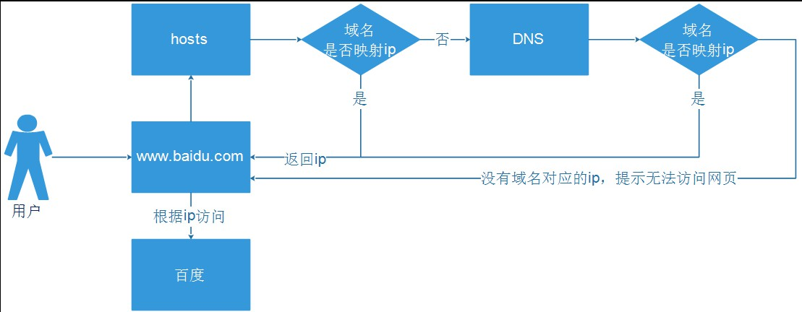
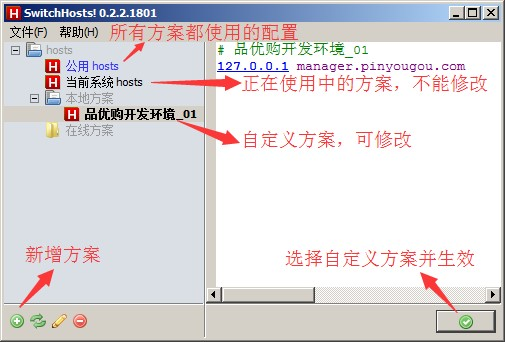
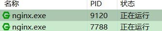
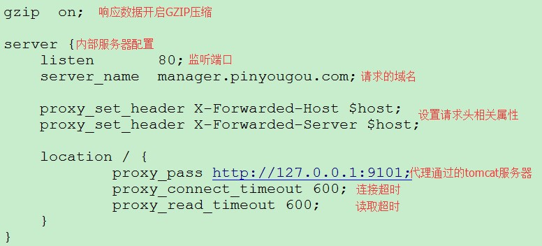
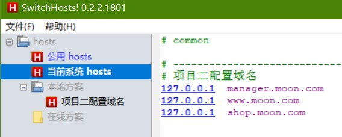

> 将『资料\运营商管理后台静态资源』下的静态资源全部拷贝到 pinyougou-manager-web 的 src/main/webapp/ 目录下。其中 plugins 文件夹中包括了 angularJS 、bootstrap、JQuery 等常用前端库，将在项目中用到。

## 1. 使用域名访问后台系统

### 1.1. 不使用域名存在的问题

1. 开发环境和测试环境的 ip 不一样，每次环境变化时，都需要修改访问地址；
2. 页面加载资源文件，有可能使用 url 的全路径，一旦更换环境（ip 变了），资源文件则无法加载；
3. ip 地址没有记忆意义，不容易记忆，用户不通过 ip 访问，一般通过域名访问。

### 1.2. 配置域名访问

- 可以修改`windows/system32/drivers/etc/hosts`文件，实现域名和ip地址的映射。
- 使用域名访问后的流程为：



### 1.3. SwitchHosts工具

- 手动修改hosts文件，如果以后ip多了以后配置和切换都比较麻烦；一般可以使用工具进行管理。而SwitchHosts则可以管理hosts文件；SwitchHosts安装文件在“资料\SwitchHosts.exe”中。
- 功能说明：



- 问题：ip不用输入了，但是端口还在。可使用nginx解决。

## 2. Nginx 反向代理服务器

### 2.1. Nginx 简介

1. Nginx ("engine x") 是一个高性能的 HTTP 和反向代理服务器；
2. 支持的操作系统众多，windows、linux、MacOS X；
3. 可实现负载均衡；
4. Rewrite功能强大；
5. 电商架构大部分都采用Nginx+Tomcat的架构。

反向代理（Reverse Proxy）方式是指以代理服务器来接受 internet 上的连接请求，然后将请求转发给内部网络上的服务器，并将从服务器上得到的结果返回给 internet 上请求连接的客户端，此时代理服务器对外就表现为一个反向代理服务器。

### 2.2. Nginx 官网与下载

- 官网：https://nginx.org/
- 下载：https://nginx.org/en/download.html
- 本次项目使用版本：nginx-1.13.12.zip

### 2.3. Nginx 相关命令

用 cmd 命令行工具进入 nginx 所在的根目录：

- 启动： `start nginx`
- 停止： `nginx -s stop`
- 重新启动：`nginx -s reload`

> 注意：启动 nginx 后在任务管理器中要能看到两个 nginx 服务启动才是正确的。



如果启动报错，查看日志文件发现80端口被占用；可以使用命令`netstat -ano`命令查看端口占用情况。再打开任务管理器，查看pid然后停止程序即可。

```bash
netstat -ano | findstr "80"
```

### 2.4. 安装与配置

- 直接解压【nginx-x.xx.xx.zip】；进入解压后目录
- 【nginx-1.11.13\conf\nginx.conf】进行服务的配置。



- 对于运营商后台管理系统，可以添加如下nginx配置：

```conf
server {
    listen       80;
    server_name  manager.moon.com;

    proxy_set_header X-Forwarded-Host $host;
    proxy_set_header X-Forwarded-Server $host;

    location / {
           proxy_pass http://127.0.0.1:9101;
           proxy_connect_timeout 600;
           proxy_read_timeout 600;
    }
}
```

### 2.5. 修改本机host

- 方式一：打开`“C:\Windows\System32\drivers\etc\hosts”`文件添加如下内容：`127.0.0.1  manager.moon.com`
- 方式二：使用转换Host工具“SwitchHosts”打开并添加。



- 请求地址：http://manager.moon.com/admin/index.html

## 3. 运营商后台品牌列表模块功能

### 3.1. 品牌列表查询（不分页）

#### 3.1.1. 前端 - 品牌查询（brand.html）

##### 3.1.1.1. 引入js

修改admin/brand.html，引入js：

```html
<!-- 引入angularjs框架 -->
<script src="/plugins/angularjs/angular.min.js"></script>
```

##### 3.1.1.2. 指定模块和控制器

```html
<body class="hold-transition skin-red sidebar-mini"
      ng-app="pinyougou" ng-controller="brandController">
```

- ng-app 指令中定义的就是模块的名称
- ng-controller 指令用于为你的应用添加控制器。
- 在控制器中，可以编写代码，制作函数和变量，并使用 scope 对象来访问。

##### 3.1.1.3. 编写JS代码发送异常请求查询后端

```html
<!-- 定义模块与控制器 -->
<script type="text/javascript">
    // 定义一个模块名称
    var app = angular.module('pinyougou', []);

    // 定义一个控制器
    app.controller('brandController', function ($scope, $http) {
        // 获取所有品牌数据
        $scope.findAll = function () {
            // 发送异步get请求查询后台
            $http.get('/brand/findAll').then(function (response) {
                $scope.dataList = response.data;
            }, function (response) {
                alert("获取品牌列表数据失败！");
            })
        }
    });
</script>
```

##### 3.1.1.4. 页面循环显示表格数据

```html
<!--数据列表-->
<table id="dataList" class="table table-bordered table-striped table-hover dataTable">
    <thead>
        <tr>
            <th class="" style="padding-right:0px">
                <input id="selall" type="checkbox" class="icheckbox_square-blue">
            </th>
            <th class="sorting_asc">品牌ID</th>
            <th class="sorting">品牌名称</th>
            <th class="sorting">品牌首字母</th>
            <th class="text-center">操作</th>
        </tr>
    </thead>
    <tbody>
        <tr ng-repeat="entity in dataList">
            <td><input  type="checkbox" ></td>
            <td>{{ entity.id }}</td>
            <td>{{ entity.name }}</td>
            <td>{{ entity.firstChar }}</td>
            <td class="text-center">
                <button type="button" class="btn bg-olive btn-xs" data-toggle="modal" data-target="#editModal"  >修改</button>
            </td>
        </tr>
    </tbody>
</table>
<!--数据列表/-->
```

##### 3.1.1.5. 初始化调用

```html
<body class="hold-transition skin-red sidebar-mini"
      ng-app="pinyougou" ng-controller="brandController"
      ng-init="findAll();">
```

#### 3.1.2. 后端 - 品牌查询（BrandController.java）

直接使用之前初始化项目的后台代码即可

### 3.2. 品牌列表分页查询

#### 3.2.1. 需求分析

在品牌管理下方放置分页栏，实现分页功能

#### 3.2.2. 后端-分页结果实体

- 在pinyougou-common工程中创建com.pinyougou.common.pojo包，用于存放通用实体类，创建类PageResult
- 定义两个属性，封装总记录数和分页数据

```java
/**
 * 分页结果封装实体
 */
public class PageResult<T> implements Serializable {
    /**
     * 定义总记录数，不使用包装类
     * 因为包装类会出现null，基本类型默认为0
     */
    private long total;
    /**
     * 定义分页数据集合
     */
    private List<T> rows;
    ...
}
```

#### 3.2.3. 后端-服务接口层

分页助手需要依赖？！pagehelper在mapper模块已经依赖，服务模块的实现类依赖了mapper模块，所以可以不加pagehelper的依赖

- 在pinyougou-sellergoods-interface的pom.xml配置common模块依赖

```xml
<!-- 依赖common公共模块 -->
<dependency>
    <groupId>com.moon</groupId>
    <artifactId>pinyougou-common</artifactId>
    <version>${project.version}</version>
</dependency>
```

- 在pinyougou-sellergoods-interface的BrandService.java增加根据分页查询方法

```java
/**
 * 分页查询品牌
 *
 * @param pageNum  当前页记录
 * @param pageSize 每页显示大小
 * @return 封装品牌分页数据
 */
PageResult<Brand> findByPage(int pageNum, int pageSize);
```

#### 3.2.4. 后端-服务实现层

实现类使用PageHelper（MyBatis分页插件）分页查询

```java
/**
 * 分页查询品牌
 *
 * @param pageNum  当前页记录
 * @param pageSize 每页显示大小
 * @return 返回的分页对象
 */
@Override
public PageResult<Brand> findByPage(int pageNum, int pageSize) {

	try {
		// 使用分页助手开启分页，获取pageInfo对象
		PageInfo<Brand> pageInfo = PageHelper.startPage(pageNum, pageSize)
				.doSelectPageInfo(new ISelect() {
			@Override
			public void doSelect() {
				// 通用mapper查询所有数据的方法
				brandMapper.selectAll();
			}
		});

		// 创建PageResult对象
		PageResult<Brand> pageResult = new PageResult<Brand>();

		pageResult.setTotal(pageInfo.getTotal());
		pageResult.setRows(pageInfo.getList());

		return pageResult;
	} catch (Exception e) {
		throw new RuntimeException(e);
	}
}
```

#### 3.2.5. 后端-控制层

- 控制层增加分页查询方法

```java
/**
 * 分页查询品牌
 *
 * @return 品牌分页结果封装实体
 */
@GetMapping("/findByPage")
// @RequestParam注解作用：设置请求的参数名称，与方法形参名称匹配
public PageResult<Brand> findByPage(@RequestParam("page") Integer page,
									@RequestParam("rows") Integer rows) {
	// 调用服务接口分页查询方法
	PageResult<Brand> pageResult = brandService.findByPage(page, rows);
	return pageResult;
}
```

- 在控制类上定义全局命名空间

```java
// 定义全局的命名空间，对请求url进行分类管理
@RequestMapping("/brand")
public class BrandController {
```

- 使用url进行测试：http://127.0.0.1:9101/brand/findByPage?page=1&rows=5

#### 3.2.6. 前端-分页查询

- 在admin/brand.html引入分页组件

```html
<!-- 引入angularjs框架 -->
<script src="/plugins/angularjs/angular.min.js"></script>
<!-- 导入分页组件start  -->
<script src="/plugins/angularjs/pagination.js"></script>
<link rel="stylesheet" href="/plugins/angularjs/pagination.css" />
<!-- 导入分页组件end  -->
```

- 构建app模块时引入pagination模块

```js
// 定义一个模块名称，增加定义品优购分页模块
var app = angular.module('pinyougou', ['pagination']);
```

- 在<body>标签中定义模块与控制器

```html
<body class="hold-transition skin-red sidebar-mini"
      ng-app="pinyougou" ng-controller="brandController">
```

- 在显示数据列表的下面插入分页组件，用于显示页码显示

```html
<!-- 分页组件 -->
<tm-pagination conf="paginationConf"></tm-pagination>
```

#### 3.2.7. 前端-分页组件配置

- <font color="red">注意：使用分页查询前，在页面的body元素上去掉ng-init指令的调用</font>
- paginationConf 变量各属性的意义：
    1. currentPage：当前页码
    2. totalItems: 总记录数
    3. itemsPerPage: 每页显示的记录数
    4. perPageOptions：页码下拉列表框
    5. onChange：改变页码时触发事件
- 分页组件配置相关js代码

```js
// 定义初始化分页组件需要的配置信息对象（对象对应传递tm-pagination组件的conf属性）
$scope.paginationConf = {
    currentPage : 1,    // 当前页码
    totalItems : 0,     // 总记录数
    itemsPerPage : 10,  // 每页显示的记录数
    perPageOptions : [10, 20 ,30], // 页码下拉列表框
    onChange : function(){ // 当页码改变监听事件
        /** 重新加载数据 */
        $scope.reload();
    }
};

/* 定义监听页码改变后事件，重新加载数据的方法 */
$scope.reload = function () {
    // 传入当前页码与每页大小，重新调用分页查询方法即可
    $scope.search($scope.paginationConf.currentPage,
        $scope.paginationConf.itemsPerPage);
};

/* 定义分页查询的方法 */
$scope.search = function (page, rows) {
    /* 发送异步请求分页查询品牌数据 */
    $http({
        method: 'get', // 请求方式
        url : "/brand/findByPage?page=" + page + "&rows=" + rows, // 请求URL
    }).then(function (response) {
        $scope.dataList = response.data.rows;
        // 更新分页组件中的总记录数
        $scope.paginationConf.totalItems = response.data.total;
    }, function (response) {
        alert("获取品牌列表分页数据失败！");
    })
}
```

### 3.3. 新增品牌

#### 3.3.1. 后端-服务接口与实现层

- 在pinyougou-sellergoods-interface服务接口层的BrandService.java添加新增方法

```java
void saveBrand(Brand brand);
```

- 在com.pinyougou.sellergoods.service.impl的BrandServiceImpl.java实现类实现添加新增方法

```java
@Override
public void saveBrand(Brand brand) {
    try {
        /* 调用通用mapper接口新增方法
         * int insert(T record);
         * 		保存一个实体，null的属性也会保存，不会使用数据库默认值
         * int insertSelective(T record);
         * 		保存一个实体，null的属性不会保存，会使用数据库默认值
         */
        brandMapper.insertSelective(brand);
    } catch (Exception e) {
        throw new RuntimeException(e);
    }
}
```

#### 3.3.2. 后端-控制器层

在pinyougou-manager-web的BrandController.java中新增方法

```java
@PostMapping("/save")
// @RequestBody注解将json格式的请求转成java对象
public boolean save (@RequestBody Brand brand) {
    // 调用服务层新增方法
    try {
        brandService.saveBrand(brand);
    } catch (Exception e) {
    // 新增失败
        e.printStackTrace();
        return false;
    }
    return true;
}
```

#### 3.3.3. 前端brand.html页面JS代码

- 使用ng-model绑定页面输入的值到对象，给保存按钮增加点击事件`ng-click="saveOrUpdate()"`

```html
<div class="modal-body">
    <table class="table table-bordered table-striped"  width="800px">
        <tr>
            <td>品牌名称</td>
            <td><input  class="form-control" placeholder="品牌名称"
                        ng-model="entity.name">  </td>
        </tr>
        <tr>
            <td>首字母</td>
            <td><input  class="form-control" placeholder="首字母"
                        ng-model="entity.firstChar">  </td>
        </tr>
    </table>
</div>
<div class="modal-footer">
    <button class="btn btn-success" data-dismiss="modal"
            aria-hidden="true" ng-click="saveOrUpdate()">保存</button>
    <button class="btn btn-default" data-dismiss="modal" aria-hidden="true">关闭</button>
</div>
```

- 编写点击事件执行saveOrUpdate()方法

```js
/* 定义添加或修改的方法 */
$scope.saveOrUpdate = function () {
    // 使用post方法发送异步请求发送对象到后台
    $http.post('/brand/save', $scope.entity)
         .then(function (response) {
            // 判断返回的结果，后端返回的是boolean
            if (response.data) {
                // 成功新增后，重新刷新页面
                $scope.reload();
            } else {
                alert("操作失败")
        }
    })
}
```

- 为了每次打开窗口没有遗留上次的数据，修改新建按钮，对entity变量进行清空操作

```html
<button type="button" class="btn btn-default" title="新建"
        data-toggle="modal" data-target="#editModal"
        ng-click="entity={}">
    <i class="fa fa-file-o"></i> 新建</button>
```

### 3.4. 修改品牌

点击列表的修改按钮，弹出窗口，修改数据后点“保存”执行保存操

#### 3.4.1. 后端-服务接口与实现层

- 服务层接口pinyougou-sellergoods-interface的BrandService.java增加修改品牌方法

```java
/**
 * 修改品牌
 * @param brand 修改品牌数据对象
 */
void updateBrand(Brand brand);
```

- 实现类增加修改品牌方法

```java
/**
 * 修改品牌
 *
 * @param brand 修改品牌数据对象
 */
@Override
public void updateBrand(Brand brand) {
	try {
		/*
		 * 调用通用mapper接口更新方法
		 * int updateByPrimaryKey(T record);
		 * 		根据主键更新实体全部字段，null值会被更新
		 * int updateByPrimaryKeySelective(T record);
		 * 		根据主键更新属性不为null的值
		 */
		brandMapper.updateByPrimaryKeySelective(brand);
	} catch (Exception e) {
		e.printStackTrace();
		throw new RuntimeException(e);
	}
}
```

#### 3.4.2. 后端-控制层

控制层pinyougou-manager-web的BrandController.java增加修改的方法

```java
/**
 * 修改品牌
 *
 * @param brand
 * @return boolean标识符
 */
@PostMapping("/update")
public boolean update(@RequestBody Brand brand) {
	try {
		// 调用服务层修改的方法
		brandService.updateBrand(brand);
		return true;
	} catch (Exception e) {
		e.printStackTrace();
		return false;
	}
}
```

#### 3.4.3. 前端页面

- 修改列表中的“修改”按钮，调用此方法执行表单数据绑定：将当前行的对象传入到方法中，不需要再去查询数据

```html
<button type="button" class="btn bg-olive btn-xs"
        data-toggle="modal" data-target="#editModal"
        ng-click="show(entity)">修改</button>
```

- 增加JS代码显示修改窗口时显示当前行对象数据，此处需要注意：如果不将传递的对象解析成一个新的对象，则修改数据但不保存，对象也被修改了。所以需要转成新的对象，在新的对象上做修改

```js
/* 定义点击修改按钮显示对象数据的方法 */
$scope.show = function (entity) {
    // 把entity对象解析成一个新的对象，否则修改此对象就是修改列表的该数据
    $scope.entity = JSON.parse(JSON.stringify(entity));
}
```

- 因为和保存功能使用同一个保存提交按钮，需要进行判断是新增还是修改

```js
/* 定义添加或修改的方法 */
$scope.saveOrUpdate = function () {
    // 定义默认url
    var url = 'save';

    // 判断是新增还是修改
    if ($scope.entity.id) {
        // 如果发送到后端的对象id属性不为空，则是修改操作
        url = 'update';
    }

    // 使用post方法发送异步请求发送对象到后台
    $http.post('/brand/' + url, $scope.entity)
        .then(function (response) {
            // 判断返回的结果，后端返回的是boolean
            if (response.data) {
                // 成功新增后，重新刷新页面
                $scope.reload();
            } else {
                alert("操作失败")
            }
        })
}
```

### 3.5. 删除品牌

点击列表前的复选框，点击删除按钮，删除选中的品牌

#### 3.5.1. 后端-服务接口与实现层

- 在pinyougou-sellergoods-interface的BrandService.java接口定义删除方法

```java
/**
 * 根据多个id批量删除品牌
 *
 * @param ids
 */
void deleteBrand(Long[] ids);
```

- 服务层实现类增加批量删除方法

```java
/**
 * 根据id数组批量删除品牌
 *
 * @param ids
 */
@Override
public void deleteBrand(Long[] ids) {
	try {
		// 方式1：使用循环批量删除，但效率低
		/*if (ids != null && ids.length > 0) {
			for (Long id : ids) {
				brandMapper.deleteByPrimaryKey(id);
			}
		}*/
		// 方式2：使用自定义sql进行批量删除
		brandMapper.deleteBrandByIds(ids);
	} catch (Exception e) {
		e.printStackTrace();
		throw new RuntimeException(e);
	}
}
```

#### 3.5.2. 后端-数据访问层mapper

在mapper接口的方法形参中使用@Param("指定参数名称")，用注解来简化xml配置的时候,@Param注解的作用是给参数命名,参数命名后就能根据名字得到参数值,正确的将参数传入sql语句中

- 方式1：BrandMapper.java接口定义批量删除方法与映射文件BrandMapper.xml定义动态sql

```java
/**
 * 方式1：不指定参数名字批量删除品牌
 * @param ids
 */
void deleteBrandByIds(Long[] ids);
```

```xml
<!-- 批量删除方式1：接口方法没有指定参数名，需要指定parameterType，collection需要写"array" -->
<delete id="deleteBrandByIds" parameterType="Brand">
    delete from tb_brand
      <where>
          <foreach collection="array" item="id" open="id in (" close=")" separator=",">
              #{id}
          </foreach>
      </where>
</delete>
```

- 方式2：mapper接口方法指定参数名称，映射文件不需要指定parameterType和collection可以直接写指定的参数名称

```java
/**
 * 方式2：指定参数名字批量删除品牌
 *
 * @param ids
 */
void deleteBrandByIds(@Param("ids") Long[] ids);
```

```xml
<!-- 批量删除方式2：mapper接口方法指定参数名称，映射文件不需要指定parameterType和collection可以直接写指定的参数名称 -->
<delete id="deleteBrandByIds">
    delete from tb_brand
      <where>
          <foreach collection="ids" item="id" open="id in (" separator="," close=")">
              #{id}
          </foreach>
      </where>
</delete>
```

#### 3.5.3. 后端-控制层

控制层新增删除方法

```java
/**
 * 批量删除品牌
 *
 * @param ids
 * @return boolean标识符
 */
@PostMapping("/delete")
public boolean delete(Long[] ids) {
	try {
		// 调用服务层批量删除方法
		brandService.deleteBrand(ids);
		return true;
	} catch (Exception e) {
		e.printStackTrace();
		return false;
	}
}
```

#### 3.5.4. 前端页面批量删除（处理选取多个id）

- 主要思路：需要定义一个用于存储选中ID的数组，当点击复选框后判断是选择还是取消选择，如果是选择就加到数组中，如果是取消选择就从数组中移除。在点击删除按钮时需要用到这个存储了ID的数组。
- 补充一下JS的关于数组操作的知识：
	1. 数组的push方法：向数组中添加元素
	2. 数组的splice方法：从数组的指定位置移除指定个数的元素 ，参数1为位置，参数2为移除的个数
	3. 复选框的checked属性：用于判断是否被选中
- 修改brand.html，为复选框绑定点击事件，调用方法更新选择与取消的id数组

```html
<!-- 定义ng-checked='ck'，改变ck的值来显示是否选中 -->
<td><input  type="checkbox"
            ng-checked="ck"
            ng-click="updateSelection($event, entity.id)"></td>

<!-- 绑定删除点击事件 -->
<button type="button" class="btn btn-default" title="删除"
        ng-click="delete();">
    <i class="fa fa-trash-o"></i> 删除</button>
```

- 编写js代码，绑定选中id到数组中或者取消选择后从数组移除

```js
/* 定义选中的id数组 */
$scope.ids = new Array();
/* 定义checkbox点击事件方法，获取选取id数组 */
$scope.updateSelection = function ($event, id) {
    // 判断当前checkbox是否选中
    if ($event.target.checked) {
        // 选中复选框，将id添加到数组中
        $scope.ids.push(id);
    } else {
        // 取消选择，则根据id的值获取对应数组中的索引
        var index = $scope.ids.indexOf(id);

        // 根据元素的索引号从数组中移除
        $scope.ids.splice(index, 1);
    }
    // 测试使用(待删)
    console.log("选中的品牌id===" + $scope.ids);
};

/* 定义批量删除品牌的方法 */
$scope.delete = function () {
    // 判断是否有选中复选框
    if ($scope.ids.length > 0) {
        // 发送异步请求
        $http.get('/brand/delete?ids=' + $scope.ids)
            .then(function (response) {
               if (response.data) {
                    // 删除成功，重新加载页面
                   $scope.reload();
               } else {
                   alert("操作失败");
               }
            });
    } else {
        // 提示至少选择1个品牌
        alert("请至少选择1个要删除的品牌！");
    }
};
```

#### 3.5.5. （！待完善）增加全选功能

- 还有小bug，当全选后，再取消一个，再点击全选，刚刚取消的无法再选中？！
- 给全选复选框增加选中属性，和点击事件，增加ng-model属性绑定，点击后可以改变ck取值，从而改变下面的复选框的ng-checked值

```html
<tr>
    <th class="" style="padding-right:0px">
        <input id="selall" type="checkbox" class="icheckbox_square-blue"
               ng-model="ck" ng-checked="ck_all" ng-click="checkAll();">
    </th>
    <th class="sorting_asc">品牌ID</th>
    <th class="sorting">品牌名称</th>
    <th class="sorting">品牌首字母</th>
    <th class="text-center">操作</th>
</tr>
```

- 编写全选的js代码

```js
 /* 为全选checkbox绑定点击事件 */
$scope.checkAll = function() {
    // 判断全选checkbox是选中还中没选中
    if ($scope.ck) {
        // 注意，如果之前有选中的话，要选将数组清空，再增加，不然会出现重复的id
        $scope.ids = [];
        // 循环请求后端返回的品牌集合dataList
        for (var i = 0; i < $scope.dataList.length; i++) {
            $scope.ids.push($scope.dataList[i].id);
        }
    } else {
        // 全选复选框没有选中，则将选择的id数组清空
        $scope.ids = [];
    }
    alert("点击全选====" + $scope.ids);
};

/* 定义批量删除品牌的方法 */
$scope.delete = function () {
    // 判断是否有选中复选框
    if ($scope.ids.length > 0) {
        // 发送异步请求
        $http.get('/brand/delete?ids=' + $scope.ids)
            .then(function (response) {
               if (response.data) {
                    // 删除成功，重新加载页面
                   $scope.reload();
               } else {
                   alert("操作失败");
               }
            });
    } else {
        // 提示至少选择1个品牌
        alert("请至少选择1个要删除的品牌！");
    }
};
```

- 在$scope.updateSelection = function($event, id)中最后处添加

```js
/* 判断全选是否选中 */
$scope.ck_all = $scope.ids.length == $scope.dataList.length;
```

### 3.6. 多条件分页查询品牌

- 实现品牌条件查询功能，输入品牌名称、首字母后查询，并分页
- <font color="red">需要注意使用get方法传递中文查询条件时乱码的问题</font>

#### 3.6.1. 后端-服务接口与实现层（修改原来分页查询方法）

- 根据前端查询条件分析，可以直接使用品牌的实体类来封装查询条件即可
- 在pinyougou-sellergoods-interface工程的BrandService.java修改findByPage分页方法，增加Brand对象，用来封装查询条件

```java
/**
 * 分页条件查询品牌
 *
 * @param brand    品牌条件查询条件
 * @param pageNum  当前页记录
 * @param pageSize 每页显示大小
 * @return 封装品牌分页数据
 */
PageResult<Brand> findByPage(Brand brand, int pageNum, int pageSize);
```

- 实现类分页查询方法，增加查询条件

```java
public PageResult<Brand> findByPage(Brand brand, int pageNum, int pageSize) {

    try {
    	// 使用分页助手开启分页，获取pageInfo对象
    	PageInfo<Brand> pageInfo = PageHelper.startPage(pageNum, pageSize)
    			.doSelectPageInfo(new ISelect() {
    				@Override
    				public void doSelect() {
    					// 通用mapper查询所有数据的方法
    					// brandMapper.selectAll();
    					// 使用自定义动态条件查询方法
    					brandMapper.findByWhere(brand);
    				}
    			});
    ...
}
```

#### 3.6.2. 后端-数据访问层接口与映射文件

- 在pinyougou-mapper工程BrandMapper.java增加方法，新增条件查询形参brand

```java
/**
 * 分页条件查询品牌数据
 *
 * @param brand 品牌条件查询对象
 * @return 返回品牌对象集合
 */
List<Brand> findByWhere(@Param("brand") Brand brand);
```

- 在pinyougou-mapper工程映射文件BrandMapper.xml增加SQL语句相应方法配置

```xml
<!-- 动态sql多条件查询品牌 -->
<select id="findByWhere" resultType="Brand">
    select * from tb_brand
      <where>
          <!-- 先判断输入的对象是否为空 -->
          <if test="brand != null">
              <!-- 判断查询名称的条件 -->
              <if test="brand.name != null and brand.name != ''">
                  <!-- 模糊查询方式1：使用${}拼接
                  `name` like '%${brand.name}%' -->
                  <!-- 模糊查询方式2：使用concat函数拼接字符 -->
                  `name` like concat('%', #{brand.name} ,'%')
              </if>
              <!-- 判断首字母的查询条件 -->
              <if test="brand.firstChar != null and brand.firstChar != ''">
                  and first_char = #{brand.firstChar}
              </if>
          </if>
      </where>
</select>
```

##### 3.6.2.1. sql语句的CONCAT()函数

- 用于拼接字符串，用于代替直接编写字符串
- 例：`select * from tb_brand where name like CONCAT('%', '米' ,'%');`

#### 3.6.3. 后端-控制层

##### 3.6.3.1. 增加查询条件封装的Brand对象

- 修改之前的分页查询方法，增加封装查询条件

```java
@GetMapping("/findByPage")
// @RequestParam注解作用：设置请求的参数名称，与方法形参名称匹配
public PageResult<Brand> findByPage(Brand brand,
                                    @RequestParam("page") Integer page,
                                    @RequestParam("rows") Integer rows) {
    // 调用服务接口分页查询方法
    PageResult<Brand> pageResult = brandService.findByPage(brand, page, rows);
    return pageResult;
}
```

##### 3.6.3.2. 解决get请求中文乱码

1. 方式1：配置tomcat的插件，解决Get方法传递中文查询条件时乱码的问题
    - 修改pinyougou-manager-web/pom.xml配置文件

```xml
<!-- 构建部分 -->
<build>
    <plugins>
        <!-- 配置tomcat插件 -->
        <plugin>
            <groupId>org.apache.tomcat.maven</groupId>
            <artifactId>tomcat7-maven-plugin</artifactId>
            <configuration>
                <port>9101</port>
                <path>/</path>
                <!-- URL按UTF-8进行编码，解决中文参数乱码 -->
                <uriEncoding>UTF-8</uriEncoding>
            </configuration>
        </plugin>
    </plugins>
</build>
```

2. 方式2：手动转码解决乱码问题（每个方法都需要手动解决，不可取），在查询分页的方法中进行转码

```java
// GET请求中文转码
if (brand != null && StringUtils.isNoneBlank(brand.getName())) {
	brand.setName(new String(brand.getName().getBytes("ISO8859-1"), "UTF-8"));
}

// 调用服务接口分页查询方法
PageResult<Brand> pageResult = brandService.findByPage(brand, page, rows);
return pageResult;
```

#### 3.6.4. 前端页面

- 注：使用前端框架绑定参数，对象名可以随便定义，但属性的名称比较与传入后台用于封装的实体类属性一致
- brand.html添加搜索条件框，绑定输入参数，还有查询按钮点击事件

```html
<tr>
    <td><input class="form-control" placeholder="品牌名称" ng-model="searchEntity.name">
    </td>
    <td><input class="form-control" placeholder="首字母" ng-model="searchEntity.firstChar">
    </td>
    <td>
        <button type="button" class="btn btn-default" ng-click="reload();">
            <i class="fa fa-trash-o" ></i> 查询
        </button>
    </td>
</tr>
```

- 修改之前用于分页查询的reload()方法

```js
/* 定义封装查询条件对象 */
$scope.searchEntity = {};
/* 定义分页查询的方法 */
$scope.search = function (page, rows) {
    /* 发送异步请求分页查询品牌数据 */
    $http({
        method: 'get', // 请求方式
        url : "/brand/findByPage?page=" + page + "&rows=" + rows, // 请求URL
        // 增加查询条件请求参数
        params : $scope.searchEntity
    }).then(function (response) {
        $scope.dataList = response.data.rows;
        // 更新分页组件中的总记录数
        $scope.paginationConf.totalItems = response.data.total;
    }, function (response) {
        alert("获取品牌列表分页数据失败！");
    });
};
```
