## 1. 运营商后台-商品分类功能

### 1.1. 需求及表结构分析

#### 1.1.1. 需求分析

- 实现三级商品分类列表查询功能
- 进入页面首先显示所以一级分类，效果如下：

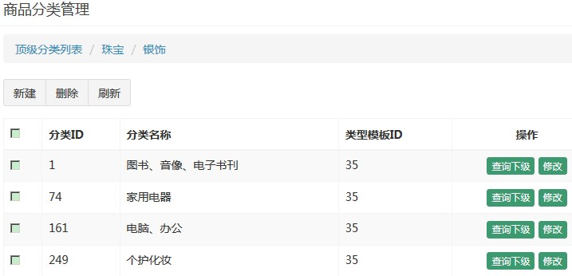

- 点击列表行的查询下级按钮，进入下级分类列表，同时更新面包屑导航

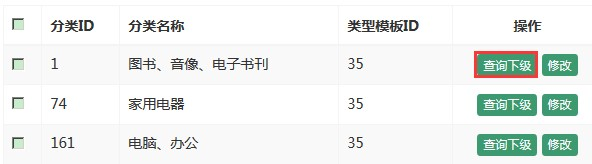

- 再次点击表行的查询下级按钮，进入三级分类列表，因为三级分类属于最后一级，所以在列表中不显示查询下级按钮，同时更新导航

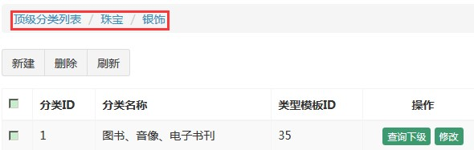

- 点击面包屑导航，可以进行返回操作。

#### 1.1.2. 表结构分析

tb_item_cat 商品分类表

|    字段    |   类型   | 长度 |    含义    |
| :-------: | :-----: | :--: | :--------: |
|    id     |  bigint |      |    主键    |
| parent_id | bigint  |      |   上级ID   |
|   name    | varchar |      |  分名称类  |
|  type_id  | bigint  |      | 类型模板ID |

### 1.2. 商品分类列表显示

#### 1.2.1. 分类列表查询-后端部分

- 修改pinyougou-manager-web工程，商品分类控制层ItemCatController。根据父目录id查询，设置默认传入的父目录参数为0。(因为进入页面默认展示顶级分类)

```java
@RestController
@RequestMapping("/itemCat")
public class ItemCatController {

    /* timeout: 连接服务超时的时长(10秒)  */
    @Reference(timeout = 10000)
    private ItemCatService itemCatService;

    /**
     * 根据父级id查询商品分类
     *
     * @param parentId 商品分类父级id
     * @return 商品分类list集合
     */
    @GetMapping("/findItemCatByParentId")
    // 使用注解定义父目录id初始值为0
    public List<ItemCat> findItemCatByParentId(
            @RequestParam(value = "parentId", defaultValue = "0") Long parentId) {
        try {
            // 调用服务层根据父级id查询的方法
            return itemCatService.findItemCatByParentId(parentId);
        } catch (Exception e) {
            e.printStackTrace();
            return null;
        }
    }
}
```

- 服务层实现类根据父目录id查询的方法

```java
/**
 * 根据父级id查询商品分类
 *
 * @param parentId 商品分类父级id
 * @return 商品分类list集合
 */
List<ItemCat> findItemCatByParentId(Long parentId);

/**
 * 根据父级id查询商品分类
 *
 * @param parentId 商品分类父级id
 * @return 商品分类list集合
 */
@Override
public List<ItemCat> findItemCatByParentId(Long parentId) {
    try {
        // 1.创建目录对象
        ItemCat itemCat = new ItemCat();
        itemCat.setParentId(parentId);

        // 2. 通用mapper查询，如果传入的对象只有一个属性值，则相当于条件查询
        // select * from tb_item_cat where parent_id=?;
        return itemCatMapper.select(itemCat);
    } catch (Exception e) {
        e.printStackTrace();
        throw new RuntimeException(e);
    }
}
```

#### 1.2.2. 分类列表查询-前端代码

- 参考其他模块引入js文件(不分页组件)
- itemCatController.js增加父目录查询条件（将findAll、search等不需要的方法删除）

```js
/* 根据父级id查询商品分类 */
$scope.findItemCatByParentId = function (parentId) {
    // 使用get方式发送ajax请求
    baseService.sendGet('/itemCat/findItemCatByParentId', 'parendId=' + parentId)
        .then(function (response) {
            if (response) {
                $scope.dataList = response.data;
            } else {
                alert("查询异常。")
            }
        });
};
```

- 修改item_cat.html，使用指令引用控制器，初始化父目录

```html
<!-- 引入angularjs框架 -->
<script src="/plugins/angularjs/angular.min.js"></script>
<!-- 导入angular框架mvc分层后的js文件start -->
<script src="/js/base.js"></script>
<script src="/js/service/baseService.js"></script>
<script src="/js/controller/baseController.js"></script>
<script src="/js/controller/itemCatController.js"></script>
<!-- 导入angular框架mvc分层后的js文件end -->

<body class="hold-transition skin-red sidebar-mini"
        ng-app="pinyougou" ng-controller="itemCatController"
        ng-init="findItemCatByParentId(0);">

<tbody>
	<tr ng-repeat="entity in dataList">
		<td><input type="checkbox"></td>
		<td>{{ entity.id }}</td>
		<td>{{ entity.name }}</td>
		<td>{{ entity.typeId }}</td>
		<td class="text-center">
			<button type="button" class="btn bg-olive btn-xs">查询下级</button>
			<button type="button" class="btn bg-olive btn-xs"
				data-toggle="modal" data-target="#editModal">修改</button>
		</td>
	</tr>
</tbody>
```

### 1.3. 修改面包屑导航部分

#### 1.3.1. 功能分析

**面包屑导航:**

在网站建设和SEO中，面包屑导航的作用就是告诉访问者他们目前在网站中的位置以及如何返回。

就目前的网民使用习惯而言，面包屑导航是比较适合用户体验的导航方式。它能够更容易让用户了解到自己在当前网站的那个位置，便于自己更好的操作。通过面包屑导航，用户可以很清楚知道自己在网站的位置，可以很方便的返回到上一级目录或首页。

需要返回上级列表，需要通过点击面包屑来实现

#### 1.3.2. 面包屑导航实现前端js

- 修改itemCatController.js增加点击下一级按钮的方法

```js
/* 初始化当前目录的级数，默认是1级 */
$scope.grade = 1;
/* 定义选择下一级的方法 */
$scope.selectList = (entity, grade) => {
    // 将输入的等级赋值给当前目录
    $scope.grade = grade;
    // 判断当前目录等级
    if (grade === 1) {
        // 当前目录等级为1，将2级和3级目录对象设置为空
        $scope.entity_2 = null;
        $scope.entity_3 = null;
    } else if (grade === 2) {
        // 当前目录等级为2，将3级目录对象设置为空
        $scope.entity_2 = entity;
        $scope.entity_3 = null;
    } else if (grade === 3) {
        // 当前目录等级为3，设置3级目录对象
        $scope.entity_3 = entity;
    }

    // 调用查询方法，传入当前的id做为父目录id
    $scope.findItemCatByParentId(entity.id);
};
```

- 修改列表的查询下级按钮，绑定点击事件，设定级别值后显示列表；使用了ng-if指令，用于条件判断，当级别不等于3的时候才显示“查询下级”按钮

```html
<button type="button" class="btn bg-olive btn-xs"
        ng-if="grade != 3"
        ng-click="selectList(entity, grade + 1);">查询下级</button>
```

- 绑定面包屑导航点击效果

```html
<ol class="breadcrumb">
	<li>
        <a href="" ng-click="selectList({id: 0} , 1);">
            顶级分类列表
        </a>
    </li>
	<li ng-if="grade > 1">
        <a href="#" ng-click="selectList(entity_2, 2);">
            {{ entity_2.name }}
        </a>
    </li>
	<li ng-if="grade > 2">
        <a href="#">
            {{ entity_3.name }}
        </a>
    </li>
</ol>
```

### 1.4. （!待完成）新增商品分类

> TODO: 待完成

### 1.5. （!待完成）修改商品分类

> TODO: 待完成

### 1.6. （!待完成）删除商品分类

> TODO: 待完成

## 2. 电商概念及表结构分析

### 2.1. 电商概念SPU与SKU

- SPU = Standard Product Unit （标准产品单位）
    - SPU 是商品信息聚合的最小单位，是一组可复用、易检索的标准化信息的集合，该集合描述了一个产品的特性。
    - 通俗点讲，属性值、特性相同的商品就可以称为一个 SPU。
    - 例如： iphone7 就是一个 SPU，与商家，与颜色、款式、套餐都无关。
- SKU = stock keeping unit(库存量单位)
    - SKU 即库存进出计量的单位，可以是以件、盒、托盘等为单位。
    - SKU 是物理上不可分割的最小存货单元。在使用时要根据不同业态，不同管理模式来处理。在服装、鞋类商品中使用最多最普遍。
    - 例如：纺织品中一个 SKU 通常表示：规格、颜色、款式。

### 2.2. 表结构分析

- tb_goods 商品 SPU 表(标准商品)

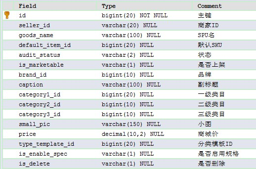

- tb_goods_desc 商品描述表

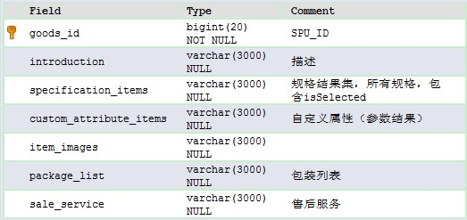

- tb_item 商品 SKU 表(具体商品)

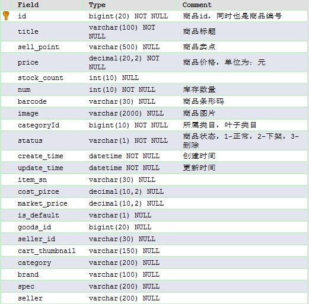

## 3. 商家后台-商品录入【基本功能】

### 3.1. 需要分析

1. 在商家后台实现商品录入功能。包括商品名称、副标题、价格、包装列表、售后服务
2. 实现商品介绍的录入，要求使用富文本编辑器

### 3.2. 商品录入（基本功能）-后端部分

- 修改Goods实体类，用于封装商品录入信息
    - 定义GoodsDesc对象用于封装商品描述
    - 定义List<Item>集合用于封装商品PKU商品信息（具体的商品）

```java
/** 商品描述 */
@Transient
private GoodsDesc goodsDesc;
/** 商品SKU列表 */
@Transient
private List<Item> items;
```

- 在pinyougou-shop-web工程的控制层GoodsController增加save方法

```java
@RestController
@RequestMapping("/goods")
public class GoodsController {

    @Reference(timeout = 30000)
    private GoodsService goodsService;

    /**
     * 添加商品(SPU、商品描述、SKU)
     *
     * @param goods 商品实体类
     * @return 成功/失败标识
     */
    @PostMapping("/save")
    public boolean save(@RequestBody Goods goods) {

        try {
            // 1. 获取登录用户名(商家id)，tb_goods 商品SPU表有记录商家id的字段
            String sellerId = SecurityContextHolder.getContext()
                    .getAuthentication().getName();

            // 2. 设置商家ID
            goods.setSellerId(sellerId);

            // 3. 调用服务层新增方法
            goodsService.saveGoods(goods);
            return true;
        } catch (Exception e) {
            e.printStackTrace();
        }
        return false;
    }
}
```

- 修改商家服务的GoodsService接口与GoodsServiceImpl现实类，增加保存方法

```java
/**
 * 添加商品
 *
 * @param goods 商品实体类
 */
void saveGoods(Goods goods);

/**
 * 服务实现层
 */
@Service(interfaceName = "com.pinyougou.sellergoods.service.GoodsService")
@Transactional(readOnly = false)
public class GoodsServiceImpl implements GoodsService {

    /**
     * 注入数据访问层代理对象
     */
    @Autowired
    private GoodsMapper goodsMapper;

    @Autowired
    private GoodsDescMapper goodsDescMapper;

    /**
     * 添加商品
     *
     * @param goods 商品实体类
     */
    @Override
    public void saveGoods(Goods goods) {
        try {
            // 1.设置审核状态(未审核)
            goods.setAuditStatus("0");
            // 2.调用商品mapper保存方法，往SPU表（tb_goods）添加数据
            goodsMapper.insertSelective(goods);

            // 3.设置商品描述id,与商品的id一对一。**因为是持久态，goods保存后已经有id**
            goods.getGoodsDesc().setGoodsId(goods.getId());
            // 4.调用商品描述mapper保存，往商品描述表（tb_goods_desc）添加数据
            goodsDescMapper.insertSelective(goods.getGoodsDesc());
        } catch (Exception e) {
            e.printStackTrace();
            throw new RuntimeException(e);
        }
    }
}
```

### 3.3. 商品录入（基本功能）-前端部分

#### 3.3.1. 控制层js代码

修改goodsController.js（将无用方法删除，只剩saveOrUpdate方法），在增加成功后弹出提示，并清空实体（因为编辑页面无列表）

```js
/** 添加商品 */
    $scope.saveOrUpdate = function () {
        /** 发送post请求 */
        baseService.sendPost("/goods/save", $scope.goods).then(function (response) {
            if (response.data) {
                alert("添加成功！");
                /** 成功增加后清空表单goods对象 */
                $scope.goods = {};
            } else {
                alert("添加失败！");
            }
        });
    };
```

#### 3.3.2. 页面goods_edit.html

- 参考其他模块导入js文件。引入控制器

```html
<!-- 引入angularjs框架 -->
<script src="/plugins/angularjs/angular.min.js"></script>
<!-- 导入angular框架mvc分层后的js文件start -->
<script src="/js/base.js"></script>
<script src="/js/service/baseService.js"></script>
<script src="/js/controller/baseController.js"></script>
<script src="/js/controller/goodsController.js"></script>
<!-- 导入angular框架mvc分层后的js文件end -->

<body class="hold-transition skin-red sidebar-mini"
      ng-app="pinyougou" ng-controller="goodsController">
```

- 绑定表单部分参数（只绑定5个属性）

```html
<div class="col-md-2 title">商品名称</div>
<div class="col-md-10 data">
	<input type="text" class="form-control"
           ng-model="goods.goodsName"
           placeholder="商品名称" value="">
</div>

<div class="col-md-2 title">副标题</div>
<div class="col-md-10 data">
	<input type="text" class="form-control"
           ng-model="goods.caption"
           placeholder="副标题" value="">
</div>

<div class="col-md-2 title">价格</div>
<div class="col-md-10 data">
	<div class="input-group">
		<span class="input-group-addon">¥</span>
        <input type="text" ng-model="goods.price"
               class="form-control" placeholder="价格" value="">
	</div>
</div>

<div class="col-md-2 title rowHeight2x">包装列表</div>
<div class="col-md-10 data rowHeight2x">
	<textarea rows="4" class="form-control" placeholder="包装列表"
              ng-model="goods.goodsDesc.packageList"></textarea>
</div>

<div class="col-md-2 title rowHeight2x">售后服务</div>
<div class="col-md-10 data rowHeight2x">
	<textarea rows="4" class="form-control" placeholder="售后服务"
              ng-model="goods.goodsDesc.saleService"></textarea>
</div>
```

- 给保存设置点击事件

```html
<button class="btn btn-primary" ng-click="saveOrUpdate();">
	<i class="fa fa-save"></i>保存
</button>
```

## 4. 商家后台-商品录入【富文本编辑器】

### 4.1. 富文本编辑器介绍

- 富文本编辑器，Rich Text Editor, 简称 RTE, 它提供类似于 Microsoft Word 的编辑功能。常用的富文本编辑器：
    - KindEditor：http://kindeditor.net/
    - UEditor：http://ueditor.baidu.com/website/
    - CKEditor：http://ckeditor.com/

### 4.2. 使用kindeditor完成商品介绍的录入

#### 4.2.1. 初始化kindeditor编辑器

在goods_edit.html页面中添加JS代码，用于初始化kindeditor：

```html
<!-- 富文本编辑器 -->
<link rel="stylesheet" href="/plugins/kindeditor/themes/default/default.css"/>
<script src="/plugins/kindeditor/kindeditor-min.js"></script>
<script src="/plugins/kindeditor/lang/zh_CN.js"></script>
<!-- 正文区域 /-->
<script type="text/javascript">
	var editor;
	KindEditor.ready(function(K) {
		editor = K.create('textarea[name="content"]', {
			allowFileManager : true
		});
	});
</script>
```

*说明：allowFileManager【是否允许浏览服务器已上传文件】，默认值是：false*

#### 4.2.2. 获取kindeditor编辑器的内容

- 在goodsController.js中的saveOrUpdate()方法中添加富文本的处理

```js
/** 添加商品 */
$scope.saveOrUpdate = function () {
    // 获取kindeditor富文本编辑器的内容
    $scope.goods.goodsDesc.introduction = editor.html();

    /** 发送post请求 */
    baseService.sendPost("/goods/save", $scope.goods).then(function (response) {
        if (response.data) {
            alert("添加成功！");
            /** 成功增加后清空表单goods对象 */
            $scope.goods = {};
            // 清空富文本编辑器内容
            editor.html('');
        } else {
            alert("添加失败！");
        }
    });
};
```

- 保存到数据库的结果

```html
<p>
	<span style="color:#E53333;">楫極 呆了吕</span>
</p>
<p>
	<span style="color:#E53333;"><em>sadddd</em></span>
</p>
<p>
	<span style="color:#E53333;"><em><br />
</em></span>
</p>
<p style="text-align:center;">
	<span style="color:#E53333;"><em>dfdsfsdfdsf<br />
</em></span>
</p>
```

## 5. FastDFS【分布式文件系统】

### 5.1. 图片服务器介绍

- 要实现图片上传功能，需要有一个图片服务器。图片服务器的特点：
    1. 存储空间可扩展
    2. 提供统一的访问方式
    3. 访问效率高
- 企业中的图片服务器有两个方案：
    1. 使用FastDFS分布式文件系统。
    2. 使用Nginx服务器。

### 5.2. 什么是FastDFS

FastDFS(Fast Distributed file system)是用c语言编写的一款开源的分布式文件系统。FastDFS为互联网量身定制，充分考虑了冗余备份、负载均衡、横向扩展等机制，并注重高可用、高性能等指标，使用FastDFS很容易搭建一套高性能的文件服务器集群提供文件上传、下载等服务。

### 5.3. FastDFS架构

FastDFS架构包括**Tracker server**和**Storage server**。客户端请求Tracker server进行文件上传、下载，通过Tracker server调度最终由Storage server完成文件上传和下载。

**Tracker server作用是负载均衡和调度**，通过Tracker server在文件上传时可以根据一些策略找到Storage server提供文件上传服务。可以将tracker称为追踪服务器或调度服务器。

**Storage server作用是文件存储**，客户端上传的文件最终存储在Storage服务器上，Storage server*没有实现自己的文件系统而是利用操作系统的文件系统来管理文件*。可以将storage称为存储服务器。

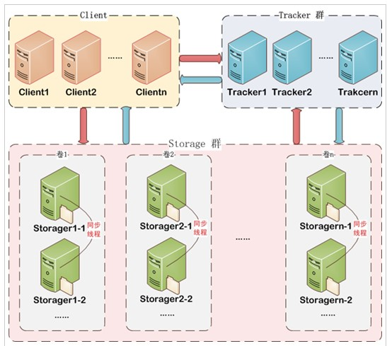

Tracker 管理集群，收集信息，处理信息，为了保证高可用，可以搭建集群。

Storage 保存文件，分为很多组，组和组之间的数据不一样，组内成员数据是一样的，保证数据的高可用，可以增加组，达到扩容的效果。

### 5.4. 文件上传流程

内容详见：编程资料笔记\【07】分布式架构 & 微服务架构\05-FastDFS 分布式文件系统.md 的『2.2.2. 文件上传流程』

### 5.5. 文件下载流程

内容详见：编程资料笔记\【07】分布式架构 & 微服务架构\05-FastDFS 分布式文件系统.md 的『2.2.3. 文件下载流程』

### 5.6. 搭建文件服务器

#### 5.6.1. 架构图

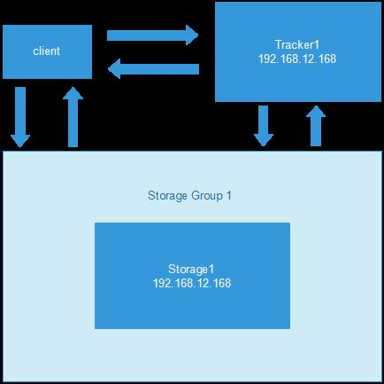

#### 5.6.2. 安装FastDFS

安装详见【`\07-编程工具资料\03-Java相关框架+源代码\FastDFS【分布式文件系统】\文档\Linux安装FastDFS.docx`】

## 6. 使用图片服务器（pyg-test工程）

### 6.1. 添加依赖

学习使用FastDFS需要有对应的Java客户端来支持；而遗憾的是FastDFS的作者没有把FastDFS的依赖放置到maven中央仓库提供下载；但可以自行导入项目并安装，然后再引用它。

将【\07-编程工具资料\03-Java相关框架+源代码\FastDFS【分布式文件系统】\java客户端\fastdfs-client】复制到开发的工作空间pyg-test下。具体如下：

配置pyg-test的pom.xml：

```xml
<module>fastdfs-client</module>
```

使用install命令，安装fastdfs-client到本地仓库

### 6.2. 创建fastdfs-test工程，初始化相关配置

#### 6.2.1. FastDFS依赖

创建fastdfs-test工程，pom.xml依赖信息如下：

```xml
<?xml version="1.0" encoding="UTF-8"?>
<project xmlns="http://maven.apache.org/POM/4.0.0" xmlns:xsi="http://www.w3.org/2001/XMLSchema-instance"
         xsi:schemaLocation="http://maven.apache.org/POM/4.0.0 http://maven.apache.org/xsd/maven-4.0.0.xsd">
    <parent>
        <artifactId>pyg-test</artifactId>
        <groupId>com.moon</groupId>
        <version>1.0-SNAPSHOT</version>
    </parent>
    <modelVersion>4.0.0</modelVersion>
    <artifactId>fastdfs-test</artifactId>

    <dependencies>
        <!-- fastdfs-client -->
        <dependency>
            <groupId>org.csource</groupId>
            <artifactId>fastdfs-client</artifactId>
            <version>1.25-RELEASE</version>
        </dependency>
    </dependencies>
</project>
```

#### 6.2.2. 配置tracker server地址

新增`src/test/resources/fastdfs_client.conf`文件，配置内容：

```conf
# 配置追踪服务器连接地址
tracker_server=192.168.12.131:22122
```

注：key的值是固定的：【tracker_server】，value值是分布式文件系统服务器的地址

### 6.3. 文件上传、下载、删除测试

#### 6.3.1. 开启fastDFS文件系统

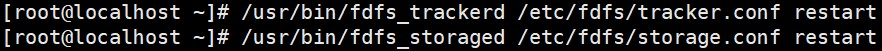

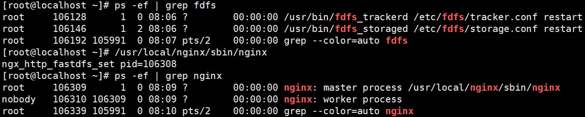

#### 6.3.2. 文件上传测试

```java
/*文件上传(FastDFS)*/
@Test
public void uploadFile() throws Exception {
    // 1.获取配置文件的绝对路径
    String conf_fileName = this.getClass().getResource("/fastdfs_client.conf").getPath();

    // 2.初始化客户端全局对象，ClientGlobal.init(conf)
    ClientGlobal.init(conf_fileName);

    // 3.创建存储客户端（StorageClient）
    StorageClient storageClient = new StorageClient();

    /**
     * 4.调用storageClient的upload_file()方法上传图片到FastDFS
     *		String[] upload_file(String local_filename,
     *			String file_ext_name, NameValuePair[] meta_list)
     *		参数1：本地上传的文件绝对路径
     *		参数2：文件的后缀名
     *		参数3：meta类型数组
     *	 返回值：
     *	 	数组中第一个元素：组名
     *	 	数组中第二个元素: 远程文件名称
     *	 eg:
     *		[group1, M00/00/01/wKgMg1rZMgmABmtgAADAF9g7nmg300.png]
     *		http://192.168.12.131/group1/M00/00/01/wKgMg1rZMgmABmtgAADAF9g7nmg300.png
     */
    String[] arr = storageClient.upload_file("E:\\123.jpg", "jpg", null);
    System.out.println(Arrays.toString(arr));
}
```

测试访问地址：http://192.168.12.131/group1/M00/00/01/wKgMg1xIKfGAaS6JAACq8qaZ-jA965.jpg

#### 6.3.3. 文件下载测试

```java
/*文件下载(FastDFS)*/
@Test
public void downloadFile() throws Exception {
    // 1.获取配置文件的绝对路径
    String conf_fileName = this.getClass().getResource("/fastdfs_client.conf").getPath();

    // 2.初始化客户端全局对象，ClientGlobal.init(conf)
    ClientGlobal.init(conf_fileName);

    // 3.创建存储客户端（StorageClient）
    StorageClient storageClient = new StorageClient();

    /**
     * 4.从FastDFS下载文件
     * 	byte[] download_file(String group_name, String remote_filename)
     *		参数1：文件系统需要下载的文件存储的组名
     *		参数2：需要下载的远程文件名称
     */
    byte[] data = storageClient.download_file("group1", "M00/00/01/wKgMg1xIKfGAaS6JAACq8qaZ-jA965.jpg");
    System.out.println("字节数组的长度：" + data.length);
    // 使用字节输出流输入文件到本地
    FileOutputStream os = new FileOutputStream("E:\\1.jpg");
    os.write(data);
    os.flush();
    os.close();
}
```

#### 6.3.4. 文件删除测试

```java
/*删除文件(FastDFS)*/
@Test
public void deleteFile() throws Exception {
    // 1.获取配置文件的绝对路径
    String conf_fileName = this.getClass().getResource("/fastdfs_client.conf").getPath();

    // 2.初始化客户端全局对象，ClientGlobal.init(conf)
    ClientGlobal.init(conf_fileName);

    // 3.创建存储客户端（StorageClient）
    StorageClient storageClient = new StorageClient();

    /**
     * 4.从FastDFS上删除指定文件
     * 	int delete_file(String group_name, String remote_filename)
     * 		参数1：文件系统需要下载的文件存储的组名
     *		参数2：需要下载的远程文件名称
     */
    int result = storageClient.delete_file("group1", "M00/00/01/wKgMg1xIKfGAaS6JAACq8qaZ-jA965.jpg");
    System.out.println("返回的结果：" + result);
}
```

再次访问上次的url，会出现404页面

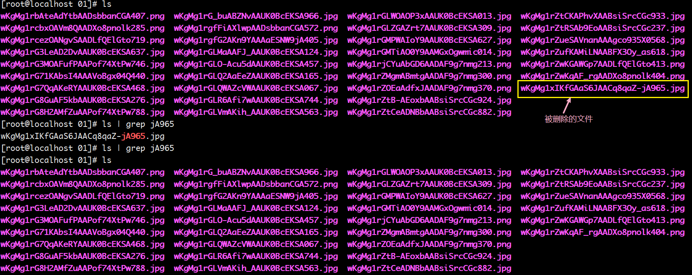

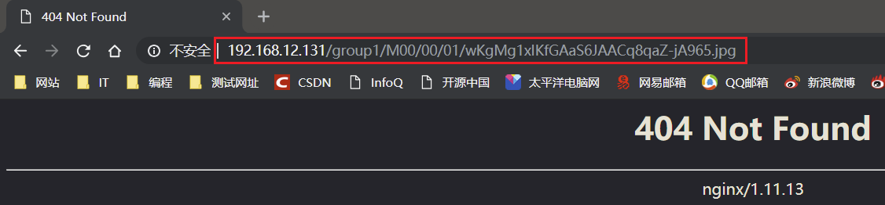

### 6.4. 上传、下载、删除步骤小结

#### 6.4.1. 上传步骤

1. 加载tracker server的配置文件地址，配置文件为tracker server的地址；在这里设置了`tracker_server=192.168.12.131:22122`
2. 获取配置文件的绝对路径
	- `this.getClass().getResource("conf相对路径名").getPath()`
3. 初始化客户端全局信息`ClientGlobal.init(conf)`
4. 创建存储客户端StorageClient
5. 调用storageClient的`upload_file()`方法上传图片

```java
/**
        参数1：本地上传的文件绝对路径
        参数2：文件的后缀名
        参数3：meta类型数组
	返回值：
        数组中第一个元素：组名
        数组中第二个元素: 远程文件名称
*/
String[] upload_file(String local_filename, String file_ext_name, NameValuePair[] meta_list)
```

6. 解析并获取上传结果，返回组名和文件的相对路径

#### 6.4.2. 下载步骤

1~4. 与上传步骤一样

5. 调用storageClientr的`download_file()`方法，获取文件的字节码数组

```java
/**
    参数1：文件系统需要下载的文件存储的组名
    参数2：需要下载的远程文件名称
    返回值：文件的字节码数组
*/
byte[] download_file(String group_name, String remote_filename)
```

6. 使用文件输出流，将字节数组写入到本地

#### 6.4.3. 删除步骤

1~4. 与上传步骤一样

5. 调用storageClientr的`delete_file()`方法，获取文件的字节码数组

```java
/**
    参数1：文件系统需要下载的文件存储的组名
    参数2：需要下载的远程文件名称
    返回值：操作成功返回个数
*/
int delete_file(String group_name, String remote_filename)
```

## 7. 商家后台-商品录入【商品图片上传】

### 7.1. 需求分析

在商品录入界面实现多图片上传。当用户点击新建按钮，弹出上传窗口。

### 7.2. 相关配置

#### 7.2.1. 配置依赖

pinyougou-shop-web工程pom.xml引入依赖

```xml
<!-- fastdfs-client -->
<dependency>
    <groupId>org.csource</groupId>
    <artifactId>fastdfs-client</artifactId>
</dependency>
<!-- commons-fileupload -->
<dependency>
    <groupId>commons-fileupload</groupId>
    <artifactId>commons-fileupload</artifactId>
</dependency>
```

#### 7.2.2. 配置文件

1. 将“fastdfs-test”工程中的`fastdfs_client.conf`文件拷贝到pinyougou-shop-web工程`src/main/resources`目录下。

```conf
# 配置追踪服务器连接地址
tracker_server=192.168.12.131:22122
```

2. 在pinyougou-shop-web工程中`application.properties`添加配置

```properties
# 配置文件服务器的访问地址
fileServerUrl=http://192.168.12.131
```

3. 在pinyougou-shop-web工程`pinyougou-shop-web-servlet.xml`添加配置文件上传解析器

```xml
<!-- 配置加载属性文件 -->
<context:property-placeholder location="classpath:application.properties"/>

<!-- 配置文件上传解析器，id必须是固定的multipartResolver -->
<bean id="multipartResolver"
      class="org.springframework.web.multipart.commons.CommonsMultipartResolver">
    <!-- 配置文件上传默认编码 -->
    <property name="defaultEncoding" value="UTF-8"/>
    <!-- 配置文件上传的大小 2MB -->
    <property name="maxUploadSize" value="2097152"/>
</bean>
```

**注：配置文件上传解析器时，id必须是固定的multipartResolver**

### 7.3. 文件上传-后端控制层

#### 7.3.1. 实现步骤

1. 使用MultipartFile接收表单提交的文件
2. 定义`Map<String, Object>`集合封装返回数据，返回响应的状态码（成功200，失败500）
3. 获取`fastdfs_client.conf`，得到它的绝对路径
4. 初始化客户端全局对象`ClientGlobal.init(con_filename)`
5. 创建存储客户端对象StorageClient
6. 上传文件到FastDFS文件服务器
    - 使用commons IO工具包`FilenameUtils`的`getExtension()`方法获取文件的后缀名
    - `multipartFile.getOriginalFilename()`获取上传的文件全名
    - `multipartFile.getBytes()`获取上传的字节码数组
7. 返回状态与上传图片的url


#### 7.3.2. 后端代码

在pinyougou-shop-web新建UploadController.java

```java
/**
 * 文件上传的控制器
 */
@RestController
public class UploadController {

    /*
     * 注入文件服务器访问路径
     *     @Value:注入基本数据类型和String类型数据的
     *           value属性中，可以写Spring的el表达式
     */
    @Value("${fileServerUrl}")
    private String fileServerUrl;

    /**
     * 文件上传，使用表单上传文件，所以使用PostMapping
     *
     * @param multipartFile 使用MultipartFile接收表单提交的文件
     * @return 返回响应的状态码（成功200，失败500）
     */
    @PostMapping("/upload")
    // 1. 使用MultipartFile接收表单提交的文件
    public Map<String, Object> upload(@RequestParam("file") MultipartFile multipartFile) {
        // 2. 定义Map集合封装响应数据(状态码和图片url)
        Map<String, Object> data = new HashMap<String, Object>(2);
        // 初始返回的状态码
        data.put("status", 500);

        try {
            // 3. 获取fastdfs_client.conf，得到它的绝对路径
            String con_filename = this.getClass().getResource("/fastdfs_client.conf").getPath();

            // 4. 初始化客户端全局对象
            ClientGlobal.init(con_filename);

            // 5. 创建存储客户端对象
            StorageClient storageClient = new StorageClient();

            /*
             * 6.1 获取上传文件的后缀名
             *      使用apache IO工具包FilenameUtils的getExtension()方法获取文件的后缀名
             *      multipartFile.getOriginalFilename()获取上传的文件全名
             */

            String suffix = FilenameUtils.getExtension(multipartFile.getOriginalFilename());

            /*
             * 6.2 上传文件到FastDFS文件服务器
             *      multipartFile.getBytes()获取上传的字节码数组
             */
            String[] arr = storageClient.upload_file(multipartFile.getBytes(), suffix, null);

            /*
             * 7. 定义StringBuilder拼接图片的访问路径
             *    eg:
             *		返回的数组：[group1, M00/00/01/wKgMg1rZMgmABmtgAADAF9g7nmg300.png]
             *		需要拼接：http://192.168.12.131/group1/M00/00/01/wKgMg1rZMgmABmtgAADAF9g7nmg300.png
             */
            StringBuilder url = new StringBuilder(fileServerUrl);
            for (String str : arr) {
                url.append("/" + str);
            }

            // 上传成功返回200状态码
            data.put("status", 200);
            // 返回上传图片的url
            data.put("url", url.toString());
        } catch (Exception e) {
            e.printStackTrace();
        }
        return data;
    }
}
```

### 7.4. 文件上传-前端部分

#### 7.4.1. 创建uploadService.js服务层

- anjularjs对于post和get请求默认的Content-Type header 是application/json。通过设置‘Content-Type’: undefined，这样浏览器会帮我们把Content-Type 设置为 multipart/form-data.
- 设置 transformRequest : angular.identity，anjularjs transformRequest function 将序列化我们的formdata object
- 在pinyougou-shop-web工程创建服务层uploadService.js

```js
/* 定义文件上传服务层js代码 */
app.service('uploadService', function ($http) {
    /* 文件上传的方法 */
    this.uploadFile = function () {
        // 创建FormData对象封装文件的二进制数据
        var formData = new FormData();
        // 追加上传的文件
        formData.append('file', file.files[0]);
        // 发送异步请求上传文件
        return $http({
            method: 'post', // 请求方式
            url: '/upload', // 请求url地址
            data: formData, // 请求参数，文件的二进制数据
            headers: {"Content-Type": undefined}, // 配置请求头指定:内容类型，采用表单
            transformRequest: angular.identity  // 配置转换对象
        });
    };
});
```

- 将uploadService服务注入到goodsController.js中

```js
app.controller('goodsController', function ($scope, $controller, baseService, uploadService) {
    ......
}
```

- 在goods_edit.html引入uploadService.js

```html
<script src="/js/service/uploadService.js"></script>
```

#### 7.4.2. 前端控制层上传图片方法

- goodsController增加上传图片的方法

```js
/* 定义文件上传方法 */
$scope.uploadFile = function () {
    uploadService.uploadFile().then(function (response) {
        // 判断响应的状态码
        if (response.data.status === 200) {
            // 上传文件成功，获取响应的文件访问url
            $scope.image_entity.url = response.data.url;
        } else {
            alert('上传失败')
        }
    });
};
```

- goods_edit.html，给新建按键点击事件，初始化图片对象

```html
<!-- 颜色图片 -->
<div class="btn-group">
	<button type="button" class="btn btn-default" title="新建"
            data-target="#uploadModal" data-toggle="modal"
            ng-click="image_entity = {}">
		<i class="fa fa-file-o"></i> 新建
	</button>
</div>
```

- 修改图片上传窗口，绑定输入框的值；给保存按钮绑定点击事件调用上传方法；绑定图片上传后返回的url，回显上传图片

```html
<table class="table table-bordered table-striped">
    <tr>
        <td>颜色</td>
        <td><input class="form-control" placeholder="颜色"
                    ng-model="image_entity.color"></td>
    </tr>
    <tr>
        <td>商品图片</td>
        <td>
            <table>
                <tr>
                    <td>
                        <input type="file" id="file" />
                        <button class="btn btn-primary" type="button"
                                ng-click="uploadFile();">上传
                        </button>
                    </td>
                    <td>
                        
                    </td>
                </tr>
            </table>
        </td>
    </tr>
</table>
```

#### 7.4.3. 前端图片列表显示

- goods_edit.html，修改上传窗口的保存按钮绑定点击事件，调用方法，将上传的文件对象放到一个数组中

```html
<button class="btn btn-success" data-dismiss="modal"
        ng-click="add_image_entity();"
        aria-hidden="true">保存</button>
```

- 在goodsController.js增加添加图片对象到数组的方法

```js
/* 定义数据存储实体结构 */
$scope.goods = {goodsDesc: {itemImages: []}};
/* 定义添加图片的方法 */
$scope.add_image_entity = function () {
    // 判断是否有上传图片成功
    if (!$scope.image_entity.url) {
        // 没有上传图片，不能保存
        alert("请上传文件后再点击保存")
        return;
    }

    // 将上传后的图片对象放到goods对象中
    $scope.goods.goodsDesc.itemImages.push($scope.image_entity);
};
```

- 在页面上遍历图片列表

```html
<tbody>
	<tr ng-repeat="item in goods.goodsDesc.itemImages">
		<td>{{ item.color }}</td>
		<td>
		</td>
		<td>
			<button type="button" class="btn btn-default" title="删除">
				<i class="fa fa-trash-o"></i> 删除
			</button>
		</td>
	</tr>
</tbody>
```

### 7.5. 删除图片（增加删除文件服务器部分）

原来教程只将图片从前端显示列表中移除，没有真正删除服务器上的文件。这里增加删除文件服务器的操作功能

#### 7.5.1. 上传图片时增加部分代码

- 在UploadController的upload方法中，增加返回文件存储的组名与文件名

```java
// 上传成功返回200状态码
data.put("status", 200);
// 返回上传图片的url
data.put("url", url.toString());
// 将返回的组与文件返回到前端，用删除文件服务器的文件
data.put("group", arr[0]);
data.put("fileName", arr[1]);
```

- 前端goodsController的uploadFile方法，请求响应增加接收组名与文件名

```js
// 上传文件成功，获取响应的文件访问url
$scope.image_entity.url = response.data.url;
// 获取文件存储的组名与文件名
$scope.image_entity.group = response.data.group;
$scope.image_entity.fileName = response.data.fileName;
```

#### 7.5.2. 文件删除-后端控制层部分

- 在UploadController中增加删除文件的方法（为了方便，不想新增多的controller）

```java
/**
 * 删除文件服务器的指定文件
 *
 * @param map 封装删除的文件所在的组名与文件名的map集合
 * @return 成功/失败标识
 */
@PostMapping("/deleteFile")
public boolean deleteFile(@RequestBody Map<String, Object> map) {

    try {
        // 获取请求参数
        if (!map.containsKey("group") || !map.containsKey("fileName")) {
            // 两个参数都必须上送
            return false;
        }

        String group = map.get("group").toString();
        String fileName = map.get("fileName").toString();

        if (StringUtils.isBlank(group) || StringUtils.isBlank(fileName)) {
            // 两个参数都不能为空
            return false;
        }

        // 1. 获取fastdfs_client.conf，得到它的绝对路径
        String conf_fileName = this.getClass().getResource("/fastdfs_client.conf").getPath();

        // 2. 初始化客户端全局对象
        ClientGlobal.init(conf_fileName);

        // 3. 创建存储客户端对象
        StorageClient storageClient = new StorageClient();

        // 4. 从FastDFS上删除指定文件
        int result = storageClient.delete_file(group, fileName);
        return true;

    } catch (Exception e) {
        e.printStackTrace();
    }
    return false;
}
```

#### 7.5.3. 文件删除-前端代码

- goodsController.js增加删除图片的方法

```js
/* 定义删除图片的方法 */
$scope.remove_image_entity = function (index) {
    // 获取要删除的图片对象
    var image = $scope.goods.goodsDesc.itemImages[index];

    // 发送post请求后端删除文件
    baseService.sendPost("/deleteFile", {
        group: image.group,
        fileName: image.fileName
    }).then(function (response) {
        // 获取返回标识
        if (response.data) {
            alert("删除文件成功");
            // 将指定的图片从good对象的itemImages数组中移除
            $scope.goods.goodsDesc.itemImages.splice(index, 1);
        } else {
            alert("删除文件失败");
        }
    });
};
```

- goods_edit.html页面给删除按钮绑定点击事件，调用删除图片方法

```html
<button type="button" class="btn btn-default" title="删除"
        ng-click="remove_image_entity($index);">
	<i class="fa fa-trash-o"></i> 删除
</button>
```
