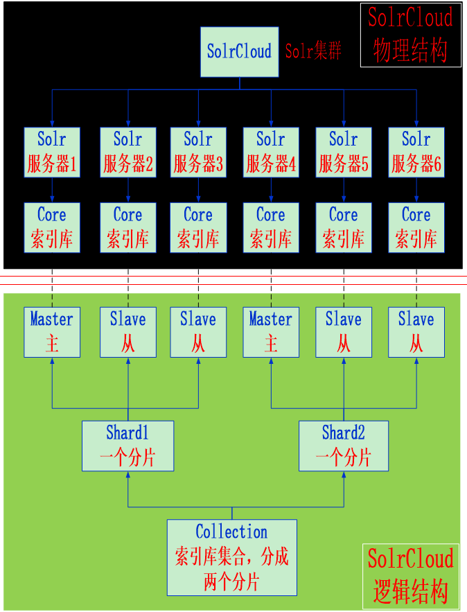
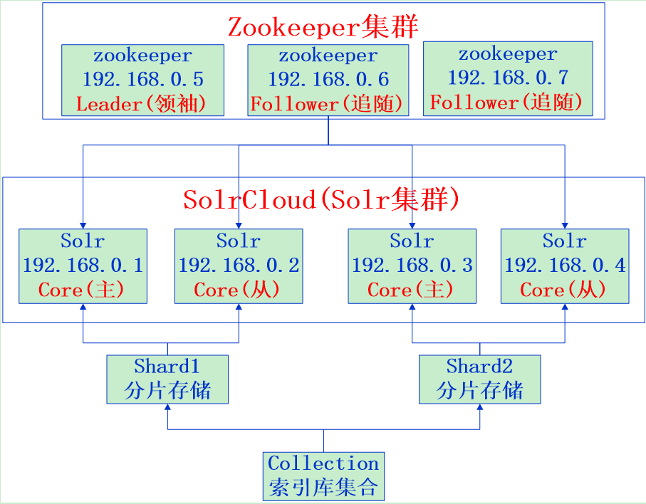

# Day10 搜索解决方案（一）-SpringDataSolr

## 1. Solr安装与配置

### 1.1. 什么是Solr

大多数搜索引擎应用都必须具有某种搜索功能，问题是搜索功能往往是巨大的资源消耗并且它们由于沉重的数据库加载而拖垮你的应用的性能。

这就是为什么转移负载到一个外部的搜索服务器是一个不错的主意，Apache Solr是一个流行的开源搜索服务器，它通过使用类似REST的HTTP API，这就确保你能从几乎任何编程语言来使用solr。

Solr是一个开源搜索平台，用于构建搜索应用程序。 它建立在Lucene(全文搜索引擎)之上。 Solr是企业级的，快速的和高度可扩展的。 使用Solr构建的应用程序非常复杂，可提供高性能。

为了在CNET网络的公司网站上添加搜索功能，Yonik Seely于2004年创建了Solr。并在2006年1月，它成为Apache软件基金会下的一个开源项目。并于2016年发布最新版本Solr 6.0，支持并行SQL查询的执行。

Solr可以和Hadoop一起使用。由于Hadoop处理大量数据，Solr帮助我们从这么大的源中找到所需的信息。不仅限于搜索，Solr也可以用于存储目的。像其他NoSQL数据库一样，它是一种非关系数据存储和处理技术。

总之，Solr是一个可扩展的，可部署，搜索/存储引擎，优化搜索大量以文本为中心的数据。

### 1.2. Solr安装

#### 1.2.1. Linux安装单机版Solr

参考安装文档：\Java编程工具资料\Java源代码\Apache Lucene&solr\Solr相关资料（项目2）\Linux安装单机版Solr.docx

#### 1.2.2. Linux安装集群版Solr

参考安装文档：\Java编程工具资料\Java源代码\Apache Lucene&solr\Solr相关资料（项目2）\Linux安装集群版Solr.docx

## 2. 中文分析器IK Analyzer

### 2.1. IK Analyzer简介

IK Analyzer是一个开源的，基于java语言开发的轻量级的中文分词工具包。从2006年12月推出1.0版开始，IKAnalyzer已经推出了4个大版本。最初，它是以开源项目Luence为应用主体的，结合词典分词和文法分析算法的中文分词组件。从3.0版本开始，IK发展为面向Java的公用分词组件，独立于Lucene项目，同时提供了对Lucene的默认优化实现。在2012版本中，IK实现了简单的分词歧义排除算法，标志着IK分词器从单纯的词典分词向模拟语义分词衍化。

### 2.2. IK Analyzer配置

- 配置步骤：
    1. 把IKAnalyzer2012FF_u1.jar 添加到 solr 应用lib 目录下
    2. 把扩展词典、停用词词典、配置文件放到 solr 应用WEB-INF/classes 目录下。
    3. 修改schema.xml 文件，配置一个 FieldType，使用 IKAnalyzer

```xml
<fieldType name="text_ik" class="solr.TextField">
	<!-- 配置分词器 -->
	<analyzer class="org.wltea.analyzer.lucene.IKAnalyzer"/>
</fieldType>
```

### 2.3. 配置域

- 域相当于数据库的表字段，用户存放数据，因此用户根据业务需要去定义相关的Field（域），一般来说，每一种对应着一种数据，用户对同一种数据进行相同的操作。
- 域的常用属性：
    - `name`：指定域的名称
    - `type`：指定域的类型
    - `indexed`：是否索引
    - `stored`：是否存储
    - `required`：是否必须
    - `multiValued`：是否多值

#### 2.3.1. 域

修改solrhome的schema.xml文件，设置业务系统 Field

```xml
<field name="id" type="long" indexed="true" stored="true" required="true"/>
<field name="goodsId" type="long" indexed="true" stored="true"/>
<field name="title" type="text_ik" indexed="true" stored="true"/>
<field name="price" type="double" indexed="true" stored="true"/>
<field name="image" type="string" indexed="false" stored="true"/>
<field name="category" type="string" indexed="true" stored="true"/>
<field name="seller" type="text_ik" indexed="true" stored="true"/>
<field name="brand" type="string" indexed="true" stored="true"/>
<field name="updateTime" type="date" indexed="true" stored="true"/>
```

#### 2.3.2. 复制域

复制域的作用在于将某一个Field中的数据复制到另一个域中

```xml
<field name="keywords" type="text_ik" indexed="true"
       stored="false" multiValued="true"/>
<copyField source="title" dest="keywords"/>
<copyField source="category" dest="keywords"/>
<copyField source="seller" dest="keywords"/>
<copyField source="brand" dest="keywords"/>
```

#### 2.3.3. 动态域

当需要动态扩充字段时，需要使用动态域。对于品优购，规格的值是不确定的，所以需要使用动态域来实现。需要实现的效果如下

```xml
<dynamicField name="spec_*" type="string" indexed="true" stored="true"/>
```

#### 2.3.4. 主键

```xml
<!-- 唯一的key主键 -->
<uniqueKey>id</uniqueKey>
```

### 2.4. 配置solrconfig.xml
1. 注释所有的`<lib />`标签

```xml
<!-- <lib path="../a-jar-that-does-not-exist.jar" /> -->
```

2. 修改`<str name="df">field的名称</str>`

```xml
<requestHandler name="/select" class="solr.SearchHandler">
	   <lst name="defaults">
	       <str name="echoParams">explicit</str>
	       <int name="rows">10</int>
	       <str name="df">title</str>
	   </lst>
......
</requestHandler>
```

3. `<uniqueKey>id</uniqueKey>`：id不是String类型，注释以下内容：

```xml
<!--
<searchComponent name="elevator"
	       class="solr.QueryElevationComponent" >
		<str name="queryFieldType">string</str>
		<str name="config-file">elevate.xml</str>
</searchComponent> -->
```

## 3. SolrCloud简介

SolrCloud(solr云)是Solr提供的分布式搜索方案，当你需要大规模，容错，分布式索引和检索能力时使用SolrCloud。当一个系统的索引数据量少的时候是不需要使用SolrCloud的，当索引量很大，搜索请求并发很高，这时需要使用SolrCloud来满足这些需求。

SolrCloud是基于Solr和Zookeeper的分布式搜索方案，它的主要思想是使用Zookeeper作为集群的配置信息中心与协调服务中心。

- 它有几个特色功能：
    1. 集中式的配置信息
    2. 自动容错
    3. 实时搜索
    4. 查询时自动负载均衡

### 3.1. Zookeeper简介

Apache Hbase和Apache Solr的分布式集群都用到了zookeeper；<font color="red">***zookeeper是一个分布式的、开源的程序协调服务***</font>，是hadoop项目下的一个子项目。

### 3.2. Zookeeper功能

#### 3.2.1. 配置管理

在我们的应用中除了代码外，还有一些就是各种配置文件。比如数据库连接等。一般我们都是使用配置文件的方式，在代码中引入这些配置文件。但是当我们只有一种配置，只有一台服务器，并且不经常修改的时候，使用配置文件是一个很好的做法，但是如果我们配置非常多，有很多服务器都需要这个配置，而且还可能是动态的话使用配置文件就不是个好主意了。这个时候往往需要寻找一种集中管理配置的方法，我们在这个集中的地方修改了配置，所有对这个配置感兴趣的都可以获得变更。比如我们可以把配置放在数据库里，然后所有需要配置的服务都去这个数据库读取配置。但是，因为很多服务的正常运行都非常依赖这个配置，所以需要这个集中提供配置服务的服务具备很高的可靠性。一般我们可以用一个集群来提供这个配置服务，但是用集群提升可靠性，那如何保证配置在集群中的一致性呢？ 这个时候就需要使用一种实现了一致性协议的服务了。Zookeeper就是这种服务，它使用Zab这种一致性协议来提供一致性。现在有很多开源项目使用Zookeeper来维护配置，比如在HBase中，客户端就是连接一个Zookeeper，获得必要的HBase集群的配置信息，然后才可以进一步操作。还有在开源的消息队列Kafka中，也使用Zookeeper来维护broker的信息。在Alibaba开源的SOA框架Dubbo中也广泛的使用Zookeeper管理一些配置来实现服务治理。

#### 3.2.2. 名字服务

比如为了通过网络访问一个系统，我们需知道对方的IP地址，但是IP地址对人非常不友好，这个时候我们就需要使用域名来访问。但是计算机是不能识别域名的。怎么办呢？如果我们每台机器里都备有一份域名到IP地址的映射，这个倒是能解决一部分问题，但是如果域名对应的IP发生变化了又该怎么办呢？于是我们有了DNS这个东西。我们只需要访问一个大家熟知的(known)的点，它就会告诉你这个域名对应的IP是什么。在我们的应用中也会存在很多这类问题，特别是在我们的服务特别多的时候，如果我们在本地保存服务的地址的时候将非常不方便，但是如果我们只需要访问一个大家都熟知的访问点，这里提供统一的入口，那么维护起来将方便得多了。

#### 3.2.3. 分布式锁

Zookeeper是一个分布式协调服务。这样我们就可以利用Zookeeper来协调多个分布式进程之间的活动。比如在一个分布式环境中，为了提高可靠性，我们的集群的每台服务器上都部署着同样的服务。但是，一件事情如果集群中的每个服务器都进行的话，那相互之间就要协调，编程起来将非常复杂。而如果我们只让一个服务进行操作，那又存在单点。通常还有一种做法就是使用分布式锁，在某个时刻只让一个服务去干活，当这台服务出问题的时候锁释放，立即fail over到另外的服务。这在很多分布式系统中都是这么做，这种设计有一个更好听的名字叫Leader Election(leader选举)。比如HBase的Master就是采用这种机制。但要注意的是分布式锁跟同一个进程的锁还是有区别的，所以使用的时候要比同一个进程里的锁更谨慎的使用。

#### 3.2.4. 集群管理

在分布式的集群中，经常会由于各种原因，比如硬件故障，软件故障，网络问题，有些节点会进进出出。有新的节点加入进来，也有老的节点退出集群。这个时候，集群中其他机器需要感知到这种变化，然后根据这种变化做出对应的决策。比如我们是一个分布式存储系统，有一个中央控制节点负责存储的分配，当有新的存储进来的时候我们要根据现在集群目前的状态来分配存储节点。这个时候我们就需要动态感知到集群目前的状态。还有，比如一个分布式的SOA架构中，服务是一个集群提供的，当消费者访问某个服务时，就需要采用某种机制发现现在有哪些节点可以提供该服务(这也称之为服务发现，比如Alibaba开源的SOA框架Dubbo就采用了Zookeeper作为服务发现的底层机制)。还有开源的Kafka队列就采用了Zookeeper作为Consumer的上下线管理。

### 3.3. SolrCloud结构

SolrCloud为了降低单机的处理压力，需要由多台服务器共同来完成索引和搜索任务。实现的思路是将索引数据进行Shard（分片）拆分，每个分片由多台的服务器共同完成，当一个索引或搜索请求过来时会分别从不同的Shard的服务器中操作索引。

SolrCloud需要Solr基于Zookeeper部署，由于SolrCloud需要由多台服务器组成，由zookeeper来进行协调管理。



#### 3.3.1. 物理结构

六台Solr物理机服务器（ 每台服务器包括一个solr core(solr应用服务器 包括完整的索引和搜索)），组成一个SolrCloud。

#### 3.3.2. 逻辑结构

索引集合包括两个Shard（shard1和shard2），shard1和shard2分别由三个Core（solr应用服务器(tomcat)）组成，其中一个Master(主)两个Slave(从)，zookeeper控制每个shard上三个Core的索引数据一致，解决高可用问题。用户发起索引请求分别从shard1和shard2上获取，解决高并发问题。

1. Collection

Collection在SolrCloud集群中是一个<font color="red">***逻辑意义***</font>上的完整的索引结构。它常常被划分为一个或多个Shard（分片），它们使用相同的配置信息。

比如：针对商品信息搜索可以创建一个collection。

> collection = shard1 + shard2 + .... + shardX

2. Core

每个Core是Solr中一个独立运行单位，提供索引和搜索服务。一个shard需要由一个Core或多个Core组成。由于collection可由多个shard组成，所以collection一般由多个core组成。

3. Master/Slave

Master是master-slave结构中的主节点（通常说主服务器），Slave是master-slave结构中的从节点（通常说从服务器或备服务器）。同一个Shard下master和slave存储的数据是一致的，这是为了达到高可用目的。

4. Shard

Collection的逻辑分片

### 3.4. SolrCloud搭建架构分析

#### 3.4.1. SolrCloud构架图



#### 3.4.2. 两大组成部分

1. zookeeper集群
    1. zookeeper需要保证高可用，需要搭建集群
    2. zookeeper需要进行投票和选举机制，最少需要三个节点
    3. zookeeper的三个节点，注意修改端口号不一样
2. Solr集群
    1. 需要四个节点（solr应用服务器）
    2. 四台tomcat部署4个 solr应用服务器
    3. 整个collection分成两个分片，每个分片都由两个服务器组成，master和slave

具体搭建详见《Linux安装集群版Solr.docx》

输入测试: http://192.168.12.131:8081/solr/


## 4. Spring Data Solr入门

### 4.1. Spring Data Solr简介

Spring Data Solr就是为了方便Solr的开发所研制的一个框架，其底层是对SolrJ（官方API）的封装。

### 4.2. Spring Data Solr入门Demo

#### 4.2.1. 搭建Maven工程

在pyg-test项目中创建maven工程spring-data-solr-test，在pom.xml中引入依赖

```xml
<dependencies>
    <dependency>
        <groupId>org.springframework.data</groupId>
        <artifactId>spring-data-solr</artifactId>
        <version>1.5.6.RELEASE</version>
    </dependency>
    <dependency>
        <groupId>org.springframework</groupId>
        <artifactId>spring-test</artifactId>
        <version>4.3.10.RELEASE</version>
    </dependency>
</dependencies>
```

#### 4.2.2. 创建Item实体类

创建`com.moon.pojo`包，将品优购的Item实体类拷入本工程，属性使用@Field注解标识，如果属性与配置文件定义的域名称不一致，需要在注解中指定域名称。

<font color="red">***注意：price属性与数据库字段相对应，需要设置成BigDecimal，再将其转成double***</font>

```java
public class Item implements Serializable {
	@Field
	private Long id;
	@Field("title")
	private String title;
	@Field("price")
	private double price;
	@Field("image")
	private String image;
	@Field("goodsId")
	private Long goodsId;
	@Field("category")
	private String category;
	@Field("brand")
	private String brand;
	@Field("seller")
	private String seller;
	@Field("updateTime")
	private Date updateTime;

    public void setPrice(BigDecimal price) {
		this.price = price.doubleValue();
	}
    ......
}
```

### 4.3. 操作Solr单机版

- 在src/main/resources下创建applicationContext-solr.xml

```xml
<?xml version="1.0" encoding="UTF-8"?>
<beans xmlns="http://www.springframework.org/schema/beans"
       xmlns:xsi="http://www.w3.org/2001/XMLSchema-instance"
       xmlns:solr="http://www.springframework.org/schema/data/solr"
       xsi:schemaLocation="http://www.springframework.org/schema/beans
       http://www.springframework.org/schema/beans/spring-beans.xsd
       http://www.springframework.org/schema/data/solr
       http://www.springframework.org/schema/data/solr/spring-solr.xsd">

    <!-- ################# 配置Solr单机版 ############### -->
    <solr:solr-server id="solrServer"
                      url="http://192.168.12.131:8088/solr/collection1"/>

    <!-- 配置SolrTemplate对象，该对象就可以对Solr索引库做CRUD操作 -->
    <bean id="solrTemplate" class="org.springframework.data.solr.core.SolrTemplate">
        <constructor-arg name="solrServer" ref="solrServer"/>
    </bean>

</beans>
```

- 创建测试类Solr01Test.java

```java
@RunWith(SpringJUnit4ClassRunner.class)
@ContextConfiguration(locations = "classpath:applicationContext-solr.xml")
public class Solr01Test {

	/*注入solrTemplate操作对象*/
	@Autowired
	private SolrTemplate solrTemplate;

	/*添加或修改索引*/
	@Test
	public void saveOrUpdate() {
		// 创建商品对象
		Item item = new Item();
		item.setId(4L);
		item.setBrand("华为");
		item.setCategory("手机");
		item.setGoodsId(1L);
		item.setSeller("华为2号专卖店");
		item.setTitle("华为Mate9");
		item.setPrice(new BigDecimal(2000));
		item.setUpdateTime(new Date());

		// 添加或修改
		UpdateResponse response = solrTemplate.saveBean(item);
		// 判断返回的响应状态码，如果成功则返回0
		if (response.getStatus() == 0) {
			solrTemplate.commit();
		} else {
			solrTemplate.rollback();
		}
	}

	/*根据主键id删除索引*/
	@Test
	public void delete() {
		// 根据id删除
		UpdateResponse response = solrTemplate.deleteById("3");
		// 判断返回的响应状态码，如果成功则返回0
		if (response.getStatus() == 0) {
			solrTemplate.commit();
		} else {
			solrTemplate.rollback();
		}
	}

	/*删除全部索引*/
	@Test
	public void deleteAll() {
		// 创建查询对象
		Query query = new SimpleQuery("*:*");
		// 删除全部
		UpdateResponse response = solrTemplate.delete(query);
		// 判断返回的响应状态码，如果成功则返回0
		if (response.getStatus() == 0) {
			solrTemplate.commit();
		} else {
			solrTemplate.rollback();
		}
	}

	/*批量添加*/
	@Test
	public void saveAll() {
		// 创建多个商品的集合
		List<Item> items = new ArrayList<Item>();
		for (long i = 1; i <= 100; i++) {
			Item item = new Item();
			item.setId(i);
			item.setBrand("华为" + i);
			item.setCategory("手机" + i);
			item.setGoodsId(1L);
			item.setSeller("华为2号专卖店");
			item.setTitle("华为Mate9" + i);
			item.setPrice(new BigDecimal(2000));
			item.setUpdateTime(new Date());
			items.add(item);
		}
		// 批量添加或者修改
		UpdateResponse response = solrTemplate.saveBeans(items);
		// 判断返回的响应状态码，如果成功则返回0
		if (response.getStatus() == 0) {
			solrTemplate.commit();
		} else {
			solrTemplate.rollback();
		}
	}

	/*根据主键id查询*/
	@Test
	public void findOne() {
		// 通过主键查询
		Item item = solrTemplate.getById(1L, Item.class);
		System.out.println(item.getTitle() + "==" + item.getBrand());
	}

	/*带条件分页查询*/
	@Test
	public void findByPage() {
		// 创建查询对象
		Query query = new SimpleQuery("*:*");
		// 创建条件对象(标题包含2 并且包含5)
		Criteria criteria = new Criteria("title").contains("为");
		criteria = criteria.and("title").contains("5");

		// 设置查询条件
		query.addCriteria(criteria);

		// 设置分页开始的记录数
		query.setOffset(0);
		// 设置分页显示的记录数
		query.setRows(5);

		// 带条件的分页查询
		ScoredPage<Item> scoredPage = solrTemplate.queryForPage(query, Item.class);
		System.out.println("总记录数：" + scoredPage.getTotalElements());

		// 获取检索的内容
		List<Item> items = scoredPage.getContent();
		for (Item item : items) {
			System.out.println(item.getTitle() + "==" + item.getPrice());
		}
	}
}
```

### 4.4. 操作Solr集群版

- 在src/main/resources下创建applicationContext-solrcloud.xml，配置集群版solr

```xml
<?xml version="1.0" encoding="UTF-8"?>
<beans xmlns="http://www.springframework.org/schema/beans"
       xmlns:xsi="http://www.w3.org/2001/XMLSchema-instance"
       xmlns:solr="http://www.springframework.org/schema/data/solr"
       xsi:schemaLocation="http://www.springframework.org/schema/beans
       http://www.springframework.org/schema/beans/spring-beans.xsd
       http://www.springframework.org/schema/data/solr
       http://www.springframework.org/schema/data/solr/spring-solr.xsd">

    <!-- ################# 配置Solr集群版 ############### -->
    <bean id="solrServer" class="org.apache.solr.client.solrj.impl.CloudSolrServer">
        <!-- 配置Zookeeper集群节点 -->
        <constructor-arg name="zkHost"
                         value="192.168.12.131:3181,192.168.12.131:3182,192.168.12.131:3183"/>
        <!-- 配置默认的索引库集合 -->
        <property name="defaultCollection" value="pyg_collection"/>
    </bean>

    <!-- 配置SolrTemplate对象，该对象就可以对Solr索引库做CRUD操作 -->
    <bean id="solrTemplate" class="org.springframework.data.solr.core.SolrTemplate">
        <constructor-arg name="solrServer" ref="solrServer"/>
    </bean>

</beans>
```

- 创建测试类Solr02Test.java，代码部分与单机版一样，只需要更改为读取集群版的配置文件即可

```java
@RunWith(SpringJUnit4ClassRunner.class)
@ContextConfiguration(locations = "classpath:applicationContext-solrcloud.xml")
public class Solr02Test {
    // 代码部分与操作单机版一样
}
```

## 5. 项目索引库-批量数据导入

### 5.1. 需求分析

编写专门的导入程序，将商品数据导入到Solr索引库中

### 5.2. 数据导入Solr索引库-pojo工程模块创建封装索引实体类

1. 在pinyougou-pojo模块的pom.xml中引入spring-data-solr依赖

```xml
<!-- 配置spring-data-solr -->
<dependency>
    <groupId>org.springframework.data</groupId>
    <artifactId>spring-data-solr</artifactId>
    <version>1.5.6.RELEASE</version>
</dependency>
```

2. 将spring-data-solr-test工程中添加了`@Field`注解的实体类Item拷贝到pinyougou-pojo的com.pinyougou.solr包下更名为SolrItem

### 5.3. 搭建solr工具模块-查询商品数据列表

#### 5.3.1. 工程搭建

1. 创建pinyougou-solr-util模块，打包方式jar
2. pinyougou-solr-util/pom.xml，引入pinyougou-mapper（mapper模块已经导入了pojo类，而在pojo工程中导入了spring-data-solr）以及spring关依赖

```xml
<dependencies>
    <dependency>
        <groupId>com.moon</groupId>
        <artifactId>pinyougou-mapper</artifactId>
        <version>${project.version}</version>
    </dependency>
    <dependency>
        <groupId>com.alibaba</groupId>
        <artifactId>fastjson</artifactId>
    </dependency>
</dependencies>
```

3. 创建spring配置文件applicationContext.xml，导入数据访问层配置文件和开启注解扫描

```xml
<?xml version="1.0" encoding="UTF-8"?>
<beans xmlns="http://www.springframework.org/schema/beans"
       xmlns:xsi="http://www.w3.org/2001/XMLSchema-instance"
       xmlns:context="http://www.springframework.org/schema/context"
       xmlns:solr="http://www.springframework.org/schema/data/solr"
       xsi:schemaLocation="http://www.springframework.org/schema/beans
       http://www.springframework.org/schema/beans/spring-beans.xsd
       http://www.springframework.org/schema/context
       http://www.springframework.org/schema/context/spring-context.xsd
       http://www.springframework.org/schema/data/solr
       http://www.springframework.org/schema/data/solr/spring-solr.xsd">

    <!-- 导入数据访问配置文件 -->
    <import resource="classpath:applicationContext-mapper.xml"/>
    <!-- 配置组件扫描 -->
    <context:component-scan base-package="com.pinyougou.solr.util"/>

    <!-- ################# 配置Solr单机版 ############### -->
    <!--<solr:solr-server id="solrServer"
                      url="http://192.168.12.131:8088/solr/collection1"/>-->

    <!-- ################# 配置Solr集群版 ############### -->
    <bean id="solrServer" class="org.apache.solr.client.solrj.impl.CloudSolrServer">
        <!-- 配置Zookeeper集群节点 -->
        <constructor-arg name="zkHost"
                         value="192.168.12.131:3181,192.168.12.131:3182,192.168.12.131:3183"/>
        <!-- 配置默认的索引库集合 -->
        <property name="defaultCollection" value="pyg_collection"/>
    </bean>
    <!-- 配置SolrTemplate对象，该对象就可以对Solr索引库做CRUD操作 -->
    <bean id="solrTemplate" class="org.springframework.data.solr.core.SolrTemplate">
        <constructor-arg name="solrServer" ref="solrServer"/>
    </bean>

</beans>
```

#### 5.3.2. 调用模板类导入solr

- pinyougou-solr-util工程创建com.pinyougou.solr.util包
- 创建类SolrUtils，实现商品数据的查询(已审核商品)，查询后使用solrItem封装索引库的数据

```java
/**
 * Solr索引库工具类
 */
@Component
public class SolrUtils {

    // 注入商品数据访问层代理对象
    @Autowired
    private ItemMapper itemMapper;
    // 注入solr模版类
    @Autowired
    private SolrTemplate solrTemplate;

    /**
     * 导入商品数据到solr索引库
     */
    public void importItemData() {
        // 创建商品对象
        Item item = new Item();

        // 设置查询条件，查询已审核通过的SKU商品
        item.setStatus("1");
        // 调用通用mapper条件查询方法，先从数据库表中查询数据
        List<Item> itemList = itemMapper.select(item);

        System.out.println("==开始导入==");

        // 定义集合封装Solr中需要的数据
        List<SolrItem> solrItems = new ArrayList<SolrItem>();

        // 循环把List<Item> 转化成 List<SolrItem>
        for (Item it : itemList) {
            // 将查询数据封装索引库的实体对象
            SolrItem solrItem = new SolrItem();
            // 使用spring框架提供的BeanUtils工具类，复制实体对象
            BeanUtils.copyProperties(it, solrItem);

            // 将封装索引库对象添加到集合中
            solrItems.add(solrItem);
        }

        // 保存数据，在Solr索引库中批量将数据创建索引
        UpdateResponse updateResponse = solrTemplate.saveBeans(solrItems);

        // 判断返回响应码
        if (updateResponse.getStatus() == 0) {
            // 成功，提交
            solrTemplate.commit();
        } else {
            // 失败，回滚
            solrTemplate.rollback();
        }
        System.out.println("==导入结束==");
    }

    // 测试
    public static void main(String[] args) {
        // 获取spring容器
        ApplicationContext ac = new ClassPathXmlApplicationContext("applicationContext.xml");
        SolrUtils solrUtils = ac.getBean(SolrUtils.class);
        solrUtils.importItemData();
    }
}
```

### 5.4. 规格导入动态域

#### 5.4.1. @Dynamic 注解，封装动态域数据

- 修改SolrItem.java，添加属性，用于封装动态域数据

```java
/* 添加规格导入动态域 */
@Dynamic
@Field("spec_*")
private Map<String, String> specMap;

public Map<String, String> getSpecMap() {
    return specMap;
}

public void setSpecMap(Map<String, String> specMap) {
    this.specMap = specMap;
}
```

#### 5.4.2. 修改导入工具类SolrUtils

- 修改pinyougou-solr-util的SolrUtils.java，增加封装动态域数据的代码

```java
public void importItemData() {
    ......
    for (Item it : itemList) {
        ......
        BeanUtils.copyProperties(it, solrItem);

        /*
         * 把spec规格选项的json字符串转化成Map集合
         *      {"网络":"联通4G","机身内存":"64G"}
         */
        Map<String, String> specMap = JSON.parseObject(it.getSpec(), Map.class);
        // 设置规格选项动态域数据到solrItem中
        solrItem.setSpecMap(specMap);

        // 将封装索引库对象添加到集合中
        solrItems.add(solrItem);
    }
    ......
}
```

## 6. 项目搜索系统-关键字搜索

### 6.1. 需求分析

打开搜索页面，在搜索框输入要搜索的关键字，点击搜索按钮即可进行搜索，展示搜索结果

### 6.2. 搭建搜索系统

- 搜索系统表现层：
    - pinyougou-search-web
- 搜索系统服务层：
    - pinyougou-search 聚合模块工程
    - pinyougou-search-interface 服务接口
    - pinyougou-search-service 服务实现

### 6.3. 搜索系统服务层(pinyougou-search)

#### 6.3.1. pinyougou-search聚合模块

创建选择类型：pom。修改pinyougou-search/pom.xml，添加依赖

```xml
<?xml version="1.0" encoding="UTF-8"?>
<project xmlns="http://maven.apache.org/POM/4.0.0"
         xmlns:xsi="http://www.w3.org/2001/XMLSchema-instance"
         xsi:schemaLocation="http://maven.apache.org/POM/4.0.0
         http://maven.apache.org/xsd/maven-4.0.0.xsd">
    <parent>
        <artifactId>pinyougou-parent</artifactId>
        <groupId>com.moon</groupId>
        <version>1.0-SNAPSHOT</version>
    </parent>
    <modelVersion>4.0.0</modelVersion>
    <artifactId>pinyougou-search</artifactId>
    <packaging>pom</packaging>
    <name>pinyougou-search</name>

    <build>
        <plugins>
            <!-- 配置tomcat插件 -->
            <plugin>
                <groupId>org.apache.tomcat.maven</groupId>
                <artifactId>tomcat7-maven-plugin</artifactId>
                <configuration>
                    <path>/</path>
                    <port>9003</port>
                </configuration>
            </plugin>
        </plugins>
    </build>

</project>
```

#### 6.3.2. pinyougou-search-interface服务接口模块

- 打包方式为jar。修改pinyougou-search-interface/pom.xml，引入相关pojo模块和FastJson依赖

```xml
<?xml version="1.0" encoding="UTF-8"?>
<project xmlns="http://maven.apache.org/POM/4.0.0"
         xmlns:xsi="http://www.w3.org/2001/XMLSchema-instance"
         xsi:schemaLocation="http://maven.apache.org/POM/4.0.0
         http://maven.apache.org/xsd/maven-4.0.0.xsd">
    <parent>
        <artifactId>pinyougou-search</artifactId>
        <groupId>com.moon</groupId>
        <version>1.0-SNAPSHOT</version>
    </parent>
    <modelVersion>4.0.0</modelVersion>
    <artifactId>pinyougou-search-interface</artifactId>
    <packaging>jar</packaging>
    <name>pinyougou-search-interface</name>

    <dependencies>
        <!-- 搜索封装使用pojo层 -->
        <dependency>
            <groupId>com.moon</groupId>
            <artifactId>pinyougou-pojo</artifactId>
            <version>${project.version}</version>
        </dependency>
        <!-- JSON处理工具包 -->
        <dependency>
            <groupId>com.alibaba</groupId>
            <artifactId>fastjson</artifactId>
        </dependency>
    </dependencies>

</project>
```

- 创建com.pinyougou.search.service包，创建搜索服务接口

```java
/**
 * SKU商品搜索服务接口
 */
public interface ItemSearchService {
    /**
     * SKU商品搜索的方法
     *
     * @param params 查询条件map集合
     * @return Map结果集
     */
    Map<String, Object> search(Map<String, Object> params);
}
```

#### 6.3.3. pinyougou-search-service服务实现模块

- 创建工程，打包方式为war，修改pinyougou-search-service/pom.xml，添加相关依赖

```xml
<?xml version="1.0" encoding="UTF-8"?>
<project xmlns="http://maven.apache.org/POM/4.0.0"
         xmlns:xsi="http://www.w3.org/2001/XMLSchema-instance"
         xsi:schemaLocation="http://maven.apache.org/POM/4.0.0
         http://maven.apache.org/xsd/maven-4.0.0.xsd">
    <parent>
        <artifactId>pinyougou-search</artifactId>
        <groupId>com.moon</groupId>
        <version>1.0-SNAPSHOT</version>
    </parent>
    <modelVersion>4.0.0</modelVersion>
    <artifactId>pinyougou-search-service</artifactId>
    <packaging>war</packaging>
    <name>pinyougou-search-service</name>

    <dependencies>
        <!-- 日志 -->
        <dependency>
            <groupId>org.slf4j</groupId>
            <artifactId>slf4j-log4j12</artifactId>
        </dependency>
        <!-- spring -->
        <dependency>
            <groupId>org.springframework</groupId>
            <artifactId>spring-web</artifactId>
        </dependency>
        <!-- dubbo相关 -->
        <dependency>
            <groupId>com.alibaba</groupId>
            <artifactId>dubbo</artifactId>
        </dependency>
        <dependency>
            <groupId>org.apache.zookeeper</groupId>
            <artifactId>zookeeper</artifactId>
        </dependency>
        <dependency>
            <groupId>com.github.sgroschupf</groupId>
            <artifactId>zkclient</artifactId>
        </dependency>
        <!-- pinyougou-search-interface -->
        <dependency>
            <groupId>com.moon</groupId>
            <artifactId>pinyougou-search-interface</artifactId>
            <version>${project.version}</version>
        </dependency>
    </dependencies>

</project>
```

- 配置web.xml文件，监听加载spring配置文件

```xml
<?xml version="1.0" encoding="UTF-8"?>
<web-app xmlns:xsi="http://www.w3.org/2001/XMLSchema-instance"
         xmlns="http://java.sun.com/xml/ns/javaee"
         xsi:schemaLocation="http://java.sun.com/xml/ns/javaee
         http://java.sun.com/xml/ns/javaee/web-app_3_0.xsd" version="3.0">

    <!-- 配置Spring加载文件 -->
    <context-param>
        <param-name>contextConfigLocation</param-name>
        <param-value>classpath:applicationContext*.xml</param-value>
    </context-param>
    <!-- 配置Spring的核心监听器 -->
    <listener>
        <listener-class>org.springframework.web.context.ContextLoaderListener</listener-class>
    </listener>

</web-app>
```

- 创建applicationContext-service.xml文件，配置暴露服务

```xml
<?xml version="1.0" encoding="utf-8"?>
<beans xmlns="http://www.springframework.org/schema/beans"
       xmlns:xsi="http://www.w3.org/2001/XMLSchema-instance"
       xmlns:dubbo="http://code.alibabatech.com/schema/dubbo"
       xsi:schemaLocation="http://www.springframework.org/schema/beans
                  http://www.springframework.org/schema/beans/spring-beans.xsd
                  http://code.alibabatech.com/schema/dubbo
                  http://code.alibabatech.com/schema/dubbo/dubbo.xsd">

    <!--####### 配置dubbo服务提供者 #######-->
    <!-- 配置当前应用的名称 -->
    <dubbo:application name="pinyougou-search-service"/>
    <!-- 配置zookeeper作为注册中心，注册服务地址 -->
    <dubbo:registry protocol="zookeeper" address="192.168.12.131:2181"/>
    <!-- 用dubbo协议在20882端口暴露服务  -->
    <dubbo:protocol name="dubbo" port="20882"/>
    <!-- 配置采用包扫描来暴露服务 -->
    <dubbo:annotation package="com.pinyougou.search.service.impl"/>

</beans>
```

- src/main/resources/applicationContext-solr.xml配置

```xml
<?xml version="1.0" encoding="UTF-8"?>
<beans xmlns="http://www.springframework.org/schema/beans"
       xmlns:xsi="http://www.w3.org/2001/XMLSchema-instance"
       xmlns:context="http://www.springframework.org/schema/context"
       xmlns:solr="http://www.springframework.org/schema/data/solr"
       xsi:schemaLocation="http://www.springframework.org/schema/beans
       http://www.springframework.org/schema/beans/spring-beans.xsd
       http://www.springframework.org/schema/context
       http://www.springframework.org/schema/context/spring-context.xsd
       http://www.springframework.org/schema/data/solr
       http://www.springframework.org/schema/data/solr/spring-solr.xsd">

    <!-- 配置加载属性文件 -->
    <context:property-placeholder location="classpath:props/*.properties"/>

    <!-- ################# 配置Solr单机版 ############### -->
    <!--<solr:solr-server id="solrServer"
                      url="http://192.168.12.131:8088/solr/collection1"/>-->

    <!-- ################# 配置Solr集群版 ############### -->
    <bean id="solrServer" class="org.apache.solr.client.solrj.impl.CloudSolrServer">
        <!-- 配置Zookeeper集群节点 -->
        <constructor-arg name="zkHost" value="${solr.zkHost}"/>
        <!-- 配置默认的索引库集合 -->
        <property name="defaultCollection" value="${solr.defaultCollection}"/>
    </bean>

    <!-- 配置SolrTemplate对象，该对象就可以对Solr索引库做CRUD操作 -->
    <bean id="solrTemplate" class="org.springframework.data.solr.core.SolrTemplate">
        <constructor-arg name="solrServer" ref="solrServer"/>
    </bean>

</beans>
```

- 创建/props/application.properties文件，定义集群solr相关参数

```properties
# 配置Zookeeper集群节点
solr.zkHost=192.168.12.131:3181,192.168.12.131:3182,192.168.12.131:3183
# 配置默认的索引库集合
solr.defaultCollection=pyg_collection
```

- 添加src/main/resources/log4j.properties的配置文件

```properties
log4j.rootLogger=DEBUG,stdout
log4j.appender.stdout=org.apache.log4j.ConsoleAppender
log4j.appender.stdout.layout=org.apache.log4j.PatternLayout
log4j.appender.stdout.layout.ConversionPattern=%-d{yyyy-MM-dd HH:mm:ss,SSS} [%t] [%c]-[%p] %m%n
```

#### 6.3.4. 服务实现类ItemSearchServiceImpl

编写服务实现类ItemSearchServiceImpl.java，实现搜索的方法

```java
/**
 * SKU商品搜索服务接口实现类
 */
@Service
public class ItemSearchServiceImpl implements ItemSearchService {

    /* 注入Solr模版对象 */
    @Autowired
    private SolrTemplate solrTemplate;

    /**
     * SKU商品搜索的方法
     */
    @Override
    public Map<String, Object> search(Map<String, Object> params) {

        try {
            // 定义Map集合封装返回数据
            Map<String, Object> data = new HashMap<String, Object>();

            // 创建查询对象
            Query query = new SimpleQuery("*:*");

            // 获取页面传递的关键字
            String keywords = (String) params.get("keywords");

            // 判断关键字是否为空
            if (StringUtils.isNoneBlank(keywords)) {
                // 创建条件查询对象
                Criteria criteria = new Criteria("keywords").is(keywords);
                // 设置查询条件
                query.addCriteria(criteria);
            }

            // 设置分页对象
            ScoredPage<SolrItem> scoredPage = solrTemplate
                    .queryForPage(query, SolrItem.class);
            // 获取分页查询的数据，设置到map集合中
            List<SolrItem> solrItemList = scoredPage.getContent();

            // 返回查询数据
            data.put("rows", solrItemList);
            return data;
        } catch (Exception e) {
            e.printStackTrace();
            throw new RuntimeException(e);
        }
    }
}
```

### 6.4. 搜索系统表现层(pinyougou-search-web)

#### 6.4.1. pinyougou-search-web模块

- 创建maven工程，打包方式为war。在pinyougou-search-web/pom.xml配置依赖

```xml
<?xml version="1.0" encoding="UTF-8"?>
<project xmlns="http://maven.apache.org/POM/4.0.0"
         xmlns:xsi="http://www.w3.org/2001/XMLSchema-instance"
         xsi:schemaLocation="http://maven.apache.org/POM/4.0.0
         http://maven.apache.org/xsd/maven-4.0.0.xsd">
    <parent>
        <artifactId>pinyougou-parent</artifactId>
        <groupId>com.moon</groupId>
        <version>1.0-SNAPSHOT</version>
    </parent>
    <modelVersion>4.0.0</modelVersion>
    <artifactId>pinyougou-search-web</artifactId>
    <packaging>war</packaging>
    <name>pinyougou-search-web</name>

    <!-- 配置依赖关系 -->
    <dependencies>
        <!-- servlet-api -->
        <dependency>
            <groupId>org.apache.tomcat.embed</groupId>
            <artifactId>tomcat-embed-core</artifactId>
            <scope>provided</scope>
        </dependency>
        <!-- 日志 -->
        <dependency>
            <groupId>org.slf4j</groupId>
            <artifactId>slf4j-log4j12</artifactId>
        </dependency>
        <!-- apache工具组件 -->
        <dependency>
            <groupId>org.apache.commons</groupId>
            <artifactId>commons-lang3</artifactId>
        </dependency>
        <!-- spring4 -->
        <dependency>
            <groupId>org.springframework</groupId>
            <artifactId>spring-webmvc</artifactId>
        </dependency>
        <!-- dubbo -->
        <dependency>
            <groupId>com.alibaba</groupId>
            <artifactId>dubbo</artifactId>
        </dependency>
        <!-- zookeeper分布式协调服务 -->
        <dependency>
            <groupId>org.apache.zookeeper</groupId>
            <artifactId>zookeeper</artifactId>
        </dependency>
        <!-- zkclient(zookeeper客户端) -->
        <dependency>
            <groupId>com.github.sgroschupf</groupId>
            <artifactId>zkclient</artifactId>
        </dependency>
        <!-- pinyougou-common -->
        <dependency>
            <groupId>com.moon</groupId>
            <artifactId>pinyougou-common</artifactId>
            <version>${project.version}</version>
        </dependency>
        <!-- pinyougou-search-interface -->
        <dependency>
            <groupId>com.moon</groupId>
            <artifactId>pinyougou-search-interface</artifactId>
            <version>${project.version}</version>
        </dependency>
    </dependencies>

    <!-- 构建部分 -->
    <build>
        <plugins>
            <!-- 配置tomcat插件 -->
            <plugin>
                <groupId>org.apache.tomcat.maven</groupId>
                <artifactId>tomcat7-maven-plugin</artifactId>
                <configuration>
                    <port>9104</port>
                    <path>/</path>
                </configuration>
            </plugin>
        </plugins>
    </build>

</project>
```

- 修改web.xml，配置Spring MVC前端控制器(核心控制器)与全局编码过滤器

```xml
<?xml version="1.0" encoding="UTF-8"?>
<web-app xmlns:xsi="http://www.w3.org/2001/XMLSchema-instance"
         xmlns="http://java.sun.com/xml/ns/javaee"
         xsi:schemaLocation="http://java.sun.com/xml/ns/javaee
         http://java.sun.com/xml/ns/javaee/web-app_3_0.xsd" version="3.0">

    <!-- 配置Spring MVC前端控制器(核心控制器) -->
    <servlet>
        <servlet-name>pinyougou-portal-web</servlet-name>
        <servlet-class>org.springframework.web.servlet.DispatcherServlet</servlet-class>
        <init-param>
            <param-name>contextConfigLocation</param-name>
            <param-value>classpath:pinyougou-portal-web-servlet.xml</param-value>
        </init-param>
        <load-on-startup>1</load-on-startup>
    </servlet>
    <servlet-mapping>
        <servlet-name>pinyougou-portal-web</servlet-name>
        <url-pattern>/</url-pattern>
    </servlet-mapping>

    <!-- 配置全局编码过滤器 -->
    <filter>
        <filter-name>characterEncodingFilter</filter-name>
        <filter-class>org.springframework.web.filter.CharacterEncodingFilter</filter-class>
        <init-param>
            <param-name>encoding</param-name>
            <param-value>UTF-8</param-value>
        </init-param>
    </filter>
    <filter-mapping>
        <filter-name>characterEncodingFilter</filter-name>
        <url-pattern>/*</url-pattern>
    </filter-mapping>

    <!-- 欢迎列表 -->
    <welcome-file-list>
        <welcome-file>search.html</welcome-file>
    </welcome-file-list>

</web-app>
```

- pinyougou-search-web-servlet.xml，配置dubbo消费者

```xml
<?xml version="1.0" encoding="utf-8"?>
<beans xmlns="http://www.springframework.org/schema/beans"
       xmlns:xsi="http://www.w3.org/2001/XMLSchema-instance"
       xmlns:mvc="http://www.springframework.org/schema/mvc"
       xmlns:dubbo="http://code.alibabatech.com/schema/dubbo"
       xmlns:context="http://www.springframework.org/schema/context"
       xsi:schemaLocation="http://www.springframework.org/schema/beans
                  http://www.springframework.org/schema/beans/spring-beans.xsd
                  http://www.springframework.org/schema/mvc
                  http://www.springframework.org/schema/mvc/spring-mvc.xsd
                  http://code.alibabatech.com/schema/dubbo
                  http://code.alibabatech.com/schema/dubbo/dubbo.xsd
                  http://www.springframework.org/schema/context
                  http://www.springframework.org/schema/context/spring-context.xsd">

    <!-- 开启MVC注解驱动 -->
    <mvc:annotation-driven>
        <!-- 配置消息转换 -->
        <mvc:message-converters>
            <!-- 配置用fastjson做为json处理框架 -->
            <bean class="com.alibaba.fastjson.support.spring.FastJsonHttpMessageConverter">
                <!-- 配置支持的类型 -->
                <property name="supportedMediaTypes"
                          value="application/json;charset=UTF-8"/>
            </bean>
        </mvc:message-converters>
    </mvc:annotation-driven>

    <!-- 配置静态资源用WEB容器默认的servlet来处理 -->
    <mvc:default-servlet-handler/>

    <!-- ############## 配置dubbo服务消费者 ############## -->
    <!-- 配置当前应用的名称 -->
    <dubbo:application name="pinyougou-search-web"/>
    <!-- 配置注册中心，注册服务 -->
    <dubbo:registry address="zookeeper://192.168.12.131:2181"/>
    <!-- 配置引用服务，产生服务接口的代理对象(采用包扫描)-->
    <dubbo:annotation package="com.pinyougou.search.controller"/>

</beans>
```

- 添加src/main/resources/log4j.properties的配置文件

#### 6.4.2. 创建搜索控制器类

创建包com.pinyougou.search.controller，编写控制器类ItemSearchController

```java
/**
 * SKU商品搜索控制器
 */
@RestController
public class ItemSearchController {

    // 注入solr查询索引库服务
    @Reference(timeout = 30000)
    private ItemSearchService itemSearchService;

    /**
     * 关键字搜索方法
     *
     * @param params 搜索的关键字
     * @return 商品信息集合
     */
    // 控制映射的注解@PostMapping的参数不能与web.xml配置默认跳转的页面一样
    @PostMapping("/Search")
    public Map<String, Object> search(@RequestBody Map<String, Object> params) {
        // 调用solr搜索服务层
        return itemSearchService.search(params);
    }
}
```

<font color="red">***注：控制映射的注解@PostMapping的参数不能与web.xml配置默认跳转的页面一样，所以此处【/Search】***</font>

#### 6.4.3. 拷贝静态资源

将【资料\搜索系统静态资源】拷贝至pinyougou-search-web的webapp目录下

#### 6.4.4. 视图控制层

pinyougou-search-web工程定义搜索的控制器searchController.js，编写条件搜索的方法

```js
/* 定义搜索控制器 */
app.controller('searchController', function ($scope, baseService) {

    /* 定义json对象封装页面的搜索参数 */
    $scope.searchParam = {};
    /* 定义搜索方法 */
    $scope.search = function () {
        // 发送post异步请求，传递搜索参数，查询商品
        baseService.sendPost('/Search', $scope.searchParam)
            .then(function (response) {
                // 获取响应数据
                $scope.resultMap = response.data;
            });
    };

});
```

#### 6.4.5. 页码代码

- pinyougou-search-web工程search.html引入js

```html
<script src="/plugins/angularjs/angular.min.js"></script>
<script src="/js/base.js"></script>
<script src="/js/service/baseService.js"></script>
<script src="/js/controller/searchController.js"></script>
```

- 指定控制器，初始化搜索方法

```html
<!-- 导入控制器，并初始化搜索方法 -->
<body ng-app="pinyougou" ng-controller="searchController"
      ng-init="search();">
```

- 绑定搜索框（约77行）

```html
<input type="text" id="autocomplete"
       ng-model="searchParam.keywords"
       class="input-error input-xxlarge" />
<button class="sui-btn btn-xlarge btn-danger" type="button"
        ng-click="search();">搜索</button>
```

- 循环显示数据(约357行)

```html
<div class="goods-list">
	<ul class="yui3-g">
		<li class="yui3-u-1-5" ng-repeat="item in resultMap.rows">
			<div class="list-wrap">
				<div class="p-img">
					<a href="item.html" target="_blank"></a>
				</div>
				<div class="price">
					<strong>
							<em>¥</em>
							<i>{{ item.price }}</i>
						</strong>
				</div>
				<div class="attr">
					<em>{{ item.title }}</em>
				</div>
				<div class="cu">
					<em></em>
				</div>
				<div class="commit">
					<i class="command">已有2000人评价</i>
				</div>
				<div class="operate">
					<a href="success-cart.html" target="_blank" class="sui-btn btn-bordered btn-danger">加入购物车</a>
					<a href="javascript:void(0);" class="sui-btn btn-bordered">对比</a>
					<a href="javascript:void(0);" class="sui-btn btn-bordered">关注</a>
				</div>
			</div>
		</li>
	</ul>
</div>
```

#### 6.4.6. 配置域名与nginx

- 访问域名：http://search.moon.com
- 配置hosts：127.0.0.1  search.moon.com
- 配置Nginx反向代理：

```conf
server {
	listen       80;
	server_name  search.moon.com;

	proxy_set_header X-Forwarded-Host $host;
	proxy_set_header X-Forwarded-Server $host;

	location / {
		   proxy_pass http://127.0.0.1:9104;
		   proxy_connect_timeout 600;
		   proxy_read_timeout 600;
	}
}
```
