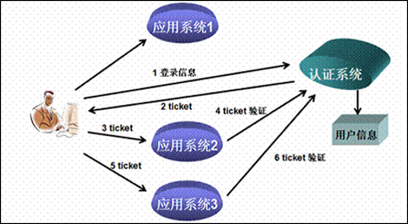
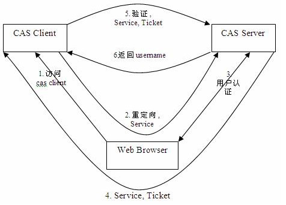
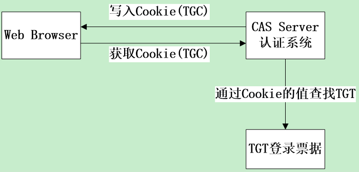
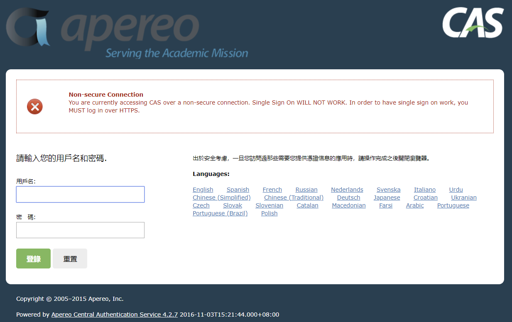
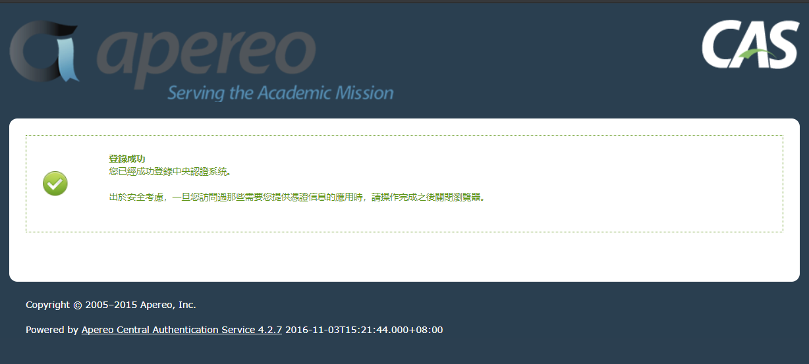
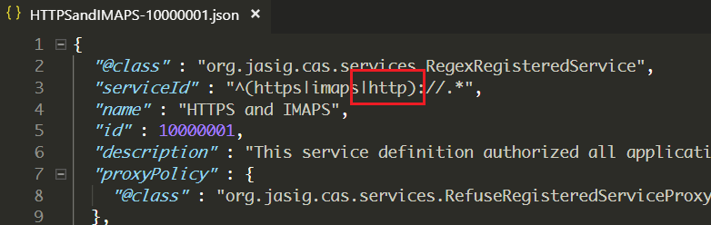
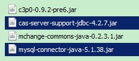
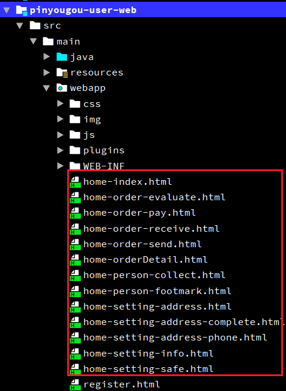

# Day16 CAS-单点登录解决方案&CAS集成SpringSecurity

## 1. 单点登录系统CAS入门

### 1.1. 单点登录简介

单点登录（Single Sign On），简称为SSO，是目前比较流行的企业业务整合的解决方案之一。SSO的定义是在多个应用系统中，用户只需要登录一次就可以访问所有相互信任的应用系统。

目前的系统存在诸多子系统，而这些子系统是分别部署在不同的服务器中，那么使用传统方式的session是无法解决的，我们需要使用相关的单点登录技术来解决。



### 1.2. CAS-单点登录解决方案

#### 1.2.1. CAS简介

CAS 是 Yale 大学发起的一个开源项目，旨在为 Web 应用系统提供一种可靠的单点登录方法，CAS 在 2004 年 12 月正式成为 JA-SIG 的一个项目。CAS 具有以下特点

1. 开源的企业级单点登录解决方案。
2. CAS Server 为需要独立部署的 Web 应用。
3. CAS Client 支持非常多的客户端(这里指单点登录系统中的各个 Web 应用)，包括 Java、.Net、PHP、Perl、Ruby 等。

从结构上看，CAS 包含两个部分： CAS Server 和 CAS Client。CAS Server 需要独立部署，主要负责对用户的认证工作；CAS Client 负责处理对客户端受保护资源的访问请求，需要登录时，重定向到 CAS Server。

- TGT（Ticket Grangting Ticket）：TGT是CAS为用户签发的登录票据，存入Session
- ST（Service Ticket）：ST是CAS为用户签发的服务票据，回传给客户端(使用一次)
- TGC（Ticket Grangting Cookie）：TGC是CAS在浏览器存储用户登录凭证的Cookie

#### 1.2.2. CAS执行流程

下图是 CAS 最基本的协议过程：





SSO单点登录访问流程主要有以下步骤：

1. 访问服务：SSO客户端发送请求访问应用系统提供的服务资源。
2. 定向认证：SSO客户端会重定向用户请求到SSO服务器。
3. 用户认证：用户身份认证。
4. 发放票据：SSO服务器会产生一个随机的Service Ticket。
5. 验证票据：SSO服务器验证票据Service Ticket的合法性，验证通过后，允许客户端访问服务。
6. 传输用户信息：SSO服务器验证票据通过后，传输用户认证结果信息给客户端，并把用户登录信息存入客户端的Session。

<font color="red">***注：CAS服务端往用户浏览器端写入cookies(TGC)是写入到登陆时CAS服务的客户端，而不是写在各个子系统的cookies。如果登陆页面的TGC cookies被删除，其他所有子系统都需要重新登陆。***</font>

#### 1.2.3. CAS官网

- 官方网站：https://www.apereo.org/projects/cas
- 下载地址：https://www.apereo.org/projects/cas/download-cas
- 参考文档：
    - https://apereo.github.io/cas/4.2.x/
    - https://wiki.jasig.org/display/CASUM/Home

*注：本次项目使用的CAS版本是v4.2.7（2016.11.4）*

### 1.3. CAS服务端部署与配置

#### 1.3.1. CAS服务端部署

CAS服务端其实就是一个war包。

在\Java编程工具资料\Java源代码\CAS【中央认证服务（单点登录）】\cas-server-webapp-4.2.7.war将其改名为cas.war放入tomcat目录下的webapps下。启动tomcat自动解压war包，改名为Root。浏览器输入http://localhost:8080/，可看到登录页面



CAS服务端默认登陆名：casuser，密码：Mellon。

登录成功后会跳到登录成功的提示页面：



#### 1.3.2. CAS服务端核心配置文件

CAS核心配置文件：/WEB-INF/cas.properties

#### 1.3.3. 修改tomcat端口

如果不希望用8080端口访问CAS, 可以修改端口

1. 修改TOMCAT的端口，打开tomcat 目录 conf\server.xml找到下面的配置。服务端口(22行)：8006、http端口(69行)：9107、AJP连接端口(116行)：8010

```xml
<Server port="8006" shutdown="SHUTDOWN">
  <Listener className="org.apache.catalina.startup.VersionLoggerListener" />
......
<Connector port="9107" protocol="HTTP/1.1"
            connectionTimeout="20000"
            redirectPort="8443" />
......
<Connector port="8010" protocol="AJP/1.3" redirectPort="8443" />
```

2. 修改WEB-INF/cas.properties(第1行)

```properties
server.name=http://localhost:9107
```

#### 1.3.4. 配置用户名与密码

修改WEB-INF/cas.properties(第270行)

```properties
accept.authn.users=admin::123456
```

#### 1.3.5. 去除https认证

CAS默认使用的是HTTPS协议，如果使用HTTPS协议需要SSL安全证书（需向特定的机构申请和购买）。如果对安全要求不高或是在开发测试阶段，可使用HTTP协议。这里讲解通过修改配置，让CAS使用HTTP协议。

1. 修改WEB-INF/cas.properties(第68行)

```properties
# Decides whether SSO cookie should be created only under secure connections.
tgc.secure=false
```

2. 修改WEB-INF/cas.properties(第83行)

```properties
# Decides whether SSO Warning cookie should be created only under secure connections.
warn.cookie.secure=false
```

3. 修改WEB-INF\classes\services\HTTPSandIMAPS-10000001.json。在"`serviceId`"的属性中增加"`|http`"

```json
{
  "@class" : "org.jasig.cas.services.RegexRegisteredService",
  "serviceId" : "^(https|imaps|http)://.*",
  "name" : "HTTPS and IMAPS",
  "id" : 10000001,
  "description" : "This service definition authorized all application urls that support HTTPS and IMAPS protocols.",
  "proxyPolicy" : {
    "@class" : "org.jasig.cas.services.RefuseRegisteredServiceProxyPolicy"
  },
  ......
}
```



4. 修改WEB-INF\view\jsp\default\ui\casLoginView.jsp，将3-8行的内容注释了

```jsp
<jsp:directive.include file="includes/top.jsp" />

<!-- <c:if test="${not pageContext.request.secure}">
    <div id="msg" class="errors">
        <h2><spring:message code="screen.nonsecure.title" /></h2>
        <p><spring:message code="screen.nonsecure.message" /></p>
    </div>
</c:if> -->
```

#### 1.3.6. 配置域名访问

- 修改hosts：`127.0.0.1  sso.moon.com`
- 修改nginx.conf：

```conf
server {
	listen       80;
	server_name  sso.moon.com;

	proxy_set_header X-Forwarded-Host $host;
	proxy_set_header X-Forwarded-Server $host;
	proxy_set_header Host $host;

	location / {
		   proxy_pass http://127.0.0.1:9107;
		   proxy_connect_timeout 600;
		   proxy_read_timeout 600;
	}
}
```

### 1.4. CAS客户端入门示例与配置

#### 1.4.1. CAS客户端相关配置

1. pom.xml文件，配置CAS核心依赖`cas-client-core`
2. web.xml文件，配置CAS相关的过滤器
    - 配置身份认证过滤器`AuthenticationFilter`(必须启用)
        - casServerLoginUrl属性（配置CAS服务端登录地址）
        - serverName属性（配置当前工程服务的名称）
    - 配置校验ticket的过滤器`Cas20ProxyReceivingTicketValidationFilter`(必须启用)
        - casServerUrlPrefix属性（配置CAS服务URL前缀）
        - serverName属性（配置当前工程服务的名称）
    - 配置单点退出过滤器`SingleSignOutFilter`(可选配置)
        - casServerUrlPrefix属性（配置CSS服务URL前缀）
    - 配置HttpServletRequest请求包裹过滤器`HttpServletRequestWrapperFilter`(可选配置)
        - 说明：此配置为了可以通过HttpServletRequest的getRemoteUser()方法获取SSO登录用户名

#### 1.4.2. 客户端工程1搭建

- 在pyg-test项目中创建Maven工程casclient01(war类型)，配置pom.xml相关依赖

```xml
<?xml version="1.0" encoding="UTF-8"?>
<project xmlns="http://maven.apache.org/POM/4.0.0"
         xmlns:xsi="http://www.w3.org/2001/XMLSchema-instance"
         xsi:schemaLocation="http://maven.apache.org/POM/4.0.0
         http://maven.apache.org/xsd/maven-4.0.0.xsd">
    <parent>
        <artifactId>pyg-test</artifactId>
        <groupId>com.moon</groupId>
        <version>1.0-SNAPSHOT</version>
    </parent>
    <modelVersion>4.0.0</modelVersion>
    <artifactId>casclient01</artifactId>
    <packaging>war</packaging>
    <name>casclient01</name>

    <!-- 配置依赖关系 -->
    <dependencies>
        <!-- cas-client-core -->
        <dependency>
            <groupId>org.jasig.cas.client</groupId>
            <artifactId>cas-client-core</artifactId>
            <version>3.4.1</version>
        </dependency>
        <!-- servlet-api、jsp-api、el-api-->
        <dependency>
            <groupId>org.apache.tomcat.embed</groupId>
            <artifactId>tomcat-embed-jasper</artifactId>
            <version>8.5.16</version>
            <scope>provided</scope>
        </dependency>
    </dependencies>
    <build>
        <plugins>
            <plugin>
                <groupId>org.apache.tomcat.maven</groupId>
                <artifactId>tomcat7-maven-plugin</artifactId>
                <configuration>
                    <!-- 指定端口 -->
                    <port>9001</port>
                    <!-- 请求路径 -->
                    <path>/</path>
                </configuration>
            </plugin>
        </plugins>
    </build>

</project>
```

- 配置web.xml

```xml
<?xml version="1.0" encoding="UTF-8"?>
<web-app xmlns:xsi="http://www.w3.org/2001/XMLSchema-instance"
         xmlns="http://java.sun.com/xml/ns/javaee"
         xsi:schemaLocation="http://java.sun.com/xml/ns/javaee
         http://java.sun.com/xml/ns/javaee/web-app_3_0.xsd"
         version="3.0">

    <!-- 配置单点退出过滤器 (可选配置) -->
    <filter>
        <filter-name>ssoutFilter</filter-name>
        <filter-class>org.jasig.cas.client.session.SingleSignOutFilter</filter-class>
        <!-- 配置CAS服务URL前缀 -->
        <init-param>
            <param-name>casServerUrlPrefix</param-name>
            <param-value>http://sso.moon.com</param-value>
        </init-param>
    </filter>
    <filter-mapping>
        <filter-name>ssoutFilter</filter-name>
        <url-pattern>/*</url-pattern>
    </filter-mapping>

    <!-- 配置身份认证过滤器(必须启用) -->
    <filter>
        <filter-name>authenticationFilter</filter-name>
        <filter-class>org.jasig.cas.client.authentication.AuthenticationFilter</filter-class>
        <init-param>
            <!-- 配置CAS服务端登录地址 -->
            <param-name>casServerLoginUrl</param-name>
            <param-value>http://sso.moon.com/login</param-value>
        </init-param>
        <init-param>
            <!-- 配置服务名称 -->
            <param-name>serverName</param-name>
            <param-value>http://localhost:9001</param-value>
        </init-param>
    </filter>
    <filter-mapping>
        <filter-name>authenticationFilter</filter-name>
        <url-pattern>/*</url-pattern>
    </filter-mapping>

    <!-- 该过滤器负责对ticket的校验工作(必须启用) -->
    <filter>
        <filter-name>ticketValidationFilter</filter-name>
        <filter-class>org.jasig.cas.client.validation.Cas20ProxyReceivingTicketValidationFilter</filter-class>
        <!-- 配置CAS服务URL前缀 -->
        <init-param>
            <param-name>casServerUrlPrefix</param-name>
            <param-value>http://sso.moon.com</param-value>
        </init-param>
        <!-- 配置服务名称 -->
        <init-param>
            <param-name>serverName</param-name>
            <param-value>http://localhost:9001</param-value>
        </init-param>
    </filter>
    <filter-mapping>
        <filter-name>ticketValidationFilter</filter-name>
        <url-pattern>/*</url-pattern>
    </filter-mapping>

    <!--
      配置HttpServletRequest请求包裹过滤器 (可选配置)
      说明：通过HttpServletRequest的getRemoteUser()方法获取SSO登录用户名
    -->
    <filter>
        <filter-name>httpServletRequestWrapperFilter</filter-name>
        <filter-class>org.jasig.cas.client.util.HttpServletRequestWrapperFilter</filter-class>
    </filter>
    <filter-mapping>
        <filter-name>httpServletRequestWrapperFilter</filter-name>
        <url-pattern>/*</url-pattern>
    </filter-mapping>

</web-app>
```

- 修改index.jsp，增加显示登录用户名

```jsp
<%@ page contentType="text/html;charset=UTF-8" language="java" %>
<html>
<head>
    <title>品优购</title>
</head>
<body>
    欢迎来到一品优购：<%=request.getRemoteUser()%>
</body>
</html>
```

说明：`request.getRemoteUser()`用于获取登录用户名

#### 1.4.3. 客户端工程2搭建

- 创建Maven工程 casclient02(war类型)，配置pom.xml相关依赖，相关配置与客户端1一样，修改设置当前工程的端口号*9002*

```xml
<build>
    <plugins>
        <plugin>
            <groupId>org.apache.tomcat.maven</groupId>
            <artifactId>tomcat7-maven-plugin</artifactId>
            <configuration>
                <!-- 指定端口 -->
                <port>9002</port>
                <!-- 请求路径 -->
                <path>/</path>
            </configuration>
        </plugin>
    </plugins>
</build>
```

- 配置web.xml文件，与客户端1配置一样，只修改serverName，修改为当前工程的端口号*9002*

```xml
<?xml version="1.0" encoding="UTF-8"?>
<web-app xmlns:xsi="http://www.w3.org/2001/XMLSchema-instance"
         xmlns="http://java.sun.com/xml/ns/javaee"
         xsi:schemaLocation="http://java.sun.com/xml/ns/javaee
         http://java.sun.com/xml/ns/javaee/web-app_3_0.xsd"
         version="3.0">

    <!-- 配置单点退出过滤器 (可选配置) -->
    <filter>
        <filter-name>ssoutFilter</filter-name>
        <filter-class>org.jasig.cas.client.session.SingleSignOutFilter</filter-class>
        <!-- 配置CAS服务URL前缀 -->
        <init-param>
            <param-name>casServerUrlPrefix</param-name>
            <param-value>http://sso.moon.com</param-value>
        </init-param>
    </filter>
    <filter-mapping>
        <filter-name>ssoutFilter</filter-name>
        <url-pattern>/*</url-pattern>
    </filter-mapping>

    <!-- 配置身份认证过滤器(必须启用) -->
    <filter>
        <filter-name>authenticationFilter</filter-name>
        <filter-class>org.jasig.cas.client.authentication.AuthenticationFilter</filter-class>
        <init-param>
            <!-- 配置CAS服务端登录地址 -->
            <param-name>casServerLoginUrl</param-name>
            <param-value>http://sso.moon.com/login</param-value>
        </init-param>
        <init-param>
            <!-- 配置服务名称 -->
            <param-name>serverName</param-name>
            <param-value>http://localhost:9002</param-value>
        </init-param>
    </filter>
    <filter-mapping>
        <filter-name>authenticationFilter</filter-name>
        <url-pattern>/*</url-pattern>
    </filter-mapping>

    <!-- 该过滤器负责对ticket的校验工作(必须启用) -->
    <filter>
        <filter-name>ticketValidationFilter</filter-name>
        <filter-class>org.jasig.cas.client.validation.Cas20ProxyReceivingTicketValidationFilter</filter-class>
        <!-- 配置CAS服务URL前缀 -->
        <init-param>
            <param-name>casServerUrlPrefix</param-name>
            <param-value>http://sso.moon.com</param-value>
        </init-param>
        <!-- 配置服务名称 -->
        <init-param>
            <param-name>serverName</param-name>
            <param-value>http://localhost:9002</param-value>
        </init-param>
    </filter>
    <filter-mapping>
        <filter-name>ticketValidationFilter</filter-name>
        <url-pattern>/*</url-pattern>
    </filter-mapping>

    <!--
      配置HttpServletRequest请求包裹过滤器 (可选配置)
      说明：通过HttpServletRequest的getRemoteUser()方法获取SSO登录用户名
    -->
    <filter>
        <filter-name>httpServletRequestWrapperFilter</filter-name>
        <filter-class>org.jasig.cas.client.util.HttpServletRequestWrapperFilter</filter-class>
    </filter>
    <filter-mapping>
        <filter-name>httpServletRequestWrapperFilter</filter-name>
        <url-pattern>/*</url-pattern>
    </filter-mapping>

</web-app>
```

- 修改index.jsp页面

```jsp
<%@ page contentType="text/html;charset=UTF-8" language="java" %>
<html>
<head>
    <title>品优购</title>
</head>
<body>
    欢迎来到二品优购：<%=request.getRemoteUser()%>
</body>
</html>
```

#### 1.4.4. 单点登录测试

- 第一步：启动cas部署的tomcat
- 第二步：启动客户端工程1和客户端工程2
- 第三步：地址栏输入`http://localhost:9001/` 和 `http://localhost:9002/`，地址均会跳转到CAS登录页
- 第四步：输入用户名和密码后，页面跳转回9002，再次访问9001也可以打开主页面

#### 1.4.5. 单点退出登录

- 地址栏输入：http://sso.moon.com/logout，即可看到退出后的提示页面
- 可以将这个链接添加到index.jsp

```jsp
<br/><a href="http://sso.moon.com/logout">退出登录</a>
```

- 如果希望退出登录后，能自动跳转到某个页面。则需要修改cas系统的配置文件`WEB-INF/cas.properties`(第111行)

```properties
cas.logout.followServiceRedirects=true
```

- 改为true后，可以在退出时跳转页面到目标页面(service)，修改index.jsp的退出链接

```jsp
<br/><a href="http://sso.moon.com/logout?service=https://moonkira.github.io">退出登录</a>
```

## 2. CAS服务端数据源设置

### 2.1. 需求分析

让用户名密码从品优购的user表里做验证

### 2.2. 配置数据源

- 修改cas服务端中WEB-INF下`deployerConfigContext.xml`，在最后的地方添加如下配置。
    1. 配置数据源（ComboPooledDataSource），读取相应的数据库
    2. 配置密码加密方式（DefaultPasswordEncoder），根据项目用户表密码的加密方式来定义
    3. 配置身份认证处理器（QueryDatabaseAuthenticationHandler），引用数据源与密码加密方式，定义查询sql语句，根据用户名查询相关的密码即可

```xml
<!-- 配置CAS服务端读取数据库的用户表 -->
<!-- 配置数据源 -->
<bean id="dataSource" class="com.mchange.v2.c3p0.ComboPooledDataSource"
      p:driverClass="com.mysql.jdbc.Driver"
      p:jdbcUrl="jdbc:mysql://localhost:3306/pinyougou_db"
      p:user="root"
      p:password="123456"
      p:maxPoolSize="10"
      p:minPoolSize="2"
      p:initialPoolSize="2"/>

<!-- 配置密码加密方式 -->
<bean id="passwordEncoder"
      class="org.jasig.cas.authentication.handler.DefaultPasswordEncoder"
      c:encodingAlgorithm="MD5"
      p:characterEncoding="UTF-8"/>

<!-- 配置身份认证处理器 -->
<bean id="primaryAuthenticationHandler"
      class="org.jasig.cas.adaptors.jdbc.QueryDatabaseAuthenticationHandler"
      p:dataSource-ref="dataSource"
      p:sql="select password from tb_user where username = ?"
      p:passwordEncoder-ref="passwordEncoder"/>
```

- 注释掉默认身份认证处理器(deployerConfigContext.xml配置文件第32行)

```xml
<!--
<alias name="acceptUsersAuthenticationHandler" alias="primaryAuthenticationHandler" />
-->
```

- 将`cas-server-support-jdbc-4.2.7.jar`与`mysql-connector-java-5.1.38.jar`拷贝到`webapps\ROOT\WEB-INF\lib`目录下。



说明：这四个jar包在【\Java编程工具资料\Java源代码\CAS【中央认证服务（单点登录）】\lib\】目录下，c3p0与mchange-commons的两个jar包cas项目中已自带不需要拷贝，用数据库中的用户名和密码进行测试。

## 3. CAS服务端界面改造

### 3.1. 需求分析

将CAS默认的登录页更改为品优购的登录页面

### 3.2. 登录页面

#### 3.2.1. 拷贝资源

- 将品优购的【资料\登录静态原型】登录页login.html拷贝到CAS服务系统的`WEB-INF\view\jsp\default\ui`目录下。
- 将【资料\登录静态原型】css、img、plugins三个文件夹拷贝到CAS服务系统的ROOT目录下，进行合并。
- 将原来的`casLoginView.jsp`改名（可以为之后的修改操作做参照），将`login.html`改名为`casLoginView.jsp`

#### 3.2.2. 修改页面

- 添加指令(拷贝`includes/top.jsp`页面中的指令，复制`casLoginView.jsp`)

```jsp
<%@ page pageEncoding="UTF-8" %>
<%@ page contentType="text/html; charset=UTF-8" %>
<%@ taglib prefix="c" uri="http://java.sun.com/jsp/jstl/core" %>
<%@ taglib prefix="spring" uri="http://www.springframework.org/tags" %>
<%@ taglib prefix="form" uri="http://www.springframework.org/tags/form" %>
<%@ taglib prefix="fn" uri="http://java.sun.com/jsp/jstl/functions" %>
```

- 修改form标签

```jsp
<form:form method="post" id="fm1"
           commandName="${commandName}"
           htmlEscape="true"
           class="sui-form">
    ......
</form:form>
```

- 修改用户名框

```jsp
<form:input id="username" tabindex="1"
            accesskey="${userNameAccessKey}"
            path="username"
            autocomplete="off"
            htmlEscape="true"
            placeholder="邮箱/用户名/手机号"
            class="span2 input-xfat"/>
```

- 修改密码框

```jsp
<form:password id="password" tabindex="2"
               path="password"
               accesskey="${passwordAccessKey}"
               htmlEscape="true"
               autocomplete="off"
               placeholder="请输入密码"
               class="span2 input-xfat"/>
```

- 修改登录按钮

```jsp
<div class="logined">
	<input type="hidden" name="execution" value="${flowExecutionKey}"/>
	<input type="hidden" name="_eventId" value="submit"/>
	<input class="sui-btn btn-block btn-xlarge btn-danger"
           accesskey="l"
           value="登&nbsp;&nbsp;录"
           type="submit" />
</div>
```

设置后访问客户端1与客户端2都跳转到自定义的登陆页面

### 3.3. 错误提示

- 在表单`<form:form>`内加入错误提示框

```jsp
<form:errors path="*" id="msg" cssClass="errors"
             element="div" htmlEscape="false"/>
```

- 测试：输入错误的用户名和密码，提示是英文。这个提示信息是在`WEB-INF\classes`目录下的`messages.properties`文件中(55、56、64、65行)

```properties
username.required=Username is a required field.
password.required=Password is a required field.
......
authenticationFailure.AccountNotFoundException=Invalid credentials.
authenticationFailure.FailedLoginException=Invalid credentials.
```

- 设置国际化为zh_CN，修改`WEB-INF\cas.properties`(145行)

```properties
locale.default=zh_CN
```

- 修改`WEB-INF\classes\messages_zh_CN.properties`，改为中文提示68、69行（使用native2ascii对中文进行转码，参考day15笔记中4.5.5编码转换的方法）

```properties
authenticationFailure.AccountNotFoundException=\u7528\u6237\u540d\u4e0d\u6b63\u786e\uff01
authenticationFailure.FailedLoginException=\u7528\u6237\u767b\u5f55\u5931\u8d25\uff01
```

*注：第一个：用户名不正确！；第二个：用户登录失败！*

---

## 4. CAS客户端与SpringSecurity集成

### 4.1. Spring Security测试工程搭建

- 创建Maven项目casclient03（war类型），配置pom.xml文件，引入spring依赖和spring secrity相关依赖，tomcat端口设置为9003

```xml
<?xml version="1.0" encoding="UTF-8"?>
<project xmlns="http://maven.apache.org/POM/4.0.0"
         xmlns:xsi="http://www.w3.org/2001/XMLSchema-instance"
         xsi:schemaLocation="http://maven.apache.org/POM/4.0.0
         http://maven.apache.org/xsd/maven-4.0.0.xsd">
    <parent>
        <artifactId>pyg-test</artifactId>
        <groupId>com.moon</groupId>
        <version>1.0-SNAPSHOT</version>
    </parent>
    <modelVersion>4.0.0</modelVersion>
    <artifactId>casclient03</artifactId>
    <packaging>war</packaging>
    <name>casclient03</name>

    <!-- 配置依赖关系 -->
    <dependencies>
        <!-- servlet-api、jsp-api、el-api -->
        <dependency>
            <groupId>org.apache.tomcat.embed</groupId>
            <artifactId>tomcat-embed-jasper</artifactId>
            <version>8.5.16</version>
            <scope>provided</scope>
        </dependency>
        <!-- jstl -->
        <dependency>
            <groupId>jstl</groupId>
            <artifactId>jstl</artifactId>
            <version>1.2</version>
        </dependency>
        <!-- Spring -->
        <dependency>
            <groupId>org.springframework</groupId>
            <artifactId>spring-webmvc</artifactId>
            <version>4.3.10.RELEASE</version>
        </dependency>
        <!-- Spring-Security -->
        <dependency>
            <groupId>org.springframework.security</groupId>
            <artifactId>spring-security-web</artifactId>
            <version>4.2.3.RELEASE</version>
        </dependency>
        <dependency>
            <groupId>org.springframework.security</groupId>
            <artifactId>spring-security-config</artifactId>
            <version>4.2.3.RELEASE</version>
        </dependency>
    </dependencies>
    <build>
        <plugins>
            <plugin>
                <groupId>org.apache.tomcat.maven</groupId>
                <artifactId>tomcat7-maven-plugin</artifactId>
                <configuration>
                    <!-- 指定端口 -->
                    <port>9003</port>
                    <!-- 请求路径 -->
                    <path>/</path>
                </configuration>
            </plugin>
        </plugins>
    </build>
</project>
```

- web.xml配置spring核心监听器、springSecurity委托过滤器

```xml
<?xml version="1.0" encoding="UTF-8"?>
<web-app xmlns:xsi="http://www.w3.org/2001/XMLSchema-instance"
         xmlns="http://java.sun.com/xml/ns/javaee"
         xsi:schemaLocation="http://java.sun.com/xml/ns/javaee
         http://java.sun.com/xml/ns/javaee/web-app_3_0.xsd"
         version="3.0">

    <!-- 配置Spring加载文件 -->
    <context-param>
        <param-name>contextConfigLocation</param-name>
        <param-value>classpath:applicationContext*.xml</param-value>
    </context-param>
    <!-- 配置Spring的核心监听器 -->
    <listener>
        <listener-class>org.springframework.web.context.ContextLoaderListener</listener-class>
    </listener>

    <!-- 配置SpringSecurity委派过滤器 -->
    <filter>
        <filter-name>springSecurityFilterChain</filter-name>
        <filter-class>org.springframework.web.filter.DelegatingFilterProxy</filter-class>
    </filter>
    <filter-mapping>
        <filter-name>springSecurityFilterChain</filter-name>
        <url-pattern>/*</url-pattern>
    </filter-mapping>
</web-app>
```

- 创建resources/applicationContext-security.xml文件，配置认证拦截的资源与认证管理器（*注：这个认证管理器后面会换在CAS去认证*）

```xml
<?xml version="1.0" encoding="utf-8"?>
<beans xmlns="http://www.springframework.org/schema/beans"
       xmlns:xsi="http://www.w3.org/2001/XMLSchema-instance"
       xmlns:security="http://www.springframework.org/schema/security"
       xsi:schemaLocation="http://www.springframework.org/schema/beans
       http://www.springframework.org/schema/beans/spring-beans.xsd
       http://www.springframework.org/schema/security
       http://www.springframework.org/schema/security/spring-security.xsd">

    <!--########### 配置请求URL拦截规则 ##########-->
    <!-- 1.配置不拦截的url-->
    <security:http pattern="/login.html" security="none"/>
    <security:http pattern="/login_error.html" security="none"/>

    <!-- 2.配置拦截的url，
        use-expressions:是否使用使用 Spring 表达式语言（SpEL），默认为true
     -->
    <security:http use-expressions="false">
        <!-- 配置拦截的请求url，通过什么角色或权限访问 -->
        <security:intercept-url pattern="/**" access="ROLE_USER"/>
        <!-- 配置开启表单登录(用spring security默认的登录页面) -->
        <security:form-login
                login-page="/login.html"
                authentication-success-forward-url="/login_success.html"
                authentication-failure-url="/login_error.html"
                username-parameter="username"
                password-parameter="password"/>
        <!-- 关闭跨站请求伪造 CSRF -->
        <security:csrf disabled="true"/>
    </security:http>

    <!--########### 配置认证管理器 ##########-->
    <!-- 3.配置认证管理器 -->
    <security:authentication-manager>
        <!-- 配置认证提供者 -->
        <security:authentication-provider>
            <!-- 配置用户服务认证 -->
            <security:user-service>
                <!-- 配置用户：指定用户名、密码、角色或权限（一般不会直接在配置文件中配置） -->
                <security:user name="admin" password="123456" authorities="ROLE_USER"/>
            </security:user-service>
        </security:authentication-provider>
    </security:authentication-manager>

</beans>
```

- 将`\资料\Spring Security\`文件夹的index.html和success.html页面添加到工程webapp目录下

*注：以上步骤参照以前项目：springsecurity-test*

### 4.2. Spring Security与CAS集成

- 修改pom.xml文件，引入Spring Security的依赖

```xml
<!-- spring-security-cas -->
<dependency>
    <groupId>org.springframework.security</groupId>
    <artifactId>spring-security-cas</artifactId>
    <version>4.2.3.RELEASE</version>
</dependency>
<!-- cas-client-core -->
<dependency>
    <groupId>org.jasig.cas.client</groupId>
    <artifactId>cas-client-core</artifactId>
    <version>3.4.1</version>
</dependency>
```

- 修改applicationContext-security.xml（*注：将原来在web.xml文件配置的4个CAS的过滤器配置在此文件中*）
    - 修改success.html页面不需要拦截
    - 配置CAS认证入口点（entry-point-ref），引用Spring Security的cas入口类CasAuthenticationEntryPoint
    - 配置CAS认证过滤器（CasAuthenticationFilter类），指定认证管理器
    - 配置CAS单点退出过滤器（SingleSignOutFilter类）
    - 配置spring-security退出过滤器（LogoutFilter类）
        - 注：其中配置2个退出过滤器，因为客户端security与服务端都需要退出
    - 配置认证管理器`<security:authentication-manager>`标签，配置CAS作为认证的提供者`<security:authentication-provider>`
        - 创建CAS认证提供者bean（CasAuthenticationProvider类）
            - 配置认证服务authenticationUserDetailsService
            - 配置服务属性serviceProperties
            - 配置票据验证器ticketValidator
            - 配置key(可以随意写值)
        - 创建自定义认证服务类bean
        - 创建服务属性（ServiceProperties类）bean

```xml
<?xml version="1.0" encoding="utf-8"?>
<beans xmlns="http://www.springframework.org/schema/beans"
       xmlns:xsi="http://www.w3.org/2001/XMLSchema-instance"
       xmlns:security="http://www.springframework.org/schema/security"
       xsi:schemaLocation="http://www.springframework.org/schema/beans
       http://www.springframework.org/schema/beans/spring-beans.xsd
       http://www.springframework.org/schema/security
       http://www.springframework.org/schema/security/spring-security.xsd">

    <!--########### 配置请求URL拦截规则 ##########-->
    <!-- 1.配置不拦截的url-->
    <security:http pattern="/success.html" security="none"/>

    <!-- 2.配置拦截的url，
        use-expressions：是否使用使用 Spring 表达式语言（SpEL），默认为true
        entry-point-ref：配置CAS认证入口点
     -->
    <security:http use-expressions="false"
                   entry-point-ref="casAuthenticationEntryPoint">
        <!-- 配置拦截的请求url，通过什么角色或权限访问 -->
        <security:intercept-url pattern="/**" access="ROLE_USER"/>
        <!-- 关闭跨站请求伪造 CSRF -->
        <security:csrf disabled="true"/>

        <!-- 配置相应的过滤器(对请求地址进行权限过滤)
                position 表示将过滤器放在指定的位置上
                before 表示放在指定位置之前
                after 表示放在指定的位置之后
       -->
        <security:custom-filter ref="casAuthenticationFilter"
                                position="CAS_FILTER"/>
        <security:custom-filter ref="singleLogoutFilter"
                                before="CAS_FILTER"/>
        <security:custom-filter ref="logoutFilter"
                                before="LOGOUT_FILTER"/>
    </security:http>

    <!-- 2.1 配置CAS认证入口点 -->
    <bean id="casAuthenticationEntryPoint"
          class="org.springframework.security.cas.web.CasAuthenticationEntryPoint">
        <!-- 配置登录请求地址 -->
        <property name="loginUrl" value="http://sso.moon.com/login"/>
        <!-- 配置服务属性 -->
        <property name="serviceProperties" ref="serviceProperties"/>
    </bean>

    <!-- 2.2 配置CAS认证过滤器 -->
    <bean id="casAuthenticationFilter"
          class="org.springframework.security.cas.web.CasAuthenticationFilter">
        <!-- 指定认证管理器 -->
        <property name="authenticationManager" ref="authenticationManager"/>
        <!-- 指定登录的请求地址，不指定时默认将会是“/login/cas” -->
        <property name="filterProcessesUrl" value="/login/cas"/>
    </bean>

    <!-- 2.3 配置CAS单点退出过滤器 -->
    <bean id="singleLogoutFilter" class="org.jasig.cas.client.session.SingleSignOutFilter"/>

    <!-- 2.4 配置spring-security退出过滤器 -->
    <bean id="logoutFilter"
          class="org.springframework.security.web.authentication.logout.LogoutFilter">
        <!-- 配置退出成功请求地址-->
        <constructor-arg value="http://sso.moon.com/logout?service=https://moonkira.github.io"/>
        <!-- 配置退出处理器 -->
        <constructor-arg>
            <bean class="org.springframework.security.web.authentication.logout.SecurityContextLogoutHandler"/>
        </constructor-arg>
        <!-- 配置退出的请求地址 默认为“/logout”-->
        <property name="filterProcessesUrl" value="/logout"/>
    </bean>


    <!--########### 配置认证管理器 ##########-->
    <!-- 3.配置认证管理器 -->
    <security:authentication-manager alias="authenticationManager">
        <!-- 配置CAS作为认证的提供者 -->
        <security:authentication-provider ref="casAuthenticationProvider"/>
    </security:authentication-manager>

    <!-- 3.1 配置CAS认证提供者 -->
    <bean id="casAuthenticationProvider"
          class="org.springframework.security.cas.authentication.CasAuthenticationProvider">
        <!-- 配置认证服务 -->
        <property name="authenticationUserDetailsService">
            <!-- 配置用户名包裹服务 -->
            <bean class="org.springframework.security.core.userdetails.UserDetailsByNameServiceWrapper">
                <!-- 配置自定义服务类 -->
                <constructor-arg ref="userDetailsService"/>
            </bean>
        </property>
        <!-- 配置服务属性 -->
        <property name="serviceProperties" ref="serviceProperties"/>
        <!-- 配置票据验证器 -->
        <property name="ticketValidator">
            <!-- 配置票据验证 -->
            <bean class="org.jasig.cas.client.validation.Cas20ServiceTicketValidator">
                <!-- 配置CAS服务地址前缀 -->
                <constructor-arg value="http://sso.moon.com"/>
            </bean>
        </property>
        <!-- 配置key(可以随意写值) -->
        <property name="key" value="auth_provider_key"/>
    </bean>

    <!-- 3.2 配置自定义认证服务类 -->
    <bean id="userDetailsService" class="com.moon.casclient.service.UserDetailServiceImpl"/>

    <!-- 3.3 配置服务属性 -->
    <bean id="serviceProperties" class="org.springframework.security.cas.ServiceProperties">
        <!-- 配置登录成功后重定向的服务地址 默认/login/cas
            (需跟CAS认证过滤器中的filterProcessesUrl一致) -->
        <property name="service" value="http://localhost:9003/login/cas"/>
    </bean>

</beans>
```

- 创建自定义认证服务类UserDetailServiceImpl。这个类的主要作用是在登录后得到用户名，可以根据用户名查询角色或执行一些逻辑。

```java
public class UserDetailServiceImpl implements UserDetailsService {
    @Override
    public UserDetails loadUserByUsername(String username) throws UsernameNotFoundException {
        // 创建集合封装角色或权限
        List<GrantedAuthority> authorities = new ArrayList<>();
        authorities.add(new SimpleGrantedAuthority("ROLE_USER"));
        return new User(username, "", authorities);
    }
}
```

启动项目访问路径：http://localhost:9003/index.html

### 4.3. 获取登录名

在处理后端逻辑需要获得登录名，那么如何获取单点登录的用户名呢? 其实和之前获得用户名的方式是完全相同的

- 修改web.xml，添加springmvc配置

```xml
<!-- 配置前端控制器 -->
<servlet>
    <servlet-name>casclient</servlet-name>
    <servlet-class>org.springframework.web.servlet.DispatcherServlet</servlet-class>
    <init-param>
        <param-name>contextConfigLocation</param-name>
        <param-value>classpath:casclient-servlet.xml</param-value>
    </init-param>
</servlet>
<servlet-mapping>
    <servlet-name>casclient</servlet-name>
    <url-pattern>/</url-pattern>
</servlet-mapping>
```

- 创建resources/casclient-servlet.xml文件，配置注解扫描、注解驱动等

```xml
<?xml version="1.0" encoding="utf-8"?>
<beans xmlns="http://www.springframework.org/schema/beans"
       xmlns:xsi="http://www.w3.org/2001/XMLSchema-instance"
       xmlns:mvc="http://www.springframework.org/schema/mvc"
       xmlns:context="http://www.springframework.org/schema/context"
       xsi:schemaLocation="http://www.springframework.org/schema/beans
       http://www.springframework.org/schema/beans/spring-beans.xsd
       http://www.springframework.org/schema/mvc
       http://www.springframework.org/schema/mvc/spring-mvc.xsd
       http://www.springframework.org/schema/context
       http://www.springframework.org/schema/context/spring-context.xsd">

    <!-- 配置组件扫描 -->
    <context:component-scan base-package="com.moon.casclient.controller"/>
    <!-- 配置开启MVC注解驱动 -->
    <mvc:annotation-driven/>
    <!-- 配置静态资源由默认的servlet处理 -->
    <mvc:default-servlet-handler/>

</beans>
```

- 创建UserController，使用SecurityContext获取登陆用户名

```java
@RestController
public class UserController {
    /**
     * 获取登录用户名
     */
    @GetMapping("/findLoginUser")
    public String findLoginUser() {
        String name = SecurityContextHolder.getContext()
                .getAuthentication().getName();
        return name;
    }
}
```

- 地址栏输入：`http://localhost:9003/findLoginUser`看到登录名

### 4.4. 退出登录

- 修改applicationContext-security.xml，配置spring-security退出过滤器的跳转地址

```xml
<!-- 2.4 配置spring-security退出过滤器 -->
<bean id="logoutFilter"
      class="org.springframework.security.web.authentication.logout.LogoutFilter">
    <!-- 配置退出成功请求地址-->
    <constructor-arg value="http://sso.moon.com/logout?service=https://localhost:9003/success.html"/>
    <!-- 配置退出处理器 -->
    <constructor-arg>
        <bean class="org.springframework.security.web.authentication.logout.SecurityContextLogoutHandler"/>
    </constructor-arg>
    <!-- 配置退出的请求地址 默认为“/logout”-->
    <property name="filterProcessesUrl" value="/logout"/>
</bean>
```

- 在index.html页面上添加退出链接

```html
<a href="/logout">退出登录</a>
```

- 设置success.html为可匿名访问

```html
<!-- 1.配置不拦截的url-->
<security:http pattern="/success.html" security="none"/>
```

---

## 5. 品优购用户中心

### 5.1. 需求分析

用户中心实现单点登录。

### 5.2. 用户中心实现单点登录

拷贝【资料\用户中心原型】至 pinyougou-user-web的webapp目录下



- pom.xml引入spring-security、cas客户端和spring-security-cas整合包依赖（版本号在父级工程里已经指定）

```xml
<!-- Spring-Security -->
<dependency>
    <groupId>org.springframework.security</groupId>
    <artifactId>spring-security-web</artifactId>
</dependency>
<dependency>
    <groupId>org.springframework.security</groupId>
    <artifactId>spring-security-config</artifactId>
</dependency>
<!-- spring-security-cas -->
<dependency>
    <groupId>org.springframework.security</groupId>
    <artifactId>spring-security-cas</artifactId>
</dependency>
<!-- cas-client-core -->
<dependency>
    <groupId>org.jasig.cas.client</groupId>
    <artifactId>cas-client-core</artifactId>
</dependency>
```

- web.xml添加spring-security过滤器，设置首页为home-index.html

```xml
<?xml version="1.0" encoding="UTF-8"?>
<web-app xmlns:xsi="http://www.w3.org/2001/XMLSchema-instance"
         xmlns="http://java.sun.com/xml/ns/javaee"
         xsi:schemaLocation="http://java.sun.com/xml/ns/javaee
         http://java.sun.com/xml/ns/javaee/web-app_3_0.xsd" version="3.0">

    <!-- 配置Spring加载文件 -->
    <context-param>
        <param-name>contextConfigLocation</param-name>
        <param-value>classpath:applicationContext*.xml</param-value>
    </context-param>
    <!-- 配置Spring的核心监听器 -->
    <listener>
        <listener-class>org.springframework.web.context.ContextLoaderListener</listener-class>
    </listener>

    <!-- 配置SpringSecurity委派过滤器 -->
    <filter>
        <filter-name>springSecurityFilterChain</filter-name>
        <filter-class>org.springframework.web.filter.DelegatingFilterProxy</filter-class>
    </filter>
    <filter-mapping>
        <filter-name>springSecurityFilterChain</filter-name>
        <url-pattern>/*</url-pattern>
    </filter-mapping>

    <!-- 配置Spring MVC前端控制器(核心控制器) -->
    ......
    <!-- 配置全局编码过滤器 -->
    ......

    <!-- 欢迎列表 -->
    <welcome-file-list>
        <welcome-file>home-index.html</welcome-file>
    </welcome-file-list>

</web-app>
```

- 创建自定义认证类UserDetailsServiceImpl.java，用来获取登陆用户的权限

```java
public class UserDetailsServiceImpl implements UserDetailsService {
    @Override
    public UserDetails loadUserByUsername(String username) throws UsernameNotFoundException {
        // 创建集合封装角色或权限
        List<GrantedAuthority> authorities = new ArrayList<>();
        authorities.add(new SimpleGrantedAuthority("ROLE_USER"));
        return new User(username, "", authorities);
    }
}
```

- 创建applicationContext-security.xml（参照pyg-test项目中的casclient03），配置匿名访问资源（不需要拦截的url）

```xml
<!-- 1.配置不拦截的url-->
<security:http pattern="/css/**" security="none"/>
<security:http pattern="/js/**" security="none"/>
<security:http pattern="/img/**" security="none"/>
<security:http pattern="/plugins/**" security="none"/>
<security:http pattern="/register.html" security="none"/>
<security:http pattern="/user/save" security="none"/>
<security:http pattern="/user/sendCode" security="none"/>
```

- 配置服务属性：指定登录的请求地址，要与服务属性bean的service属性一致

```xml
<!-- 2.2 配置CAS认证过滤器 -->
<bean id="casAuthenticationFilter"
      class="org.springframework.security.cas.web.CasAuthenticationFilter">
    <!-- 指定认证管理器 -->
    <property name="authenticationManager" ref="authenticationManager"/>
    <!-- 指定登录的请求地址，不指定时默认将会是“/login/cas” -->
    <property name="filterProcessesUrl" value="/login"/>
</bean>

......

<!-- 3.3 配置服务属性 -->
<bean id="serviceProperties" class="org.springframework.security.cas.ServiceProperties">
    <!-- 配置登录成功后重定向的服务地址 默认/login/cas
        (需跟CAS认证过滤器中的filterProcessesUrl一致) -->
    <property name="service" value="http://user.moon.com/login"/>
</bean>
```

- 配置认证服务类：

```xml
<!-- 3.2 配置自定义认证服务类 -->
<bean id="userDetailsService" class="com.pinyougou.user.service.UserDetailsServiceImpl"/>
```

- 配置退出过滤器：退出后跳转到门户系统的首页

```xml
<!-- 2.4 配置spring-security退出过滤器 -->
<bean id="logoutFilter"
      class="org.springframework.security.web.authentication.logout.LogoutFilter">
    <!-- 配置退出成功请求地址-->
    <constructor-arg value="http://sso.moon.com/logout?service=http://www.moon.com"/>
    <!-- 配置退出处理器 -->
    <constructor-arg>
        <bean class="org.springframework.security.web.authentication.logout.SecurityContextLogoutHandler"/>
    </constructor-arg>
    <!-- 配置退出的请求地址 默认为“/logout”-->
    <property name="filterProcessesUrl" value="/logout"/>
</bean>
```

### 5.3. 页面显示用户名

- pinyougou-user-web工程创建LoginController.java，获取登陆的用户名

```java
/**
 * 用户登录控制器
 */
@RequestMapping("/user")
@RestController
public class LoginController {
    /**
     * 获取登陆用户名
     */
    @PostMapping("/showName")
    public Map<String, String> showName() {
        // 调用spring security获取登陆用户名
        String name = SecurityContextHolder.getContext()
                .getAuthentication().getName();
        Map<String, String> data = new HashMap<String, String>();
        data.put("loginName", name);
        return data;
    }
}
```

- 创建indexController.js

```js
/* 定义首页控制器层 */
app.controller('indexController', function ($scope, baseService) {
    /* 定义获取登录用户名方法 */
    $scope.showName = function () {
        baseService.sendPost('/user/showName').then((response) => {
            $scope.loginName = response.data.loginName;
        });
    };
});
```

- 修改home-index.html引入相关js

```html
<script src="/plugins/angularjs/angular.min.js"></script>
<script src="/js/base.js"></script>
<script src="/js/service/baseService.js"></script>
<script src="/js/controller/indexController.js"></script>
```

- 初始化指令，调用方法查询登录名

```html
<body ng-app="pinyougou" ng-controller="indexController"
      ng-init="showName();">
```

- 显示用户名(159行)

```html
<span class="name">{{ loginName }}</span>
```

- 隐藏登录与注册(25行)

```html
<li class="f-item" ng-if="loginName != ''">
    {{ loginName }}，品优购欢迎您！
</li>
<li class="f-item" ng-if="loginName != ''">
    请<a href="login.html" target="_blank">登录</a>　<span>
    <a href="http://user.moon.com/register.html">免费注册</a></span>
</li>
```

### 5.4. 退出登录

修改home-index.html页面，退出登录后，跳转到网站首页(164行)

```html
<div class="person-account">
    <span class="name">{{ loginName }}</span>
    <span class="safe"><a href="/logout">退出登录 </a></span>
</div>
```

---

## 6. 附录

### 6.1. 附录A. Spring Security 内置过滤器表

|             别名              |                   Filter类                    |
| :--------------------------: | :-------------------------------------------: |
|        CHANNEL_FILTER        |            ChannelProcessingFilter            |
|   SECURITY_CONTEXT_FILTER    |       SecurityContextPersistenceFilter        |
|  CONCURRENT_SESSION_FILTER   |            ConcurrentSessionFilter            |
|        LOGOUT_FILTER         |                 LogoutFilter                  |
|         X509_FILTER          |           X509AuthenticationFilter            |
|       PRE_AUTH_FILTER        | AstractPreAuthenticatedProcessingFilter的子类 |
|          CAS_FILTER          |            CasAuthenticationFilter            |
|      FORM_LOGIN_FILTER       |     UsernamePasswordAuthenticationFilter      |
|      BASIC_AUTH_FILTER       |           BasicAuthenticationFilter           |
|  SERVLET_API_SUPPORT_FILTER  |    SecurityContextHolderAwareRequestFilter    |
|   JAAS_API_SUPPORT_FILTER    |           JaasApiIntegrationFilter            |
|      REMEMBER_ME_FILTER      |        RememberMeAuthenticationFilter         |
|       ANONYMOUS_FILTER       |         AnonymousAuthenticationFilter         |
|  SESSION_MANAGEMENT_FILTER   |            SessionManagementFilter            |
| EXCEPTION_TRANSLATION_FILTER |          ExceptionTranslationFilter           |
| FILTER_SECURITY_INTERCEPTOR  |           FilterSecurityInterceptor           |
|      SWITCH_USER_FILTER      |               SwitchUserFilter                |
