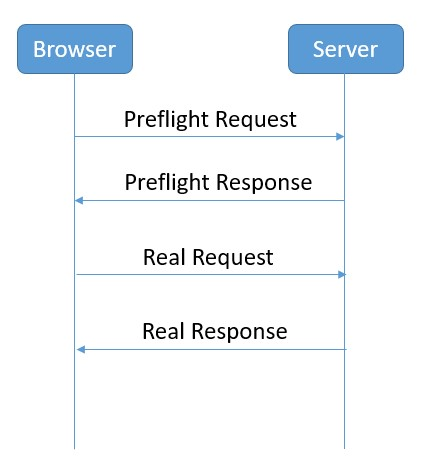
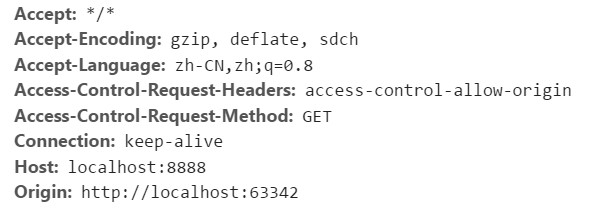
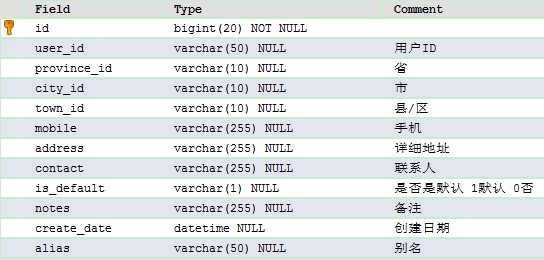
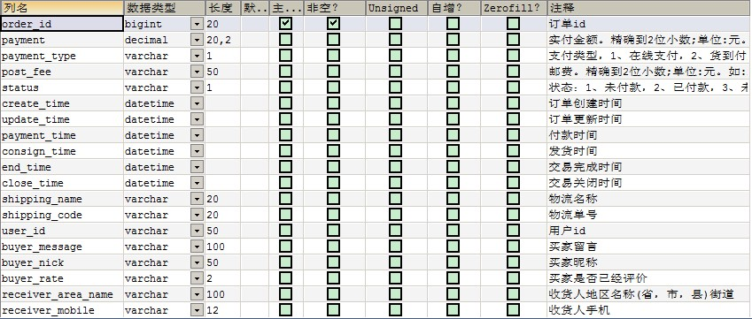

# Day18 CORS跨域请求解决方案&结算页&保存订单

## 1. 商品详细页跨域请求

### 1.1. 需求分析

从商品详细页点击“加入购物车”按钮，将当前商品加入购物车，并跳转到购物车页面。

### 1.2. JS跨域请求

js跨域是指通过js在不同的域之间进行数据传输或通信，比如用ajax向一个不同的域请求数据，或者通过js获取页面中不同域的框架中(iframe)的数据。<font color="red">**只要协议、域名、端口有任何一个不同，都被当作是不同的域。**</font>

```
http://www.pinyougou.com --> http://www.pinyougou.com (不是跨域请求)

http://item.pinyougou.com --> http://cart.pinyougou.com (跨域请求)
https://item.pinyougou.com --> http://item.pinyougou.com (跨域请求)
http://item.pinyougou.com:8080 --> http://item.pinyougou.com:8081 (跨域请求)
```

- 异步Ajax请求才会存在跨域请求。解决js跨域请求有两个方案
   1. CORS (跨域资源共享) html5
   2. JSONP

### 1.3. 跨域调用测试

修改pinyougou-item-web的itemController.js，引入$http，修改addToCart方法：

```js
/* 定义商品详情控制器 */
app.controller('itemController', function ($scope, $controller, $http) {
......
/* 定义添加商品到购物车方法 */
$scope.addToCart = function () {
    // 把SKU商品加入到购物车(跨域请求)
    $http.get("http://cart.moon.com/cart/addCart?itemId="
        + $scope.sku.id + "&num=" + $scope.num
    ).then(response => {
        if (response.data) {
            /* 成功则跳转到购物车页面 */
            location.href = 'http://cart.moon.com/cart.html';
        } else {
            alert("请求失败！");
        }
    });
};
```

发现无法Ajax跨域请求：

`No 'Access-Control-Allow-Origin' header is present on the requested resource. Origin 'http://item.moon.com' is therefore not allowed access.`


### 1.4. 跨域解决方案CORS

#### 1.4.1. CORS请求原理

CORS是一个W3C标准，全称是"跨域资源共享"（Cross-origin Resource Sharing）。CORS需要浏览器和服务器同时支持。目前，所有浏览器都支持该功能，IE浏览器不能低于IE10。

它允许浏览器向跨源服务器，发出XMLHttpRequest请求，从而克服了AJAX只能同源使用的限制。整个CORS通信过程，都是浏览器自动完成，不需要用户参与。对于开发者来说，CORS通信与同源的AJAX通信没有差别，代码完全一样。浏览器一旦发现AJAX请求跨源，就会自动添加一些附加的头信息，有时还会多出一次附加的请求，但用户不会有感觉。因此，实现CORS通信的关键是服务器。只要服务器实现了CORS接口，就可以跨源通信。请求过程如下图



Preflight Request(预检请求)：



然后服务器端会返回一个Preflight Response(预检响应)


#### 1.4.2. 配置购物车工程接收跨域请求

- 修改pinyougou-cart-web 的CartController.java的addCart方法，添加允许跨域的头部信息

```java
@GetMapping("/addCart")
public boolean addCart(Long itemId, Integer num) {
    /* 设置允许访问的域名 */
    response.setHeader("Access-Control-Allow-Origin", "http://item.moon.com");
    /* 设置允许接收Cookie */
    response.setHeader("Access-Control-Allow-Credentials", "true");
    ......
}
```

> 注：
>
> - `Access-Control-Allow-Origin`是HTML5中定义的一种解决资源跨域的策略。
> - 它是通过服务器端返回带有`Access-Control-Allow-Origin`标识的Response header，用来解决资源的跨域权限问题。
> - 使用方法，在response添加`Access-Control-Allow-Origin`：
>     - `Access-Control-Allow-Origin: item.moon.com`
>     - 也可以设置为 * 表示该资源谁都可以用

- 修改pinyougou-item-web的itemController.js的addToCart方法，请求时增加`withCredentials`属性

```js
$scope.addToCart = function () {
    // 把SKU商品加入到购物车(跨域请求)
    $http.get("http://cart.moon.com/cart/addCart?itemId="
        + $scope.sku.id + "&num=" + $scope.num, {"withCredentials": true})
        .then(response => {
            if (response.data) {
                /* 成功则跳转到购物车页面 */
                location.href = 'http://cart.moon.com/cart.html';
            } else {
                alert("请求失败！");
            }
        });
};
```

测试后，可以实现跨域。CORS请求默认不发送Cookie和HTTP认证信息。如果要把Cookie发到服务器，一方面要服务器同意，指定`Access-Control-Allow-Credentials`字段。另一方面，开发者必须在AJAX请求中打开`withCredentials`属性。否则，即使服务器同意发送Cookie，浏览器也不会发送。或者，服务器要求设置Cookie，浏览器也不会处理

### 1.5. SpringMVC跨域注解

SpringMVC在**4.2或以上版本**，可以使用注解实现跨域，只需要在需要跨域的方法上添加注解`@CrossOrigin`即可(*在类上使用此注解，则类中所有方法都实现跨域*)：

```java
@GetMapping("/addCart")
// Ajax跨域的配置（allowCredentials="true"属性可以缺省）
@CrossOrigin(origins = "http://item.moon.com", allowCredentials = "true")
public boolean addCart(Long itemId, Integer num) {
    ......
}
```

## 2. 结算页【收件人地址选择】

### 2.1. 需求与数据库分析

- 需求描述：在结算页实现收件人地址选择功能
- 数据库结构分析：tb_address为地址表



### 2.2. 初始化

#### 2.2.1. 创建与配置

1. pinyougou-user-interface创建AddressService服务接口
2. pinyougou-user-service创建AddressServiceImpl服务接口实现类
3. pinyougou-cart-web工程配置pinyougou-user-interface依赖

```xml
<!-- 配置依赖用户服务接口pinyougou-user-interface -->
<dependency>
    <groupId>com.moon</groupId>
    <artifactId>pinyougou-user-interface</artifactId>
    <version>${project.version}</version>
</dependency>
```

4. pinyougou-cart-web创建AddressController控制器

#### 2.2.2. 拷贝页面资源

拷贝【`资料/order/getOrderInfo.html`】至pinyougou-cart-web的`webapp/order`目录下面

### 2.3. 实现查询用户地址列表

#### 2.3.1. 后端代码

- 修改用户服务接口pinyougou-user-interface的AddressService.java与pinyougou-user-service的AddressServiceImpl.java，增加实现根据用户编号查询地址的方法

```java
/**
 * 根据用户id查询收货地址
 *
 * @param userId 用户id
 * @return 用户地址列表集合
 */
List<Address> findAddressByUserId(String userId);


@Service(interfaceName = "com.pinyougou.user.service.AddressService")
@Transactional
public class AddressServiceImpl implements AddressService {
    /* 注入地址数据访问mapper */
    @Autowired
    private AddressMapper addressMapper;

    /**
     * 根据用户id查询收货地址
     *
     * @param userId 用户id
     * @return 用户地址列表集合
     */
    @Override
    public List<Address> findAddressByUserId(String userId) {
        try {
            // 定义Address对象封装查询条件
            Address address = new Address();
            address.setUserId(userId);
            return addressMapper.select(address);
        } catch (Exception e) {
            e.printStackTrace();
            throw new RuntimeException(e);
        }
    }
}
```

- pinyougou-cart-web的AddressController.java，调用用户服务接口方法获取用户地址列表、

```java
@RestController
@RequestMapping("/order")
public class AddressController {

    /* 注入用户服务接口 */
    @Reference(timeout = 30000)
    private AddressService addressService;

    /**
     * 根据登录用户查询收货地址
     *
     * @param request
     * @return 用户收货地址对象集合
     */
    @GetMapping("/findAddressByUser")
    public List<Address> findAddressByUser(HttpServletRequest request) {
        // 获取登录用户名（即用户id）
        String userId = request.getRemoteUser();
        return addressService.findAddressByUserId(userId);
    }

}
```

#### 2.3.2. 前端代码

- 跳转到结算确认页面。修改pinyougou-cart-web的cart.html(154行)

```html
<div class="sumbtn">
	<a class="sum-btn" href="/order/getOrderInfo.html">结算</a>
</div>
```

- 获取用户地址。创建orderController.js，*注：需要继承cartController.js，因为订单需要调用cartController的查询购物车数据的方法*

```js
/* 定义控制器层 */
app.controller('orderController', function ($scope, $controller, baseService) {
    /* 指定继承cartController */
    $controller('cartController', {$scope: $scope});

    /* 定义根据用户id查询用户的收货地址方法 */
    $scope.findUserAddress = () => {
        baseService.sendGet('/order/findAddressByUser')
            .then(response => {
                $scope.addressList = response.data;
            });
    };
});
```

- 修改pinyougou-cart-web的getOrderInfo.html引入js

```html
<script src="/plugins/angularjs/angular.min.js"></script>
<script src="/js/base.js"></script>
<script src="/js/service/baseService.js"></script>
<script src="/js/controller/baseController.js"></script>
<script src="/js/controller/cartController.js"></script>
<script src="/js/controller/orderController.js"></script>
```

- 初始化指令，查询登录用户名与查询用户地址

```html
<body ng-app="pinyougou" ng-controller="orderController"
      ng-init="loadUsername();findUserAddress();">
```

- 显示登录用户(23行)

```html
<ul class="fl">
    <!-- 此页面必须登录，不需要判断 -->
    <li class="f-item">{{ loginName }}, 品优购欢迎您！</li>
    <li class="f-item">
        <a href="http://sso.moon.com/logout?service={{redirectUrl}}">退出</a>
    </li>
</ul>
```

- 循环地址列表(78行)

```html
<li class="addr-item">
  <div ng-repeat="item in addressList">
	<div class="con name selected">
		<a href="javascript:;" >{{ item.contact }}<span title="点击取消选择">&nbsp;</span></a>
	</div>
	<div class="con address">{{ item.address }}<span>&nbsp;&nbsp;{{ item.mobile }}</span>
		<span class="base" ng-if="item.isDefault == 1">默认地址</span>
		<span class="edittext">
			<a data-toggle="modal" data-target=".edit"
			   data-keyboard="false" >编辑</a>&nbsp;&nbsp;
			<a href="javascript:;">删除</a>
		</span>
	</div>
	<div class="clearfix"></div>
  </div>
</li>
```

### 2.4. 地址选择

- orderController.js增加选择地址的方法

```js
/* 定义选择地址方法 */
$scope.selectAddress = item => {
    $scope.address = item;
};

/* 判断是否是当前选中的地址 */
$scope.isSelectedAddress = item => {
    return item === $scope.address;
};
```

- 修改getOrderInfo.html页面-点击选择(77行)

```html
<div ng-repeat="item in addressList">
    <!-- 设置选中的样式 -->
    <div class="con name {{ isSelectedAddress(item) ? 'selected' : '' }}">
        <!-- 设置绑定选中值 -->
    	<a href="javascript:;" ng-click="selectAddress(item);">
            {{ item.contact }}<span title="点击取消选择">&nbsp;</span>
        </a>
    </div>
    ......
</div>
```

- 修改页面，显示选择的地址(242行)

```html
<div class="clearfix trade">
	<div class="fc-price">应付金额:　<span class="price">¥5399.00</span></div>
	<div class="fc-receiverInfo">
	    寄送至:{{ address.address }} 收货人：{{ address.contact }} 手机号码：{{ address.mobile }}
	</div>
</div>
```

### 2.5. 默认地址显示

修改cartController.js的findUserAddress方法，设置默认地址

```js
$scope.findUserAddress = () => {
    baseService.sendGet('/order/findAddressByUser')
        .then(response => {
            $scope.addressList = response.data;
            /*
             * 使用filter方法，对数组，筛选出符合条件的项，最终得到一个新的筛选后的数组
             *      原项目是使用for循环，判断那个元素isDefault属性值为1
             */
            var tempArr = response.data.filter((item, index) => {
                return item.isDefault === '1';
            });
            // 将筛选出来的新数组第1个元素设置为默认地址
            if (tempArr.length > 0) {
                $scope.address = tempArr[0];
            }
        });
};
```

### 2.6. (！待实现)收件人地址增加、修改与删除

> TODO: 待实现

## 3. 结算页【支付方式选择】

### 3.1. 需求分析

实现支付方式的选择，品优购支持两种支付方式：微信支付和货到付款

### 3.2. 支付方式选择

#### 3.2.1. 前端控制层

修改orderController.js，定义order对象，用于封装订单的数据。初始化支付方式的属性，支付类型数据字典：1、在线支付，2、货到付款

```js
/* 定义order对象封装参数 */
$scope.order = {paymentType : '1'};
/* 支付方式选择 */
$scope.selectPayType = type => {
    $scope.order.paymentType = type;
};
```

#### 3.2.2. 前端页面

修改getOrderInfo.html(166行)，绑定点击事件

```html
<ul class="payType">
	<li class="{{ order.paymentType === '1' ? 'selected' : '' }}"
        ng-click="selectPayType('1');">
        微信付款<span title="点击取消选择"></span>
    </li>
	<li class="{{ order.paymentType === '2' ? 'selected' : '' }}"
        ng-click="selectPayType('2');">
        货到付款<span title="点击取消选择"></span>
    </li>
</ul>
```

## 4. 结算页【商品清单与金额显示】

### 4.1. 需求分析

显示购物车中的商品清单以及合计数量、金额

### 4.2. 显示商品清单

- 在getOrderInfo.html页面上初始化调用购物车控制层findCart方法

```html
<body ng-app="pinyougou" ng-controller="orderController"
      ng-init="findCart();loadUsername();findUserAddress();">
```

- 循环显示商品清单(180行)

```html
<!-- 循环购物车集合 -->
<div ng-repeat="cart in carts">
    <!-- 一个商家的购物车中的所有商品 -->
	<ul class="yui3-g" ng-repeat="item in cart.orderItems">
		<li class="yui3-u-1-6">
			<span>
                <a href="http://item.moon.com/{{item.goodsId}}.html">
                    
                </a>
            </span>
		</li>
		<li class="yui3-u-7-12">
			<div class="desc">{{ item.title }}</div>
			<div class="seven">7天无理由退货</div>
		</li>
		<li class="yui3-u-1-12">
			<div class="price">￥{{ item.price.toFixed(2) }}</div>
		</li>
		<li class="yui3-u-1-12">
			<div class="num">X{{ item.num }}</div>
		</li>
		<li class="yui3-u-1-12">
			<div class="exit">有货</div>
		</li>
	</ul>
</div>
```

### 4.3. 显示合计金额

修改 getOrderInfo.html(238行、252行)

```html
<div class="list">
	<span><i class="number">{{ totalEntity.totalNum }}</i>件商品，总商品金额</span>
	<em class="allprice">¥{{ totalEntity.totalMoney.toFixed(2) }}</em>
</div>
......
<div class="fc-price">应付金额:　<span class="price">¥{{ totalEntity.totalMoney.toFixed(2) }}</span></div>
```

## 5. 保存订单【搭建订单服务】

### 5.1. 需求分析

#### 5.1.1. 需求描述

点击订单结算页的提交订单 ，将购物车保存到订单表和订单明细表中，并将购物车数据清除

#### 5.1.2. 数据库结构分析

- tb_order订单主表



- tb_order_item订单明细表


### 5.2. 订单服务项目搭建与相关配置

#### 5.2.1. 搭建框架

- 创建pinyougou-order聚合模块（pom类型）
    - 创建pinyougou-order-interface子模块（jar类型）
    - 创建pinyougou-order-service子模块（war类型）

#### 5.2.2. 项目配置

- pinyougou-order的pom.xml，配置tomcat插件

```xml
<build>
    <plugins>
        <!-- 配置tomcat插件 -->
        <plugin>
            <groupId>org.apache.tomcat.maven</groupId>
            <artifactId>tomcat7-maven-plugin</artifactId>
            <configuration>
                <path>/</path>
                <port>9007</port>
            </configuration>
        </plugin>
    </plugins>
</build>
```

- pinyougou-order-interface的pom.xml，配置依赖pojo模块

```xml
<dependencies>
    <dependency>
        <groupId>com.moon</groupId>
        <artifactId>pinyougou-pojo</artifactId>
        <version>${project.version}</version>
    </dependency>
</dependencies>
```

- pinyougou-order-service的pom.xml，配置相关依赖

```xml
<dependencies>
    <!-- 日志 -->
    <dependency>
        <groupId>org.slf4j</groupId>
        <artifactId>slf4j-log4j12</artifactId>
    </dependency>
    <!-- spring -->
    <dependency>
        <groupId>org.springframework</groupId>
        <artifactId>spring-web</artifactId>
    </dependency>
    <dependency>
        <groupId>org.springframework</groupId>
        <artifactId>spring-jdbc</artifactId>
    </dependency>
    <!-- dubbo相关 -->
    <dependency>
        <groupId>com.alibaba</groupId>
        <artifactId>dubbo</artifactId>
    </dependency>
    <dependency>
        <groupId>org.apache.zookeeper</groupId>
        <artifactId>zookeeper</artifactId>
    </dependency>
    <dependency>
        <groupId>com.github.sgroschupf</groupId>
        <artifactId>zkclient</artifactId>
    </dependency>
    <!-- pinyougou-mapper -->
    <dependency>
        <groupId>com.moon</groupId>
        <artifactId>pinyougou-mapper</artifactId>
        <version>${project.version}</version>
    </dependency>
    <!-- pinyougou-order-interface -->
    <dependency>
        <groupId>com.moon</groupId>
        <artifactId>pinyougou-order-interface</artifactId>
        <version>${project.version}</version>
    </dependency>
    <!-- pinyougou-common -->
    <dependency>
        <groupId>com.moon</groupId>
        <artifactId>pinyougou-common</artifactId>
        <version>${project.version}</version>
    </dependency>
</dependencies>
```

- pinyougou-order-service的web.xml，spring的核心监听器

```xml
<?xml version="1.0" encoding="UTF-8"?>
<web-app xmlns:xsi="http://www.w3.org/2001/XMLSchema-instance"
         xmlns="http://java.sun.com/xml/ns/javaee"
         xsi:schemaLocation="http://java.sun.com/xml/ns/javaee
         http://java.sun.com/xml/ns/javaee/web-app_3_0.xsd" version="3.0">

    <!-- 配置Spring加载文件 -->
    <context-param>
        <param-name>contextConfigLocation</param-name>
        <param-value>classpath:applicationContext*.xml</param-value>
    </context-param>
    <!-- 配置Spring的核心监听器 -->
    <listener>
        <listener-class>org.springframework.web.context.ContextLoaderListener</listener-class>
    </listener>

</web-app>
```

- pinyougou-order-service工程创建applicationContext-service.xml文件，配置暴露服务名称`pinyougou-order-service`与端口`20885`

```xml
<?xml version="1.0" encoding="utf-8"?>
<beans xmlns="http://www.springframework.org/schema/beans"
       xmlns:xsi="http://www.w3.org/2001/XMLSchema-instance"
       xmlns:dubbo="http://code.alibabatech.com/schema/dubbo"
       xsi:schemaLocation="http://www.springframework.org/schema/beans
                  http://www.springframework.org/schema/beans/spring-beans.xsd
                  http://code.alibabatech.com/schema/dubbo
                  http://code.alibabatech.com/schema/dubbo/dubbo.xsd">

    <!-- 导入数据访问的Spring配置文件 -->
    <import resource="classpath:applicationContext-mapper.xml"/>
    <!-- 配置导入common模块中的Redis配置文件 -->
    <import resource="classpath:applicationContext-redis.xml"/>

    <!--####### 配置dubbo服务提供者 #######-->
    <!-- 配置当前应用的名称 -->
    <dubbo:application name="pinyougou-order-service"/>
    <!-- 配置zookeeper作为注册中心，注册服务地址 -->
    <dubbo:registry protocol="zookeeper" address="192.168.12.131:2181"/>
    <!-- 用dubbo协议在20885端口暴露服务  -->
    <dubbo:protocol name="dubbo" port="20885"/>
    <!-- 配置采用包扫描来暴露服务 -->
    <dubbo:annotation package="com.pinyougou.order.service.impl"/>

</beans>
```

- 创建pinyougou-order-service的log4j.properties文件

#### 5.2.3. 创建基础的接口与现实类

- 创建pinyougou-order-interface的OrderService服务接口
- 创建pinyougou-order-service的OrderServiceImpl服务接口实现类，配置注解由spring容器管理此bean和开启事务注解
- 修改pinyougou-cart-web工程pom.xml文件，配置依赖订单服务接口jar包

```xml
<!-- 配置依赖订单服务接口pinyougou-order-interface -->
<dependency>
    <groupId>com.moon</groupId>
    <artifactId>pinyougou-order-interface</artifactId>
    <version>${project.version}</version>
</dependency>
```

- pinyougou-cart-web创建OrderController

```java
/**
 * 购物车系统-订单控制层
 */
@RestController
@RequestMapping("/order")
public class OrderController {
    /* 注入订单服务接口 */
    @Reference(timeout = 30000)
    private OrderService orderService;
}
```

#### 5.2.4. 分布式ID生成器

生成分布式ID，采用开源的twitter(非官方中文惯称：推特.是国外的一个网站，是一个社交网络及微博客服务)的snowflake算法。


1. 将【资料】目录下的IdWorker.java拷贝到pinyougou-common工程 com.pinyougou.common.util包下。
2. 在pinyougou-order-service工程的applicationContext-service.xml配置文件中添加配置

```xml
<!-- 配置IdWorker分布式ID生成器 -->
<bean id="idWorker" class="com.pinyougou.common.util.IdWorker">
    <!-- 工作中心id -->
    <constructor-arg name="workerId" value="0"/>
    <!-- 数据中心id -->
    <constructor-arg name="datacenterId" value="0"/>
</bean>
```

### 5.3. 保存订单-后端部分

#### 5.3.1. 服务实现层（pinyougou-order）

修改pinyougou-order-interface的OrderService.java与pinyougou-order-service的OrderServiceImpl.java。实现保存订单的方法

```java
public interface OrderService {
    /**
     * 保存订单
     *
     * @param order 订单实体对象
     */
    void saveOrder(Order order);
}

@Service(interfaceName = "com.pinyougou.order.service.OrderService")
@Transactional
public class OrderServiceImpl implements OrderService {
    /* 注入订单数据访问mapper接口 */
    @Autowired
    private OrderMapper orderMapper;
    @Autowired
    private OrderItemMapper orderItemMapper;
    /* 注入分布式ID生成器对象 */
    @Autowired
    private IdWorker idWorker;
    /* 注入Redis缓存操作对象 */
    @Autowired
    private RedisTemplate<String, Object> redisTemplate;

    /**
     * 保存订单
     */
    @Override
    public void saveOrder(Order order) {
        try {
            // 获取Redis中用户购物车的名称
            String userCartName = "cart_" + order.getUserId();

            // 根据用户名获取Redis中购物车数据
            List<Cart> cartList = (List<Cart>) redisTemplate
                    .boundValueOps(userCartName).get();

            /*
             * ######### 循环购物车集合往订单表插入数据(一个商家对应一个订单) ###########
             *      注：如果是实际项目则使用动态sql批量插入，现在不考虑性能问题
             */
            if (cartList != null && cartList.size() > 0) {
                for (Cart cart : cartList) {
                    // 一个Cart对应一个商家的购物车(一个订单)，创建订单对象
                    Order orderInsert = new Order();
                    /*
                     * 使用spring框架提供的BeanUtils工具类，复制实体对象
                     *   已复制可用的属性有：paymentType支付类型、userId购买用户的id、
                     *      receiverAreaName收货人地址、receiverMobile收货人手机号、
                     *      receiver收货人姓名、sourceType订单来源(PC端)
                     */
                    BeanUtils.copyProperties(order, orderInsert);
                    /* ++++++ 设置其他特殊属性 ++++++++ */
                    // 生成订单id
                    Long orderId = idWorker.nextId();
                    orderInsert.setOrderId(orderId);
                    // 设置状态码(未支付)
                    orderInsert.setStatus("1");
                    // 设置订单创建时间
                    orderInsert.setCreateTime(new Date());
                    // 设置订单修改时间
                    orderInsert.setUpdateTime(orderInsert.getCreateTime());
                    // 设置商家id
                    orderInsert.setSellerId(cart.getSellerId());

                    // 定义该订单总金额
                    double money = 0;

                    /* 迭代订单明细集合插入数据 */
                    for (OrderItem orderItem : cart.getOrderItems()) {
                        // 设置主键id
                        orderItem.setId(idWorker.nextId());
                        // 设置关联的订单id
                        orderItem.setOrderId(orderId);
                        // 设置商家id
                        orderItem.setSellerId(cart.getSellerId());
                        // 累加金额统计
                        money += orderItem.getTotalFee().doubleValue();
                        // 保存数据到订单明细表
                        orderItemMapper.insertSelective(orderItem);
                    }

                    // 设置当前商家的支付总金额
                    orderInsert.setPayment(new BigDecimal(money));

                    // 保存订单数据到订单表
                    orderMapper.insertSelective(orderInsert);
                }

                // 删除该用户购物车数据
                redisTemplate.delete(userCartName);
            }
        } catch (Exception e) {
            e.printStackTrace();
            throw new RuntimeException(e);
        }
    }
}
```

#### 5.3.2. 控制层（pinyougou-cart-web）

pinyougou-cart-web的OrderController.java，创建保存订单的方法

```java
/**
 * 保存订单
 *
 * @return 成功/失败标识
 */
@PostMapping("/save")
public boolean saveOrder(@RequestBody Order order,
                         HttpServletRequest request) {
    try {
        // 获取登陆用户名
        String userId = request.getRemoteUser();
        // 设置购买用户的id
        order.setUserId(userId);
        // 设置订单来源
        order.setSourceType("2");

        // 调用服务接口保存方法
        orderService.saveOrder(order);
        return true;
    } catch (Exception e) {
        e.printStackTrace();
    }
    return false;
}
```

### 5.4. 保存订单-前端部分

#### 5.4.1. 控制层

修改pinyougou-cart-web的orderController.js，定义保存订单的方法

```js
/* 定义保存订单方法 */
$scope.saveOrder = () => {
    // 设置收件人地址
    $scope.order.receiverAreaName = $scope.address.address;
    // 设置收件人手机号码
    $scope.order.receiverMobile = $scope.address.mobile;
    // 设置收件人
    $scope.order.receiver = $scope.address.contact;

    // 发送post异步请求
    baseService.sendPost('/order/save', $scope.order).then(response => {
        if (response.data) {
            // 下单成功
            if ($scope.order.paymentType === '1') {
                // 如果选择微信支付，跳转到扫码支付页面
                location.href = '/order/pay.html';
            } else {
                // 如果是货到付款，跳转到成功页面
                location.href = '/order/paysuccess.html';
            }
        } else {
            alert('订单提交失败！');
        }
    });
};
```

#### 5.4.2. 前端页面

修改getOrderInfo.html(247行)，绑定点击事件

```html
<a class="sui-btn btn-danger btn-xlarge"
   href="javascript:;" ng-click="saveOrder();">提交订单</a>
```

*将资料中order文件夹下的pay.html、paysuccess.html、payfail.html页面拷贝到pinyougou-cart-web项目中webapp的order目录下面。*
