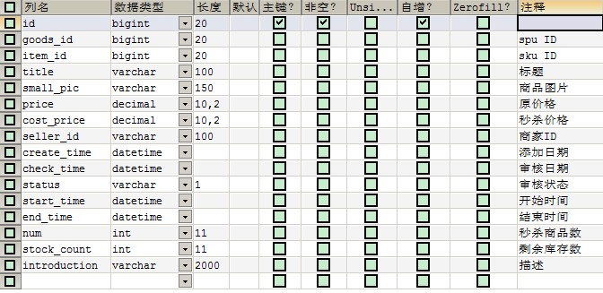
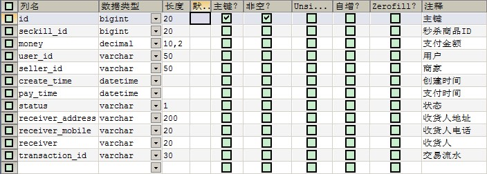

# Day20 秒杀解决方案

## 1. 秒杀业务分析

### 1.1. 需求分析

- 什么是秒杀：
    - 秒杀场景一般会在电商网站举行一些活动。对于电商网站中一些稀缺或者特价商品，电商网站一般会在约定时间点对其进行限量销售，因为这些商品的特殊性，会吸引大量用户前来抢购，并且会在约定的时间点同时在秒杀页面进行抢购。由于商品价格低廉，往往一上架就被抢购一空，有时只用一秒钟。
- 秒杀系统场景特点：
    - 秒杀时大量用户会在同一时间同时进行抢购，网站瞬时访问流量激增。
    - 秒杀一般是访问请求数量远远大于库存数量，只有少部分用户能够秒杀成功。
    - 秒杀业务流程比较简单，一般就是下订单减库存。

**秒杀商品通常有两种限制：库存限制、时间限制。**

- 需求：
    - 商家提交秒杀商品申请，录入秒杀商品数据，主要包括：商品标题、原价、秒杀价、商品图片、介绍等信息。
    - 运营商审核秒杀申请。
    - 秒杀频道首页列出秒杀商品（进行中的）点击秒杀商品图片跳转到秒杀商品详细页。
    - 商品详细页显示秒杀商品信息，点击立即抢购实现秒杀下单，下单时扣减库存。当库存为0或不在活动期范围内时无法秒杀。
    - 秒杀下单成功，直接跳转到支付页面（微信扫码），支付成功，跳转到成功页，填写收货地址、电话、收件人等信息，完成订单。
    - 当用户秒杀下单5分钟内未支付，取消预订单，调用微信支付的关闭订单接口，恢复库存。

### 1.2. 数据库表分析

- tb_seckill_goods秒杀商品表



- tb_seckill_order秒杀订单表



### 1.3. 秒杀实现思路

秒杀技术实现核心思想是运用缓存减少数据库瞬间的访问压力！读取商品详细信息时运用缓存，当用户点击抢购时减少缓存中的库存数量，当库存数为0时或活动期结束时，同步到数据库。产生的秒杀预订单也不会立刻写到数据库中，而是先写到缓存，当用户付款成功后再写入数据库。

### 1.4. 工程搭建与准备

#### 1.4.1. 工程模块搭建-秒杀服务接口与实现层

- 创建秒杀服务聚合模块pinyougou-seckill(pom类型)，配置pom.xml文件，设置tomcat端口9009

```xml
<build>
    <plugins>
        <!-- 配置tomcat插件 -->
        <plugin>
            <groupId>org.apache.tomcat.maven</groupId>
            <artifactId>tomcat7-maven-plugin</artifactId>
            <configuration>
                <path>/</path>
                <port>9009</port>
            </configuration>
        </plugin>
    </plugins>
</build>
```

- 创建秒杀服务接口模块pinyougou-seckill-interface(jar类型)，修改pom.xml文件，配置pojo模块的依赖关系

```xml
<!-- 配置依赖关系 -->
<dependencies>
    <dependency>
        <groupId>com.moon</groupId>
        <artifactId>pinyougou-pojo</artifactId>
        <version>${project.version}</version>
    </dependency>
</dependencies>
```

- 创建秒杀服务实现模块pinyougou-seckill-service(war类型)，修改pom.xml文件，配置相关依赖关系

```xml
<dependencies>
    <!-- 日志 -->
    <dependency>
        <groupId>org.slf4j</groupId>
        <artifactId>slf4j-log4j12</artifactId>
    </dependency>
    <!-- spring -->
    <dependency>
        <groupId>org.springframework</groupId>
        <artifactId>spring-web</artifactId>
    </dependency>
    <!-- dubbo相关 -->
    <dependency>
        <groupId>com.alibaba</groupId>
        <artifactId>dubbo</artifactId>
    </dependency>
    <dependency>
        <groupId>org.apache.zookeeper</groupId>
        <artifactId>zookeeper</artifactId>
    </dependency>
    <dependency>
        <groupId>com.github.sgroschupf</groupId>
        <artifactId>zkclient</artifactId>
    </dependency>
    <!-- pinyougou-seckill-interface -->
    <dependency>
        <groupId>com.moon</groupId>
        <artifactId>pinyougou-seckill-interface</artifactId>
        <version>${project.version}</version>
    </dependency>
    <!-- pinyougou-mapper -->
    <dependency>
        <groupId>com.moon</groupId>
        <artifactId>pinyougou-mapper</artifactId>
        <version>${project.version}</version>
    </dependency>
    <!-- pinyougou-common -->
    <dependency>
        <groupId>com.moon</groupId>
        <artifactId>pinyougou-common</artifactId>
        <version>${project.version}</version>
    </dependency>
</dependencies>
```

- 修改web.xml文件，配置加载spring配置文件与spring的核心监听器

```xml
<?xml version="1.0" encoding="UTF-8"?>
<web-app xmlns:xsi="http://www.w3.org/2001/XMLSchema-instance"
         xmlns="http://java.sun.com/xml/ns/javaee"
         xsi:schemaLocation="http://java.sun.com/xml/ns/javaee
         http://java.sun.com/xml/ns/javaee/web-app_3_0.xsd" version="3.0">

    <!-- 配置Spring加载文件 -->
    <context-param>
        <param-name>contextConfigLocation</param-name>
        <param-value>classpath:applicationContext*.xml</param-value>
    </context-param>
    <!-- 配置Spring的核心监听器 -->
    <listener>
        <listener-class>org.springframework.web.context.ContextLoaderListener</listener-class>
    </listener>

</web-app>
```

- 创建applicationContext-service.xml文件，配置dubbo框架暴露服务，端口20887

```xml
<?xml version="1.0" encoding="utf-8"?>
<beans xmlns="http://www.springframework.org/schema/beans"
       xmlns:xsi="http://www.w3.org/2001/XMLSchema-instance"
       xmlns:dubbo="http://code.alibabatech.com/schema/dubbo"
       xsi:schemaLocation="http://www.springframework.org/schema/beans
                  http://www.springframework.org/schema/beans/spring-beans.xsd
                  http://code.alibabatech.com/schema/dubbo
                  http://code.alibabatech.com/schema/dubbo/dubbo.xsd">

    <!-- 导入数据访问的Spring配置文件 -->
    <import resource="classpath:applicationContext-mapper.xml"/>
    <!-- 配置导入common模块中的Redis配置文件 -->
    <import resource="classpath:applicationContext-redis.xml"/>

    <!--####### 配置dubbo服务提供者 #######-->
    <!-- 配置当前应用的名称 -->
    <dubbo:application name="pinyougou-seckill-service"/>
    <!-- 配置zookeeper作为注册中心，注册服务地址 -->
    <dubbo:registry protocol="zookeeper" address="192.168.12.131:2181"/>
    <!-- 用dubbo协议在20887端口暴露服务  -->
    <dubbo:protocol name="dubbo" port="20887"/>
    <!-- 配置采用包扫描来暴露服务 -->
    <dubbo:annotation package="com.pinyougou.seckill.service.impl"/>

</beans>
```

- 创建log4j.properties文件

#### 1.4.2. 工程模块搭建-秒杀表现层

- 创建秒杀频道web模块pinyougou-seckill-web(war类型)，修改pom.xml文件，配置相关依赖与tomcat插件，端口为9109

```xml
<!-- 配置依赖关系 -->
<dependencies>
    <!-- JSON处理工具包 -->
    <dependency>
        <groupId>com.alibaba</groupId>
        <artifactId>fastjson</artifactId>
    </dependency>
    <!-- 日志 -->
    <dependency>
        <groupId>org.slf4j</groupId>
        <artifactId>slf4j-log4j12</artifactId>
    </dependency>
    <!-- apache工具组件 -->
    <dependency>
        <groupId>org.apache.commons</groupId>
        <artifactId>commons-lang3</artifactId>
    </dependency>
    <!-- spring4 -->
    <dependency>
        <groupId>org.springframework</groupId>
        <artifactId>spring-webmvc</artifactId>
    </dependency>
    <!-- dubbo -->
    <dependency>
        <groupId>com.alibaba</groupId>
        <artifactId>dubbo</artifactId>
    </dependency>
    <!-- zookeeper分布式协调服务 -->
    <dependency>
        <groupId>org.apache.zookeeper</groupId>
        <artifactId>zookeeper</artifactId>
    </dependency>
    <!-- zkclient(zookeeper客户端) -->
    <dependency>
        <groupId>com.github.sgroschupf</groupId>
        <artifactId>zkclient</artifactId>
    </dependency>
    <!-- cas-client-core -->
    <dependency>
        <groupId>org.jasig.cas.client</groupId>
        <artifactId>cas-client-core</artifactId>
    </dependency>
    <!-- servlet-api -->
    <dependency>
        <groupId>org.apache.tomcat.embed</groupId>
        <artifactId>tomcat-embed-core</artifactId>
        <scope>provided</scope>
    </dependency>
    <!-- pinyougou-common -->
    <dependency>
        <groupId>com.moon</groupId>
        <artifactId>pinyougou-common</artifactId>
        <version>${project.version}</version>
    </dependency>
    <!-- pinyougou-seckill-interface -->
    <dependency>
        <groupId>com.moon</groupId>
        <artifactId>pinyougou-seckill-interface</artifactId>
        <version>${project.version}</version>
    </dependency>
</dependencies>
<!-- 构建部分 -->
<build>
    <plugins>
        <!-- 配置tomcat插件 -->
        <plugin>
            <groupId>org.apache.tomcat.maven</groupId>
            <artifactId>tomcat7-maven-plugin</artifactId>
            <configuration>
                <port>9109</port>
                <path>/</path>
            </configuration>
        </plugin>
    </plugins>
</build>
```

- 修改web.xml文件，配置Spring MVC核心控制器、CAS单点登录客户端

```xml
<?xml version="1.0" encoding="UTF-8"?>
<web-app xmlns:xsi="http://www.w3.org/2001/XMLSchema-instance"
         xmlns="http://java.sun.com/xml/ns/javaee"
         xsi:schemaLocation="http://java.sun.com/xml/ns/javaee
         http://java.sun.com/xml/ns/javaee/web-app_3_0.xsd" version="3.0">

    <!-- 配置Spring MVC前端控制器(核心控制器) -->
    <servlet>
        <servlet-name>pinyougou-seckill-web</servlet-name>
        <servlet-class>org.springframework.web.servlet.DispatcherServlet</servlet-class>
        <init-param>
            <param-name>contextConfigLocation</param-name>
            <param-value>classpath:pinyougou-seckill-web-servlet.xml</param-value>
        </init-param>
        <load-on-startup>1</load-on-startup>
    </servlet>
    <servlet-mapping>
        <servlet-name>pinyougou-seckill-web</servlet-name>
        <url-pattern>/</url-pattern>
    </servlet-mapping>

    <!-- 配置全局编码过滤器 -->
    <filter>
        <filter-name>characterEncodingFilter</filter-name>
        <filter-class>org.springframework.web.filter.CharacterEncodingFilter</filter-class>
        <init-param>
            <param-name>encoding</param-name>
            <param-value>UTF-8</param-value>
        </init-param>
    </filter>
    <filter-mapping>
        <filter-name>characterEncodingFilter</filter-name>
        <url-pattern>/*</url-pattern>
    </filter-mapping>

    <!--############## CAS单点登录配置-begin ################-->
    <!-- 配置单点退出过滤器 (可选配置) -->
    <filter>
        <filter-name>ssoutFilter</filter-name>
        <filter-class>org.jasig.cas.client.session.SingleSignOutFilter</filter-class>
        <!-- 配置CAS服务URL前缀 -->
        <init-param>
            <param-name>casServerUrlPrefix</param-name>
            <param-value>http://sso.moon.com</param-value>
        </init-param>
    </filter>
    <filter-mapping>
        <filter-name>ssoutFilter</filter-name>
        <url-pattern>/*</url-pattern>
    </filter-mapping>

    <!-- 配置身份认证过滤器(必须启用)(注：此部分拦截不需要跳转到CAS登录系统) -->
    <filter>
        <filter-name>anonAuthenticationFilter</filter-name>
        <filter-class>org.jasig.cas.client.authentication.AuthenticationFilter</filter-class>
        <init-param>
            <!-- 配置CAS服务端登录地址 -->
            <param-name>casServerLoginUrl</param-name>
            <param-value>http://sso.moon.com</param-value>
        </init-param>
        <init-param>
            <!-- 配置服务名称 -->
            <param-name>serverName</param-name>
            <param-value>http://seckill.moon.com</param-value>
        </init-param>
        <!-- 配置“gateway=true”时，启用异步方式认证 -->
        <init-param>
            <param-name>gateway</param-name>
            <param-value>true</param-value>
        </init-param>
    </filter>
    <filter-mapping>
        <filter-name>anonAuthenticationFilter</filter-name>
        <!-- 只拦截html页面 -->
        <url-pattern>*.html</url-pattern>
    </filter-mapping>

    <!-- 配置身份认证过滤器(必须启用)(注：此部分拦截需要跳转到CAS登录系统) -->
    <filter>
        <filter-name>authenticationFilter</filter-name>
        <filter-class>org.jasig.cas.client.authentication.AuthenticationFilter</filter-class>
        <init-param>
            <!-- 配置CAS服务端登录地址 -->
            <param-name>casServerLoginUrl</param-name>
            <param-value>http://sso.moon.com</param-value>
        </init-param>
        <init-param>
            <!-- 配置服务名称 -->
            <param-name>serverName</param-name>
            <param-value>http://seckill.moon.com</param-value>
        </init-param>
    </filter>
    <filter-mapping>
        <filter-name>authenticationFilter</filter-name>
        <!-- 只拦截order部分的页面 -->
        <url-pattern>/order/*</url-pattern>
    </filter-mapping>

    <!-- 该过滤器负责对ticket的校验工作(必须启用) -->
    <filter>
        <filter-name>ticketValidationFilter</filter-name>
        <filter-class>org.jasig.cas.client.validation.Cas20ProxyReceivingTicketValidationFilter</filter-class>
        <!-- 配置CAS服务URL前缀 -->
        <init-param>
            <param-name>casServerUrlPrefix</param-name>
            <param-value>http://sso.moon.com</param-value>
        </init-param>
        <!-- 配置服务名称 -->
        <init-param>
            <param-name>serverName</param-name>
            <param-value>http://seckill.moon.com</param-value>
        </init-param>
    </filter>
    <filter-mapping>
        <filter-name>ticketValidationFilter</filter-name>
        <url-pattern>/*</url-pattern>
    </filter-mapping>

    <!--
      配置HttpServletRequest请求包裹过滤器 (可选配置)
      说明：通过HttpServletRequest的getRemoteUser()方法获取SSO登录用户名
    -->
    <filter>
        <filter-name>httpServletRequestWrapperFilter</filter-name>
        <filter-class>org.jasig.cas.client.util.HttpServletRequestWrapperFilter</filter-class>
    </filter>
    <filter-mapping>
        <filter-name>httpServletRequestWrapperFilter</filter-name>
        <url-pattern>/*</url-pattern>
    </filter-mapping>
    <!--############## CAS单点登录配置-end ################-->

    <!-- 欢迎列表 -->
    <welcome-file-list>
        <welcome-file>seckill-index.html</welcome-file>
    </welcome-file-list>

</web-app>
```

- 创建pinyougou-seckill-web-servlet.xml文件，配置dubbo服务消费者

```xml
<?xml version="1.0" encoding="utf-8"?>
<beans xmlns="http://www.springframework.org/schema/beans"
       xmlns:xsi="http://www.w3.org/2001/XMLSchema-instance"
       xmlns:mvc="http://www.springframework.org/schema/mvc"
       xmlns:dubbo="http://code.alibabatech.com/schema/dubbo"
       xsi:schemaLocation="http://www.springframework.org/schema/beans
                  http://www.springframework.org/schema/beans/spring-beans.xsd
                  http://www.springframework.org/schema/mvc
                  http://www.springframework.org/schema/mvc/spring-mvc.xsd
                  http://code.alibabatech.com/schema/dubbo
                  http://code.alibabatech.com/schema/dubbo/dubbo.xsd">

    <!-- 开启MVC注解驱动 -->
    <mvc:annotation-driven>
        <!-- 配置消息转换 -->
        <mvc:message-converters>
            <!-- 配置用fastjson做为json处理框架 -->
            <bean class="com.alibaba.fastjson.support.spring.FastJsonHttpMessageConverter">
                <!-- 配置支持的类型 -->
                <property name="supportedMediaTypes"
                          value="application/json;charset=UTF-8"/>
            </bean>
        </mvc:message-converters>
    </mvc:annotation-driven>

    <!-- 配置静态资源用WEB容器默认的servlet来处理 -->
    <mvc:default-servlet-handler/>

    <!-- ############## 配置dubbo服务消费者 ############## -->
    <!-- 配置当前应用的名称 -->
    <dubbo:application name="pinyougou-seckill-web"/>
    <!-- 配置注册中心，注册服务 -->
    <dubbo:registry address="zookeeper://192.168.12.131:2181"/>
    <!-- 配置引用服务，产生服务接口的代理对象(采用包扫描)-->
    <dubbo:annotation package="com.pinyougou.seckill.controller"/>

</beans>
```

- 创建log4j.properties文件
- 拷贝【资料\秒杀系统静态资源】目录下的文件到pinyougou-seckill-web项目webapp目录下

#### 1.4.3. 基础代码创建

- 拷贝【资料\pojo】目录下的实体类到pinyougou-pojo工程中。
- 拷贝【资料\mapper】目录下的数据访问接口与sql映射文件到pinyougou-mapper工程中。
- 创建SeckillGoodsService服务接口
- 创建SeckillGoodsServiceImpl服务接口实现类
- 创建SeckillGoodsController控制器
- 拷贝其他系统的LoginController控制器到pinyougou-seckill-web

### 1.5. 配置域名访问

- 修改hosts文件增加映射：`127.0.0.1 seckill.moon.com`
- 修改nginx.conf文件

```conf
server {
	listen       80;
	server_name  seckill.moon.com;

	proxy_set_header X-Forwarded-Host $host;
	proxy_set_header X-Forwarded-Server $host;
	proxy_set_header Host $host;

	location / {
		   proxy_pass http://127.0.0.1:9109;
		   proxy_connect_timeout 600;
		   proxy_read_timeout 600;
	}
}
```

### 1.6. 秒杀商品后台管理（！待完成）

- 运营商系统web模块pinyougou-manager-web依赖pinyougou-seckill-interface
- 商家系统web模块pinyougou-shop-web依赖pinyougou-seckill-interface

#### 1.6.1. 商家后台

- 秒杀商品列表
- 秒杀商品申请
- 秒杀订单查询

#### 1.6.2. 运营商后台

- 待审核秒杀商品列表
- 秒杀商品审核
- 秒杀订单查询

## 2. 品优购-秒杀频道首页

### 2.1. 需求分析

需求：秒杀频道首页，显示正在秒杀的商品（已经开始，未结束的商品）

### 2.2. 后端部分

#### 2.2.1. 秒杀服务接口与实现层

- pinyougou-seckill-interface的SeckillGoodsService.java，增加查询当前参与秒杀的商品

```java
/**
 * 秒杀商品服务接口
 */
public interface SeckillGoodsService {
    /**
     * 查询当前正在参与秒杀的商品集合
     *
     * @return 秒杀商品集合
     */
    List<SeckillGoods> findSeckillGoods();
}
```

- pinyougou-seckill-service的SeckillGoodsServiceImpl.java，实现接口的查询方法

```java
/**
 * 秒杀商品服务接口实现类
 */
@Service(interfaceName = "com.pinyougou.seckill.service.SeckillGoodsService")
@Transactional
public class SeckillGoodsServiceImpl implements SeckillGoodsService {

    /* 注入秒杀商品数据访问接口 */
    @Autowired
    private SeckillGoodsMapper seckillGoodsMapper;

    /**
     * 查询当前正在参与秒杀的商品集合
     *
     * @return 秒杀商品集合
     */
    @Override
    public List<SeckillGoods> findSeckillGoods() {
        try {
            // 创建示范对象
            Example example = new Example(SeckillGoods.class);
            // 查询条件对象
            Example.Criteria criteria = example.createCriteria();
            // 通过查询条件对象，添加查询条件
            // 审核通过的秒杀商品
            criteria.andEqualTo("status", "1");
            // 剩余库存数据大于零
            criteria.andGreaterThan("stockCount", 0);
            // 秒杀开始时间小于等于当前时间
            criteria.andLessThanOrEqualTo("startTime", new Date());
            // 秒杀结束时间大于等于当前时间
            criteria.andGreaterThanOrEqualTo("endTime", new Date());

            // 查询秒杀商品集合
            List<SeckillGoods> seckillGoods = seckillGoodsMapper.selectByExample(example);
            return seckillGoods;
        } catch (Exception e) {
            e.printStackTrace();
            throw new RuntimeException(e);
        }
    }
}
```

#### 2.2.2. 秒杀系统-控制层

pinyougou-seckill-web的SeckillGoodsController.java，增加查询方法

```java
/**
 * 秒杀系统-秒杀商品的控制器
 */
@RestController
@RequestMapping("/seckill")
public class SeckillGoodsController {

    /* 注入秒杀商品服务接口 */
    @Reference(timeout = 30000)
    private SeckillGoodsService seckillGoodsService;

    /**
     * 查询当前秒杀商品列表
     *
     * @return 秒杀商品集合
     */
    @GetMapping("/findSeckillGoods")
    public List<SeckillGoods> findSeckillGoods() {
        return seckillGoodsService.findSeckillGoods();
    }

}
```

### 2.3. 前端部分

#### 2.3.1. 秒杀系统前端控制器

pinyougou-seckill-web创建seckillGoodsController.js，定义查询秒杀商品的方法

```js
/* 定义控制器层 */
app.controller('seckillGoodsController', function ($scope, $controller, baseService) {
    /* 指定继承baseController */
    $controller('baseController', {$scope: $scope});

    /* 查询当前正在秒杀的商品列表 */
    $scope.findSeckillGoods = () => {
        baseService.sendGet("/seckill/findSeckillGoods").then(response => {
            $scope.seckillGoodsList = response.data;
        });
    };
});
```

#### 2.3.2. 秒杀系统前端页面

- 修改seckill-index.html，引入js

```html
<script src="/plugins/angularjs/angular.min.js"></script>
<script src="/js/base.js"></script>
<script src="/js/service/baseService.js"></script>
<script src="/js/controller/baseController.js"></script>
<script src="/js/controller/seckillGoodsController.js"></script>
```

- 初始化查询指令

```html
<body ng-app="pinyougou" ng-controller="seckillGoodsController"
      ng-init="loadUsername();findSeckillGoods();">
```

- 显示登录用户信息(30行)

```html
<ul class="fl">
	<li class="f-item" ng-if="loginName">{{ loginName }}, 品优购欢迎您！</li>
	<li class="f-item" ng-if="!loginName">请
        <a href="http://sso.moon.com/?service={{redirectUrl}}">登录</a>
		<a href="http://user.moon.com/register.html">免费注册</a>
	</li>
	<li class="f-item" ng-if="loginName">
        <a href="http://sso.moon.com/logout?service={{redirectUrl}}">退出</a>
	</li>
</ul>
```

- 循环列表的实现(180行)

```html
<!--商品列表-->
<div class="goods-list">
	<ul class="seckill" id="seckill">
		<li class="seckill-item" ng-repeat="goods in seckillGoodsList">
			<div class="pic">
                <a href="/seckill-item.html?id={{goods.id}}">
                    
                </a>
			</div>
			<div class="intro"><span>{{ goods.title }}</span></div>
			<div class='price'>
                <b class='sec-price'>￥{{ goods.costPrice }}</b>
                <b class='ever-price'>￥{{ goods.price }}</b>
            </div>
			<div class='num'>
				<div>已售{{ ((goods.num - goods.stockCount) / goods.num * 100).toFixed(0) }}%</div>
				<div class='progress'>
					<div class='sui-progress progress-danger'>
                        <span style='width:{{((goods.num-goods.stockCount)/goods.num*100).toFixed(0)}}%;'
                              class='bar'></span>
                    </div>
				</div>
				<div>剩余<b class='owned'>{{ goods.stockCount }}</b>件</div>
			</div>
			<a class='sui-btn btn-block btn-buy' href='/seckill-item.html?id={{goods.id}}'
               target='_blank'>立即抢购</a>
		</li>
	</ul>
</div>
```

### 2.4. 缓存处理

修改SeckillGoodsServiceImpl.java的findSeckillGoods方法，增加从redis查询秒杀商品列表与更新秒杀商品到redis缓存中

```java
/* 注入Redis缓存操作对象 */
@Autowired
private RedisTemplate redisTemplate;

@Override
public List<SeckillGoods> findSeckillGoods() {
    // 定义秒杀商品集合
    List<SeckillGoods> seckillGoodsList = null;

    try {
        /* 从Redis缓存中获取秒杀商品集合 */
        seckillGoodsList = (List<SeckillGoods>) redisTemplate
                .boundHashOps("seckillGoodsList").values();

        // 判断缓存中是否有秒杀商品集合
        if (seckillGoodsList != null && seckillGoodsList.size() > 0) {
            System.out.println("从Redis缓存中获取：" + seckillGoodsList);
            return seckillGoodsList;
        }
    } catch (Exception e) {
        e.printStackTrace();
    }

    /* 如果缓存中没有秒杀商品数据，查询数据库并更新到缓存中 */
    try {
        // 创建示范对象
        Example example = new Example(SeckillGoods.class);
        // 查询条件对象
        Example.Criteria criteria = example.createCriteria();
        // 通过查询条件对象，添加查询条件
        // 审核通过的秒杀商品
        criteria.andEqualTo("status", "1");
        // 剩余库存数据大于零
        criteria.andGreaterThan("stockCount", 0);
        // 秒杀开始时间小于等于当前时间
        criteria.andLessThanOrEqualTo("startTime", new Date());
        // 秒杀结束时间大于等于当前时间
        criteria.andGreaterThanOrEqualTo("endTime", new Date());

        // 查询秒杀商品集合
        seckillGoodsList = seckillGoodsMapper.selectByExample(example);

        try {
            System.out.println("==将秒杀商品数据存入缓存==");
            // 把查询到得秒杀商品存入Redis中
            for (SeckillGoods seckillGoods : seckillGoodsList) {
                redisTemplate.boundHashOps("seckillGoodsList")
                        .put(seckillGoods.getId(), seckillGoods);
            }
        } catch (Exception e) {
            // 如果存入缓存失败，则返回从数据库查询的数据
            e.printStackTrace();
        }
        // 返回数据
        return seckillGoodsList;
    } catch (Exception e) {
        e.printStackTrace();
        throw new RuntimeException(e);
    }
}
```

## 3. 品优购-秒杀详细页

### 3.1. 需求分析

商品详细页显示秒杀商品信息。

### 3.2. 显示详细页信息

#### 3.2.1. 秒杀系统-后端部分

- 修改pinyougou-seckill-interface的SeckillGoodsService与pinyougou-seckill-service的SeckillGoodsServiceImpl.java，增加根据id查询秒杀商品的方法

```java
/**
 * 根据ID获取秒杀商品(从缓存中读取)
 *
 * @param id 秒杀商品id
 * @return 秒杀商品对象
 */
SeckillGoods findOneByRedis(Long id);

/* 实现类 */
@Override
public SeckillGoods findOneByRedis(Long id) {
    try {
        return (SeckillGoods) redisTemplate
                .boundHashOps("seckillGoodsList").get(id);
    } catch (Exception e) {
        e.printStackTrace();
        throw new RuntimeException(e);
    }
}
```

- 修改pinyougou-seckill-web的SeckillGoodsController，增加根据id查询的方法

```java
/**
 * 根据秒杀商品的id查询一个秒杀商品
 *
 * @param id 秒杀商品id
 * @return 秒杀商品对象
 */
@GetMapping("/findOne")
public SeckillGoods findOne(Long id) {
    return seckillGoodsService.findOneByRedis(id);
}
```

#### 3.2.2. 秒杀系统-前端部分

- pinyougou-seckill-web的seckillGoodsController.js，引入$location，获取url后面的参数

```js

app.controller('seckillGoodsController', function ($scope, $controller, 
                    $location, baseService) {
    ......
    /* 根据秒杀商品id查询秒杀商品 */
    $scope.findOne = () => {
        // 获取请求url的参数商品id
        let id = $location.search().id;
        // 发送get异步请求，查询单个秒杀商品
        baseService.sendGet("/seckill/findOne", "id=" + id)
            .then(response => {
                $scope.entity = response.data;
            });
    };
});

```

- 修改seckill-item.html，引入相关的js，配置位置提供者

```html
<script src="/plugins/angularjs/angular.min.js"></script>
<script src="/js/base.js"></script>
<script src="/js/service/baseService.js"></script>
<script src="/js/controller/baseController.js"></script>
<script src="/js/controller/seckillGoodsController.js"></script>

<!-- 加入base标签  -->
<base href="/"/>
<script type="text/javascript">
    /* 配置位置提供者 */
    app.config(function ($locationProvider) {
        $locationProvider.html5Mode(true);
    });
</script>
```

- 初始化指令

```html
<body ng-app="pinyougou" ng-controller="seckillGoodsController"
      ng-init="findOne();loadUsername();">
```

- 显示登录用户信息(38行)

```html
<ul class="fl">
    <li class="f-item" ng-if="loginName">{{ loginName }}, 品优购欢迎您！</li>
    <li class="f-item" ng-if="!loginName">请
        <a href="http://sso.moon.com/?service={{redirectUrl}}">登录</a>
        <a href="http://user.moon.com/register.html">免费注册</a>
    </li>
    <li class="f-item" ng-if="loginName">
        <a href="http://sso.moon.com/logout?service={{redirectUrl}}">退出</a>
    </li>
</ul>
```

- 修改页面显示秒杀商品的相关信息

```html
<!-- ######## 用表达式显示标题(203行) ######## -->
<div class="sku-name">
	<h4>{{ entity.title }}</h4>
</div>

<!-- ######## 图片(196行) ######## -->
<span class="jqzoom">
    
</span>

<!-- ######## 价格、剩余库存(220行) ######## -->
<div class="fl price">
	<i>¥</i>
	<em>{{ entity.costPrice.toFixed(2) }}</em>
	<span>原价：{{ entity.price.toFixed(2) }}</span>
</div>
<div class="fr remark">
	剩余库存：{{ entity.stockCount }}
</div>

<!-- ######## 商品介绍(453行) ######## -->
<div class="intro-detail">
    {{ entity.introduction }}
</div>
```

### 3.3. 秒杀倒计时效果

#### 3.3.1. `$timeout`服务简介

使用Angular中`$timeout`延迟定时器服务，格式为：`$timeout(执行的函数, 间隔的毫秒数);`

#### 3.3.2. 秒杀倒计时

- 修改seckillGoodsController.js，定义倒计时方法

```js
app.controller('seckillGoodsController', function ($scope, $controller,
                                                   $location, $timeout, baseService) {
    ......
    $scope.findOne = () => {
        ......
        baseService.sendGet("/seckill/findOne", "id=" + id)
            .then(response => {
                $scope.entity = response.data;
                // 调用倒计时方法，秒杀倒计时(结束时间)
                $scope.downCount($scope.entity.endTime);
            });
    };

    /* 定义秒杀倒计时方法 */
    $scope.downCount = endTime => {
        // 获取秒杀商品结束时间的毫秒数
        let seckillGoodsEndTime = new Date(endTime).getTime();
        // 计算出与当前时间相差的秒数
        let seconds = Math.floor((seckillGoodsEndTime - new Date().getTime()) / 1000);
        // 判断秒数
        if (seconds >= 0) { // 正在秒杀中
            // 1天 20:20:20
            // 计算出相差的分钟
            let minuts = Math.floor(seconds / 60);
            // 计算出相差的小时
            let hours = Math.floor(minuts / 60);
            // 计算出相差的天数
            let days = Math.floor(hours / 24);

            // 定义数组封装最后显示的字符串
            let res = [];
            if (days > 0) {
                res.push(days + "天 ");
            }
            if (hours > 0) {
                res.push($scope.calc(hours - days * 24) + ":");
            }
            if (minuts > 0) {
                res.push($scope.calc(minuts - hours * 60) + ":");
            }
            if (seconds > 0) {
                res.push($scope.calc(seconds - minuts * 60));
            }

            $scope.timeStr = res.join("");

            // 开启延迟的定时器
            $timeout(function () {
                $scope.downCount(endTime);
            }, 1000);
        } else {
            // 秒杀结束
            $scope.timeStr = "秒杀结束！";
        }
    };
    $scope.calc = function (time) {
        return time > 9 ? time : "0" + time;
    };
});
```

- 修改页面seckill-item.html ，显示倒计时的值(210行)

```html
<span class="overtime">距离结束：{{ timeStr }}</span>
```

## 4. 品优购-秒杀下单

### 4.1. 需求分析

商品详细页点击立即抢购实现秒杀下单，**订单先存储到Redis**中减轻MySql数据库压力，**下单时扣减库存(Redis中缓存商品的库存)。当库存为0时修改数据库秒杀商品库存同时删除Redis中秒杀商品**。

### 4.2. 秒杀系统-后端代码

#### 4.2.1. 秒杀服务接口层

- pinyougou-seckill-interface创建SeckillOrderService.java，定义提交订单到redis的方法

```java
/**
 * 秒杀订单服务接口
 */
public interface SeckillOrderService {
    /**
     * 提交订单到Redis
     *
     * @param seckillId 秒杀商品id
     * @param userId    用户id
     */
    void submitOrderToRedis(Long seckillId, String userId);
}
```

#### 4.2.2. 秒杀服务实现层

- 修改applicationContext-service.xml配置文件，配置IdWorker分布式id生成器

```xml
<!-- 配置IdWorker分布式ID生成器 -->
<bean id="idWorker" class="com.pinyougou.common.util.IdWorker">
    <!-- 工作中心id -->
    <constructor-arg name="workerId" value="0"/>
    <!-- 数据中心id -->
    <constructor-arg name="datacenterId" value="0"/>
</bean>
```

- pinyougou-seckill-service创建SeckillOrderServiceImpl.java，实现提交订单的方法

```java
/**
 * 秒杀订单服务接口实现类
 */
@Service(interfaceName = "com.pinyougou.seckill.service.SeckillOrderService")
@Transactional
public class SeckillOrderServiceImpl implements SeckillOrderService {

    /* 注入缓存操作对象 */
    @Autowired
    private RedisTemplate<String, Object> redisTemplate;
    /* 注入分布式ID生成器 */
    @Autowired
    private IdWorker idWorker;
    /* 注入秒杀商品数据访问层接口 */
    @Autowired
    private SeckillGoodsMapper seckillGoodsMapper;

    /**
     * 提交订单到Redis
     *
     * @param seckillId 秒杀商品id
     * @param userId    用户id
     */
    @Override
    public void submitOrderToRedis(Long seckillId, String userId) {
        try {
            // 从Redis中获取秒杀商品
            SeckillGoods seckillGoods = (SeckillGoods) redisTemplate
                    .boundHashOps("seckillGoodsList").get(seckillId);

            // 判断秒杀商品是否存在，与库存是否大于0
            if (seckillGoods != null && seckillGoods.getStockCount() > 0) {
                // 减库存(Redis中的秒杀商品)
                seckillGoods.setStockCount(seckillGoods.getStockCount() - 1);

                // 判断秒杀商品的剩余库存数量是否为0
                if (seckillGoods.getStockCount() == 0) {
                    // 当秒杀商品为0时，把秒杀商品剩余库存数量同步到数据库表
                    seckillGoodsMapper.updateByPrimaryKeySelective(seckillGoods);
                    // 删除Redis中的秒杀商品
                    redisTemplate.boundHashOps("seckillGoodsList").delete(seckillId);
                } else {
                    // 如果秒杀商品库存不为0，则更新Redis中该秒杀商品的剩余库存数据
                    redisTemplate.boundHashOps("seckillGoodsList").put(seckillId, seckillGoods);
                }

                /* 创建秒杀订单对象 */
                SeckillOrder seckillOrder = new SeckillOrder();
                // 设置秒杀订单的id
                seckillOrder.setId(idWorker.nextId());
                // 设置秒杀商品id
                seckillOrder.setSeckillId(seckillId);
                // 设置秒杀商品价格
                seckillOrder.setMoney(seckillGoods.getCostPrice());
                // 设置用户id
                seckillOrder.setUserId(userId);
                // 设置商家id
                seckillOrder.setSellerId(seckillGoods.getSellerId());
                // 设置创建时间
                seckillOrder.setCreateTime(new Date());
                // 设置状态码(未支付)
                seckillOrder.setStatus("0");

                // 把秒杀订单存入Redis缓存
                redisTemplate.boundHashOps("seckillOrderList").put(userId, seckillOrder);
            }
        } catch (Exception e) {
            e.printStackTrace();
            throw new RuntimeException(e);
        }
    }
}
```

#### 4.2.3. 秒杀系统控制层

pinyougou-seckill-web创建SeckillOrderController.java

```java
/**
 * 秒杀系统-秒杀订单控制器
 */
@RestController
@RequestMapping("/order")
public class SeckillOrderController {

    /* 注入秒杀订单服务 */
    @Reference(timeout = 30000)
    private SeckillOrderService seckillOrderService;

    /**
     * 秒杀下单(提交订单到Redis)
     *
     * @param seckillId 秒杀商品id
     * @param request
     * @return 操作状态
     */
    @GetMapping("/submitOrder")
    public Map<String, Integer> submitOrder(Long seckillId, HttpServletRequest request) {
        // 定义返回的map，初始返回状态码
        Map<String, Integer> data = new HashMap<>();
        data.put("status", 500);
        try {
            // 调用秒杀订单服务下单的方法
            seckillOrderService.submitOrderToRedis(seckillId, request.getRemoteUser());
            data.put("status", 200);
        } catch (Exception e) {
            e.printStackTrace();
        }
        return data;
    }
}
```

### 4.3. 秒杀系统-前端代码

#### 4.3.1. 秒杀系统-前端控制层

修改pinyougou-seckill-web的seckillGoodsController.js，定义下单方法

```js
/* 提交秒杀订单到Redis */
$scope.submitOrder = () => {
    // 判断登录用户名是否为空
    if ($scope.loginName) {
        // 用户已登陆，发送异步请求下单
        baseService.sendGet("/order/submitOrder",
            "seckillId=" + $scope.entity.id).then(response => {
            // 判断返回状态码
            if (response.data.status === 200) {
                // 下单成功，跳转到支付页面
                location.href = "/order/pay.html";
            } else {
                alert("下单失败");
            }
        });
    } else {
        // 用户未登陆，跳转到CAS单点登录系统
        location.href = "http://sso.moon.com/?service=" + $scope.redirectUrl;
    }
};
```

#### 4.3.2. 秒杀系统-前端页面

修改seckill-item.html(265行)，“秒杀抢购”按钮绑定点击事件

```html
<ul class="btn-choose unstyled">
    <li>
        <a href="javascript:;" ng-click="submitOrder();"
           class="sui-btn  btn-danger addshopcar">秒杀抢购</a>
    </li>
</ul>
```

## 5. 品优购-秒杀支付

### 5.1. 需求分析

用户成功下单后，跳转到支付页面。支付页显示微信支付二维码。用户完成支付后，保存订单到数据库。

### 5.2. 生成支付二维码

#### 5.2.1. 后端代码

- pinyougou-seckill-web工程引入pinyougou-pay-interface依赖

```xml
<!-- pinyougou-pay-interface -->
<dependency>
    <groupId>com.moon</groupId>
    <artifactId>pinyougou-pay-interface</artifactId>
    <version>${project.version}</version>
</dependency>
```

- 修改pinyougou-seckill-interface的SeckillOrderService.java与修改pinyougou-seckill-service的SeckillOrderServiceImpl.java，增加根据用户名查询秒杀订单

```java
/**
 * 根据用户名查询秒杀订单
 *
 * @param userId 用户id
 * @return 秒杀订单对象
 */
SeckillOrder findOrderByRedis(String userId);

/* 实现类 */
@Override
public SeckillOrder findOrderByRedis(String userId) {
    try {
        // 从Redis中查询用户秒杀订单
        return (SeckillOrder) redisTemplate
                .boundHashOps("seckillOrderList").get(userId);
    } catch (Exception e) {
        e.printStackTrace();
        throw new RuntimeException(e);
    }
}
```

- 修改pinyougou-seckill-web的SeckillOrderController.java，调用微信支付服务，生成支付二维码

```java
/**
 * 生成微信支付的二维码
 *
 * @param request
 * @return 支付相关信息
 */
@GetMapping("/genPayCode")
public Map<String, String> genPayCode(HttpServletRequest request) {
    try {
        // 获取登录用户名
        String userId = request.getRemoteUser();

        // 调用秒杀订单服务接口，根据用户id从redis查询秒杀订单
        SeckillOrder seckillOrder = seckillOrderService
                .findOrderByRedis(userId);

        // 判断秒杀订单存在
        if (seckillOrder != null) {
            // 获取订单的金额（分）
            long money = (long) (seckillOrder.getMoney().doubleValue() * 100);
            return weixinPayService.generatorNativePay(seckillOrder
                    .getId().toString(), String.valueOf(money));
        }
    } catch (Exception e) {
        e.printStackTrace();
    }
    return null;
}
```

#### 5.2.2. 前端代码

- 复制pinyougou-cart-web工程的orderController.js到pinyougou-seckill-web工程，并重命名为：seckillOrderController.js

```js
/* 定义控制器层 */
app.controller('seckillOrderController', function ($scope, $controller,
                                            $interval, $location, baseService) {
    /* 指定继承seckillGoodsController */
    $controller('seckillGoodsController', {$scope: $scope});

    /* 生成微信支付二维码 */
    $scope.genPayCode = () => {
        // 发送get请求获取二维码信息
        baseService.sendGet('/order/genPayCode').then(response => {
            // 获取支付金额
            $scope.money = (response.data.totalFee / 100).toFixed(2);
            // 获取订单交易号
            $scope.outTradeNo = response.data.outTradeNo;

            // 生成微信支付二维码
            var qr = new QRious({
                element: document.getElementById("qrious"),
                size: 250,
                level: 'H',
                value: response.data.codeUrl
            });

            /*
             * 开启定时器(间隔3秒发送一次请求，用来检查用户是否支付成功)
             * 第一个参数：调用的函数
             * 第二个参数：间隔3秒--因为后端没有做真正的支付，将验证间隔时间延长
             * 第三个参数：调用的总次数60次(3分钟)
             */
            var timer = $interval(() => {
                // 发送get请求，查询支付状态
                baseService.sendGet('/order/queryPayStatus',
                    'outTradeNo=' + $scope.outTradeNo).then(response => {
                        // 校验支付状态
                        if (response.data.status === 1) {
                            // 支付成功，取消定时器
                            $interval.cancel(timer);
                            // 跳转到支付成功的页面
                            location.href = '/order/paysuccess.html?money=' + $scope.money;
                        } else if (response.data.status === 3) {
                            // 支付失败，取消定时器
                            $interval.cancel(timer);
                            // 跳转到支付失败的页面
                            location.href = '/order/payfail.html';
                        }
                });
            }, 10000, 6);

            /* 执行60次(3分钟)之后需要回调的函数，重置二维码 */
            timer.then(() => {
                alert("二维码已失效！");
                // 重新生成支付二维码
                $scope.genPayCode();
            });

        });
    };

    /* 跳转页面获取金额的方法 */
    $scope.getMoney = () => {
        return $location.search().money;
    };
});
```

- 修改pinyougou-seckill-web工程的pay.html页面(73行)

```html
<p class="red">{{codeStr}}</p>

```

### 5.3. 支付成功保存订单

#### 5.3.1. 后端代码

- 修改pinyougou-seckill-interface的SeckillOrderService.java增加支付成功保存订单的方法，在pinyougou-seckill-service的SeckillOrderServiceImpl.java实现该方法

```java
/**
 * 支付成功保存订单
 *
 * @param userId        用户名
 * @param orderId       订单编号
 * @param transactionId 微信交易流水号
 */
void saveOrder(String userId, Long orderId, String transactionId);

/* 实现类 */
@Autowired
private SeckillOrderMapper seckillOrderMapper;

@Override
public void saveOrder(String userId, Long orderId, String transactionId) {
    try {
        // 根据用户ID从Redis中获取用户的秒杀定单
        SeckillOrder seckillOrder = this.findOrderByRedis(userId);

        // 判断秒杀订单
        if (seckillOrder != null && seckillOrder.getId().equals(orderId)) {
            // 支付成功
            seckillOrder.setStatus("1");
            // 支付时间
            seckillOrder.setPayTime(new Date());
            // 微信交易流水号
            seckillOrder.setTransactionId(transactionId);
            // 往数据库秒杀订单表中插入数据
            seckillOrderMapper.insertSelective(seckillOrder);

            // 从Redis中删除该订单
            redisTemplate.boundHashOps("seckillOrderList").delete(userId);
        }
    } catch (Exception e) {
        e.printStackTrace();
        throw new RuntimeException(e);
    }
}
```

- 在pinyougou-seckill-web的SeckillOrderController.java增加方法查询支付状态

```java
/**
 * 查询支付状态
 *
 * @param outTradeNo 秒杀订单号
 * @param request
 * @return 返回支付信息
 */
@GetMapping("/queryPayStatus")
public Map<String, Integer> queryPayStatus(String outTradeNo,
                                           HttpServletRequest request) {
    // 定义Map集合封装返回数据
    Map<String, Integer> data = new HashMap<>(1);
    data.put("status", 3);

    try {
        // 调用微信支服务接口查询支付状态
        Map<String, String> map = weixinPayService.queryPayStatus(outTradeNo);
        // 判断是否支付状态
        if (map != null && map.size() > 0) {
            if ("SUCCESS".equals(map.get("trade_state"))) {
                // 调用秒杀订单服务接口，保存订单到数据库
                seckillOrderService.saveOrder(request.getRemoteUser(),
                        Long.valueOf(outTradeNo), map.get("transaction_id"));
                // 支付成功
                data.put("status", 1);
            } else {
                // 未支付
                data.put("status", 2);
            }
        }
    } catch (Exception e) {
        e.printStackTrace();
    }
    return data;
}
```

#### 5.3.2. 前端代码

- 修改pay.html(参见pinyougou-cart-web工程)

```html
<head>
    ......
    <script src="/plugins/angularjs/angular.min.js"></script>
    <script src="/js/base.js"></script>
    <script src="/js/service/baseService.js"></script>
    <script src="/js/controller/baseController.js"></script>
    <script src="/js/controller/seckillGoodsController.js"></script>
    <script src="/js/controller/seckillOrderController.js"></script>
    <script src="/js/qrious.min.js"></script>
</head>
<body ng-app="pinyougou"
      ng-controller="seckillOrderController"
      ng-init="loadUsername();genPayCode();">
```

- 修改paysuccess.html(参见pinyougou-cart-web工程)

```html
<head>
    ......
	<base href="/"/>
	......
	<script src="/plugins/angularjs/angular.min.js"></script>
	<script src="/js/base.js"></script>
	<script src="/js/service/baseService.js"></script>
	<script src="/js/controller/baseController.js"></script>
    <script src="/js/controller/seckillGoodsController.js"></script>
    <script src="/js/controller/seckillOrderController.js"></script>
	<script type="text/javascript">
		// 配置位置提供者
		app.config(function($locationProvider){
		    $locationProvider.html5Mode(true);
		});
	</script>
</head>
<body ng-app="pinyougou" ng-controller="seckillOrderController"
      ng-init="loadUsername();">
```

- 修改payfail.html(参见pinyougou-cart-web工程)

```html
<head>
	......
	<script src="/plugins/angularjs/angular.min.js"></script>
	<script src="/js/base.js"></script>
	<script src="/js/service/baseService.js"></script>
	<script src="/js/controller/baseController.js"></script>
</head>

<body ng-app="pinyougou" ng-controller="baseController"
	  ng-init="loadUsername();">
```

### 5.4. 订单超时处理

需求：当用户下单后5分钟尚未付款应该释放订单，增加库存。

#### 5.4.1. 查询超时未支付订单

- 修改pinyougou-seckill-interface的SeckillOrderService.java，增加查询超时未支付订单的方法

```java
/**
 * 查询未支付订单(超时5分钟)
 *
 * @return 未支付订单对象集合
 */
List<SeckillOrder> findOrderByRedisTimeout();
```

- 修改pinyougou-seckill-interface的SeckillOrderService.java实现方法

```java
@Override
public List<SeckillOrder> findOrderByRedisTimeout() {
    // 定义List集合封装超时未支付的定单
    List<SeckillOrder> seckillOrderList = new ArrayList<>();
    try {
        // 查询Redis中所有未支付订单
        List<Object> seckillOrders = redisTemplate.boundHashOps("seckillOrderList").values();

        // 迭代未支付订单集合
        for (Object obj : seckillOrders) {
            // 强转类型
            SeckillOrder seckillOrder = (SeckillOrder) obj;

            // 当前系统毫秒数 - 5分钟
            long endTime = new Date().getTime() - (5 * 60 * 1000);
            // 判断生成订单时间是否超出5分钟
            if (seckillOrder.getCreateTime().getTime() < endTime) {
                // 把超时的订单添加到集合
                seckillOrderList.add(seckillOrder);
            }
        }
        return seckillOrderList;
    } catch (Exception e) {
        e.printStackTrace();
        throw new RuntimeException(e);
    }
}
```

#### 5.4.2. 关闭微信订单

- 修改pinyougou-pay-interface的WeixinPayService接口，增加关闭超时未支付的订单方法

```java
/**
 * 关闭超时未支付订单
 *
 * @param outTradeNo 订单交易号
 * @return 支付关闭返回信息
 */
Map<String, String> closePayTimeout(String outTradeNo);
```

- 修改pinyougou-pay-service的WeixinPayServiceImpl实现该方法

```java
 /** 关闭订单请求地址 */
@Value("${closeorder}")
private String closeorder;

@Override
public Map<String, String> closePayTimeout(String outTradeNo) {
    try {
        // 封装请求参数
        Map<String, String> param = new HashMap<>();
        // 公众账号ID
        param.put("appid", appid);
        // 商户号 mch_id
        param.put("mch_id", partner);
        // 商户订单号 out_trade_no
        param.put("out_trade_no", outTradeNo);
        // 随机字符串 nonce_str
        param.put("nonce_str", WXPayUtil.generateNonceStr());

        // 生成签名，并把map集合转化成XML格式
        String xmlParam = WXPayUtil.generateSignedXml(param, partnerkey);
        System.out.println("请求参数：" + xmlParam);

        // 创建HttpClientUtils对象，发送post请求
        HttpClientUtils httpClientUtils = new HttpClientUtils(true);
        // 发送请求，得到响应数据
        String content = httpClientUtils.sendPost(closeorder, xmlParam);
        System.out.println("响应数据：" + content);

        // 把XML格式的响应数据转化成Map集合
        Map<String, String> resultMap = WXPayUtil.xmlToMap(content);
        // 返回响应数据
        return resultMap;
    } catch (Exception e) {
        e.printStackTrace();
        throw new RuntimeException(e);
    }
}
```

- 修改pinyougou-pay-service的resources/props/weixinpay.properties

```properties
# 关闭订单请求地址
closeorder=https://api.mch.weixin.qq.com/pay/closeorder
```

#### 5.4.3. 删除超时未支付订单

- 修改pinyougou-seckill-interface的SeckillOrderService.java，增加从Redis删除超时的定单

```java
/**
 * 从Redis中删除超时未支付订单
 *
 * @param seckillOrder 秒杀订单对象
 */
void deleteOrderFromRedis(SeckillOrder seckillOrder);
```

- 修改pinyougou-seckill-service的SeckillOrderServiceImpl.java

```java
@Override
public void deleteOrderFromRedis(SeckillOrder seckillOrder) {
    try {
        // 从Redis中删除订单
        redisTemplate.boundHashOps("seckillOrderList")
                .delete(seckillOrder.getId());
        /* ######### 恢复Redis库存的数量 ######### */
        // 从Redis中查询秒杀商品
        SeckillGoods seckillGoods = (SeckillGoods) redisTemplate
                .boundHashOps("seckillGoodsList").get(seckillOrder.getSeckillId());

        // 判断是否已经被抢光
        if (seckillGoods != null) {
            // 秒杀商品还存在，增加库存
            seckillGoods.setStockCount(seckillGoods.getStockCount() + 1);
        } else {
            // 已经被抢光，根据秒杀商品id从数据库查询该商品数据
            seckillGoods = seckillGoodsMapper
                    .selectByPrimaryKey(seckillOrder.getSeckillId());
            // 将该秒杀商品库存恢复为1
            seckillGoods.setStockCount(1);
        }

        // 将最新的秒杀商品同步到Redis
        redisTemplate.boundHashOps("seckillGoodsList")
                .put(seckillOrder.getSeckillId(), seckillGoods);

    } catch (Exception e) {
        e.printStackTrace();
        throw new RuntimeException(e);
    }
}
```

#### 5.4.4. 定时调度服务

- pinyougou-seckill-web的com.pinyougou.seckill.task包下创建订单定时任务服务类OrderTaskService.java，使用spring框架的任务调度，使用注解`@Scheduled`配置任务执行的间隔

```java
package com.pinyougou.seckill.task;

import com.alibaba.dubbo.config.annotation.Reference;
import com.pinyougou.pay.service.WeixinPayService;
import com.pinyougou.pojo.SeckillOrder;
import com.pinyougou.seckill.service.SeckillOrderService;
import org.springframework.scheduling.annotation.Scheduled;
import org.springframework.stereotype.Component;

import java.util.List;
import java.util.Map;

/**
 * 订单任务调度服务类
 */
@Component
public class OrderTaskService {

    /* 注入秒杀订单服务接口 */
    @Reference(timeout = 30000)
    private SeckillOrderService seckillOrderService;
    /* 注入微信支付服务接口 */
    @Reference(timeout = 30000)
    private WeixinPayService weixinPayService;

    /**
     * 定时关闭订单任务 (每隔3秒调用一次)
     *      使用spring框架的任务调度注解@Scheduled
     *      cron属性：任务执行表达式
     */
    @Scheduled(cron = "0/3 * * * * ?")
    public void closeOrderTask() {
        System.out.println("当前时间毫秒数：" + System.currentTimeMillis());

        //调用秒杀订单服务接口，查询超时未支付订单
        List<SeckillOrder> seckillOrderList = seckillOrderService.findOrderByRedisTimeout();

        // 迭代超时未支付订单集合
        for (SeckillOrder seckillOrder : seckillOrderList) {
            // 调用微信关闭订单的接口
            Map<String, String> map = weixinPayService
                    .closePayTimeout(seckillOrder.getId().toString());

            // 判断接口返回的关闭信息
            if ("SUCCESS".equals(map.get("result_code"))) {
                // 成功取消订单
                System.out.println("===超时，取消订单===");

                // 删除超时未支付的订单
                seckillOrderService.deleteOrderFromRedis(seckillOrder);
            } else {
                // 如果在关闭时，发生了支付(支付成功)
                if ("ORDERPAID".equals(map.get("err_code"))){
                    // 查询支付状态
                    Map<String,String> data = weixinPayService
                            .queryPayStatus(seckillOrder.getId().toString());
                    // 保存订单
                    seckillOrderService.saveOrder(seckillOrder.getUserId(),
                            seckillOrder.getId(), data.get("transaction_id"));
                }
            }
        }
    }
}
```

- 修改pinyougou-seckill-web的pinyougou-seckill-web-servlet.xml，配置定时任务类让spring窗口管理

```xml
<?xml version="1.0" encoding="utf-8"?>
<beans xmlns="http://www.springframework.org/schema/beans"
       xmlns:xsi="http://www.w3.org/2001/XMLSchema-instance"
       xmlns:mvc="http://www.springframework.org/schema/mvc"
       xmlns:task="http://www.springframework.org/schema/task"
       xmlns:dubbo="http://code.alibabatech.com/schema/dubbo"
       xsi:schemaLocation="http://www.springframework.org/schema/beans
                  http://www.springframework.org/schema/beans/spring-beans.xsd
                  http://www.springframework.org/schema/mvc
                  http://www.springframework.org/schema/mvc/spring-mvc.xsd
                  http://www.springframework.org/schema/task
                  http://www.springframework.org/schema/task/spring-task.xsd
                  http://code.alibabatech.com/schema/dubbo
                  http://code.alibabatech.com/schema/dubbo/dubbo.xsd">

    <!-- 开启任务注解驱动 -->
    <task:annotation-driven/>
    <!-- 配置任务调度 -->
    <task:scheduler id="scheduler"/>

    <!-- 开启MVC注解驱动 -->
    <mvc:annotation-driven>
        <!-- 配置消息转换 -->
        <mvc:message-converters>
            <!-- 配置用fastjson做为json处理框架 -->
            <bean class="com.alibaba.fastjson.support.spring.FastJsonHttpMessageConverter">
                <!-- 配置支持的类型 -->
                <property name="supportedMediaTypes"
                          value="application/json;charset=UTF-8"/>
            </bean>
        </mvc:message-converters>
    </mvc:annotation-driven>

    <!-- 配置静态资源用WEB容器默认的servlet来处理 -->
    <mvc:default-servlet-handler/>

    <!-- ############## 配置dubbo服务消费者 ############## -->
    <!-- 配置当前应用的名称 -->
    <dubbo:application name="pinyougou-seckill-web"/>
    <!-- 配置注册中心，注册服务 -->
    <dubbo:registry address="zookeeper://192.168.12.131:2181"/>
    <!-- 配置引用服务，产生服务接口的代理对象(采用包扫描)-->
    <dubbo:annotation package="com.pinyougou.seckill.controller,com.pinyougou.seckill.task"/>

</beans>
```
