# 第04章 权限服务开发

## 1. 基础环境搭建

在开发权限服务的业务功能之前，需要对 pd-auth-server 权限服务的基础环境进行搭建。这些基础环境包括：配置文件、配置类、启动类等。

> Notes: 以下配置与修改均在 pd-auth-server 工程中进行

### 1.1. 配置文件

由于当前项目使用的是 Nacos 作为整个项目的配置中心，所以 Spring Boot 的大部分配置文件都在 Nacos 中进行统一配置

#### 1.1.1. bootstrap.yml

在 pd-auth-server 工程中只需要按照 Spring Boot 的要求在 resources 目录下提供 bootstrap.yml 配置文件即可，文件内容如下：

```yml
# 注意：@xxx@ 是从 pd-parent 工程的 pom.xml 中取值, 所以 @xx@ 标注的值，都不能从 nacos 配置中心中获取
pinda: # 自定义公共配置
  nacos:
    ip: ${NACOS_IP:@pom.nacos.ip@}
    port: ${NACOS_PORT:@pom.nacos.port@}
    namespace: ${NACOS_ID:@pom.nacos.namespace@}

spring:
  main:
    allow-bean-definition-overriding: true
  application:
    name: @project.artifactId@
  profiles:
    active: @pom.profile.name@
  cloud:
    nacos:
      config: # nacos 配置中心相关配置
        server-addr: ${pinda.nacos.ip}:${pinda.nacos.port} # 配置服务器地址
        file-extension: yml # 配置文件类型
        namespace: ${pinda.nacos.namespace} # 命名空间
        shared-dataids: common.yml,redis.yml,mysql.yml
        refreshable-dataids: common.yml # 可刷新的配置
        enabled: true
      discovery: # nacos 服务注册中心相关配置
        server-addr: ${pinda.nacos.ip}:${pinda.nacos.port} # 注册中心服务器地址
        namespace: ${pinda.nacos.namespace} # 命名空间
        metadata: # 元数据，用于权限服务实时获取各个服务的所有接口
          management.context-path: ${server.servlet.context-path:}${spring.mvc.servlet.path:}${management.endpoints.web.base-path:}
  aop:
    proxy-target-class: true
    auto: true

# 只能配置在 bootstrap.yml ，否则会生成 log.path_IS_UNDEFINED 文件夹
# window 会自动在代码所在盘 根目录下自动创建文件夹，如：D:/data/projects/logs
logging:
  file:
    path: E:/logs/pinda
    name: ${logging.file.path}/${spring.application.name}/root.log

# 用于/actuator/info
info:
  name: '@project.name@'
  description: '@project.description@'
  version: '@project.version@'
  spring-boot-version: '@spring.boot.version@'
  spring-cloud-version: '@spring.cloud.version@'
```

#### 1.1.2. logback-spring.xml

由于 pd-auth-server 已经添加了 pd-tools-log 模块的依赖，所以可以在项目中使用 logback 记录日志信息。在 resources 目录下提供 logback-spring.xml 配置文件，Spring Boot 默认就可以加载到，文件内容如下：

```xml
<?xml version="1.0" encoding="UTF-8"?>
<configuration>
    <!-- 引入pd-tools-log模块中提供的日志的基础配置 -->
    <include resource="com/moon/pinda/log/logback/pinda-defaults.xml"/>

    <!-- 设置多个环境使用的配置，分别是 test,docker,prod -->
    <springProfile name="test,docker,prod">
        <logger name="com.moon.pinda.authority.controller" additivity="true"
                level="${log.level.controller}">
            <appender-ref ref="ASYNC_CONTROLLER_APPENDER"/>
        </logger>
        <logger name="com.moon.pinda.authority.biz.service" additivity="true"
                level="${log.level.service}">
            <appender-ref ref="ASYNC_SERVICE_APPENDER"/>
        </logger>
        <logger name="com.moon.pinda.authority.biz.dao" additivity="false"
                level="${log.level.dao}">
            <appender-ref ref="ASYNC_DAO_APPENDER"/>
        </logger>
    </springProfile>
    <!-- 设置 dev 环境使用的配置 -->
    <springProfile name="dev">
        <logger name="com.moon.pinda.authority.controller" additivity="true"
                level="${log.level.controller}">
            <appender-ref ref="CONTROLLER_APPENDER"/>
        </logger>
        <logger name="com.moon.pinda.authority.biz.service" additivity="true"
                level="${log.level.service}">
            <appender-ref ref="SERVICE_APPENDER"/>
        </logger>
    </springProfile>
</configuration>
```

#### 1.1.3. j2cache配置文件

在当前 pd-auth-server 项目中会使用到 j2cache 来操作缓存， j2cache 的相关配置已经在 Nacos 配置中心的 redis.yml 中已经配置，因此不需要在本地配置：

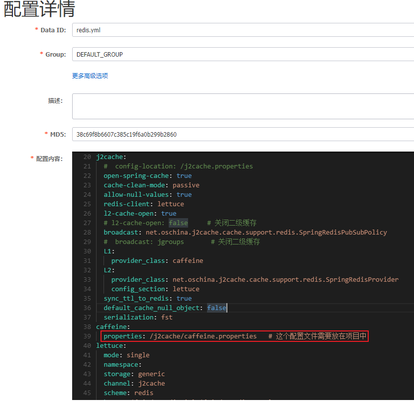

具体配置内容如下：

```yml
# ....省略其他配置
j2cache:
  #  config-location: /j2cache.properties
  open-spring-cache: true
  cache-clean-mode: passive
  allow-null-values: true
  redis-client: lettuce
  l2-cache-open: true
  # l2-cache-open: false     # 关闭二级缓存
  broadcast: net.oschina.j2cache.cache.support.redis.SpringRedisPubSubPolicy
  #  broadcast: jgroups       # 关闭二级缓存
  L1:
    provider_class: caffeine
  L2:
    provider_class: net.oschina.j2cache.cache.support.redis.SpringRedisProvider
    config_section: lettuce
  sync_ttl_to_redis: true
  default_cache_null_object: false
  serialization: fst
caffeine:
  properties: /j2cache/caffeine.properties   # 这个配置文件需要放在项目中
lettuce:
  mode: single
  namespace:
  storage: generic
  channel: j2cache
  scheme: redis
  hosts: ${pinda.redis.ip}:${pinda.redis.port}
  password: ${pinda.redis.password}
  database: ${pinda.redis.database}
  sentinelMasterId:
  maxTotal: 100
  maxIdle: 10
  minIdle: 10
  timeout: 10000
```

通过上面的配置可以看到，j2cache 缓存使用了 caffeine 并且指定了其配置文件的位置为 /j2cache/caffeine.properties，因此需要在该位置创建相应的配置文件，内容如下：

```properties
#########################################
# Caffeine configuration
# \u6682\u65F6\u6CA1\u7528
# [name] = size, xxxx[s|m|h|d]
#########################################
default=2000, 2h
captcha=1000, 5m
resource=2000, 2h
user_resource=3000, 2h
```

#### 1.1.4. 密钥文件

本项目中使用 RS256 非对称加密算法进行签名，这就需要使用 RSA 生成一对公钥和私钥。此处直接使用前面《pd-tools-jwt 模块》章节生成了一对公钥和私钥，其中pub.key为公钥，pri.key为私钥。将公私钥文件复制到项目的 resources/client 下

注意：此处因为在 Nacos 配置中心的 pd-auth-server.yml 中通过配置的形式已经指定了公私钥的位置和名称，如有需要也可以自行修改。

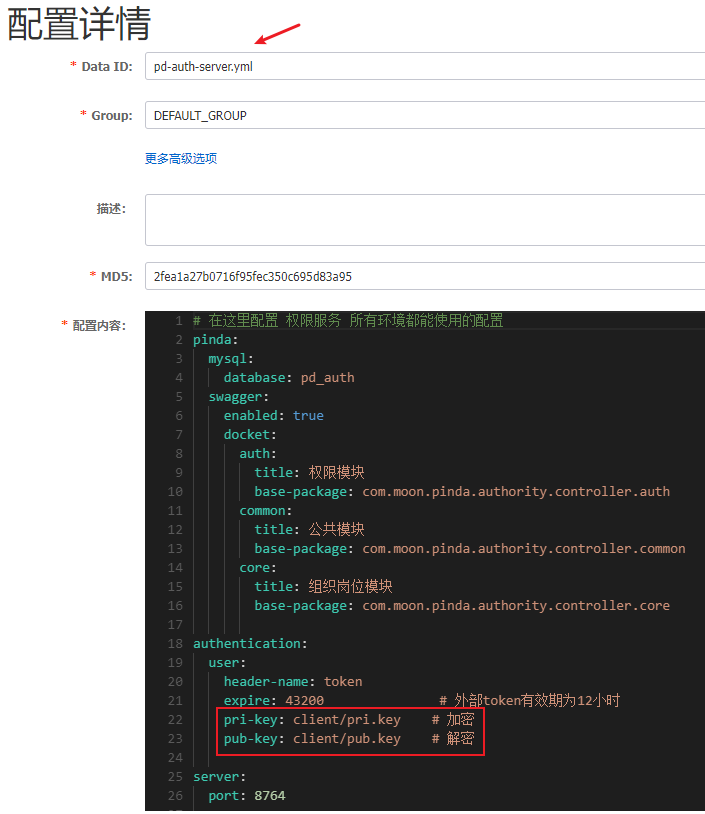

#### 1.1.5. spy.properties

spy.properties 是 p6spy 所需的属性文件。p6spy 是一个开源项目，通常使用它来跟踪数据库操作，查看程序运行过程中执行的 SQL 语句，还可以输出执行 SQL 语句消耗的时间。因为对数据库操作的追踪会比较消耗性能，所以只在开发阶段配置使用

在 Nacos 配置中心的 pd-auth-server-dev.yml 中进行了如下配置：

```yml
# p6spy是一个开源项目，通常使用它来跟踪数据库操作，查看程序运行过程中执行的sql语句
# 开发环境需要使用p6spy进行sql语句输出
# 但p6spy会有性能损耗，不适合在生产线使用，故其他环境无需配置
spring:
  datasource:
    driver-class-name: com.p6spy.engine.spy.P6SpyDriver
    url: jdbc:p6spy:mysql://${pinda.mysql.ip}:${pinda.mysql.port}/${pinda.mysql.database}?serverTimezone=CTT&characterEncoding=utf8&useUnicode=true&useSSL=false&autoReconnect=true&zeroDateTimeBehavior=convertToNull&allowMultiQueries=true
    db-type: mysql
```

> Tips: 以上的配置为了统一管理，都使用 `${}` 占位符的方式读取自定义变量，以上的变量是定义在 mysql.yml 配置文件中

配置后，在开发阶段使用的数据源其实就是 P6Spy 提供的数据源，这样就可以在控制台打印 SQL 执行的时间。spy.properties 配置文件内容如下：

```properties
module.log=com.p6spy.engine.logging.P6LogFactory,com.p6spy.engine.outage.P6OutageFactory
logMessageFormat=com.baomidou.mybatisplus.extension.p6spy.P6SpyLogger
appender=com.baomidou.mybatisplus.extension.p6spy.StdoutLogger
deregisterdrivers=true
useprefix=true
excludecategories=info,debug,result,commit,resultset
dateformat=yyyy-MM-dd HH:mm:ss
driverlist=com.mysql.cj.jdbc.Driver
outagedetection=true
outagedetectioninterval=2
```

#### 1.1.6. dozer 配置

在 resources 下创建 dozer 目录并提供 biz.dozer.xml 和 global.dozer.xml 文件，内容如下：

- biz.dozer.xml

```xml
<?xml version="1.0" encoding="UTF-8"?>
<mappings xmlns:xsi="http://www.w3.org/2001/XMLSchema-instance"
          xmlns="http://dozermapper.github.io/schema/bean-mapping"
          xsi:schemaLocation="http://dozermapper.github.io/schema/bean-mapping
                             http://dozermapper.github.io/schema/bean-mapping.xsd">
    <mapping date-format="yyyy-MM-dd HH:mm:ss">
        <class-a>com.moon.pinda.authority.entity.auth.Menu</class-a>
        <class-b>com.moon.pinda.authority.dto.auth.VueRouter</class-b>
        <field>
            <a>name</a>
            <b>meta.title</b>
        </field>
        <field>
            <a>name</a>
            <b>name</b>
        </field>
        <field>
            <a>icon</a>
            <b>meta.icon</b>
        </field>
    </mapping>
</mappings>
```

- global.dozer.xml

```xml
<?xml version="1.0" encoding="UTF-8"?>
<mappings xmlns:xsi="http://www.w3.org/2001/XMLSchema-instance"
          xmlns="http://dozermapper.github.io/schema/bean-mapping"
          xsi:schemaLocation="http://dozermapper.github.io/schema/bean-mapping http://dozermapper.github.io/schema/bean-mapping.xsd">
    <!-- 全局配置:
        <date-format> 表示日期格式
        <stop-on-errors> 错误处理开关
        <wildcard> 通配符
        <trim-strings> 裁剪字符串开关
     -->
    <configuration>
        <date-format>yyyy-MM-dd HH:mm:ss</date-format>
    </configuration>
</mappings>
```

### 1.2. 配置类

#### 1.2.1. 全局异常处理的配置类

此配置类只需要继承 pd-tools-common 模块所提供的 `DefaultGlobalExceptionHandler` 全局异常处理抽象类即可。以后如有特别处理的异常，在此配置类中新增或者重写相应的方法即可。

```java
package com.moon.pinda.authority.config;

import com.moon.pinda.common.handler.DefaultGlobalExceptionHandler;
import org.springframework.context.annotation.Configuration;
import org.springframework.stereotype.Controller;
import org.springframework.web.bind.annotation.RestController;
import org.springframework.web.bind.annotation.RestControllerAdvice;

/**
 * 权限服务中使用的全局异常处理配置类
 */
@Configuration
@RestControllerAdvice(annotations = {RestController.class, Controller.class})
public class ExceptionConfiguration extends DefaultGlobalExceptionHandler {
}
```

#### 1.2.2. 公共基础的配置类

此配置类只需要继承 pd-tools-common 模块所提供的 `BaseConfig` 基础抽象类即可。以后如有个性化配置，在此配置类中新增或者重写相应的方法即可。

```java
package com.moon.pinda.authority.config;

import com.moon.pinda.common.config.BaseConfig;
import org.springframework.context.annotation.Configuration;

/**
 * 公共基础配置
 */
@Configuration
public class AuthorityWebConfiguration extends BaseConfig {
}
```

#### 1.2.3. 数据库相关的配置类

此配置类需要继承 pd-tools-common 模块所提供的 `BaseDatabaseConfiguration` 基础抽象类。此配置类主要配置了数据源、`SqlSessionFactory`、`SqlSessionTemplate` 等。

```java
package com.moon.pinda.authority.config;

import cn.hutool.core.util.ArrayUtil;
import com.alibaba.druid.spring.boot.autoconfigure.DruidDataSourceBuilder;
import com.baomidou.mybatisplus.autoconfigure.ConfigurationCustomizer;
import com.baomidou.mybatisplus.autoconfigure.MybatisPlusProperties;
import com.baomidou.mybatisplus.autoconfigure.MybatisPlusPropertiesCustomizer;
import com.moon.pinda.database.datasource.BaseDatabaseConfiguration;
import com.moon.pinda.database.properties.DatabaseProperties;
import com.p6spy.engine.spy.P6DataSource;
import lombok.extern.slf4j.Slf4j;
import org.apache.ibatis.mapping.DatabaseIdProvider;
import org.apache.ibatis.plugin.Interceptor;
import org.apache.ibatis.scripting.LanguageDriver;
import org.apache.ibatis.session.ExecutorType;
import org.apache.ibatis.session.SqlSessionFactory;
import org.apache.ibatis.type.TypeHandler;
import org.mybatis.spring.SqlSessionTemplate;
import org.mybatis.spring.annotation.MapperScan;
import org.springframework.aop.Advisor;
import org.springframework.beans.factory.ObjectProvider;
import org.springframework.beans.factory.annotation.Qualifier;
import org.springframework.boot.context.properties.ConfigurationProperties;
import org.springframework.boot.context.properties.EnableConfigurationProperties;
import org.springframework.context.ApplicationContext;
import org.springframework.context.annotation.Bean;
import org.springframework.context.annotation.Configuration;
import org.springframework.core.io.ResourceLoader;
import org.springframework.jdbc.datasource.DataSourceTransactionManager;
import org.springframework.stereotype.Repository;
import org.springframework.transaction.PlatformTransactionManager;
import org.springframework.transaction.interceptor.TransactionInterceptor;

import javax.sql.DataSource;
import java.util.List;

/**
 * 数据库相关的配置
 */
@Configuration
@Slf4j
// mybatis mapper 扫描
@MapperScan(
        basePackages = {"com.moon.pinda",},
        annotationClass = Repository.class,
        sqlSessionFactoryRef = AuthorityDatabaseAutoConfiguration.DATABASE_PREFIX + "SqlSessionFactory")
@EnableConfigurationProperties({MybatisPlusProperties.class, DatabaseProperties.class}) // 引入配置属性映射类
public class AuthorityDatabaseAutoConfiguration extends BaseDatabaseConfiguration {
    /**
     * 每个数据源配置不同即可
     */
    final static String DATABASE_PREFIX = "master";

    public AuthorityDatabaseAutoConfiguration(MybatisPlusProperties properties,
                                              DatabaseProperties databaseProperties,
                                              ObjectProvider<Interceptor[]> interceptorsProvider,
                                              ObjectProvider<TypeHandler[]> typeHandlersProvider,
                                              ObjectProvider<LanguageDriver[]> languageDriversProvider,
                                              ResourceLoader resourceLoader,
                                              ObjectProvider<DatabaseIdProvider> databaseIdProvider,
                                              ObjectProvider<List<ConfigurationCustomizer>> configurationCustomizersProvider,
                                              ObjectProvider<List<MybatisPlusPropertiesCustomizer>> mybatisPlusPropertiesCustomizerProvider,
                                              ApplicationContext applicationContext) {
        super(properties, databaseProperties, interceptorsProvider, typeHandlersProvider,
                languageDriversProvider, resourceLoader, databaseIdProvider,
                configurationCustomizersProvider, mybatisPlusPropertiesCustomizerProvider, applicationContext);
    }

    @Bean(DATABASE_PREFIX + "SqlSessionTemplate")
    public SqlSessionTemplate getSqlSessionTemplate(@Qualifier(DATABASE_PREFIX + "SqlSessionFactory") SqlSessionFactory sqlSessionFactory) {
        ExecutorType executorType = this.properties.getExecutorType();
        if (executorType != null) {
            return new SqlSessionTemplate(sqlSessionFactory, executorType);
        } else {
            return new SqlSessionTemplate(sqlSessionFactory);
        }
    }

    /**
     * 数据源信息
     *
     * @return
     */
    @Bean(name = DATABASE_PREFIX + "DruidDataSource")
    @ConfigurationProperties(prefix = "spring.datasource.druid")
    public DataSource druidDataSource() {
        return DruidDataSourceBuilder.create().build();
    }

    @Bean(name = DATABASE_PREFIX + "DataSource")
    public DataSource dataSource(@Qualifier(DATABASE_PREFIX + "DruidDataSource") DataSource dataSource) {
        // 判断配置文件中的 ${spring.profiles.active} 属性是否为 dev
        if (ArrayUtil.contains(DEV_PROFILES, this.profiles)) {
            // 开发环境，则返回 P6DataSource 对象
            return new P6DataSource(dataSource);
        } else {
            // 非开发环境，直接返回
            return dataSource;
        }
    }

    /**
     * mybatis Sql Session 工厂
     *
     * @return
     * @throws Exception
     */
    @Bean(DATABASE_PREFIX + "SqlSessionFactory")
    public SqlSessionFactory getSqlSessionFactory(@Qualifier(DATABASE_PREFIX + "DataSource") DataSource dataSource) throws Exception {
        return super.sqlSessionFactory(dataSource);
    }

    /**
     * 数据源事务管理器
     *
     * @return
     */
    @Bean(name = DATABASE_PREFIX + "TransactionManager")
    public DataSourceTransactionManager dsTransactionManager(@Qualifier(DATABASE_PREFIX + "DataSource") DataSource dataSource) {
        return new DataSourceTransactionManager(dataSource);
    }

    /**
     * 事务拦截器
     *
     * @param transactionManager
     * @return
     */
    @Bean(DATABASE_PREFIX + "TransactionInterceptor")
    public TransactionInterceptor transactionInterceptor(@Qualifier(DATABASE_PREFIX + "TransactionManager") PlatformTransactionManager transactionManager) {
        return new TransactionInterceptor(transactionManager, this.transactionAttributeSource());
    }

    /**
     * 事务 Advisor
     *
     * @param transactionManager
     * @return
     */
    @Bean(DATABASE_PREFIX + "Advisor")
    public Advisor getAdvisor(@Qualifier(DATABASE_PREFIX + "TransactionManager") PlatformTransactionManager transactionManager, @Qualifier(DATABASE_PREFIX + "TransactionInterceptor") TransactionInterceptor ti) {
        return super.txAdviceAdvisor(ti);
    }

}
```

#### 1.2.4. mybatis 框架相关的配置类

此配置类只需要继承 pd-tools-common 模块所提供的 `BaseMybatisConfiguration` 基础抽象类即可。以后如有个性化配置，在此配置类中新增或者重写相应的方法即可。

```java
package com.moon.pinda.authority.config;

import com.moon.pinda.database.datasource.BaseMybatisConfiguration;
import com.moon.pinda.database.properties.DatabaseProperties;
import org.springframework.context.annotation.Configuration;

/**
 * 和 mybatis 框架相关的配置
 */
@Configuration
public class AuthorityMybatisAutoConfiguration extends BaseMybatisConfiguration {
    public AuthorityMybatisAutoConfiguration(DatabaseProperties databaseProperties) {
        super(databaseProperties);
    }
}
```

> Tips: 其中 `DatabaseProperties` 是配置属性映射类，在前面的 `AuthorityDatabaseAutoConfiguration` 配置类中引入，读取 nacos 配置中心 mysql.yml 的配置

### 1.3. 启动类

```java
package com.moon.pinda;

import com.moon.pinda.auth.server.EnableAuthServer;
import com.moon.pinda.user.annotation.EnableLoginArgResolver;
import com.moon.pinda.validator.config.EnableFormValidator;
import lombok.extern.slf4j.Slf4j;
import org.springframework.boot.SpringApplication;
import org.springframework.boot.autoconfigure.SpringBootApplication;
import org.springframework.cloud.client.discovery.EnableDiscoveryClient;
import org.springframework.cloud.openfeign.EnableFeignClients;
import org.springframework.context.ConfigurableApplicationContext;
import org.springframework.context.annotation.EnableAspectJAutoProxy;
import org.springframework.core.env.ConfigurableEnvironment;

import java.net.InetAddress;
import java.net.UnknownHostException;

/**
 * 权限服务启动类
 */
@Slf4j
@SpringBootApplication
@EnableDiscoveryClient // 开启注册中心客户端
@EnableAuthServer // pd-tools-jwt 模块，启用认证服务的服务端配置
@EnableFeignClients(value = {"com.moon.pinda"}) // 开启 feign 客户端
@EnableAspectJAutoProxy(proxyTargetClass = true, exposeProxy = true)
@EnableLoginArgResolver // pd-tools-user 模块，开启自动登录用户对象注入，将 Token 转化 SysUser 对象
@EnableFormValidator // pd-tools-validator 模块，启动表单验证功能
public class AuthorityApplication {
    public static void main(String[] args) throws UnknownHostException {
        ConfigurableApplicationContext context = SpringApplication.run(AuthorityApplication.class, args);
        // 获取环境对象
        ConfigurableEnvironment environment = context.getEnvironment();
        // 读取相关的配置
        String appName = environment.getProperty("spring.application.name");
        String port = environment.getProperty("server.port");
        String hostAddress = InetAddress.getLocalHost().getHostAddress();

        // 启动完成后在控制台提示项目启动成功，并且输出当前服务对应的swagger接口文档访问地址
        log.info("应用 {} 启动成功!swagger 文档地址：http://{}:{}/doc.html", appName, hostAddress, port);
    }
}
```

运行启动类main方法，启动项目。值得注意的是，项目依赖 nacos 配置中心与 reids，因此需要先启动 nacos 服务与 redis 服务

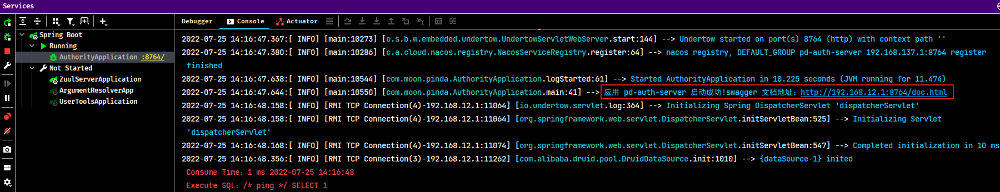

## 2. 登陆认证功能

### 2.1. easy-captcha

easy-captcha 是生成图形验证码的 Java 类库，支持 gif、中文、算术等类型，可用于 Java Web、JavaSE 等项目。效果展示：


**算术类型：**


**中文类型：**


**内置字体：**


---

> 项目仓库地址：
>
> - ~~原仓库：https://gitee.com/whvse/EasyCaptcha~~
> - gitee：https://gitee.com/ele-admin/EasyCaptcha
> - github：https://github.com/pig-mesh/easy-captcha

#### 2.1.1. 导入项目

- gradle 方式的引入

```java
dependencies {
    compile 'com.github.whvcse:easy-captcha:1.6.2'
}
```

- maven 方式引入

```java
<dependencies>
   <dependency>
      <groupId>com.github.whvcse</groupId>
      <artifactId>easy-captcha</artifactId>
      <version>1.6.2</version>
   </dependency>
</dependencies>
```

- jar 包方式引入。下载相应的 jar 包项目项目根目录 libs 文件夹下，然后 pom.xml 添加如下：

```java
<dependency>
    <groupId>com.github.whvcse</groupId>
    <artifactId>easy-captcha</artifactId>
    <version>1.6.1</version>
    <systemPath>${basedir}/libs/easy-captcha-1.6.2.jar</systemPath>
</dependency>
```

#### 2.1.2. 基础使用示例

创建 maven 工程 easy-captcha-demo 并配置 pom.xml 文件引入其依赖

```xml
<dependencies>
    <dependency>
        <groupId>com.github.whvcse</groupId>
        <artifactId>easy-captcha</artifactId>
        <version>1.6.2</version>
    </dependency>

    <dependency>
        <groupId>junit</groupId>
        <artifactId>junit</artifactId>
        <version>4.12</version>
        <scope>test</scope>
    </dependency>
</dependencies>
```

测试生成中文的验证码图片

```java
@Test
public void testChineseCaptcha() throws FileNotFoundException {
    // 获取中文验证码对象，可以指定图片的长与宽
    Captcha captcha = new ChineseCaptcha(150, 60);
    // 获取本次生成的验证码
    System.out.println("生成中文验证码：" + captcha.text());
    // 获取成验证码图片
    captcha.out(new FileOutputStream(new File(("E:\\ChineseCaptcha.png"))));
}
```

测试生成算术的验证码图片

```java
 @Test
public void testArithmeticCaptcha() throws FileNotFoundException {
    // 获取算术验证码对象，可以在构造方法中指定图片的长与宽
    Captcha captcha = new ArithmeticCaptcha();
    // 获取本次生成的验证码
    System.out.println("生成算术验证码：" + captcha.text());
    // 获取成验证码图片
    captcha.out(new FileOutputStream(new File(("E:\\ArithmeticCaptcha.png"))));
}
```

### 2.2. 生成验证码功能接口

> Notes: 创建相应的控制器所在的包名称需要与 nacos 配置中心中所配置的一致

- 创建验证码服务接口 `ValidateCodeService`，并定义生成验证码图片方法

```java
public interface ValidateCodeService {

    /**
     * 生成验证码
     *
     * @param key      验证码 uuid
     * @param response HttpServletResponse
     * @throws IOException
     */
    void create(String key, HttpServletResponse response) throws IOException;
}
```

- 创建验证码服务接口实现类 `ValidateCodeServiceImpl`

```java
@Service
public class ValidateCodeServiceImpl implements ValidateCodeService {

    @Autowired
    private CacheChannel cache;

    /**
     * 生成验证码，并使用 j2cache 缓存验证码
     *
     * @param key      验证码 uuid
     * @param response HttpServletResponse
     * @throws IOException
     */
    @Override
    public void create(String key, HttpServletResponse response) throws IOException {
        // 校验
        if (StringUtils.isBlank(key)) {
            throw BizException.validFail("验证码key不能为空");
        }

        // 设置响应的类型
        response.setContentType(MediaType.IMAGE_PNG_VALUE);
        // 设置响应头，防止浏览器缓存
        response.setHeader(HttpHeaders.PRAGMA, "No-cache");
        response.setHeader(HttpHeaders.CACHE_CONTROL, "No-cache");
        response.setDateHeader(HttpHeaders.EXPIRES, 0L);

        // 生成算术验证码对象
        Captcha captcha = new ArithmeticCaptcha(115, 42);
        captcha.setCharType(2);

        // 设置缓存的区域、key、缓存的相应验证码的值
        cache.set(CacheKey.CAPTCHA, key, StringUtils.lowerCase(captcha.text()));
        // 使用输出流将图片响应给前端页面
        captcha.out(response.getOutputStream());
    }
}
```

- 创建 `LoginController` 调用验证码服务接口的生成验证码图片方法

```java
@RestController
@RequestMapping("/anno")
@Api(tags = "登录控制器", value = "LoginController")
public class LoginController extends BaseController {

    @Autowired
    private ValidateCodeService validateCodeService;

    /**
     * 生成验证码
     *
     * @param key
     * @param response
     * @throws IOException
     */
    @GetMapping(value = "/captcha", produces = "image/png")
    @ApiOperation(notes = "验证码", value = "验证码")
    public void captcha(@RequestParam(value = "key") String key, HttpServletResponse response) throws IOException {
        validateCodeService.create(key, response);
    }
}
```

验证码接口开发完成后启动服务，通过接口文档进行测试，选择“权限模块”进行调试

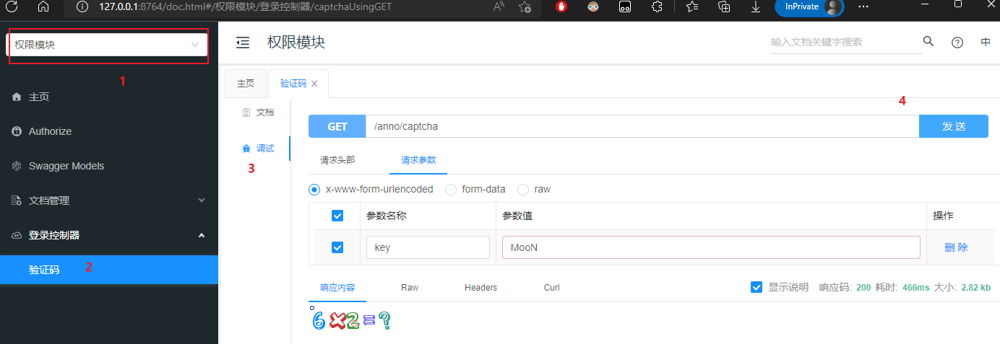

可以看到验证码应该缓存到 redis

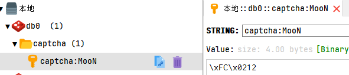

### 2.3. 验证码校验功能接口

在 `ValidateCodeService` 接口中扩展 `check` 方法完成校验验证码

```java
/**
 * 校验验证码
 *
 * @param key   前端上送 key
 * @param value 前端上送待校验值
 */
boolean check(String key, String value);
```

实现校验验证码方法

```java
@Override
public boolean check(String key, String value) {
    // 校验
    if (StringUtils.isBlank(key)) {
        throw BizException.validFail("请输入验证码");
    }

    // 根据 key 从缓存中获取验证码
    CacheObject cacheObject = cache.get(CacheKey.CAPTCHA, key);
    Object captcha = cacheObject.getValue();
    // 缓存中无值，则代表 key 已过期
    if (captcha == null) {
        throw BizException.validFail("验证码已过期");
    }

    // 比较是否一致
    if (!StringUtils.equalsIgnoreCase(value, String.valueOf(captcha))) {
        throw BizException.validFail("验证码不正确");
    }

    // TODO: 目前是验证通过，立即从缓存中删除验证码。待优化，其实不合理
    cache.evict(CacheKey.CAPTCHA, key);
    return true;
}
```

在 `LoginController` 控制类中增加校验验证码的方法（注：此方法只用于测试）

```java
@PostMapping("/check")
@ApiOperation(notes = "校验验证码", value = "校验验证码")
public boolean check(@RequestBody LoginParamDTO loginParamDTO) {
    // 校验验证码是否正确
    return validateCodeService.check(loginParamDTO.getKey(), loginParamDTO.getCode());
}
```

测试

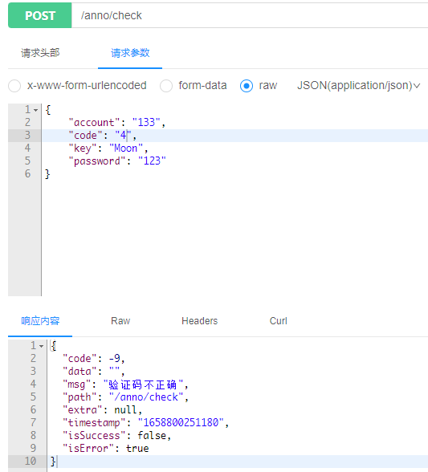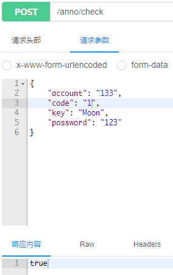

### 2.4. 用户服务接口

因为登陆认证的处理逻辑涉及对用户的信息进行查询与校验，因此需要创建一套用户服务的相关业务接口。

- 创建 `UserMapper` 接口，继承 Mybatis-plus 提供的 `BaseMapper` 接口

```java
@Repository
public interface UserMapper extends BaseMapper<User> {
}
```

> Notes: 此接口需要标识 `@Repository` 注解，因为在 `AuthorityDatabaseAutoConfiguration` 配置类中的 `@MapperScan` 注解配置只扫描有 `@Repository` 注解的 Mapper 接口

- 创建 `UserService` 业务接口，继承 Mybatis-plus 提供的 `IService` 接口

```java
public interface UserService extends IService<User> {
}
```

- 创建 `UserServiceImpl` 实现类，继承 Mybatis-plus 提供的 `ServiceImpl` 实现类

```java
@Service
public class UserServiceImpl extends ServiceImpl<UserMapper, User> implements UserService {
}
```

### 2.5. 用户登陆接口

#### 2.5.1. 认证管理器

- 创建认证管理器接口 `AuthManager`，定义登陆与密码校验方法

```java
public interface AuthManager {

    /**
     * 账户认证
     *
     * @param account
     * @param password
     * @return
     */
    LoginDTO login(String account, String password);

    /**
     * 校验账户与密码，通过后用户对象
     *
     * @param account
     * @param password
     * @return
     */
    User check(String account, String password);
}
```

- 创建认证管理器实现 `AuthManagerImpl`。目前只完成账户密码的校验

```java
@Service
public class AuthManagerImpl implements AuthManager {

    @Autowired
    private UserService userService;
    @Autowired
    private DozerUtils dozerUtils;

    /**
     * 账户认证
     *
     * @param account
     * @param password
     * @return
     */
    @Override
    public LoginDTO login(String account, String password) {
        // 校验账号、密码是否正确。注：只要通过校验，返回的用户对象都不为空
        User user = check(account, password);

        // 使用 dozer 工具将 DO 转 DTO，返回结果
        return LoginDTO.builder()
                .user(dozerUtils.map(user, UserDTO.class))
                .token(token)
                .build();
    }

    /**
     * 校验账户与密码，通过后用户对象
     *
     * @param account
     * @param password
     * @return
     */
    @Override
    public User check(String account, String password) {
        // 根据账号查询
        User user = userService.getOne(Wrappers.<User>lambdaQuery().eq(User::getAccount, account));

        // 将前端提交的密码进行md5加密
        String md5Hex = DigestUtils.md5Hex(password);

        if (user == null || !user.getPassword().equals(md5Hex)) {
            // 如果用户为空，或者密码不一致，则认证失败
            throw BizException.validFail(ExceptionCode.JWT_USER_INVALID.getMsg());
        }
        // 认证成功，返回用户对象
        return user;
    }
}
```

#### 2.5.2. 用户登陆方法

在 `LoginController` 中创建 `login` 登陆方法，调用认证管理器的认证接口即可

```java
@Autowired
private AuthManager authManager;

@PostMapping("/login")
@ApiOperation(notes = "用户登录", value = "用户登录")
public R<LoginDTO> login(@Validated @RequestBody LoginParamDTO loginParamDTO) {
    // 校验验证码是否正确
    boolean check = validateCodeService.check(loginParamDTO.getKey(), loginParamDTO.getCode());
    // 验证码校验不通过，直接返回
    if (!check) {
        throw BizException.validFail("请输入正常的验证码");
    }
    // 验证码校验通过，执行具体的登录认证逻辑
    LoginDTO dto = authManager.login(loginParamDTO.getAccount(), loginParamDTO.getPassword());
    return this.success(dto);
}
```

#### 2.5.3. 测试

使用 postman 进行测试，先请求获取验证码接口，再请求登陆接口进行测试

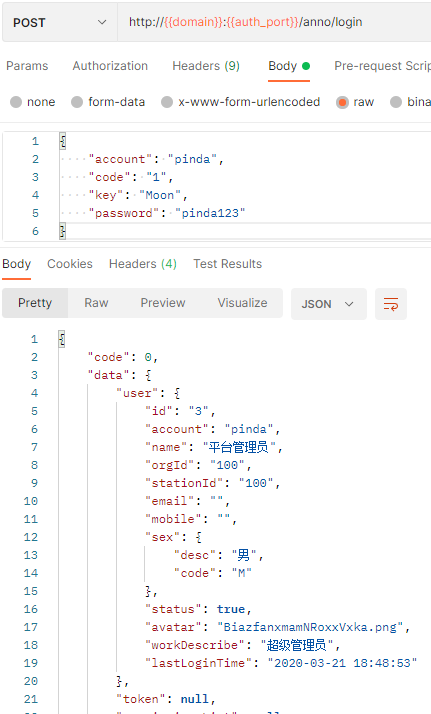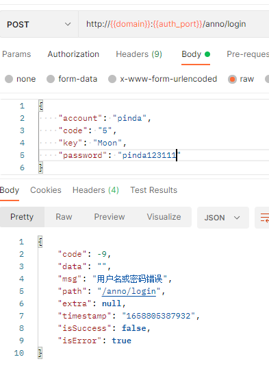

### 2.6. 登陆生成 token

在认证管理器接口 `AuthManager` 定义生成 token 的方法

```java
/**
 * 为用户生成对应的jwt令牌
 *
 * @param user 用户实例
 * @return
 */
Token generateUserToken(User user);
```

在 `AuthManagerImpl` 类中注入 pd-tools-jwt 模块的 jwt token 工具 `JwtTokenServerUtils`，生成 token 并返回
  
```java
@Autowired
private JwtTokenServerUtils jwtTokenServerUtils;

@Override
public LoginDTO login(String account, String password) {
    // 校验账号、密码是否正确。注：只要通过校验，返回的用户对象都不为空
    User user = check(account, password);
    // 根据用户生成 Token
    Token token = generateUserToken(user);

    // 使用 dozer 工具将 DO 转 DTO，返回结果
    return LoginDTO.builder()
            .user(dozerUtils.map(user, UserDTO.class))
            .token(token)
            .build();
}

@Override
public Token generateUserToken(User user) {
    // 创建 jwt 存储的内容
    JwtUserInfo jwtUserInfo = new JwtUserInfo();
    jwtUserInfo.setUserId(user.getId());
    jwtUserInfo.setAccount(user.getAccount());
    jwtUserInfo.setName(user.getName());
    jwtUserInfo.setOrgId(user.getOrgId());
    jwtUserInfo.setStationId(user.getStationId());
    // 生成 Token 并返回
    return jwtTokenServerUtils.generateUserToken(jwtUserInfo, null);
}
```

请求登陆测试，成功返回 token

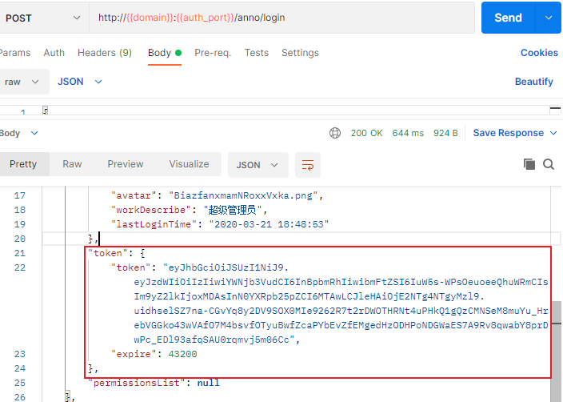

### 2.7. 用户权限列表

#### 2.7.1. 获取用户权限列表接口

因为登陆认证的处理逻辑涉及对用户的权限进行查询后缓存并返回给前端，因此需要创建一套权限服务的相关业务接口。

- 创建 `ResourceMapper` 接口，继承 Mybatis-plus 提供的 `BaseMapper` 接口。因为权限需要连表查询，所以需要在接口中定义一个查询方法

```java
@Repository
public interface ResourceMapper extends BaseMapper<Resource> {
    /**
     * 查询指定用户拥有的资源权限
     *
     * @param resource
     * @return
     */
    List<Resource> findVisibleResource(ResourceQueryDTO resource);
}
```

> Notes: 同样此接口需要标识 `@Repository` 注解才被 Mybatis 扫描

- 在创建 resources/mapper_authority/base/auth 目录，在此目录中创建 ResourceMapper.xml 映射文件，定义 `findVisibleResource` 映射的方法

```xml
<?xml version="1.0" encoding="UTF-8" ?>
<!DOCTYPE mapper PUBLIC "-//mybatis.org//DTD Mapper 3.0//EN" "http://mybatis.org/dtd/mybatis-3-mapper.dtd">
<mapper namespace="com.moon.pinda.authority.biz.dao.auth.ResourceMapper">
    <!-- 通用查询映射结果 -->
    <resultMap id="BaseResultMap" type="com.moon.pinda.authority.entity.auth.Resource">
        <id column="id" jdbcType="BIGINT" property="id"/>
        <result column="create_user" jdbcType="BIGINT" property="createUser"/>
        <result column="create_time" jdbcType="TIMESTAMP" property="createTime"/>
        <result column="update_user" jdbcType="BIGINT" property="updateUser"/>
        <result column="update_time" jdbcType="TIMESTAMP" property="updateTime"/>
        <result column="code" jdbcType="VARCHAR" property="code"/>
        <result column="name" jdbcType="VARCHAR" property="name"/>
        <result column="menu_id" jdbcType="BIGINT" property="menuId"/>
        <result column="describe_" jdbcType="VARCHAR" property="describe"/>
        <result column="method" jdbcType="VARCHAR" property="method"/>
        <result column="url" jdbcType="VARCHAR" property="url"/>
    </resultMap>

    <!-- 通用查询结果列 -->
    <sql id="Base_Column_List">
        `id`, `create_user`, `create_time`, `update_user`, `update_time`,
        `code`, `name`, `menu_id`, `describe_`, `method`, `url`
    </sql>

    <!-- 查询指定用户拥有的资源权限 -->
    <select id="findVisibleResource" parameterType="com.moon.pinda.authority.biz.dao.auth.ResourceMapper" resultMap="BaseResultMap">
        SELECT
            <include refid="Base_Column_List"/>
        from
            pd_auth_resource
        where
            id in (
                SELECT authority_id FROM pd_auth_role_authority ra
                    INNER JOIN pd_auth_user_role ur on ra.role_id = ur.role_id
                    INNER JOIN pd_auth_role r on r.id = ra.role_id
                where ur.user_id = #{userId, jdbcType=BIGINT} and r.`status` = true and ra.authority_type = 'RESOURCE'
            )
    </select>
</mapper>
```

> Notes: *后面会统一将所有相关有 mapper 映射文件拆分成两部分，base目录下的是一个公共的定义，而真正的sql语句映射部分是放到 ext 目录中*

- 创建 `ResourceService` 业务接口，继承 Mybatis-plus 提供的 `IService` 接口

```java
public interface ResourceService extends IService<Resource> {
    /**
     * 查询资源权限
     *
     * @param resource
     * @return
     */
    List<Resource> findVisibleResource(ResourceQueryDTO resource);
}
```

- 创建 `ResourceServiceImpl` 实现类，继承 Mybatis-plus 提供的 `ServiceImpl` 实现类

```java
@Service
public class ResourceServiceImpl extends ServiceImpl<ResourceMapper, Resource> implements ResourceService {

    @Override
    public List<Resource> findVisibleResource(ResourceQueryDTO resource) {
        // 查询当前用户可访问的资源
        return baseMapper.findVisibleResource(resource);
    }
}
```

#### 2.7.2. 登陆成功后对权限列表处理

修改 `AuthManagerImpl` 类中的 `login` 方法，在登陆成功后，调用资源业务接口获取当前用户的权限列表，然后将供后端网关使用的用户对应的权限进行缓存，并返回供前端页面使用的权限列表数据

```java
@Autowired
private ResourceService resourceService;
@Autowired
private CacheChannel cache;

@Override
public LoginDTO login(String account, String password) {
    // 校验账号、密码是否正确。注：只要通过校验，返回的用户对象都不为空
    User user = check(account, password);
    // 根据用户生成 Token
    Token token = generateUserToken(user);

    // 查询当前用户可以访问的资源权限
    ResourceQueryDTO resourceQueryDTO = ResourceQueryDTO.builder().userId(user.getId()).build();
    List<Resource> userResources = resourceService.findVisibleResource(resourceQueryDTO);

    // 定义返回前端页面的权限集合
    List<String> permissionList = Collections.emptyList();

    if (!CollectionUtils.isEmpty(userResources)) {
        // 将用户对应的权限列表转换成供前端页面使用的格式
        permissionList = userResources.stream().map(Resource::getCode).collect(Collectors.toList());

        // 将用户对应的权限列表转换成供后端网关使用的格式，并缓存
        List<String> gwResources = userResources.stream()
                .map(resource -> resource.getMethod() + resource.getUrl())
                .collect(Collectors.toList());
        // 缓存数据
        cache.set(CacheKey.USER_RESOURCE, user.getId().toString(), gwResources);
    }

    // 使用 dozer 工具将 DO 转 DTO，返回结果
    return LoginDTO.builder()
            .user(dozerUtils.map(user, UserDTO.class))
            .token(token)
            .permissionsList(permissionList)
            .build();
}
```

#### 2.7.3. 测试

使用 postman 进行测试，先请求获取验证码接口，再请求登陆接口进行测试，观察是否成功返回权限列表 `permissionsList`

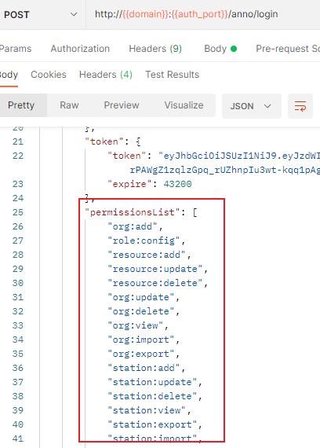

## 3. 操作日志功能

### 3.1. 日志持久层接口

创建 `OptLogMapper` 接口，继承 Mybatis-plus 提供的 `BaseMapper` 接口

```java
@Repository
public interface OptLogMapper extends BaseMapper<OptLog> {
}
```

> Notes: 同样此接口需要标识 `@Repository` 注解才被 Mybatis 扫描

### 3.2. 日志业务层接口

- 创建 `OptLogService` 业务接口，继承 Mybatis-plus 提供的 `IService` 接口，定义保存日志的方法

```java
public interface OptLogService extends IService<OptLog> {
    /**
     * 保存操作日志。
     * 注：与 Mybatis-plus 提供的 save 方法的形参不一样
     */
    boolean save(OptLogDTO entity);
}
```

- 创建 `OptLogServiceImpl` 实现类，继承 Mybatis-plus 提供的 `ServiceImpl` 实现类

```java
@Service
public class OptLogServiceImpl extends ServiceImpl<OptLogMapper, OptLog> implements OptLogService {

    @Autowired
    DozerUtils dozerUtils;

    @Override
    public boolean save(OptLogDTO entity) {
        return super.save(dozerUtils.map(entity, OptLog.class));
    }
}
```

### 3.3. 日志配置类

> 此配置可以参考前面《pd-tools-log 模块》章节中配置

```java
@EnableAsync // 开启异步支持
@Configuration
public class SysLogConfiguration {
    // 创建日志记录监听器对象
    @Bean
    public SysLogListener sysLogListener(OptLogService optLogService) {
        // Consumer<OptLogDTO> consumer = (optLog) -> optLogService.save(optLog);
        return new SysLogListener(optLogService::save);
    }
}
```

### 3.4. 测试

在需要记录日志的 Controller 的方法上加入 `@SysLog` 注解，然后请求对相应接口，测试是否操作日志是否能插入到 pd_common_opt_log 日志表中

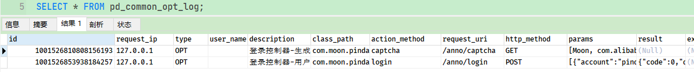

## 4. auth 服务工程其他功能代码

本次学习项目的笔记侧重点在于基础组件的构建以及认证和鉴权的开发实现，对于基础的数据维护暂不做笔记记录。可以直接查阅项目代码，其他功能的代码包括：

1. 岗位数据维护（CRUD）
2. 组织数据维护（CRUD）
3. 菜单数据维护（CRUD）
4. 角色数据维护（CRUD）
5. 用户数据维护（CRUD）
6. 用户登录日志维护（CRD）

> Notes: 以上的功能模块均在 pd-auth-server 工程中
